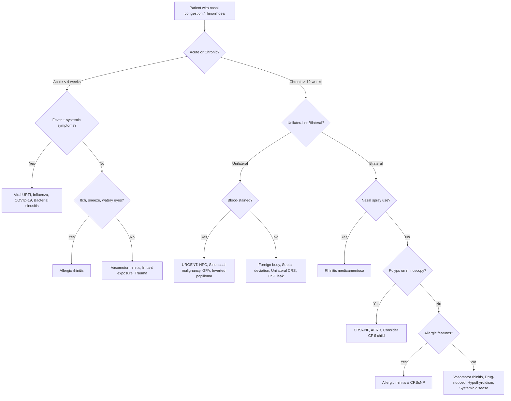

## Differential Diagnosis of Nasal Congestion and Runny Nose

When a patient walks in with a blocked, runny nose, the temptation is to dismiss it as "just a cold." But the differential diagnosis is surprisingly broad, and missing a sinister cause — particularly in the Hong Kong population — can have devastating consequences. The structured approach below follows **Murtagh's Diagnostic Strategy** framework, which is an excellent way to organise differentials for any symptom [4].

The key principle: think systematically along **anatomical site** (where is the problem?), **pathological process** (what is the process — infection, allergy, vasomotor, structural, neoplastic, systemic?), and **temporal pattern** (acute vs. chronic).

---

### 1. Murtagh's Diagnostic Strategy for Nasal Drip / Rhinorrhoea

This is **directly from the lecture slides** and forms the backbone of the differential [4]:

#### A. Probability Diagnosis (Common, Everyday Causes)

These account for the vast majority of presentations:

| Diagnosis | Why It Causes Nasal Congestion/Rhinorrhoea |
|---|---|
| ***Upper respiratory tract infection especially common cold*** [4] | Viral infection of nasal mucosa → cytokine release (bradykinin, IL-8) → vasodilatation of turbinate venous sinusoids (congestion) + parasympathetic reflex glandular secretion (watery rhinorrhoea) + increased vascular permeability (plasma exudation). ***Most common type of URTI, > 200 subtypes including rhinovirus (30–50%)*** [1] |
| ***Rhinitis: acute infective, allergic, vasomotor*** [4] | **Acute infective**: same mechanism as above. **Allergic**: Type I hypersensitivity — mast cell degranulation releases histamine → H1-mediated vasodilatation, oedema, glandular secretion, and sensory nerve stimulation (itch, sneeze). **Vasomotor**: parasympathetic dominance → glandular hypersecretion and vasodilatation without an allergic trigger |
| ***Vasomotor stimulation e.g. cold wind, smoke, irritants*** [4] | Non-specific trigeminal sensory nerve stimulation → parasympathetic reflex via pterygopalatine ganglion → acetylcholine release at submucosal glands and venous sinusoids → rhinorrhoea and congestion. No IgE involvement — this is a neural reflex, not an immune response |
| ***Sinusitis → post-nasal drip*** [4] | Mucosal inflammation and ostial obstruction → mucus stasis within sinuses → mucopurulent secretions drain posteriorly into the nasopharynx → post-nasal drip sensation, throat clearing, chronic cough. ***Symptoms include nasal congestion, blockage, discharge, loss of smell + facial pain or pressure (worse with bending over)*** [1] |
| ***Senile rhinorrhoea*** [4] | Age-related autonomic dysregulation → parasympathetic hyperactivity → excessive watery nasal secretion, classically triggered by eating (gustatory rhinitis). Also: nasal mucosal atrophy → impaired mucociliary clearance |

<Callout title="The 'Big Five' Common Causes">
If you're in a primary care or ED setting and a patient has nasal congestion/rhinorrhoea, statistically > 90% of the time it will be one of: (1) common cold, (2) allergic rhinitis, (3) vasomotor rhinitis, (4) acute sinusitis, or (5) senile rhinitis in the elderly. But you MUST screen for the serious causes below.
</Callout>

#### B. Serious Disorders Not to Be Missed

These are uncommon but carry high morbidity/mortality if undiagnosed:

| Diagnosis | Why It Causes Nasal Symptoms | Key Distinguishing Features |
|---|---|---|
| ***Cluster headache*** [4] | ***Ipsilateral autonomic features including lacrimation, nasal congestion, conjunctival injection, Horner's syndrome (~30–50%)*** [10][11]. The trigeminal-autonomic reflex is activated during attacks: trigeminal nerve pain afferents cross-activate the superior salivatory nucleus → parasympathetic outflow via CN VII → pterygopalatine ganglion → ipsilateral nasal mucosal vasodilatation and glandular secretion | ***Severe unilateral periorbital pain for 15–180 min, strikingly periodic (same hour daily), patient highly agitated (cf migraine — debilitating). Precipitated by alcohol, GTN*** [10][11] |
| ***Chronic infective granulomas e.g. TB*** [4] | Granulomatous inflammation of nasal mucosa → chronic mucosal thickening, crusting, and destruction. *Mycobacterium tuberculosis* can cause nasal TB (rare) with caseous granulomata. Also consider leprosy, syphilis, rhinoscleroma (*Klebsiella rhinoscleromatis*) | Chronic unilateral nasal obstruction, crusting, septal perforation, non-healing ulcers. Low index in HK (TB is still endemic) |
| ***Malignancy: nasal fossa, sinus, nasopharynx*** [4] | Tumour mass directly obstructs nasal airway; mucosal invasion causes bleeding and secondary infection. **NPC** (nasopharyngeal carcinoma) is particularly important in HK/Southern Chinese — EBV-driven, arises in fossa of Rosenmüller, obstructs Eustachian tube and posterior choanae | ***Persistent blood-stained discharge especially if unilateral and obstruction*** [4]. NPC: triad of unilateral nasal obstruction + conductive hearing loss + cervical lymphadenopathy. Sinonasal SCC/adenocarcinoma: progressive unilateral obstruction, epistaxis, facial numbness (CN V2 involvement) |
| ***CSF rhinorrhoea — post head injury*** [4] | Fracture of the cribriform plate (the thinnest bone of the anterior skull base) disrupts the meninges → CSF leaks through into the nasal cavity via the olfactory fila pathways. Can also occur spontaneously (raised ICP, skull base erosion) or post-surgically (pituitary surgery, FESS) | ***Clear discharge following direct facial or head injury may represent CSF leakage from a skull fracture*** [4]. Unilateral, watery, increases with Valsalva or bending forward. Positive for β2-transferrin. Halo sign on filter paper |
| ***Wegener's granulomatosis*** (now **granulomatosis with polyangiitis, GPA**) [4] | c-ANCA/PR3-associated necrotising granulomatous vasculitis → destruction of nasal cartilage and mucosa. Vessels in nasal submucosa undergo fibrinoid necrosis → mucosal ischaemia → crusting, ulceration, septal perforation | Bloody nasal crusts, septal perforation, saddle nose deformity. Systemic features: pulmonary nodules/cavities, rapidly progressive glomerulonephritis. c-ANCA/PR3 positive |

<Callout title="NPC in Hong Kong — Do NOT Miss" type="error">
Nasopharyngeal carcinoma has an incidence of ~20–30/100,000 in Southern Chinese males — one of the highest worldwide. It is EBV-associated and has a bimodal peak (15–25y and 50–60y). Any patient in HK with unilateral nasal symptoms, blood-stained discharge, conductive hearing loss (serous otitis media from Eustachian tube obstruction), or cervical lymphadenopathy MUST have a nasopharyngeal examination. An EBV VCA IgA and EBV DNA titre can be used as screening tools.
</Callout>

#### C. Pitfalls (Often Missed)

These are diagnoses that are frequently overlooked, leading to delayed treatment:

| Diagnosis | Why It Causes Nasal Symptoms | Why It Gets Missed |
|---|---|---|
| ***Nasal foreign body e.g. in toddlers*** [4] | Physical obstruction of nasal passage → secondary bacterial infection of stagnant secretions (often anaerobes) → foul-smelling purulent/bloody unilateral discharge | Parents and clinicians may not consider a foreign body in a child who simply has a "runny nose." The key is **unilateral** foul-smelling discharge — this is virtually pathognomonic |
| ***Trauma ± blood*** [4] | Direct mucosal injury → bleeding, oedema, haematoma. Septal haematoma is a particular danger — the blood collection strips the perichondrium from the cartilage → avascular necrosis → septal abscess → saddle nose deformity | Nasal trauma may be dismissed as minor. Always examine for septal haematoma (red/purple bulging of the septum — this is an ENT emergency requiring immediate drainage) |
| ***Adenoid hypertrophy*** [4] | Enlarged pharyngeal tonsil obstructs posterior choanae → chronic nasal obstruction, mouth breathing, post-nasal drip. Also obstructs Eustachian tubes → otitis media with effusion | Presents as chronic mouth breathing, snoring, nasal voice in children. Cannot be seen on anterior rhinoscopy — requires lateral neck X-ray or nasopharyngoscopy to diagnose |
| ***Illicit drugs e.g. cocaine, opioids especially heroin*** [4] | **Cocaine**: potent vasoconstrictor → repeated use causes mucosal ischaemia → necrosis → septal perforation → paradoxical congestion and crusting. **Opioids/heroin**: ***narcotics cause histamine release from mast cells → nasal congestion*** [4][9] | Patients may not volunteer illicit drug use. Always ask sensitively in the social history, especially with unexplained septal perforation or chronic nasal symptoms in young adults |
| ***Inhaled irritant gases or vapour*** [4] | Chemical irritation of nasal mucosa → acute inflammation, chemical rhinitis. Occupational: chlorine, ammonia, formaldehyde, wood dust. Consider also e-cigarette/vaping aerosols | Occupational history is often forgotten. Always ask "What do you do for work?" and "Are you exposed to any dusts, fumes, or chemicals?" |
| ***Choanal atresia*** (rarity) [4] | Congenital bony or membranous obstruction of the posterior choanae. Bilateral = neonatal emergency (obligate nose breathers → cyclical cyanosis relieved by crying). Unilateral = may present later with chronic unilateral nasal obstruction | Rare, but bilateral form is life-threatening in neonates. Associated with CHARGE syndrome (Coloboma, Heart defects, Atresia choanae, Retardation of growth, Genital hypoplasia, Ear anomalies) |

#### D. Seven Masquerades Checklist

***The masquerades checklist for nasal symptoms includes*** [4]:

| Masquerade | Mechanism | Key to Not Missing It |
|---|---|---|
| ***Drugs: topical OTC → rhinitis medicamentosa; narcotics*** [4] | OTC decongestant sprays: α-receptor downregulation → rebound vasodilatation. Narcotics: mast cell degranulation → histamine release → vasodilatation and glandular secretion | **Always ask about OTC nasal spray use and duration.** Always ask about opioid use (prescribed and illicit) |
| ***Hypothyroidism*** [4] | Mucopolysaccharide (hyaluronic acid, chondroitin sulphate) deposition in nasal submucosa → non-pitting mucosal oedema (myxoedema). Also: reduced metabolic activity → impaired mucociliary clearance | Check for associated hypothyroid features (fatigue, weight gain, cold intolerance, constipation, dry skin, bradycardia). **Check TFTs** in unexplained chronic nasal congestion |

---

### 2. Extended Differential: Organised by Pathological Process

Building on Murtagh's framework, here is a comprehensive differential organised by mechanism, which is how you should think through the problem at the bedside:

```mermaid
graph TD
    A["Nasal Congestion / Rhinorrhoea"] --> B["Infectious"]
    A --> C["Allergic"]
    A --> D["Non-Allergic Non-Infectious"]
    A --> E["Structural / Mechanical"]
    A --> F["Neoplastic"]
    A --> G["Systemic Disease"]
    A --> H["CSF Leak"]

    B --> B1["Viral URTI / Common cold"]
    B --> B2["Acute bacterial rhinosinusitis"]
    B --> B3["Chronic rhinosinusitis"]
    B --> B4["Influenza / COVID-19"]
    B --> B5["Granulomatous: TB, leprosy, rhinoscleroma"]
    B --> B6["Fungal: allergic fungal rhinosinusitis, invasive fungal sinusitis"]

    C --> C1["Allergic rhinitis: seasonal / perennial"]
    C --> C2["Allergic rhinoconjunctivitis"]
    C --> C3["Allergic fungal rhinosinusitis"]

    D --> D1["Vasomotor / Idiopathic rhinitis"]
    D --> D2["Drug-induced / Rhinitis medicamentosa"]
    D --> D3["Gustatory rhinitis / Senile rhinitis"]
    D --> D4["NARES"]
    D --> D5["Hormonal: pregnancy, hypothyroidism"]
    D --> D6["Occupational: irritant gases/vapour"]

    E --> E1["Deviated nasal septum"]
    E --> E2["Turbinate hypertrophy"]
    E --> E3["Nasal polyps"]
    E --> E4["Adenoid hypertrophy"]
    E --> E5["Foreign body"]
    E --> E6["Choanal atresia"]
    E --> E7["Septal haematoma / trauma"]

    F --> F1["NPC"]
    F --> F2["Sinonasal SCC / adenocarcinoma"]
    F --> F3["Inverted papilloma"]
    F --> F4["Olfactory neuroblastoma"]
    F --> F5["Lymphoma"]

    G --> G1["GPA / Wegener's"]
    G --> G2["Sarcoidosis"]
    G --> G3["EGPA / Churg-Strauss"]
    G --> G4["Relapsing polychondritis"]
    G --> G5["Cystic fibrosis"]
    G --> G6["Hypothyroidism"]
    G --> G7["Amyloidosis"]

    H --> H1["Post-traumatic CSF leak"]
    H --> H2["Spontaneous CSF leak"]
    H --> H3["Post-surgical CSF leak"]
```

---

### 3. Differentiating by Key Clinical Features

This is the practical "at the bedside" approach — certain clinical features point you strongly toward specific diagnoses:

#### 3.1 By Character of Discharge

| Character | Think of... | Why? |
|---|---|---|
| Watery, clear, profuse | Allergic rhinitis, vasomotor rhinitis, early viral URTI, CSF leak | Histamine/parasympathetic-mediated glandular secretion (allergic/vasomotor). CSF leak if unilateral and post-trauma |
| Mucoid, thick | Chronic rhinosinusitis, late-stage viral URTI | Goblet cell hyperplasia with increased mucin production from chronic inflammation |
| Purulent (yellow-green) | Bacterial rhinosinusitis (if > 10 days or double sickening), late viral URTI | Neutrophil recruitment → myeloperoxidase gives green colour. Remember: colour alone does NOT confirm bacterial infection |
| Blood-stained | ***Malignancy (NPC, sinonasal tumour)***, GPA, foreign body, trauma, coagulopathy, epistaxis | Tumour neovascularisation is friable and bleeds easily. GPA causes mucosal necrosis. Foreign body → traumatic mucosal erosion |
| Foul-smelling, unilateral | Foreign body (children), atrophic rhinitis, dental origin sinusitis | Anaerobic bacterial infection of stagnant secretions (FB), or mucosal atrophy with crusting (ozaena) |
| Clear, watery, unilateral, post-trauma | ***CSF rhinorrhoea*** [4] | Cribriform plate fracture → CSF drains through olfactory pathways |

#### 3.2 By Laterality

| Pattern | Differential | Rationale |
|---|---|---|
| **Unilateral** | Foreign body, deviated septum, unilateral polyp (→ exclude malignancy), NPC, sinonasal malignancy, CSF leak, GPA, unilateral choanal atresia, dental sinusitis, cluster headache (ipsilateral) | Unilateral pathology suggests a focal/structural/neoplastic process rather than a systemic or bilateral mucosal disease |
| **Bilateral** | Viral URTI, allergic rhinitis, vasomotor rhinitis, CRS ± polyps, drug-induced, systemic disease | Bilateral involvement suggests a diffuse mucosal process (infection, allergy, inflammation, systemic) |
| **Alternating** | Nasal cycle amplified by mucosal inflammation (AR, vasomotor) | Normal nasal cycle becomes symptomatic when mucosal oedema is superimposed — the side in the congestion phase of the cycle becomes completely blocked |

#### 3.3 By Duration

| Duration | Differential |
|---|---|
| **Acute ( < 4 weeks)** | Viral URTI (by far commonest), acute bacterial rhinosinusitis, acute allergic rhinitis, anaphylaxis, trauma, foreign body |
| **Chronic ( > 12 weeks)** | Allergic rhinitis, CRS ± polyps, vasomotor rhinitis, rhinitis medicamentosa, structural (septum, turbinate, adenoid), drug-induced, systemic (hypothyroidism, GPA, sarcoidosis), neoplasm |
| **Recurrent episodic** | Allergic rhinitis (with allergen exposure cycles), vasomotor rhinitis (with trigger exposure), recurrent acute sinusitis |

#### 3.4 By Associated Features

| Associated Feature | Points Toward | Why |
|---|---|---|
| Sneezing, nasal/palatal itch, watery eyes | **Allergic rhinitis** | Histamine stimulation of sensory nerves (H1-mediated itch and sneeze reflex). ***Usually associated with other atopic features: sneezing, rhinorrhoea, eczema*** [7][12] |
| Facial pain/pressure, worse bending forward | ***Sinusitis*** [4][1] | Trapped mucopurulent secretions in a closed sinus → positive pressure on inflamed, sensitised nerve endings. Bending forward increases venous congestion and gravitational shift of fluid |
| ***Lacrimation, conjunctival injection, periorbital pain, agitation*** | ***Cluster headache*** [4][10][11] | Trigeminal-autonomic reflex: trigeminal pain → parasympathetic activation → ipsilateral nasal congestion, lacrimation. ***Strikingly periodic, same hour daily*** [10] |
| Unilateral hearing loss, cervical LN | **NPC** | Tumour in fossa of Rosenmüller → Eustachian tube obstruction (conductive hearing loss via serous otitis media) + lymphatic spread to deep cervical nodes |
| Saddle nose, crusting, haemoptysis, renal symptoms | **GPA** | Granulomatous vasculitis destroys nasal cartilage (saddle nose), pulmonary capillaries (haemoptysis), and glomeruli (RPGN) |
| Anosmia, bilateral polyps, asthma, aspirin sensitivity | **AERD / Samter's triad** | COX-1 inhibition by aspirin → shunting of arachidonic acid to lipoxygenase pathway → excessive cysteinyl leukotrienes → nasal polyps (eosinophilic), bronchoconstriction, nasal congestion |
| Asthma, eczema | **Atopic disease** (AR as part of atopic triad) | Shared Th2 immune polarisation and IgE dysregulation across mucosal surfaces. ***Atopic eczema associated with FHx of atopic disease (70%), personal Hx of atopy (allergic rhinitis, asthma, food allergy)*** [3] |
| Mouth breathing, snoring, recurrent otitis media (child) | ***Adenoid hypertrophy*** [4] | Enlarged pharyngeal tonsil obstructs posterior choanae and Eustachian tube orifices |
| Rebound worsening after stopping nasal spray | ***Rhinitis medicamentosa*** [4] | α-receptor downregulation from chronic topical decongestant use → rebound vasodilatation |
| Weight gain, cold intolerance, fatigue | ***Hypothyroidism*** [4] | Myxoedematous infiltration of nasal submucosa |
| Post head trauma/surgery, clear unilateral discharge | ***CSF rhinorrhoea*** [4] | Cribriform plate or skull base fracture/erosion |

---

### 4. Differentials Unique to Specific Populations

#### 4.1 Children

| Diagnosis | Key Clue |
|---|---|
| ***Foreign body*** [4] | Unilateral foul-smelling purulent/bloody discharge. Peak age 2–5 years |
| ***Adenoid hypertrophy*** [4] | Chronic mouth breathing, snoring, nasal voice, recurrent AOM/OME |
| ***Choanal atresia*** [4] | Neonate: cyclical cyanosis relieved by crying (obligate nose breathers). Unable to pass catheter through nostril |
| Nasal polyps | Must exclude **cystic fibrosis** in any child with bilateral nasal polyps (up to 50% of CF children develop polyps vs. polyps being very rare in non-CF children) |
| Frequent viral URIs | Normal: 6–8/year in children — reassure parents if no red flags |

#### 4.2 Elderly

| Diagnosis | Key Clue |
|---|---|
| ***Senile rhinorrhoea / gustatory rhinitis*** [4] | Watery rhinorrhoea triggered by eating (parasympathetic hyperactivity). Responds to ipratropium bromide nasal spray |
| Atrophic rhinitis (ozaena) | Paradoxical congestion despite wide nasal cavity, foul-smelling crusts |
| Medication-related | Many elderly patients are on ACE inhibitors, β-blockers, opioids — all can cause nasal symptoms |
| NPC (second peak) | Second incidence peak at 50–60y in Southern Chinese |

#### 4.3 Immunocompromised

| Diagnosis | Key Clue |
|---|---|
| Invasive fungal sinusitis (*Aspergillus*, *Mucor*) | Rapidly progressive sinusitis with tissue necrosis in immunocompromised patients (poorly controlled DM, haematological malignancy, post-transplant). Black eschar on nasal mucosa or palate = mucormycosis. **Life-threatening emergency** |
| Recurrent/chronic bacterial sinusitis | IgA deficiency, CVID, HIV |

---

### 5. Key Differentiating Table: URTI Spectrum

Adapted from senior notes [1]:

| Condition | Suggestive Features |
|---|---|
| ***Common cold*** | ***Nasal symptoms (rhinorrhoea), cough, hoarseness, conjunctivitis*** [1] |
| ***Bacterial pharyngitis*** | ***Previous close exposure to strep throat, sudden onset sore throat with little viral symptoms (rhinorrhoea, cough, hoarseness), exudative tonsillitis, tender anterior cervical LNs, fever, ± headache and abdominal pain*** [1] |
| ***Rhinosinusitis*** | ***Prolonged ( > 10–14d) URI symptoms + ≥2 of facial/sinus pain (especially if aggravated by postural changes or Valsalva's manoeuvre), purulent nasal discharge, fever*** [1] |
| ***Influenza*** | ***Viral URI symptoms + systemic features (fever up to 40°C, myalgia, arthralgia, malaise) ± other system involvement (pneumonia, GE, CNS infections)*** [1] |
| ***Non-infectious rhinitis*** | ***Pruritus of eyes, nose, palates, ears; watery rhinorrhoea; sneezing; nasal congestion; post-nasal drip*** [1] |
| ***Acute bronchitis*** | ***Preceding viral URI symptoms with prominent cough and wheezes but not associated with features of pneumonia (e.g. fever, tachypnoea, crepitations, lung consolidation)*** [1] |

---

### 6. Cluster Headache as a Differential — Why Is It Listed Under "Serious"?

This deserves special mention because it appears under ***serious disorders not to be missed*** [4] and may seem surprising for a "nasal" symptom presentation.

**The reason**: Cluster headache presents with prominent ***ipsilateral autonomic features: lacrimation, nasal congestion, conjunctival injection*** [10][11]. A patient may present to a GP or ED complaining primarily of "one-sided blocked nose and watery eye" during an attack. If the clinician focuses on the nasal symptoms and misses the periorbital pain and periodicity, the diagnosis is missed, and the patient suffers unnecessarily from one of the most painful conditions known to medicine.

***Key distinguishing features*** [10][11]:
- ***Extreme unilateral periorbital piercing/throbbing pain***
- ***Duration 15–180 min, 1–8 episodes/day***
- ***Strikingly periodic: identical headache beginning at the same hour each day***
- ***Clustering: runs of attacks over 6–12 weeks followed by months of remission***
- ***Patient is agitated/restless (cf migraine — patient lies still)***
- ***Precipitated by alcohol, glyceryl trinitrate***
- ***Horner's syndrome in ~30–50%*** [10]

> **Teaching point**: If someone presents with "recurrent unilateral runny nose and tearing eye" that occurs like clockwork at the same time each day, always ask about accompanying headache. The autonomic features of cluster headache can overshadow the pain in the patient's narrative.

---

### 7. Approach to the Differential — Clinical Reasoning Algorithm

Here's how to narrow the differential at the bedside:

---

<Callout title="High Yield Summary — Differential Diagnosis">

**Murtagh's Framework for Nasal Congestion/Rhinorrhoea [4]:**

1. ***Probability diagnosis***: Common cold (viral URTI), rhinitis (infective, allergic, vasomotor), vasomotor stimulation (cold, smoke, irritants), sinusitis → post-nasal drip, senile rhinorrhoea.

2. ***Serious disorders not to be missed***: Cluster headache (autonomic nasal symptoms), chronic infective granulomas (TB), malignancy (NPC — extremely important in HK), CSF rhinorrhoea (post head injury), GPA (Wegener's).

3. ***Pitfalls***: Nasal foreign body (toddlers — unilateral foul-smelling discharge), trauma ± septal haematoma, adenoid hypertrophy, illicit drugs (cocaine, heroin), inhaled irritants, choanal atresia.

4. ***Masquerades***: Drugs (topical OTC → rhinitis medicamentosa; narcotics) and Hypothyroidism.

**Key differentiating features:**
- **Unilateral + blood-stained** → malignancy / GPA / foreign body until proven otherwise
- **Bilateral + itch + sneeze + watery eyes** → allergic rhinitis
- **Rebound after nasal spray** → rhinitis medicamentosa
- **Periodic unilateral with periorbital pain + lacrimation** → cluster headache
- **Clear + unilateral + post-trauma** → CSF rhinorrhoea

</Callout>

---

<ActiveRecallQuiz
  title="Active Recall - Differential Diagnosis of Nasal Congestion and Runny Nose"
  items={[
    {
      question: "List the five probability diagnoses for nasal congestion and rhinorrhoea according to Murtagh's diagnostic strategy.",
      markscheme: "(1) Upper respiratory tract infection especially common cold, (2) Rhinitis: acute infective, allergic, vasomotor, (3) Vasomotor stimulation e.g. cold wind, smoke, irritants, (4) Sinusitis causing post-nasal drip, (5) Senile rhinorrhoea."
    },
    {
      question: "List the five serious disorders not to be missed in a patient with nasal congestion or rhinorrhoea.",
      markscheme: "(1) Cluster headache (vascular), (2) Chronic infective granulomas e.g. TB, (3) Malignancy of nasal fossa, sinus, or nasopharynx, (4) CSF rhinorrhoea post head injury, (5) Wegener's granulomatosis (GPA)."
    },
    {
      question: "Why does cluster headache present with nasal congestion and rhinorrhoea? Explain the mechanism and name two key features that distinguish it from allergic rhinitis.",
      markscheme: "Mechanism: Trigeminal-autonomic reflex - trigeminal pain afferents cross-activate the superior salivatory nucleus causing parasympathetic outflow via CN VII to pterygopalatine ganglion, resulting in ipsilateral nasal mucosal vasodilatation (congestion) and glandular secretion (rhinorrhoea). Distinguishing features (any 2): (1) Severe unilateral periorbital pain, (2) Strikingly periodic attacks at the same hour daily, (3) Patient is agitated/restless during attack, (4) Brief duration 15-180 min, (5) Ipsilateral Horner syndrome in 30-50%."
    },
    {
      question: "A 4-year-old child presents with 5 days of unilateral foul-smelling purulent nasal discharge. What is the most likely diagnosis, and what is the first-line investigation?",
      markscheme: "Most likely diagnosis: nasal foreign body. First-line investigation: anterior rhinoscopy (direct visualisation with a Thudicum speculum or large auriscope). No imaging is typically needed - the key is direct visualisation and removal of the foreign body under direct vision."
    },
    {
      question: "Explain why rhinitis medicamentosa occurs and name the drug class responsible. How do you manage it?",
      markscheme: "Cause: Chronic use of topical alpha-adrenergic agonist nasal decongestants (e.g. oxymetazoline, xylometazoline) for more than 5-7 days leads to downregulation of alpha-adrenoreceptors on venous sinusoids. On withdrawal, rebound vasodilatation occurs causing severe nasal congestion, prompting further spray use in a vicious cycle. Management: Stop the offending spray (cold turkey or gradual taper), start intranasal corticosteroids to control rebound inflammation and congestion, short course oral corticosteroids if severe."
    },
    {
      question: "Name three features that would make you suspect CSF rhinorrhoea rather than simple rhinitis in a patient with clear nasal discharge.",
      markscheme: "(1) History of head trauma, facial fracture, or neurosurgery, (2) Unilateral clear watery discharge that increases with bending forward or Valsalva, (3) Positive halo sign (ring sign) on filter paper, (4) Positive beta-2 transferrin test, (5) Glucose-positive nasal fluid, (6) No sneezing or nasal itch (no allergic component)."
    }
  ]}
/>

## References

[1] Senior notes: Ryan Ho Respiratory.pdf (Sections 3.1.1 URTI overview, 3.1.1.1 Acute Coryza, 3.1.1.4 Rhinosinusitis)
[3] Senior notes: Ryan Ho Rheumatology.pdf (Section 4.2.2.1 Atopic Dermatitis)
[4] Lecture slides: murtagh merge.pdf (p67–68 — Nasal drip/rhinorrhoea: probability diagnosis, serious disorders, pitfalls, masquerades checklist, key history, diagnostic tips)
[7] Senior notes: Ryan Ho Opthalmology.pdf (Section 2.2.2 Conjunctivitis — allergic conjunctivitis with allergic rhinitis)
[9] Senior notes: Ryan Ho Critical Care.pdf (Section 1.3.6 Anaphylactic Shock — nasal congestion as respiratory feature)
[10] Senior notes: Ryan Ho Neurology.pdf (Section 2.2.3 Cluster Headache and TACs; headache differential tables pp.57–60)
[11] Senior notes: Ryan Ho Fundamentals.pdf (Sections pp.312–315 — Headache approach, cluster headache features, sinusitis as headache cause)
[12] Senior notes: Ryan Ho Opthalmology.pdf (Section 2.2.2 — allergic conjunctivitis associated with sneezing, rhinorrhoea, eczema)
