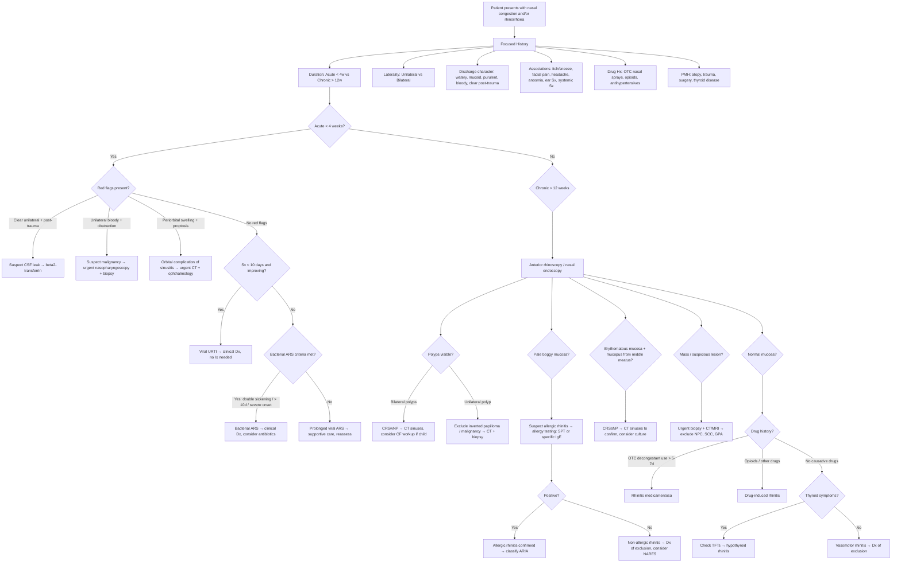
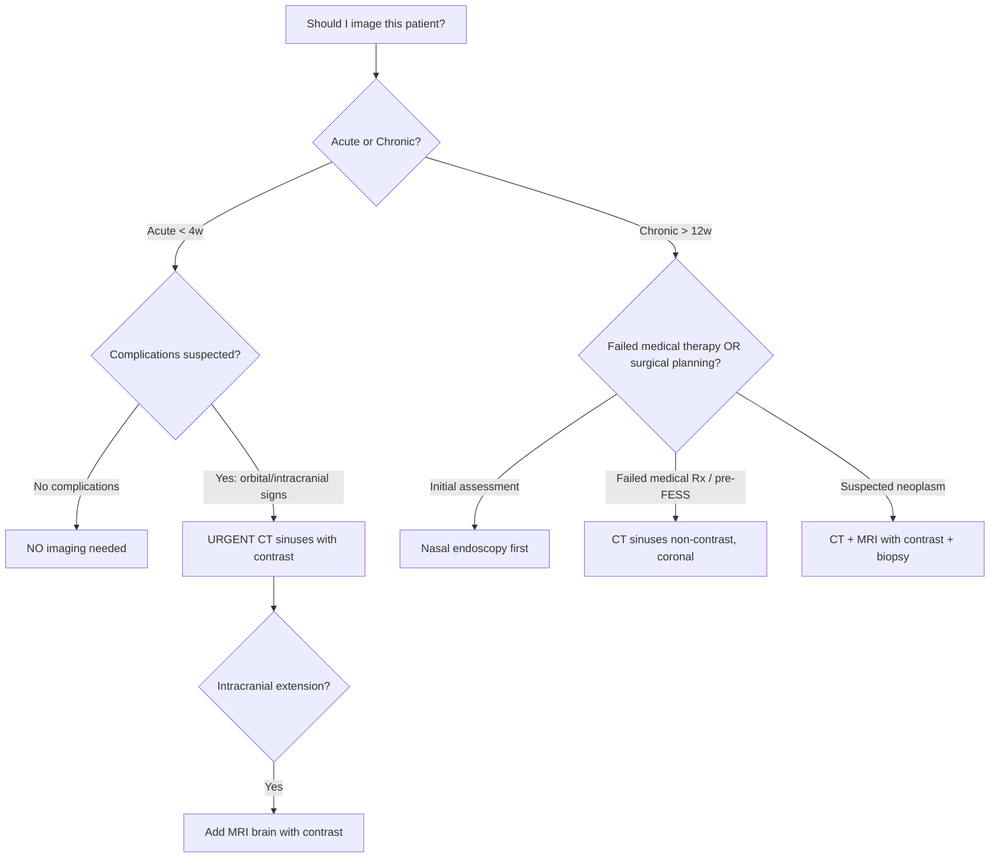

## Diagnostic Criteria, Algorithm, and Investigation Modalities

The diagnosis of the *cause* of nasal congestion and rhinorrhoea is, in most cases, **primarily clinical**. The principle to grasp here is that the nose can only respond in a limited number of ways — swell, secrete, bleed, or obstruct — so the history and examination do the heavy lifting, and investigations are reserved for (a) confirming a suspected diagnosis, (b) excluding serious pathology, or (c) guiding management (particularly surgical planning).

***Key investigations: Usually none required. Consider: micro/culture of discharge, X-ray sinuses, CT scan, allergy testing*** [4].

Let that sink in — **most patients need NO investigations**. The decision to investigate depends on the clinical picture, duration, red flags, and treatment response.

---

### 1. Diagnostic Criteria for Specific Conditions

#### 1.1 Acute Rhinosinusitis (EPOS 2020 / AFP 2016 Criteria)

This is the most commonly tested diagnostic framework for nasal symptoms in exams.

***Diagnosis: predominantly clinical*** [1].

**A. Acute Rhinosinusitis (ARS) — Clinical Criteria:**

***Criteria: sudden onset of ≥2 of (with ≥1 nasal symptom)*** [1]:
- ***Nasal blockage/congestion OR nasal discharge*** PLUS
- ***Facial pain/pressure AND/OR ↓ or loss of smell*** [1]

**Why these specific criteria?** Because they capture the two essential components of rhinosinusitis:
1. **Nasal component** (blockage or discharge) — reflects mucosal oedema and glandular hypersecretion
2. **Sinus component** (facial pain/pressure or hyposmia) — reflects sinus ostial obstruction with trapped secretions pressing on sensory nerves, or oedema of the olfactory cleft blocking odorant access

**B. Distinguishing Viral from Bacterial ARS:**

This is the critical clinical decision because it determines whether antibiotics are warranted.

***Criteria for bacterial rhinosinusitis: ≥3 of*** [1]:
- ***Double sickening*** (initial improvement then deterioration — reflects initial viral clearance followed by bacterial superinfection)
- ***Discoloured, purulent nasal discharge*** (neutrophil-rich exudate from bacterial proliferation in stagnant sinus — though this alone is insufficient)
- ***Severe, localised pain*** (especially unilateral — bacterial sinusitis is often more focal than viral which is diffuse)
- ***Fever > 38°C or ↑ESR/CRP*** [1] (systemic inflammatory response to bacterial infection)

Three alternative clinical patterns also suggest bacterial ARS (AAO-HNS / IDSA 2012 guidelines):

| Pattern | Rationale |
|---|---|
| **Persistent symptoms > 10 days** without improvement | Viral URI should show improvement by day 10; persistence suggests bacterial superinfection |
| **Severe onset**: fever ≥ 39°C + purulent discharge for ≥ 3–4 consecutive days | The severity and persistence of both fever and purulence suggests bacterial aetiology from the outset |
| **Double sickening** | New onset of fever, headache, or increase in nasal discharge after initial improvement of a viral URI |

<Callout title="Viral vs. Bacterial ARS — The 10-Day Rule" type="idea">
The most practical bedside tool: if nasal symptoms are improving by day 10, it is almost certainly viral. If symptoms persist unchanged or worsen after day 10, consider bacterial superinfection. This is because the median duration of a viral URI is 7–10 days, and > 90% resolve within 10 days [1]. Bacterial ARS complicates only ***0.5–2% of viral URIs*** [1].
</Callout>

#### 1.2 Chronic Rhinosinusitis (EPOS 2020 Criteria)

**Duration**: symptoms for ≥ 12 consecutive weeks without complete resolution.

**Clinical criteria** (same symptom domains as ARS):
- ≥2 symptoms, with ≥1 being nasal blockage/obstruction/congestion OR nasal discharge (anterior/posterior)
- PLUS facial pain/pressure AND/OR reduction or loss of smell

**PLUS objective evidence** of at least one of:
- Nasal polyps and/or mucopurulent discharge from middle meatus on **nasal endoscopy**
- Mucosal changes within the ostiomeatal complex and/or sinuses on **CT scan**

> **Why is objective evidence required for CRS but not ARS?** Because chronic symptoms lasting > 12 weeks could have many non-sinusitis causes (vasomotor rhinitis, allergic rhinitis, rhinitis medicamentosa). Requiring endoscopic or radiological confirmation ensures diagnostic specificity and avoids unnecessary surgery.

**CRS is then subtyped:**
- **CRSwNP** (with nasal polyps): polyps visible at nasal endoscopy
- **CRSsNP** (without nasal polyps): mucosal inflammation/mucopurulent discharge without polyps

#### 1.3 Allergic Rhinitis (ARIA 2020 Criteria)

**Clinical diagnosis** based on:
1. **Characteristic symptoms**: sneezing, rhinorrhoea (watery), nasal congestion, nasal itch — often with palatal/eye itch
2. **Temporal correlation** with allergen exposure
3. **Confirmed by allergy testing**: skin prick test (SPT) or serum-specific IgE showing sensitisation to a clinically relevant allergen

**Classification (ARIA):**

| | Intermittent | Persistent |
|---|---|---|
| **Duration** | < 4 days/week OR < 4 consecutive weeks | ≥ 4 days/week AND ≥ 4 consecutive weeks |
| **Mild** | None of the below | |
| **Moderate-Severe** | ≥1 of: sleep disturbance, impairment of daily activities/school/work, troublesome symptoms | |

> **Why the 4-day/4-week cut-offs?** The older "seasonal vs. perennial" classification was geographically biased (HK has year-round house dust mite exposure, making "seasonal" less relevant). ARIA uses symptom burden regardless of allergen type, which better reflects clinical impact and guides treatment intensity.

#### 1.4 Vasomotor (Non-Allergic, Non-Infectious) Rhinitis

This is a **diagnosis of exclusion**:
- Chronic nasal symptoms (predominantly congestion and rhinorrhoea) for > 12 weeks
- **Negative** allergy testing (SPT and/or specific IgE)
- **No** evidence of infection, structural abnormality, or systemic disease
- Often triggered by non-specific stimuli (cold air, strong odours, spicy food, emotional stress)

#### 1.5 Rhinitis Medicamentosa

**Diagnostic criteria** (clinical):
- History of regular use of topical nasal decongestant (α-agonist) for ***> 5–7 days*** [4]
- Rebound nasal congestion upon withdrawal
- ***Anterior rhinoscopy: erythematous, oedematous ("beefy red") nasal mucosa*** — distinct from the pale, boggy mucosa of allergic rhinitis

#### 1.6 CSF Rhinorrhoea

Suspected when: ***clear discharge following direct facial or head injury*** [4], or post-surgical, or spontaneous in the setting of raised ICP/skull base erosion.

**Confirmatory tests:**
- **β2-transferrin assay** (gold standard): β2-transferrin is a protein found almost exclusively in CSF, perilymph, and aqueous humor — its presence in nasal fluid is essentially diagnostic (sensitivity ~94%, specificity ~100%)
- **Glucose testing**: CSF glucose is typically > 1.7 mmol/L (> 30 mg/dL) whereas normal nasal mucus has minimal glucose. Glucose oxidase strips (Dextrostix) can be used as a bedside screening test, but false positives occur with blood contamination
- **Halo sign (ring sign)**: when nasal fluid drips onto filter paper, CSF separates from blood forming a clear outer ring around a central blood spot — a useful bedside test but not definitive

---

### 2. Master Diagnostic Algorithm

This algorithm integrates the history, examination, and investigations into a step-by-step approach:

---

### 3. Investigation Modalities — Detailed

Let me walk through each investigation systematically: when to order it, what it shows, and how to interpret the results.

#### 3.1 Bedside / Clinical Investigations

##### A. Anterior Rhinoscopy

***Look for cause. Inspect nose and nasal cavity with a Thudicum speculum or large auriscope. Note the position of the septum, nature of nasal mucosa and look for polyps or other tumours*** [4].

| Finding | Interpretation | Why |
|---|---|---|
| Pale, boggy, bluish-grey mucosa | Allergic rhinitis | Chronic eosinophilic infiltration causes oedema with reduced vascularity — the mucosa looks pale because the tissue is waterlogged rather than inflamed |
| Erythematous, swollen mucosa | Infectious rhinitis / acute sinusitis | Active vasodilatation and neutrophilic infiltration — the red colour reflects hyperaemia from the inflammatory response |
| "Beefy red," granular mucosa | Rhinitis medicamentosa | Chronic rebound vasodilatation + loss of normal mucosal architecture from prolonged decongestant damage |
| ***Mucosal inflammation: oedema, narrowing of meatus, inferior turbinate hypertrophy*** [1] | Rhinosinusitis (any cause) | Mucosal swelling narrows the middle meatus → impairs sinus drainage |
| ***Discharge: copious watery or purulent discharge*** [1] | Watery = allergic/vasomotor/viral; Purulent = bacterial or late viral | Character reflects the predominant secretory mechanism |
| Nasal polyps (pale, grey, translucent, insensitive, mobile, pedunculated) | CRSwNP (bilateral), exclude neoplasm (unilateral) | Polyps arise from oedematous ethmoid sinus mucosa due to chronic Type 2 inflammation. They are INSENSITIVE to touch (unlike turbinates, which are vascular and sensitive) — this is a key clinical test |
| ***Co-existent anatomical RFs, eg. polyps, septal deviation*** [1] | Predisposing factors for chronic sinusitis | Structural narrowing of OMC → impaired drainage |
| Deviated septum | Unilateral obstruction; predisposes to sinusitis | Mechanical narrowing of nasal passage |
| Septal perforation, crusting, granulation | GPA, cocaine use, sarcoidosis | Granulomatous/ischaemic destruction of septal cartilage and mucosa |
| Foreign body | Direct visualisation (especially in children) | Physical obstruction with surrounding inflammation and mucopurulent secretions |

##### B. Flexible Nasopharyngoscopy (Nasal Endoscopy)

- **Gold standard** for direct visualisation of the entire nasal cavity, ostiomeatal complex, and nasopharynx.
- Done with a flexible fibreoptic endoscope passed through the nostril after topical anaesthesia and decongestant.

| Key Findings | Clinical Significance |
|---|---|
| Mucopurulent drainage from middle meatus | Confirms sinusitis (maxillary, anterior ethmoid, or frontal source) |
| Mucopurulent drainage from sphenoethmoidal recess | Sphenoid or posterior ethmoid sinusitis |
| Nasal polyps — number, size, location | CRSwNP staging; unilateral polyp needs biopsy to exclude neoplasm |
| Nasopharyngeal mass | NPC — **critical examination in HK patients** with unilateral symptoms, conductive hearing loss, or cervical lymphadenopathy |
| Eustachian tube orifice status | Serous otitis media from tubal obstruction |
| Adenoid size (children) | Adenoid hypertrophy grading |
| Post-nasal drip (mucopurulent coating of posterior pharyngeal wall) | Confirms posterior drainage contributing to cough/throat symptoms |

<Callout title="When to Do Nasal Endoscopy">
Nasal endoscopy is indicated when: (1) symptoms are chronic ( > 12 weeks), (2) symptoms are unilateral (to exclude neoplasm), (3) response to empirical treatment is poor, (4) complications are suspected, (5) pre-operative assessment for sinus surgery (FESS), (6) follow-up after sinus surgery. It is NOT routinely needed for a simple acute viral URTI.
</Callout>

##### C. Otoscopic Examination

- Should be performed in every patient with nasal symptoms, especially children.
- **Why?** Because nasal and nasopharyngeal pathology frequently causes Eustachian tube dysfunction → middle ear effusion.

| Finding | Interpretation |
|---|---|
| Amber/grey tympanic membrane, reduced mobility, fluid level or air bubbles | Serous otitis media (middle ear effusion) secondary to Eustachian tube dysfunction |
| Erythematous, bulging TM | Acute otitis media — complication of URTI, especially in children |

##### D. Bedside CSF Leak Tests

| Test | Technique | Interpretation |
|---|---|---|
| **Halo (ring) sign** | Allow nasal fluid to drip onto white filter paper or gauze | CSF separates from blood → clear ring around central blood spot. Screening only — not definitive |
| **Glucose testing** | Glucose oxidase strip (Dextrostix) applied to nasal fluid | CSF glucose > 1.7 mmol/L (positive). Nasal mucus has little glucose. False positives if blood contamination |

#### 3.2 Laboratory Investigations

##### A. Allergy Testing

***Allergy testing*** is listed as a ***key investigation*** [4]. Two main approaches:

**1. Skin Prick Test (SPT) — first-line:**
- **Technique**: drops of standardised allergen extracts placed on forearm skin → pricked through with a lancet → read at 15–20 minutes.
- **Positive result**: wheal ≥ 3 mm larger than negative control.
- **Mechanism**: if allergen-specific IgE is bound to cutaneous mast cells, allergen cross-links IgE → mast cell degranulation → local histamine release → wheal-and-flare response.
- **Advantages**: rapid (20 min), inexpensive, high sensitivity, tests multiple allergens simultaneously.
- **Limitations**: must stop antihistamines ≥ 3–7 days prior (suppress mast cell response → false negatives); cannot be done if extensive eczema or dermatographism; risk of anaphylaxis (extremely rare).

**Common allergen panel in HK:**
- House dust mite (*D. pteronyssinus*, *D. farinae*) — the dominant allergen
- Cockroach mix
- Cat and dog epithelium
- Mould (*Aspergillus*, *Alternaria*, *Cladosporium*)
- Grass/tree pollens (less important in HK subtropical climate)

**2. Serum-Specific IgE (formerly RAST):**
- **Technique**: blood test measuring circulating IgE antibodies specific to individual allergens.
- **When to use**: when SPT cannot be performed (extensive eczema, dermatographism, cannot stop antihistamines, young children who will not tolerate pricks).
- **Limitations**: more expensive, less sensitive than SPT, results take days.

**3. Total serum IgE:**
- Elevated in atopic individuals but NOT diagnostic alone (non-specific — also elevated in parasitic infections, hyper-IgE syndrome, etc.).
- Useful as supportive evidence of atopy when combined with history and specific IgE.

**4. Nasal cytology (smear):**
- Swab of nasal secretions examined microscopically.
- **Eosinophil-predominant**: allergic rhinitis or NARES (Non-Allergic Rhinitis with Eosinophilia Syndrome).
- **Neutrophil-predominant**: infectious rhinitis.
- Rarely done in routine practice but useful in research and specialist settings.

<Callout title="SPT vs. Specific IgE — What's the Difference?">
Both detect allergen-specific IgE, but SPT tests the functional response (mast cell degranulation in skin), while specific IgE measures circulating antibody levels. A positive SPT is more clinically relevant because it demonstrates that the patient's mast cells actually degranulate in response to that allergen. A positive specific IgE only shows sensitisation — the patient may be sensitised but not clinically reactive (asymptomatic sensitisation). Always correlate test results with clinical history.
</Callout>

##### B. Micro/Culture of Nasal Discharge

***Micro/culture of discharge*** [4].

| When | What | Why |
|---|---|---|
| Refractory bacterial sinusitis not responding to empirical antibiotics | Endoscopy-directed middle meatus swab (gold standard) or sinus aspirate | Identifies the causative organism and antibiotic sensitivities. Anterior nasal swabs are unreliable (contaminated by normal nasal flora) |
| Suspected invasive fungal sinusitis | Culture + histopathology of biopsy material | Identify *Aspergillus*, *Mucor* — guides antifungal therapy |
| Suspected TB/granulomatous disease | Culture for AFB, fungal culture | Confirm mycobacterial or fungal aetiology |

##### C. Blood Tests

| Test | Indication | Interpretation |
|---|---|---|
| **CBC with differential** | Suspected infection, allergy, eosinophilic disease | Eosinophilia ( > 0.5 × 10⁹/L) supports allergic/eosinophilic aetiology; leucocytosis with neutrophilia supports bacterial infection |
| **ESR / CRP** | ***Criteria for bacterial ARS: fever > 38°C or ↑ESR/CRP*** [1] | Elevated in bacterial infection, vasculitis (GPA), malignancy. Normal in allergic rhinitis and viral URTI |
| **TFTs (TSH, free T4)** | ***Hypothyroidism — masquerade*** [4] | ↑TSH + ↓free T4 = primary hypothyroidism causing myxoedematous nasal congestion |
| **c-ANCA/PR3, p-ANCA/MPO** | Suspected GPA or EGPA | c-ANCA/PR3 positive in ~90% of active generalised GPA. p-ANCA/MPO positive in EGPA |
| **EBV serology (VCA IgA, EA IgA) and plasma EBV DNA** | Suspected NPC (HK population) | Elevated EBV VCA IgA and EBV DNA titres are used as screening/monitoring tools for NPC in endemic populations |
| **ACE level** | Suspected sarcoidosis | Elevated in ~60% of active sarcoidosis (produced by granuloma macrophages). Non-specific |
| **Total IgE** | Supporting evidence of atopy | Elevated in atopic disease but not diagnostic in isolation |
| **Sweat chloride test** | Suspected CF (child with nasal polyps) | Chloride > 60 mmol/L = diagnostic of CF. The defective CFTR chloride channel fails to reabsorb chloride in sweat ducts |
| **β2-transferrin** | Suspected CSF leak | Positive = CSF confirmed (unique to CSF, perilymph, and aqueous humor) |

##### D. Nasopharyngeal Aspirate / Swab for Virology

| Test | Indication | Interpretation |
|---|---|---|
| Rapid antigen test (influenza, COVID-19, RSV) | Acute febrile respiratory illness | Rapid POC result; moderate sensitivity, high specificity |
| PCR (multiplex respiratory panel) | Severe or atypical presentation, immunocompromised, surveillance | High sensitivity and specificity; identifies specific viral pathogen |

#### 3.3 Imaging

##### A. Plain Sinus X-ray (Waters' / Caldwell / Lateral views)

***Sinus XR: opacified sinus with air-fluid level*** [1].
***Poor sensitivity and specificity → NOT recommended*** [1].

- **Why is it poor?** Because mucosal thickening > 6 mm and air-fluid levels can occur in asymptomatic individuals, and a normal X-ray does not reliably exclude sinusitis (poor sensitivity for ethmoid and sphenoid disease due to overlapping bony structures).
- **Historical use**: previously ordered as first-line but now largely supplanted by CT.
- **Still occasionally used**: in resource-limited settings or as a quick screen.

| View | Best Visualises |
|---|---|
| Waters' (occipitomental) | Maxillary sinuses |
| Caldwell (occipitofrontal) | Frontal and ethmoid sinuses |
| Lateral | Sphenoid sinus, adenoid size |

##### B. CT Sinuses (Non-Contrast, Coronal Cuts)

***CT scan*** is listed as a ***key investigation*** [4].
***Sinus CT: air-fluid levels, mucosal oedema, air bubbles*** [1].
***Generally reserved for cases where complications are suspected*** [1].

**Indications:**
1. Chronic rhinosinusitis not responding to medical therapy
2. Suspected complications of ARS (orbital, intracranial)
3. Pre-operative planning for functional endoscopic sinus surgery (FESS) — provides the surgical roadmap
4. Recurrent ARS (≥ 4 episodes/year) to identify predisposing anatomical factors
5. Unilateral symptoms suspicious for neoplasm (with MRI)

**Key findings and interpretation:**

| Finding | Interpretation |
|---|---|
| **Air-fluid level** within a sinus | Acute sinusitis — trapped fluid (mucus, pus, or blood) behind an obstructed ostium |
| **Mucosal thickening** ( > 4–6 mm) | Mucosal inflammation — seen in ARS, CRS, allergic fungal sinusitis. Non-specific — also found incidentally in ~40% of asymptomatic individuals |
| **Complete sinus opacification** | Severe sinusitis, mucocoele, or fungal ball |
| **Ostiomeatal complex (OMC) obstruction** | Central event in sinusitis pathophysiology — mucosal oedema or anatomical variant blocking the drainage pathway of maxillary/anterior ethmoid/frontal sinuses |
| **Bone erosion / destruction** | Malignancy (sinonasal SCC, adenocarcinoma), invasive fungal sinusitis, Pott's puffy tumour (frontal osteomyelitis). **Urgent concern** |
| **Heterogeneous opacification with calcification** | Fungal sinusitis (allergic fungal rhinosinusitis shows characteristic "double density" sign; fungal ball shows central calcification) |
| **Anatomical variants** | Concha bullosa (pneumatised middle turbinate), Haller cells (infraorbital ethmoid cells), septal deviation, paradoxical middle turbinate — predisposing factors for CRS |
| **Orbital fat stranding / subperiosteal abscess** | Orbital complication of sinusitis — **emergency** |
| **Intracranial air, subdural/epidural empyema** | Intracranial complication — **emergency** |

**Lund-Mackay scoring system:**
- Standardised CT scoring for CRS severity: each sinus (anterior ethmoid, posterior ethmoid, maxillary, frontal, sphenoid) scored 0–2 per side + OMC (0 or 2 per side).
- Total score: 0–24. Score ≥ 4 generally considered abnormal.
- Used in research and pre-operative assessment; helps quantify disease burden.

<Callout title="CT Timing Pitfall" type="error">
Do NOT order a CT sinuses during or immediately after an acute URTI. Viral mucosal inflammation causes transient sinus opacification in up to 87% of patients with a cold — this will give you a false-positive "sinusitis" on CT. Wait at least 4–6 weeks after the acute episode resolves before scanning for chronic disease assessment.
</Callout>

##### C. MRI Sinuses

| Indication | Advantage Over CT |
|---|---|
| Suspected sinonasal / nasopharyngeal malignancy | Superior soft tissue contrast — differentiates tumour from retained secretions/mucosal thickening (both appear opacified on CT). Tumour enhances with gadolinium; retained secretions do not |
| Suspected intracranial complication (abscess, CVST) | Better visualisation of brain parenchyma and venous sinuses |
| Suspected invasive fungal sinusitis with intracranial/orbital extension | Delineates extent of soft tissue invasion |
| Allergic fungal rhinosinusitis | Shows characteristic T1-hypointense, T2-hypointense signal of fungal mucin (due to paramagnetic metals in fungal elements) — "signal void" that mimics an aerated sinus |

> **Key principle**: CT is best for **bone** and **anatomy** (surgical planning). MRI is best for **soft tissue** (tumour staging, intracranial complications). They are complementary, not interchangeable.

##### D. Other Imaging

| Modality | Indication | Key Finding |
|---|---|---|
| **CT cisternography / MRI cisternography** | Localising site of CSF leak | Intrathecal contrast or heavily T2-weighted MRI identifies the exact defect in the skull base |
| **Lateral neck X-ray** | Adenoid hypertrophy (children) | Enlarged adenoid shadow narrowing the nasopharyngeal airway |
| **PET-CT** | Staging confirmed sinonasal / NPC malignancy | Metabolically active primary tumour and metastases |

#### 3.4 Tissue Sampling / Biopsy

| Indication | Technique | What It Shows |
|---|---|---|
| Unilateral nasal mass | Endoscopic biopsy | Histology: inverted papilloma (endophytic growth of squamous epithelium), SCC, adenocarcinoma, olfactory neuroblastoma, lymphoma |
| Nasopharyngeal mass (suspected NPC) | Nasopharyngoscopy-guided biopsy | WHO Type I (keratinising SCC), Type II (non-keratinising, differentiated), Type III (non-keratinising, undifferentiated — most common in HK, strongly EBV-associated) |
| Suspected GPA | Biopsy of affected nasal mucosa | Necrotising granulomatous inflammation with vasculitis |
| Suspected sarcoidosis | Biopsy | Non-caseating granulomata |

#### 3.5 Special Tests

##### A. Nasal Airflow Assessment

| Test | Purpose |
|---|---|
| **Peak nasal inspiratory flow (PNIF)** | Objective measure of nasal airway patency. Simple, portable, reproducible. Useful for monitoring treatment response in AR and CRS |
| **Rhinomanometry** | Measures nasal airway resistance during breathing. More precise than PNIF. Used in research and pre-operative assessment |
| **Acoustic rhinometry** | Measures cross-sectional area of nasal cavity using sound waves. Identifies the site and degree of nasal obstruction |

##### B. Nasal Nitric Oxide (nNO)

- Paranasal sinuses produce high levels of NO. In CRS (especially with polyps), sinus ostia are blocked → reduced nNO.
- Extremely low nNO ( < 77 nL/min) is highly suggestive of **primary ciliary dyskinesia (PCD)** — a rare but important cause of chronic rhinosinusitis, bronchiectasis, and situs inversus (Kartagener syndrome).

##### C. Saccharin Test (Mucociliary Clearance Time)

- A saccharin particle is placed on the anterior inferior turbinate. The patient reports when they taste sweetness (indicating the particle has been transported to the nasopharynx by mucociliary action).
- **Normal**: < 20 minutes. **Abnormal** ( > 30 min): impaired mucociliary clearance — think PCD, CF, or chronic mucosal damage (smoking, rhinitis medicamentosa).

##### D. Smell Testing

- **UPSIT (University of Pennsylvania Smell Identification Test)** or **Sniffin' Sticks**: standardised psychophysical tests of olfactory function.
- Indicated when anosmia/hyposmia is a prominent complaint.
- Helps distinguish conductive (nasal obstruction → reversible) from sensorineural (viral damage, neurodegeneration → often irreversible) hyposmia.

---

### 4. Diagnostic Approach Summarised by Clinical Scenario

| Scenario | Key Investigation(s) | Rationale |
|---|---|---|
| **Acute nasal symptoms < 10 days, no red flags** | **None** — clinical diagnosis of viral URTI | Self-limiting; investigations add cost without changing management |
| **Acute symptoms > 10 days or double sickening** | **None** (clinical diagnosis of bacterial ARS) or ESR/CRP if uncertain | Antibiotics may be warranted; no imaging needed unless complications suspected |
| **Suspected orbital/intracranial complication** | **Urgent CT sinuses with contrast ± MRI brain** | Delineate abscess, cellulitis, intracranial extension → ***generally reserved for cases where complications are suspected*** [1] |
| **Chronic bilateral nasal symptoms with itch/sneeze** | **Allergy testing (SPT or specific IgE)** | Confirm allergic rhinitis and identify specific allergens for avoidance/immunotherapy |
| **Chronic bilateral symptoms, no allergic features** | **Nasal endoscopy + consider CT if endoscopy abnormal** | Exclude CRS, polyps, structural abnormalities; CT for surgical planning |
| **Chronic symptoms with OTC decongestant use** | **Clinical diagnosis** (rhinitis medicamentosa) — no Ix needed | History is diagnostic; stop the spray |
| **Chronic symptoms + thyroid features** | **TFTs** | Exclude hypothyroidism as a masquerade [4] |
| **Unilateral bloody discharge** | **Urgent nasal endoscopy ± nasopharyngoscopy + CT/MRI + biopsy** | ***Beware of persistent blood-stained discharge especially if unilateral and obstruction*** [4] — exclude malignancy |
| **Clear unilateral discharge post-trauma** | **β2-transferrin ± CT cisternography** | ***CSF leakage from a skull fracture*** [4] |
| **Child with bilateral nasal polyps** | **Sweat chloride test** | Exclude CF (polyps very rare in non-CF children) |
| **Crusty nose + septal perforation + systemic symptoms** | **c-ANCA/PR3, biopsy, urinalysis** | Exclude GPA |

---

### 5. Imaging Decision Matrix

***Imaging: NOT indicated if uncomplicated*** [1].

---

<Callout title="High Yield Summary — Diagnosis">

**Core Principle**: Diagnosis of nasal congestion/rhinorrhoea is ***predominantly clinical*** [1]. ***Usually no investigations required*** [4].

**Acute rhinosinusitis criteria** [1]: ≥2 symptoms (with ≥1 nasal: blockage/congestion OR discharge) PLUS facial pain/pressure and/or hyposmia.

**Bacterial ARS criteria** [1]: ≥3 of double sickening, purulent discharge, severe localised pain, fever > 38°C/↑ESR/CRP. OR: persistent > 10 days, severe onset, or double sickening pattern.

**Allergic rhinitis**: clinical features (itch, sneeze, watery rhinorrhoea, congestion) + positive allergy testing (SPT preferred over specific IgE).

**CRS** ( > 12 weeks): clinical criteria PLUS objective evidence on nasal endoscopy or CT.

***Key investigations to consider*** [4]: micro/culture, sinus X-ray (NOT recommended — poor Se/Sp), CT scan (for complications/surgical planning), allergy testing.

***Imaging NOT indicated if uncomplicated*** [1]. ***CT reserved for suspected complications*** [1].

**Red flag investigations**: unilateral bloody discharge → urgent endoscopy + biopsy; clear post-trauma discharge → β2-transferrin; child with polyps → sweat chloride.

</Callout>

---

<ActiveRecallQuiz
  title="Active Recall - Diagnostic Criteria and Investigations for Nasal Congestion/Rhinorrhoea"
  items={[
    {
      question: "State the EPOS clinical criteria for diagnosing acute rhinosinusitis.",
      markscheme: "Sudden onset of 2 or more symptoms, with at least 1 being a nasal symptom (nasal blockage/congestion OR nasal discharge), PLUS facial pain/pressure AND/OR reduction or loss of smell."
    },
    {
      question: "List four criteria that suggest bacterial rather than viral acute rhinosinusitis.",
      markscheme: "(1) Double sickening - deterioration after initial improvement, (2) Discoloured purulent nasal discharge, (3) Severe localised pain (especially unilateral), (4) Fever above 38 degrees C or elevated ESR/CRP. Three or more of these should be present."
    },
    {
      question: "Why is sinus X-ray NOT recommended for diagnosing rhinosinusitis? What imaging modality is preferred and when?",
      markscheme: "Sinus X-ray has poor sensitivity and specificity - mucosal thickening and air-fluid levels can be found incidentally in asymptomatic individuals, and X-ray cannot reliably visualise ethmoid and sphenoid sinuses due to overlapping bony structures. CT sinuses (non-contrast, coronal cuts) is preferred but only when complications are suspected, medical therapy has failed, or pre-operative surgical planning is needed. Imaging is NOT indicated if uncomplicated."
    },
    {
      question: "A patient presents with chronic nasal symptoms. You suspect allergic rhinitis. Describe the two main allergy tests, their mechanisms, and when you would choose one over the other.",
      markscheme: "Skin prick test (SPT): allergen extract pricked into skin, if allergen-specific IgE is bound to cutaneous mast cells, cross-linking causes degranulation and wheal-and-flare response within 15-20 min. First-line because it is rapid, cheap, high sensitivity, tests multiple allergens. Serum-specific IgE: blood test measuring circulating allergen-specific IgE. Used when SPT cannot be done (extensive eczema, dermatographism, cannot stop antihistamines, uncooperative child). More expensive, less sensitive, results take days."
    },
    {
      question: "What investigation confirms CSF rhinorrhoea, and why is it considered the gold standard?",
      markscheme: "Beta-2 transferrin assay. It is the gold standard because beta-2 transferrin is a protein found almost exclusively in CSF, perilymph, and aqueous humor - it is not found in nasal secretions, blood, or tears. Its presence in nasal fluid therefore confirms CSF origin with sensitivity approximately 94% and specificity approaching 100%."
    },
    {
      question: "A 6-year-old child is found to have bilateral nasal polyps on nasal endoscopy. What specific investigation should you order and why?",
      markscheme: "Sweat chloride test to screen for cystic fibrosis. Bilateral nasal polyps are very rare in non-CF children but occur in up to 50% of children with CF. CF causes defective CFTR chloride channel leading to thick tenacious mucus and chronic sinusitis. Sweat chloride above 60 mmol/L is diagnostic of CF."
    }
  ]}
/>

## References

[1] Senior notes: Ryan Ho Respiratory.pdf (Sections 3.1.1 URTI overview, 3.1.1.1 Acute Coryza, 3.1.1.4 Rhinosinusitis)
[4] Lecture slides: murtagh merge.pdf (p67–68 — Nasal drip/rhinorrhoea: key investigations, key examination, diagnostic tips, masquerades checklist)
[10] Senior notes: Ryan Ho Neurology.pdf (Headache differential tables — sinusitis, cluster headache)
[11] Senior notes: Ryan Ho Fundamentals.pdf (Headache approach — sinusitis associated features and further investigations)
