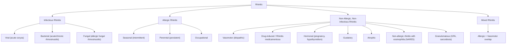

# Nasal Congestion and Runny Nose (Rhinorrhoea)

## 1. Definition

Let's start by breaking down the terms:

- **Nasal congestion** (from Latin *con-* = together, *gerere* = to carry → "crowding together") refers to the subjective sensation of reduced nasal airflow or a feeling of fullness/blockage in the nasal passages. It results from engorgement of the nasal venous sinusoids and mucosal oedema, reducing the cross-sectional area of the nasal airway.

- **Rhinorrhoea** (from Greek *rhis/rhino-* = nose, *-rhoea* = flow) literally means "nose flow" — the discharge of fluid from the nasal cavity. It may be anterior (dripping from the nostrils) or posterior (post-nasal drip down the pharynx).

These two symptoms almost always coexist and are among the most frequent presenting complaints in primary care, ENT, and paediatric settings. They are not diagnoses in themselves but rather symptom manifestations of an underlying process affecting the nasal cavity and/or paranasal sinuses.

<Callout title="Key Conceptual Point">
Nasal congestion ≠ a structural blockage in all cases. It is most often a *physiological* response — vasodilatation of the rich submucosal venous plexus (Kiesselbach's plexus anteriorly, the inferior turbinate cavernous tissue) under autonomic control. Think of the nose as an "erectile organ" — the turbinates swell and shrink under parasympathetic and sympathetic tone, respectively.
</Callout>

---

## 2. Epidemiology

### 2.1 Global & Hong Kong Burden

- Nasal congestion and rhinorrhoea are **the most common symptoms in medicine**, period. The common cold alone accounts for >200 million days of school absence and >100 million physician visits annually in the US.
- ***Acute coryza (common cold, viral URI)*** is the ***most common type of URTI*** [1]. Over 200 viral subtypes can cause it.
- **Allergic rhinitis (AR)** affects 10–30% of the global population; in Hong Kong, AR prevalence in schoolchildren is approximately 40–50% (among the highest worldwide, likely due to subtropical climate, high population density, and indoor allergen exposure — house dust mite *Dermatophagoides pteronyssinus* is the dominant allergen in HK).
- ***Chronic rhinosinusitis*** (CRS) affects ~5–12% of the general population globally.
- ***GERD-related*** nasal symptoms are increasingly recognised, as reflux of gastric acid into the nasopharynx can cause chronic rhinitis symptoms [2].

### 2.2 Demographics

| Feature | Allergic Rhinitis | Viral URTI | CRS with Polyps | CRS without Polyps |
|---|---|---|---|---|
| Age | Children/young adults | Any age | Adults (30–60y) | Adults |
| Sex | M = F | M = F | M > F | M ≈ F |
| Atopy | Strong association | None | 40–60% | Variable |
| HK prevalence | Very high | Universal | ~4% | ~8% |

---

## 3. Risk Factors

Understanding risk factors requires understanding what makes the nose swell and run:

### 3.1 Host Factors

- **Atopy** — genetic predisposition to mount IgE responses to environmental allergens (house dust mite, cockroach, cat dander, fungi). Strongly linked to allergic rhinitis, which is part of the "atopic march" (eczema → AR → asthma) [3].
- **Genetic factors** — HLA associations, polymorphisms in IL-4, IL-13, and filaggrin genes affect mucosal barrier integrity and immune polarisation.
- **Age** — children have smaller nasal passages and immature immune systems (more frequent viral URIs: 6–8/year in children vs 2–4/year in adults). Elderly patients may develop **senile rhinitis** (gustatory rhinitis) from autonomic dysregulation.
- **Anatomical variants** — deviated nasal septum, concha bullosa (pneumatised middle turbinate), adenoid hypertrophy (children) → impaired drainage → recurrent infection.
- ***Hypothyroidism*** — listed as a ***masquerade*** [4]. Hypothyroidism causes mucosal oedema throughout the body (myxoedema) including the nasal mucosa, leading to chronic nasal congestion and rhinorrhoea. Always check TFTs in unexplained chronic nasal symptoms.
- **Pregnancy** — "rhinitis of pregnancy" due to oestrogen-mediated vasodilatation and ↑blood volume → turbinate engorgement.
- **Immunodeficiency** — IgA deficiency, common variable immunodeficiency (CVID), HIV → recurrent/chronic sinusitis.

### 3.2 Environmental Factors

- **Viral exposure** — crowding, daycare attendance, poor hand hygiene. ***Hand contact is the most important mode of transmission; hand-washing is the most effective method in prevention*** [1].
- **Allergen exposure** — ***indoor allergens (house dust mite faecal pellets, pet dander, cockroach)***, ***outdoor allergens (Alternaria fungi, pollens)*** [5].
- **Cigarette smoking** — both active and passive smoking damages cilia (ciliotoxic), increases mucus production, and promotes chronic inflammation. ***A risk factor for URIs and chronic rhinosinusitis*** [1].
- **Air pollution** — particulate matter (PM2.5, PM10) and nitrogen dioxide are major contributors in Hong Kong, directly damaging nasal epithelium and enhancing allergen sensitisation.
- **Occupational irritants** — dusts, fumes, chemicals (wood dust → especially associated with sinonasal adenocarcinoma in furniture workers).
- ***Drugs*** — ***topical OTC sympathomimetics → rhinitis medicamentosa; narcotics*** [4]. Also: oral contraceptives, antihypertensives (reserpine, methyldopa, ACE inhibitors, β-blockers), aspirin/NSAIDs (Samter's triad), cocaine.
- **Cold air/wind** — triggers vasomotor rhinitis via trigeminal-mediated parasympathetic reflex.

<Callout title="Masquerades Checklist for Nasal Symptoms" type="idea">
***Drugs (topical OTC → rhinitis medicamentosa; narcotics) and Hypothyroidism*** are listed explicitly in the ***masquerades checklist*** [4]. Always ask about:
1. Over-the-counter nasal decongestant spray use (oxymetazoline, xylometazoline)
2. Thyroid symptoms (fatigue, cold intolerance, weight gain, constipation)
</Callout>

---

## 4. Anatomy and Function of the Nose and Paranasal Sinuses

Understanding nasal congestion and rhinorrhoea requires a solid grasp of nasal anatomy. Let me walk you through it systematically:

### 4.1 External Nose

- Bony framework (nasal bones, frontal process of maxilla) superiorly; cartilaginous framework (upper lateral cartilages, lower lateral/alar cartilages, septal cartilage) inferiorly.
- The **nasal valve** (the narrowest point of the nasal airway, at the junction of upper and lower lateral cartilages) is critical — even small amounts of mucosal swelling here can produce disproportionate obstruction (Poiseuille's law: resistance ∝ 1/r⁴, so halving the radius increases resistance 16-fold).

### 4.2 Nasal Cavity

- Extends from the **vestibule** (skin-lined anteriorly) to the **choana** (posterior nasal aperture opening into nasopharynx).
- **Nasal septum** (midline): composed of septal cartilage, vomer, and perpendicular plate of ethmoid. Deviation is extremely common (~80% of people have some degree of deviation) and may contribute to unilateral obstruction.
- **Lateral wall** — the key functional area, containing three **turbinates** (conchae):
  - **Inferior turbinate** — largest, most important for airflow regulation. Contains **cavernous erectile tissue** (venous sinusoids) that can swell dramatically under parasympathetic stimulation, causing nasal congestion.
  - **Middle turbinate** — overlies the **ostiomeatal complex (OMC)**, the critical drainage pathway for the maxillary, anterior ethmoid, and frontal sinuses. Obstruction of the OMC is the central event in sinusitis pathophysiology.
  - **Superior turbinate** — small, overlies the sphenoethmoidal recess (drainage of sphenoid and posterior ethmoid sinuses).

### 4.3 Nasal Mucosa

The nasal mucosa is a **pseudostratified ciliated columnar epithelium** (respiratory epithelium) with goblet cells, except in the vestibule (keratinised squamous) and olfactory region (olfactory neuroepithelium).

Key functional components:
1. **Goblet cells** — secrete mucus (~1 litre/day normally). Mucus forms a bilayer: a thin sol (periciliary) layer and a thicker gel layer that traps particles.
2. **Cilia** — beat in coordinated waves (~10–15 Hz) to propel the mucus blanket posteriorly toward the nasopharynx (mucociliary clearance). This is the nose's primary defence mechanism.
3. **Submucosal glands** — serous and seromucous glands secrete additional fluid, especially under parasympathetic (cholinergic) stimulation.
4. **Venous sinusoids** — the capacitance vessels of the inferior turbinate. Richly innervated:
   - **Sympathetic fibres** (from superior cervical ganglion, via vidian nerve) → release noradrenaline → α-adrenoreceptor-mediated vasoconstriction → **decongestion**
   - **Parasympathetic fibres** (from superior salivatory nucleus → CN VII → greater petrosal nerve → vidian nerve → pterygopalatine ganglion) → release acetylcholine → vasodilatation + glandular secretion → **congestion + rhinorrhoea**

### 4.4 The Nasal Cycle

- A normal physiological phenomenon: alternating congestion and decongestion of each nasal cavity every 2–6 hours, controlled by the autonomic nervous system (hypothalamus).
- Most people are unaware of it. Patients become aware when mucosal inflammation (e.g., viral URI, AR) amplifies the cycle, causing noticeable unilateral or alternating blockage.

### 4.5 Paranasal Sinuses

Four paired sinuses, all drain into the nasal cavity:

| Sinus | Drainage Site | Clinical Significance |
|---|---|---|
| Maxillary | Middle meatus (via OMC) | Most commonly infected (ostium is high on medial wall → poor gravity drainage) |
| Frontal | Middle meatus (via frontal recess) | Frontal headache; intracranial complications (frontal osteomyelitis = **Pott's puffy tumour**) [1] |
| Anterior Ethmoid | Middle meatus (via OMC) | Orbital complications (lamina papyracea = paper-thin medial orbital wall) |
| Posterior Ethmoid | Superior meatus | Adjacent to optic nerve |
| Sphenoid | Sphenoethmoidal recess | Adjacent to cavernous sinus, internal carotid, optic nerve |

### 4.6 Functions of the Nose

The nose is not just a passive tube — it is a sophisticated organ:

1. **Airway conditioning** — warms (to 37°C), humidifies (to 100% relative humidity), and filters inspired air before it reaches the lower airways. The turbinates create turbulent airflow that maximises air-mucosal contact.
2. **Defence** — mucociliary clearance traps and removes particles (> 10μm filtered by vibrissae; 2–10μm deposited on mucus blanket). IgA, lysozyme, lactoferrin in nasal secretions provide innate immunity.
3. **Olfaction** — olfactory epithelium in the roof of the nasal cavity (cribriform plate region). Congestion impairs olfaction by preventing odorant molecules from reaching this region (conductive hyposmia). ***Patients with nasal congestion have hyponasal voice due to inadequate air escape through the nose*** [6].
4. **Resonance** — contributes to voice quality. ***Nasal congestion causes a hyponasal voice*** [6].
5. **Nitric oxide production** — paranasal sinus epithelium produces NO, which is a potent vasodilator and has antimicrobial properties. This is why nasal breathing is physiologically superior to mouth breathing.

---

## 5. Aetiology (with Focus on Hong Kong)

Here I'll organise the causes systematically. Think of the nose as having only a few ways it can go wrong: **infection, allergy, structural problems, vasomotor dysfunction, or systemic disease**.

### 5.1 Overview Classification by Duration

| Duration | Category | Common Causes |
|---|---|---|
| Acute ( < 4 weeks) | Infectious | Viral URTI (common cold), acute bacterial rhinosinusitis |
| | Allergic | Acute allergic rhinitis (seasonal or perennial) |
| | Other | Foreign body (children), nasal trauma, drug-induced |
| Chronic ( > 12 weeks) | Inflammatory | Chronic rhinosinusitis ± nasal polyps, allergic rhinitis |
| | Structural | Deviated septum, turbinate hypertrophy, adenoid hypertrophy |
| | Vasomotor | Non-allergic rhinitis (vasomotor rhinitis) |
| | Drug-induced | Rhinitis medicamentosa, drug side effects |
| | Systemic | Hypothyroidism, granulomatous diseases, pregnancy |
| | Neoplastic | Benign (inverted papilloma) or malignant (SCC, adenocarcinoma, NPC) |

### 5.2 Infectious Causes

#### A. Acute Coryza (Common Cold / Viral URI)

***The most common type of URTI*** [1].

- ***Virology: > 200 subtypes including rhinovirus (30–50%), coronavirus (10–15%), influenza (5–15%), RSV (5%), parainfluenza virus (5%), adenovirus, enterovirus*** [1].
- ***Transmission: by 3 main mechanisms — hand contact (most important), droplet transmission, and aerosol transmission (for selected viruses). Most contagious at onset of symptoms and when febrile*** [1].
- ***Risk factors: underlying chronic diseases, psychological stresses, minimal exercise, immunodeficiency, malnutrition, cigarette smoking*** [1].

**Pathophysiology:**
1. Virus enters nasal epithelium (rhinovirus binds ICAM-1 on epithelial cells; coronavirus binds ACE2).
2. Viral replication triggers innate immune response → release of pro-inflammatory cytokines (IL-1, IL-6, IL-8, TNF-α, bradykinin).
3. Bradykinin and histamine → vasodilatation of submucosal venous sinusoids → **nasal congestion**.
4. Cholinergic reflex stimulation of submucosal glands → **watery rhinorrhoea**.
5. Cytokine-mediated increased vascular permeability → plasma exudation → adds to secretions.
6. Ciliary dysfunction from viral cytopathic effect → impaired mucociliary clearance → mucus retention → **mucoid then secondary purulent discharge** (colour change reflects neutrophil influx, NOT necessarily bacterial superinfection).

> **Why does the discharge change from clear to yellow/green?** Because neutrophils recruited to the site contain myeloperoxidase (a green pigment). Yellow-green discharge does NOT automatically mean bacterial infection.

#### B. Acute Rhinosinusitis

***Acute rhinosinusitis: symptomatic inflammation of nasal cavity and paranasal sinuses lasting < 4 weeks*** [1].

- ***Aetiology: viral URTI → direct spread to paranasal sinuses or ↓sinus drainage with secondary bacterial infection*** [1].
  - ***Viral (majority): most commonly rhinovirus, influenza virus, parainfluenza virus*** [1].
  - ***Bacterial (0.5–2%): S. pneumoniae, H. influenzae, Moraxella catarrhalis*** [1].

**Pathophysiology:**
1. Viral infection of nasal mucosa → mucosal oedema → obstruction of the ostiomeatal complex (OMC).
2. Sinus ostia are blocked → impaired mucociliary drainage → mucus stasis within the sinus.
3. Reduced oxygen tension in the sealed sinus → lowered pH → ideal environment for bacterial growth.
4. Bacterial superinfection (if it occurs) → purulent sinusitis with neutrophil infiltration.
5. Pain: **Why does bending forward worsen sinus pain?** Because bending forward increases venous pressure in the head and causes further engorgement of already inflamed sinus mucosa, plus gravitational shift of trapped fluid/pus within the sinus pressing on sensitised nerve endings.

***Complications: spread beyond paranasal sinuses*** [1]:
- ***Facial: facial cellulitis, osteomyelitis of sinus bones (Pott's puffy tumour)*** [1]
- ***Orbit: preseptal cellulitis, orbital cellulitis, subperiosteal abscess*** [1]
- ***Intracranial: meningitis, intracranial abscess, septic cavernous sinus thrombosis*** [1]

#### C. Influenza

- Important to distinguish from common cold (higher fever, myalgia, prostration, cough more prominent; rhinorrhoea less prominent than with rhinovirus).
- Relevant in HK: seasonal peaks in winter (Jan–Mar) and summer (Jul–Aug). H3N2 and H1N1 are the predominant circulating subtypes.
- Vaccination is the primary prevention strategy — recommended annually in HK for high-risk groups.

#### D. COVID-19

- SARS-CoV-2 (Omicron and later variants) commonly presents with nasal congestion, rhinorrhoea, and sore throat (more "cold-like" than earlier variants).
- Important in the HK context given recurrent waves.

### 5.3 Allergic Causes

#### A. Allergic Rhinitis (AR)

The single most common cause of chronic nasal congestion and rhinorrhoea in Hong Kong.

**Classification (ARIA 2020):**

| | Intermittent | Persistent |
|---|---|---|
| Definition | Symptoms < 4 days/week OR < 4 consecutive weeks | Symptoms ≥ 4 days/week AND ≥ 4 consecutive weeks |
| Severity — Mild | None of the below impairments | |
| Severity — Moderate-Severe | ≥1 of: sleep disturbance, impairment of daily activities/school/work, troublesome symptoms | |

**Pathophysiology — the Type I Hypersensitivity Reaction:**

1. **Sensitisation phase** (first exposure):
   - Allergen (e.g., house dust mite *Der p 1* protease) penetrates nasal mucosa → captured by dendritic cells → presented to naïve T cells → Th2 differentiation → IL-4 release → B cell class switching to IgE → allergen-specific IgE binds to FcεRI receptors on mast cells in nasal mucosa.

2. **Early phase** (within minutes of re-exposure):
   - Allergen cross-links IgE on mast cells → **mast cell degranulation** → release of preformed mediators:
     - **Histamine** → binds H1 receptors → vasodilatation (congestion), increased vascular permeability (oedema, rhinorrhoea), stimulation of sensory nerve endings (itch, sneeze reflex)
     - **Tryptase** → activates complement, cleaves fibrinogen
     - **Leukotrienes (LTC4, D4, E4)** → potent vasodilatation and mucus hypersecretion (leukotrienes are 1000× more potent than histamine as bronchoconstrictors)
     - **Prostaglandin D2** → vasodilatation, eosinophil chemotaxis

3. **Late phase** (4–8 hours later):
   - Newly synthesised mediators (leukotrienes, cytokines) recruit **eosinophils**, basophils, Th2 lymphocytes to nasal mucosa.
   - Eosinophils release **major basic protein (MBP)** and **eosinophilic cationic protein (ECP)** → epithelial damage → further mucosal hyperreactivity.
   - This late-phase inflammation is why patients with AR have **persistent nasal congestion** even hours after allergen exposure has ceased and why nasal steroids (which target the inflammatory cascade) are more effective than antihistamines (which only block histamine) for congestion.

4. **Priming** (with chronic exposure):
   - Repeated allergen exposure progressively lowers the threshold for mast cell degranulation → progressively smaller amounts of allergen trigger symptoms → explains why AR worsens over the allergy season.

**Allergens in Hong Kong:**
- **Perennial** (dominant in HK subtropical climate): house dust mite (*Dermatophagoides pteronyssinus*, *D. farinae*), cockroach, cat/dog dander, mould (*Aspergillus*, *Alternaria*)
- **Seasonal** (less prominent in HK than temperate regions): tree/grass pollens (spring), ragweed (autumn) — less relevant in HK

> ***Allergic conjunctivitis often occurs in association with allergic rhinitis*** [7]. In fact, up to 60–70% of AR patients have concomitant allergic conjunctivitis — think of it as **allergic rhinoconjunctivitis**.

### 5.4 Non-Allergic / Vasomotor Rhinitis

This is the second most common cause of chronic rhinitis after allergic rhinitis. The nose is "overreacting" to non-specific stimuli without an IgE-mediated mechanism.

**Pathophysiology:**
- Autonomic imbalance: **parasympathetic dominance** over sympathetic tone in nasal mucosa → excessive vasodilatation and glandular secretion in response to non-specific triggers.
- Triggers: cold air, strong odours, spicy food (gustatory rhinitis), emotional stress, humidity changes, exercise, cigarette smoke.
- No allergen-specific IgE; skin prick tests and specific IgE are negative.
- Often overlaps with allergic rhinitis ("mixed rhinitis" in ~50% of chronic rhinitis patients).

### 5.5 Drug-Induced Rhinitis

***Rhinitis medicamentosa*** — ***caused by chronic use of topical OTC sympathomimetic nasal decongestants (oxymetazoline, xylometazoline)*** [4].

**Pathophysiology:**
1. Topical α-adrenergic agonists (e.g., oxymetazoline) cause vasoconstriction of nasal venous sinusoids → rapid decongestion.
2. With prolonged use (> 5–7 days), **tachyphylaxis** develops: downregulation of α-adrenoreceptors on vascular smooth muscle.
3. On withdrawal of the drug → **rebound vasodilatation** (the sinusoids, deprived of their normal α-adrenergic tone, dilate excessively).
4. Patient uses more spray → worsening cycle → chronic, severe nasal congestion.
5. Chronic use also causes direct mucosal damage with loss of cilia and epithelial metaplasia.

<Callout title="Rhinitis Medicamentosa – A Trap!" type="error">
This is a classic exam trap and a real clinical pitfall. Any patient with chronic nasal congestion MUST be asked about OTC nasal spray use. The history is often volunteered reluctantly. Treatment is to STOP the offending spray (cold turkey or gradual taper with concurrent intranasal corticosteroids to manage rebound congestion).
</Callout>

**Other drug-induced causes:**
- ***Narcotics (opioids)*** → histamine release from mast cells → nasal congestion [4]
- Antihypertensives (reserpine, methyldopa, guanethidine — deplete noradrenaline → sympathetic deficit → nasal vasodilatation)
- β-blockers — reduce sympathetic-mediated vasoconstriction
- ACE inhibitors — increase bradykinin levels → vasodilatation + mucus secretion
- Oral contraceptives / HRT — oestrogen causes mucosal vasodilatation
- Aspirin / NSAIDs — in aspirin-exacerbated respiratory disease (AERD / Samter's triad: asthma + nasal polyps + aspirin sensitivity) — COX-1 inhibition diverts arachidonic acid metabolism to the lipoxygenase pathway → excess cysteinyl leukotrienes → severe nasal congestion, polyps, and bronchoconstriction
- Cocaine — chronic intranasal use → vasoconstriction → ischaemic necrosis of nasal septum → septal perforation and paradoxical congestion

### 5.6 Structural / Mechanical Causes

| Cause | Mechanism | Key Features |
|---|---|---|
| Deviated nasal septum | Mechanical narrowing of nasal passage on one side | Unilateral congestion, may be alternating if combined with nasal cycle |
| Turbinate hypertrophy | Chronic mucosal inflammation → irreversible submucosal fibrosis and bony hypertrophy | Bilateral congestion, often in chronic AR |
| Nasal polyps | Oedematous outgrowths of ethmoid sinus mucosa (NOT turbinate mucosa), typically bilateral, arising from middle meatus | Bilateral progressive congestion, anosmia. If unilateral → must exclude neoplasm |
| Adenoid hypertrophy | Enlarged pharyngeal tonsil obstructing posterior choanae | Children: mouth breathing, snoring, nasal speech, recurrent otitis media |
| Foreign body | Physical obstruction of nasal passage | Children: **unilateral, foul-smelling, purulent, possibly bloody nasal discharge** — pathognomonic presentation |
| Choanal atresia | Congenital bony or membranous obstruction of posterior choanae | Neonates: cyclical cyanosis relieved by crying (because neonates are obligate nose breathers). CHARGE syndrome association |

### 5.7 Chronic Rhinosinusitis (CRS)

Defined as rhinosinusitis symptoms persisting > 12 weeks. Two main phenotypes:

**A. CRS without Nasal Polyps (CRSsNP):**
- Predominantly neutrophilic inflammation, Th1/Th17 driven
- Often a/w anatomical factors (OMC obstruction, septal deviation) and biofilm formation
- More common in Asian populations (including HK)

**B. CRS with Nasal Polyps (CRSwNP):**
- Predominantly eosinophilic inflammation, Th2 driven (Type 2 inflammation)
- Strong association with asthma (esp. late-onset eosinophilic asthma) and AERD/Samter's triad
- Polyps are pedunculated, pale grey, translucent, insensitive masses (unlike the vascular, pink, sensitive turbinates)
- High recurrence rate after surgery

**Pathophysiology of CRS:**
1. Initial trigger (infection, allergy, or irritant) → persistent mucosal inflammation at the OMC.
2. Mucosal oedema → sinus ostial obstruction → impaired mucociliary clearance → mucus stasis.
3. Hypoxic, stagnant environment → bacterial colonisation and biofilm formation (*Staphylococcus aureus* is a key player, producing superantigens).
4. Chronic inflammatory infiltrate:
   - CRSsNP: neutrophils, Th1 cytokines (IFN-γ), TGF-β → fibrosis and mucosal remodelling
   - CRSwNP: eosinophils, Th2 cytokines (IL-4, IL-5, IL-13), IgE → oedematous polypoid degeneration
5. Epithelial barrier defect → further antigen penetration → self-perpetuating cycle.

### 5.8 Systemic and Other Causes

| Cause | Mechanism | Key Features |
|---|---|---|
| ***Hypothyroidism*** [4] | Generalised myxoedema → mucopolysaccharide deposition in nasal submucosa → mucosal oedema | Chronic bilateral congestion, hyponasal voice, associated thyroid symptoms |
| Granulomatosis with polyangiitis (GPA, formerly Wegener's) | Granulomatous vasculitis of small vessels → necrotising granulomata in nasal mucosa | Bloody nasal discharge, crusting, septal perforation, saddle nose deformity. c-ANCA/PR3 positive |
| Sarcoidosis | Non-caseating granulomata in nasal mucosa | Nasal obstruction, crusting. Lupus pernio (violaceous nodules on nose) |
| Relapsing polychondritis | Autoimmune destruction of cartilage | Nasal bridge collapse (saddle nose), auricular chondritis |
| Cystic fibrosis | Defective CFTR → thick, tenacious mucus → chronic sinusitis with polyps | Virtually all CF patients have CRS. Nasal polyps in a child = consider CF |
| CSF rhinorrhoea | ***Clear discharge following direct facial or head injury may represent CSF leakage from a skull fracture*** [4] | Unilateral, clear, watery. ↑glucose on testing (unlike nasal mucus). Ring sign on filter paper. Post-trauma or post-surgery |
| Nasopharyngeal carcinoma (NPC) | Highly relevant in HK/Southern Chinese (EBV-associated endemic type) | Unilateral nasal obstruction, blood-stained discharge, conductive hearing loss (Eustachian tube obstruction), cervical lymphadenopathy |
| Pregnancy rhinitis | Oestrogen → vasodilatation; ↑circulating blood volume | Onset in 2nd/3rd trimester, resolves within 2 weeks of delivery |
| Atrophic rhinitis (ozaena) | Chronic atrophy of nasal mucosa and turbinate bones → paradoxically wide nasal cavity but crusting blocks airflow | Foul-smelling nasal crusts (ozaena), sensation of blockage despite wide nasal cavity. Historically associated with *Klebsiella ozaenae* |

<Callout title="Unilateral Nasal Symptoms — Always Think Sinister!">
***Beware of persistent blood-stained discharge especially if unilateral and obstruction*** [4]. This should raise suspicion for:
1. **Nasopharyngeal carcinoma** (very high yield in HK)
2. **Sinonasal malignancy** (SCC, adenocarcinoma, olfactory neuroblastoma)
3. **Inverted papilloma** (benign but locally aggressive with malignant potential)
4. **Foreign body** (children)
5. **Granulomatous disease** (GPA)
6. **Unilateral choanal atresia** (neonate)
</Callout>

---

## 6. Classification of Rhinitis

A practical clinical classification:

### Classification of Rhinosinusitis by Duration

| Type | Duration | Subtype |
|---|---|---|
| Acute | < 4 weeks | Viral vs. Bacterial |
| Subacute | 4–12 weeks | — |
| Chronic | > 12 weeks | CRS with polyps (CRSwNP) vs. CRS without polyps (CRSsNP) |
| Recurrent acute | ≥ 4 episodes/year, each lasting < 4 weeks, with complete resolution between episodes | — |

---

## 7. Clinical Features

Now, let's put it all together. When a patient presents with nasal congestion and/or rhinorrhoea, what do you look for?

### 7.1 Key History Points

***Elicit nature of discharge: watery, mucoid, bloody, ?offensive and volume. Is it acute or chronic, intermittent or continuous? Associations: respiratory symptoms, nasal blockage, post-nasal drip, headache, local pain. Check for possible influence of physical factors: wind, cold, irritants, smoke. Also check for presence of allergic rhinitis or sinusitis. Ask if there is a possible history of head trauma, nose problems or nasal surgery. Also take a drug history, including OTC medications especially sympathomimetics, illicit drugs, prescribed drugs.*** [4]

### 7.2 Symptoms with Pathophysiological Basis

#### A. Nasal Congestion / Blockage

| Feature | Pathophysiological Basis |
|---|---|
| Bilateral congestion, alternating sides | Normal nasal cycle amplified by mucosal inflammation (AR, vasomotor rhinitis) |
| Bilateral progressive congestion | Nasal polyps (bilateral middle meatal masses), adenoid hypertrophy (children) |
| Unilateral fixed congestion | Deviated septum, foreign body, unilateral polyp (exclude malignancy!), unilateral choanal atresia |
| Worse lying down | Gravity-dependent venous pooling in turbinates; also loss of sympathetic tone during sleep |
| Worse in specific environments | Allergic rhinitis (house dust mite — worse in bedroom; pet dander — worse at friend's house) |
| Rebound congestion after nasal spray | Rhinitis medicamentosa — α-receptor downregulation |
| Congestion with anosmia | Nasal polyps (mechanical obstruction of olfactory cleft), or viral damage to olfactory neuroepithelium |

**Why does nasal congestion worsen at night?**
1. Recumbent position → loss of gravitational drainage → pooling of blood in nasal venous sinusoids.
2. Sleep → reduced sympathetic tone → less α-adrenergic vasoconstriction → turbinate swelling.
3. GERD worsens when supine → acid reflux to nasopharynx → mucosal inflammation.

#### B. Rhinorrhoea (Nasal Discharge)

The character of discharge is a critical diagnostic clue:

| Discharge Type | Mechanism | Suggests |
|---|---|---|
| **Watery, clear** | Parasympathetic-mediated glandular secretion + plasma transudation | Allergic rhinitis (early phase), vasomotor rhinitis, viral URTI (early), CSF leak |
| **Mucoid, thick** | Goblet cell hypersecretion with ↑mucin production | Chronic rhinitis, CRS |
| **Purulent (yellow-green)** | Neutrophil recruitment → myeloperoxidase (green pigment) | Bacterial sinusitis (if persistent > 10 days), late viral URI (does NOT always = bacteria) |
| **Blood-stained** | Mucosal ulceration, vascular erosion, granulomatous inflammation, neoplasm | ***Persistent blood-stained discharge especially if unilateral = suspect malignancy (NPC, sinonasal tumour), GPA, foreign body*** [4] |
| **Foul-smelling, unilateral** | Anaerobic bacterial superinfection of obstructed cavity | Foreign body (children), dental infection with oroantral fistula, atrophic rhinitis |
| **Clear, watery, unilateral, profuse** | CSF leakage from cribriform plate fracture or erosion | ***CSF rhinorrhoea after head trauma*** [4] — test for β2-transferrin or glucose |

**Post-nasal drip (PND):**
- Mucus dripping from the posterior nasal cavity into the pharynx.
- Causes chronic cough, throat clearing, sensation of a lump in the throat (globus sensation), and morning sore throat.
- The pathophysiology: excessive or abnormally thick posterior nasal secretions that the swallowing mechanism cannot clear efficiently → contact with pharyngeal mucosa → triggers cough reflex via vagal afferents.
- PND is a leading cause of chronic cough (along with asthma and GERD).

#### C. Sneezing

- A **trigeminal-mediated reflex** initiated by irritation of nasal sensory nerve endings (CN V1, V2).
- Histamine (in allergic rhinitis) directly stimulates H1 receptors on sensory nerves → triggers the sneeze reflex.
- Pattern is helpful: paroxysms of sneezing (5–10 in a row, especially in the morning) is classic for allergic rhinitis. A few sneezes is non-specific.

#### D. Nasal Itch / Pruritus

- Histamine-mediated stimulation of sensory nerve endings in nasal mucosa (C fibres).
- Classic for allergic rhinitis. Patients often perform the "**allergic salute**" (rubbing nose upward with palm) and may develop a transverse nasal crease.
- Itchiness of the nose, eyes, palate, and ears simultaneously = highly suggestive of atopy (because IgE-sensitised mast cells are present in all these mucosal surfaces).

#### E. Anosmia / Hyposmia

- **Conductive** (most common): mucosal oedema or polyps physically block odorant molecules from reaching the olfactory epithelium in the roof of the nose. Reversible with decongestion.
- **Sensorineural**: viral damage to olfactory neuroepithelium (post-viral anosmia — a major feature of COVID-19), neurodegenerative diseases (Parkinson's, Alzheimer's), or olfactory groove pathology.
- ***URTI is the most common cause of anosmia*** [8]. ***Nasal congestion → hyponasal voice*** [6].

#### F. Facial Pain / Pressure

- Associated with sinusitis: mucosal inflammation and trapped secretions in a closed sinus → positive pressure → stimulation of pain-sensitive mucosal nerve endings.
- Location corresponds to affected sinus:
  - Maxillary → cheek / upper teeth
  - Frontal → forehead / supraorbital
  - Ethmoid → between/behind the eyes, nasal bridge
  - Sphenoid → vertex, occipital, retro-orbital (often described as "deep" headache)
- ***Facial pain or pressure (worse with bending over)*** [1].

#### G. Ear Symptoms

- **Ear fullness / hearing loss**: Eustachian tube dysfunction from nasopharyngeal mucosal oedema → negative middle ear pressure → serous otitis media (middle ear effusion). Especially important in children.
- **Otalgia**: referred pain from pharynx/nose via CN V, IX, X.

#### H. Constitutional Symptoms

- Fever, malaise, myalgia → suggest infectious aetiology (viral or bacterial).
- ***General: malaise, low-grade fever (uncommon but can occur in children)*** [1].

### 7.3 Signs with Pathophysiological Basis

***Key examination: Look for cause. Inspect nose and nasal cavity with a Thudicum speculum or large auriscope. Note the position of the septum, nature of nasal mucosa and look for polyps or other tumours.*** [4]

#### A. External Inspection

| Sign | Pathophysiology | Clinical Significance |
|---|---|---|
| **Allergic shiners** (dark circles under eyes) | Venous congestion due to impaired drainage from nasal venous plexus → backpressure in periorbital veins | Chronic allergic rhinitis |
| **Allergic salute** / transverse nasal crease | Habitual upward rubbing of itchy nose | Allergic rhinitis (especially children) |
| **Mouth breathing** | Nasal obstruction so severe that oral breathing is necessary | Adenoid hypertrophy (children), nasal polyps, severe AR |
| **Adenoid facies** | Chronic mouth breathing → altered craniofacial development: elongated face, high-arched palate, dental malocclusion | Chronic adenoid hypertrophy in children |
| **Saddle nose deformity** | Destruction of nasal septum cartilage | GPA, relapsing polychondritis, cocaine use, congenital syphilis, post-surgical |
| **Nasal flaring** | Accessory respiratory muscle use to overcome nasal obstruction or respiratory distress | Respiratory distress (any cause), significant nasal obstruction |
| **Epistaxis** | Mucosal dryness, inflammation, or erosion of Kiesselbach's plexus | Dry rhinitis, digital trauma, hypertension, coagulopathy, HHT |

#### B. Anterior Rhinoscopy (using Thudicum speculum or otoscope)

| Sign | Pathophysiology | Clinical Significance |
|---|---|---|
| **Pale, boggy, bluish-grey mucosa** | Chronic oedema with eosinophilic infiltration; reduced vascularity from chronic oedema | Classic for allergic rhinitis |
| **Erythematous, swollen mucosa** | Acute vascular engorgement and inflammatory cell infiltration | Viral URTI, acute sinusitis, vasomotor rhinitis |
| **Inferior turbinate hypertrophy** | Chronic mucosal oedema → submucosal fibrosis → irreversible enlargement | Chronic rhinitis (any cause) |
| ***Mucosal inflammation: oedema, narrowing of meatus, inferior turbinate hypertrophy*** [1] | Inflammatory cascade narrowing the airway | Rhinosinusitis |
| ***Discharge: copious watery or purulent discharge*** [1] | Glandular hypersecretion vs. neutrophilic exudation | Acute rhinosinusitis |
| **Nasal polyps** (pale, grey, translucent, insensitive, pedunculated masses) | Oedematous outgrowth of ethmoid sinus mucosa due to chronic Th2 inflammation | CRSwNP — bilateral = inflammatory; unilateral = must exclude neoplasm (inverted papilloma, SCC) |
| **Deviated nasal septum** | Developmental or traumatic; mechanical narrowing of one side | Unilateral obstruction. May impair OMC drainage → predispose to sinusitis |
| ***Co-existent anatomical RFs, eg. polyps, septal deviation*** [1] | Structural factors predisposing to impaired drainage | Chronic/recurrent rhinosinusitis |
| **Foreign body** | Physical obstruction with secondary infection | Children: unilateral foul-smelling purulent/bloody discharge |
| **Crusting, granulation tissue, septal perforation** | Granulomatous destruction or ischaemic necrosis | GPA, cocaine, sarcoidosis, post-surgical |

#### C. Signs of Sinusitis

***Signs of sinusitis: not diagnostic in isolation*** [1]:
- ***Erythema/oedema with tenderness over sinus areas*** [1]
- ***Opacification of maxillary/frontal sinus upon transillumination*** [1]

**Sinus tenderness:**
- Maxillary: press over cheek below infraorbital ridge
- Frontal: press upward under supraorbital ridge (NOT downward on the forehead)
- Ethmoid: press on lateral side of nose at inner canthus

#### D. Posterior Rhinoscopy / Nasopharyngeal Examination

- Assess for post-nasal drip (mucopurulent secretions coating posterior pharyngeal wall — "cobblestoning" of pharyngeal mucosa from chronic lymphoid hyperplasia).
- Assess for adenoid hypertrophy (children) — obstructs posterior choanae.
- Exclude nasopharyngeal carcinoma — critical in HK patients with unilateral symptoms, especially with conductive hearing loss or cervical lymphadenopathy.

#### E. Otoscopic Examination

- Middle ear effusion (amber/grey tympanic membrane, reduced mobility, fluid level/air bubbles) — secondary to Eustachian tube dysfunction from nasal/nasopharyngeal pathology.
- ***Acute otitis media (especially in children) due to Eustachian tube dysfunction and bacterial translocation from upper respiratory tract*** [1].

#### F. Systemic Signs

| Sign | Suggests |
|---|---|
| Periorbital oedema / chemosis (no erythema) | Allergic rhinoconjunctivitis |
| Periorbital erythema, warmth, proptosis, ophthalmoplegia | Orbital cellulitis (complication of sinusitis — EMERGENCY) |
| Peau d'orange swelling of forehead | Pott's puffy tumour (frontal osteomyelitis) |
| Cervical lymphadenopathy | Infection or malignancy (NPC) |
| Lower airway wheeze | Asthma (coexisting with AR — "united airway disease") |
| Eczematous skin lesions | Atopic dermatitis (part of atopic triad) [3] |

***Respiratory compromise in the context of nasal congestion can include: dyspnoea, wheezes, bronchospasm, stridor, nasal congestion, hoarseness*** — ***as seen in anaphylaxis*** [9].

---

## 8. Investigations (Overview — detailed in Diagnosis section later)

***Key investigations: Usually none required*** [4]. ***Consider: micro/culture of discharge, X-ray sinuses, CT scan, allergy testing*** [4].

| Investigation | When to Consider | What It Shows |
|---|---|---|
| ***Micro/culture of discharge*** [4] | Suspected bacterial sinusitis not responding to empirical Rx | Identify organism and sensitivity |
| ***Sinus X-ray*** [4] | Historical; largely superseded | ***Poor sensitivity and specificity → NOT recommended*** [1] |
| ***CT scan*** [4] | ***Generally reserved for cases where complications are suspected*** [1], pre-operative planning for FESS | ***Air-fluid levels, mucosal oedema, air bubbles*** [1] |
| ***Allergy testing*** [4] | Suspected allergic rhinitis | Skin prick test (first-line), serum-specific IgE (RAST) |
| Nasal endoscopy (flexible) | Any chronic or suspicious nasal symptoms | Direct visualisation of nasal cavity, OMC, nasopharynx |
| Nasal cytology | Research / specialist setting | Eosinophils (allergic), neutrophils (infectious) |
| β2-transferrin | Suspected CSF rhinorrhoea | Confirms CSF (highly specific) |
| Biopsy | Suspicious mass/lesion | Exclude malignancy or granulomatous disease |
| TFTs | ***Hypothyroidism*** on masquerade checklist [4] | TSH ↑, free T4 ↓ |
| c-ANCA/PR3, p-ANCA/MPO | Suspected vasculitis | GPA, EGPA |

***Imaging: NOT indicated if uncomplicated*** rhinosinusitis [1].

---

## 9. Special Populations

### 9.1 Children

- More frequent viral URIs (6–8/year is normal).
- Foreign body — **always consider in a child with unilateral foul-smelling discharge**.
- Adenoid hypertrophy — peaks at 3–7 years, causes nasal obstruction, snoring, otitis media with effusion.
- Nasal polyps in children — consider **cystic fibrosis** (up to 50% of CF children develop polyps).
- **Choanal atresia** — neonatal emergency (cyclical cyanosis relieved by crying; unilateral may present later).

### 9.2 Pregnancy

- "Rhinitis of pregnancy" affects ~20–30% of pregnant women, typically in 2nd–3rd trimester.
- Safe treatments: nasal saline irrigation, exercise, nasal strips. Intranasal corticosteroids (budesonide preferred — Category B) if needed.
- Avoid: oral decongestants (pseudoephedrine — Category C, risk of gastroschisis in 1st trimester), first-generation antihistamines (sedation risk to fetus).

### 9.3 Elderly

- Senile rhinitis / gustatory rhinitis — watery rhinorrhoea triggered by eating, due to parasympathetic hyperactivity. Treated with ipratropium bromide nasal spray.
- Atrophic rhinitis (ozaena) — crusting, foul smell. Nasal saline irrigation, topical antibiotics.
- Consider medication-related causes (many elderly are on antihypertensives, opioids).

---

<Callout title="Diagnostic Tips from Lecture Slides" type="idea">
***Beware of persistent blood-stained discharge especially if unilateral and obstruction*** [4].

***Clear discharge following direct facial or head injury may represent CSF leakage from a skull fracture*** [4].

***Consider masquerade diagnoses: Drugs (topical OTC → rhinitis medicamentosa; narcotics) and Hypothyroidism*** [4].
</Callout>

---

<Callout title="High Yield Summary">

**Nasal Congestion & Rhinorrhoea — Core Concepts:**

1. **Anatomy is key**: the inferior turbinate has erectile tissue (venous sinusoids) regulated by sympathetic (vasoconstriction = decongestion) and parasympathetic (vasodilatation + secretion = congestion + rhinorrhoea) tone.

2. **Most common cause acutely**: ***viral URTI (common cold)***, > 200 subtypes, rhinovirus most common. Self-limiting, > 90% resolve in 10 days [1].

3. **Most common cause chronically in HK**: **allergic rhinitis** (house dust mite is the dominant allergen). Type I hypersensitivity: sensitisation → early phase (mast cell degranulation, histamine) → late phase (eosinophilic infiltration).

4. **Rhinitis medicamentosa**: ***topical OTC nasal decongestants used > 5–7 days → α-receptor downregulation → rebound congestion*** [4]. Always ask about OTC spray use.

5. **Masquerades**: ***Drugs and Hypothyroidism*** [4].

6. **Red flags for sinister pathology**: ***persistent blood-stained unilateral discharge → exclude NPC, sinonasal malignancy, GPA***. ***Clear unilateral discharge post-trauma → CSF leak*** [4].

7. **Acute rhinosinusitis**: ***viral → direct sinus spread or ↓sinus drainage with secondary bacterial infection***. ***Bacterial (0.5–2%): S. pneumoniae, H. influenzae, M. catarrhalis***. Complications: orbital cellulitis, intracranial infection, Pott's puffy tumour [1].

8. **Nasal polyps**: bilateral = inflammatory (CRSwNP), consider AERD (Samter's triad) and CF (in children). Unilateral = exclude neoplasm.

9. **History clues**: character of discharge, laterality, duration, triggers, drug history (OTC sprays!), trauma history, associated features (itch, sneezing, anosmia, ear symptoms).

10. **Exam**: anterior rhinoscopy → pale boggy mucosa (allergic), erythematous mucosa (infectious), polyps, septal deviation, discharge character.

</Callout>

---

<ActiveRecallQuiz
  title="Active Recall - Nasal Congestion and Runny Nose"
  items={[
    {
      question: "A patient presents with chronic bilateral nasal congestion that worsens every time they stop using their nasal spray. What is the diagnosis, what is the underlying mechanism, and how do you manage it?",
      markscheme: "Rhinitis medicamentosa. Mechanism: chronic use of topical alpha-adrenergic agonists (e.g. oxymetazoline) causes downregulation of alpha-adrenoreceptors, leading to rebound vasodilatation on withdrawal. Management: stop the offending spray (cold turkey or gradual taper), start intranasal corticosteroids to control rebound congestion, and short course of oral corticosteroids if severe."
    },
    {
      question: "Name the two conditions on the masquerades checklist that can present as nasal congestion and rhinorrhoea, and explain the mechanism for each.",
      markscheme: "1. Drugs - topical OTC sympathomimetics cause rhinitis medicamentosa via alpha-receptor downregulation; narcotics cause histamine release from mast cells. 2. Hypothyroidism - mucosal myxoedema due to mucopolysaccharide deposition in nasal submucosa causing chronic oedema."
    },
    {
      question: "A 5-year-old child presents with unilateral foul-smelling purulent nasal discharge. What is the most likely diagnosis? What else should be on your differential for unilateral nasal symptoms?",
      markscheme: "Most likely: nasal foreign body. Differential for unilateral nasal symptoms: foreign body, unilateral choanal atresia, unilateral nasal polyp (must exclude inverted papilloma or malignancy), nasopharyngeal carcinoma, granulomatous disease (GPA), deviated nasal septum, CSF rhinorrhoea."
    },
    {
      question: "Explain the pathophysiology of the early and late phases of allergic rhinitis and why intranasal corticosteroids are more effective than antihistamines for nasal congestion.",
      markscheme: "Early phase: allergen cross-links IgE on mast cells causing degranulation, releasing histamine (vasodilatation, itch, sneeze), leukotrienes (mucus secretion, oedema), and prostaglandins. Late phase (4-8h): newly synthesised mediators recruit eosinophils, which release major basic protein causing epithelial damage and sustained inflammation, leading to persistent congestion. Antihistamines only block H1 receptor-mediated effects (itch, sneeze, rhinorrhoea). Intranasal corticosteroids suppress the entire inflammatory cascade (both early and late phase mediators, reduce eosinophil recruitment and cytokine production), making them superior for congestion."
    },
    {
      question: "What are the three criteria that suggest bacterial (rather than viral) acute rhinosinusitis? Name the three most common bacterial organisms.",
      markscheme: "Criteria: (1) Double sickening - deterioration after initial improvement, (2) symptoms lasting more than 10 days without improvement, (3) severe onset with high fever more than 39C and purulent discharge for 3-4 consecutive days. Organisms: Streptococcus pneumoniae, Haemophilus influenzae, Moraxella catarrhalis."
    },
    {
      question: "Why does nasal congestion cause a hyponasal voice? In contrast, what type of voice abnormality does a cleft palate cause, and why?",
      markscheme: "Nasal congestion causes hyponasal voice because mucosal swelling blocks airflow through the nasal cavity, reducing nasal resonance. Cleft palate causes hypernasal voice because the palatal defect and poor velopharyngeal closure result in excess air escape through the nose during speech."
    }
  ]}
/>

---

## References

[1] Senior notes: Ryan Ho Respiratory.pdf (Sections 3.1.1.1 Acute Coryza, 3.1.1.4 Rhinosinusitis)
[2] Senior notes: Ryan Ho GI.pdf (Section 2.2.1 GERD — laryngopharyngeal reflux)
[3] Senior notes: Ryan Ho Rheumatology.pdf (Section 4.2.2.1 Atopic Dermatitis — atopic triad)
[4] Lecture slides: murtagh merge.pdf (p68 — Nasal drip/rhinorrhoea: masquerades checklist, key history, key examination, key investigations, diagnostic tips)
[5] Senior notes: Ryan Ho Respiratory.pdf (Section 3.2.1 Asthma — allergens and environmental factors)
[6] Senior notes: felixlai.md (Section IV. Pathophysiology — Functions of larynx: hyponasal voice with nasal congestion)
[7] Senior notes: Ryan Ho Opthalmology.pdf (Section 2.2.2 Conjunctivitis — allergic conjunctivitis with allergic rhinitis)
[8] Senior notes: Ryan Ho Neurology.pdf (Section B. Cranial Nerve Examination — CN I, causes of anosmia including URTI)
[9] Senior notes: Ryan Ho Critical Care.pdf (Section 1.3.6 Anaphylactic Shock — nasal congestion as respiratory feature)
