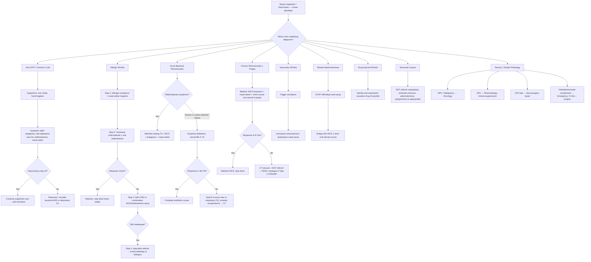

## Management of Nasal Congestion and Runny Nose

Management follows a simple principle: **treat the underlying cause, not just the symptom**. A runny, blocked nose is a final common pathway for dozens of conditions, so the management algorithm branches based on the diagnosis reached in the preceding diagnostic steps. I'll walk through the overall algorithm first, then drill into each treatment modality from first principles.

---

### 1. Master Management Algorithm

---

### 2. General Principles of Management

Before discussing specific drugs, let's establish the framework:

1. **Education and reassurance** — the vast majority of nasal congestion/rhinorrhoea is self-limiting or easily controlled. Patients with viral URTI need to understand that antibiotics will not help and that symptoms naturally take 7–10 days to resolve [1].
2. **Infection control** — ***hand-washing is the most effective method in prevention of transmission*** [1]. This cannot be overstated.
3. **Nasal saline irrigation** — the foundation of therapy for virtually ALL nasal conditions. Isotonic or hypertonic saline physically washes away mucus, allergens, and inflammatory mediators; reduces mucosal oedema (hypertonic); and improves mucociliary clearance. Cheap, safe, effective, and evidence-based.
4. **Treat the cause, not the symptom** — decongestants provide temporary relief but never address the underlying process. The exception is when symptom relief IS the treatment (e.g., viral URTI where there is no specific antiviral).

---

### 3. Management by Condition

#### 3.1 Viral URTI (Common Cold)

***Management: ↓stress + rest + infectious control (especially wash hands) ± symptomatic treatment*** [1].

There is no cure for the common cold. All treatment is symptomatic. Let me explain each modality:

##### A. Analgesics / Antipyretics

| Drug | Mechanism | Evidence / Notes |
|---|---|---|
| ***Paracetamol*** | Inhibits central COX-3 (and possibly COX-2 in CNS) → ↓prostaglandin E2 in hypothalamus → ↓fever setpoint; also has central analgesic effect | ***Proven to be effective and safe*** [1]. ***Does NOT shorten duration of URTI*** [1]. First-line for fever and sore throat pain |
| ***NSAIDs (e.g., ibuprofen)*** | Inhibits peripheral COX-1/2 → ↓prostaglandin synthesis → ↓inflammation, pain, and fever | ***More effective [than paracetamol for pain] but ↑side effects*** [1]. ***Avoided if: (1) not eating well (GI side effects), (2) aspirin-sensitive asthma, (3) renal dysfunction, (4) children due to risk of Reye syndrome [aspirin specifically]*** [1] |

##### B. Nasal Decongestants

These directly address nasal congestion by counteracting the vasodilatation of turbinate venous sinusoids.

| Route | Drug | Mechanism | Key Points |
|---|---|---|---|
| ***Oral*** | ***Pseudoephedrine, phenylephrine*** | Sympathomimetic α-adrenergic agonists → vasoconstriction of nasal submucosal venous sinusoids → ↓turbinate engorgement → ↓congestion | ***Oral: transient relief of nasal congestion, but side effects common (10–20% children), caution if HTN*** [1]. Also avoid in: ischaemic heart disease, hyperthyroidism, BPH (urinary retention), MAOI use, closed-angle glaucoma |
| ***Topical*** | ***Intranasal oxymetazoline (Afrin), xylometazoline*** | Same α-agonist mechanism but applied directly to mucosa → faster onset, more potent local effect | ***Topical: must be limited to 2–3 days as rebound rhinitis medicamentosa occurs after 72h of use*** [1]. This is the drug that ***causes rhinitis medicamentosa when used as topical OTC*** [4] |

> **Why is topical more risky than oral?** Because topical application delivers a high local concentration directly to the mucosal α-receptors, causing rapid and profound vasoconstriction. This high local exposure accelerates receptor downregulation (tachyphylaxis) far more quickly than the lower mucosal concentrations achieved via oral systemic delivery. Hence the strict 3-day limit for topical use.

<Callout title="The 3-Day Rule for Topical Decongestants" type="error">
***Topical decongestants must be limited to 2–3 days*** [1]. After 72 hours of continuous use, α-adrenoreceptor downregulation begins, and stopping the spray causes rebound vasodilatation that is *worse* than the original congestion. This is ***rhinitis medicamentosa*** [4]. Counsel every patient who receives a topical decongestant prescription.
</Callout>

##### C. Antihistamines

| Generation | Examples | Mechanism | Evidence in URTI |
|---|---|---|---|
| ***First-generation (sedating)*** | ***Chlorpheniramine (Piriton), promethazine (Phenergan), diphenhydramine (Benadryl)*** | Block H1 receptors (reversible competitive antagonism) + significant muscarinic (anticholinergic) activity → ↓glandular secretion, ↓rhinorrhoea, ↓sneezing. Also cross the BBB → sedation | ***Sedating: reduces sneezing and rhinorrhoea, also promotes rest, but associated with risk of ↑↑sedation and dry mouth/mucous membranes*** [1]. The anticholinergic "drying" effect is actually why they work in colds — they're functioning more as anticholinergics than antihistamines |
| ***Second-generation (non-sedating)*** | ***Loratadine (Clarityn)***, cetirizine, fexofenadine | Selective H1 antagonism with minimal anticholinergic activity and minimal BBB penetration | ***Non-sedating: much less effective [in URTI] due to lack of anticholinergic activity*** [1]. Reserved for allergic rhinitis where histamine is the primary mediator |

> **Why do first-gen antihistamines work better in colds than second-gen?** Because the runny nose of a cold is largely driven by **parasympathetic (cholinergic) glandular secretion**, not histamine. First-gen antihistamines are "dirty drugs" — they block muscarinic receptors as well as H1 receptors, and it's the anticholinergic effect that dries up secretions. Second-gen antihistamines are cleaner (selective H1), so they lack this drying effect and are therefore less effective for cold-related rhinorrhoea.

##### D. Intranasal Ipratropium Bromide

***Ipratropium nasal spray: proven to be more effective than placebo and normal saline, but not effective if significant nasal congestion. Use often limited by cost and need for supervision*** [1].

- **Mechanism**: Anticholinergic (muscarinic M3 antagonist) → blocks parasympathetic-mediated glandular secretion → ↓rhinorrhoea.
- **Why doesn't it help congestion?** Because congestion is caused by venous sinusoidal engorgement, which is regulated by sympathetic tone (α-adrenergic), not cholinergic tone. Ipratropium only addresses the glandular secretory component.
- **Indication**: Watery rhinorrhoea in viral URTI, vasomotor rhinitis, or senile/gustatory rhinitis where runny nose is the predominant complaint.

##### E. Other Agents for URTI

| Agent | Mechanism | Evidence |
|---|---|---|
| ***Cromolyn sodium nasal spray*** | Mast cell stabiliser → prevents degranulation → ↓mediator release | ***Associated with faster resolution of symptoms with ↓↓side effects*** [1]. Very safe but needs frequent dosing (QID) which limits adherence |
| ***Vitamin C (high dose 1–3g)*** | Antioxidant; may modulate immune function | ***NOT evidence-based. NO benefit if taken at onset of illness. May shorten illness only in 14% adults, 8% children during prophylaxis*** [1] |
| ***Zinc (taken ≤2 days of onset)*** | May inhibit viral replication (blocks viral attachment to nasal epithelium) and modulate immune response | ***Inconsistent evidence. May shorten illness by 1–3 days. Up to 20% with side effects (nausea, vomiting, diarrhoea). Cannot prevent illness*** [1] |

##### F. Cough Treatments in URTI

| Category | Examples | Mechanism | Evidence |
|---|---|---|---|
| ***Expectorants*** | ***Ammonium chloride (NH4Cl), guaifenesin, ipecacuanha*** | Stimulate bronchial secretion or reduce mucus viscosity → easier expectoration | ***NOT proven to be effective by RCT except some evidence on guaifenesin. High doses may cause nausea and vomiting*** [1] |
| ***Cough suppressants (antitussives)*** | ***Dextromethorphan (DXM), codeine, pholcodine*** | Central suppression of cough reflex at medullary level (DXM: NMDA antagonist; codeine: μ-opioid agonist) | ***Uncertain effectiveness in URTI and C/I in COPD, caution in asthma and children as it causes sputum retention and respiratory depression*** [1] |
| ***Mucolytics*** | ***Bromhexine, acetylcysteine*** | Break disulphide bonds in mucus glycoproteins → reduce mucus viscosity | ***NOT evidence-based, may be useful for chronic lung disease with sputum production (e.g. COPD)*** [1] |

**Common cough mixture formulations in HK** [1]:
- ***Benadryl Expectorant (BE)***: diphenhydramine + NH4Cl + sodium citrate
- ***Phensedyl compound linctus***: promethazine + DXM + ephedrine
- ***Cocillana***: herbal extract only
- ***MES (馬尿)***: ammonium bicarbonate + ipecacuanha

<Callout title="Antibiotics for Viral URTI — Just Say No" type="error">
Antibiotics have NO role in uncomplicated viral URTI. ***> 90% of URIs resolve in 10 days*** [1]. Prescribing antibiotics for colds drives antimicrobial resistance, exposes patients to unnecessary side effects (diarrhoea, allergy, C. difficile), and does not shorten illness duration. Educate patients firmly but empathetically.
</Callout>

---

#### 3.2 Allergic Rhinitis

This is the condition where pharmacotherapy has the most robust evidence base. The stepwise approach follows ARIA 2020 guidelines.

##### Step 1: Allergen Avoidance + Nasal Saline Irrigation

| Measure | Mechanism | Evidence |
|---|---|---|
| **House dust mite (HDM) avoidance**: mattress/pillow encasements, wash bedding at ≥ 60°C weekly, reduce carpet/soft furnishings, maintain humidity < 50% | Reduces allergen load → less mast cell activation | Mixed evidence for individual measures; combined multifaceted approach more effective. Important in HK where HDM is dominant |
| **Pet avoidance**: remove animal from home or at least from bedroom | Reduces dander allergen exposure | Most effective strategy but often impractical (patients are attached to pets) |
| **Nasal saline irrigation** (isotonic or hypertonic) | Physically removes allergens and inflammatory mediators from nasal mucosa; hypertonic draws fluid out of oedematous mucosa by osmosis | Moderate evidence of benefit; very safe; recommended as adjunct to all pharmacotherapy |

##### Step 2: Pharmacotherapy — First-Line

**A. Intranasal Corticosteroids (INCS) — THE Cornerstone**

| Drug Examples | Mechanism | Why First-Line |
|---|---|---|
| Fluticasone propionate, mometasone furoate, budesonide, beclomethasone, triamcinolone, ciclesonide | Binds intracellular glucocorticoid receptor → translocates to nucleus → suppresses transcription of pro-inflammatory genes (IL-1, IL-4, IL-5, IL-13, TNF-α, COX-2) and upregulates anti-inflammatory genes. Net effect: ↓eosinophil recruitment, ↓mast cell mediator release, ↓glandular secretion, ↓vascular permeability, ↓oedema | **Most effective single agent for ALL symptoms of AR** — congestion, rhinorrhoea, sneezing, itch, and even ocular symptoms (via naso-ocular reflex). Addresses both early and late phase inflammation. Onset: hours to days, peak effect at 1–2 weeks |

**Practical points:**
- **Technique matters**: point spray laterally (toward ipsilateral ear), away from septum, to avoid septal irritation/epistaxis. Sniff gently, don't snort.
- **Onset is NOT immediate** — counsel patients that it takes days to weeks for full effect. Compliance is the biggest barrier.
- **Side effects**: epistaxis (most common — from direct spray contact with septum), nasal dryness, rarely septal perforation with long-term incorrect use. Systemic absorption is minimal with modern agents (fluticasone furoate, mometasone — < 1% bioavailability).
- **Safe in long-term use** — unlike oral corticosteroids, INCS at recommended doses do not cause HPA axis suppression, growth retardation, or osteoporosis.
- **Preferred in pregnancy**: budesonide (Category B — most safety data in pregnancy).

**B. Oral Antihistamines (Second-Generation)**

| Drug Examples | Mechanism | Role |
|---|---|---|
| Cetirizine, loratadine, fexofenadine, bilastine, desloratadine, levocetirizine | Selective H1 receptor antagonism → blocks histamine-mediated itch, sneeze, rhinorrhoea | Effective for itch, sneeze, rhinorrhoea but **less effective for nasal congestion** (because congestion is driven by late-phase eosinophilic inflammation and leukotrienes more than histamine alone). Used as monotherapy for mild intermittent AR or as add-on to INCS |

**Contraindications/cautions:**
- Cetirizine: mild sedation in some patients (technically "less sedating" rather than "non-sedating")
- Loratadine: least sedating; preferred in pilots/drivers
- Fexofenadine: no sedation; avoid with grapefruit juice (alters absorption)

**C. Combination INCS + Intranasal Antihistamine**

| Drug | Mechanism | When to Use |
|---|---|---|
| Azelastine/fluticasone combination spray (Dymista) | Dual mechanism: corticosteroid anti-inflammatory + local H1 blockade (azelastine also has mast cell stabilising properties). Onset faster than INCS alone (15 min vs. hours–days) | Moderate-severe AR not adequately controlled with INCS alone. More effective than either component alone |

##### Step 3: Add-On Therapy

**A. Leukotriene Receptor Antagonists (LTRA)**

| Drug | Mechanism | Role | Cautions |
|---|---|---|---|
| Montelukast (from "monte" = mountain, originally designed for asthma at higher altitudes metaphorically; "lukast" = leukotriene antagonist) | Blocks cysteinyl leukotriene receptor 1 (CysLT1) → ↓leukotriene-mediated nasal congestion, mucus secretion, and eosinophil recruitment | Add-on to INCS when congestion persists. Particularly useful in patients with concomitant asthma (addresses both conditions). Also useful in AERD/Samter's triad | **FDA boxed warning (2020)**: neuropsychiatric side effects (agitation, depression, suicidal ideation) — counsel patients. Less effective than INCS as monotherapy |

**B. Intranasal Anticholinergic (Ipratropium)**

- Add-on when **watery rhinorrhoea** is the predominant residual symptom despite INCS + antihistamine.
- Blocks M3 muscarinic receptors on submucosal glands → ↓parasympathetic-mediated secretion.
- Does NOT address congestion or itch.

**C. Oral / Intranasal Decongestant (Short-Term)**

- Oral pseudoephedrine or short-course ( ≤ 3 days) topical oxymetazoline for acute exacerbations.
- Never as maintenance therapy.

##### Step 4: Specialist Therapies

**A. Allergen Immunotherapy (AIT)**

| Route | Technique | Mechanism | Indications |
|---|---|---|---|
| **Subcutaneous immunotherapy (SCIT)** | Increasing doses of allergen extract injected SC over 3–5 years | Induces immune tolerance: shifts from Th2 → Th1/Treg response, generates blocking IgG4 antibodies, reduces allergen-specific IgE over time | Moderate-severe AR not controlled by pharmacotherapy; mono- or oligosensitised patients (1–2 dominant allergens); patient preference to reduce long-term medication |
| **Sublingual immunotherapy (SLIT)** | Allergen tablet or drops placed under tongue daily for 3–5 years | Same mechanism as SCIT but via oral mucosal tolerance | Same indications; more convenient (home administration); lower risk of anaphylaxis vs. SCIT; particularly well-established for HDM (important for HK) and grass pollen |

**Key points:**
- **Disease-modifying**: the only treatment that alters the natural history of allergic rhinitis. Can prevent progression to asthma and new sensitisations.
- **Duration**: 3–5 years for sustained benefit.
- **Contraindications**: uncontrolled asthma (risk of severe bronchospasm), immunodeficiency, malignancy, pregnancy (do not initiate, but can continue if already established).

**B. Biologics (for severe uncontrolled AR, often with comorbid asthma/CRSwNP)**

| Drug | Mechanism | Role |
|---|---|---|
| Omalizumab ("o-" prefix = humanised monoclonal; "-mab" = monoclonal antibody) | Anti-IgE monoclonal antibody → binds free IgE → prevents IgE binding to FcεRI on mast cells → ↓sensitisation, ↓mast cell degranulation | Severe allergic rhinitis with elevated IgE, comorbid allergic asthma. Also facilitates safer AIT |
| Dupilumab ("du-" = dual; "-lumab" = interleukin monoclonal antibody) | Anti-IL-4Rα monoclonal antibody → blocks both IL-4 and IL-13 signalling → suppresses Type 2 inflammation | CRSwNP with comorbid AR and asthma (addresses the unified airway) |

---

#### 3.3 Acute Bacterial Rhinosinusitis

##### A. Watchful Waiting (Mild-Moderate)

***Features of viral ARS: generally mimics viral URI with improvement ≤10d*** [1].

- **Most cases of ARS are viral** and resolve without antibiotics.
- If symptoms are mild-moderate and do not meet bacterial criteria, **watchful waiting for 7 days** with symptomatic treatment is appropriate.
- Symptomatic Rx: INCS (reduce mucosal oedema → promote sinus drainage), nasal saline irrigation, analgesics.

##### B. Antibiotics (When Indicated)

***Bacterial ARS (0.5–2%): S. pneumoniae, H. influenzae, Moraxella catarrhalis*** [1].

Antibiotics are indicated when **bacterial ARS criteria are met** (see Diagnostic Criteria section):

| Line | Drug | Dose | Duration | Rationale |
|---|---|---|---|---|
| **First-line** | **Amoxicillin** | 500 mg TDS (adults) or high-dose 1g TDS if risk of resistance | 5–7 days | Covers S. pneumoniae and most H. influenzae. Narrow-spectrum, well-tolerated, cheap. High-dose overcomes intermediate penicillin resistance in pneumococcus |
| **First-line alternative** (penicillin allergy) | **Doxycycline** | 100 mg BD | 5–7 days | Covers all 3 common pathogens. Avoid in children < 8y and pregnancy (dental discolouration, bone growth) |
| **Second-line** (failure after 48–72h) | **Amoxicillin-clavulanate** | 875/125 mg BD or high-dose 2g/125 mg BD | 7–10 days | Clavulanate inhibits β-lactamases produced by H. influenzae and M. catarrhalis → broadens amoxicillin spectrum |
| **Second-line alternative** | **Respiratory fluoroquinolone** (levofloxacin, moxifloxacin) | Levo 500 mg OD; Moxi 400 mg OD | 5–7 days | Reserve for true β-lactam allergy or treatment failure. Broad gram-positive and gram-negative coverage including resistant pneumococcus. **Not first-line** due to resistance concerns and serious side effects (tendinopathy, QT prolongation, aortic aneurysm risk) |

**Contraindications and cautions:**
- **Amoxicillin**: true penicillin anaphylaxis → use doxycycline or respiratory FQ
- **Fluoroquinolones**: avoid in children/adolescents (cartilage damage in animal models), pregnancy, patients on QT-prolonging drugs, history of tendinopathy
- **Macrolides (azithromycin, clarithromycin)**: NOT recommended first-line for bacterial ARS due to high S. pneumoniae resistance rates (>30% in many regions including HK)

##### C. Adjunctive Therapy

| Therapy | Mechanism | Evidence |
|---|---|---|
| **INCS** | Reduces mucosal oedema → opens sinus ostia → promotes drainage | Recommended as adjunct to antibiotics; also effective as monotherapy for mild bacterial ARS |
| **Nasal saline irrigation** | Physical clearance of mucus and inflammatory debris | Recommended as adjunct; improves symptom resolution |
| **Oral decongestant (pseudoephedrine)** | α-agonist → opens ostia | Short-term symptom relief; no evidence it hastens resolution. Avoid in HTN |
| **Topical decongestant** | Same but more potent locally | ***Must be limited to 2–3 days*** [1] |
| **Oral corticosteroids** | Short burst (prednisolone 30–40 mg × 3–5 days) can be considered for severe facial pain/swelling | ↓mucosal oedema rapidly; reserved for severe cases |

---

#### 3.4 Chronic Rhinosinusitis (CRS)

The management of CRS is a long game — think months of medical therapy before considering surgery.

##### A. CRS without Nasal Polyps (CRSsNP)

| Step | Treatment | Mechanism / Rationale |
|---|---|---|
| 1 | **Nasal saline irrigation (large volume, e.g. 240 mL via squeeze bottle)** | Physically clears mucus, crusts, and inflammatory mediators. Improves mucociliary clearance. Foundation of CRS management |
| 2 | **INCS** (fluticasone, mometasone, budesonide) for ≥ 8–12 weeks | Reduces chronic mucosal inflammation → ↓oedema → promotes OMC patency and sinus drainage |
| 3 | **Long-term low-dose macrolide** (clarithromycin 250 mg OD × 3 months) — if ↓eosinophils | Anti-inflammatory (not antibiotic) effect at sub-antimicrobial doses: modulates neutrophilic inflammation, reduces IL-8, improves mucociliary clearance. Most evidence in CRSsNP with normal IgE and low tissue eosinophils |
| 4 | **Culture-directed antibiotics** for acute exacerbations | Based on endoscopy-directed middle meatus swab culture |
| 5 | **Functional Endoscopic Sinus Surgery (FESS)** if ≥ 8–12 weeks of optimal medical therapy fails | Surgically widens sinus ostia → restores ventilation and mucociliary drainage. Does NOT cure the underlying mucosal disease — medical therapy must continue post-operatively |

##### B. CRS with Nasal Polyps (CRSwNP)

| Step | Treatment | Mechanism / Rationale |
|---|---|---|
| 1 | **Nasal saline irrigation + INCS** (topical budesonide rinses are particularly effective as they reach beyond the nasal cavity into the sinuses) | Same as CRSsNP but need higher drug delivery due to polyp bulk |
| 2 | **Short course oral corticosteroids** (prednisolone 0.5 mg/kg/day × 1–2 weeks) | Rapidly shrinks polyps by suppressing eosinophilic inflammation. Provides temporary relief and allows topical INCS to penetrate more effectively. Limit to 2–3 courses/year due to systemic steroid side effects |
| 3 | **FESS (polypectomy + sinus opening)** if medical therapy fails | Debulks polyps and opens sinuses. High recurrence rate (~40–70% over 5 years) because surgery does not address the underlying Type 2 inflammation |
| 4 | **Biologics** (for recurrent polyps or severe Type 2 CRSwNP) | Target the specific cytokine pathways driving polyp formation: |

**Biologics for CRSwNP (EPOS 2020 / currently approved):**

| Drug | Target | Effect | Indication |
|---|---|---|---|
| **Dupilumab** | IL-4Rα → blocks IL-4 and IL-13 | ↓Type 2 inflammation, ↓eosinophil recruitment, ↓polyp size, ↓need for surgery and oral steroids | CRSwNP inadequately controlled after surgery + INCS; comorbid asthma and/or AERD |
| **Omalizumab** | Free IgE | ↓mast cell sensitisation, ↓eosinophil activation | CRSwNP with elevated IgE and comorbid allergic asthma |
| **Mepolizumab** | IL-5 | ↓eosinophil production and survival | CRSwNP with peripheral eosinophilia |
| **Benralizumab** | IL-5Rα | Direct eosinophil depletion via ADCC | Similar to mepolizumab |

##### C. AERD / Samter's Triad (Aspirin-Exacerbated Respiratory Disease)

- Avoid all COX-1 inhibitors (aspirin, NSAIDs).
- INCS + LTRA (montelukast) + FESS for polyps.
- **Aspirin desensitisation**: gradual dose escalation of aspirin under medical supervision → induces tolerance → allows daily aspirin maintenance (reduces polyp recurrence and improves asthma). Mechanism: chronic COX-1 inhibition downregulates CysLT1 receptors and reduces leukotriene overproduction over time.
- Biologics (dupilumab) for refractory cases.

---

#### 3.5 Vasomotor (Non-Allergic) Rhinitis

| Treatment | Mechanism | Notes |
|---|---|---|
| **Trigger avoidance** (cold air, strong odours, spicy food, smoke) | Reduces non-specific trigeminal stimulation | Often impractical but should be attempted |
| **INCS** | Reduces non-specific mucosal hyperreactivity and inflammation | First-line pharmacotherapy; less effective than in AR |
| **Ipratropium bromide nasal spray** | Muscarinic M3 antagonist → blocks parasympathetic glandular secretion | ***Proven to be more effective than placebo and normal saline*** [1]. Particularly effective for the **rhinorrhoea-predominant** subtype and gustatory/senile rhinitis |
| **Azelastine nasal spray** | Intranasal antihistamine with additional anti-inflammatory and mast-cell stabilising properties | Effective even in non-allergic rhinitis (mechanism may be via anti-inflammatory action independent of H1 blockade) |
| **Capsaicin nasal spray** | Desensitises TRPV1 receptors on trigeminal C-fibres → reduces neurogenic inflammation and parasympathetic reflex | Emerging therapy with growing evidence; causes initial burning sensation |

---

#### 3.6 Rhinitis Medicamentosa

***Drugs: topical OTC → rhinitis medicamentosa*** [4].

| Step | Action | Rationale |
|---|---|---|
| 1 | **Stop the offending topical decongestant** | Remove the cause of α-receptor downregulation. Can be done cold turkey or by gradual taper (e.g., one nostril at a time) |
| 2 | **Start INCS** (fluticasone or mometasone) | Reduces mucosal inflammation and oedema from the rebound phase → makes withdrawal tolerable |
| 3 | **Short course oral corticosteroids** if severe (prednisolone 30 mg × 5–7 days) | Bridges the withdrawal period by systemically suppressing mucosal inflammation |
| 4 | **Nasal saline irrigation** | Soothes inflamed mucosa and improves clearance |
| 5 | **Patient education** | Explain the mechanism of rhinitis medicamentosa so the patient understands why they must stop the spray permanently |

---

#### 3.7 Drug-Induced Rhinitis (Non-Decongestant)

| Causative Drug | Action |
|---|---|
| Opioids / ***narcotics*** [4] | Reduce dose or switch to non-histamine-releasing opioid if possible; add INCS for symptom control |
| ACE inhibitors | Switch to ARB (which does not increase bradykinin) |
| β-blockers | Switch to alternative antihypertensive if appropriate |
| OCP / HRT | Consider dose reduction or alternative contraception |

---

#### 3.8 Structural Causes — Surgical Management

| Condition | Procedure | Principle |
|---|---|---|
| **Deviated nasal septum** | **Septoplasty** | Realign/trim deviated cartilage and bone to widen the obstructed airway. Indicated when symptomatic obstruction does not respond to medical therapy |
| **Turbinate hypertrophy** | **Inferior turbinate reduction** (submucosal diathermy, radiofrequency ablation, partial turbinectomy, microdebrider-assisted) | Reduces bulk of hypertrophied turbinate while preserving mucosal function. Avoid total turbinectomy (causes atrophic rhinitis — the "empty nose syndrome") |
| **Adenoid hypertrophy** | **Adenoidectomy** | Remove obstructing adenoid tissue. Indicated when causing significant nasal obstruction, sleep-disordered breathing, or recurrent otitis media |
| **Nasal polyps** | **FESS / polypectomy** | See CRSwNP section above |
| **Foreign body** | **Removal under direct vision** (anterior rhinoscopy ± endoscopy) | Ensure complete removal; consider GA in uncooperative children. Prescribe short-course antibiotics if secondary infection present |
| **Choanal atresia** | **Surgical repair** (transnasal or transpalatal) | Restore choanal patency. Bilateral cases require urgent intervention in neonates (obligate nose breathers). Unilateral can be deferred to later childhood |

---

#### 3.9 Serious / Sinister Pathology — Specialist Referral

| Condition | Management Principle |
|---|---|
| ***Malignancy (NPC, sinonasal tumour)*** [4] | Refer to **head & neck oncology**. NPC: concurrent chemoradiotherapy (cisplatin-based). Sinonasal SCC/adenocarcinoma: surgical resection ± adjuvant radiotherapy |
| ***GPA (Wegener's)*** [4] | Refer to **rheumatology**. Remission induction: cyclophosphamide + glucocorticoids (or rituximab). Maintenance: azathioprine or methotrexate. Nasal saline irrigation for local symptom control |
| ***CSF rhinorrhoea*** [4] | Refer to **neurosurgery**. Conservative trial first (bed rest, head elevation, stool softeners to avoid straining). If persistent: **endoscopic surgical repair** of skull base defect (often using tissue grafts and tissue sealant). Prophylactic antibiotics controversial |
| **Orbital complication of sinusitis** | ***Urgent: IV antibiotics (amoxicillin-clavulanate or ceftriaxone + metronidazole) ± surgical drainage*** [1]. ***Complications: orbital cellulitis, subperiosteal abscess*** requiring emergency ENT + ophthalmology input |
| **Intracranial complication of sinusitis** | ***Urgent: IV antibiotics + neurosurgical consultation*** [1]. ***Meningitis, intracranial abscess, septic cavernous sinus thrombosis*** — high mortality without prompt intervention |

---

### 4. Special Population Considerations

#### 4.1 Children

- **Avoid oral decongestants in children < 6 years** — risk of adverse effects (agitation, insomnia, tachycardia) outweighs benefit; FDA advisory.
- **Avoid codeine in children < 12 years** — CYP2D6 ultra-rapid metabolisers → excessive morphine conversion → respiratory depression and death.
- ***Cough suppressants: uncertain effectiveness in URTI and contraindicated in COPD, caution in asthma and children as it causes sputum retention and respiratory depression*** [1].
- **Intranasal corticosteroids**: safe in children ≥ 2 years for AR. Mometasone and fluticasone furoate have the least systemic absorption.
- **Antihistamines**: cetirizine or loratadine in age-appropriate doses. Avoid first-gen in young children (paradoxical excitation, sedation risk).

#### 4.2 Pregnancy

| Drug | Safety | Notes |
|---|---|---|
| Nasal saline irrigation | Safe | First-line for all nasal symptoms in pregnancy |
| Budesonide INCS | Category B (preferred) | Most safety data in pregnancy of all INCS |
| Chlorpheniramine (first-gen AH) | Category B | Acceptable if needed; sedation may be problematic |
| Cetirizine/loratadine (second-gen AH) | Category B | Preferred if antihistamine needed |
| Oral decongestants (pseudoephedrine) | Category C — **avoid in 1st trimester** | Associated with gastroschisis; vasoconstriction may reduce uteroplacental blood flow |
| Topical oxymetazoline | Limited short-term use acceptable | Minimal systemic absorption |
| Montelukast | Category B | Can continue if already established; do not initiate in pregnancy |
| Immunotherapy | Do not initiate; may continue if established | Risk of anaphylaxis to mother and fetus |

#### 4.3 Elderly

- **Anticholinergic burden**: first-gen antihistamines (chlorpheniramine, diphenhydramine) cause confusion, urinary retention, falls, and constipation in elderly. Prefer second-gen.
- **Oral decongestants**: avoid in elderly with HTN, IHD, BPH, or glaucoma.
- ***Senile rhinorrhoea*** [4]: ipratropium nasal spray is first-line.
- **Intranasal corticosteroids**: safe and effective; first-line for chronic rhinitis in elderly.

---

### 5. Non-Pharmacological / Complementary Approaches

| Approach | Evidence | Mechanism |
|---|---|---|
| **Nasal saline irrigation (NeilMed/Neti pot)** | Strong evidence in AR, CRS, and post-FESS | Physical clearance + osmotic decongestant (hypertonic) |
| **Steam inhalation** | Weak evidence; may provide transient subjective relief | Warm moist air may ↓mucus viscosity and promote vasodilation → temporary decongestion. Risk of scalding (especially children) |
| **Nasal breathing strips (Breathe Right)** | Mild evidence for snoring/nasal valve collapse | Mechanical widening of the nasal valve (the narrowest point) |
| **Acupuncture** | Some evidence for AR (ARIA 2020: conditional recommendation) | Mechanism unclear; may modulate autonomic tone and cytokine balance |
| **Probiotics** | Emerging evidence for AR prevention in children | May modulate gut-associated lymphoid tissue → systemic Th1/Th2 balance |
| **Butterbur extract (Petasites hybridus)** | Comparable to cetirizine in some RCTs for AR | Anti-leukotriene and antihistamine effects. Caution: hepatotoxicity with unpurified preparations |

---

<Callout title="High Yield Summary — Management">

**Viral URTI**: ***Supportive care (rest, hand hygiene, fluids) ± symptomatic treatment*** [1]. NO antibiotics. ***Topical decongestants limited to 2–3 days*** [1]. ***Sedating antihistamines more effective than non-sedating for cold rhinorrhoea (due to anticholinergic activity)*** [1].

**Allergic Rhinitis**: Stepwise — (1) allergen avoidance + saline, (2) INCS ± oral 2nd-gen antihistamine, (3) add LTRA or combination spray, (4) immunotherapy or biologics. INCS is the single most effective agent.

**Bacterial ARS**: First-line antibiotic = **amoxicillin** 5–7 days. Escalate to amoxicillin-clavulanate if no response in 48–72h. Adjuncts: INCS, saline irrigation.

**CRS**: Prolonged medical therapy (INCS + saline ≥ 8–12 weeks) before surgery. CRSwNP: short course oral steroid to shrink polyps; FESS for refractory cases; biologics (dupilumab) for severe Type 2 disease.

**Rhinitis medicamentosa**: ***STOP the topical decongestant*** [4] + bridge with INCS ± short oral steroid.

**Structural causes**: surgical correction (septoplasty, turbinate reduction, adenoidectomy) when medical therapy fails.

**Red flag conditions**: urgent specialist referral (oncology for malignancy, neurosurgery for CSF leak, rheumatology for GPA).

</Callout>

---

<ActiveRecallQuiz
  title="Active Recall - Management of Nasal Congestion and Rhinorrhoea"
  items={[
    {
      question: "Why are first-generation antihistamines more effective than second-generation antihistamines for rhinorrhoea in viral URTI?",
      markscheme: "First-generation antihistamines have significant anticholinergic (muscarinic antagonist) activity in addition to H1 blockade. In viral URTI, rhinorrhoea is primarily driven by parasympathetic (cholinergic) glandular hypersecretion, not histamine. The anticholinergic drying effect of first-generation drugs reduces glandular secretion. Second-generation antihistamines are selective H1 antagonists with minimal anticholinergic activity, so they lack this drying effect."
    },
    {
      question: "Outline the stepwise management of moderate-severe persistent allergic rhinitis according to ARIA guidelines.",
      markscheme: "Step 1: Allergen avoidance + nasal saline irrigation. Step 2: Intranasal corticosteroid (INCS) as first-line, may add oral second-generation antihistamine. Step 3: If inadequate, add LTRA (montelukast) or switch to combination INCS/intranasal antihistamine spray. Step 4: If still inadequate, specialist referral for allergen immunotherapy (SCIT or SLIT, 3-5 years) or biologics (omalizumab for high IgE, dupilumab for Type 2 inflammation)."
    },
    {
      question: "Name the first-line antibiotic for acute bacterial rhinosinusitis, the second-line option if treatment fails, and explain why macrolides are not recommended first-line.",
      markscheme: "First-line: amoxicillin 500mg TDS for 5-7 days (or high-dose 1g TDS if resistance risk). Second-line: amoxicillin-clavulanate (clavulanate inhibits beta-lactamases from H. influenzae and M. catarrhalis). Macrolides (azithromycin, clarithromycin) are not recommended first-line because of high S. pneumoniae resistance rates exceeding 30% in many regions including Hong Kong."
    },
    {
      question: "A patient with CRS with nasal polyps has failed INCS and two courses of oral corticosteroids. What are the next management options?",
      markscheme: "Functional endoscopic sinus surgery (FESS) for polypectomy and sinus opening. If polyps recur post-surgery, consider biologics targeting Type 2 inflammation: dupilumab (anti-IL-4R-alpha, blocks IL-4 and IL-13), omalizumab (anti-IgE), or mepolizumab/benralizumab (anti-IL-5 pathway). Continue INCS and saline irrigation post-operatively as maintenance."
    },
    {
      question: "How do you manage rhinitis medicamentosa? Explain each step and its rationale.",
      markscheme: "(1) Stop the offending topical decongestant - removes the cause of alpha-receptor downregulation. (2) Start intranasal corticosteroid - reduces rebound mucosal inflammation and oedema, making withdrawal tolerable. (3) Short course oral corticosteroids if severe (e.g. prednisolone 30mg for 5-7 days) - bridges the withdrawal period by systemic anti-inflammatory effect. (4) Nasal saline irrigation - soothes inflamed mucosa. (5) Patient education - explain the mechanism so patient understands the need to permanently stop the spray."
    },
    {
      question: "Why is intranasal corticosteroid more effective than oral antihistamines for nasal congestion in allergic rhinitis?",
      markscheme: "Nasal congestion in AR is primarily driven by the late-phase inflammatory response - eosinophil infiltration, leukotriene release, and chronic mucosal oedema. Oral antihistamines only block H1 receptors (early phase histamine effects: itch, sneeze, rhinorrhoea) and have minimal effect on the late-phase eosinophilic inflammation. INCS suppresses the entire inflammatory cascade - early and late phase - by inhibiting pro-inflammatory gene transcription (IL-4, IL-5, IL-13, leukotrienes, prostaglandins), reducing eosinophil recruitment, decreasing vascular permeability, and shrinking oedematous mucosa."
    }
  ]}
/>

## References

[1] Senior notes: Ryan Ho Respiratory.pdf (Sections 3.1.1.1 Acute Coryza — management table, symptomatic treatment; 3.1.1.4 Rhinosinusitis — aetiology, bacterial criteria, complications, imaging)
[4] Lecture slides: murtagh merge.pdf (p67–68 — masquerades checklist: drugs/topical OTC → rhinitis medicamentosa, narcotics; diagnostic tips)
