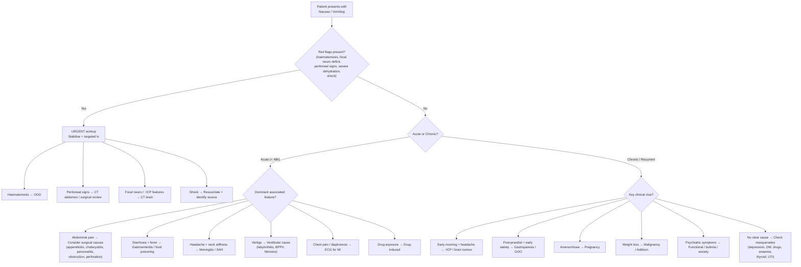

## Differential Diagnosis of Nausea and Vomiting

The differential diagnosis of nausea and vomiting is enormous — it touches every organ system. The key to handling this on a ward round or in an exam is **not** memorising a flat list, but having a structured framework that lets you generate differentials logically from the clinical context. The lecture slides give us exactly this framework via the Murtagh's Diagnostic Strategy [1], which categorises differentials into probability diagnoses, serious disorders not to be missed, pitfalls, masquerades, and psychogenic causes. Let's work through this systematically.

---

### 1. The Murtagh Framework Applied to Nausea and Vomiting

This is the single most important organising tool for your clinical approach. Every patient with nausea/vomiting should trigger you to think through these five categories:

| Category | Purpose | Key Differentials for N/V |
|---|---|---|
| ***Probability diagnosis*** | What's most likely given demographics? | Common, benign causes |
| ***Serious disorders not to be missed*** | What will kill or seriously harm the patient if I miss it? | Surgical emergencies, malignancy, MI, meningitis |
| ***Pitfalls*** | What are the tricky diagnoses that clinicians frequently miss? | Pregnancy, organ failure, labyrinthine disorders, gastroparesis |
| ***Masquerades checklist*** | Systemic diseases that can present as almost anything? | Depression, DM, drugs, anaemia, thyroid, UTI |
| ***Psychogenic / "trying to tell me something"*** | Is there a psychiatric or functional component? | Anxiety, bulimia, functional vomiting |

---

### 2. Probability Diagnoses (The Common Causes by Age Group)

***Probability diagnosis*** — these are the diagnoses you should think of first because they are statistically the most likely [1]:

| Age Group | ***Most Likely Causes*** | Why This Age? |
|---|---|---|
| ***All ages*** | ***Acute gastroenteritis, motion sickness, drugs, various infections*** [1] | Universal exposure to enteric pathogens; motion sickness relates to vestibular-visual mismatch common in all ages; drugs are ubiquitous |
| ***Neonates*** | ***Feeding problems*** [1] | Immature GI tract, overfeeding, swallowed air, incorrect formula preparation, GERD from immature LOS |
| ***Children*** | ***Viral infections/fever, otitis media, UTI*** [1] | Children vomit easily because the vomiting centre has a lower threshold in paediatric age; otitis media causes vestibular stimulation (middle ear → vestibular apparatus proximity); UTI in children is often "silent" with vomiting as the only localising sign |
| ***Adults*** | ***Gastritis, alcohol intoxication, pregnancy, migraine*** [1] | Gastritis from H. pylori / NSAIDs / alcohol; pregnancy-related NVP is near-universal; migraine peaks in young-to-middle adult life |

<Callout title="Why Does Otitis Media Cause Vomiting in Children?" type="idea">
The middle ear is anatomically adjacent to the vestibular apparatus (inner ear). Infection in the middle ear can cause local inflammation that irritates the vestibular system → vestibular nuclei activation (H1 and mACh receptors) → NTS → vomiting centre. This is why children with ear infections often vomit even without any GI pathology. Always check the ears in a vomiting child!
</Callout>

---

### 3. Serious Disorders Not to Be Missed

These are the diagnoses that demand urgent recognition because missing them leads to death or serious morbidity. ***The lecture slides organise them as follows*** [1]:

#### 3.1 Bowel Obstruction

| Condition | Age / Setting | Key Distinguishing Features | Pathophysiology of Vomiting |
|---|---|---|---|
| ***Oesophageal atresia*** [1] | ***Neonates*** | Polyhydramnios on antenatal scan; drooling, choking with first feed; unable to pass NG tube | Complete oesophageal discontinuity → oral intake cannot reach stomach → immediate regurgitation/vomiting |
| ***Pyloric obstruction*** [1] ( < 3 months) | ***Infants < 3 months*** | Projectile non-bilious vomiting; "olive" mass in RUQ; visible peristalsis; hungry baby after vomiting | Hypertrophy of pyloric sphincter muscle → gastric outlet obstruction → gastric distension → vagal mechanoreceptor activation. Non-bilious because obstruction is proximal to ampulla of Vater |
| ***Intestinal malrotation*** [1] | Neonates / infants (but can present at any age) | ***Bilious*** vomiting in a neonate is malrotation with midgut volvulus until proven otherwise; acute abdomen; bloody stool | Malrotated bowel is prone to volvulus around SMA → twisting occludes duodenum → bilious vomiting (obstruction distal to ampulla); also vascular compromise → ischaemia → further vagal activation |
| ***Intussusception*** [1] [21] | Infants 6–36 months (peak) | Intermittent colicky pain (infant draws up legs, screaming); "redcurrant jelly" stool (late sign); sausage-shaped mass in RUQ; ***rectal bleeding and vomiting*** [21] | Proximal bowel telescopes into distal → obstruction + mesenteric vessel compression → venous congestion, oedema, mucosal sloughing → bloody mucus stool; obstruction triggers vagal afferents → vomiting |
| ***Malignancy*** [1] | Any age, especially older adults | Weight loss, dysphagia, anaemia, palpable mass; ***oesophagus, stomach*** specifically mentioned [1] | Tumour causing luminal obstruction or extrinsic compression; also systemic cytokine release → CTZ stimulation |

> ***Bilious vomiting in a neonate is a surgical emergency until proven otherwise*** — it strongly suggests malrotation with midgut volvulus, which can lead to complete midgut infarction within hours.

#### 3.2 Infections

| Condition | Key Distinguishing Features | Pathophysiology of Vomiting |
|---|---|---|
| ***Botulinum poisoning*** [1] | Contaminated food (canned goods); descending flaccid paralysis; diplopia, dysarthria, dysphagia preceding paralysis; no fever | Botulinum toxin blocks ACh release at NMJ → autonomic dysfunction (including GI dysmotility) → nausea/vomiting in early phase; also direct CTZ stimulation by toxin |
| ***Septicaemia*** [1] | Fever, rigors, tachycardia, hypotension; source of infection (eg. UTI, pneumonia, line infection) | Circulating endotoxins and inflammatory cytokines (TNF-α, IL-1, IL-6) → CTZ stimulation; also splanchnic hypoperfusion → GI mucosal injury → vagal afferents |
| ***Meningitis/encephalitis*** [1] [10] | Headache, fever, neck stiffness, photophobia, altered consciousness; ***nausea and vomiting are features of meningeal irritation*** [10] | ↑ICP from inflammation → brainstem vomiting centre compression; also meningeal irritation directly stimulates emetic pathways |
| ***Infective endocarditis*** [1] | New murmur, splinter haemorrhages, Osler nodes, Janeway lesions, septic emboli; nausea is a non-specific systemic symptom | Septicaemia → circulating bacterial products → CTZ; also renal failure from emboli → uraemia → CTZ |
| ***Acute viral hepatitis*** [1] | Jaundice, RUQ pain, dark urine, pale stool; prodrome of malaise, anorexia, nausea; elevated transaminases | Hepatocyte inflammation → release of inflammatory mediators → CTZ; also hepatic capsular distension → visceral afferents |

#### 3.3 Malignancy

***Malignancy*** is listed separately as a "serious disorder not to be missed" [1]. Key points:
- Gastric cancer [5][22]: ***Nausea and vomiting*** from GOO (distal tumours) or poor distensibility (linitis plastica); also early satiety, weight loss, anaemia. ***Presenting features: weight loss (62%), abd pain (52%), nausea (34%)*** [22]
- Oesophageal cancer: Progressive dysphagia (solids → liquids) with regurgitation
- Pancreatic cancer: Epigastric pain radiating to back, jaundice, weight loss; GOO from head of pancreas tumour compressing duodenum
- Brain tumours: ***Vomiting ↑when exertion/cough*** and ***worse when supine*** [11] — from raised ICP

#### 3.4 Intracranial Disorders

***Intracranial disorders: malignancy, cerebellar haemorrhage, PICA infarction*** [1]

| Condition | Key Features | Why Vomiting? |
|---|---|---|
| ***Intracranial malignancy*** [1] | Progressive headache, focal neurological deficits, papilloedema; morning vomiting | ↑ICP → direct compression of brainstem emetic centres; often projectile without preceding nausea |
| ***Cerebellar haemorrhage*** [1] | Sudden severe occipital headache, ataxia, dysarthria, nystagmus, reduced consciousness | Posterior fossa mass effect → direct compression of 4th ventricle floor (where CTZ sits) and brainstem vomiting centre; also acute obstructive hydrocephalus → ↑ICP |
| ***PICA infarction*** [1] (posterior inferior cerebellar artery = lateral medullary / Wallenberg syndrome) | Vertigo, nystagmus, ipsilateral Horner's, ipsilateral facial numbness, contralateral body pain/temp loss, dysphagia, hoarseness | PICA supplies the lateral medulla — home to the NTS and vestibular nuclei → direct ischaemic injury to the vomiting coordination centres; also severe vertigo from vestibular nuclear damage |

<Callout title="PICA Infarction — The Vomiting Stroke" type="idea">
Wallenberg syndrome (lateral medullary syndrome from PICA occlusion) is one of the few strokes where intractable nausea and vomiting are a *dominant* presenting feature. This is because the lateral medulla contains both the NTS (relay centre for vomiting) and vestibular nuclei. The combination of violent vertigo + vomiting + crossed sensory loss + ipsilateral Horner syndrome is pathognomonic.
</Callout>

#### 3.5 Other Surgical and Medical Emergencies

| Condition | Key Features | Pathophysiology of Vomiting |
|---|---|---|
| ***Acute appendicitis*** [1] [23] | Classical Murphy's sequence: periumbilical pain → RLQ pain → anorexia → ***nausea and vomiting*** [23]; fever, RLQ tenderness | Visceral peritoneal inflammation → vagal afferents; also peritoneal irritation after parietal peritoneum involvement |
| ***Acute pancreatitis*** [1] [4] | Severe epigastric pain radiating to back, relieved by leaning forward; ***nausea and vomiting*** is a key associated symptom [4]; elevated lipase | Retroperitoneal inflammation → visceral afferent (coeliac plexus) stimulation → NTS; also systemic cytokines (TNF-α, IL-6) → CTZ |
| ***Acute myocardial infarction*** [1] [24] | ***Especially painless MI*** [1]; chest pain (if present), diaphoresis; ***vomiting, sinus bradycardia: due to vagal stimulation (esp in inferior MI)*** [24] | Inferior MI → ischaemia of inferior myocardium → Bezold–Jarisch reflex (vagal stimulation) → bradycardia + nausea/vomiting. Painless MI is particularly dangerous because vomiting may be the *only* symptom (especially in elderly and diabetic patients) |

<Callout title="Exam Pearl — Don't Miss MI!" type="error">
A middle-aged or elderly patient presenting with "unexplained" nausea and vomiting — especially with risk factors for coronary artery disease, diaphoresis, or ECG changes — may be having an acute MI. The lecture slides specifically highlight ***acute myocardial infarction (e.g. painless)*** as a serious disorder not to be missed [1]. Always get an ECG in an older patient with unexplained vomiting.
</Callout>

---

### 4. Pitfalls (Commonly Missed Diagnoses)

***Pitfalls (mainly adults)*** [1] — these are the diagnoses that clinicians frequently overlook:

| Pitfall | Why It's Missed | Key Distinguishing Clue |
|---|---|---|
| ***Pregnancy (early)*** [1] | Clinicians forget to ask about LMP or don't consider pregnancy in atypical presentations | Always ask LMP; urine β-hCG in any woman of reproductive age with unexplained N/V |
| ***Organ failure: liver, kidney (uraemia), heart, respiratory*** [1] | Nausea is non-specific and attributed to other causes; organ failure develops insidiously | Check LFT, RFT (creatinine, urea), BNP, SpO2/ABG; uraemic patients have characteristic fetor |
| ***Labyrinthine disorders: Ménière syndrome, labyrinthitis*** [1] | Vomiting may overshadow the vestibular symptoms | Ask specifically about vertigo, tinnitus, hearing loss; Ménière = episodic vertigo + tinnitus + sensorineural hearing loss + aural fullness |
| ***Poisoning: food, chemicals*** [1] | History may be concealed (intentional ingestion) or not volunteered | Detailed dietary/exposure history; check for coingestion; toxicology screen |
| ***Gut motility disorders: achalasia*** [1] | Regurgitation misinterpreted as vomiting; dysphagia may be subtle | Dysphagia to BOTH solids and liquids from onset (cf. mechanical obstruction = solids first); "bird's beak" on barium swallow |
| ***Paralytic ileus*** [1] [6] | Attributed to post-operative state and not investigated further | Should raise concern if persisting beyond physiological duration: ***definition of prolonged ileus: on or after post-op day 4, there is ≥ 2 of nausea/vomiting, inability to tolerate oral diet, absence of flatus, abdominal distension, radiological confirmation*** [6] |
| ***Substance abuse (e.g. opioids, ecstasy)*** [1] | Patients may not disclose drug use | Non-judgmental substance use history; opioids → constipation + miosis; cannabis hyperemesis → compulsive hot bathing |
| ***Radiation therapy*** [1] | Not considered as a cause when vomiting starts days after radiation | Temporal relationship with radiation treatment; abdominal/pelvic radiation is highest risk |
| ***Hypercalcaemia*** [1] | Non-specific symptoms ("bones, stones, groans, moans") attributed to other causes | Check serum calcium (corrected for albumin); common causes: primary hyperparathyroidism, malignancy |
| ***Functional obstruction: diabetic gastroparesis, idiopathic gastroparesis*** [1] [25] | Symptoms overlap with functional dyspepsia; delayed gastric emptying not investigated | ***Gastroparesis clinical features: N/V, abdominal pain, early satiety, post-prandial fullness, bloating*** [25]; diagnosis requires nuclear gastric emptying study after excluding mechanical obstruction |

---

### 5. Masquerades Checklist

***Masquerades checklist*** [1] — these are systemic diseases that can present with nausea/vomiting as a prominent or even sole feature:

| Masquerade | How It Presents as N/V | Key Diagnostic Approach |
|---|---|---|
| ***Depression (possible)*** [1] | Somatisation → chronic nausea, anorexia; also medications (SSRIs) cause nausea | Screen for depression (PHQ-9); ask about mood, sleep, anhedonia |
| ***Diabetes (ketoacidosis)*** [1] [7] | ***DKA: acute abdomen — diffuse abdominal pain, nausea, vomiting (due to ileus, usually only if severe acidosis)*** [7]; hyperglycaemia → osmotic diuresis → dehydration | Finger-prick glucose, blood ketones, ABG; fruity breath and Kussmaul respiration are clues |
| ***Drugs (multiple)*** [1] | Almost any drug can cause nausea; polypharmacy in elderly amplifies risk | Meticulous drug history including OTC, herbal, recreational; temporal relationship of symptom onset with drug initiation |
| ***Anaemia (possible)*** [1] | Severe anaemia → tissue hypoxia → nausea; also IDA may indicate occult GI malignancy causing both anaemia AND vomiting | FBC, iron studies, reticulocyte count; investigate cause of anaemia |
| ***Thyroid and other endocrine disorders (Addison disease)*** [1] [26] | Addison: ***nausea, vomiting, diarrhoea*** in acute crisis; ***nausea, vomiting, abdominal pain*** in chronic insufficiency [26]; thyrotoxicosis → ↑GI motility → nausea | TFTs; morning cortisol + ACTH ± short synacthen test; look for hyperpigmentation (primary adrenal insufficiency) |
| ***UTI esp. pyelonephritis*** [1] | Systemic inflammatory response → nausea; pyelonephritis causes flank pain, fever, rigors; in elderly/children UTI may present solely with vomiting | Urinalysis and urine culture; in children, *always* check urine in unexplained vomiting |

---

### 6. Psychogenic / "Is the Patient Trying to Tell Me Something?"

***Possibly: extreme stress and anxiety (e.g. panic attacks). Consider bulimia (self-induced vomiting) and functional (psychogenic).*** [1]

| Condition | Key Features | How to Approach |
|---|---|---|
| ***Anxiety / panic attacks*** [1] [27] | Episodic nausea with palpitations, diaphoresis, tremor, paraesthesias, feelings of doom; ***nausea or abdominal distress*** is one of the DSM-5 panic attack criteria [27] | Screen for anxiety; note that nausea in panic attacks occurs via autonomic activation (sympathetic overdrive → ↓gastric motility + ↑acid secretion) |
| ***Bulimia nervosa (self-induced vomiting)*** [1] | Binge-purge cycle; vomiting is self-induced → patient may present with "vomiting" without disclosing the self-induced nature; look for parotid enlargement, Russell's sign, dental erosion, hypokalaemic metabolic alkalosis | Sensitive, non-judgmental enquiry about eating habits and body image; check electrolytes (hypokalaemia + metabolic alkalosis is a red flag) |
| ***Functional (psychogenic) vomiting*** [1] | Rome IV criteria: stereotypical vomiting occurring ≥ 1 day/week; absence of self-induced vomiting; absence of criteria for eating disorder, rumination, or cyclic vomiting syndrome; no organic explanation after appropriate workup | Diagnosis of exclusion; but positive features (eg. vomiting around emotionally charged situations, normal weight, no alarm features) support the diagnosis |

---

### 7. Differential Diagnosis by Clinical Context

Here's a practical approach to narrowing the differential based on the dominant clinical picture:

#### 7.1 By Dominant Associated Symptom

| Dominant Associated Feature | Top Differentials | Key Investigations |
|---|---|---|
| **Abdominal pain** | Acute appendicitis [23], pancreatitis [4], cholecystitis [28], PUD [29], bowel obstruction, perforated viscus | Examination (peritoneal signs); amylase/lipase; AXR/CT; USG (biliary) |
| **Diarrhoea** | Gastroenteritis (most common), food poisoning, overflow diarrhoea from obstruction, carcinoid, thyrotoxicosis | Stool culture; FBC; TFTs if chronic |
| **Headache** | Migraine [11], ↑ICP (tumour, hydrocephalus), meningitis [10], SAH, ***cerebellar haemorrhage, PICA infarction*** [1] | Neurological examination; CT brain; LP if meningitis suspected and no ↑ICP |
| **Vertigo** | Vestibular neuritis, BPPV, Ménière disease, labyrinthitis [1], posterior fossa stroke | Dix-Hallpike; head impulse test; MRI if central features |
| **Chest pain** | Acute MI [1][24], aortic dissection, oesophageal rupture (Boerhaave) | ECG (serial); troponin; CT aortogram if dissection suspected |
| **Pregnancy** | Nausea and vomiting of pregnancy, hyperemesis gravidarum, molar pregnancy, ectopic pregnancy | Urine β-hCG; USS pelvis |
| **Weight loss** | Malignancy (gastric [22], oesophageal, pancreatic, brain), Addison disease [26], DM (DKA) [7], eating disorder, gastroparesis | OGD; CT TAP; cortisol/ACTH; HbA1c; nuclear gastric emptying |
| **Post-operative** | PONV [2], prolonged paralytic ileus [6], adhesive SBO, anastomotic leak | Clinical assessment; AXR/CT; WCC, CRP |

#### 7.2 By Timing of Vomiting

| Timing | Most Likely Differential | Why? |
|---|---|---|
| **Immediately with/after eating** | Psychogenic, pyloric channel ulcer, high GOO | Conditioned response (psychogenic); mechanical obstruction at pylorus |
| **1–4 hours after eating** | Gastroparesis [25], GOO (malignant or benign) [3] | Delayed gastric emptying → retained food eventually triggers forceful contraction or distension |
| **Early morning / before breakfast** | ***Pregnancy*** [1], ***↑ICP*** [1] (brain tumour), ***uraemia*** [1], alcoholic gastritis | Pregnancy: hCG peaks in morning; ↑ICP: supine position overnight → ↑venous return → ↑ICP; uraemia: toxin accumulation overnight |
| **Late in the day / evening** | Gastroparesis, GOO | Cumulative food retention throughout the day |
| **Unrelated to meals** | Drugs, metabolic causes (DKA, hypercalcaemia), CNS causes, vestibular, psychiatric | Systemic/central causes are independent of food intake |

#### 7.3 By Character of Vomitus

| Character | Top Differentials |
|---|---|
| ***Non-bilious, projectile, undigested food*** | Pyloric stenosis (infantile or adult GOO) [3]; also high oesophageal obstruction (achalasia) |
| **Bilious (green/yellow)** | Obstruction distal to ampulla of Vater (duodenal/jejunal); ***malrotation with volvulus in neonates*** [1] |
| **Faeculent** | Distal small bowel or large bowel obstruction; gastrocolic fistula |
| **Coffee-ground / haematemesis** | PUD [29], variceal bleed, Mallory–Weiss tear, erosive gastritis, gastric cancer [22] |
| ***Projectile without preceding nausea*** | ***↑ICP*** [1]: brainstem compression bypasses the normal "nausea phase" |

---

### 8. Systematic Differential Diagnosis by Organ System

For completeness and exam revision, here is the full systematic differential organised by organ system:

| System | Conditions |
|---|---|
| **GI — Luminal** | Gastroenteritis, PUD [29], gastritis [22], GERD, GOO (benign/malignant) [3], achalasia, bowel obstruction (adhesive SBO, hernia, volvulus [30], intussusception [21], malignancy), appendicitis [23], Mallory–Weiss tear, gastroparesis [25], functional dyspepsia [18] |
| **GI — Hepatobiliary/Pancreatic** | Acute cholecystitis [28], choledocholithiasis/cholangitis, acute pancreatitis [4], chronic pancreatitis, hepatitis (viral/alcoholic/drug-induced), liver failure, HCC |
| **CNS** | ↑ICP (tumour, hydrocephalus, IIH), meningitis/encephalitis [10], migraine [11], ***cerebellar haemorrhage*** [1], ***PICA infarction*** [1], SAH, concussion/head injury |
| **Vestibular** | Ménière disease [1], vestibular neuritis, labyrinthitis [1], BPPV, motion sickness |
| **Cardiovascular** | Acute MI (especially inferior) [24], heart failure, hypertensive crisis |
| **Metabolic/Endocrine** | DKA [7], HHS, uraemia, hypercalcaemia [1], hyponatraemia [8], Addison disease [26], thyrotoxicosis |
| **Drugs/Toxins** | Opioids, chemotherapy, antibiotics, NSAIDs, digoxin, SSRIs, radiation [1], alcohol, substance abuse [1], poisoning [1] |
| **Infectious (non-GI)** | UTI/pyelonephritis [1], septicaemia [1], otitis media (children) [1], pneumonia |
| **Gynaecological/Obstetric** | NVP, hyperemesis gravidarum, ectopic pregnancy, ovarian torsion, PID |
| **Surgical/Post-operative** | PONV [2], paralytic ileus [6], adhesive SBO, anastomotic leak |
| **Psychiatric/Functional** | Anxiety/panic attacks [1][27], bulimia [1], functional vomiting, cyclic vomiting syndrome, cannabis hyperemesis syndrome |

---

### 9. Clinical Decision-Making Algorithm

The following algorithm integrates the Murtagh framework with clinical reasoning to guide your differential diagnosis:

---

### 10. Special Populations — Differential Diagnosis Considerations

#### 10.1 Neonates and Infants

| Timing / Type of Vomiting | Consider | Urgency |
|---|---|---|
| ***Immediate vomiting with first feed*** | ***Oesophageal atresia*** [1] | Surgical emergency |
| ***Projectile non-bilious vomiting at 2–8 weeks*** | ***Pyloric stenosis*** [1] | Urgent — needs pyloromyotomy |
| ***Bilious vomiting*** | ***Intestinal malrotation with midgut volvulus*** [1] | Surgical emergency — vascular compromise |
| Intermittent colicky pain with "redcurrant jelly" stool (6–36 months) | ***Intussusception*** [1][21] | Urgent — air enema reduction or surgery |
| Non-specific vomiting with fever | ***UTI*** [1], viral infection, otitis media [1] | Workup with urinalysis mandatory |

#### 10.2 Pregnant Women

- **NVP** (weeks 6–12): most common; diagnosis of exclusion
- **Hyperemesis gravidarum**: > 5% weight loss, ketonuria, electrolyte disturbance
- **Molar pregnancy**: exaggerated NVP, uterus large for dates, very high β-hCG
- **Ectopic pregnancy**: pelvic pain + vaginal bleeding + positive β-hCG; vomiting from peritoneal irritation if ruptured

#### 10.3 Post-operative Patients

- ***PONV*** [2]: onset within 24 hours; risk factors as per previous section
- ***Prolonged paralytic ileus*** [6]: onset post-op day 4 or later; rule out surgical complications
- **Adhesive SBO**: especially if previous abdominal surgery; colicky pain, distension, absolute constipation
- **Anastomotic leak**: fever, tachycardia, peritoneal signs, rising inflammatory markers

#### 10.4 The Elderly Patient

The elderly deserve special attention because:
- **Atypical presentations** are the norm: MI may be painless [1][24]; meningitis may lack neck stiffness; UTI may present only with vomiting and confusion
- **Polypharmacy**: ***drugs (multiple)*** [1] is a leading cause
- **Malignancy**: gastric, pancreatic, and brain tumours are more common
- **Metabolic**: uraemia [1], hypercalcaemia [1] (from malignancy or hyperparathyroidism)

---

### 11. Key Differentiating Features Between Important Pairs

| Condition A | Condition B | How to Differentiate |
|---|---|---|
| **Pyloric stenosis** (infant) | **Malrotation** (neonate) | Pyloric stenosis = ***non-bilious*** projectile vomiting, age 2–8 weeks. Malrotation = ***bilious*** vomiting, can present at any neonatal age |
| **Mechanical SBO** | **Paralytic ileus** [6] | SBO = colicky pain, high-pitched bowel sounds, visible peristalsis. Ileus = continuous dull pain, absent bowel sounds; look for metabolic/drug cause |
| **Gastric outlet obstruction** [3] | **Gastroparesis** [25] | GOO = mechanical (succussion splash, visible peristalsis, CT shows mass/stricture). Gastroparesis = functional (no mechanical obstruction on OGD/CT; confirmed by nuclear gastric emptying study) |
| **Central (↑ICP) vomiting** | **GI cause vomiting** | ↑ICP = ***projectile without preceding nausea***, morning predominance, headache worse with cough/recumbency, papilloedema. GI = nausea typically precedes vomiting, related to meals, abdominal symptoms present |
| **Acute appendicitis** [23] | **Gastroenteritis** | Appendicitis = ***pain precedes vomiting*** (Murphy's sequence); localised RLQ tenderness. Gastroenteritis = vomiting and diarrhoea precede or accompany pain; diffuse tenderness |
| **Biliary colic** [28] | **Acute cholecystitis** [28] | Biliary colic = pain resolves within 6 hours, afebrile, no peritoneal signs. Cholecystitis = pain persists > 6 hours, ***fever, anorexia, nausea and vomiting***, positive Murphy's sign [28] |

---

<Callout title="High Yield Summary — Differential Diagnosis of Nausea and Vomiting">

**Murtagh's Five Categories** [1]:
1. **Probability diagnoses**: Gastroenteritis (all ages), feeding problems (neonates), viral infections/otitis media/UTI (children), gastritis/alcohol/pregnancy/migraine (adults)
2. **Serious not to miss**: Bowel obstruction (oesophageal atresia, pyloric stenosis, malrotation, intussusception, malignancy), infections (botulism, septicaemia, meningitis, IE, hepatitis), intracranial disorders (tumour, cerebellar haemorrhage, PICA infarction), appendicitis, pancreatitis, acute MI (especially painless)
3. **Pitfalls**: Pregnancy, organ failure, labyrinthine disorders, poisoning, achalasia, paralytic ileus, substance abuse, radiation, hypercalcaemia, gastroparesis
4. **Masquerades**: Depression, DM (DKA), drugs, anaemia, thyroid/Addison, UTI
5. **Psychogenic**: Anxiety/panic attacks, bulimia, functional vomiting

**Neonatal bilious vomiting = malrotation with midgut volvulus until proven otherwise** → surgical emergency.

**Always consider MI in elderly/diabetic patients with unexplained vomiting** — get an ECG.

**Always consider pregnancy in women of reproductive age** — check β-hCG.

**Character of vomitus is diagnostic**: non-bilious → proximal to ampulla; bilious → distal to ampulla; faeculent → distal obstruction; projectile without nausea → ↑ICP.

**Murphy's sequence (pain → anorexia → vomiting)** favours appendicitis over gastroenteritis.

</Callout>

---

<ActiveRecallQuiz
  title="Active Recall - Differential Diagnosis of Nausea and Vomiting"
  items={[
    {
      question: "A 3-week-old baby presents with projectile non-bilious vomiting after feeds. The baby appears hungry immediately after vomiting. What is the most likely diagnosis, and why is the vomitus non-bilious?",
      markscheme: "Infantile hypertrophic pyloric stenosis. Non-bilious because the obstruction is at the pylorus, which is proximal to the ampulla of Vater where bile enters the duodenum. Therefore bile cannot mix with gastric contents. Typical age 2-8 weeks. Olive-shaped mass may be palpable in RUQ."
    },
    {
      question: "List the five categories of Murtagh's diagnostic strategy applied to vomiting and give one example diagnosis for each category.",
      markscheme: "1. Probability diagnosis (e.g. gastroenteritis, gastritis, pregnancy). 2. Serious disorders not to be missed (e.g. bowel obstruction, meningitis, MI, appendicitis, malignancy). 3. Pitfalls (e.g. pregnancy, hypercalcaemia, gastroparesis, labyrinthine disorders). 4. Masquerades checklist (e.g. depression, DKA, drugs, thyroid, UTI, anaemia). 5. Psychogenic (e.g. bulimia, anxiety/panic, functional vomiting). One example per category required."
    },
    {
      question: "A 70-year-old diabetic man presents with nausea, vomiting and diaphoresis but denies chest pain. What critical diagnosis must you exclude and what single investigation should you order immediately?",
      markscheme: "Acute myocardial infarction (painless/silent MI). Elderly and diabetic patients frequently have atypical presentations. Order a 12-lead ECG immediately. Also check troponin. Inferior MI causes vomiting via the Bezold-Jarisch reflex (vagal stimulation)."
    },
    {
      question: "How do you distinguish vomiting from raised intracranial pressure versus a gastrointestinal cause based on clinical features alone?",
      markscheme: "Raised ICP: projectile vomiting often without preceding nausea; worse in the morning and with recumbency; associated with headache exacerbated by cough/straining; papilloedema on fundoscopy; may have focal neurological deficits. GI cause: nausea typically precedes vomiting; related to meals; associated abdominal pain/distension/altered bowel habit; no neurological signs."
    },
    {
      question: "A neonate presents with bilious (green) vomiting on day 2 of life. What is the most important diagnosis to exclude and why is it an emergency?",
      markscheme: "Intestinal malrotation with midgut volvulus. Emergency because the volvulus twists around the SMA, compromising blood supply to the entire midgut (duodenum to mid-transverse colon). Complete midgut infarction can occur within hours if not surgically corrected. Bilious vomiting in a neonate is this diagnosis until proven otherwise."
    },
    {
      question: "Explain why PICA infarction (Wallenberg syndrome) causes intractable nausea and vomiting. Which structures are damaged?",
      markscheme: "PICA supplies the lateral medulla, which contains the nucleus tractus solitarius (NTS, the main relay centre for the vomiting reflex) and the vestibular nuclei. Ischaemic damage to these structures directly disrupts the vomiting coordination centres and causes severe vertigo, both of which produce intractable nausea and vomiting. Other features: ipsilateral Horner syndrome, ipsilateral facial numbness (CN V), contralateral body pain/temperature loss, dysphagia, hoarseness."
    }
  ]}
/>

---

## References

[1] Lecture slides: murtagh merge.pdf (p106–107, "Vomiting — Probability diagnosis, Serious disorders not to be missed, Pitfalls, Masquerades checklist, Key history, Key examination")
[2] Senior notes: maxim.md (section: "Postoperative nausea and vomiting (PONV)")
[3] Senior notes: maxim.md (section: "Gastric outlet obstruction")
[4] Senior notes: felixlai.md (section: "Acute Pancreatitis — Clinical manifestation")
[5] Senior notes: felixlai.md (section: "Gastric Cancer — Clinical manifestation")
[6] Senior notes: Ryan Ho GI.pdf (p141, "Paralytic Ileus")
[7] Senior notes: Ryan Ho Endocrine.pdf (p91, "Diabetic Ketoacidosis")
[8] Senior notes: Ryan Ho Chemical Path.pdf (p6, "Hyponatremia")
[10] Senior notes: Ryan Ho Neurology.pdf (p142, "Meningitis — Clinical Features")
[11] Senior notes: Ryan Ho Neurology.pdf (p58, "Approach to Headache — Red flags and primary headache syndromes")
[18] Senior notes: felixlai.md (section: "Dyspepsia — Overview") and Ryan Ho Fundamentals.pdf (p263, "Approach to Dyspepsia")
[21] Senior notes: felixlai.md (section: "Intussusception")
[22] Senior notes: Ryan Ho GI.pdf (p84, "Gastric Cancer — Clinical features")
[23] Senior notes: felixlai.md (section: "Acute Appendicitis — Clinical manifestation and diagnosis")
[24] Senior notes: Ryan Ho Cardiology.pdf (p128, "Clinical Features of ACS")
[25] Senior notes: maxim.md (section: "Gastroparesis")
[26] Senior notes: Ryan Ho Endocrine.pdf (p71, "Adrenal Insufficiency — Clinical presentation and diagnosis")
[27] Senior notes: Ryan Ho Psychiatry.pdf (p179, "Panic Disorder — Diagnostic criteria")
[28] Senior notes: felixlai.md (section: "Acute Cholecystitis — Differential diagnosis")
[29] Senior notes: felixlai.md (section: "Peptic Ulcer Disease — Clinical manifestation")
[30] Senior notes: felixlai.md (section: "Volvulus — Clinical manifestation")
