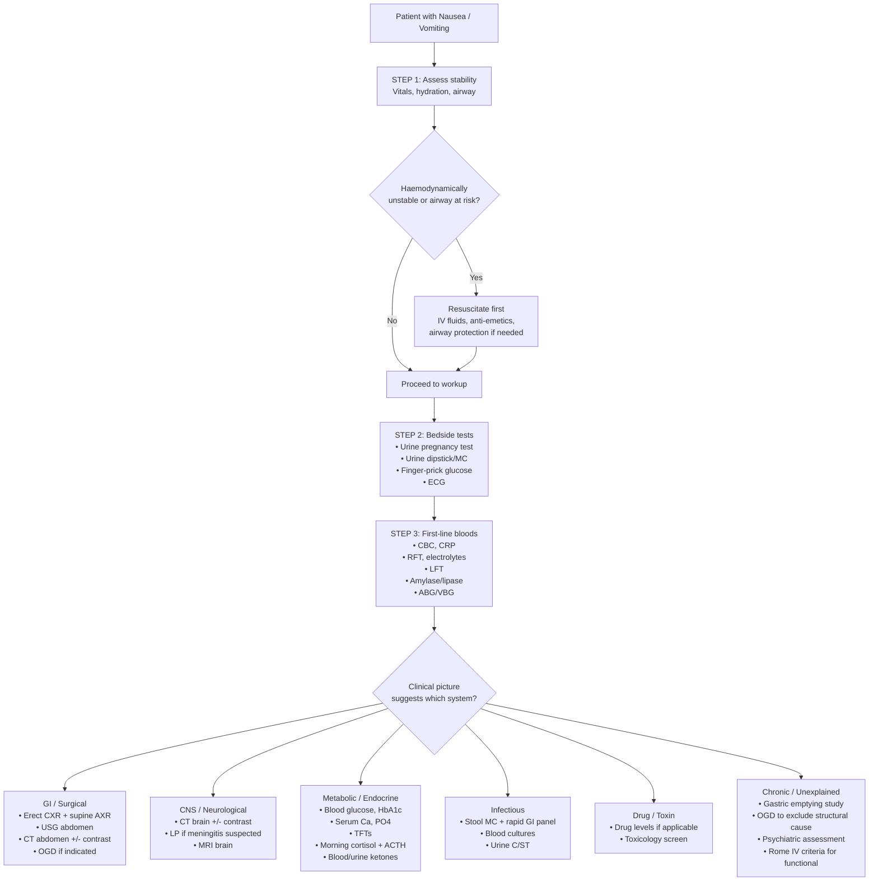

## Diagnostic Approach to Nausea and Vomiting

Nausea and vomiting is a **symptom**, not a disease. There is no single "diagnostic criterion" for it in the way we have diagnostic criteria for, say, DKA or pancreatitis. Instead, the diagnostic approach is about **finding the underlying cause** while simultaneously **assessing and managing the consequences** (dehydration, electrolyte disturbance). Think of it as a two-track process running in parallel.

---

### 1. Principles of the Diagnostic Approach

Before diving into specific investigations, let's establish the logical framework. When a patient presents with nausea and vomiting, you are asking three questions simultaneously:

1. **Is this patient in danger right now?** → Assess haemodynamic stability, airway safety, hydration status.
2. **What is causing the vomiting?** → Directed history, examination, and targeted investigations.
3. **What metabolic consequences has the vomiting caused?** → Electrolytes, acid-base status, renal function.

***Always assess the patient's condition including the level of hydration*** [1].

***Key investigations*** from the lecture slides [1]: ***Look for the cause and also consider biochemical abnormalities resulting from fluid and electrolyte loss.***

---

### 2. Bedside Assessment — The Clinical Evaluation

This is your most powerful diagnostic tool. A good history and examination will narrow the differential from hundreds of causes down to a handful — and often gives you the diagnosis outright.

#### 2.1 History — The Diagnostic Engine

As discussed in the previous sections, the structured history should cover:

| History Domain | What You're Looking For | Which Cause It Points To |
|---|---|---|
| **Onset and duration** | Acute vs. chronic/recurrent | Acute → infection, obstruction, drugs, DKA. Chronic → gastroparesis, ↑ICP, functional |
| **Timing relative to meals** | Before, during, after, unrelated | See timing table in DDx section |
| **Character of vomitus** | Bilious, non-bilious, faeculent, bloody, coffee-ground | Localises level of obstruction; blood suggests mucosal injury |
| **Projectile? Without nausea?** | Forceful and sudden | ↑ICP (projectile without nausea); GOO (projectile with nausea) |
| **Associated symptoms** | Pain, diarrhoea, headache, vertigo, chest pain, fever | Localises organ system |
| ***Drug history*** [1] | All medications, OTC, herbal, recreational | ***Drug ingestion is a common cause of nausea and vomiting so check for prescribed drugs and illicit street drugs such as heroin and ecstasy*** [1] |
| **Pregnancy** | LMP, possibility of pregnancy | NVP, hyperemesis gravidarum, ectopic |
| **Surgical history** | Previous abdominal/pelvic operations | Adhesive bowel obstruction |
| **Psychiatric / social** | Mood, anxiety, body image, eating behaviours | Bulimia, functional, psychogenic |

***Diagnostic tips from lectures*** [1]: ***The common cause of acute nausea and vomiting in most age groups is gastroenteritis.***

#### 2.2 Physical Examination — Systematic and Targeted

***Key examination*** [1] highlights what the physical examination should focus on. Let's expand this with the pathophysiological rationale for each component:

| Examination Component | What You're Looking For | Why |
|---|---|---|
| **Vitals** (HR, BP, postural BP, RR, SpO₂, Temp) | Tachycardia, hypotension, postural drop, fever, tachypnoea | Tachycardia/hypotension → dehydration or sepsis; fever → infection; Kussmaul breathing → DKA |
| **Hydration assessment** | Dry mucous membranes, ↓skin turgor, sunken eyes, CRT > 2s, ↓urine output | Quantifies severity of fluid loss from vomiting |
| **Oral cavity** | Dental erosion (lingual surfaces), parotid enlargement | Bulimia nervosa (chronic self-induced vomiting) |
| **Abdominal inspection** | Distension, visible peristalsis, scars, masses | Distension + visible peristalsis → mechanical obstruction; scars → adhesive SBO |
| **Abdominal auscultation** | High-pitched/tinkling BS, absent BS | High-pitched → mechanical obstruction; absent → ileus or peritonitis |
| **Abdominal palpation** | Tenderness, guarding, rigidity, rebound, masses, succussion splash | Peritoneal signs → surgical abdomen; succussion splash → GOO [3] |
| **Abdominal percussion** | Resonance, shifting dullness | ↑Resonance → gas (obstruction); shifting dullness → ascites |
| **Hernia orifices** | Inguinal, femoral herniae | Strangulated hernia → mechanical obstruction |
| **DRE** | Rectal masses, impacted stool, empty rectum | Mass → colorectal CA; impaction → overflow; empty rectum → high obstruction |
| ***Ears*** [1] | Otitis media (especially in children) | ***If fever is present possible sources of infections (e.g. middle ear, urinary tract and meninges) should be checked*** [1] |
| **Neurological examination** [1] | Papilloedema, focal deficits, meningism, nystagmus, CN palsies | ↑ICP, meningitis, PICA infarction, vestibular pathology |
| **Fundoscopy** | Papilloedema | ↑ICP → transmitted pressure along optic nerve sheath → disc swelling |

---

### 3. The Diagnostic Algorithm

The following algorithm provides a systematic approach to investigating nausea and vomiting, moving from bedside assessment through first-line investigations to targeted workup based on clinical suspicion:

---

### 4. Investigation Modalities — Organised by Category

#### 4.1 Bedside Investigations (Do These First)

These are rapid, cheap, and can immediately change your management.

| Investigation | Key Findings | Interpretation / Why You're Doing It |
|---|---|---|
| ***Pregnancy test*** [1] | Positive β-hCG | Confirms pregnancy as cause of NVP; also critical to rule out ectopic pregnancy. ***Must be done in any woman of reproductive age presenting with unexplained N/V*** |
| ***Urine analysis and MC*** [1] | Leucocytes, nitrites, RBCs, ketones, specific gravity | Leucocytes + nitrites → UTI/pyelonephritis [1]; ketones → starvation/DKA; high SG → dehydration; RBCs → renal stones |
| **Finger-prick glucose** | Hyper- or hypoglycaemia | ***Blood glucose*** [1] — hyperglycaemia → DKA/HHS; hypoglycaemia → Addison, insulinoma, hepatic failure |
| **ECG** | ST changes, arrhythmia, peaked T waves | ***Rule out MI*** [31][32] — especially painless inferior MI which presents with nausea/vomiting via Bezold–Jarisch reflex; also ***peaked T waves → hyperkalaemia*** [33] from electrolyte derangement |
| **Capillary blood ketones** | β-hydroxybutyrate > 3.0 mmol/L | DKA — more accurate than urine ketones for monitoring [7] |

<Callout title="The Three Bedside Tests You Must Never Skip">
In any patient with unexplained nausea and vomiting:
1. **Urine β-hCG** in women of reproductive age → pregnancy
2. **Finger-prick glucose** → DKA
3. **ECG** → MI

These three take < 5 minutes and can diagnose three life-threatening conditions. Missing any of them is a classic exam and clinical pitfall.
</Callout>

#### 4.2 First-Line Blood Investigations

These are the "standard panel" you should order for virtually any patient with significant or unexplained nausea and vomiting. The lecture slides explicitly state: ***Look for the cause and also consider biochemical abnormalities resulting from fluid and electrolyte loss*** [1].

| Investigation | Key Findings | Interpretation |
|---|---|---|
| **CBC** [31][32] | ↑WBC (leukocytosis ± left shift); ↓Hb; ↑Hct | Leukocytosis → infection/inflammation (appendicitis, cholecystitis, pancreatitis); ↓Hb → chronic blood loss (occult malignancy, PUD); ↑Hct → haemoconcentration from dehydration |
| **CRP** | Elevated | Non-specific marker of inflammation; useful for monitoring trajectory. ***CRP*** listed as key investigation [31] |
| **RFT** (urea, creatinine, electrolytes: Na⁺, K⁺, Cl⁻, HCO₃⁻) [31][32] | ↑Urea/Cr; ↓Na⁺; ↓K⁺; ↓Cl⁻; ↑HCO₃⁻ | ***Hydration status*** [32]: ↑urea out of proportion to creatinine → pre-renal AKI (urea:Cr ratio > 100:1). ***HypoK/hypoCl → prolonged vomiting*** [32]. ***HypoK/hypoCa → can cause ileus but can arise from 3rd spacing*** [32]. ***Cr → suitability of contrast scans*** [32] |
| **LFT** (bilirubin, ALT, AST, ALP, GGT, albumin) [31][32] | Hepatocellular pattern (↑ALT/AST) vs obstructive pattern (↑ALP/GGT/bilirubin) | ***LFT: hepatic vs obstructive jaundice*** [32] — hepatitis, biliary obstruction, liver metastases |
| ***Amylase / Lipase*** [31][32] | ≥ 3× ULN | ***Amylase: peaks at 6-24h, > 1000 diagnostic of acute pancreatitis*** [32]. Lipase is more specific and has longer half-life → ***preferred for delayed presentation > 24h*** [34]. Cut-off is ***3× ULN, NOT indicative of severity*** [34] |
| **ABG / VBG** [32] | Metabolic alkalosis; metabolic acidosis + ↑lactate; respiratory alkalosis | ***Metabolic acidosis, ↑lactate → intestinal ischaemia*** [32]. ***Metabolic alkalosis → prolonged vomiting*** [32]. Also detects DKA (HAGMA) |
| ***Cardiac enzymes (troponin) + ECG*** [32] | ↑Troponin; ST changes | ***± Cardiac enzymes, ECG to r/o basal MI*** [32] — never forget the heart |
| ***Glucose*** [1][32] | Hyper- or hypoglycaemia | ***± Glucose to r/o DKA*** [32] |

**Interpretation of electrolyte abnormalities from vomiting — a worked example:**

Suppose your bloods come back showing Na⁺ 131, K⁺ 2.8, Cl⁻ 88, HCO₃⁻ 34, urea 12, creatinine 95. What does this tell you?

- **Hypokalaemia (K⁺ 2.8)**: Loss of K⁺ from vomiting (small direct loss) + renal K⁺ wasting (secondary hyperaldosteronism from hypovolaemia + alkalosis driving K⁺ into cells → kidneys exchange Na⁺ for K⁺ to compensate)
- **Hypochloraemia (Cl⁻ 88)**: Direct loss of HCl in gastric fluid
- **Metabolic alkalosis (HCO₃⁻ 34)**: Loss of H⁺ in gastric acid → unopposed alkaline tide; maintained by chloride depletion (kidneys can't excrete HCO₃⁻ without Cl⁻)
- **Mild hyponatraemia (Na⁺ 131)**: Na⁺ lost in vomitus + ADH-driven water retention from hypovolaemia → dilutional effect
- **↑Urea (12) with normal-ish creatinine (95)**: Pre-renal state — urea is preferentially reabsorbed in hypovolaemia (↑urea:creatinine ratio)

> This electrolyte pattern — ***hypokalaemic, hypochloraemic metabolic alkalosis*** — is the hallmark of prolonged vomiting and should prompt you to think about the underlying cause (GOO, pyloric stenosis, bulimia) while initiating IV NS with KCl replacement.

#### 4.3 Stool Investigations

| Investigation | Key Findings | Interpretation |
|---|---|---|
| ***Stool MC*** [1][32] | RBCs, WBCs, ova, cysts, parasites | ***Stool MC*** [1] — WBCs → invasive bacterial infection (Salmonella, Shigella, Campylobacter); RBCs → dysentery/inflammatory; ova/cysts → parasitic |
| **Rapid GI panel** (multiplex PCR) [32] | Identification of specific pathogens | ***Rapid GI panel (for eg. coronavirus, E. coli)*** [32] — norovirus, rotavirus, adenovirus, Salmonella, Campylobacter, C. difficile, STEC |
| **Stool culture** | Specific bacterial identification + sensitivities | Guides antibiotic therapy for bacterial gastroenteritis |

#### 4.4 Radiological Investigations

***Radiology of GIT*** is listed as a key investigation category [1]. The choice of imaging depends entirely on the clinical picture:

##### 4.4.1 Plain Radiography

| Investigation | Key Findings | Interpretation |
|---|---|---|
| ***Erect CXR*** [32] | Free gas under diaphragm (pneumoperitoneum) | ***Erect CXR for free gas under diaphragm → perforation*** [32] — perforated peptic ulcer, perforated viscus. Also screens for pneumonia (which can cause vomiting via systemic inflammation), pleural effusion (pancreatitis) |
| ***Supine AXR*** [32] | Dilated bowel loops, air-fluid levels, specific signs | ***Proximal dilatation ( > 3cm in SB, > 5cm in LB) + distal collapse → IO*** [32]. Key specific signs: ***Coffee bean sign → sigmoid volvulus*** [32]; ***Sentinel loop sign → localized ileus indicating local inflammation (eg. pancreatitis)*** [32]; ***Pancreatic calcification → chronic pancreatitis*** [32] |
| ***Erect AXR*** [32] | Multiple air-fluid levels | *** > 5 air-fluid levels diagnostic of IO*** [32] |

The **"3-6-9 rule"** for diagnosing bowel obstruction on AXR [36]:
- Small bowel diameter > **3** cm = dilated
- Large bowel diameter > **6** cm = dilated
- Caecum diameter > **9** cm = dilated (risk of perforation!)

##### 4.4.2 Ultrasound (USG)

| Investigation | Key Findings | Interpretation |
|---|---|---|
| **USG abdomen** [32] | Gallstones, thickened GB wall, CBD dilatation, free fluid, pancreatic pathology | ***Gallstones: highly sensitive, 95% positive*** [32]. ***Acute cholecystitis: thickened GB wall ( > 3mm), pericholecystic fluid, stone at neck of GB, sonographic Murphy's sign*** [32]. First-line imaging for RUQ pain [35] |
| **USG pelvis (TAS/TVS)** | Intrauterine pregnancy, ectopic, ovarian pathology | First-line for pregnancy-related causes; ovarian torsion, ectopic pregnancy |
| **Pyloric USG (infants)** | Pyloric muscle thickness > 3mm, channel length > 15mm, "target sign" | Gold standard for diagnosing infantile hypertrophic pyloric stenosis (IHPS) |

##### 4.4.3 CT Imaging

| Investigation | Key Findings | Interpretation |
|---|---|---|
| **CT abdomen/pelvis with IV contrast** [32] | Transition point in SBO, appendiceal inflammation, pancreatic changes, masses, vascular occlusion | ***Contrast CT abdomen: increasingly used in many pathologies*** [32]. For SBO: identifies transition point and cause (adhesion vs. hernia vs. tumour). For appendicitis: ***distended appendix ( > 6mm), wall thickening ( > 2mm), periappendiceal fat stranding*** [37]. For pancreatitis: ***fat stranding, heterogeneous swelling*** [34] |
| **CT brain** | Masses, haemorrhage, hydrocephalus, oedema | First-line if ↑ICP suspected; identifies tumour, cerebellar haemorrhage, obstructive hydrocephalus |
| **CTA (CT angiography)** | Vascular occlusion, aneurysm | ***Acute mesenteric ischaemia by CTA*** [32] — SMA/SMV occlusion |

##### 4.4.4 MRI

| Investigation | When to Use | Key Advantage |
|---|---|---|
| **MRI brain** | Posterior fossa pathology (better than CT for brainstem/cerebellum), IIH workup | Superior for detecting PICA infarction, small brain metastases, meningeal enhancement |
| **MRCP** | Biliary/pancreatic duct assessment | Non-invasive alternative to ERCP for visualising CBD stones, pancreatic duct pathology |
| **MRI abdomen** | Pregnant patients (avoid radiation); equivocal CT | No ionising radiation; good for soft tissue characterisation |

#### 4.5 Endoscopy

| Investigation | Indications | Key Findings |
|---|---|---|
| ***Upper GI endoscopy (OGD)*** [1][18] | ***Age > 40y; unexplained weight loss or anaemia; UGIB, vomiting; dysphagia or odynophagia; FHx +ve for UGI cancers*** [18] | Ulcers, erosions, masses, GOO, varices; allows biopsy (histology + H. pylori CLO test) and therapeutic intervention (haemostasis, stenting, dilatation) |
| **Colonoscopy** | Lower GI bleeding, altered bowel habit, suspected colonic obstruction | Masses, strictures, inflammatory changes |

<Callout title="When NOT to Do Endoscopy" type="error">
***AVOID endoscopy for acute abdomen: sealed-off perforation may open by gas insufflation during endoscopy*** [35]. If you suspect perforation (pneumoperitoneum on CXR, peritoneal signs), endoscopy is contraindicated — the gas insufflation can convert a sealed perforation into a free perforation.
</Callout>

#### 4.6 Specialised / Second-Line Investigations

These are ordered when first-line workup is inconclusive or when a specific diagnosis is suspected:

| Investigation | Indication | Key Findings / Interpretation |
|---|---|---|
| ***Gastric emptying scan (scintigraphy)*** [32] | Suspected gastroparesis after excluding mechanical obstruction | ***99mTc-DTPA meal/drink to visualize gastric emptying via scintigraphy → gold standard for gastric emptying*** [32]. ***Scintigraphic gastric emptying: low fat egg-white meal (fat slows gastric emptying)*** [25]. Delayed emptying at 4 hours confirms gastroparesis |
| **Barium swallow/meal** | Suspected oesophageal dysmotility, achalasia, diverticula (when OGD negative or contraindicated) | ***Bird's beak (rat's tail) sign in achalasia; corkscrew appearance in diffuse oesophageal spasm; shouldering in stricture*** [38]. Note: ***cannot evaluate emptying of solid food*** [32] |
| **High-resolution manometry** | Suspected oesophageal motility disorder (OGD and barium negative) | ***Gold standard for assessing oesophageal motility*** [38]. Chicago classification for motility disorders |
| ***Serum calcium and phosphate*** [31][34] | Hypercalcaemia screen | Corrected Ca > 2.6 mmol/L; common causes: primary hyperparathyroidism (↑Ca, ↓PO₄, ↑PTH) and malignancy (↑Ca, ↓PO₄, ↓PTH) |
| **TFTs** | Thyroid disorder masquerade [1] | Thyrotoxicosis → ↑GI motility; hypothyroidism → gastroparesis |
| ***Morning cortisol ± ACTH ± short synacthen test*** [26] | Suspected adrenal insufficiency | ***Basal plasma ACTH + cortisol: primary insufficiency → ↑ACTH ↓cortisol; secondary/tertiary → ↓ACTH ↓cortisol*** [26]. ***SST: peak cortisol > 550nmol/L (normal), < 400nmol/L (abnormal)*** [26] |
| ***Drug levels / toxicology screen*** [1] | ***Drug toxicity studies*** [1] — suspected drug-related cause or poisoning | Digoxin level (therapeutic 1.0–2.0 ng/mL; toxicity > 2.0); paracetamol level for overdose; urine drug screen for recreational substances |
| **24-hour urine 5-HIAA** | Suspected carcinoid syndrome | ↑5-HIAA (serotonin metabolite) — sensitivity ~75% for midgut NETs |
| **Psychiatric assessment** | Suspected functional/psychogenic cause; eating disorder screen | After organic causes excluded; Rome IV criteria for functional nausea and vomiting; SCOFF questionnaire for eating disorders |

---

### 5. Diagnostic Criteria for Specific Conditions Presenting with Nausea/Vomiting

While N/V itself has no "diagnostic criteria," the key underlying conditions that present with N/V do have formal diagnostic criteria. These are high-yield for exams:

#### 5.1 Diabetic Ketoacidosis (DKA) [7]

***Diagnostic criteria*** [7]:
- ***Hyperglycaemia: plasma glucose > 14 mmol/L***
- ***HAGMA: arterial pH < 7.3, plasma HCO₃⁻ < 15 mmol/L ± ↑anion gap***
- ***Ketosis: moderate ketonuria or ketonaemia or ↑serum β-hydroxybutyrate (BHBA)***

Why these three? DKA is defined by the triad of uncontrolled glucose (insulin deficiency), ketone production (unrestrained lipolysis → hepatic ketogenesis), and acidosis (ketoacids overwhelm buffering capacity).

#### 5.2 Acute Pancreatitis [4][34]

***Diagnostic criteria (Revised Atlanta classification, 2013)*** [34]: ***Fulfilment of 2 out of 3***:
- ***Clinical: typical epigastric pain***
- ***Lab: serum amylase or lipase > 3× ULN***
- ***Imaging findings (USG/CT/MRI)***

Important nuance: Imaging is typically ***only required if amylase/lipase is negative but clinical suspicion remains high*** [36]. You do NOT need a CT to diagnose pancreatitis if the clinical picture and enzyme levels are clear.

**Enzyme details** [34]:
- ***Serum amylase: rise within 6-12h of onset, normalize in 3-5 days***
- ***Serum lipase: rise within 4-8h of onset, normalize in 8-14 days (longer t½)***
- ***False positive amylase: PPU, ruptured AAA, DKA, macroamylasemia*** [34]
- ***Prolonged elevation indicates complications e.g. pancreatic pseudocyst*** [34]

#### 5.3 Acute Appendicitis [37]

***Modified Alvarado score (MANTREL)*** [37]:

| Component | Points |
|---|---|
| **M**igratory RLQ pain | 1 |
| **A**norexia | 1 |
| **N**ausea or vomiting | 1 |
| **T**enderness in RLQ | 2 |
| **R**ebound tenderness in RLQ | 1 |
| **E**levated temperature > 37.5°C | 1 |
| **L**eukocytosis WBC > 10 × 10⁹/L | 1 |
| **Total** | **/8** |

Interpretation [37]:
- ***0-3 points → unlikely to have acute appendicitis → evaluate for other diagnoses***
- ***4-6 points → should consider imaging before surgery***
- ***7 points → surgical exploration if imaging unavailable, otherwise consider imaging***

#### 5.4 Intestinal Obstruction [36]

No formal "diagnostic criteria" but radiological criteria on AXR are well-established:

- ***Proximal dilatation ( > 3cm SB, > 5cm LB, > 9cm caecum) with distal collapse*** [36]
- *** > 5 air-fluid levels on erect AXR diagnostic of IO*** [36]
- ***Transition point*** identified on CT confirms mechanical obstruction and often reveals the cause

#### 5.5 Functional Nausea and Vomiting (Rome IV, 2016)

**Chronic nausea and vomiting disorder (CNVD)** — Rome IV criteria:
- Bothersome nausea occurring ≥ 1 day per week AND/OR ≥ 1 episode of vomiting per week
- Self-induced vomiting and eating disorders excluded
- No evidence of organic disease to account for symptoms (including OGD, metabolic screen)
- Criteria fulfilled for the last 3 months with symptom onset ≥ 6 months before diagnosis

**Cyclic vomiting syndrome (CVS)** — Rome IV criteria:
- Stereotypical episodes of vomiting regarding onset (acute) and duration ( < 1 week)
- ≥ 3 discrete episodes in the prior year AND ≥ 2 episodes in the past 6 months, occurring ≥ 1 week apart
- Absence of vomiting between episodes (but other milder symptoms can be present between episodes)
- Not attributable to another disorder

#### 5.6 Hyperemesis Gravidarum

No universally accepted formal criteria, but commonly defined as:
- Persistent vomiting in pregnancy not due to other causes
- Acute starvation (ketonuria on urine dipstick)
- Weight loss ≥ 5% of pre-pregnancy weight
- Electrolyte derangement (typically hypokalaemic metabolic alkalosis)

---

### 6. Putting It All Together — Investigation Strategy by Clinical Scenario

| Clinical Scenario | First-Line Investigations | Second-Line / Targeted |
|---|---|---|
| **Acute N/V + diarrhoea + fever** (likely gastroenteritis) | Stool MC + rapid GI panel; CBC, CRP, RFT [1][32] | Blood cultures if septic; stool C/ST if not improving |
| **Acute N/V + abdominal pain** (surgical abdomen?) | CBC, CRP, amylase/lipase, LFT, RFT; erect CXR + supine AXR; USG if RUQ [31][32] | CT abdomen with contrast if equivocal; OGD if upper GI cause suspected |
| **Acute N/V in young woman** | ***Pregnancy test*** [1]; CBC, RFT; USG pelvis if β-hCG positive | Thyroid function (hyperthyroidism mimics hyperemesis); hepatic/pancreatic screen if severe |
| **Persistent/chronic N/V + weight loss** | CBC, RFT, LFT, Ca²⁺, TFTs, glucose; OGD [18] | CT TAP for malignancy staging; gastric emptying study if OGD normal [32]; cortisol/ACTH if adrenal insufficiency suspected [26] |
| **N/V + headache ± neurological signs** | CT brain (urgent); ECG | LP if meningitis suspected and no ↑ICP on CT; MRI brain for posterior fossa/brainstem |
| **N/V + vertigo** | Dix-Hallpike, head impulse test, audiometry | MRI brain if central features (direction-changing nystagmus, other brainstem signs) |
| **Post-operative N/V** | Clinical assessment (examine abdomen); RFT, electrolytes | Erect/supine AXR if obstruction suspected; CT if anastomotic leak suspected; review drug chart |
| **Chronic N/V, no cause found on initial workup** | OGD (if not already done); gastric emptying study [32]; TFTs; cortisol; Ca²⁺ | Psychiatric assessment for functional cause; Rome IV criteria evaluation |

---

### 7. Monitoring the Consequences of Vomiting

While investigating the cause, you must simultaneously monitor for and manage the metabolic consequences:

| What to Monitor | Investigation | Expected Derangement in Prolonged Vomiting | Why |
|---|---|---|---|
| **Electrolytes** | Na⁺, K⁺, Cl⁻, HCO₃⁻ | ↓K⁺, ↓Cl⁻, ↑HCO₃⁻, ↓Na⁺ | Loss of gastric HCl → hypochloraemic hypokalaemic metabolic alkalosis |
| **Renal function** | Urea, creatinine | ↑Urea >> ↑Cr (pre-renal pattern) | Hypovolaemia → ↓renal perfusion → ↑tubular urea reabsorption |
| **Acid-base** | ABG/VBG | Metabolic alkalosis (pH > 7.45, ↑HCO₃⁻) | Loss of H⁺ in gastric acid; maintained by Cl⁻/K⁺ depletion and hypovolaemia |
| **Hydration** | Clinical assessment + urine output | ↓UO, ↑urine SG, ↑Hct | Fluid depletion from vomitus + ↓oral intake |
| **Glucose** | Finger-prick or serum | Hypo- or hyperglycaemia | Hypoglycaemia from starvation; hyperglycaemia if DKA is the cause |

---

<Callout title="High Yield Summary — Diagnostics">

**Bedside (never skip)**: Urine pregnancy test, finger-prick glucose, ECG, urine dipstick.

**First-line bloods**: CBC + CRP, RFT + electrolytes, LFT, amylase/lipase, ABG/VBG, ± cardiac enzymes + glucose.

**Stool**: MC + rapid GI panel for infective causes.

**Imaging**:
- Erect CXR (pneumoperitoneum) + supine AXR (obstruction) = first-line radiology for acute abdomen
- USG = first-line for biliary disease and pregnancy
- CT abdomen with contrast = definitive for obstruction, appendicitis, pancreatitis complications, mesenteric ischaemia
- CT brain = first-line for suspected ↑ICP

**Endoscopy (OGD)**: Indicated for age > 40 with alarm features, UGIB, persistent vomiting, dysphagia, weight loss. **Contraindicated in suspected perforation.**

**Specialised**: Gastric emptying scintigraphy (gold standard for gastroparesis); barium swallow/manometry (motility disorders); cortisol/ACTH (adrenal insufficiency); drug levels/toxicology.

**Key diagnostic criteria**: DKA (glucose > 14 + pH < 7.3 + ketosis); Pancreatitis (2/3: epigastric pain + enzymes > 3× ULN + imaging); Appendicitis (MANTREL score); IO ( > 5 air-fluid levels, 3-6-9 rule); Functional N/V (Rome IV: ≥ 3 months, no organic cause).

**Metabolic consequences to monitor**: Hypokalaemic hypochloraemic metabolic alkalosis + pre-renal AKI.

</Callout>

---

<ActiveRecallQuiz
  title="Active Recall - Diagnosis and Investigations for Nausea and Vomiting"
  items={[
    {
      question: "A patient presents with acute nausea and vomiting. Name the three bedside investigations that must never be skipped and the life-threatening diagnosis each one rules out.",
      markscheme: "1. Urine pregnancy test - rules out ectopic pregnancy and diagnoses pregnancy as cause. 2. Finger-prick glucose - rules out DKA and HHS. 3. ECG - rules out acute MI (especially painless inferior MI). All can be done in under 5 minutes."
    },
    {
      question: "On AXR, what are the radiological criteria for diagnosing intestinal obstruction? State the '3-6-9 rule' and the significance of air-fluid levels.",
      markscheme: "3-6-9 rule: SB diameter greater than 3cm, LB greater than 6cm, caecum greater than 9cm constitutes dilatation. Proximal dilatation with distal collapse on supine AXR suggests mechanical obstruction. Greater than 5 air-fluid levels on erect AXR is diagnostic of IO. Also look for transition point."
    },
    {
      question: "State the Revised Atlanta diagnostic criteria for acute pancreatitis. Which enzyme is preferred for delayed presentations and why?",
      markscheme: "Diagnosis requires 2 out of 3: (1) Typical epigastric pain radiating to back; (2) Serum amylase or lipase greater than 3x ULN; (3) Characteristic imaging findings on USG/CT/MRI. Lipase is preferred for delayed presentations (greater than 24h) because it has a longer half-life (normalises in 8-14 days vs 3-5 days for amylase) and is more specific. Amylase can be falsely elevated in PPU, ruptured AAA, DKA, macroamylasaemia."
    },
    {
      question: "A patient with prolonged vomiting has the following bloods: K+ 2.6, Cl- 85, HCO3- 36, urea 15, creatinine 90. Explain the pathophysiology of each derangement.",
      markscheme: "Hypokalaemia: small direct K loss in vomitus plus renal K wasting from secondary hyperaldosteronism (hypovolaemia) and alkalosis-driven transcellular K shift into cells. Hypochloraemia: direct loss of HCl in gastric acid. Metabolic alkalosis (high HCO3): loss of H+ in gastric acid leaves unopposed alkaline tide; maintained by chloride depletion preventing renal HCO3 excretion. Raised urea with relatively normal creatinine: pre-renal pattern from hypovolaemia - urea is preferentially reabsorbed in the proximal tubule when renal perfusion is reduced."
    },
    {
      question: "What is the gold standard investigation for diagnosing gastroparesis? What must be excluded before performing it?",
      markscheme: "Gold standard: scintigraphic gastric emptying study using 99mTc-labelled low-fat egg-white meal. Must first exclude mechanical obstruction by OGD and/or CT abdomen (to confirm there is no structural cause like GOO from tumour or stricture). If mechanical obstruction is not excluded, you cannot attribute delayed emptying to a motility disorder."
    },
    {
      question: "When is OGD indicated in a patient with nausea and vomiting? Name at least four specific indications and one absolute contraindication.",
      markscheme: "Indications: (1) Age greater than 40 with new-onset symptoms; (2) Unexplained weight loss or anaemia; (3) UGIB (haematemesis/melaena); (4) Dysphagia or odynophagia; (5) Family history of UGI cancer; (6) Persistent vomiting not responding to treatment. Contraindication: suspected perforation (pneumoperitoneum on CXR or peritoneal signs) - gas insufflation during endoscopy may convert sealed perforation to free perforation."
    }
  ]}
/>

---

## References

[1] Lecture slides: murtagh merge.pdf (p108, "Key investigations, Diagnostic tips")
[3] Senior notes: maxim.md (section: "Gastric outlet obstruction")
[4] Senior notes: felixlai.md (section: "Acute Pancreatitis — Diagnosis")
[7] Senior notes: Ryan Ho Endocrine.pdf (p92, "DKA — Diagnostic criteria and approach")
[8] Senior notes: Ryan Ho Chemical Path.pdf (p6, "Hyponatremia")
[18] Senior notes: felixlai.md (section: "Dyspepsia — Overview and alarming features") and Ryan Ho Fundamentals.pdf (p263–264, "Approach to Dyspepsia — OGD indications")
[25] Senior notes: maxim.md (section: "Gastroparesis — Investigations")
[26] Senior notes: Ryan Ho Endocrine.pdf (p71, "Adrenal Insufficiency — Diagnosis")
[31] Lecture slides: murtagh merge.pdf (p6, "Abdominal pain acute — Key investigations") and murtagh merge.pdf (p13, "Abdominal pain chronic — Key investigations")
[32] Senior notes: Ryan Ho Fundamentals.pdf (p262, "Investigations for nausea and vomiting") and Ryan Ho GI.pdf (p52, "Investigations for N/V") and Ryan Ho GI.pdf (p105, "Investigations for acute abdomen")
[33] Senior notes: Ryan Ho Chemical Path.pdf (p14, "Hyperkalaemia — ECG changes")
[34] Senior notes: maxim.md (section: "Pancreatitis — Investigation and diagnostic criteria")
[35] Senior notes: maxim.md (section: "Physical examination and investigations for acute abdomen — imaging and avoid endoscopy")
[36] Senior notes: Ryan Ho GI.pdf (p136, "Intestinal obstruction — Diagnostic evaluation and AXR findings")
[37] Senior notes: Ryan Ho GI.pdf (p150, "Acute appendicitis — Modified Alvarado score and imaging")
[38] Senior notes: Ryan Ho Fundamentals.pdf (p246, "Barium swallow findings and high-resolution manometry")
