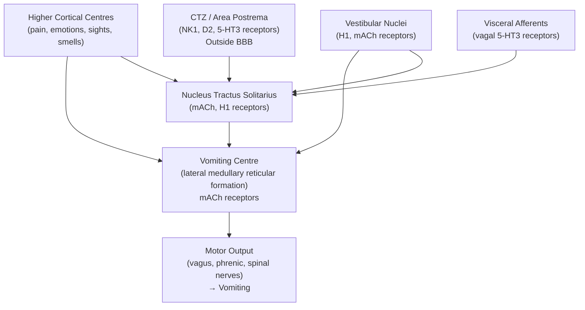

# Nausea and Vomiting

## 1. Definition

Let's start by breaking down the terms from first principles.

- **Nausea** (from Greek *nausia*, "sea-sickness," from *naus* = ship): An unpleasant, painless, subjective sensation of the urge to vomit. It is a conscious awareness of excitation in the medullary vomiting centre. Crucially, nausea can occur *without* vomiting.
- **Vomiting** (emesis, from Greek *emein* = to vomit): The forceful, retrograde expulsion of gastric (and sometimes proximal duodenal) contents through the mouth. It is a complex, coordinated reflex involving somatic and autonomic motor activity.
- **Retching** ("dry heaves"): Rhythmic, spasmodic respiratory movements against a closed glottis — essentially the motor act of vomiting without expulsion of gastric content. It represents the same motor programme but without sufficient intra-abdominal pressure to open the gastroesophageal junction.

> It is important to distinguish true vomiting from:
> - **Regurgitation**: Passive, effortless return of oesophageal or gastric contents into the mouth *without* nausea or retching (e.g. in GERD, achalasia, Zenker's diverticulum). No abdominal muscular contraction involved.
> - **Rumination**: Repetitive, effortless regurgitation of recently ingested food that is then re-chewed and re-swallowed or spat out, occurring within minutes of eating. A behavioural/functional disorder.

<Callout title="Common Exam Mistake" type="error">
Students often conflate vomiting with regurgitation. True vomiting is an active, forceful process involving coordinated abdominal and diaphragmatic contraction. Regurgitation is passive. This distinction matters because the differential diagnosis is completely different.
</Callout>

---

## 2. Epidemiology and Risk Factors

Nausea and vomiting are among the most common symptoms encountered in medicine — in primary care, emergency departments, surgical wards, and oncology settings.

### 2.1 General Epidemiology
- **Prevalence**: Nausea affects up to 50% of adults in community surveys over a given year. It is one of the top 10 reasons for primary care visits.
- **Emergency presentations**: Nausea/vomiting account for ~5% of all emergency department visits.
- **Hospitalised patients**: Extremely common; post-operative nausea and vomiting (PONV) affects 25–30% of all surgical patients (up to 80% in high-risk groups) [2].
- **Hong Kong context**: Gastroenteritis (both viral and bacterial, particularly *Norovirus* and food-borne pathogens) is a leading cause in the community. Early pregnancy-related nausea ("morning sickness") is almost universal (70–80% of pregnancies).

### 2.2 Risk Factors for Nausea and Vomiting (General)

| Category | Risk Factors |
|---|---|
| Patient demographics | Female sex (F > M), younger age, non-smokers, obesity |
| Pregnancy | hCG surge in first trimester |
| Prior history | Previous motion sickness, previous PONV, history of migraine |
| Medications/substances | ***Opioids***, chemotherapy, antibiotics (erythromycin, metronidazole), NSAIDs, digoxin, SSRIs, ***substance abuse (e.g. opioids, ecstasy)*** [1] |
| Metabolic/endocrine | ***Diabetes (ketoacidosis)***, uraemia, hypercalcaemia, ***thyroid and other endocrine disorders (Addison disease)*** [1] |
| Psychiatric | Anxiety, ***depression***, bulimia nervosa, ***extreme stress and anxiety (e.g. panic attacks)*** [1] |
| Surgical | General anaesthesia > regional anaesthesia, prolonged surgery, laparoscopic/abdominal/pelvic surgery, ENT and eye surgery [2] |

### 2.3 Risk Factors Specific to PONV [2]

***Risk factors for PONV*** include [2]:
- ***Patient***: ***Young female, non-smoker, early pregnancy, previous history of PONV / motion sickness, obesity***
- ***Anaesthetics***: ***GA > RA, opioids, inhalational agents (→ try to use IV propofol)***
- ***Surgery***: ***Eye, ENT, laparoscopy (abdominal / pelvic)***
- ***Post-op***: ***pain, movement, hypotension***

---

## 3. Anatomy and Physiology of the Vomiting Reflex

Understanding the anatomy is the key to understanding *why* different conditions cause vomiting and *why* different anti-emetics work. Think of this as a circuit: **stimulus → input → integration → output**.

### 3.1 The Vomiting Centre (VC) — Central Pattern Generator

The "vomiting centre" is not a discrete anatomical nucleus but rather a ***network of loosely organised neurons in the medulla oblongata*** (within the lateral reticular formation, near the nucleus tractus solitarius [NTS]). It coordinates the motor act of vomiting.

- **Key receptors at the vomiting centre**: ***muscarinic acetylcholine (mACh) receptors*** [2]
- It receives input from four main sources (detailed below).

### 3.2 The Four Input Pathways

This directly maps to the diagram described in the senior notes [2]:

#### (a) The Chemoreceptor Trigger Zone (CTZ)
- **Location**: Area postrema, on the floor of the 4th ventricle. Critically, this lies ***outside*** the blood–brain barrier (BBB), meaning it can directly sample blood and CSF for circulating toxins.
- **Function**: Detects circulating emetogenic substances — drugs, metabolic toxins (uraemia, ketoacids, hypercalcaemia), bacterial toxins.
- ***Key receptors***: ***NK1 (neurokinin-1), D2 (dopamine), and 5-HT3 (serotonin) receptors*** [2]
- Why does uraemia cause vomiting? → Uraemic toxins accumulate in blood → cross into CTZ (no BBB) → stimulate D2 and 5-HT3 receptors → activate vomiting centre.

#### (b) Visceral Afferents (Vagal and Sympathetic)
- **Origin**: Mechanoreceptors and chemoreceptors in the GI tract wall (especially duodenum and jejunum), biliary tree, peritoneum, and mesentery.
- **Pathway**: Signals travel via the **vagus nerve (CN X)** and **sympathetic splanchnic nerves** → terminate at the ***nucleus of the solitary tract (NTS)*** in the medulla.
- ***Key receptors on vagal afferents***: ***5-HT3 receptors*** [2]
- Why does bowel obstruction cause vomiting? → Distension of bowel wall activates mechanoreceptors → vagal afferents → NTS → vomiting centre.
- Why does chemotherapy cause vomiting? → Cisplatin damages enterochromaffin cells in GI mucosa → massive 5-HT (serotonin) release → stimulates 5-HT3 receptors on vagal afferents → NTS → vomiting centre. This is why ondansetron (5-HT3 antagonist) is the drug of choice for chemotherapy-induced nausea and vomiting (CINV).

#### (c) Vestibular System
- **Origin**: Vestibular apparatus in the inner ear (semicircular canals, utricle, saccule).
- **Pathway**: Vestibular nerve → ***vestibular nuclei*** → NTS → vomiting centre.
- ***Key receptors***: ***H1 (histamine) and mACh (muscarinic acetylcholine) receptors*** [2]
- Why does motion sickness cause vomiting? → Conflicting sensory input between vestibular, visual, and proprioceptive systems → vestibular nuclei activation → NTS → vomiting centre. This is why antihistamines (meclizine, dimenhydrinate) and anticholinergics (scopolamine) work so well for motion sickness.
- Why does ***Ménière syndrome*** or ***labyrinthitis*** cause vomiting [1]? → Direct inflammation or endolymphatic hydrops in the vestibular apparatus → same pathway as above.

#### (d) Higher Cortical Centres
- **Origin**: Cerebral cortex, limbic system, thalamus.
- **Pathway**: ***Sensory afferents and CNS pathways*** → direct input to vomiting centre [2].
- **Function**: Mediates vomiting from anticipatory nausea (e.g. before chemotherapy), repulsive sights/smells, emotional distress, ***extreme stress and anxiety (e.g. panic attacks)*** [1], raised intracranial pressure (via hypothalamic/brainstem compression).
- ***Stimuli***: ***Pain, repulsive sights and smells, emotional factors*** [2]

### 3.3 The Nucleus of the Solitary Tract (NTS)

The NTS is the crucial **relay and integration centre**. It receives input from all four sources above and projects to the vomiting centre. Key receptors here include ***mACh and H1 receptors*** [2].

### 3.4 The Output (Motor Act of Vomiting)

Once the vomiting centre is activated, the coordinated motor output includes:

1. **Pre-ejection phase**: Retrograde giant contraction of small intestine → duodenal/gastric relaxation → nausea and retching.
2. **Ejection phase**:
   - Deep inspiration against closed glottis (↑intrathoracic pressure).
   - Forceful contraction of diaphragm and abdominal wall muscles (↑intra-abdominal pressure).
   - Relaxation of lower oesophageal sphincter (LOS) and oesophageal body.
   - Retrograde expulsion of gastric contents.
3. **Protective reflexes**: Elevation of soft palate (closes nasopharynx), laryngeal closure (protects airway), salivation (protects dental enamel from acid).

Efferent pathways involve:
- **Vagus nerve (CN X)**: to GI tract smooth muscle
- **Phrenic nerve**: to diaphragm
- **Spinal nerves**: to abdominal wall muscles

<Callout title="High Yield - Receptor Map for Anti-emetics" type="idea">
Understanding which receptors are at which site tells you which drug to use for which cause:

| Site | Key Receptors | Best Anti-emetic Class | Example |
|---|---|---|---|
| CTZ | D2, 5-HT3, NK1 | Dopamine antagonists, 5-HT3 antagonists, NK1 antagonists | Metoclopramide, ondansetron, aprepitant |
| Vestibular nuclei | H1, mACh | Antihistamines, anticholinergics | Meclizine, scopolamine |
| NTS | mACh, H1 | Anticholinergics, antihistamines | Hyoscine |
| Vagal afferents (GI) | 5-HT3 | 5-HT3 antagonists | Ondansetron |
| Vomiting centre | mACh | Anticholinergics | Hyoscine |
</Callout>

---

## 4. Aetiology (with Focus on Hong Kong)

***Nausea and vomiting have a wide range of potential causes emanating from every body system*** [1]. The mnemonic **"VOMITING"** can help organise the causes:

| Letter | Category |
|---|---|
| V | Vestibular / Vertigo |
| O | Obstruction / Organic GI |
| M | Metabolic / Medications |
| I | Infection / Inflammation |
| T | Toxins / Tumours |
| I | Intracranial (↑ICP) |
| N | (Preg)Nancy |
| G | Gastroparesis / psychoGenic |

Below is a systematic aetiological classification with pathophysiological basis:

### 4.1 Gastrointestinal Causes (Most Common Overall)

| Cause | Pathophysiological Mechanism |
|---|---|
| ***Gastroenteritis*** (viral: Norovirus, Rotavirus; bacterial: *Salmonella*, *Campylobacter*, *V. parahaemolyticus*) | Mucosal inflammation → enterochromaffin cell 5-HT release → vagal afferents → NTS; also systemic toxin → CTZ |
| ***Gastric outlet obstruction*** [3] | Mechanical obstruction → gastric distension → mechanoreceptors → vagal afferents. Causes ***repeated non-bilious projectile vomiting of undigested food*** [3] |
| ***Peptic ulcer disease*** | Mucosal inflammation/ulceration → local chemoreceptor and mechanoreceptor stimulation → vagal afferents |
| ***Acute pancreatitis*** [4] | Retroperitoneal inflammation → visceral afferent stimulation; also systemic inflammatory mediators (TNF-α, IL-6) → CTZ |
| ***Acute cholecystitis / choledocholithiasis*** | Biliary distension → visceral afferents via splanchnic nerves |
| ***Intestinal obstruction (mechanical)*** | Proximal distension → mechanoreceptors → vagal afferents. Vomiting character depends on level: high SBO = bilious and frequent; low SBO/LBO = faeculent and late |
| ***Paralytic ileus*** [6] | Absent peristalsis → progressive distension → vagal afferents. Causes: post-operative (most common), opioids, electrolyte imbalance (hypoK, hypoMg, hypoNa), anticholinergics [6] |
| ***Appendicitis*** | Peritoneal inflammation → visceral afferents. Classically, pain *precedes* vomiting (Murphy's sequence) — if vomiting comes first, think gastroenteritis instead |
| ***Gastroparesis*** (see below) | Impaired gastric motility → retained food → gastric distension → vagal afferents |
| ***GERD*** | Reflux of acid into oesophagus → oesophageal chemoreceptors → vagal afferents; also direct irritation |
| ***Hepatitis*** | Hepatocyte inflammation → release of inflammatory mediators → CTZ; also visceral afferent stimulation |
| ***Gastric / oesophageal / pancreatic cancer*** [5] | Mass effect causing obstruction; peritoneal irritation; systemic cytokine release → CTZ |

**Hong Kong–specific considerations**:
- *Norovirus* gastroenteritis is extremely common in Hong Kong, especially in winter (October–March), often in institutional outbreaks.
- ***Food poisoning*** [1] from seafood (*V. parahaemolyticus*, *V. cholerae*), raw pork (*Streptococcus suis*), and undercooked poultry (*Salmonella*, *Campylobacter*) is prevalent.
- Hepatitis B is endemic (8% chronic carrier rate) — acute flares or hepatocellular carcinoma can present with nausea/vomiting.
- ***Gastric cancer*** remains an important diagnosis in the Hong Kong Chinese population (higher incidence than Western populations) [5].

### 4.2 Medications and Drugs

***Drugs are a major cause (multiple)*** [1]. Think of the mechanism for each:

| Drug Class | Mechanism |
|---|---|
| ***Opioids*** [1][2] | Stimulate μ-opioid receptors in CTZ (D2 pathway); also ↓GI motility → gastric stasis |
| Chemotherapy (cisplatin, doxorubicin) | Enterochromaffin cell damage → massive 5-HT release → vagal 5-HT3 afferents; also direct CTZ stimulation |
| Antibiotics (erythromycin, metronidazole) | Erythromycin is a motilin agonist → ↑GI motility → nausea. Metronidazole → direct CTZ stimulation |
| NSAIDs | Direct gastric mucosal irritation (COX-1 inhibition → ↓prostaglandins → ↓mucosal protection) |
| Digoxin | Direct CTZ stimulation (D2 receptors). Nausea is an early sign of digoxin toxicity |
| SSRIs | ↑5-HT in both gut and CTZ → 5-HT3 receptor activation |
| ***Substance abuse (e.g. opioids, ecstasy)*** [1] | Ecstasy (MDMA) → massive 5-HT release → CTZ and GI 5-HT3 receptors |
| Alcohol | Direct gastric mucosal irritation; also metabolite (acetaldehyde) → CTZ stimulation |
| ***Radiation therapy*** [1] | Mucosal damage → enterochromaffin cell 5-HT release (similar mechanism to chemotherapy) |

### 4.3 Metabolic and Endocrine Causes

| Cause | Mechanism |
|---|---|
| ***Diabetic ketoacidosis (DKA)*** [1][7] | Ketoacids (β-hydroxybutyrate, acetoacetate) → stimulate CTZ; also ***acute abdomen: diffuse abdominal pain, nausea, vomiting (due to ileus, usually only if severe acidosis)*** [7] |
| ***Uraemia (kidney failure)*** [1] | Uraemic toxins (urea, creatinine, indoles, phenols) accumulate → stimulate CTZ across disrupted BBB |
| ***Hypercalcaemia*** [1] | Calcium ions directly stimulate CTZ; also ↓GI motility → constipation and nausea |
| ***Addison disease (adrenal insufficiency)*** [1] | Cortisol deficiency → ↓gluconeogenesis → hypoglycaemia; also hyponatraemia, hyperkalaemia → CTZ stimulation; ↓cortisol may directly affect central emetic pathways |
| ***Thyroid disorders*** [1] | Thyrotoxicosis → ↑GI motility; hypothyroidism → ↓GI motility → gastroparesis |
| ***Liver failure*** [1] | Accumulation of ammonia and other toxins → CTZ; also hepatic encephalopathy |
| ***Hyponatraemia*** [8] | Moderate hyponatraemia (125–130 mmol/L) causes ***anorexia, nausea, vomiting, abdominal pain*** [8] due to cerebral oedema → ↑ICP → vomiting centre stimulation |
| ***Hyperglycaemic hyperosmolar state (HHS)*** [7] | Hyperosmolarity → cerebral dehydration → nausea; also associated gastroparesis |

### 4.4 CNS / Intracranial Causes

| Cause | Mechanism |
|---|---|
| ***Raised intracranial pressure (↑ICP)*** [9] | Direct pressure on brainstem vomiting centre and CTZ. ***Classically projectile vomiting without preceding nausea, worse in the morning, worse with recumbency*** [9] |
| ***Meningitis*** [10] | Meningeal inflammation → ↑ICP + direct irritation of brainstem emetic pathways. ***Photophobia, nausea and vomiting*** are features of meningeal irritation [10] |
| ***Migraine*** [11] | Activation of trigeminal nociceptive pathways → stimulation of NTS → nausea and vomiting; brainstem dysfunction (dorsal raphe nucleus, locus coeruleus) contributes. ***A/w nausea and vomiting, diarrhoea, photophobia and phonophobia*** [11] |
| ***Intracranial hypotension*** (e.g. post-LP) [12] | Brain sags → traction on pain-sensitive structures → nausea, vomiting, headache worse when upright [12] |
| ***Idiopathic intracranial hypertension (IIH)*** [9] | ↑ICP → same mechanism as any cause of raised ICP. ***N/V*** is a listed feature [9] |
| Vestibular disorders: ***Ménière syndrome, labyrinthitis*** [1] | Vestibular apparatus activation → vestibular nuclei (H1, mACh) → NTS → vomiting centre |
| ***Intracranial SOL*** (tumour, abscess) [9] | Mass effect → ↑ICP; also direct brainstem compression |

### 4.5 Pregnancy

***Pregnancy (early)*** is listed as a key pitfall [1].

- **Nausea and vomiting of pregnancy (NVP)**: Affects 70–80% of pregnant women, typically weeks 6–12 (peaks at 9 weeks), usually resolves by week 20.
- **Mechanism**: hCG surge stimulates CTZ (via thyrotropic cross-reactivity and direct effects); also oestrogen/progesterone → ↓LOS tone and ↓gastric motility.
- **Hyperemesis gravidarum**: Severe end of the spectrum — persistent vomiting leading to > 5% weight loss, dehydration, ketonuria, electrolyte disturbances. Incidence ~0.3–3%.

### 4.6 Cardiac and Respiratory Causes

| Cause | Mechanism |
|---|---|
| ***Heart failure*** [1] | Hepatic congestion (↑hydrostatic back-pressure in hepatic veins) → visceral afferents; also gut oedema → malabsorption and ↓motility |
| Acute MI (inferior) | Vagal stimulation from inferior myocardial ischaemia (Bezold–Jarisch reflex) → bradycardia + nausea/vomiting. Also pain → higher centres → nausea |
| ***Respiratory failure*** [1] | Hypoxia and hypercapnia → CTZ stimulation; also respiratory acidosis |

### 4.7 Infectious Causes (Beyond GI)

| Cause | Mechanism |
|---|---|
| ***UTI, especially pyelonephritis*** [1] | Systemic inflammatory response (fever, cytokines) → CTZ; also visceral afferent stimulation from renal capsule distension |
| ***COVID-19*** [13] | ***GI symptoms (18%): nausea, vomiting, abdominal pain, diarrhoea*** [13] — ACE2 receptors expressed on GI epithelium → direct viral invasion |
| Sepsis (any source) | Endotoxins and inflammatory cytokines → CTZ stimulation |

### 4.8 Functional / Psychiatric Causes

***Is the patient trying to tell me something? Possibly: extreme stress and anxiety (e.g. panic attacks). Consider bulimia (self-induced vomiting) and functional (psychogenic).*** [1]

| Cause | Mechanism |
|---|---|
| ***Functional nausea and vomiting*** (Rome IV) | Visceral hypersensitivity + gut–brain axis dysregulation → ↓threshold for nausea/vomiting in response to normal stimuli |
| ***Bulimia nervosa*** [14] | ***Self-induced vomiting*** as compensatory behaviour following binge eating. Physical consequences include ***electrolyte disturbances, parotid enlargement (sialoadenosis), dental caries, GERD*** [14] |
| ***Anxiety / panic attacks*** [1][15] | Autonomic activation (sympathetic overdrive) → ↓gastric motility + ↑gastric acid secretion → nausea; also higher cortical input to vomiting centre |
| ***Depression*** [1][15] | Somatisation — GI symptoms including ***nausea, vomiting, abdominal pain, bloating, gas, and diarrhoea*** are common in somatic symptom disorder [15] |
| ***Cyclic vomiting syndrome*** | Episodic stereotypical vomiting with symptom-free intervals. Associated with migraine, mitochondrial dysfunction, cannabis use. Mechanism: hypothalamic–pituitary–adrenal axis dysregulation |

### 4.9 Surgical / Post-operative

- ***Post-operative nausea and vomiting (PONV)*** [2]: Multifactorial — anaesthetic agents stimulate CTZ (inhalational agents), opioid analgesics, surgical manipulation activates visceral afferents, pain, hypotension.
- ***Post-embolisation syndrome*** [16]: After TOCE for HCC — ***nausea, vomiting, abdominal pain, loss of appetite, fever*** [16]. Mechanism: tumour necrosis releasing inflammatory mediators.

### 4.10 Miscellaneous

| Cause | Mechanism |
|---|---|
| ***Achalasia*** [1] | "Gut motility disorder" → failure of LOS relaxation → food retention in oesophagus → regurgitation (not true vomiting, but patients often describe it as vomiting) |
| ***Diabetic gastroparesis*** [1] | Autonomic neuropathy (vagal damage) → impaired gastric emptying → distension → nausea/vomiting. ***Functional obstruction*** [1] |
| ***Poisoning: food, chemicals*** [1] | Toxins stimulate CTZ and/or directly irritate GI mucosa |
| ***Carcinoid syndrome*** [17] | Serotonin overproduction → stimulates 5-HT3 receptors on vagal afferents and CTZ |

<Callout title="Remember the Pitfalls" type="error">
The lecture slides [1] specifically list these as ***pitfalls (mainly adults)*** that are commonly missed:
- ***Pregnancy (early)***
- ***Organ failure: liver, kidney (uraemia), heart, respiratory***
- ***Labyrinthine disorders: Ménière syndrome, labyrinthitis***
- ***Poisoning: food, chemicals***
- ***Gut motility disorders: achalasia***
- ***Paralytic ileus***
- ***Substance abuse (e.g. opioids, ecstasy)***
- ***Radiation therapy***
- ***Hypercalcaemia***
- ***Functional obstruction: diabetic gastroparesis, idiopathic gastroparesis***

And the ***masquerades checklist*** [1]:
- ***Depression (possible)***
- ***Diabetes (ketoacidosis)***
- ***Drugs (multiple)***
- ***Anaemia (possible)***
- ***Thyroid and other endocrine disorders (Addison disease)***
- ***UTI esp. pyelonephritis***
</Callout>

---

## 5. Classification of Nausea and Vomiting

Nausea and vomiting can be classified along several axes:

### 5.1 By Temporal Pattern

| Pattern | Characteristics | Typical Causes |
|---|---|---|
| **Acute** ( < 48 hours) | Sudden onset | Gastroenteritis, food poisoning, drugs, acute surgical abdomen, DKA, MI |
| **Chronic/Recurrent** ( > 4 weeks or recurring episodes) | Persistent or episodic | Gastroparesis, pregnancy, ↑ICP (tumour), functional, bulimia, cyclic vomiting syndrome |

### 5.2 By Relationship to Meals

| Timing | Significance |
|---|---|
| **During or immediately after eating** | Psychogenic, pyloric channel ulcer, gastric outlet obstruction |
| **1–4 hours after eating** | Gastroparesis, gastric outlet obstruction |
| **Early morning (before breakfast)** | Pregnancy, raised ICP (brain tumour), uraemia, alcoholic gastritis |
| **Late evening / nocturnal** | Gastroparesis, gastric outlet obstruction |

### 5.3 By Character of Vomitus

| Character | Significance | Mechanism |
|---|---|---|
| **Undigested food** | Oesophageal obstruction (e.g. achalasia), Zenker's diverticulum | Food never reached stomach |
| **Partially digested food (acidic)** | Gastric outlet obstruction, gastroparesis | Retained in stomach |
| ***Non-bilious*** | Obstruction proximal to ampulla of Vater (pyloric stenosis) [3] | Bile cannot enter above the obstruction |
| **Bilious (green/yellow)** | Obstruction distal to ampulla of Vater | Bile has entered duodenum proximal to obstruction |
| **Faeculent** | Distal SBO or LBO, gastrocolic fistula | Bacterial overgrowth in stagnant intestinal contents |
| **Bloody (haematemesis)** | Peptic ulcer, variceal bleed, Mallory–Weiss tear, gastric cancer | Mucosal disruption with bleeding |
| **Coffee-ground** | Altered blood (upper GI bleed) | HCl converts haemoglobin to haematin (brown) |
| ***Projectile (without preceding nausea)*** | ↑ICP | Direct brainstem compression bypasses the "nausea" phase |
| ***Projectile (non-bilious, undigested food)*** | Gastric outlet obstruction [3] | Forceful expulsion against complete gastric outflow obstruction |

### 5.4 By Underlying Mechanism

| Category | Examples |
|---|---|
| **Central** (CTZ / higher centres / ↑ICP) | Drugs, uraemia, DKA, hypercalcaemia, ↑ICP, migraine, psychogenic |
| **Peripheral** (visceral afferents) | GI obstruction, peritonitis, pancreatitis, biliary disease, gastroparesis |
| **Vestibular** | Motion sickness, labyrinthitis, Ménière disease, BPPV |

---

## 6. Clinical Features

### 6.1 Symptoms (with Pathophysiological Basis)

#### The Core Symptoms

| Symptom | Pathophysiological Basis |
|---|---|
| **Nausea** | Conscious perception of excitation in the medullary vomiting centre. Mediated by cortical awareness of afferent signals from CTZ, vagal afferents, vestibular system, or higher centres. |
| **Retching** | Rhythmic involuntary contraction of diaphragm and abdominal muscles against a closed glottis — the motor programme of vomiting without gastric content expulsion. |
| **Vomiting** | Coordinated forceful contraction of diaphragm + abdominal wall muscles with LOS relaxation → retrograde expulsion. |

#### Associated Symptoms and Their Significance

| Associated Symptom | Significance / Differential | Pathophysiological Basis |
|---|---|---|
| **Abdominal pain** (colicky) | Bowel obstruction, biliary colic | Smooth muscle spasm proximal to obstruction → visceral afferents |
| **Abdominal pain** (constant, severe) | Pancreatitis, peritonitis, perforated viscus | Inflammatory irritation of visceral/parietal peritoneum |
| **Diarrhoea** | Gastroenteritis, food poisoning | Mucosal inflammation → ↑secretion and ↓absorption |
| **Fever** | Infection (GE, pyelonephritis, meningitis, appendicitis) | Pyrogens → hypothalamic thermoregulatory set-point ↑ |
| **Headache** | Migraine, ↑ICP, meningitis, SAH | Meningeal irritation or trigeminal-vascular activation |
| ***Photophobia, phonophobia*** | Migraine [11], meningitis [10] | Cortical hyperexcitability (migraine) or meningeal inflammation |
| **Vertigo** | Vestibular neuritis, BPPV, Ménière | Vestibular mismatch → vestibular nuclei → NTS → vomiting centre |
| **Chest pain** | Acute MI (especially inferior), aortic dissection | Vagal stimulation (Bezold–Jarisch reflex) |
| ***Polyuria, polydipsia*** | DKA [7] | Osmotic diuresis from hyperglycaemia |
| ***Fruity breath*** | DKA [7] | Acetone (volatile ketone) excreted via lungs |
| **Haematemesis / melaena** | Upper GI bleed (PUD, varices, Mallory–Weiss tear) | Mucosal disruption; forceful retching can cause Mallory–Weiss tear at GEJ |
| ***Weight loss*** | Malignancy, gastroparesis, eating disorder, Addison disease | ↓Caloric intake, malabsorption, catabolism |
| ***Dysphagia*** | Oesophageal or proximal gastric tumour [5] | Luminal narrowing by mass |
| **Amenorrhoea** | Pregnancy | hCG → nausea; pregnancy must always be considered |
| ***Early satiety*** | Gastroparesis, gastric cancer [5], functional dyspepsia [18] | ↓Gastric compliance or ↓motility → premature sensation of fullness |
| ***Succussion splash*** | Gastric outlet obstruction [3] | Retained fluid and gas in distended stomach → splashing sound on shaking |

#### Red Flag Symptoms Demanding Urgent Evaluation

> ***Alarming features in the context of nausea and vomiting*** [1][18]:
> - ***Age ≥ 55 with newly onset symptoms***
> - ***Unintended weight loss***
> - ***Dysphagia or odynophagia***
> - ***GI bleeding (haematemesis, melaena)***
> - ***Unexplained iron-deficiency anaemia***
> - ***Persistent vomiting***
> - ***Palpable mass or lymphadenopathy***
> - ***Jaundice***
> - ***Family history of upper GI cancer***

### 6.2 Signs (with Pathophysiological Basis)

***Key examination*** [1]: ***If fever is present, possible sources of infections (e.g. middle ear, urinary tract and meninges) should be checked. A careful abdominal examination is appropriate in most instances, searching for scars indicative of previous surgery. Consider a neurological examination. Be mindful of the possibility of pregnancy.***

#### General Examination Signs

| Sign | Pathophysiological Basis | Points To |
|---|---|---|
| **Dehydration** (dry mucous membranes, ↓skin turgor, sunken eyes, tachycardia, hypotension) | Loss of fluid and electrolytes through vomitus; also ↓oral intake | Severe/prolonged vomiting of any cause |
| **Tachycardia** | Hypovolaemia → ↓preload → ↓stroke volume → baroreceptor-mediated ↑HR | Dehydration, sepsis, shock |
| **Postural hypotension** | ↓Intravascular volume → insufficient vasoconstriction on standing | Significant fluid depletion |
| **Fever** | Pyrogens (IL-1, TNF-α, PGE2) → hypothalamic set-point ↑ | Infection, inflammation |
| ***Jaundice*** | Bilirubin accumulation from biliary obstruction, hepatitis, or haemolysis | Biliary disease, hepatitis, pancreatic head cancer |
| **Hyperpigmentation** (skin creases, buccal mucosa) | ACTH excess from anterior pituitary (↑POMC cleavage → ↑MSH) in Addison disease | Adrenal insufficiency |
| ***Pallor*** | Anaemia from chronic GI blood loss or malignancy | Occult GI malignancy, chronic PUD |

#### Abdominal Examination Signs

| Sign | Pathophysiological Basis | Points To |
|---|---|---|
| **Abdominal distension** | Bowel obstruction → gas and fluid accumulation proximal to obstruction | Mechanical obstruction, paralytic ileus |
| **Visible peristalsis** | Hypertrophied bowel muscle contracting against obstruction becomes visible through abdominal wall | Chronic mechanical obstruction (e.g. pyloric stenosis) |
| ***Succussion splash*** [3] | Fluid and gas in a distended, obstructed stomach; audible when patient is shaken | ***Gastric outlet obstruction*** [3] |
| **High-pitched bowel sounds ("tinkling")** | Fluid rushing through narrowed lumen proximal to obstruction | Mechanical small bowel obstruction |
| **Absent bowel sounds** | No peristaltic activity | Paralytic ileus, peritonitis |
| **Guarding / rigidity** | Involuntary contraction of abdominal wall muscles in response to parietal peritoneal inflammation | Peritonitis (e.g. perforated viscus, appendicitis) |
| **Rebound tenderness** | Release of palpation suddenly allows inflamed peritoneum to move back → pain | Peritonitis |
| ***Palpable mass*** | Tumour, abscess, intussusception | Malignancy, complicated appendicitis |
| ***Surgical scars*** [1] | Previous surgery → adhesions → mechanical obstruction | Adhesive small bowel obstruction |
| **Murphy's sign** | Palpation of RUQ during inspiration → inflamed gallbladder descends onto examining hand → pain and inspiratory arrest | Acute cholecystitis |

#### Head and Neck / Neurological Signs

| Sign | Pathophysiological Basis | Points To |
|---|---|---|
| **Papilloedema** [9] | ↑ICP → transmitted along optic nerve sheath → axonal swelling → disc swelling | ↑ICP (tumour, hydrocephalus, IIH) |
| ***Neck stiffness / meningism*** [10] | Meningeal inflammation → stretching inflamed meninges causes pain → reflex muscle spasm | Meningitis, SAH |
| **Nystagmus** | Vestibular asymmetry → inappropriate vestibulo-ocular reflex | Vestibular pathology |
| **Focal neurological deficits** | Direct damage to neural tissue by mass, ischaemia, or demyelination | Intracranial SOL, stroke |
| **CN VI palsy** (lateral rectus) [9] | ↑ICP → CN VI has longest intracranial course → false localising sign | ↑ICP |

#### Signs Specific to Metabolic/Endocrine Causes

| Sign | Pathophysiological Basis | Points To |
|---|---|---|
| ***Kussmaul respiration*** [7] | Deep, laboured breathing to compensate for metabolic acidosis by ↓CO2 | DKA, severe metabolic acidosis |
| ***Fruity breath*** [7] | Acetone (ketone body) is volatile → excreted in expired air | DKA |
| **Trousseau's / Chvostek's sign** | Hypocalcaemia → ↑neuromuscular excitability (tetany) — but note the question is about *hyper*calcaemia causing vomiting; these signs occur in *hypo*calcaemia | Electrolyte disturbance workup |

#### Signs Related to Eating Disorders

| Sign | Pathophysiological Basis | Points To |
|---|---|---|
| ***Parotid enlargement (sialoadenosis)*** [14] | Chronic stimulation of salivary glands by repeated vomiting → hypertrophy | Bulimia nervosa |
| **Russell's sign** (calluses on dorsum of hand) | Repeated trauma from using fingers to induce vomiting | Bulimia nervosa (self-induced vomiting) |
| ***Dental erosion*** [14] | Gastric acid damages dental enamel (perimolysis), especially lingual/palatal surfaces of upper incisors | Bulimia nervosa, chronic vomiting |
| **Subconjunctival haemorrhage** | ↑Venous pressure during forceful vomiting → rupture of conjunctival capillaries | Severe/forceful vomiting (any cause) |

---

## 7. Consequences and Metabolic Derangements of Vomiting

Understanding what happens *to the body* from prolonged vomiting is essential for both exam questions and clinical management:

| Consequence | Mechanism |
|---|---|
| **Dehydration and hypovolaemia** | Loss of water and electrolytes in vomitus |
| **Metabolic alkalosis** | Loss of gastric HCl (H⁺ and Cl⁻) → ↑serum HCO₃⁻. This is a classic "chloride-responsive" metabolic alkalosis [19] |
| **Hypokalaemia** | (1) Direct K⁺ loss in vomitus (small amount); (2) Renal compensation for metabolic alkalosis: kidneys try to excrete HCO₃⁻ but need to reabsorb Na⁺ → exchange Na⁺ for K⁺ in collecting duct → renal K⁺ wasting; (3) Secondary hyperaldosteronism from hypovolaemia → further renal K⁺ loss |
| **Hypochloraemia** | Direct loss of Cl⁻ in gastric acid |
| **Hyponatraemia** | Loss of Na⁺ in vomitus + ADH release from hypovolaemia → water retention → dilutional hyponatraemia |
| ***Contraction alkalosis*** [19] | Loss of Cl⁻-rich, HCO₃⁻-poor fluid → remaining ECF has relatively higher [HCO₃⁻] |
| **Pre-renal AKI** [20] | Hypovolaemia → ↓renal perfusion → ↓GFR. Vomiting/diarrhoea listed as cause of ***hypovolemia → dehydration*** leading to pre-renal AKI [20] |
| **Mallory–Weiss tear** | Forceful retching → longitudinal mucosal tear at gastroesophageal junction → haematemesis |
| **Boerhaave syndrome** | Transmural oesophageal rupture from violent vomiting → mediastinitis, pneumomediastinum (rare but lethal) |
| **Aspiration pneumonia** | Vomitus enters airway → chemical pneumonitis + secondary bacterial infection. Risk factors: ↓consciousness, supine position, absent gag reflex |

<Callout title="Metabolic Alkalosis from Vomiting — Complete the Loop">
Why does vomiting cause **metabolic alkalosis** specifically?

1. Gastric parietal cells produce HCl. For every H⁺ secreted into the stomach lumen, one HCO₃⁻ enters the blood ("alkaline tide").
2. Normally, when H⁺ reaches the duodenum, it stimulates pancreatic HCO₃⁻ secretion, which neutralises the alkaline tide.
3. When you vomit, you lose H⁺ *before* it reaches the duodenum → the alkaline tide goes unopposed → **metabolic alkalosis**.
4. Simultaneously, you lose Cl⁻ → **hypochloraemia** → kidneys cannot excrete HCO₃⁻ efficiently (they need Cl⁻ to exchange for HCO₃⁻ in the collecting duct) → **maintenance** of alkalosis [19].
5. Hypovolaemia → secondary hyperaldosteronism → ↑Na⁺ reabsorption at the expense of K⁺ and H⁺ → **hypokalaemia** and ***paradoxical aciduria*** (urine becomes acidic despite systemic alkalosis because kidneys are desperately reabsorbing Na⁺ and excreting H⁺).

This is why the treatment is **IV normal saline (0.9% NaCl)** — it repletes volume *and* chloride, allowing the kidneys to excrete the excess HCO₃⁻.
</Callout>

---

## 8. Approach to History-Taking

***A careful history is essential with an emphasis on drug intake, possible psychogenic factors including self-induced emesis, weight loss, other GIT symptoms or symptoms suggestive of systemic disease*** [1].

A structured approach:

| History Component | Key Questions | Rationale |
|---|---|---|
| **Onset and duration** | Acute vs. chronic? When did it start? | Acute: infection, obstruction, drugs. Chronic: gastroparesis, ↑ICP, functional |
| **Frequency and pattern** | How often? Cyclical? | Cyclical → cyclic vomiting syndrome, migraine |
| **Timing** | Relation to meals? Early morning? | Morning → pregnancy, ↑ICP, uraemia. Post-prandial → gastroparesis, GOO |
| **Character of vomitus** | Bilious? Bloody? Faeculent? Undigested food? | See classification table above |
| **Projectile?** | Without preceding nausea? | → ↑ICP; with nausea → GOO |
| **Associated symptoms** | Pain? Diarrhoea? Fever? Headache? Vertigo? | Localises the cause |
| ***Drug history*** [1] | All medications, OTC, herbal, recreational | ***Drugs (multiple)*** is a masquerade [1] |
| **Menstrual / pregnancy Hx** | LMP? Possibility of pregnancy? | ***Be mindful of the possibility of pregnancy*** [1] |
| **Psychiatric Hx** | Mood? Anxiety? Body image concerns? Self-induced? | ***Depression (possible)***, bulimia, psychogenic [1] |
| **Past surgical Hx** | Previous abdominal surgery? | Adhesive bowel obstruction; ***searching for scars indicative of previous surgery*** [1] |
| **Alcohol and substance use** | Quantity? Recreational drugs? | Alcoholic gastritis, cannabis hyperemesis syndrome, ***substance abuse*** [1] |
| **Weight change** | Intentional or unintentional? | Unintentional → malignancy, Addison, eating disorder |
| **Travel history** | Recent travel? | Traveller's diarrhoea, tropical infections |
| **Sick contacts** | Others ill? Institutional outbreak? | Norovirus (very common in HK) |

---

<Callout title="High Yield Summary">

**Definition**: Nausea = subjective urge to vomit; Vomiting = forceful retrograde expulsion of gastric contents; Retching = motor act of vomiting without expulsion. Distinguish from regurgitation (passive) and rumination (behavioural).

**Anatomy of Vomiting Reflex** — 4 input pathways to vomiting centre:
1. **CTZ** (area postrema, outside BBB): D2, 5-HT3, NK1 receptors → senses circulating toxins/drugs
2. **Vagal/visceral afferents**: 5-HT3 receptors → GI distension, mucosal irritation, peritoneal inflammation
3. **Vestibular system**: H1, mACh receptors → motion sickness, labyrinthine disease
4. **Higher centres**: cortex/limbic → anticipatory, emotional, ↑ICP

**Key aetiological categories**: GI (most common), drugs, metabolic/endocrine, CNS/↑ICP, pregnancy, vestibular, cardiac, psychiatric/functional, post-operative.

**Lecture slide pitfalls** [1]: Pregnancy, organ failure (liver/kidney/heart/respiratory), labyrinthine disorders, poisoning, gut motility disorders, paralytic ileus, substance abuse, radiation therapy, hypercalcaemia, gastroparesis.

**Masquerades checklist** [1]: Depression, Diabetes (DKA), Drugs, Anaemia, Thyroid/endocrine (Addison), UTI/pyelonephritis.

**Character of vomitus** is diagnostic: non-bilious → proximal to ampulla; bilious → distal to ampulla; faeculent → distal obstruction; projectile without nausea → ↑ICP; undigested food → oesophageal pathology or GOO.

**Metabolic consequences of vomiting**: Metabolic alkalosis (loss of H⁺/Cl⁻) + hypokalaemia (renal K⁺ wasting from aldosterone and alkalosis) + hypovolaemia → pre-renal AKI. Treat with IV normal saline.

**Red flags**: Age ≥ 55 new onset, weight loss, dysphagia, GI bleeding, iron-deficiency anaemia, persistent vomiting, palpable mass, jaundice, family history UGI cancer.

</Callout>

---

<ActiveRecallQuiz
  title="Active Recall - Nausea and Vomiting (Definition to Clinical Features)"
  items={[
    {
      question: "Name the four main input pathways to the vomiting centre and the key receptors at each site.",
      markscheme: "1. CTZ (area postrema) - D2, 5-HT3, NK1 receptors. 2. Vagal/visceral afferents - 5-HT3 receptors. 3. Vestibular nuclei - H1, mACh receptors. 4. Higher cortical centres - sensory/CNS pathways. NTS relay - mACh, H1 receptors. Vomiting centre - mACh receptors."
    },
    {
      question: "Explain why prolonged vomiting causes metabolic alkalosis AND hypokalaemia. Include the concept of paradoxical aciduria.",
      markscheme: "Loss of gastric HCl means loss of H+ and Cl-. Unopposed alkaline tide raises serum HCO3-. Hypochloraemia prevents renal HCO3- excretion (maintenance phase). Hypovolaemia causes secondary hyperaldosteronism which drives Na+ reabsorption at expense of K+ and H+ excretion in collecting duct, causing hypokalaemia and paradoxical aciduria (acidic urine despite systemic alkalosis)."
    },
    {
      question: "A patient presents with projectile non-bilious vomiting of undigested food. What is the most likely site of obstruction and why is the vomitus non-bilious?",
      markscheme: "Gastric outlet obstruction (pyloric region). Non-bilious because the obstruction is proximal to the ampulla of Vater (where bile enters the duodenum), so bile cannot mix with gastric contents."
    },
    {
      question: "List 6 pitfalls (commonly missed causes) of nausea and vomiting in adults as highlighted in the lecture slides.",
      markscheme: "Any 6 of: Early pregnancy, organ failure (liver/kidney/heart/respiratory), labyrinthine disorders (Meniere/labyrinthitis), poisoning (food/chemicals), gut motility disorders (achalasia), paralytic ileus, substance abuse (opioids/ecstasy), radiation therapy, hypercalcaemia, functional obstruction (diabetic/idiopathic gastroparesis)."
    },
    {
      question: "Why does an inferior MI cause nausea and vomiting? Name the reflex involved.",
      markscheme: "Inferior myocardial ischaemia stimulates vagal afferents via the Bezold-Jarisch reflex, leading to increased vagal tone which causes bradycardia and activation of the vomiting centre via the NTS. Pain also contributes via higher cortical centres."
    },
    {
      question: "What are the key clinical signs of bulimia nervosa that relate to chronic self-induced vomiting?",
      markscheme: "Parotid enlargement (sialoadenosis) from chronic salivary stimulation; Russell sign (calluses on dorsum of hand from teeth during self-induced vomiting); dental erosion (perimolysis) especially lingual surfaces of upper incisors from acid exposure; electrolyte disturbances (hypokalaemic metabolic alkalosis); GERD."
    }
  ]}
/>

---

## References

[1] Lecture slides: murtagh merge.pdf (p107, "Vomiting — Pitfalls, Masquerades checklist, Key history, Key examination")
[2] Senior notes: maxim.md (section: "Postoperative nausea and vomiting (PONV)")
[3] Senior notes: maxim.md (section: "Gastric outlet obstruction")
[4] Senior notes: felixlai.md (section: "Acute Pancreatitis — Clinical manifestation")
[5] Senior notes: felixlai.md (section: "Gastric Cancer — Clinical manifestation")
[6] Senior notes: Ryan Ho GI.pdf (p141, "Paralytic Ileus")
[7] Senior notes: Ryan Ho Endocrine.pdf (p91, "Diabetic Ketoacidosis")
[8] Senior notes: Ryan Ho Chemical Path.pdf (p6, "Hyponatremia")
[9] Senior notes: Ryan Ho Neurology.pdf (p158, "Idiopathic intracranial hypertension") and Ryan Ho Opthalmology.pdf (p90, "Papilloedema")
[10] Senior notes: Ryan Ho Neurology.pdf (p142, "Meningitis — Clinical Features")
[11] Senior notes: Ryan Ho Neurology.pdf (p62, "Migraine — Typical course")
[12] Senior notes: Ryan Ho Neurology.pdf (p158, "Intracranial hypotension")
[13] Senior notes: Ryan Ho Respiratory.pdf (p56, "COVID-19 Clinical presentation")
[14] Senior notes: Ryan Ho Psychiatry.pdf (p216, "Bulimia Nervosa — Clinical features")
[15] Senior notes: Ryan Ho Psychiatry.pdf (p202, "Somatic symptom disorder — Clinical presentation")
[16] Senior notes: Ryan Ho Diagnostic Radiology.pdf (p86, "TOCE complications — Post-embolisation syndrome")
[17] Senior notes: Ryan Ho Endocrine.pdf (p103, "Carcinoid Syndrome — Clinical features")
[18] Senior notes: felixlai.md (section: "Dyspepsia — Overview") and Ryan Ho Fundamentals.pdf (p264, "Functional Dyspepsia")
[19] Senior notes: Ryan Ho Urogenital.pdf (p50, "Metabolic Alkalosis")
[20] Senior notes: Ryan Ho Critical Care.pdf (p25, "AKI — Pre-renal disease")
