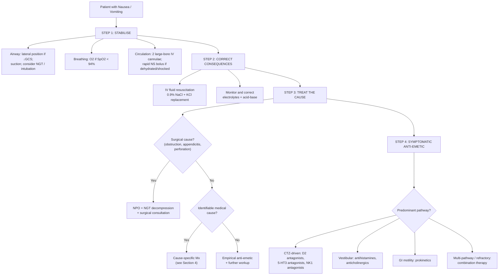

## Management of Nausea and Vomiting

The management of nausea and vomiting follows a simple but critical hierarchy: **stabilise → correct consequences → treat the cause → provide symptomatic anti-emetic relief**. These steps often happen simultaneously, but the order of priority must never be forgotten. You cannot pick an anti-emetic sensibly until you have at least a working hypothesis about the cause, because the choice of drug depends entirely on which receptor pathway is driving the vomiting.

---

### 1. Management Principles — The Four Pillars

| Priority | What | Why |
|---|---|---|
| **1. Stabilise** | Airway protection, IV access, haemodynamic resuscitation | A vomiting patient with reduced consciousness can aspirate and die; hypovolaemia from vomiting can lead to pre-renal AKI and shock |
| **2. Correct consequences** | Replace fluids, correct electrolytes (K⁺, Cl⁻, Na⁺), correct acid-base disturbance | Metabolic derangements are independently dangerous (hypokalaemia → arrhythmia; metabolic alkalosis → ↓ionised Ca²⁺ → tetany) |
| **3. Treat the cause** | Cause-specific management | Anti-emetics alone without addressing the cause is like mopping the floor while the tap is running |
| **4. Symptomatic anti-emetic therapy** | Receptor-targeted anti-emetics | Provides relief while the cause is being addressed; choice depends on the mechanism of vomiting |

***Always assess the patient's condition including the level of hydration*** [1].

---

### 2. Overall Management Algorithm

---

### 3. Step 1 & 2 — Stabilisation and Correction of Consequences

#### 3.1 Airway Protection

- **Positioning**: Lateral (recovery) position if reduced consciousness — prevents aspiration of vomitus into the airway.
- **NGT insertion**: For ongoing vomiting, especially in bowel obstruction, gastroparesis, or reduced consciousness.
  - Placed on **free drainage with 4-hourly aspiration** [39] or continuous/intermittent suction [40].
  - Functions: ***decompression proximal to obstruction; reduce risk of aspiration during induction of anaesthesia and post-extubation*** [39].
  - ***Aspirate stomach if unconscious or vomiting ± ETT for airway protection if necessary*** [7].
- **Intubation**: If GCS ≤ 8, ongoing haematemesis with airway compromise, or before OGD in unstable patients with massive upper GI bleeding.

<Callout title="NGT — When and When Not" type="idea">
NGT is indicated for: active vomiting with aspiration risk, bowel obstruction (decompression), DKA with reduced consciousness [7], pre-operative preparation in emergency surgery.

NGT is **NOT** indicated for: routine post-operative ileus (***routine NGT decompression is a/w slower return of bowel function and should not be done*** [6]), suspected variceal bleeding (***do NOT insert NG tube since it will worsen variceal bleeding*** [41]).
</Callout>

#### 3.2 Fluid Resuscitation

The fluid of choice is dictated by the metabolic consequence:

| Situation | Fluid of Choice | Rationale |
|---|---|---|
| **Prolonged vomiting with metabolic alkalosis** | **0.9% Normal Saline (NS)** ± KCl | NS provides both Na⁺ and Cl⁻. Chloride is essential for the kidneys to excrete the excess HCO₃⁻ (correcting the alkalosis). KCl replaces potassium lost via renal wasting. |
| **Acute pancreatitis** [42] | ***Lactated Ringer's solution may be superior to NS in reducing SIRS*** [42] | Lactate is converted to HCO₃⁻ in liver → mild alkalinising effect counteracts acidosis from inflammation; also more physiological electrolyte composition |
| **DKA** [7] | ***1-2L 0.9% NS initially***, then adjust based on Na⁺ [7] | Volume expansion is first priority; ***when serum Na > 150 mmol/L, use 0.45% NS*** [7]; ***when BG ≤ 14 mmol/L, change to D5*** [7] |
| **Hypovolaemic shock** [43] | ***Rapid fluid challenge: 500mL or 1000mL of crystalloid (balanced or NS)*** [43] | Restore intravascular volume; ***reassess BP/P every 5 min → repeat fluid challenge if not responding*** [43] |

**Potassium replacement** is almost always needed in prolonged vomiting:
- Target K⁺ 3.5–5.0 mmol/L
- Give **KCl 10–40 mmol/L in IV fluids** (max rate 10–20 mmol/h peripherally, up to 40 mmol/h centrally with cardiac monitoring)
- ***Replace K first if K < 3.3*** before giving insulin in DKA [7] — why? Because insulin drives K⁺ into cells, and giving insulin to a profoundly hypokalaemic patient can cause fatal arrhythmia.

#### 3.3 Correction of Metabolic Alkalosis from Vomiting [44]

Treatment targets the **maintenance factors**:

- ***Treat underlying cause: remove NG aspiration, treat vomiting, stop diuretics*** [44]
- ***Saline repletion to ↑volume, ↑Cl⁻ in saline-responsive cases (i.e. volume-depleted ones)*** [44]
- ***Potassium repletion to ↑K⁺*** [44]
- ***Acetazolamide (carbonic anhydrase inhibitor) to ↓HCO₃⁻ reabsorption in PCT*** [44] — for refractory cases
- ***Dialysis in those with AKI or CKD (cannot excrete HCO₃⁻)*** [44]

---

### 4. Step 3 — Cause-Specific Management

The anti-emetic is only as good as the management of the underlying cause. Here are the key cause-specific treatments:

#### 4.1 Gastrointestinal / Surgical Causes

| Cause | Specific Management | Key Points |
|---|---|---|
| **Gastroenteritis** | Oral or IV rehydration; antibiotics only if bacterial and indicated (Salmonella: only if severe/immunocompromised; Campylobacter: azithromycin if severe) | Most viral GE is self-limiting. Avoid anti-motility agents (loperamide) in invasive dysentery. |
| **Bowel obstruction** [39][40] | ***"Drip and suck": NPO + IV fluids + NGT decompression*** [39][40]. Conservative for 48–72h if partial uncomplicated SBO [39]. ***Surgery for: strangulation, perforation, closed-loop, complete obstruction, hernia*** [39]. | ***Gastrografin meal: water-soluble contrast is both diagnostic and therapeutic — draws fluid into lumen of bowel due to hypertonicity, decreases intestinal wall oedema and stimulates intestinal peristalsis*** [39]. Adhesive SBO: ***GGF reaching colon ≤ 24h is highly predictive of resolution with conservative Mx*** [40] |
| **Acute pancreatitis** [42] | ***IV fluid resuscitation; NPO only if necessary — NPO till nausea and vomiting settle; NG suction if ileus or protracted vomiting*** [42]; early enteral feeding preferred; ***no longer acceptable to "rest the pancreas" by avoiding enteral nutrition*** [42]; analgesics for pain | ***Enteral route preferred: lower rates of infection, surgical intervention and length of stay*** [42] |
| **Gastroparesis** [25] | ***Dietary modification: low fat diet; optimise glycaemic control; prokinetics, e.g. metoclopramide*** [25] | Exclude mechanical obstruction first (OGD, CT); scintigraphic gastric emptying for confirmation |
| **Gastric outlet obstruction** [3] | Depends on cause: endoscopic balloon dilatation for benign strictures; surgical bypass or stenting for malignant GOO | Malignant GOO: ***malignant until proven otherwise*** [3] — endoscopic metallic stent for palliation or as bridge to surgery |
| **Acute appendicitis** | Appendicectomy (laparoscopic preferred); IV antibiotics pre-operatively | Antibiotics alone may be considered in selected uncomplicated cases (non-operative management is emerging but surgery remains standard) |
| **Acute cholecystitis** | IV antibiotics + early laparoscopic cholecystectomy (within 72h); NPO, IV fluids, analgesia | Percutaneous cholecystostomy if unfit for surgery |

#### 4.2 CNS / Neurological Causes

| Cause | Specific Management | Anti-emetic of Choice |
|---|---|---|
| **Raised ICP (tumour)** | Dexamethasone (↓vasogenic oedema around tumour); neurosurgical consultation for definitive treatment (resection, VP shunt) | Cyclizine (H1 antagonist — avoids CTZ-targeting agents which may mask neurological signs); also ondansetron |
| **Migraine** [45] | ***Acute attacks: simple analgesics for mild attacks (aspirin, paracetamol, NSAIDs); D2-blocker anti-emetic (↓nausea/vomiting + ↓headache): metoclopramide, domperidone; triptans: treatment of choice for severe headache*** [45] | ***D2 blocking anti-emetics*** [45] — metoclopramide and domperidone are first-line because they both ↓nausea AND improve headache (by enhancing gastric motility and drug absorption, which is impaired by migraine-associated gastroparesis) |
| **Meningitis** | IV antibiotics empirically (ceftriaxone ± vancomycin ± ampicillin) + dexamethasone before or with first antibiotic dose | Ondansetron or metoclopramide; but treating the infection is paramount |
| **Vestibular disorders** [1] | Vestibular rehabilitation; cause-specific (eg. Epley manoeuvre for BPPV, low-salt diet for Ménière) | ***H1 receptor antagonists, muscarinic receptor antagonists*** [2] — prochlorperazine, cyclizine, hyoscine |

#### 4.3 Metabolic / Endocrine Causes

| Cause | Specific Management |
|---|---|
| **DKA** [7] | ***Fluid + insulin + K*** [7]: NS rehydration → insulin infusion 0.1 U/kg/h → KCl replacement (see DKA protocol in previous section). Treat precipitant (infection, non-compliance) |
| **Uraemia** | Renal replacement therapy (dialysis) if severe; fluid management; treat precipitant of AKI |
| **Hypercalcaemia** [1] | IV NS (volume expansion to ↑renal Ca²⁺ excretion) → IV zoledronic acid/pamidronate (↓osteoclast activity) → treat underlying cause (hyperparathyroidism, malignancy) |
| **Addison disease** [26] | ***Acute adrenal crisis → treat on clinical suspicion before investigations*** [26]: IV hydrocortisone 100mg stat then 50mg Q6-8h; IV NS resuscitation; long-term oral hydrocortisone + fludrocortisone replacement |
| **Hyponatraemia** [8] | Depends on severity and acuity: fluid restriction (SIADH), NS (hypovolaemic), hypertonic saline for severe symptomatic (seizures/coma) — max correction 8–10 mmol/L per 24h to avoid osmotic demyelination |

#### 4.4 Drug-Induced

***Drug ingestion is a common cause of nausea and vomiting so check for prescribed drugs and illicit street drugs such as heroin and ecstasy*** [1].

- **First step**: Always review and withdraw or substitute the offending drug if possible.
- **Opioid-induced**: Switch to alternative opioid; add anti-emetic (ondansetron or metoclopramide). Tolerance usually develops within 3–5 days.
- **Chemotherapy-induced (CINV)**: See dedicated section below (Section 5.3).
- **Digoxin toxicity**: Withhold digoxin; check level; digoxin-specific antibodies (DigiFab) if life-threatening arrhythmia.

#### 4.5 Pregnancy-Related

| Condition | Management |
|---|---|
| **NVP (mild-moderate)** | Lifestyle: small frequent meals, avoid triggers; **Ginger supplements** (evidence-based first-line); **Pyridoxine (vitamin B6) 10–25mg TDS** → first-line pharmacological agent; if insufficient, add **doxylamine** (H1 antagonist) — the combination is FDA category A |
| **Hyperemesis gravidarum** | Admission; IV fluids (NS + KCl + thiamine supplementation to prevent Wernicke encephalopathy); anti-emetics (metoclopramide, ondansetron, or prochlorperazine); consider IV corticosteroids (methylprednisolone or hydrocortisone) if refractory |

<Callout title="Thiamine in Hyperemesis — Don't Forget!" type="error">
Prolonged vomiting in pregnancy depletes thiamine stores. If you give IV dextrose before thiamine replacement, you can precipitate **Wernicke encephalopathy** (confusion, ophthalmoplegia, ataxia). Always give **IV thiamine 100mg BEFORE any dextrose-containing fluids** in hyperemesis gravidarum and in any malnourished/alcoholic patient with vomiting.
</Callout>

#### 4.6 Post-Operative (PONV) [2]

***Risk factors for PONV*** [2]:
- ***Patient: Young female, non-smoker, early pregnancy, previous Hx of PONV / motion sickness, obesity***
- ***Anaesthetics: GA > RA, opioids, inhalational agents (→ try to use IV propofol)***
- ***Surgery: Eye, ENT, laparoscopy (abdominal / pelvic)***
- ***Post-op: pain, movement, hypotension***

**Prevention** (high-risk patients):
- ***Use IV propofol*** instead of inhalational agents for induction/maintenance [2]
- Minimise opioid use (multimodal analgesia: paracetamol, NSAIDs, regional anaesthesia)
- Prophylactic anti-emetics: dexamethasone 4–8mg at induction + ondansetron 4mg at end of surgery (combination more effective than either alone)
- Adequate hydration

**Treatment** (if PONV occurs):
- Ondansetron 4mg IV (first-line)
- ± dexamethasone 4–8mg IV if not already given
- ± droperidol 0.625–1.25mg IV or prochlorperazine 12.5mg IM
- Ensure adequate pain control and hydration

#### 4.7 Functional / Psychiatric Causes

| Condition | Management |
|---|---|
| **Functional nausea/vomiting** | Reassurance and explanation (gut-brain axis concept); dietary modification; low-dose TCA (amitriptyline 10–25mg nocte — neuromodulatory effect on visceral hypersensitivity); psychological therapy (CBT); prokinetics if dysmotility component |
| **Cyclic vomiting syndrome** | Acute: IV fluids, ondansetron, ± benzodiazepines (lorazepam for sedation), sumatriptan (migraine-associated mechanism). Prophylaxis: amitriptyline, topiramate, or propranolol |
| **Bulimia nervosa** | Multidisciplinary: CBT-BN (first-line psychological therapy); fluoxetine 60mg/day (evidence-based pharmacotherapy); nutritional rehabilitation; monitor electrolytes |
| **Anxiety / panic disorder** [1] | SSRIs (first-line), CBT; benzodiazepines short-term only; address psychosocial stressors |

---

### 5. Step 4 — Anti-Emetic Pharmacotherapy

This is where the receptor pharmacology from Section 3 of our notes pays off. Each anti-emetic class works by blocking specific receptors at specific sites in the vomiting pathway. The choice of anti-emetic should be **rationally guided by the presumed mechanism of vomiting** [2][32].

#### 5.1 Anti-Emetic Drug Classes

##### (a) Antihistamines (H1 antagonists)

**Site of action**: ***Vestibular nuclei (H1 receptors)*** and ***NTS (H1 receptors)*** [2]

| Drug | Dose | Notes |
|---|---|---|
| ***Dimenhydrinate*** [32] | 50mg PO/IV/IM Q4-6h | Classic motion sickness drug; also useful for vestibular causes |
| ***Promethazine (Phenergan)*** [32] | 25mg PO/IM/IV Q6-8h | Phenothiazine with strong H1 and anticholinergic activity; very sedating |
| ***Meclizine*** [32] | 25–50mg PO Q6h | Less sedating; good for motion sickness and Ménière |
| ***Cyclizine*** [32] | 50mg PO/IV/IM TDS | Particularly useful for ↑ICP and post-operative nausea; minimal CTZ effects |

**Indications**: ***Useful for vestibular causes eg. motion sickness*** [32]; labyrinthine disorders [1]; PONV; ↑ICP.
**Mechanism**: Block H1 receptors at vestibular nuclei and NTS → ↓signal transmission to vomiting centre.
**Side effects**: Sedation (crosses BBB), dry mouth, urinary retention, blurred vision (anticholinergic effects).
**Contraindications**: Caution in elderly (confusion, falls), prostatic hypertrophy (urinary retention), acute angle-closure glaucoma.

##### (b) Anticholinergics (Muscarinic antagonists)

**Site of action**: ***Vestibular nuclei (mACh receptors)***, ***NTS (mACh receptors)***, ***vomiting centre (mACh receptors)*** [2]

| Drug | Dose | Notes |
|---|---|---|
| ***Hyoscine (scopolamine)*** [32] | Transdermal patch (1.5mg/72h) or 0.3–0.6mg SC/IM | Gold standard for motion sickness prevention |

**Indications**: ***Useful for vestibular causes eg. motion sickness*** [32]; pre-operative.
**Mechanism**: Block mACh receptors throughout the vomiting pathway — vestibular nuclei, NTS, and vomiting centre itself.
**Side effects**: Dry mouth, drowsiness, blurred vision, urinary retention, tachycardia, confusion (especially in elderly).
**Contraindications**: Angle-closure glaucoma; prostatic hypertrophy; myasthenia gravis; paralytic ileus (↓GI motility).

##### (c) Dopamine (D2) Antagonists

**Site of action**: ***CTZ (D2 receptors)*** [2]; also peripheral GI tract (prokinetic effect for metoclopramide and domperidone)

| Drug | Dose | Notes |
|---|---|---|
| **Metoclopramide (Maxolon)** [32] | 10mg PO/IV/IM TDS (max 30mg/day for ≤ 5 days) | D2 antagonist at CTZ + 5-HT4 agonist in GI tract (prokinetic); also weak 5-HT3 antagonist |
| **Domperidone (Motilium)** [32] | 10mg PO TDS | D2 antagonist — does NOT cross BBB → fewer central side effects (no EPS); also prokinetic |
| ***Prochlorperazine (Stemetil)*** [32] | 5–10mg PO TDS or 12.5mg IM | Phenothiazine; strong D2 antagonist at CTZ; also H1 and mACh activity |
| **Chlorpromazine** [32] | 25–50mg PO/IM Q6-8h | Broad-spectrum phenothiazine; very sedating |
| **Haloperidol** [32] | 0.5–2mg PO/IV/IM Q8h | Butyrophenone; potent D2 antagonist; useful for opioid-induced N/V and terminal care |
| **Droperidol** | 0.625–1.25mg IV | Highly effective for PONV; short-acting |

**Indications**: Drug/toxin-induced N/V (CTZ-mediated); PONV; gastroparesis (prokinetics); ***migraine-associated N/V*** [45] (metoclopramide, domperidone).
**Mechanism**: Block D2 receptors at CTZ; metoclopramide and domperidone also enhance gastric motility by acting as prokinetics (↑gastric emptying via 5-HT4 agonism and D2 antagonism at GI myenteric plexus).
**Side effects**:
- **Extrapyramidal symptoms (EPS)**: Acute dystonia (oculogyric crisis), akathisia, parkinsonism — more common with metoclopramide (crosses BBB) than domperidone (does not cross BBB).
- **Tardive dyskinesia**: With prolonged use.
- **Hyperprolactinaemia**: D2 blockade at tuberoinfundibular pathway → galactorrhoea, gynaecomastia, amenorrhoea.
- **QT prolongation**: Especially domperidone — avoid in patients with prolonged QT or cardiac disease.

<Callout title="Metoclopramide vs Domperidone — Key Differences">

| Feature | Metoclopramide | Domperidone |
|---|---|---|
| Crosses BBB? | Yes | No |
| Central side effects (EPS) | Yes (acute dystonia, especially in young patients) | Rare |
| Prokinetic effect | Yes (D2 antagonist + 5-HT4 agonist in gut) | Yes (D2 antagonist in gut) |
| QT prolongation risk | Lower | Higher (cardiac risk) |
| Availability | PO, IV, IM | PO only |
| Maximum duration | ≤ 5 days (EMA recommendation due to EPS risk) | Short-term only |

**Bottom line**: Use domperidone if you want to avoid EPS (e.g. in young patients); use metoclopramide if you need IV route or if cardiac risk is a concern.
</Callout>

> ***Antipsychotics have anti-emetic properties because they block D2 receptors at the CTZ*** [46]. Indications include: ***nausea and vomiting, eg. prochlorperazine; intractable hiccups and pruritus, eg. chlorpromazine, haloperidol*** [46].

##### (d) Serotonin (5-HT3) Antagonists — the "-setrons"

**Site of action**: ***CTZ (5-HT3 receptors)***, ***vagal afferents (5-HT3 receptors)*** [2]

| Drug | Dose | Notes |
|---|---|---|
| ***Ondansetron (Zofran)*** [32] | 4–8mg PO/IV Q8h | Most widely used; gold standard for CINV and PONV |
| **Granisetron** | 1mg PO/IV BD | Longer half-life; popular in oncology |
| **Palonosetron** | 0.25mg IV single dose | Longest half-life (40h); most effective for delayed CINV |

**Indications**: Chemotherapy-induced N/V (CINV) — ***the*** first-line class; PONV; radiation-induced N/V; post-operative; refractory N/V of any cause.
**Mechanism**: Block 5-HT3 receptors on vagal afferents in GI tract (preventing signal from enterochromaffin cells to NTS) AND at CTZ.
**Side effects**: Headache (most common), constipation (↓GI motility via 5-HT3 blockade), QT prolongation (dose-dependent).
**Contraindications**: Congenital long QT syndrome; caution with other QT-prolonging drugs.

##### (e) NK1 Receptor Antagonists — the "-pitants"

"NK1" = neurokinin-1, the receptor for substance P, which is a key nausea mediator.

**Site of action**: ***CTZ (NK1 receptors)*** [2]; also vomiting centre.

| Drug | Dose | Notes |
|---|---|---|
| ***Aprepitant*** [2] | 125mg PO day 1, then 80mg PO days 2–3 | Oral NK1 antagonist; combined with 5-HT3 antagonist + dexamethasone for CINV |
| **Fosaprepitant** | 150mg IV single dose | IV prodrug of aprepitant |

**Indications**: Highly emetogenic chemotherapy (cisplatin, cyclophosphamide/doxorubicin); part of the "triple anti-emetic regimen" for CINV.
**Mechanism**: Block NK1 receptors at CTZ and vomiting centre → ↓substance P–mediated emesis (primarily the **delayed phase** of CINV).
**Side effects**: Fatigue, hiccups, constipation. **CYP3A4 inhibitor** → check drug interactions (especially with dexamethasone, warfarin).

##### (f) Corticosteroids

| Drug | Dose | Notes |
|---|---|---|
| **Dexamethasone** | 4–8mg IV (PONV); 8–20mg IV (CINV) | Mechanism unclear; probably anti-inflammatory effect on brainstem and ↓prostaglandin synthesis at CTZ |

**Indications**: PONV (synergistic with ondansetron); CINV (part of standard regimen); ↑ICP (↓vasogenic oedema); hyperemesis gravidarum (refractory).
**Side effects**: Hyperglycaemia, insomnia, perineal burning with rapid IV push, immunosuppression (long-term).

##### (g) Prokinetics

| Drug | Mechanism | Key Indication |
|---|---|---|
| **Metoclopramide** [32] | D2 antagonist at CTZ + 5-HT4 agonist in GI tract → ↑gastric emptying | Gastroparesis [25], functional dyspepsia, migraine |
| **Domperidone** [32] | Peripheral D2 antagonist → ↑gastric emptying | Gastroparesis (preferred if EPS risk) |
| ***Erythromycin*** [32] | ***Prokinetic*** — motilin receptor agonist → ↑gastric antral contractions → ↑gastric emptying | Acute gastroparesis (IV); NOT for long-term use (tachyphylaxis develops within days) |
| ***5-HT4 agonists: cisapride, mosapride, itopride*** [32] | 5-HT4 agonism → ↑ACh release at myenteric plexus → ↑GI motility | Gastroparesis, functional dyspepsia |

<Callout title="Erythromycin as a Prokinetic — Not Just an Antibiotic">
Erythromycin is a macrolide antibiotic that at sub-antimicrobial doses acts as a **motilin receptor agonist**. Motilin is a peptide hormone that initiates the migrating motor complex (MMC) — the "housekeeping" contractions of the GI tract between meals. By mimicking motilin, erythromycin ↑gastric emptying. However, **tachyphylaxis** develops rapidly (within days), so it is only useful as a short-term IV agent for acute gastroparesis, not for chronic use.
</Callout>

##### (h) Benzodiazepines

| Drug | Dose | Notes |
|---|---|---|
| **Lorazepam** | 0.5–2mg PO/IV/SL | Useful for anticipatory CINV; also sedative in cyclic vomiting syndrome |

**Mechanism**: GABA-A receptor agonist → anxiolysis and sedation → ↓higher cortical input to vomiting centre. Does NOT directly block emetic receptors.
**Indications**: Anticipatory nausea (conditioned response before chemotherapy); adjunct in acute cyclic vomiting; refractory PONV.

##### (i) Cannabinoids

| Drug | Dose | Notes |
|---|---|---|
| **Nabilone, dronabinol** | Variable | Synthetic cannabinoids; act on CB1 receptors in brainstem |

**Indications**: Refractory CINV when other agents fail.
**Side effects**: Dysphoria, sedation, dizziness, dry mouth. Not first-line due to psychoactive effects.

---

#### 5.2 Choosing the Right Anti-Emetic — Receptor-Based Approach

This table ties together the pharmacology and the clinical scenario:

| Clinical Scenario | Predominant Pathway | Anti-Emetic of Choice | Why |
|---|---|---|---|
| **Motion sickness / vestibular** | Vestibular nuclei (H1, mACh) | ***H1 receptor antagonists (cyclizine, meclizine), muscarinic receptor antagonists (hyoscine)*** [2][32] | Target vestibular H1 and mACh receptors directly |
| **Drug/toxin-induced** (opioids, uraemia, DKA) | CTZ (D2, 5-HT3) | ***Dopamine antagonists (metoclopramide, haloperidol), 5-HT3 antagonists (ondansetron)*** [2][32] | Toxins/drugs stimulate CTZ which sits outside BBB |
| **CINV** | Vagal afferents (5-HT3) + CTZ (NK1, D2, 5-HT3) | ***5-HT3 antagonists + NK1 antagonists + dexamethasone*** [2] | Chemotherapy → massive 5-HT release from enterochromaffin cells; NK1 for delayed phase |
| **PONV** [2] | CTZ + vestibular | Ondansetron + dexamethasone (prophylaxis); droperidol as rescue | Multimodal approach most effective |
| **Gastroparesis** [25] | Visceral afferents (GI stasis) | ***Prokinetics: metoclopramide, domperidone, erythromycin*** [32] | Enhance gastric emptying → ↓gastric distension → ↓vagal afferent stimulation |
| **Migraine** [45] | Mixed central + gastric stasis | ***D2-blocker anti-emetic: metoclopramide, domperidone*** [45] | Dual benefit: ↓nausea via D2 blockade at CTZ AND ↑gastric emptying (improves absorption of oral analgesics, which is impaired by migraine gastroparesis) |
| **↑ICP** | Central (brainstem compression) | Cyclizine (H1 antagonist); ondansetron; dexamethasone | Cyclizine acts centrally; avoid D2 antagonists if concerned about masking neurological signs |
| **Pregnancy (NVP)** | CTZ (hCG-mediated) | Pyridoxine ± doxylamine (first-line); ginger; metoclopramide, ondansetron if severe | Safety in pregnancy paramount; pyridoxine+doxylamine is FDA category A |
| **Anticipatory N/V** | Higher cortical centres | Lorazepam (BZD); psychological intervention | Conditioned response mediated by cortical pathways; BZDs produce anxiolysis and amnesia |
| **Terminal illness / palliative** | Often multifactorial | Haloperidol (broad D2); levomepromazine (broadest spectrum — D2, H1, mACh, 5-HT2); cyclizine | Levomepromazine is the "Swiss army knife" anti-emetic for palliative care |

#### 5.3 CINV — The Three-Drug Regimen

Chemotherapy-induced nausea and vomiting is classified by timing:
- **Acute** ( < 24h): Primarily 5-HT mediated (enterochromaffin cell damage → 5-HT release → vagal 5-HT3)
- **Delayed** (24h–5 days): Primarily substance P / NK1 mediated
- **Anticipatory**: Conditioned response (higher centres)

Standard prophylaxis for **highly emetogenic chemotherapy** (e.g. cisplatin):

| Drug | Class | Timing |
|---|---|---|
| ***Ondansetron*** or granisetron | ***5-HT3 antagonist*** | Day 1 (acute phase) |
| ***Aprepitant*** | ***NK1 antagonist*** [2] | Days 1–3 (acute + delayed) |
| **Dexamethasone** | Corticosteroid | Days 1–3 or 1–4 |
| ± **Olanzapine** 5–10mg | Atypical antipsychotic (multi-receptor) | Days 1–4 (superior to aprepitant-based regimen in some studies) |

For **moderately emetogenic chemotherapy**: 5-HT3 antagonist + dexamethasone ± NK1 antagonist.

---

### 6. Special Management Considerations

#### 6.1 The Surgical Patient — "Drip and Suck" Expanded

For any patient with bowel obstruction or surgical abdomen with vomiting [39][40]:

1. ***NPO (nil per os)*** [39] — to limit further bowel distension
2. ***IV fluids: crystalloids (NS, Ringer's lactate, Hartmann's)*** [39] — replace losses including third-space sequestration
3. ***NGT decompression*** [39][40] — "suck" component; reduces aspiration risk
4. ***K⁺ replacement*** [39] — but ***given cautiously in patients with AKI from severe dehydration*** [39]
5. ***Pain relief: opioids are reasonable*** [39] — although caution as they ↓GI motility
6. ***Broad-spectrum antibiotics: mandatory for all patients undergoing surgery for intestinal obstruction*** [39]
7. ***Gastrografin meal and follow-through*** [39] — both diagnostic (level and completeness of obstruction) and therapeutic

#### 6.2 The DKA Patient [7]

N/V in DKA is treated by treating the DKA — the anti-emetic is insulin, not ondansetron:
- ***Aspirate stomach if unconscious or vomiting ± ETT for airway protection*** [7]
- ***Fluid + insulin + K*** [7] — as per the DKA protocol
- Anti-emetics (ondansetron, metoclopramide) may provide symptomatic relief but are adjunctive

#### 6.3 Anti-TB Drug-Induced N/V [47]

***GI upset: abdominal discomfort, anorexia, nausea/vomiting*** is common with anti-TB drugs [47]:
- ***Should exclude hepatitis (ensure ALT < 3× and total bilirubin > 2× ULN)*** [47]
- ***Symptomatic relief: administer with food ± antiemetic (but should avoid antacids → ↓H/R absorption)*** [47]
- ***Other measures: consider daily regimens (instead of intermittent) or fixed combination drugs*** [47]

---

### 7. Summary of Anti-Emetic Drug Table

| Drug Class | Key Drugs | Receptors Blocked | Primary Indication | Major Side Effects | Key C/I |
|---|---|---|---|---|---|
| **H1 antagonists** | Cyclizine, meclizine, promethazine, dimenhydrinate | H1 (vestibular, NTS) | Motion sickness, vestibular, PONV, ↑ICP | Sedation, anticholinergic effects | Glaucoma, prostatic hypertrophy |
| **Anticholinergics** | Hyoscine (scopolamine) | mACh (vestibular, NTS, VC) | Motion sickness | Dry mouth, blurred vision, confusion | Glaucoma, paralytic ileus |
| **D2 antagonists** | Metoclopramide, domperidone, prochlorperazine, haloperidol, droperidol | D2 (CTZ) | Drug-induced, gastroparesis, migraine, PONV | EPS (metoclopramide), QT prolongation (domperidone), hyperprolactinaemia | Phaeochromocytoma, GI obstruction (prokinetics), Parkinson disease |
| **5-HT3 antagonists** | Ondansetron, granisetron, palonosetron | 5-HT3 (vagal afferents, CTZ) | CINV, PONV, radiation, refractory N/V | Headache, constipation, QT prolongation | Long QT syndrome |
| **NK1 antagonists** | Aprepitant, fosaprepitant | NK1 (CTZ, VC) | Highly emetogenic CINV (delayed phase) | Fatigue, hiccups; CYP3A4 inhibitor | Caution with CYP3A4 substrates |
| **Corticosteroids** | Dexamethasone | Unclear (↓PG, anti-inflammatory) | CINV (adjunct), PONV, ↑ICP | Hyperglycaemia, insomnia | Active infection (relative) |
| **Prokinetics** | Metoclopramide, domperidone, erythromycin, mosapride | D2 (gut) / 5-HT4 agonist / motilin agonist | Gastroparesis, functional dyspepsia, migraine | EPS, QT prolongation, tachyphylaxis (erythromycin) | Mechanical obstruction |
| **Benzodiazepines** | Lorazepam | GABA-A (cortical) | Anticipatory CINV, cyclic vomiting | Sedation, respiratory depression | Respiratory failure, myasthenia gravis |

---

<Callout title="High Yield Summary — Management of Nausea and Vomiting">

**Four Pillars**: Stabilise → Correct consequences → Treat cause → Symptomatic anti-emetic.

**Fluid choice**: 0.9% NS + KCl for vomiting-induced metabolic alkalosis (repletes Cl⁻ and volume); Ringer's lactate for pancreatitis; NS then adjust for DKA.

**Cause-specific Mx**: Bowel obstruction = "drip and suck" (NPO + IV fluids + NGT) ± surgery; DKA = fluid + insulin + K; gastroparesis = prokinetics + dietary modification; migraine = D2-blocker anti-emetic + triptan.

**Anti-emetic selection by pathway**:
- **Vestibular** → H1 antagonists (cyclizine, meclizine) and anticholinergics (hyoscine)
- **CTZ (drugs/toxins)** → D2 antagonists (metoclopramide, haloperidol) and 5-HT3 antagonists (ondansetron)
- **Vagal/GI (chemo, GI irritation)** → 5-HT3 antagonists (ondansetron)
- **Delayed CINV** → NK1 antagonists (aprepitant) + dexamethasone
- **Gastroparesis** → Prokinetics (metoclopramide, domperidone, erythromycin)
- **Anticipatory** → Lorazepam
- **Migraine** → Metoclopramide or domperidone (dual anti-emetic + prokinetic benefit)

**PONV prevention**: Propofol > inhalational agents; multimodal analgesia to minimise opioids; ondansetron + dexamethasone prophylaxis.

**CINV triple regimen**: 5-HT3 antagonist + NK1 antagonist + dexamethasone (± olanzapine).

**Key safety points**: Replace K⁺ before insulin in DKA; thiamine before dextrose in malnourished/alcoholic; never insert NGT in variceal bleeding; avoid prokinetics in mechanical obstruction.

</Callout>

---

<ActiveRecallQuiz
  title="Active Recall - Management of Nausea and Vomiting"
  items={[
    {
      question: "A patient with prolonged vomiting has Na 130, K 2.5, Cl 82, HCO3 38, pH 7.52. What IV fluid do you prescribe and why? What electrolyte must you replace and via what mechanism is it depleted?",
      markscheme: "0.9% Normal Saline with added KCl. NS provides Cl- which is needed for the kidneys to excrete excess HCO3- (chloride-responsive metabolic alkalosis). Also repletes volume, correcting secondary hyperaldosteronism. K+ depleted by: (1) small direct GI loss, (2) renal K+ wasting from secondary hyperaldosteronism due to hypovolaemia, (3) alkalosis driving K+ intracellularly causing renal K+ excretion to compensate."
    },
    {
      question: "Name the anti-emetic class of choice for each scenario: (a) motion sickness, (b) opioid-induced N/V, (c) migraine-associated vomiting, (d) highly emetogenic chemotherapy, (e) anticipatory CINV.",
      markscheme: "(a) H1 antagonists (cyclizine, meclizine) or anticholinergics (hyoscine) - target vestibular H1/mACh receptors. (b) D2 antagonists (metoclopramide, haloperidol) or 5-HT3 antagonists (ondansetron) - opioids stimulate CTZ D2 receptors. (c) D2-blocker anti-emetics (metoclopramide or domperidone) - dual benefit: anti-emetic via CTZ blockade AND prokinetic to overcome migraine gastroparesis improving oral drug absorption. (d) Triple: 5-HT3 antagonist + NK1 antagonist + dexamethasone. (e) Lorazepam (benzodiazepine) - targets conditioned cortical response via GABA-A anxiolysis."
    },
    {
      question: "What is the difference between metoclopramide and domperidone? Why would you choose one over the other?",
      markscheme: "Metoclopramide crosses the BBB; domperidone does not. Therefore metoclopramide causes more central side effects (EPS: acute dystonia, especially in young patients). Domperidone has higher QT prolongation risk. Choose domperidone to avoid EPS (e.g. young patients) or when only PO route needed. Choose metoclopramide when IV route needed or when cardiac risk is a concern."
    },
    {
      question: "Describe the 'drip and suck' management of bowel obstruction. What are the indications for urgent surgical intervention?",
      markscheme: "Drip = IV fluids (NS or Ringer's lactate with K+ supplementation) to replace GI losses and third-space sequestration. Suck = NGT on free drainage with 4-hourly aspiration for proximal decompression. Also: NPO, broad-spectrum antibiotics, pain relief. Indications for urgent surgery: strangulated (complicated) obstruction, closed-loop obstruction, peritonitis, incarcerated/strangulated hernia, perforation, complete obstruction not responding to conservative management at 48-72 hours."
    },
    {
      question: "Why must you give thiamine BEFORE dextrose in a malnourished or alcoholic patient with vomiting? What condition are you preventing?",
      markscheme: "Preventing Wernicke encephalopathy (triad: confusion, ophthalmoplegia, ataxia). Thiamine (vitamin B1) is a cofactor for pyruvate dehydrogenase and transketolase in glucose metabolism. Giving dextrose increases glucose metabolism demand, rapidly depleting remaining thiamine stores. This can precipitate or worsen acute Wernicke encephalopathy. Always give IV thiamine 100mg first."
    },
    {
      question: "In the three-drug CINV prophylaxis regimen for highly emetogenic chemotherapy, name each drug class, an example, and the phase of CINV each primarily targets.",
      markscheme: "1. 5-HT3 antagonist (e.g. ondansetron): primarily targets acute phase (less than 24h) - blocks 5-HT3 on vagal afferents activated by massive serotonin release from damaged enterochromaffin cells. 2. NK1 antagonist (e.g. aprepitant): primarily targets delayed phase (24h-5 days) - blocks substance P at CTZ and vomiting centre. 3. Dexamethasone (corticosteroid): augments both acute and delayed phases via unclear mechanism (possibly anti-inflammatory, reduced prostaglandin synthesis at CTZ). Optional 4th: olanzapine (multi-receptor blockade)."
    }
  ]}
/>

---

## References

[1] Lecture slides: murtagh merge.pdf (p107–108, "Pitfalls, Masquerades, Key history, Key examination, Key investigations, Diagnostic tips")
[2] Senior notes: maxim.md (section: "Postoperative nausea and vomiting — Risk factors, pathophysiology diagram with receptors")
[3] Senior notes: maxim.md (section: "Gastric outlet obstruction")
[6] Senior notes: Ryan Ho GI.pdf (p141, "Paralytic Ileus — routine NGT decompression not recommended")
[7] Senior notes: Ryan Ho Endocrine.pdf (p92, "DKA — Approach to evaluation and management")
[8] Senior notes: Ryan Ho Chemical Path.pdf (p6, "Hyponatremia")
[25] Senior notes: maxim.md (section: "Gastroparesis — Management")
[26] Senior notes: Ryan Ho Endocrine.pdf (p71, "Adrenal Insufficiency — Management")
[32] Senior notes: Ryan Ho Fundamentals.pdf (p262, "Anti-emetics") and Ryan Ho GI.pdf (p52, "Anti-emetics")
[39] Senior notes: felixlai.md (section: "Intestinal Obstruction — Supportive management and surgical treatment")
[40] Senior notes: Ryan Ho GI.pdf (p138–139, "Management of bowel obstruction — drip and suck, Gastrografin, surgery")
[41] Senior notes: felixlai.md (section: "Variceal bleeding — do NOT insert NG tube")
[42] Senior notes: felixlai.md (section: "Acute Pancreatitis — Treatment")
[43] Senior notes: Ryan Ho Critical Care.pdf (p21, "Management of Hypovolaemic Shock")
[44] Senior notes: Ryan Ho Urogenital.pdf (p52, "Treatment of metabolic alkalosis")
[45] Senior notes: Ryan Ho Neurology.pdf (p63, "Migraine — Treatment")
[46] Senior notes: Ryan Ho Psychiatry.pdf (p46, "Antipsychotics — Indications including nausea and vomiting")
[47] Senior notes: Ryan Ho Respiratory.pdf (p88, "Anti-TB adverse effects — GI upset management")
