## Differential Diagnosis of Neck Pain/Discomfort

The differential diagnosis of neck pain is broad, spanning benign mechanical causes that make up the vast majority of presentations, through to rare but catastrophic vascular and neoplastic emergencies. The key to a systematic approach is to **think anatomically** (which structure is generating the pain?) and **think by acuity** (is this an emergency, or can it wait?).

The Murtagh diagnostic framework organises differentials by clinical probability and clinical danger — this is the framework you should use at the bedside and in exams [1].

---

### 1. Organising Framework

```mermaid
flowchart TD
    A["Neck Pain / Discomfort"] --> B["Probability Diagnoses\n(Common)"]
    A --> C["Serious Disorders\nNot to Be Missed"]
    A --> D["Pitfalls\n(Often Missed)"]
    A --> E["Masquerades"]
    A --> F["Psychogenic"]
    
    B --> B1["Vertebral dysfunction\n/ acute torticollis"]
    B --> B2["Traumatic strain/sprain\n/ whiplash"]
    B --> B3["Cervical spondylosis"]
    
    C --> C1["Cardiovascular:\nAngina, SAH, Arterial dissection"]
    C --> C2["Neoplasia:\nPrimary, Metastasis, Pancoast tumour"]
    C --> C3["Infection:\nOsteomyelitis, Meningitis,\nTetanus, Leptospirosis"]
    C --> C4["Vertebral fractures\nor dislocation"]
    
    D --> D1["Disc prolapse"]
    D --> D2["Myelopathy"]
    D --> D3["Cervical lymphadenitis"]
    D --> D4["Fibromyalgia syndrome"]
    D --> D5["Outlet compression\nsyndrome"]
    D --> D6["PMR, AS, RA"]
    D --> D7["Oesophageal FB / tumours"]
    D --> D8["Paget disease"]
    
    E --> E1["Depression"]
    E --> E2["Thyroiditis"]
    E --> E3["Spinal dysfunction"]
    
    F --> F1["Stress / adverse\noccupational factors"]
```

---

### 2. Probability Diagnoses (Common Causes — What You Will See Every Day)

These three diagnoses account for the overwhelming majority of neck pain presentations.

#### 2.1 ***Vertebral Dysfunction, Including Acute Torticollis*** [1]

| Feature | Detail |
|---|---|
| **What it is** | Functional derangement of cervical facet (zygapophyseal) joints — no structural abnormality visible on imaging |
| **Why it's common** | ***The commonest cause of neck pain is idiopathic dysfunction of the facet joints without a history of injury*** [1] |
| **Mechanism** | Meniscoid entrapment or capsular impingement within a facet joint → reflex paraspinal muscle spasm → pain and restricted ROM |
| **Presentation** | Unilateral neck pain, often on waking; in acute torticollis the head is held laterally flexed and rotated away from the affected side (protective spasm of the ipsilateral SCM and scalenes) |
| **Key distinguishing features** | No radiculopathy, no red flags, no systemic features; pain reproduced by palpation of facet joints; responds to manual therapy |

> Why does the head tilt *toward* the side of pain but rotate *away*? The SCM on the affected side contracts protectively: unilateral SCM contraction flexes the neck ipsilaterally and rotates it contralaterally (because it inserts on the mastoid process — pulling the mastoid down tilts the head but turns the face away).

#### 2.2 ***Traumatic 'Strain' or 'Sprain', Including 'Whiplash'*** [1]

| Feature | Detail |
|---|---|
| **What it is** | Muscular/ligamentous injury from trauma (strain = muscle/tendon; sprain = ligament) |
| **Key mechanism** | Whiplash: rear-end collision → inertial acceleration–deceleration → sigmoid deformation of cervical spine → shear injury to facet capsules, annulus fibrosus, posterior ligaments, and paravertebral muscles at C5-C7 |
| **Presentation** | Neck pain + stiffness, often delayed 12–72 h after trauma ("I was fine at the scene but woke up stiff the next day"); ± headache (cervicogenic), ± radicular symptoms in severe cases |
| **Why it's a DDx issue** | Must exclude fracture, dislocation, and arterial dissection in any traumatic neck pain — these are the serious conditions hiding behind the "whiplash" label |

#### 2.3 ***Cervical Spondylosis*** [1]

| Feature | Detail |
|---|---|
| **What it is** | ***Degenerative changes of the spine, including disc degeneration, disc herniation, osteophytes; facet joint degeneration leading to hypertrophy, instability and thickened ligamentum flavum*** [2] |
| **Why it's ubiquitous** | Radiographic spondylosis is present in > 85% of people over 60 — but imaging findings correlate poorly with symptoms. The degenerative cascade (disc desiccation → osteophyte formation → foraminal/canal narrowing) is a normal part of ageing |
| **Consequences** | ***Instability, spinal canal stenosis, myelopathy, radiculopathy*** [2] |
| **Key point** | Spondylosis on imaging ≠ spondylosis as the cause of pain. Clinical correlation is essential |
| **Referred headache** | ***Commonly over occipital region (supplied by upper cervical roots); can be associated with neck stiffness or pain*** [9] |

<Callout title="Spondylosis ≠ Symptoms" type="error">
A common exam mistake: reporting degenerative changes on an X-ray as the "cause" of the patient's pain. Spondylosis is almost universal in older adults. It is only clinically significant when there is concordant nerve root compression (radiculopathy) or cord compression (myelopathy) matching the clinical findings. Always correlate imaging with the clinical picture.
</Callout>

---

### 3. Serious Disorders Not to Be Missed

These conditions carry significant morbidity or mortality if not identified early. This is the "rule out" tier of your differential.

#### 3.1 Cardiovascular

| Condition | Why Neck Pain? | Key Distinguishing Features |
|---|---|---|
| ***Angina*** [1] | Viscerosomatic convergence: cardiac afferents (C8–T4) converge on the same dorsal horn neurons as somatic afferents from the neck/arm → the brain mislocalises cardiac ischaemic pain to the neck or jaw | Exertional, relieved by rest/GTN; associated with dyspnoea, diaphoresis; cardiac risk factors (HTN, DM, smoking, FHx) |
| ***Subarachnoid haemorrhage*** [1] | Blood in the subarachnoid space irritates pain-sensitive meninges → reflex paraspinal muscle spasm (meningism) → neck stiffness and pain | ***Thunderclap (worst) headache with often dramatic onset; initially localised (often occipital) but becomes generalised; associated with meningism (late, after 6 h) ± LOC*** [9]; typically during exertion/straining |
| ***Arterial dissection*** [1] | Intimal tear → blood tracks into vessel wall → intramural haematoma stretches the adventitia (richly innervated with nociceptors) → neck pain; in carotid dissection, pain is ipsilateral anterior neck/face; in vertebral dissection, posterior neck/occiput | ***Unilateral pain; carotid → Horner's syndrome; vertebral → symptoms of cerebral ischaemia*** [9]; young/middle-aged; may follow minor trauma or cervical manipulation; ***urgent CTA/MRA if acute onset and associated with neck pain/trauma*** [7] |

> **Why does carotid dissection cause Horner syndrome?** The postganglionic sympathetic fibres from the superior cervical ganglion travel along the internal carotid artery within its adventitia. An intramural haematoma compresses these fibres → disruption of sympathetic supply to the ipsilateral pupil (miosis), Müller's muscle (ptosis), and facial sweat glands (anhidrosis).

#### 3.2 Neoplasia/Cancer

| Condition | Why Neck Pain? | Key Distinguishing Features |
|---|---|---|
| ***Primary tumour*** [1] | Tumour expansion within or adjacent to the vertebral body → periosteal stretching (periosteum is richly innervated) or nerve compression; destruction of bone → pathological fracture → instability | Insidious, progressive, unrelieved by rest, worse at night (nocturnal pain due to tumour expansion in the absence of diurnal cortisol-mediated anti-inflammatory effect); constitutional symptoms (weight loss, fatigue, night sweats) |
| ***Metastasis*** [1] | Same as primary; ***common primaries metastasising to spine: lung, breast, prostate, kidney, thyroid*** [4]; cervical spine less commonly involved than thoracic/lumbar | History of known malignancy; age > 50; constant pain; neurological deficit (cord compression from epidural tumour extension); in HK, always think NPC with posterior triangle cervical LN involvement [5] |
| ***Pancoast tumour*** [1] | Superior sulcus lung tumour invading the brachial plexus (C8–T1 roots), cervical sympathetic chain (stellate ganglion), and subclavian vessels → ipsilateral shoulder/arm/neck pain + Horner syndrome + hand muscle wasting | ***Staging: MRI thorax for Pancoast tumour — assessment of chest wall/brachial plexus invasion*** [10]; in HK, lung cancer is the leading cause of cancer death — always consider in smokers with neck/shoulder/arm pain + Horner's |

#### 3.3 Infection

| Condition | Why Neck Pain? | Key Distinguishing Features |
|---|---|---|
| ***Osteomyelitis/Discitis*** [1] | Haematogenous seeding to vertebral endplate → infection spreads to avascular disc → inflammatory destruction → periosteal irritation and instability → pain; epidural abscess formation → cord compression | Fever, ↑WBC, ↑ESR/CRP; risk factors: IVDU, immunosuppression, DM, recent spinal procedure; TB spine (Pott's disease) still relevant in HK [4] |
| ***Meningitis*** [1] | Meningeal inflammation → irritation of pain-sensitive dura → reflex cervical muscle spasm (meningism) → neck stiffness | ***Generalised headache with neck stiffness of gradual onset; associated with photophobia, ↓ consciousness and fever*** [9]; Kernig and Brudzinski signs positive; LP for CSF analysis is diagnostic |
| ***Atypical infections, e.g. tetanus, leptospirosis*** [1] | Tetanus: toxin (tetanospasmin) blocks inhibitory Renshaw cells in the spinal cord → unopposed motor neuron firing → generalised muscle rigidity including cervical muscles (trismus, opisthotonus); Leptospirosis: systemic myalgia + meningism | Tetanus: history of wound, lockjaw, risus sardonicus; Leptospirosis: occupational exposure (sewage, flooding — relevant in HK typhoon season), jaundice, renal failure |

#### 3.4 ***Vertebral Fractures or Dislocation*** [1]

| Feature | Detail |
|---|---|
| **Mechanism** | High-energy trauma (MVA, fall from height) or low-energy in osteoporotic/pathological bone |
| **Why it hurts** | Fracture disrupts periosteum (densely innervated) → acute nociceptive pain; instability → abnormal segmental motion → ongoing pain; fragment retropulsion → cord/root compression → neuropathic pain |
| **Key DDx consideration** | Must be excluded in any traumatic neck pain before removing cervical collar; ***red flags: chronic steroid use, osteoporosis/metabolic bone disease*** [4]; Canadian C-spine Rule or NEXUS criteria guide imaging decisions |

---

### 4. Pitfalls (Often Missed)

These are conditions that clinicians frequently overlook — the classic exam trap.

#### 4.1 ***Disc Prolapse*** [1]

- ***Causes of cervical radiculopathy: acute posterolateral disc prolapse (less common, usually follows physical exertion, trauma) or gradual osteophytic encroachment of intervertebral foramina*** [2]
- **Why it's missed**: the pain may be predominantly in the arm rather than the neck (the arm pain can overshadow the neck component, leading clinicians to focus on peripheral causes like rotator cuff pathology or carpal tunnel syndrome)
- **Key DDx distinction**: ***D/dx of cervical radiculopathy: non-degenerative cervical radiculopathy (e.g. tumour, infections) → relevant Hx; UL entrapment neuropathy (e.g. ulnar, median) → NO increase in symptoms upon neck movements*** [2]
  - This is a critical teaching point: if Spurling manoeuvre or neck movements reproduce or worsen the arm symptoms, the pathology is cervical (root level), not peripheral

#### 4.2 ***Myelopathy*** [1]

- ***Cervical myelopathy: commonest cause of cervical cord lesion in patient > 50 years*** [2]
- **Why it's missed**: symptoms are insidious — patients attribute hand clumsiness to "getting old," and gait unsteadiness is often attributed to "poor balance" or "arthritis in the knees." By the time myelopathy is clinically obvious, there is often irreversible cord damage
- ***D/dx of cervical myelopathy: neurofibroma, syringomyelia, early MND, MS*** [2] — these are the conditions to consider when a patient has progressive UMN signs and you need to think beyond spondylotic myelopathy
- ***Myelopathic hand signs: 10-second test, finger escape sign, Hoffmann sign*** [2] — actively look for these on examination; they are frequently tested in clinical OSCE stations

<Callout title="Myelopathy Is a Surgical Emergency" type="error">
Once cord compression becomes symptomatic, neurological deterioration can be sudden and irreversible (e.g., after a minor fall causing hyperextension). Any patient with myelopathic signs needs urgent MRI and surgical referral. Do not sit on this diagnosis.
</Callout>

#### 4.3 ***Cervical Lymphadenitis*** [1]

- **Why it's missed**: patients and clinicians focus on the "neck pain" and don't palpate for lymph nodes, or attribute tender nodes to "reactive" changes without considering TB lymphadenitis (scrofula), lymphoma, or NPC metastases (particularly in the Hong Kong context)
- ***Inflammatory neck masses*** include [3]:
  - **Bacterial lymphadenopathy**: *Staphylococcus aureus*, *Streptococcus pyogenes*, ***Mycobacterium tuberculosis***, Brucellosis, Actinomycosis
  - **Reactive viral lymphadenopathy**: URTI viruses, EBV, CMV, HIV
  - **Non-infectious inflammatory disorders** (relevant in Asian populations):
    - ***Kimura's disease***: angiolymphoid hyperplasia with eosinophilia; painless cervical LN in Asian males with eosinophilia and ↑ IgE
    - ***Kikuchi's disease***: histiocytic necrotising lymphadenitis; self-limiting in young Asian females with fever, tender lymphadenopathy, neutropenia
    - ***Castleman's disease***: angiofollicular LN hyperplasia; associated with HHV-8 and POEMS syndrome
    - ***Rosai-Dorfman disease***: benign inflammatory disease with lymphadenopathy and skin nodules
- ***Alarming features*** suggesting malignant lymphadenopathy [3]: ***fixed and firm lymph nodes; lymph node > 1 cm persisting for more than 2 weeks after resolution of viral symptoms***
- ***D/dx of anterior neck lump***: ***thyroid enlargement, lymphadenopathy, skin lumps and bumps, branchial cyst (if paediatric), thyroglossal duct cyst (if paediatric)*** [5]

#### 4.4 ***Fibromyalgia Syndrome*** [1]

- **Why it's missed**: there is no diagnostic test; diagnosis relies on widespread pain ≥ 3 months with characteristic tender points. The neck and shoulder girdle are the most commonly affected regions
- **Mechanism**: central sensitisation — impaired descending serotonergic and noradrenergic pain inhibition → amplified nociceptive signalling in the spinal cord dorsal horn
- **Key DDx clue**: pain is widespread (not limited to neck), associated with fatigue, sleep disturbance, cognitive dysfunction ("fibro fog"), and psychiatric comorbidity

#### 4.5 ***Outlet Compression Syndrome (e.g. Cervical Rib)*** [1]

- Thoracic outlet syndrome (TOS): compression of the brachial plexus and/or subclavian vessels between the scalene muscles, first rib, and clavicle
- **Why it's missed**: symptoms are often vague (intermittent arm numbness, heaviness, vague aching in the neck/shoulder) and provocative tests have poor sensitivity and specificity
- ***Lower brachial plexus injury → paraesthesia/weakness along ulnar distribution*** (neurogenic TOS) [4]
- Consider in patients with neck/arm symptoms + vascular symptoms (colour change, swelling, coldness) that don't fit a cervical root pattern

#### 4.6 ***Polymyalgia Rheumatica (PMR)*** [1]

- **Why it's missed**: elderly patient with bilateral shoulder and neck stiffness is assumed to have "arthritis" or "rotator cuff disease"
- **Key DDx clue**: age > 50, dramatic morning stiffness > 1 hour, markedly elevated ESR (often > 40), rapid response to low-dose prednisolone (almost diagnostic)
- Always screen for **giant cell arteritis (GCA)**: ***persistent unilateral/bilateral temporal headache in patient > 50 years; associated with temporal tenderness, jaw claudication, diplopia or amaurosis fugax*** [9]

#### 4.7 ***Ankylosing Spondylitis (AS)*** [1]

- **Why it's missed**: cervical involvement occurs in advanced disease; early AS presents with low back/sacroiliac pain, so by the time the neck hurts, the diagnosis should already be established. However, some patients present late or the cervical component is attributed to spondylosis
- **Key DDx features of inflammatory back/neck pain**: age of onset < 40, insidious onset, morning stiffness > 30 min improving with exercise, no improvement with rest, alternating buttock pain
- In advanced disease: complete cervical fusion (bamboo spine) → severe limitation of ROM with fixed kyphotic posture → ↑ fracture risk even with minor trauma (chalk-stick fractures through fused segments)

#### 4.8 ***Rheumatoid Arthritis (RA)*** [1]

- ***Cervical spine involvement in RA*** [8]:
  - ***Neck pain radiating to occiput due to upper cervical root involvement***
  - ***Clumsiness, abnormal gait***
  - ***Spastic quadriparesis, sensory and sphincter disturbance in late stages***
- The key pathology is **atlantoaxial subluxation** from destruction of the transverse ligament by pannus (the inflamed synovial tissue characteristic of RA)
- ***AADI ≥ 4 mm*** on flexion/extension lateral C-spine XR suggests subluxation [8]
- ***Urgent consult ortho/NS if signs of cord compression*** [8]

#### 4.9 ***Oesophageal Foreign Bodies and Tumours*** [1]

- **Why they cause neck pain**: the oesophagus lies immediately anterior to the cervical vertebral bodies. An impacted foreign body (commonly fish bone in HK) at the cricopharyngeal sphincter (C5-C6 level, the narrowest point) causes local inflammation and spasm → referred posterior neck pain, odynophagia, and dysphagia
- An oesophageal or pharyngeal perforation from a FB can lead to a **retropharyngeal abscess** → surgical emergency (infection can track into the mediastinum)

#### 4.10 ***Paget Disease*** [1]

- Paget disease of bone ("osteitis deformans"): excessive, disorganised bone remodelling with ↑ osteoclast activity followed by ↑ osteoblast activity → enlarged, structurally weakened, hypervascular bone
- Cervical vertebral Paget's can cause pain (periosteal stretching), spinal canal stenosis (bone expansion), and cranial nerve compression if the skull base is involved
- Less common in Asian populations than Caucasians but still appears in exams

---

### 5. Masquerades Checklist

These are non-musculoskeletal conditions that "masquerade" as mechanical neck pain.

#### 5.1 ***Depression*** [1]

- Somatisation of psychiatric illness commonly manifests as neck/shoulder tension and pain
- **Mechanism**: ↓ descending serotonergic pain inhibition + sustained contraction of cervical/trapezius muscles (psychogenic muscle tension)
- ***Highly probable. Stress and adverse occupational factors relevant.*** [1]
- Screen with PHQ-9 or equivalent; always consider in chronic neck pain without objective findings

#### 5.2 ***Thyroid Disorder (Thyroiditis)*** [1]

- ***Subacute granulomatous (de Quervain's) thyroiditis***: ***pain mainly in region of thyroid, may radiate to angle of jaw and ears; increased by swallowing, coughing, movement of neck*** [6]
- ***Clinical course***: ***thyrotoxic phase (4–6 weeks) → hypothyroid phase (4–6 months) → resolution*** [6]
- ***Systemic symptoms: fever, ↑ WBC, ↑ ESR*** [6]
- Typically follows a viral infection (Coxsackie, mumps, adenoviruses)
- **Why it's confused with neck pain**: the thyroid gland sits at the C5–T1 level → anterior neck pain that may radiate posteriorly, mimicking cervical spine pathology

#### 5.3 ***Spinal Dysfunction*** [1]

- A catch-all term for mechanical dysfunction at any cervical segment — overlaps substantially with vertebral dysfunction (see 2.1)

---

### 6. Psychogenic / "Is the Patient Trying to Tell Me Something?"

***Highly probable. Stress and adverse occupational factors relevant.*** [1]

- Psychogenic neck pain is a diagnosis of exclusion but is extremely common, particularly in high-pressure working environments (very relevant in Hong Kong)
- Mechanism: sustained increased tone of cervical paraspinal and trapezius muscles from chronic stress → ischaemic muscle pain (similar mechanism to tension-type headache, which can coexist)
- Often coexists with tension-type headache, poor sleep, and occupational dissatisfaction
- This is NOT a dismissive category — these patients are suffering genuinely, and the biopsychosocial model must be applied

---

### 7. Important Additional Differentials (Not in Murtagh but Clinically Relevant)

These conditions appear in the senior notes and are important for exam completeness.

#### 7.1 Cervicogenic Headache

- ***Cervical spondylosis (referred): commonly over occipital region (supplied by upper cervical roots); can be associated with neck stiffness*** [9]
- The upper three cervical nerve roots (C1–C3) converge on the trigeminocervical nucleus in the upper cervical cord → cervical pathology can cause referred headache in the occipital, temporal, and even frontal regions
- Differentiate from tension-type headache (bilateral, band-like) and migraine (unilateral, throbbing, with aura/photophobia/phonophobia)

#### 7.2 Intracranial Hypotension

- ***Clinical features: orthostatic headache that promptly decreases upon lying down; neck pain/stiffness, nausea/vomiting, tinnitus, altered hearing, horizontal diplopia*** [2]
- ***Causes: post-LP, idiopathic (arachnoid tear at thoracic/lumbar segment), excessive straining, spine fracture*** [2]
- ***Pathophysiology: brain no longer floats in CSF → traction on anchoring/supporting structures*** [2]
- The neck stiffness occurs because loss of CSF cushioning leads to downward brain sagging → traction on the cervical dura and pain-sensitive meningeal structures

#### 7.3 Shoulder Pathology Mimicking Neck Pain

- ***D/dx of arm/shoulder pain includes dysfunction of the cervical spine (lower)*** [1]
- ***Rotator cuff syndrome***: pain during activity only, passive ROM > active ROM, external rotation spared [4]
- ***Frozen shoulder***: limited active + passive ROM, night pain [4]
- ***Cervical radiculopathy***: neck pain, radiating pain, weakness [4]
- The key distinguishing question: **does the pain originate from the neck, or from the shoulder?** Neck movements (especially Spurling) reproduce cervical pain; shoulder movements reproduce shoulder pain

#### 7.4 Herpes Zoster

- Reactivation of VZV in cervical dorsal root ganglia → acute dermatomal pain followed by vesicular rash
- Can present as isolated neck pain *before* the rash appears (zoster sine herpete if rash never appears)
- Dermatomal distribution is the clue; pain is typically burning, electric, unilateral

---

### 8. Systematic Differential Diagnosis Table

This master table summarises all differentials in an exam-ready format.

| Category | Condition | Key Distinguishing Clue |
|---|---|---|
| **Common** | ***Vertebral dysfunction / torticollis*** [1] | Acute onset, no trauma, facet joint tenderness, no neuro deficit |
| | ***Traumatic strain/sprain / whiplash*** [1] | History of trauma, delayed onset 12–72 h |
| | ***Cervical spondylosis*** [1] | Age > 40, chronic/recurrent, radiographic changes (but correlate clinically!) |
| **Cardiovascular** | ***Angina*** [1] | Exertional, cardiac risk factors, associated chest tightness |
| | ***SAH*** [1] | Thunderclap headache, meningism, LOC |
| | ***Arterial dissection*** [1] | Acute, unilateral, Horner's, neuro deficits, young/middle-aged |
| **Neoplasia** | ***Primary tumour*** [1] | Progressive, night pain, constitutional Sx |
| | ***Metastasis*** [1] | Known malignancy, age > 50, multifocal |
| | ***Pancoast tumour*** [1] | Shoulder/arm pain + Horner's + hand wasting, smoker |
| **Infection** | ***Osteomyelitis/discitis*** [1] | Fever, IVDU/immunosuppression, ↑ ESR/CRP |
| | ***Meningitis*** [1] | Headache, fever, photophobia, meningism |
| | ***Tetanus*** [1] | Trismus, wound, opisthotonus |
| **Trauma** | ***Fracture/dislocation*** [1] | Mechanism, bony tenderness, neuro deficit |
| **Neurological** | ***Disc prolapse*** [1] | Radicular arm pain, positive Spurling |
| | ***Myelopathy*** [1] | UMN signs, hand clumsiness, gait instability |
| | Intracranial hypotension [2] | Orthostatic headache, post-LP history |
| **Inflammatory** | ***PMR*** [1] | Age > 50, bilateral shoulder/hip girdle, ↑↑ ESR |
| | ***AS*** [1] | Young, inflammatory back pain, HLA-B27 |
| | ***RA*** [1] | Known RA, atlantoaxial subluxation, UMN signs |
| **Lymph node** | ***Cervical lymphadenitis*** [1] | Tender node, recent URTI; or fixed firm node (malignancy) |
| **Systemic** | ***Fibromyalgia*** [1] | Widespread pain, tender points, fatigue, sleep disturbance |
| | ***Paget disease*** [1] | Elderly, ↑ ALP, bone expansion on imaging |
| **Anterior neck** | ***Thyroiditis*** [1] | Anterior neck pain, tender goitre, fluctuating thyroid status |
| | ***Oesophageal FB/tumour*** [1] | Dysphagia, odynophagia, fish bone history (HK!) |
| **Referred** | Angina (see above) | Exertional neck/jaw pain |
| | Shoulder pathology [4] | Pain with shoulder movement, not neck movement |
| | Cervicogenic headache [9] | Occipital headache with neck stiffness |
| **Psychogenic** | ***Depression / stress*** [1] | Chronic, no objective findings, psychosocial Hx |

---

### 9. Approach to Narrowing the Differential

The three questions that narrow your differential most efficiently:

**Question 1: Are there red flags?**
- If YES → urgent workup (MRI, bloods, CTA) to exclude serious pathology (fracture, infection, malignancy, vascular emergency, myelopathy)
- If NO → likely mechanical/degenerative or psychogenic

**Question 2: Is there neurological compromise?**
- **Myelopathy** (UMN signs below, ± LMN at level): urgent MRI + surgical referral
- **Radiculopathy** (dermatomal sensory loss, myotomal weakness, ↓ reflex): trial of conservative management; MRI if no improvement at 6–12 weeks or progressive deficit
- **Neither**: axial mechanical neck pain → conservative management

**Question 3: Is the pain inflammatory or mechanical?**
- **Inflammatory**: age < 40, insidious onset, morning stiffness > 30 min improved by exercise, not by rest → think AS, RA, PMR
- **Mechanical**: worse with activity, better with rest, no morning stiffness → think spondylosis, facet dysfunction, muscular

<Callout title="High Yield Summary">

**The DDx of neck pain follows the Murtagh framework** [1]:

***Probability diagnoses***: vertebral dysfunction / acute torticollis, traumatic strain / sprain / whiplash, cervical spondylosis.

***Serious disorders not to be missed***: angina, SAH, arterial dissection; primary tumour, metastasis, Pancoast tumour; osteomyelitis, meningitis, tetanus, leptospirosis; vertebral fractures or dislocation.

***Pitfalls (often missed)***: disc prolapse, myelopathy, cervical lymphadenitis, fibromyalgia, outlet compression syndrome, PMR, AS, RA, oesophageal FB/tumours, Paget disease.

***Masquerades***: depression, thyroiditis, spinal dysfunction.

**Three key questions** to narrow the DDx: (1) Red flags? (2) Neurological compromise? (3) Inflammatory vs mechanical?

***Key D/dx for cervical radiculopathy***: non-degenerative causes (tumour, infection) and UL entrapment neuropathy — the latter does NOT worsen with neck movements [2].

***Key D/dx for cervical myelopathy***: neurofibroma, syringomyelia, early MND, MS [2].

**HK-specific considerations**: NPC metastases to cervical nodes, fish bone FB impaction, TB lymphadenitis/osteomyelitis, Kimura's and Kikuchi's disease.

</Callout>

---

<ActiveRecallQuiz
  title="Active Recall - Differential Diagnosis of Neck Pain"
  items={[
    {
      question: "List the three probability diagnoses for neck pain according to Murtagh's framework.",
      markscheme: "1. Vertebral dysfunction including acute torticollis. 2. Traumatic strain or sprain including whiplash. 3. Cervical spondylosis.",
    },
    {
      question: "How do you distinguish cervical radiculopathy from upper limb entrapment neuropathy at the bedside?",
      markscheme: "In cervical radiculopathy, symptoms are reproduced or worsened by neck movements (e.g., Spurling manoeuvre). In entrapment neuropathy (e.g., carpal tunnel, cubital tunnel), symptoms are NOT increased by neck movements — they are provoked by local tests (Tinel, Phalen) at the site of entrapment.",
    },
    {
      question: "A 65-year-old woman with known RA presents with neck pain radiating to the occiput and new gait unsteadiness. What specific diagnosis must you exclude and what investigation do you order first?",
      markscheme: "Atlantoaxial subluxation with cervical myelopathy. Order AP and lateral C-spine X-ray with flexion and extension views. AADI of 4 mm or more suggests subluxation. Urgent MRI if myelopathic signs are present.",
    },
    {
      question: "Name four differential diagnoses of cervical myelopathy other than spondylotic myelopathy.",
      markscheme: "Neurofibroma, syringomyelia, early motor neuron disease (MND), multiple sclerosis (MS). Other acceptable answers include OPLL, tumour, epidural abscess.",
    },
    {
      question: "Why does carotid artery dissection cause Horner syndrome?",
      markscheme: "Postganglionic sympathetic fibres from the superior cervical ganglion travel along the adventitia of the internal carotid artery. An intramural haematoma from the dissection compresses these fibres, causing loss of sympathetic input to the ipsilateral eye (miosis, ptosis) and face (anhidrosis).",
    },
    {
      question: "Name three non-infectious inflammatory causes of cervical lymphadenopathy that are particularly relevant in Asian populations.",
      markscheme: "Kimura disease (angiolymphoid hyperplasia with eosinophilia, Asian males), Kikuchi disease (histiocytic necrotising lymphadenitis, young Asian females), Castleman disease (angiofollicular lymph node hyperplasia, associated with HHV-8).",
    },
  ]}
/>

## References

[1] Lecture slides: murtagh merge.pdf (Neck pain and stiffness, p69–70; Arm and hand pain, p19)
[2] Senior notes: Ryan Ho Neurology.pdf (Degenerative Changes of Spine, p172–173; Headache approach, p56–57; Intracranial hypotension, p158)
[3] Senior notes: felixlai.md (Inflammatory neck mass, p298; Differential diagnosis of neck mass, p295)
[4] Senior notes: maxim.md (Approach to spine diseases p464; Shoulder pain p485; Thoracic outlet syndrome p502)
[5] Senior notes: Ryan Ho Endocrine.pdf (Thyroid lump approach, p18)
[6] Senior notes: Ryan Ho Endocrine.pdf (Subacute thyroiditis, p31)
[7] Senior notes: Ryan Ho Opthalmology.pdf (Horner syndrome, p77)
[8] Senior notes: Ryan Ho Rheumatology.pdf (RA cervical spine, p48)
[9] Senior notes: Ryan Ho Fundamentals.pdf (Headache DDx table, p312); Ryan Ho Neurology.pdf (Headache DDx, p57)
[10] Senior notes: Ryan Ho Respiratory.pdf (Pancoast tumour staging, p144)
