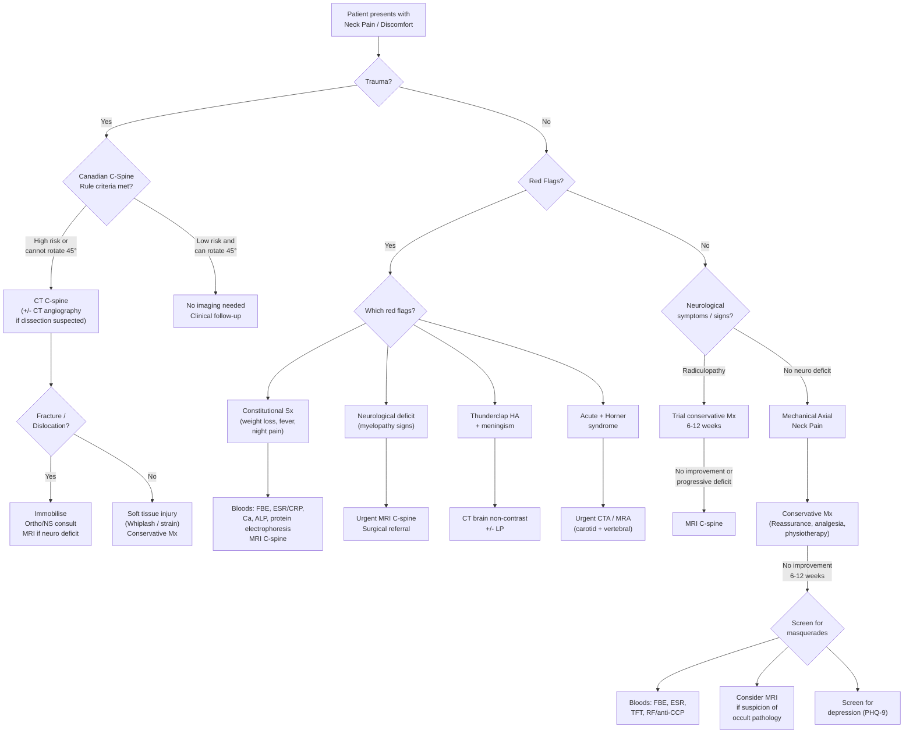

## Diagnostic Criteria, Diagnostic Algorithm, and Investigations for Neck Pain/Discomfort

Neck pain is fundamentally a **clinical diagnosis** — there is no single "diagnostic criterion" the way there is for, say, rheumatoid arthritis or migraine. Instead, the diagnostic process centres on three sequential questions:

1. **Are there red flags** suggesting serious underlying pathology?
2. **Is there neurological compromise** (myelopathy or radiculopathy)?
3. **What is the likely aetiology** (mechanical, inflammatory, infective, neoplastic, vascular, referred, psychogenic)?

The investigations you order are guided entirely by the clinical picture. As the lecture slides emphasise: ***imaging should be selected conservatively and plain X-ray is not indicated in the absence of red flags and major trauma*** [1].

---

### 1. Diagnostic Criteria for Specific Conditions Presenting as Neck Pain

While "neck pain" itself has no formal diagnostic criteria, several specific conditions within the differential *do*. These are the ones examiners expect you to know.

#### 1.1 Cervical Myelopathy — Japanese Orthopaedic Association (JOA) Score

The ***JOA classification*** is the standard severity grading tool for cervical myelopathy [4]. It quantifies functional impairment across four domains, with a total normal score of **17 points**:

| Domain | Parameter | Score Range |
|---|---|---|
| **I. Upper extremity function** | Ability to use chopsticks, buttons, write — graded by what the patient can perform | 0–4 |
| **II. Lower extremity function** | Gait — from unable to walk (0) to normal (4) | 0–4 |
| **III. Sensory** | Upper extremity (0–2) + Lower extremity and trunk (0–2) — from severe loss to normal | 0–4 (2+2) |
| **IV. Bladder function** | From urinary retention (0) to normal (3) | 0–3 |
| **Total** | | **0–17** |

> **Why this scoring system?** Cervical myelopathy is a surgical condition. The JOA score provides a standardised, reproducible way to (a) classify severity and guide surgical timing, and (b) measure postoperative recovery rate. Recovery rate = (post-op JOA − pre-op JOA) ÷ (17 − pre-op JOA) × 100%.

> The domain I assessment asks about chopstick use — this is culturally specific and highly relevant to HKUMed exams!

#### 1.2 Cervical Radiculopathy — Clinical Diagnostic Criteria

There are no universally accepted formal diagnostic criteria, but a combination of the following features constitutes a clinical diagnosis [2]:

1. ***Radicular pain***: sharp, shooting pain in a dermatomal distribution, ***worse on coughing*** [2]
2. **Paraesthesia/numbness**: in the affected dermatome
3. **Motor deficit**: weakness in the corresponding myotome
4. **Reflex change**: hyporeflexia of the affected segment
5. **Positive provocative tests**: ***Spurling manoeuvre*** (high specificity ~93%) and ***shoulder abduction relief test*** [2]
6. **MRI correlation**: nerve root compression at the concordant level

> The key principle: the clinical findings (dermatomal pain, myotomal weakness, reflex loss) must be **concordant** with each other and with the imaging level. A disc prolapse on MRI that doesn't match the clinical picture is likely an incidental finding.

#### 1.3 Giant Cell Arteritis (GCA) — ACR 1990 Criteria

Relevant because GCA can present as neck pain with occipital headache in patients > 50, and overlaps with PMR [2]:

**Diagnosis: ≥ 3 of 5 criteria** [2]:
1. ***Onset ≥ 50 years***
2. ***New headache***
3. ***Abnormalities of temporal artery at clinical examination*** (tenderness, thickened, non-pulsatile)
4. ***↑ ESR ( > 50 mm/h)***
5. ***Abnormal findings on biopsy of temporal artery*** (granulomatous inflammation with giant cells)

#### 1.4 Atlantoaxial Subluxation in RA — Radiographic Criteria

***Anterior atlantodens interval (AADI) ≥ 4 mm*** on lateral cervical spine XR (exaggerated by flexion view) indicates subluxation [8]. ***Increased risk of neurological deficit when posterior ADI < 14 mm*** [8].

#### 1.5 Spinal Stenosis — Pavlov Ratio

***Pavlov ratio = AP diameter of spinal canal ÷ AP diameter of vertebral body at the same level*** [4].
- **Normal**: ≥ 1.0
- ***< 0.8***: suggests developmental cervical stenosis [4]

> **Why this ratio?** The absolute canal diameter varies with body habitus. Normalising to the vertebral body diameter makes the measurement more reliable. A ratio < 0.8 indicates a congenitally narrow canal, meaning even mild spondylotic changes can cause symptomatic stenosis or myelopathy.

#### 1.6 Canadian C-Spine Rule (CCR) — Decision Rule for Imaging After Trauma

This is the key decision tool for whether a trauma patient with neck pain needs imaging:

**Step 1**: Any high-risk factor mandating radiography?
- Age ≥ 65, dangerous mechanism (fall > 1 m, axial load to head, MVC > 100 km/h, bicycle collision, motorised recreational vehicle), paraesthesia in extremities
- If YES → **image**

**Step 2**: Any low-risk factor allowing safe assessment of ROM?
- Simple rear-end MVC, sitting position in ED, ambulatory at any time, delayed onset of neck pain, absence of midline C-spine tenderness
- If NO low-risk factor → **image**

**Step 3**: Can the patient actively rotate neck 45° left and right?
- If NO → **image**
- If YES → **no imaging needed**

<Callout title="Canadian C-Spine Rule vs NEXUS" type="idea">
Both are validated decision rules. The CCR is more sensitive (99.4% vs 90.7%) and more specific (45.1% vs 36.8%) than NEXUS for ruling out clinically significant cervical spine injury. In practice, the CCR is preferred, but NEXUS (5 criteria: no posterior midline tenderness, no intoxication, normal alertness, no focal neurological deficit, no distracting injury) is simpler and still widely used.
</Callout>

---

### 2. Diagnostic Algorithm

The following algorithm integrates the Murtagh approach [1] with the clinical reasoning framework from the senior notes [2][4][11].

---

### 3. Investigation Modalities — What to Order, Why, and What to Look For

#### 3.1 Overview of Key Investigations

***Key investigations — Consider: FBE, ESR, rheumatoid arthritis factors; radiology can include several modalities but MRI is the investigation of choice for radiculopathy, myelopathy, suspected spinal infection and tumours*** [1].

The principle is: **investigations serve to confirm or exclude a clinical hypothesis**. Never order a "neck pain panel" blindly.

#### 3.2 Blood Tests

| Test | When to Order | What You're Looking For | Interpretation |
|---|---|---|---|
| ***FBE (Full Blood Examination)*** [1] | Red flags, suspected infection, malignancy | ↑ WCC → infection; anaemia (normocytic) → chronic disease, malignancy; pancytopenia → bone marrow infiltration | Leucocytosis with left shift in osteomyelitis/discitis; NcNc anaemia in GCA/malignancy |
| ***ESR*** [1] | Suspected inflammatory/infective cause | ↑ ESR: non-specific marker of inflammation | ***ESR > 50 mm/h*** in GCA [2]; markedly elevated in osteomyelitis, malignancy, PMR; ↑ ESR + ↑ CRP in de Quervain's thyroiditis [6] |
| **CRP** | As above; more responsive to acute changes than ESR | ↑ CRP: acute-phase reactant, rises within 6 h | More useful than ESR for monitoring treatment response in infection |
| ***Rheumatoid arthritis factors (RF, anti-CCP)*** [1] | Suspected RA, esp. with peripheral joint disease | RF: sensitivity ~70%, specificity ~80%; anti-CCP: sensitivity ~70%, specificity ~95% | Positive RF + anti-CCP in context of inflammatory polyarthritis → strongly suggests RA; check C-spine for atlantoaxial subluxation [8] |
| **Calcium, ALP, phosphate** | Suspected malignancy, Paget's, metabolic bone disease | ↑ Ca → bone mets, myeloma; ↑ ALP → Paget's, bone mets; normal Ca + ↑↑ ALP → Paget's | ***↑ ALP*** with normal liver enzymes → bone origin (Paget's, mets) |
| **Protein electrophoresis** | Suspected myeloma | Monoclonal band (M-protein) on SPE | Myeloma can cause vertebral compression fractures presenting as neck/back pain |
| **TFT** | Suspected thyroiditis, thyroid dysfunction | ↓ TSH in thyrotoxic phase; ↑ TSH in hypothyroid phase of subacute thyroiditis | In de Quervain's: ***fluctuating thyroid status*** through thyrotoxic → hypothyroid → recovery phases [6] |
| **Blood cultures** | Suspected vertebral osteomyelitis, discitis, epidural abscess | Growth of causative organism (*S. aureus* in > 50%) | Essential before starting empirical antibiotics |
| **HLA-B27** | Suspected ankylosing spondylitis | Present in ~90% of AS patients (but only 2-6% of HK Chinese are HLA-B27+) | Supportive but not diagnostic; must correlate with clinical and imaging findings |

<Callout title="Don't Forget the Basics" type="error">
A common exam mistake: jumping straight to MRI without ordering basic bloods. In a patient with red flags, ***FBE and ESR*** [1] are cheap, fast screening tests that can immediately raise or lower your suspicion for infection, malignancy, or inflammatory disease. Get them first.
</Callout>

#### 3.3 Plain Radiography (X-ray)

***Imaging should be selected conservatively and plain X-ray is not indicated in the absence of red flags and major trauma*** [1].

**When to order**: trauma (if CCR/NEXUS positive), suspected fracture, suspected instability (RA — flexion/extension views), baseline assessment in spondylosis.

**Standard views**: AP, lateral, and open-mouth (odontoid/peg) view.

**What to look for systematically** (the "ABCS" approach):

| Component | What to Assess | Key Findings |
|---|---|---|
| **A — Alignment** | Four smooth curves on lateral view: anterior vertebral body line, posterior vertebral body line, spinolaminar line, tips of spinous processes | Step-off or disruption → subluxation, fracture-dislocation; loss of lordosis → muscle spasm, AS |
| **B — Bone** | Vertebral body height, cortical integrity, density | Compression fracture (↓ anterior height), burst fracture, osteolytic lesion (mets, myeloma), osteoblastic lesion (prostate mets, Paget's) |
| **C — Cartilage/Disc space** | Disc height, facet joints | ↓ disc height → degeneration; facet joint widening → subluxation |
| **S — Soft tissue** | Prevertebral soft tissue thickness | ***3×7=21 rule: C1 ≤ 10 mm, C3 ≤ 7 mm, C7 ≤ 21 mm*** [4]; ↑ thickness → haematoma, abscess, oedema |

**Additional specific findings** [2][11]:

| Finding | Significance |
|---|---|
| ***Pedicle erosion*** | ***Extradural metastases*** [2] — the pedicle is destroyed by tumour expanding within the vertebral body |
| ***Vertebral body collapse*** | Compression fracture — osteoporotic, pathological (mets, myeloma), or traumatic [2] |
| ***Narrow disc space + osteophytes + hypertrophic facet joints*** | ***Spondylosis*** [2] |
| ***Expansion of intervertebral foramina*** | ***Neurofibroma*** — the slow-growing tumour gradually erodes the foramen margins [2] |
| ***Pavlov ratio < 0.8*** | ***Cervical stenosis*** [4] |
| ***AADI ≥ 4 mm on flexion view*** | ***Atlantoaxial subluxation (RA)*** [8] |
| ***Syndesmophytes, bamboo spine*** | Ankylosing spondylitis — squaring of vertebral bodies, marginal syndesmophytes, complete fusion |
| ***"Flowing" calcification of ALL*** | DISH (diffuse idiopathic skeletal hyperostosis) — DDx of AS |

**Flexion/extension views**: specifically indicated for suspected instability (RA, post-trauma with normal static views) — ***AP + lateral XR C-spine with flexion and extension views*** [8]. These are dynamic views that demonstrate pathological motion not visible on neutral-position films.

#### 3.4 Computed Tomography (CT)

***CT uses X-rays to produce cross-sectional images; advantages over plain film include no superimposition and 3D images*** [12].

**When to order**:
- **Trauma**: CT C-spine is now the first-line investigation for cervical spine trauma in most centres (higher sensitivity than plain XR for fractures, especially at the craniocervical and cervicothoracic junctions)
- **Bony detail**: when XR is suspicious but inconclusive; to characterise fracture pattern for surgical planning
- **CT angiography (CTA)**: ***for assessment of vascular pathology — aneurysms and dissection*** [12]; ***urgent CTA/MRA if acute onset Horner's associated with neck pain/trauma → for ICA dissection*** [7]

**Key CT findings**:

| Condition | CT Findings |
|---|---|
| **Fracture** | Cortical discontinuity, fragment displacement, retropulsed bone; use bone window for detail |
| **Spondylosis** | Osteophytes, foraminal narrowing, facet hypertrophy, disc space narrowing; ***use bone window*** [12] |
| **OPLL** | Ossified posterior longitudinal ligament visible as high-density (calcified) strip behind vertebral bodies |
| **Vertebral osteomyelitis** | Vertebral body destruction, paravertebral soft tissue mass, epidural collection |
| **Metastasis** | Osteolytic (most) or osteoblastic (prostate, breast) vertebral body lesions; pedicle destruction |
| **Carotid/vertebral dissection** (CTA) | Intimal flap, intramural haematoma (crescent sign), luminal narrowing, pseudoaneurysm |

**Interpretation principles** [12]:
- ***Note: location, number, size, shape, outline, attenuation, contrast enhancement***
- ***Shape significance***: round/oval → slow displacing growth; irregular/infiltrative → malignancy; wedge/triangular → vascular territory (infarct) [12]
- Always view in **bone window** (for cortical detail) and **soft tissue window** (for disc, canal contents, paravertebral tissues)

#### 3.5 Magnetic Resonance Imaging (MRI)

***MRI is the investigation of choice for radiculopathy, myelopathy, suspected spinal infection and tumours*** [1].

**Why MRI is the gold standard for the cervical spine**:
- Superior soft tissue contrast compared to CT — directly visualises the spinal cord, nerve roots, discs, ligaments, and epidural space
- No ionising radiation
- Can detect early infection, tumour infiltration, and cord signal change (myelomalacia) that are invisible on CT and XR

**When to order**:
- Suspected myelopathy (***urgent***)
- Radiculopathy not responding to 6-12 weeks of conservative management, or with progressive deficit
- Suspected spinal infection (osteomyelitis, discitis, epidural abscess)
- Suspected spinal tumour (primary or metastatic)
- Pre-operative planning for cervical spondylotic disease
- ***Dynamic (flexion/extension) MRI if surgery indicated*** for RA cervical instability [8]
- Intracranial hypotension: ***contrast MRI shows diffuse pachymeningeal enhancement, dilated veins, sagging brain*** [2]

**Key MRI sequences and what they show**:

| Sequence | Bright (Hyperintense) | Dark (Hypointense) | Clinical Use |
|---|---|---|---|
| **T1-weighted** | Fat, subacute haemorrhage, gadolinium enhancement | Water, acute haemorrhage, calcification | Anatomy, post-contrast enhancement (tumour, infection, meningeal enhancement) |
| **T2-weighted** | Water (CSF, oedema, inflammation), disc degeneration | Cortical bone, ligaments, air | Disc pathology, cord signal change (myelomalacia/oedema), canal stenosis |
| **STIR (Short Tau Inversion Recovery)** | Oedema, inflammation (fat signal suppressed) | Fat (suppressed) | Bone marrow oedema (infection, fracture, mets), ligamentous injury |
| **T1 + Gadolinium** | Enhancing lesions (tumour, infection, meningeal pathology) | As T1 | ***T1 contrast-enhancing*** tumours (schwannoma, meningioma with dural tail sign) [4]; ring enhancement in abscess |

**Key MRI findings by condition**:

| Condition | MRI Findings |
|---|---|
| **Disc prolapse** | T2: disc material herniating posterolaterally or centrally; nerve root compression or cord compression; disc is typically dark on T2 (degenerated) |
| **Cervical myelopathy** | Cord compression by disc/osteophyte/ligamentum flavum; T2 hyperintensity within the cord (myelomalacia — indicates gliosis and irreversible damage); T1 hypointensity if severe |
| **Spinal stenosis** | ↓ AP diameter of canal; effacement of CSF signal around the cord; cord compression |
| **Vertebral osteomyelitis/discitis** | T1: low signal in vertebral body and disc; T2: high signal; STIR: high signal; post-Gad: enhancement of disc, vertebral body, and epidural space; epidural abscess if present |
| **TB spine (Pott's disease)** | Similar to above BUT: subligamentous spread (tracking under ALL across multiple levels — characteristic of TB), paravertebral abscess (often large), relative disc preservation early on, skip lesions |
| **Metastasis** | T1: low signal replacing normal bright marrow fat; T2: variable; STIR: bright; post-Gad: enhancement; pedicle involvement, epidural extension, cord compression |
| ***Schwannoma*** | ***T1 contrast-enhancing***; well-circumscribed; dumbbell-shaped (extending through foramen); ***common at cervical and lumbar spine, 95% arise from sensory nerve root*** [4] |
| ***Meningioma*** | ***Homogenous enhancement with dural tail sign***; ***common at thoracic level (80%); lateral to spinal cord (70%)*** [4] |
| **Intracranial hypotension** | ***Diffuse pachymeningeal enhancement, dilated veins, sagging brain ± pocket of CSF at site of leakage*** [2] |

<Callout title="T2 Signal in the Cord = Bad News">
T2 hyperintensity within the spinal cord on MRI (myelomalacia) represents irreversible gliotic change. This is the imaging correlate of clinical myelopathy and indicates that some degree of permanent neurological damage has already occurred. This finding strongly favours surgical intervention to prevent further deterioration, even if the patient's symptoms seem mild.
</Callout>

#### 3.6 CT Angiography (CTA) / MR Angiography (MRA)

***Vascular imaging: Doppler, MR or CT angiogram*** — indicated for suspected ***arterial dissection*** [9][12].

| Modality | Advantages | When to Use |
|---|---|---|
| **CTA** | Fast, widely available, high spatial resolution; can detect intimal flap, intramural haematoma, pseudoaneurysm | ***Urgent CTA/MRA if acute onset and associated with neck pain/trauma → for ICA dissection*** [7]; acute stroke workup |
| **MRA** | No radiation, no iodinated contrast; can detect intramural haematoma on fat-sat T1 sequences (crescent sign) | Subacute/chronic dissection follow-up; contraindication to CTA (contrast allergy, renal impairment) |
| **Doppler USG** | Non-invasive, no radiation, portable; can assess carotid stenosis and flow velocities | Screening for carotid stenosis; ***indicated for thoracic outlet syndrome*** [4]; follow-up of known dissection |

#### 3.7 Nuclear Medicine / PET-CT

| Modality | Indication | Findings |
|---|---|---|
| **Technetium-99m bone scan** | Suspected metastases (screening whole skeleton), occult fracture, Paget's disease | Increased uptake ("hot spots") at areas of ↑ osteoblastic activity |
| **PET-CT** | Staging of known malignancy, suspected occult primary, assessment of treatment response | ↑ FDG uptake (SUV > 2.5) in metabolically active tumour or infection; ***useful for marginally resectable or high surgical risk*** [10] |
| **Thyroid scintigraphy** | Thyroid nodule with ↓ TSH (to differentiate toxic nodule from malignancy) | Hot nodule (↑ uptake) → toxic adenoma; cold nodule (↓ uptake) → concern for malignancy [5] |

#### 3.8 Neurophysiological Studies

| Test | Indication | What It Shows | Key Findings |
|---|---|---|---|
| **Nerve conduction studies (NCS)** | Differentiate radiculopathy from peripheral neuropathy/entrapment | Conduction velocity, amplitude, latency along peripheral nerves | Radiculopathy: NCS often normal (pathology is proximal to DRG); entrapment: focal slowing/conduction block at compression site |
| **Electromyography (EMG)** | Confirm radiculopathy, distinguish acute from chronic denervation | Needle recording of motor unit potentials in muscles | Acute denervation: fibrillation potentials, positive sharp waves; chronic: large polyphasic motor units (reinnervation); pattern follows myotomal distribution → confirms root level |
| **Somatosensory evoked potentials (SSEP)** | Cervical myelopathy — assess sensory conduction through cord; intraoperative monitoring | Cortical response to peripheral nerve stimulation | Prolonged latency or reduced amplitude → impaired dorsal column conduction; useful for monitoring during decompressive surgery |

> **Why is NCS often normal in radiculopathy?** In a typical radiculopathy, the lesion is proximal to the dorsal root ganglion (DRG). The sensory nerve action potential (SNAP) measures conduction *distal* to the DRG, which remains intact. This is why EMG (which tests motor units in the muscle) is more useful than NCS for confirming radiculopathy.

#### 3.9 Lumbar Puncture (LP)

| Indication | What to Send | Key Findings |
|---|---|---|
| Suspected meningitis | ***R/M, cell count, C/ST, biochemistry, TB workup, viral studies, cytology ± VDRL, oligoclonal bands*** [2] | Bacterial: ↑ WCC (neutrophils), ↑ protein, ↓ glucose, +ve Gram stain/culture; TB: ↑ lymphocytes, ↑ protein, ↓ glucose, +ve AFB/PCR |
| Suspected SAH (CT negative) | Xanthochromia, RBC count | Xanthochromia (yellow CSF from bilirubin — takes ≥ 12 h to develop) confirms SAH |
| Intracranial hypotension | Opening pressure | ***↓ opening pressure*** with normal constituents [2] |

<Callout title="LP Contraindication in Cord Compression" type="error">
***Lumbar puncture may cause deterioration in cord compression!*** [2] If you suspect spinal cord compression, get an urgent MRI first. LP can alter the pressure differential across the lesion and cause the cord to herniate further into the compressed segment. This is a classic exam trap — never LP a patient with suspected cord compression without imaging first.
</Callout>

#### 3.10 Other Investigations

| Investigation | When | Why |
|---|---|---|
| ***CXR*** | Suspected Pancoast tumour, lung metastasis, cervical rib, retrosternal goitre | ***CXR indicated for thoracic outlet syndrome*** [4]; Pancoast tumour may show apical lung mass with rib destruction |
| **Direct laryngoscopy** | Suspected RLN palsy (dysphonia) in context of thyroid/cervical pathology | ***Direct laryngoscopy for RLN palsy*** [5] — vocal cord paralysis confirms recurrent laryngeal nerve involvement |
| **USG thyroid** | Thyroid nodule/goitre | ***USG for ALL goitre/nodules*** [5]; look for TI-RADS features of malignancy: hypoechoic, microcalcification, taller-than-wide, irregular margins, intranodular vascularity |
| **USG neck** | Cervical lymphadenopathy assessment | Hilum preservation (benign) vs absent hilum, round shape, microcalcification (malignant) |
| **FNAC** | Suspicious thyroid nodule, suspicious lymph node | Cytological diagnosis — Bethesda classification for thyroid; essential for confirming/excluding malignancy |
| **Temporal artery biopsy** | Suspected GCA | ***Abnormal findings on biopsy — diagnostic criterion*** [2]; must be done < 24-48 h; may be falsely negative due to patchy ("skip") inflammation |

---

### 4. Integrating Investigations with Clinical Scenarios — A Summary Table

| Clinical Scenario | First-Line Investigations | Second-Line Investigations |
|---|---|---|
| **Mechanical axial neck pain, no red flags** | None initially (clinical Dx) → if persistent > 6-12 weeks: FBE, ESR | XR C-spine; MRI only if atypical features or failure to improve |
| **Post-traumatic neck pain** | CT C-spine (per CCR/NEXUS) | MRI if neuro deficit; CTA if dissection suspected |
| **Suspected radiculopathy** | Clinical Dx initially → MRI if no improvement at 6-12 weeks or progressive deficit | EMG/NCS to differentiate from peripheral neuropathy |
| **Suspected myelopathy** | ***Urgent MRI C-spine*** | NCS/SSEP for monitoring; bloods to exclude B12 deficiency |
| **Suspected infection** | FBE, ESR/CRP, blood cultures → ***urgent MRI C-spine*** | CT-guided biopsy for culture/histology if MRI positive |
| **Suspected malignancy** | FBE, ESR, Ca, ALP, SPE, CXR → ***MRI C-spine*** | PET-CT for staging; CT-guided biopsy for tissue diagnosis |
| **Suspected arterial dissection** | ***Urgent CTA or MRA*** (head and neck) | Doppler USG for follow-up |
| **Suspected SAH** | CT brain non-contrast → LP if CT negative at ≥ 12 h | CTA/DSA for aneurysm detection |
| **Suspected inflammatory (RA/AS/PMR)** | ***FBE, ESR, RF/anti-CCP***, HLA-B27 (if AS); XR C-spine with flexion/extension (if RA) | MRI sacroiliac joints (AS); temporal artery biopsy (if GCA suspected with PMR) |
| **Suspected thyroiditis** | TFT, ESR/CRP; USG thyroid | Thyroid scintigraphy if nodular + ↓ TSH |
| **Cervical lymphadenopathy** | FBE, ESR, USG neck, monospot/EBV serology | FNAC or excision biopsy if persistent/suspicious; NPC screening (EBV VCA IgA, nasopharyngoscopy) in HK |

---

<Callout title="High Yield Summary">

**Diagnostic criteria you must know:**
- ***JOA score*** for cervical myelopathy (total 17 points; four domains: UE function, LE function, sensory, bladder) [4]
- ***AADI ≥ 4 mm*** for atlantoaxial subluxation in RA [8]
- ***Pavlov ratio < 0.8*** for cervical stenosis [4]
- ***GCA criteria***: ≥ 3 of 5 (age ≥ 50, new headache, temporal artery abnormality, ESR > 50, abnormal biopsy) [2]
- **Canadian C-Spine Rule** for post-traumatic imaging decisions

**Investigation hierarchy:**
- ***Imaging should be selected conservatively; plain X-ray is not indicated without red flags or major trauma*** [1]
- ***MRI is the investigation of choice for radiculopathy, myelopathy, suspected spinal infection and tumours*** [1]
- **CT C-spine** is first-line for trauma
- ***CTA/MRA urgent if acute onset + neck pain/trauma + Horner syndrome*** → arterial dissection [7]
- ***FBE and ESR*** are the basic screening bloods [1]

**Key imaging findings:**
- ***Prevertebral soft tissue: 3×7=21 rule*** [4]
- ***Pedicle erosion → extradural metastases*** [2]
- ***Narrow disc + osteophytes + facet hypertrophy → spondylosis*** [2]
- ***T2 cord hyperintensity → myelomalacia (irreversible)***
- ***LP is contraindicated in suspected cord compression*** [2]

</Callout>

---

<ActiveRecallQuiz
  title="Active Recall - Diagnosis and Investigations for Neck Pain"
  items={[
    {
      question: "What are the four domains of the JOA score for cervical myelopathy, and what is the total normal score?",
      markscheme: "I. Upper extremity function (0-4), II. Lower extremity function (0-4), III. Sensory - UE (0-2) + LE/trunk (0-2), IV. Bladder function (0-3). Total normal = 17 points.",
    },
    {
      question: "A patient with RA has a lateral C-spine XR with flexion view showing AADI of 6 mm and posterior ADI of 12 mm. What do these values indicate?",
      markscheme: "AADI 6 mm (normal less than 4 mm) confirms atlantoaxial subluxation. Posterior ADI 12 mm (less than 14 mm) indicates increased risk of neurological deficit. This patient needs urgent surgical referral and MRI.",
    },
    {
      question: "According to the Murtagh framework, what is the investigation of choice for radiculopathy, myelopathy, suspected spinal infection and tumours?",
      markscheme: "MRI. Imaging should be selected conservatively and plain X-ray is not indicated in the absence of red flags and major trauma.",
    },
    {
      question: "Explain the 3x7=21 rule for prevertebral soft tissue thickness on lateral cervical spine X-ray.",
      markscheme: "Prevertebral soft tissue should be: C1 up to 10 mm, C3 up to 7 mm, C7 up to 21 mm. Increased thickness suggests haematoma, abscess, or oedema anterior to the spine.",
    },
    {
      question: "Why is NCS often normal in cervical radiculopathy, and what neurophysiological test is more useful?",
      markscheme: "In radiculopathy, the lesion is proximal to the dorsal root ganglion (DRG). NCS measures conduction distal to the DRG, which remains intact, so SNAP is preserved. EMG is more useful because it detects denervation changes (fibrillations, positive sharp waves) in the affected myotome, confirming the root level.",
    },
    {
      question: "What investigation must you order urgently in a patient with acute neck pain, ipsilateral Horner syndrome, and contralateral arm weakness?",
      markscheme: "Urgent CT angiography or MR angiography of the head and neck to evaluate for carotid artery dissection. The Horner syndrome results from compression of sympathetic fibres along the ICA; the contralateral weakness suggests thromboembolic stroke from the dissection.",
    },
  ]}
/>

## References

[1] Lecture slides: murtagh merge.pdf (Neck pain and stiffness, p69–70)
[2] Senior notes: Ryan Ho Neurology.pdf (Degenerative Changes of Spine, p172–173; Headache approach and DDx table, p56–61; GCA, p65; Spinal cord lesions and cord compression, p169; Intracranial hypotension, p158; Generalised weakness, p178)
[4] Senior notes: maxim.md (Spinal stenosis including Pavlov ratio and JOA score, p466–467; Thoracic outlet syndrome, p502; Spinal tumours, p775)
[5] Senior notes: Ryan Ho Endocrine.pdf (Thyroid nodule investigation, p17–19)
[6] Senior notes: Ryan Ho Endocrine.pdf (Subacute thyroiditis, p31)
[7] Senior notes: Ryan Ho Opthalmology.pdf (Horner syndrome — CTA indication, p77)
[8] Senior notes: Ryan Ho Rheumatology.pdf (RA cervical spine — AADI criteria and investigation, p48)
[9] Senior notes: Ryan Ho Fundamentals.pdf (Headache DDx and investigation table, p311–315)
[10] Senior notes: Ryan Ho Respiratory.pdf (PET-CT and Pancoast tumour MRI, p144)
[11] Senior notes: Ryan Ho Fundamentals.pdf (Cervical myelopathy special tests, p146; Cord compression Mx and DDx, p335–336)
[12] Senior notes: Ryan Ho Diagnostic Radiology.pdf (CT principles and applications, p36–43; MRI in stroke, p50)
