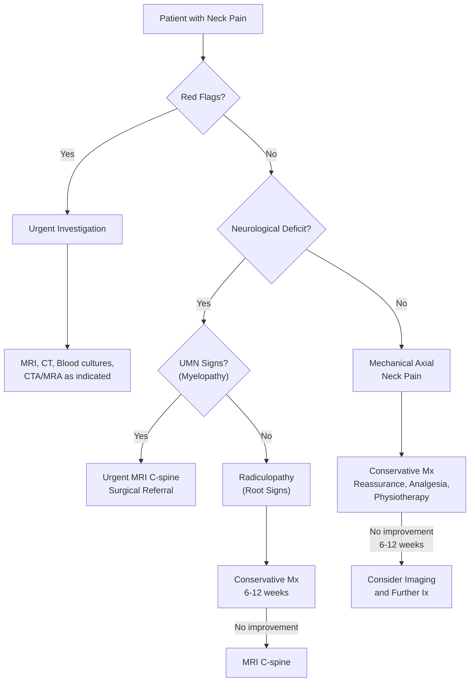

# Neck Pain/Discomfort

## 1. Definition

Neck pain (cervicalgia) refers to **pain or discomfort felt in the cervical region** — the anatomical area bounded superiorly by the superior nuchal line and the external occipital protuberance, and inferiorly by an imaginary transverse line through the T1 spinous process [1]. It is one of the most common musculoskeletal complaints in primary care and hospital settings, and — like headache — **causes considerable worry but rarely represents sinister disease** [2].

Let's break down the terminology:
- **Cervicalgia**: "cervic-" = neck (Latin *cervix*), "-algia" = pain (Greek *algos*)
- **Torticollis**: "torti-" = twisted (Latin *tortus*), "-collis" = neck → literally "twisted neck"
- **Spondylosis**: "spondylo-" = vertebra (Greek *spondylos*), "-osis" = degenerative condition
- **Radiculopathy**: "radiculo-" = nerve root (Latin *radicula*), "-pathy" = disease
- **Myelopathy**: "myelo-" = spinal cord (Greek *myelos*), "-pathy" = disease

> Think of neck pain as a symptom complex, not a diagnosis. Your job is to work out *what structure* is generating the pain and *why*.

---

## 2. Epidemiology

### 2.1 Global and Hong Kong Burden

- **Lifetime prevalence**: ~50–70% of adults will experience neck pain at some point [3].
- **Point prevalence**: approximately 10–15% of the general population at any given time.
- **Annual incidence**: roughly 15–20% per year in working-age adults.
- Neck pain is the **4th leading cause of years lived with disability (YLDs)** globally (Global Burden of Disease Study, 2019).
- In Hong Kong, neck pain is extremely common in the working population given the city's high proportion of sedentary office-based work, prolonged smartphone use ("tech neck"), and aging population.

### 2.2 Demographics

- **Age**: prevalence increases with age, peaking in the 4th–6th decades. Degenerative changes (spondylosis) are almost universal on imaging by age 60, though often asymptomatic.
- **Sex**: slight female predominance (F > M, ~1.5:1) across most studies. This may relate to differences in muscle bulk, psychosocial stress, and hormonal factors.
- **Occupation**: high-risk groups include office workers, healthcare workers, manual labourers, and professional drivers.

### 2.3 Risk Factors

| Category | Risk Factors |
|---|---|
| **Demographic** | Older age, female sex |
| **Occupational** | Sedentary desk work, prolonged computer/smartphone use, heavy manual labour, repetitive overhead work, vibration exposure |
| **Lifestyle** | Smoking (impairs disc nutrition via ↓ blood flow), obesity, physical inactivity, poor sleep posture |
| **Psychosocial** | ***Stress and adverse occupational factors*** [1], anxiety, depression, job dissatisfaction, catastrophising |
| **Prior history** | Previous neck pain or trauma (including ***whiplash***) [1] |
| **Comorbidities** | Degenerative disc disease, osteoporosis, rheumatoid arthritis, ankylosing spondylitis, connective tissue disorders |
| **Genetic** | Disc degeneration has a heritable component (~60% for lumbar; similar for cervical) |

<Callout title="Psychosocial Factors Are Underappreciated" type="idea">
***Is the patient trying to tell me something? Highly probable. Stress and adverse occupational factors relevant.*** [1] Neck pain is one of those conditions where the biopsychosocial model truly matters. Always screen for depression, anxiety, and workplace dissatisfaction — they are independent risk factors for chronicity.
</Callout>

---

## 3. Anatomy and Function of the Cervical Spine

Understanding neck pain demands a solid grasp of the anatomy, because *every symptom maps back to a structure*.

### 3.1 Osseous Anatomy

The cervical spine consists of **7 vertebrae (C1–C7)**, divided into:

- **Upper cervical spine (C0–C2)**: highly specialised for rotation and flexion/extension
  - **Atlas (C1)**: ring-shaped, no body, no spinous process; articulates with occipital condyles (atlanto-occipital joint → nodding "yes")
  - **Axis (C2)**: possesses the **dens (odontoid process)** — a bony peg that projects superiorly and articulates with the anterior arch of C1, held in place by the **transverse ligament**. The atlantoaxial joint (C1/C2) allows ~50% of total cervical rotation (turning head "no")
  - **Atlantoaxial instability**: occurs when the transverse ligament is disrupted — relevant in ***trauma, Down syndrome (absent transverse ligament), and RA (inflammation/rupture of transverse ligament)*** [4]

- **Lower cervical spine (C3–C7)**: more typical vertebral morphology with vertebral bodies, uncovertebral joints (joints of Luschka — unique to cervical spine), facet joints, and intervertebral discs

### 3.2 Joints and Ligaments

| Structure | Function | Clinical Relevance |
|---|---|---|
| **Facet (zygapophyseal) joints** | Guide and limit segmental motion; bear ~25% of axial load | ***Commonest cause of neck pain is idiopathic dysfunction of the facet joints without a history of injury*** [1] |
| **Uncovertebral joints (of Luschka)** | Limit lateral flexion; stabilize | Osteophyte formation here → foraminal stenosis → radiculopathy |
| **Intervertebral discs** | Shock absorption, allow motion | Degeneration → loss of height → foraminal narrowing; prolapse → nerve root/cord compression |
| **Anterior longitudinal ligament (ALL)** | Limits extension | Rarely injured |
| **Posterior longitudinal ligament (PLL)** | Limits flexion, posterior support | ***Ossification of PLL (OPLL)*** → cervical myelopathy [4] |
| **Ligamentum flavum** | Connects adjacent laminae, limits flexion | Hypertrophy with age → spinal canal stenosis → myelopathy [4] |
| **Transverse ligament of atlas** | Holds dens against anterior arch of C1 | Rupture → atlantoaxial instability → cord compression |
| **Alar ligaments** | Limit rotation at C1/C2 | Injury → rotatory instability |

### 3.3 Neural Structures

- **Spinal cord**: lies within the spinal canal, ends at ~L1-L2 in adults (conus medullaris). The cervical cord contains the pathways for all four limbs and the autonomic system.
- **Cervical nerve roots**: 8 pairs (C1–C8). C1–C7 nerve roots exit *above* their corresponding vertebra (e.g., C6 root exits above C6 pedicle). **C8 exits below C7** (there is no C8 vertebra). From T1 downwards, nerve roots exit *below* their corresponding vertebra.

> This is why in the cervical spine, a ***C6/7 disc prolapse can affect the C7 nerve root*** (the root exiting at that level), whereas in the lumbar spine, there is a mismatch — a posterolateral L4/5 disc prolapse affects the L5 root (which crosses the disc before exiting below the L5 pedicle) [4].

- **Vertebral arteries**: ascend through the transverse foramina of C6–C1 before entering the foramen magnum. Osteophytes or cervical manipulation can compress or dissect these arteries → vertebrobasilar insufficiency or stroke.

### 3.4 Muscular Anatomy

Key muscle groups:
- **Posterior**: trapezius, splenius capitis/cervicis, semispinalis, multifidus, suboccipital muscles
- **Lateral**: scalenes (anterior, middle, posterior), levator scapulae, sternocleidomastoid (SCM)
- **Anterior**: longus colli, longus capitis, rectus capitis

> The **scalene muscles** form part of the thoracic outlet — hypertrophy or spasm can contribute to ***outlet compression syndrome (e.g. cervical rib)*** [1].

### 3.5 Vascular Anatomy

- **Common carotid arteries** and **internal jugular veins** course through the neck — relevant for vascular causes of neck pain (e.g., carotid/vertebral dissection).
- **Vertebral arteries** (as above).

### 3.6 Other Structures

- **Pharynx and oesophagus**: anterior to the cervical spine — retropharyngeal abscess or ***oesophageal foreign bodies and tumours*** [1] can present as neck pain.
- **Thyroid gland**: ***thyroiditis*** (e.g., de Quervain's subacute thyroiditis) can cause anterior neck pain radiating to the jaw and ears [5].
- **Cervical lymph nodes**: ***cervical lymphadenitis*** is an often-missed cause of neck pain [1].
- **Meninges**: meningeal inflammation (meningitis) causes neck stiffness (meningism) due to irritation of pain-sensitive dura.

### 3.7 Soft Tissue Rules for Cervical Spine X-ray

These rules help identify prevertebral soft tissue swelling (suggesting haematoma, abscess, or fracture):

- ***3×7=21 rule***: prevertebral soft tissue thickness at **C1 ≤ 10 mm**, **C3 ≤ 7 mm**, **C7 ≤ 21 mm** [4]
- ***1-2-3-4-5-6 rule***: C1-2 soft tissue less than dens width, C3-4 < 3-4 mm, C5-6 narrower than AP diameter of vertebral body [4]
- ***Vertebral body rule***: mid-cervical level ≤ half of vertebral body thickness, lower cervical level < full vertebral body thickness [4]

---

## 4. Etiology (with Focus on Hong Kong) and Pathophysiology

This section organises the causes of neck pain systematically using the Murtagh framework [1], with pathophysiological explanations for each.

### 4.1 Probability Diagnoses (Common Causes)

These are the conditions you will see day in, day out.

#### 4.1.1 ***Vertebral Dysfunction, Including Acute Torticollis*** [1]

- **Definition**: functional disturbance of the cervical facet joints (zygapophyseal joints) without structural pathology visible on imaging.
- ***The commonest cause of neck pain is idiopathic dysfunction of the facet joints without a history of injury*** [1].
- **Pathophysiology**: 
  - The facet joints are richly innervated by the medial branches of the dorsal rami. Mechanical irritation (e.g., poor posture, sleeping awkwardly, sudden movement) → joint capsule stretching or meniscoid entrapment → reflex muscle spasm → pain.
  - In **acute torticollis** ("wry neck"), there is sudden-onset unilateral neck pain with the head held in a characteristic laterally flexed and rotated posture. This is thought to result from entrapment of a meniscoid inclusion or joint capsule impingement in a cervical facet joint, triggering protective paraspinal muscle spasm.
- **Relevance in HK**: extremely common in office workers and students with prolonged flexed posture.

#### 4.1.2 ***Traumatic 'Strain' or 'Sprain', Including 'Whiplash'*** [1]

- **Strain**: injury to muscle or tendon (e.g., cervical paraspinal muscles)
- **Sprain**: injury to ligament (e.g., facet joint capsular ligaments, interspinous ligaments)
- **Whiplash-associated disorder (WAD)**: typically from rear-end motor vehicle collisions → sudden hyperextension followed by hyperflexion of the cervical spine → injury to muscles, ligaments, facet joint capsules, intervertebral discs, and potentially the vertebral arteries.
  - **Pathophysiology**: The inertia of the head relative to the torso causes a sigmoid-shaped deformation of the cervical spine during the initial phase — the lower cervical spine hyperextends while the upper cervical spine flexes. This creates shear forces across the C5-C6 and C6-C7 segments, injuring the posterior ligamentous complex, facet capsules, and annulus fibrosus.
  - Graded by the **Quebec Task Force Classification** (Grade 0–IV):
    - Grade 0: No complaint, no signs
    - Grade I: Neck complaint only (pain, stiffness, tenderness), no signs
    - Grade II: Neck complaint + musculoskeletal signs (↓ ROM, point tenderness)
    - Grade III: Neck complaint + neurological signs (↓ reflexes, weakness, sensory deficit)
    - Grade IV: Neck complaint + fracture or dislocation

#### 4.1.3 ***Cervical Spondylosis*** [1]

- **Definition**: ***degenerative changes of the spine, including intervertebral disc degeneration, disc herniation, osteophytes; and facet joint degeneration leading to hypertrophy, instability and thickened ligamentum flavum*** [2][4].
- **Epidemiology**: radiographic cervical spondylosis is present in >85% of people over 60. However, imaging findings correlate poorly with symptoms.
- **Pathophysiology** (the degenerative cascade):
  1. **Disc desiccation**: with ageing, the nucleus pulposus loses water content (↓ proteoglycan and ↑ collagen cross-linking) → ↓ disc height → ↓ shock absorption capacity
  2. **Annular fissuring**: the drier, stiffer disc is more susceptible to circumferential and radial tears in the annulus fibrosus
  3. **Osteophyte formation**: loss of disc height → abnormal loading of vertebral endplates and uncovertebral joints → reactive bone formation (osteophytes) at disc margins and uncovertebral joints
  4. **Facet joint degeneration**: loss of disc height changes the loading pattern on the facet joints → cartilage degeneration, osteophyte formation, joint capsule laxity, and hypertrophy of the ligamentum flavum
  5. **Foraminal and canal narrowing**: osteophytes from uncovertebral joints and facet joints, combined with disc bulging and ligamentum flavum thickening, narrow the intervertebral foramina and/or spinal canal → nerve root compression (radiculopathy) and/or spinal cord compression (myelopathy)

> The key concept: spondylosis is a *spectrum*. Simple axial neck pain is at the benign end; myelopathy is at the serious end. The pathology is the same — it's the degree and location of neural compression that determines the clinical picture.

- ***Consequences of spondylosis***: ***instability, spinal canal stenosis, myelopathy (compression of spinal cord), radiculopathy (compression of spinal roots)*** [2]

---

### 4.2 Serious Disorders Not to Be Missed

These are the conditions that, if missed, lead to catastrophic outcomes. This is your "red flag" territory.

#### 4.2.1 Cardiovascular

***(a) Angina*** [1]

- Referred pain from cardiac ischaemia can present as neck or jaw discomfort. The mechanism is **viscerosomatic convergence** — cardiac afferents (C8-T4 dermatomes) converge on the same second-order neurons in the spinal cord as somatic afferents from the neck and arm, leading the brain to mislocalize the pain.
- Always consider in a patient with neck pain + cardiovascular risk factors, especially if associated with exertion, chest tightness, or dyspnoea.

***(b) Subarachnoid Haemorrhage (SAH)*** [1]

- SAH can present as severe "thunderclap" headache with neck stiffness (meningism). The blood in the subarachnoid space irritates the meninges, which are pain-sensitive → neck stiffness and pain.
- **Why neck stiffness?** Blood products in the CSF trigger an inflammatory response in the leptomeninges → protective paraspinal muscle spasm (meningism) to limit movement that would further irritate the inflamed meninges.

***(c) Arterial Dissection*** [1]

- **Carotid artery dissection**: presents with ipsilateral neck/face pain, headache, Horner syndrome (due to disruption of sympathetic fibres running along the internal carotid artery), and potentially stroke (if the dissection flap or thrombus embolises to the brain).
- **Vertebral artery dissection**: presents with posterior neck pain/occipital headache ± signs of posterior circulation stroke (vertigo, ataxia, visual field defects, brainstem signs).
- **Pathophysiology**: a tear in the tunica intima of the artery → blood tracks into the vessel wall → intramural haematoma → luminal narrowing (→ ischaemia) and/or aneurysmal dilatation (→ compression of adjacent structures). The intimal flap can also act as a nidus for thrombus formation → embolism [3][6].
- **Risk factors**: trauma (even minor, e.g., chiropractic manipulation, sports), connective tissue disorders (Marfan, Ehlers-Danlos, fibromuscular dysplasia), hypertension.
- ***Relevance to retinal artery occlusion***: neck pain + recent cervical trauma → carotid artery dissection → retinal artery occlusion [7].

<Callout title="Arterial Dissection — Don't Miss This" type="error">
Any young or middle-aged patient presenting with acute neck pain + headache + Horner syndrome (miosis, ptosis, anhidrosis) or new neurological deficits must have arterial dissection excluded urgently with CT angiography or MR angiography. Delay in diagnosis → stroke or death.
</Callout>

#### 4.2.2 Neoplasia/Cancer

***(a) Primary Tumour*** [1]

- Primary bone tumours of the cervical spine are rare (e.g., chordoma, osteosarcoma, chondrosarcoma, multiple myeloma/plasmacytoma).
- Pain is typically insidious, progressive, unrelated to activity, worse at night, and associated with constitutional symptoms (weight loss, night sweats, fever).

***(b) Metastasis*** [1]

- The cervical spine is less commonly affected by metastases than the thoracic and lumbar spine, but it still occurs.
- ***Common primary sites for spinal metastases***: **lung, breast, prostate, kidney, thyroid** (mnemonic: "**L**ead **K**ettle **B**oils **T**oo **P**oor" or "**P**robably **B**etter **L**eave **K**idney **T**umours") [4].
- Pathological fracture through a metastatic lesion can cause sudden worsening of pain, cord compression, or instability.
- **Red flags**: age > 50 or < 20, history of malignancy, unexplained weight loss, constant pain not relieved by rest, night pain, progressive neurological deficit.

***(c) Pancoast Tumour*** [1]

- A lung apex (superior sulcus) tumour that invades the brachial plexus (C8-T1), cervical sympathetic chain, and/or subclavian vessels.
- Presents with:
  - Shoulder and arm pain (C8-T1 radicular distribution → medial arm, 4th and 5th fingers)
  - Horner syndrome (ipsilateral miosis, ptosis, anhidrosis) — due to invasion of the sympathetic chain at the stellate ganglion
  - Atrophy of hand intrinsic muscles
  - Neck/supraclavicular pain
- **Relevance in HK**: lung cancer is the leading cause of cancer death in Hong Kong. Nasopharyngeal carcinoma (NPC), endemic in southern China/HK, can also cause neck pain via cervical lymph node metastases or direct skull base invasion.

#### 4.2.3 Infection

***(a) Osteomyelitis/Discitis*** [1]

- Vertebral osteomyelitis and discitis of the cervical spine are uncommon but serious. Causative organisms include *Staphylococcus aureus* (commonest), *Mycobacterium tuberculosis* (Pott's disease — still relevant in Hong Kong given its TB burden), and Gram-negative bacilli (especially in IV drug users or immunocompromised).
- **Pathophysiology**: haematogenous spread to the vertebral endplate (rich blood supply) → infection spreads to the disc space (avascular in adults, so relies on diffusion from endplates) → disc destruction → potential epidural abscess → cord compression.
- **Red flags**: fever, immunosuppression, IVDU, recent spinal procedure, night sweats, weight loss [4].

***(b) Meningitis*** [1]

- Neck stiffness (meningism) is the hallmark — caused by inflammation of the meninges from bacterial, viral, or other pathogens.
- **Signs**: Kernig's sign (pain on extending knee with hip flexed), Brudzinski's sign (involuntary hip/knee flexion on passive neck flexion).
- Acute bacterial meningitis is a medical emergency. In Hong Kong, common pathogens include *Streptococcus pneumoniae* and *Neisseria meningitidis*.

***(c) Atypical Infections*** [1]

- ***Tetanus***: generalised muscle rigidity including trismus (lockjaw) and opisthotonus (severe neck and back hyperextension). Caused by *Clostridium tetani* exotoxin (tetanospasmin) blocking inhibitory interneurons (Renshaw cells) in the spinal cord → unopposed motor neuron activity → sustained spasm.
- ***Leptospirosis***: a zoonotic spirochaetal infection that can cause myalgia (including neck muscles), headache, and meningism.

#### 4.2.4 ***Vertebral Fractures or Dislocation*** [1]

- **Trauma**: high-energy (MVA, falls from height) or low-energy in osteoporotic bone.
- **Red flags for fracture**: ***chronic steroid use, osteoporosis/metabolic bone disease*** [4], high-energy mechanism, focal bony tenderness, neurological deficit.
- Specific high-risk fractures:
  - **Odontoid (dens) fractures**: common in elderly falls; Anderson-D'Alonzo classification (Type I–III)
  - **Hangman's fracture**: bilateral C2 pars interarticularis fracture (traumatic spondylolisthesis of C2)
  - **Jefferson fracture**: burst fracture of C1 ring (axial loading)
  - **Burst fractures**: typically from axial loading, with retropulsion of bone into the canal
  - **Facet dislocations**: unilateral (locked facet) or bilateral → high risk of cord injury

---

### 4.3 Pitfalls (Often Missed)

These are conditions that clinicians frequently overlook.

#### 4.3.1 ***Disc Prolapse*** [1]

- **Cervical disc prolapse** (herniation) typically occurs posterolaterally (where the annulus fibrosus is weakest and not reinforced by the PLL) → compression of the exiting nerve root → **cervical radiculopathy**.
- ***Causes of cervical radiculopathy***: ***acute posterolateral disc prolapse (less common, usually follows physical exertion, trauma)*** or ***gradual osteophytic encroachment of intervertebral foramina*** [2].
- Most common levels: **C5-C6** (C6 root) and **C6-C7** (C7 root) — these are the segments with the greatest mobility and therefore the greatest mechanical stress.
- A large central disc prolapse can compress the spinal cord itself → **cervical myelopathy** (see below).

#### 4.3.2 ***Myelopathy*** [1]

- ***Cervical myelopathy: compression of the cervical spinal cord*** [4].
- ***Etiology: degenerative cervical spondylosis (most common), congenital spinal stenosis, OPLL, trauma, tumour, epidural abscess*** [4].
- This is a **slowly progressive condition** that is often missed in its early stages because symptoms can be subtle and attributed to "normal ageing."
- **Pathophysiology**: chronic compression of the spinal cord → ischaemia (compression of the anterior spinal artery and intramedullary vessels) + direct mechanical injury → demyelination and neuronal loss → UMN signs below the level of compression and potentially LMN signs at the level of compression (due to anterior horn cell damage at the compressed segment).

#### 4.3.3 ***Cervical Lymphadenitis*** [1]

- Enlarged, tender cervical lymph nodes can mimic or contribute to neck pain. Causes include reactive (viral URTI — extremely common in HK), bacterial infection (dental abscess, peritonsillar abscess), TB lymphadenitis (scrofula — still relevant in HK), lymphoma, and metastatic carcinoma (especially **NPC** in Hong Kong).

#### 4.3.4 ***Fibromyalgia Syndrome*** [1]

- A chronic widespread pain condition with characteristic tender points. Neck and shoulder pain are very common manifestations.
- **Pathophysiology**: central sensitisation — abnormal pain processing in the CNS with ↓ descending inhibitory modulation → amplified pain signals. The neck muscles contain many tender points (trapezius, levator scapulae, suboccipital).

#### 4.3.5 ***Outlet Compression Syndrome (e.g. Cervical Rib)*** [1]

- **Thoracic outlet syndrome (TOS)**: compression of the brachial plexus and/or subclavian vessels as they pass through the thoracic outlet (between the scalene muscles, the first rib, and the clavicle).
- ***Causes***: cervical rib (an accessory rib arising from C7 — present in ~0.5% of population), fibrous band, scalene muscle hypertrophy, ***repetitive microtrauma (e.g. athletes), poor posture*** [4].
- ***Classification*** [4]:

| Type | Key Features | Treatment |
|---|---|---|
| ***Neurological (nTOS)*** | ***Lower brachial plexus injury (e.g., paraesthesia/weakness along ulnar distribution)*** | Physiotherapy ± Botox injection to relax scalene muscles |
| ***Venous (vTOS)*** | Deep vein thrombosis (Paget-Schroetter syndrome) | Thrombolysis, anticoagulation, surgical decompression |
| ***Arterial (aTOS)*** | Claudication, acute limb ischaemia | Embolectomy, surgical decompression |

- ***Special tests***: Adson's manoeuvre, Roo's test, Elvey's test [4].
- ***Investigations***: bloods, ***CXR, Doppler USG***, nerve conduction studies, MRI, CT angiogram [4].

#### 4.3.6 ***Polymyalgia Rheumatica (PMR)*** [1]

- An inflammatory condition of the elderly (almost always > 50 years) characterised by bilateral shoulder and hip girdle pain and stiffness, often including the neck.
- **Pathophysiology**: synovitis and bursitis of proximal joints/periarticular structures, likely immune-mediated.
- **Key clue**: dramatically elevated ESR (often > 40 mm/h, frequently > 100) and rapid response to low-dose prednisolone.
- Always screen for **giant cell arteritis (GCA)** — the two conditions overlap in ~15–20% of cases.

#### 4.3.7 ***Ankylosing Spondylitis (AS)*** [1]

- A seronegative spondyloarthropathy primarily affecting the axial skeleton (sacroiliac joints and spine).
- Neck involvement occurs in advanced disease as the inflammatory and ossification process ascends the spine → **bamboo spine** (complete fusion).
- **Key features distinguishing inflammatory from mechanical neck pain**: age of onset < 40, insidious onset, morning stiffness > 30 min improving with exercise, no improvement with rest, night pain.
- In Hong Kong, HLA-B27 prevalence in the Chinese population is lower (~2-6%) than in Caucasians (~8%), but AS still occurs.

#### 4.3.8 ***Rheumatoid Arthritis (RA)*** [1]

- The cervical spine is commonly involved in RA, particularly the **atlantoaxial joint (C1/C2)**.
- ***RA causes inflammation and rupture of the transverse ligament*** → **atlantoaxial subluxation** [4][8].
- ***Clinical features of cervical spine involvement in RA*** [8]:
  - ***Neck pain radiating to occiput due to upper cervical root involvement***
  - ***Clumsiness, abnormal gait***
  - ***Spastic quadriparesis, sensory and sphincter disturbance in late stages***
- ***Types of RA cervical instability*** [8]:
  - ***AAJ instability: anterior > posterior > lateral > vertical***
  - ***Basilar invagination: C1/2 invaginates into foramen magnum → medullary compression***
  - ***Subaxial instability: instability of C3 or below***
- ***Investigations***: AP + lateral XR C-spine with flexion and extension views; ***anterior atlantodens interval (AADI) ≥ 4 mm*** suggests subluxation [8].

<Callout title="RA and the Cervical Spine — Anaesthetic Alert" type="error">
Every patient with RA undergoing general anaesthesia must have cervical spine screening. Atlantoaxial instability makes intubation-related cord compression a real risk. This is a classic exam question.
</Callout>

#### 4.3.9 ***Oesophageal Foreign Bodies and Tumours*** [1]

- Foreign bodies lodged at the level of the cricopharyngeus (C5-C6 level, the narrowest point of the oesophagus) can present as neck pain, dysphagia, and odynophagia. Common in Hong Kong due to dietary fish bones.
- Oesophageal tumours can also cause referred posterior neck/interscapular pain.

#### 4.3.10 ***Paget Disease*** [1]

- Paget disease of bone (osteitis deformans) is a disorder of excessive and disorganised bone remodelling. Cervical vertebral involvement can cause pain, spinal stenosis, and cranial nerve compression (if the skull base is involved).
- Less common in Asian populations compared to Caucasians, but still encountered.

---

### 4.4 Masquerades Checklist

#### 4.4.1 ***Depression*** [1]

- Chronic neck pain is both a cause and consequence of depression. Somatisation in depressed patients frequently manifests as cervical and shoulder region pain with associated muscle tension.
- Mechanism: ↓ descending serotonergic and noradrenergic pain inhibition → amplified pain perception.

#### 4.4.2 ***Thyroid Disorder (Thyroiditis)*** [1]

- **Subacute (de Quervain's) thyroiditis**: ***pain mainly in the region of the thyroid, may radiate to angle of jaw and ears; increased by swallowing, coughing, movement of neck*** [5].
- Goitre of any cause can produce local discomfort.
- ***Compressive symptoms from large goitres***: ***dyspnoea, dysphagia, dysphonia*** [5].

#### 4.4.3 ***Spinal Dysfunction*** [1]

- This refers to mechanical dysfunction of any segment of the cervical spine — overlaps with vertebral dysfunction (see 4.1.1).

---

### 4.5 Additional Aetiologies Worth Knowing

#### 4.5.1 Referred Pain

Neck pain can be **referred** from:
- **Cardiac**: angina (as above)
- **Diaphragmatic**: C3-C5 (phrenic nerve) irritation → referred neck/shoulder pain (e.g., subphrenic abscess, hepatic/splenic pathology)
- **Aortic**: ***aortic dissection → ascending aorta involvement → anterior chest pain ± radiating to back/neck*** [3][6]
- **Temporomandibular joint (TMJ) dysfunction**: TMJ pain can radiate to the lateral neck and ear

#### 4.5.2 Retropharyngeal/Parapharyngeal Abscess

- Deep neck space infection — a surgical emergency. Causes include pharyngeal infections, dental infections, and penetrating trauma.
- **Pathophysiology**: the retropharyngeal space extends from the skull base to the posterior mediastinum → infection can track inferiorly → mediastinitis (life-threatening).
- Presents with neck pain, fever, dysphagia, odynophagia, trismus, and neck swelling. The patient may hold the neck in extension (to open the airway).

#### 4.5.3 Intracranial Hypotension

- ***Causes***: post-lumbar puncture, idiopathic (often arachnoid tear), excessive straining, spine fracture [2].
- ***Clinical features***: ***orthostatic headache that promptly decreases upon lying down; others: neck pain/stiffness, nausea/vomiting, tinnitus, altered hearing, horizontal diplopia*** [2].
- The brain "sags" due to loss of CSF buoyancy → traction on meninges and pain-sensitive structures → positional headache and neck pain.

---

## 5. Classification

Neck pain can be classified in several ways:

### 5.1 By Duration

| Category | Duration | Typical Causes |
|---|---|---|
| **Acute** | < 6 weeks | Whiplash, acute torticollis, disc prolapse, fracture, infection |
| **Subacute** | 6–12 weeks | Resolving acute causes, early spondylosis symptoms |
| **Chronic** | > 12 weeks | Spondylosis, fibromyalgia, chronic mechanical dysfunction, neuropathic pain |

### 5.2 By Mechanism/Pathology

| Category | Examples |
|---|---|
| **Mechanical/degenerative** | Spondylosis, facet dysfunction, disc prolapse, muscular strain |
| **Inflammatory** | RA, AS, PMR, thyroiditis |
| **Infective** | Osteomyelitis, discitis, epidural abscess, meningitis, retropharyngeal abscess |
| **Neoplastic** | Primary tumour, metastasis, Pancoast tumour |
| **Traumatic** | Whiplash, fracture, dislocation |
| **Vascular** | Carotid/vertebral dissection, SAH, angina (referred) |
| **Neurological** | Myelopathy, radiculopathy, intracranial hypotension |
| **Referred** | Cardiac, diaphragmatic, oesophageal, TMJ |
| **Psychogenic** | Depression, somatisation, stress-related |

### 5.3 By Clinical Syndrome

This is perhaps the most clinically useful classification:

1. **Axial neck pain** (no radiculopathy or myelopathy): pain confined to the neck ± trapezius/shoulder region
2. **Cervical radiculopathy**: nerve root compression → dermatomal pain/paraesthesia, myotomal weakness, reflex changes
3. **Cervical myelopathy**: spinal cord compression → UMN signs, gait dysfunction, hand clumsiness, bladder disturbance
4. **Cervical myeloradiculopathy**: combined myelopathy + radiculopathy (common, as the pathology often affects both cord and roots)

---

## 6. Clinical Features

### 6.1 Symptoms

#### 6.1.1 Pain Characteristics (Structured by SOCRATES)

***General pain analysis, especially the nature of onset, its site and radiation, and associated features. Past history of neck pain and trauma. Check for presence of radicular pain in arm and paraesthesia or numbness, and for weakness in the arm.*** [1]

| SOCRATES | Considerations & Pathophysiological Basis |
|---|---|
| **Site** | Posterior midline (disc, ligament, facet); lateral (facet, nerve root, muscle); anterior (thyroid, oesophageal, vascular, lymph node); suboccipital (C1-C2 pathology, tension-type headache) |
| **Onset** | Sudden (fracture, dissection, SAH, acute disc prolapse); gradual (spondylosis, tumour, infection); on waking (poor sleep posture, inflammatory — AS/RA) |
| **Character** | Dull ache (muscular, facet); sharp/shooting (radiculopathy — irritation of nerve root → ectopic impulse generation); burning (neuropathic); ***sharp, stabbing pain, worse on coughing ± constant deep ache radiating over shoulders and down the arm*** (radiculopathy) [2]; stiffness/tightness (mechanical, inflammatory) |
| **Radiation** | To arm in dermatomal pattern (radiculopathy); to occiput (C2 root, facet C1-C2, tension headache); ***to angle of jaw and ears*** (thyroiditis) [5]; to interscapular area (thoracic disc, aortic dissection); to shoulder (C5 root, rotator cuff — must distinguish) |
| **Associations** | Arm weakness/numbness (radiculopathy/myelopathy); headache (cervicogenic headache, SAH, dissection); fever (infection); weight loss (malignancy); gait disturbance (myelopathy); dysphagia/dysphonia (retropharyngeal abscess, thyroid, oesophageal pathology) |
| **Time course** | Constant and progressive (tumour, infection); episodic (facet dysfunction, migraine); worse in morning with stiffness > 30 min (inflammatory); worse at end of day (mechanical/postural) |
| **Exacerbating** | Neck movement (mechanical, facet, radiculopathy); coughing/sneezing/straining (disc prolapse — ↑ intrathecal pressure → worsened root compression); swallowing (thyroiditis, retropharyngeal abscess); recumbency (intracranial tumour — ↑ ICP); upright position (intracranial hypotension) |
| **Severity** | 0–10 NRS; severe acute onset → think vascular emergency (dissection, SAH) |

#### 6.1.2 Radiculopathy Symptoms

- ***Paraesthesia: numbness or tingling along one nerve root distribution*** [2]
- ***Radicular pain***: sharp, electric, shooting pain radiating along the affected dermatome [4]
- Weakness in the myotome served by the affected root
- **Why does disc prolapse cause radicular pain?** Mechanical compression of the dorsal root ganglion (DRG) → ectopic action potential generation. Additionally, the herniated disc material contains inflammatory mediators (PGE2, TNF-α, IL-1β, phospholipase A2) that chemically sensitise the nerve root → inflammatory radiculopathy even without mechanical compression.

**Cervical nerve root syndromes (dermatome-myotome-reflex correlation)**:

| Root | Disc Level | Pain/Sensory | Motor Deficit | Reflex |
|---|---|---|---|---|
| **C5** | C4-C5 | Lateral arm (deltoid region) | Deltoid, biceps (shoulder abduction, elbow flexion) | Biceps |
| **C6** | C5-C6 | Lateral forearm, thumb, index finger | Biceps, wrist extensors | Brachioradialis |
| **C7** | C6-C7 | Middle finger, dorsum of hand | Triceps, wrist flexors, finger extensors | Triceps |
| **C8** | C7-T1 | Medial forearm, ring & little finger | Finger flexors, hand intrinsics | None reliable |
| **T1** | T1-T2 | Medial arm | Hand intrinsics (interossei) | None |

#### 6.1.3 Myelopathy Symptoms

***Clinical features of cervical myelopathy*** [4]:
- ***Neck pain and stiffness***
- ***UL ± LL weakness and numbness with UMN signs (e.g., hyperreflexia)***
- ***Clumsiness in hands***: difficulty with fine motor tasks (buttoning, writing, using chopsticks — very relevant in HK!)
  - **Why hand clumsiness?** Compression of the dorsal columns (proprioception) and corticospinal tracts (motor) serving the upper limbs
- ***Gait instability***: broad-based, unsteady gait
  - **Why gait disturbance?** Compression of the lateral corticospinal tracts (motor to lower limbs) and dorsal columns (proprioception from lower limbs)
- Bladder dysfunction (late) — urgency, frequency, hesitancy, incontinence
  - **Why?** Corticospinal tract damage impairs voluntary control of the detrusor muscle → upper motor neuron bladder

***Red flags for myelopathy — this is the most important diagnosis to rule out in neck pain!*** [4]

#### 6.1.4 Cauda Equina Syndrome Symptoms (for completeness — usually presents with back pain, not neck pain)

While CES is typically a lumbar condition, it is worth knowing for completeness [4]:
- ***Motor: LMN signs — weakness, hypotonia, hyporeflexia***
- ***Sensory: low back pain, bilateral radicular pain, saddle anaesthesia***
- ***Autonomic: urinary retention with overflow incontinence, faecal incontinence, impotence***

#### 6.1.5 "Red Flag" Symptoms

***Red flags*** that should prompt urgent investigation [1][4]:

| Red Flag | Suggests |
|---|---|
| Age < 20 or > 50 with new-onset neck pain | Malignancy, infection |
| History of malignancy | Metastasis |
| Unexplained weight loss, night sweats, fever | Malignancy or infection |
| Constant progressive pain, unrelieved by rest | Malignancy or infection |
| Night pain waking from sleep | Malignancy, infection, inflammatory |
| Immunosuppression, IVDU | Infection (osteomyelitis, epidural abscess) |
| ***Chronic steroid use, osteoporosis/metabolic bone disease*** | Pathological fracture [4] |
| Significant trauma (or minor trauma in elderly/osteoporotic) | Fracture |
| Progressive neurological deficit | Myelopathy, cord compression |
| ***Faecal incontinence, painless urinary retention ± incontinence, saddle anaesthesia*** | ***Cauda equina syndrome (most important to r/o!)*** [4] |
| Thunderclap headache + neck stiffness | SAH, meningitis |
| Acute onset + Horner syndrome | Carotid/vertebral dissection |

---

### 6.2 Signs

***Three objectives of the examination: reproduce the patient's symptoms, identify the level of the lesion or lesions, determine the cause (if possible)*** [1]

***Follow the process for examination of any joint or complex of joints: look, feel, move, measure, test function, look elsewhere and X-ray*** [1]

#### 6.2.1 General Inspection (Look)

| Sign | Pathophysiological Basis |
|---|---|
| **Posture and head position** — torticollis (head tilted/rotated) | Protective muscle spasm from facet joint pathology or SCM spasm |
| ***Loss of lordosis*** | Paraspinal muscle spasm flattens the normal cervical lordosis; also seen in cervical myelopathy [4] |
| **Muscle wasting** (hand, forearm, shoulder) | Chronic nerve root compression → denervation atrophy (LMN lesion at the affected level) |
| **Skin changes** (erythema, swelling, scars) | Infection (abscess), previous surgery, trauma |
| **Kyphosis** or fixed deformity | Ankylosing spondylitis (fixed flexion), fracture |
| ***Trophic changes (dry, scaly, inelastic, blue/cold skin)*** | Long-standing nerve root compression → loss of sympathetic and trophic neural input [2] |
| **Lymphadenopathy** (visible) | Lymphadenitis, lymphoma, NPC metastases (posterior triangle — HK!) |
| **Thyroid swelling** | Goitre, thyroiditis |

#### 6.2.2 Palpation (Feel)

| Sign | Pathophysiological Basis |
|---|---|
| **Midline tenderness** (spinous processes) | Fracture, infection (osteomyelitis/discitis), ligamentous injury |
| **Paraspinal muscle tenderness/spasm** | Reactive muscle guarding from underlying facet, disc, or ligament pathology |
| **Facet joint tenderness** (lateral to spinous processes) | Facet arthropathy, facet joint capsular inflammation |
| **Trigger points** (taut bands in muscle) | Myofascial pain syndrome; sustained contraction → local ischaemia → sensitisation of muscle nociceptors |
| **Thyroid tenderness** | Subacute thyroiditis |
| **Cervical lymph node enlargement** | Infection, lymphoma, metastatic carcinoma |
| **Step deformity between spinous processes** | Spondylolisthesis, facet dislocation |
| ***Pulse palpation*** (carotid, radial bilaterally) | Asymmetry → arterial dissection, thoracic outlet syndrome |

#### 6.2.3 Range of Motion (Move)

Normal cervical ROM:
- Flexion: ~50°
- Extension: ~60°
- Lateral flexion: ~45° each side
- Rotation: ~80° each side (50% at C1/C2)

| Finding | Significance |
|---|---|
| **Globally reduced ROM** | Diffuse spondylosis, inflammatory (AS, RA), muscle spasm |
| **Restricted rotation** | C1/C2 pathology (atlantoaxial subluxation in RA), facet joint dysfunction |
| **Pain on extension** | Facet joint pathology, central canal stenosis (extension narrows the canal) |
| **Pain on ipsilateral rotation/extension** | Foraminal stenosis → nerve root compression (Spurling's position) |

#### 6.2.4 Special Tests

| Test | Technique | Positive Finding | Significance |
|---|---|---|---|
| ***Spurling manoeuvre*** | Extension + ipsilateral rotation + axial compression | ***Limb pain/paraesthesia due to disc bulging + narrowing of ipsilateral intervertebral foramina*** [2] | Cervical radiculopathy (high specificity ~93%, moderate sensitivity ~50%) |
| ***Shoulder abduction relief test*** | Patient rests symptomatic arm on top of head | ***↓↓ radicular symptoms*** [2] — abduction relieves traction on the nerve root | Cervical radiculopathy |
| ***Lhermitte's sign*** | Passive neck flexion | Electric shock sensation shooting down the spine/limbs | Cervical myelopathy (dorsal column compression); also in MS, B12 deficiency |
| ***Reversed Lhermitte's sign*** | Passive neck extension | Similar sensation as above | Same causes as Lhermitte's |
| ***Hoffmann's sign*** | Flick terminal phalanx of middle finger | Involuntary flexion of thumb and index finger | UMN lesion (corticospinal tract involvement) → myelopathy |
| ***Inverted supinator reflex*** | Tap brachioradialis tendon | Absent brachioradialis response + finger flexion | C5-C6 cord compression (LMN loss at C5-6 level, UMN hyperactivity below) |
| ***Inverted biceps reflex*** | Tap biceps tendon | Absent biceps contraction + triceps contraction | C5-C6 cord compression |
| ***Finger escape sign*** | Hold fingers extended and adducted | Small finger drifts into abduction and flexion | Myelopathic hand — loss of intrinsic muscle control |
| ***10-second grip and release test*** | Open and close fist rapidly for 10 seconds | < 20 cycles (normal ≥ 20) | Myelopathy — impaired rapid alternating movements |
| ***Romberg test*** | Stand with feet together, eyes closed | Swaying/falling | Dorsal column dysfunction (proprioception loss) |
| **Kernig's sign** | Extend knee with hip flexed at 90° | Pain/resistance | Meningeal irritation |
| **Brudzinski's sign** | Passive neck flexion | Involuntary hip/knee flexion | Meningeal irritation |
| ***Adson's manoeuvre*** | Turn head to affected side, extend neck, deep breath | Obliteration of radial pulse | Thoracic outlet syndrome (compression of subclavian artery by scalenes) [4] |

#### 6.2.5 Neurological Examination

***Perform a neurological examination if radicular pain, weakness or paraesthesia is present in the arm*** [1]

A systematic upper limb neurological exam should assess:
- **Motor**: tone, power (MRC grading 0-5) by myotome, pronator drift
- **Sensory**: light touch, pinprick by dermatome; vibration and proprioception (dorsal columns)
- **Reflexes**: biceps (C5-C6), brachioradialis (C5-C6), triceps (C7), finger flexor (C8)
- **Coordination**: finger-nose, rapid alternating movements

For suspected myelopathy, also examine the **lower limbs**:
- Tone (spasticity — clasp-knife), power, sensation, reflexes (knee L3-L4, ankle S1-S2), clonus, Babinski (upgoing plantar = UMN)
- **Gait**: wide-based, spastic (circumduction)
- **Romberg test**

<Callout title="Myelopathic Hand" type="idea">
The combination of ***finger escape sign, 10-second test, Hoffmann sign, grip and release test*** and ***pseudoathetosis*** [4] constitutes the "myelopathic hand" — a constellation of upper limb signs that should make you think of cervical cord compression. These are subtle signs that are often missed on routine examination but are frequently tested in clinical exams.
</Callout>

#### 6.2.6 Vascular Examination

- Pulse comparison: radial-radial (radioradial delay → subclavian stenosis, aortic dissection), carotid
- Blood pressure in both arms (> 20 mmHg difference → subclavian steal, aortic dissection, TOS)
- Auscultation: carotid bruits (carotid stenosis)

---

## 7. Summary of Clinical Approach

<Callout title="High Yield Summary">

**Definition**: Neck pain is pain/discomfort in the cervical region (superior nuchal line to T1). Most commonly benign (facet joint dysfunction, muscular strain, spondylosis) but must exclude serious pathology.

**Key Epidemiology**: Lifetime prevalence 50-70%; F > M; peak in 4th-6th decade; strongly associated with sedentary work and psychosocial stress.

***Probability diagnoses***: ***Vertebral dysfunction (including acute torticollis), traumatic strain/sprain (including whiplash), cervical spondylosis*** [1].

***Serious disorders not to be missed***: ***Angina, SAH, arterial dissection; primary tumour, metastasis, Pancoast tumour; osteomyelitis, meningitis, tetanus; vertebral fractures/dislocation*** [1].

***Pitfalls often missed***: ***Disc prolapse, myelopathy, cervical lymphadenitis, fibromyalgia, outlet compression syndrome, PMR, AS, RA, oesophageal FB/tumours, Paget disease*** [1].

***Masquerades***: ***Depression, thyroid disorder (thyroiditis), spinal dysfunction*** [1].

**Three clinical syndromes**: Axial neck pain, cervical radiculopathy, cervical myelopathy.

**Red flags**: Age extremes, history of malignancy, constitutional symptoms, progressive neuro deficit, cauda equina symptoms, trauma, immunosuppression, thunderclap headache.

**Key examination**: ***Reproduce symptoms, identify lesion level, determine cause*** [1]. Special tests: Spurling, shoulder abduction relief, Lhermitte's, Hoffmann's, myelopathic hand signs.

***Commonest cause***: ***Idiopathic dysfunction of the facet joints without a history of injury*** [1].

***Key investigation tip***: ***MRI is the investigation of choice for radiculopathy, myelopathy, suspected spinal infection and tumours. Imaging should be selected conservatively and plain X-ray is not indicated in the absence of red flags and major trauma*** [1].

</Callout>

---

<ActiveRecallQuiz
  title="Active Recall - Neck Pain/Discomfort (Part 1)"
  items={[
    {
      question: "What is the commonest cause of neck pain according to Murtagh?",
      markscheme: "Idiopathic dysfunction of the facet (zygapophyseal) joints without a history of injury.",
    },
    {
      question: "Name the three serious cardiovascular causes of neck pain that must not be missed.",
      markscheme: "Angina (referred cardiac pain), subarachnoid haemorrhage (meningism), and arterial dissection (carotid or vertebral).",
    },
    {
      question: "A patient with RA has neck pain radiating to the occiput with gait clumsiness. What cervical spine pathology should you suspect and what investigation would you order?",
      markscheme: "Atlantoaxial subluxation (C1/C2 instability due to transverse ligament destruction). Order AP and lateral C-spine XR with flexion/extension views. AADI 4 mm or more suggests subluxation. Proceed to MRI if surgery is indicated.",
    },
    {
      question: "Describe the pathophysiological mechanism of Lhermitte sign in cervical myelopathy.",
      markscheme: "Neck flexion stretches the cervical spinal cord, which is already compressed. This causes mechanosensitive demyelinated dorsal column axons to fire ectopic impulses, producing an electric shock sensation radiating down the spine and limbs.",
    },
    {
      question: "What is the Spurling manoeuvre and what does a positive test indicate? Explain the mechanism.",
      markscheme: "Extension plus ipsilateral rotation of the cervical spine followed by axial compression. A positive test reproduces radicular arm pain or paraesthesia. Mechanism: extension and rotation narrow the ipsilateral intervertebral foramen while axial compression further reduces foraminal space, compressing the exiting nerve root.",
    },
    {
      question: "List five red flags in a patient with neck pain that should trigger urgent investigation.",
      markscheme: "Any five from: age less than 20 or greater than 50 with new onset, history of malignancy, unexplained weight loss or constitutional symptoms, constant progressive pain unrelieved by rest, night pain, immunosuppression or IVDU, significant trauma, progressive neurological deficit, features of cauda equina syndrome (saddle anaesthesia, urinary retention, faecal incontinence), thunderclap headache with neck stiffness, acute onset with Horner syndrome.",
    },
  ]}
/>

---

## References

[1] Lecture slides: murtagh merge.pdf (Neck pain and stiffness, p69–70)
[2] Senior notes: Ryan Ho Neurology.pdf (Degenerative Changes of Spine, p172; Headache, p56)
[3] Senior notes: felixlai.md (Aortic dissection section)
[4] Senior notes: maxim.md (Approach to spine diseases, Cervical myelopathy, Spinal stenosis, Thoracic outlet syndrome — sections 2.3–2.5, p464–469, p502)
[5] Senior notes: Ryan Ho Endocrine.pdf (Thyroiditis, Thyroid examination — p18, p31)
[6] Senior notes: Ryan Ho Cardiology.pdf (Aortic dissection — p220–222; Chest pain approach — p56)
[7] Senior notes: Ryan Ho Opthalmology.pdf (Retinal artery occlusion — p65)
[8] Senior notes: Ryan Ho Rheumatology.pdf (Rheumatoid arthritis cervical spine involvement — p44, p48)
