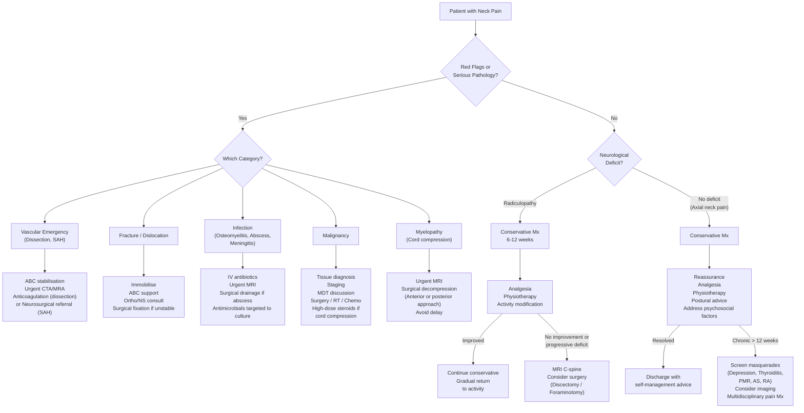

## Management of Neck Pain/Discomfort

The management of neck pain is **cause-directed**. There is no single "treatment for neck pain" — your job is to identify *what* is generating the pain and treat *that*. The approach can be broadly divided into:

1. **Immediate/emergency management** — for serious pathology (the "not to be missed" causes)
2. **Conservative management** — for the vast majority of mechanical/degenerative neck pain
3. **Cause-specific management** — tailored to the underlying diagnosis

The overarching principle from the Murtagh framework is that ***the commonest cause of neck pain is idiopathic dysfunction of the facet joints without a history of injury*** [1] — and for this, **reassurance and conservative measures** are the mainstay.

---

### 1. Management Algorithm

---

### 2. Immediate / Emergency Management

These are the situations where minutes to hours matter.

#### 2.1 Suspected Cervical Cord Compression (Myelopathy)

This is the **single most important management scenario** in neck pain — because delay in treatment leads to irreversible neurological damage.

| Step | Action | Rationale |
|---|---|---|
| 1 | Immobilise the cervical spine (hard collar) if traumatic or unstable | Prevents further cord injury from unstable segments |
| 2 | ***Urgent MRI C-spine*** [1][13] | ***MRI is the investigation of choice*** [1]; directly visualises cord compression, signal change, and cause |
| 3 | ***High-dose IV steroids*** (e.g., dexamethasone 8-16 mg IV) if metastatic cord compression | Reduces vasogenic oedema around the tumour, buying time before definitive treatment |
| 4 | ***Urgent surgical decompression*** | ***Surgical decompression and stabilisation*** [4]; see below for surgical approaches |

<Callout title="Methylprednisolone in Spinal Trauma" type="error">
***Methylprednisolone is associated with higher risk of morbidity and complications and should NOT be used*** in traumatic spinal cord injury [2]. This is based on the NASCIS trials which showed marginal neurological benefit but significantly increased complications (infections, GI bleeding). High-dose steroids ARE used in metastatic cord compression (different mechanism — reducing tumour oedema), but NOT in trauma.
</Callout>

#### 2.2 Suspected Arterial Dissection (Carotid or Vertebral)

| Step | Action | Rationale |
|---|---|---|
| 1 | ABC stabilisation; neurological assessment | Detect evolving stroke |
| 2 | ***Urgent CTA or MRA*** [7] | Confirm dissection, assess extent, guide treatment |
| 3 | Anticoagulation (heparin → warfarin) OR antiplatelet therapy | Prevent thromboembolic complications from the intimal flap; choice between anticoagulation and antiplatelets is debated — current evidence (CADISS trial 2015, updated 2019) shows similar outcomes; antiplatelet often preferred if intracranial extension |
| 4 | Endovascular stenting if severe stenosis or ongoing embolisation despite medical therapy | Reserved for refractory cases |

#### 2.3 Suspected SAH

| Step | Action | Rationale |
|---|---|---|
| 1 | CT brain non-contrast (sensitivity > 95% within 6 h) → LP if CT negative at ≥ 12 h | Confirm diagnosis; identify xanthochromia |
| 2 | Neurosurgical/neurointerventional referral | For aneurysm securing (coiling or clipping) |
| 3 | Nimodipine 60 mg PO q4h × 21 days | Reduces delayed cerebral ischaemia from vasospasm |

#### 2.4 Suspected Meningitis

| Step | Action | Rationale |
|---|---|---|
| 1 | Empirical IV antibiotics IMMEDIATELY (e.g., ceftriaxone 2 g IV + dexamethasone 0.15 mg/kg IV) — do NOT wait for LP | Every hour of delay increases mortality; dexamethasone before/with first antibiotic dose reduces mortality and neurological sequelae (especially *S. pneumoniae*) |
| 2 | LP (if no contraindication) for CSF analysis | Confirm diagnosis, identify organism, guide targeted therapy |

#### 2.5 Vertebral Fracture/Dislocation

***Management of cervical spine trauma*** [2]:
- ***Medical***: ***ABC support; prophylaxis for DVT, stress ulcers, AROU (urinary catheter); analgesics***
- ***Non-surgical immobilisation only in stable injuries***: ***spinal orthoses to aid/align weakened segment of spine; use 2-3 months after injury to facilitate healing***
  - ***Problems: pressure sores, weakening of muscles, soft tissue contractures, decreased pulmonary function, chronic pain syndrome*** [2]
- ***Surgical treatment in unstable injuries***:
  - ***Surgical decompression if a patient with normal cord function or incomplete cord lesion progressively deteriorates***
  - ***Reduction of fractures or dislocation***
  - ***Fixation of unstable spinal elements*** [2]

---

### 3. Conservative Management of Mechanical Neck Pain

This applies to the **probability diagnoses** (vertebral dysfunction, strain/sprain, spondylosis without neurological compromise) and mild radiculopathy. This is what you'll manage most often.

#### 3.1 Reassurance and Education

> This is the most important intervention for acute mechanical neck pain. Tell the patient: "Your neck pain is very common, it is not dangerous, and it will get better." Simple reassurance reduces catastrophising, which is one of the strongest predictors of chronicity.

- Explain the benign nature of the condition
- Advise that most episodes resolve within 2-6 weeks
- ***Encourage mobility*** [4] — prolonged rest and immobilisation are harmful (leads to deconditioning, muscle wasting, and chronicity)
- Address psychosocial factors: ***stress and adverse occupational factors relevant*** [1]

#### 3.2 Pharmacological Management

| Drug Class | Examples | Mechanism | Indication | Key Points |
|---|---|---|---|---|
| **Simple analgesics** | Paracetamol | Central COX inhibition, ↓ prostaglandin synthesis in CNS (exact mechanism debated) | First-line for mild-moderate pain | Safe at therapeutic doses (max 4 g/day); hepatotoxic in overdose |
| ***NSAIDs*** | Ibuprofen, naproxen, diclofenac | Inhibit COX-1 and COX-2 → ↓ prostaglandin synthesis → ↓ peripheral sensitisation and inflammation | ***1st line in symptomatic axial SpA; often the only medication required*** [8]; also first-line for mechanical neck pain and radiculopathy | ***S/E: GI (peptic ulceration), renal vasoconstriction, ↑ CVS risk*** [8]; co-prescribe PPI if high GI risk (age > 65, previous ulcer, concomitant steroid/anticoagulant) |
| ***COX-2 selective inhibitors*** | Celecoxib | Selectively inhibit COX-2 (inducible, at sites of inflammation) → ↓ GI S/E cf non-selective NSAIDs | Alternative to NSAIDs in patients with GI risk | Still carry renal and cardiovascular risk; ***celecoxib 200 mg BD*** [8] |
| **Weak opioids** | Codeine, tramadol | μ-opioid receptor agonism → ↓ central pain transmission | Short-term rescue for severe acute pain not controlled by paracetamol/NSAIDs | Risk of dependence, constipation, respiratory depression; avoid > 3 days without review |
| **Muscle relaxants** | Diazepam (short course), tizanidine, baclofen | GABA-A agonism (diazepam) or α2-adrenergic agonism (tizanidine) → ↓ muscle spasm | Acute torticollis, severe muscle spasm | Sedation; diazepam risk of dependence — use for ≤ 1 week only |
| **Neuropathic agents** | Amitriptyline, gabapentin, pregabalin | Amitriptyline: ↓ reuptake of 5-HT and NA → enhances descending pain inhibition. Gabapentin/pregabalin: α2δ subunit of voltage-gated Ca²⁺ channels → ↓ excitatory neurotransmitter release | Chronic neck pain with neuropathic component (radiculopathy with burning, shooting pain); prophylaxis for chronic TTH | Amitriptyline: start low 10 mg nocte (sedating); gabapentin: titrate slowly (sedation, dizziness) |
| **Topical agents** | Topical NSAIDs (diclofenac gel), capsaicin | Local COX inhibition; capsaicin depletes substance P from peripheral nociceptors | Adjunct for localised musculoskeletal pain | Fewer systemic S/E than oral NSAIDs |
| **Corticosteroids (systemic)** | Prednisolone, dexamethasone | Suppress inflammatory cascade at multiple levels (↓ NF-κB, ↓ prostaglandins, ↓ leukotrienes, ↓ cytokines) | ***PMR*** (dramatic response to low-dose prednisolone is almost diagnostic); ***GCA*** (urgent prednisolone 60 mg daily to prevent blindness [2]); ***de Quervain's thyroiditis*** (for severe pain) [6]; metastatic cord compression | Long-term S/E: osteoporosis, adrenal suppression, hyperglycaemia, immunosuppression, Cushing's — use lowest effective dose for shortest duration |

<Callout title="NSAIDs in Inflammatory vs Mechanical Neck Pain" type="idea">
NSAIDs work much better in inflammatory conditions (AS, RA, PMR) than in pure mechanical pain because they target the prostaglandin-mediated inflammatory cascade. In AS, ***~70-80% report substantial relief of symptoms including back pain and stiffness*** with NSAIDs alone [8]. For mechanical neck pain, the benefit is more modest — paracetamol and early mobilisation are equally important.
</Callout>

#### 3.3 Non-Pharmacological Conservative Management

| Modality | What It Is | Evidence/Rationale | Indications |
|---|---|---|---|
| **Physiotherapy** | Structured exercise programme: ROM exercises, isometric strengthening of deep cervical flexors and extensors, scapular stabilisers | Strong evidence for both acute and chronic neck pain; strengthens paraspinal muscles → restores dynamic cervical stability → reduces recurrence | All mechanical neck pain; ***physiotherapy indicated for cervical spondylosis*** [4] and ***radiculopathy*** |
| **Manual therapy** | Mobilisation (graded oscillatory movements) or manipulation (high-velocity thrust) applied to cervical spine | Mobilisation has moderate evidence for short-term pain relief; manipulation is more controversial due to rare but serious risk of vertebral artery dissection | Facet joint dysfunction, acute torticollis; ***C/I: myelopathy, vascular insufficiency, unstable segments, RA with AAJ subluxation*** |
| **Cervical collar** | Soft collar: provides warmth and proprioceptive reminder; hard collar: immobilisation | ***Soft collar: only as reminder but provides little support; stiff collar: provides marginal benefit but poor compliance*** [8]; prolonged use leads to muscle atrophy and deconditioning | Short-term only (< 1-2 weeks) for acute whiplash or severe facet dysfunction; avoid prolonged use |
| **Heat/cold therapy** | Heat: vasodilation → ↑ blood flow → muscle relaxation; Cold: vasoconstriction → ↓ oedema and inflammation → ↓ nociceptor firing | Low-cost adjunct; limited evidence but widely used | Acute (cold) or chronic (heat) muscular neck pain |
| **Ergonomic modification** | Workstation assessment: monitor at eye level, elbows at 90°, regular breaks every 30-45 min | Addresses one of the major risk factors for neck pain in HK's office-based workforce | All patients with occupation-related neck pain |
| **Postural education** | Correction of forward head posture ("tech neck"), chin tuck exercises | Forward head posture increases the moment arm of the head's weight on the cervical spine (for every inch of forward translation, the effective weight on the cervical spine increases by ~10 lbs) | All patients; especially relevant for smartphone/computer users |
| **Psychological interventions** | CBT, relaxation therapy, stress management, mindfulness-based stress reduction | Addresses psychosocial contributors to pain chronicity; reduces catastrophising, improves self-efficacy | Chronic neck pain, especially with evidence of psychosocial distress; ***depression*** [1]; ***stress and adverse occupational factors*** [1] |
| **Acupuncture** | Needling at specific points | Moderate evidence for short-term relief in chronic neck pain; mechanism may involve gate control theory and endorphin release | Adjunct for chronic neck pain; widely used in HK |

<Callout title="The Most Important Conservative Intervention" type="idea">
In acute mechanical neck pain, the evidence consistently shows that **reassurance, early mobilisation, and avoidance of prolonged rest/immobilisation** are more important than any specific modality. The worst thing you can do is tell a patient to "rest in bed with a collar on" for weeks — this guarantees chronicity.
</Callout>

---

### 4. Interventional / Procedural Management

These bridge the gap between conservative and surgical treatment.

| Intervention | Technique | Indication | Evidence/Notes |
|---|---|---|---|
| ***Selective nerve root steroid injection*** | Fluoroscopy or CT-guided injection of corticosteroid ± local anaesthetic into the intervertebral foramen around the affected nerve root | Cervical radiculopathy not responding to 4-6 weeks of conservative Rx; diagnostic confirmation of pain source | Provides short-to-medium term relief (weeks to months); does not change natural history; can be repeated 2-3 times per year; risk: vertebral artery injection, cord injury (rare but devastating) |
| **Facet joint injection** | Injection of steroid/LA into facet joint or medial branch block | Suspected facet-mediated neck pain (confirmed by diagnostic block) | Diagnostic value high; therapeutic benefit variable; can lead to radiofrequency ablation if positive response |
| **Radiofrequency ablation (RFA)** | Thermal lesioning of medial branch nerves supplying the facet joint | Facet-mediated neck pain confirmed by ≥ 2 positive diagnostic medial branch blocks | Provides 6-12 months of relief; nerves regenerate so may need repeating; best evidence among interventional modalities for facet pain |
| **Epidural steroid injection** | Interlaminar or transforaminal injection of steroid into the cervical epidural space | Cervical radiculopathy, central stenosis with radiculopathy | Risk profile higher in cervical than lumbar spine (proximity to cord); should be done under fluoroscopic guidance by experienced practitioner |
| ***Botox injection*** | Injection of botulinum toxin A into scalene muscles | ***Neurogenic thoracic outlet syndrome (nTOS)*** — to relax scalene muscles [4] | Temporary effect (3-6 months); can be repeated; may serve as a trial before surgical decompression |

---

### 5. Surgical Management

Surgery is indicated when conservative treatment fails or when there is progressive/severe neurological compromise.

#### 5.1 General Surgical Indications

| Indication | Rationale |
|---|---|
| **Progressive myelopathy** | Cord compression is irreversible once advanced; surgical decompression prevents further deterioration and allows some recovery |
| **Severe/progressive radiculopathy** not responding to 6-12 weeks of conservative Rx | Persistent nerve root compression causes ongoing demyelination → axonal loss → permanent deficit |
| **Cauda equina syndrome** | ***Surgical decompression < 48 h*** [4] — delay beyond this window significantly worsens prognosis for bowel/bladder recovery |
| **Spinal instability** (fracture, dislocation, RA subluxation) | Prevents catastrophic cord injury from movement across the unstable segment |
| **Failed non-operative treatment** with intractable pain | When quality of life is severely impacted and the anatomical lesion is concordant with symptoms |

#### 5.2 Surgical Approaches for Cervical Spondylotic Disease

***Management of cervical spondylosis*** [2]:
- ***Conservative: analgesics, cervical collar, physiotherapy***
- ***Surgical: if intractable pain or progressive neurological deficits***

| Approach | Procedure | Indication | Key Details |
|---|---|---|---|
| **Anterior** | ***Anterior cervical discectomy and fusion (ACDF)*** | 1-2 level disc disease causing radiculopathy or myelopathy | ***Removal of a core of bone and disc with its osteophytes*** [2]; replaced by intervertebral cage + bone graft; plate fixation; high fusion rate; loss of motion at fused segment |
| **Anterior** | Anterior cervical corpectomy and fusion | Multi-level disease with predominantly anterior compression (e.g., OPLL, large central disc) | Removes the entire vertebral body; replaced by cage/strut graft; larger decompression than ACDF |
| **Anterior** | Cervical disc arthroplasty (artificial disc replacement) | Single-level radiculopathy in younger patients | Preserves motion at the operated segment; avoids adjacent segment degeneration from fusion; C/I: instability, myelopathy, significant facet arthropathy |
| **Posterior** | ***Posterior laminectomy*** | ***Wide multilevel removal of spinal lamina for multilevel cord decompression*** [2]; typically ≥ 3 levels | Good decompression but risk of post-laminectomy kyphosis and instability; often combined with fusion |
| **Posterior** | ***Laminoplasty*** | ***Multilevel cervical myelopathy with preserved lordosis*** [4] | Hinged expansion of the laminae (open-door or double-door technique) → widens the canal while preserving the posterior elements; avoids fusion → preserves motion; requires intact posterior structures |
| **Posterior** | Laminectomy with fusion | Multilevel stenosis with instability or kyphosis | Combines decompressive laminectomy with lateral mass screw or pedicle screw fixation |
| **Posterior** | ***Foraminotomy*** | ***Drilling away overlying bone at intervertebral foramina for decompression of radiculopathy*** [2] | Minimal invasive; preserves motion; ideal for unilateral foraminal stenosis without significant central canal narrowing |

> **How do you choose anterior vs posterior?** Think about **where the compression is coming from**:
> - **Anterior compression** (disc, osteophyte, OPLL) → **anterior approach** (go directly to the pathology and remove it)
> - **Posterior compression** (ligamentum flavum hypertrophy, multilevel stenosis) → **posterior approach** (expand the canal from behind)
> - **Combined anterior + posterior compression** → consider staged or combined approach
> - **1-2 levels** → anterior (ACDF) is preferred (less morbidity, excellent outcomes)
> - **≥ 3 levels** → posterior (laminoplasty or laminectomy + fusion) is often better (avoids the high complication rate of multilevel anterior reconstruction)

***Surgical decompression and restoration of lordosis — Laminoplasty / Laminectomy ± fusion*** [4]

#### 5.3 Surgery for Disc Prolapse

For cervical disc prolapse causing radiculopathy:
- ***Indications: failed non-operative treatment, progressive neurological deficit, cauda equina syndrome*** [4]
- ***Approach: microdiscectomy (hemi-laminotomy + partial disc removal)*** [4] — or more commonly in the cervical spine, **ACDF**

> In the lumbar spine, ***microdiscectomy*** is the standard approach [4]. In the cervical spine, ACDF is more commonly performed because cervical microdiscectomy carries higher risks (posterior approach near the cord for central/paracentral discs).

#### 5.4 Surgery for RA Cervical Instability

***Surgical treatment of RA cervical spine*** [8]:
- ***Craniocervical decompression, cervical or occipito-cervical fusion (alone or in combination)***
- ***URGENT consult ortho/NS if signs of cord compression***
- ***Individualise surgical decision for severe subluxation without cord compression → at risk of severe injury and death due to variety of insults including falls, whiplash injuries, intubation*** [8]

***Medical treatment*** [8]:
- ***Avoid high-impact exercise and spinal manipulation***
- ***Soft collar: only as reminder but provides little support***
- ***Stiff collar: provides marginal benefit but poor compliance***
- ***Neuropathic pain relief***

#### 5.5 Surgical Decompression of Thoracic Outlet

***Surgical procedures to decompress thoracic outlet: seldom required*** [4]:
- ***Supraclavicular / transaxillary excision of 1st rib or cervical rib***
- ***Scalenectomy***

---

### 6. Condition-Specific Management Summary

| Condition | Management |
|---|---|
| ***Vertebral dysfunction / acute torticollis*** [1] | Reassurance, simple analgesia, short course muscle relaxant, early mobilisation, manual therapy (mobilisation) |
| ***Whiplash (WAD Grade I-II)*** [1] | Reassurance, ***encourage mobility*** [4], paracetamol/NSAIDs, physiotherapy within 1 week, avoid prolonged collar use |
| ***Cervical spondylosis (axial pain)*** [1] | ***Conservative: analgesics, cervical collar (short-term), physiotherapy*** [2]; ergonomic modification |
| ***Cervical radiculopathy*** | Conservative 6-12 weeks (analgesia, neuropathic agents, physiotherapy, ***selective nerve root steroid injection*** [4]); surgical if failed conservative or progressive deficit (***ACDF or foraminotomy***) [2] |
| ***Cervical myelopathy*** [1] | ***Surgical decompression and stabilisation*** [4]; ***non-operative: NSAID, lifestyle modification, PT*** [4] (only for very mild/stable cases with close monitoring; most patients with myelopathy need surgery) |
| ***PMR*** [1] | Low-dose prednisolone (15-20 mg/day) with slow taper over 12-18 months; dramatic response is almost diagnostic |
| ***GCA*** | ***Urgent prednisolone 60 mg daily; parenteral high dose if complications already occurred; gradual decrease to maintenance level according to ESR level*** [2]; ***temporal artery biopsy < 24-48 h*** |
| ***AS*** [1] | ***NSAIDs or COX-2 inhibitor as first line; anti-TNF or anti-IL-17A as second line*** [8]; ***general measures: patient education, stretching exercise, physiotherapy, smoking cessation*** [8] |
| ***RA (cervical spine)*** [1] | Control systemic disease with DMARDs/biologics; ***avoid spinal manipulation***; ***surgical: craniocervical decompression, occipito-cervical fusion*** [8] |
| ***De Quervain's thyroiditis*** [1] | ***Self-limiting → do NOT give antithyroid medications; NSAIDs/corticosteroids for severe cases; β-blocker for hyperthyroid phase; temporary T4 replacement for hypothyroid phase if pronounced*** [6] |
| ***Depression-related neck pain*** [1] | CBT, exercise, pharmacotherapy (SSRIs/SNRIs); amitriptyline addresses both pain and depression |
| ***Osteomyelitis / Discitis*** [1] | IV antibiotics (empirical then targeted — typically 6-8 weeks); surgical debridement/drainage if epidural abscess or failure to respond |
| ***Metastatic cord compression*** [1] | High-dose IV dexamethasone; urgent radiotherapy or surgical decompression (within 24-48 h); oncological management of primary tumour |
| ***Cervical fracture/dislocation*** [1] | ***Immobilisation; surgical fixation of unstable injuries; non-surgical orthoses for stable injuries*** [2]; rehabilitation |

---

### 7. Prognosis and Follow-Up Considerations

| Scenario | Prognosis |
|---|---|
| **Acute mechanical neck pain** | ~50% resolve within 2-4 weeks; ~10% develop chronic symptoms > 12 weeks; psychosocial factors are the strongest predictors of chronicity |
| **Whiplash (WAD I-II)** | Most recover within 3-6 months; ~20-40% develop chronic pain (WAD is a medicolegal minefield) |
| **Cervical radiculopathy** | ~75-90% improve with conservative management alone; surgical outcomes excellent (90%+ improvement) when indicated |
| **Cervical myelopathy** | ***Surgical decompression halts progression in most; recovery depends on duration and severity of compression; T2 cord signal change (myelomalacia) is a poor prognostic factor*** |
| **Complete spinal cord injury** | ***Complete injury: recovery rare; incomplete injury: most recovery occurs within ≤ 6 months, many can eventually walk with aids; loss of sphincter function is a poor prognostic factor*** [2] |
| **Metastatic cord compression** | Prognosis depends on primary tumour, extent of neurological deficit at presentation, and ambulatory status — patients ambulant at diagnosis have much better outcomes than those already paraplegic |

---

<Callout title="High Yield Summary">

**Management principles:**
1. ***Most neck pain is benign (facet dysfunction, strain, spondylosis) and resolves with conservative management*** [1]
2. **Conservative Mx** = reassurance + analgesia (paracetamol, NSAIDs) + early mobilisation + physiotherapy + address psychosocial factors
3. ***Imaging should be selected conservatively*** [1] — don't over-investigate mechanical neck pain
4. ***Myelopathy = surgical emergency*** → urgent MRI → surgical decompression (anterior or posterior approach depending on pathology)
5. ***Methylprednisolone should NOT be used in traumatic spinal cord injury*** [2]
6. **Surgical indications**: progressive myelopathy, progressive/severe radiculopathy after failed conservative Rx, cauda equina syndrome, spinal instability
7. ***Anterior approach (ACDF)*** for 1-2 level anterior compression; ***posterior approach (laminoplasty/laminectomy ± fusion)*** for multilevel stenosis [2]
8. ***RA cervical instability***: control disease, avoid manipulation, surgical fusion if cord compression or severe instability [8]
9. ***AS***: NSAIDs first line, biologics (anti-TNF/anti-IL-17A) if BASDAI ≥ 4 despite adequate NSAID trial [8]
10. ***GCA***: urgent prednisolone 60 mg daily to prevent blindness [2]

</Callout>

---

<ActiveRecallQuiz
  title="Active Recall - Management of Neck Pain"
  items={[
    {
      question: "A 55-year-old man with cervical spondylosis develops progressive hand clumsiness, gait unsteadiness, and hyperreflexia. MRI shows multilevel cord compression with T2 hyperintensity. What is the management?",
      markscheme: "Urgent surgical decompression. Multilevel disease typically requires a posterior approach (laminoplasty or laminectomy with fusion). T2 hyperintensity indicates myelomalacia (irreversible cord damage), making surgery urgent to prevent further deterioration. Conservative management alone is insufficient for progressive myelopathy.",
    },
    {
      question: "Why should methylprednisolone NOT be used in acute traumatic spinal cord injury? In what setting ARE high-dose steroids used for spinal cord compression?",
      markscheme: "Methylprednisolone in spinal trauma showed marginal neurological benefit (NASCIS trials) but significantly increased morbidity (infection, GI bleeding, hyperglycaemia). It is NOT recommended. High-dose steroids (dexamethasone) ARE used in metastatic cord compression because the mechanism is different: steroids reduce vasogenic oedema around the tumour, relieving compression while awaiting definitive treatment (RT or surgery).",
    },
    {
      question: "List the three main surgical approaches for cervical spondylotic myelopathy and state the key indication for each.",
      markscheme: "1. Anterior cervical discectomy and fusion (ACDF): 1-2 level disease with predominantly anterior compression. 2. Posterior laminoplasty: multilevel stenosis (3 or more levels) with preserved lordosis. 3. Posterior laminectomy with fusion: multilevel stenosis with instability or kyphosis. The choice depends on number of levels, direction of compression, and sagittal alignment.",
    },
    {
      question: "A patient with RA and atlantoaxial subluxation (AADI 8 mm) is listed for elective knee replacement. What must you advise the anaesthetist?",
      markscheme: "Alert the anaesthetist to cervical instability. Standard laryngoscopic intubation risks atlanto-axial subluxation with cord compression. Recommend fibreoptic intubation or video laryngoscopy with manual inline stabilisation. Avoid neck hyperextension. Consider preoperative cervical spine surgical stabilisation if myelopathic signs are present.",
    },
    {
      question: "What is the first-line pharmacological treatment for axial spondyloarthritis causing neck pain, and what percentage of patients report substantial relief?",
      markscheme: "NSAIDs or COX-2 inhibitors are first line. Approximately 70-80% of patients report substantial relief of symptoms including pain and stiffness. Ideally continuous use has a modest disease-modifying effect. Second line is biologic therapy (anti-TNF or anti-IL-17A) if BASDAI remains 4 or above despite adequate trial of 2-3 NSAIDs for at least 2 months each.",
    },
    {
      question: "Describe the management of subacute (de Quervain's) thyroiditis presenting as anterior neck pain.",
      markscheme: "Self-limiting condition — do NOT give antithyroid medications. NSAIDs or corticosteroids for severe pain and systemic upset. Beta-blockers for symptomatic control during the thyrotoxic phase (4-6 weeks). Temporary T4 replacement only if hypothyroid phase is pronounced or symptomatic. Expect full resolution.",
    },
  ]}
/>

## References

[1] Lecture slides: murtagh merge.pdf (Neck pain and stiffness, p69–70)
[2] Senior notes: Ryan Ho Neurology.pdf (Cervical spondylosis management, p173; Cervical spine trauma management and prognosis, p177; GCA treatment, p65; Cord compression Mx, p169)
[4] Senior notes: maxim.md (Cervical myelopathy management, p466; Disc prolapse management and microdiscectomy, p470; Thoracic outlet syndrome surgery, p502)
[6] Senior notes: Ryan Ho Endocrine.pdf (Subacute thyroiditis management, p31)
[7] Senior notes: Ryan Ho Opthalmology.pdf (Horner syndrome — urgent CTA for dissection, p77)
[8] Senior notes: Ryan Ho Rheumatology.pdf (RA cervical spine management, p48; AS management approach, NSAIDs, biologics, p62)
[13] Senior notes: Ryan Ho Radiology.pdf (Non-traumatic cord compression — MRI modality of choice, p18)
