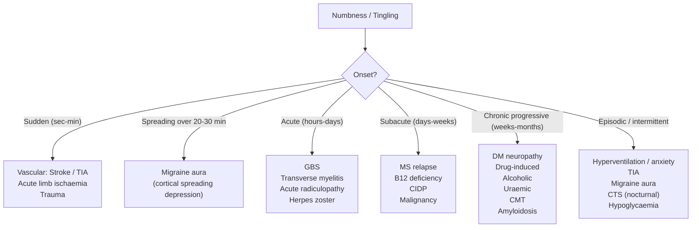
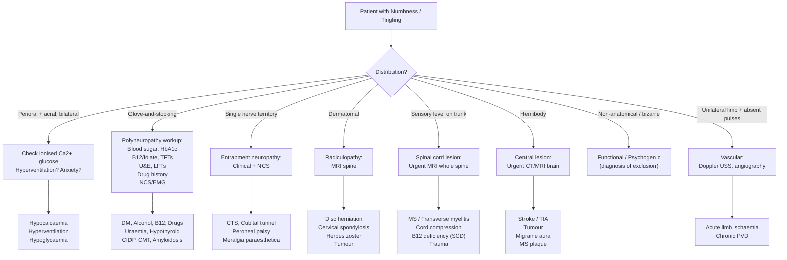

## Differential Diagnosis of Numbness and Tingling

The differential diagnosis of numbness and tingling is vast because sensory disturbance can originate from a lesion at **any level** of the somatosensory pathway — from the peripheral receptor all the way to the parietal cortex. The clinical approach, therefore, is not to memorise an endless list, but to **use the pattern of sensory loss to localise the lesion first**, and then generate a focused differential based on that localisation.

Think of it as a two-step process:
1. **Where** is the lesion? (anatomical diagnosis — pattern recognition)
2. **What** is the lesion? (pathological diagnosis — informed by tempo, risk factors, associated features)

This is the fundamental principle of neurological diagnosis [2][3].

---

### The Murtagh Framework — Structured Differential

The lecture slides organise the differential by **clinical probability**, which is the approach you should use in the exam and on the ward [4]:

#### ***Probability Diagnosis*** (common, think of first) [4]
| Diagnosis | Key Distinguishing Features | Why It Causes Numbness/Tingling |
|---|---|---|
| ***Diabetic peripheral neuropathy*** | Bilateral, symmetric, glove-and-stocking; chronic/insidious; known DM or undiagnosed DM discovered on screening | Hyperglycaemia → polyol pathway/AGEs/microvascular disease → length-dependent axonal degeneration, longest fibres first [5] |
| ***Nutritional peripheral neuropathy esp. alcohol, B12, folate*** | Glove-and-stocking; history of alcohol excess, poor diet, vegetarian/vegan, gastrectomy; may have macrocytic anaemia, glossitis | Alcohol = direct neurotoxicity + thiamine/B12 malabsorption; B12 = ↓methylation of myelin proteins → demyelination of peripheral nerves ± spinal cord (subacute combined degeneration) [7] |
| ***Hyperventilation with anxiety*** | Perioral + acral (fingertips); episodic; clear anxiety/stress trigger; often young patient; associated sighing, chest tightness, light-headedness | Respiratory alkalosis → ↓ionised Ca²⁺ → neuronal hyperexcitability → spontaneous depolarisation of sensory nerves [4][14] |
| ***Nerve root pressure e.g. sciatica, cervical spondylosis*** | Dermatomal distribution; associated radicular pain; aggravated by Valsalva/neck movements; ± weakness/hyporeflexia in the myotome | Mechanical compression of nerve root → focal demyelination and axonal injury → both positive (tingling, pain) and negative (numbness) symptoms in that dermatome [6][13] |
| ***Nerve entrapment esp. carpal tunnel syndrome*** | Single nerve territory (e.g., lateral 3.5 digits for CTS); nocturnal symptoms; specific provocative tests positive (Phalen's, Tinel's); risk factors (female, DM, hypothyroid, pregnancy, RA) | ↑Pressure in confined anatomical space → focal compression of nerve → demyelination (early, reversible) → axonal loss (late, irreversible) [6][9] |
| ***Neurotoxic drugs*** | Glove-and-stocking; temporal relationship to drug initiation/dose escalation; improves with drug withdrawal | Direct axonal toxicity or impairment of mitochondrial function/axonal transport; majority are distal axonopathies [4][12] |

<Callout title="Exam Tip — The 'Big 6' Probability Diagnoses">
If you're asked "What are the common causes of numbness/tingling?" in an exam, these six are the answer. In Hong Kong, ***diabetic neuropathy*** is by far the most common, followed by ***CTS***, ***cervical spondylosis***, and ***drug-induced neuropathy*** (especially in oncology patients on chemotherapy). ***Hyperventilation*** is the most common cause of acute episodic perioral paraesthesia in the Emergency Department.
</Callout>

#### ***Serious Disorders Not to Be Missed*** [4]

These are the "can't-miss" diagnoses — conditions where delayed diagnosis leads to permanent disability or death:

| Category | Diagnosis | Distinguishing Features | Mechanism |
|---|---|---|---|
| ***Vascular*** | ***CVA/TIA*** | Sudden onset (seconds–minutes); **typically negative rather than positive** [2][3]; hemibody or focal distribution following vascular territory; associated motor deficit, dysphasia, visual loss | Acute ischaemia or haemorrhage → neuronal death in somatosensory cortex, thalamus, or brainstem → sudden contralateral sensory loss |
| | ***Peripheral vascular disease*** | Unilateral limb; associated with rest pain, claudication, colour/temperature changes, absent pulses; risk factors (smoking, DM, HTN) | Chronic ischaemia of vasa nervorum → nerve ischaemia; in acute limb ischaemia, paraesthesia is among the earliest of the 6Ps (nerves > muscles > skin > bone sensitivity to ischaemia) [10] |
| ***Infection*** | ***AIDS*** | Risk factors for HIV; may have constitutional symptoms; distal symmetric polyneuropathy | Direct HIV neurotoxicity + antiretroviral drug toxicity → distal axonal degeneration |
| | ***Lyme disease*** | Travel to endemic areas; tick bite history; erythema migrans rash; cranial neuropathy (especially facial nerve) | Borrelia burgdorferi → immune-mediated radiculitis, cranial neuritis, peripheral neuropathy |
| | ***Leprosy*** | Travel/residence in endemic areas; thickened palpable nerves; anaesthetic skin patches; skin lesions | Mycobacterium leprae has tropism for Schwann cells → granulomatous inflammation of peripheral nerves → patchy sensory loss |
| | ***Some viral infections*** | Recent viral illness; may be post-infectious (GBS-like) | Post-infectious molecular mimicry or direct viral neurotropism |
| ***Tumour/cancer*** | ***Disseminated malignancy*** | Weight loss, anorexia, known malignancy history; may have paraneoplastic syndrome | Paraneoplastic neuropathy (anti-Hu, anti-CV2 antibodies → immune attack on DRG); direct nerve infiltration; or compression by metastatic disease |
| | ***Cerebral/spinal cord tumours*** | Progressive; focal neurological signs; headache/raised ICP features; spinal cord lesion → sensory level | Mass effect compressing neural pathways; or infiltration destroying sensory neurones |
| ***Other*** | ***CKF: uraemia*** | Known CKD; elevated creatinine/urea; glove-and-stocking neuropathy; ± other uraemic symptoms (fatigue, pruritus, nausea) | Accumulation of uraemic "middle molecules" → axonal degeneration; improves with dialysis [8] |
| | ***Guillain-Barré syndrome*** | Acute onset (days); ascending weakness predominates but paraesthesia often precedes; areflexia; may rapidly progress to respiratory failure; preceding infection (Campylobacter, CMV) | Post-infectious molecular mimicry → autoimmune attack on peripheral nerve myelin → acute inflammatory demyelinating polyradiculoneuropathy → conduction block |
| | ***Trauma to spinal cord*** | Clear history of trauma; sensory level on trunk; UMN signs below level | Direct mechanical disruption of ascending sensory tracts |
| | ***Marine fish toxins e.g. toadfish, Ciguatera*** | Recent ingestion of reef fish (relevant in HK); perioral/extremity paraesthesia; pathognomonic reversal of hot/cold sensation | Ciguatoxin activates voltage-gated Na⁺ channels at resting potential → persistent neuronal depolarisation → paraesthesia; cold allodynia due to preferential effect on thermosensitive fibres |

<Callout title="Red Flag — Acute Limb Ischaemia" type="error">
In the context of unilateral limb numbness/tingling, **always assess the peripheral pulses**. Acute limb ischaemia presents with ***paraesthesia*** as one of the **earliest** symptoms because nerves are the most metabolically sensitive tissue (sensitivity to ischaemia: ***nerves > muscles > skin > bone***) [10]. Missing this diagnosis can lead to limb loss within 6 hours. The 6Ps mnemonic: ***Pain, Paraesthesia, Pallor, Pulselessness, Perishingly cold, Paralysis*** [10].
</Callout>

#### ***Pitfalls (Often Missed)*** [4]

These are the conditions that frequently catch clinicians off-guard:

| Diagnosis | Why It's Missed | Key Distinguishing Features |
|---|---|---|
| ***Migraine variant with focal signs*** | Paraesthesia without headache confuses clinicians; may mimic TIA | **Spreading tingling or paraesthesia followed by numbness, evolving over 20–30 min over one half of body** [2][3]; slow "march" of symptoms across body parts (due to cortical spreading depression — a wave of depolarisation sweeping across cortex); may occur without headache in older patients (up to 42%) [3][11] |
| ***Multiple sclerosis/transverse myelitis*** | Young patient; initial episode may be subtle; episodic nature confuses | **Ascending from one or both lower limbs to a distinct level on trunk over hours to days** [2][3]; may have Lhermitte's sign; optic neuritis (40–70% have paraesthesia as associated symptom) [15]; relapsing-remitting course; Uhthoff's phenomenon (heat worsens symptoms) |
| ***Hypocalcaemia*** | Attributed to "just anxiety" when it's actually a metabolic problem | Perioral + acral paraesthesia; may have Trousseau's sign (carpal spasm with BP cuff inflation) and Chvostek's sign (facial twitching on tapping parotid); causes include hypoparathyroidism, vitamin D deficiency, post-thyroidectomy, pancreatitis |
| ***Chronic inflammatory polyneuropathy (CIDP)*** | Slowly progressive; confused with other chronic neuropathies | Progressive or relapsing-remitting weakness + sensory loss > 8 weeks; proximal and distal; areflexia; elevated CSF protein; demyelinating pattern on NCS |
| ***Charcot-Marie-Tooth syndrome*** | Slowly progressive since childhood; patient may not present until adulthood | Pes cavus, hammer toes, "inverted champagne bottle" legs, high-stepping gait; family history; very slowly progressive |
| ***Amyloidosis*** | Rare; not considered in differential | Painful small-fibre neuropathy (burning dysaesthesia); may have systemic features (macroglossia, periorbital purpura, nephrotic syndrome, cardiomyopathy) |
| ***Heavy metal toxicity e.g. lead*** | Occupational exposure not asked about | Lead → predominantly motor neuropathy (wrist drop/foot drop) but can have sensory symptoms; arsenic/thallium → painful sensory neuropathy with GI symptoms |

<Callout title="Migraine Aura vs Stroke/TIA — How to Distinguish" type="idea">
This is a classic exam question. The key difference is **tempo of onset**:
- ***Migraine aura***: **positive symptoms (tingling) spread slowly over 20–30 minutes**, often "marching" from one body part to another (e.g., hand → arm → face). This reflects the slow propagation of cortical spreading depression across the somatosensory cortex (~3 mm/min). Positive symptoms (tingling) typically precede negative symptoms (numbness) [2][3].
- ***Stroke/TIA***: **occurs more rapidly** (seconds to minutes, maximal at onset); **typically negative rather than positive** (numbness rather than tingling) [2][3]. Follows a vascular territory.
</Callout>

#### ***Masquerades Checklist*** [4]

These are common conditions that "masquerade" as other diagnoses — always screen for them:

| Masquerade | How It Causes Numbness/Tingling | How to Screen |
|---|---|---|
| ***Diabetes*** | Peripheral neuropathy (most common cause of chronic paraesthesia) | Blood sugar, HbA1c, urinalysis |
| ***Drugs e.g. cytotoxic agents, interferon*** | Direct neurotoxicity → axonal degeneration | Detailed drug history (including OTC, herbal, alcohol) [4] |
| ***Anaemia: pernicious anaemia*** | B12 deficiency → demyelination of peripheral nerves + dorsal columns/CST (subacute combined degeneration) [7] | FBE (macrocytic anaemia), serum B12, anti-IF antibodies |
| ***Thyroid/other endocrine: hypothyroid?*** | Myxoedematous infiltration of peripheral nerves; also predisposes to CTS | TFTs |
| ***Spinal dysfunction*** | Radiculopathy or myelopathy from spondylosis, disc herniation, or spinal stenosis | Spinal examination, MRI spine |

#### ***Psychogenic / Functional*** [4]

- ***Consider conversion reaction (hysteria), severe anxiety disorder. Some cases may be idiopathic.*** [4]
- **Key feature**: ***bizarre distribution, not conforming to known anatomical pattern*** [2][3] — e.g., exact midline split of sensation (anatomically impossible because of overlapping dermatomal innervation), or numbness that ends precisely at the shoulder joint rather than following a nerve/dermatome
- Positive neurological signs are absent; investigations are normal
- Diagnosis of exclusion — but important to recognise to avoid unnecessary invasive investigations

---

### Differential by Distribution Pattern — A Practical Localisation Framework

This is the most clinically useful way to generate a focused differential [2][3][6]:

| Distribution | Localisation | Top Differentials |
|---|---|---|
| **Glove-and-stocking** (bilateral, symmetric, distal > proximal) | Peripheral polyneuropathy | DM, alcohol, B12/folate, drugs, uraemia, hypothyroid, CIDP, CMT, amyloidosis |
| **Single peripheral nerve territory** | Mononeuropathy | CTS (median), cubital tunnel (ulnar), meralgia paraesthetica (LFCN), peroneal palsy |
| **Multiple individual nerve territories** (asymmetric) | Mononeuritis multiplex | Vasculitis (PAN, RA, SLE), DM (diabetic amyotrophy), sarcoidosis, leprosy |
| **Dermatomal** | Radiculopathy | Cervical/lumbar disc herniation, spondylosis, herpes zoster, tumour, infection |
| **Bilateral dermatomal with sensory level** | Spinal cord lesion | MS/transverse myelitis, cervical myelopathy, tumour, B12 deficiency (SCD), trauma, epidural abscess |
| **Unilateral hemibody** | Contralateral thalamus or cortex | Stroke/TIA, tumour, migraine aura, MS plaque |
| **Crossed** (ipsilateral face + contralateral body) | Brainstem (lateral medullary) | Stroke (Wallenberg syndrome), tumour, demyelination |
| **Perioral + acral** (bilateral fingertips) | Metabolic / systemic | Hypocalcaemia, hyperventilation, hypoglycaemia [5] |
| **Non-anatomical / bizarre** | Functional / psychogenic | Conversion disorder, anxiety; diagnosis of exclusion [2][3][4] |

---

### Differential by Temporal Profile

The **speed of onset** dramatically narrows the differential [2][3]:

---

### Differential Diagnosis of Specific High-Yield Presentations

#### 1. Numbness/Tingling in the Hand

This is an extremely common clinical scenario. The differential depends on which part of the hand is affected:

| Distribution | Likely Nerve/Level | Top Differentials |
|---|---|---|
| **Lateral 3.5 digits** (palmar), thenar wasting | Median nerve at wrist | ***CTS*** [4][9] |
| **Medial 1.5 digits**, intrinsic muscle wasting | Ulnar nerve at elbow or wrist | Cubital tunnel syndrome, Guyon canal syndrome [9] |
| **All digits** + forearm + neck pain aggravated by neck movement | Cervical nerve root | Cervical radiculopathy (C6/C7) [13] |
| **All digits bilaterally**, glove distribution | Polyneuropathy | DM, B12, drugs, alcohol |
| **Whole hand** + UMN signs in legs | Cervical spinal cord | Cervical myelopathy [6] |
| **Medial forearm + medial 1.5 digits** + lower trunk weakness | Lower brachial plexus (C8-T1) | ***Thoracic outlet syndrome (neurological type)*** [6]; Pancoast tumour |

The DDx for CTS specifically includes [9]:
- **Cervical spondylosis (esp. C6/7)**: neck pain, symptoms exacerbated by neck movement (not wrist position)
- **Pronator teres syndrome**: forearm motor involvement, palmar sensation affected (palmar cutaneous branch involved — unlike CTS where it is spared because it branches proximal to the retinaculum)
- **Thoracic outlet syndrome**: lower trunk distribution (C8-T1), not pure median territory
- **Peripheral neuropathy**: bilateral and symmetric, not confined to median nerve territory

#### 2. Numbness/Tingling in the Leg

| Distribution | Localisation | Top Differentials |
|---|---|---|
| **Lateral thigh** only | Lateral femoral cutaneous nerve | Meralgia paraesthetica (compression under inguinal ligament — obesity, pregnancy, tight clothing) |
| **Posterior leg to foot** + back pain | L5-S1 nerve root | Sciatica (disc herniation) [4][9] |
| **Lateral leg + dorsum of foot** + foot drop | Common peroneal nerve | Peroneal nerve palsy (compression at fibular head — leg crossing, plaster cast, weight loss) |
| **Both feet**, stocking distribution | Polyneuropathy | DM, alcohol, B12, drugs, uraemia |
| **Both legs** with sensory level on trunk | Spinal cord | MS, transverse myelitis, cord compression (tumour, epidural abscess), B12 deficiency |
| **Bilateral saddle area** + bladder/bowel dysfunction | Cauda equina (below L2) | Disc herniation (L4/5, L5/S1), tumour, infection — ***SURGICAL EMERGENCY*** [6] |

#### 3. Numbness/Tingling in the Face

| Distribution | Localisation | Top Differentials |
|---|---|---|
| **Unilateral face** (trigeminal distribution) | Trigeminal nerve or nucleus | Trigeminal neuropathy (tumour, MS plaque in pons, herpes zoster) |
| **Perioral** (bilateral) | Metabolic | Hypocalcaemia, hyperventilation, hypoglycaemia [4][5] |
| **Unilateral face + contralateral body** | Lateral medulla (Wallenberg) | Posterior circulation stroke [2][3] |
| **Unilateral face + ipsilateral body** | Contralateral pons or above | Pontine/thalamic/cortical stroke [2][3] |

---

### Integration: Key Differentiating Features Between Major Diagnoses

| Feature | Peripheral Neuropathy | Radiculopathy | Myelopathy | Stroke/TIA |
|---|---|---|---|---|
| **Distribution** | Glove-and-stocking | Dermatomal | Sensory level on trunk | Vascular territory (hemibody) |
| **Onset** | Gradual (weeks–months) | Subacute (days–weeks) | Variable | Sudden (sec–min) |
| **Motor signs** | LMN (distal weakness, wasting) | LMN (segmental) | UMN below level, LMN at level | UMN (contralateral) |
| **Reflexes** | ↓ or absent (esp ankle jerk) | ↓ in affected segment | ↑ below level, ↓ at level | ↑ (contralateral) |
| **Positive vs negative** | Both (burning + numbness) | Both (pain + numbness) | Usually negative | **Typically negative** [2][3] |
| **Bladder/bowel** | Late/absent | Only if cauda equina | Common | Only if bilateral/brainstem |

---

### A Systematic Diagnostic Algorithm

<Callout title="Critical Rule" type="error">
**Never** attribute numbness/tingling to a psychogenic cause until you have excluded organic disease. ***Psychogenic sensory loss is bizarre and does not conform to known anatomical patterns*** [2][3] — but so can some real neurological conditions (e.g., non-length-dependent small fibre neuropathy, MS plaques). Always complete the diagnostic workup before labelling a patient as "functional."
</Callout>

---

### The Role of Characteristic Temporal Patterns in Narrowing the Differential [2][3]

This summary from the senior notes is extremely high yield:

| Temporal Pattern | Likely Diagnosis | Pathophysiological Explanation |
|---|---|---|
| ***Spreading tingling/paraesthesia followed by numbness, evolving over 20–30 min over one half of body*** | **Migraine aura** | Cortical spreading depression (CSD): a wave of neuronal depolarisation followed by suppression propagates across the cortex at ~3 mm/min; the slow "march" produces the characteristic gradual spread [2][3][11] |
| ***Rapid onset (seconds–minutes), typically negative*** | **Stroke or TIA** | Sudden vascular occlusion → immediate neuronal ischaemia → acute loss of function; negative because neurones are dying/non-functioning, not irritated [2][3] |
| ***Ascending from one or both lower limbs to a distinct level on trunk over hours to days*** | **Inflammatory cord lesion** (transverse myelitis, MS) | Inflammatory demyelination spreads within the spinal cord; the ascending pattern reflects progressive involvement of adjacent tracts over time [2][3] |
| ***Bizarre, not conforming to known anatomical pattern*** | **Psychogenic** (functional neurological disorder) | No structural lesion; the distribution does not map onto any dermatome, peripheral nerve, or CNS pathway [2][3] |

---

<Callout title="High Yield Summary — Differential Diagnosis">

1. **Localise first, then differentiate**: distribution pattern is the single most powerful tool — glove-and-stocking (polyneuropathy), dermatomal (radiculopathy), sensory level (cord), hemibody (central), perioral + acral (metabolic), non-anatomical (functional)
2. **Tempo matters**: sudden = vascular (stroke/TIA); slow march over 20–30 min = migraine; ascending over hours–days = cord inflammation; chronic progressive = metabolic/toxic neuropathy
3. ***Probability diagnoses***: DM neuropathy, nutritional (alcohol/B12/folate), hyperventilation, nerve root pressure, CTS, neurotoxic drugs
4. ***Must not miss***: CVA/TIA, PVD/acute limb ischaemia, GBS (can kill via respiratory failure), spinal cord compression, cauda equina syndrome (surgical emergency), infections (HIV, Lyme)
5. ***Often missed***: migraine with aura, MS/transverse myelitis, hypocalcaemia, CIDP
6. **Stroke vs migraine**: stroke is rapid and typically negative; migraine aura spreads slowly over 20–30 min with positive symptoms preceding negative
7. ***Always take a drug history*** — neurotoxic drugs are common and reversible
8. ***Always check peripheral pulses*** — acute limb ischaemia presents with paraesthesia as the earliest symptom (nerves most sensitive to ischaemia)

</Callout>

---

<ActiveRecallQuiz
  title="Active Recall - Differential Diagnosis of Numbness and Tingling"
  items={[
    {
      question: "A 55-year-old woman presents with episodic numbness and tingling around her mouth and fingertips, occurring during stressful situations. What is the most likely diagnosis, and explain the pathophysiological mechanism from first principles.",
      markscheme: "Hyperventilation with anxiety. Mechanism: Stress triggers hyperventilation, blowing off CO2, causing respiratory alkalosis. Alkalosis causes H+ to dissociate from albumin, freeing binding sites for Ca2+. Ionised Ca2+ falls. Low extracellular Ca2+ lowers the threshold for voltage-gated Na+ channel activation, leading to spontaneous neuronal depolarisation and paraesthesia. Perioral and acral distribution due to high sensory nerve density. Must also exclude true hypocalcaemia (hypoparathyroidism, vitamin D deficiency)."
    },
    {
      question: "How do you distinguish migraine aura from TIA based on the temporal pattern and nature of sensory symptoms?",
      markscheme: "Migraine aura: positive symptoms (tingling) evolve slowly over 20-30 minutes, spreading ('marching') from one body part to another due to cortical spreading depression propagating at approximately 3 mm/min. Positive symptoms (tingling) precede negative symptoms (numbness). TIA/Stroke: occurs more rapidly (seconds to minutes), maximal at onset. Typically negative rather than positive (numbness/loss of sensation, not tingling). Follows a vascular territory."
    },
    {
      question: "List the 'Serious Disorders Not to Be Missed' in a patient presenting with numbness and tingling, as categorised in the Murtagh framework.",
      markscheme: "Vascular: CVA/TIA, peripheral vascular disease. Infection: AIDS, Lyme disease, leprosy, some viral infections. Tumour/Cancer: disseminated malignancy, cerebral/spinal cord tumours. Other: CKF (uraemia), Guillain-Barre syndrome, trauma to spinal cord, marine fish toxins (e.g. toadfish, Ciguatera)."
    },
    {
      question: "A patient presents with numbness in the lateral 3.5 digits of the right hand, worse at night. The thenar eminence is wasted. Give the diagnosis and list four differential diagnoses for this presentation.",
      markscheme: "Diagnosis: Carpal tunnel syndrome (median nerve compression at the wrist). Differentials: (1) Cervical radiculopathy C6/C7 - neck pain, symptoms worsened by neck movement. (2) Pronator teres syndrome - forearm motor involvement, palmar cutaneous sensation affected. (3) Thoracic outlet syndrome (neurological type) - lower brachial plexus (C8-T1) distribution. (4) Peripheral polyneuropathy - bilateral, symmetric, not confined to median nerve territory."
    },
    {
      question: "A 30-year-old woman presents with ascending numbness from both feet up to the level of the umbilicus over 3 days. What is the distribution pattern, what does it localise to, and what are the top differential diagnoses?",
      markscheme: "Distribution: bilateral sensory loss with a sensory level on the trunk (approximately T10). Localisation: spinal cord lesion. Top differentials: (1) Transverse myelitis (inflammatory), (2) Multiple sclerosis (first presentation or relapse), (3) Spinal cord compression (tumour, epidural abscess), (4) Subacute combined degeneration from B12 deficiency. Urgent MRI of the whole spine is required. This pattern of ascending sensory symptoms from lower limbs to a distinct trunk level over hours to days is characteristic of inflammatory cord lesions."
    }
  ]}
/>

## References

[2] Senior notes: Ryan Ho Fundamentals.pdf (Sensory Disturbances, p.320–321)
[3] Senior notes: Ryan Ho Neurology.pdf (Sensory Disturbances, p.71–72; D/dx and Characteristic Presentations, p.72; Where is the Lesion, p.45; Cervical Spondylosis, p.172; Toxic Neuropathies, p.187; Migraine Aura, p.62)
[4] Lecture slides: murtagh merge.pdf (Paraesthesia and numbness, p.75–77)
[5] Senior notes: Ryan Ho Endocrine.pdf (Hypoglycaemia clinical features, p.94)
[6] Senior notes: maxim.md (Cervical myelopathy, Radiculopathy, Cauda equina syndrome, p.464–465; TOS/CTS, p.502–503)
[7] Senior notes: Ryan Ho Haemtology.pdf (B12/folate deficiency and pernicious anaemia, p.29)
[8] Senior notes: Ryan Ho Urogenital.pdf (CKD clinical manifestations, p.99)
[9] Senior notes: maxim.md (CTS differential diagnosis and clinical features, p.500–503)
[10] Senior notes: Ryan Ho Cardiology.pdf (Acute limb ischaemia 6Ps, p.209)
[11] Senior notes: Ryan Ho Neurology.pdf (Migraine aura, p.62)
[12] Senior notes: Ryan Ho Neurology.pdf (Toxic neuropathies, p.187)
[13] Senior notes: Ryan Ho Neurology.pdf (Cervical radiculopathy, p.172)
[14] Senior notes: Ryan Ho Respiratory.pdf (Psychogenic hyperventilation features, p.20)
[15] Senior notes: Ryan Ho Opthalmology.pdf (Optic neuritis associated symptoms, p.92)
