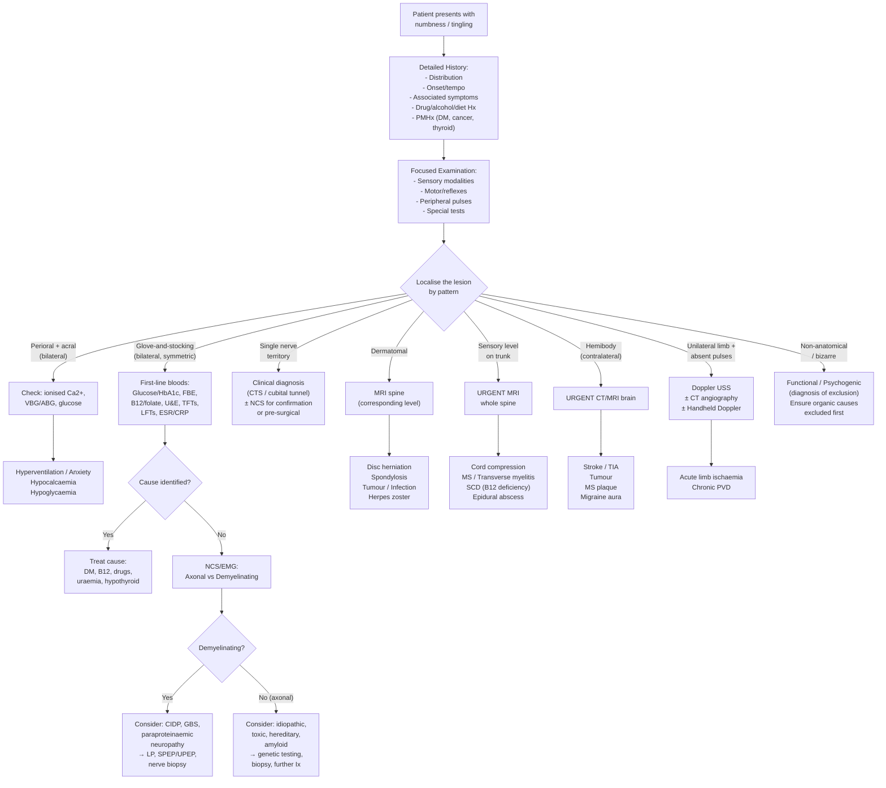

## Diagnostic Approach: Principles

Numbness and tingling are **symptoms**, not diseases. There is no single "diagnostic criteria" for paraesthesia the way there is for, say, rheumatoid arthritis. Instead, the diagnostic approach is about **localising the lesion** (where?), **identifying the pathology** (what?), and then **confirming with targeted investigations** [2][3].

The bedside clinical assessment — history and examination — does most of the heavy lifting. Investigations serve to **confirm the clinical hypothesis**, **grade severity**, and **identify the underlying aetiology**. Let me walk through this systematically.

---

## Diagnostic Criteria for Specific Conditions Causing Numbness/Tingling

While there are no "diagnostic criteria" for numbness per se, several of the underlying conditions have formal criteria. Here are the most exam-relevant ones:

### 1. Carpal Tunnel Syndrome (CTS)

CTS is fundamentally a **clinical diagnosis** [9]. The American Academy of Orthopaedic Surgeons (AAOS) and the American Association of Neuromuscular and Electrodiagnostic Medicine (AANEM) consider the diagnosis established when:

- ***Pain and numbness in distribution of median nerve*** (lateral 3.5 digits) [9]
- Thenar area spared (because the palmar cutaneous branch of the median nerve branches off **proximal** to the flexor retinaculum — so it never passes through the tunnel) [9]
- ***Worse at night***, relieved by hanging over the side of bed or shaking ("flick sign")
- ± ***Thenar muscle wasting*** and weakness of thumb abduction (late sign indicating axonal loss) [9]
- Positive provocative tests: Phalen's test, Tinel's sign, Durkan's compression test

**NCS role**: confirmatory, NOT required for diagnosis. Important caveat: ***normal conduction does not rule out CTS*** [9] — early CTS may have normal NCS because there is intermittent compression without sustained demyelination. NCS becomes abnormal when there is persistent focal demyelination or axonal loss.

<Callout title="When to Order NCS for CTS" type="idea">
NCS is indicated when: (1) clinical diagnosis is uncertain, (2) surgical intervention is being considered (to document baseline severity), (3) symptoms are atypical, or (4) there is concern for alternative diagnosis (e.g., cervical radiculopathy). Surgical indications include CTS ***unresponsive to conservative treatment*** for 6 weeks, associated ***sensory / motor deficit***, or axonal loss on NCS [9].
</Callout>

### 2. Guillain-Barré Syndrome (GBS) — Brighton Criteria / Supportive Features

GBS does not have a single "criterion set" but rather a constellation of supportive features [3]:

| Feature | Expected Finding | Why |
|---|---|---|
| **Clinical** | Progressive, symmetrical ascending weakness + distal paraesthesia + hypo-/areflexia (> 90%) | Autoimmune demyelination of peripheral nerves → conduction block (motor > sensory) [17] |
| **CSF** | ***↑protein without pleocytosis*** (albuminocytologic dissociation) | Inflammation at nerve roots causes protein leak into CSF, but inflammatory cells are mostly in nerve, not CSF [17][18] |
| **NCS** | Demyelinating pattern (↑distal latency, ↓conduction velocity, conduction block, temporal dispersion) OR axonal pattern depending on variant | Confirms peripheral nerve pathology and distinguishes from myelopathy [17] |
| **Temporal** | Onset to nadir within 4 weeks; should NOT progress beyond 8 weeks (if so → consider CIDP) | CIDP defined by progression > 8 weeks [17] |

Key exclusion: should ***NOT*** have new-onset UMN signs or sensory level (these point to spinal cord disease instead) [17].

### 3. Multiple Sclerosis — McDonald Criteria (2017, Revised)

MS is diagnosed when there is evidence of **dissemination in space (DIS)** and **dissemination in time (DIT)**, with exclusion of alternative diagnoses [3]:

- **DIS on MRI**: ≥ 1 T2-hyperintense lesion in ≥ 2 of 4 typical CNS regions: ***periventricular, juxtacortical, infratentorial, spinal cord*** [19]
- **DIT on MRI**: simultaneous presence of ***acute Gd-enhancing + old non-enhancing lesions***, OR a new T2/Gd-enhancing lesion on follow-up MRI [19]
- **CSF**: ***oligoclonal bands (OCBs) with ↑IgG*** can substitute for DIT in the 2017 revision [19]
- **VEP**: ↑latency demonstrates subclinical optic neuritis [19]

*Why oligoclonal bands?* They represent intrathecal IgG synthesis by clonally expanded B cells within the CNS — their presence indicates chronic CNS immune activation, consistent with MS even if only one clinical event has occurred.

### 4. Peripheral Neuropathy — There Are No Formal "Diagnostic Criteria"

Peripheral neuropathy is diagnosed by the combination of:
1. **Compatible clinical features** (glove-and-stocking sensory loss, ↓ankle jerks, ± distal weakness)
2. **NCS/EMG findings** confirming peripheral nerve dysfunction
3. **Identification of the underlying cause** through targeted blood work

The cause remains unidentified in up to ***30% of cases*** even after extensive workup [4].

---

## Master Diagnostic Algorithm

The following algorithm represents how a clinician should think when a patient presents with numbness and/or tingling. The key principle: **localise first, investigate second** [2][3].

---

## Investigation Modalities — Detailed

### Tier 1: ***First-Line Investigations*** [4]

These should be ordered for **every** patient presenting with new, persistent, or unexplained numbness/tingling. They screen for the common "masquerade" causes:

| Investigation | What It Tests | Key Findings & Interpretation | Why Order It |
|---|---|---|---|
| ***Urinalysis*** | Glucose, protein | Glycosuria → undiagnosed DM; proteinuria → CKD/diabetic nephropathy | Screens for the single most common cause (DM) and its renal complications [4] |
| ***Blood sugar*** (fasting glucose ± HbA1c) | Glycaemic status | Fasting glucose ≥ 7.0 mmol/L or HbA1c ≥ 6.5% = DM; 5.7–6.4% = pre-diabetes | ***DM is the most common cause of peripheral neuropathy.*** Every 1% ↑HbA1c → 26% ↑risk of PAD [4][5] |
| ***FBE (Full Blood Examination / CBC)*** | Haemoglobin, MCV, WCC, platelets | **Macrocytic anaemia** (MCV > 100 fL, typically > 115 fL in megaloblastic) → B12/folate deficiency; pancytopenia → marrow infiltration (malignancy) or megaloblastic anaemia | Screens for B12/folate deficiency (the second most common nutritional cause); hypersegmented neutrophils on PBS are pathognomonic [7] |
| ***ESR/CRP*** | Inflammatory markers | ↑ → vasculitis, infection, malignancy, autoimmune disease | Non-specific but raises suspicion for serious underlying systemic disease requiring further workup [4] |

### Tier 2: ***Consider*** (Directed by Clinical Suspicion) [4]

| Investigation | What It Tests | Key Findings & Interpretation | When to Order |
|---|---|---|---|
| ***Serum calcium*** (total + ionised) | Ca²⁺ homeostasis | ↓Ionised Ca²⁺ → neuronal hyperexcitability → perioral/acral paraesthesia. Causes: hypoparathyroidism, vitamin D deficiency, post-thyroidectomy, renal failure, respiratory alkalosis | Perioral + acral paraesthesia (especially episodic), Trousseau/Chvostek signs, post-thyroidectomy, CKD [4] |
| ***B12 and folate*** | Vitamin levels | Serum B12 < 200 pg/mL = deficient; 200–300 = borderline (check metabolites); RBC folate < 150 ng/mL = prolonged deficiency [7] | Macrocytic anaemia, glove-and-stocking neuropathy, suspected SCD, vegetarian/vegan diet, gastrectomy, elderly |
| ***LFTs (γGT)*** | Liver function, alcohol marker | ↑γGT → chronic alcohol use (even without overt liver disease); deranged ALT/AST → hepatic cause | Suspected alcoholic neuropathy; γGT is the most sensitive marker of chronic alcohol consumption [4] |
| ***U&E (urea and electrolytes)*** | Renal function, electrolytes | ↑Urea, ↑creatinine → CKD → uraemic neuropathy; **↑K⁺** → hyperkalaemia can itself cause paraesthesia and muscle weakness [4][16] | All patients with neuropathy (CKD is common and treatable) |
| ***TFTs*** | Thyroid function | ↑TSH + ↓fT4 → hypothyroidism → peripheral neuropathy + predisposition to CTS | Unexplained neuropathy, CTS, clinical features of hypothyroidism [4] |
| ***KFTs*** (renal function tests) | eGFR, creatinine | ↓eGFR → CKD staging → uraemic neuropathy suspected if eGFR < 15–20 mL/min | Suspected uraemic neuropathy [4] |
| ***Nerve conduction studies (NCS)*** | Peripheral nerve function | See detailed section below | Confirming neuropathy, distinguishing axonal vs demyelinating, localising entrapment, pre-surgical assessment [4][3] |

<Callout title="B12 Deficiency — When Serum Level Is Borderline" type="idea">
If serum B12 is 200–300 pg/mL (borderline), check **metabolites** for confirmation [7]:
- **Methylmalonic acid (MMA)**: elevated in B12 deficiency (B12 is a cofactor for methylmalonyl-CoA mutase)
- **Homocysteine**: elevated in both B12 and folate deficiency (both are cofactors for methionine synthase)
- **B12 deficiency**: ↑MMA + ↑homocysteine
- **Folate deficiency**: normal MMA + ↑homocysteine

This distinction matters because **subacute combined degeneration of the cord is confined to B12 deficiency and does NOT occur in folate deficiency** [7].
</Callout>

### Tier 3: ***According to Clinical Findings (Refer)*** [4]

These are specialist-level investigations ordered when the clinical picture and first/second-line tests point to a specific diagnosis:

#### A. Nerve Conduction Studies (NCS) and Electromyography (EMG)

NCS/EMG are the **cornerstone** of peripheral neuropathy workup. They help answer two critical questions [3]:

1. **Is there a neuropathy?** (confirms what the clinical exam suggests)
2. **What type of neuropathy?** (demyelinating vs axonal → dramatically narrows the differential)

**Principles of NCS** [3]:
- Percutaneous electrical stimulation of a peripheral nerve → record the generated impulse at a distant point
- Measures: **conduction velocity** (speed of impulse), **distal latency** (time to reach distal recording site), **amplitude** (number of functioning axons), **F-wave latency** (proximal nerve function)

| NCS Parameter | Demyelinating Pattern | Axonal Pattern | Why |
|---|---|---|---|
| **Conduction velocity** | ***↓↓ (slowed)*** | Normal or mildly ↓ | Demyelination strips insulation → saltatory conduction fails → impulse must crawl along bare axon → slow. Axonal loss preserves surviving myelin → velocity OK in remaining fibres |
| **Distal motor latency** | ***↑↑ (prolonged)*** | Normal or mildly ↑ | Same reason — takes longer for impulse to reach distal point |
| **Amplitude** (CMAP/SNAP) | May be normal early; ↓ if secondary axonal loss | ***↓↓ (reduced)*** | Amplitude reflects number of functioning axons. In axonal disease, axons die → fewer fibres → lower amplitude. In demyelination, axons initially survive |
| **Conduction block** | ***Present*** | Absent | Block occurs when impulse fails to propagate past a focal demyelinated segment — pathognomonic of acquired demyelination |
| **Temporal dispersion** | ***Present*** | Absent | Different fibres conduct at different speeds through a demyelinated segment → compound action potential spreads out |
| **F-wave latency** | ***↑↑ (prolonged)*** | Normal | F-wave tests proximal nerve segment (motor neurone → nerve root); prolonged in proximal demyelination (e.g., GBS) |

**Clinical significance of the distinction:**

| Demyelinating Neuropathy | Axonal Neuropathy |
|---|---|
| GBS (AIDP variant), CIDP, anti-MAG neuropathy, Charcot-Marie-Tooth type 1, paraproteinaemic neuropathy | DM, alcohol, drugs/toxins, uraemia, B12 deficiency, Charcot-Marie-Tooth type 2, vasculitic neuropathy |

**What NCS is NOT useful for** [3]:
- It cannot **identify the aetiology** of a neuropathy (it tells you the pattern, not the cause)
- It does **not assess CNS function** (so it is useless for cervical myelopathy)
- It should not be used to "exclude" neuropathy when the clinical picture is clear (clinical findings should suffice) [3]

**EMG** complements NCS by assessing muscle electrical activity:
- **Fibrillation potentials** and **positive sharp waves** at rest → denervation (axonal loss)
- **Chronic neurogenic changes** (large-amplitude, long-duration MUAPs) → reinnervation after chronic denervation
- Useful for distinguishing neuropathy from myopathy (myopathic pattern: small, short, polyphasic MUAPs)

#### B. ***Imaging*** [4]

| Modality | When to Use | Key Findings |
|---|---|---|
| ***MRI spine*** | Suspected radiculopathy, myelopathy, cord compression, cauda equina | **Disc herniation**: posterior/posterolateral disc protrusion compressing nerve root or cord. **Myelopathy**: cord signal change (↑T2 = oedema/gliosis). **Tumour**: enhancing mass. **MS/transverse myelitis**: ↑T2 cord lesion ± Gd enhancement. **NMOSD**: longitudinally extensive transverse myelitis ≥ 3 segments [19][20] |
| ***MRI brain*** (with contrast) | Suspected stroke, MS, brain tumour, brainstem lesion | **MS**: periventricular ↑T2 lesions, Dawson's fingers, Gd-enhancing acute plaques [19]. **Stroke**: DWI restriction in acute ischaemia (< 48h sensitivity 86–100% on MRI vs 48% on CT) [21]. **Tumour**: enhancing mass ± surrounding oedema |
| ***CT brain*** (non-contrast) | Acute stroke (first-line to exclude haemorrhage) | **Haemorrhagic stroke**: hyperdense (white) lesion. **Ischaemic stroke**: early signs include dense MCA sign, loss of insular ribbon, subtle hypodensity with loss of grey-white junction; sensitivity only 48% on day 1 [21]. **Tumour**: mass with surrounding oedema ± enhancement |
| ***X-ray spine*** | Spondylosis, fractures, deformity | Loss of lordosis, reduced disc height, osteophytes, spondylolisthesis. **Pavlov ratio < 0.8**: suggests cervical spinal stenosis [6] |
| ***Carotid Doppler USS*** | Suspected TIA/stroke with carotid territory symptoms | Carotid artery stenosis (degree of narrowing), plaque morphology |
| ***CT/MR angiography*** | Suspected PVD, acute limb ischaemia | Site and severity of arterial occlusion/stenosis |
| ***CXR*** | Screening for malignancy, Pancoast tumour (lower brachial plexus compression), sarcoidosis | Apical mass (Pancoast → C8-T1 symptoms), hilar lymphadenopathy (sarcoidosis), cervical rib (thoracic outlet syndrome) [6] |

<Callout title="CT vs MRI in Acute Stroke" type="error">
For acute stroke, **non-contrast CT brain** is the **first-line** investigation — not to diagnose ischaemic stroke (sensitivity is only ~48% on day 1 [21]) but to **exclude haemorrhage** (which is a contraindication to thrombolysis). MRI with DWI is far more sensitive (86–100%) for acute ischaemic infarction, but CT is faster and more widely available in the emergency setting.
</Callout>

#### C. ***Lumbar Puncture (CSF Analysis)*** [4]

LP is indicated when you suspect CNS inflammatory, infective, or infiltrative disease:

| Condition | CSF Findings | Why |
|---|---|---|
| **GBS** | ***↑Protein without pleocytosis*** (albuminocytologic dissociation); may be normal in first week, abnormal in ~80% by week 2 [17] | Inflammation at nerve roots causes protein exudation into CSF, but the autoimmune attack targets myelin/axons in the PNS, not generating a cellular response in the CSF |
| **MS** | ***Oligoclonal bands (OCBs) with ↑IgG***; lymphocytic pleocytosis in acute relapse [19] | OCBs represent intrathecal IgG synthesis by clonally expanded B cells — evidence of chronic CNS immune activation |
| **NMOSD** | CSF pleocytosis (monocyte/lymphocyte, occasionally neutrophil); ***no oligoclonal bands*** (helps distinguish from MS) [20] | More intense acute inflammation than MS but without the chronic intrathecal IgG synthesis |
| **CNS infection** | Depends on organism: bacterial (↑WCC with neutrophils, ↓glucose, ↑protein), TB/fungal (↑WCC with lymphocytes, ↓glucose, ↑protein), viral (↑WCC with lymphocytes, normal glucose, mildly ↑protein) [18] | Different organisms elicit different immune responses and have different effects on glucose metabolism (bacteria consume glucose) |
| **Carcinomatous meningitis** | Lymphocytosis, ↑protein, ↓glucose; malignant cells on cytology | Tumour cells infiltrate meninges, consume glucose, cause protein exudation |

#### D. ***Specific Blood Tests for Infection*** [4]

| Test | Condition Screened |
|---|---|
| HIV serology | HIV-associated distal symmetric polyneuropathy |
| Lyme serology (anti-Borrelia antibodies) | Lyme neuroborreliosis |
| Syphilis serology (RPR/VDRL, FTA-ABS) | Neurosyphilis (tabes dorsalis — dorsal column degeneration → proprioceptive loss) |
| Hepatitis B/C | Cryoglobulinaemic vasculitic neuropathy (HCV), PAN-associated neuropathy (HBV) |

#### E. Additional Specialist Investigations

| Investigation | Indication | Key Findings |
|---|---|---|
| **Serum protein electrophoresis (SPEP) / Urine protein electrophoresis (UPEP)** | Suspected paraproteinaemic neuropathy, amyloidosis, myeloma | Monoclonal band → MGUS, myeloma, Waldenström's; associated with anti-MAG neuropathy (IgM paraprotein) or AL amyloidosis |
| **Anti-ganglioside antibodies** | Suspected GBS variants | Anti-GQ1b (specific for Miller Fisher syndrome), anti-GD1a/GM1 (AMAN variant) [17] |
| **Anti-AQP4 (NMO-IgG)** | Suspected NMOSD | 100% specific, 72% sensitive [20] |
| **Autoantibody panel** (ANA, anti-dsDNA, ANCA, RF, anti-CCP) | Suspected connective tissue disease / vasculitis causing neuropathy | +ve ANA/anti-dsDNA → SLE; +ve ANCA → vasculitis; +ve RF/anti-CCP → RA [22] |
| **Anti-intrinsic factor / Anti-parietal cell antibodies** | Suspected pernicious anaemia | Anti-IF: insensitive (~50–70%) but specific; Anti-parietal cell: sensitive (~85–90%) but non-specific [7] |
| **Nerve biopsy** (commonly sural nerve) | Mononeuritis multiplex, asymmetric polyneuropathy, nerve thickening of unknown cause | Vasculitis (vessel wall inflammation + fibrinoid necrosis), amyloid deposits (Congo red staining with apple-green birefringence), granulomas (leprosy, sarcoidosis), demyelination patterns (onion bulb = CIDP/CMT1) [18] |
| **Genetic testing** | Suspected hereditary neuropathy (CMT) | CMT1A: PMP22 duplication (most common); CMT1B: MPZ mutation; CMTX: GJB1 mutation |
| **Skin biopsy** (intraepidermal nerve fibre density) | Suspected small fibre neuropathy (when NCS is normal because NCS only tests large fibres) | ↓Intraepidermal nerve fibre density confirms small fibre neuropathy — important for painful neuropathies where NCS may be completely normal |

<Callout title="When NCS Is Normal But the Patient Clearly Has Neuropathy">
NCS tests **large myelinated fibres** (Aα, Aβ). If a patient has burning pain, dysaesthesia, and autonomic dysfunction but normal NCS, consider **small fibre neuropathy** (Aδ and C fibres). This is diagnosed by **skin biopsy** showing ↓intraepidermal nerve fibre density, or by **quantitative sensory testing (QST)** and **sudomotor function testing**. Common causes: DM (often the earliest manifestation), amyloidosis, Fabry disease, sarcoidosis.
</Callout>

---

## Summary Table: Investigation Approach by Suspected Localisation

| Suspected Localisation | Key Investigations | What You Expect to Find |
|---|---|---|
| **Polyneuropathy** (glove-and-stocking) | Glucose/HbA1c, FBE, B12/folate, U&E, TFTs, LFTs/γGT, ESR/CRP → NCS/EMG → SPEP → nerve biopsy if needed | Axonal vs demyelinating pattern on NCS → guides further workup |
| **Entrapment neuropathy** (single nerve) | Clinical diagnosis ± NCS (focal slowing/conduction block at entrapment site) | Focal demyelination at carpal tunnel (CTS), cubital tunnel (ulnar neuropathy) |
| **Radiculopathy** (dermatomal) | MRI spine (corresponding level); NCS may show denervation in specific myotome on EMG | Disc herniation, foraminal stenosis, osteophyte compressing nerve root |
| **Myelopathy** (sensory level) | Urgent MRI whole spine; B12/folate; consider LP (MS, infection) | Cord compression, ↑T2 signal (oedema/demyelination), enhancing lesion |
| **Central lesion** (hemibody) | Urgent CT brain (exclude haemorrhage) → MRI brain (if ischaemic stroke suspected or subacute) | DWI restriction (acute ischaemic stroke), ↑T2 lesions (MS), enhancing mass (tumour) |
| **Vascular** (unilateral limb + absent pulses) | Handheld Doppler, formal Doppler USS, CT/MR angiography | Arterial occlusion, stenosis, absent flow |
| **Metabolic** (perioral + acral) | Ionised Ca²⁺, VBG/ABG (pH, pCO₂), glucose | ↓Ionised Ca²⁺, respiratory alkalosis (↓pCO₂), ↓glucose |

---

## Interpretation Pearls

> ***"Intermittent perioral paraesthesia indicates hypocalcaemia associated with hyperventilation"*** [4]. This is the single most important diagnostic tip from the lecture slides. In practice, check an ABG/VBG: if you find respiratory alkalosis (↓pCO₂, ↑pH) with normal total calcium, the reduced ionised Ca²⁺ is secondary to alkalosis, and the treatment is reassurance + rebreathing (not calcium replacement).

> ***"In many cases of peripheral neuropathy or a sensory symptoms, the diagnosis is not only elusive but may not be identified"*** [4]. Up to 30% of chronic peripheral neuropathies remain idiopathic after full workup. This is an honest clinical reality — do not over-investigate a stable, mild, non-progressive neuropathy once serious causes have been excluded.

> ***"Take a detailed drug history including the above, alcohol and OTC medications"*** [4]. Sometimes the most important "investigation" is simply asking the patient what they are taking. Drug-induced neuropathy is common and **reversible** if the offending agent is stopped.

---

<Callout title="High Yield Summary — Diagnosis">

1. **Numbness/tingling has no single diagnostic criteria** — the approach is to localise the lesion clinically, then confirm with targeted investigations
2. ***First-line investigations for all patients***: urinalysis, blood sugar, FBE, ESR/CRP [4]
3. ***Second-line***: serum calcium, B12/folate, LFTs (γGT), U&E, TFTs, KFTs, nerve conduction studies [4]
4. ***Third-line (specialist)***: imaging (MRI spine/brain, CT, angiography), LP (CSF protein, OCBs), specific blood tests for infection, nerve biopsy [4]
5. **NCS is the cornerstone for neuropathy workup**: distinguishes demyelinating (↓velocity, ↑latency, conduction block) from axonal (↓amplitude) — this distinction dramatically narrows the differential [3]
6. **NCS does NOT assess CNS function** — it is useless for myelopathy; use MRI instead [3]
7. **Normal NCS does not exclude CTS** [9] or small fibre neuropathy (use skin biopsy for the latter)
8. **GBS CSF**: ↑protein without pleocytosis (albuminocytologic dissociation); may be normal in week 1 [17]
9. **MS MRI**: dissemination in space (≥ 2/4 regions) + dissemination in time (enhancing + non-enhancing lesions); OCBs can substitute for DIT [19]
10. **CT brain in acute stroke**: first-line to **exclude haemorrhage**, NOT to diagnose ischaemic stroke (sensitivity only 48% day 1) [21]

</Callout>

---

<ActiveRecallQuiz
  title="Active Recall - Diagnostic Criteria, Algorithm and Investigations"
  items={[
    {
      question: "What are the first-line investigations for a patient presenting with new-onset numbness and tingling, according to the Murtagh framework?",
      markscheme: "Four first-line investigations: (1) Urinalysis - screens for DM and CKD. (2) Blood sugar (fasting glucose or HbA1c) - DM is the most common cause. (3) FBE/CBC - macrocytic anaemia suggests B12/folate deficiency. (4) ESR/CRP - screens for inflammatory/infective/malignant causes. These are ordered for every patient regardless of suspected localisation."
    },
    {
      question: "On nerve conduction studies, how do you distinguish a demyelinating neuropathy from an axonal neuropathy? Name two conditions for each pattern.",
      markscheme: "Demyelinating: reduced conduction velocity, prolonged distal latency, conduction block, temporal dispersion, prolonged F-wave latency. Amplitude may be preserved early. Conditions: GBS (AIDP), CIDP, CMT type 1, anti-MAG neuropathy. Axonal: reduced amplitude (CMAP and SNAP) with relatively preserved conduction velocity. No conduction block. Conditions: DM neuropathy, alcoholic neuropathy, drug-induced neuropathy, uraemic neuropathy, CMT type 2. The distinction matters because demyelinating neuropathies are often immune-mediated and treatable."
    },
    {
      question: "What CSF findings would you expect in GBS, and why might the CSF be normal early on?",
      markscheme: "GBS CSF: elevated protein without pleocytosis (albuminocytologic dissociation). The protein is elevated because inflammation at the nerve roots causes protein to leak into the subarachnoid space. However, the white cell count is normal because the autoimmune attack targets myelin/axons in the peripheral nervous system, not generating a cellular response within the CSF. The CSF may be normal in the first week because it takes time for protein to accumulate; approximately 80% are abnormal by week 2, peaking at weeks 3-4."
    },
    {
      question: "A patient presents with sudden-onset right hemibody numbness. What is your urgent first investigation and what are you looking for?",
      markscheme: "Urgent non-contrast CT brain. Purpose: to exclude haemorrhagic stroke (which appears as a hyperdense/white lesion). This is critical because it determines eligibility for thrombolysis - haemorrhage is an absolute contraindication. CT has low sensitivity for acute ischaemic stroke on day 1 (only 48%); early signs include dense MCA sign, loss of insular ribbon, and subtle hypodensity with loss of grey-white junction. If CT is negative for haemorrhage and ischaemic stroke is suspected, MRI with DWI is far more sensitive (86-100%)."
    },
    {
      question: "When should you suspect small fibre neuropathy, and how is it diagnosed given that NCS may be completely normal?",
      markscheme: "Suspect small fibre neuropathy when patient has burning pain, dysaesthesia, temperature sensation loss, and/or autonomic dysfunction but NCS is normal. NCS tests only large myelinated fibres (A-alpha, A-beta) and cannot detect small fibre (A-delta, C fibre) dysfunction. Diagnosis is by skin biopsy showing reduced intraepidermal nerve fibre density. Other tests include quantitative sensory testing (QST) and sudomotor function testing. Common causes: early DM, amyloidosis, Fabry disease, sarcoidosis."
    },
    {
      question: "What are the McDonald 2017 MRI criteria for dissemination in space and dissemination in time in MS?",
      markscheme: "DIS: at least 1 T2-hyperintense lesion in at least 2 of 4 typical CNS regions - periventricular, juxtacortical, infratentorial, spinal cord. DIT: simultaneous presence of gadolinium-enhancing (acute) and non-enhancing (old) lesions on a single MRI, OR a new T2 or Gd-enhancing lesion on follow-up MRI compared to baseline. The 2017 revision allows CSF oligoclonal bands to substitute for DIT, enabling earlier diagnosis after a single clinical event (clinically isolated syndrome)."
    }
  ]}
/>

## References

[2] Senior notes: Ryan Ho Fundamentals.pdf (Sensory Disturbances, p.320–321)
[3] Senior notes: Ryan Ho Neurology.pdf (Sensory Disturbances, p.71–72; Electrodiagnostic Studies, p.38; Approach to Generalized Weakness, p.178; CSF analysis, p.44; GBS, p.183; Cervical spondylosis, p.172)
[4] Lecture slides: murtagh merge.pdf (Paraesthesia and numbness — Key investigations, p.77)
[5] Senior notes: Ryan Ho Endocrine.pdf (Chronic diabetic complications, p.94)
[6] Senior notes: maxim.md (Spine investigations, Pavlov ratio, p.467; Spine assessment, p.774–775)
[7] Senior notes: Ryan Ho Haemtology.pdf (B12/folate diagnostic evaluation, p.29)
[9] Senior notes: maxim.md (CTS investigations and management, p.503)
[16] Senior notes: Ryan Ho Chemical Path.pdf (Hyperkalaemia, p.14)
[17] Senior notes: Ryan Ho Neurology.pdf (GBS clinical features, investigations, p.183)
[18] Senior notes: Ryan Ho Neurology.pdf (CSF findings, nerve biopsy, p.44)
[19] Senior notes: Ryan Ho Neurology.pdf (MS investigations and McDonald criteria, p.136)
[20] Senior notes: Ryan Ho Neurology.pdf (NMOSD diagnostic criteria and investigations, p.139)
[21] Senior notes: Ryan Ho Diagnostic Radiology.pdf (CT diagnosis of stroke, p.40)
[22] Senior notes: Ryan Ho Rheumatology.pdf (RA laboratory evaluation, p.50)
