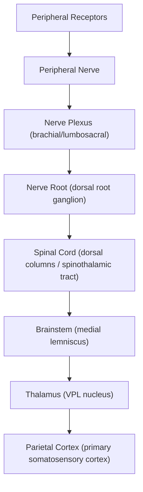

## Definition and Terminology

Paraesthesia and numbness are **sensory disturbances** — abnormal perceptions arising from dysfunction anywhere along the somatosensory pathway, from peripheral nerve endings all the way up to the parietal cortex.

Let's break the words down from their roots:

- **Paraesthesia** (Greek: *para-* = abnormal, *aisthesis* = sensation): an abnormal spontaneous sensation — classically described as "pins-and-needles," "tingling," "pricking," or "burning." These are **positive symptoms**, meaning the nervous system is *generating* signals that shouldn't be there (irritation/ectopic firing of sensory neurones) [1][2].
- **Numbness** (hypoaesthesia/anaesthesia): a **negative symptom** — reduced or absent sensation ("loss of feeling," "deadness"). This implies conduction block or destruction of sensory neurones — the signal simply isn't getting through [2][3].

Related terminology you must distinguish [1]:

| Term | Definition | Mechanism |
|---|---|---|
| **Paraesthesia** | Abnormal spontaneous sensation (tingling, pricking, pins-and-needles) | Ectopic firing of intact but irritated sensory axons |
| **Dysaesthesia** | Unpleasant abnormal sensation (burning, electric-like) | Pathological processing of afferent signals; often neuropathic |
| **Hyperaesthesia** | Increased sensitivity to stimulation | Peripheral or central sensitisation |
| **Hypoaesthesia** | Decreased sensitivity to stimulation | Partial conduction block / reduced axon number |
| **Anaesthesia** | Complete loss of sensation | Complete conduction block / axon destruction |
| **Allodynia** | Pain from a normally non-painful stimulus | Central sensitisation (Aβ fibres activating pain pathways) |
| **Hypalgesia** | Decreased pain response to normally painful stimulus | Loss of nociceptive fibre function |

> The clinical distinction between **positive** (paraesthesia) and **negative** (numbness) sensory symptoms is crucial — positive symptoms suggest *irritation* of neurones (they're firing when they shouldn't), while negative symptoms suggest *loss of function* (neurones are dead or blocked). Both can coexist. [2][3]

<Callout title="Key Concept">
**Sensory disturbance may take place in the form of negative symptoms (numbness): 'loss of feeling', 'deadness', or positive symptoms (paraesthesia): 'pins-and-needles', 'burning-like'** [2][3]. When a patient says "my hand is numb," always clarify — do they mean they can't feel things (negative), or do they have tingling/pins-and-needles (positive)? The two have different localisation implications.
</Callout>

---

## Epidemiology and Risk Factors

### Epidemiology

Numbness and tingling are **symptom complexes**, not diseases — so epidemiology depends on the underlying cause. However, some important population-level data:

- **Peripheral neuropathy** (the single most common cause of numbness/tingling) has an estimated prevalence of **2–8%** in the general population, rising to **> 30%** in diabetic patients and up to **50%** in those with longstanding diabetes [5].
- **Carpal tunnel syndrome** (CTS) — the most common entrapment neuropathy — has a prevalence of **~3–6%** in the general population, with a strong female predominance (F:M ≈ 3:1) [6].
- In **Hong Kong**, where the population is ageing rapidly and the prevalence of diabetes mellitus (DM) is approximately **10%** (higher in elderly), ***diabetic peripheral neuropathy*** is the most common cause of chronic paraesthesia and numbness. The prevalence of CKD (another important cause — uraemic neuropathy) is also significant, particularly with the burden of DM and hypertension.
- **Cervical spondylosis** is extremely prevalent in the ageing Hong Kong population (degenerative disc disease begins as early as the 4th decade); radiculopathy and myelopathy are common causes of upper limb numbness.
- **Alcohol-related neuropathy** and **nutritional deficiencies** (B12, folate) are important, particularly in the elderly and those with chronic alcohol use.

### Risk Factors

These are best understood by the underlying cause:

| Risk Factor | Conditions Predisposed |
|---|---|
| ***Diabetes mellitus*** | Diabetic peripheral neuropathy (most common), mononeuropathy, CTS |
| ***Alcohol excess*** | Nutritional / toxic peripheral neuropathy |
| ***Advancing age*** | Cervical spondylosis, CTS, diabetic neuropathy, CKD |
| ***Female sex*** | CTS (hormonal influence on carpal tunnel contents) |
| ***Obesity*** | CTS, diabetic neuropathy, metabolic syndrome |
| ***Pregnancy*** | CTS (fluid retention → carpal tunnel swelling) |
| ***B12/folate deficiency*** | Subacute combined degeneration, megaloblastic neuropathy |
| ***Hypothyroidism*** | CTS, peripheral neuropathy |
| ***Rheumatoid arthritis*** | CTS, ulnar neuropathy, entrapment neuropathies |
| ***CKD / uraemia*** | Uraemic neuropathy |
| ***Neurotoxic drugs*** | Drug-induced neuropathy (chemotherapy, statins, metronidazole, amiodarone) |
| ***Repetitive strain / occupation*** | Entrapment neuropathies |
| ***Hypertension, smoking, dyslipidaemia*** | Stroke/TIA, peripheral vascular disease |
| ***Family history of neuropathy*** | Charcot-Marie-Tooth, hereditary neuropathies |
| ***Immunocompromise (HIV, etc.)*** | HIV neuropathy, opportunistic infections |

---

## Anatomy and Physiology of the Somatosensory System

To understand numbness and tingling, you **must** understand the somatosensory pathway from first principles. A lesion at any level produces a characteristic pattern — and that pattern is what lets you localise the problem.

### Peripheral Sensory Receptors

Sensory information begins at specialised receptors in the skin, joints, muscles and viscera:

- **Mechanoreceptors** (touch, vibration, proprioception): Meissner's corpuscles (light touch), Pacinian corpuscles (vibration/pressure), Merkel discs (sustained touch), Ruffini endings (stretch), muscle spindles & Golgi tendon organs (proprioception)
- **Thermoreceptors**: free nerve endings detecting temperature
- **Nociceptors**: free nerve endings detecting pain (mechanical, thermal, chemical)

These receptors transduce stimuli into electrical signals carried by different fibre types:

| Fibre Type | Myelination | Diameter | Speed | Modality |
|---|---|---|---|---|
| **Aα** | Heavily myelinated | 12–20 μm | 70–120 m/s | Proprioception |
| **Aβ** | Myelinated | 6–12 μm | 30–70 m/s | Touch, vibration |
| **Aδ** | Thinly myelinated | 1–5 μm | 5–30 m/s | Sharp/fast pain, temperature |
| **C** | Unmyelinated | 0.2–1.5 μm | 0.5–2 m/s | Dull/burning pain, temperature, itch |

<Callout title="Why does numbness often progress from distal to proximal?" type="idea">
This is the "length-dependent" pattern. The longest axons (going to the toes) are most vulnerable to metabolic or toxic insults because: (1) they have the highest metabolic demand for axonal transport, (2) they have the greatest surface area exposed to toxins, and (3) the furthest point from the cell body receives the least trophic support. This is why diabetic neuropathy and most toxic neuropathies produce a **"glove-and-stocking"** distribution — feet before hands, distal before proximal.
</Callout>

### The Two Main Ascending Sensory Pathways

#### 1. Dorsal Column–Medial Lemniscal (DC-ML) Pathway
- **Carries**: fine touch, vibration, proprioception, two-point discrimination
- **Course**: 
  - 1st order neurone: cell body in **dorsal root ganglion** (DRG) → ascends **ipsilaterally** in the dorsal columns (fasciculus gracilis for LL, fasciculus cuneatus for UL)
  - Synapse: **nucleus gracilis/cuneatus** in the medulla
  - 2nd order neurone: decussates as **internal arcuate fibres** → forms **medial lemniscus** → ascends to **VPL nucleus of thalamus**
  - 3rd order neurone: thalamus → **primary somatosensory cortex** (postcentral gyrus, areas 3, 1, 2)

#### 2. Spinothalamic Tract (STT)
- **Carries**: pain, temperature, crude/light touch
- **Course**:
  - 1st order neurone: cell body in DRG → enters dorsal horn
  - Synapse: **dorsal horn** (substantia gelatinosa, laminae I-V)
  - 2nd order neurone: **decussates within 1–2 segments** at the anterior white commissure → ascends contralaterally as the lateral (pain/temperature) and anterior (crude touch) spinothalamic tracts
  - 3rd order neurone: **VPL thalamus** → primary somatosensory cortex

<Callout title="Clinical Pearl — Why Brown-Séquard syndrome has dissociated sensory loss">
In a hemisection of the spinal cord (Brown-Séquard), the DC-ML pathway is disrupted **ipsilaterally** (it hasn't crossed yet), so you lose proprioception and vibration on the same side. But the STT has **already crossed** 1–2 segments below entry, so you lose pain and temperature on the **contralateral** side, beginning a few segments below the level of the lesion. This dissociation is a direct consequence of the different levels of decussation. [2][3]
</Callout>

### Key Anatomical Levels for Localisation

The somatosensory system can be disrupted at **any level** [2][3]:

Each level produces a **characteristic pattern** of sensory loss:

| Lesion Level | Pattern | Key Features |
|---|---|---|
| **Single peripheral nerve** | Mononeuropathy distribution | Follows named nerve territory (e.g., median nerve → lateral 3.5 digits) |
| **Multiple peripheral nerves** | Mononeuritis multiplex | Asymmetric, multiple named nerves |
| **Length-dependent neuropathy** | Glove-and-stocking | Symmetric, distal > proximal, feet before hands |
| **Nerve root (radiculopathy)** | Dermatomal | Follows a dermatome (e.g., C6 → lateral forearm and thumb) |
| **Spinal cord** | Sensory level on trunk | All modalities below the level; may be dissociated (e.g., central cord → "cape-like" pain/temperature loss) |
| **Brainstem** | Crossed pattern | Ipsilateral face + contralateral body (lateral medullary/Wallenberg) |
| **Thalamus** | Contralateral hemibody | ALL modalities lost on entire contralateral face, arm, trunk, leg |
| **Parietal cortex** | Contralateral cortical | Discriminatory loss (two-point, stereognosis), sensory inattention, minimal pain/temperature loss |

---

## Etiology (Focus on Hong Kong)

The causes of numbness and tingling are best organised by the anatomical level of the lesion. Below is a comprehensive classification with pathophysiology. In Hong Kong, the bolded causes are most commonly encountered in clinical practice.

### A. Peripheral Nerve Causes (Most Common Overall)

#### 1. Peripheral Neuropathy (Generalised)

##### a) ***Diabetic Peripheral Neuropathy*** — Most common cause worldwide and in Hong Kong [4]
- **Pathophysiology**: Chronic hyperglycaemia → multiple injurious mechanisms:
  - **Polyol pathway**: excess glucose → aldose reductase converts to sorbitol → osmotic stress on Schwann cells → demyelination
  - **Advanced glycation end-products (AGEs)**: glycated proteins accumulate in nerve → oxidative stress, inflammation
  - **Microvascular disease**: thickening of vasa nervorum → ischaemia of nerve fibres
  - **PKC activation**: leads to vasoconstriction, inflammation, fibrosis
  - The net result is **length-dependent axonal degeneration** preferentially affecting the longest fibres first
- **Clinical pattern**: symmetric, distal, length-dependent "glove-and-stocking" sensory loss, with **numbness, tingling, burning** in the feet progressing proximally
- **Risk factors**: poor glycaemic control (↑HbA1c), duration of DM, hypertension, dyslipidaemia, smoking [5]

##### b) ***Nutritional Peripheral Neuropathy*** — Especially alcohol and B12/folate deficiency [4]
- **Alcoholic neuropathy**: direct toxic effect of ethanol + acetaldehyde on peripheral nerves PLUS nutritional deficiency (thiamine/B12/folate) due to poor diet and malabsorption. Produces length-dependent sensorimotor neuropathy.
- **B12 deficiency** (pernicious anaemia, vegetarian diet, gastrectomy):
  - B12 is required as a cofactor for methionine synthase → methylation of myelin basic protein
  - Deficiency → impaired methylation → demyelination of both peripheral nerves AND spinal cord
  - The spinal cord involvement produces **subacute combined degeneration** (affects dorsal columns → loss of vibration/proprioception, AND lateral corticospinal tracts → UMN signs) [7]
  - Classical sign: **↑knee jerk (from CST involvement) + ↓ankle jerk (from peripheral neuropathy)** — this combination is almost pathognomonic [7]
- **Folate deficiency**: similar but does NOT classically cause subacute combined degeneration of the cord [7]

##### c) ***Neurotoxic Drugs*** [4]
- ***Chemotherapy*** (vincristine, cisplatin, taxanes, thalidomide): dose-dependent axonal neuropathy
- ***Other drugs***: metronidazole, amiodarone, isoniazid (depletes pyridoxine), colchicine, ***statins***, ***interferon*** [4]
- **Mechanism**: variable — some are direct axonal toxins, others impair mitochondrial function or axonal transport

##### d) Uraemic Neuropathy (***CKD/Uraemia***) [4][8]
- Accumulation of uraemic toxins (middle molecules) → axonal degeneration
- Predominantly sensory, length-dependent, improves with dialysis or transplant
- **In Hong Kong**: given high CKD prevalence (DM, hypertension), this is an important cause

##### e) Other Metabolic/Endocrine
- **Hypothyroidism**: causes peripheral neuropathy (myxoedematous infiltration) AND predisposes to CTS
- **Hypocalcaemia**: perioral and acral paraesthesia due to increased neuronal excitability (↓Ca²⁺ → lower threshold for Na⁺ channel activation → spontaneous firing). Classically provoked by ***hyperventilation with anxiety*** (respiratory alkalosis → ↑albumin-bound Ca²⁺ → ↓ionised Ca²⁺) [4]

<Callout title="Important Diagnostic Tip" type="idea">
***"Intermittent perioral paraesthesia indicates hypocalcaemia associated with hyperventilation"*** [4]. When an anxious patient hyperventilates, they blow off CO₂ → respiratory alkalosis → H⁺ dissociates from albumin → Ca²⁺ binds to the now-available binding sites on albumin → ↓free ionised Ca²⁺ → neuronal hyperexcitability → tingling around the mouth and in the fingers. This is extremely common in the ED and NOT a sign of serious neurological disease.
</Callout>

##### f) Inflammatory/Autoimmune Neuropathy
- **Guillain-Barré syndrome (GBS)**: acute inflammatory demyelinating polyradiculoneuropathy. Molecular mimicry → autoimmune attack on peripheral nerve myelin. Ascending weakness + sensory symptoms (paraesthesia), areflexia, may progress to respiratory failure. This is a **serious disorder not to be missed** [4].
- **Chronic inflammatory demyelinating polyneuropathy (CIDP)**: the chronic counterpart of GBS (> 8 weeks), relapsing-remitting or progressive [4]

##### g) Infective
- ***HIV/AIDS***: distal symmetric polyneuropathy (most common neurological complication of HIV) — direct viral neurotoxicity + antiretroviral drug toxicity [4]
- ***Lyme disease*** (Borrelia burgdorferi): cranial neuropathy, radiculopathy, peripheral neuropathy [4]
- ***Leprosy*** (Mycobacterium leprae): tropism for Schwann cells → nerve thickening, patchy sensory loss (important globally, rare in HK) [4]
- ***Some viral infections***: post-viral neuropathy, varicella-zoster (shingles — dermatomal pain + paraesthesia) [4]

##### h) Hereditary
- ***Charcot-Marie-Tooth syndrome*** (hereditary motor and sensory neuropathy): most common inherited neuropathy. Slowly progressive distal weakness and wasting with sensory loss, pes cavus, high-stepping gait [4]

##### i) Other
- ***Amyloidosis***: amyloid deposition in peripheral nerves → small fibre neuropathy (painful, burning paraesthesia). Important to consider in the context of AL amyloidosis or hereditary transthyretin amyloidosis [4]
- ***Heavy metal toxicity*** (lead, arsenic, mercury, thallium): occupational exposure → motor > sensory neuropathy (lead), or painful sensory neuropathy (arsenic, thallium) [4]

#### 2. Entrapment Neuropathies (Mononeuropathy)

##### a) ***Carpal Tunnel Syndrome (CTS)*** — Most common entrapment neuropathy [4][6]
- **Anatomy**: the median nerve passes through the carpal tunnel (bounded by carpal bones and the transverse carpal ligament/flexor retinaculum). Any process that ↑pressure in this non-distensible space compresses the nerve.
- **Pathophysiology**: compression → focal demyelination initially (reversible) → axonal degeneration if chronic (irreversible)
- **Risk factors**: ***ageing, female, DM, hypothyroid, RA, obesity, pregnancy***, acromegaly, ganglion, wrist fracture [6]
- **Clinical features**: numbness and tingling in the **lateral 3.5 digits** (median nerve territory), worse at night (wrist flexion during sleep), thenar muscle wasting in advanced cases

##### b) Cubital Tunnel Syndrome (Ulnar neuropathy at elbow) [6]
- Ulnar nerve compressed at the cubital tunnel behind the medial epicondyle
- Numbness/tingling in the **medial 1.5 digits**, intrinsic hand muscle weakness/wasting
- DDx: cervical myelopathy, T1 radiculopathy

##### c) ***Thoracic Outlet Syndrome (TOS)*** [6]
- Compression of the brachial plexus ± subclavian vessels in the thoracic outlet (between the 1st rib, clavicle, and scalene muscles)
- **Neurological TOS**: ***lower brachial plexus injury*** → paraesthesia/weakness along the ulnar distribution (C8-T1)

##### d) Other entrapments
- Meralgia paraesthetica (lateral femoral cutaneous nerve of thigh — compressed under inguinal ligament → lateral thigh numbness/burning)
- Tarsal tunnel syndrome (posterior tibial nerve at ankle)
- Peroneal nerve palsy (at fibular head — foot drop + lateral leg numbness)

### B. Nerve Root Causes (Radiculopathy)

- **Cervical radiculopathy**: ***nerve root pressure e.g. cervical spondylosis***, prolapsed intervertebral disc [4][6]
  - C5-C6, C6-C7 most common levels
  - Produces dermatomal numbness/tingling + radicular pain in the arm
  - **Pathophysiology**: disc herniation or osteophyte → compression of nerve root → both positive (pain, tingling) and negative (numbness, weakness, hyporeflexia) symptoms in a dermatomal distribution [6]
  
- **Lumbosacral radiculopathy**: ***sciatica*** (L5-S1 most common) [4]
  - Pain, numbness, tingling in the distribution of the sciatic nerve
  - Sharp or burning pain radiating down the posterior/lateral leg usually to the foot/ankle [9]

- **Cauda equina syndrome**: compression of the cauda equina **below L2** — bilateral radicular pain, saddle anaesthesia, urinary retention with overflow incontinence, faecal incontinence. This is a **surgical emergency** [6].

### C. Spinal Cord Causes

- **Cervical myelopathy** (degenerative cervical spondylosis — most common cause): compression of the cervical spinal cord → UL +/- LL weakness and numbness with UMN signs. Important in ageing Hong Kong population [6].
  - Lhermitte's sign: electric-shock sensation down the spine on neck flexion (stretching the demyelinated dorsal columns)
  
- **Multiple sclerosis/transverse myelitis**: inflammatory demyelination → ascending sensory symptoms from one or both lower limbs to a distinct level on trunk over hours to days [2][3][4]

- **Subacute combined degeneration** (B12 deficiency): dorsal columns + lateral corticospinal tracts → impaired vibration/proprioception + UMN signs [7]

- **Spinal cord tumour**: intramedullary or extramedullary

- **Spinal cord trauma** [4]

- **Central cord syndrome**: bilateral loss of pain and temperature in a "cape-like" distribution (because the decussating spinothalamic fibres for the upper limbs are more medial and thus more vulnerable) with preservation of proprioception [2][3]

### D. Brainstem Causes

- **Lateral medullary syndrome (Wallenberg)**: ipsilateral facial pain/temperature loss + contralateral body pain/temperature loss (because the trigeminal nucleus is ipsilateral while the already-crossed spinothalamic tract is disrupted)
- Pontine lesions: contralateral face and body pain/temperature loss ± lateral gaze palsy [2][3]

### E. Central (Brain) Causes

- ***CVA/TIA***: sudden onset, typically negative rather than positive, follows a vascular territory [2][3][4]
  - **Thalamic stroke**: loss of ALL sensory modalities on the entire contralateral face, arm, trunk, and leg (because all sensory relay converges in the VPL thalamus) [2][3]
  - **Parietal cortex stroke**: discriminatory sensory loss (impaired two-point discrimination, astereognosis), sensory inattention, but minimal pain/temperature loss (because other cortical areas can process these) [2][3]
  
- ***Cerebral/spinal cord tumours*** [4]

- ***Migraine variant with focal signs***: spreading tingling or paraesthesia followed by numbness, evolving over 20–30 min over one half of body — this is the **sensory aura** of migraine (due to cortical spreading depression) [2][3][4]

### F. Vascular Causes

- ***Peripheral vascular disease***: chronic limb ischaemia → neurogenic symptoms (numbness, tingling) due to ischaemia of vasa nervorum [4][10]
- ***Acute limb ischaemia***: paraesthesia and numbness are among the 6Ps — develop as nerve endings become ischaemic (nerves are the most metabolically sensitive tissue → affected earliest) [10]

### G. Psychiatric/Functional

- ***Hyperventilation with anxiety***: respiratory alkalosis → ↓ionised Ca²⁺ → perioral and acral paraesthesia [4]
- ***Conversion reaction (functional neurological disorder)***: bizarre distribution not conforming to known anatomical patterns [2][3][4]
- The question ***"Is the patient trying to tell me something?"*** should always be considered — some cases may be ***idiopathic*** [4]

### H. Other Rare/Important Causes

- ***Marine fish toxins*** (toadfish, ***Ciguatera***): ciguatoxin blocks voltage-gated Na⁺ channels → paraesthesia, reversal of hot/cold perception. Relevant in Hong Kong (seafood consumption) [4]
- ***Hypocalcaemia***: perioral/acral paraesthesia (as discussed above) [4]

---

## Classification

Numbness and tingling can be classified in several clinically useful ways:

### By Symptom Type

| Type | Implication |
|---|---|
| **Positive** (tingling, pins-and-needles, burning) | Nerve irritation / ectopic discharge |
| **Negative** (numbness, deadness) | Nerve conduction block / axon loss |

### By Temporal Pattern

| Pattern | Differential |
|---|---|
| **Sudden onset** (seconds–minutes) | Stroke/TIA, acute limb ischaemia, trauma |
| **Acute** (hours–days) | GBS, transverse myelitis, acute radiculopathy |
| **Subacute** (days–weeks) | Inflammatory neuropathy, MS, B12 deficiency |
| **Chronic progressive** (weeks–months) | DM neuropathy, CKD, drug-induced, hereditary, tumour |
| **Intermittent/episodic** | Migraine aura, TIA, hyperventilation, CTS (nocturnal) |

### By Distribution (Most Clinically Useful for Localisation)

| Distribution | Anatomical Localisation |
|---|---|
| **Single nerve territory** | Mononeuropathy (entrapment, trauma) |
| **Multiple discrete nerve territories** | Mononeuritis multiplex (vasculitis, DM) |
| ***Glove-and-stocking*** | Length-dependent polyneuropathy |
| **Dermatomal** | Radiculopathy (nerve root) |
| **Sensory level on trunk** | Spinal cord lesion |
| **Hemibody** | Thalamic or cortical (contralateral) |
| **Perioral + acral** | Hypocalcaemia / hyperventilation |
| **Non-anatomical / bizarre** | Functional / psychogenic |

### By Modality Affected

| Modalities Lost | Pathway Involved |
|---|---|
| Pain + temperature | Spinothalamic tract (small fibres: Aδ, C) |
| Vibration + proprioception + discriminatory touch | Dorsal column-medial lemniscus (large fibres: Aα, Aβ) |
| All modalities | Complete nerve/cord/thalamic lesion |

---

## Clinical Features

### A. Symptoms (with Pathophysiological Basis)

**The history is the single most important tool in evaluating numbness/tingling** [4]. You must systematically characterise the sensory disturbance:

#### 1. Nature of the Sensory Disturbance
- **Tingling / pins-and-needles** (positive paraesthesia): ectopic firing of damaged but surviving sensory axons. Classically seen in nerve compression (e.g., CTS), early neuropathy, or nerve irritation.
- **Numbness / deadness** (negative): loss of axonal function. Implies more severe or established nerve damage.
- ***Neuropathic pain character***: **tingling, pricking, needle-like, numbness, electric-like, burning** → these descriptors point toward nerve-origin pain [1]
- ***Nociceptive pain character***: **aching, throbbing, tightness, squeezing** → these point toward tissue-origin pain [1]

#### 2. Distribution
- ***"Glove-and-stocking"***: bilateral, symmetric, distal → polyneuropathy (DM, alcohol, B12, drugs, CKD) [4]
- **Single nerve territory**: mononeuropathy (CTS → median; cubital tunnel → ulnar; meralgia paraesthetica → lateral femoral cutaneous)
- **Dermatomal**: radiculopathy (cervical spondylosis, disc herniation)
- **Hemibody**: central lesion (stroke, TIA, thalamic lesion)
- **Perioral + fingertips**: hypocalcaemia/hyperventilation
- **Ascending from feet to a truncal level**: spinal cord pathology (transverse myelitis, MS)

#### 3. Onset and Temporal Pattern
- ***Sudden (seconds to minutes)***: CVA/TIA (rapid onset, **typically negative rather than positive**) [2][3], acute limb ischaemia
- ***Spreading over 20–30 minutes over one half of body***: **migraine aura** (due to cortical spreading depression — a wave of neuronal depolarisation followed by suppression sweeping across the cortex) [2][3]
- ***Ascending from lower limbs over hours to days to a distinct level***: inflammatory cord lesion (transverse myelitis, MS) [2][3]
- ***Nocturnal / waking from sleep***: CTS (wrist flexion during sleep compresses median nerve)
- **Chronic progressive**: polyneuropathy (DM, drugs, alcohol)
- **Episodic**: TIA, migraine, hyperventilation

#### 4. Associated Neurological Symptoms

***"Analyse symptoms: the nature, distribution, onset and associated neurological symptoms (motor, sensory), such as vertigo, seizures, vision"*** [4]

- **Weakness**: suggests motor nerve involvement → radiculopathy, GBS, myelopathy, stroke
- **Gait disturbance**: spinal cord lesion (sensory ataxia from dorsal column involvement), cerebellar disease
- **Bladder/bowel dysfunction**: cauda equina syndrome, myelopathy
- **Visual symptoms**: MS (optic neuritis — 40–70% have paraesthesia as associated symptom [11]), stroke
- **Vertigo**: brainstem stroke (lateral medullary syndrome)
- **Headache**: migraine (with aura), raised ICP

#### 5. Associated General Symptoms

***"Check for other associated general symptoms such as fever, weight loss, pruritus, rash, weakness"*** [4]

- **Fever**: infective cause (HIV, Lyme, epidural abscess)
- **Weight loss**: malignancy (disseminated), chronic infection
- **Rash**: dermatomal vesicles (herpes zoster), Lyme disease (erythema migrans), vasculitis
- **Joint pain**: RA (entrapment neuropathies), SLE (neuropathy)

#### 6. Relevant History to Gather

***"History of diabetes, migraine, cancer, spinal problems, injury, possible bites, fever/sweating and other symptoms. Take a travel and diet history, incl. nutrition and alcohol. Gather a drug history, particularly cancer therapy, interferon, colchicine, thalidomide, statins, alcohol or any illicit drugs."*** [4]

***"Check the patient's occupational history, e.g. exposure to lead, and psychiatric history, esp. anxiety states."*** [4]

| History Domain | What to Ask | Why |
|---|---|---|
| **DM** | Duration, HbA1c, complications | Diabetic neuropathy risk correlates with duration + control |
| **Drug history** | ***Cytotoxic agents, interferon, colchicine, thalidomide, statins, metronidazole, amiodarone, isoniazid, alcohol, OTC medications*** | Neurotoxic drugs are a common and reversible cause [4] |
| **Alcohol** | Quantity, duration | Direct toxicity + nutritional deficiency |
| **Diet / nutrition** | Vegan/vegetarian, malabsorption | B12/folate deficiency |
| **Cancer history** | Type, treatments received | Paraneoplastic neuropathy, chemotherapy toxicity, spinal metastases |
| **Spinal problems** | Previous back/neck pain, trauma, surgery | Radiculopathy, myelopathy |
| **Travel history** | Endemic areas | Lyme disease, leprosy, tropical infections |
| **Occupational history** | ***Exposure to lead***, heavy metals, vibrating tools | Heavy metal neuropathy, vibration-induced neuropathy [4] |
| **Psychiatric history** | ***Anxiety states*** | Hyperventilation, conversion disorder [4] |
| **Family history** | Neuropathy, similar symptoms | Charcot-Marie-Tooth, hereditary neuropathies |

<Callout title="Take a detailed drug history" type="error">
***"Take a detailed drug history including the above, alcohol and OTC medications"*** [4]. Drug-induced neuropathy is one of the most commonly missed causes of numbness and tingling. Always ask specifically about chemotherapy, statins (very commonly prescribed), and alcohol. Missing this is a common medical student pitfall.
</Callout>

---

### B. Signs (with Pathophysiological Basis)

***"General health and nutritional status. Focused neurological especially sensory, motor function, reflexes. Look for 'glove and stocking' distribution, muscle wasting e.g. thenar eminence. Peripheral vasculature."*** [4]

#### 1. General Inspection
- **Nutritional status**: cachexia, loose clothes/ring/watch → malnutrition (B12/folate deficiency, chronic alcohol, malignancy) [12]
- **Skin**: pallor (anaemia/B12 deficiency), jaundice (pernicious anaemia — lemon-yellow tint from ineffective erythropoiesis [7]), rash (dermatomal vesicles = zoster; butterfly rash = SLE), peripheral oedema (CKD)
- **Hands**: thenar wasting (CTS — denervation of thenar muscles by chronic median nerve compression), hypothenar wasting (ulnar neuropathy), small muscle wasting (T1 lesion, motor neurone disease)
- **Feet**: pes cavus + inverted champagne bottle legs (Charcot-Marie-Tooth), trophic ulcers (diabetic neuropathy — loss of protective sensation), Charcot joint (neuropathic arthropathy from loss of proprioception) [2]

#### 2. Sensory Examination

Test each modality systematically and map the distribution:

| Modality | How to Test | Pathway | Localisation Value |
|---|---|---|---|
| **Light touch** | Cotton wool | Dorsal columns (fine touch) + STT (crude touch) | Screening; identifies area of deficit |
| **Pin-prick** (pain) | Neurotip | Spinothalamic tract (Aδ fibres) | Small fibre function |
| **Temperature** | Cold tuning fork or thermal rollers | Spinothalamic tract (Aδ/C fibres) | Small fibre function |
| **Vibration** | 128 Hz tuning fork on bony prominence | Dorsal columns (Aβ fibres) | Large fibre function; often first lost in polyneuropathy |
| **Proprioception** | Passive joint position sense | Dorsal columns (Aα fibres) | Large fibre function |
| **Two-point discrimination** | Callipers | Dorsal columns / cortical processing | Cortical sensory function |
| **Stereognosis** | Object identification by touch | Parietal cortex | Cortical sensory function |

**Key patterns to look for:**
- ***Glove-and-stocking*** distribution: polyneuropathy [4]
- **Dermatomal**: radiculopathy
- **Sensory level** on trunk: spinal cord lesion (test with pin-prick ascending from below)
- **Dissociated sensory loss** (one modality lost, others preserved): specific tract lesion (e.g., syringomyelia → loss of pain/temperature with preserved touch over the "cape" area)
- **Saddle anaesthesia**: cauda equina syndrome — test the perianal dermatomes (S2–S4)

#### 3. Motor Examination (Always Examine Alongside Sensory)

- **Muscle wasting**: 
  - Thenar eminence → CTS (median nerve) [4]
  - Intrinsic hand muscles → ulnar neuropathy, T1 radiculopathy, cervical myelopathy
  - Distal leg muscles → peripheral neuropathy, L5/S1 radiculopathy
- **Tone**: ↑ (UMN — spasticity/clasp-knife in myelopathy, stroke) vs ↓ (LMN — peripheral neuropathy, radiculopathy)
- **Power**: pattern of weakness helps localise (myotomal = radiculopathy; distal = neuropathy; pyramidal pattern = UMN)
- **Fasciculations**: irregular, non-rhythmical muscle contractions → LMN lesion (denervation) [3]

#### 4. Reflexes

| Finding | Interpretation |
|---|---|
| **Absent ankle jerk** | S1 root, peripheral neuropathy (earliest reflex lost in length-dependent neuropathy — because the S1 reflex arc is the longest) |
| **↑Knee jerk + ↓ankle jerk** | Subacute combined degeneration of the cord (B12 deficiency) — UMN lesion at cord level causing ↑knee jerk, PLUS peripheral neuropathy causing ↓ankle jerk [7] |
| **Generalised areflexia** | GBS, severe polyneuropathy |
| **Hyperreflexia + upgoing plantars** | UMN lesion — myelopathy, stroke |
| **Inverted reflexes** (e.g., inverted supinator) | Cervical myelopathy — LMN at the level of the lesion, UMN below [6] |

#### 5. Special Tests

- **Tinel's sign**: tapping over the nerve produces paraesthesia distally (positive in entrapment neuropathies — CTS, cubital tunnel). *Why?* Tapping the damaged nerve generates ectopic action potentials in regenerating or demyelinated axons.
- **Phalen's test**: sustained wrist flexion for 60 seconds reproduces CTS symptoms (increases pressure in the carpal tunnel)
- **Romberg's test**: patient stands with feet together, eyes closed. Falls = positive = proprioceptive deficit (dorsal column lesion). *Why?* With eyes closed, the patient must rely on proprioception; if dorsal columns are damaged, this information is missing and balance is lost.
- **Lhermitte's sign**: electric-shock sensation down the spine on neck flexion → cervical cord lesion (MS, cervical myelopathy). *Why?* Flexion stretches the demyelinated dorsal columns, generating ectopic discharges.
- **Spurling's test**: neck extension + lateral flexion + axial compression reproduces radicular symptoms → cervical radiculopathy (narrows the neural foramen, compressing the nerve root)

#### 6. Peripheral Vascular Examination

***"Peripheral vasculature"*** [4]

- Palpate peripheral pulses (dorsalis pedis, posterior tibial, popliteal, femoral)
- Capillary refill time
- Skin colour and temperature changes
- Trophic changes: hair loss, shiny skin, dystrophic nails → chronic ischaemia
- Buerger's test: elevate the leg to 45° for 1–2 minutes, then hang legs over the side of the bed. In PAD: pallor on elevation, reactive hyperaemia (rubor) on dependency.

<Callout title="Why check peripheral vasculature in numbness/tingling?">
Peripheral vascular disease causes ischaemia of the vasa nervorum (the tiny blood vessels that supply peripheral nerves), leading to nerve ischaemia and dysfunction — presenting as numbness/tingling. Furthermore, acute limb ischaemia presents with paraesthesia as one of the earliest symptoms (nerves are more metabolically sensitive than muscles or skin) [10]. Always check pulses.
</Callout>

---

## Pathophysiological Mechanisms of Numbness/Tingling — Summary

To tie everything together, here are the fundamental mechanisms by which numbness and tingling occur:

| Mechanism | Examples | Positive or Negative? |
|---|---|---|
| **Demyelination** (focal or diffuse loss of myelin sheath) | CTS, GBS, CIDP, MS, B12 deficiency | Both (early = positive from ectopic conduction; late = negative from conduction block) |
| **Axonal degeneration** (death of the axon itself) | DM neuropathy, toxic/drug neuropathy, uraemia | Usually negative (numbness), but early regenerating sprouts may fire ectopically → positive |
| **Nerve compression** (mechanical pressure) | Radiculopathy, entrapment neuropathy, tumour | Both (compression initially irritates → tingling; sustained → conduction block → numbness) |
| **Ischaemia** (inadequate blood supply to nerve) | PVD, vasculitis, acute limb ischaemia | Both (early ischaemia → paraesthesia; prolonged → numbness/paralysis) |
| **Inflammation** (immune-mediated attack on nerve or CNS) | GBS, MS, transverse myelitis, vasculitic neuropathy | Both |
| **Metabolic/toxic** (derangement of neuronal biochemistry) | Hyperglycaemia (polyol pathway), uraemic toxins, drugs | Predominantly negative but burning/dysaesthesia common |
| **Ion channel dysfunction** (altered neuronal excitability) | Hypocalcaemia, ciguatera toxin, channelopathies | Predominantly positive (spontaneous firing) |
| **Central pathway disruption** (CNS lesion) | Stroke, tumour, demyelination | Depends on level; thalamic/cortical lesions often negative |

---

## Murtagh's Diagnostic Strategy Summary for Paraesthesia and Numbness

This is the framework from the lecture slides [4]. Treat every item below as **high yield**:

### ***Probability Diagnosis*** [4]
- ***Diabetic peripheral neuropathy***
- ***Nutritional peripheral neuropathy esp. alcohol, B12, folate***
- ***Hyperventilation with anxiety***
- ***Nerve root pressure e.g. sciatica, cervical spondylosis***
- ***Nerve entrapment esp. carpal tunnel syndrome***
- ***Neurotoxic drugs***

### ***Serious Disorders Not to Be Missed*** [4]
- ***Vascular: CVA/TIA, peripheral vascular disease***
- ***Infection: AIDS, Lyme disease, leprosy, some viral infections***
- ***Tumour/cancer: disseminated malignancy, cerebral/spinal cord tumours***
- ***Other: CKF (uraemia), Guillain-Barré syndrome, trauma to spinal cord, marine fish toxins e.g. toadfish, Ciguatera***

### ***Pitfalls (Often Missed)*** [4]
- ***Migraine variant with focal signs***
- ***Multiple sclerosis/transverse myelitis***
- ***Hypocalcaemia***
- ***Rarities: chronic inflammatory polyneuropathy, Charcot-Marie-Tooth syndrome, amyloidosis, heavy metal toxicity e.g. lead***

### ***Masquerades Checklist*** [4]
- ***Diabetes***
- ***Drugs e.g. cytotoxic agents, interferon (see list)***
- ***Anaemia: pernicious anaemia***
- ***Thyroid/other endocrine: hypothyroid?***
- ***Spinal dysfunction***

### ***Is the Patient Trying to Tell Me Something?*** [4]
- ***Consider conversion reaction (hysteria), severe anxiety disorder. Some cases may be idiopathic.***

---

## Key Investigations (Overview)

***Key investigations*** from lecture slides [4]:

### ***First Line*** [4]
- ***Urinalysis*** (diabetes, CKD)
- ***Blood sugar*** (diabetes)
- ***FBE (full blood examination)*** (macrocytic anaemia → B12/folate; pancytopenia → marrow infiltration)
- ***ESR/CRP*** (inflammation — vasculitis, infection, malignancy)

### ***Consider*** [4]
- ***Serum calcium*** (hypocalcaemia)
- ***B12 and folate*** (nutritional deficiency)
- ***LFTs (γGT)*** (alcohol-related liver disease / nutritional deficiency)
- ***U&E*** (uraemia)
- ***TFTs*** (hypothyroidism)
- ***KFTs*** (CKD)
- ***Nerve conduction studies*** (confirms and characterises neuropathy — demyelinating vs axonal, and localises entrapment)

### ***According to Clinical Findings (Refer)*** [4]
- ***Imaging e.g. spine, carotid vessels, CT or MRI, angiography***
- ***Specific blood tests for infection***
- ***Lumbar puncture (CSF protein, oligoclonal IgG, etc.)*** — for suspected GBS, MS, CNS infection

<Callout title="Diagnostic Tips from Lecture Slides" type="idea">
***"In many cases of peripheral neuropathy or a sensory symptoms, the diagnosis is not only elusive but may not be identified"*** [4]. This is an honest reality of clinical medicine — not every case of numbness/tingling gets a neat label. Up to **30% of peripheral neuropathies remain idiopathic** even after extensive workup. The key is to exclude serious and treatable causes first.
</Callout>

---

<Callout title="High Yield Summary">

1. **Paraesthesia = positive sensory symptom** (nerve irritation/ectopic firing); **Numbness = negative sensory symptom** (conduction block/axon loss)
2. ***Probability diagnoses***: DM neuropathy, nutritional neuropathy (alcohol/B12/folate), hyperventilation/anxiety, nerve root pressure (sciatica/cervical spondylosis), CTS, neurotoxic drugs
3. ***Serious disorders not to miss***: CVA/TIA, PVD, GBS, infections (HIV, Lyme, leprosy), CKD/uraemia, spinal cord tumours/trauma, marine toxins
4. ***Pitfalls***: migraine with focal signs, MS/transverse myelitis, hypocalcaemia
5. **Distribution is king for localisation**: glove-and-stocking = polyneuropathy; dermatomal = radiculopathy; hemibody = central; perioral + acral = hypocalcaemia/hyperventilation; non-anatomical = functional
6. **Length-dependent pattern** (distal → proximal) occurs because longest axons are most vulnerable to metabolic/toxic insults
7. **Key examination**: sensory modalities, motor function, reflexes, look for glove-and-stocking, thenar wasting, peripheral vasculature
8. **↑Knee jerk + ↓ankle jerk** = subacute combined degeneration (B12 deficiency) — UMN at cord + LMN peripherally
9. **First-line investigations**: urinalysis, blood sugar, FBE, ESR/CRP; then consider calcium, B12/folate, LFTs, U&E, TFTs, KFTs, nerve conduction studies
10. **Always take a thorough drug history** — neurotoxic drugs are a common and *reversible* cause

</Callout>

---

<ActiveRecallQuiz
  title="Active Recall - Numbness and Tingling (Part 1)"
  items={[
    {
      question: "A patient presents with bilateral symmetric tingling and numbness in the feet and hands in a 'glove-and-stocking' distribution. What is the most likely anatomical pattern and what are the three most common causes?",
      markscheme: "Length-dependent peripheral polyneuropathy. Three most common causes: (1) Diabetic peripheral neuropathy, (2) Alcoholic/nutritional neuropathy (B12, folate, thiamine deficiency), (3) Drug-induced neuropathy (chemotherapy, statins, etc.). The distal-to-proximal pattern occurs because the longest axons are most vulnerable to metabolic/toxic insults."
    },
    {
      question: "Explain why hyperventilation causes perioral and fingertip paraesthesia. What is the underlying ionic mechanism?",
      markscheme: "Hyperventilation blows off CO2 causing respiratory alkalosis. Alkalosis causes H+ to dissociate from albumin, freeing up binding sites for Ca2+. Ionised (free) Ca2+ falls. Reduced extracellular Ca2+ lowers the threshold for voltage-gated Na+ channel activation, leading to spontaneous neuronal depolarisation and paraesthesia. Perioral and acral areas are affected first due to high density of sensory nerve endings."
    },
    {
      question: "A patient with B12 deficiency has increased knee jerks but absent ankle jerks. Explain this seemingly contradictory finding using neuroanatomy.",
      markscheme: "B12 deficiency causes subacute combined degeneration of the cord (dorsal columns + lateral corticospinal tracts) AND peripheral neuropathy. The increased knee jerk is due to UMN lesion (corticospinal tract damage at the cord level releasing the reflex from supraspinal inhibition). The absent ankle jerk is due to peripheral neuropathy affecting the S1 reflex arc (the longest reflex arc, most vulnerable). This combination of UMN signs proximally and LMN signs distally is characteristic."
    },
    {
      question: "Name the six 'Probability Diagnoses' for paraesthesia and numbness according to the Murtagh framework.",
      markscheme: "(1) Diabetic peripheral neuropathy, (2) Nutritional peripheral neuropathy (esp. alcohol, B12, folate), (3) Hyperventilation with anxiety, (4) Nerve root pressure (e.g. sciatica, cervical spondylosis), (5) Nerve entrapment (esp. carpal tunnel syndrome), (6) Neurotoxic drugs."
    },
    {
      question: "In the assessment of acute limb ischaemia, why does paraesthesia develop before paralysis? Name the order of tissue sensitivity to ischaemia.",
      markscheme: "Sensitivity to ischaemia in descending order: nerves > muscles > skin > bone. Nerves are the most metabolically active tissue and have the highest oxygen demand, so they fail first. Paraesthesia (sensory nerve irritation) develops first within hours, followed by complete numbness (sensory nerve death), then paralysis (motor nerve and muscle death). Paralysis is a poor prognostic sign indicating non-viable limb."
    },
    {
      question: "Distinguish between the sensory loss pattern in Brown-Sequard syndrome, central cord syndrome, and complete cord transection.",
      markscheme: "Brown-Sequard (hemisection): ipsilateral loss of proprioception and vibration (DC-ML not yet crossed) + contralateral loss of pain and temperature below the level (STT already crossed). Central cord syndrome: bilateral 'cape-like' loss of pain and temperature (decussating STT fibres most medial and vulnerable) with preserved proprioception (dorsal columns on periphery). Complete transection: bilateral loss of ALL sensory modalities below the level + bilateral leg weakness."
    }
  ]}
/>

---

## References

[1] Senior notes: felixlai.md (Pain assessment section, p.146)
[2] Senior notes: Ryan Ho Fundamentals.pdf (Sensory Disturbances, p.320–321)
[3] Senior notes: Ryan Ho Neurology.pdf (Sensory Disturbances, p.71–72)
[4] Lecture slides: murtagh merge.pdf (Paraesthesia and numbness, p.75–77)
[5] Senior notes: Ryan Ho Endocrine.pdf (Type 2 DM, p.77)
[6] Senior notes: maxim.md (Thoracic outlet syndrome, Cubital tunnel, CTS, Cervical myelopathy, Radiculopathy, Cauda equina, p.464–502)
[7] Senior notes: Ryan Ho Haemtology.pdf (B12/folate deficiency, p.29)
[8] Senior notes: Ryan Ho Urogenital.pdf (CKD clinical manifestations, p.99)
[9] Senior notes: felixlai.md (Chronic arterial insufficiency - DDx of claudication/sciatica, p.1361–1363)
[10] Senior notes: Ryan Ho Cardiology.pdf (Acute limb ischaemia 6Ps, p.209; Intermittent claudication, p.205)
[11] Senior notes: Ryan Ho Opthalmology.pdf (Optic neuritis, p.92)
[12] Senior notes: Ryan Ho Fluids and Nutrition.pdf (Malnutrition clinical evaluation, p.6)
