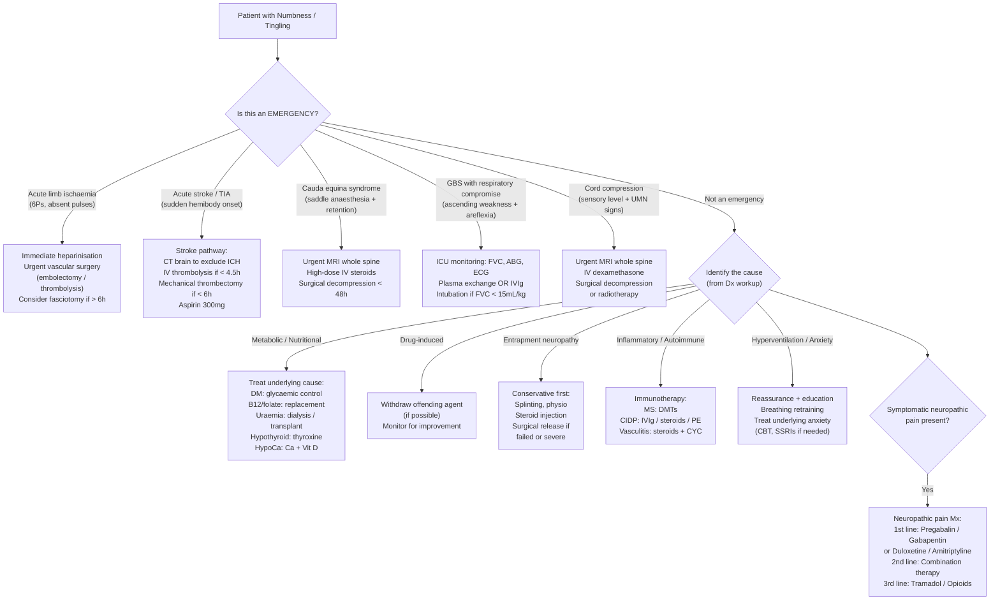

## Management Principles

The management of numbness and tingling is **cause-directed** — there is no single "treatment for numbness." The overarching principle is: **identify the underlying cause, treat it, and manage the symptomatic neuropathic pain if present**. This makes the diagnosis (covered in previous sections) the most critical step.

Let me organise this the way a senior clinician would think on a ward round: first deal with emergencies, then address the common causes systematically, and finally tackle symptom management.

---

## Master Management Algorithm

---

## Emergency Management

These are the time-critical conditions where delayed treatment causes irreversible harm. You must recognise and act fast.

### 1. Acute Limb Ischaemia

When a patient presents with unilateral limb numbness/tingling with absent pulses and the 6Ps, this is a **limb-threatening emergency** [10]:

- **Immediate**: IV heparin bolus (5000 IU) then infusion — prevents thrombus propagation. *Why heparin first?* The clot is already there; heparin won't dissolve it but will stop it getting bigger while you organise definitive treatment.
- **Definitive treatment** (must be within 6 hours — after 6h, ischaemia becomes irreversible) [10]:
  - **Embolectomy** (Fogarty balloon catheter): for embolic causes
  - **Catheter-directed thrombolysis** (tPA/urokinase infused directly into thrombus): for thrombotic causes or distal emboli
  - **Surgical bypass/revascularisation**: if thrombosis in situ on a background of chronic atherosclerotic disease
- **Post-revascularisation considerations**:
  - **Compartment syndrome**: after prolonged ischaemia (≥ 6h) + revascularisation → reperfusion injury → oedema → ↑compartment pressure → secondary ischaemia. Management: **emergent fasciotomy** when compartment pressure ≥ 30 mmHg or within 30 mmHg of diastolic BP. Consider prophylactic fasciotomy in theatre if prolonged ischaemia [10]
  - **Rhabdomyolysis**: reperfusion releases K⁺, lactic acid, myoglobin, CK → **acute renal failure, arrhythmia, ARDS**. Management: aggressive IV hydration ± IV sodium bicarbonate (↓acidosis, ↓myoglobin cast formation) ± dialysis [10]
- **Contraindications to thrombolysis** [10]: ***recent stroke, bleeding tendency, ICH/brain tumour, recent head trauma***
- **Non-viable limb** (non-blanchable mottling, dead muscle): **amputation required** — reperfusion of dead muscle releases toxic metabolites → systemic effect including cardiac arrest [10]

### 2. Acute Stroke / TIA

Covered in detail in stroke management, but key points relevant to numbness/tingling [3][23]:

- **CT brain** (non-contrast) immediately to exclude haemorrhage
- **IV thrombolysis** (alteplase): within **< 3–4.5h** of symptom onset, if no contraindications
- **Mechanical thrombectomy**: within **< 6h** for anterior circulation large vessel occlusion
- **Aspirin 300 mg** once haemorrhage excluded (started after 24h if thrombolysis given)
- **Secondary prevention**: antiplatelet ± anticoagulation (if AF), statin, BP control

### 3. Cauda Equina Syndrome

- **Bilateral saddle anaesthesia + painless urinary retention ± faecal incontinence** = cauda equina [6]
- **Urgent MRI whole spine**
- **High-dose IV steroids** (dexamethasone) to reduce localised swelling
- **Surgical decompression within < 48 hours** (laminectomy/discectomy) — delay beyond this leads to permanent neurological deficit [6]

### 4. Guillain-Barré Syndrome (GBS)

- **Monitor**: respiratory function (FVC, ABG), autonomic function (BP, ECG), bulbar function [17]
- **Intubation and mechanical ventilation** if: FVC < 15 mL/kg body weight, ↑CO₂/↓O₂, inefficient cough, dysphagia, atelectasis [17]
- **Specific immunotherapy** (for moderately severe or progressive disease) [17]:
  - ***Plasma exchange***: plasmapheresis 50 mL/kg/session for 5 exchanges over 2 weeks — physically removes the circulating autoantibodies attacking peripheral nerve myelin
  - ***High-dose IVIg***: 0.4 g/kg/day for 5 days — modulates the immune response through multiple mechanisms (anti-idiotype antibodies, complement inhibition, Fc receptor blockade)
  - **Important**: ***combination of plasmapheresis + IVIg or steroids has no benefit over either alone*** [17]. Steroids alone are NOT effective in GBS.
- **General supportive care**: DVT prophylaxis, nutritional support, pain management [17]

<Callout title="GBS: Steroids Don't Work" type="error">
Unlike most other autoimmune/inflammatory neurological conditions, **corticosteroids are NOT beneficial in GBS** and should not be used as primary treatment. This is a common exam pitfall. The immunotherapy options are **plasma exchange** or **IVIg** — not steroids [17].
</Callout>

### 5. Spinal Cord Compression

- **Urgent MRI whole spine**
- **IV dexamethasone** (reduces vasogenic oedema around the compressing lesion — buys time)
- **Definitive**: surgical decompression (for extradural tumour, epidural abscess, disc) or **radiotherapy** (for radiosensitive tumours, e.g., lymphoma, myeloma)

---

## Cause-Directed Management of Common Conditions

### A. Diabetic Peripheral Neuropathy

This is the ***most common cause*** [4] and warrants the most detailed discussion:

**Principles**: The cornerstone is **glycaemic control** — this is both preventative and therapeutic. There is no drug that reverses established diabetic neuropathy; you can only slow progression and manage symptoms.

| Strategy | Details | Mechanism / Rationale |
|---|---|---|
| **Glycaemic control** | Target HbA1c < 7% (individualise for elderly/comorbid); prefer ***SGLT2 inhibitors and GLP-1 receptor agonists*** [5] | Every 1% ↑HbA1c → 26% ↑risk of PAD. Tight control ↓microvascular complications (UKPDS, DCCT trials). SGLT2i and GLP1a have additional cardiovascular and renal benefits |
| **CVD risk factor control** | BP control (target < 130/80), lipid control (statin), smoking cessation | Diabetic neuropathy shares risk factors with macrovascular disease; vasa nervorum ischaemia contributes to neuropathy |
| **Foot care** | Daily inspection, appropriate footwear, podiatry, annual monofilament testing | Loss of protective sensation → unnoticed injuries → ulceration → Charcot joint → amputation. Prevention is everything |
| **Neuropathic pain Mx** | See below (gabapentin/pregabalin, duloxetine, amitriptyline) [5] | Symptomatic — does NOT reverse the underlying neuropathy |
| **Avoid nephrotoxic OHAs** | Metformin contraindicated if eGFR < 30; dose-adjust if 30–45 | CKD progression exacerbates uraemic neuropathy on top of diabetic neuropathy |

### B. Nutritional Neuropathy — B12 and Folate Deficiency

**B12 replacement** [7]:

| Aspect | Details |
|---|---|
| **Route** | ***Parenteral (IM) if impaired absorption*** (pernicious anaemia, gastrectomy, terminal ileum disease); ***oral if dietary deficiency*** (vegans) |
| **IM regimen** | 1000 μg IM weekly until normalised → then 1000 μg IM every 1–2 months |
| **Oral regimen** | 1000 μg PO daily — even in malabsorption, very high oral doses can work via non-IF-dependent passive diffusion (~1% of oral dose is absorbed passively) |
| **Duration** | ***Lifelong if underlying condition is irreversible*** (pernicious anaemia, gastrectomy); otherwise until deficiency corrected |
| **Urgency** | ***Urgent replacement indicated if severe anaemia or neuropsychiatric symptoms*** — risk of irreversible neurological deficits if delayed |
| **Monitoring** | Reticulocyte count peaks day 5–10; Hb rises ~1 g/dL/week. Watch for ↓K⁺ (rapid haematopoiesis consumes K⁺) and Fe depletion (increased erythropoiesis) |
| **Neurological recovery** | ***Sensory neuropathy takes 6–12 months to correct; some deficits may not improve*** [7]. This is why early treatment is critical |

**Folate replacement** [7]:
- **Oral**: 1–5 mg/day — sufficient even if malabsorption
- **Critical rule**: ***If B12 status is unknown, always give B12 alongside folate*** — use of folate alone in the presence of B12 deficiency may worsen neurological deficit despite partially masking haematological deficits (mechanism unclear but well-documented) [7]

<Callout title="Never Give Folate Alone Without Checking B12 Status" type="error">
This is a classic exam point and a real clinical danger. ***Folate alone in B12 deficiency may worsen neurological deficit*** while correcting the macrocytic anaemia — giving a false sense of security from the improving blood count while the spinal cord degenerates. Always check B12 before or alongside folate replacement [7].
</Callout>

**Alcoholic neuropathy**:
- **Alcohol cessation** (most important)
- **Thiamine replacement** (IV Pabrinex in acute setting, then oral thiamine)
- **B12/folate replacement** if deficient
- **Balanced nutrition**

### C. Drug-Induced Neuropathy

- ***Withdraw the offending agent*** whenever possible [4]
- **Drug list**: ***cytotoxic agents (vincristine, cisplatin, taxanes), interferon, colchicine, thalidomide, statins***, metronidazole, amiodarone, isoniazid [4]
- **Generally improves after withdrawal** of the offending agent, though recovery may take months [3]
- **Isoniazid-induced neuropathy**: prevented by co-prescribing **pyridoxine (vitamin B6)** — because isoniazid inhibits pyridoxal phosphate, which is a cofactor in peripheral nerve function
- **If the offending drug cannot be stopped** (e.g., essential chemotherapy): dose reduction, switching to less neurotoxic agents where possible, and symptomatic neuropathic pain management

### D. Uraemic Neuropathy (CKD)

- **Treat the underlying CKD**: optimise dialysis adequacy, or **renal transplantation** (the only treatment that reliably reverses uraemic neuropathy)
- **Neuropathic pain management** as needed
- Neuropathy generally improves with adequate dialysis

### E. Hypothyroid Neuropathy

- **Thyroxine (levothyroxine) replacement**: corrects both the diffuse peripheral neuropathy and the predisposition to CTS
- Slow titration in elderly/cardiac patients

### F. Hypocalcaemia

| Acuity | Treatment | Mechanism |
|---|---|---|
| **Acute symptomatic** (tetany, severe paraesthesia) | IV calcium gluconate 10% (10 mL over 10 min, then infusion) | Directly raises ionised Ca²⁺ → stabilises neuronal membranes → stops spontaneous firing |
| **Chronic** | Oral calcium + vitamin D (alfacalcidol/calcitriol) | Restores calcium homeostasis |
| **Hyperventilation-induced** | Reassurance, slow breathing, rebreathing into cupped hands or paper bag | Raises pCO₂ → corrects respiratory alkalosis → ↑ionised Ca²⁺. Total calcium is normal — NO calcium replacement needed |

### G. Carpal Tunnel Syndrome (CTS)

This follows a stepwise approach from conservative to surgical [9]:

| Stage | Treatment | Details |
|---|---|---|
| **Conservative** (first-line for mild-moderate) | ***Night-time wrist splint*** (in neutral position) [9] | Prevents wrist flexion during sleep → ↓carpal tunnel pressure → ↓median nerve compression. The nerve recovers if compression is intermittent |
| | Physiotherapy, lifestyle modification | Activity modification (ergonomic keyboards, rest breaks), weight loss |
| **Pharmacological** | ***Local steroid injection*** (into carpal tunnel) [9] | Reduces synovial inflammation/swelling → ↓pressure on nerve. Provides temporary relief (weeks to months). Pyridoxine (vitamin B6) also used but evidence is weak |
| **Surgical** | ***Carpal tunnel release*** (division of flexor retinaculum) [9] | Definitive: opens up the tunnel by cutting the transverse carpal ligament → permanent pressure relief. Can be **open or endoscopic** |

**Surgical indications** [9]:
- CTS ***unresponsive to conservative treatment*** for 6 weeks
- Associated ***sensory / motor deficit*** (thenar wasting = late sign = urgent)
- Axonal loss on NCS (indicates irreversible nerve damage is occurring)

**Specific surgical complications** [9]:
- Persistent CTS symptoms (inadequate release)
- Nerve injury: palmar cutaneous branch of median nerve
- Vascular injury: superficial palmar arch

### H. Cubital Tunnel Syndrome (Ulnar Neuropathy at Elbow)

- **Conservative**: ***soft elbow extension splint*** (prevents prolonged elbow flexion which stretches the ulnar nerve), physiotherapy, avoid leaning on elbow [6]
- **Pharmacological**: local steroid injection, pyridoxine
- **Surgical**: decompression in situ, medial epicondylectomy, or ***anterior transposition*** of ulnar nerve [6]

### I. Cervical Radiculopathy / Spondylosis

| Severity | Treatment |
|---|---|
| **Mild** (pain, paraesthesia only) | Conservative: analgesia (NSAIDs, neuropathic pain agents), physiotherapy, cervical collar for acute flare, activity modification |
| **Moderate** (persistent pain despite conservative Mx) | Cervical epidural steroid injection, nerve root block |
| **Severe** (progressive motor deficit, myelopathic signs, failed conservative Mx) | Surgical decompression ± stabilisation (anterior cervical discectomy and fusion, or posterior laminectomy) [6] |

### J. Cervical Myelopathy

- **Surgical decompression and stabilisation** is the mainstay — because this is a progressive condition where the spinal cord is being mechanically compressed, and there is no effective conservative treatment once myelopathic signs are present [6]
- **Approach**: anterior (ACDF) or posterior (laminoplasty/laminectomy with fusion) depending on number of levels involved and alignment

### K. Multiple Sclerosis

- **Acute relapse** (including sensory relapse with numbness/paraesthesia): **IV methylprednisolone** (1g/day for 3–5 days) — hastens recovery but does NOT alter long-term outcome [3]
  - ***PO steroids alone are contraindicated*** for optic neuritis (shown to ↑recurrence in the ONTT trial) [15]
- **Disease-modifying therapies (DMTs)**: reduce relapse frequency and MRI lesion burden
  - First-line: ***glatiramer acetate, teriflunomide, IFN-β1 (Betaferon/Rebif)*** [15]
  - Escalation: fingolimod, dimethyl fumarate, natalizumab, ocrelizumab, cladribine
- **Symptomatic**: neuropathic pain agents (gabapentin/pregabalin), physiotherapy, spasticity management

### L. NMOSD

- **Acute attacks**: IV pulse steroids, plasmapheresis, IVIg [20]
- **Prophylaxis**: immunosuppression — azathioprine, MMF, **rituximab** (anti-CD20)
- ***Do NOT use MS-specific agents*** (e.g., IFN-β, natalizumab, fingolimod) — ***may be harmful*** in NMOSD [20]

### M. Hyperventilation / Anxiety

- **Acute**: reassurance, calm environment, slow breathing instruction (breathe in for 4 seconds, hold 4 seconds, out for 6 seconds), ± rebreathing into cupped hands
- **Chronic / recurrent**: treat the underlying anxiety disorder
  - **Psychotherapy**: CBT (first-line for anxiety disorders)
  - **Pharmacotherapy**: SSRIs (e.g., sertraline, escitalopram) for generalised anxiety disorder or panic disorder [24]
  - **NOT benzodiazepines** as first-line (risk of dependence)

---

## Symptomatic Management of Neuropathic Pain

Many causes of numbness/tingling are associated with neuropathic pain (burning, tingling, electric-like). Even when the underlying cause is addressed, neuropathic pain often requires dedicated pharmacological management. The character of neuropathic pain is described as ***tingling, pricking, needle-like, numbness, electric-like, burning*** and it is ***less opioid-responsive*** [1].

Neuropathic pain ***responds to antidepressants and anticonvulsants*** [1]:

### Pharmacological Ladder for Neuropathic Pain

| Line | Drug Class | Examples | Mechanism | Key Points |
|---|---|---|---|---|
| **1st line** | **Gabapentinoids** | ***Gabapentin*** (300–3600 mg/day in 3 divided doses), ***Pregabalin*** (75–600 mg/day in 2 divided doses) | Bind α₂δ subunit of voltage-gated Ca²⁺ channels → ↓presynaptic Ca²⁺ influx → ↓excitatory neurotransmitter release (glutamate, substance P) → ↓neuronal hyperexcitability | Pregabalin has more predictable pharmacokinetics (linear absorption) than gabapentin. S/E: drowsiness, dizziness, peripheral oedema, weight gain. **Dose-reduce in renal impairment** |
| **1st line** | **SNRIs** | ***Duloxetine*** (30–120 mg/day) | Inhibits reuptake of serotonin AND noradrenaline → enhances descending inhibitory pain pathways from brainstem → ↓pain signal transmission in dorsal horn | Preferred over TCAs in elderly/cardiac patients (better S/E profile). S/E: nausea, dry mouth, constipation. C/I: hepatic impairment, concomitant MAOIs |
| **1st line** | **TCAs** | ***Amitriptyline*** (10–75 mg nocte), ***Nortriptyline*** | Inhibits reuptake of serotonin + noradrenaline (same as SNRIs) PLUS blocks Na⁺ channels and NMDA receptors → multiple analgesic mechanisms | Excellent for neuropathic pain + insomnia (sedating). Start low, go slow. S/E: anticholinergic (dry mouth, constipation, urinary retention, blurred vision), sedation, cardiac arrhythmia. **C/I: recent MI, heart block, urinary retention, narrow-angle glaucoma** |
| **2nd line** | **Combination** | Gabapentinoid + SNRI or TCA | Synergistic — target different mechanisms | If monotherapy fails, combine drugs from different classes rather than switching between same class |
| **2nd line** | **Topical** | Capsaicin 8% patch, lidocaine 5% patch | Capsaicin depletes substance P from sensory nerve terminals; lidocaine blocks Na⁺ channels locally | For localised neuropathic pain. Few systemic S/E |
| **3rd line** | **Opioids** | ***Tramadol*** (weak opioid + SNRI-like action); strong opioids (morphine, oxycodone) as last resort | μ-opioid receptor agonism → ↓pain perception; tramadol also inhibits NA/5-HT reuptake | Use with caution — neuropathic pain is ***less opioid-responsive*** [1]. Risk of dependence. Tramadol preferred over strong opioids |
| **3rd line** | **Anticonvulsants** | ***Carbamazepine*** (specifically for trigeminal neuralgia) | Blocks voltage-gated Na⁺ channels → stabilises hyperexcitable neurones | Carbamazepine is first-line for trigeminal neuralgia specifically (not general neuropathic pain). S/E: hyponatraemia, aplastic anaemia, Stevens-Johnson syndrome. Monitor FBE and Na⁺ |

<Callout title="Why Standard Analgesics Don't Work Well for Neuropathic Pain" type="idea">
Neuropathic pain arises from **ectopic firing of damaged neurones** and **central sensitisation**, not from ongoing tissue damage. This is why:
- **Paracetamol**: works on COX in the CNS for nociceptive pain → minimal effect on ectopic neuronal firing
- **NSAIDs**: work on peripheral COX/prostaglandin pathway → irrelevant to neuropathic mechanisms
- **Opioids**: work on μ-receptors → somewhat effective but the descending inhibitory pathways are already dysfunctional in neuropathic states → ***less opioid-responsive*** [1]

Instead, gabapentinoids (↓Ca²⁺ channel activity), antidepressants (↑descending inhibition), and Na⁺ channel blockers (stabilise ectopic firing) target the actual pathophysiology.
</Callout>

### Non-Pharmacological Approaches

| Modality | Details | Evidence |
|---|---|---|
| **Physiotherapy** | Desensitisation techniques, graded motor imagery, TENS | Moderate evidence for chronic neuropathic pain |
| **Psychological** | CBT for pain management, mindfulness-based stress reduction | Good evidence for chronic pain syndromes |
| **Neurostimulation** | Spinal cord stimulation (implanted), transcutaneous electrical nerve stimulation (TENS) | Reserved for refractory pain; spinal cord stimulation has good evidence for FBSS, CRPS |
| **Acupuncture** | Various protocols | Limited evidence; may offer modest benefit |

---

## Summary Table: Management by Cause

| Cause | Key Management | Emergency? |
|---|---|---|
| ***Diabetic neuropathy*** | Glycaemic control (HbA1c < 7%), CVD risk factor control, foot care, neuropathic pain Mx | No |
| ***B12 deficiency*** | IM B12 (if malabsorption) or high-dose oral B12; lifelong if irreversible cause | Urgent if neuropsychiatric Sx |
| ***Folate deficiency*** | Oral folate 1–5 mg/day; ALWAYS co-administer B12 if B12 status unknown | No |
| ***Alcoholic neuropathy*** | Alcohol cessation, thiamine/B12/folate replacement, nutrition | No |
| ***Drug-induced*** | Withdraw offending agent; symptomatic Mx | No |
| ***Uraemic*** | Optimise dialysis; renal transplant for definitive cure | No |
| ***Hypothyroid*** | Levothyroxine replacement | No |
| ***Hypocalcaemia*** | IV calcium gluconate (acute); oral Ca + Vit D (chronic); rebreathing (if hyperventilation) | Acute if tetany |
| ***CTS*** | Night splint → steroid injection → ***surgical release*** if failed or motor deficit | No |
| ***Cubital tunnel*** | Elbow splint → ***anterior transposition*** if failed | No |
| ***Cervical radiculopathy*** | Conservative (analgesia, physio, collar) → epidural injection → surgery if progressive | No (unless myelopathy) |
| ***Cervical myelopathy*** | Surgical decompression + stabilisation | Semi-urgent |
| ***Cauda equina*** | Urgent MRI → surgical decompression < 48h | **YES** |
| ***Acute limb ischaemia*** | Heparin → embolectomy/thrombolysis within 6h | **YES** |
| ***Stroke / TIA*** | CT → thrombolysis (< 4.5h) / thrombectomy (< 6h) → aspirin → secondary prevention | **YES** |
| ***GBS*** | ICU monitoring → plasma exchange OR IVIg (NOT steroids) | **YES** if respiratory |
| ***MS*** | Acute: IV methylprednisolone; Chronic: DMTs | Acute relapse: urgent |
| ***NMOSD*** | Acute: IV steroids/PE/IVIg; Prophylaxis: rituximab/AZA/MMF. Do NOT use MS-specific agents | Acute relapse: urgent |
| ***Hyperventilation*** | Reassurance, slow breathing, treat underlying anxiety (CBT, SSRIs) | No |
| ***Functional*** | Positive diagnosis, education, physiotherapy, CBT | No |

---

<Callout title="High Yield Summary — Management">

1. **Management is cause-directed** — there is no "treatment for numbness"; identify and treat the underlying cause
2. **Emergencies requiring immediate action**: acute limb ischaemia (heparin + revascularisation < 6h), stroke (CT → thrombolysis < 4.5h), cauda equina (MRI → decompression < 48h), GBS with respiratory failure (ICU + PE or IVIg), cord compression (MRI → steroids → surgery/RT)
3. **Diabetic neuropathy**: glycaemic control is the cornerstone; no drug reverses established neuropathy
4. **B12 replacement**: IM if malabsorption, oral if dietary; lifelong if irreversible cause; ***never give folate alone without checking B12*** — may worsen neurological deficit
5. **Drug-induced neuropathy**: withdraw offending agent — ***always take a detailed drug history***
6. **CTS**: conservative (***night-time wrist splint***) → injection → ***carpal tunnel release*** if failed or motor deficit/axonal loss
7. **GBS**: plasma exchange OR IVIg — ***NOT steroids*** (steroids alone are ineffective)
8. **NMOSD**: ***do NOT use MS-specific agents*** (may be harmful); use rituximab/AZA/MMF for prophylaxis
9. **Neuropathic pain**: first-line = ***gabapentin/pregabalin, duloxetine, amitriptyline***; standard analgesics (paracetamol, NSAIDs) are largely ineffective because the mechanism is ectopic neuronal firing, not nociceptive
10. **Hyperventilation**: reassurance + slow breathing; do NOT give IV calcium (the total calcium is normal — it's the ionised fraction that's transiently low due to alkalosis)

</Callout>

---

<ActiveRecallQuiz
  title="Active Recall - Management of Numbness and Tingling"
  items={[
    {
      question: "A patient with GBS is deteriorating with ascending weakness now affecting the respiratory muscles. What are the indications for intubation, and what are the two specific immunotherapy options? Why are steroids NOT used?",
      markscheme: "Indications for intubation: FVC less than 15 mL/kg body weight, rising CO2 or falling O2 on ABG, inefficient cough, dysphagia, or atelectasis. Two specific immunotherapy options: (1) Plasma exchange - 50 mL/kg per session for 5 exchanges over 2 weeks; physically removes pathogenic autoantibodies. (2) High-dose IVIg - 0.4 g/kg/day for 5 days; modulates immune response. Steroids are NOT effective in GBS (unlike most other autoimmune neurological conditions). Combining PE and IVIg has no benefit over either alone."
    },
    {
      question: "Why must you always co-administer B12 when giving folate to a patient whose B12 status is unknown? What is the clinical danger?",
      markscheme: "Folate alone in the presence of undiagnosed B12 deficiency may worsen neurological deficit (subacute combined degeneration of the cord) while partially correcting the macrocytic anaemia - giving a false sense of security from improving blood counts while the spinal cord continues to degenerate. The mechanism is unclear but well-documented. Always check B12 status or co-administer B12 with folate when B12 status is unknown, especially if urgent treatment is needed before results are available."
    },
    {
      question: "Outline the stepwise management of carpal tunnel syndrome from conservative to surgical. What are the surgical indications?",
      markscheme: "Step 1 - Conservative: night-time wrist splint in neutral position (prevents wrist flexion during sleep which increases carpal tunnel pressure), physiotherapy, lifestyle modification (ergonomic adjustments, weight loss). Step 2 - Pharmacological: local corticosteroid injection into the carpal tunnel to reduce synovial inflammation. Step 3 - Surgical: carpal tunnel release (division of flexor retinaculum), open or endoscopic. Surgical indications: (1) Unresponsive to conservative treatment for 6 weeks, (2) Associated sensory or motor deficit (especially thenar wasting), (3) Axonal loss demonstrated on nerve conduction studies."
    },
    {
      question: "What is the first-line pharmacological treatment for neuropathic pain? Name three drug classes and explain why standard analgesics like NSAIDs are ineffective.",
      markscheme: "First-line options (any of three classes): (1) Gabapentinoids - pregabalin or gabapentin (bind alpha-2-delta subunit of voltage-gated Ca2+ channels, reducing excitatory neurotransmitter release). (2) SNRIs - duloxetine (inhibits serotonin and noradrenaline reuptake, enhancing descending inhibitory pain pathways). (3) TCAs - amitriptyline (blocks NA/5-HT reuptake plus Na+ channels and NMDA receptors). NSAIDs are ineffective because neuropathic pain arises from ectopic firing of damaged neurones and central sensitisation, NOT from tissue damage or peripheral prostaglandin-mediated inflammation. NSAIDs target COX/prostaglandin pathways which are irrelevant to the neuropathic mechanism."
    },
    {
      question: "In the management of acute limb ischaemia, what is the significance of the 6-hour window? What complications must you anticipate after successful revascularisation?",
      markscheme: "The 6-hour window: after 6 hours of ischaemia without collateral blood supply, tissue damage becomes irreversible (nerves die first, then muscles, then skin). Revascularisation must occur within this window to save the limb. Post-revascularisation complications: (1) Compartment syndrome - reperfusion causes oedema, increased compartment pressure exceeding 30mmHg or within 30mmHg of diastolic BP causes secondary ischaemia. Treatment: emergent fasciotomy. (2) Rhabdomyolysis - reperfusion releases K+, lactic acid, myoglobin, and CK from damaged muscle, causing acute renal failure (myoglobin nephrotoxicity), arrhythmia (hyperkalaemia), and ARDS. Treatment: aggressive IV hydration, IV sodium bicarbonate, and dialysis if needed."
    },
    {
      question: "Why must you NOT use MS-specific disease-modifying therapies in NMOSD? What agents are used instead for prophylaxis?",
      markscheme: "MS-specific DMTs (e.g., interferon-beta, natalizumab, fingolimod) may be harmful in NMOSD and can worsen the disease. The immunopathology of NMOSD (anti-AQP4 antibody-mediated, complement-driven astrocyte destruction) is fundamentally different from MS (T-cell-mediated myelin attack). NMOSD prophylaxis agents: rituximab (anti-CD20 monoclonal antibody targeting B cells that produce anti-AQP4), azathioprine, or mycophenolate mofetil (MMF). These broadly suppress the humoral immune response. For acute attacks: IV pulse steroids, plasmapheresis, or IVIg."
    }
  ]}
/>

## References

[1] Senior notes: felixlai.md (Pain pathophysiology — nociceptive vs neuropathic pain, p.145–146)
[3] Senior notes: Ryan Ho Neurology.pdf (Sensory Disturbances, p.71–72; Stroke management and reperfusion, p.79; GBS management, p.183)
[4] Lecture slides: murtagh merge.pdf (Paraesthesia and numbness, p.75–77)
[5] Senior notes: Ryan Ho Endocrine.pdf (Diabetic neuropathy management, p.97; Chronic diabetic complications, p.94)
[6] Senior notes: maxim.md (CTS management, p.503; Cubital tunnel management, p.502; Cauda equina management, p.465; Cervical myelopathy, p.465)
[7] Senior notes: Ryan Ho Haemtology.pdf (B12/folate replacement management, p.30)
[10] Senior notes: Ryan Ho Cardiology.pdf (Acute limb ischaemia — 6Ps, revascularisation, complications, p.209–212)
[15] Senior notes: Ryan Ho Opthalmology.pdf (Optic neuritis management, MS DMTs, p.93)
[17] Senior notes: Ryan Ho Neurology.pdf (GBS management, p.183)
[20] Senior notes: Ryan Ho Neurology.pdf (NMOSD management, p.139)
[23] Senior notes: felixlai.md (Stroke management — acute and chronic complications, p.1704)
[24] Senior notes: Ryan Ho Psychiatry.pdf (Panic disorder diagnostic criteria, p.179)
