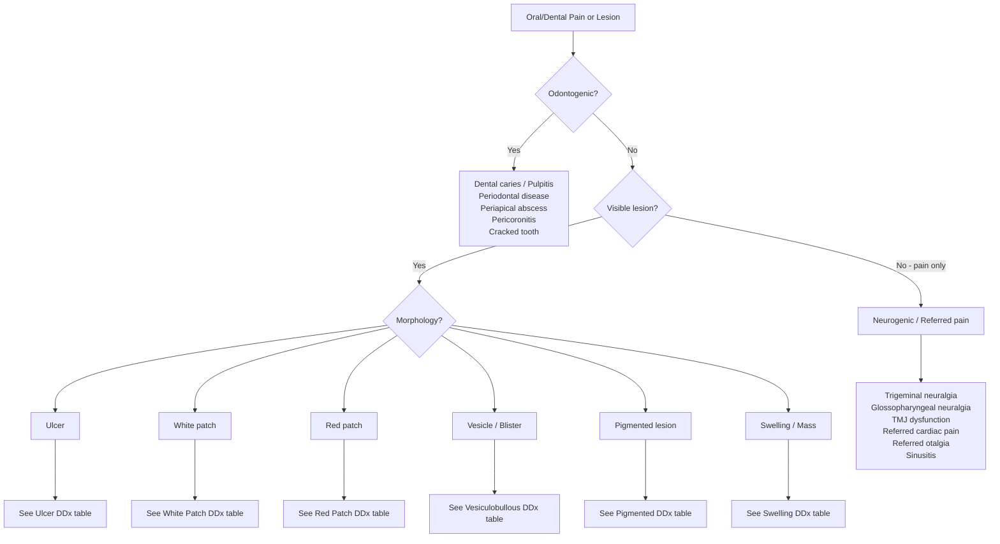

## Differential Diagnosis of Oral/Dental Pain and Lesions

The differential diagnosis of oral/dental complaints is vast — the mouth sits at a crossroads of dental, ENT, dermatological, rheumatological, haematological, and neurological pathology. The skill lies in pattern recognition: **What does the lesion look like? Where is it? How long has it been there? What company does it keep (systemic features)?**

This section organises the differential by clinical presentation (the way you encounter it at the bedside), then provides a systematic framework for narrowing down.

---

### 1. Overarching Diagnostic Framework

The first-principles approach to any oral complaint is to ask three questions:

1. **Is this odontogenic (from the teeth) or non-odontogenic (from the mucosa, salivary glands, bone, nerves, or referred)?**
2. **If non-odontogenic, what is the morphology of the lesion?** — Ulcer, white patch, red patch, vesicle/blister, pigmented lesion, swelling/mass, or no visible lesion (pain only)?
3. **Is this dangerous?** — The "must-not-miss" diagnoses: malignancy, deep space infection (Ludwig's angina, peritonsillar abscess), SJS/TEN, pemphigus, blood dyscrasia, and referred cardiac pain.

---

### 2. Differential Diagnosis by Presentation

#### 2.1 Oral Ulcers

This is the most common presenting morphology. The differential spans benign to life-threatening.

***Common causes of oral ulcers: Aphthous ulcer, Trauma, Drugs (e.g., steroids), CA oral cavity*** [1].

| Diagnosis | Key Distinguishing Features | Why This Happens (Pathophysiology) |
|---|---|---|
| ***Aphthous ulcer (most common)*** [1] | ***Small painful mucosal vesicle → shallow ulceration that heals without scarring*** [1]; recurrent; minor (< 1 cm, non-keratinised mucosa), major (> 1 cm, may scar), herpetiform (clusters). ***Usually does NOT indicate serious underlying disease*** [1]. ***May occur in Crohn's disease or coeliac disease*** [1] | T-cell mediated mucosal destruction; exact trigger unknown (stress, trauma, hormonal, food). Crohn's = granulomatous inflammation extending to oral mucosa |
| **Traumatic ulcer** | History of mechanical injury (sharp tooth, denture, cheek bite, thermal burn); solitary; site corresponds to source of trauma; heals when cause removed | Direct epithelial disruption → inflammatory response → ulcer crater |
| ***Oral SCC*** | ***Non-healing ulcer > 3 weeks***; indurated, rolled/everted edges; fixation to deeper tissues; ***lymphadenopathy***; smoking/alcohol history; elderly male. ***Exophytic growth or non-healing ulcer*** [3]. ***Trismus = involvement of muscles of mastication, may indicate spread to skull base*** [3] | Malignant keratinocyte proliferation → tissue invasion and necrosis → ulcer with desmoplastic stroma forming the hard, rolled edges |
| ***Herpes simplex (HSV-1)*** [5] | ***Primary: multiple shallow ulcers on keratinised AND non-keratinised mucosa + gingivitis + fever (primary herpetic gingivostomatitis). Recurrent: herpes labialis — prodromal hyperaesthesia then vesicles → pustules → crusts at mucocutaneous junction*** [5]. Crops of vesicles that ulcerate | ***Latent infection in trigeminal ganglion → reactivation → virus travels down sensory nerves → epithelial cell lysis → vesicle → rupture → ulcer*** [5] |
| ***Behçet disease*** [8] | ***Deep, multiple, painful ulcers with well-defined borders and necrotic base; recurrent; heals in 1–3 weeks*** [8]. Look for ***urogenital ulcers (most specific)*** [8], skin lesions, ***bilateral panuveitis*** | ***Systemic vasculitis → mucosal ischaemia and immune-mediated epithelial destruction*** [8] |
| **Syphilitic chancre** (primary) | Painless, indurated ulcer with clean base; single; usually lip or tongue; resolves spontaneously in 3–6 weeks. **Secondary**: mucous patches (shallow, painless, "snail-track" ulcers) | *Treponema pallidum* invasion → local immune response → granulomatous inflammation → ulcer. Painless because spirochetes suppress local pain signalling mechanisms |
| ***Vincent's angina (ANUG)*** | Painful, bleeding gums with necrotic interdental papillae; punched-out ulcers at gingival margin; foul breath (fetor oris); young adults with poor hygiene + stress + smoking | Fusospirochetal synergistic infection (*Fusobacterium* + *Borrelia vincentii*) → necrotising destruction of interdental papillae |
| ***HIV-associated ulcers*** [1] | Large, deep, persistent aphthous-like ulcers; often oropharyngeal; poor response to standard therapy. May also have oral hairy leukoplakia, Kaposi sarcoma, candidiasis | Severe immune dysregulation → uncontrolled T-cell mediated mucosal destruction; also opportunistic infections |
| ***Drug-induced ulcers*** | Methotrexate, chemotherapy (mucositis), nicorandil (persistent perianal/oral ulcers), NSAIDs, bisphosphonates (jaw osteonecrosis → ulceration) | Cytotoxic drugs inhibit rapidly dividing mucosal epithelial cells → epithelial loss → ulceration. Nicorandil → unclear mechanism, possibly local vascular effect |
| ***SJS/TEN*** [10] | ***Painful haemorrhagic erosions involving oral, ocular, bronchial and urogenital mucosae*** [10]; widespread skin involvement (target-like lesions progressing to skin sloughing); ***prodrome: high fever, malaise, arthralgia*** [10]; drug history (***allopurinol, aromatic AEDs, sulphonamides***) [10] | ***Cytotoxic T cells + NK cells mediate keratinocyte apoptosis via granulysin*** [10] → full-thickness epidermal necrosis |
| ***Erythema multiforme (EM major)*** [11] | ***Oral mucosal involvement (70%): affect vermilion lip, mucosal surfaces*** [11]; target lesions on skin (dusky centre + pale ring + erythematous halo); ***usually triggered by HSV or Mycoplasma pneumoniae*** [11]; ***course: appear over 3–5 days then resolve ≤ 2 weeks*** [11] | ***Triggering of autoreactive T cells*** [11] → interface dermatitis → keratinocyte apoptosis in a zonal pattern → target morphology |
| ***Pemphigus vulgaris*** [7] | ***Oral erosions often the first manifestation***; painful erosions on buccal mucosa, palate, gingivae; ***Nikolsky sign positive*** [7]; ***flaccid blisters that rupture easily*** [7]; middle-aged adults | ***Autoantibodies to desmoglein-3 → acantholysis → intraepidermal split → fragile blisters that rupture immediately in the mouth*** [7] |
| **Tuberculosis** (oral) | Rare; chronic, irregular, painful ulcer usually on tongue dorsum; undermined edges; associated with pulmonary TB (secondary inoculation from sputum) | Mycobacterial infection → caseating granulomatous inflammation → tissue necrosis → ulcer |
| **Crohn's disease** | Oral ulcers (aphthous-like), cobblestoning of buccal mucosa, lip swelling (orofacial granulomatosis); GI symptoms | Granulomatous inflammation → mucosal ulceration; oral involvement = extraintestinal manifestation |

<Callout title="The Red Flag Triad for Pharyngeal Cancer" type="error">
***The triad: hoarseness + pain on swallowing + referred ear pain → pharyngeal cancer*** [14]. This comes directly from the Murtagh's diagnostic tips and is extremely high yield. Referred otalgia occurs because the oropharynx and ear share sensory innervation via CN IX (tympanic branch — Jacobson's nerve) and CN X (auricular branch — Arnold's nerve). A tumour irritating these nerves causes the brain to misinterpret the signal as ear pain.
</Callout>

#### 2.2 White Patches

| Diagnosis | Key Distinguishing Features | Why (Pathophysiology) |
|---|---|---|
| ***Leukoplakia*** [1] | ***White-coloured thickening that cannot be scraped off***; diagnosis of exclusion; ***causes: 5S (Sore teeth, Smoking, Spirits, Sepsis, Syphilis)*** [1]; ***floor of mouth = highest malignant transformation risk*** [3]; ***premalignant*** [1] | Chronic irritation → reactive hyperkeratosis of epithelium ± dysplasia. Dysplastic cells produce excess keratin → white appearance |
| ***Oral lichen planus*** [6] | ***Wickham's striae on buccal mucosa/tongue — fine white lacy network*** [6]; often bilateral and symmetrical; ***often asymptomatic*** [6]; ***associated with HBV and HCV infections*** [6] | ***T-cell mediated attack on basal keratinocytes*** [6] → interface dermatitis → irregular epithelial hyperplasia + hyperkeratosis → white striae |
| **Oral candidiasis (pseudomembranous)** | White plaques that **CAN be scraped off** revealing erythematous base; immunocompromised, denture wearers, steroid inhaler users, neonates | *Candida* hyphae penetrate superficial epithelium → desquamated epithelial cells + hyphae + fibrin = white pseudomembrane. It scrapes off because the pseudomembrane sits ON TOP of the epithelium rather than being a change within it |
| **Oral hairy leukoplakia** | White, corrugated ("hairy") patches on lateral tongue; CANNOT be scraped off; almost exclusively in immunocompromised (HIV); NOT premalignant | ***EBV*** replication in lingual epithelial cells → hyperplasia and hyperkeratosis of epithelium. Unlike true leukoplakia, has specific viral aetiology and is not considered premalignant |
| **White sponge naevus** | Bilateral, symmetrical, thick white plaques on buccal mucosa; present from birth/childhood; benign; autosomal dominant | Mutation in mucosal keratin genes (K4, K13) → abnormal keratin production → spongy white epithelium |
| **Lichenoid drug eruption** | Unilateral white striae resembling lichen planus; temporal association with drug (NSAIDs, ACE inhibitors, antimalarials, gold, methyldopa); resolves on drug withdrawal | Drug-induced T-cell activation → interface dermatitis mimicking lichen planus |
| ***Speckled leukoplakia*** [3] | ***Variation of leukoplakia arising on an erythematous base*** [3]; mixed white and red; ***highest rate of malignant transformation*** [3] | Combination of hyperkeratosis (white) and atrophic/dysplastic epithelium with visible submucosal vasculature (red) |

<Callout title="Can It Be Scraped Off?" type="idea">
This is the single most useful bedside test for white patches. **Candidiasis (pseudomembranous) = scrapes off.** Leukoplakia, lichen planus, hairy leukoplakia = do NOT scrape off. If it doesn't scrape off and the patient has risk factors, **biopsy it**.
</Callout>

#### 2.3 Red Patches

| Diagnosis | Key Distinguishing Features | Pathophysiology |
|---|---|---|
| ***Erythroplakia*** [3] | ***Bright red velvety plaque that cannot be characterised clinically or pathologically*** [3]; often asymptomatic; up to 50% harbour carcinoma in situ or invasive SCC at biopsy | Thin, atrophic, dysplastic epithelium → submucosal vasculature shows through = red |
| ***Glossitis*** [1] | ***Smooth tongue surface ± erythema***; ***indicates nutritional deficiencies (Fe, B9, B12)*** [1]; ***rapid turnover of tongue mucosal cells → particularly sensitive to nutritional deficiencies*** [1] | Impaired DNA synthesis in rapidly dividing lingual epithelium → papillary atrophy → smooth, shiny, erythematous tongue |
| **Erythematous (atrophic) candidiasis** | Diffuse red, painful mucosa; often under dentures ("denture stomatitis"); common with steroid inhalers | *Candida*-induced chronic inflammation → mucosal atrophy → erythema |
| **Median rhomboid glossitis** | Erythematous, smooth, rhomboid area on midline dorsal tongue; usually asymptomatic | Chronic atrophic candidiasis on dorsal tongue → localised papillary atrophy |
| **Geographic tongue (erythema migrans)** | Migrating areas of depapillation with white raised borders; benign; waxes and wanes | Unknown; possibly immune-mediated. Loss of filiform papillae in patches → red areas (exposed underlying tissue); margins = regenerating epithelium |
| ***Oral SCC (early)*** | Erythematous patch with irregular margins; may be mixed (speckled leukoplakia); non-healing | Dysplastic epithelium replacing normal mucosa → thin, atrophic surface |

#### 2.4 Vesiculobullous Lesions (Oral Involvement)

This differential is critical because several of these conditions are systemic and life-threatening.

***Differential diagnoses with mucosal involvement*** [7]:
- ***Pemphigus vulgaris (majority)***
- ***Pemphigoid (some)***
- ***Herpes simplex***
- ***Erythema multiforme***
- ***SJS/TEN (extensive)***

| Diagnosis | Blister Character | Oral Features | Key Clue |
|---|---|---|---|
| ***Pemphigus vulgaris*** [7] | ***Flaccid, fragile, Nikolsky +ve*** | ***Painful erosions; oral = most common and often first site*** [7]; ***pain exacerbated by chewing/swallowing → poor nutrition*** [7] | ***Anti-desmoglein 3 (mucosal) ± 1 (cutaneous)*** [7]; middle-aged |
| **Mucous membrane pemphigoid (cicatricial pemphigoid)** | Tense blisters → scarring erosions | Desquamative gingivitis; progressive scarring; ocular involvement → symblepharon, blindness | Anti-BP180/laminin-332; predominantly elderly; **scarring** is the hallmark (unlike BP) |
| ***Bullous pemphigoid*** [7] | ***Tense blisters; mucosal involvement 10–30%*** [7] | Less prominent oral involvement than pemphigus; ***predominantly elderly (median age 80y)*** [7] | Anti-BP180/BP230; ***subepidermal split*** → tense blisters |
| ***HSV (primary gingivostomatitis)*** [5] | Clusters of small vesicles → shallow ulcers | Multiple vesicles on keratinised AND non-keratinised mucosa; fever, gingivitis; ***prodromal hyperaesthesia*** [5] | Vesicles in crops; usually children or young adults; ***PCR for HSV DNA from vesicular fluid*** [5] |
| **VZV (shingles — V2/V3)** | Unilateral dermatomal vesicles | Vesicles/ulcers on palate (V2) or tongue/lower lip (V3); STRICTLY unilateral | Dermatomal distribution; older/immunocompromised; severe pain preceding rash |
| **Hand-foot-mouth disease** | Small vesicles on oral mucosa, palms, soles | Vesicles on soft palate, buccal mucosa, tongue | Coxsackievirus A16 or Enterovirus A71; children; HK outbreaks common |
| ***EM major*** [11] | Target lesions on skin ± vesicles/bullae | ***Oral (70%): painful erosions on vermilion lip, mucosal surfaces*** [11] | ***Target lesions; HSV or Mycoplasma trigger*** [11] |
| ***SJS/TEN*** [10] | Widespread skin sloughing | ***Painful haemorrhagic erosions of oral, ocular, urogenital mucosae*** [10] | Drug history; ***prodrome of fever*** [10]; ***< 10% TBSA = SJS; > 30% = TEN*** |

#### 2.5 Pigmented Lesions

***Pigmentation may be due to*** [1]:

| Diagnosis | Colour/Pattern | Location | Pathophysiology |
|---|---|---|---|
| **Amalgam tattoo** | Blue-grey macule | Adjacent to dental restoration | Iatrogenic implantation of amalgam particles into mucosa; most common localised oral pigmentation |
| **Racial/physiological melanosis** | Brown/black, diffuse, bilateral | Gingivae, buccal mucosa | Constitutional melanin deposition; benign; common in darker-skinned individuals |
| ***Addison's disease*** [1] | ***Blotches of dark brown pigment*** [1] | ***Anywhere in the mouth*** [1] | ***Excess ACTH (from loss of cortisol feedback) cross-reacts with MSH receptors → ↑melanin*** |
| ***Peutz-Jeghers syndrome*** [1] | Brown-black melanotic macules | Perioral and buccal | Autosomal dominant (STK11 mutation); mucocutaneous melanocyte proliferation; associated hamartomatous GI polyps |
| ***Lead/bismuth poisoning*** [1] | ***Blue-black line on gingival margin*** [1] (Burton's line) | Gingival margin | Metal sulphide deposition in gingival capillary bed |
| ***Haemochromatosis*** [1] | ***Blue-grey pigmentation*** [1] | ***Hard palate*** [1] | Iron overload → haemosiderin deposition in mucosa |
| ***Drug-induced*** [1] | ***Brown or black*** [1] | ***Anywhere*** [1] | ***Antimalarials, OC pills*** [1]; drug/metabolite deposition in mucosa or stimulation of melanocytes |
| ***Malignant melanoma*** [1] | ***Raised, painless black lesion*** [1] | ***Anywhere*** [1] (hard palate and gingivae most common for oral melanoma) | Malignant melanocyte proliferation; **rare** in oral cavity but very aggressive |
| **Kaposi sarcoma** | Purple/violaceous macule or nodule | Palate (most common oral site), gingivae | HHV-8 driven endothelial-origin tumour; almost exclusively in HIV/AIDS or immunosuppressed |

#### 2.6 Swelling / Mass Lesions

| Diagnosis | Key Features | Pathophysiology |
|---|---|---|
| **Mucocoele** | Blue-translucent, dome-shaped, painless swelling; usually lower lip; fluctuant; may rupture and recur | Ruptured minor salivary gland duct → mucin extravasation into surrounding tissue → pseudocyst |
| **Ranula** | Large mucocoele in the floor of mouth (sublingual gland); bluish swelling; "frog belly" appearance | Same as mucocoele but specifically from sublingual gland/duct damage |
| **Epulis (fibrous epulis)** | Firm, pink, pedunculated gingival swelling; arises from periodontal ligament | Reactive fibrous hyperplasia in response to chronic irritation (calculus, plaque) |
| **Pyogenic granuloma** | ***Bright red, dome-shaped, friable, bleeds easily; preceded by trauma; rapid growth*** [15]; common in pregnancy | ***Lobular capillary haemangioma*** [15]; reactive vascular proliferation in response to trauma/hormones |
| ***Oral SCC*** [3] | ***Exophytic mass or non-healing ulcer; indurated; fixation to deeper structures; lymphadenopathy*** [3] | Malignant epithelial proliferation |
| ***Minor salivary gland tumour*** [3] | ***Submucosal mass in tongue base or soft palate*** [3]; firm, smooth, painless; adenoid cystic carcinoma or mucoepidermoid carcinoma | Neoplastic proliferation of salivary gland epithelium; adenoid cystic carcinoma has perineural invasion tendency → pain/paraesthesia |
| ***Lymphoma*** [3] | ***Tonsils and tongue base may be the presenting site for a lymphoma*** [3]; firm, painless tonsillar enlargement (usually unilateral); B symptoms | Malignant lymphoid proliferation in Waldeyer's ring |
| **Torus palatinus / mandibularis** | Bony hard, midline palatal swelling (torus palatinus) or lingual mandibular swelling; painless; common | Benign exostosis of bone; entirely normal variant; no treatment needed unless interfering with dentures |
| **Denture-related fibrous hyperplasia (epulis fissuratum)** | Redundant tissue folds along denture flange margins | Chronic irritation from ill-fitting denture → fibrous tissue hyperplasia |

#### 2.7 Pain Without Visible Lesion (Neurogenic / Referred)

This is a very important differential in clinical practice — patients present with oral or facial pain but examination of the mouth is normal.

| Diagnosis | Key Features | Pathophysiology |
|---|---|---|
| ***Trigeminal neuralgia (tic douloureux)*** [14] | ***Sudden severe shooting pain in one division of CN V*** [14]; lasts seconds to minutes; triggered by light touch to trigger zone (washing face, eating, brushing teeth); pain-free intervals between attacks; usually V2/V3 | Neurovascular compression of trigeminal nerve root (usually by superior cerebellar artery) → demyelination → ephaptic transmission between fibres → paroxysmal pain |
| ***Glossopharyngeal neuralgia*** [14] | ***Sudden shooting pain radiating from one side of throat to ear*** [16]; triggered by swallowing, talking, yawning; rare | Compression/irritation of CN IX → paroxysmal pain in tonsillar fossa, pharynx, ear (shared territory) |
| ***TMJ dysfunction (TMJ arthralgia)*** [14] | Pain over TMJ region, worsened by jaw movement/chewing; clicking/locking of jaw; limitation of mouth opening; tenderness over TMJ | Disc displacement, osteoarthritis, myofascial pain of masticatory muscles; stress-related bruxism → muscle fatigue and joint overload |
| ***Dental abscess (referred pain)*** [14] | Pain may be poorly localised or referred to ear; tooth tender to percussion; swelling over alveolus | Periapical infection → inflammation stimulates A-delta and C fibres → referred via V2/V3 divisions |
| ***Sinusitis (maxillary)*** [14][17] | ***Facial pain or pressure (increases with bending over) ± radiation to tooth*** [17]; nasal congestion/discharge; ***double sickening*** [17] | Inflammation of maxillary sinus → pain referred to ipsilateral upper teeth because the roots of upper premolars/molars lie in close proximity to (or project into) the maxillary sinus floor |
| ***Referred cardiac pain*** [14] | ***Angina or MI can present as sore throat or jaw pain*** [14]; exertional, with chest tightness, SOB; relieved by GTN | Visceral afferents from heart enter spinal cord at same segments (C3–T4) as somatic afferents from jaw/throat → convergence on second-order neurons → cortex misinterprets as jaw pain |
| **Burning mouth syndrome** | Chronic burning pain in tongue, palate, lips; NO visible mucosal abnormality; more common in postmenopausal women; taste disturbance; dry mouth sensation | Neuropathic pain likely involving small sensory nerve fibres; possible overlap with peripheral neuropathy; hormonal and psychological factors contribute |
| ***Herpes zoster (pre-eruptive phase)*** | Severe unilateral pain in V2/V3 distribution preceding rash by 1–5 days; may mimic toothache; vesicles appear later | VZV reactivation in trigeminal ganglion → neural inflammation → pain before cutaneous vesicles erupt |
| ***Post-herpetic neuralgia*** [14] | Persistent pain > 90 days after herpes zoster in same dermatome | Nerve fibre damage and central sensitisation from acute VZV infection → aberrant pain signalling |

<Callout title="Angina/MI Presenting as Sore Throat" type="error">
***Cardiovascular causes (angina, myocardial infarction) are listed as serious disorders not to be missed in sore throat*** [14]. This is a classic exam pitfall. Always ask about exertional jaw/throat tightness, cardiac risk factors, and associated chest pain. Missing this can be fatal.
</Callout>

---

### 3. Differential Diagnosis by Specific Presentations (Murtagh's Framework)

#### 3.1 Sore Throat — Murtagh's Diagnostic Strategy [14]

***Probability diagnosis*** [14]:
- ***Viral pharyngitis***
- ***Epstein-Barr mononucleosis (glandular fever)***
- ***Streptococcal (GABHS) tonsillitis***
- ***Chronic sinusitis with postnasal drip***
- ***Oropharyngeal candidiasis***

***Serious disorders not to be missed*** [14]:
- ***Cardiovascular: angina, myocardial infarction***
- ***Neoplasia/cancer: cancer of oropharynx, tongue***
- ***Blood dyscrasias (e.g., agranulocytosis, acute leukaemia)***
- ***Infection: acute epiglottitis (children and adults), peritonsillar abscess (quinsy), pharyngeal abscess, diphtheria (very rare), HIV/AIDS***

***Pitfalls (often missed)*** [14]:
- ***Foreign body (e.g., fish bone)***
- ***Epstein-Barr mononucleosis (glandular fever)***
- ***Candida: common in infants***

***Diagnostic tips*** [14]:
- ***Tonsillitis with a covering membrane may be caused by Epstein-Barr mononucleosis***
- ***Admit if any suspicion of epiglottitis — and do NOT examine the throat***
- ***The triad: hoarseness + pain on swallowing + referred ear pain → pharyngeal cancer***

#### 3.2 Ear Pain (with Oral/Dental Differential) — Murtagh's Diagnostic Strategy [14]

Many causes of ear pain are actually of oral/dental origin — referred via shared CN V3, IX, X innervation.

***Probability diagnosis includes*** [14]:
- ***TMJ arthralgia***

***Pitfalls (often missed) with oral/dental relevance*** [14]:
- ***Dental abscess***
- ***Referred pain: neck, throat (e.g., tonsillitis)***
- ***Unerupted wisdom tooth and other dental causes***
- ***TMJ arthralgia***
- ***Facial neuralgias, especially glossopharyngeal***

***Serious disorders not to be missed*** [14]:
- ***Cancer of other sites (e.g., tongue, throat)*** — referred otalgia from oropharyngeal malignancy is an important cause of persistent unilateral ear pain with a normal otoscopic examination

---

### 4. Oropharyngeal Malignancy Differential [3]

When evaluating a suspected oropharyngeal malignancy, the differential includes:

- ***Squamous cell carcinoma*** — the overwhelmingly most common (> 90% of oral cavity malignancies)
- ***Minor salivary gland tumours — may present as submucosal masses in the tongue base and soft palate*** [3] (adenoid cystic carcinoma, mucoepidermoid carcinoma, polymorphous adenocarcinoma)
- ***Lymphoma — tonsils and tongue base may be the presenting site for a lymphoma*** [3] (diffuse large B-cell lymphoma most common in head and neck)
- Verrucous carcinoma — a well-differentiated, locally aggressive but rarely metastasising variant of SCC; exophytic, warty appearance
- Mucosal melanoma — very rare; hard palate and gingivae; pigmented or amelanotic; extremely aggressive
- Kaposi sarcoma — HIV/HHV-8 associated; purple/violaceous; palate

Why distinguishing these matters: ***Minor salivary gland tumours and lymphomas*** have entirely different treatment paradigms (surgery ± RT for salivary tumours; chemo-immunotherapy for lymphoma) compared to SCC (surgery ± chemoradiotherapy).

---

### 5. Salivary Gland Swelling Differential [9]

***Differential diagnosis of salivary gland swelling*** [9]:

| Diagnosis | Key Features | Distinguishing Clue |
|---|---|---|
| ***Sialolithiasis*** [9] | ***Colicky pain + swelling worsened by eating***; most commonly submandibular | Palpable stone in floor of mouth; visible on plain X-ray (80% of submandibular stones are radio-opaque) |
| ***Acute bacterial sialadenitis*** [9] | ***Sudden onset of firm, tender swelling; fever, chills, systemic toxicity; purulent discharge from duct*** [9]; dehydrated/post-operative/elderly | ***Commonly caused by S. aureus*** [9]; unilateral; expression of pus from duct orifice |
| ***Chronic bacterial sialadenitis*** [9] | ***Low-grade chronic infection → eventual destruction of salivary gland*** [9]; recurrent episodes | ***Decreased salivary secretion and increased mucus content predispose*** [9] |
| ***Viral sialadenitis (mumps)*** [9] | ***Acute pain and swelling of one or both parotid glands***; ***non-specific prodrome (low-grade fever, malaise, headache, myalgia, anorexia)*** [9] | Bilateral parotid involvement classic; orchitis in post-pubertal males; vaccination history |
| ***Sjögren's syndrome*** [9] | ***Gradual swelling, typically bilateral parotid or submandibular; dry eyes and mouth (sicca complex)*** [9] | ***Autoimmune sialadenitis → parenchymal destruction and dilation of intraglandular ducts*** [9]; positive anti-Ro/anti-La antibodies |
| ***Sarcoidosis*** [9] | ***Bilateral painless parotid enlargement*** [9] | ***Granulomatous infiltration*** [9]; Heerfordt syndrome (parotid enlargement + uveitis + facial nerve palsy + fever) |
| **Salivary gland tumours** | Painless, progressive swelling; facial nerve palsy suggests malignant parotid tumour | ***The smaller the salivary gland, the higher the probability that a neoplasm is malignant*** [9] |
| **HIV-associated salivary disease** | Bilateral, cystic parotid swelling; lymphoepithelial cysts | HIV testing; bilateral cystic enlargement characteristic |

---

### 6. Systematic "Must-Not-Miss" Checklist

When evaluating any patient with oral/dental pain or lesions, always actively exclude:

| Category | "Must-Not-Miss" | Key Red Flag |
|---|---|---|
| **Malignancy** | ***Oral SCC, NPC, lymphoma, salivary gland carcinoma*** | Non-healing ulcer > 3 weeks; indurated mass; cranial nerve involvement; cervical lymphadenopathy; weight loss |
| **Deep space infection** | Ludwig's angina, peritonsillar abscess (quinsy), parapharyngeal abscess | Floor of mouth elevation; "hot potato" voice; trismus; drooling; stridor (airway compromise!) |
| ***Epiglottitis*** [14] | Acute swelling of epiglottis → airway obstruction | ***Admit if ANY suspicion; do NOT examine the throat*** [14]; drooling, stridor, tripod position |
| **Blood dyscrasia** | ***Agranulocytosis, acute leukaemia*** [14] | Severe oral ulceration/infection out of proportion to expected; ***gum hypertrophy (leukaemia, usually monocytic)*** [1]; pallor; petechiae; bleeding |
| ***SJS/TEN*** [10] | Severe drug reaction with mucosal involvement | Drug history; target lesions; skin sloughing; ***multiple mucosal sites involved (oral + ocular + urogenital)*** [10] |
| ***Pemphigus vulgaris*** [7] | Autoimmune blistering → severe erosions → dehydration, sepsis | Widespread oral erosions; ***Nikolsky positive*** [7]; ***pain exacerbated by eating/drinking → weight loss*** [7] |
| ***Cardiovascular*** [14] | ***Angina / MI presenting as sore throat or jaw pain*** [14] | Exertional symptoms; cardiac risk factors; diaphoresis |

---

<Callout title="High Yield Summary">

**Approach**: Is it odontogenic or non-odontogenic? What is the morphology (ulcer / white / red / vesiculobullous / pigmented / swelling / no lesion)? Is it dangerous?

**Most common oral ulcer**: ***Aphthous ulcer*** [1]. **Most dangerous mimic**: ***Oral SCC*** — any ulcer > 3 weeks must be biopsied.

**White patches**: "Can it be scraped off?" → Yes = candidiasis; No = leukoplakia, lichen planus, hairy leukoplakia → biopsy.

**Vesiculobullous with mucosal involvement**: ***Pemphigus vulgaris (most, Nikolsky +ve), bullous pemphigoid (some), HSV, EM, SJS/TEN*** [7].

**Pain without visible lesion**: Trigeminal neuralgia, glossopharyngeal neuralgia, TMJ dysfunction, sinusitis, referred cardiac pain, burning mouth syndrome.

**Murtagh's sore throat red flags**: ***Cardiovascular (angina/MI), cancer of oropharynx/tongue, blood dyscrasias, epiglottitis, quinsy, HIV*** [14].

**The cancer triad**: ***Hoarseness + pain on swallowing + referred ear pain → pharyngeal cancer*** [14].

**Oropharyngeal mass DDx**: ***SCC (most common), minor salivary gland tumour (submucosal, tongue base/soft palate), lymphoma (tonsil/tongue base)*** [3].

**Salivary gland DDx**: Sialolithiasis (meal-related pain), sialadenitis (acute bacterial vs viral/mumps), Sjögren's (bilateral, sicca), sarcoidosis (bilateral, painless), tumour.

</Callout>

---

<ActiveRecallQuiz
  title="Active Recall - Differential Diagnosis of Oral/Dental Pain and Lesions"
  items={[
    {
      question: "A patient presents with a persistent sore throat, hoarseness and unilateral ear pain. What diagnosis must you exclude and why does the ear hurt?",
      markscheme: "Must exclude pharyngeal cancer (oropharyngeal SCC). Referred otalgia occurs because the oropharynx and ear share sensory innervation via CN IX (Jacobson's nerve / tympanic branch) and CN X (Arnold's nerve / auricular branch). Tumour irritation of these nerves causes the brain to misinterpret signals as ear pain.",
    },
    {
      question: "Name three 'must-not-miss' serious disorders listed in Murtagh's differential for sore throat that are NOT infections.",
      markscheme: "Cardiovascular: angina, myocardial infarction. Neoplasia: cancer of oropharynx/tongue. Blood dyscrasias: agranulocytosis, acute leukaemia. (Any 3 of these.)",
    },
    {
      question: "How do you clinically distinguish pseudomembranous oral candidiasis from leukoplakia at the bedside?",
      markscheme: "Pseudomembranous candidiasis CAN be scraped off (pseudomembrane of hyphae, desquamated cells and fibrin sitting on top of epithelium), revealing an erythematous base underneath. Leukoplakia CANNOT be scraped off (it is a change within the epithelium itself -- hyperkeratosis plus or minus dysplasia). If a white patch cannot be scraped off, biopsy is needed.",
    },
    {
      question: "A patient has painful oral erosions with Nikolsky sign positive. Give two differential diagnoses, state the target antigen for each, and explain why the blisters differ in character.",
      markscheme: "Pemphigus vulgaris: anti-desmoglein 3 (plus or minus 1) -- intraepidermal (suprabasilar) split via acantholysis -- flaccid blisters. SJS/TEN: drug-induced cytotoxic T cell/granulysin-mediated keratinocyte apoptosis -- full-thickness epidermal necrosis -- sheets of skin slough. PV blisters are flaccid (only mid-epidermis separated), while SJS/TEN involves full-thickness necrosis with widespread skin detachment.",
    },
    {
      question: "List three non-odontogenic causes of oral or facial pain where examination of the oral mucosa is entirely normal.",
      markscheme: "Trigeminal neuralgia (shooting pain in CN V division, triggered by light touch). TMJ dysfunction (pain over TMJ worsened by jaw movement). Referred cardiac pain (angina/MI presenting as jaw/throat tightness). Others acceptable: glossopharyngeal neuralgia, maxillary sinusitis, burning mouth syndrome, pre-eruptive herpes zoster, post-herpetic neuralgia.",
    },
    {
      question: "In the differential of an oropharyngeal mass, what two non-SCC neoplasms should be considered, and what are their typical locations?",
      markscheme: "Minor salivary gland tumours: present as submucosal masses in the tongue base and soft palate. Lymphoma (typically diffuse large B-cell lymphoma): tonsils and tongue base may be the presenting site. Both differ from SCC in treatment approach.",
    },
  ]}
/>

## References

[1] Senior notes: Ryan Ho GI.pdf (p10) and Ryan Ho Fundamentals.pdf (p62) — Oral examination findings, leukoplakia, glossitis, gum hypertrophy, pigmentation, aphthous ulcers, angular stomatitis, causes of oral ulcers
[3] Senior notes: felixlai.md (sections 350, 351, 354, 355, 369, 370, 371) — Oral SCC site-specific features, oropharyngeal cancer DDx (minor salivary gland tumour, lymphoma), premalignant lesions, clinical manifestations
[5] Senior notes: Ryan Ho Rheumatology.pdf (p137) — HSV infection clinical features, diagnosis, treatment
[6] Senior notes: Ryan Ho Rheumatology.pdf (p143) — Lichen planus aetiology, Wickham's striae, mucosal involvement
[7] Senior notes: Ryan Ho Rheumatology.pdf (p147, p152) — Vesiculobullous disease DDx by distribution and mucosal involvement, pemphigus vulgaris, bullous pemphigoid
[8] Senior notes: Ryan Ho Rheumatology.pdf (p98) — Behçet disease oral ulcers
[9] Senior notes: felixlai.md (sections 325, 327) — Sialolithiasis, salivary gland swelling differential (sialadenitis, Sjögren's, sarcoidosis, tumours)
[10] Senior notes: Ryan Ho Opthalmology.pdf (p133) and Ryan Ho Rheumatology.pdf (p149) — SJS/TEN clinical features, drug causes
[11] Senior notes: Ryan Ho Rheumatology.pdf (p130) — Erythema multiforme causes, oral involvement, course
[14] Lecture slides: murtagh merge.pdf (p43, p90, p92) — Murtagh's diagnostic strategies for ear pain and sore throat
[15] Senior notes: Ryan Ho Rheumatology.pdf (p178) — Pyogenic granuloma clinical features
[16] Senior notes: Ryan Ho Neurology.pdf (p22) — Glossopharyngeal nerve, glossopharyngeal neuralgia
[17] Senior notes: Ryan Ho Respiratory.pdf (p54) — Rhinosinusitis symptoms and facial pain
