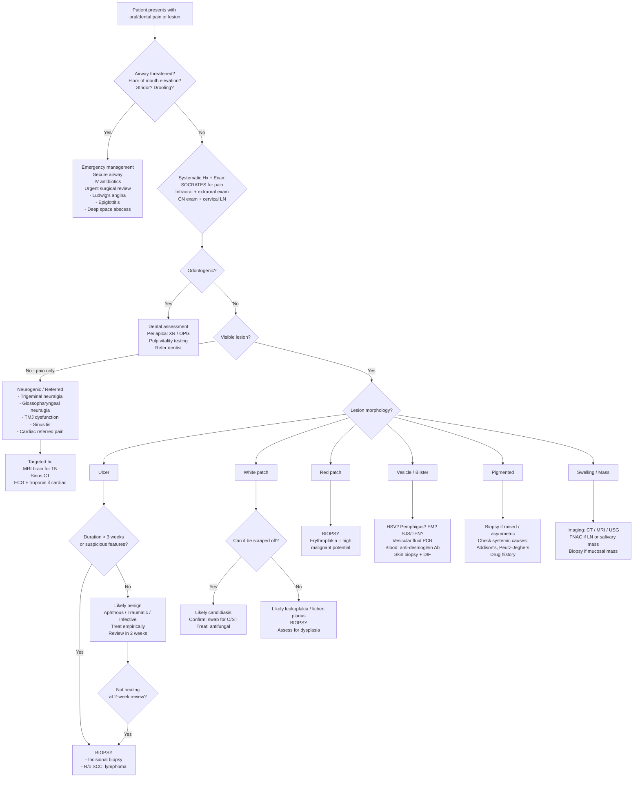

## Diagnostic Criteria, Diagnostic Algorithm, and Investigations for Oral/Dental Pain and Lesions

Unlike a single disease with one set of diagnostic criteria (e.g., SLE or rheumatic fever), "oral/dental pain and lesions" is an umbrella presentation. The diagnostic approach is therefore **algorithmic** — you start with the clinical presentation, triage urgency, identify the morphological category, and then deploy targeted investigations. Specific diagnostic criteria exist for individual conditions within this umbrella (e.g., Behçet disease, Sjögren's syndrome, GAS pharyngitis), and these will be detailed below.

---

### 1. Overarching Diagnostic Algorithm

The algorithm below captures the clinical reasoning process from the moment a patient presents with an oral complaint. Think of it as how a senior doctor on a ward round would approach this.

<Callout title="The 3-Week Rule" type="error">
Any oral ulcer persisting for more than 3 weeks must be biopsied to exclude malignancy. This is the single most important principle in the diagnostic approach to oral lesions. Missing an early SCC because it was labelled "aphthous" is a disastrous and entirely preventable error.
</Callout>

---

### 2. Specific Diagnostic Criteria for Key Conditions

#### 2.1 Group A Streptococcal (GAS) Pharyngitis — Centor / Modified Centor Criteria

When a patient presents with sore throat, the key diagnostic question is: **Is this GAS pharyngitis (which needs antibiotics to prevent rheumatic fever) or viral (which does not)?**

***Centor criteria*** [18]:

| Criterion | Points |
|---|---|
| ***History of fever*** | ***1*** |
| ***Tonsillar exudates*** | ***1*** |
| ***Tender anterior cervical adenopathy*** | ***1*** |
| ***Absence of cough*** | ***1*** |

***Modified Centor (McIsaac) criteria*** add [18]:
- ***Age < 15 y → add 1 point***
- ***Age > 44 y → subtract 1 point***

***Interpretation*** [18]:

| Score | Risk of Strep | Action |
|---|---|---|
| ***-1 to 1*** | ***< 10%*** | ***No antibiotics or throat culture necessary*** |
| ***2 to 3*** | ***15–32%*** | ***Antibiotics if throat culture positive*** |
| ***4 to 5*** | ***~56%*** | ***Treat empirically with an antibiotic*** |

**Why these criteria work from first principles**: GAS pharyngitis is a *bacterial* infection, so it tends to produce **exudative** tonsillitis (pus), **fever** (systemic inflammatory response), and **lymphadenopathy** (regional immune activation). It does NOT typically cause **cough** (which is more characteristic of viral upper respiratory tract infection affecting the lower airway mucosa). The criteria effectively separate the bacterial phenotype from the viral phenotype.

***Key investigations for sore throat*** [14]:
- ***Throat swab*** (for rapid antigen detection test or culture)
- ***FBE (full blood examination)*** — look for ***anaemic pallor of leukaemia*** [14], neutropenia (agranulocytosis), atypical lymphocytes (EBV)
- ***Mononucleosis test*** (heterophile antibody / Monospot) — for EBV infectious mononucleosis
- ***Blood sugar*** — diabetes predisposes to oral infections
- ***Biopsy of suspicious lesions*** [14]

***Diagnostic tips from Murtagh*** [14]:
- ***Tonsillitis with a covering membrane may be caused by Epstein-Barr mononucleosis***
- ***Admit if any suspicion of epiglottitis — and do not examine the throat***
- ***The triad: hoarseness + pain on swallowing + referred ear pain → pharyngeal cancer***

#### 2.2 Acute Rhinosinusitis — Clinical Diagnostic Criteria

***Diagnosis is predominantly clinical (AFP 2016)*** [17]:
- ***Criteria: sudden onset of ≥ 2 of (with ≥ 1 nasal symptom):***
  - ***Nasal blockage/congestion or nasal discharge*** PLUS
  - ***Facial pain/pressure and/or decreased or loss of smell***

***Criteria for bacterial rhinosinusitis: ≥ 3 of*** [17]:
- ***Double sickening*** (initial improvement then deterioration)
- ***Discoloured, purulent nasal discharge***
- ***Severe, localised pain***
- ***Fever > 38°C or elevated ESR/CRP***

***Imaging: NOT indicated if uncomplicated*** [17]:
- ***Sinus XR: poor sensitivity and specificity → NOT recommended*** [17]
- ***Sinus CT: reserved for cases where complications are suspected*** [17]

This matters for the oral/dental differential because maxillary sinusitis commonly mimics or refers pain to the upper teeth. Understanding that sinusitis is a **clinical** diagnosis prevents unnecessary imaging in straightforward cases.

#### 2.3 Behçet Disease — ISG Criteria (1990)

***Recurrent oral ulceration*** (observed by physician or patient, recurring ≥ 3 times in 12 months) PLUS ≥ 2 of [8]:
1. Recurrent genital ulceration
2. Eye lesions (anterior/posterior uveitis, cells in vitreous on slit lamp, retinal vasculitis)
3. Skin lesions (erythema nodosum, pseudofolliculitis, papulopustular lesions, acneiform nodules)
4. ***Positive pathergy test***

***Pathergy test*** [8]:
- ***Procedure: skin prick with 20G needle***
- ***Positive if pustule-like lesion/papules after 48 hours***
- ***Performance: sensitivity 50–75% in endemic regions, 10–20% in the West***

Why pathergy works: In Behçet disease, the innate immune system is hyper-reactive. Even minor trauma (a needle prick) triggers an exaggerated neutrophilic response → papule/pustule formation at the site. This does not happen in normal individuals.

#### 2.4 Sjögren's Syndrome — ACR/EULAR Classification Criteria

When oral dryness (xerostomia) is a prominent feature, Sjögren's syndrome enters the differential. The ACR/EULAR 2016 criteria are used [19]:

**Inclusion criteria**: Any of: ≥ 1 symptom of ocular or oral dryness, glandular enlargement, characteristic extraglandular involvement [19].

**Exclusion criteria (must be absent)**: ***History of head and neck radiotherapy, active HCV infection/AIDS, active sarcoidosis/amyloidosis/GvHD/IgG4 disease*** [19].

***ACR/EULAR Classification Criteria (diagnostic = ≥ 4 points)*** [19]:

| Criterion | Points |
|---|---|
| ***Labial salivary gland biopsy: focal lymphocytic sialadenitis with ≥ 1 foci/4mm²*** | ***3*** |
| ***Anti-Ro positive*** | ***3*** |
| ***Ocular staining score ≥ 5 (or van Bijsterveld score ≥ 4) in at least 1 eye*** | ***1*** |
| ***Schirmer test ≤ 5mm/5min in at least 1 eye*** | ***1*** |
| ***Unstimulated whole saliva flow rate ≤ 0.1 mL/min*** | ***1*** |

**Relevant investigations** [19]:
- ***Schirmer's test***: standard strip of filter paper placed on inside of lower eyelid → ***wetting of < 10mm in 5 min indicates defective tear production*** (< 5mm/5min for the classification criteria) [19]
- ***Labial salivary gland biopsy***: biopsy of minor salivary glands from inner lower lip → ***focal lymphocytic sialadenitis indicates Sjögren's syndrome*** [19]
- ***Autoantibodies***: ***ANA (80%), RF (> 90%), anti-Ro (60%), anti-La (40%)*** [19]

#### 2.5 Pemphigus Vulgaris — Diagnostic Approach

There are no formal "classification criteria" like SLE, but the diagnosis rests on a **triad** [7]:

1. **Clinical**: Flaccid blisters/oral erosions + positive Nikolsky sign
2. **Histopathology (skin/mucosal biopsy)**: Suprabasilar acantholysis (intraepidermal split just above the basal layer — the "tombstone" appearance of basal cells remaining attached to the basement membrane)
3. **Immunological**: Direct immunofluorescence (DIF) showing intercellular IgG and C3 deposition in a "chicken-wire" pattern; Indirect immunofluorescence (IIF) or ELISA detecting circulating anti-desmoglein 1 and/or anti-desmoglein 3 antibodies

#### 2.6 Oral Malignancy — TNM Staging (AJCC 8th Edition, 2017)

For oral cavity SCC, the TNM staging system is the standard. Key points:

**T staging (primary tumour)** — based on tumour size AND depth of invasion (DOI):

| Stage | Size | Depth of Invasion |
|---|---|---|
| T1 | ≤ 2 cm | DOI ≤ 5 mm |
| T2 | ≤ 2 cm with DOI > 5 mm, OR > 2–4 cm with DOI ≤ 10 mm | |
| T3 | > 4 cm OR DOI > 10 mm | |
| T4a | Moderate advanced local disease (invasion of cortical bone of mandible/maxilla, maxillary sinus, skin of face) | |
| T4b | Very advanced local disease (invasion of masticator space, pterygoid plates, skull base, encases internal carotid artery) | |

**Why depth of invasion was added (AJCC 8th ed)**: DOI is the single strongest predictor of regional lymph node metastasis and survival, better than surface tumour size alone. A small but deeply invasive tumour is biologically more aggressive than a large but superficial one.

**N staging (regional lymph nodes)** — now includes extranodal extension (ENE):
- ENE positive = upstaged (e.g., a single node < 3 cm with ENE becomes N2a rather than N1)

**For oropharyngeal SCC**, the AJCC 8th edition introduced a **separate staging system for HPV-positive (p16+) tumours**, which have a much better prognosis. This is why p16 immunohistochemistry / HPV testing is mandatory.

---

### 3. Investigation Modalities — Detailed Guide

#### 3.1 Bedside / Clinic Investigations

| Investigation | What It Tests | Key Findings | When to Use |
|---|---|---|---|
| **Scraping test** | Can the white patch be scraped off? | Candidiasis = yes (pseudomembrane); leukoplakia/LP = no | First step for any white oral patch |
| **Pulp vitality testing** (thermal, electric) | Whether dental pulp is alive | No response = pulp necrosis → periapical abscess likely | Suspected odontogenic pain |
| **Percussion test** (tooth tapping) | Periapical inflammation | Pain on percussion = periapical pathology | Suspected dental abscess |
| ***Nikolsky sign*** [7] | Epidermal cohesion | ***Positive = epidermis dislodged by lateral pressure → pemphigus vulgaris, SJS/TEN*** [7] | Vesiculobullous oral lesions |
| ***Pathergy test*** [8] | Innate immune hyper-reactivity | ***Pustule at needle prick site after 48h → Behçet disease*** [8] | Recurrent oral + genital ulcers |
| ***Schirmer's test*** [19] | Tear production (for Sjögren's) | ***< 10mm/5min = defective; ≤ 5mm/5min for ACR/EULAR criteria*** [19] | Oral dryness + dry eyes |

#### 3.2 Laboratory Investigations

| Investigation | What It Tests | Key Findings / Interpretation | Condition |
|---|---|---|---|
| ***FBE (full blood examination)*** [14] | Haematological parameters | ***Anaemic pallor of leukaemia*** [14]; neutropenia → agranulocytosis (drug-induced — suspect carbimazole, clozapine, chemotherapy); atypical lymphocytes → EBV; pancytopenia → leukaemia, aplastic anaemia; thrombocytopenia → mucosal bleeding | Unexplained oral ulceration, gingival bleeding, gum hypertrophy |
| **Blood film** | Morphology of cells | Blast cells → acute leukaemia; atypical lymphocytes → EBV infectious mononucleosis | Suspected haematological malignancy |
| ***Mononucleosis test (Monospot / heterophile Ab)*** [14] | EBV infectious mononucleosis | Positive = confirms EBV mono (note: may be negative in first week) | Young adult with sore throat, membrane-covered tonsils, splenomegaly |
| ***Blood sugar*** [14] | Diabetes screening | Hyperglycaemia → predisposes to candidiasis, periodontal disease, poor healing | Recurrent oral candidiasis, poor wound healing |
| **Iron studies, B12, folate** | Nutritional deficiencies | Low iron / ferritin → ***glossitis, angular stomatitis*** [1]; Low B12 / folate → ***glossitis*** [1] | Glossitis, angular stomatitis, recurrent aphthous ulcers |
| **Anti-desmoglein 1 and 3 antibodies (ELISA)** | Pemphigus | ***Anti-DSG3 positive → mucosal pemphigus vulgaris; Anti-DSG1 + DSG3 → mucocutaneous PV*** [7] | Suspected pemphigus |
| **Syphilis serology (RPR/VDRL + TPHA/FTA-Abs)** | *Treponema pallidum* | Positive screening + confirmatory → primary (chancre), secondary (mucous patches), tertiary syphilis | Painless oral ulcer, mucous patches |
| **HIV serology** | HIV infection | Positive → oral candidiasis, hairy leukoplakia, Kaposi sarcoma, severe aphthous ulcers all become more likely | Unexplained oral candidiasis in young adult, oral hairy leukoplakia |
| ***EBV VCA IgA*** [4] | NPC screening | ***Elevated in NPC*** → supports diagnosis in right clinical context; used for screening in endemic areas (HK) | Suspected NPC; cervical lymphadenopathy of unknown primary |
| **Plasma EBV DNA** (quantitative PCR) | NPC diagnosis and monitoring | Elevated = suggestive of NPC (high sensitivity and specificity in endemic populations); used for screening, diagnosis, treatment monitoring, and surveillance for recurrence | NPC screening (HK programme), staging, post-treatment monitoring |
| ***ESR, CRP*** | Systemic inflammation | ***↑ESR (> 50mm/h) + age ≥ 50 → consider giant cell arteritis*** [20]; elevated in any inflammatory/infective process | Temporal/facial pain in elderly; systemic features with oral ulceration |
| ***Autoantibodies: ANA, RF, anti-Ro, anti-La*** [19] | Autoimmune disease | ***ANA (80%), RF (> 90%), anti-Ro (60%), anti-La (40%) in Sjögren's*** [19] | Oral and ocular dryness (sicca symptoms) |
| ***HLA-B*15:02*** [10] | Pharmacogenomics | ***Prevalence 13% in HK Chinese; mandatory check before prescribing carbamazepine*** [10] → prevents SJS/TEN | Before prescribing carbamazepine or other aromatic AEDs |
| ***HLA-B*58:01*** [10] | Pharmacogenomics | ***Prevalence 7.4% in HK Chinese; associated with allopurinol-related SJS/TEN*** [10] → switch to febuxostat if positive | Before prescribing allopurinol (recommended but not mandatory) |
| ***Throat swab*** [14] | Identify pharyngeal pathogen | Rapid antigen detection test (RADT) for GAS (high specificity, moderate sensitivity); culture = gold standard | Sore throat with high Centor score |
| ***HSV PCR (from vesicular fluid)*** [5] | HSV DNA | Positive PCR confirms HSV-1 or HSV-2 infection | Vesicular oral lesions; ***note: serology is of limited value as a substantial proportion of the population is seropositive*** [5] |

#### 3.3 Histopathological Investigations (Biopsy)

Biopsy is the definitive diagnostic step for many oral lesions. The type of biopsy matters:

| Biopsy Type | Technique | When to Use |
|---|---|---|
| **Incisional biopsy** | Remove a representative portion of the lesion (including the margin with normal tissue) | ***Incisional biopsy should be performed in all cases*** of suspected oropharyngeal malignancy [3]; large lesions where excision would be mutilating; suspected leukoplakia/erythroplakia |
| **Excisional biopsy** | Remove the entire lesion | Small lesions (< 1 cm) that can be completely excised without significant morbidity; suspicious small mucosal lesions |
| **Punch biopsy** | Circular blade to obtain full-thickness skin/mucosa sample | Vesiculobullous lesions (need perilesional skin for DIF); lichen planus |

**Key histopathological findings**:

| Condition | Histopathology | Why This Pattern? |
|---|---|---|
| **Leukoplakia** | Hyperkeratosis ± epithelial dysplasia (mild/moderate/severe) | Chronic irritation → increased keratin production; dysplasia = disordered maturation indicating premalignant change |
| **Erythroplakia** | Usually severe dysplasia, carcinoma in situ, or invasive SCC | Thin atrophic epithelium without protective keratinisation; the redness IS the warning sign |
| **Lichen planus** | Band-like lymphocytic infiltrate at dermoepidermal junction; saw-tooth rete ridges; civatte bodies (apoptotic keratinocytes) | T-cell attack on basal keratinocytes → interface dermatitis |
| **SCC** | Islands/nests of malignant squamous epithelium invading stroma; keratin pearls (well-differentiated); intercellular bridges | Malignant keratinocyte proliferation breaking through basement membrane |
| ***Pemphigus vulgaris*** [7] | ***Suprabasilar acantholysis → intraepidermal blister; "tombstone" pattern of basal cells; DIF: intercellular IgG + C3 ("chicken-wire" pattern)*** | ***Autoantibodies to desmoglein-3 disrupt intercellular adhesion just above the basal layer*** [7] |
| **Bullous pemphigoid** | Subepidermal blister with eosinophilic infiltrate; DIF: linear IgG and C3 along basement membrane zone | Autoantibodies to BP180/BP230 at hemidesmosomes → complement-mediated damage to basement membrane zone |
| ***Minor salivary gland biopsy (Sjögren's)*** [19] | ***Focal lymphocytic sialadenitis with ≥ 1 foci/4mm² → indicates Sjögren's syndrome*** [19] | Autoimmune T-cell infiltration → destruction of salivary gland acini |

<Callout title="DIF vs IIF — What's the Difference?">
**Direct immunofluorescence (DIF)** is performed on a **tissue biopsy** — it detects antibodies/complement already deposited in the tissue. **Indirect immunofluorescence (IIF)** is performed on **patient serum** — it detects circulating antibodies. For pemphigus, DIF shows the "chicken-wire" pattern of intercellular IgG; IIF detects circulating anti-desmoglein antibodies. **Always take the DIF biopsy from perilesional, clinically normal-appearing mucosa/skin** (not from the ulcer itself, which may be necrotic and give a false negative).
</Callout>

#### 3.4 Imaging Investigations

| Modality | Indication | Key Findings | Interpretation |
|---|---|---|---|
| **Periapical X-ray** | Dental pain; suspected periapical abscess | Radiolucency at tooth apex = periapical abscess/granuloma; loss of lamina dura = periodontal disease | Standard first-line dental investigation |
| **Orthopantomogram (OPG / panoramic XR)** | Overview of all teeth, mandible, TMJ; suspected dental pathology, mandibular lesions | ***Detects gross cortical invasion*** [3]; impacted wisdom teeth; jaw cysts; mandibular fractures | Screening for dental causes of pain; assessment of bony mandible in alveolar/gingival SCC |
| ***CT scan*** [3] | Suspected bony invasion; staging of H&N cancer; deep space neck infections; sinusitis complications | ***Useful to detect bony invasion*** [3]; ***detection of cervical lymph node metastasis*** [3]; ***CT thorax and abdomen to assess for distant metastasis*** [3]; air-fluid levels in sinuses [17] | ***CT is the best modality for demonstrating subtle cortical invasion*** [3] (e.g., alveolar SCC invading mandible). CT with contrast also excellent for defining abscess collections (rim-enhancing fluid collection) |
| ***MRI scan*** [3] | Soft tissue assessment of oral/oropharyngeal tumours; mandibular marrow invasion; perineural spread | ***Imaging modality of choice for cancer of the oral cavity and oropharynx*** [3]; ***provides optimal visualization of soft-tissue infiltration of the tumour*** [3]; ***detection of cervical lymph node metastasis*** [3] | ***MRI is the best modality for demonstrating invasion of medullary cavity of mandible*** [3] — because MRI has superior soft tissue contrast and can detect marrow replacement by tumour (loss of normal fatty marrow signal on T1) |
| **MRI brain (with contrast)** | Trigeminal neuralgia (to identify neurovascular compression or secondary causes) | Normal (idiopathic TN — neurovascular compression may be seen on high-resolution MRI); structural lesion (tumour, MS plaque, aneurysm) | Exclude secondary causes of trigeminal neuralgia; FIESTA/CISS sequences can show vascular loop compressing trigeminal nerve root |
| ***USG-guided FNAC*** [3] | ***Deeply seated cervical lymph node*** [3]; salivary gland mass | ***USG has limited use in oropharyngeal cancer but is a useful adjunct for FNAC to ensure accurate aspiration of a deeply seated lymph node swelling*** [3] | Cell aspirate for cytology → differentiate reactive vs metastatic vs lymphoma |
| **Sialography** | Salivary duct obstruction / chronic sialadenitis (less used now) | Filling defect in duct = stone; sialectasis (dilated ducts) = chronic sialadenitis/Sjögren's | Largely replaced by CT/MRI sialography; still occasionally used |
| **CT sialography / MR sialography** | Salivary duct pathology; sialolithiasis | Precise stone localisation; duct strictures; gland architecture | Non-invasive alternative to conventional sialography |
| **PET-CT** | H&N cancer staging; detection of unknown primary; surveillance for recurrence | Increased FDG uptake at primary tumour and metastatic sites | Used for staging advanced H&N cancer; particularly useful for detecting unknown primary when a patient presents with cervical metastasis (CUP — carcinoma of unknown primary) |
| ***Salivary gland scintigraphy (⁹⁹ᵐTc scan)*** [19] | Salivary gland function (for Sjögren's) | ***⁹⁹ᵐTc scan for uptake at major salivary glands*** [19] — decreased uptake and excretion = hypofunction | Insensitive but objective measure of salivary function |

#### 3.5 Special Investigations

| Investigation | Indication | Rationale |
|---|---|---|
| ***Panendoscopy with biopsy*** [3] | Suspected H&N malignancy | ***Incisional biopsy should be performed in all cases; assess tumour extent and look for synchronous tumour*** [3]. ***Panendoscopy includes direct laryngoscopy, bronchoscopy and OGD*** [3] — this is based on the concept of **field cancerisation**: the entire upper aerodigestive tract mucosa is exposed to the same carcinogens (smoking/alcohol), so there is a 5–10% risk of a synchronous second primary tumour |
| **p16 immunohistochemistry** | Oropharyngeal SCC | Surrogate marker for HPV-driven tumours; p16 positive = HPV-associated → separate (better prognosis) staging system in AJCC 8th edition |
| **HPV DNA testing (ISH/PCR)** | Oropharyngeal SCC | Confirms HPV-driven tumour biology; may guide de-escalation of treatment |
| **NPC screening (EBV DNA + nasopharyngoscopy)** | HK population screening; clinical suspicion of NPC | Plasma EBV DNA as screening biomarker; positive → nasopharyngoscopy with biopsy of any suspicious nasopharyngeal lesion |
| ***Temporal artery biopsy*** [20] | Giant cell arteritis presenting with jaw claudication/facial pain | ***Must order urgently (< 24–48h)*** [20]; ***may be falsely negative due to patchy inflammation ("skip lesions")*** [20] → long segment biopsy (≥ 2 cm) reduces false negatives |

---

### 4. Diagnostic Approach by Common Scenario — Practical Synthesis

#### Scenario 1: Non-healing oral ulcer > 3 weeks

1. **History**: Duration, risk factors (***5Ss: Smoking, Spirits, Sharp teeth, Sex, Spicy food*** [3]), weight loss, otalgia, dysphagia
2. **Examination**: Lesion characteristics (indurated? rolled edges? fixation?), cranial nerves (***lingual nerve, hypoglossal nerve, mental nerve*** [3]), cervical lymph nodes
3. **Investigations**:
   - **Incisional biopsy** → histopathology (SCC? lymphoma? minor salivary gland tumour?)
   - If malignant: ***MRI (imaging modality of choice for oral/oropharyngeal cancer)*** [3] + CT neck/chest/abdomen (staging) + ***panendoscopy*** [3]
   - p16/HPV testing if oropharyngeal
   - ***EBV VCA IgA / plasma EBV DNA*** if NPC suspected [4]

#### Scenario 2: Recurrent oral ulcers + genital ulcers + eye symptoms

1. **Think Behçet disease** [8]
2. **Diagnostic workup**: ISG criteria (oral ulcers ≥ 3 episodes/year + ≥ 2 of: genital ulcers, eye lesions, skin lesions, pathergy test)
3. ***Pathergy test*** [8]; ***HLA-B51*** (supportive, not diagnostic); ophthalmic review (slit lamp for uveitis)

#### Scenario 3: Dry mouth + dry eyes + bilateral parotid swelling

1. **Think Sjögren's syndrome** [19]
2. ***Schirmer's test, salivary flow rate*** [19]; ***anti-Ro/anti-La, ANA, RF*** [19]; ***labial salivary gland biopsy*** [19]
3. **Exclude**: ***Head and neck RT, HCV, AIDS, sarcoidosis, amyloidosis, IgG4 disease*** [19]

#### Scenario 4: Sore throat in a child/young adult

1. Apply ***Modified Centor criteria*** [18]
2. Low score → reassure, symptomatic treatment
3. Moderate score → throat swab (RADT ± culture)
4. High score → empirical antibiotics
5. If membrane-covered tonsils → ***consider EBV mononucleosis*** [14] → ***mononucleosis test*** [14]

***Key examination points for sore throat*** [14]:
- ***On inspection note the general appearance, look for toxicity, the anaemic pallor of leukaemia, the nasal stuffiness of infectious mononucleosis, or the halitosis of a streptococcal throat***
- ***Palpate the neck for soreness and lymphadenopathy and check the sinus area***
- ***Then inspect the oral cavity and pharynx***

***Key history for sore throat*** [14]:
- ***First determine whether the patient has a sore throat, a deep pain in the throat or neck pain***
- ***Enquire about relevant associated symptoms such as a metallic taste in the mouth, fever, upper respiratory infection, postnasal drip, sinusitis, cough and other pain such as ear pain***
- ***Note whether the patient is an asthmatic and uses a steroid inhaler or is a smoker or exposed to environmental irritants***

#### Scenario 5: Ear pain with normal otoscopy

***If an adult presents with ear pain but normal auroscopy, examine possible referral sites, namely TMJ, mouth, throat, teeth and cervical spine*** [14].

This is because the ear receives sensory innervation from CN V3 (auriculotemporal nerve), CN VII (sensory branch), CN IX (Jacobson's nerve), CN X (Arnold's nerve), and C2/C3 (great auricular nerve). Any pathology along these nerves' territories can cause referred otalgia.

---

### 5. Summary Table: Investigation Prioritisation by Presentation

| Presentation | First-Line Ix | Second-Line Ix | Definitive Ix |
|---|---|---|---|
| **Persistent oral ulcer** | Clinical exam; FBE | CT/MRI if suspicious | **Incisional biopsy** |
| **White patch** | Scraping test | Swab (if scraped off → Candida) | **Biopsy** (if cannot scrape off) |
| **Red patch** | Clinical exam | — | **Biopsy** (erythroplakia = high Ca risk) |
| **Vesiculobullous** | Nikolsky sign; vesicular fluid PCR (HSV) | Anti-DSG Ab (ELISA); drug Hx review | **Biopsy + DIF** (perilesional) |
| **Sore throat** | Modified Centor; RADT/throat swab; FBE | Monospot; blood sugar | Biopsy if suspicious lesion |
| **Salivary gland swelling** | Bimanual palpation; plain XR (OPG) | USG ± FNAC; CT/MRI | Biopsy if neoplasm suspected |
| **Neck mass / lymphadenopathy** | USG + FNAC | CT/MRI neck; PET-CT | Excisional biopsy if lymphoma suspected |
| **Jaw/facial pain (no lesion)** | Dental exam; TMJ palpation; sinus tenderness | MRI brain (TN); sinus CT | ECG/troponin if cardiac; temporal artery Bx if GCA |
| **Oral dryness** | Schirmer test; salivary flow | Anti-Ro/La, ANA, RF | Labial salivary gland biopsy |

<Callout title="High Yield Summary">

**Algorithm**: Triage airway first → Hx + systematic intraoral/extraoral exam → Odontogenic vs non-odontogenic → Morphological categorisation → Targeted investigations → Biopsy any suspicious/persistent (> 3 weeks) lesion.

**Diagnostic Criteria to Know**:
- ***Modified Centor criteria*** for GAS pharyngitis [18]: Fever + Exudates + Anterior LAD + No cough (± age adjustment). Score -1 to 1 = no Abx; 2-3 = swab first; 4-5 = empirical Abx.
- ***ISG criteria for Behçet disease*** [8]: Recurrent oral ulcers (≥ 3/yr) + ≥ 2 of genital ulcers/eye lesions/skin lesions/positive pathergy.
- ***ACR/EULAR Sjögren's*** [19]: ≥ 4 points from labial biopsy (3), anti-Ro (3), ocular staining (1), Schirmer (1), saliva flow (1).

**Imaging Hierarchy for Oral Cancer**:
- ***MRI = imaging modality of choice for oral/oropharyngeal cancer (soft tissue)*** [3].
- ***CT = best for subtle cortical bone invasion*** [3].
- ***MRI = best for medullary cavity invasion of mandible*** [3].
- ***Panendoscopy = mandatory to look for synchronous tumour (field cancerisation)*** [3].

**Must-Know Lab Tests**: FBE (leukaemia screen), Monospot (EBV), HSV PCR (from vesicular fluid, not serology), anti-desmoglein Ab (pemphigus), anti-Ro/La (Sjögren's), EBV DNA (NPC), ***HLA-B*15:02*** (before carbamazepine in HK Chinese) [10].

</Callout>

---

<ActiveRecallQuiz
  title="Active Recall - Diagnosis and Investigations for Oral/Dental Pain and Lesions"
  items={[
    {
      question: "A 20-year-old presents with sore throat, fever, exudative tonsillitis, tender anterior cervical lymphadenopathy, and no cough. Calculate the Modified Centor score and state the recommended management.",
      markscheme: "Fever (1) + exudates (1) + tender anterior LAD (1) + absence of cough (1) + age < 15 adjustment (age 20 = no points added or subtracted) = 4 points. Risk of GAS approximately 56%. Treat empirically with antibiotics (penicillin V or amoxicillin first line).",
    },
    {
      question: "For suspected oral cavity SCC, which imaging modality is the modality of choice for the primary tumour and why? Which modality is best for assessing cortical bone invasion vs medullary cavity invasion?",
      markscheme: "MRI is the imaging modality of choice for oral cavity and oropharyngeal cancer because it provides optimal visualization of soft-tissue infiltration. CT is best for demonstrating subtle cortical bone invasion. MRI is best for demonstrating invasion of the medullary cavity of the mandible because it can detect marrow signal replacement.",
    },
    {
      question: "What is a panendoscopy, what does it include, and why is it performed in all patients with primary upper aerodigestive tract cancers?",
      markscheme: "Panendoscopy includes direct laryngoscopy, bronchoscopy and OGD. It is performed to assess tumour extent, obtain incisional biopsy, and look for synchronous second primary tumours based on the concept of field cancerisation -- the entire upper aerodigestive tract mucosa is exposed to the same carcinogens, giving a 5-10% risk of synchronous second primary.",
    },
    {
      question: "In a patient with suspected pemphigus vulgaris, describe the biopsy technique for direct immunofluorescence. Where should the biopsy be taken from and why?",
      markscheme: "The DIF biopsy should be taken from perilesional, clinically normal-appearing mucosa or skin -- NOT from the ulcer/erosion itself. This is because the ulcer base may be necrotic and lack intact epithelium, giving a false negative result. DIF on perilesional tissue shows intercellular IgG and C3 deposition in a chicken-wire pattern, confirming pemphigus.",
    },
    {
      question: "List the ACR/EULAR 2016 classification criteria for primary Sjogren syndrome and their point weightings. What total score is diagnostic?",
      markscheme: "Diagnostic total score is 4 or more. Criteria: Labial salivary gland biopsy with focal lymphocytic sialadenitis and at least 1 focus per 4mm2 (3 points). Anti-Ro positive (3 points). Ocular staining score of 5 or more in at least 1 eye (1 point). Schirmer test 5mm or less per 5 minutes in at least 1 eye (1 point). Unstimulated whole saliva flow rate 0.1 mL/min or less (1 point).",
    },
  ]}
/>

## References

[1] Senior notes: Ryan Ho GI.pdf (p10) and Ryan Ho Fundamentals.pdf (p62) — Oral examination findings, leukoplakia, glossitis, aphthous ulcers, angular stomatitis
[3] Senior notes: felixlai.md (sections 351, 354, 355, 370, 371) — Oral/oropharyngeal cancer diagnosis: incisional biopsy, panendoscopy, CT, MRI, USG-guided FNAC, imaging modality of choice, field cancerisation
[4] Senior notes: felixlai.md (section 357) — NPC: EBV VCA IgA
[5] Senior notes: Ryan Ho Rheumatology.pdf (p137) — HSV: PCR from vesicular fluid, serology limitation
[7] Senior notes: Ryan Ho Rheumatology.pdf (p152) — Pemphigus vulgaris: Nikolsky sign, histopathology, DIF
[8] Senior notes: Ryan Ho Rheumatology.pdf (p98) — Behçet disease: ISG criteria, pathergy test
[10] Senior notes: Ryan Ho Rheumatology.pdf (p149) and Ryan Ho Opthalmology.pdf (p133) — SJS/TEN: HLA-B*15:02, HLA-B*58:01 pharmacogenomics
[14] Lecture slides: murtagh merge.pdf (p44, p90, p92) — Murtagh's sore throat and ear pain: key history, key examination, key investigations, diagnostic tips
[17] Senior notes: Ryan Ho Respiratory.pdf (p54) — Rhinosinusitis diagnostic criteria (AFP 2016), imaging indications
[18] Senior notes: Ryan Ho Respiratory.pdf (p51) — Centor and Modified Centor criteria for GAS pharyngitis
[19] Senior notes: Ryan Ho Rheumatology.pdf (p89) — Sjögren's syndrome: ACR/EULAR criteria, Schirmer test, labial biopsy, autoantibodies
[20] Senior notes: Ryan Ho Neurology.pdf (p65) — Giant cell arteritis: diagnostic criteria, temporal artery biopsy
