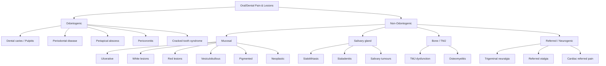

# Oral/Dental Pain and Lesions

## 1. Definition and Scope

Oral and dental pain/lesions is an umbrella term encompassing any pathological process that produces pain, discomfort, or visible mucosal/structural change within the oral cavity — including the teeth, gingivae (gums), tongue, floor of mouth, hard and soft palate, buccal mucosa, lips, and the alveolar ridges. The term bridges dental (odontogenic) causes and non-dental (non-odontogenic) causes, ranging from the mundane aphthous ulcer to life-threatening oral squamous cell carcinoma (SCC).

Breaking down the key terminology:
- **Odontogenic** = "odonto" (Greek: tooth) + "genic" (origin) → pain arising from the teeth or their supporting structures
- **Stomatitis** = "stoma" (Greek: mouth) + "itis" (inflammation) → inflammation of the oral mucosa
- **Glossitis** = "glossa" (Greek: tongue) + "itis" → inflammation of the tongue
- **Gingivitis** = "gingiva" (Latin: gum) + "itis" → inflammation of the gums
- **Cheilitis** = "cheilos" (Greek: lip) + "itis" → inflammation of the lip

This topic matters because the mouth is the gateway to the GI and respiratory tracts, and oral lesions can be the first presentation of systemic diseases (e.g., Behçet disease, Crohn's disease, haematological malignancies, HIV, nutritional deficiencies, autoimmune blistering diseases). A systematic approach prevents you from dismissing a "mouth ulcer" that is actually an SCC or pemphigus vulgaris.

---

## 2. Epidemiology and Risk Factors

### 2.1 Epidemiology

| Condition | Prevalence / Incidence | Key Demographics |
|---|---|---|
| ***Aphthous ulcers*** | 20–25% of general population; most common oral ulcer [1][2] | Young adults, slight female preponderance |
| ***Dental caries*** | Global: ~2.3 billion people affected; most prevalent chronic disease worldwide | All ages; peaks in childhood and elderly |
| Periodontal disease | ~50% of adults > 30 y have some form | Increases with age; smoking is the strongest modifiable risk factor |
| ***Oral SCC*** | HK: ~600 new cases/year; 5S risk factors endemic in Southern China [3] | Male > Female; peaks > 50 y |
| ***Nasopharyngeal carcinoma (NPC)*** | ***Endemic in Southern China including Hong Kong***; 10th most common cancer overall, ***6th in males*** [4] | ***Male predominance (M:F = 2–3:1)*** |
| ***Oral candidiasis*** | Common in immunocompromised, neonates, denture wearers | HIV, diabetes, steroid inhaler users |
| ***Herpes simplex (HSV-1)*** | ***Seroprevalence 30–100%*** [5] | Primary infection often in childhood |
| ***Lichen planus*** | ***Prevalence < 1%***, most commonly 30–60 y [6] | No sex predilection |
| ***Pemphigus vulgaris*** | ***Rare, incidence 0.1–0.5/100k/y*** [7] | 40–60 y, highest in Ashkenazi Jews, Indians, SE Asians |
| ***Behçet disease*** | ***Prevalence 13.5–35/100k along ancient Silk Road (Turkey, Middle East, China)*** [8] | ***Peaks 20–40 y, M:F ≈ 1:1, strongly associated with HLA-B51*** |

### 2.2 Risk Factors (General Framework)

Think of risk factors in categories:

**Local / Dental:**
- Poor oral hygiene → plaque → calculus → gingivitis → periodontitis
- Ill-fitting dentures → chronic trauma → leukoplakia → malignant transformation
- Sharp/broken teeth → chronic ulceration → field cancerisation

**Lifestyle / Behavioural:**
- ***Smoking*** — single most important modifiable risk factor for periodontal disease and oral cancer
- ***Alcohol ("Spirits")*** — synergistic with smoking for HNSCC [3]
- ***Betel nut (areca nut) chewing*** — extremely relevant in Hong Kong and Southern China; causes oral submucous fibrosis (a premalignant condition) [3]
- ***Spicy food*** — chronic mucosal irritation

**Infectious:**
- ***HPV 16/18*** — drives oropharyngeal SCC (tonsils, base of tongue) via E6/E7 oncoproteins inactivating p53 and Rb [3]
- ***EBV*** — primary aetiological agent for NPC; also linked to oral hairy leukoplakia in HIV [4]
- ***HSV-1*** — herpes labialis and herpetic gingivostomatitis [5]
- ***Candida albicans*** — thrush in immunocompromised
- ***Treponema pallidum*** — syphilitic chancre, mucous patches, gumma

**Nutritional:**
- Iron deficiency → angular stomatitis, glossitis, Plummer-Vinson syndrome
- Vitamin B12 / folate deficiency → glossitis, aphthous-like ulcers
- Vitamin B6 deficiency → angular stomatitis
- ***Vitamin C deficiency (scurvy)*** → ***spongy, red, swollen and irregular gums that bleed easily*** [1]

**Immune / Systemic:**
- HIV/AIDS → oral candidiasis, oral hairy leukoplakia, Kaposi sarcoma, aphthous-like ulcers
- Autoimmune → Behçet disease, pemphigus vulgaris, bullous pemphigoid, SLE, lichen planus
- Immunosuppressive drugs → opportunistic infections, drug-induced mucositis

**Drug-related:**
- ***Phenytoin, phenobarbital, cyclosporine*** → ***gum hypertrophy*** [1]
- ***Anticholinergics*** → ***decreased salivary flow*** → xerostomia → ↑ risk of caries, candidiasis, and sialolithiasis [9]
- Methotrexate, chemotherapy → mucositis
- ***Allopurinol, aromatic AEDs, sulphonamides*** → ***SJS/TEN*** with severe oral erosions [10]

**Genetic / Familial:**
- ***HLA-B51*** → Behçet disease [8]
- ***HLA-B*15:02*** → carbamazepine-related SJS/TEN (***prevalence 13% in HK Chinese → mandatory to check before prescription***) [10]
- ***HLA-B*58:01*** → allopurinol-related SJS/TEN (***prevalence 7.4% in HK Chinese***) [10]

<Callout title="The 5Ss of Oral Cancer Risk Factors" type="idea">
***Smoking + Spirits + Sharp teeth + Sex (male / oral sex → HPV) + Spicy food*** [3]. This mnemonic is high yield — it captures the major modifiable risk factors for HNSCC.
</Callout>

---

## 3. Anatomy and Function of the Oral Cavity

Understanding oral anatomy is essential for localising pathology and understanding spread patterns.

### 3.1 Boundaries and Divisions

The oral cavity extends from the **vermilion border of the lips** anteriorly to the **junction of hard and soft palate** superiorly and the **circumvallate papillae of the tongue** inferiorly/posteriorly. Beyond this is the **oropharynx**.

***Components of the oral cavity*** [3]:
- **Lips** (vermilion border)
- **Buccal mucosa** — inner lining of cheeks, from the commissure of the lips to the pterygomandibular raphe
- **Upper and lower alveolar ridges (gingivae)**
- **Hard palate** — bony roof of mouth (maxilla + palatine bones)
- **Floor of mouth** — horseshoe-shaped area beneath the tongue
- **Oral tongue** — anterior two-thirds (mobile tongue), from tip to circumvallate papillae
- **Retromolar trigone** — mucosa overlying the ascending ramus of the mandible posterior to the last molar

***The oropharynx*** lies posterior:
- ***Extends vertically from soft palate to superior surface of hyoid bone (floor of vallecula)*** [3]
- ***Components: Tonsillar region / Base of tongue / Soft palate / Posterolateral pharyngeal wall*** [3]

### 3.2 Salivary Glands

Three major paired salivary glands drain into the oral cavity:

| Gland | Duct Name | Duct Opening | Saliva Type | Stone Frequency |
|---|---|---|---|---|
| **Parotid** | ***Stensen's duct*** | Buccal mucosa opposite upper 2nd molar (***parotid papilla***) [9] | Serous (watery) | 6–20% of sialolithiasis |
| **Submandibular** | ***Wharton's duct*** | ***Sublingual caruncle*** on floor of mouth [9] | Mixed (serous + mucous) | ***Most common*** (~80%) |
| **Sublingual** | Rivinus ducts (multiple) | Floor of mouth | Mucous | Rare |

Why does the ***submandibular gland*** get stones most frequently? [9]:
1. ***Wharton's duct is long and large*** — more surface area for calcium deposition
2. ***Flow of saliva is slow and against gravity*** — the duct courses superiorly from the gland to the floor of mouth
3. ***Saliva is more alkaline with a high mucin and Ca²⁺ content*** — favours crystallisation

There are also ~600–1000 **minor salivary glands** scattered throughout the oral mucosa (palate, buccal mucosa, tongue, lips). These are clinically important because minor salivary gland tumours (e.g., adenoid cystic carcinoma, mucoepidermoid carcinoma) can present as submucosal masses in the palate or tongue base [3].

### 3.3 Nerve Supply (Clinically Relevant)

| Nerve | Function | Clinical Relevance |
|---|---|---|
| **Trigeminal (V)** — V2 (maxillary) and V3 (mandibular) | Sensory to oral cavity; V3 also motor to muscles of mastication | Dental pain referred along V2/V3 dermatomes; invasion by tumour → paraesthesia/numbness |
| ***Lingual nerve*** (branch of V3) | Sensory (general) to anterior 2/3 tongue | ***Invasion causes ipsilateral paraesthesia of tongue*** [3] |
| ***Hypoglossal nerve (XII)*** | Motor to intrinsic and extrinsic tongue muscles (except palatoglossus) | ***Invasion causes tongue deviation (towards the side of lesion), fasciculation and atrophy*** [3] |
| **Facial nerve (VII)** — chorda tympani | Taste to anterior 2/3 tongue; parasympathetic to submandibular and sublingual glands | Parotid surgery risks facial nerve branches |
| **Glossopharyngeal (IX)** | Sensory (general + taste) to posterior 1/3 tongue; motor to stylopharyngeus | Tonsillar/oropharyngeal pathology; referred otalgia |
| ***Mental nerve*** (terminal branch of inferior alveolar nerve, from V3) | Sensory to chin and lower lip | ***Paraesthesia in area adjacent to lip lesion indicates mental nerve involvement*** [3] |

### 3.4 Lymphatic Drainage

This matters enormously for cancer staging:
- **Lip, anterior floor of mouth, anterior tongue tip** → Level I (submental, submandibular nodes)
- **Lateral oral tongue, buccal mucosa** → Levels I–III (submandibular, upper/mid jugular)
- **Base of tongue, tonsils, soft palate (oropharynx)** → Levels II–IV (jugulodigastric → mid/lower jugular) — often bilateral
- ***NPC*** → retropharyngeal and upper cervical nodes; ***commonly bilateral*** [4]

---

## 4. Aetiology and Pathophysiology

This section organises the causes of oral/dental pain and lesions by category, with the pathophysiology explained from first principles.

### 4.1 Odontogenic (Tooth-Related) Causes

#### 4.1.1 Dental Caries

- **Pathophysiology**: Oral bacteria (esp. *Streptococcus mutans*) metabolise dietary sugars → produce lactic acid → demineralisation of tooth enamel → cavity formation. If untreated, progresses through dentine → pulp (pulpitis) → periapical abscess → cellulitis / osteomyelitis
- **Pain mechanism**: Enamel is anodontic (no nerves). Pain begins when dentine is exposed (dentinal tubules transmit stimuli to pulp) or when pulp is inflamed (pulpitis). Reversible pulpitis = sharp, brief pain with stimuli; irreversible pulpitis = spontaneous, throbbing, prolonged pain (the pulp tissue is dying)
- **Risk factors**: High sugar diet, poor oral hygiene, dry mouth (xerostomia — from Sjögren's, drugs, radiotherapy), enamel defects

#### 4.1.2 Periodontal Disease

- **Gingivitis** → **Periodontitis** is a continuum
- Plaque/biofilm accumulation → bacterial products trigger local immune response → inflammatory cell infiltration of gingiva → destruction of periodontal ligament and alveolar bone → tooth loosening and loss
- ***Gum hypertrophy causes*** [1]:
  - ***Gingivitis*** (smoking, calculus, plaque, ***Vincent's angina***)
  - ***Drugs: phenytoin, phenobarbital, cyclosporine*** — these stimulate gingival fibroblast proliferation via different mechanisms (e.g., phenytoin inhibits collagenase → excess collagen deposition)
  - ***Scurvy*** — vitamin C is essential for collagen synthesis; deficiency → defective collagen in gingival connective tissue → ***spongy, red, swollen and irregular gums that bleed easily*** [1]
  - ***Leukaemia (usually monocytic)*** — leukaemic cell infiltration of the gingiva
  - ***Pregnancy*** — hormonal (progesterone) influence on gingival vascularity and inflammatory response

#### 4.1.3 Periapical Abscess and Dental Infections

- Pulpitis → necrosis of dental pulp → bacteria enter periapical tissue → abscess
- Can spread along fascial planes → Ludwig's angina (bilateral sublingual + submandibular space infection → floor of mouth elevation → airway compromise — a surgical emergency)
- Can also spread to the parotid space, parapharyngeal space, or mediastinum

#### 4.1.4 Pericoronitis

- Inflammation of the soft tissue (operculum) overlying a partially erupted tooth, classically the lower third molar (wisdom tooth)
- Food and bacteria become trapped under the operculum → acute infection
- Very common in young adults (18–25 y)

### 4.2 Mucosal Lesions — Ulcerative

#### 4.2.1 Aphthous Ulcers (Recurrent Aphthous Stomatitis)

***Aphthous ulcers are the most common cause of oral ulceration*** [1].

- **Types**:
  - **Minor** (80%): < 1 cm, shallow, on non-keratinised mucosa (buccal, labial, floor of mouth), heal in 7–14 days without scarring
  - **Major** (Sutton's disease) (10%): > 1 cm, deeper, can affect keratinised mucosa, heal over weeks to months, may scar
  - **Herpetiform** (10%): clusters of tiny (1–3 mm) ulcers, can coalesce, resemble herpes but are NOT caused by HSV

- **Pathophysiology**: Exact aetiology unknown. Likely multifactorial — genetic susceptibility + environmental triggers (stress, trauma, hormonal changes, food hypersensitivity) → T-cell mediated mucosal damage → localised epithelial destruction → ulcer formation
- ***Usually does NOT indicate serious underlying disease*** [1]
- ***May occur in Crohn's disease or coeliac disease*** [1] — always consider systemic associations if severe, recurrent, or atypical

<Callout title="Causes of Oral Ulcers" type="idea">
***Common: Aphthous ulcer, Trauma, Drugs (e.g., steroids), CA oral cavity*** [1]. Less common: Infections (HSV, syphilis, TB), Behçet disease, inflammatory bowel disease, SLE, pemphigus, SJS/TEN, neutropenia, lichen planus.
</Callout>

#### 4.2.2 Traumatic Ulcers

- Most common cause after aphthous ulcers
- From sharp/broken teeth, ill-fitting dentures, cheek biting, hot food burns
- Key concern: chronic traumatic ulcer that doesn't heal → must exclude malignancy (biopsy any ulcer persisting > 3 weeks)

#### 4.2.3 Infective Ulcers

**Viral:**

- ***Herpes simplex virus (HSV-1)*** [5]:
  - ***Primary infection: majority asymptomatic (except in elderly)*** — when symptomatic, presents as **primary herpetic gingivostomatitis**: fever, malaise, painful vesicles on gingivae and oral mucosa that rupture to form shallow ulcers. Very painful, especially in children
  - ***Recurrent infection: associated with medical illness, menstruation, trauma, immunocompromised states, stress*** → ***herpes labialis***: prodromal hyperaesthesia followed by rapid vesiculation, pustulation and crusting of the oral mucosa and perioral skin*** [5]
  - **Pathophysiology**: HSV-1 establishes ***latent infection in the trigeminal ganglion***. Reactivation → virus travels down sensory nerves → vesicular eruption at mucocutaneous junction
  - ***Diagnosis: vesicular fluid for PCR for HSV DNA*** (serology is of limited value as a substantial proportion of the population is seropositive) [5]
  - ***Treatment: Acyclovir initiated ≤48h of clinical disease or if severe*** [5]

- **Varicella-zoster virus (VZV)**: Reactivation in V2/V3 → intraoral vesicles/ulcers along the nerve distribution, with unilateral dermatomal pain

- **Coxsackievirus**: Hand-foot-and-mouth disease (vesicles on oral mucosa, palms, soles) — common in HK children; herpangina (vesicles on soft palate and tonsillar pillars)

**Bacterial:**
- **Syphilis**: Primary chancre (painless ulcer with indurated margin) on lip or tongue; secondary mucous patches; tertiary gumma
- ***Vincent's angina*** (acute necrotising ulcerative gingivitis / ANUG) — fusospirochetal infection (Fusobacterium + Borrelia vincentii). Presents with painful, bleeding gums with necrotic interdental papillae, foul breath. Associated with poor hygiene, smoking, stress, immunosuppression

**Fungal:**
- ***Oral candidiasis*** (Candida albicans):
  - **Pseudomembranous** (thrush): white plaques that CAN be scraped off, revealing erythematous base
  - **Erythematous** (atrophic): red, painful mucosa (common under dentures or with inhaled steroids)
  - **Chronic hyperplastic** (candidal leukoplakia): white plaques that CANNOT be scraped off → premalignant
  - **Angular cheilitis**: cracking at the corners of the mouth — can be due to Candida ± Staphylococcus, often in the context of denture wearing, iron/B-vitamin deficiency, or drooling
  - **Pathophysiology**: Candida is a commensal organism. Overgrowth occurs when local or systemic defences are breached (xerostomia, antibiotics, immunosuppression, diabetes)

#### 4.2.4 Behçet Disease Oral Ulcers

***Behçet disease is a systemic vasculitis of unknown aetiology*** [8].

- ***Oral ulcers occur in almost all patients***: ***deep, multiple, painful ulcers with well-defined borders and necrotic base*** [8]
- ***Course: generally heals spontaneously within 1–3 weeks, but usually recurrent*** [8]
- ***Urogenital ulcers (75%): most specific lesion for Behçet syndrome*** [8]
- ***Strongly associated with HLA-B51 in Asians with familial clustering*** [8]
- Pathophysiology: dysregulated innate and adaptive immunity → vasculitis affecting vessels of all sizes → mucosal ulceration, uveitis, skin lesions, vascular thrombosis

### 4.3 Mucosal Lesions — White Patches

#### 4.3.1 Leukoplakia

***Leukoplakia: white-coloured thickening of mucosa of tongue and mouth*** [1]
- ***A premalignant condition*** [1]
- ***Causes: '5S'*** [1]:
  - ***Sore teeth (poor dental hygiene)***
  - ***Smoking***
  - ***Spirits***
  - ***Sepsis***
  - ***Syphilis***
  - ***No apparent cause***
- ***Can also be found on larynx, anus and vulva*** [1]

**Definition (WHO)**: A white patch or plaque that cannot be scraped off and cannot be characterised clinically or pathologically as any other disease. It is a **clinical term** — the diagnosis is one of exclusion (i.e., rule out candidiasis, lichen planus, etc., before labelling it leukoplakia).

- ***Leukoplakia on the floor of the mouth has a particularly high risk of malignant transformation*** [3]
- Overall malignant transformation rate: ~1–5% per year (varies by site, size, presence of dysplasia)

#### 4.3.2 Erythroplakia

***Defined as bright red plaque of oral mucosa that cannot be characterized clinically or pathologically*** [3]
- Much less common than leukoplakia but has a **much higher** malignant potential (up to 50% harbour invasive carcinoma or carcinoma in situ at biopsy)

#### 4.3.3 Speckled Leukoplakia

***Variation of leukoplakia arising on an erythematous base*** [3]
- ***Highest rate of malignant transformation*** of the oral precancerous lesions [3]

<Callout title="Premalignant Oral Lesions — Malignancy Risk Ranking">
Speckled leukoplakia > Erythroplakia > Leukoplakia (floor of mouth) > Leukoplakia (other sites). Any persistent white or red oral patch must be biopsied.
</Callout>

#### 4.3.4 Oral Lichen Planus

***Lichen planus*** [6]:
- ***Prevalence < 1% of population, most commonly 30–60 y with no sex predilection*** [6]
- ***Aetiology: unknown, postulated to be autoimmune in basis (T cell-related)*** [6]
- ***Associations: IBD, PBC, alopecia areata, MG, thymoma*** [6]
- ***Infections: especially HBV and HCV infections*** [6]
- ***Mucosal involvement (30–70%)*** [6]:
  - ***Oral (commonest): Wickham's striae on buccal mucosa/tongue, often asymptomatic, can occur alone or together with skin disease*** [6]
- Oral lichen planus is considered a **premalignant condition** with ~1% risk of malignant transformation to SCC over 5 years
- **Pathophysiology**: T-cell mediated attack on basal keratinocytes → interface dermatitis → characteristic band-like lymphocytic infiltrate at dermoepidermal junction → saw-tooth pattern of rete ridges on histology

#### 4.3.5 Oral Hairy Leukoplakia

- White, corrugated ("hairy") patches on the **lateral borders of the tongue** that CANNOT be scraped off
- Caused by **EBV** replication in epithelial cells
- Almost exclusively seen in **immunocompromised** patients (HIV — may be the first clinical sign)
- **Not** considered premalignant (unlike true leukoplakia)

#### 4.3.6 Oral Candidiasis (Thrush — White Patch Variant)

- See Section 4.2.3 above. Key differentiating feature: pseudomembranous candidiasis CAN be scraped off, whereas leukoplakia and lichen planus cannot.

### 4.4 Mucosal Lesions — Red Patches

#### 4.4.1 Glossitis

***Glossitis: smooth tongue surface ± erythema*** [1]
- ***May present with shallow ulceration in later stages*** [1]
- ***Indicates nutritional deficiencies, e.g., Fe, B9, B12*** [1]
  - ***Alcoholics (common)*** [1]
  - ***Carcinoid syndrome*** [1]
  - ***Elderly people*** [1]
- ***Mechanism: rapid turnover of tongue mucosal cells → particularly sensitive to nutritional deficiencies*** [1]

Why does iron/B12/folate deficiency cause glossitis? These nutrients are essential for DNA synthesis and cell division. The tongue epithelium has one of the highest turnover rates in the body (~every 10–14 days). When these nutrients are deficient, the rapidly dividing lingual epithelial cells cannot replicate adequately → the filiform papillae atrophy → the tongue becomes smooth, shiny, and erythematous.

#### 4.4.2 Erythroplakia (see 4.3.2)

#### 4.4.3 Median Rhomboid Glossitis

- Erythematous, smooth, rhombus-shaped area on the midline dorsal tongue, anterior to the circumvallate papillae
- Due to chronic atrophic candidiasis
- Usually asymptomatic; benign

### 4.5 Pigmented Lesions

***Pigmentation of the oral mucosa may be due to*** [1]:
- ***Lead or bismuth poisoning → blue-black line on gingival margin*** (Burton's line for lead)
- ***Haemochromatosis → blue-grey pigmentation on hard palate*** [1]
- ***Drugs (antimalarials, OC pills) → brown or black areas of pigmentation anywhere in the mouth*** [1]
- ***Melanosis in Peutz-Jegher syndrome*** [1] — perioral and buccal melanotic macules; associated with hamartomatous GI polyps
- ***Addison's disease → blotches of dark brown pigment anywhere in the mouth*** [1] — due to excess ACTH (from loss of cortisol negative feedback) cross-reacting with melanocyte-stimulating hormone (MSH) receptors
- ***Malignant melanoma → raised, painless black lesions anywhere in the mouth*** [1]
- **Amalgam tattoo** — blue-grey macule at a site of previous dental restoration (trapped amalgam particles); most common cause of localised oral pigmentation; benign

### 4.6 Vesiculobullous Lesions

#### 4.6.1 Pemphigus Vulgaris

***Pemphigus vulgaris*** [7]:
- ***Due to acantholysis induced by autoAb binding to epithelial cell surface antigens*** [7]
- ***Target antigen: desmoglein-3 for mucosal pemphigus vulgaris, desmoglein-1 (superficial) for pemphigus foliaceus, both for mucocutaneous pemphigus vulgaris*** [7]
- ***Cutaneous blisters: flaccid blisters that rupture easily ± erythematous base → painful erosions*** [7]
- ***Nikolsky sign positive: blistering can be induced by mechanical pressure*** [7]
- ***Mucosal erosion in almost all patients*** [7]:
  - ***Oral: most common site of involvement, oral pain exacerbated by chewing or swallowing → poor nutrition, weight loss*** [7]

**Why does pemphigus vulgaris cause oral lesions first?** Desmoglein-3 (the primary target in mucosal-dominant PV) is heavily expressed in the oral mucosa. Autoantibodies disrupt desmoglein-3 → loss of intercellular adhesion (acantholysis) between keratinocytes → intraepidermal blisters that are so fragile they rupture almost immediately in the mouth (due to constant mechanical trauma from chewing/speaking) → painful erosions. The oral lesions often **precede** skin involvement by weeks to months.

#### 4.6.2 Bullous Pemphigoid (Oral Involvement)

***Mucosal involvement (10–30%): most frequently oral mucosa*** [7]
- Blisters are **tense** (subepidermal split at basement membrane zone) → more intact than pemphigus
- Typically a disease of the elderly (***median age 80 y***) [7]

#### 4.6.3 Erythema Multiforme (EM)

***Erythema multiforme*** [11]:
- ***EM major: EM with severe mucosal involvement*** [11]
- ***Oral (70%): affect vermilion lip, mucosal surfaces*** [11]
- Most commonly triggered by ***HSV infection*** (EM minor) or ***Mycoplasma pneumoniae*** (in children) [11]
- ***Drug-induced EM (< 10%): sulpha drugs most common*** [11]

#### 4.6.4 Steven-Johnson Syndrome / Toxic Epidermal Necrolysis (SJS/TEN)

***SJS: systemic mucocutaneous allergic reaction*** [10]
- ***Definition: mucocutaneous bullous lesions involving < 10% TBSA*** [10]
- ***Causes: Delayed drug hypersensitivity (75%): allopurinol, aromatic AED, sulphonamides, lamotrigine, nevirapine*** [10]
- ***Mucosal lesions: painful haemorrhagic erosions involving oral, ocular, bronchial and urogenital mucosae*** [10]
- ***Ocular involvement occurs in 80% of patients*** [10]
- ***HLA-B*15:02: prevalence 13% in HK Chinese, associated with SJS/TEN related to carbamazepine → mandatory to check before prescription*** [10]

### 4.7 Macroglossia

***Macroglossia: enlargement of the tongue*** [1]
- ***Congenital conditions, e.g., Down syndrome*** [1]
- ***Endocrine diseases, e.g., acromegaly*** [1] (excess GH → soft tissue growth), ***hypothyroidism*** (mucopolysaccharide infiltration)
- ***Tumour infiltration, e.g., haemangioma, lymphangioma*** [1]
- ***Amyloidosis infiltration*** [1] — misfolded protein (amyloid) deposits in the tongue; pathognomonic for systemic amyloidosis (AL type)

### 4.8 Angular Stomatitis (Angular Cheilitis)

***Angular stomatitis: cracks at corners of mouth*** [1]
***Indicates nutritional deficiencies including B6, B9, B12, iron*** [1]

Also caused by:
- Candida ± Staphylococcus aureus infection (especially in denture wearers where overclosure of the mouth creates moist skin folds)
- Excessive drooling (e.g., in Parkinson's disease, developmental delay)

### 4.9 Salivary Gland Pathology Causing Oral Pain

#### 4.9.1 Sialolithiasis

***Sialolithiasis refers to the presence of stones or calculi in salivary glands or ducts*** [9]
- ***Sialoadenitis refers to inflammation of salivary glands commonly caused by sialolithiasis and autoimmune disease (e.g., Sjögren's syndrome)*** [9]
- ***Submandibular gland most frequently affected*** [9]
- **Clinical presentation**: colicky pain and swelling of the affected gland, characteristically **worsened by eating** (because food stimulates saliva production → the duct is obstructed → pressure builds → pain)
- ***Risk factors: dehydration, hypercalcaemia, gout, chronic periodontal disease, nephrolithiasis, anticholinergics, diuretics, smoking*** [9]

#### 4.9.2 Acute Suppurative Parotitis

***Occurs in the setting of debilitation, dehydration and poor oral hygiene, particularly among the elderly, post-operative patients*** [12]
- ***Most common organism: Staphylococcus aureus*** [12]
- ***Risk factors: salivary duct obstruction by calculi, tumour of oral cavity, post-operative patients who are dehydrated or intubated, anticholinergics*** [12]
- **Clinical presentation**: unilateral (usually) parotid swelling with tenderness, erythema over the gland, trismus, purulent saliva expressed from Stensen's duct
- **Pathophysiology**: reduced salivary flow → stasis → retrograde migration of oral bacteria up Stensen's duct → infection of gland parenchyma

### 4.10 Oral Malignancy

#### 4.10.1 Oral Squamous Cell Carcinoma (SCC)

This is the **most important "must-not-miss"** diagnosis when evaluating oral lesions.

***Epidemiology*** [3]:
- ***Male preponderance***
- ***Predominantly a disease of elderly (age > 60)***

***Risk factors (4 factors for H&N cancer = HPV + EBV + Smoking + Alcoholism)*** [3]:
- ***HPV 16/18 → oncoproteins E6 and E7 inactivate p53 and Rb*** [3]
- ***EBV → majority related to NPC*** [3]
- ***Smoking + Alcoholism → synergism is well established*** [3]
- ***5Ss: Smoking + Spirits + Sharp teeth + Sex (male/oral) + Spicy food*** [3]

***Premalignant conditions*** [3]:
- ***Erythroplakia***
- ***Leukoplakia (especially floor of mouth)***
- ***Speckled leukoplakia (highest malignant transformation rate)***
- ***Plummer-Vinson syndrome (Paterson-Brown-Kelly syndrome): triad of iron deficiency anaemia, dysphagia and cervical oesophageal web → well-established relationship with the development of oral cancer*** [3]
- Oral submucous fibrosis (from betel nut chewing)
- Lichen planus (small but real risk)

**Site-specific features** [3]:

| Subsite | Key Features |
|---|---|
| ***Lip*** | ***88–98% lower lip***; UV exposure is main RF; ***LN mets < 10% (Level I)***; paraesthesia = mental nerve involvement [3] |
| ***Tongue*** | ***Most commonly lateral and ventral surfaces***; paraesthesia = lingual nerve; ***deviation/fasciculation/atrophy = hypoglossal nerve*** [3] |
| ***Floor of mouth*** | Leukoplakia here = highest malignancy risk; invasion into sublingual/submandibular ducts |
| ***Alveolus/gingiva*** | Tight attachment to mandibular periosteum → ***early bone invasion*** [3] |
| ***Retromolar trigone*** | ***Early mandibular involvement due to lack of intervening soft tissue***; ***trismus = muscles of mastication involvement / skull base spread*** [3] |
| ***Buccal mucosa*** | ***Propensity to spread locally and metastasize to regional lymphatics (facial and submandibular nodes — Level I)*** [3] |
| ***Hard palate*** | ***SCC and minor salivary gland tumours most common***; ***periosteum acts as barrier to spread*** [3] |

#### 4.10.2 Nasopharyngeal Carcinoma (NPC) — Hong Kong Focus

***NPC is the predominant tumour type arising in the nasopharynx*** [4]
- ***Frequently originates from pharyngeal recess known as fossa of Rosenmuller*** [4]
- ***Remains asymptomatic for a long period*** → patients present with ***locally or regionally advanced disease*** [4]
- ***Tendency for early metastasis: lymph node metastases usually present at diagnosis and commonly bilateral*** [4]
- ***Common sites of distant metastasis: Bone (75%) / Liver / Lung / Distant LN*** [4]
- ***Risk factors: EBV infection (primary aetiological agent), salted fish, preserved/fermented food (high nitrosamines), family history, HLA haplotypes, CYP2A6 polymorphism, smoking, alcoholism*** [4]

<Callout title="Red Flag: Non-Healing Oral Ulcer" type="error">
Any oral ulcer that does not heal within 3 weeks must be biopsied to exclude malignancy. This is a critical exam point. Do not dismiss persistent oral lesions as "just an aphthous ulcer" — oral SCC can present as a painless or mildly painful non-healing ulcer, and early detection dramatically improves survival.
</Callout>

---

## 5. Classification of Oral/Dental Pain and Lesions

### 5.1 By Aetiology

### 5.2 By Morphology (White vs Red vs Ulcerative vs Vesiculobullous vs Pigmented)

| Category | Examples |
|---|---|
| **White patches** | Leukoplakia, lichen planus, candidiasis (pseudomembranous), oral hairy leukoplakia, white sponge naevus, SCC (early keratotic) |
| **Red patches** | Erythroplakia, glossitis, denture stomatitis, median rhomboid glossitis, erythematous candidiasis |
| **Ulcerative** | Aphthous ulcers, traumatic, infective (HSV, syphilis, TB), malignant, Behçet, drug-induced |
| **Vesiculobullous** | HSV, VZV, pemphigus vulgaris, bullous pemphigoid, EM/SJS/TEN, hand-foot-mouth disease |
| **Pigmented** | Amalgam tattoo, racial pigmentation, Addison's, Peutz-Jeghers, melanoma, drug-induced, heavy metal |
| **Swelling/mass** | Epulis, mucocoele, ranula, salivary gland tumours, fibroma, SCC, minor salivary gland tumour |

---

## 6. Clinical Features — Symptoms and Signs

### 6.1 Symptoms (What the Patient Reports)

| Symptom | Pathophysiological Basis | Think Of... |
|---|---|---|
| **Toothache** (sharp, localised) | Exposed dentinal tubules or inflamed pulp → stimulation of A-delta and C fibres in dental pulp | Caries, pulpitis, cracked tooth |
| **Throbbing pain** (spontaneous, worsens at night, with lying down) | Irreversible pulpitis → increased blood flow when supine → increased intrapulpal pressure | Irreversible pulpitis, periapical abscess |
| **Burning sensation** in mouth | Mucosal inflammation, atrophic epithelium → exposure of nerve endings | Glossitis (nutritional deficiency), erythematous candidiasis, burning mouth syndrome |
| **Pain on eating/swallowing** | Mechanical trauma to inflamed/ulcerated mucosa; salivary duct obstruction → distension | Aphthous ulcers, pemphigus, sialolithiasis |
| ***Colicky pain worsened by eating*** | Salivary stimulation → increased flow against obstructed duct → distension | Sialolithiasis |
| **Paraesthesia/numbness of lip/chin** | ***Mental nerve involvement*** by tumour or infection [3] | ***Oral SCC*** (sinister sign), osteomyelitis |
| **Paraesthesia of tongue** | ***Lingual nerve invasion*** [3] | ***Tongue SCC*** |
| ***Trismus*** (difficulty opening mouth) | ***Involvement of muscles of mastication; may indicate spread to skull base*** [3] | Peritonsillar abscess, retromolar trigone SCC, TMJ disorder, tetanus |
| **Halitosis** (bad breath) | Bacterial metabolism of food debris and necrotic tissue → volatile sulphur compounds | Periodontal disease, ANUG, dental abscess, sinusitis |
| **Dysphagia** | Oropharyngeal mucosal involvement, mass effect, or oesophageal web | Pemphigus, SCC (advanced), Plummer-Vinson |
| **Referred otalgia** | Shared sensory innervation (CN V3, IX, X) between oral cavity/oropharynx and ear | Tongue base/tonsil SCC, peritonsillar abscess, TMJ dysfunction |
| **Xerostomia** (dry mouth) | Decreased salivary production (drugs, Sjögren's, radiation) or dehydration | Sjögren's syndrome, anticholinergics, post-RT head and neck |
| **Bleeding gums** | Inflamed gingival tissue with dilated capillaries and fragile connective tissue | Gingivitis, periodontitis, scurvy, leukaemia, thrombocytopenia |

### 6.2 Signs (What the Examiner Finds)

| Sign | Description | Pathophysiological Basis | Condition |
|---|---|---|---|
| ***White patch (cannot scrape off)*** | Adherent white plaque on mucosa | Hyperkeratosis ± dysplasia of epithelium | ***Leukoplakia, lichen planus*** |
| **White patch (can scrape off)** | White pseudomembrane revealing erythematous base | Candidal hyphae + desquamated epithelial cells + fibrin | Pseudomembranous candidiasis |
| ***Wickham's striae*** | ***Fine white lacy network on buccal mucosa/tongue*** [6] | Band-like lymphocytic infiltrate at dermoepidermal junction → irregular epidermal hyperplasia | ***Oral lichen planus*** |
| ***Red plaque (erythroplakia)*** | ***Bright red, velvety plaque*** | Thin atrophic epithelium ± dysplasia/carcinoma in situ → submucosal vasculature visible | ***High malignant potential*** |
| ***Smooth, red tongue (glossitis)*** | ***Loss of filiform papillae, erythematous, ± painful*** | ***Papillary atrophy due to nutritional deficiency (Fe, B9, B12)*** [1] | ***Iron/B12/folate deficiency*** |
| ***Macroglossia*** | ***Enlarged tongue, may have teeth indentations*** | Tissue infiltration (amyloid, tumour) or soft tissue growth (acromegaly, hypothyroidism) | ***Amyloidosis, acromegaly, Down syndrome, hypothyroidism*** [1] |
| ***Gum hypertrophy*** | ***Swollen, enlarged gingivae*** | Drug-induced fibroblast proliferation; leukaemic infiltration; scurvy | ***Phenytoin, cyclosporine, leukaemia, scurvy*** [1] |
| ***Nikolsky sign positive*** | ***Blistering induced by lateral pressure on normal-appearing skin/mucosa*** | ***Acantholysis (pemphigus) or dermal-epidermal separation*** | ***Pemphigus vulgaris, SJS/TEN*** [7] |
| **Non-healing ulcer (> 3 weeks)** | Ulcer with indurated, rolled/everted edges, possible fixation to deeper structures | Malignant proliferation → tissue destruction + desmoplastic stromal reaction → firm edges | **Oral SCC** |
| ***Exophytic growth or non-healing ulcer*** | ***Raised, fungating mass or persistent ulcer on tongue/floor of mouth*** | ***Uncontrolled epithelial proliferation*** [3] | ***Oral SCC*** |
| ***Tongue deviation (towards lesion side)*** | ***Deviation + fasciculation + atrophy*** | ***Hypoglossal nerve (XII) invasion by tumour → LMN lesion → ipsilateral denervation*** [3] | ***Tongue SCC (advanced)*** |
| **Purulent discharge from Stensen's duct** | Pus expressed on bimanual palpation of parotid | Bacterial infection of parotid gland parenchyma | Suppurative parotitis |
| **Floor of mouth elevation** | Firm, tender sublingual/submandibular swelling | Bilateral submandibular and sublingual space infection → cellulitis | **Ludwig's angina** (airway emergency!) |
| ***Dendritic ulcer (on fluorescein stain)*** | ***Branching ulcer with terminal bulbs on cornea*** | ***HSV replication in corneal epithelium*** [13] | ***Herpes simplex keratitis*** (if eye involved) |
| ***Hutchinson's sign*** | ***Vesicles on the nose*** | ***Involvement of nasociliary branch of V1 → heralds ocular involvement*** [13] | ***Herpes zoster ophthalmicus*** |
| ***Oral pigmentation — dark brown blotches*** | ***Hyperpigmentation anywhere in mouth*** | ***Excess ACTH cross-reacts with MSH receptors on melanocytes*** | ***Addison's disease*** [1] |
| ***Blue-black gingival line*** | ***Line along gingival margin*** | ***Lead/bismuth sulphide deposition in gingival margin capillary bed*** | ***Lead or bismuth poisoning*** [1] |
| **Target lesions** | Round papules with dusky centre, pale ring, erythematous halo | Cytotoxic T-cell attack on keratinocytes in a zonal pattern | ***Erythema multiforme*** [11] |

<Callout title="Key Examination Points for Oral Lesions">
When examining an oral lesion, document: (1) Site (anatomical subsite), (2) Size, (3) Shape (regular/irregular borders), (4) Surface (smooth/ulcerated/keratotic/papillomatous), (5) Colour (white/red/pigmented/mixed), (6) Base (indurated/soft), (7) Margins (rolled/everted/undermined), (8) Fixation (to underlying structures), (9) Can it be scraped off? (10) Associated lymphadenopathy (cervical node examination — always check!).
</Callout>

---

## 7. Approach to History and Examination

### 7.1 Focused History Framework

1. **Pain characteristics**: SOCRATES (Site, Onset, Character, Radiation, Associated symptoms, Time course, Exacerbating/relieving factors, Severity)
   - Odontogenic pain is usually well-localised, related to thermal/sweet stimuli
   - Mucosal pain is often diffuse, burning, worsened by spicy/acidic food
   - ***Colicky, meal-related*** → sialolithiasis
   - Referred otalgia → oropharyngeal pathology
2. **Duration**: < 3 weeks = likely benign; **> 3 weeks = must exclude malignancy**
3. **Associated features**: Weight loss (malignancy, pemphigus), joint pain (Behçet, Reiter's), skin rash (lichen planus, SJS, pemphigus), genital ulcers (Behçet, syphilis), eye symptoms (Behçet — uveitis, SJS — keratitis), GI symptoms (Crohn's, coeliac)
4. **Past medical history**: HIV, diabetes, autoimmune disease, previous malignancy, organ transplant
5. **Drug history**: Anticholinergics, phenytoin, cyclosporine, methotrexate, chemotherapy, allopurinol, carbamazepine, inhalers (steroid)
6. **Social history**: ***Smoking, alcohol, betel nut chewing, sexual history (HPV risk), occupation (outdoor sun exposure)***
7. **Nutritional history**: Diet quality, vegetarian/vegan (B12 risk), alcohol intake (B-vitamin deficiency)

### 7.2 Examination Checklist

- **Extraoral**: Facial asymmetry, skin lesions, parotid/submandibular swelling, cervical lymphadenopathy (systematically examine Levels I–V), cranial nerve assessment (especially V, VII, IX, XII)
- **Intraoral** (systematic): Lips → buccal mucosa → upper and lower gingivae → hard palate → soft palate → floor of mouth → dorsal tongue → lateral tongue → ventral tongue → retromolar trigone → tonsillar pillars → posterior pharyngeal wall
- **Teeth**: Caries, missing teeth, sharp/broken teeth, prostheses, occlusion
- **Salivary glands**: Bimanual palpation of submandibular glands; milking Stensen's and Wharton's ducts to express saliva (serous vs purulent)
- **Special tests**: TMJ palpation, maximal mouth opening (normal ≥ 35 mm; < 35 mm = trismus), percussion of teeth (periapical pathology)

---

<Callout title="High Yield Summary">

**Definition**: Oral/dental pain and lesions encompass a broad spectrum from benign (aphthous ulcers, dental caries) to life-threatening (oral SCC, Ludwig's angina, SJS/TEN).

**Epidemiology (HK Focus)**: NPC is endemic in Southern China (EBV-driven); oral SCC driven by the ***5Ss (Smoking, Spirits, Sharp teeth, Sex/HPV, Spicy food)***; betel nut chewing is a major regional risk factor.

**Key Anatomy**: Oral cavity ends at circumvallate papillae/hard–soft palate junction. Submandibular gland → most common site for sialolithiasis (long duct, against gravity, alkaline mucin-rich saliva). Lingual nerve → tongue sensation; hypoglossal nerve → tongue movement; mental nerve → lip/chin sensation.

**Classification**: Odontogenic vs Non-odontogenic; Ulcerative vs White vs Red vs Vesiculobullous vs Pigmented vs Swelling.

**Premalignant lesions**: Speckled leukoplakia (highest transformation rate) > Erythroplakia > Leukoplakia (floor of mouth highest risk). ***Plummer-Vinson syndrome*** established association with oral cancer.

**Red flags for malignancy**: Non-healing ulcer > 3 weeks, indurated/rolled edges, fixation to deeper structures, lymphadenopathy, cranial nerve involvement (paraesthesia, tongue deviation), trismus, weight loss.

**Critical "must-knows"**: ***HLA-B*15:02 must be checked before prescribing carbamazepine in HK Chinese (13% prevalence → SJS/TEN risk)***. ***Pemphigus vulgaris: oral erosions are often the first manifestation (anti-desmoglein 3)***. ***Aphthous ulcers = most common oral ulcer; usually benign but exclude Crohn's/coeliac if recurrent***. ***Leukoplakia = diagnosis of exclusion (5S causes); biopsy always needed***.

</Callout>

---

<ActiveRecallQuiz
  title="Active Recall - Oral/Dental Pain and Lesions (Part 1)"
  items={[
    {
      question: "Name the 5Ss of oral cancer risk factors and explain why HPV is included under 'Sex'.",
      markscheme: "Smoking, Spirits (alcohol), Sharp teeth, Sex (male sex and oral sex transmitting HPV 16/18 which inactivates p53 and Rb via E6/E7 oncoproteins), Spicy food. HPV-associated oropharyngeal SCC occurs in younger males with higher lifetime number of sexual partners.",
    },
    {
      question: "Why does the submandibular gland account for approximately 80% of sialolithiasis cases?",
      markscheme: "Three reasons: (1) Wharton's duct is long and large, (2) saliva flow is slow and against gravity as the duct courses superiorly, (3) submandibular saliva is more alkaline with higher mucin and calcium content, favouring crystallisation.",
    },
    {
      question: "A patient presents with a persistent white patch on the floor of the mouth that cannot be scraped off. What is the likely diagnosis, what makes this location particularly concerning, and what is the next step?",
      markscheme: "Diagnosis: Leukoplakia (diagnosis of exclusion after ruling out candidiasis, lichen planus, etc.). Floor of mouth leukoplakia has the highest risk of malignant transformation among oral leukoplakia sites. Next step: Incisional biopsy to assess for dysplasia or carcinoma.",
    },
    {
      question: "Explain why oral erosions are often the FIRST manifestation of pemphigus vulgaris, preceding skin lesions.",
      markscheme: "Pemphigus vulgaris targets desmoglein-3 (mucosal dominant) and/or desmoglein-1 (mucocutaneous). Desmoglein-3 is heavily expressed in oral mucosa. Autoantibody binding causes acantholysis (loss of cell-cell adhesion). Intraepidermal blisters in the mouth rupture almost immediately due to constant mechanical trauma from chewing and speaking. Skin involvement requires additional anti-desmoglein-1 antibodies (desmoglein compensation theory).",
    },
    {
      question: "What HLA allele must be checked before prescribing carbamazepine in Hong Kong Chinese, what is its prevalence, and what severe reaction does it predispose to?",
      markscheme: "HLA-B*15:02. Prevalence 13% in HK Chinese. Predisposes to Stevens-Johnson syndrome and toxic epidermal necrolysis (SJS/TEN) related to carbamazepine and other aromatic antiepileptics. Mandatory screening before prescription.",
    },
    {
      question: "A 65-year-old male smoker presents with a non-healing ulcer on the lateral tongue for 6 weeks, with ipsilateral tongue deviation and fasciculation. Which cranial nerves are involved, and what does tongue deviation indicate?",
      markscheme: "The non-healing ulcer with risk factors suggests oral SCC of the tongue. Ipsilateral tongue deviation, fasciculation and atrophy indicate hypoglossal nerve (CN XII) invasion by the tumour (LMN lesion; tongue deviates towards the affected side). The lateral tongue location is the commonest site for tongue SCC.",
    },
  ]}
/>

## References

[1] Senior notes: Ryan Ho GI.pdf (p10) and Ryan Ho Fundamentals.pdf (p62) — Oral examination findings, leukoplakia, glossitis, macroglossia, gum hypertrophy, pigmentation, aphthous ulcers, angular stomatitis
[2] Standard clinical reference — Aphthous ulcer epidemiology
[3] Senior notes: felixlai.md (sections 343, 350, 351, 354, 355, 369, 370) — Head and neck cancer risk factors, 5Ss, premalignant lesions, site-specific oral SCC features, oropharyngeal cancer
[4] Senior notes: felixlai.md (section 357) — Nasopharyngeal carcinoma epidemiology, risk factors, pathophysiology
[5] Senior notes: Ryan Ho Rheumatology.pdf (p137) — HSV infection epidemiology, clinical features, diagnosis, treatment
[6] Senior notes: Ryan Ho Rheumatology.pdf (p143) — Lichen planus epidemiology, aetiology, mucosal involvement
[7] Senior notes: Ryan Ho Rheumatology.pdf (p152–153) — Pemphigus vulgaris, bullous pemphigoid pathogenesis and clinical features
[8] Senior notes: Ryan Ho Rheumatology.pdf (p98) — Behçet disease epidemiology, clinical features, diagnosis
[9] Senior notes: felixlai.md (sections 321, 325) — Parotitis, sialolithiasis anatomy, risk factors, pathogenesis
[10] Senior notes: Ryan Ho Rheumatology.pdf (p147, 149) and Ryan Ho Opthalmology.pdf (p133) — SJS/TEN risk factors, HLA associations, clinical features
[11] Senior notes: Ryan Ho Rheumatology.pdf (p130) — Erythema multiforme causes and clinical features
[12] Senior notes: felixlai.md (section 321) — Suppurative parotitis microbiology and risk factors
[13] Senior notes: Ryan Ho Opthalmology.pdf (p24–25) — Herpes simplex keratitis, herpes zoster ophthalmicus
