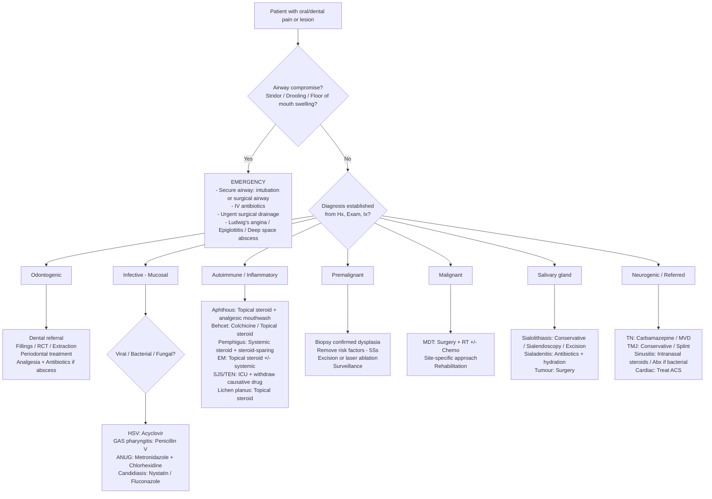

## Management Algorithm and Treatment Modalities for Oral/Dental Pain and Lesions

The management of oral/dental complaints follows a structured hierarchy: **secure the airway → treat emergencies → address the specific aetiology → manage symptoms → prevent recurrence → rehabilitate function**. Because this is an umbrella topic spanning dozens of conditions, I'll present a master management algorithm first, then drill down into treatment modalities by condition category.

---

### 1. Master Management Algorithm

---

### 2. Emergency Management

#### 2.1 Airway-Threatening Infections

**Ludwig's angina** (bilateral sublingual + submandibular space infection):
- "Ludwig" — named after Wilhelm Friedrich von Ludwig; "angina" from Latin *angere* = to strangle. The name tells you the condition: a throat infection that strangles the airway.
- **Management**: Secure airway FIRST (may require fibreoptic intubation or surgical tracheostomy if intubation impossible due to floor of mouth swelling and trismus). IV broad-spectrum antibiotics covering oral flora (IV amoxicillin/clavulanate or IV benzylpenicillin + metronidazole; add clindamycin if penicillin-allergic). Urgent surgical drainage of abscess if fluctuant collection present. IV dexamethasone may help reduce oedema and buy time.

**Peritonsillar abscess (quinsy)**:
- Needle aspiration or incision and drainage of the abscess. IV antibiotics (penicillin-based + metronidazole). IV fluids. Interval tonsillectomy may be considered if recurrent.

***Epiglottitis*** [14]:
- ***Admit if any suspicion — do NOT examine the throat*** [14] (because direct visualization may trigger complete laryngospasm and airway obstruction)
- Secure airway in controlled environment (ideally operating theatre with ENT standby). IV ceftriaxone or cefotaxime. IV dexamethasone. Humidified oxygen.

#### 2.2 Stevens-Johnson Syndrome / Toxic Epidermal Necrolysis (SJS/TEN)

***SJS/TEN management*** [10][21]:
- **Immediate**: ***Withdraw the causative drug*** — this is the single most important intervention
- **Supportive care**: ICU or burns unit admission for TEN; fluid resuscitation; wound care (non-adherent dressings, avoid skin shear); nutritional support (often requires NG/NJ tube due to severe oral erosions); temperature regulation; VTE prophylaxis
- ***Systemic immunosuppression: steroids, IVIg, cyclosporin, plasmapheresis (no consensus, controversial)*** [10]
- ***Ocular treatment*** [10]:
  - ***Saline rinses to remove mucous and inflammatory debris***
  - ***Topical corticosteroids + broad-spectrum antibiotics***
  - ***Early amniotic membrane transplantation (AMT) if moderate-severe conjunctival involvement*** — ***can increase epithelialisation, decrease inflammation, neovascularisation, and scarring*** [10]
- **Oral care**: Gentle oral hygiene; chlorhexidine mouthwash (alcohol-free); topical anaesthetic gel (lidocaine 2%) before meals; soft/liquid diet
- **Monitor with SCORTEN** for prognostication [21]

---

### 3. Management by Condition Category

#### 3.1 Odontogenic Conditions — Dental Referral Pathway

The medical student's role is to recognise odontogenic causes, provide emergency analgesia and antibiotics when indicated, and refer to dental services.

| Condition | Management | Rationale |
|---|---|---|
| **Dental caries (early)** | Dental referral for restoration (filling) | Remove carious dentine, seal with restorative material to prevent progression |
| **Reversible pulpitis** | Remove stimulus (e.g., repair caries); analgesics | Pulp is inflamed but still viable; removing the cause allows recovery |
| **Irreversible pulpitis** | Root canal treatment (RCT) or extraction | Pulp is necrotic/dying; RCT removes dead pulp, disinfects, and seals canals; extraction is alternative |
| **Periapical abscess** | Drainage (via RCT, incision, or extraction) + antibiotics if systemic signs | Abscess needs source control; antibiotics alone without drainage will not resolve it |
| **Pericoronitis** | Irrigation + chlorhexidine; antibiotics if systemic; wisdom tooth extraction (definitive) | Remove the nidus of infection under the operculum; extraction prevents recurrence |
| **Periodontal disease** | Scaling and root planing; oral hygiene instruction; smoking cessation | Remove calculus/biofilm mechanically; patient self-care prevents reaccumulation |

**Analgesics** for dental pain: Paracetamol 1g QDS + Ibuprofen 400mg TDS (if not contraindicated) — this combination provides synergistic analgesia via different mechanisms (central COX inhibition + peripheral COX-1/2 inhibition). Avoid aspirin in children (Reye syndrome risk). Opioids rarely needed and should be short-course only.

**Antibiotics** for dental infections: Only indicated when there are systemic signs (fever, malaise, lymphadenopathy, facial swelling) or spreading infection. First-line: **amoxicillin 500mg TDS** (covers streptococci and most oral anaerobes). If penicillin-allergic: **clindamycin 300mg QDS** or **metronidazole 400mg TDS** (specifically targets anaerobes). If severe/spreading: IV amoxicillin/clavulanate or IV benzylpenicillin + metronidazole.

<Callout title="Antibiotics Are NOT a Substitute for Drainage" type="error">
A periapical abscess or dental abscess will not resolve with antibiotics alone. The principle of source control applies: you must drain the pus (via extraction, RCT, or incision and drainage). Antibiotics are adjunctive, not definitive. Prescribing antibiotics without dental referral is a common error.
</Callout>

#### 3.2 Infective Mucosal Conditions

##### 3.2.1 Herpes Simplex Virus (HSV)

***Treatment*** [5]:
- ***Acyclovir: initiated ≤ 48h of clinical disease or if severe or associated with significant symptoms*** [5]
  - ***Can be topical for oral lesions + not immunocompromised, otherwise systemic*** [5]
  - Systemic dosing: Acyclovir 200mg PO 5 times daily (or 400mg TDS) for 7–10 days for primary; 5 days for recurrent [22]
  - Alternatives: Valaciclovir 1g BD for 7–10 days (primary) or 500mg BD for 3–5 days (recurrent); Famciclovir 250mg TDS for 7–10 days (primary) [22]
- ***Foscarnet: treatment of choice if acyclovir resistance (occasionally in immunocompromised hosts)*** [5]
- **Prophylaxis for recurrence if ≥ 6 significant relapses per year** [22]:
  - Acyclovir 400mg BD; or Valaciclovir 500mg–1g OD; or Famciclovir 250mg BD

**Why acyclovir works**: Acyclovir is a nucleoside analogue (guanosine analogue). It requires phosphorylation by viral thymidine kinase (only present in HSV-infected cells) to become active → selectively targets infected cells. The active triphosphate form inhibits viral DNA polymerase → chain termination → stops viral replication. This selectivity explains its excellent safety profile.

##### 3.2.2 Group A Streptococcal (GAS) Pharyngitis

- **First-line**: Phenoxymethylpenicillin (Penicillin V) 500mg BD for 10 days [18]
- **Alternative**: Amoxicillin 500mg BD for 10 days (equally effective, better taste for children)
- **Penicillin-allergic**: Clarithromycin 250–500mg BD for 5 days; or Azithromycin 500mg OD for 5 days
- **Why treat GAS**: Not primarily to speed resolution (which only shortens symptoms by ~1 day), but to **prevent rheumatic fever** (an immune-mediated sequela). Rheumatic fever requires a preceding GAS infection and can cause permanent rheumatic heart disease. Treatment within 9 days of symptom onset prevents rheumatic fever.

##### 3.2.3 Oral Candidiasis

| Type | First-Line | Alternative | Notes |
|---|---|---|---|
| **Pseudomembranous (thrush)** | Nystatin suspension 100,000 units/mL, swish and swallow QDS for 7–14 days | Miconazole oral gel 2.5mL QDS | Nystatin is a polyene antifungal that binds ergosterol in fungal cell membrane → pore formation → cell death. It is NOT absorbed systemically → topical effect only |
| **Moderate/severe or immunocompromised** | Fluconazole 100–200mg PO OD for 7–14 days | Itraconazole solution 200mg OD | Fluconazole inhibits lanosterol 14-alpha-demethylase (CYP51) → blocks ergosterol synthesis → fungal cell membrane destabilisation |
| **Denture stomatitis** | Nystatin + denture hygiene (soak in chlorhexidine or dilute sodium hypochlorite overnight) | Miconazole gel applied to denture fitting surface | Must treat the denture as a reservoir; antifungals alone without denture hygiene = recurrence |
| **Angular cheilitis** | Topical miconazole or combined miconazole/hydrocortisone cream | Nystatin cream | Often mixed Candida + S. aureus infection; miconazole has some anti-staphylococcal activity |
| **Steroid inhaler-related** | Spacer device + mouth rinse after inhaler use (prevention); topical antifungal if established | — | The steroid deposits on oropharyngeal mucosa → local immunosuppression → Candida overgrowth |

##### 3.2.4 ANUG (Vincent's Angina)

- Oral metronidazole 400mg TDS for 5 days (targets anaerobes — Fusobacterium, Borrelia)
- Chlorhexidine 0.2% mouthwash BD
- Gentle debridement by dentist once acute phase settles
- Address predisposing factors: oral hygiene, smoking cessation, stress management, HIV testing if risk factors

##### 3.2.5 Suppurative Parotitis

- IV antibiotics covering ***S. aureus (most common)*** [12]: IV flucloxacillin (or vancomycin if MRSA suspected) + metronidazole (for anaerobic cover)
- Aggressive IV hydration
- Warm compresses; gentle massage of gland towards duct orifice to express pus
- Sialogogues (lemon drops, sour sweets) to stimulate salivary flow
- Surgical drainage if abscess does not respond to antibiotics within 7–10 days

#### 3.3 Autoimmune / Inflammatory Conditions

##### 3.3.1 Recurrent Aphthous Stomatitis (RAS)

Management is largely symptomatic:

| Severity | Treatment | Mechanism / Rationale |
|---|---|---|
| **Mild (minor RAS)** | Topical corticosteroid paste (e.g., triamcinolone acetonide 0.1% in orabase) applied to ulcer BD–QDS | Suppresses local T-cell mediated inflammation → reduces pain and accelerates healing |
| **Mild + pain** | Analgesic mouthwash (benzydamine hydrochloride 0.15%) or topical lidocaine 2% gel | Benzydamine is a locally-acting NSAID + local anaesthetic; lidocaine blocks sodium channels in sensory nerve endings |
| **Moderate (frequent recurrences)** | Chlorhexidine 0.2% mouthwash (reduces secondary bacterial colonisation); topical steroid as above | Chlorhexidine is a broad-spectrum antiseptic; reduces bacterial load on ulcer surface → less pain and faster healing |
| **Severe / major RAS** | Systemic prednisolone short course (25–50mg tapering over 2 weeks); colchicine 0.5mg BD; dapsone 50–100mg daily | Systemic immunosuppression for refractory disease; colchicine inhibits neutrophil chemotaxis |
| **Refractory** | Thalidomide 100–200mg daily (strictly controlled — teratogenic); biologics (anti-TNF-alpha) in extreme cases | Thalidomide modulates TNF-alpha and T-cell function; very effective but severe teratogenicity and neuropathy risk |

**Always investigate for underlying causes** if severe/recurrent: FBE (exclude haematological disease), iron/B12/folate (exclude deficiency), anti-tTG (exclude coeliac disease), consider Behçet/Crohn's.

##### 3.3.2 Behçet Disease

***Management depends on organ involved*** [8]:
- ***Topical steroid for oral/genital ulcers*** [8] — first-line for mucocutaneous disease
- ***Colchicine for preventing recurrent ulcers and treating erythema nodosum and arthritis*** [8] — inhibits neutrophil chemotaxis and microtubule formation
- ***Thalidomide for resistant oral/genital ulcers*** [8] — modulates TNF-alpha; strictly controlled (pregnancy prevention programme mandatory)
- ***Systemic steroids and immunosuppressants for uveitis and neurological diseases*** [8] — azathioprine, ciclosporin, anti-TNF biologics (infliximab, adalimumab) for severe organ involvement

##### 3.3.3 Pemphigus Vulgaris

***Management: treatment always indicated at disease onset even for mild disease to decrease complications*** [7]:

1. ***Basic skin care: sterile puncture and drainage of large blisters, leave blister roof in situ to decrease infection risk, sterile wound dressing*** [7]
2. ***Oral symptom management: avoid irritating food, apply topical local anaesthetic as needed, oral hygiene, consider topical steroid*** [7]
3. ***Systemic corticosteroids: mainstay of initial treatment*** [7]:
   - ***Regimen: 1–1.5mg/kg/day oral prednisone/prednisolone → begin tapering ≥ 1 week after last formation of new lesions*** [7]
   - ***Alternative: upfront rituximab + prednisone gaining popularity recently*** [7]
   - ***Monitoring: response assessed by cessation of new blister formation, absent Nikolsky sign, healing of old lesions and dropping ELISA titres*** [7]
4. ***Steroid-sparing adjunct: azathioprine (preferred), MMF, cyclophosphamide (refractory only)*** [7]
   - ***Use: routine upfront use in conjunction with steroid in some centres; start at flares during steroid tapering or when refractory to steroids*** [7]
   - ***Duration: start tapering 8 weeks after completely off steroids*** [7]
5. ***Other immunosuppressive therapy for refractory disease: rituximab, IVIg, immunoadsorption, plasmapheresis, cyclophosphamide, topical steroids*** [7]

**Why rituximab is gaining traction**: Rituximab is a monoclonal antibody against CD20 on B lymphocytes → depletes B cells → reduces autoantibody production (anti-desmoglein). The RITUX 3 trial showed that upfront rituximab + low-dose prednisone achieved complete remission off therapy in 90% at 2 years, compared to ~34% with prednisone alone. This is now considered first-line in many centres.

##### 3.3.4 Erythema Multiforme (EM)

***Management: no evidence for treatment of underlying cause*** [11] (i.e., the HSV or Mycoplasma has already triggered the immune response; treating the infection doesn't reverse the EM):
- ***Urgent consult ophthalmology for ocular involvement*** [11]
- ***Topical corticosteroids for symptomatic relief in mild cutaneous lesions*** [11]
- ***Topical corticosteroids + analgesic mouthwash for symptomatic relief in painful oral erosions*** [11]
- ***Systemic corticosteroids (controversial) in severe and/or associated with mucosal involvement*** [11]

***Prevention*** [11]:
- ***Elimination of underlying cause: may not always be possible (e.g., HSV infection)***
- ***Systemic prophylactic therapy for ≥ 6 recurrences/year or debilitating episodes*** [11]:
  - ***Systemic antivirals: continuous, intermittent valacyclovir or acyclovir*** [11]
  - ***2nd line: azathioprine, mycophenolate mofetil, dapsone (limited evidence)*** [11]

##### 3.3.5 Oral Lichen Planus

- ***Oral lichen planus is often asymptomatic*** [6] → may not require treatment
- **Symptomatic erosive/ulcerative OLP**: Topical corticosteroid (triamcinolone acetonide paste, fluocinonide gel, or betamethasone mouthwash) — mainstay of treatment
- **Refractory**: Topical tacrolimus 0.1% (calcineurin inhibitor — suppresses T-cell activation without steroid side effects); systemic immunosuppression rarely needed
- **Long-term surveillance**: ~1% risk of malignant transformation → regular follow-up (6–12 monthly) with biopsy of any suspicious change

#### 3.4 Premalignant Lesions — Leukoplakia, Erythroplakia, Oral Submucous Fibrosis

The management principle is: **remove the risk factor + treat the dysplasia + surveil for malignant transformation**.

| Strategy | Details |
|---|---|
| **Risk factor modification** | Smoking cessation (most important); alcohol cessation; betel nut cessation; improve dental hygiene; remove chronic irritants (sharp teeth, ill-fitting dentures) |
| **Biopsy and grading** | Every leukoplakia/erythroplakia must be biopsied. Grade dysplasia: mild / moderate / severe / carcinoma in situ |
| **No dysplasia or mild dysplasia** | Observe with regular follow-up (3–6 monthly); risk factor modification; re-biopsy if change in appearance |
| **Moderate–severe dysplasia or CIS** | ***CO2 laser ablation can be used for excision or ablation of premalignant lesions*** [3]; surgical excision; cryotherapy. Ensure clear margins |
| **Surveillance** | Lifelong follow-up — these patients remain at risk (field cancerisation) |

#### 3.5 Oral Cavity and Oropharyngeal Malignancy

This is a major surgical/oncological topic. The management is **multidisciplinary** (surgeon, radiation oncologist, medical oncologist, pathologist, radiologist, speech therapist, dietician, dental team).

##### 3.5.1 General Principles [3]

***Key principles*** [3]:
- ***Tumours of the oropharynx tend to be chemosensitive*** [3]
- ***Adequate treatment of the neck is important because of high risk of regional metastasis*** [3]
- ***Multidisciplinary approach including swallowing rehabilitation is important*** [3]

##### 3.5.2 Early-Stage Disease (Stage I–II) [3]

***Management of stage I and II (early) cancer — usually single modality*** [3]:
- ***Primary surgery is recommended rather than definitive radiotherapy*** [3]
- ***Selective neck dissection*** [3]:
  - ***Indicated for patients with stage I oral tongue cancer > 3mm and most stage II oral cavity cancers*** [3]
  - ***Ipsilateral selective neck dissection of Level I to III or IV is generally sufficient*** [3]
  - ***Bilateral neck dissection is required if primary tumours are close to or involving the midline*** [3]
- ***Post-operative radiotherapy*** [3]:
  - ***Radiotherapy of primary site and unilateral or bilateral neck if tumour thickness > 4mm or in presence of lymphovascular or perineural invasion*** [3]

##### 3.5.3 Advanced-Stage Disease (Stage III–IV) [3]

***Management of stage III and IV (locoregionally advanced) cancer — usually combined modality*** [3]:
- ***Surgical resection of primary tumour is suggested as initial therapy rather than radiotherapy or chemotherapy*** [3]
- ***Modified radical neck dissection and post-operative radiotherapy with or without concurrent chemotherapy*** [3]
- ***Definitive radiotherapy or chemotherapy are options for patients who are medically inoperable or have unresectable disease*** [3]
- ***Concomitant chemoradiation is commonly utilized in advanced stage (III and IV) oropharyngeal carcinoma which effectively preserves function and is associated with survival comparable to surgery with postoperative radiation*** [3]

##### 3.5.4 Site-Specific Surgical Management

| Site | Surgical Approach | Reconstruction | Key Considerations |
|---|---|---|---|
| ***Lip*** [3] | ***Surgical excision with histological confirmation of tumour-free margin*** [3] | Wedge excision + primary closure; mucosal advancement flap for larger defects | ***Postoperative RT indicated for positive margins, tumour thickness > 4mm, perineural invasion, or LN metastasis*** [3] |
| ***Tongue*** [3] | ***Wide local excision for small T1–2 tumours*** [3]; ***partial glossectomy for larger tumours*** [3] | ***Fasciocutaneous free flaps for intraoral bulk and preservation of tongue mobility*** [3]; ***prosthetic augmentation for palatal contact*** [3] | ***Resection leading to decreased lingual contact with palate, lip and teeth → impaired articulation*** [3] |
| ***Floor of mouth*** [3] | Wide local excision for small mucosal lesions; marginal or segmental mandibulectomy for larger defects | ***Complex reconstruction with fasciocutaneous or vascularized osseous free flap*** [3] | ***Deep invasion into intrinsic muscles of tongue causes fixation and mandates partial glossectomy*** [3] |
| ***Alveolus/Gingiva*** [3] | ***Marginal resection of mandible for minimal bone invasion*** [3]; ***segmental mandibulectomy for medullary cavity invasion*** [3] | Osseous free flap (fibula) | ***Treatment frequently requires resection of underlying bone due to tight attachment of alveolar mucosa to periosteum*** [3] |
| ***Retromolar trigone*** [3] | ***Usually requires marginal or segmental mandibulectomy*** [3] | Soft tissue or osseous reconstruction | ***Ipsilateral neck dissection performed because of risk of metastasis to regional lymphatics*** [3] |
| ***Buccal mucosa*** [3] | ***Small lesions: surgical excision*** [3]; ***advanced lesions: combined surgical excision and postoperative radiotherapy*** [3] | ***Folded fasciocutaneous free flap or combination of pedicled and free tissue*** [3] | ***Local intraoral spread may necessitate resection of alveolar ridge of mandible or maxilla*** [3] |
| ***Hard palate*** [3] | ***Mucosal excision for very superficial lesions*** [3]; ***partial palatectomy or infrastructure maxillectomy for larger lesions*** [3] | ***Through-and-through defects require dental prosthesis for rehabilitation of swallowing and speech*** [3] | ***Periosteum of the palate acts as a barrier to spread of tumour*** [3] |

##### 3.5.5 Neck Dissection Types [3]

| Type | What Is Removed | Indication |
|---|---|---|
| ***Selective neck dissection*** [3] | Lymph nodes in areas with highest chance of nodal metastasis (e.g., Levels I–III) | ***Prophylactic***: clinically N0 neck but high risk of occult metastasis (e.g., tongue cancer > 3mm) |
| ***Modified radical neck dissection*** [3] | ***Level I–V lymph nodes with preservation of one or more of: internal jugular vein, spinal accessory nerve, sternocleidomastoid muscle*** [3] | Clinically positive neck nodes |
| ***Radical neck dissection*** [3] | ***All Level I–V lymph nodes + internal jugular vein + spinal accessory nerve + sternocleidomastoid muscle*** [3] | Extensive nodal disease with extranodal extension involving these structures |

##### 3.5.6 Minimally Invasive Surgery [3]

***Transoral robotic surgery (TORS)*** [3]:
- ***Previously, procedures might otherwise require a lip-splitting mandibulotomy approach to resect tumours of the oropharynx*** [3]
- ***Associated with shorter length of hospital stay and less likely to be gastrostomy tube or tracheostomy dependent at 6 months*** [3]

#### 3.6 Salivary Gland Conditions

##### Sialolithiasis Management

| Severity | Management | Rationale |
|---|---|---|
| **Acute obstruction** | Conservative: hydration, warm compresses, sialogogues (lemon drops), gentle massage, analgesia | Stimulate salivary flow to flush out small stones; massage helps express the stone towards the duct orifice |
| **Failed conservative / recurrent** | Sialendoscopy (minimally invasive endoscopic stone retrieval) | Allows direct visualisation and basket extraction of stones; avoids gland excision; high success rate for stones < 7mm |
| **Large stones / gland damage** | Submandibular gland excision (for submandibular stones) or parotidectomy (for parotid stones) | Definitive removal of the stone factory; needed if gland is chronically damaged and non-functional |

#### 3.7 Neurogenic / Referred Pain

| Condition | First-Line Treatment | Second-Line / Specialist | Mechanism |
|---|---|---|---|
| **Trigeminal neuralgia** | Carbamazepine 100mg BD, titrate up (***check HLA-B*15:02 before prescribing in HK Chinese*** [10]) | Oxcarbazepine; microvascular decompression (MVD) surgery for refractory cases | Carbamazepine stabilises neuronal sodium channels → reduces aberrant firing in demyelinated trigeminal nerve. MVD physically separates the offending vessel from the nerve root |
| **TMJ dysfunction** | Conservative: jaw rest, soft diet, warm compresses, NSAIDs, physiotherapy, occlusal splint | Intra-articular steroid injection; arthroscopy; rarely open surgery | Most TMJ pain is myofascial → muscle relaxation and load reduction. Splints redistribute occlusal forces |
| ***Sinusitis (bacterial)*** [17] | Intranasal corticosteroid spray + saline irrigation. Antibiotics (amoxicillin or amoxicillin/clavulanate) if bacterial criteria met [17] | ENT referral for complications or chronic sinusitis; functional endoscopic sinus surgery (FESS) | Intranasal steroids reduce mucosal oedema → restore sinus drainage. Antibiotics target the bacterial pathogens. FESS widens the sinus ostia to improve drainage |
| **Referred cardiac pain** | Treat underlying ACS (aspirin, GTN, morphine, PCI as indicated) | — | Treating the myocardial ischaemia resolves the referred jaw/throat pain |

#### 3.8 Infective Endocarditis Prophylaxis for Dental Procedures

This is clinically important and frequently examined.

***Indications: only in at-risk procedures in high-risk individuals (ESC guidelines)*** [23]:

***High-risk individuals*** [23]:
- ***Any prosthetic valve (including transcatheter valve) or prosthetic materials used in valve repair***
- ***Previous infective endocarditis***
- ***Cyanotic congenital heart disease***
- ***Any congenital heart disease repaired with prosthetic materials: up to 6 months post-op; lifelong if residual shunt or valvular regurgitation remains***

***At-risk dental procedures*** [23]:
- ***Requiring manipulation of gingival or periapical region of teeth***
- ***Perforation of oral mucosa***

***Regimen*** [23]:
- ***No penicillin allergy: Amoxicillin 2g PO 1 hour before; or Ampicillin 2g IM/IV ≤ 30 min before***
- ***Penicillin allergy: Clindamycin 600mg PO 1 hour before; or 600mg IM/IV ≤ 30 min before***
- ***Alternative: Azithromycin/Clarithromycin 500mg PO 1 hour before*** [23]

**Why prophylaxis**: Dental procedures cause transient bacteraemia (oral streptococci enter the bloodstream). In patients with structurally abnormal cardiac valves or prosthetic material, these bacteria can adhere to the endocardium and establish vegetations → infective endocarditis. A single dose of antibiotic before the procedure kills bacteria during the transient bacteraemia window.

<Callout title="IE Prophylaxis — Know the Indication AND Regimen" type="idea">
This is one of the most commonly examined topics linking cardiology and dental care. Know: (1) WHICH patients need it (prosthetic valve, prior IE, cyanotic CHD, repaired CHD with prosthetic material), (2) WHICH procedures (gingival manipulation, periapical procedures, oral mucosal perforation), (3) THE DRUG (amoxicillin 2g PO 1h before; clindamycin if allergic).
</Callout>

#### 3.9 Nutritional Deficiency Management

| Deficiency | Oral Manifestation | Treatment |
|---|---|---|
| ***Iron deficiency*** [1] | ***Glossitis, angular stomatitis***, Plummer-Vinson syndrome | Oral ferrous sulphate 200mg BD–TDS; investigate and treat underlying cause (menorrhagia, GI blood loss, coeliac) |
| ***Vitamin B12 deficiency*** [1] | ***Glossitis***, aphthous-like ulcers | IM hydroxocobalamin 1mg on alternate days for 2 weeks then every 3 months (if pernicious anaemia); oral supplementation if dietary |
| ***Folate deficiency*** [1] | ***Glossitis*** | Folic acid 5mg daily for 4 months; ALWAYS exclude B12 deficiency first (treating folate alone in B12 deficiency may precipitate subacute combined degeneration of the cord) |
| ***Vitamin C deficiency (scurvy)*** [1] | ***Spongy, red, swollen and irregular gums that bleed easily*** [1] | Vitamin C 250mg QDS until 4g given then 100mg daily maintenance |

---

### 4. Drug Reference Table — Key Medications with Indications, Mechanisms, and Contraindications

| Drug | Indication | Mechanism | Key Contraindications / Cautions |
|---|---|---|---|
| **Acyclovir** | HSV, VZV | Guanosine analogue; requires viral thymidine kinase for activation → inhibits viral DNA polymerase | Renal impairment (dose adjust); adequate hydration (crystalluria risk) |
| **Valacyclovir** | HSV, VZV (prodrug of acyclovir) | L-valyl ester of acyclovir; better oral bioavailability | Same as acyclovir; thrombotic microangiopathy in immunocompromised at high doses |
| **Nystatin** | Oral candidiasis | Polyene; binds ergosterol → fungal membrane disruption | Very few (not absorbed systemically); unpleasant taste |
| **Fluconazole** | Moderate–severe oral candidiasis | Triazole; inhibits CYP51 (lanosterol 14α-demethylase) → blocks ergosterol synthesis | Hepatotoxicity; QT prolongation; multiple drug interactions (CYP3A4/2C9 inhibitor); pregnancy (teratogenic) |
| **Carbamazepine** | Trigeminal neuralgia | Voltage-gated sodium channel blocker → stabilises neuronal membrane | ***Mandatory HLA-B*15:02 screening in HK Chinese before prescribing*** [10]; hyponatraemia (SIADH); aplastic anaemia; hepatotoxicity; enzyme inducer |
| **Prednisolone** | Pemphigus, EM, Behçet (systemic), severe RAS | Glucocorticoid → genomic suppression of pro-inflammatory transcription factors (NFκB) | Long-term side effects: osteoporosis, diabetes, adrenal suppression, cataracts, infections, cushingoid features |
| **Rituximab** | Pemphigus vulgaris (refractory or upfront) | Anti-CD20 monoclonal Ab → B-cell depletion → reduced autoantibody production | Hepatitis B reactivation (mandatory HBsAg/anti-HBc screen); PML risk (very rare); infusion reactions; hypogammaglobulinaemia |
| **Colchicine** | Behçet disease, recurrent aphthous ulcers | Disrupts microtubule polymerisation → inhibits neutrophil chemotaxis and NLRP3 inflammasome | GI side effects (diarrhoea); narrow therapeutic index; dose reduction in renal/hepatic impairment; fatal in overdose |
| **Thalidomide** | Resistant oral/genital ulcers (Behçet) | Immunomodulatory (TNF-α modulation, anti-angiogenic, T-cell co-stimulation modulation) | ***Absolute contraindication in pregnancy (teratogenic — phocomelia)***; peripheral neuropathy; VTE risk; mandatory pregnancy prevention programme |
| **Metronidazole** | ANUG, anaerobic dental infections | Prodrug; reduced by anaerobic bacteria → toxic metabolites damage bacterial DNA | Disulfiram reaction with alcohol; peripheral neuropathy with prolonged use; metallic taste |
| **Amoxicillin** | Dental infections, GAS pharyngitis, IE prophylaxis | β-lactam; inhibits transpeptidase (PBP) → disrupts bacterial cell wall synthesis | Penicillin allergy; maculopapular rash in EBV infection (non-allergic but avoid in suspected EBV) |
| **Clindamycin** | Dental infections (penicillin-allergic), IE prophylaxis | Binds 50S ribosomal subunit → inhibits bacterial protein synthesis | C. difficile colitis (most important); hepatotoxicity |
| **Cisplatin** | Concurrent chemoradiation for advanced H&N SCC | Platinum cross-links DNA → prevents replication/transcription → apoptosis | Nephrotoxicity (mandatory aggressive hydration); ototoxicity; peripheral neuropathy; severe nausea |

---

### 5. Lifestyle and Preventive Measures

These apply across almost all oral/dental conditions and are frequently under-emphasised:

- **Smoking cessation** — reduces risk of oral cancer, periodontal disease, poor wound healing, candidiasis recurrence. This is the single most impactful lifestyle intervention.
- **Alcohol moderation** — synergistic carcinogen with tobacco
- **Betel nut cessation** — prevents oral submucous fibrosis (HK/Southern China relevance)
- **Oral hygiene** — twice daily brushing, flossing, regular dental check-ups (every 6–12 months)
- **HPV vaccination** — the 9-valent HPV vaccine (Gardasil 9) covers HPV 16/18 → reduces risk of HPV-related oropharyngeal SCC. Gender-neutral vaccination is now recommended in many countries.
- **Sun protection** for lip — sunscreen lip balm for outdoor workers (prevents lip SCC)
- **Dietary modification** — reduce salt-preserved foods (HK: salted fish → NPC risk [4]); balanced diet with adequate vitamins and minerals

---

<Callout title="High Yield Summary">

**Emergency**: Airway first (Ludwig's angina, epiglottitis — ***do NOT examine throat if epiglottitis suspected*** [14]). SJS/TEN → ***withdraw causative drug immediately*** + ICU/burns unit care.

**Dental infections**: Source control (drainage/extraction) is definitive; antibiotics are adjunctive. First-line: amoxicillin; penicillin-allergic: clindamycin or metronidazole.

**HSV**: ***Acyclovir initiated ≤ 48h*** [5]; topical if mild and immunocompetent, systemic if severe/immunocompromised. ***Foscarnet for acyclovir resistance*** [5].

**Pemphigus vulgaris**: ***Systemic corticosteroid (1–1.5mg/kg/day prednisolone) as mainstay*** [7]; ***rituximab + prednisone gaining popularity upfront*** [7]; steroid-sparing agents (***azathioprine preferred***) [7].

**Behçet**: ***Topical steroid for oral ulcers; colchicine for prevention; thalidomide for resistant ulcers; systemic immunosuppressants for uveitis/neuro*** [8].

**Oral cancer (early)**: ***Surgery preferred; selective neck dissection for tongue cancer > 3mm*** [3]; ***post-op RT if thickness > 4mm or LVI/PNI*** [3].

**Oral cancer (advanced)**: ***Combined modality — surgery + post-op chemoRT; or definitive chemoRT if unresectable*** [3]; ***TORS = less morbid for oropharyngeal tumours*** [3].

**IE prophylaxis**: ***Amoxicillin 2g PO 1h before dental procedures in high-risk patients (prosthetic valve, prior IE, cyanotic CHD)*** [23]. ***Clindamycin 600mg if penicillin-allergic*** [23].

**Carbamazepine for TN**: ***Mandatory HLA-B*15:02 screening in HK Chinese (13% prevalence)*** [10].

</Callout>

---

<ActiveRecallQuiz
  title="Active Recall - Management of Oral/Dental Pain and Lesions"
  items={[
    {
      question: "A patient with a prosthetic aortic valve is undergoing dental scaling. What prophylaxis is required, what drug and dose, and when should it be given?",
      markscheme: "Antibiotic prophylaxis for infective endocarditis is required. Amoxicillin 2g PO given 1 hour before the procedure. If penicillin-allergic: clindamycin 600mg PO 1 hour before. Rationale: dental procedures cause transient bacteraemia; oral streptococci can adhere to prosthetic valve material and cause IE.",
    },
    {
      question: "Outline the management of pemphigus vulgaris presenting with extensive painful oral erosions. Include initial treatment, steroid-sparing strategy, and monitoring.",
      markscheme: "Initial: systemic corticosteroids (prednisolone 1-1.5 mg/kg/day) as mainstay. Oral care: avoid irritating food, topical LA, oral hygiene, topical steroid. Steroid-sparing: azathioprine (preferred) or MMF started concurrently or at flare during taper. Alternative upfront: rituximab plus low-dose prednisone. Taper steroid after at least 1 week with no new blisters. Monitoring: cessation of new blister formation, absent Nikolsky sign, healing of old lesions, dropping anti-desmoglein ELISA titres.",
    },
    {
      question: "Describe the management approach for a T2N0 squamous cell carcinoma of the lateral tongue. Include surgery type, neck management, and indications for adjuvant radiotherapy.",
      markscheme: "Surgery: wide local excision with primary closure or partial glossectomy with reconstruction using fasciocutaneous free flap. Neck: ipsilateral selective neck dissection (Levels I-III or IV) because most stage II oral tongue cancers warrant elective neck dissection. Bilateral neck dissection if close to midline. Adjuvant RT: indicated if tumour thickness greater than 4mm, or if lymphovascular invasion, perineural invasion, or positive margins.",
    },
    {
      question: "A patient develops oral ulcers 2 weeks after starting allopurinol. Examination reveals widespread painful haemorrhagic oral erosions, conjunctival injection, and target-like skin lesions with sloughing covering 8% TBSA. What is the diagnosis, immediate management, and which HLA should have been checked?",
      markscheme: "Diagnosis: Stevens-Johnson syndrome (mucocutaneous bullous lesions less than 10% TBSA). Immediate management: withdraw allopurinol immediately; ICU/burns unit admission; aggressive fluid resuscitation; wound care; ocular treatment (saline rinses, topical steroids, broad-spectrum antibiotics, consider amniotic membrane transplant). Consider systemic immunosuppression (IVIg, cyclosporin -- controversial). HLA-B*58:01 should have been checked (prevalence 7.4% in HK Chinese, associated with allopurinol-related SJS/TEN).",
    },
    {
      question: "What are the three types of neck dissection used in head and neck cancer surgery? For each, state what is removed and the typical indication.",
      markscheme: "Selective neck dissection: lymph nodes in high-risk levels only (e.g., Levels I-III); indication: prophylactic in clinically N0 neck with high risk of occult metastasis. Modified radical neck dissection: Level I-V lymph nodes with preservation of one or more of IJV, spinal accessory nerve, SCM; indication: clinically positive neck nodes. Radical neck dissection: Level I-V lymph nodes plus IJV plus spinal accessory nerve plus SCM; indication: extensive nodal disease with extranodal extension involving these structures.",
    },
    {
      question: "Explain why acyclovir selectively targets HSV-infected cells and name the drug used for acyclovir-resistant HSV.",
      markscheme: "Acyclovir is a guanosine analogue that requires phosphorylation by viral thymidine kinase (only present in HSV-infected cells) to become active. The triphosphate form then inhibits viral DNA polymerase causing chain termination. Uninfected cells lack viral thymidine kinase and cannot activate the drug, explaining selectivity and safety. For acyclovir-resistant HSV (usually in immunocompromised hosts with thymidine kinase mutations): foscarnet is the treatment of choice (directly inhibits viral DNA polymerase without requiring viral thymidine kinase activation).",
    },
  ]}
/>

## References

[1] Senior notes: Ryan Ho GI.pdf (p10) and Ryan Ho Fundamentals.pdf (p62) — Glossitis, gum hypertrophy, aphthous ulcers, angular stomatitis, scurvy, pigmentation, nutritional deficiencies
[3] Senior notes: felixlai.md (sections 350, 351, 353, 354, 355, 372) — Oral and oropharyngeal cancer management: site-specific surgery, neck dissection types, reconstruction, adjuvant RT/chemoRT, TORS, stage-based approach, CO2 laser for premalignant lesions
[4] Senior notes: felixlai.md (section 357) — NPC risk factors (salted fish)
[5] Senior notes: Ryan Ho Rheumatology.pdf (p137) — HSV treatment: acyclovir, foscarnet
[6] Senior notes: Ryan Ho Rheumatology.pdf (p143) — Lichen planus: often asymptomatic oral involvement
[7] Senior notes: Ryan Ho Rheumatology.pdf (p153) — Pemphigus vulgaris management: systemic corticosteroids, rituximab, steroid-sparing agents, monitoring
[8] Senior notes: Ryan Ho Rheumatology.pdf (p98) — Behçet disease management: topical steroid, colchicine, thalidomide, systemic immunosuppressants
[10] Senior notes: Ryan Ho Rheumatology.pdf (p149) and Ryan Ho Opthalmology.pdf (p133) — SJS/TEN management, HLA-B*15:02 and HLA-B*58:01 pharmacogenomics, amniotic membrane transplantation
[11] Senior notes: Ryan Ho Rheumatology.pdf (p131) — Erythema multiforme management and prevention
[12] Senior notes: felixlai.md (section 321) — Suppurative parotitis: S. aureus
[14] Lecture slides: murtagh merge.pdf (p90, p92) — Epiglottitis: do not examine throat; sore throat diagnostic tips
[17] Senior notes: Ryan Ho Respiratory.pdf (p54) — Bacterial rhinosinusitis treatment
[18] Senior notes: Ryan Ho Respiratory.pdf (p51) — GAS pharyngitis: Centor criteria and treatment
[21] Senior notes: Ryan Ho Rheumatology.pdf (p150) — SJS/TEN SCORTEN prognostication
[22] Senior notes: Ryan Ho Urogenital.pdf (p247) — HSV antiviral dosing regimens, prophylaxis indications
[23] Senior notes: Ryan Ho Cardiology.pdf (p150–151) — IE prophylaxis: indications, high-risk patients, at-risk procedures, antibiotic regimens
