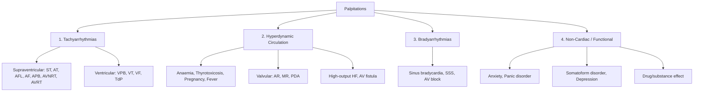
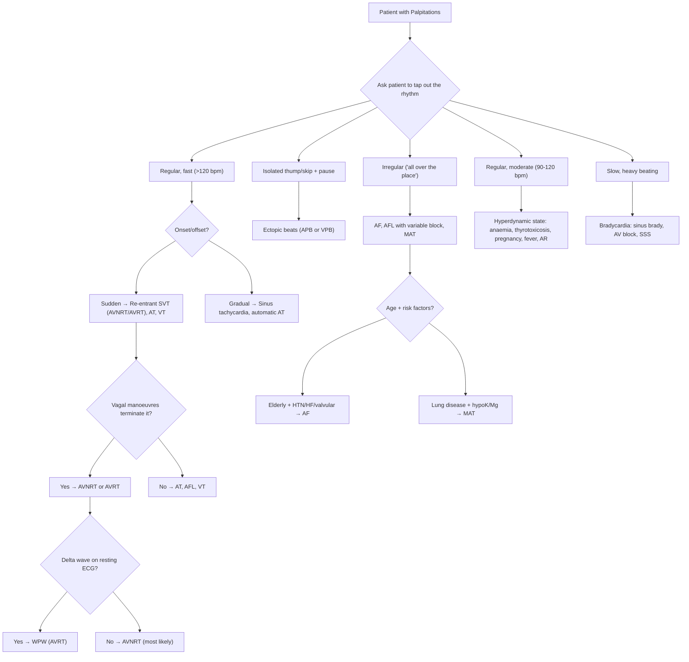

## Differential Diagnosis of Palpitations

The differential diagnosis of palpitations is broad precisely *because* the symptom itself is non-specific — it is simply the brain's awareness of the heart doing something different. Your job as a clinician is to sort through the noise and identify the signal. The framework below organises the DDx logically by mechanism, then shows you how the history, examination, and simple bedside observations allow you to narrow it down efficiently.

---

### Organising Framework

Recall from the previous section the three fundamental mechanisms [1][2]:

> ***Palpitations can result from: (1) Tachyarrhythmias felt by patients, (2) Hyperdynamic circulation exaggerating sinus rhythm, (3) Bradyarrhythmias with strong beats (↑diastolic time → ↑stroke volume)*** [1][2]

On top of these, we must add a fourth category that is clinically crucial:

4. **Non-cardiac / Functional** — heightened interoceptive awareness of a *normal* heartbeat (anxiety, panic disorder, somatoform disorders)

This gives us a practical four-box DDx model:

---

### Complete Differential Diagnosis Table

The table below integrates Murtagh's lecture framework with the senior notes, organised by clinical likelihood.

#### A. Probability Diagnoses (Most Common Causes) [3]

These are what you'll see day in, day out. In a primary care or A&E setting, the vast majority of palpitation presentations fall here.

| Diagnosis | Key Distinguishing Features | Why It Causes Palpitations (Mechanism) |
|---|---|---|
| ***Anxiety*** [3] | Palpitations with hyperventilation, paraesthesia, dry mouth, tremor, sense of dread; often young patient; normal ECG; symptoms reproducible with hyperventilation | ↑Sympathetic drive → sinus tachycardia + heightened interoception. The amygdala's threat-detection system becomes hyperactive → the brain amplifies perception of a physiologically normal heartbeat [6] |
| ***Premature beats (ectopics) — atrial and ventricular*** [3] | ***Isolated thump or jump followed by a definite pause on a background of a regular pattern*** [3]; ***often triggered by stress, alcohol, nicotine, worse at rest*** [1][2] | The premature beat under-fills the ventricle → weak/absent pulse. The compensatory pause prolongs diastole → next beat has ↑stroke volume → forceful "thump." Why worse at rest? Low background sympathetic "noise" means each beat is more noticeable, plus ↑vagal tone shortens atrial refractory period facilitating ectopics |
| ***Sinus tachycardia, e.g. fever, exercise*** [3] | Regular, fast pounding with gradual onset/offset; rate 100–150 bpm; clear physiological trigger; P waves present with normal morphology before each QRS | SA node firing rate ↑ in response to sympathetic stimulation or vagal withdrawal — this is an *appropriate* physiological response, not a primary arrhythmia |
| ***Supraventricular tachycardia*** [3] | ***Discrete bouts, very rapid ( > 120 bpm)*** [1][2]; ***sudden onset and offset*** [1][2]; ***terminated by vagal manoeuvres*** [1][2]; polyuria post-attack (ANP release from atrial distension) | Re-entrant circuit (AVNRT/AVRT) or abnormal automaticity (AT) generates a rapid, regular supraventricular rhythm. Why sudden onset? Re-entry is all-or-nothing — the circuit either sustains or doesn't |
| ***Drugs (e.g. stimulants)*** [3] | Clear temporal relationship to drug/substance intake; ***caffeine, cocaine*** [3], ***β-blockers*** (withdrawal), ***antipsychotics, antidepressants, thyroxine, digoxin, nifedipine, sympathomimetics*** [3] | Mechanism is drug-specific: sympathomimetics ↑catecholamines → ↑automaticity; nifedipine → reflex tachycardia from vasodilation; digoxin → DAD-mediated triggered activity; antipsychotics/TCAs → QT prolongation → risk of TdP |

#### B. Serious Disorders Not To Be Missed [3]

<Callout title="Clinical Priority" type="error">
These are the ones that will kill your patient. Even if they're less common, you must actively exclude them in every palpitation workup.
</Callout>

| Diagnosis | Key Distinguishing Features | Why It Causes Palpitations | Why It's Dangerous |
|---|---|---|---|
| ***Myocardial infarction/angina*** [3] | Palpitations + chest pain (crushing, radiating to jaw/arm), diaphoresis, dyspnoea; risk factors for CAD; ECG changes (ST elevation/depression, T-wave inversion) | Myocardial ischaemia → irritable myocardium → ectopics, sinus tachycardia (sympathetic surge), VT/VF; also reflex tachycardia from ↓CO | VT/VF → cardiac arrest. ***CAD accounts for 85% of cardiac arrest causes*** [13] |
| ***Atrial fibrillation or flutter*** [3] | ***Irregular palpitations ('all over the place')*** [1][2][3]; may be paroxysmal; risk factors: age, HTN, valvular disease, thyrotoxicosis, alcohol | AF: chaotic re-entrant wavelets in atria → irregularly irregular ventricular response. AFL: macro-re-entry around tricuspid annulus → atrial rate ~300 bpm with AV block | Thromboembolism → stroke (AF ↑ stroke risk 5-fold); rapid ventricular rate → haemodynamic compromise; tachycardia-mediated cardiomyopathy |
| ***Ventricular tachycardia*** [3] | Palpitations ± syncope ± chest pain; usually *exertional* in structural heart disease; broad complex tachycardia on ECG; prior MI or known cardiomyopathy | Re-entry around myocardial scar (most commonly post-MI) → rapid ventricular rate with poor diastolic filling | Can degenerate to VF → cardiac arrest. Any wide complex tachycardia should be treated as VT until proven otherwise |
| ***Bradycardia/heart block*** [3] | Slow, forceful pounding; presyncope/syncope; fatigue; older patient or on rate-slowing drugs | ***↑Diastolic time → ↑stroke volume*** → each beat felt more forcefully [1][2]; in complete heart block, cannon A waves from AV dissociation may be felt in the neck | Severe bradycardia → ↓CO → syncope → asystole |
| ***Sick sinus syndrome*** [3] | Alternating fast and slow episodes (***tachy-brady syndrome*** [14]); syncope during the pause after tachycardia terminates; elderly | During tachyarrhythmia (usually AF), there is ***overdrive suppression of SA node → period of sinus arrest following termination*** [14] → the long pause causes syncope | Asystolic pauses → syncope, falls, cardiac arrest |
| ***Torsade de pointes*** [3] | Palpitations → syncope → may self-terminate or degenerate to VF; prolonged QTc on baseline ECG; precipitated by drugs, ***hypokalaemia, hypomagnesaemia*** [3] | "Torsades" = "twisting of the points" — polymorphic VT with QRS complexes rotating around the isoelectric line. Mechanism: prolonged repolarization → early afterdepolarizations (EADs) → triggered activity | Self-terminating → palpitations/syncope; sustained → VF → death |
| ***Long QT syndrome*** [3] | Young patient; FHx of sudden cardiac death or drowning; syncope with exercise or startle (LQT1/2) or during sleep (LQT3) | Inherited K⁺ or Na⁺ channelopathies → prolonged ventricular repolarization → EADs → TdP | Sudden cardiac death in otherwise healthy young people |
| ***Wolff–Parkinson–White (WPW) syndrome*** [3] | ***Young: think congenital syndromes (e.g. LQTS, WPWS)*** [1][2]; delta wave on resting ECG; SVT with sudden onset; risk of pre-excited AF → very rapid rate | Accessory pathway (Bundle of Kent) creates macro-re-entrant circuit with AV node. In orthodromic AVRT: AV node down, accessory pathway up → narrow complex SVT | If AF develops, the accessory pathway conducts without AV nodal delay → extremely rapid ventricular rate → VF → SCD. This is why AV nodal blockers (digoxin, verapamil) are *contraindicated* in pre-excited AF |
| ***Electrolyte disturbances: hypokalaemia, hypomagnesaemia*** [3] | Diuretic use, vomiting/diarrhoea, renal disease; muscle weakness, cramps; U waves on ECG (hypoK), prolonged QT | HypoK: ↑resting membrane potential → delayed repolarization → ↑QT interval → EADs → ectopics, VT, TdP. HypoMg: Mg²⁺ normally stabilises K⁺ channels; depletion → refractory hypoK + independent arrhythmogenesis | Severe hypoK ( < 2.5) → VT/VF; often coexists with hypoMg making the situation worse |
| ***Hypoglycaemia (type 1 diabetes)*** [3] | ***Adrenergic symptoms: palpitation, sweating, anxiety, tremor, tachycardia*** [15]; confirmed by low BG; in diabetics on insulin/sulfonylureas | Hypoglycaemia → counter-regulatory catecholamine surge → sinus tachycardia + ↑contractility → patient perceives forceful, rapid heartbeat; also hypoGly directly prolongs QT → risk of TdP | Neuroglycopenia → seizures, coma; prolonged QT → arrhythmia |

#### C. Pitfalls (Often Missed) [3]

These are the diagnoses that catch clinicians off-guard because they're not classically associated with palpitations, or the presentation is atypical.

| Diagnosis | Why It's Missed | Mechanism of Palpitations |
|---|---|---|
| ***Fever/infection*** [3] | Palpitations attributed to the infection itself rather than recognised as a distinct symptom | Fever ↑metabolic demand → ↑sympathetic drive → sinus tachycardia (~10 bpm per 1°C). Sepsis → vasodilation → compensatory ↑HR. Some infections (myocarditis) directly damage conduction tissue |
| ***Pregnancy*** [3] | Not always disclosed or asked about; early pregnancy may not be obvious | ↑Blood volume by 40–50%, ↓SVR (progesterone), ↑CO by 30–50% → hyperdynamic circulation → sinus tachycardia felt as palpitations. The heart is also physically displaced by the gravid uterus in late pregnancy |
| ***Menopause*** [3] | Attributed to "hot flushes" rather than evaluated cardiologically | Oestrogen withdrawal → vasomotor instability → sympathetic surges → sinus tachycardia, ectopics. The relationship between flushing and palpitations is direct: the same autonomic discharge causes both |
| ***Drugs (e.g. caffeine, cocaine)*** [3] | Patients may not volunteer recreational drug use; clinicians may forget to ask about caffeine/energy drink intake | Caffeine: adenosine-receptor antagonism → ↑sympathetic + ↑catecholamines. Cocaine: blocks noradrenaline reuptake + direct Na⁺ channel blockade → sinus tachycardia, ectopics, VT, coronary vasospasm |
| ***Mitral valve disease*** [3] | Murmur may be subtle; MVP click easily missed if not auscultated in the correct position | MS: left atrial pressure overload → atrial dilatation → AF (classic association). MVP: myxomatous degeneration → stretch-activated ectopics, associated with autonomic dysfunction and SVT. MR: volume overload → hyperdynamic LV + atrial dilatation → AF/ectopics |
| ***Aortic incompetence*** [3] | May present primarily with palpitations rather than classic HF symptoms in young patients | Wide pulse pressure → large stroke volume → each beat is forceful (water-hammer pulse) → perceived as pounding. Why? In AR, blood regurgitates back into the LV during diastole → LV volume overload → compensatory ↑SV on next beat |
| ***Hypoxia/hypercapnia*** [3] | Considered a respiratory problem, palpitations not connected to the underlying cause | Hypoxia → chemoreceptor activation → ↑sympathetic → sinus tachycardia. Hypercapnia → cerebral vasodilation + systemic sympathetic activation → ↑HR. Also, chronic lung disease is the ***leading cause of MAT (~60%)*** [5] |

#### D. Rarities [3]

| Diagnosis | Key Features | Mechanism |
|---|---|---|
| ***Tick bites (T1–5)*** [3] | Travel history to endemic areas; paralytic tick toxin | Tick neurotoxin blocks autonomic ganglia → paradoxical tachycardia and arrhythmias |
| ***Phaeochromocytoma*** [3] | ***Classic triad: paroxysmal headache + sweating + palpitation ( > 90% predictive)*** [9]; ***5 P's: Pressure (HT), Pain (headache, chest pain), Palpitation, Perspiration, Pallor (vasoconstriction)*** [10]; paroxysmal HTN; young-onset resistant HTN | Episodic catecholamine surges from chromaffin cell tumour → ↑HR, ↑contractility, ↑BP. ***Palpitations (70%)*** [9]. Why pallor and not flushing? Because noradrenaline causes α₁-mediated vasoconstriction → pallor (phaeochromocytoma patients ***sweat but do not flush*** [9]) |

#### E. Masquerades Checklist [3]

> ***Masquerades checklist: Depression, Diabetes (indirect), Drugs (see list), Anaemia, Thyroid disorder (hyperthyroidism), Spinal dysfunction*** [3]

These are conditions that "masquerade" as other diseases. In the context of palpitations:

| Masquerade | How It Masquerades | Mechanism |
|---|---|---|
| ***Depression*** [3] | Patients present with somatic complaints (palpitations) rather than mood symptoms; SSRIs/SNRIs used to treat depression can themselves cause palpitations | Depression → chronic ↑cortisol and sympathetic tone → sinus tachycardia; SSRIs → serotonergic effects on cardiac 5-HT₄ receptors → atrial ectopics |
| ***Diabetes (indirect)*** [3] | Palpitations from hypoglycaemia episodes (insulin/sulfonylurea therapy) rather than DM itself; also DM → autonomic neuropathy → resting tachycardia | Hypoglycaemia → counter-regulatory adrenaline surge → ***palpitation, sweating, anxiety, tremor, tachycardia*** [15]; autonomic neuropathy → loss of vagal tone → fixed tachycardia |
| ***Drugs*** [3] | As detailed above — any prescribed, OTC, or recreational substance | Drug-specific (see above) |
| ***Anaemia*** [3] | Palpitations may be the presenting symptom of occult GI bleed or menorrhagia | ↓Hb → ↓O₂ carrying capacity → compensatory ↑HR + ↑SV → ***regular, relatively fast pounding (90–120 bpm)*** [1][2]. The heart beats harder and faster to maintain O₂ delivery |
| ***Thyroid disorder, hyperthyroidism*** [3] | ***Consider hyperthyroidism as a cause of atrial fibrillation or sinus tachycardia even if the clinical manifestations are not apparent*** [3]; elderly thyrotoxicosis may present with AF alone ("apathetic thyrotoxicosis") | T3/T4 ↑β₁-receptor expression on cardiomyocytes → ↑chronotropy and inotropy; ↑Na⁺/K⁺-ATPase → shortened atrial refractory period → facilitates AF; ↓SVR → ↑CO → hyperdynamic state |
| ***Spinal dysfunction*** [3] | Upper thoracic (T1–5) dysfunction can refer pain/discomfort to the chest, perceived as palpitations or chest tightness | Spinal nerve root irritation at T1–T5 → somatic referred sensation to anterior chest wall → misinterpreted as cardiac by the patient |

#### F. Psychiatric / Functional Causes

> ***Is the patient trying to tell me something? Quite likely. Consider cardiac neurosis, anxiety.*** [3]

| Diagnosis | Key Features | Mechanism |
|---|---|---|
| ***Panic disorder*** [6] | ***Recurrent, unexpected panic attacks*** with ***palpitations, sweating, trembling, SOB, chest pain, paraesthesia, fear of dying*** [6]; ***median age of onset 24y, M:F ≈ 1:2*** [6]; ***also known as: irritable heart, Da Costa's syndrome*** [6] | Cognitive downward spiral: anxiety → somatic symptoms → catastrophic interpretation ("I'm having a heart attack") → more anxiety → more symptoms. The palpitations are *real* (genuine sinus tachycardia from sympathetic activation) but the perceived threat is disproportionate [6] |
| ***GAD*** | Chronic generalised worry with ***autonomic arousal: sweating, palpitations, dry mouth, epigastric discomfort, dizziness*** [16] | Chronic low-grade sympathetic hyperactivation → persistent mild sinus tachycardia + heightened interoception |
| ***Somatoform disorder*** | ***CVS/resp symptoms including chest pain, SOB, palpitations*** are common [7]; excessive health-seeking, doctor-shopping, repeated negative workups | Amplified somatic awareness without organic disease; possibly altered central processing of interoceptive signals |

<Callout title="The Anxiety vs Arrhythmia Trap" type="error">
Never assume palpitations are "just anxiety" without at least a basic ECG. Young women are particularly at risk of being dismissed — yet AVNRT (the most common paroxysmal SVT) has a *female predominance* and presents in the same demographic as panic disorder. The key differentiator: AVNRT has ***sudden onset and offset*** and responds to ***vagal manoeuvres*** [1][2], while anxiety-related palpitations build gradually with escalating worry. Always ask: "Does it start and stop like a switch, or does it build up gradually?"
</Callout>

---

### Differentiating by History Clues — The Bedside Sorting Algorithm

This algorithm synthesises the history-based narrowing approach from the senior notes [1][2] and the Murtagh lecture [3]:

---

### Differentiating Key DDx Pairs

Some DDx pairs are notoriously confusing. Here's how to tell them apart:

#### AF vs MAT
Both are irregularly irregular. The distinction:
- ***AF***: no discernible P waves, chaotic baseline fibrillatory waves [1]
- ***MAT***: ***≥3 P wave morphologies in the same lead, flat isoelectric line preserved*** [5] — you can see discrete P waves, they just look different from each other
- Clinical context: MAT is ***a/w pulmonary disease (~60%)*** [5]; AF is a/w age, HTN, valvular disease

#### AVNRT vs AVRT
Both present as regular narrow-complex tachycardia with sudden onset/offset:
- ***AVNRT***: no accessory pathway, circuit is *within* the AV node; P waves buried in or immediately after QRS ("pseudo-R' in V1, pseudo-S in inferior leads"); the most common paroxysmal SVT; ***young, F > M*** [1][2]
- ***AVRT***: requires an accessory pathway; in sinus rhythm, delta wave may be visible (WPW pattern); during orthodromic AVRT, retrograde P waves visible *after* QRS with longer RP interval than AVNRT

#### SVT vs VT (Wide Complex Tachycardia)
This is the most critical DDx in acute tachycardia management:
- **Assume VT until proven otherwise** — this is safer
- VT features: AV dissociation (P waves marching through independently), capture/fusion beats, concordance across precordial leads, very broad QRS ( > 160ms), northwest axis
- SVT with aberrancy: preceding P waves, typical RBBB/LBBB morphology, prior documented BBB

#### Anxiety/Panic vs Cardiac Arrhythmia

| Feature | Anxiety/Panic | Cardiac Arrhythmia |
|---|---|---|
| Onset | Builds gradually with escalating worry | ***Sudden, like a light switch*** [1][2] |
| Offset | Gradual resolution | ***Sudden*** or terminated by vagal manoeuvres |
| Rate perception | "Racing" but usually 90–120 bpm | Often > 150 bpm |
| Associated Sx | Hyperventilation, paraesthesia, depersonalisation, fear of dying [6] | Syncope, chest pain, polyuria (SVT) |
| Trigger | Stress, no objective danger [6] | Exercise, rest (depends on type), alcohol |
| ECG during attack | Sinus tachycardia | Specific arrhythmia pattern |
| Physical findings between attacks | Normal | May have murmur, delta wave, prolonged QT |

<Callout title="Clinical Pearl" type="idea">
***Panic disorder was historically known as "irritable heart" and "Da Costa's syndrome"*** [6] — the cardiac-sounding names reflect how easily it mimics cardiac disease. Always perform at least one ECG and consider Holter monitoring before labelling palpitations as "functional." Conversely, don't forget that panic disorder is *common* (lifetime risk 4.7%) and a genuine diagnosis that deserves treatment, not dismissal.
</Callout>

---

### Causes Organised by Anatomical Site of Origin (Senior Notes Framework) [1][2]

For completeness and exam revision, here is the arrhythmia-specific DDx organised by site:

| Site | Tachyarrhythmias | Bradyarrhythmias |
|---|---|---|
| ***SA node*** | ***Sinus tachycardia (ST)*** | ***Sinus bradycardia, Sick sinus syndrome, Sinus arrest, Sinoatrial block*** |
| ***Atrial muscle*** | ***Atrial tachycardia (AT), Atrial flutter (AFL), Atrial fibrillation (AF), Atrial premature beats/ectopics (APB)*** | ***Atrial escape*** |
| ***AV node*** | ***AV re-entrant tachycardia (AVRT), AV nodal re-entrant tachycardia (AVNRT), Junctional tachycardia*** | ***AV blocks, Junctional escape*** |
| ***Ventricles*** | ***Ventricular tachycardia (VT), Ventricular fibrillation (VF), Ventricular premature beats/ectopics (VPB)*** | ***Ventricular escape*** |

[1][2]

---

### Hong Kong-Specific DDx Considerations

| Condition | HK Relevance | Key Distinguishing Feature |
|---|---|---|
| **AF** | Ageing population; most common sustained arrhythmia in HK | Irregularly irregular; risk stratification for stroke (CHA₂DS₂-VASc) is standard practice |
| **Thyrotoxic periodic paralysis** | ***Up to 2% of Asian thyrotoxic patients; young Asian male*** [8] | Palpitations + paralysis + hypoK; always check TFT in any young Asian male with hypoK |
| **Apical HCMP** | ***25–30% of HCMP in Japan and HK*** [12] | Palpitations + diastolic HF + giant T-wave inversions on ECG; often misdiagnosed as IHD |
| **Rheumatic heart disease** | Still seen in older HK patients and new immigrants from mainland China | MS → AF; MR → volume overload + ectopics |
| **NPC-related radiation effects** | Post-radiotherapy for NPC can cause thyroid dysfunction (hypo or hyper) and carotid disease | Ask about prior NPC treatment in any HK patient with new palpitations |

---

> **High-Yield DDx Summary for Exams (Murtagh Framework)** [3]:
>
> ***Probability diagnosis***: Anxiety, Premature beats (ectopics), Sinus tachycardia, SVT, Drugs
>
> ***Serious disorders not to be missed***: MI/angina, AF/AFL, VT, Bradycardia/heart block, SSS, TdP, Long QT, WPW, HypoK/HypoMg, Hypoglycaemia
>
> ***Pitfalls***: Fever/infection, Pregnancy, Menopause, Caffeine/cocaine, Mitral valve disease, AR, Hypoxia/hypercapnia
>
> ***Rarities***: Tick bites, Phaeochromocytoma
>
> ***Masquerades***: Depression, Diabetes, Drugs, Anaemia, Thyrotoxicosis, Spinal dysfunction
>
> ***Psychiatric***: Cardiac neurosis, Anxiety, Panic disorder

---

<Callout title="High Yield Summary">

1. **Four DDx categories**: (a) Tachyarrhythmias, (b) Hyperdynamic circulation, (c) Bradyarrhythmias, (d) Non-cardiac/functional.

2. **Most common causes**: Anxiety, ectopics (APB/VPB), sinus tachycardia, SVT, drugs — these account for the vast majority of presentations.

3. **Must not miss**: MI, AF/AFL, VT, heart block, SSS, TdP, LQTS, WPW, hypoK/hypoMg, hypoglycaemia.

4. **Bedside sorting**: Get the patient to *tap out the rhythm*. Irregular = AF/MAT. Skip + pause = ectopics. Sudden rapid regular = re-entrant SVT. Gradual fast = sinus tachycardia. Slow heavy = bradycardia. Moderate regular + systemic symptoms = hyperdynamic state.

5. **Key DDx pair — anxiety vs AVNRT**: Both common in young women. Sudden onset/offset + vagal termination = AVNRT. Gradual build-up with worry cascade = anxiety/panic. Never label palpitations as anxiety without at least one ECG.

6. **Thyrotoxicosis is the great imitator**: Check TFTs even if clinical manifestations not apparent — can cause AF, sinus tachycardia, or TPP (in Asian males).

7. **WPW danger**: Pre-excited AF can conduct rapidly → VF → SCD. Contraindication: AV nodal blockers (digoxin, verapamil, diltiazem) in known WPW with AF.

8. **HK-specific**: AF (ageing), TPP (young Asian males), apical HCMP (25–30% of HK HCMP), RHD in older/immigrant patients.

</Callout>

---

<ActiveRecallQuiz
  title="Active Recall - Palpitations Differential Diagnosis"
  items={[
    {
      question: "A 25-year-old woman presents with recurrent episodes of sudden-onset rapid palpitations lasting 20 minutes, terminated by splashing cold water on her face. ECG between episodes shows a delta wave. What is the diagnosis, the underlying mechanism, and why is digoxin contraindicated if she develops AF?",
      markscheme: "Diagnosis: AV re-entrant tachycardia due to WPW syndrome (orthodromic AVRT). Mechanism: macro-re-entry circuit using AV node as antegrade limb and accessory pathway (Bundle of Kent) as retrograde limb. Digoxin contraindicated in AF because it slows AV nodal conduction but not the accessory pathway, forcing more impulses down the accessory pathway leading to rapid ventricular rate, risking degeneration to VF and SCD.",
    },
    {
      question: "List Murtagh's Pitfalls (often missed) causes of palpitations.",
      markscheme: "Fever/infection, Pregnancy, Menopause, Drugs (caffeine, cocaine), Mitral valve disease, Aortic incompetence (AR), Hypoxia/hypercapnia.",
    },
    {
      question: "How do you differentiate AF from MAT on ECG? Give two key differences and state the most common underlying disease association for MAT.",
      markscheme: "AF: no discernible P waves with chaotic fibrillatory baseline. MAT: >=3 different P wave morphologies in the same lead with flat isoelectric line preserved between P waves. MAT is most commonly associated with pulmonary disease (approx 60%).",
    },
    {
      question: "A patient taps out an isolated strong thump followed by a pause on a background of a regular rhythm. What is the likely cause and explain the mechanism of why the next beat after an ectopic feels so forceful.",
      markscheme: "Likely cause: premature beat (ectopic, usually ventricular). Mechanism: the premature beat occurs early with an under-filled ventricle producing a weak/imperceptible pulse. The compensatory pause that follows allows prolonged diastolic filling of the ventricle. The next normal sinus beat therefore ejects a much larger stroke volume, producing a forceful thump perceived by the patient.",
    },
    {
      question: "Name the 5 P's of phaeochromocytoma. Why do phaeochromocytoma patients have pallor rather than flushing during episodes?",
      markscheme: "5 P's: Pressure (hypertension), Pain (headache/chest pain), Palpitation, Perspiration, Pallor. Pallor occurs because phaeochromocytoma predominantly secretes noradrenaline, which causes alpha-1 mediated vasoconstriction. Patients sweat but do not flush, differentiating from carcinoid syndrome.",
    },
    {
      question: "How do you distinguish anxiety/panic-related palpitations from AVNRT at the bedside? Give three differentiating features.",
      markscheme: "1. Onset: anxiety builds gradually with escalating worry; AVNRT is sudden like a light switch. 2. Offset: anxiety resolves gradually; AVNRT terminates suddenly, often with vagal manoeuvres. 3. Rate: anxiety usually 90-120 bpm sinus tachycardia; AVNRT typically >150 bpm. Additional features: polyuria post-attack suggests SVT (ANP release); hyperventilation with paraesthesia suggests panic.",
    },
  ]}
/>

## References

[1] Senior notes: Ryan Ho Cardiology.pdf (p61, Section 2.3 Palpitations)
[2] Senior notes: Ryan Ho Fundamentals.pdf (p206, Section 3.1.3 Palpitations)
[3] Lecture slides: murtagh merge.pdf (p72–74, Palpitations)
[5] Senior notes: Ryan Ho Cardiology.pdf (p92, Focal and Multifocal Atrial Tachycardia)
[6] Senior notes: Ryan Ho Psychiatry.pdf (p178–179, Panic Disorder)
[7] Senior notes: Ryan Ho Psychiatry.pdf (p202, Somatic Symptom Disorder)
[8] Senior notes: Ryan Ho Endocrine.pdf (p29, Thyrotoxic Periodic Paralysis)
[9] Senior notes: Ryan Ho Endocrine.pdf (p66, Phaeochromocytoma)
[10] Senior notes: maxim.md (Section on Phaeochromocytoma, 5 P's)
[12] Senior notes: Ryan Ho Cardiology.pdf (p169, Apical HCMP)
[13] Senior notes: Ryan Ho Critical Care.pdf (p28, Cardiac Arrest)
[14] Senior notes: Ryan Ho Cardiology.pdf (p83, Sick Sinus Syndrome)
[15] Senior notes: Ryan Ho Endocrine.pdf (p94, Hypoglycaemia)
[16] Senior notes: Ryan Ho Psychiatry.pdf (p173, GAD)
