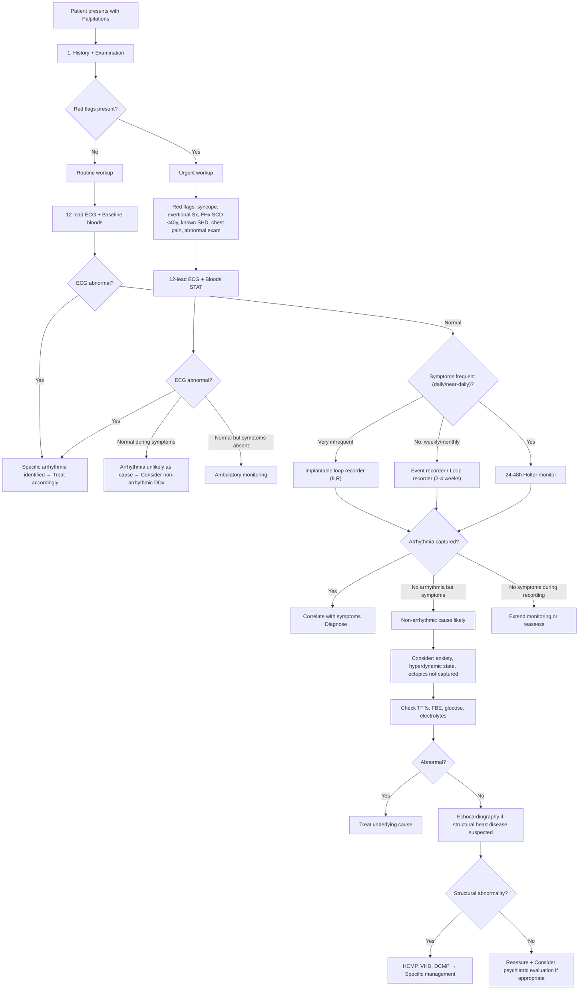

## Diagnostic Criteria

Palpitations themselves have no formal "diagnostic criteria" — they are a symptom, not a disease. The diagnostic process is about **identifying the underlying cause**. However, several specific diagnoses that present *with* palpitations do have formal criteria, and you need to know them.

### When Is the Diagnosis "Just Palpitations" (Benign)?

A diagnosis of benign or functional palpitations is essentially one of exclusion. You can be reasonably confident the palpitations are benign when:

1. **History** is consistent with ectopics or anxiety (gradual onset, no syncope, no red flags)
2. **Resting ECG** is normal (no delta wave, no prolonged QT, no ST changes, no structural abnormalities)
3. **Basic bloods** are normal (no anaemia, normal electrolytes, normal TFTs, normal glucose)
4. **No structural heart disease** on examination or echocardiography
5. **No red flag features**: syncope, exertional palpitations, FHx of SCD < 40y, known cardiomyopathy

<Callout title="The Real Question" type="idea">
The diagnostic criteria you need to know are not for "palpitations" per se, but for the *specific arrhythmias and conditions* that cause them. The diagnostic workup is a systematic process of elimination guided by clinical probability.
</Callout>

### Diagnostic Criteria for Key Underlying Conditions

#### A. Atrial Fibrillation (AF)
- **ECG criteria**: Absence of consistent P waves, replaced by fibrillatory waves (irregular baseline undulations); irregularly irregular RR intervals; narrow QRS (unless coexistent BBB or pre-excitation)
- **Duration classification**: Paroxysmal ( < 7 days, self-terminating), Persistent (>7 days or requiring cardioversion), Long-standing persistent ( > 12 months), Permanent (accepted by patient and clinician)
- A single-lead ECG recording of ≥30 seconds showing AF is sufficient for diagnosis (2024 ESC guidelines)

#### B. Panic Disorder (DSM-5) [6]

> ***A. Recurrent unexpected panic attacks, i.e. an abrupt surge of intense fear/discomfort that reaches a peak within minutes and during which time ≥4 of following symptoms occur:*** [6]
> ***(1) Palpitations, pounding heart or ↑HR (2) Sweating (3) Trembling or shaking (4) Sensations of SOB or smothering (5) Feelings of choking (6) Chest pain or discomfort (7) Nausea or abdominal distress (8) Feeling dizzy, unsteady, light-headed, or faint (9) Chills or heat sensations (10) Paraesthesias (11) Derealization or depersonalization (12) Fear of losing control or 'going crazy' (13) Fear of dying*** [6]
> ***B. ≥1 attacks has been followed by ≥1mo of ≥1 of following: (1) persistent concern/worry about additional panic attacks or their consequences (2) a significant maladaptive change in behaviour related to the attacks*** [6]
> ***C. Not attributable to substance or another medical condition*** [6]
> ***D. Not better explained by another mental disorder*** [6]

Note: Criterion C is critical — you must exclude organic causes (thyrotoxicosis, phaeochromocytoma, arrhythmias, hypoglycaemia) before diagnosing panic disorder. Palpitations are literally criterion A(1).

#### C. Myocardial Infarction — 4th Universal Definition (2018) [17]

Relevant because ***MI/angina*** [3] is a "serious disorder not to be missed":

> ***Detection of rise and/or fall of cardiac biomarker values (preferably cTn) with ≥1 value above 99th URL; plus ≥1 of: (1) Symptoms of ischaemia (2) New or presumed new significant ST-T changes or new LBBB (3) Development of pathological Q waves (4) Imaging evidence of new loss of viable myocardium or new RWMA (5) Identification of an intracoronary thrombus*** [17]

#### D. ECG Diagnostic Criteria for Key Arrhythmias

| Arrhythmia | ECG Criteria | Why These Features Occur |
|---|---|---|
| **Sinus tachycardia** | Rate > 100 bpm, normal P before every QRS, normal P-axis (upright in II, inverted in aVR) | SA node fires faster → same P morphology, just more frequent |
| **APB** | Premature P wave with abnormal morphology ± compensatory pause; narrow QRS | Ectopic atrial focus fires early → P looks different because the depolarisation vector originates from a different site |
| **VPB** | Premature wide QRS ( > 120ms) without preceding P wave; compensatory pause; discordant T wave | Ectopic ventricular focus → slow cell-to-cell conduction (no Purkinje) → wide QRS; T wave opposite to QRS direction |
| ***AF*** | ***No P waves, irregular fibrillatory baseline, irregularly irregular RR intervals*** | Multiple chaotic re-entrant wavelets → no organised atrial depolarisation → random ventricular activation through AV node |
| **AFL** | Sawtooth flutter waves (best seen in II, III, aVF, V1) at ~300/min; regular ventricular rate (usually 2:1 block → ~150 bpm) | Macro-re-entry around tricuspid annulus → rhythmic atrial depolarisation at fixed rate |
| ***AVNRT*** | Narrow complex, regular, 150–250 bpm; ***P waves buried in QRS or just after (pseudo-R' in V1, pseudo-S in inferior leads)*** | Simultaneous atrial and ventricular activation because circuit is so compact that retrograde P occurs during QRS |
| ***AVRT (WPW)*** | During sinus rhythm: ***short PR ( < 120ms), delta wave (slurred QRS upstroke), wide QRS***. During orthodromic AVRT: narrow complex SVT with retrograde P after QRS | Delta wave = pre-excitation via accessory pathway bypassing AV node delay; during AVRT, the circuit uses AV node antegradely (narrow QRS) and accessory pathway retrogradely |
| ***VT*** | ***Wide QRS ( > 120ms), rate > 100 bpm, AV dissociation, capture beats, fusion beats, concordance across precordial leads*** | Ventricular origin → cell-to-cell conduction without Purkinje → wide QRS; atria and ventricles depolarise independently (AV dissociation) |
| ***Long QT*** | ***QTc > 500ms (significant risk), > 470ms in males or > 480ms in females*** (Bazett correction: QTc = QT / √RR) | Delayed ventricular repolarisation from K⁺/Na⁺ channelopathy → ↑window for early afterdepolarisations → TdP |
| **TdP** | Polymorphic VT with sinusoidal oscillation of QRS axis ("twisting of the points") on a background of prolonged QT | EADs trigger polymorphic VT; rotating axis because activation wavefront shifts continuously |
| ***Brugada*** | Coved ST elevation ≥2mm in V1–V3 followed by negative T wave (Type 1 = diagnostic) | Na⁺ channel dysfunction → transmural voltage gradient during repolarisation → predisposition to VF |

---

## Diagnostic Algorithm

The approach to a patient presenting with palpitations follows a structured pathway that moves from clinical assessment → risk stratification → targeted investigations.

### Step-by-Step Clinical Approach

<Callout title="The Golden Rule of Palpitation Diagnosis">
The single most valuable diagnostic event is capturing an **ECG during symptoms**. A normal ECG *during* palpitations essentially excludes arrhythmia as the cause. A normal ECG *between* episodes tells you relatively little — it only excludes resting abnormalities like WPW pattern, prolonged QT, or structural changes.
</Callout>

---

## Investigation Modalities

### A. First-Line Investigations — The "Palpitations Checklist"

> ***A checklist includes: FBE, TFTs, serum glucose, urea, electrolytes and magnesium, ECG, cardiac enzymes, echocardiography, Holter monitoring*** [3]

Let's go through each systematically, explaining *why* each test is ordered and *what* you're looking for.

---

#### 1. 12-Lead ECG

**Why it's done**: The single most important first-line investigation. It gives you a snapshot of the heart's electrical activity *right now*.

**When to do it**: Every patient presenting with palpitations. Ideally during symptoms — this is diagnostic gold.

> ***The ideal time to examine the patient is during the palpitations. If not, the examination is usually normal*** [3]

**Key findings and their interpretation**:

| ECG Finding | Diagnosis Suggested | Pathophysiology |
|---|---|---|
| Normal sinus rhythm | Symptoms may be benign; does NOT exclude paroxysmal arrhythmia | Between attacks, conduction system functions normally |
| Sinus tachycardia | Secondary cause (fever, anaemia, thyrotoxicosis, anxiety, drugs) | ↑SA node automaticity from sympathetic drive |
| Delta wave + short PR | ***WPW syndrome*** [3] — even if asymptomatic at time of ECG | Accessory pathway conducts faster than AV node → pre-excitation (delta wave = early slow ventricular activation before His-Purkinje catches up) |
| Prolonged QTc | ***Long QT syndrome*** [3]; drugs; ***hypoK, hypoMg*** [3] | Delayed repolarisation → ↑risk of EADs → TdP |
| Ectopic beats (APB/VPB) | ***Premature beats*** [3] — most common cause of palpitations | Ectopic focus fires prematurely |
| AF pattern | ***Atrial fibrillation*** [3] | Chaotic atrial activation |
| Flutter waves | ***Atrial flutter*** [3] | Organised macro-re-entry in RA |
| Wide complex tachycardia | ***VT*** until proven otherwise | Ventricular origin or SVT with aberrancy |
| ST changes | ***MI/ischaemia*** [3] | Myocardial injury current |
| LVH criteria | HCMP, hypertensive heart disease → substrate for arrhythmia | ↑LV mass → ↑voltage on ECG |
| Giant T-wave inversions in precordial leads | Apical HCMP (high prevalence in HK) | Apical hypertrophy creates repolarisation abnormality |
| Brugada pattern (coved ST in V1-3) | Brugada syndrome | Na⁺ channel dysfunction → repolarisation abnormality |
| Epsilon waves in V1-V3 | ARVC (arrhythmogenic RV cardiomyopathy) | Fatty/fibrotic replacement of RV myocardium → delayed RV activation |

**Technical note on ECG interpretation** [18]:
- ***Speed = 25mm/s (1s = 5 large squares) → Rate = 300 / number of large squares between R-R*** [18]
- ***Amplitude = 1mV/cm (2 large squares = 1mV)*** [18]
- ***Limb leads look at heart in frontal plane; Chest leads in horizontal plane*** [18]
- ***Cardiac rhythm identified from whichever lead showing P wave most clearly (usually lead II)*** [18]

---

#### 2. Blood Tests

##### a. ***FBE (Full Blood Examination / CBC)*** [3]

**Why**: To detect ***anaemia*** [3] — a common and easily treatable masquerade.

| Finding | Interpretation |
|---|---|
| ↓Hb | Anaemia → hyperdynamic circulation → sinus tachycardia / ↑awareness of heartbeat |
| ↑WCC | Infection/fever → sinus tachycardia |
| ↓Platelets or ↑Platelets | Haematological disorder; thrombocytosis → reactive (IDA causes reactive thrombocytosis [19]) |

##### b. ***TFTs (Thyroid Function Tests)*** [3]

**Why**: ***Consider hyperthyroidism as a cause of atrial fibrillation or sinus tachycardia even if the clinical manifestations are not apparent*** [3]. This is the single most commonly missed endocrine cause.

| Finding | Interpretation |
|---|---|
| ↓TSH, ↑fT4 | Overt thyrotoxicosis → AF, sinus tachycardia, ectopics, ↑contractility |
| ↓TSH, normal fT4/T3 | Subclinical hyperthyroidism — still a risk factor for AF, especially in elderly |
| ↑TSH, ↓fT4 | Hypothyroidism — can cause bradycardia (less commonly palpitations, but important) |

> ***Diagnostic Ix: by TFT (TSH most sensitive). ↓TSH ↑T3 ↑fT4: diagnostic of thyrotoxicosis (TSH usually undetectable)*** [20]

##### c. ***Serum Glucose*** [3]

**Why**: ***Hypoglycaemia (type 1 diabetes)*** [3] causes adrenergic symptoms including ***palpitation, sweating, anxiety, tremor, tachycardia*** [15].

| Finding | Interpretation |
|---|---|
| < 3.9 mmol/L (with symptoms) | Hypoglycaemia → counter-regulatory catecholamine surge → sinus tachycardia |
| Elevated | DM → check for DKA (can cause hypoK → arrhythmia) |

##### d. ***Urea, Electrolytes and Magnesium*** [3]

**Why**: ***Hypokalaemia and hypomagnesaemia*** [3] are the electrolyte disturbances that most commonly cause arrhythmias.

| Finding | Interpretation | Arrhythmia Risk |
|---|---|---|
| ***↓K⁺ ( < 3.5 mmol/L)*** | Diuretics, vomiting, diarrhoea, RTA, Conn's syndrome | ↑Resting membrane potential → delayed repolarisation → ↑QT → U waves → ectopics, VT, TdP |
| ***↓Mg²⁺ ( < 0.7 mmol/L)*** | Often coexists with hypoK; diuretics, alcohol, PPI use | Mg²⁺ stabilises K⁺ channels; depletion → refractory hypoK + independent pro-arrhythmic effect |
| ↑K⁺ ( > 5.5 mmol/L) | Renal failure, K-sparing diuretics, DKA, ACEi/ARBs | ***ECG changes: 6-7 mmol/L (tall peaked T), 8-10 (wide QRS), 11 (sine wave), 10-12 (VF)*** [21] |
| ↑Urea/Cr | Renal failure → hyper/hypoK, fluid overload → HF → palpitations | Uraemia is itself pro-arrhythmic |
| ↓Ca²⁺ | Hypoparathyroidism, CKD, massive transfusion | Prolonged QT → risk of TdP |

##### e. ***Cardiac Enzymes*** [3]

**Why**: To exclude ***MI/angina*** [3] when palpitations are associated with chest pain or haemodynamic compromise.

| Marker | Interpretation |
|---|---|
| ↑hs-cTnI/T (rise and/or fall with at least 1 value > 99th percentile URL) | Myocardial injury — Type 1 MI (ACS) vs Type 2 MI (demand ischaemia from tachyarrhythmia) [17] |
| ↑NT-proBNP/BNP | Heart failure — particularly if palpitations are from tachycardia-induced cardiomyopathy or AF with fast ventricular rate |

<Callout title="Type 2 MI in Tachyarrhythmia" type="error">
A sustained tachycardia itself can cause troponin elevation (Type 2 MI) through supply-demand mismatch — ↑HR → ↓diastolic time → ↓coronary perfusion + ↑myocardial O₂ demand. This does NOT necessarily mean the patient has ACS. Context is everything.
</Callout>

---

#### 3. ***Echocardiography*** [3]

**Why**: To assess for structural heart disease — the substrate for many dangerous arrhythmias.

**Indications**: Not needed for every patient with palpitations. Order when:
- Suspected structural heart disease (abnormal examination, abnormal ECG)
- Syncope or presyncope with palpitations
- Sustained tachyarrhythmia documented
- Murmur on examination
- Young patient with FHx of SCD or cardiomyopathy

| Finding | Diagnosis | Clinical Significance |
|---|---|---|
| Asymmetric septal hypertrophy (ASH) + SAM | HCMP | Substrate for VT/VF and AF; risk of SCD |
| Apical hypertrophy with spade-like LV cavity | Apical HCMP (HK-relevant) | Usually more benign than obstructive HCMP |
| Dilated LV with ↓LVEF | DCMP | Substrate for VT; risk of thromboembolism |
| Mitral stenosis with ↑LA size | Rheumatic MS → AF | LA dilatation provides substrate for AF |
| Mitral valve prolapse with MR | MVP | Associated with ectopics, SVT, rarely VT |
| Aortic regurgitation | AR → hyperdynamic palpitations | Wide pulse pressure → forceful beats |
| RV dilatation with fatty infiltration | ARVC | Substrate for RV-origin VT |
| Regional wall motion abnormalities | Prior MI → scar-related VT | Re-entrant VT around scar |

---

#### 4. ***Holter Monitoring*** [3] (Ambulatory ECG)

**Why**: Most palpitations are paroxysmal — the resting ECG will be normal. You need to *catch* the arrhythmia in the act.

**Principle**: Continuous ECG recording over 24–48 hours (or up to 7 days with extended Holter) while the patient goes about daily life. Patient keeps a *diary* noting when symptoms occur → allows correlation of symptoms with rhythm.

**Key point**: The diagnostic yield depends on symptom frequency:
- **Daily symptoms** → 24h Holter is appropriate (yield ~50%)
- **Weekly symptoms** → Extended Holter (7-day) or event recorder (yield improves to 65-85%)
- **Monthly or less frequent** → External loop recorder (2-4 weeks) or implantable loop recorder (ILR)

| Holter Finding | Interpretation |
|---|---|
| Symptoms + arrhythmia at same time | **Diagnostic correlation** — the arrhythmia is the cause |
| Symptoms + normal rhythm at same time | **Arrhythmia excluded** as cause → think non-arrhythmic DDx (anxiety, hyperdynamic, etc.) |
| Arrhythmia present but no symptoms | Arrhythmia exists but is not the cause of patient's symptoms (incidental) |
| No symptoms + no arrhythmia | **Non-diagnostic** — extend monitoring duration |
| Frequent ectopics ( > 10% burden on 24h Holter) | May indicate risk of tachycardia-induced cardiomyopathy; consider treatment |

---

#### 5. Event Recorders and Implantable Loop Recorders (ILR)

**Event recorder (external)**:
- Patient-activated device worn for 2-4 weeks
- When symptoms occur, patient presses a button → device saves the preceding 30-60 seconds and the following 30-60 seconds of ECG
- **Advantage**: Much longer monitoring window than Holter
- **Limitation**: patient must be conscious and able to activate

**Implantable loop recorder (ILR)** (e.g., LINQ device):
- Small device implanted subcutaneously in the left parasternal area under local anaesthesia
- Continuous monitoring for up to **3 years**
- Auto-detects arrhythmias + patient can activate during symptoms
- **Indication**: Infrequent but clinically significant episodes (especially syncope with suspected arrhythmia), after non-diagnostic Holter/event recorder
- **Yield**: Up to 90% diagnostic yield for recurrent unexplained syncope

---

### B. Second-Line / Targeted Investigations

These are not done routinely for all patients but are directed by clinical suspicion.

#### 6. Exercise Stress Testing (EST)

**Why**: For palpitations that are ***exercise-induced*** — ***During exercise: think PSVT, AF and VT*** [1][2]

**Principle**: Graded exercise on treadmill or bicycle with continuous ECG monitoring. Provokes arrhythmias that are catecholamine-dependent.

| Finding | Interpretation |
|---|---|
| SVT induced by exercise | Catecholamine-sensitive SVT |
| VT induced by exercise | Structural heart disease (post-MI scar VT) or catecholaminergic polymorphic VT (CPVT) — very important in young patients with exertional syncope |
| ST depression with exercise | Ischaemia → demand ischaemia as cause of palpitations |
| Inappropriate sinus tachycardia | Consider IST (inappropriate sinus tachycardia syndrome) |

#### 7. Electrophysiology Study (EPS)

**Why**: The definitive invasive test to characterise arrhythmia mechanism. Catheters are placed inside the heart to map the electrical activation and provoke arrhythmias in a controlled setting.

**Indications**:
- Pre-ablation mapping (AVNRT, AVRT/WPW, AFL, VT)
- Risk stratification (e.g., inducible VT in post-MI patients)
- When non-invasive monitoring has failed to capture the arrhythmia but clinical suspicion remains high

**What it tells you**: Exact mechanism (re-entry vs automaticity vs triggered), location of the circuit/focus, suitability for catheter ablation

#### 8. Cardiac MRI (CMR)

**Why**: The gold standard for myocardial tissue characterisation — particularly useful for:

| Indication | What CMR Shows |
|---|---|
| HCMP evaluation | Distribution and degree of hypertrophy, late gadolinium enhancement (LGE) = fibrosis/scar = substrate for VT |
| ARVC evaluation | Fatty infiltration of RV, RV dilatation, wall motion abnormalities (modified Task Force criteria for ARVC) |
| Myocarditis | Oedema (acute inflammation) + LGE in mid-wall/epicardial pattern (cf. subendocardial in ischaemia) |
| DCMP evaluation | Degree of dilatation, LGE pattern, aetiological clues |
| Sarcoidosis | LGE in basal septum — cardiac sarcoid is a cause of VT and heart block |

#### 9. Myocardial Perfusion Imaging (MPI) [22]

**Why**: When ischaemia is suspected as the driver of palpitations (exercise-induced symptoms, risk factors for CAD).

> ***Indication: screening and diagnosis of coronary artery disease. Determine adequacy of blood flow ± stress (functional in nature → detect a haemodynamically significant anatomical endpoint, i.e., flow-limiting coronary stenosis defined by ≥50% diameter stenosis)*** [22]

- ***At rest, partial coronary stenosis limits blood flow but collaterals + vasodilation maintain perfusion*** [22]
- ***With stress, vessels supplying normal myocardium also dilate → blood siphoned away from affected territory ('coronary steal') → cold spots*** [22]
- ***Ischaemia → cold spots with stress only; Infarct → cold spots at rest AND stress*** [22]

#### 10. Specific Endocrine Investigations

##### Phaeochromocytoma workup (when clinical suspicion: ***classic triad of headache + sweating + palpitation*** [9])

> ***Biopsy is NOT required: high risk of hypertensive crisis and haematoma*** [10]

| Test | Details | Interpretation |
|---|---|---|
| ***24h urine catecholamines + fractionated metanephrines*** [10] | ***Most sensitive (continuous release). Abnormal if > 2× elevation. False positives: stress, OSA, drugs (TCA, α-agonist, levodopa → stop 1 week)*** [10] | Sens 98% Spec 98% [9] |
| ***Plasma fractionated metanephrines*** [10] | ***Most specific but needs indwelling catheter > 30min. Preferred in chronic renal failure*** [10] | Sens 96-100% Spec 85-89% [9] |
| ***CT with low-osmolar contrast / T2-MRI*** [10] | Anatomical localisation. ***CT: alpha blockade prior to IV contrast due to risk of HT crisis. Low-osmolar contrast safe even without alpha/beta blockade*** [10] | Localise adrenal or extra-adrenal tumour |
| ***I-123 MIBG scan*** [10] | ***MIBG = metaiodobenzylguanidine, NE analog taken up by phaeochromocytoma*** [10] | Functional localisation, especially for extra-adrenal or metastatic disease |
| ***68Ga-DOTATATE PET-CT*** [10] | Detect metastatic disease | Superior sensitivity for metastatic phaeochromocytoma/paraganglioma |

##### Thyrotoxicosis workup [20]

| Test | Finding | Interpretation |
|---|---|---|
| ***TSH (most sensitive)*** [20] | ↓TSH (usually undetectable in overt thyrotoxicosis) | Screening test of choice |
| ***fT4, T3*** | ↑fT4 ± ↑T3 | Confirms thyrotoxicosis |
| ***TRAb (anti-TSHr)*** | Positive | Specific for Graves' disease; prognostic for relapse [20] |
| ***Thyroid scintigraphy*** | ***Diffuse ↑uptake = Graves'; heterogeneous ↑uptake = toxic MNG; focal ↑uptake = toxic adenoma; diffuse ↓uptake = destructive thyroiditis vs factitious*** [20] | Aetiological differentiation when clinically uncertain |

##### Hypoglycaemia workup

> ***Diagnosis confirmed by Whipple's triad: (1) Symptoms compatible with hypoglycaemia, (2) Low blood glucose coinciding with time of symptoms, (3) Resolution of symptoms with correction of hypoglycaemia*** [15]

---

### C. Investigation Selection Algorithm (Symptom-Frequency Based)

| Symptom Frequency | Best Monitoring Strategy | Rationale |
|---|---|---|
| **Symptoms occurring NOW** | 12-lead ECG immediately | Capture the arrhythmia in real-time — diagnostic gold |
| **Daily or near-daily** | 24-48h Holter | High probability of capturing an event within recording window |
| **Weekly** | 7-day extended Holter or external event recorder | Need longer monitoring to catch infrequent events |
| **Monthly** | External loop recorder (2-4 weeks) | Even longer window; patient-activated |
| **Very infrequent / unexplained syncope** | Implantable loop recorder (ILR) | Up to 3 years of continuous monitoring |
| **Exercise-triggered** | Exercise stress test | Reproduce the arrhythmia under controlled conditions |
| **Suspected structural heart disease** | Echocardiography ± Cardiac MRI | Assess substrate (hypertrophy, scar, dilatation, valvular disease) |
| **High suspicion, non-diagnostic non-invasive** | Electrophysiology study (EPS) | Definitive invasive characterisation and potential ablation |

---

### Summary of Key Investigation Findings by Diagnosis

| Suspected Diagnosis | Key Investigations | Diagnostic Finding |
|---|---|---|
| ***Ectopics*** | ECG, Holter | APB (premature narrow QRS + abnormal P) or VPB (premature wide QRS, no P) |
| ***AF*** | ECG, Holter | Absent P, fibrillatory baseline, irregularly irregular RR |
| ***SVT (AVNRT/AVRT)*** | ECG during attack, EPS | Narrow complex regular tachycardia; EPS defines mechanism |
| ***WPW*** | Resting ECG | Delta wave + short PR + wide QRS |
| ***VT*** | ECG, Holter, EPS | Wide complex tachycardia + AV dissociation |
| ***Long QT*** | ECG | QTc > 470ms (M) or > 480ms (F); ± genetic testing |
| ***Anaemia*** | ***FBE*** [3] | ↓Hb, ↓MCV (if IDA), ↓reticulocytes |
| ***Thyrotoxicosis*** | ***TFTs*** [3] | ↓TSH, ↑fT4 |
| ***Electrolyte disturbance*** | ***U&E + Mg*** [3] | ↓K⁺, ↓Mg²⁺ |
| ***MI/ACS*** | ***ECG + cardiac enzymes*** [3] | ST changes + ↑hs-cTnI |
| ***Phaeochromocytoma*** | 24h urine metanephrines, CT/MRI | > 2× elevation of metanephrines; adrenal mass |
| ***Structural HD (HCMP, DCMP)*** | ***Echo*** [3], cardiac MRI | ASH, SAM, ↓LVEF, LGE |
| ***Panic disorder*** | Clinical (DSM-5 criteria) after excluding organic causes | ≥4 symptoms during unexpected panic attacks + ≥1mo worry/behavioural change [6] |

---

> ***Diagnostic tips*** [3]:
> ***A relatively non-specific symptom.*** [3]
> ***Consider hyperthyroidism as a cause of atrial fibrillation or sinus tachycardia even if the clinical manifestations are not apparent.*** [3]
> ***Arrhythmia of sudden onset suggests paroxysmal supraventricular tachycardia (PSVT), atrial flutter/fibrillation or ventricular tachycardia.*** [3]
> ***Common triggers for premature beats and PSVT are smoking, anxiety and excessive caffeine.*** [3]

---

<Callout title="High Yield Summary">

1. **No formal diagnostic criteria for "palpitations"** — the diagnosis is about identifying the underlying cause.

2. **12-lead ECG** is the single most important first-line investigation. A normal ECG *during symptoms* essentially excludes arrhythmia. A normal ECG *between episodes* only excludes resting abnormalities (WPW pattern, prolonged QT, structural changes).

3. **Murtagh's investigation checklist**: FBE, TFTs, serum glucose, U&E + Mg, ECG, cardiac enzymes, echocardiography, Holter monitoring.

4. **Ambulatory monitoring choice depends on symptom frequency**: Daily → Holter; Weekly → extended Holter/event recorder; Monthly → external loop recorder; Very infrequent → ILR.

5. **The diagnostic correlation**: Symptoms + arrhythmia simultaneously = diagnostic. Symptoms + normal rhythm = arrhythmia excluded. Arrhythmia + no symptoms = incidental finding.

6. **Always check TFTs** — even in patients without obvious thyrotoxic features. Thyrotoxicosis is the great imitator and a common cause of AF.

7. **ECG red flags on resting ECG**: Delta wave (WPW), prolonged QTc (LQTS/drugs/electrolytes), Brugada pattern, LVH (HCMP), epsilon waves (ARVC), Q waves (prior MI scar → VT substrate).

8. **Phaeochromocytoma**: Biopsy is NEVER done. Diagnosis by 24h urine fractionated metanephrines (Sens 98%). Localise by CT/MRI + MIBG scan.

9. **Panic disorder diagnosis (DSM-5)**: Requires recurrent unexpected panic attacks with ≥4/13 symptoms + ≥1 month of worry/behavioural change + exclusion of organic causes + not better explained by another mental disorder.

</Callout>

---

<ActiveRecallQuiz
  title="Active Recall - Palpitations Diagnosis and Investigations"
  items={[
    {
      question: "List Murtagh's key investigation checklist for palpitations (8 items).",
      markscheme: "FBE, TFTs, serum glucose, urea/electrolytes and magnesium, ECG, cardiac enzymes, echocardiography, Holter monitoring.",
    },
    {
      question: "A patient has palpitations once a month. 24h Holter was non-diagnostic. What is the next best monitoring strategy and what is its advantage?",
      markscheme: "External loop recorder (worn for 2-4 weeks) or implantable loop recorder (ILR, monitoring up to 3 years). Advantage: much longer monitoring window increases probability of capturing an infrequent event. ILR has up to 90% diagnostic yield for recurrent unexplained syncope.",
    },
    {
      question: "On a resting ECG, you notice a short PR interval, delta wave, and wide QRS. The patient is asymptomatic. What is the diagnosis, and what is the pathophysiological basis of the delta wave?",
      markscheme: "WPW syndrome (ventricular pre-excitation pattern). The delta wave represents early slow activation of ventricular myocardium via the accessory pathway (Bundle of Kent), which bypasses the AV nodal delay. The slurred upstroke is due to cell-to-cell conduction from the accessory pathway insertion point before the His-Purkinje system activates the rest of the ventricle normally.",
    },
    {
      question: "Why must you check TFTs in every patient with new-onset AF, even if they appear clinically euthyroid?",
      markscheme: "Thyrotoxicosis can cause AF or sinus tachycardia even when clinical manifestations are not apparent (subclinical hyperthyroidism or apathetic thyrotoxicosis in the elderly). T3/T4 increase beta-1 receptor expression on cardiomyocytes, increase Na+/K+-ATPase activity shortening atrial refractory period, and decrease SVR creating a hyperdynamic state, all of which facilitate AF. Treating the thyrotoxicosis may restore sinus rhythm without the need for antiarrhythmics.",
    },
    {
      question: "How do you biochemically diagnose phaeochromocytoma? Name the preferred screening test, its sensitivity, and one important precaution.",
      markscheme: "24h urine for fractionated metanephrines is the preferred screening test (Sens 98%, Spec 98%). Important precaution: stop drugs affecting catecholamine secretion (e.g., TCAs, levodopa, alpha-agonists, amphetamines) at least 1 week prior. Biopsy is NEVER performed due to risk of hypertensive crisis and haematoma.",
    },
    {
      question: "What are the three possible outcomes when correlating symptoms with ambulatory ECG monitoring, and what does each mean clinically?",
      markscheme: "(1) Symptoms present + arrhythmia recorded simultaneously = diagnostic correlation, arrhythmia is the cause. (2) Symptoms present + normal rhythm recorded = arrhythmia excluded as cause, consider non-arrhythmic differential (anxiety, hyperdynamic state). (3) Arrhythmia recorded + no symptoms = incidental finding, arrhythmia exists but is not causing the patient's palpitations.",
    },
  ]}
/>

## References

[1] Senior notes: Ryan Ho Cardiology.pdf (p61, Section 2.3 Palpitations)
[2] Senior notes: Ryan Ho Fundamentals.pdf (p206, Section 3.1.3 Palpitations)
[3] Lecture slides: murtagh merge.pdf (p72–74, Palpitations)
[6] Senior notes: Ryan Ho Psychiatry.pdf (p178–179, Panic Disorder)
[9] Senior notes: Ryan Ho Endocrine.pdf (p66, Phaeochromocytoma)
[10] Senior notes: maxim.md (Section on Phaeochromocytoma investigations)
[15] Senior notes: Ryan Ho Endocrine.pdf (p94, Hypoglycaemia)
[17] Senior notes: Ryan Ho Cardiology.pdf (p127, Universal Definition of MI)
[18] Senior notes: Ryan Ho Fundamentals.pdf (p448, ECG Basics)
[19] Senior notes: Ryan Ho Haemtology.pdf (p18, Iron Deficiency Anaemia)
[20] Senior notes: Ryan Ho Endocrine.pdf (p13, Thyrotoxicosis investigations)
[21] Senior notes: Ryan Ho Chemical Path.pdf (p14, Hyperkalaemia ECG changes)
[22] Senior notes: Ryan Ho Diagnostic Radiology.pdf (p57, Myocardial Perfusion Imaging)
