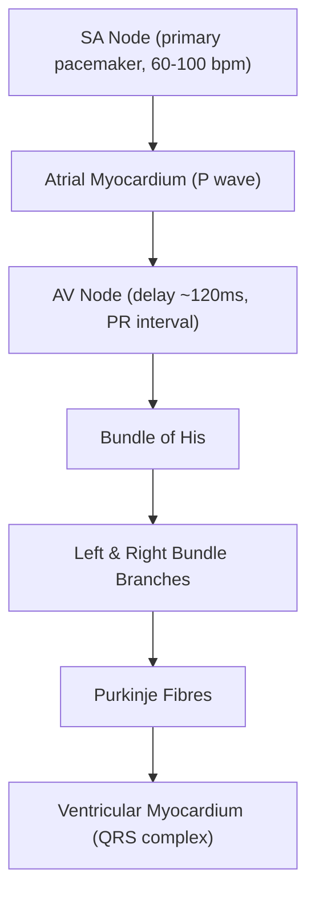
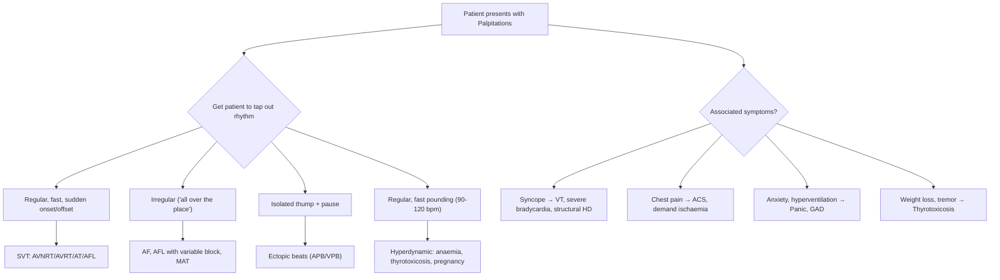

## Definition

**Palpitations** are defined as the **unexpected awareness of one's own heartbeat** [1][2]. The term comes from the Latin *palpitare* — "to throb, to flutter." Normally, we are blissfully unaware of our hearts beating; palpitations represent a break in that unawareness. Patients may describe them variably as "racing," "pounding," "fluttering," "skipping," or a sense of the heart "stopping."

The term itself is deliberately vague — it is a *symptom*, not a diagnosis. That's why it's so important to get patients to **clarify what they mean** and, ideally, ***ask the patient to tap out on the desk the rhythm and rate of the heartbeat experienced during the 'attack'*** [3]. This single bedside manoeuvre can transform a nebulous complaint into a working diagnosis.

<Callout title="Key Concept">
Palpitations ≠ arrhythmia. Palpitations are a *subjective symptom*. Many arrhythmias (e.g., AF) are completely asymptomatic, and many patients with palpitations have no arrhythmia at all — just heightened awareness of a normal or hyperdynamic heartbeat.
</Callout>

---

## Epidemiology

### Prevalence
- Palpitations are one of the most common cardiovascular complaints in primary care, accounting for approximately **16% of general practice presentations** and the **second most common reason for cardiology referral** (after chest pain) [4].
- Population surveys suggest lifetime prevalence of palpitations in the general population is as high as **25–35%**.

### Demographics
- **Female predominance**: Women present with palpitations more frequently, partly due to higher prevalence of anxiety disorders, SVT (especially AVNRT which has F > M predominance), and hormonal fluctuations (menstrual cycle, pregnancy, menopause).
- **Age distribution**: Bimodal — younger patients tend to have benign causes (anxiety, ectopics, SVT, congenital syndromes), whereas older patients are more likely to have structural heart disease and atrial fibrillation.

### Prognosis
- The vast majority of palpitations are benign — only about **10–15%** turn out to be due to a cardiac arrhythmia requiring treatment.
- However, palpitations associated with **syncope, structural heart disease, or ventricular arrhythmias** carry significant mortality risk and must not be missed.

---

## Risk Factors

Risk factors for palpitations mirror the risk factors for their underlying causes:

| Category | Specific Risk Factors | Mechanism |
|---|---|---|
| **Cardiac** | Structural heart disease (IHD, valvular, cardiomyopathy), prior cardiac surgery, congenital heart disease | Substrate for arrhythmias (re-entry circuits, automaticity foci) |
| **Drugs/Substances** | ***Caffeine, cocaine, marijuana, alcohol*** [3], sympathomimetics (salbutamol, pseudoephedrine), ***β-blockers (withdrawal), antipsychotics, antidepressants (TCAs), thyroxine, digoxin, nifedipine*** [3] | Stimulate catecholamine release, prolong QT, alter automaticity |
| **Electrolyte** | ***Hypokalaemia, hypomagnesaemia*** [3] | Alter resting membrane potential → triggered activity, re-entry |
| **Endocrine** | Hyperthyroidism, phaeochromocytoma, ***hypoglycaemia (type 1 diabetes)*** [3] | ↑Sympathetic drive, ↑Na⁺/K⁺-ATPase activity |
| **Lifestyle** | ***Smoking***, excessive exercise, sleep deprivation | ↑Catecholamines, vagal withdrawal |
| **Psychological** | ***Anxiety, depression, panic disorder*** [3] | ↑Sympathetic tone + heightened interoception (awareness of body signals) |
| **Physiological** | ***Pregnancy, menopause, fever/infection*** [3] | Hyperdynamic circulation (↑blood volume, ↑HR, ↓SVR) |
| **Genetic** | Family history of sudden cardiac death, ***Long QT syndrome, Wolff–Parkinson–White (WPW) syndrome*** [3] | Inherited channelopathies or accessory pathways |
| **Haematological** | ***Anaemia*** [3] | Compensatory ↑HR and ↑stroke volume → hyperdynamic state |

---

## Anatomy and Physiology of the Cardiac Conduction System

To understand *why* palpitations occur, you need to understand the normal electrical conduction of the heart — because palpitations ultimately arise from disturbances in this system, or from the heart beating normally but being perceived abnormally.

### Normal Cardiac Conduction

1. **SA node** (sinoatrial node): Located at the junction of the SVC and right atrium. It is the heart's natural pacemaker, firing at an intrinsic rate of 60–100 bpm. It is richly innervated by both sympathetic (↑rate) and parasympathetic/vagal (↓rate) fibres.

2. **Atrial conduction**: Impulse spreads through atrial myocardium → atrial contraction (P wave on ECG).

3. **AV node** (atrioventricular node): Sits in the Triangle of Koch (between coronary sinus, tricuspid valve, and tendon of Todaro). It is the *only* normal electrical connection between atria and ventricles. It introduces a deliberate delay (~120ms) to allow atrial contraction to fill the ventricles before ventricular systole. This is the basis of the PR interval.

4. **His-Purkinje system**: Bundle of His → left and right bundle branches → Purkinje fibres → ventricular myocardium → coordinated ventricular contraction (QRS complex).

### Mechanisms of Arrhythmogenesis

There are three fundamental mechanisms by which abnormal rhythms arise:

| Mechanism | Description | Examples |
|---|---|---|
| **Abnormal automaticity** | A focus outside the SA node develops spontaneous depolarization, either by enhanced normal automaticity or by abnormal automaticity in cells that don't normally fire spontaneously | Sinus tachycardia, some atrial tachycardias, accelerated idioventricular rhythm |
| **Re-entry** | An electrical impulse travels in a circuit repeatedly, re-exciting tissue. Requires: (1) two pathways with different conduction velocities and refractory periods, (2) unidirectional block in one pathway, (3) slow conduction in the other | AVNRT, AVRT (WPW), atrial flutter, most VTs in structural heart disease |
| **Triggered activity** | Oscillations in membrane potential during or after repolarization (early or delayed afterdepolarizations) trigger premature firing | Digoxin toxicity (DADs), Long QT/Torsades de Pointes (EADs), catecholaminergic polymorphic VT |

<Callout title="Why does this matter clinically?">
Understanding the mechanism tells you how to treat. Re-entrant tachycardias can be *terminated* by breaking the circuit (vagal manoeuvres, adenosine, ablation). Automatic tachycardias *cannot* be cardioverted — they just restart. Triggered activity is managed by removing the trigger (correcting electrolytes, stopping offending drugs).
</Callout>

---

## Aetiology

This is the core of the clinical approach. The causes of palpitations fall into three broad pathophysiological categories [1][2]:

> ***Palpitations can result from: (1) Tachyarrhythmias felt by patients, (2) Hyperdynamic circulation exaggerating sinus rhythm, (3) Bradyarrhythmias with strong beats (↑diastolic time → ↑stroke volume)*** [1][2]

### Category 1: Tachyarrhythmias

These are the primary cardiac causes.

| Site of Origin | Tachyarrhythmias | Bradyarrhythmias |
|---|---|---|
| ***SA node*** | ***Sinus tachycardia (ST)*** | ***Sinus bradycardia, Sick sinus syndrome, Sinus arrest, Sinoatrial block*** |
| ***Atrial muscle*** | ***Atrial tachycardia (AT), Atrial flutter (AFL), Atrial fibrillation (AF), Atrial premature beats/ectopics (APB)*** | ***Atrial escape*** |
| ***AV node*** | ***AV re-entrant tachycardia (AVRT), AV nodal re-entrant tachycardia (AVNRT), Junctional tachycardia*** | ***AV blocks, Junctional escape*** |
| ***Ventricles*** | ***Ventricular tachycardia (VT), Ventricular fibrillation (VF), Ventricular premature beats/ectopics (VPB)*** | ***Ventricular escape*** |

[1][2]

#### A. Supraventricular Causes (SA Node + Atrium + AV Node)

**Sinus tachycardia (ST)**
- Most common cause of a fast, regular palpitation
- Not a primary arrhythmia — it is the *appropriate* response to a physiological or pathological stimulus
- Causes: exercise, fever, anxiety, pain, anaemia, thyrotoxicosis, dehydration, drugs (sympathomimetics, caffeine), heart failure, PE
- Pathophysiology: ↑sympathetic drive or ↓vagal tone → ↑SA node firing rate
- Rate: 100–180 bpm, regular, gradual onset and offset

***Premature beats (ectopics) — atrial and ventricular*** [3]
- The single most common cause of palpitations in clinical practice
- ***Atrial premature beats (APB)***: premature depolarisation originating from ectopic atrial focus
- ***Ventricular premature beats (VPB)***: premature depolarisation originating from ventricular focus
- Why patients feel them: the premature beat itself is often too weak to generate a good pulse (under-filled ventricle), but the *compensatory pause* that follows allows extra diastolic filling → the *next* normal beat is unusually forceful → patient perceives a "thump" or "skip"
- ***Common triggers: smoking, anxiety and excessive caffeine*** [3], ***alcohol, nicotine, worse at rest*** [1][2]

***Supraventricular tachycardia (SVT)*** [3] — a broad term encompassing:

**AVNRT (AV Nodal Re-entrant Tachycardia)**
- ***Young*** patients, F > M [1][2]
- Most common paroxysmal SVT
- Mechanism: re-entry within or near the AV node — the AV node has two functional pathways (fast and slow); the circuit goes down one and up the other
- ***Sudden onset, sudden termination*** [1][2]
- ***Terminated by vagal manoeuvres (e.g., sneeze, cough, defecation)*** [1][2] — because the AV node is the vulnerable link in the circuit; increased vagal tone slows AV nodal conduction and breaks the circuit
- Rate: 150–250 bpm, very regular

**AVRT (AV Re-entrant Tachycardia)**
- Involves an accessory pathway (e.g., ***Wolff–Parkinson–White (WPW) syndrome*** [3])
- WPW → "W" = wide on ECG when pre-excited, "P" = pathway (Bundle of Kent), "W" = Wolff
- Mechanism: macro-re-entry circuit using the AV node as one limb and the accessory pathway as the other
- ***Sudden onset and termination*** [1][2], also responsive to vagal manoeuvres
- Danger: if AF develops in WPW, the accessory pathway can conduct very rapidly → VF → sudden cardiac death

***Atrial fibrillation (AF)*** [3]
- The most common sustained arrhythmia globally
- Very relevant in Hong Kong's ageing population
- Mechanism: multiple chaotic re-entrant wavelets in the atria → completely disorganized atrial activity → irregularly irregular ventricular response
- Pathophysiology: structural remodelling (atrial dilatation, fibrosis) → heterogeneous conduction → perpetuates AF ("AF begets AF")
- Risk factors: age, hypertension, HF, valvular disease (esp mitral stenosis), thyrotoxicosis, alcohol ("holiday heart"), obesity, OSA
- ***Irregular palpitations → think AF*** [1][2]

***Atrial flutter (AFL)*** [3]
- Mechanism: macro-re-entrant circuit in the right atrium, typically around the tricuspid valve annulus (cavotricuspid isthmus-dependent)
- Atrial rate ~300 bpm with typical 2:1 AV block → ventricular rate ~150 bpm (regular)
- ***AFL/AT with variable block*** can mimic AF with irregular palpitations [1][2]

***Atrial tachycardia (AT)***
- Mechanism: ***abnormal automaticity, re-entry at single atrial focus (microreentry), triggered activity*** [5]
- Causes: ***no underlying disease (good prognosis), atrial enlargement, digitalis toxicity*** [5]
- Atrial rate 110–250 bpm, abnormal P-wave morphology

***Multifocal atrial tachycardia (MAT)***
- ***≥3 P wave morphologies in the same lead*** [5]
- ***A/w pulmonary disease (~60%), congestive HF, hypoK, hypoMg*** [5]
- Irregularly irregular but with *flat isoelectric line preserved* (cf. AF where baseline is chaotic)

#### B. Ventricular Causes

***Ventricular tachycardia (VT)*** [3]
- ≥3 consecutive ventricular beats at >100 bpm
- Most commonly associated with structural heart disease (prior MI with scar → re-entrant circuit)
- Dangerous — can degenerate into VF → cardiac arrest
- May present as palpitations, syncope, or sudden death
- ***During exercise: think PSVT, AF and VT*** [1][2]

***Ventricular fibrillation (VF)*** [3]
- Chaotic, uncoordinated ventricular activity → no effective cardiac output → cardiac arrest
- Patient will not be conscious to report palpitations — but VF often preceded by VT, which may cause preceding palpitations

***Torsades de Pointes (TdP)*** [3]
- A specific form of polymorphic VT occurring in the setting of prolonged QT interval
- "Torsades de Pointes" = French for "twisting of the points" — the QRS complexes twist around the isoelectric line
- Causes: drugs (antiarrhythmics, antipsychotics, macrolides, fluoroquinolones), ***hypokalaemia, hypomagnesaemia*** [3], congenital ***Long QT syndrome*** [3]

#### C. Bradyarrhythmias

Perhaps counterintuitively, bradycardias can cause palpitations. The mechanism: ***↑diastolic time → ↑stroke volume*** [1][2] — the heart fills more during the prolonged diastole, and the next beat ejects a larger volume, producing a "thump."

- ***Sick sinus syndrome*** [3]: alternating bradycardia and tachycardia (tachy-brady syndrome). Common in the elderly.
- ***AV blocks*** [3]: especially second-degree (Mobitz type I/II) and third-degree (complete) heart block
- ***Sinus bradycardia***: athletes, β-blocker/CCB use, hypothyroidism

### Category 2: Hyperdynamic Circulation

These cause palpitations by ***exaggerating sinus rhythm*** — the heart beats normally but harder/faster, and the patient becomes aware of it.

> ***Regular, relatively fast pounding (90–120 bpm) → think hyperdynamic circulation (anaemia, pregnancy, thyrotoxicosis, AR, PDA)*** [1][2]

| Cause | Mechanism of Hyperdynamic State |
|---|---|
| ***Anaemia*** [3] | ↓O₂ carrying capacity → compensatory ↑HR + ↑SV to maintain O₂ delivery |
| ***Pregnancy*** [3] | ↑Blood volume by 40–50%, ↓SVR (progesterone effect), ↑CO |
| ***Thyrotoxicosis*** [3] | T4 ↑β-adrenergic receptor expression, ↑Na⁺/K⁺-ATPase activity, ↑cardiac contractility, ↓SVR |
| ***Fever/infection*** [3] | Metabolic demands ↑ → sympathetic activation → ↑HR (~10 bpm per 1°C) |
| ***Aortic regurgitation (AR)*** | Wide pulse pressure → forceful LV ejection → patient feels the "water-hammer" pulse |
| ***PDA (Patent Ductus Arteriosus)*** | Left-to-right shunt → volume overload of left heart → ↑SV |
| ***Menopause*** [3] | Oestrogen withdrawal → vasomotor instability, sympathetic activation |
| ***Exercise*** [3] | ↑Sympathetic drive → ↑HR and contractility |

### Category 3: Non-Cardiac / Psychiatric Causes

***Anxiety*** [3] — the single most common cause in Murtagh's "probability diagnosis"

- ***Anxiety and cardiac neurosis*** [3] are extremely common causes of palpitations
- Mechanism: ↑sympathetic activation → sinus tachycardia + heightened interoceptive awareness (the brain's threat-detection system amplifies perception of normal heartbeat)
- ***Depression*** [3] (masquerade checklist): often coexists with anxiety; SSRIs and TCAs can themselves cause palpitations

***Panic disorder*** [6]:
- Recurrent, unexpected panic attacks with intense autonomic symptoms including palpitations, chest pain, SOB, diaphoresis, tremor
- Patients genuinely believe they are having a heart attack
- ***↑Anxiety sensitivity: fear of anxiety symptoms and catastrophic cognition regarding bodily sensations (e.g., misattribution of rapid heartbeat as heart attack)*** [6]

***Somatoform disorder*** [7]:
- CVS/resp symptoms including ***chest pain, SOB, palpitations*** are common somatic presentations [7]
- Excessive health-seeking behaviour, high utilization

### Category 4: Drugs and Substances

***Drugs*** deserve special emphasis as a cause [3]:

| Drug Category | Examples | Mechanism |
|---|---|---|
| ***Stimulants*** [3] | ***Caffeine, cocaine***, amphetamines, MDMA | ↑Catecholamine release → ↑automaticity, trigger ectopics/SVT |
| ***Prescribed drugs*** [3] | ***β-blockers*** (rebound tachycardia on withdrawal), ***antipsychotics*** (QT prolongation), ***antidepressants (TCAs)*** (anticholinergic + Na⁺ channel blockade), ***thyroxine*** (iatrogenic thyrotoxicosis), ***digoxin*** (toxicity → multiple arrhythmias), ***nifedipine*** (reflex tachycardia from vasodilation), ***sympathomimetics*** (salbutamol, adrenaline) | Various — see individual mechanisms |
| ***Alcohol*** [3] | Acute binge ("holiday heart") or chronic | Direct myocardial toxicity + electrolyte derangement (↓K⁺, ↓Mg²⁺) → AF, atrial flutter |
| ***Marijuana*** [3] | THC | ↑Sympathetic tone, ↓parasympathetic → sinus tachycardia |

### Murtagh's Diagnostic Strategy Summary [3]

This is from the lecture slides — extremely high yield:

> ***Probability diagnosis: Anxiety, Premature beats (ectopics) — atrial and ventricular, Sinus tachycardia (e.g., fever, exercise), Supraventricular tachycardia, Drugs (e.g., stimulants)*** [3]

> ***Serious disorders not to be missed: Myocardial infarction/angina, Arrhythmias (atrial fibrillation or flutter, ventricular tachycardia, bradycardia/heart block, sick sinus syndrome, torsade de pointes), Long QT syndrome, Wolff–Parkinson–White (WPW) syndrome, Electrolyte disturbances (hypokalaemia, hypomagnesaemia, hypoglycaemia in type 1 diabetes)*** [3]

> ***Pitfalls (often missed): Fever/infection, Pregnancy, Menopause, Drugs (e.g., caffeine, cocaine), Mitral valve disease, Aortic incompetence, Hypoxia/hypercapnia*** [3]

> ***Rarities: Tick bites (T1–5), Phaeochromocytoma*** [3]

> ***Masquerades checklist: Depression, Diabetes (indirect), Drugs (see list), Anaemia, Thyroid disorder (hyperthyroidism), Spinal dysfunction*** [3]

> ***Is the patient trying to tell me something? Quite likely. Consider cardiac neurosis, anxiety.*** [3]

---

## Classification

### By Mechanism
1. **Primary arrhythmic** — the heart's electrical system is genuinely misbehaving
2. **Secondary to systemic cause** — heart is responding appropriately to an abnormal milieu (e.g., sinus tachycardia in anaemia)
3. **Non-cardiac/functional** — heightened perception of normal or near-normal heart activity (e.g., anxiety, somatization)

### By Haemodynamic Significance
1. **Benign/no haemodynamic compromise**: most ectopics, sinus tachycardia, anxiety
2. **Potentially life-threatening**: sustained VT, VF, TdP, WPW with AF, severe bradycardia

### By Duration
1. **Paroxysmal**: discrete episodes with clear start/stop (e.g., AVNRT, paroxysmal AF)
2. **Persistent**: ongoing (e.g., persistent AF, incessant AT)
3. **Chronic/permanent**: established permanent AF

### By Rate
1. **Tachyarrhythmias** ( > 100 bpm)
2. **Bradyarrhythmias** ( < 60 bpm)
3. **Normal rate** (hyperdynamic/functional)

---

## Clinical Features

The clinical approach to palpitations centres on a meticulous history — this is a *history-driven diagnosis*. By the time you examine the patient, the palpitations have usually stopped, and the examination is often normal.

> ***The ideal time to examine the patient is during the palpitations. If not, the examination is usually normal.*** [3]

### A. Symptoms (History)

The history is structured around specific features that narrow the differential:

#### 1. Character / Quality of the Palpitation

> ***Ask the patient to describe the onset and offset of the palpitations, the duration of each episode and any associated features. Then ask the patient to tap out on the desk the rhythm and rate of the heartbeat experienced during the 'attack'. If the patient is unable to do this, tap out the cadence of the various arrhythmias to find a matching beat.*** [3]

| Description | Most Likely Cause | Pathophysiological Basis |
|---|---|---|
| ***Skipped or 'heavy' beats*** [1][2] | ***Ectopic beats (APB or VPB)*** | The premature beat under-fills the ventricle → weak/absent pulse, but the compensatory pause allows extra filling → next beat is hyperdynamic → patient feels a "thump" followed by a "skip" |
| ***An isolated thump or jump followed by a definite pause on a background of a regular pattern*** [3] | ***Premature beats (ectopics), usually ventricular*** [3] | Same mechanism as above |
| ***Irregular palpitations ('all over the place')*** [1][2][3] | ***AF, AFL/AT with variable block, MFAT*** | Chaotic atrial activity → irregular ventricular response → irregular pulse perceived as "fluttering" or "all over the place" |
| ***Regular, relatively fast pounding (90–120 bpm)*** [1][2] | ***Hyperdynamic circulation (anaemia, pregnancy, thyrotoxicosis, AR, PDA)*** | ↑Stroke volume and/or ↑heart rate in the setting of high-output states → forceful, regular beats |
| ***Discrete bouts, very rapid ( > 120 bpm)*** [1][2] | ***Paroxysmal nodal re-entrant tachycardia*** | Re-entrant circuit fires at very high rate → sudden onset of rapid, regular pounding |
| Slow, heavy beating | Bradycardia (sinus, heart block) | ↑Diastolic filling time → ↑stroke volume → each beat felt more forcefully |
| Fluttering in the chest | SVT, AF, anxiety | Rapid rate or irregular rhythm perceived as a "flutter" |

#### 2. Onset and Offset

| Feature | Interpretation | Mechanism |
|---|---|---|
| ***Insidious onset/offset*** [1][2] | ***↑Automaticity → sinus tachycardia, some AT*** | SA node gradually increases its firing rate in response to sympathetic tone |
| ***Sudden onset/offset*** [1][2] | ***Re-entrant circuit → AVRT, AVNRT, some AT*** | Re-entry is an all-or-nothing phenomenon — circuit either sustains or collapses |
| ***Arrhythmia of sudden onset*** [3] | ***Suggests PSVT, atrial flutter/fibrillation or ventricular tachycardia*** [3] | Re-entry or triggered activity — abrupt initiation |

#### 3. Precipitating Factors

| Trigger | Most Likely Cause | Mechanism |
|---|---|---|
| ***At rest*** [1][2] | ***Ectopics and AF*** | ↑Vagal tone at rest → shortens atrial refractory period → facilitates re-entry in AF; ectopics are more noticeable when resting (low background sympathetic "noise") |
| ***During exercise*** [1][2] | ***PSVT, AF, VT*** | ↑Catecholamines → ↑automaticity and conduction velocity → can initiate re-entry or trigger ectopics that induce SVT; exercise-induced VT suggests structural heart disease or CPVT |
| ***Stress, emotional upset*** | Anxiety, sinus tachycardia, ectopics | ↑Sympathetic → ↑HR + heightened awareness |
| ***Postprandial / after carbohydrate load*** | Thyrotoxic periodic paralysis (palpitation component) [8] | ↑Insulin → ↑Na⁺/K⁺-ATPase → hypoK → arrhythmia risk |
| ***Alcohol binge*** | AF ("holiday heart"), ectopics | Direct atrial myocardial toxicity + ↓K⁺/Mg²⁺ |
| ***Caffeine, tea, energy drinks*** [3] | Sinus tachycardia, ectopics, SVT | Adenosine receptor antagonism → ↑sympathetic, ↑catecholamines |
| ***Drugs*** [3] | Various (see above) | Drug-specific mechanisms |
| ***Positional (bending, lying on left side)*** | Ectopics, anxiety | Heart closer to chest wall when lying left → more easily felt; also vagal changes with position |

#### 4. Termination

| Feature | Interpretation | Mechanism |
|---|---|---|
| ***Terminated by vagal manoeuvres (e.g., sneeze, cough, defecation)*** [1][2] | ***Nodal re-entrant tachycardia (AVNRT/AVRT)*** | ↑Vagal tone → slows/blocks conduction through AV node → breaks the re-entrant circuit that depends on AV nodal conduction |
| Gradual offset | Sinus tachycardia, AT due to automaticity | Gradual ↓sympathetic drive → gradual slowing |
| Abrupt offset without vagal manoeuvre | Re-entrant SVT, paroxysmal AF | Circuit spontaneously terminates |

#### 5. Age of Onset

> ***Young: think congenital syndromes (e.g., LQTS, WPWS), AVNRT*** [1][2]
> ***Older: think other arrhythmias esp those a/w underlying structural heart disease*** [1][2]

- **Young patients**: congenital accessory pathways (WPW), inherited channelopathies (Long QT, Brugada, CPVT), AVNRT (most common SVT in young women)
- **Older patients**: AF (prevalence rises sharply with age), VT from ischaemic scar, sick sinus syndrome

#### 6. Associated Symptoms

These help determine haemodynamic significance and underlying cause:

| Associated Symptom | Suggests | Mechanism |
|---|---|---|
| **Syncope / presyncope** | VT, severe bradycardia, LVOT obstruction (HCMP), massive PE | ↓CO → ↓cerebral perfusion |
| **Chest pain** | ACS, HCMP, severe tachycardia causing supply-demand mismatch | ↑HR → ↓diastolic filling time → ↓coronary perfusion + ↑myocardial O₂ demand |
| **Dyspnoea** | Heart failure, PE, anaemia, anxiety | Pulmonary congestion (HF), ↓O₂ delivery (anaemia), hyperventilation (anxiety) |
| **Polyuria post-attack** | SVT (especially AVNRT) | Atrial distension during tachycardia → release of atrial natriuretic peptide (ANP) → diuresis |
| **Diaphoresis** | VT, MI, phaeochromocytoma, hypoglycaemia, panic | Sympathetic activation |
| **Weight loss, heat intolerance, tremor** | Thyrotoxicosis | ↑Metabolic rate from excess T3/T4 |
| **Anxiety, hyperventilation, paraesthesia** | Panic disorder, anxiety | Hyperventilation → respiratory alkalosis → ↓ionized Ca²⁺ → peripheral paraesthesia |

#### 7. Past Medical & Drug History

> ***Take a past history and family history including caffeine intake, smoking, alcohol, social drugs such as marijuana or cocaine, and prescribed drugs (β-blockers, antipsychotics, antidepressants, thyroxine, digoxin, nifedipine, sympathomimetics)*** [3]

- Prior structural heart disease (IHD, valvular, cardiomyopathy) — substrate for arrhythmia
- Thyroid disease
- Psychiatric history (anxiety, panic disorder, depression)
- Family history: sudden cardiac death (especially < 40 years), cardiomyopathy, Long QT, WPW

<Callout title="Red Flag Features in Palpitation History" type="error">
The following features suggest a **serious/life-threatening** cause and demand urgent evaluation:
- Syncope or near-syncope during palpitations
- Palpitations during exercise (especially if associated with chest pain or syncope)
- Family history of sudden cardiac death ( < 40 years)
- Known structural heart disease
- Very rapid rate ( > 150 bpm) or very slow rate
- Associated chest pain or dyspnoea
- Abnormal baseline ECG
</Callout>

---

### B. Signs (Examination)

> ***The cardiovascular examination should assess the pulse rate, rhythm, volume and character*** [3]
> ***The general examination should investigate features suggestive of anaemia, anxiety, tremors, dyspnoea and thyroid disease*** [3]
> ***Look for evidence of mitral valve prolapse*** [3]

#### 1. Cardiovascular Examination

| Sign | What It Suggests | Pathophysiological Basis |
|---|---|---|
| **Irregularly irregular pulse** | AF | No organized atrial contraction → variable RR intervals |
| **Regular rapid pulse ( > 150 bpm)** | SVT, atrial flutter with fixed block, VT | Re-entrant or automatic tachycardia at high rate |
| **Bradycardia** ( < 60 bpm) | Sinus bradycardia, heart block | ↓SA node automaticity or AV conduction block |
| **Collapsing (water-hammer) pulse** | Aortic regurgitation | Wide pulse pressure from large SV + rapid diastolic runoff |
| **Displaced, hyperdynamic apex** | LV dilatation (DCMP, AR, volume overload) | Enlarged LV shifts apex laterally and inferiorly |
| **Mid-systolic click ± late systolic murmur** | ***Mitral valve prolapse*** [3] | Myxomatous degeneration → prolapse of leaflet → click from sudden tensing of chordae, murmur from MR |
| **Mid-diastolic rumbling murmur (at apex)** | Mitral stenosis (think AF as common sequela) | Turbulent flow across stenotic mitral valve; MS is the classic substrate for AF due to left atrial dilatation |
| **Ejection systolic murmur (LLSE, varies with manoeuvres)** | HCMP | Dynamic LVOT obstruction worsens with ↓preload (e.g., standing, Valsalva) |
| **S3 gallop** | Heart failure, volume overload | Rapid ventricular filling in a dilated, non-compliant ventricle |
| **Elevated JVP with cannon A waves** | Complete heart block, VT | Atria contracting against closed AV valves (A-V dissociation) |
| **Elevated JVP with irregular cannon A waves** | AF (no organized atrial contraction) | Variable atrial contraction timing relative to ventricular systole |

#### 2. General Examination

| Sign | What It Suggests | Mechanism |
|---|---|---|
| **Pallor (conjunctival/palmar crease)** | Anaemia → hyperdynamic palpitations | ↓Haemoglobin → ↓O₂ delivery → compensatory ↑CO |
| **Tremor (fine resting tremor of hands)** | Thyrotoxicosis, anxiety | ↑β-adrenergic stimulation of skeletal muscle |
| **Thyroid enlargement (goitre) ± bruit** | Graves' disease | ↑TSH receptor stimulation by TRAb → gland hyperplasia + ↑vascularity |
| **Lid lag / lid retraction** | Thyrotoxicosis (non-specific sign) | ↑Sympathetic tone → overactive Müller's muscle (smooth muscle in eyelid) |
| **Exophthalmos** | Graves' ophthalmopathy (specific to Graves') | Autoimmune infiltration of orbital fat and extraocular muscles |
| **Xanthomata / arcus / obesity** | Cardiovascular risk factors | Dyslipidaemia, metabolic syndrome |
| **Café-au-lait spots, neurofibromas** | NF1 → consider phaeochromocytoma | NF1 mutation → predisposition to chromaffin cell tumours |
| **Marfanoid habitus** | MVP, aortic root dilatation → AR | Fibrillin-1 defect → connective tissue disorder affecting heart valves |
| **Anxiety features: hyperventilation, sweating, agitation** | Panic disorder, GAD | Sympathetic activation + cognitive amplification |

---

## Pathophysiology of Specific Important Aetiologies (Hong Kong Focus)

### Atrial Fibrillation (Major Hong Kong Burden)
- Prevalence in HK: ~1.3% overall, rising to > 10% in > 80 years
- The "AF substrate" develops through:
  1. **Atrial dilatation** (from hypertension, HF, valvular disease) → stretching of atrial myocytes → altered gap junction distribution
  2. **Atrial fibrosis** → slow, heterogeneous conduction → multiple simultaneous re-entry wavelets
  3. **Electrical remodelling**: AF itself shortens atrial refractory periods → "AF begets AF"
  4. **Pulmonary vein triggers**: ectopic foci in the pulmonary vein ostia can trigger AF (basis for PV isolation ablation)
- In Hong Kong, rheumatic heart disease (esp mitral stenosis) remains a cause of AF in older patients, though hypertensive heart disease is now the dominant substrate

### Thyrotoxic Periodic Paralysis (TPP) — HK/Asian Relevance
- ***Up to 2% among Asian patients with hyperthyroidism*** [8]
- ***Usu in young Asian male*** [8]
- ***Classic triad of hyperthyroidism + hypoK + paralysis; cardiac arrhythmia due to severe hypoK (mean serum [K] = 2.1)*** [8]
- Palpitations occur both from thyrotoxicosis itself (sinus tachycardia, AF) and from hypoK-mediated arrhythmias

### Phaeochromocytoma
- ***Classic triad: paroxysmal headache + sweating + palpitations ( > 90% predictive)*** [9][10]
- ***Palpitations (70%)*** [9]
- ***5 P's: Pressure (HT), Pain (headache, chest pain), Palpitation, Perspiration, Pallor (vasoconstriction)*** [10]
- Mechanism: episodic catecholamine surges → ↑HR, ↑contractility, ↑BP → patient acutely aware of pounding heart

### HCMP — Common in HK
- ***Palpitations and arrhythmias (both VT and SVT esp AF)*** [11]
- HCMP is the most common cause of sudden cardiac death in young athletes
- Palpitations in HCMP can be from: AF (30% of patients), non-sustained VT, VPBs, or the dynamic LVOT obstruction causing a hyperdynamic but inefficient cardiac output
- ***Apical HCMP: 25–30% of HCMP in Japan and HK*** [12] — presents with ***palpitation***, chest pain, diastolic HF

---

## Summary of Clinical Approach (Pre-Diagnosis)

---

<Callout title="High Yield Summary">

1. **Definition**: Palpitations = unexpected awareness of heartbeat. It is a *symptom*, not a diagnosis.

2. **Three mechanisms**: (a) Tachyarrhythmias, (b) Hyperdynamic circulation exaggerating sinus rhythm, (c) Bradyarrhythmias with strong beats (↑diastolic filling → ↑stroke volume).

3. **Probability diagnosis** (Murtagh): Anxiety, ectopics, sinus tachycardia, SVT, drugs/stimulants.

4. **Must not miss**: MI, AF/AFL, VT, bradycardia/heart block, sick sinus syndrome, TdP, Long QT, WPW, hypoK/hypoMg, hypoglycaemia.

5. **Pitfalls often missed**: Fever, pregnancy, menopause, caffeine/cocaine, mitral valve disease, AR, hypoxia.

6. **Masquerades**: Depression, diabetes, drugs, anaemia, thyrotoxicosis, spinal dysfunction.

7. **Key history features**: Character (tap it out!), onset/offset (sudden = re-entry, gradual = automaticity), triggers, termination (vagal manoeuvres = nodal re-entry), age, associated symptoms (syncope = red flag), drug/substance use, family history of SCD.

8. **Key examination**: Usually normal between attacks. Check pulse (rate, rhythm, volume, character), look for anaemia, thyroid disease, anxiety, MVP, structural heart disease signs.

9. **HK-relevant aetiologies**: AF (ageing population), TPP (young Asian males), HCMP (esp apical variant 25-30% in HK/Japan), phaeochromocytoma (5P's).

10. **Red flags**: Syncope, exertional palpitations, FHx of SCD, structural heart disease, chest pain, abnormal ECG.

</Callout>

---

<ActiveRecallQuiz
  title="Active Recall - Palpitations (Definition, Epidemiology, Aetiology, Clinical Features)"
  items={[
    {
      question: "Name the three broad pathophysiological mechanisms by which palpitations arise.",
      markscheme: "(1) Tachyarrhythmias felt by patients, (2) Hyperdynamic circulation exaggerating sinus rhythm, (3) Bradyarrhythmias with strong beats due to increased diastolic time and increased stroke volume.",
    },
    {
      question: "A patient describes discrete bouts of very rapid palpitations (>120 bpm) with sudden onset and offset, terminated by bearing down. What is the most likely diagnosis and why does the vagal manoeuvre work?",
      markscheme: "Paroxysmal nodal re-entrant tachycardia (AVNRT or AVRT). Vagal manoeuvres increase parasympathetic tone to the AV node, slowing or blocking conduction through it, which breaks the re-entrant circuit that depends on AV nodal conduction.",
    },
    {
      question: "List Murtagh's 'Serious disorders not to be missed' for palpitations.",
      markscheme: "MI/angina; Arrhythmias (AF, AFL, VT, bradycardia/heart block, sick sinus syndrome, torsade de pointes); Long QT syndrome; WPW syndrome; Electrolyte disturbances (hypoK, hypoMg, hypoglycaemia in T1DM).",
    },
    {
      question: "Why do ectopic beats cause a sensation of a 'thump' or 'skip' rather than the premature beat itself being felt?",
      markscheme: "The premature beat contracts an under-filled ventricle (weak/imperceptible pulse), followed by a compensatory pause that allows extra diastolic filling. The next normal beat therefore ejects a larger stroke volume, producing the forceful thump. The pause is perceived as the skip.",
    },
    {
      question: "A 30-year-old Asian male presents with palpitations, proximal weakness in lower limbs, and serum K+ of 1.8 mmol/L. What is the unifying diagnosis and what are two key precipitants?",
      markscheme: "Thyrotoxic periodic paralysis (TPP). Key precipitants: rest after strenuous exercise (adrenaline-mediated) and high carbohydrate load (insulin-mediated). Both cause intracellular K+ shift via increased Na+/K+-ATPase activity in the setting of hyperthyroidism.",
    },
    {
      question: "What are the 5 P's of phaeochromocytoma?",
      markscheme: "Pressure (hypertension), Pain (headache, chest pain), Palpitation, Perspiration (sweating), Pallor (vasoconstriction).",
    },
  ]}
/>

---

## References

[1] Senior notes: Ryan Ho Cardiology.pdf (p61, Section 2.3 Palpitations)
[2] Senior notes: Ryan Ho Fundamentals.pdf (p206, Section 3.1.3 Palpitations)
[3] Lecture slides: murtagh merge.pdf (p72–74, Palpitations)
[4] General medical knowledge — prevalence data from UpToDate / Harrison's Principles of Internal Medicine
[5] Senior notes: Ryan Ho Cardiology.pdf (p92, Focal and Multifocal Atrial Tachycardia)
[6] Senior notes: Ryan Ho Psychiatry.pdf (p178–180, Panic Disorder)
[7] Senior notes: Ryan Ho Psychiatry.pdf (p202, Somatic Symptom Disorder)
[8] Senior notes: Ryan Ho Endocrine.pdf (p29, Thyrotoxic Periodic Paralysis)
[9] Senior notes: Ryan Ho Endocrine.pdf (p66, Phaeochromocytoma)
[10] Senior notes: maxim.md (Section on Phaeochromocytoma, 5 P's)
[11] Senior notes: Ryan Ho Cardiology.pdf (p167, HCMP Clinical Features)
[12] Senior notes: Ryan Ho Cardiology.pdf (p169, Apical HCMP)
