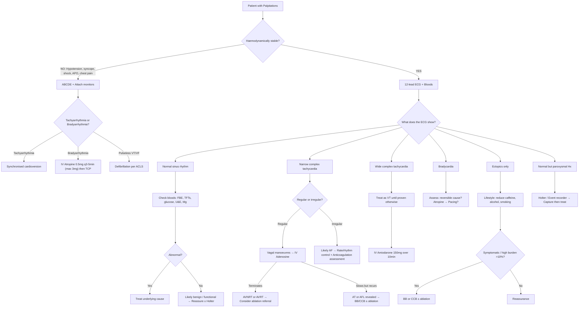

## Management Overview — The Guiding Principle

Management of palpitations is *not* management of the symptom — it is management of the **underlying cause**. Think of it this way: palpitations are to arrhythmia what pain is to fracture. You don't treat the pain in isolation; you fix the bone and the pain resolves. Similarly, you identify the cause of the palpitation and treat *that*.

The management framework has three tiers:

1. **Immediate stabilisation** — Is the patient haemodynamically compromised *right now*?
2. **Cause-specific treatment** — What is generating the palpitation?
3. **Long-term prevention** — How do we stop it coming back?

---

## Management Algorithm

---

## Tier 1: Immediate Stabilisation — The Unstable Patient

The first question is always: **Is this patient about to die?**

Signs of haemodynamic instability in a patient with palpitations:
- Systolic BP < 90 mmHg or ↓ > 40 mmHg from baseline
- Syncope or altered consciousness
- Acute pulmonary oedema (crackles, pink frothy sputum)
- Myocardial ischaemia (chest pain + ST changes)
- Signs of shock (cold peripheries, delayed CRT, oliguria)

If ANY of these are present → **don't waste time characterising the arrhythmia in detail. Treat it.**

### A. Unstable Tachyarrhythmia → Cardioversion [23]

> ***Cardioversion: delivery of a current over a very short interval → depolarize heart → abolish all prevailing abnormal rhythm → hope that SAN will take the lead again as pacemaker*** [23]

> ***Synchronized shock with QRS complex → avoid R-on-T phenomenon (torsades then VF)*** [23]

**Why synchronised?** If you deliver the shock randomly, it could land on the relative refractory period (the T wave) → this can trigger VF. Synchronisation ensures the shock coincides with the QRS (absolute refractory period), when the ventricle is already depolarised and cannot be "surprised" into VF.

| Rhythm | Energy | Notes |
|---|---|---|
| ***Narrow regular (SVT, AFL)*** | ***50-100J*** [23] | Lower energy sufficient because organised rhythm |
| ***Narrow irregular (AF)*** | ***120-200J*** [23] | Higher energy needed for chaotic rhythm |
| ***Wide regular (monomorphic VT)*** | ***100J*** [23] | |
| **Polymorphic VT / VF** | **200J unsynchronised (defibrillation)** | Cannot synchronise with QRS as there is no identifiable QRS |

> ***Requires consent with sedation (midazolam) + analgesics (morphine) as it is quite painful*** [23]

> ***Absolute C/I: sinus tachycardia (only absolute C/I)*** [23]

Why is sinus tachycardia the only absolute contraindication? Because sinus tachycardia is an *appropriate* response — the SA node is driving the rate because of an underlying problem (fever, dehydration, pain, etc.). Shocking the heart won't fix the cause and the tachycardia will simply recur. You need to treat the underlying stimulus.

### B. Unstable Bradyarrhythmia → Atropine ± Pacing [24][25]

> ***IV atropine 0.5mg every 3-5min: 1st line for acute symptomatic bradycardia. Max dose: 3mg*** [24][25]

**Why atropine?** "Atropine" comes from *Atropa belladonna* (deadly nightshade). It is an anticholinergic — it blocks muscarinic (M₂) receptors on the SA node and AV node, removing parasympathetic/vagal brake → heart rate ↑.

**When atropine doesn't work** [24]:
- ***Transplanted heart (denervated → no effect)*** — the heart has no vagal innervation after transplant, so blocking vagal tone has no effect
- ***Mobitz type II or 3rd-degree heart block with wide QRS*** — the block is below the AV node (infranodal), in non-nodal tissue that doesn't have muscarinic receptors

**Alternative drugs if atropine fails** [24][25]:
- ***Dopamine infusion: 2-20 μg/kg/min*** [25] — β₁ stimulation ↑HR and contractility; also α₁ vasopressor effect at higher doses
- ***Adrenaline infusion: 2-10 μg/min*** [24][25] — β₁ ↑HR and contractility

**Temporary cardiac pacing** [24][25]:
> ***Mechanism: regular delivery of a small direct current to stimulate contraction of the heart*** [24]

| Type | Description | When |
|---|---|---|
| ***Transcutaneous pacing (TCP)*** | External pads; ***less reliable but easier, 1st-line in emergency*** [24] | Immediate bridge while preparing TVP |
| ***Transvenous pacing (TVP)*** | Catheter in RV via central vein; ***more definitive with less tissue damage*** [24] | After TCP, as definitive temporary measure |

> ***Indications: bradycardia with unstable haemodynamic status; standby in 3rd-degree or Mobitz II 2nd-degree HB with stable haemodynamics*** [24][25]

> ***Use: usually start at 70 ppm, 30 mA. Electrical capture indicated by spike on ECG. Mechanical capture indicated by palpable pulse. Sometimes possible to get electrical without mechanical capture*** [25]

### C. Cardiac Arrest (Pulseless VT/VF) → ACLS [13]

> ***Shockable rhythms: VF (totally uncoordinated contraction of ventricles), Pulseless VT (LV rate too fast to pump blood effectively). 80% reversed by defibrillation but 10%↓survival per min delay*** [13]

Full ACLS protocol: CPR (30:2) → Defibrillation (200J biphasic) → Adrenaline 1mg IV q3-5min → Amiodarone 300mg IV after 3rd shock → Continue cycles with reversible cause search (4H's and 4T's)

---

## Tier 2: Cause-Specific Treatment

Once the patient is stabilised, treatment depends entirely on the specific diagnosis.

### A. Benign / Functional Palpitations (Anxiety, Ectopics)

This is the most common scenario — a young, healthy patient with ectopics or anxiety-driven palpitations.

#### 1. Reassurance and Lifestyle Modification

This is genuinely therapeutic. Many patients are terrified they have a heart problem. A clear explanation that their heart is structurally normal and the ectopics are benign can be transformative.

**Lifestyle modifications** — ***Common triggers for premature beats and PSVT are smoking, anxiety and excessive caffeine*** [3]:
- ↓ or eliminate ***caffeine*** (coffee, tea, energy drinks, cola) [3]
- ↓ ***alcohol*** intake [3]
- Smoking cessation [3]
- Regular exercise (but avoid overtraining)
- Stress management, adequate sleep
- Stop or reduce ***offending drugs*** if possible [3]

#### 2. Pharmacotherapy for Ectopics (if symptomatic and high burden)

| Drug | Dose | Mechanism | When to Use |
|---|---|---|---|
| **β-blockers** (e.g., bisoprolol 1.25-5mg OD, metoprolol 25-50mg BD) | Low dose | Block β₁-adrenoreceptors → ↓HR, ↓automaticity, ↓catecholamine sensitivity of ectopic foci | Frequent, symptomatic ectopics despite lifestyle changes; especially effective for catecholamine-sensitive ectopics |
| **Non-dihydropyridine CCBs** (e.g., verapamil, diltiazem) | Standard dose | Block L-type Ca²⁺ channels in SA/AV node → ↓HR, ↓automaticity | Alternative if β-blockers contraindicated |

**Catheter ablation**: Consider for high-burden VPBs ( > 10-15% on Holter) as these can cause **tachycardia-mediated cardiomyopathy** — the persistent ectopics cause LV dilatation and ↓EF over time.

### B. Supraventricular Tachycardia (AVNRT / AVRT)

This is the classic ***discrete bouts, very rapid ( > 120 bpm), sudden onset, terminated by vagal manoeuvres*** [1][2] scenario.

#### Acute Termination

**Step 1: Vagal manoeuvres** [23]
> ***Vagal manoeuvres: carotid sinus massage, Valsalva's manoeuvre, cold packs, cold water*** [23]

*Why do these work?* They stimulate the vagus nerve → ↑acetylcholine at the AV node → slows AV nodal conduction → breaks the re-entrant circuit that depends on the AV node.

The **modified Valsalva manoeuvre** (REVERT trial) has the highest success rate (~43% vs 17% for standard Valsalva): Patient blows against a 10mL syringe for 15 seconds while sitting at 45° → immediately laid flat with legs elevated to 45° for 15 seconds. The leg elevation increases venous return → ↑baroreceptor stretch → ↑vagal tone.

**Step 2: IV Adenosine** (if vagal manoeuvres fail) [23]
> ***IV adenosine: 6mg IV push followed by NS flush (1st dose), 12mg IV bolus (2nd and 3rd dose if required)*** [23]

*Mechanism*: Adenosine ("adeno" = gland, "sine" = without) — activates A₁ receptors on AV nodal cells → opens K⁺ channels → hyperpolarises the cell → transiently blocks AV conduction for ~5-10 seconds → breaks re-entrant circuit.

*Why rapid IV push?* Adenosine has a half-life of < 10 seconds — it is rapidly metabolised by adenosine deaminase in red blood cells. If you inject slowly, it gets destroyed before reaching the heart.

| Important Points about Adenosine | |
|---|---|
| **Diagnostic and therapeutic** | If it terminates the tachycardia = confirms AVNRT/AVRT. If it slows the rate transiently revealing flutter waves or AT = it's not AVNRT/AVRT |
| **Warn the patient** | They will feel a brief but intense chest tightness, flushing, and a sense of impending doom (transient AV block). Lasts < 15 seconds |
| **Contraindications** | Asthma (adenosine causes bronchospasm via A₂B receptors), 2nd/3rd-degree heart block, known hypersensitivity |
| **Caution in WPW with AF** | ***Should NOT be given if unstable or irregular/polymorphic wide-complex tachycardia (may degenerate into VF)*** [23] |
| **Drug interactions** | Dipyridamole inhibits adenosine breakdown → ↑effect → use lower dose. Theophylline/caffeine antagonise adenosine → may need higher dose |

**Step 3: IV β-blockers or CCBs** if adenosine fails
- IV verapamil 5-10mg over 2 min, or IV diltiazem
- IV metoprolol or esmolol

> ***Verapamil 5-15mg IV slowly (C/I if BP low or on BB, beware of post-conversion angina)*** [26]

**Step 4: Synchronised cardioversion** if all else fails or patient becomes unstable [23]

#### Long-Term Management of AVNRT/AVRT

| Strategy | Details | Mechanism |
|---|---|---|
| **Self-vagal manoeuvres** | Teach patient modified Valsalva for self-termination | Empowers patient to abort episodes without hospital |
| **β-blockers / CCBs** | Daily prophylaxis (e.g., verapamil, diltiazem, metoprolol) | Slows AV nodal conduction → makes it harder for re-entry to sustain |
| **"Pill-in-pocket"** | Single dose of flecainide or diltiazem taken only when attack starts | Convenient for infrequent attacks; avoids daily medication |
| ***Catheter ablation*** | **Definitive treatment**; success rate > 95% for AVNRT, > 90% for AVRT | Radiofrequency or cryoablation destroys the slow pathway (AVNRT) or accessory pathway (AVRT) |

**Catheter ablation** is now considered first-line for recurrent SVT in many guidelines (2019 ACC/AHA/HRS) because it is curative. Why wait for lifelong medication when you can fix the circuit permanently?

<Callout title="WPW with Pre-excited AF — A Special Danger" type="error">
***AV nodal blockers (digoxin, verapamil, diltiazem, adenosine) are CONTRAINDICATED in pre-excited AF*** because they block the AV node but leave the accessory pathway conducting unchecked → all atrial fibrillation impulses conduct rapidly via the accessory pathway → ventricular rate can exceed 300 bpm → VF → death.

**Correct treatment**: IV procainamide (slows conduction in the accessory pathway) or immediate cardioversion if unstable. Definitive: catheter ablation of accessory pathway.
</Callout>

### C. Atrial Fibrillation (AF)

The most common sustained arrhythmia and the one with the most complex management algorithm. Three parallel management streams:

#### 1. Rate Control

*Goal*: Slow the ventricular rate to < 110 bpm at rest (lenient target, 2024 ESC guidelines) or < 80 bpm (strict target if still symptomatic).

*Why?* In AF, the atria fire at 350-600/min. Without the AV node acting as gatekeeper, the ventricles would try to follow → haemodynamic collapse. Rate control drugs slow AV nodal conduction → fewer atrial impulses reach the ventricles.

| Drug Class | Examples | Mechanism | When to Use | Contraindications |
|---|---|---|---|---|
| **β-blockers** | Bisoprolol, metoprolol, atenolol | Block β₁ → ↓AV conduction, ↓HR | First-line in most patients; particularly if coexistent IHD/HF with preserved EF | Decompensated HF (HFrEF), severe asthma, hypotension |
| **Non-DHP CCBs** | Verapamil, diltiazem | Block L-type Ca²⁺ channels in AV node → ↓conduction velocity | First-line alternative; good for patients without HF | HFrEF (negative inotrope → ↓↓EF), concurrent β-blocker (risk of asystole) |
| **Digoxin** | Digoxin 0.0625-0.25mg OD | Inhibits Na⁺/K⁺-ATPase → ↑intracellular Ca²⁺ + ↑vagal tone → slows AV conduction | Second-line; particularly useful in HFrEF (mild positive inotrope); effective at rest but less so during exercise | Hypokalaemia (↑toxicity), hypoMg, renal impairment (dose adjustment), WPW |
| **Amiodarone** | IV or PO | Class III antiarrhythmic (multiple actions) → slows AV conduction | Acute rate control when above agents fail; haemodynamically compromised patients | Long-term toxicity (thyroid, lung, liver, cornea, skin) |

> ***AF loading with digoxin: 0.25mg IV/PO stat, then 0.25mg PO q8H for 2 more doses, maintenance 0.0625-0.25mg daily*** [26]

#### 2. Rhythm Control

*Goal*: Restore and maintain sinus rhythm.

*When?* Preferred when: symptomatic despite rate control, young patient, first episode, HF, no significant LA dilatation.

| Strategy | Details |
|---|---|
| **Pharmacological cardioversion** | Flecainide (if no structural HD), amiodarone (if structural HD), vernakalant (IV, for recent-onset AF) |
| **Electrical cardioversion (DCCV)** | ***Synchronised shock 120-200J*** [23]; requires ≥3 weeks therapeutic anticoagulation OR TOE-guided approach to exclude LA thrombus |
| **Catheter ablation (PVI)** | Pulmonary vein isolation — electrically disconnects the pulmonary veins (the main triggers) from the LA. First-line rhythm control in selected patients (2024 ESC). Success rate ~70-80% single procedure, ~85-90% after repeat |
| **Antiarrhythmic maintenance** | Flecainide/propafenone (no structural HD), amiodarone/sotalol/dronedarone (with structural HD); all have proarrhythmic risk |

> ***Amiodarone for AF: 5 mg/kg IV infusion over 60 mins as loading, maintenance 600-900 mg infusion/24h*** [26]

#### 3. Stroke Prevention (Anticoagulation)

AF causes blood stasis in the left atrial appendage → thrombus → systemic embolism → stroke. This is the major morbidity.

**CHA₂DS₂-VASc score** (decides who needs anticoagulation):

| Letter | Risk Factor | Points |
|---|---|---|
| **C** | Congestive heart failure | 1 |
| **H** | Hypertension | 1 |
| **A₂** | Age ≥75 | 2 |
| **D** | Diabetes | 1 |
| **S₂** | Stroke/TIA/VTE history | 2 |
| **V** | Vascular disease (MI, PAD, aortic plaque) | 1 |
| **A** | Age 65-74 | 1 |
| **Sc** | Sex category (female) | 1 |

| Score | Recommendation (2024 ESC) |
|---|---|
| 0 (male) or 1 (female) | No anticoagulation |
| 1 (male) | Consider anticoagulation |
| ≥2 (male) or ≥3 (female) | Anticoagulation recommended |

**Drug choice**: DOACs (dabigatran, rivaroxaban, apixaban, edoxaban) preferred over warfarin in non-valvular AF. Warfarin still used in mechanical valves and moderate-severe MS.

**HAS-BLED score**: Assesses bleeding risk. High score doesn't mean "don't anticoagulate" — it means "optimise modifiable risk factors."

### D. Atrial Flutter (AFL)

> ***Atrial flutter: rapid regular atrial activity at 180-350 bpm, mechanism: re-entry via anatomically fixed pathway*** [5]

| Treatment | Details |
|---|---|
| **Acute** | Rate control (BB, CCB, digoxin) or cardioversion; IV ibutilide for pharmacological cardioversion |
| **Definitive** | ***Catheter ablation of cavotricuspid isthmus*** — success rate > 95%, very low recurrence. This is considered first-line because flutter tends to be resistant to drug therapy and ablation is so effective |
| **Anticoagulation** | Same stroke risk as AF → anticoagulate using same CHA₂DS₂-VASc criteria |

### E. Focal Atrial Tachycardia (AT) [5]

> ***Treatment: Correction of contributing factors (↑SN tone aggravates FAT). Acute: BB, CCB (1st line), class IA, IC, III antiarrhythmics (2nd line) ± DCCV. Long-term: maintenance BB/CCB ± catheter ablation or amiodarone if frequent/symptomatic*** [5]

### F. Multifocal Atrial Tachycardia (MAT) [5]

> ***Treatment: not symptomatic on its own → Tx should be directed to underlying condition*** [5]

Key: Treat the underlying cause — usually ***pulmonary disease (~60%), congestive HF, hypoK, hypoMg*** [5]. Correct electrolytes. IV magnesium may help suppress ectopic foci. Cardioversion is NOT effective (multiple foci — you can't shock away automaticity).

### G. Ventricular Tachycardia (VT)

#### Acute Management [23][26]

| Scenario | Treatment |
|---|---|
| **Haemodynamically unstable / pulseless** | Defibrillation (unsynchronised 200J biphasic) per ACLS |
| **Haemodynamically stable, sustained monomorphic VT** | ***IV amiodarone: 150mg over 10min, repeat if recur*** [23]; ***IV procainamide: 20-50mg/min until arrhythmia suppressed*** [23]; ***IV sotalol: 100mg (1.5mg/kg) over 5min*** [23] |
| **Post-MI stable sustained monomorphic VT** | ***Amiodarone 150mg over 10min, repeat 150mg if needed, then 600-1200mg infusion over 24h*** [26]; ***Lignocaine 50-100mg IV bolus then 1-4mg/min*** [26]; ***Synchronised cardioversion starting with 100J*** [26] |
| **Sustained polymorphic VT** | ***Unsynchronised cardioversion starting with 200J*** [26] |
| **TdP** | IV magnesium 2g over 10min (regardless of serum Mg); correct hypoK; stop QT-prolonging drugs; temporary overdrive pacing to ↑HR (shortens QT) |

*Why amiodarone?* "Amio" from "amiodarone" — developed as an anti-anginal. It turned out to block Na⁺ channels (Class I), β-receptors (Class II), K⁺ channels (Class III), and Ca²⁺ channels (Class IV) — it does everything. This makes it the most effective antiarrhythmic for life-threatening VT, but its multi-channel action also explains its extensive side-effect profile.

#### Long-Term Management of VT

| Strategy | Indication |
|---|---|
| **ICD (Implantable Cardioverter-Defibrillator)** | Secondary prevention: any survived VT/VF arrest. Primary prevention: LVEF ≤35% + NYHA II-III despite optimal medical therapy (SCD-HeFT criteria) |
| **Antiarrhythmic drugs** | Amiodarone or sotalol as adjunct to ICD to reduce shock frequency |
| **Catheter ablation** | Recurrent VT despite ICD + drugs; scar-related VT mapping and ablation |
| **Treat underlying cause** | Revascularisation if ischaemic; correct electrolytes; optimise HF therapy |

### H. Long QT Syndrome (LQTS)

| Strategy | Details | Mechanism |
|---|---|---|
| **Avoid triggers** | QT-prolonging drugs (www.crediblemeds.org), hypoK, hypoMg, intense exercise in LQT1, sudden auditory stimuli in LQT2 | Remove precipitants for EADs |
| **β-blockers** | Nadolol or propranolol (non-selective) | ↓Sympathetic trigger; ↓HR → but paradoxically also lengthens QT slightly — net effect is protective because EADs are catecholamine-dependent |
| **ICD** | High-risk patients (previous TdP/arrest, QTc > 500, LQT3) | Backup defibrillation if β-blockers fail |
| **Left cardiac sympathetic denervation (LCSD)** | Refractory cases | Removes left stellate ganglion → ↓sympathetic input to heart |

### I. WPW Syndrome [3]

| Strategy | Details |
|---|---|
| **Asymptomatic WPW pattern** | Risk stratification (EPS); if low risk → observe. If high risk (short anterograde refractory period of accessory pathway) → ablation |
| **Symptomatic AVRT** | Acute: vagal manoeuvres → adenosine → cardioversion. Long-term: catheter ablation (first-line, curative) |
| **Pre-excited AF** | ***NEVER give AV nodal blockers (digoxin, verapamil, diltiazem)***. IV procainamide or immediate cardioversion. Definitive: ablation of accessory pathway |

### J. Bradyarrhythmias (SSS, Heart Block)

> ***Permanent AAI/DDD pacing if symptomatic + pause ≥3s, DDD if foresee development of AV nodal disease*** [14]

| Condition | Pacing Indication |
|---|---|
| ***Sick sinus syndrome*** | ***Permanent pacing (AAI/DDD) if symptomatic + pause ≥3s*** [14]; ***no prognostic benefit if asymptomatic*** [14]; ***± anticoagulation if AF*** [14] |
| **Mobitz type II 2nd-degree HB** | Permanent pacing (DDD) — high risk of progression to complete HB |
| **Complete (3rd-degree) HB** | Permanent pacing (DDD) — always indicated regardless of symptoms |
| **Mobitz type I (Wenckebach)** | Usually benign; pacing only if symptomatic |

---

## Tier 3: Treatment of Non-Arrhythmic Causes

### K. Hyperdynamic / Systemic Causes

The palpitations resolve when you treat the underlying condition:

| Cause | Treatment | Why It Works |
|---|---|---|
| ***Anaemia*** [3] | Treat underlying cause (iron, B12, folate, transfusion if severe) | Restore O₂ carrying capacity → ↓compensatory ↑HR/SV |
| ***Thyrotoxicosis*** [3] | ***β-blockers for symptom control (e.g., propranolol, atenolol)*** [27]; antithyroid drugs or definitive therapy (RAI/surgery) | ***Block β₁-adrenoreceptors in heart — relieve palpitations; block β₁ in brain — relieve anxiety; block β₂ in skeletal muscle — relieve tremor*** [27] |
| ***Fever/infection*** [3] | Treat infection; antipyretics | ↓Metabolic demand → ↓sympathetic drive |
| ***Hypoglycaemia*** [3] | Oral glucose 15-20g if conscious; IV D50 40mL if unconscious; IM glucagon 1mg if no IV access [15] | Restore euglycaemia → stop counter-regulatory catecholamine surge |
| ***Electrolyte correction*** | IV KCl (max 20 mmol/h via central line), IV MgSO₄ | Restore normal resting membrane potential → ↓arrhythmogenicity |
| ***Drug-related*** [3] | Stop/reduce offending drug; switch to alternative | Remove the trigger |
| ***Pregnancy*** [3] | Reassurance; avoid supine position (IVC compression → reflex tachycardia) | Normal physiological change; resolves post-partum |

### L. Phaeochromocytoma [9][28]

> ***Management: Medical therapy: pre-operative prevention of crisis by combined α/β-blockade*** [28]

> ***Choice: α-blockade by phenoxybenzamine → followed by β-blockade by propranolol*** [28]

> ***β-blockade alone will cause unopposed α-adrenergic activity → exacerbate HTN. ALWAYS initiate α-blockade before β-blockade → adequate α-blockade indicated by postural BP drop*** [28]

| Phase | Treatment | Mechanism |
|---|---|---|
| **Pre-operative** (≥7-14 days) | α-blockade (phenoxybenzamine) → then β-blockade (propranolol); ↑Na diet + fluids | α-blockade reverses vasoconstriction → ↓BP; β-blockade controls reflex tachycardia; fluids reverse catecholamine-induced volume contraction |
| **Surgical** | Laparoscopic adrenalectomy | Definitive cure |
| **Post-operative** | Monitor BP (hypotension from loss of catecholamines), H'stix (rebound hypoglycaemia) | Sudden withdrawal of catecholamines → vasodilation + ↑insulin sensitivity |
| **Crisis** | ICU + IV phentolamine or nitroprusside | Immediate α-blockade |

### M. Anxiety and Panic Disorder [6][29]

> ***First-line: usually either CBT or SSRIs with various self-help strategies*** [29]

| Treatment | Details | Mechanism |
|---|---|---|
| **CBT** | ***Targets fears of physical effects of anxiety → pointing out sequence of physical symptoms leading to fear → question patient's belief in feared outcome*** [29]; ***as effective as antidepressants*** [29] | Breaks the cognitive spiral: anxiety → somatic symptoms → catastrophic misinterpretation → more anxiety |
| **SSRIs** | First-line pharmacotherapy (e.g., sertraline, escitalopram); ***dose should be increased very slowly (initially ↑anxiety symptoms including palpitations)*** [29]; ***maintained for ≥6mo to prevent relapse*** [29] | ↑Serotonin in synaptic cleft → downregulates fear circuits in amygdala over weeks |
| **SNRIs** | Venlafaxine — alternative to SSRIs | Similar serotonergic mechanism + noradrenergic component |
| **BZDs** | ***Effective in controlling panic attacks when given at high doses; alprazolam commonly used*** [29]; but risk of dependence → generally avoided long-term | GABA-A receptor agonist → ↑Cl⁻ influx → neuronal inhibition → immediate anxiolysis |
| **β-blockers** | Low-dose propranolol PRN for situational anxiety with prominent somatic symptoms | Blocks peripheral β₁/β₂ effects of sympathetic activation (palpitations, tremor, sweating) without addressing the central anxiety |

<Callout title="Don't Just Sedate — Explain">
For anxiety-related palpitations, the most powerful intervention is often a clear, compassionate explanation: "Your heart is structurally normal. What you're feeling is your body's stress response — adrenaline makes the heart beat faster and stronger. This is uncomfortable but not dangerous." This alone can reduce symptom severity significantly.
</Callout>

---

## Summary Table: Treatment by Diagnosis

| Diagnosis | Acute Treatment | Long-Term Treatment |
|---|---|---|
| **Ectopics (APB/VPB)** | Reassurance; lifestyle (↓caffeine, alcohol, smoking) | β-blockers if symptomatic; ablation if burden > 10-15% |
| **AVNRT/AVRT** | Vagal manoeuvres → adenosine → cardioversion | Catheter ablation (curative, first-line); β-blockers/CCBs if decline ablation |
| **AF** | Rate control (BB/CCB/digoxin) or rhythm control (DCCV/drugs); anticoagulate | Long-term rate or rhythm control; PVI ablation; lifelong anticoagulation per CHA₂DS₂-VASc |
| **AFL** | Rate control or cardioversion | CTI ablation (first-line, > 95% success); anticoagulate |
| **AT** | BB/CCB; cardioversion if unstable | BB/CCB ± ablation ± amiodarone |
| **MAT** | Treat underlying cause; IV Mg | Correct electrolytes; treat lung/HF disease |
| **VT (stable)** | IV amiodarone/procainamide/sotalol; cardioversion | ICD ± antiarrhythmics ± ablation; treat underlying cause |
| **VT/VF (pulseless)** | Defibrillation + ACLS | ICD; ablation; optimise HF therapy |
| **TdP** | IV MgSO₄; stop offending drugs; overdrive pacing | Avoid QT-prolonging triggers; ICD if congenital LQTS |
| **Bradycardia** | Atropine → TCP/TVP | Permanent pacemaker if indicated |
| **SSS** | Atropine for acute pauses | Permanent pacemaker ± anticoagulation |
| **WPW** | Vagal/adenosine for AVRT; procainamide/cardioversion for pre-excited AF; NEVER AV nodal blockers for AF | Catheter ablation of accessory pathway |
| **Sinus tachycardia** | Treat underlying cause | Treat underlying cause |
| **Anaemia** | Transfusion if severe | Iron/B12/folate; investigate and treat cause |
| **Thyrotoxicosis** | β-blockers; antithyroid drugs | Definitive: RAI or thyroidectomy |
| **Phaeochromocytoma** | α-blockade → β-blockade | Surgery after adequate blockade |
| **Anxiety/Panic** | Reassurance; β-blockers PRN; BZDs short-term | CBT + SSRIs |
| **Electrolyte** | IV K⁺/Mg²⁺ replacement | Identify and correct underlying cause |

---

<Callout title="High Yield Summary">

1. **Unstable tachyarrhythmia → synchronised cardioversion** (except sinus tachycardia — the only absolute C/I). Synchronisation avoids R-on-T → VF.

2. **Unstable bradycardia → Atropine 0.5mg IV q3-5min (max 3mg) → TCP → TVP**. Atropine won't work in denervated hearts or infranodal block.

3. **SVT acute termination ladder**: Vagal manoeuvres → Adenosine 6mg → 12mg → 12mg → IV BB/CCB → Cardioversion.

4. **Adenosine**: Rapid IV push (t½ < 10s). Diagnostic AND therapeutic. C/I in asthma and pre-excited AF.

5. **AF management has 3 parallel streams**: Rate control (BB/CCB/digoxin), Rhythm control (DCCV/drugs/ablation), Anticoagulation (CHA₂DS₂-VASc → DOACs).

6. **Pre-excited AF (WPW) → NEVER give AV nodal blockers** (digoxin, verapamil, diltiazem, adenosine). Use IV procainamide or cardioversion.

7. **VT**: Treat as VT until proven otherwise in wide complex tachycardia. Stable → amiodarone. Unstable/pulseless → defibrillation. Long-term → ICD.

8. **TdP**: IV MgSO₄ (regardless of serum Mg) + stop offending drugs + overdrive pacing.

9. **Phaeochromocytoma**: ALWAYS α-block before β-block. β-block alone → unopposed α → hypertensive crisis.

10. **Panic disorder**: CBT + SSRIs (start low, go slow). Never dismiss as "just anxiety" without excluding organic causes first.

11. **Ectopics**: Reassurance + lifestyle first. β-blockers if persistent. Ablation if burden > 10-15% (risk of tachycardia-mediated cardiomyopathy).

</Callout>

---

<ActiveRecallQuiz
  title="Active Recall - Palpitations Management"
  items={[
    {
      question: "A patient with SVT is haemodynamically stable. Describe the stepwise acute management approach, including the dose of adenosine.",
      markscheme: "Step 1: Vagal manoeuvres (modified Valsalva, carotid sinus massage). Step 2: IV adenosine 6mg rapid IV push with NS flush. Step 3: If no response, 12mg IV adenosine (can repeat once). Step 4: IV verapamil or IV beta-blocker if adenosine fails. Step 5: Synchronised cardioversion 50-100J if all pharmacological measures fail or patient becomes unstable. Adenosine must be given as rapid IV push because its half-life is less than 10 seconds.",
    },
    {
      question: "Why is synchronised cardioversion used for tachyarrhythmias rather than unsynchronised defibrillation? What is the only absolute contraindication?",
      markscheme: "Synchronised cardioversion delivers the shock timed to the QRS complex (absolute refractory period) to avoid the R-on-T phenomenon, where a shock landing on the T wave (relative refractory period) can trigger VF. The only absolute contraindication is sinus tachycardia, because it is an appropriate physiological response to an underlying stimulus; shocking will not address the cause and the tachycardia will recur.",
    },
    {
      question: "A patient with known WPW develops AF with a ventricular rate of 250 bpm. The registrar plans to give IV verapamil. Explain why this is dangerous and state the correct management.",
      markscheme: "Verapamil is contraindicated in pre-excited AF because it blocks the AV node but not the accessory pathway. With the AV node blocked, all fibrillation impulses preferentially conduct via the accessory pathway without delay, leading to extremely rapid ventricular rates potentially exceeding 300 bpm, degenerating to VF and cardiac arrest. Correct management: IV procainamide (slows accessory pathway conduction) or immediate synchronised cardioversion if unstable. Definitive treatment is catheter ablation of the accessory pathway.",
    },
    {
      question: "In phaeochromocytoma management, why must alpha-blockade be initiated before beta-blockade?",
      markscheme: "Beta-blockade alone removes beta-2 mediated vasodilation, leaving alpha-1 mediated vasoconstriction unopposed. This causes paradoxical worsening of hypertension, potentially precipitating a hypertensive crisis. Alpha-blockade is initiated first (e.g., phenoxybenzamine for 7-14 days) to reverse vasoconstriction; beta-blockade is then added to control the reflex tachycardia that results from alpha-blockade. Adequate alpha-blockade is indicated by a postural blood pressure drop.",
    },
    {
      question: "Name the three parallel management streams for atrial fibrillation and the scoring system used to guide anticoagulation decisions.",
      markscheme: "Three streams: (1) Rate control using beta-blockers, non-DHP CCBs, or digoxin to slow AV conduction. (2) Rhythm control using DCCV, antiarrhythmic drugs, or catheter ablation (PVI) to restore sinus rhythm. (3) Stroke prevention using anticoagulation. Anticoagulation decisions guided by CHA2DS2-VASc score: C (CHF 1), H (HTN 1), A2 (Age >=75, 2), D (DM 1), S2 (Stroke/TIA 2), V (Vascular disease 1), A (Age 65-74, 1), Sc (Sex female 1). Score >=2 in males or >=3 in females = anticoagulation recommended.",
    },
    {
      question: "What is the first-line treatment for Torsades de Pointes and why does it work regardless of the serum magnesium level?",
      markscheme: "IV magnesium sulfate 2g over 10 minutes is first-line regardless of serum Mg level. Magnesium suppresses early afterdepolarisations (EADs) that trigger TdP by stabilising cardiac membrane potassium channels and reducing the transmembrane calcium current during the prolonged repolarisation phase. Even with normal serum Mg, the intracellular Mg concentration may be inadequate, and supplementation provides additional membrane-stabilising effect. Other measures: stop QT-prolonging drugs, correct hypoK, temporary overdrive pacing to increase HR (shortens QT interval).",
    },
  ]}
/>

## References

[1] Senior notes: Ryan Ho Cardiology.pdf (p61, Section 2.3 Palpitations)
[2] Senior notes: Ryan Ho Fundamentals.pdf (p206, Section 3.1.3 Palpitations)
[3] Lecture slides: murtagh merge.pdf (p72–74, Palpitations)
[5] Senior notes: Ryan Ho Cardiology.pdf (p92, Focal and Multifocal Atrial Tachycardia)
[9] Senior notes: Ryan Ho Endocrine.pdf (p66, Phaeochromocytoma)
[13] Senior notes: Ryan Ho Critical Care.pdf (p28, Cardiac Arrest and ACLS)
[14] Senior notes: Ryan Ho Cardiology.pdf (p83, Sick Sinus Syndrome)
[15] Senior notes: Ryan Ho Endocrine.pdf (p94, Hypoglycaemia)
[23] Senior notes: Ryan Ho Critical Care.pdf (p39, Management of Symptomatic Tachyarrhythmia)
[24] Senior notes: Ryan Ho Cardiology.pdf (p88, Management of Bradyarrhythmias)
[25] Senior notes: Ryan Ho Critical Care.pdf (p41, Management of Symptomatic Bradyarrhythmia)
[26] Senior notes: Ryan Ho Cardiology.pdf (p139, Arrhythmia Management in MI)
[27] Senior notes: felixlai.md (Beta-blocker pharmacology in thyrotoxicosis)
[28] Senior notes: Ryan Ho Endocrine.pdf (p67, Phaeochromocytoma Management)
[29] Senior notes: Ryan Ho Psychiatry.pdf (p181, Panic Disorder Management)
