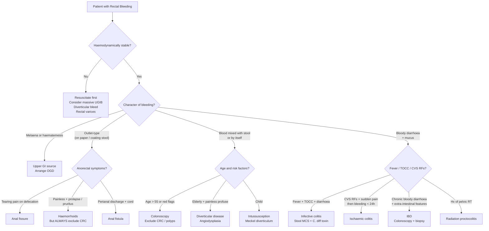

## Differential Diagnosis of Rectal Bleeding

The differential diagnosis of rectal bleeding is one of the most commonly examined topics in clinical medicine. The key challenge is that the symptom — blood per rectum — is shared by conditions ranging from the trivially benign (a small haemorrhoidal bleed) to the immediately life-threatening (massive diverticular haemorrhage) to the insidiously fatal (colorectal carcinoma). Your job is to **risk-stratify** and **pattern-recognise** using the character of bleeding, associated symptoms, patient demographics, and examination findings.

---

### 1. Organising Framework — Murtagh's Diagnostic Strategy

This is the framework you should have at your fingertips. It forces you to think beyond the "probable" and actively consider what you must not miss.

| Category | Conditions |
|---|---|
| ***Probability diagnosis*** | ***Haemorrhoids / perianal haematoma***, ***anal fissure***, ***colorectal polyp***, ***diverticulitis*** (note: diverticular *bleeding* is the more relevant entity for PR bleed), ***excoriated skin (anal pruritus)*** [1] |
| ***Serious disorders not to be missed*** | **Vascular:** ***ischaemic colitis, angiodysplasia (vascular ectasia), anticoagulant therapy*** · **Infection:** ***enteritis (e.g. Campylobacter, Salmonella)*** · **Cancer/Tumours:** ***colorectal, caecum, lymphoma, villous adenoma*** · **Other:** ***inflammatory bowel disease (colitis/proctitis), intussusception*** [1] |
| ***Pitfalls (often missed)*** | ***Rectal prolapse***, ***anal trauma (accidental / non-accidental)***, ***villous adenoma*** [1] |
| ***Rarities*** | ***Meckel diverticulum***, ***solitary ulcer of rectum*** [1] |

<Callout title="Why Murtagh's Framework Matters">
This four-tier system ensures you don't anchor on a benign diagnosis. Haemorrhoids are extremely common and will be present coincidentally in many patients — but calling everything "haemorrhoids" is how colorectal cancers get missed. The framework forces you to actively exclude the serious conditions before settling on the probable.
</Callout>

---

### 2. Differential Diagnosis by Anatomical Source

Thinking anatomically helps you localise the bleed and choose the right investigation. ***LGIB is defined as bleeding distal to the ligament of Treitz*** [2][3], but remember that ***10–15% of haematochezia originates from an upper GI source*** — never forget to consider this, especially in massive bleeds [3][5].

| Anatomical Source | Cause | Approximate % of LGIB | Key Pathophysiology |
|---|---|---|---|
| **Massive Upper GI** | ***Peptic ulcer, variceal bleed*** [3] | < 10% | Brisk bleeding overwhelms GI transit → blood not degraded → presents as haematochezia rather than melaena |
| **Large Bowel** | ***Diverticular disease (17–40%)*** | — | Rupture of vasa recta draped over diverticulum dome (arterial bleeding) [2][3][5] |
| | ***Angiodysplasia (2–30%)*** | — | Degenerative submucosal AVMs; venous bleeding, less massive but recurrent [2][3] |
| | ***Colitis (9–11%)***: infective (*C. difficile*, CMV, amoebic, TB), inflammatory (UC, CD), ***ischaemic***, radiation [3] | — | Mucosal inflammation/ischaemia → friable mucosa → bleeding |
| | ***Neoplasm (7–33%)***: carcinoma, large polyps, post-polypectomy [3] | — | Overlying erosion/ulceration of tumour surface [3][5] |
| **Small Bowel** (~5%) | ***Meckel's diverticulum***, jejunoileal diverticula, angiodysplasia, small bowel tumours, ***NSAID-induced ulcers***, Crohn's/TB enteritis, ***aortoenteric fistula*** [3] | ~5% | Meckel's: ectopic gastric mucosa → acid secretion → ileal ulceration; aortoenteric fistula: graft erosion into duodenum (herald bleed → massive exsanguination) |
| **Anorectal** (~10%) | ***Haemorrhoids, fissure-in-ano***, anal/rectal ulcers, ***rectal varices*** [3] | ~10% | Haemorrhoids: engorgement of anal cushion AV plexus; fissure: mucosal tear below dentate line; rectal varices: portosystemic collateral dilatation |

---

### 3. Detailed Differential Diagnosis — Distinguishing Features

The exam often asks you to differentiate between causes. Here is a systematic comparison table that maps each differential to its **characteristic bleeding pattern**, **associated features**, and **key distinguishing points**.

#### 3.1 Causes Differentiated by History

| ***Aetiology*** | ***Bleeding Pattern*** | ***Key Distinguishing Features*** |
|---|---|---|
| ***UGI bleed*** | ***Melaena, haematemesis, coffee ground vomitus. Should be considered especially in severe haematochezia (10–15% from UGI)*** [3][5] | History of peptic ulcer disease, NSAID use, liver disease. Haemodynamic instability disproportionate to volume of PR blood |
| ***Diverticular disease*** | ***Painless, usually profuse haematochezia (not chronic)*** [3][5] | Acute onset, self-limiting (80–85%), few abdominal symptoms. **Diverticulitis and diverticular bleeding rarely coexist** [2][5]. In Asia: right-sided predominance [2] |
| ***Angiodysplasia*** | ***Painless, less severe than diverticular but tends to be intermittent*** [3][5] | ***Usually in elderly, may be associated with vascular malformations (e.g. HHT) and aortic stenosis*** [3][5]. Recurrent episodes. May present as occult bleeding with iron deficiency anaemia |
| ***Colorectal carcinoma*** | Low-grade, intermittent bleeding; often FOBT+ or IDA [3][5] | ***> 50y, male, smoker, FHx, Hx of IBD, polyps and colorectal CA. Alternating diarrhoea and constipation, pencil-thin stools, tenesmus. Loss of appetite, loss of weight, malaise. Intractable pain, jaundice/RUQ discomfort, dyspnoea, bone pain*** [3][5][8] |
| ***Colitis — Inflammatory (IBD)*** | ***Usually bloody diarrhoea. Extra-intestinal manifestations: arthritis, episcleritis/uveitis, erythema nodosum*** [3][5] | UC: continuous mucosal inflammation from rectum → bloody mucoid diarrhoea, urgency, tenesmus. CD: skip lesions, perianal disease, fistulae. ***Bleeding more commonly associated with UC than Crohn's*** [3] |
| ***Colitis — Ischaemic*** | Mild-to-moderate PR bleeding within 24h of abdominal pain onset [3][5][6] | ***CVS risk factors, acute MI, stroke*** [3][5]. Sudden cramping abdominal pain → bloody diarrhoea. Watershed area distribution |
| ***Colitis — Infective*** | Bloody diarrhoea with systemic symptoms [3][5] | ***Fever, chills, rigors, night sweats, nausea/vomiting, diarrhoea, pain. TOCC, immunosuppression (CMV colitis). Previous TB exposure/infection, BCG vaccination status*** [3][5] |
| ***Radiation proctocolitis*** | Chronic PR bleeding, may be delayed years | ***Hx of abdominal irradiation*** [3][5]. Diarrhoea, rectal urgency/tenesmus. Obliterative endarteritis → chronic mucosal ischaemia [3] |
| ***Haemorrhoids*** | ***Blood coating stools or bleeding following defecation*** [5] | ***May note perianal prolapsing mass, pruritus (mucus secretion) ± pain (if thrombosed)*** [5]. Outlet-type: fresh red blood on paper/surface of stool. Risk factors: constipation, pregnancy [8] |
| ***Anal fissure*** | Small amount of bright blood on paper/surface of stool [4][5] | ***Hx of constipation. Severe sharp pain upon defecation*** [5]. Posterior midline tear. If off-midline or atypical → think Crohn's, TB, HIV, cancer [4] |
| ***Rectal prolapse*** | Blood with mucus discharge | Prolapsing mass, faecal incontinence, incomplete evacuation. ***Often missed (a Murtagh pitfall)*** [1]. Mainly elderly women [4] |

<Callout title="The Bleeding Pattern is Your Best Differentiator" type="idea">
- **Outlet-type** (on paper, after defecation): haemorrhoids, fissure
- **Mixed with stool**: proximal colonic source (CRC, IBD, right-sided diverticular)
- **Blood by itself (torrential)**: diverticular disease, angiodysplasia, rectal varices
- **Blood + mucus**: rectal tumour, proctitis, villous adenoma [1][8]
- ***Frequent passage of blood and mucus indicates a rectal tumour or proctitis*** [1]
</Callout>

---

### 4. Age-Based Differential — A Practical Shortcut

One of the highest-yield clinical shortcuts is to consider the most likely diagnosis by age group:

| Age Group | Most Likely Cause | Why |
|---|---|---|
| **Children** | ***Intussusception*** [1], Meckel's diverticulum, polyps, infectious colitis | Intussusception: ileocolic telescoping → "redcurrant jelly" stool. Meckel's: ectopic gastric mucosa → ileal ulceration |
| ***Young adults*** | ***Haemorrhoids or a fissure*** [1] | Low-fibre diet, constipation, straining. IBD also peaks in this age group (20–40y) |
| **Adults 40–55** | Haemorrhoids, IBD, polyps, early CRC | Need to start considering malignancy, especially with red flags |
| ***Adults > 55*** | ***New bleeding demands colonic investigation*** [1] | CRC incidence rises steeply. Diverticular disease, angiodysplasia also become prevalent |
| ***Elderly (> 65)*** | Diverticular disease, angiodysplasia, CRC, ischaemic colitis | Degenerative vascular changes, high prevalence of diverticulosis, cardiovascular comorbidities predisposing to ischaemic colitis |

---

### 5. Differentiating by Mechanism — "Why Does This Condition Bleed?"

Understanding the *mechanism* of bleeding is essential for exam answers and for choosing the right treatment.

| Cause | Mechanism of Bleeding | Type | Severity |
|---|---|---|---|
| **Diverticular disease** | Vasa recta rupture (arterial) into diverticulum | Arterial | ***Can be severe/massive*** [3] |
| **Angiodysplasia** | Thin-walled submucosal AVM rupture (venous) | Venous | Usually moderate, but recurrent [2][3] |
| **CRC** | Surface erosion/ulceration of tumour | Capillary ooze | Low-grade, chronic, intermittent [3] |
| **IBD (UC)** | Diffuse mucosal inflammation → friability | Mucosal | Variable — usually moderate, rarely life-threatening [3] |
| **Ischaemic colitis** | Mucosal ischaemia → sloughing → reperfusion injury | Mixed | Usually mild-to-moderate [6] |
| **Haemorrhoids** | Engorgement of arteriovenous cushion plexus | Arterial (from superior rectal artery branches) | Usually mild; rarely massive |
| **Anal fissure** | Tear through anoderm exposing submucosal vessels | Capillary/small vessel | Minimal — drops on paper |
| **Rectal varices** | Portosystemic collateral dilatation (portal HTN) | Venous (portal) | ***Can be severe*** [3] |
| **Meckel's diverticulum** | Ectopic gastric mucosa → acid → adjacent ulceration | Arterial | ***Can be massive*** [3] |

---

### 6. Special Differentials Often Tested

#### 6.1 Haemorrhoids vs. Rectal Prolapse vs. Prolapsed Rectal Polyp

This is a favourite exam question because all three present with "something coming out of the anus."

| Feature | Prolapsed Haemorrhoids | Complete Rectal Prolapse | Prolapsed Polyp |
|---|---|---|---|
| **Mucosal folds** | Radial (spoke-like grooves between cushions) | **Concentric** (circular rings — full thickness wall) | Smooth, pedunculated mass |
| **Positions** | 3, 7, 11 o'clock | Circumferential | Variable, usually single |
| **Palpation** | Soft, compressible | Full-thickness wall feel (like "doughnut") | Firm, polypoid |
| **Associated features** | Pruritus, mucus, outlet bleeding | Faecal incontinence (75%), mucus discharge | Often incidental; may bleed |
| **Demographics** | Any age; risk: straining, pregnancy | Elderly women [4] | Any age; ↑ with age |

#### 6.2 Diverticular Bleeding vs. Angiodysplasia

Both are common causes of painless LGIB in the elderly and a frequent comparison in exams:

| Feature | Diverticular Bleeding | Angiodysplasia |
|---|---|---|
| **Mechanism** | Arterial (vasa recta rupture) | Venous (thin-walled AVM) |
| **Severity** | ***Can be massive/profuse*** | Less massive, more intermittent |
| **Self-limiting** | 80–85% [3] | 85–90% [3] |
| **Rebleeding** | 14–38% [3] | 25–85% [3] — higher recurrence |
| **Site** | Right > left (especially in Asia) | Right colon / caecum |
| **Associations** | Age, obesity, NSAIDs, aspirin | ***Aortic stenosis (Heyde syndrome), HHT, ESRD*** |
| **Endoscopy** | Active bleeding / visible vessel / clot in diverticulum | ***Cherry-red spots*** [8] |
| **Angiography** | Contrast extravasation | ***"Mother-in-law phenomenon"*** (early filling, delayed emptying) [8] |

#### 6.3 Upper vs. Lower GI Bleed

***Always consider an upper GI source, especially in severe haematochezia*** [1][3][5].

| Feature | Upper GI Bleed | Lower GI Bleed |
|---|---|---|
| **Typical presentation** | Haematemesis, coffee ground vomitus, melaena | Haematochezia (bright/dark red PR blood) |
| **NG aspirate** | Bloody or coffee-ground | Clear (may have bile if pylorus patent) |
| **BUN:Creatinine ratio** | > 30:1 (blood in upper GI is "digested" → urea absorbed) | Normal |
| **Haemodynamic status** | More commonly unstable for a given degree of haematochezia | Variable |
| **Key pitfall** | ***10–15% of haematochezia is from UGI source*** — must do OGD if massive bleeding source unclear [3][5] |

#### 6.4 Differential Diagnosis of Bleeding in Cirrhotic Patients

Cirrhotic patients deserve special mention because bleeding may come from multiple concurrent sources [10][11]:

- ***Variceal bleeding (50–90%)***: oesophageal or gastric varices [11]
- **Portal hypertensive gastropathy**: friable "snake-skin" mucosa → diffuse oozing [10]
- ***Rectal varices***: portosystemic shunt between superior and inferior rectal veins [3]
- **Peptic ulcer disease**: still common in cirrhotics
- **Generalised bleeding tendency**: pancytopenia (hypersplenism), ↓ coagulation factor production [10]
- **Mallory-Weiss syndrome**: especially in alcoholic cirrhosis [10][11]

<Callout title="Exam Pitfall — Bleeding in Cirrhotics" type="error">
Do NOT assume all GI bleeding in a cirrhotic patient is variceal. ***Variceal bleeding is NOT the only cause of GI bleeding in a cirrhotic patient*** [11]. You must do an OGD to identify the actual source — it may be a peptic ulcer, portal hypertensive gastropathy, or even a Mallory-Weiss tear.
</Callout>

---

### 7. Differential Diagnosis by Presenting Complaint Pattern

Sometimes the exam gives you a clinical vignette rather than asking you to list causes. Here is how to approach common presentations:

| Presentation | Top Differentials | Key Discriminators |
|---|---|---|
| **Painless massive PR bleed in elderly** | Diverticular disease, angiodysplasia | Diverticular = profuse single episode; angiodysplasia = less massive but more recurrent |
| **Painful PR bleeding with defecation** | Anal fissure | Tearing pain, posterior midline, small amount on paper |
| **Painless outlet-type fresh blood + prolapsing mass** | Haemorrhoids (internal) | 3, 7, 11 o'clock; reducible (grade 2–3) or irreducible (grade 4) |
| **Bloody diarrhoea + abdominal pain + fever** | Infective colitis, IBD flare | TOCC, antibiotics (C. diff), extra-intestinal features (IBD) |
| **Bloody diarrhoea + sudden abdominal pain in elderly** | Ischaemic colitis | CVS risk factors, watershed area tenderness, ↑WCC/lactate |
| **Change in bowel habit + PR blood + weight loss** | Colorectal carcinoma | Age > 50, family history, tenesmus, pencil-thin stools |
| **PR bleeding + history of pelvic radiotherapy** | Radiation proctocolitis | Can present acutely (< 6 weeks) or delayed (> 9 months, even > 10 years) [3] |
| **PR bleeding + known liver disease** | Rectal varices, variceal bleed, PHG, PUD | Look for stigmata of chronic liver disease; OGD essential |
| **PR bleeding in a child** | Intussusception, Meckel's diverticulum, polyp | Intussusception: colicky pain, "redcurrant jelly" stool, sausage-shaped mass; Meckel's: painless massive bleed |

---

### 8. Differential Diagnosis Decision Algorithm

The following Mermaid diagram illustrates a clinical reasoning pathway for rectal bleeding:

---

### 9. Don't-Miss Differentials — Expanded Reasoning

#### 9.1 ***Colorectal Cancer*** [1][5][8]

Why you must not miss it: ***CRC is the most common cancer by incidence in Hong Kong*** [5]. Early detection dramatically improves survival (5-year survival stage I ~90% vs stage IV ~10%). Every patient with PR bleeding, especially ***new bleeding age > 55 years***, must have colonic investigation [1].

**Discriminating features in history** [3][5][8]:
- ***Constitutional symptoms: weight loss, anorexia, malaise***
- ***Change in bowel habits: alternating diarrhoea and constipation***
- ***Change in stool calibre*** — pencil-thin stools from luminal narrowing [8]
- ***Tenesmus*** — mass in rectum mimicking residual stool [8]
- ***IO symptoms*** (in advanced cases): abdominal distension, colicky pain, vomiting [8]
- ***Metastatic symptoms***: jaundice (liver), bone pain, SOB (lungs), ascites (peritoneum) [5]
- ***Family history*** of CRC or polyposis syndromes [5][8]
- Previous colonoscopy/FOBT results, personal history of polyps or IBD [8]

**Clinical pearl — "Right side bleeds, left side blocks"** [8]:
- **Right colon**: wider lumen, liquid stool → tumour grows large before causing symptoms → presents with **occult bleeding and iron deficiency anaemia** rather than overt haematochezia
- **Left colon**: narrower lumen, solid stool → **obstructive symptoms** (alternating bowel habit, colicky pain) + visible PR bleeding
- **Rectosigmoid**: ***haematochezia is the earliest and most common symptom***; tenesmus, bloody mucoid discharge, pencil-thin stools [8]

#### 9.2 ***Intussusception*** [1][4]

Listed under "serious disorders not to be missed" in Murtagh's [1]. In adults, intussusception is uncommon but when it occurs, a pathological **lead point** (polyp, lymphoma, Meckel's diverticulum) is often present [4]. In children, most cases are ileocolic and idiopathic (hypertrophied Peyer's patches acting as lead points after viral infection) [4].

**Classic triad in children**: colicky abdominal pain (episodic, with drawing-up of legs) + vomiting + "redcurrant jelly" stools (blood + mucus from mucosal venous congestion and ischaemia of the intussuscepted segment).

#### 9.3 ***Villous Adenoma*** [1]

Listed both as a "serious disorder" and a "pitfall" in Murtagh's — ***often missed*** [1]. Large villous adenomas (particularly rectal) can secrete copious mucus → present with **mucoid PR discharge**, sometimes with enough fluid and electrolyte loss to cause **hypokalaemia** and **dehydration** (secretory villous adenoma). They also have the **highest malignant potential** among colorectal polyps.

#### 9.4 ***Anticoagulant Therapy*** [1]

Listed under "vascular" serious disorders [1]. Patients on warfarin, DOACs, or heparin are at increased risk of GI bleeding from *any* pre-existing lesion. The anticoagulant doesn't create the lesion — it **unmasks** it by preventing haemostasis at a site that would otherwise clot off. An important clinical pearl: ***PR bleeding in an anticoagulated patient still warrants investigation for the underlying lesion (especially CRC)*** — don't just blame the anticoagulant.

---

### 10. Differential Diagnosis Summary Table — Quick Reference

| Category | Cause | Key Feature | Mechanism |
|---|---|---|---|
| **Anatomical** | Diverticular disease | Painless profuse haematochezia | Vasa recta arterial rupture |
| **Vascular** | Angiodysplasia | Painless intermittent, elderly, right-sided | Degenerative submucosal AVM |
| | Ischaemic colitis | Pain → bleeding < 24h, CVS RFs | Watershed mucosal ischaemia |
| | Rectal varices | Severe bleeding + liver disease | Portal HTN portosystemic shunt |
| **Neoplastic** | CRC | Change bowel habit, constitutional Sx | Surface erosion/ulceration |
| | Villous adenoma | Mucoid discharge ± hypokalaemia | Secretory mucus + dysplasia |
| | Lymphoma | Constitutional Sx, mass | Mucosal infiltration |
| **Inflammatory** | UC | Bloody mucoid diarrhoea, extra-intestinal | Continuous mucosal inflammation |
| | Crohn's disease | Perianal disease, skip lesions | Transmural inflammation |
| | Radiation proctitis | Hx pelvic RT, delayed onset | Obliterative endarteritis |
| **Infective** | Campylobacter, Salmonella, C. diff, CMV, TB, amoeba | Fever, diarrhoea, TOCC | Mucosal invasion/toxin |
| **Anorectal** | Haemorrhoids | Painless outlet-type, prolapse | Cushion degeneration |
| | Anal fissure | Tearing pain, posterior midline | Mucosal tear + sphincter spasm |
| | Rectal prolapse | Prolapsing mass, incontinence | Pelvic floor weakness |
| | Anal fistula | Intermittent discharge + pain | Cryptoglandular infection |
| | Anal carcinoma | Painful bleeding + mass, HPV | SCC below dentate line |
| **Small bowel** | Meckel's diverticulum | Painless massive bleed in child/young adult | Ectopic gastric mucosa → ulcer |
| | Aortoenteric fistula | "Herald bleed" then massive | Graft erosion |
| **Iatrogenic** | Post-polypectomy | Bleeding after recent colonoscopy | Vessel disruption at polypectomy site |
| | Anticoagulant therapy | Any pre-existing lesion unmasked | Impaired haemostasis |

---

<Callout title="High Yield Summary — Differential Diagnosis of Rectal Bleeding">

**Murtagh's framework**: Probability (haemorrhoids, fissure, polyp, diverticular disease) → Serious (ischaemic colitis, angiodysplasia, anticoagulants, infections, CRC, lymphoma, villous adenoma, IBD, intussusception) → Pitfalls (rectal prolapse, anal trauma, villous adenoma) → Rarities (Meckel's, solitary rectal ulcer).

**By age**: Young → haemorrhoids/fissure. > 55 → must investigate colon. Elderly → diverticular disease, angiodysplasia, CRC, ischaemic colitis.

**By bleeding pattern**: Outlet-type → anorectal. Mixed with stool → proximal colon. Torrential by itself → diverticular/angiodysplasia. Blood + mucus → rectal tumour/proctitis. Melaena → upper GI.

**Don't-miss rules**: (1) 10–15% of haematochezia is from UGIB. (2) CRC must be excluded in patients > 55 with new bleeding. (3) 80% rectal tumours are within fingertip reach. (4) Haemorrhoids don't explain away bleeding — always exclude other sources. (5) In cirrhotics, not all bleeding is variceal — do OGD. (6) Right side bleeds, left side blocks (CRC). (7) Anticoagulant-related bleeding still needs investigation for the underlying lesion.

</Callout>

---

<ActiveRecallQuiz
  title="Active Recall — Differential Diagnosis of Rectal Bleeding"
  items={[
    {
      question: "A 72-year-old woman on warfarin for AF presents with new-onset PR bleeding. Her INR is 4.2. Is it sufficient to attribute the bleeding to over-anticoagulation? Why or why not?",
      markscheme: "No. Anticoagulants unmask pre-existing lesions by impairing haemostasis but do not create the lesion. PR bleeding in any anticoagulated patient still warrants investigation (colonoscopy) to identify the underlying cause, especially CRC in this age group. Correct the INR but do not omit investigation."
    },
    {
      question: "List the four categories of Murtagh's diagnostic strategy for rectal bleeding and give two examples from each.",
      markscheme: "Probability: haemorrhoids, anal fissure, colorectal polyp. Serious not to miss: CRC, ischaemic colitis, angiodysplasia, IBD, intussusception. Pitfalls: rectal prolapse, anal trauma, villous adenoma. Rarities: Meckel diverticulum, solitary rectal ulcer. (Any two from each category.)"
    },
    {
      question: "A patient presents with painless massive PR bleeding. How do you differentiate between diverticular bleeding and angiodysplasia clinically and on investigation?",
      markscheme: "Diverticular: arterial bleeding, tends to be more profuse, single episode then stops (80-85%), rebleeds in 14-38%. Angiodysplasia: venous, less massive but more intermittent, rebleeds in 25-85%; associated with aortic stenosis (Heyde syndrome) and HHT. Colonoscopy: diverticular shows active bleed or vessel in diverticulum; angiodysplasia shows cherry-red spots. Angiography: angiodysplasia shows mother-in-law phenomenon (early filling, delayed emptying)."
    },
    {
      question: "Explain the clinical pearl 'right side bleeds, left side blocks' in colorectal cancer.",
      markscheme: "Right colon has a wider lumen and liquid stool so tumours grow large before causing symptoms, presenting with occult bleeding and iron deficiency anaemia. Left colon has a narrower lumen and solid stool so tumours cause obstructive symptoms (alternating bowel habit, colicky pain) and visible haematochezia earlier."
    },
    {
      question: "Why must you always consider an upper GI source in a patient presenting with haematochezia?",
      markscheme: "10-15% of haematochezia originates from an upper GI source. Brisk upper GI bleeding (e.g. bleeding peptic ulcer, variceal haemorrhage) can transit the bowel so rapidly that blood is not degraded to melaena, presenting instead as bright or maroon-red PR bleeding. Clues: haemodynamic instability disproportionate to PR blood volume, melaena, haematemesis, raised BUN-to-creatinine ratio."
    }
  ]}
/>

## References

[1] Lecture slides: murtagh merge.pdf (p78–79, "Rectal bleeding")
[2] Senior notes: felixlai.md (Lower GI bleeding, sections 510–511)
[3] Senior notes: Ryan Ho Fundamentals.pdf (p281–283, "Lower GI Bleeding")
[4] Senior notes: felixlai.md (Anal fissures section 1099–1100; Rectal prolapse section 1116; Intussusception section 1549)
[5] Senior notes: Ryan Ho GI.pdf (p107–109, "Lower GI Bleeding"; p160, "Diverticular Bleeding"; p163–165, "Colorectal Cancer")
[6] Senior notes: Ryan Ho GI.pdf (p146, "Ischaemic Colitis")
[8] Senior notes: maxim.md (Diverticular disease section 193; LGIB DDx table section 158; Angiodysplasia section 197)
[10] Senior notes: felixlai.md (Portal hypertensive gastropathy and variceal haemorrhage, sections 652)
[11] Senior notes: Ryan Ho GI.pdf (p324, "Variceal Haemorrhage")
