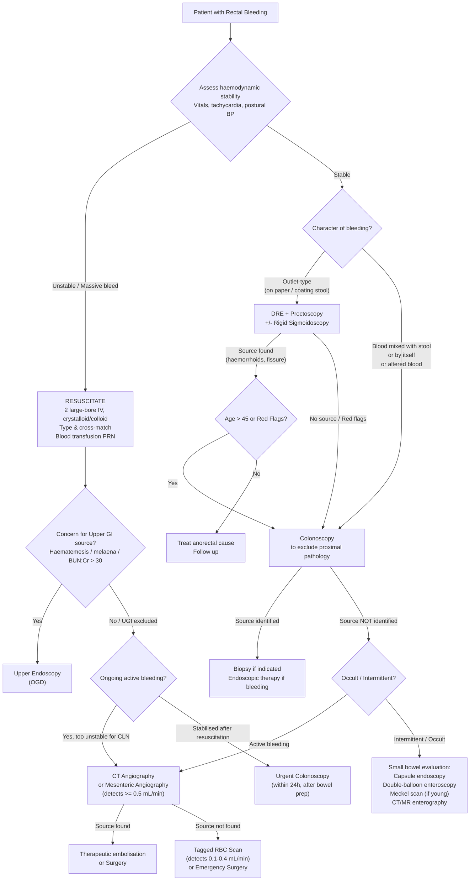

## Diagnostic Criteria, Algorithm and Investigations for Rectal Bleeding

### 1. Overarching Diagnostic Principles

Rectal bleeding does not have a single "diagnostic criterion" the way a metabolic or autoimmune disease does. Instead, the diagnosis is a **stepwise process** governed by three sequential priorities [3][5]:

1. ***Save the patient*** — resuscitation and haemodynamic stabilisation
2. ***Find the bleeding*** — localisation of the bleeding site
3. ***Stop the bleeding*** — endoscopic, angiographic or surgical haemostasis

> Think of it this way: you cannot investigate a dead patient, and you cannot treat what you haven't found. The order is always **resuscitate → localise → treat**.

The choice of investigation depends on:
- **Haemodynamic stability** — an unstable patient cannot sit through a bowel-prepped colonoscopy
- **Severity and acuity** — occult bleeding is investigated differently from massive overt bleeding
- **Suspected source** — outlet-type bleeding → proctoscopy first; concern for UGIB → OGD first

---

### 2. Diagnostic Algorithm — Overview

<Callout title="Why OGD Before Colonoscopy in Severe Haematochezia?">
***10–15% of patients with severe haematochezia have an upper GI source*** [2][3][5]. A brisk duodenal ulcer bleed or variceal haemorrhage can transit the entire bowel without being degraded to melaena. If there is any concern for a UGI source (haematemesis, melaena, coffee-ground vomitus, haemodynamic instability disproportionate to visible PR blood, elevated BUN:Cr ratio), ***perform OGD before colonoscopy*** [3][5]. An alternative rapid screen is ***NG tube aspiration*** — bile-stained but non-bloody aspirate makes an upper GI source very unlikely [3][5].
</Callout>

---

### 3. Bedside Assessment — Before Any Investigation

#### 3.1 History and Examination as "Investigations"

The history and physical examination are themselves diagnostic instruments. Key points were covered in prior sections, but for the investigation framework, note:

***Key history*** [1]:
> ***Nature of the bleed, including fresh versus altered blood, mixed with faeces and/or mucus, in toilet bowl or on underwear. Quantity of bleeding: slight, moderate or torrential. Associated symptoms (e.g. weight loss, constipation, diarrhoea, pain, weakness, presence of lumps, urgency, unsatisfied defecation, recent change of bowel habit).***

***Key examination*** [1]:
> ***General inspection (evidence of anaemia) and vital signs***
> ***Abnormal examination, anal inspection, digital rectal examination, proctosigmoidoscopy***

#### 3.2 Assessment of Haemodynamic Stability [2][3][5]

This is the **first and most critical** step — it determines the urgency and sequence of investigation.

| Parameter | Interpretation |
|---|---|
| **Heart rate** | Tachycardia (> 100 bpm) suggests ≥ 15–30% blood volume loss |
| **Blood pressure** | Hypotension (SBP < 90) suggests ≥ 30–40% loss |
| **Postural BP** | ≥ 20 mmHg systolic drop on standing = orthostatic hypotension → ≥ 15% loss |
| **Urine output** | < 0.5 mL/kg/h suggests inadequate renal perfusion |
| **Mental status** | Confusion/agitation suggests severe hypovolaemia |
| ***Temperature*** | ***↓ body temperature can cause ↓ efficiency of clotting factors*** — prevent hypothermia [3][5] |

**Physical examination checklist** [3][5]:
- **Vitals**: BP/P, RR, postural BP, fever
- **General**: pallor (anaemia), dehydration (CRT, dry tongue), extra-abdominal manifestations of IBD
- **Abdomen**: mass, tenderness, signs of chronic liver disease, hepatosplenomegaly, ascites
- ***Digital rectal examination + proctoscopy***: confirm haematochezia, assess stool colour, look for anorectal pathologies (haemorrhoids, fissure, masses) [3][5]

---

### 4. Laboratory Investigations — "First-Line Bloods"

***Key investigations*** [1]: ***FBE and ESR, Stool M&C, Faecal occult blood***

| Investigation | What to Look For | Why / Interpretation |
|---|---|---|
| ***CBC with differentials*** [2][5] | Hb, Hct, MCV, WCC, platelets | **Hb may be normal initially** in acute bleeding — the patient is losing whole blood (cells + plasma proportionally), so the Hb concentration doesn't drop until fluid resuscitation dilutes the remaining blood [2]. Microcytic anaemia (↓ MCV) → chronic occult blood loss (e.g. CRC, angiodysplasia). ↑ WCC → infection or ischaemic colitis |
| **Type and cross-match** [2][5] | Blood group, antibody screen | Required for **all haemodynamically unstable patients** or those likely to need transfusion. Don't wait — send this early |
| **Clotting profile** (PT/INR, aPTT) [2][5] | Coagulopathy | Liver disease (↓ clotting factor production), anticoagulant therapy (warfarin → ↑ INR; heparin → ↑ aPTT). Must correct before invasive procedures |
| ***LFT*** [2] | Albumin, transaminases, bilirubin, ALP | Chronic liver disease → portal hypertension → rectal varices. Low albumin → poor nutritional status / chronic disease. Raised ALP/bilirubin → liver metastases (CRC) |
| ***RFT*** [2] | Urea (BUN), creatinine | **BUN-to-creatinine ratio** is a key discriminator: ***Normal BUN:Cr (< 20:1 or urea:Cr < 100:1)*** in LGIB vs ***elevated (> 30:1)*** in UGIB — because blood in the upper GI tract is "digested" and the protein is absorbed as urea [2]. Also assesses hydration and pre-renal failure. Chronic renal disease → baseline low Hb (deficient erythropoietin), so interpret CBC with caution [2] |
| ***Iron profile*** [12] | Serum iron, ferritin, TIBC, transferrin saturation | Iron deficiency anaemia (↓ ferritin, ↓ iron, ↑ TIBC) → chronic occult blood loss → investigate for CRC or angiodysplasia |
| **Lactate, ABG** [8] | Serum lactate, pH, base excess | ↑ Lactate and metabolic acidosis suggest tissue hypoperfusion — seen in massive bleeding or ischaemic colitis |
| ***ESR / CRP*** [1] | Inflammatory markers | ↑ in IBD, infective colitis, ischaemic colitis, malignancy |
| ***Stool M&C*** [1][2] | Microscopy, culture, sensitivity | Look for *Campylobacter*, *Salmonella*, *Shigella*, *E. coli* O157:H7, *Entamoeba histolytica* (amoebic dysentery) [2]. Also send ***C. difficile toxin*** (especially post-antibiotic patients) [2] |
| ***Faecal occult blood (FOBT)*** [1] | Guaiac or immunochemical test | Detects occult bleeding not visible to the naked eye. Positive FOBT in a patient with iron deficiency anaemia → must investigate with colonoscopy. Also used as a **screening tool** for CRC in asymptomatic populations |
| **CEA** (carcinoembryonic antigen) [12][13] | Serum level | ***NOT recommended as a screening or diagnostic test for CRC*** — low sensitivity (~50% of CRC only elevated) and low specificity (false positives in smoking, TB, IBD, pregnancy) [12]. Its role is in **pre-operative baseline** for surgical planning and **post-operative surveillance** for detecting recurrence [12][13] |

<Callout title="Why Is Hb Normal in Acute Bleeding?" type="error">
A common student mistake is expecting the Hb to drop immediately in acute haemorrhage. In acute blood loss, you lose both red cells AND plasma in equal proportion — so the *concentration* of Hb (which is what the blood test measures) stays the same initially. The Hb only drops once the body starts auto-transfusing interstitial fluid into the vascular space, or once you give IV fluids for resuscitation, diluting the remaining red cells. Serial Hb monitoring is therefore essential — a falling Hb trend is more informative than a single value [2].
</Callout>

---

### 5. Endoscopic Investigations

Endoscopy is the cornerstone of diagnosis in rectal bleeding because it allows **direct visualisation**, **tissue biopsy**, and **therapeutic intervention** in one sitting.

#### 5.1 ***Proctoscopy*** and Rigid Sigmoidoscopy

| Feature | Proctoscopy | Rigid Sigmoidoscopy |
|---|---|---|
| **Reach** | Anal canal + distal rectum (~10 cm) | Up to sigmoid colon (~25 cm) [14] |
| **Sedation** | Not required | Not required |
| **Bowel prep** | Fleet enema × 1–2 | Fleet enema × 2 |
| **Key indication** | ***Exclusion of bleeding from anorectal disorders*** [2][3] — especially internal haemorrhoids (grade 1–2 may not be palpable on DRE [7]) | Anorectal pathology, low rectal tumours (assess true height, biopsy within reach), conservative Mx of sigmoid volvulus [14] |
| **Limitations** | Cannot visualise above rectum | Cannot see beyond sigmoid; no sedation → limited tolerance |

> **Clinical pearl**: ***Proctoscopy should be the first investigation in outlet-type bleeding*** (blood on paper, dripping after defecation) in a young patient without red flags [8]. If a clear anorectal source is found AND there are no red flags (age < 45, no FHx, no change in bowel habit), you may not need a full colonoscopy. But ***if the patient is > 45 or has ANY red flags for CRC, proceed to colonoscopy regardless*** [7].

#### 5.2 ***Flexible Sigmoidoscopy***

- Reaches up to the **descending colon** (~60 cm) [14]
- Requires **low-residue diet for 3 days + Fleet enema × 2** [14]
- **No sedation** required (office procedure)
- ***Indication: fresh PR bleed without alarming symptoms*** in a patient < 40–45 years [14]
- Limitation: cannot visualise the right colon — since ~30% of CRC is right-sided and right-sided tumours are increasing, flexible sigmoidoscopy alone is **considered inadequate** for a complete work-up if CRC is suspected [5]
- ***Proceed to colonoscopy if***: PR bleed in age > 45, change in bowel habit/tenesmus, FHx of CRC [7]

#### 5.3 ***Colonoscopy*** — The Gold Standard

> ***Colonoscopy: diagnostic yield = 75–90%, low complication rate*** [3][5]

| Aspect | Details |
|---|---|
| **Reach** | Entire colon from rectum to caecum; usually also intubate the **ileocaecal valve** to exclude distal small bowel bleeding [3][5] |
| **Bowel preparation** | Polyethylene glycol (PEG) solution — ***↑ diagnostic yield but does not ↑ morbidity. NOT feasible in unstable patients*** [3][5] |
| **Timing** | ***Should be performed early*** (ideally within 24h of presentation for acute LGIB) — to obtain a diagnosis before bleeding stops and to allow therapeutic intervention [3][5] |
| **Diagnostic capability** | Direct visualisation + biopsy + genetic/molecular analysis of tissue. ***Missed CRC only in 2–6%*** [5] |
| **Therapeutic capability** | ***Especially effective in angiodysplasia and diverticular disease*** [3][5]: sclerosant/vasoconstrictor injections, heat probe, electrocoagulation, laser, haemoclips, ***argon plasma coagulation (APC)***, band ligation |

**Key Endoscopic Findings by Cause:**

| Cause | Endoscopic Appearance |
|---|---|
| **Diverticular bleeding** | Active bleeding, non-bleeding visible vessel, or ***adherent clot located in a diverticulum*** — but these definite sources are only identified in 21% [5]. Multiple diverticula are usually present → the challenge is identifying *which* one bled |
| **Angiodysplasia** | ***"Cherry red spots"*** — flat or slightly raised, bright red mucosal lesions 2–10 mm, usually in caecum/ascending colon [8] |
| **CRC** | ***Majority are endoluminal masses (exophytic or polypoid)***, may be friable, necrotic, or ulcerated with bleeding. May be circumferential → obstruct distal scoping. ***Important to scope entire colon*** — synchronous tumour in 3–5%, synchronous polyps in 30–50% [5] |
| **UC** | ***Extensive ulceration of the mucosa; surface is irregular, friable, erythematous, with loss of normal vascular markings*** [2]. Continuous from rectum extending proximally. Pseudopolyps in chronic disease |
| **Crohn's disease** | Skip lesions, deep serpentine ulcers ("cobblestone" pattern), aphthous ulcers, strictures, fistula openings |
| **Ischaemic colitis** | Oedematous folds, submucosal haemorrhage ("thumbprinting" on AXR corresponds to oedematous mucosa), ischaemic ulcers, necrosis of colonic wall in severe cases [2] |
| **Radiation proctitis** | ***Vascular telangiectasia on scope*** — fragile, dilated mucosal vessels in the irradiated segment [3] |
| **Haemorrhoids** | Engorged vascular cushions at 3, 7, 11 o'clock positions; seen best on ***proctoscopy*** (not colonoscopy, as insufflation can decompress them) [3][5] |

<Callout title="Important — Colonoscopy Low Diagnostic Yield in Massive Bleeding" type="idea">
***Colonoscopy has a low diagnostic yield in massive bleeding*** because poor visualisation from blood in an unprepared colon makes it difficult to identify the source [8]. In these cases, CT angiography or mesenteric angiography is preferred. Colonoscopy is best when the patient has been stabilised and bowel-prepped.
</Callout>

#### 5.4 Upper Endoscopy (OGD)

***Indicated if the bleeding source is not identified on colonoscopy*** [2], or if there is concern for an upper GI source (haematemesis, melaena, severe haematochezia with haemodynamic instability). ***Generally prefer OGD before colonoscopy*** in practice [3][5] — because an upper GI source is potentially more dangerous and faster to investigate.

**Alternative quick screen**: ***NG tube aspiration*** — if the aspirate contains bile (confirming the tube has passed into the duodenum) and no blood, an upper GI source is very unlikely [3][5].

---

### 6. Radiological Investigations

#### 6.1 ***CT Angiography (CTA)***

| Aspect | Details |
|---|---|
| **Principle** | IV contrast injection followed by rapid helical CT → detects contrast extravasation into the bowel lumen at the site of active bleeding |
| **Sensitivity** | Detects bleeding rates ≥ 0.3–0.5 mL/min (better than conventional angiography at ≥ 0.5–1.0 mL/min) |
| **Advantages** | ***Widely available, fast, and minimally invasive for localisation of active haemorrhage*** [2]. Non-operator-dependent. Can identify non-vascular pathology (masses, diverticulitis, abscess) as a bonus |
| **Disadvantages** | ***Lacks therapeutic capability*** (cannot embolise), ***requires radiation exposure and IV contrast*** [2] (risk of contrast nephropathy, allergic reaction) |
| **Role** | First-line imaging in **haemodynamically unstable patients** where colonoscopy is not feasible, or when colonoscopy fails to identify the source [8]. Guides subsequent mesenteric angiography for therapeutic embolisation |

#### 6.2 ***Mesenteric Angiography***

| Aspect | Details |
|---|---|
| **Principle** | ***Selective catheterisation of SMA, subsequently IMA and coeliac vessels*** by Seldinger technique → look for contrast extravasation [2][3] |
| **Sensitivity** | ***Detection requires active bleeding of 0.5–1.0 mL/min*** [2]. Diagnostic yield 27–67% [3] |
| **Advantages** | ***Localisation of bleeding site is very accurate*** [2]. ***Allows therapeutic capability***: intra-arterial vasopressin injection or ***transcatheter embolisation*** (super-selective catheterisation) [2][8]. Can diagnose non-bleeding lesions (e.g. angiodysplasia, SB tumours). Can be done intra-operatively to guide surgery [3] |
| **Disadvantages** | Not sensitive for slow/intermittent bleeding. Risk of intestinal ischaemia with embolisation. More invasive (arterial puncture, contrast load) [3] |
| **Key finding — Angiodysplasia** | ***"Mother-in-law phenomenon"*** — early filling (arterial phase), persistent opacification (venous phase), delayed emptying → the contrast arrives early and stays late [8]. Also: dilated, tortuous vessels, arteriovenous shunting, vascular tuft |
| **Key finding — Active bleeding** | Contrast extravasation into bowel lumen |

#### 6.3 ***Radionuclide Imaging (Tagged RBC Scan)*** [2][12a]

There are two main types:

| Type | ***Technetium-99m (⁹⁹ᵐTc) Pertechnetate-Labelled RBC*** | ***Technetium-99m Sulphur Colloid*** |
|---|---|---|
| **Technique** | RBCs drawn, labelled in vitro with ⁹⁹ᵐTc → re-injected IV → serial abdominal images over up to 24h [2][12a] | IV injection of ⁹⁹ᵐTc-labelled colloid → rapid imaging |
| **Minimum bleeding rate** | ***0.1–0.4 mL/min*** → ***more sensitive than angiography*** [2][12a] | 0.1 mL/min |
| **Delayed imaging** | ***Yes — can image up to 24h → can detect intermittent bleeding*** [2][12a] | No — colloid rapidly cleared by reticuloendothelial system (liver/spleen) → short imaging window |
| **Localisation** | ***Poor localisation of bleeding site*** [2] — blood moves within bowel lumen (anterograde and retrograde peristalsis) | Poor — limited by liver/spleen uptake obscuring adjacent sites |
| **Therapeutic value** | ***None*** [2] | None |
| **Role** | ***Screening tool to confirm bleeding prior to angiography in non-life-threatening cases*** [2]. Best for intermittent bleeding where angiography would be negative. If positive → proceed to angiography for precise localisation and therapy | Largely superseded by tagged RBC scan |

**Diagnostic criteria for positive RBC scan** [12a]:
1. ***Activity conforms to intestinal anatomy***
2. ***Intensity increases with time***
3. ***Activities move (anterograde or retrograde) within the bowels***

> **Why is the RBC scan preferred over angiography as a first step?** Because it is ***more sensitive*** (detects slower bleeding), ***can detect intermittent bleeding*** via delayed imaging, and is ***less invasive*** [12a]. However, its poor spatial resolution means it cannot precisely pinpoint the bleeding vessel — so a positive RBC scan is usually followed by angiography for precise localisation and embolisation.

#### 6.4 ***Meckel's Scan*** (Technetium-99m Pertechnetate Scan) [13a]

| Aspect | Details |
|---|---|
| **Principle** | ⁹⁹ᵐTc-pertechnetate is actively accumulated by **gastric mucosa** (pertechnetate behaves like chloride ions → actively secreted by gastric parietal cells). Ectopic gastric mucosa in a Meckel's diverticulum will take up the tracer [13a] |
| **Pre-medication** | ***H2-receptor blockers*** (e.g. ranitidine/famotidine) — inhibit excretion of the isotope into the bowel lumen after uptake, increasing sensitivity [13a] |
| **Indication** | ***Young patients*** with unexplained GI bleeding (especially painless massive PR bleed in children) [3][13a] |
| **False positives** | Intestinal duplications (also contain ectopic gastric mucosa) |
| **False negatives** | No or inadequate heterotopic gastric mucosa; rapid bleeding causing dilution of radiotracer [13a] |

#### 6.5 ***Abdominal X-ray (AXR)***

- **Not a primary diagnostic tool** for rectal bleeding, but can show supportive findings:
  - **Thumbprinting**: thickened oedematous bowel wall folds in ischaemic colitis
  - **Dilated bowel**: bowel obstruction (from CRC or diverticular stricture)
  - **Pneumatosis intestinalis**: gas in the bowel wall → advanced ischaemia/necrosis
  - ***Free gas under diaphragm*** (on erect CXR): perforation (perforated diverticulitis, perforated CRC)
- ***Consider abdominal X-ray*** [1] as part of the initial work-up, especially if there is abdominal pain or distension

#### 6.6 ***CT Abdomen and Pelvis (with contrast)***

Beyond CTA for active bleeding, standard CT is invaluable for:
- ***Diverticulitis***: bowel wall thickening, pericolic fat stranding, abscess, free air [8a]
- **CRC staging**: CT TAP (chest, abdomen, pelvis) for local extent and distant metastases [12]
- **Ischaemic colitis**: bowel wall thickening, mesenteric stranding, pneumatosis
- **Abscess/fistula** assessment in complicated diverticular disease or Crohn's

#### 6.7 ***CT Colonography (Virtual Colonoscopy)***

| Aspect | Details |
|---|---|
| **Technique** | Spiral CT with IV contrast + air insufflation per rectum → computer-generated "fly-through" simulating colonoscopy [12][13] |
| **Indication** | ***When colonoscopy is incomplete*** (due to obstructing tumour or patient intolerance) [12] |
| **Performance** | Similar diagnostic accuracy to colonoscopy for tumours > 1 cm; can provide extraluminal information (staging) [13] |
| **Limitations** | High radiation dose, not therapeutic (still need colonoscopy for biopsy), requires bowel prep (stools can simulate polyps) [13] |

#### 6.8 ***Barium / Gastrografin Contrast Enema***

- Largely **superseded by CT colonography** due to risk of barium peritonitis and lower diagnostic accuracy [12][13]
- **Double-contrast barium enema (DCBE)**: barium + air → classic ***"apple-core" lesion*** (near-circumferential involvement) in CRC [12]
- Only considered when colonoscopy and CT colonography are not available or feasible

#### 6.9 ***Small Bowel Enema (Enteroclysis)***

- Intubation of DJ flexure under fluoroscopy → injection of barium, methylcellulose and water (double contrast) [8]
- ***Low yield (~10%)*** and ***cannot detect vascular lesions*** [3]
- Largely replaced by capsule endoscopy and CT/MR enterography

---

### 7. Advanced / Second-Line Investigations

These are employed when standard "top-and-tail" endoscopy (OGD + colonoscopy) fails to identify the source — the so-called **GI bleeding of obscure origin** [14a].

#### 7.1 Wireless Capsule Endoscopy

- Patient swallows a capsule containing a camera → transmits images wirelessly as it transits the small bowel
- **Best for**: occult/intermittent small bowel bleeding (angiodysplasia, Crohn's, small bowel tumours)
- ***Contraindication***: intestinal obstruction (capsule may impact) → do CT/MR enterography beforehand to exclude strictures [8]
- Not therapeutic

#### 7.2 ***Double-Balloon Enteroscopy (DBE)***

- Scope with two inflatable balloons → allows sequential advancement deep into the small bowel from either the oral or anal route [8]
- **Diagnostic AND therapeutic** (biopsy, cauterisation, polypectomy)
- Used for **intermittent small bowel bleeding** (angiodysplasia, Dieulafoy lesion) when capsule endoscopy has identified a target [8]

#### 7.3 CT / MR Enterography

- Cross-sectional imaging with oral contrast optimised for small bowel visualisation
- Useful for detecting Crohn's disease extent, small bowel tumours, Meckel's diverticulum complications
- MR enterography preferred in young patients (no radiation)

#### 7.4 Intra-operative Endoscopy

- ***Enteroscopy performed during laparotomy*** to assess both intra- and extraluminal pathologies [3][5]
- Indicated when all other modalities fail and surgery is already being performed for life-threatening bleeding
- Surgeon makes an enterotomy and passes the scope in both directions [3]

---

### 8. Investigation Strategy by Clinical Scenario

| Scenario | First-Line | Second-Line | Rationale |
|---|---|---|---|
| **Outlet-type bleeding, young, no red flags** | DRE + Proctoscopy ± Flexible sigmoidoscopy | Colonoscopy if no source or red flags emerge | Most likely haemorrhoids/fissure; avoid over-investigation |
| ***New bleeding age > 55*** | ***Colonoscopy*** | CT colonography if incomplete | ***"New bleeding age > 55 demands colonic investigation"*** [1] — to exclude CRC |
| **Acute massive PR bleed, haemodynamically unstable** | Resuscitate → OGD (to exclude UGIB) → CTA or mesenteric angiography | Emergency surgery if above fails | Cannot bowel-prep for colonoscopy; need rapid localisation |
| **Acute moderate PR bleed, stable after resuscitation** | Urgent colonoscopy (within 24h with bowel prep) | CTA → angiography if colonoscopy non-diagnostic | Colonoscopy is both diagnostic and therapeutic |
| **Bloody diarrhoea with fever** | Stool MCS + C. diff toxin + Colonoscopy with biopsy | CT abdomen if complications suspected | Need to differentiate infective vs IBD vs ischaemic colitis |
| **Occult bleeding / iron deficiency anaemia** | Colonoscopy + OGD ("top and tail") | Capsule endoscopy → DBE for small bowel | Most occult GI bleeding is from the colon or upper GI; if both negative, investigate the small bowel |
| **Suspected Meckel's diverticulum (young patient)** | Meckel's scan (⁹⁹ᵐTc pertechnetate) | Diagnostic laparoscopy if scan negative but clinical suspicion high | Ectopic gastric mucosa takes up pertechnetate |
| **Known cirrhosis with PR bleed** | OGD (to exclude oesophageal/gastric varices) + Proctoscopy (rectal varices) | Colonoscopy if non-variceal source | Multiple potential sources in cirrhotics — must investigate all |

---

### 9. ***Key Investigations Summary*** (Murtagh's) [1]

> ***FBE and ESR***
>
> ***Stool M&C***
>
> ***Faecal occult blood***
>
> ***Colonoscopy***
>
> ***Consider abdominal X-ray, CT colonography, angiography, small bowel enema (depending on clinical findings)***

---

### 10. ***Diagnostic Tips*** (Murtagh's) [1]

> ***1. Black, tarry (melaena) stool indicates bleeding from upper GIT: rare distal to lower ileum.***
>
> ***2. Frequent passage of blood and mucus indicates a rectal tumour or proctitis.***
>
> ***3. If substantial haemorrhage, consider diverticular disease, angiodysplasia or more proximal lesions (e.g. Meckel diverticulum, duodenal ulcers).***
>
> ***4. New bleeding age > 55 years demands colonic investigation.***
>
> ***5. 80% of rectal tumours are within fingertip range.***
>
> ***6. In young adults, diagnosis is likely to be haemorrhoids or a fissure.***

---

### 11. Comparison of Investigation Modalities — Quick-Reference Table

| Modality | Min. Bleed Rate | Localisation | Therapeutic | Key Advantage | Key Limitation |
|---|---|---|---|---|---|
| **Colonoscopy** | Any (if visible) | Excellent | Yes | Gold standard; diagnostic yield 75–90%; biopsy + therapy | Needs bowel prep; poor in massive bleed |
| **CTA** | ≥ 0.3 mL/min | Good | No | Fast, widely available, non-operator-dependent | No therapy; radiation + contrast |
| **Mesenteric angiography** | ≥ 0.5–1.0 mL/min | Excellent | Yes (embolisation) | Precise; therapeutic | Invasive; misses slow/intermittent bleed |
| **Tagged RBC scan** | ≥ 0.1–0.4 mL/min | Poor | No | Most sensitive; detects intermittent bleed | Poor localisation; no therapy |
| **Meckel's scan** | N/A | Good | No | Specific for ectopic gastric mucosa | False negatives if no gastric mucosa |
| **Capsule endoscopy** | Occult/slow | Good (SB) | No | Non-invasive SB visualisation | Cannot be used in obstruction; no therapy |
| **DBE** | Occult/slow | Good (SB) | Yes | Therapeutic capability in SB | Operator-dependent; time-consuming |
| **CT colonography** | N/A | Good | No | Non-invasive; extraluminal info | Still needs CLN for biopsy |

---

<Callout title="High Yield Summary — Diagnosis of Rectal Bleeding">

**Three priorities**: Resuscitate → Localise → Stop bleeding.

**First step in all patients**: History + DRE + Proctoscopy. These alone can diagnose haemorrhoids, fissure, and low rectal masses.

**Colonoscopy** is the gold standard (diagnostic yield 75–90%) but needs bowel prep and a stable patient. Perform within 24h for acute LGIB.

**Always exclude UGIB** in massive haematochezia — OGD before CLN, or NG aspirate to screen.

**Unstable + massive bleed** → CTA or mesenteric angiography (can also embolise).

**Occult/intermittent bleed** → Tagged RBC scan (most sensitive at 0.1–0.4 mL/min) → if positive, angiography for localisation.

**BUN:Cr ratio**: > 30:1 suggests upper GI source (digested blood → urea absorbed). Normal in LGIB.

**Hb may be normal initially** in acute bleeding — serial monitoring essential.

**CEA is NOT for screening CRC** — use for pre-op baseline and post-op surveillance.

**Murtagh's key investigations**: FBE, ESR, stool M&C, FOBT, colonoscopy. Consider AXR, CT colonography, angiography, small bowel enema.

</Callout>

---

<ActiveRecallQuiz
  title="Active Recall — Diagnosis and Investigations of Rectal Bleeding"
  items={[
    {
      question: "A patient presents with acute massive PR bleeding and haemodynamic instability. Outline your investigation sequence after initial resuscitation.",
      markscheme: "After resuscitation (2 large-bore IV, crystalloid/blood, bloods including CBC, clotting, T&S, RFT, LFT, lactate): (1) Exclude UGIB — OGD or NG aspirate. (2) If UGI excluded and ongoing bleeding too brisk for colonoscopy — CT angiography for localisation. (3) If CTA positive — proceed to mesenteric angiography for therapeutic embolisation. (4) If CTA negative or intermittent — tagged RBC scan. (5) If all fail — emergency surgery with intra-operative endoscopy."
    },
    {
      question: "Explain why the BUN-to-creatinine ratio helps differentiate upper from lower GI bleeding.",
      markscheme: "In UGIB, blood (protein) is digested by gastric acid and intestinal enzymes in the upper GI tract. The digested protein is absorbed as amino acids and converted to urea by the liver, raising BUN. Creatinine is unaffected. This produces a BUN:Cr ratio > 30:1 (or urea:Cr > 100:1). In LGIB, blood passes through the colon without significant digestion, so BUN is not elevated and the ratio remains normal (< 20:1)."
    },
    {
      question: "What are the three diagnostic criteria for a positive tagged RBC scan?",
      markscheme: "(1) Radiotracer activity conforms to intestinal anatomy. (2) Intensity of activity increases with time. (3) Activity moves (anterograde or retrograde) within the bowels. All three must be met to confirm active GI bleeding."
    },
    {
      question: "A colonoscopy in an elderly patient shows 'cherry red spots' in the caecum. What is the diagnosis, and what would you see on mesenteric angiography?",
      markscheme: "Diagnosis: Angiodysplasia (vascular ectasia). On mesenteric angiography: 'mother-in-law phenomenon' — early arterial filling of the lesion, persistent opacification through the venous phase, and delayed emptying. Also: dilated tortuous vessels, arteriovenous shunting, vascular tuft."
    },
    {
      question: "Why is CEA not used as a screening test for colorectal cancer? What is its clinical role?",
      markscheme: "CEA has low sensitivity (elevated in only about 50% of CRC, often only in advanced disease) and low specificity (false positives in smoking, TB, IBD, pregnancy, other carcinomas). Its role is: (1) Pre-operative baseline for surgical planning. (2) Post-operative surveillance to detect recurrence or metastasis (serial monitoring). (3) Prognostication (higher pre-op CEA correlates with worse prognosis)."
    }
  ]}
/>

## References

[1] Lecture slides: murtagh merge.pdf (p78–79, "Rectal bleeding")
[2] Senior notes: felixlai.md (Lower GI bleeding diagnosis, sections 511–514)
[3] Senior notes: Ryan Ho Fundamentals.pdf (p281–285, "Lower GI Bleeding — Approach, Investigations and Management")
[5] Senior notes: Ryan Ho GI.pdf (p107–111, "Lower GI Bleeding — Approach, Investigations and Management"; p160, "Diverticular Bleeding"; p162, "Meckel's Diverticulum"; p166, "CRC Diagnostic Investigations")
[7] Senior notes: maxim.md (Haemorrhoids examination and investigation, section 229)
[8] Senior notes: maxim.md (Acute management of LGIB, sections 158–161; Angiodysplasia investigations, section 197; Diverticular disease investigations, section 194)
[12] Senior notes: felixlai.md (CRC biochemical tests and radiology, section 1011)
[12a] Senior notes: Ryan Ho Diagnostic Radiology.pdf (p62, "Red Blood Cell Scan")
[13] Senior notes: maxim.md (CRC investigations, section 217)
[13a] Senior notes: maxim.md (Meckel's scan, section 712)
[14] Senior notes: maxim.md (Flexible sigmoidoscopy and rigid sigmoidoscopy, section 73)
