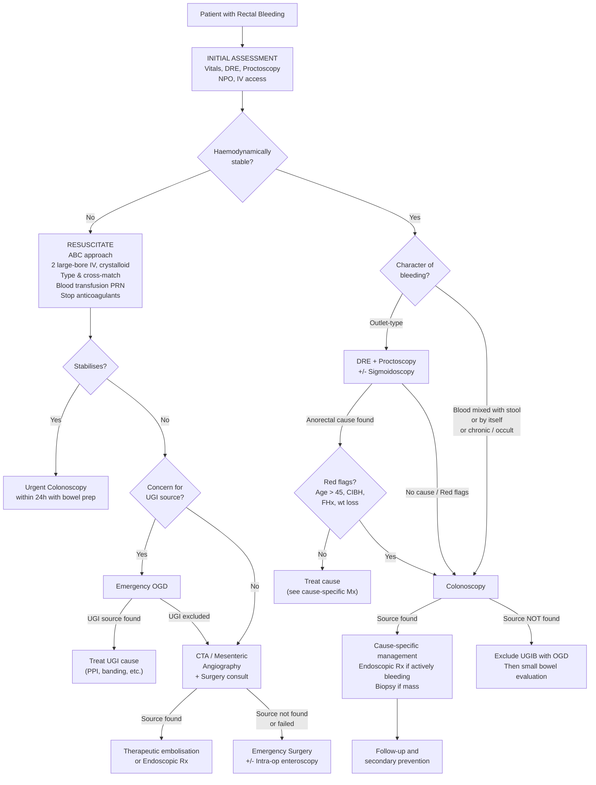

## Management of Rectal Bleeding

### 1. Overarching Principles

The management of rectal bleeding is governed by three sequential priorities — the same framework used for diagnosis, because in GI bleeding, **investigation and treatment often happen simultaneously** [3][5]:

> ***Save the patient → Find the bleeding → Stop the bleeding*** [3][5]

A few critical facts set the context:

- ***75% of lower GI bleeding stops spontaneously*** [3][5] — so many patients will not need any intervention beyond resuscitation and observation. However, you must still investigate to find the cause, because something like CRC won't bleed forever but will still kill the patient.
- ***15–20% of patients with acute LGIB require surgery*** [3][5].
- The specific definitive management depends entirely on the **underlying cause** — you manage the bleeding acutely, then treat the disease.

---

### 2. Management Algorithm — Overview

---

### 3. Phase 1: Initial Assessment and Resuscitation

This is the **life-saving phase** — it applies to ALL patients with significant rectal bleeding, regardless of the suspected cause.

#### 3.1 Immediate Measures [3][5][8][15]

| Step | Action | Rationale |
|---|---|---|
| ***NPO*** | Nil by mouth | Patient may need urgent endoscopy or surgery — a full stomach increases aspiration risk [5] |
| ***IV access*** | ***2 large-bore IV cannulae (14–16G) at antecubital veins*** [8][15] | Large-bore access allows rapid volume resuscitation. Two lines because one may fail or be needed for blood products while the other runs crystalloid |
| ***Stop anticoagulants*** | Withhold warfarin, DOACs, heparin, antiplatelets [8] | These drugs impair haemostasis. Reverse if actively bleeding and haemodynamically compromised (vitamin K for warfarin, idarucizumab for dabigatran, andexanet alfa for factor Xa inhibitors) |
| **Monitor vitals** | ***Shock chart hourly: BP/P, RR, body temperature*** [3][5] | Track haemodynamic response to resuscitation. ***↓ body temperature can cause ↓ efficiency of clotting factors*** — prevent hypothermia [3][5] |
| ***Foley's catheter*** | ***Urine output ≥ 0.5 mL/kg/h*** [3][5] | Urine output is the best bedside indicator of end-organ perfusion. Oliguria (< 0.5 mL/kg/h) = inadequate resuscitation |
| **Cardiac monitor + pulse oximetry** | Continuous | Detect arrhythmias from hypovolaemia, monitor oxygenation [3][5] |
| **± CVP line** | Central venous pressure monitoring | Consider in patients with heart failure or renal failure (risk of fluid overload) to guide resuscitation [3][5] |

#### 3.2 Resuscitation — The ABC Approach [3][5]

> ***A — Airway***: Intubate if the patient is decompensated (confused, GCS ↓) or has massive haematemesis with aspiration risk [3][5].
>
> ***B — Breathing***: O₂ via nasal cannula to ***↑ O₂-carrying capacity of remaining blood*** [3][5]. Even though Hb may be dropping, maximising the oxygen saturation of what Hb remains is crucial.
>
> ***C — Circulation***: ***Large-bore IV cannula with colloid/crystalloid infusion ± blood transfusion*** [3][5].

**Fluid resuscitation** [5][15]:
- Start with **rapid crystalloid bolus** (500–1000 mL of normal saline or Hartmann's solution over 5–10 minutes) [15]
- Reassess BP/P after each bolus — repeat if not responding [15]
- If still unstable after 2 L crystalloid → likely needs **blood transfusion** [3][5]

**Indications for blood transfusion** [3][5]:
- ***Profuse bleeding***
- ***Persistent haemodynamic instability despite crystalloid resuscitation***
- ***Symptomatic anaemia***
- ***Acute MI/unstable angina with low Hb***

**Transfusion targets**:
- General: Hb **7–8 g/dL** (restrictive strategy — over-transfusion can ↑ portal pressure in variceal bleeding and is associated with ↑ mortality) [11]
- Ischaemic heart disease: consider higher target (Hb 8–9 g/dL)
- Correct coagulopathy: FFP if PT prolonged, platelets if < 50 × 10⁹/L and actively bleeding

**Bloods to send simultaneously** [3][5]:
- CBC, RFT, LFT, clotting profile, type and screen/cross-match, lactate, ABG

<Callout title="The 'Lethal Triad' of Massive Haemorrhage" type="error">
In massive bleeding, be vigilant for the **lethal triad**: **hypothermia + acidosis + coagulopathy**. Each worsens the others in a vicious cycle. Hypothermia impairs clotting enzyme function. Acidosis inhibits clotting factor activity. Coagulopathy causes more bleeding → more volume loss → more hypothermia and acidosis. **Prevent hypothermia** (warm fluids, blankets), **correct acidosis** (restore perfusion), and **correct coagulopathy** (blood products) simultaneously.
</Callout>

---

### 4. Phase 2: Localisation and Haemostasis — Cause-Specific Treatment

Once the patient is resuscitated (or concurrently in life-threatening situations), you move to **finding the bleed and stopping it**. The treatment modality depends on the underlying cause.

#### 4.1 Endoscopic Haemostasis

This is the **first-line therapeutic modality** for most causes of GI bleeding, because it can be performed during the diagnostic colonoscopy.

***Indications for endoscopic haemostasis*** [8]:
> ***Stigmata of recent haemorrhage: active bleeding, non-bleeding visible vessel, adherent clot***

| Modality | Mechanism | Best Suited For | Key Points |
|---|---|---|---|
| ***Adrenaline injection (1:10,000)*** | Volume effect (tamponade) + local vasoconstriction + platelet aggregation | Initial haemostasis in most causes | ***Not used alone*** — stops bleeding in 90–95% initially but often rebleeds after absorption (~1h). Must combine with a second modality [8][3a][5a] |
| ***Thermal — Argon plasma coagulation (APC)*** | Ionised argon gas delivers non-contact coagulation → superficial tissue desiccation | ***Angiodysplasia*** (thin-walled lesions), ***radiation proctitis*** | ***↓ energy depth than heat probe → ↓ risk of perforation*** → ideal for thin-walled structures and diffuse superficial oozing [3a][5a][8] |
| **Thermal — Heat probe / Bipolar diathermy** | Contact coagulation → coaptive sealing of vessel | Visible vessel in diverticular bleeding, peptic ulcers | Risk of perforation (direct thermal injury to wall) [3a][5a] |
| ***Mechanical — Haemoclips / Endoscopic clips*** | Physically compress the bleeding vessel closed | ***Diverticular bleeding*** (clip the vasa recta), large visible vessels, Mallory-Weiss tears | Durable haemostasis; no thermal injury [3a][5a][8] |
| ***Endoscopic band ligation*** | Rubber band strangulates the bleeding point → ischaemic necrosis | ***Diverticular bleeding***, rectal varices, oesophageal varices | Similar to RBL for haemorrhoids — the band cuts off blood supply [8] |
| **Haemospray** | Nanopowder applied to bleeding surface → large surface area induces haemostasis | Salvage when other modalities fail; diffuse oozing | Usually temporary bridge; limited availability [5a] |
| ***Injection sclerotherapy*** | Sclerosant (e.g. sodium tetradecyl sulphate, ethanolamine oleate) injected into/around vessel → thrombosis and fibrosis | ***Rectal varices*** (local injection), oesophageal varices | Largely replaced by band ligation for oesophageal varices; still used for rectal varices [3] |

<Callout title="Standard Dual Therapy for Active GI Bleeding">
The standard approach for endoscopic haemostasis in active bleeding is ***dual therapy: adrenaline injection + a second modality*** (thermal, mechanical, or band ligation) [3a][5a][8]. Adrenaline alone has an unacceptably high rebleeding rate. The second modality provides definitive haemostasis — think of adrenaline as "buying time" by tamponade while you apply the definitive clip or coagulation.
</Callout>

**Contraindication to endoscopy**: ***Perforation*** — gas insufflation during endoscopy can cause pneumoperitoneum → abdominal compartment syndrome → ↓ venous return and death + diaphragmatic splinting compromising ventilation [5a].

#### 4.2 Interventional Radiology — Transcatheter Arterial Embolisation (TAE)

| Aspect | Details |
|---|---|
| **Technique** | Selective catheterisation of SMA/IMA/coeliac axis → identify extravasation → super-selective catheterisation of the bleeding vessel → embolisation with coils, gel foam, or particles [2][8] |
| **Indications** | Failed endoscopic haemostasis; patient too unstable for colonoscopy; ongoing active bleeding with identifiable source on CTA/angiography [8] |
| **Advantages** | Does not require bowel prep; can be done in haemodynamically unstable patients; ***equally effective as surgery in patients who failed endoscopy and associated with fewer complications*** [2a]; reduces need for surgery without increasing mortality [2a] |
| **Disadvantages** | Risk of **intestinal ischaemia** (especially if non-super-selective); requires active bleeding at time of procedure (≥ 0.5–1.0 mL/min); contrast nephropathy; arterial puncture complications [3] |
| **Specific uses** | Diverticular bleeding, post-polypectomy bleeding, angiodysplasia (when endoscopy fails), rectal varices (if combined with TIPS) |

> ***TAE should be considered in patients who are high risk for surgery*** [2a]. Think of it as a less invasive alternative to the operating theatre, though it carries its own risks (ischaemia) and requires interventional radiology expertise.

#### 4.3 Surgery

***Surgery is required in approximately 15–20% of patients with acute lower GI bleed*** [3][5].

**Indications** [3][5]:
> - ***Haemodynamic instability despite adequate resuscitation***
> - ***Massive blood transfusion ( > 6 units)***
> - ***Frequent re-bleeding***
> - ***On anticoagulant or antiplatelets*** (higher bleeding risk, lower threshold for definitive haemostasis)

**Procedures** [3][5]:

| Scenario | Procedure | Outcome |
|---|---|---|
| ***With pre-operative localisation*** | ***Segmental resection*** (resect only the segment containing the bleeding source) | ***Rebleeding 0–15%, mortality 0–13%*** [3] |
| ***Without localisation — colonic source*** | ***Subtotal/total colectomy*** (remove entire colon) | ***Mortality 0–40%*** [3] — higher because these are the sickest patients |
| ***Without localisation — unknown source*** | Intra-operative colonoscopy or enteroscopy for localisation → then directed resection | Preferred over blind segmental resection |
| **Blind segmental resection** | Resect a segment based on clinical suspicion (no confirmed localisation) | ***Rebleeding up to 75%*** [3] — **avoid whenever possible** |

<Callout title="Why Pre-Operative Localisation Matters Enormously" type="error">
***Blind segmental resection has a rebleeding rate of up to 75%*** [3] because you may be removing the wrong segment. Pre-operative localisation (by colonoscopy, CTA, or angiography) is essential to guide the surgeon to the correct segment. If localisation is impossible and the patient is exsanguinating, subtotal colectomy (removing the entire colon) is safer than guessing — but carries significant morbidity and mortality.
</Callout>

---

### 5. Cause-Specific Management

#### 5.1 Diverticular Bleeding

| Phase | Management |
|---|---|
| **Acute** | Resuscitation → Colonoscopy (first-line) for localisation and endoscopic haemostasis: ***adrenaline injection, endoscopic clips/band ligation, bipolar diathermy*** [3][5][8] |
| **If colonoscopy fails** | CTA → Mesenteric angiography with embolisation [5][8] |
| **Localisation pathway** | ***Colonoscopy → angiography → on-table lavage and colonoscopy → subtotal colectomy and ileostomy*** if the bleeding source still cannot be identified [8a] |
| **Indications for surgery** | ***Haemodynamically unstable despite adequate resuscitation; excessive blood transfusion > 6 units; frequent rebleeding or persistent bleeding*** [2a] |
| **Elective/semi-elective** | ***Semi-elective segmental resection after 2nd bleeding episode*** — because natural history is commonly recurrent (14–38% rebleed) [3][5] |
| **Long-term prevention** | ***Lifestyle modification: high-fibre diet, bulk laxative (e.g. methylcellulose), weight reduction. Avoid stimulant laxatives and NSAIDs*** [8a] |

> ***50% of diverticular bleeding stops spontaneously*** [8a]. But the recurrence rate is high enough that after a second episode, most surgeons would recommend elective resection.

#### 5.2 Angiodysplasia

| Phase | Management |
|---|---|
| **Conservative** | ***Bed rest, tranexamic acid*** [8] — tranexamic acid is an anti-fibrinolytic that stabilises clots (inhibits plasminogen → plasmin conversion) |
| **Endoscopic** | ***Argon plasma coagulation (APC)*** is the modality of choice (↓ perforation risk, ideal for thin-walled lesions) or monopolar electrocautery [8] |
| **Interventional radiology** | ***Mesenteric angiogram for super-selective catheterisation and embolisation*** — if endoscopy fails or is not feasible [8] |
| **Surgical** | ***Only in selected patients because of high mortality*** [8]. Indications: failed endoscopic AND angiographic treatment; severe acute life-threatening GIB; multiple angiodysplastic lesions that cannot be managed otherwise. Approach: ***resection (right hemicolectomy) with anastomosis*** [8] |
| **Medical (for recurrent)** | Consider octreotide (↓ splanchnic blood flow), thalidomide (anti-angiogenic), oestrogen (controversial — limited evidence). Address underlying conditions: replace aortic valve in Heyde syndrome (resolves the acquired vWD) |

#### 5.3 Haemorrhoids

This is one of the most commonly tested management topics.

***Principle: conservative treatment for ALL patients*** — lifestyle modification and symptom control first [4].

**Grading and Management Ladder** [4][7]:

| Grade | Description | Management Options |
|---|---|---|
| ***I*** | Bleeding only, no prolapse | ***Dietary modification, rubber band ligation (RBL), injection sclerotherapy, infrared coagulation*** [4] |
| ***II*** | Prolapse at defecation, ***spontaneous reduction*** | ***Lifestyle, medical, RBL*** [7] |
| ***III*** | Prolapse requiring ***manual reduction*** | ***Lifestyle, medical, RBL + surgery*** [7] |
| ***IV*** | ***Chronic prolapse that is irreducible*** ± strangulated | ***Surgery*** [7] |

**Conservative Management** [4][7]:
- **Diet**: high-fibre diet, increase fluid intake (to soften stools and reduce straining), avoid spicy food
- **Toileting habits**: avoid prolonged sitting on toilet, avoid prolonged straining
- **Exercise, weight loss**
- **Medical**: stool softeners, bulking agents (e.g. Metamucil/psyllium), topical antiseptic (KMnO₄ sitz bath), topical haemostatic (e.g. Faktu), topical astringent (e.g. Anusol), topical analgesics

**Office-Based Procedures** [7]:

| Procedure | Technique | Key Details |
|---|---|---|
| ***Rubber band ligation (RBL)*** | Apply rubber bands to strangulate the haemorrhoidal cushion via Barron's bander → ***ischaemic necrosis*** → slough off within 10 days | ***Efficacy: 70% resolve, 30% recur***. Up to 3 bandings at ***≥ 1 cm above dentate line*** (to avoid somatic pain). Indication: ***symptomatic Grade II/III internal haemorrhoids***. Complications: ***pain, bleeding (7–10 days post-banding due to sloughing)***. ***Contraindication: anticoagulant use, immunocompromised*** [7] |
| **Injection sclerotherapy** | 5% phenol in almond oil injected submucosally → fibrosis → obliterate vascular channels and fix position | ***Largely abandoned now***: risk of allergy to nuts and intraprostatic injection [7] |
| **Infrared coagulation** | Infrared light → thermal coagulation → fibrosis | Suitable for Grade I; less effective than RBL for larger haemorrhoids |
| **HALO (haemorrhoidal artery ligation operation)** | Doppler-guided ligation of feeding arteries | ***Mainly for bleeding symptoms, indicated for Grade II/III haemorrhoids***. ***Lowest post-op complications but highest recurrence rate*** [7] |

**Surgical Excision — Haemorrhoidectomy** [7]:

***Indications***:
- ***Grade III/IV internal haemorrhoids***
- ***Symptomatic internal/external haemorrhoids refractory to other treatments***
- Fibrosed haemorrhoids
- Haemorrhoidal bleeding leading to anaemia [4]

| Technique | Details |
|---|---|
| ***Conventional haemorrhoidectomy*** | For ***internal ≥ Grade III or external*** haemorrhoids. ***3-leaf clover excision***: excise the three cushions at 3, 7, 11 o'clock but leave mucosal bridges between them — ***avoid circumferential excision → prone to anal stenosis*** [7] |
| ***Closed (Ferguson)*** | Close wound by continuous suture; ***more commonly used*** [7] |
| ***Open (Milligan-Morgan)*** | Leave wound open, heal by secondary intention; ***preferred for acute gangrenous haemorrhoids*** (prevents further tissue oedema and necrosis) [7] |
| ***Stapled haemorrhoidopexy (PPH)*** | For ***internal only***; ***less painful but higher recurrence rate***; less favoured now due to poorer long-term outcomes [7] |

**Efficacy of haemorrhoidectomy: 95% resolve** [7].

**Complications of haemorrhoidectomy** [7]:
- ***Pain (~100%)*** — due to internal anal sphincter spasm
- ***Urinary retention*** — caused by pain/anal spasm, fluid overload, rectal packing, drugs (narcotics, anticholinergics), pre-existing outflow tract obstruction. Mx: leave urinary catheter for 24h [7]
- ***Faecal incontinence*** (injury to sphincter), anal fissure, anal stenosis [7]

#### 5.4 Anal Fissure

| Phase | Management |
|---|---|
| **Conservative (acute, < 6 weeks)** | Increased dietary fibre and water intake; stool softener/laxatives; ***warm sitz bath*** (relaxes anal sphincter and improves blood flow to anal mucosa); topical analgesics (lidocaine jelly) [4] |
| **Topical vasodilators** | ***Topical nifedipine ointment*** or ***topical nitroglycerin (GTN) ointment*** — mechanism: relaxes the internal anal sphincter (smooth muscle) → breaks the cycle of spasm → allows healing by restoring blood flow to the posterior midline [4] |
| **If fails 8 weeks of medical Rx** | ***Botulinum toxin type A injection*** — chemical denervation of the internal anal sphincter → relaxation → healing [4]. OR ***Lateral internal sphincterotomy*** — surgical division of part of the internal anal sphincter → permanent reduction in resting anal pressure → definitive treatment but carries risk of faecal incontinence [4] |

> **Why do sphincter-relaxing treatments work?** The pathogenesis of chronic anal fissure is a vicious cycle: tear → spasm of internal anal sphincter → pulls edges apart + reduces blood flow to posterior midline → impaired healing → chronic fissure. Breaking the spasm (with GTN, nifedipine, botulinum toxin, or sphincterotomy) interrupts this cycle and allows healing [4].

#### 5.5 Colorectal Cancer

Management of CRC-related bleeding is **treatment of the underlying cancer**. Endoscopic haemostasis has a limited role — you cannot clip a cancer into submission [3]. The definitive treatment is **surgical resection** ± adjuvant chemotherapy/radiotherapy, which is a large topic covered separately. Key points relevant to the bleeding context:

- **Endoscopic Tx has limited role** for CRC bleeding [3]
- Urgent colonoscopy to biopsy, tattoo location, and plan surgery
- Emergency surgery if presenting with obstruction, perforation, or uncontrollable bleeding

#### 5.6 Inflammatory Bowel Disease (IBD)

- ***Usually managed medically*** — 5-ASA (mesalazine), corticosteroids, immunomodulators (azathioprine), biologics (anti-TNF, vedolizumab) [3]
- ***May require emergency colectomy if life-threatening bleeding*** — this is rare but well-recognised in fulminant UC [3]
- Bloody diarrhoea in IBD is a marker of disease activity → treat the flare, not just the bleeding

#### 5.7 Ischaemic Colitis

- **Most cases are transient** — supportive care: IV fluids, bowel rest (NPO), broad-spectrum antibiotics (for bacterial translocation), close monitoring [6]
- Surgery (colectomy) if: transmural necrosis, perforation, peritonitis, clinical deterioration despite medical therapy
- Address underlying cardiovascular risk factors

#### 5.8 Radiation Proctocolitis [3]

| Modality | Details |
|---|---|
| **Topical** | ***Sucralfate enema*** or ***glucocorticoid enema*** — mucosal protection and anti-inflammatory |
| **Endoscopic** | ***Argon plasma coagulation (APC)***, infrared coagulation, laser, ***4% formalin injection*** — all aim to cauterise/obliterate the telangiectatic vessels |
| **Surgery** | ***Proximal stoma*** (faecal diversion to rest the rectum), ***proctectomy*** (rarely done — only for refractory cases) [3] |

#### 5.9 Rectal Varices [3]

| Modality | Details |
|---|---|
| **Local** | ***Injection sclerotherapy*** [3] |
| **Systemic** | Address portal hypertension: non-selective beta-blockers (propranolol/nadolol) to ↓ portal pressure |
| **If uncontrolled** | ***TIPS (transjugular intrahepatic portosystemic shunt)*** — creates a low-resistance channel between the portal and hepatic veins → decompresses the portal system → reduces variceal pressure [3] |

#### 5.10 Meckel's Diverticulum [8][13a]

| Scenario | Management |
|---|---|
| **Symptomatic** | ***Resect***. Narrow base → ***simple diverticulectomy*** (excision at base and suture). Broad base / ulceration at margin / mesenteric border → ***segmental bowel resection + primary anastomosis*** [8] |
| **Asymptomatic, detected on imaging** | ***Do NOT resect*** [8] |
| **Asymptomatic, detected during surgery** | Depends on age: Child → resect. Adult < 50y → resect if palpable, length > 2 cm, broad base > 2 cm. Adult > 50y → do not resect [8] |

---

### 6. Special Scenario: Management of Bleeding in Cirrhotic Patients [11]

Cirrhotic patients deserve a dedicated approach because they bleed from multiple potential sources and have impaired coagulation:

- ***Haemodynamic stabilisation***: maintain ***SBP 90–100 mmHg*** (excessive volume can ↑ portal pressure → early rebleeding) [11]
- ***Volume resuscitation***: keep ***UO > 0.5 mL/kg/h*** [11]
- ***Packed cells ± FFP/platelets***: keep ***Hb 7–8 g/dL, Hct 21–24%*** [11]
- ***Correct coagulopathy***: Vitamin K₁ (if cholestatic element), FFP, platelets [11]
- ***Routine prophylactic antibiotics for 7 days*** — to prevent spontaneous bacterial peritonitis and bacteraemia which worsen bleeding outcomes [11]
- ***Emergency OGD*** for diagnosis and haemostasis [11]
- ***Intubation*** considered if massive bleeding (↓ risk of aspiration) [11]

For **variceal bleeding** specifically [11]:
- ***Vasoactive agents*** to ↓ portal venous pressure: ***Terlipressin (1st line)*** — synthetic ADH analogue → mesenteric arteriolar constriction → ↓ portal inflow. ***Octreotide*** if IHD (ADH analogues may precipitate MI) [11]
- ***Endoscopic treatment***: ***band ligation*** (oesophageal varices), ***tissue adhesives*** (gastric varices), ***sclerotherapy*** (rectal varices) [11]
- ***Sengstaken-Blakemore tube***: temporising measure only — balloon tamponade if endoscopy not available or failed [11]
- ***TIPS***: if endoscopic + medical therapy fails — creates portosystemic shunt, decompresses varices [11]
- ***Emergency surgery***: portocaval shunts, splenorenal shunt, or non-shunt surgery (oesophageal transection, Sugiura devascularisation) — ***associated with 50% mortality, reserved for those failing other treatment with good liver function*** [11]

---

### 7. Summary of Surgical Indications for LGIB

| Indication | Rationale |
|---|---|
| ***Haemodynamic instability despite adequate resuscitation*** | Patient is exsanguinating — needs definitive source control |
| ***Massive blood transfusion ( > 6 units)*** | Indicates ongoing significant haemorrhage not controlled by other means |
| ***Frequent re-bleeding*** | Endoscopic/IR haemostasis has failed to provide durable control |
| ***On anticoagulant or antiplatelets*** | Lower threshold for surgery because pharmacological haemostasis is impaired |
| **Failed endoscopic and angiographic therapy** | Exhausted less invasive options |

**Surgical outcomes** [3][5]:

| Procedure | Rebleeding Rate | Mortality |
|---|---|---|
| ***Segmental resection with localisation*** | 0–15% | 0–13% |
| ***Blind segmental resection*** | ***Up to 75%*** | Higher |
| ***Subtotal colectomy*** | Low | 0–40% |

---

### 8. Post-Acute Management and Secondary Prevention

After the acute bleed is controlled, the focus shifts to **treating the underlying cause** and **preventing recurrence**:

| Cause | Secondary Prevention |
|---|---|
| **Diverticular disease** | High-fibre diet, weight reduction, avoid NSAIDs and stimulant laxatives. Elective segmental resection after 2nd bleeding episode [3][8a] |
| **Angiodysplasia** | Treat associated conditions (aortic valve replacement in Heyde syndrome). Consider octreotide for recurrent bleeding. Iron supplementation for chronic anaemia |
| **Haemorrhoids** | Lifestyle modification (diet, toileting habits, exercise). Escalate to RBL or surgery if recurrent [4][7] |
| **Anal fissure** | Maintain soft stools (fibre, water, stool softeners). Topical vasodilators. Sphincterotomy if chronic [4] |
| **CRC** | Oncological follow-up: CEA surveillance, colonoscopy (1 year post-op, then 3y, 5y, then every 5y), CT TAP yearly [13] |
| **IBD** | Disease-modifying therapy (5-ASA, immunomodulators, biologics). CRC surveillance colonoscopy after 8–10 years of disease [5] |
| **Radiation proctitis** | Endoscopic APC sessions for recurrent telangiectasia; sucralfate/glucocorticoid enemas [3] |
| **Anticoagulant-related** | Investigate and treat underlying lesion. Discuss risk-benefit of restarting anticoagulation with haematology/cardiology |

---

<Callout title="High Yield Summary — Management of Rectal Bleeding">

**Three priorities**: Resuscitate → Localise → Stop bleeding.

**Resuscitation**: NPO, 2 large-bore IV, crystalloid then blood if needed. Stop anticoagulants. Monitor: shock chart hourly, Foley catheter (UO ≥ 0.5 mL/kg/h), prevent hypothermia. Transfuse if profuse bleeding, persistent instability, symptomatic anaemia, or ACS with low Hb.

**Endoscopic haemostasis** is first-line: dual therapy (adrenaline + clip/thermal/band). APC is ideal for angiodysplasia and radiation proctitis. Clips/band for diverticular bleeding. Never use adrenaline alone.

**TAE** if endoscopy fails or patient too unstable for colonoscopy. Equally effective as surgery with fewer complications.

**Surgery** in 15–20%: indications = haemodynamic instability despite resuscitation, > 6 units transfused, frequent rebleeding, failed endoscopic/IR therapy. Always try to localise pre-operatively — blind segmental resection has 75% rebleeding rate.

**Haemorrhoids**: Conservative for all → RBL for Grade II/III → Haemorrhoidectomy for Grade III/IV or refractory. 3-leaf clover excision, avoid circumferential excision (stenosis).

**Anal fissure**: Fibre + sitz bath + topical GTN/nifedipine → Botox or lateral internal sphincterotomy if fails 8 weeks.

**Cirrhotic bleeding**: Conservative Hb target (7–8 g/dL), terlipressin 1st line, prophylactic antibiotics 7 days, emergency OGD. TIPS if endoscopy fails.

</Callout>

---

<ActiveRecallQuiz
  title="Active Recall — Management of Rectal Bleeding"
  items={[
    {
      question: "List the four indications for surgery in acute lower GI bleeding.",
      markscheme: "(1) Haemodynamic instability despite adequate resuscitation. (2) Massive blood transfusion (more than 6 units). (3) Frequent re-bleeding. (4) On anticoagulant or antiplatelets (some sources also include failed endoscopic and angiographic therapy as a 5th indication)."
    },
    {
      question: "Why should adrenaline injection not be used as monotherapy for endoscopic haemostasis? What is the standard approach?",
      markscheme: "Adrenaline injection stops bleeding in 90-95% initially but the effect is temporary — bleeding often recurs approximately 1 hour after the adrenaline is absorbed because it provides only tamponade and vasoconstriction without definitive vessel sealing. The standard approach is dual therapy: adrenaline injection combined with a second modality (thermal coagulation such as APC or heat probe, or mechanical such as haemoclips or band ligation) for definitive haemostasis."
    },
    {
      question: "A patient with Grade III internal haemorrhoids has failed conservative management and rubber band ligation. What surgical options are available and what key technical principle must be followed?",
      markscheme: "Surgical options: conventional haemorrhoidectomy (closed Ferguson or open Milligan-Morgan) or stapled haemorrhoidopexy (for internal only, less favoured due to higher recurrence). Key technical principle: 3-leaf clover excision — excise the three cushions at 3, 7, and 11 o'clock positions but leave mucosal bridges between them. Avoid circumferential excision which causes anal stenosis. Efficacy: 95% resolution."
    },
    {
      question: "Explain the stepwise localisation pathway for diverticular bleeding when colonoscopy fails to identify the source.",
      markscheme: "Colonoscopy (first-line) → if fails: CT angiography/mesenteric angiography with therapeutic embolisation → if fails: on-table bowel lavage and repeat colonoscopy → if bleeding source still cannot be identified: subtotal colectomy and ileostomy. Pre-operative localisation is critical because blind segmental resection has a rebleeding rate of up to 75%."
    },
    {
      question: "Why is the Hb transfusion target in variceal bleeding kept at 7-8 g/dL rather than normalised to 12-13 g/dL?",
      markscheme: "Restrictive transfusion strategy is used because excessive volume resuscitation increases portal venous pressure (by expanding intravascular volume and increasing splanchnic blood flow), which can precipitate early rebleeding from varices. Over-transfusion is also associated with increased overall mortality in GI bleeding. The target of 7-8 g/dL (Hct 21-24%) balances adequate oxygen delivery against the risk of rebleeding."
    },
    {
      question: "What is the mechanism by which topical GTN ointment treats chronic anal fissure?",
      markscheme: "GTN (nitroglycerin) is a nitric oxide donor that relaxes smooth muscle. Applied topically, it relaxes the internal anal sphincter, breaking the vicious cycle of fissure → sphincter spasm → ischaemia (reduced blood flow to posterior midline) → impaired healing → chronic fissure. By reducing sphincter tone and restoring blood flow to the anoderm, healing is promoted."
    }
  ]}
/>

## References

[2a] Senior notes: felixlai.md (Management of diverticular bleeding and PUD haemorrhage, sections 577, 948)
[3] Senior notes: Ryan Ho Fundamentals.pdf (p281–286, "Lower GI Bleeding — Approach, Investigations and Management")
[3a] Senior notes: Ryan Ho Fundamentals.pdf (p255, "Endoscopic Tx Modalities")
[4] Senior notes: felixlai.md (Haemorrhoids treatment section 1093; Anal fissure treatment section 1100)
[5] Senior notes: Ryan Ho GI.pdf (p106–111, "Lower GI Bleeding — Approach, Investigations and Management")
[5a] Senior notes: Ryan Ho GI.pdf (p45, "Endoscopic Tx Modalities")
[6] Senior notes: Ryan Ho GI.pdf (p146, "Ischaemic Colitis")
[7] Senior notes: maxim.md (Haemorrhoids management, sections 230–231)
[8] Senior notes: maxim.md (Acute management of LGIB, sections 160–161; Angiodysplasia management, section 197; Meckel's management, section 197)
[8a] Senior notes: maxim.md (Diverticular disease management, section 194)
[11] Senior notes: Ryan Ho GI.pdf (p324–325, "Variceal Haemorrhage Management")
[13] Senior notes: maxim.md (CRC follow-up, section 227)
[13a] Senior notes: maxim.md (Meckel's management, section 712)
[15] Senior notes: Ryan Ho Critical Care.pdf (p21, "Management of Hypovolemic Shock")
