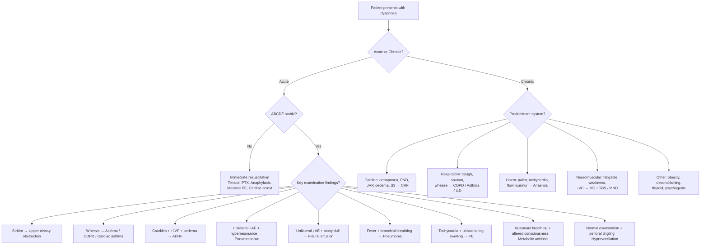

## Differential Diagnosis of Shortness of Breath

The differential diagnosis of dyspnoea is one of the broadest in medicine — because breathing depends on so many systems working in concert (airways, lungs, chest wall, respiratory muscles, cardiovascular system, haemoglobin, metabolic milieu, central drive), failure at any level produces the same subjective symptom. Your job as a clinician is to **systematically narrow down** which system is failing, using the history, examination, and targeted investigations.

The approach below organises differentials by **system**, then by **acuity**, then provides a clinical reasoning framework to help you discriminate between them at the bedside.

---

### Organising Framework

Think of dyspnoea as arising from one of **five broad categories**. This is your mental scaffold:

1. **Respiratory** (airway, parenchymal, pleural, vascular)
2. **Cardiac** (pump failure, valvular, pericardial, arrhythmia)
3. **Haematological/Oxygen-carrying** (anaemia, Hb dysfunction)
4. **Metabolic/Toxic** (acidosis, poisoning)
5. **Neuromuscular/Chest wall/Psychogenic** (ventilatory pump failure, functional)

Within each category, always consider **acute** vs. **chronic** — this is the single most useful discriminator in your initial approach [1][2][3].

---

### A. Respiratory Causes

#### Airway Diseases

| Condition | Acuity | Key Discriminating Features | Why It Causes Dyspnoea |
|-----------|--------|---------------------------|----------------------|
| ***Acute asthma*** | Acute | ***Widespread polyphonic wheeze*** [4], episodic, triggers (allergens, exercise, cold air), diurnal variation, personal/family history of atopy, reversible airflow obstruction | Bronchospasm + mucosal oedema + mucus hypersecretion → ↑airway resistance → ↑work of breathing |
| ***Acute exacerbation of COPD*** | Acute-on-chronic | ***Increasing cough, SOB, wheeziness*** [5]; chronic smoker ( > 20 pack-years), baseline exertional dyspnoea, barrel chest, pursed-lip breathing, NO clubbing | Acute infection/pollution on top of chronic airflow limitation → further ↑airway resistance + mucus plugging → V/Q mismatch |
| ***Chronic asthma*** | Chronic | Variable symptoms, nocturnal worsening, trigger-related, atopic background | Chronic airway inflammation → bronchial hyper-responsiveness → variable obstruction [4] |
| ***COPD*** | Chronic | ***Small airway disease + emphysema → persistent and often progressive airflow limitation*** [6]; usually smoker > 40y, ↓DLCO in emphysema | Loss of elastic recoil + small airway narrowing → air trapping → hyperinflation → diaphragm flattening → ↓mechanical efficiency → ↑work of breathing |
| **Upper airway obstruction** | Acute | ***Stridor*** (inspiratory), ***depressed consciousness, foreign body, infections (epiglottitis, croup), anaphylaxis, angioedema, tumour*** [3] | Physical narrowing of extrathoracic airway → ↑resistance → turbulent flow → ↑work of breathing |

> **D/dx tip — Asthma vs. COPD**: Both present with wheeze and dyspnoea. Asthma is episodic with diurnal variation and significant reversibility; COPD is persistent with baseline symptoms in a smoker and incomplete reversibility. They can coexist (asthma-COPD overlap) [4][6].

#### Parenchymal/Alveolar Diseases

| Condition | Acuity | Key Discriminating Features | Why It Causes Dyspnoea |
|-----------|--------|---------------------------|----------------------|
| **Pneumonia** | Acute | Fever, productive cough (purulent sputum), pleuritic chest pain, bronchial breathing, crackles over consolidation, ↑WCC/CRP | Alveolar flooding with inflammatory exudate → shunt (perfused but not ventilated) → hypoxaemia + ↓compliance |
| **ARDS** | Acute | Bilateral infiltrates on CXR, PaO₂/FiO₂ ≤ 300, within 1 week of clinical insult, NOT fully explained by cardiac failure | Diffuse alveolar damage → ↑capillary permeability → non-cardiogenic pulmonary oedema → severe shunt + ↓compliance |
| **Interstitial lung disease (ILD)** | Chronic | Progressive exertional dyspnoea + dry cough, fine end-inspiratory crackles (Velcro crackles), clubbing, restrictive PFT with ↓DLCO | Fibrosis → ↓compliance → ↑elastic work of breathing + thickened alveolar-capillary membrane → diffusion impairment → exertional hypoxaemia |
| ***Lung cancer (CA bronchus)*** | Subacute-chronic | Smoker, haemoptysis, weight loss, clubbing, Horner syndrome, SVC obstruction, recurrent pneumonia in same lobe | Endobronchial obstruction → atelectasis; lymphangitis carcinomatosa → ↓compliance; pleural effusion → ↓lung volume; phrenic nerve invasion → diaphragm paralysis [2] |

#### Pleural Diseases

| Condition | Acuity | Key Discriminating Features | Why It Causes Dyspnoea |
|-----------|--------|---------------------------|----------------------|
| ***Pneumothorax*** | Acute | ***Sudden onset, max at onset*** [7][8]; pleuritic chest pain, unilateral ↓breath sounds, hyperresonance, tracheal deviation away if tension; tall thin young male (primary spontaneous) or underlying lung disease (secondary) | Air in pleural space → lung collapse → ↓ventilated lung volume → V/Q mismatch. Tension PTX: one-way valve → progressive ↑intrapleural pressure → mediastinal shift → ↓venous return → ↓CO → cardiovascular collapse |
| **Pleural effusion** | Subacute-chronic | Stony dull percussion, ↓breath sounds, ↓tactile vocal fremitus; causes include HF (transudate), infection/malignancy (exudate) | Fluid compresses underlying lung → atelectasis → ↓ventilated volume + diaphragm displacement → ↓tidal volume |

#### Pulmonary Vascular Disease

| Condition | Acuity | Key Discriminating Features | Why It Causes Dyspnoea |
|-----------|--------|---------------------------|----------------------|
| ***Pulmonary embolism (PE)*** | Acute | ***Acute onset of pleuritic chest pain, dyspnoea, haemoptysis (occurs late with infarction) if small/medium; collapse/syncope, crushing central chest pain, shock, sudden death if massive*** [9]; ***sinus tachycardia on ECG with right heart strain pattern (RBBB, S1Q3T3) if massive*** [9]; risk factors (immobilisation, surgery, malignancy, OCP, thrombophilia); unilateral leg swelling suggesting DVT | Thrombus in pulmonary artery → ↑dead space (V/Q = ∞) + release of vasoactive mediators → V/Q mismatch; if massive → acute RV failure → ↓CO → shock. ***Patients with PE usually die from right heart failure rather than hypoxaemia*** [10] |
| **Pulmonary hypertension** | Chronic | Progressive exertional dyspnoea, exertional syncope, loud P2, RV heave, peripheral oedema, TR murmur | ↑PAP → ↑RV afterload → RV failure → ↓CO → inadequate tissue O₂ delivery → ↑ventilatory drive |

<Callout title="PE is the Great Mimic" type="error">
PE can present as virtually anything — acute pleuritic chest pain, unexplained tachycardia, syncope, haemoptysis, or even just "not feeling right." It is the quintessential "don't miss" diagnosis. Always ask about risk factors (recent surgery, immobilisation, cancer, OCP, prior VTE, long-haul travel) and look for unilateral leg swelling. A normal CXR with unexplained hypoxia should raise immediate suspicion [9][10].
</Callout>

---

### B. Cardiac Causes

| Condition | Acuity | Key Discriminating Features | Why It Causes Dyspnoea |
|-----------|--------|---------------------------|----------------------|
| ***Acute decompensated heart failure (ADHF) / Acute pulmonary oedema*** | Acute | Orthopnoea, PND, pink frothy sputum, bilateral basal creps, ↑JVP, S3 gallop, peripheral oedema, ↑BNP | LV failure → ↑LVEDP → ↑pulmonary capillary pressure → transudation into alveoli → ↓compliance + shunt + J-receptor stimulation [1][2] |
| ***Acute MI*** (as precipitant of ADHF or angina equivalent) | Acute | Central crushing chest pain radiating to jaw/arm, diaphoresis, nausea; BUT dyspnoea can be the **sole presenting symptom** ("angina equivalent") especially in elderly and diabetics | Acute myocardial ischaemia/necrosis → sudden ↓LV function → acute pulmonary congestion |
| **Chronic heart failure** | Chronic | Progressive SOBOE, orthopnoea, PND, ankle oedema, displaced apex, hepatomegaly, ↑JVP | Chronic ↑filling pressures → pulmonary venous congestion → ↓lung compliance → ↑work of breathing [1][2] |
| **Valvular heart disease** (esp. MS, AS, MR, AR) | Chronic (acute if decompensated) | Murmurs on auscultation; MS: mid-diastolic rumble, opening snap; AS: ejection systolic murmur radiating to carotids | MS: ↑LA pressure → pulmonary congestion. AS: ↑afterload → LVH → diastolic dysfunction → ↑LVEDP → pulmonary congestion |
| ***Hypertrophic cardiomyopathy (HCMP)*** | Chronic | ***SOBOE ( > 90%) ± orthopnoea, PND; angina (70-80%); exertional syncope; sudden cardiac death; ejection systolic murmur that ↑with Valsalva*** [11] | ***Diastolic dysfunction → ↓diastolic filling → ↑LV end-diastolic pressure → ↑pulmonary venous pressure → exertional dyspnoea; LVOT obstruction → ↑afterload → ↑demand + ↓CO; SAM → MR → ↑pulmonary venous pressure*** [11] |
| **Cardiac tamponade** | Acute | Beck's triad (hypotension, ↑JVP, muffled heart sounds), pulsus paradoxus, tachycardia | Pericardial fluid compresses cardiac chambers → ↓filling → ↓CO → compensatory ↑HR and ↑RR |
| **Arrhythmia** (esp. AF with rapid ventricular response, SVT, VT) | Acute or chronic | Palpitations, irregular pulse (AF), ECG findings | ↓Diastolic filling time (fast rate) or loss of atrial kick (AF) → ↓CO → may precipitate HF in susceptible patients |
| ***Constrictive pericarditis*** | Chronic | Kussmaul sign (↑JVP on inspiration), pericardial knock, calcified pericardium on CXR | Thickened, non-compliant pericardium → ↓diastolic filling → ↓CO |

> ***Murtagh's Diagnostic Strategies for Chest Pain*** [7][8] — this is a high-yield lecture slide framework:
>
> ***Probability diagnosis***: ***Musculoskeletal (chest wall) incl. costochondritis; Psychogenic; Angina***
>
> ***Serious disorders not to be missed***:
> - ***Cardiovascular: myocardial infarction/unstable angina, aortic dissection, pulmonary embolism/infarction***
> - ***Neoplasia: lung cancer, tumours of spinal cord and meninges***
> - ***Infection: pneumonia/pleuritis, mediastinitis, pericarditis, myocarditis***
> - ***Pneumothorax***
>
> ***Pitfalls (often missed)***: ***Mitral valve prolapse, oesophageal spasm, gastro-oesophageal reflux, biliary colic, peptic ulcer, herpes zoster, fractured rib, spinal dysfunction, precordial catch***
>
> ***Rarities***: ***pancreatitis, Bornholm disease (pleurodynia), cocaine inhalation, hypertrophic cardiomyopathy***
>
> ***Masquerades checklist***: ***Depression, Anaemia, Spinal dysfunction***
>
> ***Is the patient trying to tell me something?*** ***Consider functional causes, especially anxiety with hyperventilation, opioid dependency*** [7][8]

---

### C. Haematological / Oxygen-Carrying Capacity

| Condition | Acuity | Key Discriminating Features | Why It Causes Dyspnoea |
|-----------|--------|---------------------------|----------------------|
| ***Severe anaemia*** | Usually chronic (acute if GI bleed) | Pallor, tachycardia, flow murmur, fatigue; check Hb; ***anaemia is an important d/dx in chronic SOB*** [6] | ↓Hb → ↓O₂ carrying capacity → ↓O₂ delivery → compensatory ↑CO and ↑ventilation → exertional then resting dyspnoea |
| ***CO poisoning*** | Acute | ***Cherry-pink/pinkish appearance***, headache, confusion, exposure history (fire, charcoal burning — relevant in HK suicide attempts); SpO₂ falsely normal | ***CO binds Hb with 240× affinity → ↓O₂ carrying capacity + left-shifts O-Hb curve → tissue hypoxia despite normal PaO₂*** [12] |
| ***Methaemoglobinaemia*** | Acute | ***Brownish appearance***, cyanosis unresponsive to O₂, drug/toxin exposure (dapsone, nitrites, benzocaine); "chocolate-coloured blood" | ***Fe³⁺ in MetHb cannot bind O₂ → ↓O₂ carrying capacity; also left-shifts curve → impaired O₂ offloading*** [12] |

---

### D. Metabolic / Toxic / Endocrine

| Condition | Acuity | Key Discriminating Features | Why It Causes Dyspnoea |
|-----------|--------|---------------------------|----------------------|
| ***Diabetic ketoacidosis (DKA)*** | Acute | ***Kussmaul's respiration*** (deep, sighing), ***fruity breath***, polyuria, polydipsia, ***acute abdomen, dehydration***; glucose ≥ 11 mmol/L, pH < 7.3, ketonaemia [13] | ***Acute insulin deficiency → unrestrained lipolysis → ↑↑blood ketones → metabolic acidosis*** → ↑H⁺ stimulates peripheral chemoreceptors → compensatory hyperventilation |
| **Metabolic acidosis** (uraemia, lactic acidosis, salicylate OD) | Acute | Kussmaul breathing, check ABG (↓pH, ↓HCO₃⁻, ↑AG or normal AG), check anion gap | Acidosis → peripheral and central chemoreceptor stimulation → ↑ventilatory drive |
| ***Salicylate overdose*** | Acute | Tinnitus, nausea, confusion; initially respiratory alkalosis then mixed picture | ***Direct stimulation of medullary respiratory centre → primary respiratory alkalosis; also causes metabolic acidosis from uncoupling of oxidative phosphorylation*** [3] |
| **Thyrotoxicosis** | Subacute-chronic | Weight loss, tremor, heat intolerance, palpitations (AF), goitre, thyroid eye disease; ***compressive symptoms: dyspnoea, dysphagia, dysphonia; high output HF: dyspnoea, effort tolerance*** [14] | ↑Metabolic rate → ↑O₂ consumption → ↑ventilatory demand; can precipitate AF → HF → pulmonary congestion |
| ***Adrenal crisis*** | Acute | ***Circulatory shock out of proportion to illness, severe hypotension, hypoNa, hyperK, hypoglycaemia*** [15] | Severe cardiovascular collapse → ↓tissue perfusion → tissue hypoxia + metabolic acidosis → ↑respiratory drive |

---

### E. Neuromuscular / Chest Wall / Other

| Condition | Acuity | Key Discriminating Features | Why It Causes Dyspnoea |
|-----------|--------|---------------------------|----------------------|
| ***Myasthenia gravis (MG)*** | Subacute-chronic | ***Fatigable weakness*** (worse on repeated use, better with rest), ptosis, diplopia, bulbar symptoms, ***respiratory muscles → respiratory arrest*** [16] | Autoimmune destruction of nicotinic AChR → ↓neuromuscular transmission → respiratory muscle weakness → ↓tidal volume → ↑RR → respiratory failure |
| **Guillain-Barré syndrome (GBS)** | Acute-subacute | Ascending weakness, areflexia, preceding viral illness, rapid progression; monitor FVC | Demyelination of peripheral nerves → respiratory muscle paralysis → ↓vital capacity → Type 2 RF |
| **Motor neuron disease** | Chronic | Progressive weakness, fasciculations, upper + lower motor neuron signs, no sensory loss | Anterior horn cell degeneration → diaphragm + intercostal weakness → chronic hypoventilation |
| **Kyphoscoliosis** | Chronic | Visible spinal deformity, restrictive PFT | Chest wall deformity → ↓chest expansion → ↑elastic work of breathing |
| ***Obesity / Obesity-hypoventilation syndrome (OHS)*** | Chronic | BMI > 30, daytime hypercapnia (PaCO₂ > 45 mmHg) in absence of other cause | ↑Chest wall load + ↓diaphragm excursion + ↓FRC → chronic hypoventilation → hypercapnia [17] |
| ***Obstructive sleep apnoea (OSA)*** | Chronic | ***Loud and habitual snoring, choking and waking up with SOB, daytime sleepiness***, morning headache, nocturia [18] | ***Upper airway collapses during inspiration → repetitive apnoeas → arousals → fragmented sleep → daytime somnolence***; can present with exertional dyspnoea due to cardiovascular sequelae |
| ***Ascites (any cause)*** | Subacute-chronic | Abdominal distension, shifting dullness; causes include ***cirrhosis, malignancy, cardiac failure*** [19] | ***Shortness of breath due to pressure on diaphragm*** → ↓diaphragmatic excursion → ↓tidal volume [19] |

---

### F. Psychogenic / Functional

| Condition | Acuity | Key Discriminating Features | Why It Causes Dyspnoea |
|-----------|--------|---------------------------|----------------------|
| ***Psychogenic hyperventilation*** | Acute or recurrent | ***Subjective feeling of 'inability to take a deep breath', frequent sighing/erratic ventilation at rest, digital/perioral paraesthesiae, light-headedness, central chest discomfort, occurs at rest, rarely disturbs sleep*** [2][20] | Anxiety → ↑central respiratory drive out of proportion to metabolic demand → respiratory alkalosis → ↓ionised Ca²⁺ → perioral tingling, carpopedal spasm |
| ***Panic disorder*** | Acute (recurrent episodes) | ***Recurrent unexpected panic attacks a/w palpitations, sweating, trembling, sensations of SOB or smothering, chest pain, dizziness, paraesthesias, fear of dying; ≥1 month of persistent worry about further attacks*** [21][22]; diagnosis of exclusion — must rule out organic causes | Catecholamine surge → ↑HR, ↑RR, ↑minute ventilation → sensation of breathlessness despite adequate oxygenation; the somatic symptoms themselves may prompt further anxiety (positive feedback loop) |
| ***Somatic symptom disorder / Somatoform disorders*** | Chronic | ***≥1 somatic symptom a/w distress/functional impairment; excessive thoughts about symptoms; persistent ≥ 6 months; no adequate physical explanation*** [23][24] | No organic pathology — central misprocessing of normal body sensations; heightened interoceptive awareness |

<Callout title="Psychogenic Dyspnoea is a Diagnosis of Exclusion" type="error">
Never diagnose psychogenic hyperventilation or panic disorder as the cause of dyspnoea without first ruling out life-threatening organic causes (PE, pneumothorax, asthma, ACS). Young patients with anxiety can still have PE. The presence of ***digital/perioral paraesthesiae*** and ***sighing at rest that rarely disturbs sleep*** are useful positive discriminators for psychogenic causes [2][20], but they must be used alongside negative workup for organic disease. ***Murtagh reminds us: "Is the patient trying to tell me something? Consider functional causes, especially anxiety with hyperventilation"*** [7] — but only after the dangerous causes are excluded.
</Callout>

---

### Differential Diagnosis by DVT/PE Specifically

Since DVT and PE are critical "don't miss" diagnoses, the differentials for their presentations deserve separate mention [9][10][25]:

**Differentials of DVT** (unilateral leg swelling) [9][25]:
- ***Cellulitis*** (look for predisposing factors — skin break, erythema, warmth, fever)
- ***Lymphoedema / other oedema***
- ***Haematoma from trauma***
- ***Ruptured Baker's cyst*** (only in pre-existing arthritis — posterior knee swelling that suddenly resolves as fluid tracks into calf)
- ***Muscle strain/tear/twisting/injury to leg***
- ***Superficial thrombophlebitis***
- ***Lymphangitis***
- ***Venous valvular insufficiency***

**Differentials of PE** (acute chest pain + dyspnoea) [9][25]:
- ***Stable angina or ACS***
- ***Pneumothorax***
- ***Aortic dissection***
- ***Gastrointestinal causes***
- ***Musculoskeletal causes***
- ***Pneumonia***

---

### Clinical Reasoning Flowchart

The following mermaid diagram outlines a systematic approach to narrowing the differential in a patient presenting with dyspnoea:

---

### Key Discriminating Features — Summary Table

| Feature | Most likely diagnosis | Why |
|---------|----------------------|-----|
| ***PND*** | ***Cardiac dyspnoea (HF)*** | Reabsorption of dependent oedema during sleep → ↑preload → pulmonary congestion [1][2] |
| ***Orthopnoea + PND + peripheral oedema*** | **Heart failure** | ↑Venous return supine → pulmonary congestion [1][2] |
| ***Sudden onset, max at onset + pleuritic pain*** | ***Pneumothorax, PE, aortic dissection*** [7][8] | Sudden mechanical/vascular event |
| **Wheeze + episodic + atopy** | **Asthma** | Bronchial hyper-responsiveness + variable obstruction [4] |
| **Chronic smoker + persistent wheeze** | **COPD** | Fixed airflow obstruction from smoking-related damage [6] |
| **Fever + productive cough + crackles** | **Pneumonia** | Infection → alveolar consolidation |
| **Unilateral leg swelling + pleuritic CP** | **DVT → PE** | Venous thromboembolism [9][10] |
| ***Pink frothy sputum*** | **Acute pulmonary oedema** | Transudation + capillary rupture |
| **Fine Velcro crackles + clubbing** | **ILD** | Fibrosis → ↓compliance |
| ***Kussmaul breathing + fruity breath*** | ***DKA*** | Metabolic acidosis from ketones [13] |
| ***Cherry-pink skin*** | ***CO poisoning*** | COHb [12] |
| ***Chocolate-brown blood*** | ***Methaemoglobinaemia*** | Oxidised Hb [12] |
| ***Fatigable weakness + ptosis*** | ***MG*** | AChR autoantibodies [16] |
| ***Sighing at rest + perioral tingling*** | ***Hyperventilation syndrome*** | Respiratory alkalosis → ↓ionised Ca²⁺ [2][20] |
| ***Snoring + daytime somnolence + obesity*** | ***OSA*** | Upper airway collapse during sleep [18] |
| ***Recurrent unexpected panic + fear of dying*** | ***Panic disorder*** | Catecholamine-driven hyperventilation [21][22] |

---

### "Don't Miss" Diagnoses — The Life-Threatening Differentials

These are the conditions that must be actively excluded in every patient with acute dyspnoea before considering benign diagnoses:

| Condition | Why It Kills | Rapid Bedside Clue |
|-----------|-------------|-------------------|
| **Tension pneumothorax** | ↑Intrapleural pressure → ↓venous return → cardiovascular collapse | Tracheal deviation + absent breath sounds + hyperresonance + haemodynamic instability |
| **Massive PE** | Acute RV failure → obstructive shock | Sudden collapse + ↑JVP + clear lungs + hypotension + tachycardia + unilateral leg swelling |
| **Acute MI** (esp. with ADHF) | Acute LV failure → cardiogenic shock / pulmonary oedema | Chest pain + diaphoresis + ECG changes (ST elevation/depression) + ↑troponin |
| **Cardiac tamponade** | ↓Cardiac filling → obstructive shock | Beck's triad + pulsus paradoxus |
| **Anaphylaxis** | Upper airway oedema + bronchospasm + distributive shock | Urticaria + angioedema + wheeze + hypotension + allergen exposure |
| **Severe asthma (near-fatal)** | Respiratory muscle fatigue → respiratory arrest | ***Unable to complete sentences***, silent chest (ominous — no airflow to produce wheeze), ↓consciousness [5] |
| **Epiglottitis** | Complete upper airway obstruction | Drooling, tripod position, muffled voice, stridor, fever |

<Callout title="The 'Silent Chest' in Asthma">
A wheezy asthmatic who suddenly stops wheezing is NOT getting better — they are getting worse. A "silent chest" means airflow is so severely reduced that there is insufficient flow to generate a wheeze. This is a **pre-arrest sign** requiring immediate escalation (IV magnesium, ICU, consider intubation) [5].
</Callout>

---

### Approach to the Differential — History-Driven Strategy

***Key history points*** [7][8]:

- ***Meticulous pain analysis using SOCRATES system*** (Site, Onset, Character, Radiation, Associations, Time course, Exacerbating/relieving factors, Severity) — applicable to both chest pain and dyspnoea
- ***Family history, drug history, psychosocial history and past history, especially if immunocompromised (e.g. diabetes or metabolic syndrome)*** [7]

***Key examination*** [7][8]:
- ***General appearance***
- ***Vital signs***
- ***Peripheral circulation***
- ***Careful examination of cardiovascular and respiratory systems***
- ***Upper abdominal palpation*** (don't forget hepatomegaly from RHF, or epigastric tenderness from GI causes of referred chest pain)

***Key investigations*** [7][8]:
- ***Base tests: ECG, cardiac enzymes, CXR*** — in most instances help confirm the diagnosis
- ***Otherwise specialist investigations including imaging are confined to hospitals and cardiology centres***

---

### Goodpasture Syndrome — A Rare but Must-Know Differential

When a patient presents with **dyspnoea + haemoptysis + renal failure**, think of ***anti-GBM disease (Goodpasture syndrome)*** [26]:
- ***Alveolar haemorrhage (40-60%)***: ***SOB, cough, sometimes overt haemoptysis***
- CXR: pulmonary infiltrates; ***↑DLCO due to haemoglobin in alveoli***
- Concurrent ***RPGN*** with nephritic sediment
- Those with lung involvement more commonly associated with underlying ***pulmonary injury (e.g. smoking, infection)*** — this "exposes" the pulmonary Goodpasture antigen [26]

---

### Systemic Sclerosis — Respiratory Differentials

In a patient with known ***systemic sclerosis*** presenting with dyspnoea, the differential includes [27]:
- **ILD** (most common cause of death in SSc) → restrictive pattern, ↓DLCO, ground-glass opacities progressing to fibrosis (NSIP pattern most common)
- **Pulmonary arterial hypertension** (esp. in limited cutaneous SSc / CREST) → isolated ↓DLCO without restriction
- **Aspiration pneumonia** (from oesophageal dysmotility → GORD → microaspiration)
- **Cardiac involvement** (myocardial fibrosis → HF, pericardial effusion)

---

<Callout title="High Yield Summary">

1. **Organise differentials by system** (Respiratory, Cardiac, Haematological, Metabolic, Neuromuscular/Psychogenic) and by **acuity** (Acute vs. Chronic)
2. **Life-threatening "don't miss" diagnoses**: Tension PTX, massive PE, acute MI, tamponade, anaphylaxis, near-fatal asthma, epiglottitis
3. **Cardiac vs. Respiratory**: PND + orthopnoea + oedema = cardiac; Wheeze + cough + sputum = respiratory
4. **PE is the great mimic** — always consider in acute dyspnoea with risk factors; patients die from RV failure, not hypoxaemia
5. **Silent chest in asthma = pre-arrest sign** — ominous loss of wheeze means negligible airflow
6. **Kussmaul breathing = metabolic acidosis** — DKA, uraemia, lactic acidosis, salicylate OD
7. **CO poisoning**: cherry-pink, SpO₂ falsely normal, treat with O₂; **MetHb**: chocolate blood, treat with methylene blue
8. **Psychogenic hyperventilation** — sighing at rest, perioral tingling, rarely disturbs sleep — but is a **diagnosis of exclusion**
9. **Murtagh's framework**: Probability diagnosis (MSK, psychogenic, angina) → Serious not to miss (MI, dissection, PE, PTX) → Pitfalls (GORD, biliary, MVP) → Masquerades (depression, anaemia, spinal) → Functional causes
10. **Always ABCDE first** in acute presentations

</Callout>

---

<ActiveRecallQuiz
  title="Active Recall - Differential Diagnosis of Shortness of Breath"
  items={[
    {
      question: "List the five broad categories for organising the differential diagnosis of dyspnoea, with two examples from each.",
      markscheme: "1) Respiratory: asthma, COPD, pneumonia, PE, pneumothorax, ILD. 2) Cardiac: HF (acute/chronic), ACS, valvular disease, tamponade, arrhythmia. 3) Haematological/O2-carrying: severe anaemia, CO poisoning, methaemoglobinaemia. 4) Metabolic/Toxic: DKA, uraemic acidosis, salicylate OD, thyrotoxicosis. 5) Neuromuscular/Chest wall/Psychogenic: MG, GBS, kyphoscoliosis, obesity-hypoventilation, hyperventilation syndrome, panic disorder. Two examples from each required.",
    },
    {
      question: "A patient with acute dyspnoea has a silent chest on auscultation after previously having audible wheeze. What does this signify and what is the immediate concern?",
      markscheme: "A silent chest in the context of known asthma or bronchospasm signifies near-fatal or life-threatening asthma. Airflow is so severely reduced that there is insufficient flow to generate an audible wheeze. This is a pre-arrest sign indicating impending respiratory failure. Immediate escalation is needed: IV magnesium sulphate, ICU referral, and preparation for intubation and mechanical ventilation.",
    },
    {
      question: "Using Murtagh's diagnostic strategy framework, list the probability diagnoses and serious disorders not to be missed for chest pain/dyspnoea.",
      markscheme: "Probability diagnosis: Musculoskeletal including costochondritis, psychogenic, angina. Serious disorders not to be missed: Cardiovascular (MI/unstable angina, aortic dissection, PE/pulmonary infarction), Neoplasia (lung cancer, spinal cord/meningeal tumours), Infection (pneumonia/pleurisy, mediastinitis, pericarditis, myocarditis), Pneumothorax.",
    },
    {
      question: "A young woman on OCP presents with sudden pleuritic chest pain, dyspnoea, and tachycardia. CXR is relatively normal. What is the most important diagnosis to exclude, and why might pulse oximetry be misleadingly normal?",
      markscheme: "Most important diagnosis: Pulmonary embolism. OCP is a risk factor for VTE. A relatively normal CXR with acute dyspnoea and pleuritic pain is classic. Pulse oximetry may be misleadingly normal because: (1) small/medium PE may cause only modest hypoxaemia that SpO2 may not detect due to the sigmoid shape of the O2-Hb dissociation curve (SpO2 stays high until PaO2 drops below about 60 mmHg), (2) compensatory hyperventilation may maintain PaO2 initially. Need D-dimer and/or CTPA for definitive workup.",
    },
    {
      question: "Name three clinical features that help distinguish psychogenic hyperventilation from organic causes of dyspnoea.",
      markscheme: "1) Subjective feeling of inability to take a deep breath (rather than objective respiratory distress). 2) Frequent sighing or erratic ventilation at rest. 3) Digital and perioral paraesthesiae (from respiratory alkalosis causing decreased ionised calcium). 4) Occurs at rest and rarely disturbs sleep (organic causes typically worsen during sleep or exertion). 5) Light-headedness. 6) Central chest discomfort. Any three sufficient.",
    },
    {
      question: "In a patient with systemic sclerosis presenting with progressive dyspnoea, list three respiratory differentials and explain the pathophysiology of the most common one.",
      markscheme: "Three differentials: 1) ILD (most common cause of death in SSc - NSIP pattern most common), 2) Pulmonary arterial hypertension (especially in limited cutaneous SSc/CREST), 3) Aspiration pneumonia (from oesophageal dysmotility leading to GORD and microaspiration). Most common is ILD: excessive fibroblast activation in SSc leads to increased collagen synthesis and pulmonary fibrosis, causing decreased lung compliance (increased elastic work of breathing) and thickened alveolar-capillary membrane (diffusion impairment leading to exertional hypoxaemia).",
    },
  ]}
/>

---

## References

[1] Senior notes: Ryan Ho Cardiology.pdf (p59 — Dyspnoea section)
[2] Senior notes: Ryan Ho Fundamentals.pdf (p204, p222–223 — Dyspnoea sections)
[3] Senior notes: Ryan Ho Critical Care.pdf (p6 — Acute SOB and Airway Management)
[4] Senior notes: Ryan Ho Respiratory.pdf (p95, p98 — Asthma section)
[5] Senior notes: Ryan Ho Critical Care.pdf (p13 — Management of Selected Lower Airway Emergencies)
[6] Senior notes: Ryan Ho Respiratory.pdf (p108–110 — COPD section)
[7] Lecture slides: murtagh merge.pdf (p25 — Chest pain in adults)
[8] Lecture slides: murtagh merge.pdf (p26 — Chest pain in adults, continued)
[9] Senior notes: Ryan Ho Haemtology.pdf (p131 — VTE spectrum and clinical features)
[10] Senior notes: felixlai.md (DVT and PE section)
[11] Senior notes: Ryan Ho Cardiology.pdf (p167 — Hypertrophic Cardiomyopathy)
[12] Senior notes: Ryan Ho Chemical Path.pdf (p38 — COHb and MetHb)
[13] Senior notes: Ryan Ho Endocrine.pdf (p91 — Diabetic Ketoacidosis)
[14] Senior notes: Ryan Ho Endocrine.pdf (p18 — Thyroid lump approach, compressive symptoms)
[15] Senior notes: Ryan Ho Endocrine.pdf (p71 — Adrenal insufficiency)
[16] Senior notes: Ryan Ho Neurology.pdf (p188 — Myasthenia Gravis)
[17] Senior notes: Ryan Ho Endocrine.pdf (p117 — Complications of Obesity)
[18] Senior notes: Ryan Ho Psychiatry.pdf (p229 — Sleep Apnoea)
[19] Senior notes: Ryan Ho GI.pdf (p316 — Ascites)
[20] Senior notes: Ryan Ho Respiratory.pdf (p20 — Features of psychogenic hyperventilation)
[21] Senior notes: Ryan Ho Psychiatry.pdf (p178–179 — Panic Disorder)
[22] Senior notes: Ryan Ho Psychiatry.pdf (p170 — Approach to Anxiety)
[23] Senior notes: Ryan Ho Psychiatry.pdf (p199, p203 — Somatoform Disorders)
[24] Senior notes: Ryan Ho Psychiatry.pdf (p173–174 — GAD and somatic features)
[25] Senior notes: felixlai.md (Differential diagnosis of DVT)
[26] Senior notes: Ryan Ho Urogenital.pdf (p67 — Anti-GBM disease / Goodpasture syndrome)
[27] Senior notes: Ryan Ho Rheumatology.pdf (p83 — Systemic Sclerosis)
