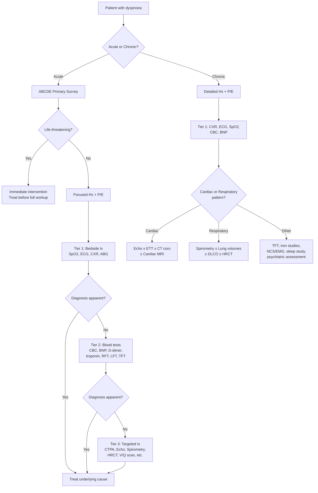
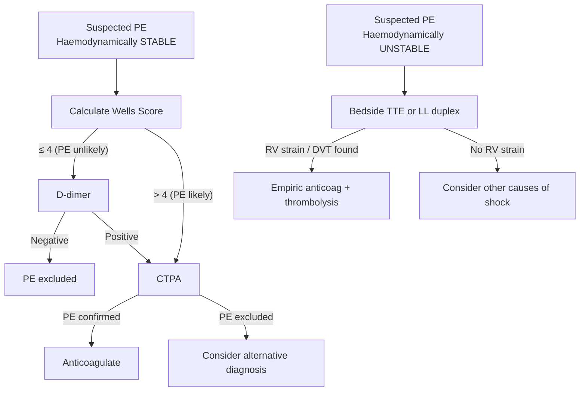

## Diagnostic Approach to Shortness of Breath

There is no single "diagnostic criterion" for dyspnoea itself — it is a symptom, not a disease. The diagnostic approach is therefore about **identifying the underlying cause** through a systematic, stepwise workup. You move from bedside assessment through basic investigations to targeted confirmatory tests, guided by clinical probability at each stage.

The overarching principle: ***"Base tests available to the GP are ECG, cardiac enzymes and CXR and in most instances help confirm the diagnosis. Otherwise specialist investigations including imaging are confined to hospitals and cardiology centres"*** [7].

---

## Stepwise Diagnostic Algorithm

The diagnostic workup proceeds in three tiers: **bedside**, **basic investigations**, and **targeted confirmatory investigations**. Your clinical assessment determines which branch of the algorithm you follow.

---

## Tier 1: Bedside Investigations

These are the investigations you order **immediately** on every dyspnoeic patient. They are fast, cheap, and highly informative.

### 1. Pulse Oximetry (SpO₂)

- **What it measures**: Percentage of oxygenated haemoglobin using infrared/red light absorption through a finger probe
- **Normal**: ≥ 95% on room air (target 88–92% in known COPD with CO₂ retention risk)
- **Why it matters**: Gives you a real-time, non-invasive estimate of oxygenation

**Key interpretive pitfalls**:

| Situation | Problem | Why |
|-----------|---------|-----|
| ***CO poisoning*** | ***SpO₂ falsely normal*** | Conventional pulse oximeter cannot distinguish COHb from O₂Hb — both absorb at similar wavelengths. Need co-oximetry via ABG [12] |
| ***Methaemoglobinaemia*** | SpO₂ plateaus ~85% regardless of true saturation | MetHb absorbs red and infrared equally → ratio approaches 1 → oximeter reads ~85% |
| Severe anaemia | SpO₂ may be normal despite inadequate O₂ delivery | SpO₂ reflects *proportion* of Hb that is oxygenated, not total O₂ content. Patient can be 100% saturated but still profoundly hypoxic if Hb is 4 g/dL |
| Poor peripheral perfusion | SpO₂ unreliable/unreadable | Vasoconstriction → inadequate pulsatile signal |
| Dark nail polish | May interfere | Absorbs light at oximeter wavelengths |

<Callout title="SpO₂ vs PaO₂ — Know the Difference">
SpO₂ measures the percentage of Hb carrying O₂. PaO₂ (from ABG) measures the partial pressure of dissolved O₂ in arterial blood. Because of the **sigmoid shape** of the O₂-Hb dissociation curve, SpO₂ remains > 90% until PaO₂ drops below ~60 mmHg — then it falls steeply. This means SpO₂ gives you a **false sense of security** until the patient is already significantly hypoxaemic. Always get an ABG if the clinical picture is concerning.
</Callout>

### 2. Arterial Blood Gas (ABG)

**The single most informative investigation in acute dyspnoea.** It tells you about oxygenation, ventilation, and acid-base status simultaneously.

**Normal values** (room air):
| Parameter | Normal | Interpretation |
|-----------|--------|---------------|
| pH | 7.35–7.45 | Acidosis < 7.35; Alkalosis > 7.45 |
| PaO₂ | 80–100 mmHg | ***< 60 mmHg = respiratory failure*** [28] |
| PaCO₂ | 35–45 mmHg | ***> 50 mmHg = Type 2 RF*** [28] |
| HCO₃⁻ | 22–26 mmol/L | Metabolic component |
| Base excess | -2 to +2 | Metabolic acid-base balance |
| Lactate | < 2 mmol/L | ↑ in tissue hypoperfusion (shock, sepsis) |

**Key ABG patterns in dyspnoea**:

| Pattern | pH | PaO₂ | PaCO₂ | HCO₃⁻ | Likely Diagnosis |
|---------|-----|------|-------|--------|-----------------|
| ***Type 1 RF*** | N/↑ | ***↓ < 60*** | ***N/↓*** | N | PE, pneumonia, asthma (early), ARDS, ILD |
| ***Type 2 RF*** | ↓ | ***↓ < 60*** | ***↑ > 50*** | ↑ (if chronic) | COPD exacerbation, sedative OD, NMD, OHS |
| Respiratory alkalosis | ↑ | N/↑ | ↓ | N | Hyperventilation (psychogenic, early PE, early asthma) |
| Metabolic acidosis | ↓ | N/↓ | ↓ (compensatory) | ↓ | DKA, lactic acidosis, uraemia, salicylate OD |
| Mixed | Variable | Variable | Variable | Variable | Severe sepsis, combined pathology |

**A-a gradient** (alveolar-arterial oxygen gradient):
- Calculated: A-a = PAO₂ - PaO₂, where PAO₂ = FiO₂(Patm - PH₂O) - PaCO₂/0.8
- Normal: < 10–15 mmHg (increases ~3 mmHg per decade of age)
- **Why it matters**: Helps distinguish *where* the gas exchange problem is:
  - **Normal A-a gradient + hypoxia** → hypoventilation (Type 2 RF from neuromuscular or central cause) — the lung itself is fine, it's just not being ventilated enough
  - **↑A-a gradient + hypoxia** → parenchymal disease (V/Q mismatch, shunt, diffusion impairment) — the lung itself is abnormal

> ***ABG findings in PE: Type 1 RF (↓PaO₂, N/↓PaCO₂) with ↑A-a gradient; metabolic acidosis if massive PE with obstructive shock*** [28]

### 3. ECG (12-lead)

**Why ECG in dyspnoea?** Because cardiac causes are common and many are life-threatening. The ECG is fast, free, and enormously informative.

| Finding | Suggests | Pathophysiological Basis |
|---------|---------|------------------------|
| ***ST elevation/depression*** | ***ACS / MI*** | Transmural (ST elevation) or subendocardial (ST depression) ischaemia → current of injury |
| ***New LBBB*** | ***Possible acute MI*** | Ischaemia → conduction system damage |
| ***S1Q3T3 pattern*** | ***PE (massive)*** [9] | ***Deep S in lead I, Q wave and inverted T in lead III*** — reflects acute RV strain rotating the heart clockwise |
| ***Right axis deviation, P pulmonale*** | ***RV strain (PE, pulmonary HTN)*** [28] | ↑RV workload → right axis shift; ↑RA pressure → peaked P waves in lead II |
| ***New onset RBBB*** | ***PE*** [28] | Acute RV dilatation → stretching of RV conduction system |
| ***Inverted T in V1-V4*** | ***RV strain*** [28] | RV ischaemia from acute pressure overload |
| ***AF / atrial arrhythmias*** | ***PE, thyrotoxicosis, HF, MS*** | AF may be cause (precipitating HF) or consequence (atrial stretch from ↑filling pressures) |
| ***Low voltage QRS*** | ***Pericardial effusion / tamponade*** | Fluid around heart attenuates electrical signal |
| ***LVH criteria*** | ***AS, HTN, HCMP*** | ↑LV mass → ↑voltage on ECG |
| ***Sinus tachycardia*** | ***Non-specific*** — present in PE, HF, sepsis, anaemia, anxiety | Sympathetic activation |

<Callout title="S1Q3T3 — What Does It Really Mean?" type="idea">
The classic ***"S1Q3T3"*** pattern in PE reflects acute right ventricular strain [9][28]. The acutely dilated RV shifts the electrical axis rightward and posteriorly: deep S in lead I (leftward forces reduced), Q and inverted T in lead III (rightward and inferior forces). However, this pattern is present in < 20% of PE cases and is not specific — it can occur in any cause of acute RV strain. Its absence does NOT rule out PE. The most common ECG finding in PE is simply **sinus tachycardia**.
</Callout>

### 4. Chest X-ray (CXR)

***CXR*** is essential in virtually every dyspnoeic patient [2][28][29]. It provides information about the lungs, heart, pleura, mediastinum, and chest wall in a single image.

| CXR Finding | Diagnosis Suggested | Why This Appearance |
|-------------|-------------------|-------------------|
| ***Cardiomegaly*** (CTR > 50% on PA film) | ***Heart failure*** | Dilated ventricles |
| ***Upper lobe venous diversion*** (cephalisation) | ***LV failure / ↑LA pressure*** [2][29] | ↑Pulmonary venous pressure → redistribution of blood to upper lobes (normally lower lobes receive more blood due to gravity) |
| ***Bilateral perihilar hazy opacification*** ("bat wing") | ***Pulmonary oedema*** | Fluid transudation into alveoli, worse perihilarly |
| ***Kerley B lines*** | ***Interstitial oedema / lymphangitis*** | Thickened interlobular septa from fluid (oedema) or tumour (lymphangitis carcinomatosa) |
| ***Bilateral pleural effusion*** | ***HF, hypoalbuminaemia*** | Transudative fluid in pleural space |
| ***Hyperinflation: flattened diaphragm, elongated heart, ↑lung volume, hyperlucency*** | ***COPD / emphysema*** [29] | Air trapping → ↑TLC → pushes diaphragm down, heart appears narrow and elongated |
| ***Bullae*** | ***Emphysema*** [29] | Destruction of alveolar walls → large air spaces |
| ***Consolidation*** (air bronchograms) | ***Pneumonia*** | Alveoli filled with inflammatory exudate; air in bronchi remains visible against opacified lung |
| ***Unilateral white-out with mediastinal shift*** (away) | ***Massive pleural effusion*** | Fluid pushes mediastinum contralaterally |
| ***Unilateral white-out with mediastinal shift*** (towards) | ***Lung collapse / atelectasis*** | Loss of volume pulls mediastinum ipsilaterally |
| ***Absent lung markings + visible lung edge*** | ***Pneumothorax*** | Air in pleural space → lung falls away from chest wall |
| ***Peripheral wedge-shaped opacity*** (Hampton hump) | ***PE with pulmonary infarction*** [28] | Infarction of peripheral lung tissue → wedge of consolidated, necrotic lung |
| ***Focal oligaemia*** (Westermark sign) | ***PE*** [28] | Occluded pulmonary artery → ↓blood flow to affected segment → appears hyperlucent |
| ***Enlarged pulmonary artery*** | ***PE, pulmonary HTN*** [28] | ↑pressure in pulmonary trunk |
| ***Reticular shadowing (bilateral, basal)*** | ***ILD / IPF*** [29] | Fibrosis of lung parenchyma |
| ***Widened mediastinum*** | ***Aortic dissection, mediastinal mass*** | Blood/tumour/lymphadenopathy expanding mediastinum |
| ***Normal CXR with hypoxia*** | ***PE, early pneumonia, asthma, anaemia*** | No parenchymal pathology visible but V/Q mismatch (PE), bronchospasm (asthma), or ↓Hb (anaemia) |

> **Remember**: CXR requires ***~200 mL of fluid*** to be visible as a pleural effusion [29]. Small effusions may be missed. Ultrasound is more sensitive.

---

## Tier 2: Blood Investigations

### 5. Complete Blood Count (CBC)

| Parameter | Finding | Significance |
|-----------|---------|-------------|
| ***Haemoglobin*** | ***↓ → anaemia*** | ***Anaemia is an important d/dx in chronic SOB*** [29] — always check Hb. Even mild anaemia exacerbates dyspnoea in patients with coexisting cardiac or respiratory disease |
| WCC | ↑ → infection, stress response | Pneumonia, sepsis; also ↑ in stress (MI, PE) |
| Eosinophils | ↑ → asthma, parasites, eosinophilic lung disease, allergic reaction | Atopic asthma; ↑eosinophils on CBC supports eosinophilic airway inflammation |
| Platelets | ↑ → reactive thrombocytosis in IDA; ↓ → DIC (sepsis, massive PE) | Context-dependent |
| MCV | Micro/macro/normocytic → guides anaemia workup | E.g. microcytic → IDA or thalassaemia; macrocytic → B12/folate deficiency |

### 6. Cardiac Biomarkers

| Marker | What It Tells You | Key Cut-offs & Interpretation |
|--------|-------------------|------------------------------|
| ***Troponin (cTnT/cTnI)*** | Myocardial injury | ***Detection of ↑/↓ cardiac biomarker with ≥1 value above 99th URL*** = MI (when combined with clinical criteria) [30]. Also ↑ in PE (prognostic — indicates RV microinfarction), myocarditis, sepsis, renal failure |
| ***BNP / NT-proBNP*** | Ventricular wall stress | BNP > 100 pg/mL or NT-proBNP > 300 pg/mL suggests HF (age-adjusted cut-offs for NT-proBNP: > 450 if < 50y, > 900 if 50-75y, > 1800 if > 75y). ***Echocardiography if clinical findings suggestive of HF (to look for the cause, as it is diagnosed clinically)*** [2][29]. BNP has **excellent NPV** — a normal BNP effectively rules out HF |
| ***CK-MB*** | Myocardial necrosis (less specific than troponin) | Largely superseded by high-sensitivity troponin |

<Callout title="BNP — The Dyspnoea Blood Test">
BNP ("Brain" or "B-type" natriuretic peptide — originally discovered in brain tissue, but predominantly secreted by ventricular cardiomyocytes in response to wall stretch) is the single most useful blood test for discriminating cardiac from non-cardiac dyspnoea. A **normal BNP/NT-proBNP virtually rules out heart failure** as the cause of dyspnoea (NPV > 95%). Elevated BNP points you towards cardiac investigation (echocardiography). However, remember that BNP can be falsely low in obesity (adipocytes clear BNP) and flash pulmonary oedema (not enough time for BNP to rise).
</Callout>

### 7. D-dimer

- **What it is**: Degradation product from cross-linked fibrin — released when a thrombus undergoes fibrinolysis
- **Why it matters in dyspnoea**: Used to rule out PE/DVT in patients with low-to-intermediate pre-test probability
- ***Non-specific: ↑ in inflammatory state, infections, ACS, post-surgery, pregnancy, malignancy*** [28]
- ***Sensitive → ↑↑NPV in low-risk individuals*** [28] — a **negative D-dimer in a low-risk patient effectively excludes PE**
- **Not useful if**: High clinical probability (proceed directly to imaging), or in patients with known elevated D-dimer (e.g. cancer, recent surgery, pregnancy) — too many false positives
- **Age-adjusted cut-off** (2024 ESC recommendation): D-dimer > age × 10 µg/L (for patients > 50y) improves specificity without losing sensitivity

### 8. Other Tier 2 Blood Tests

| Test | What to Look For | Relevance to Dyspnoea |
|------|-----------------|----------------------|
| ***RFT (U/Cr, electrolytes)*** | ***↑U/Cr → AKI (shock-induced) or CKD; electrolyte disturbance*** [3] | Uraemic acidosis → Kussmaul breathing; hyperkalaemia from renal failure can precipitate arrhythmia → HF |
| ***LFT*** | ***↑ALT/AST → shock liver; cholestatic pattern → RHF*** [3] | Hepatic congestion from RHF → ↑bilirubin, ↑ALP, ↑GGT |
| ***Coagulation profile*** | ***Baseline for anticoagulation treatment*** [28] | Essential before starting heparin for PE/DVT |
| ***Lactate*** | ***↑ → tissue hypoperfusion*** [3] | Lactic acidosis in shock of any cause → metabolic acidosis → compensatory hyperventilation |
| ***TFT*** | Hyper/hypothyroidism | Thyrotoxicosis → ↑O₂ demand + AF → HF; hypothyroidism → pericardial effusion, ↓respiratory drive |
| ***Blood glucose*** | Hyper/hypoglycaemia | DKA with Kussmaul breathing |
| ***CRP/Procalcitonin*** | Infection markers | Pneumonia, sepsis; procalcitonin more specific for bacterial infection |

---

## Tier 3: Targeted Confirmatory Investigations

These are ordered based on the clinical picture and results of Tier 1 and 2.

### 9. CT Pulmonary Angiography (CTPA)

***CT angiography: use of rapid injection of a large IV bolus of contrast to opacify vessels for CT imaging. Can be used in place of the more invasive conventional angiography*** [31].

- **Gold standard** for diagnosing PE
- **What it shows**: Direct visualisation of thrombus as a filling defect within the pulmonary arteries
- **Advantages**: ***Better resolution, faster*** [31]; also evaluates alternative diagnoses (pneumonia, effusion, aortic dissection)
- **Disadvantages**: ***Relatively high radiation (8-10 mSv), risk of contrast nephropathy, not ideal in pregnancy*** [31]
- **When to order**: Haemodynamically stable patient with intermediate-high pre-test probability for PE, or low probability with positive D-dimer

### 10. V/Q Scan (Ventilation-Perfusion Scintigraphy)

- **Alternative to CTPA** for PE diagnosis, preferred in specific situations
- **What it shows**: Mismatch between ventilation (inhaled radiotracer) and perfusion (IV radiotracer) → areas that are ventilated but not perfused = dead space = PE
- **Reported as**: Normal, low/intermediate/high probability, or non-diagnostic
- ***Advantages vs CTPA*** [31]:
  - ***Lower radiation (~2 mSv)***
  - ***Tracer does not cross placenta → safe to use in pregnant patient***
  - No contrast → no nephrotoxicity risk
- ***Disadvantages*** [31]:
  - ***Fair resolution (lower than CTPA)***
  - ***Requires patient cooperation***
  - Often non-diagnostic ("intermediate probability") in patients with underlying lung disease (COPD)
- ***Similar PPV and NPV*** to CTPA when results are definitive (normal or high probability) [31]

### 11. Echocardiography

***Echocardiography if clinical findings suggestive of HF (to look for the cause, as it is diagnosed clinically)*** [2][29].

| Mode | What It Shows | When to Use |
|------|-------------|-------------|
| **TTE (transthoracic)** | LV/RV function (LVEF), wall motion abnormalities, valvular disease, pericardial effusion, chamber dimensions, estimated PAP, diastolic function | First-line cardiac imaging for HF, suspected valvular disease, tamponade; also useful as bedside in unstable PE (RV dilatation, septal bowing, McConnell sign) |
| **TOE (transoesophageal)** | Better visualisation of valves, LA appendage (thrombus in AF), aortic dissection | When TTE inadequate or specific pathology suspected |

**Key echocardiographic findings by diagnosis**:

| Diagnosis | Key Echo Findings |
|-----------|------------------|
| **LV systolic dysfunction** | ↓LVEF ( < 40%), regional wall motion abnormalities (if ischaemic), dilated LV |
| **Diastolic dysfunction (HFpEF)** | Preserved LVEF ( ≥ 50%), abnormal relaxation pattern on Doppler (E/A ratio), ↑E/e' ratio ( > 14), ↑LA volume index |
| **Valvular disease** | Stenotic or regurgitant valve with quantification of severity |
| **HCMP** | Asymmetric septal hypertrophy, systolic anterior motion (SAM) of mitral valve, LVOT gradient |
| **Tamponade** | Pericardial effusion + RV diastolic collapse + RA systolic collapse + respiratory variation |
| **Acute PE (massive)** | RV dilatation, RV free wall hypokinesis with apical sparing (McConnell sign), septal bowing into LV, TR with ↑RVSP |
| **Pulmonary HTN** | ↑estimated PAP ( > 35 mmHg), RV dilatation/hypertrophy, TR |

### 12. Lung Function Tests (Pulmonary Function Tests / PFT)

The cornerstone investigation for **chronic** dyspnoea of suspected respiratory origin [2][29].

#### Spirometry

| Parameter | What It Measures | Key Findings |
|-----------|-----------------|-------------|
| **FEV₁** | Volume expired in 1st second of forced expiration | ↓ in obstructive and restrictive disease |
| **FVC** | Total volume of forced expiration | ↓ in restrictive disease; may be ↓ in severe obstruction (air trapping) |
| ***FEV₁/FVC ratio*** | Proportion of FVC expired in 1st second | ***< 70% → obstructive*** (COPD diagnostic criterion: ***post-bronchodilator FEV₁/FVC < 70%***) [29]; ≥ 70% with ↓FVC → restrictive |

#### Bronchodilator Reversibility

- ***> 12% AND > 200 mL ↑FEV₁ after bronchodilator*** (10-15 min after 200-400 µg salbutamol) → suggests **asthma** [4]
- Incomplete reversibility in COPD (some response possible but < 12% or < 200 mL)

#### Peak Expiratory Flow (PEF) Variability

- ***> 10% diurnal variability in twice daily PEF over 2 weeks*** → diagnostic of asthma [4]
- Useful for home monitoring and assessing asthma control

#### Bronchoprovocation Testing

- ***≥20% ↓FEV₁ post-methacholine*** at standard dose → confirms airway hyper-reactivity → asthma [4]
- ***≥15% ↓FEV₁ post-hyperventilation, hypertonic saline or mannitol challenge*** [4]
- ***Not routinely done (only when lung function at rest is normal)*** [4]

#### Lung Volumes (Body Plethysmography)

| Pattern | TLC | RV | FRC | Significance |
|---------|-----|-----|-----|-------------|
| **Obstructive** | ***↑*** | ***↑*** (air trapping) | ↑ | COPD, emphysema [29] |
| **Restrictive** | ↓ | ↓ | ↓ | ILD, chest wall disease, NMD |

#### DLCO (Diffusing Capacity for Carbon Monoxide)

***DLCO: ↓ in ILD (a/w ↓lung volumes), emphysema (a/w ↑lung volumes), pulmonary vascular disease (a/w normal lung volumes)*** [2][29]

| DLCO | Lung Volumes | Likely Diagnosis |
|------|-------------|-----------------|
| ↓ | ↓ | ILD (fibrosis thickens alveolar membrane + ↓surface area) |
| ↓ | ↑ | Emphysema (destruction of alveolar-capillary units) |
| ↓ | Normal | Pulmonary vascular disease (↓capillary blood volume), early ILD |
| Normal/↑ | Normal | Asthma (unless acute attack), extrapulmonary restriction |

#### Flow-Volume Loop

- ***'Scooped out' concave appearance*** → diffuse intrathoracic airflow obstruction (asthma, COPD) [4]
- Truncated inspiratory loop → variable extrathoracic obstruction (vocal cord dysfunction, tracheal stenosis)
- Truncated both loops → fixed obstruction (tracheal tumour, goitre)

### 13. HRCT Thorax

- **When**: Suspected ILD, bronchiectasis, atypical infection, lung cancer staging, when CXR is non-diagnostic
- **Key patterns**:

| Pattern | Diagnosis | Description |
|---------|-----------|-------------|
| ***GGO with peripheral reticulonodular changes → patchy basal reticular shadowing → honeycombing*** | ***IPF (UIP pattern)*** [29] | Progressive fibrosis, peripheral and basal predominance |
| GGO predominant | NSIP, HP, organising pneumonia | Less fibrosis, potentially more treatable |
| Centrilobular nodules + air trapping | Hypersensitivity pneumonitis | Inhaled antigen → granulomatous inflammation |
| Tram-track sign, signet ring sign | Bronchiectasis | Dilated, thick-walled bronchi |

### 14. Duplex Ultrasound of Lower Limbs

- **For DVT diagnosis**: ***Duplex USG in high pre-test probability → finding: non-compressibility*** [9]
- **Why non-compressibility?**: A normal vein collapses when external pressure is applied with the probe. If a thrombus is present, the vein remains round and non-compressible — this is diagnostic.
- Also useful as **bedside presumptive diagnosis** in haemodynamically unstable patients where CTPA is not feasible [28]

### 15. Cardiac-Specific Investigations

| Test | When to Use | Key Interpretive Points |
|------|------------|----------------------|
| ***Exercise tolerance test (ETT)*** | ***Low-intermediate pre-test probability (15-65%) for CAD; normal baseline ECG; not on anti-ischaemic drugs*** [30] | ***+ve test = horizontal or downsloping ST depression ≥ 0.1 mV (1 mm) 80 ms after J point during exercise*** [30]; ***NOT useful if abnormal baseline ECG (LBBB, paced rhythm, WPW, AF, LVH, digoxin) or limited exercise tolerance*** [30] |
| ***Coronary CT angiography*** | ***Low-intermediate PTP (15-50%); adequate breath holding; HR ≤ 65 bpm; Agatston calcium score < 400; younger individuals; LVH*** [30] | ***Excellent NPV (99-100%); significant stenosis = ≥ 70% stenosis; NOT for severe obesity, CKD, prior CABG/stenting, asymptomatic screening*** [30] |
| **Stress echocardiography / MRI / PET** | When ETT is non-diagnostic or baseline ECG is abnormal | Provoked regional wall motion abnormalities or perfusion defects |
| **Invasive coronary angiography** | High-risk features on non-invasive testing, ACS | Gold standard for coronary anatomy; allows simultaneous PCI |
| ***Cardiac MRI*** | Myocarditis, cardiomyopathy characterisation, infiltrative disease | Late gadolinium enhancement patterns distinguish ischaemic vs non-ischaemic cardiomyopathy |

### 16. Other Targeted Investigations

| Test | Indication | Key Findings |
|------|-----------|-------------|
| ***Diagnostic thoracocentesis*** | ***ALL effusions except bilateral effusion strongly suggestive of transudative process*** [29] | ***Light's criteria (exudative if ≥1 positive): pleural:serum protein > 0.5; pleural:serum LDH > 0.6; pleural LDH > 2/3 URL for serum. ↓Glucose + ↓pH ( < 7.30) in empyema, CTD, malignancy, TB. Cytology for malignancy (60% sens with 1 tap, 75% with 2). Microbiology: Gram stain, culture, TB workup*** [29] |
| **Bronchoscopy ± BAL** | Suspected endobronchial lesion, infection in immunocompromised, ILD characterisation | Direct visualisation, washings for cytology/microbiology, transbronchial biopsy |
| ***Polysomnography*** | ***OSA diagnosis*** | ***AHI ≥ 5/h + symptoms = OSA syndrome*** [32] |
| ***NCS/EMG*** | Neuromuscular causes of dyspnoea (GBS, MG) | ***GBS: demyelinating pattern (usually appears after 1 week)*** [33]; MG: decremental response on repetitive nerve stimulation |
| **Anti-AChR / anti-MuSK antibodies** | Suspected MG | Confirmatory of autoimmune MG |
| ***CO-oximetry (via ABG)*** | ***Suspected CO poisoning or methaemoglobinaemia*** | ***Directly measures COHb and MetHb levels*** [12] |
| **Serology** | Autoimmune/inflammatory causes | ANA, ANCA, anti-GBM (for pulmonary-renal syndromes), RF/anti-CCP |

---

## Specific Diagnostic Criteria for Key Conditions Causing Dyspnoea

### Heart Failure (ESC 2021/2025 Criteria)

Heart failure is **diagnosed clinically** and confirmed with investigations:

| Category | LVEF | Key Features |
|----------|------|-------------|
| **HFrEF** (HF with reduced EF) | < 40% | Systolic dysfunction; most drug trial evidence applies here |
| **HFmrEF** (HF with mildly reduced EF) | 40–49% | Intermediate phenotype |
| **HFpEF** (HF with preserved EF) | ≥ 50% | Diastolic dysfunction; requires evidence of structural/functional cardiac abnormality (↑E/e', ↑LA volume index, ↑BNP) |

**Diagnostic requirements**: Symptoms/signs of HF + objective evidence of cardiac dysfunction (abnormal echo) + elevated natriuretic peptides (BNP or NT-proBNP)

### Asthma (GINA 2024)

***Predominantly clinical based on compatible Hx ± P/E*** [4]:
- ***Variable symptoms of wheeze, cough, chest tightness, SOB — especially worse at night/waking and triggered by exercise, laughter, allergens, cold air, viral infections***
- ***Characteristic widespread polyphonic wheezes during attacks, normal between attacks***
- **Plus** confirmed variable expiratory airflow limitation:
  - ***≥1 instance of ↓FEV₁/FVC ≤ 75% (adult) or ≤ 90% (children)***
  - ***> 12% and 200 mL ↑FEV₁ after bronchodilator***
  - ***> 10% diurnal variability in PEF***
  - ***> 10% and > 200 mL ↓FEV₁ after exercise***

### COPD (GOLD 2024)

***Diagnosis by spirometry to objectively demonstrate incompletely reversible airflow limitation*** [29]:
- ***Post-bronchodilator FEV₁/FVC < 70% → diagnostic***
- In a patient with compatible symptoms (chronic dyspnoea, cough, sputum) and exposure history (smoking, occupational)
- ***FEV₁ (and age) are the strongest predictors for survival in COPD*** [29]

### Pulmonary Embolism (ESC 2019)

Diagnostic approach depends on haemodynamic stability and pre-test probability [28]:

***For haemodynamically unstable patients (sBP < 90 or drop ≥ 40 mmHg): definitive testing is NOT indicated*** [28]:
- ***Obtain presumptive diagnosis by LL venous duplex (for DVT) or TTE (for RV strain or clot-in-transit)***
- ***Treat empirically: immediate parenteral anticoagulant + initiate thrombolysis***

For stable patients: use **Wells score** to stratify pre-test probability [10]:

| Wells Score Item | Points |
|-----------------|--------|
| ***Clinical symptoms of DVT*** | ***3.0*** |
| ***Other diagnosis less likely than PE*** | ***3.0*** |
| ***Immobilisation ≥ 3 days or surgery in previous 4 weeks*** | ***1.5*** |
| ***Previous DVT/PE*** | ***1.5*** |
| ***Tachycardia (HR > 100)*** | ***1.5*** |
| ***Hemoptysis*** | ***1.0*** |
| ***Malignancy*** | ***1.0*** |

***Interpretation (simplified/modified Wells)***: ***PE likely > 4.0; PE unlikely ≤ 4.0*** [10]

### Respiratory Failure [28]

| Type | Definition | ABG |
|------|-----------|-----|
| ***Type 1*** | ***↓PaO₂ < 60 mmHg + ↓/normal PaCO₂ ≤ 50 mmHg*** | ↑A-a gradient; respiratory alkalosis or normal pH |
| ***Type 2*** | ***↓PaO₂ < 60 mmHg + ↑PaCO₂ > 50 mmHg*** | May be acute (↓pH, normal HCO₃⁻) or chronic (compensated pH, ↑HCO₃⁻) |

### IPF (ATS/ERS/JRS/ALAT 2022)

***Diagnosis: clinical symptoms + HRCT UIP features + exclusion of alternative causes ± biopsy*** [29]:
- ***HRCT showing UIP pattern***: peripheral, basal, subpleural reticular shadowing with honeycombing ± traction bronchiectasis
- ***May need multidisciplinary panel with respirologists, radiologists ± pathologist*** [29]

---

## Summary: Investigation Checklist by Suspected Cause

| Suspected Cause | Essential Investigations |
|----------------|------------------------|
| **Cardiac (HF, ACS)** | ECG, troponin, BNP/NT-proBNP, CXR, echocardiography, ± ETT/CT coro |
| **Asthma** | Spirometry with bronchodilator reversibility, PEF diary, ± methacholine challenge, CXR to r/o alternatives |
| **COPD** | Post-bronchodilator spirometry, CXR, ± HRCT, ± α₁-antitrypsin (if young Caucasian), CBC, ABG |
| **PE** | Wells score → D-dimer (if low probability) → CTPA; ECG, ABG, LL duplex, ± V/Q scan (if pregnant/CKD) |
| **Pneumonia** | CXR, CBC, CRP, blood cultures, sputum culture, ABG if severe |
| **Pneumothorax** | CXR (erect PA), ± CT thorax if uncertain |
| **Pleural effusion** | CXR, USS, diagnostic thoracocentesis with Light's criteria, cytology, microbiology |
| **ILD** | HRCT, PFT (restrictive + ↓DLCO), serology, ± BAL, ± surgical lung biopsy |
| **Anaemia** | CBC, reticulocyte count, iron studies, B12/folate, ± haemolysis screen |
| **Metabolic acidosis** | ABG, glucose, U&E, lactate, anion gap, ± salicylate/toxicology levels |
| **Neuromuscular** | FVC (serial), NCS/EMG, anti-AChR/MuSK Ab, ± CSF |
| **OSA** | Polysomnography (AHI), Epworth Sleepiness Scale |
| **Psychogenic** | Diagnosis of exclusion; ABG (respiratory alkalosis), negative organic workup |

---

<Callout title="High Yield Summary">

1. **Every dyspnoeic patient** gets: SpO₂, ABG (if acute/severe), ECG, CXR — these four tests answer most questions
2. **ABG**: Type 1 RF (↓PaO₂, N/↓PaCO₂) = parenchymal problem; Type 2 RF (↓PaO₂, ↑PaCO₂) = pump failure. A-a gradient normal = hypoventilation; A-a gradient elevated = V/Q mismatch/shunt/diffusion
3. **BNP/NT-proBNP**: Best blood test to distinguish cardiac from non-cardiac dyspnoea. Normal BNP effectively rules out HF
4. **D-dimer**: High NPV in low-risk PE patients. Useless if high clinical probability — go straight to CTPA
5. **Wells score for PE**: ≤ 4 → D-dimer → if positive → CTPA. > 4 → CTPA directly. Unstable → bedside echo/duplex → empiric anticoag + thrombolysis
6. **Spirometry**: FEV₁/FVC < 70% post-bronchodilator = COPD. > 12% and 200 mL reversibility = asthma
7. **DLCO**: ↓ with ↓volumes = ILD; ↓ with ↑volumes = emphysema; ↓ with normal volumes = pulmonary vascular disease
8. **CXR**: Normal CXR with hypoxia → think PE, early pneumonia, asthma, anaemia
9. **CTPA vs V/Q scan**: CTPA is default; V/Q preferred in pregnancy (lower radiation, no contrast), renal impairment
10. **Light's criteria**: Exudative effusion if protein ratio > 0.5, LDH ratio > 0.6, or pleural LDH > 2/3 serum URL
11. **Pulse oximetry is unreliable** in CO poisoning, MetHb, severe anaemia, and poor perfusion — always correlate with ABG
12. **IPF diagnosis**: Clinical + HRCT (UIP pattern) + exclusion of alternatives ± multidisciplinary discussion ± biopsy

</Callout>

---

<ActiveRecallQuiz
  title="Active Recall - Diagnostic Criteria, Algorithm and Investigations for Dyspnoea"
  items={[
    {
      question: "List the four bedside investigations you would order on every patient presenting with acute dyspnoea, and explain what key information each provides.",
      markscheme: "1) Pulse oximetry (SpO2) - real-time oxygenation estimate, but unreliable in CO poisoning and MetHb. 2) ABG - oxygenation (PaO2), ventilation (PaCO2), acid-base status (pH, HCO3, BE), lactate (tissue perfusion), A-a gradient (distinguishes hypoventilation from parenchymal disease). 3) ECG - cardiac causes (ST changes for ACS, S1Q3T3 for PE, arrhythmias, LVH, low voltage for tamponade). 4) CXR - pneumothorax, pneumonia, pulmonary oedema, effusion, cardiomegaly, hyperinflation.",
    },
    {
      question: "A patient with suspected PE has a Wells score of 3. Describe the next diagnostic steps and explain the rationale for each.",
      markscheme: "Wells score 3 means PE unlikely (score 4 or less). Step 1: Order D-dimer. Rationale: D-dimer has high sensitivity and high NPV in low-risk patients - a negative result effectively excludes PE. Step 2: If D-dimer is negative, PE is excluded and seek alternative diagnosis. Step 3: If D-dimer is positive, proceed to CTPA (gold standard imaging). Rationale: D-dimer is non-specific, so a positive result requires definitive imaging to confirm or exclude PE. Do NOT skip D-dimer and go straight to CTPA in low-risk patients because D-dimer can save unnecessary radiation and contrast exposure.",
    },
    {
      question: "Explain what the A-a gradient is, how it is calculated, and how it helps distinguish between causes of hypoxaemia.",
      markscheme: "A-a gradient = PAO2 - PaO2. PAO2 is calculated from the alveolar gas equation: FiO2 x (Patm - PH2O) - PaCO2/0.8. Normal is less than 10-15 mmHg (increases with age by about 3 mmHg per decade). A normal A-a gradient with hypoxia means the lungs themselves are fine but the patient is hypoventilating (e.g. neuromuscular disease, sedative overdose) - all the O2 that reaches the alveoli is being transferred normally. An elevated A-a gradient with hypoxia means there is a problem within the lungs (V/Q mismatch in PE or COPD, shunt in pneumonia or ARDS, diffusion impairment in ILD).",
    },
    {
      question: "How does DLCO help differentiate between the causes of chronic dyspnoea? Give three patterns with examples.",
      markscheme: "1) Decreased DLCO with decreased lung volumes = ILD (e.g. IPF, sarcoidosis) - fibrosis thickens the alveolar-capillary membrane reducing diffusion, plus reduces lung volume. 2) Decreased DLCO with increased lung volumes = emphysema - destruction of alveolar-capillary units reduces gas exchange surface area, while air trapping increases lung volumes. 3) Decreased DLCO with normal lung volumes = pulmonary vascular disease (e.g. pulmonary hypertension, chronic thromboembolic disease) - reduced capillary blood volume without parenchymal disease. Additionally, normal DLCO with obstructive pattern suggests asthma (airway disease without parenchymal destruction).",
    },
    {
      question: "What is Light's criteria? List the three parameters and explain why the test exists from first principles.",
      markscheme: "Light's criteria distinguish transudative from exudative pleural effusions. Exudative if any ONE of: 1) Pleural fluid to serum protein ratio greater than 0.5. 2) Pleural fluid to serum LDH ratio greater than 0.6. 3) Pleural fluid LDH greater than two-thirds the upper reference limit for serum. The test exists because the management and prognosis differ dramatically: transudates (e.g. HF, cirrhosis) are due to systemic factors (hydrostatic or oncotic pressure changes) and are treated by treating the underlying condition; exudates (e.g. infection, malignancy, TB) are due to local pleural pathology (inflammation, increased capillary permeability) and often require further investigation (cytology, microbiology, biopsy) and targeted treatment.",
    },
    {
      question: "Why is BNP/NT-proBNP considered the best blood test for differentiating cardiac from non-cardiac dyspnoea? Name two situations where BNP may be falsely low.",
      markscheme: "BNP is released by ventricular cardiomyocytes in response to wall stress (stretch from volume or pressure overload). It has an excellent negative predictive value (greater than 95%) - a normal BNP effectively excludes heart failure as the cause of dyspnoea. This makes it extremely useful as a rule-out test in the ED. Two situations with falsely low BNP: 1) Obesity - adipocytes express natriuretic peptide clearance receptors (NPR-C), increasing BNP clearance. 2) Flash (acute) pulmonary oedema - BNP takes time to be synthesised and secreted; in very rapid-onset HF the levels may not have risen yet at the time of blood sampling.",
    },
  ]}
/>

---

## References

[2] Senior notes: Ryan Ho Fundamentals.pdf (p224 — Dyspnoea workup)
[3] Senior notes: Ryan Ho Critical Care.pdf (p6, p17 — Acute SOB; Shock evaluation and early investigations)
[4] Senior notes: Ryan Ho Respiratory.pdf (p98 — Asthma diagnosis)
[7] Lecture slides: murtagh merge.pdf (p26 — Key investigations for chest pain)
[9] Senior notes: Ryan Ho Haemtology.pdf (p131 — VTE clinical features and diagnostic evaluation)
[10] Senior notes: felixlai.md (Wells score for PE)
[12] Senior notes: Ryan Ho Chemical Path.pdf (p38 — COHb and MetHb)
[28] Senior notes: Ryan Ho Respiratory.pdf (p135 — PE initial investigations and diagnosis)
[29] Senior notes: Ryan Ho Respiratory.pdf (p21, p110, p123 — Dyspnoea workup, COPD approach, IPF)
[30] Senior notes: Ryan Ho Cardiology.pdf (p117, p127 — ETT/CT coro interpretation, MI definition)
[31] Senior notes: Ryan Ho Diagnostic Radiology.pdf (p43, p62 — CTA and V/Q scan comparison)
[32] Senior notes: Ryan Ho Respiratory.pdf (p158 — Sleep apnoea AHI criteria)
[33] Senior notes: Ryan Ho Neurology.pdf (p183 — GBS investigations)
