## Definition

**Shortness of breath (SOB)**, medically termed ***dyspnoea***, is defined as the **unexpected awareness of breathing** or a subjective experience of breathing discomfort [1][2][3]. Let's break the word down: *"dys"* = difficulty/abnormal (Greek), *"pnoea"* = breathing. So literally, "difficult breathing."

It is a **symptom, not a diagnosis** — it is the patient's perception that their current ventilatory effort is inadequate for their physiological demand. The key mechanism is the **sensation of increased effort by respiratory muscles** when the current ventilatory rate is insufficient to meet the physiological drive to breathe [1][2][3].

<Callout title="Core Concept">
Dyspnoea is fundamentally a mismatch between ventilatory demand and ventilatory capacity. Anything that increases demand (e.g. metabolic acidosis, exercise), decreases capacity (e.g. muscle weakness, airflow obstruction), or increases the work of breathing (e.g. stiff lungs, fluid-filled alveoli) can cause it.
</Callout>

### Neurophysiology of Dyspnoea

To understand why someone feels breathless, you need to understand the respiratory control loop:

1. **Central respiratory centre** (medulla oblongata, pons) generates the respiratory rhythm
2. **Chemoreceptors** detect changes:
   - Central (medullary): respond to ↑CO₂ (via ↓CSF pH)
   - Peripheral (carotid body, aortic body): respond to ↓O₂, ↑CO₂, ↓pH
3. **Mechanoreceptors** in lungs (stretch receptors, J-receptors), chest wall, and respiratory muscles provide feedback on lung volume and effort
4. **Motor output** goes to diaphragm (phrenic nerve C3-5), intercostals, and accessory muscles

Dyspnoea arises from a **mismatch** between:
- The efferent motor command ("how much effort the brain is sending to the muscles")
- The afferent feedback ("how much ventilation is actually achieved")

This is called **efferent-afferent dissociation** or "neuroventilatory uncoupling." When the brain demands more ventilation than the system can deliver, you feel breathless.

Additional afferent inputs that worsen dyspnoea [2][3]:
- ***Irritation of pulmonary sensory nerves → ↑respiratory drive → exacerbates SOB*** (e.g. pulmonary congestion stimulating J-receptors in alveolar walls)
- ***Hypoxia, hypercapnia, acidosis → ↑respiratory drive*** via chemoreceptors
- Increased elastic load (stiff lungs, e.g. pulmonary fibrosis) or resistive load (airflow obstruction, e.g. asthma)

### Dyspnoea in Cardiac Failure — The Frank-Starling Link

***In cardiac failure*** [1][2]:
- ***Frank-Starling Law asserts that stroke volume (SV) varies with changes in preload with an optimal point***
- ***Heart failure is often triggered by acute/chronic overwhelming of cardiac contractile ability due to excessive venous return or ↓contractility***
- When the left ventricle fails → ↑LV end-diastolic pressure → back-pressure transmitted to pulmonary veins → pulmonary congestion → fluid transudation into interstitium and alveoli → ↓lung compliance + stimulation of J-receptors → ↑work of breathing → dyspnoea

---

## Epidemiology

Dyspnoea is one of the **most common presenting complaints** in both primary care and emergency departments:

- Accounts for **~3–4% of all ED presentations** worldwide
- In primary care, it is among the **top 10 reasons for consultation**
- **Prevalence increases sharply with age**: ~25–37% of community-dwelling adults > 70 years report dyspnoea on exertion
- In Hong Kong specifically:
  - **Heart failure** is a major cause — HK has an ageing population with high prevalence of hypertension, diabetes, and ischaemic heart disease
  - **COPD** accounts for ~10% of public medical bed days in HK [4], driven by historical high smoking rates (especially in males) and worsening air pollution
  - **Asthma** prevalence in HK is ~8.6% (with a decreasing trend) [5]
  - **Pneumonia** is consistently among the top 3 causes of death in HK
  - **Lung cancer** — HK has high incidence, even among never-smokers (particularly adenocarcinoma in females), related to environmental factors and cooking fumes
- Dyspnoea is a strong **independent predictor of mortality** — the Modified Medical Research Council (mMRC) dyspnoea scale correlates with survival in COPD and heart failure

---

## Risk Factors

Since dyspnoea is a symptom, risk factors relate to the underlying conditions:

| Category | Risk Factors | Relevant Conditions |
|----------|-------------|-------------------|
| **Cardiac** | Hypertension, diabetes, smoking, dyslipidaemia, obesity, CAD family history, prior MI | Heart failure, ACS, valvular disease |
| **Respiratory** | Smoking (>85% of COPD), occupational dust/fume exposure, indoor biomass combustion, atopy, childhood respiratory infections | COPD, asthma, ILD, lung cancer |
| **Thromboembolic** | Immobilisation, recent surgery, malignancy, OCP/HRT, inherited thrombophilia (Factor V Leiden, Protein C/S deficiency, antithrombin III deficiency), pregnancy, obesity, prior VTE | PE/DVT [6][7] |
| **Anaemia** | Chronic disease, iron deficiency, GI blood loss, heavy menses, haemolysis | Severe anaemia |
| **Neuromuscular** | Autoimmune conditions, genetic (e.g. DMD) | Myasthenia gravis, GBS, motor neuron disease |
| **Metabolic** | Diabetes (DKA), renal failure, liver failure | Metabolic acidosis |
| **Obesity** | BMI > 30 kg/m² | Obesity-hypoventilation syndrome, OSA |
| **Psychogenic** | Anxiety disorders, panic disorder, depression | Hyperventilation syndrome |

---

## Anatomy and Physiology of Breathing

To understand dyspnoea, you must understand the anatomy of the respiratory system and the mechanics of ventilation.

### Airways

- **Upper airway**: Nose → pharynx → larynx (glottis)
  - Function: warms, humidifies, filters air; protects lower airway (laryngeal reflexes)
  - Narrowest point: glottis (adults), subglottic region (children)
- **Lower airway**: Trachea → main bronchi → lobar → segmental → terminal bronchioles → respiratory bronchioles → alveolar ducts → alveoli
  - Conducting zone (trachea to terminal bronchioles): no gas exchange, anatomical dead space (~150 mL)
  - Respiratory zone (respiratory bronchioles onwards): gas exchange occurs

### Lung Parenchyma

- ~300 million alveoli providing ~70 m² surface area for gas exchange
- Alveolar-capillary membrane: type I pneumocytes (gas exchange) + type II pneumocytes (surfactant production) + basement membrane + capillary endothelium
- Surfactant reduces surface tension → prevents alveolar collapse

### Chest Wall and Respiratory Muscles

- **Diaphragm** (C3, 4, 5 keeps the diaphragm alive): primary muscle of inspiration, accounts for ~75% of tidal volume
- **External intercostals**: elevate ribs (bucket-handle and pump-handle movements)
- **Accessory muscles** (sternocleidomastoid, scalenes): recruited during increased work of breathing
- **Expiration** is normally passive (elastic recoil), but becomes active in obstruction (internal intercostals, abdominals)

### Pulmonary Vasculature

- Low-pressure, high-compliance system (mean PAP ~15 mmHg)
- Receives entire cardiac output
- **Hypoxic pulmonary vasoconstriction (HPV)**: unique to pulmonary circulation — poorly ventilated alveoli trigger local vasoconstriction to redirect blood to better-ventilated areas (optimises V/Q matching). This is opposite to systemic circulation where hypoxia causes vasodilation.

### Gas Exchange

- Driven by partial pressure gradients across the alveolar-capillary membrane
- Normal: PaO₂ ~80–100 mmHg, PaCO₂ ~35–45 mmHg
- **V/Q matching** is the key determinant of efficient gas exchange
  - Normal V/Q ≈ 0.8
  - V/Q = 0 → shunt (perfused but not ventilated, e.g. collapsed lung, ARDS)
  - V/Q = ∞ → dead space (ventilated but not perfused, e.g. PE)

### Oxygen Transport

- Dissolved O₂ (tiny fraction, proportional to PaO₂)
- Bound to haemoglobin (major fraction) — sigmoid oxygen-haemoglobin dissociation curve
- Total O₂ delivery = cardiac output × O₂ content of blood
- This explains why **severe anaemia** causes dyspnoea: ↓Hb → ↓O₂ carrying capacity → tissues signal for more ventilation

---

## Etiology (Hong Kong Focus)

The causes of dyspnoea are best organized by **system** and **acuity** (acute vs. chronic). This framework is clinically essential [1][2][3][8].

### A. Acute Dyspnoea

#### Upper Airway Obstruction [8]

| Mechanism | Causes |
|-----------|--------|
| ***Depressed consciousness*** | Drug overdose, stroke, post-ictal |
| ***Intraluminal*** | ***Secretions, blood, vomitus; foreign body aspiration*** |
| ***Mural*** | ***Infections (tonsillitis, peritonsillar/retropharyngeal abscess, epiglottitis, croup); trauma; tumour; oedema (anaphylaxis, angioedema, post-operative); laryngospasm*** |
| ***Extramural*** | ***Penetrating neck injury; tumour; oesophageal foreign body*** |

**Pathophysiology**: Physical obstruction → turbulent airflow → ↑airway resistance → stridor (inspiratory noise) → ↑work of breathing → dyspnoea. Stridor is **inspiratory** because the upper airway is an extrathoracic structure — during inspiration, intraluminal pressure drops below atmospheric, tending to collapse a narrowed airway.

#### Lower Airway / Pulmonary Causes [8]

| Category | Causes | Key Features |
|----------|--------|-------------|
| ***Lower airway obstruction (wheezing)*** | ***Acute COPD exacerbation; Acute asthma*** | Bronchospasm + inflammation → ↑airway resistance |
| ***Alveolar congestion (crepitations)*** | ***Acute heart failure; Pneumonia; ARDS*** | Fluid in alveoli → ↓gas exchange + ↓compliance |
| ***Other lung pathologies*** | ***Pneumothorax/haemothorax; Pulmonary embolism; Massive pleural effusion; Pulmonary contusion*** | Various mechanisms (see below) |

#### Cardiac Causes [8]

- ***Acute decompensated heart failure (ADHF)***: LV failure → pulmonary oedema → ↓compliance, ↑work of breathing
- ***Cardiac tamponade***: pericardial fluid compresses heart → ↓filling → ↓CO → compensatory ↑HR and ↑respiratory rate

#### Neurological Causes [8]

- ***Stroke***: brainstem stroke can directly affect the respiratory centre
- ***Myasthenia gravis, Guillain-Barré syndrome, spinal cord lesion***: respiratory muscle weakness → ↓tidal volume → ↑respiratory rate → respiratory failure

#### Toxic/Metabolic Causes [8]

- ***Salicylate overdose***: directly stimulates medullary respiratory centre → primary respiratory alkalosis, then metabolic acidosis → drives hyperventilation
- ***CO poisoning***: CO binds Hb with 240× affinity of O₂ → ↓O₂ carrying capacity + left-shifts the O-Hb dissociation curve → tissue hypoxia despite normal PaO₂ [9]
- ***Metabolic acidosis*** (e.g. DKA, uraemia, lactic acidosis): ↑H⁺ stimulates peripheral chemoreceptors → compensatory hyperventilation (Kussmaul breathing)

#### Other Acute Causes [8]

- ***Diaphragmatic splinting in morbidly obese patients and abdominal disease***: abdominal distension/pain → restricts diaphragmatic excursion → ↓tidal volume
- ***Severe anaemia***: acute GI bleed → sudden ↓Hb → ↓O₂ delivery → compensatory ↑CO and ↑ventilation
- ***Psychogenic hyperventilation***: anxiety → ↑respiratory rate → respiratory alkalosis → perioral tingling, carpopedal spasm (from ↓ionised Ca²⁺)
- ***Decompensation***: any chronic condition pushed beyond compensatory limits

<Callout title="Clinical Pearl" type="idea">
***Inability to speak = life-threatening*** (airway, breathing or neurologically compromised) [8]. This is your immediate red flag in ED — if the patient can't complete sentences, they need urgent intervention.
</Callout>

### B. Chronic Dyspnoea

#### Cardiac Causes

| Condition | Pathophysiology of Dyspnoea |
|-----------|----------------------------|
| **Congestive heart failure** | Chronic ↑LV filling pressures → pulmonary venous congestion → ↓lung compliance → ↑work of breathing |
| **Myocardial ischaemia** | Ischaemia → transient LV dysfunction → ↑LVEDP → pulmonary congestion (angina equivalent) |
| **Valvular heart disease** (esp. mitral stenosis, aortic stenosis) | MS: obstruction at mitral valve → ↑LA pressure → pulmonary congestion; AS: ↑afterload → LVH → diastolic dysfunction |
| ***Hypertrophic cardiomyopathy*** | ***Diastolic dysfunction → ↓diastolic filling → ↑LV end-diastolic pressure → ↑pulmonary venous pressure → accounts for exertional dyspnoea*** [10]; also ***LVOT obstruction → ↑afterload → ↑demand + ↓CO → myocardial ischaemia*** and ***SAM → mitral regurgitation → ↑pulmonary venous pressure → dyspnoea, orthopnoea*** [10] |
| **Pulmonary hypertension** | ↑PAP → RV strain → ↓CO → ↓tissue O₂ delivery |
| **Pericardial disease** | Constriction/effusion → ↓filling → ↓CO |

#### Respiratory Causes

| Condition | Pathophysiology of Dyspnoea |
|-----------|----------------------------|
| ***COPD*** | ***Small airway disease*** (inflammation, fibrosis, narrowing) + ***emphysema*** (parenchymal destruction, loss of elastic recoil) → airflow obstruction → air trapping → hyperinflation → ↓diaphragm efficiency → ↑work of breathing [4] |
| ***Chronic asthma*** | Chronic airway inflammation → bronchial hyper-responsiveness → variable airflow obstruction → ↑work of breathing [5] |
| **Interstitial lung disease** (ILD) | Fibrosis → ↓compliance → ↑elastic work of breathing + ↓diffusion capacity → hypoxaemia on exertion |
| **Bronchiectasis** | Chronic infection → airway destruction → mucus plugging → V/Q mismatch |
| **Lung cancer** (CA bronchus) | Endobronchial obstruction, pleural effusion, lymphangitis carcinomatosa, phrenic nerve palsy |
| **Pleural effusion** | Fluid compresses lung → atelectasis → ↓ventilated lung volume + diaphragm displacement |
| ***Obesity-hypoventilation syndrome (OHS)*** | Excess adipose tissue → ↑chest wall load + ↓diaphragm excursion → chronic hypoventilation → hypercapnia [11] |
| ***Obstructive sleep apnoea (OSA)*** | ***Anatomical abnormalities predispose to functional obstruction: micrognathia, macroglossia, enlarged tonsils/adenoids, redundant pharyngeal tissues from fatty infiltration*** → ***upper airway collapses during inspiration → snoring (mild) and apnoea (severe) → arousal response*** [12]. Daytime somnolence, but can present with exertional dyspnoea |

#### Other Causes

| Condition | Pathophysiology of Dyspnoea |
|-----------|----------------------------|
| ***Severe anaemia*** | ↓Hb → ↓O₂ carrying capacity → compensatory ↑CO and ↑ventilation → exertional dyspnoea [2] |
| ***Deconditioning / lack of fitness*** | Poor cardiovascular fitness → early lactic acidosis during exertion → ↑ventilatory demand [2] |
| ***Neuromuscular weakness*** (e.g. MG, motor neuron disease) | Respiratory muscle weakness → ↓vital capacity → ↑respiratory rate → exertional then resting dyspnoea [2][13] |
| **Thoracic abnormality** (e.g. ***kyphoscoliosis***) | Chest wall deformity → ↓chest expansion → restrictive ventilatory defect → ↑work of breathing [2] |
| ***Obesity*** | ↑metabolic demand + ↓chest wall compliance + ↓FRC → ↑work of breathing [11] |
| **Thyrotoxicosis** | ↑metabolic rate → ↑O₂ demand → ↑ventilatory demand; can also precipitate AF → heart failure |

---

## Classification

Dyspnoea can be classified in multiple clinically useful ways:

### By Acuity

| Acute (minutes to hours) | Subacute (days to weeks) | Chronic (weeks to months) |
|--------------------------|--------------------------|---------------------------|
| PE, pneumothorax, acute asthma, ADHF, anaphylaxis, foreign body, MI | Pneumonia, pleural effusion, lung cancer, anaemia, pericardial disease | COPD, chronic HF, ILD, pulmonary HTN, anaemia, deconditioning |

### By System [1][2][3]

| Cardiac | Respiratory | Other |
|---------|-------------|-------|
| HF (acute/chronic), ACS, valvular disease, HCMP, pulmonary HTN, tamponade, arrhythmia | Obstructive (asthma, COPD), restrictive (ILD, effusion), vascular (PE), infection (pneumonia), airway (obstruction, tumour) | Anaemia, metabolic acidosis, obesity, neuromuscular, psychogenic, thyrotoxicosis, deconditioning |

### By Mechanism (Pathophysiological)

| Mechanism | Examples |
|-----------|---------|
| ↑Airway resistance | Asthma, COPD, upper airway obstruction, tumour |
| ↓Lung compliance | Pulmonary oedema, ILD, ARDS, pleural effusion |
| ↓Chest wall compliance | Obesity, kyphoscoliosis, ascites |
| V/Q mismatch | PE, COPD, asthma |
| Shunt | Pneumonia, ARDS, AVM |
| ↓Diffusion | ILD, emphysema |
| ↓O₂ carrying capacity | Anaemia, CO poisoning, methaemoglobinaemia |
| ↓Cardiac output | HF, tamponade, arrhythmia |
| ↑Ventilatory demand | Metabolic acidosis, thyrotoxicosis, fever |
| ↓Ventilatory pump | Neuromuscular disease, diaphragm paralysis |
| Central drive abnormality | Brainstem lesion, drugs |
| Psychogenic | Hyperventilation syndrome, panic disorder |

### Respiratory Failure Classification [3][14]

| Type 1 | Type 2 |
|--------|--------|
| ***↓pO₂ < 60 mmHg + ↓/normal pCO₂ ≤ 50 mmHg*** | ***↓pO₂ < 60 mmHg + ↑pCO₂ > 50 mmHg*** |
| Mechanism: V/Q mismatch, shunt, diffusion impairment | Mechanism: ↓respiratory drive, neuromuscular weakness, chest wall disorder, global lung hypoventilation |
| Examples: PE, pneumonia, ARDS, ILD | Examples: COPD (decompensated), sedative OD, GBS, OHS, kyphoscoliosis |

### Severity Grading — mMRC Dyspnoea Scale

| Grade | Description |
|-------|-------------|
| 0 | Breathless only with strenuous exercise |
| 1 | Breathless when hurrying on the level or walking up a slight hill |
| 2 | Walks slower than contemporaries on the level due to breathlessness, or has to stop when walking at own pace |
| 3 | Stops for breath after walking ~100 m or after a few minutes on the level |
| 4 | Too breathless to leave the house, or breathless when dressing/undressing |

### NYHA Functional Classification (Heart Failure)

| Class | Description |
|-------|-------------|
| I | No limitation of physical activity |
| II | Slight limitation — comfortable at rest, ordinary activity causes dyspnoea |
| III | Marked limitation — comfortable at rest, less than ordinary activity causes dyspnoea |
| IV | Unable to carry out any physical activity without discomfort — dyspnoea at rest |

---

## Clinical Features

### Symptoms

The history is the **most important tool** in evaluating dyspnoea. Here is a systematic approach with pathophysiological explanations:

#### Character and Onset

| Feature | Significance | Pathophysiological Basis |
|---------|-------------|------------------------|
| **Sudden onset, maximal at onset** | Pneumothorax, PE, anaphylaxis | Sudden mechanical or vascular event — no time for compensation |
| **Rapid onset over minutes** | Asthma attack, ADHF, foreign body | Acute bronchospasm, acute pulmonary oedema, acute obstruction |
| **Gradual onset over hours-days** | Pneumonia, pleural effusion, AECOPD | Progressive inflammation/fluid accumulation |
| **Chronic, progressive over months** | COPD, ILD, chronic HF, anaemia | Slow structural or functional decline |

#### Relationship to Position

| Feature | Significance | Pathophysiological Basis |
|---------|-------------|------------------------|
| ***Orthopnoea*** (dyspnoea on lying flat) | ***Characteristic of cardiac dyspnoea*** [1][2]; also occurs in bilateral diaphragm paralysis | Supine → ↑venous return → ↑preload on failing LV → ↑pulmonary congestion; also abdominal contents push diaphragm cephalad → ↓FRC |
| ***PND (paroxysmal nocturnal dyspnoea)*** | ***Characteristic of cardiac dyspnoea*** [1][2]; virtually absent in respiratory causes | During sleep → ↑venous return from LL + ↓sympathetic tone → gradual pulmonary congestion → wakes patient 1–2 hours after falling asleep gasping for air; takes 20–30 min to resolve (cf. orthopnoea which resolves quickly on sitting up) |
| **Orthopnoea in COPD** | ***COPD can present with orthopnoea as cranial displacement of diaphragm by abdominal content at supine position pressing onto the lung, exacerbating airflow obstruction*** [1][2] | Hyperinflated lungs + supine → already flattened diaphragm further displaced → very inefficient ventilation |
| **Platypnoea** (dyspnoea on sitting up, relieved by lying flat) | Hepatopulmonary syndrome, intracardiac shunt (ASD/PFO) | Upright position → ↑shunting through basal lung AVMs (hepatopulmonary) or redistribution of blood through defect |
| **Trepopnoea** (dyspnoea in one lateral decubitus position) | Large unilateral pleural effusion, unilateral lung disease | Lying on the diseased side compresses it further; lying on the good side allows it to ventilate maximally |

#### Associated Symptoms

| Symptom | Suggests | Why? |
|---------|---------|------|
| ***Angina, palpitation*** | ***Cardiac dyspnoea*** [1][2] | Ischaemia or arrhythmia → ↓CO → pulmonary congestion |
| ***Cough, sputum, wheezing*** | ***Respiratory dyspnoea*** [1][2] | Airway inflammation/obstruction → ↑mucus production, bronchospasm |
| **Haemoptysis** | PE (occurs late with infarction), lung cancer, TB, bronchiectasis | Pulmonary infarction → necrosis of lung tissue → bleeding; tumour erosion into vessels |
| **Chest pain — pleuritic** (sharp, worse on inspiration) | PE, pneumothorax, pneumonia, pleurisy | Inflamed/stretched parietal pleura (which has pain fibres — visceral pleura does not) moves with breathing |
| **Chest pain — central/crushing** | ACS, massive PE | Myocardial ischaemia; massive PE → acute RV dilatation → RV ischaemia |
| **Fever** | Pneumonia, TB, empyema | Infection → cytokine release → hypothalamic set-point ↑ |
| **Weight loss** | Malignancy, TB, chronic HF (cardiac cachexia), thyrotoxicosis | Catabolic state, ↑metabolic demand, anorexia |
| **Leg swelling (bilateral)** | Heart failure, cor pulmonale | ↑venous pressure → fluid extravasation into interstitium |
| **Leg swelling (unilateral)** + preceding pleuritic CP | DVT → PE | Venous thrombosis → embolism to pulmonary vasculature [6][7] |
| **Stridor** (inspiratory noise) | Upper airway obstruction | Turbulent flow through narrowed extrathoracic airway |
| **Pink frothy sputum** | Acute pulmonary oedema | Fluid transudation into alveoli + ruptured capillaries → blood-tinged foam |
| **Wheeze** | Asthma, COPD, "cardiac asthma" | Narrowed intrathoracic airways → turbulent expiratory flow. "Cardiac asthma" = bronchial oedema from LVF |
| **Syncope/presyncope with exertion** | Massive PE, HCMP, severe AS, pulmonary HTN | ↓CO during exertion due to fixed obstruction or ↑LVOT gradient [10] |
| **Perioral tingling, carpopedal spasm** | Hyperventilation syndrome | Respiratory alkalosis → ↓ionised Ca²⁺ → neuromuscular excitability |
| **Daytime somnolence, snoring** | OSA | ***Upper airway collapses during inspiration → fragmented sleep → daytime sleepiness*** [12] |
| ***Episodic flushing + diarrhoea + wheezing*** | ***Carcinoid syndrome*** | ***Bronchospasm (10-20%): wheezing and dyspnoea often during flushing episodes*** due to histamine and other mediators released by NETs [15] |

<Callout title="Cardiac vs. Respiratory Dyspnoea" type="idea">

| Feature | Cardiac | Respiratory |
|---------|---------|-------------|
| ***Mechanism*** | ***HF → pulmonary congestion → ↓compliance + airway obstruction*** | ***Pathology → ↑work of breathing; ↓ventilation → hypoxaemia, hypercapnia*** |
| ***PND*** | ***Characteristic*** | ***Nil*** |
| ***Orthopnoea*** | ***Characteristic*** | ***May be present (in COPD)*** |
| ***Oedema*** | ***Often present*** | ***Present if cor pulmonale*** |
| ***Associated with*** | ***Angina, palpitation*** | ***Cough, sputum, wheezing*** |
| ***Signs*** | ***Oedema, ↑JVP, cardiomegaly, basal creps, tachycardia*** | ***Inflated chest, wheezing*** |

[1][2][3]
</Callout>

### Signs

#### General Inspection

| Sign | Significance | Pathophysiological Basis |
|------|-------------|------------------------|
| **Respiratory rate** (tachypnoea > 20/min) | Almost universal in significant dyspnoea | Compensatory mechanism to maintain minute ventilation |
| **Use of accessory muscles** (SCM, scalenes, abdominals) | Severe dyspnoea / respiratory distress [14] | Normal muscles insufficient → recruit accessory muscles to generate greater transpulmonary pressures |
| ***Paradoxical breathing*** (abdominal paradox) | ***Diaphragmatic fatigue: chest wall and abdominal movements out of phase*** [14] | Fatigued diaphragm gets sucked upward during inspiration by negative intrathoracic pressure → abdomen moves inward (opposite to normal) — **sign of impending respiratory arrest** |
| **Pursed lip breathing** | COPD | Self-generated PEEP → prevents small airway collapse during expiration → ↓air trapping |
| **Tripod position** (sitting forward, hands on knees) | Severe dyspnoea (COPD, asthma) | Fixes shoulder girdle → optimises accessory muscle mechanics |
| ***Central cyanosis*** (tongue, lips) | ***Hypoxaemia*** [14] | ≥5 g/dL deoxygenated Hb → bluish discolouration. Note: anaemic patients may not become cyanotic even when profoundly hypoxic (insufficient Hb to produce visible cyanosis) |
| **Peripheral cyanosis** (fingers, toes) | ↓peripheral perfusion | Slow blood flow → ↑O₂ extraction → ↓SaO₂ in capillaries |
| ***Inability to speak in full sentences*** | ***Life-threatening airway/breathing compromise*** [8] | Severely ↑work of breathing → must use all respiratory effort for breathing, none left for speech |
| **Cachexia** | Chronic disease (cancer, COPD, HF) | Chronic catabolic state |
| **Obesity** | OHS, OSA, ↑cardiac risk | ↑chest wall load, ↓FRC, metabolic syndrome |
| **Anxiety, agitation** | Hypoxia, hyperventilation, PE | Sympathetic activation from hypoxaemia or fear |

#### Respiratory System Signs

| Sign | Condition | Pathophysiological Basis |
|------|-----------|------------------------|
| **Stridor** (inspiratory) | Upper airway obstruction | Turbulent flow through narrowed extrathoracic airway |
| **Wheeze** (expiratory) | Asthma, COPD, cardiac asthma | Narrowed intrathoracic airways collapse further during expiration |
| ***Inflated (barrel) chest*** | ***COPD*** [1][2] | Chronic air trapping → ↑AP diameter |
| **↓Air entry** | Effusion, pneumothorax, consolidation, collapse | Fluid/air/consolidation attenuates or abolishes breath sounds |
| **Bronchial breathing** | Consolidation | Solid lung transmits tracheal sounds to periphery |
| **Crackles/crepitations** (fine) | Pulmonary oedema, ILD | Fine crackles = reopening of collapsed small airways/alveoli during inspiration (fibrotic or fluid-filled) |
| **Crackles** (coarse) | Bronchiectasis, pneumonia | Air bubbling through secretions in large airways |
| **↓Tactile vocal fremitus + stony dull percussion** | Pleural effusion | Fluid between lung and chest wall attenuates sound transmission |
| **Hyperresonant percussion + absent breath sounds** | Pneumothorax | Air in pleural space → hyperresonance; lung collapses away from chest wall → no breath sounds |
| **Tracheal deviation** | Tension pneumothorax (away), collapse (towards) | Tension PTX: ↑pressure pushes mediastinum away. Collapse: loss of volume pulls mediastinum towards |

#### Cardiovascular Signs

| Sign | Condition | Pathophysiological Basis |
|------|-----------|------------------------|
| ***↑JVP*** | ***Right heart failure, cor pulmonale, PE, tamponade*** [1][2] | ↑RA pressure → back-pressure into jugular veins |
| **Displaced apex beat** (laterally) | LV dilatation (dilated cardiomyopathy, chronic MR) | Enlarged LV shifts apex laterally |
| **Heaving apex beat** | LVH (HTN, AS) | Sustained powerful impulse from thickened LV wall |
| **Parasternal heave** | RV hypertrophy (pulmonary HTN, cor pulmonale) | RV enlarged and hypertrophied, lifts sternum |
| **S3 gallop** | LV failure, volume overload | Rapid ventricular filling into a dilated, compliant ventricle |
| **S4** | Diastolic dysfunction, LVH | Atrial contraction against stiff ventricle |
| **Murmurs** | Valvular disease | Turbulent flow across abnormal valve |
| ***Basal crepitations*** | ***Left heart failure*** [1][2] | Pulmonary oedema — fluid in alveoli at bases (gravity-dependent) |
| ***Peripheral oedema*** | ***Right/biventricular HF*** [1][2] | ↑venous pressure → fluid extravasation. Why bilateral and pitting? Because hydrostatic pressure elevation is symmetric and pushes fluid into interstitium |
| **Tachycardia** | Compensatory in shock, PE, HF, hypoxia | Sympathetic activation → ↑HR to maintain CO |
| ***↓BP, narrow pulse pressure*** | Cardiogenic shock, tamponade, massive PE | ↓CO → ↓SBP; compensatory vasoconstriction → ↑DBP (narrowing pulse pressure) |
| **Pulsus paradoxus** (>10 mmHg drop in SBP on inspiration) | Tamponade, severe asthma | Tamponade: inspiration → ↑venous return to RV → RV distends into LV (interventricular septum shifts left) → ↓LV filling → ↓CO on inspiration. Severe asthma: massive negative intrathoracic pressure swings |

#### Other Systemic Signs

| Sign | Suggests | Pathophysiological Basis |
|------|---------|------------------------|
| **Pallor** | Anaemia | ↓Hb → pale skin and mucous membranes |
| **Clubbing** | ILD, bronchiectasis, lung cancer, cyanotic heart disease, infective endocarditis | Mechanism not fully understood — likely due to platelet clumps/megakaryocytes bypassing pulmonary capillary filter → lodge in distal digits → release PDGF/VEGF → soft tissue hypertrophy |
| **Xanthomas/xanthelasma** | Hyperlipidaemia (CAD risk factor) | Lipid deposition in skin/tendons |
| ***Stigmata of chronic liver disease*** + ***ascites*** | ***Cirrhosis*** → hepatopulmonary syndrome, or ascites causing diaphragmatic splinting [16] | ***Shortness of breath due to pressure on diaphragm*** from ascites [16] |
| **Thyroid signs** (goitre, lid lag, tremor, tachycardia) | Thyrotoxicosis | ↑metabolic rate → ↑O₂ consumption → ↑ventilatory demand |
| **Calf swelling, warmth, tenderness (unilateral)** | DVT → PE risk [6][7] | ***Unilateral leg swelling, pain, heat*** — venous thrombosis → potential source of pulmonary embolism |
| ***Homans' sign*** | ***DVT (unreliable)*** [7] | ***Calf pain on passive dorsiflexion of foot*** — stretches thrombosed vein. Unreliable because sensitivity is only ~50% |

<Callout title="Important Examination Findings in Acute SOB" type="error">

When examining a patient with acute SOB [8], look specifically for:
- **Stridor** → upper airway obstruction (potentially life-threatening)
- **Unilateral absent breath sounds** → pneumothorax or massive effusion
- **Tracheal deviation** → tension pneumothorax (emergency)
- **Wheeze** → bronchospasm (asthma or COPD)
- **Basal crepitations + ↑JVP + peripheral oedema** → heart failure
- **Unilateral leg swelling** → DVT → PE
- **Urticarial rash + angioedema + wheeze** → anaphylaxis

Always do a **rapid ABCDE assessment** before a detailed examination.
</Callout>

---

## Pathophysiological Framework Summary

To tie everything together, here is a mechanistic classification of dyspnoea causes:

```mermaid
graph TD
    A["Dyspnoea"] --> B["↑Ventilatory Demand"]
    A --> C["↓Ventilatory Capacity"]
    A --> D["↓Gas Exchange"]
    A --> E["↓O2 Delivery"]
    A --> F["Psychogenic"]
    
    B --> B1["Metabolic acidosis"]
    B --> B2["Fever / Sepsis"]
    B --> B3["Thyrotoxicosis"]
    B --> B4["Anxiety"]
    
    C --> C1["Airway obstruction<br/>Asthma, COPD, upper airway"]
    C --> C2["↓Lung compliance<br/>ILD, pulm oedema, ARDS"]
    C --> C3["↓Chest wall compliance<br/>Obesity, kyphoscoliosis"]
    C --> C4["Neuromuscular weakness<br/>MG, GBS, MND"]
    C --> C5["↓Respiratory drive<br/>Brainstem lesion, drugs"]
    
    D --> D1["V/Q mismatch<br/>PE, COPD"]
    D --> D2["Shunt<br/>Pneumonia, ARDS"]
    D --> D3["Diffusion impairment<br/>ILD, emphysema"]
    
    E --> E1["↓Hb - Anaemia"]
    E --> E2["Hb dysfunction<br/>CO poisoning, MetHb"]
    E --> E3["↓Cardiac output<br/>HF, tamponade"]
    
    F --> F1["Hyperventilation syndrome"]
    F --> F2["Panic disorder"]
```

---

## Specific Pathophysiology Deep-Dives

### Pulmonary Embolism (PE) [6][7]

***DVT and PE are two manifestations of the same disorder*** — venous thromboembolism (VTE) [6].

- **DVT of lower extremity** is subdivided into [6]:
  - ***Proximal vein thrombosis*** (popliteal, femoral, iliac veins) — ***clinically more significant as it more commonly associates with PE***
  - ***Distal (calf) vein thrombosis*** — less likely to embolise but can propagate proximally

- **Pathophysiology of PE-related dyspnoea**:
  - Thrombus lodges in pulmonary arterial tree → ↑dead space (V/Q = ∞ in affected area) → wasted ventilation
  - Release of serotonin, thromboxane → bronchoconstriction + pulmonary vasoconstriction → V/Q mismatch in unaffected areas
  - If large (massive PE) → acute ↑RV afterload → RV dilatation → ↓LV filling (interventricular dependence) → ↓CO → shock
  - ***Patients with PE usually die from right heart failure (cardiogenic shock) rather than hypoxaemia*** [6]

- **Risk factors (Virchow's triad)** [6]:
  - Stasis: immobilisation, long-haul travel, bed rest, occupational immobilisation
  - Endothelial injury: surgery, trauma, central venous catheter
  - Hypercoagulability: ***malignancy (especially adenocarcinoma which secretes mucin)***, OCP/HRT, pregnancy, inherited thrombophilia (Protein C/S deficiency, antithrombin III deficiency, Factor V Leiden), ***acquired conditions (antiphospholipid syndrome, lupus anticoagulants)***, nephrotic syndrome, ***paroxysmal nocturnal haemoglobinuria***, ***homocysteinaemia***

### Respiratory Failure [3][14]

***Respiratory failure = failure of the lungs to meet the metabolic demands of the body*** [14].

**Type 1 RF** (hypoxaemic):
- Causes: V/Q mismatch (COPD, asthma, PE), shunting (pneumonia, ARDS, pulmonary oedema), diffusion impairment (ILD)
- Why is CO₂ normal/low? Because CO₂ is much more diffusible than O₂ (20× more), so even with significant lung disease, CO₂ can be eliminated as long as the patient can increase ventilation. The ↓PaO₂ drives ↑ventilation → CO₂ is actually washed out → normal or low PaCO₂.

**Type 2 RF** (hypercapnic):
- Causes: ↓respiratory drive (sedatives, brainstem lesion), neuromuscular failure (GBS, MG, spinal cord injury), thoracic cage disorder (kyphoscoliosis, flail chest, OHS), decompensated airway disease (severe COPD, severe asthma)
- Why is CO₂ high? Because the patient cannot increase minute ventilation adequately — either the drive is reduced, the pump is failing, or the load is overwhelming.

***Clinical features*** [14]:

| General (T1 + T2RF) | Hypercapnia (T2RF only) |
|---------------------|------------------------|
| ***↑respiratory effort: tachypnoea, use of accessory respiratory muscles*** | ***CO₂ retention: headache (from vasodilation), altered mentation, flushing, papilloedema, HTN, flapping tremor*** |
| ***Diaphragmatic fatigue: paradoxical breathing of abdomen*** | ***Acidosis: air hunger, Kussmaul breathing, gasping*** |
| ***↑SN discharge: ↑HR, ↑BP, sweating, agitation*** | |
| ***Hypoxaemia: central cyanosis, confusion*** | |

<Callout title="Why does CO₂ retention cause headache?">
CO₂ is a potent cerebral vasodilator. ↑PaCO₂ → ↑cerebral blood flow → ↑intracranial pressure → headache. This is also why patients with hypercapnia can develop papilloedema (↑ICP pushes on the optic nerve sheath) and flushing (peripheral vasodilation).
</Callout>

### CO Poisoning and Methaemoglobinaemia [9]

- ***Carboxyhaemoglobin (COHb)***: Hb bound to CO → ***pinkish appearance*** → ↓O₂ carrying capacity + left-shifts the curve (remaining Hb holds onto O₂ more tightly → ↓tissue O₂ release)
  - Sources: ***fire, suicide (burning charcoal, vehicular exhaust)*** — very relevant in HK where charcoal burning is a common suicide method
  - Treatment: ***supplemental O₂*** (speeds up CO dissociation; half-life of COHb in room air = 4–5 hours, in 100% O₂ = 50–60 min, hyperbaric O₂ = 22–23 min)

- ***Methaemoglobin (MetHb)***: Hb with oxidised Fe³⁺ → ***brownish appearance*** → cannot bind O₂
  - Acquired causes: ***oxidising agents (nitrates, nitrites, aniline dye)*** or ***drugs (dapsone, benzocaine, lidocaine, chloroquine, primaquine, sulphonamides)***
  - Treatment: ***supplementary O₂ + IV 1% methylene blue*** (methylene blue acts as electron carrier → reduces Fe³⁺ back to Fe²⁺ via NADPH-dependent pathway)

---

<Callout title="High Yield Summary">

1. **Dyspnoea = unexpected awareness of breathing** due to mismatch between ventilatory demand and capacity
2. **Mechanism**: sensation of ↑effort by respiratory muscles when ventilatory rate is insufficient to meet physiological drive; driven by chemoreceptors (hypoxia, hypercapnia, acidosis) and mechanoreceptors (J-receptors, stretch receptors)
3. **Cardiac vs. Respiratory dyspnoea**: Key discriminators are PND (cardiac), orthopnoea (cardiac > respiratory), associated symptoms (angina/palpitation vs. cough/sputum/wheeze), signs (↑JVP/oedema/basal creps vs. inflated chest/wheeze)
4. **Acute causes**: Upper airway obstruction, asthma, AECOPD, ADHF, pneumonia, PE, pneumothorax, ARDS, tamponade, metabolic acidosis, anaphylaxis
5. **Chronic causes**: COPD, chronic HF, ILD, chronic asthma, pulmonary HTN, anaemia, obesity/OHS, neuromuscular disease, deconditioning
6. **Respiratory failure**: Type 1 (hypoxaemic, normal/low CO₂) vs. Type 2 (hypoxaemic + hypercapnic). CO₂ is easier to eliminate than O₂, so T2RF means the ventilatory pump is truly failing
7. **Inability to speak = life-threatening** — immediate ABCDE approach
8. **Paradoxical breathing = impending respiratory arrest** — diaphragmatic fatigue
9. **PE: patients die from RV failure (cardiogenic shock) rather than hypoxaemia**
10. **CO poisoning**: particularly relevant in HK (charcoal burning suicide); cherry-pink skin, treat with high-flow O₂
11. **Always ABCDE first** in acute dyspnoea, then systematic history and examination to differentiate cardiac vs. respiratory vs. other causes

</Callout>

---

<ActiveRecallQuiz
  title="Active Recall - Shortness of Breath (Definition, Epidemiology, Etiology, Pathophysiology, Classification, Clinical Features)"
  items={[
    {
      question: "What is the core pathophysiological mechanism of dyspnoea? Explain efferent-afferent dissociation.",
      markscheme: "Dyspnoea arises from mismatch between efferent motor command to respiratory muscles and afferent feedback of actual ventilation achieved (neuroventilatory uncoupling). When the brain demands more ventilation than the system can deliver, the patient perceives breathlessness. Afferent inputs include chemoreceptors (hypoxia, hypercapnia, acidosis), pulmonary J-receptors (congestion), and chest wall mechanoreceptors.",
    },
    {
      question: "List 3 key clinical features that distinguish cardiac dyspnoea from respiratory dyspnoea.",
      markscheme: "1) PND is characteristic of cardiac dyspnoea but absent in respiratory. 2) Associated symptoms differ: cardiac = angina and palpitations; respiratory = cough, sputum, wheezing. 3) Signs differ: cardiac = raised JVP, peripheral oedema, basal crepitations, cardiomegaly; respiratory = hyperinflated chest, wheeze. Orthopnoea occurs in both but is more characteristic of cardiac causes.",
    },
    {
      question: "Why do patients with pulmonary embolism die from right heart failure rather than hypoxaemia?",
      markscheme: "Massive PE causes acute obstruction of pulmonary arterial tree leading to sudden increase in RV afterload. The thin-walled RV cannot cope with acute pressure overload, leading to RV dilatation and failure. RV dilatation shifts the interventricular septum leftward, reducing LV filling and cardiac output, causing cardiogenic shock. While hypoxaemia occurs from V/Q mismatch and increased dead space, it is the haemodynamic collapse from RV failure that is the primary cause of death.",
    },
    {
      question: "Explain the pathophysiological difference between Type 1 and Type 2 respiratory failure. Why is CO2 normal in Type 1?",
      markscheme: "Type 1: PaO2 less than 60 mmHg with normal or low PaCO2. Caused by V/Q mismatch, shunt, or diffusion impairment. CO2 is normal because CO2 diffuses 20x more readily than O2, so even with significant lung disease, increased ventilation can eliminate CO2 adequately. Type 2: PaO2 less than 60 mmHg with PaCO2 greater than 50 mmHg. Caused by ventilatory pump failure (reduced drive, neuromuscular weakness, chest wall disorder, or global hypoventilation). CO2 is elevated because the patient cannot increase minute ventilation to compensate.",
    },
    {
      question: "What is the significance of paradoxical abdominal breathing in a dyspnoeic patient?",
      markscheme: "Paradoxical breathing means the abdomen moves inward during inspiration (opposite to normal). It signifies diaphragmatic fatigue - the fatigued diaphragm is passively sucked upward by negative intrathoracic pressure during inspiration rather than contracting downward. This is a sign of impending respiratory arrest and indicates the patient needs urgent intervention such as non-invasive or invasive ventilation.",
    },
    {
      question: "A patient presents with acute dyspnoea and cherry-pink skin colouration after being found in a closed room with a charcoal burner. What is the diagnosis, why is pulse oximetry unreliable, and what is the treatment?",
      markscheme: "Diagnosis: Carbon monoxide poisoning (carboxyhaemoglobin). Pulse oximetry is unreliable because conventional pulse oximeters cannot distinguish COHb from oxyhaemoglobin (both absorb light at similar wavelengths), giving falsely normal SpO2 readings. Diagnosis requires co-oximetry via ABG. Treatment: High-flow 100% supplemental oxygen via non-rebreather mask (reduces COHb half-life from 4-5 hours to 50-60 minutes). Consider hyperbaric oxygen in severe cases (half-life 22-23 minutes).",
    },
  ]}
/>

---

## References

[1] Senior notes: Ryan Ho Cardiology.pdf (p59 — Dyspnoea section)
[2] Senior notes: Ryan Ho Fundamentals.pdf (p204, p222 — Dyspnoea sections)
[3] Senior notes: Ryan Ho Respiratory.pdf (p19 — Dyspnoea section)
[4] Senior notes: Ryan Ho Respiratory.pdf (p108 — COPD section)
[5] Senior notes: Ryan Ho Respiratory.pdf (p95 — Asthma section)
[6] Senior notes: felixlai.md (DVT and PE section)
[7] Senior notes: Ryan Ho Haemtology.pdf (p131 — VTE section)
[8] Senior notes: Ryan Ho Critical Care.pdf (p6 — Acute SOB and Airway Management)
[9] Senior notes: Ryan Ho Chemical Path.pdf (p38 — COHb and MetHb section)
[10] Senior notes: Ryan Ho Cardiology.pdf (p167 — Hypertrophic Cardiomyopathy)
[11] Senior notes: Ryan Ho Endocrine.pdf (p117 — Complications of Obesity)
[12] Senior notes: Ryan Ho Respiratory.pdf (p158 — Sleep Apnoea/Hypopnoea Syndrome)
[13] Senior notes: Ryan Ho Neurology.pdf (p188 — Myasthenia Gravis)
[14] Senior notes: Ryan Ho Respiratory.pdf (p29 — Respiratory Failure)
[15] Senior notes: Ryan Ho Endocrine.pdf (p103 — Carcinoid Syndrome)
[16] Senior notes: Ryan Ho GI.pdf (p316 — Ascites and SBP)
