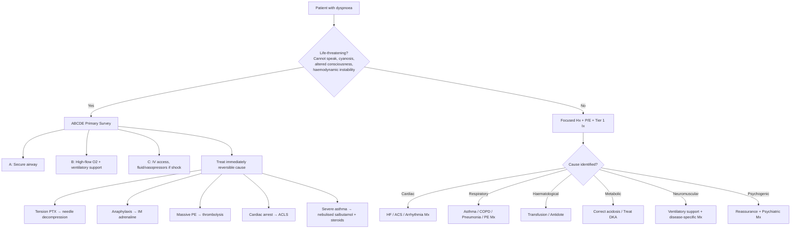
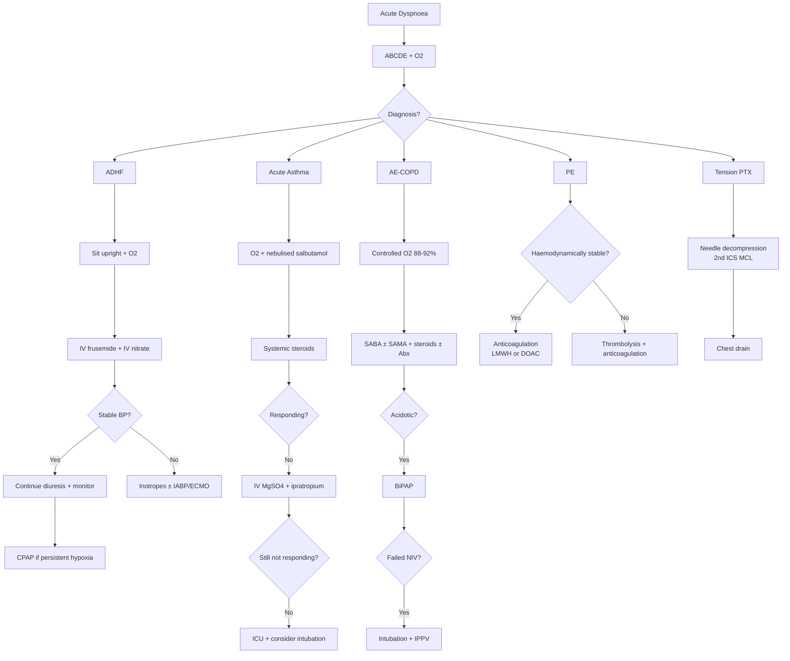

## Management of Shortness of Breath

The management of dyspnoea follows a fundamental principle: **treat the underlying cause**. Dyspnoea is a symptom, not a disease — so the "treatment" is always the treatment of whichever condition is producing it. However, there are universal **supportive measures** that apply across all causes, and a systematic **initial stabilisation** approach that must come first in acute presentations.

The management framework proceeds in three phases:
1. **Immediate stabilisation** (ABCDE, oxygen, life-saving interventions)
2. **Cause-specific treatment** (targeted therapy based on diagnosis)
3. **Ongoing supportive care** (rehabilitation, prevention of recurrence)

---

## Overarching Management Algorithm

---

## Phase 1: Immediate Stabilisation (All Causes)

### ABCDE Approach

This is your **default starting point** for any acutely dyspnoeic patient [3][34].

#### A — Airway

***Emergent airway management*** [5][34]:
- ***Visual inspection of airway + suction of debris***
- ***Airway manoeuvres: head tilt-chin lift or jaw thrust to open up airway***
- ***Ventilation: BVM with reservoir + 15 L/min high-flow O₂ ± airway adjuncts***
- ***ETT intubation with rapid-sequence induction (RSI) if fail any of above***

**Specific upper airway obstruction management** [5]:
- ***UA inflammatory swelling: nebulised adrenaline in O₂ (5 mL 1:1000), IV dexamethasone 8 mg***
- ***Post-op haematoma: consult surgeons → open surgical incision to allow evacuation***
- ***Blocked tracheostomy: remove inner tube, deflate cuff, suction → remove tracheostomy tube if failed***
- ***If failed intubation and cannot oxygenate → NEEDLE CRICOTHYROTOMY if all else fail*** [5]

***Indications for endotracheal intubation*** [34]:
- ***Acute respiratory failure***
- ***Inadequate oxygenation***
- ***Inadequate ventilation*** (e.g. status asthmaticus, severe COPD with fatigue)
- ***Airway protection in patients with decreased mental status*** (GCS < 8)

***Contraindications to ETT*** [34]:
- ***Trauma to the upper airway***
- ***Total upper airway obstruction*** (severe laryngeal oedema)
- ***Cervical spine injury*** (relative — use in-line stabilisation)

<Callout title="ETT vs. Tracheostomy" type="idea">

| Feature | ***ETT*** | ***Tracheostomy*** |
|---------|---------|---------------|
| ***Advantages*** | ***Easier and quicker insertion; no surgical procedure; no stoma complications*** | ***Ease of suctioning; ease of replacement; patient comfort; reduced sedation needs; enhanced mobility, speech and swallowing; reduces work of breathing by decreasing dead space*** |
| ***Disadvantages*** | ***Injury to nose/mouth/vocal cords; difficult replacement; patient discomfort; need to be sedated*** | ***More invasive; stomal complications*** |

[34]
</Callout>

#### B — Breathing: Oxygen Therapy

**Principles of oxygen therapy** — this is crucial to understand from first principles:

| Target SpO₂ | Patient Group | Why This Target |
|-------------|--------------|-----------------|
| ***94–98%*** | Most acutely ill patients | Ensures adequate tissue oxygenation |
| ***88–92%*** | ***COPD with known/suspected CO₂ retention*** [35] | Higher O₂ may suppress hypoxic ventilatory drive → ↑CO₂ retention → ↓consciousness. Also: Haldane effect (O₂ displaces CO₂ from Hb) and release of hypoxic pulmonary vasoconstriction (worsens V/Q matching) |
| ***93–95%*** | Acute asthma [36] | Reasonable target; avoid unnecessary hyperoxia |

**Modes of O₂ delivery** (in order of ↑FiO₂):

| Device | Flow Rate | Approximate FiO₂ | When to Use |
|--------|-----------|-------------------|-------------|
| Nasal cannulae | 1–6 L/min | 24–44% | Mild hypoxia, chronic O₂ therapy |
| Simple face mask | 6–10 L/min | 40–60% | Moderate hypoxia |
| Venturi mask | Preset | 24–60% (precise) | ***COPD — allows controlled O₂ delivery*** |
| Non-rebreather mask | 10–15 L/min | 60–90% | Severe hypoxia, CO poisoning |
| BVM with reservoir | 15 L/min | ~100% | Pre-oxygenation, peri-arrest |
| High-flow nasal cannula (HFNC) | Up to 60 L/min | 21–100% | Acute hypoxic RF, post-extubation |

#### C — Circulation

- IV access (two large-bore cannulae)
- **Fluid resuscitation** if hypovolaemic or distributive shock
- **Vasopressors** if persistent hypotension despite fluids (septic shock, distributive)
- ***Inotropes (e.g. IV dobutamine) if adequate filling pressure*** for cardiogenic shock [37]
- Monitor: BP, HR, UO, lactate

#### D — Disability

- GCS, pupils, blood glucose
- Treat seizures, hypoglycaemia, opioid overdose (naloxone)

#### E — Exposure

- Full exposure for examination; temperature; look for rashes (anaphylaxis), leg swelling (DVT)

---

## Phase 2: Non-Invasive and Invasive Ventilatory Support

This deserves its own section because it cuts across multiple causes of dyspnoea.

### Non-Invasive Ventilation (NIV)

***NIV*** delivers positive pressure ventilation via a mask interface without intubation [35].

| Mode | Mechanism | Primary Indications |
|------|-----------|-------------------|
| ***CPAP*** | ***Continuous positive airway pressure applied throughout breathing cycle*** [35] | ***Acute pulmonary oedema*** (↑intrathoracic pressure → ↓preload → ↓pulmonary congestion) [37]; OSA |
| ***BiPAP*** | ***Higher inspiratory pressure (IPAP) and lower expiratory pressure (EPAP)*** [35] | ***COPD exacerbation with respiratory acidosis (pCO₂ ≥ 6 kPa, pH ≤ 7.35)*** [35][36]; severe dyspnoea with respiratory muscle fatigue; persistent hypoxaemia despite O₂ |

**Why BiPAP works in COPD**: The IPAP assists inspiration (↓work of breathing, ↑tidal volume, ↓CO₂), while the EPAP acts like intrinsic PEEP to splint open collapsed small airways during expiration (↓air trapping). This is analogous to the patient's own pursed-lip breathing, but much more effective.

**Why CPAP works in pulmonary oedema**: Continuous positive pressure → ↑intrathoracic pressure → ↓venous return (↓preload) → ↓pulmonary capillary hydrostatic pressure → ↓pulmonary oedema. Also recruits collapsed alveoli → ↑FRC → ↑oxygenation.

***Typical pressure settings*** [35]:
- ***CPAP/EPAP: 8–12 cmH₂O (for pulmonary oedema), 4–5 cmH₂O (for COPD)***
- ***IPAP: start at 8–15 cmH₂O and titrate up to 20 cmH₂O in COPD (aim TV ~7 mL/kg and RR ≤ 25/min)***

***Contraindications to NIV*** [35]:
- ***Respiratory arrest and medical instability***
- ***Inability to protect airway and copious secretions***
- ***Uncooperative or agitated status and unfitting mask***
- ***Recent upper airway or GI surgery***

***Key precautions*** [35]:
- ***Monitor ABG ≤ 1–2 h after start to determine success***
- ***Consider invasive mechanical ventilation if no objective signs of improvement after 1 h***
- ***Watch out for gastric distension***

### Invasive Mechanical Ventilation (IPPV)

***Indications*** [35]:
- ***Respiratory failure not adequately treated by other means***
- ***Failure to protect the airway (GCS < 8)***
- ***Cardiac and/or respiratory arrest***
- ***Clinical instability (e.g. severe hypotension)***

***Laboratory criteria suggesting need*** [35]:
- ***PaO₂ < 7.3 kPa despite O₂ supplement***
- ***PaCO₂ > 6.7 kPa with pH < 7.32***
- ***Vital capacity < 10 mL/kg; FEV₁ < 10 mL/kg***

**Modes** (simplified) [35]:

| Mode | Description | Use |
|------|-------------|-----|
| ***Volume-limited (VC)*** | ***Guarantees tidal volume*** | Risk of barotrauma; used when consistent TV needed |
| ***Pressure-limited (PC)*** | ***↓Risk of barotrauma*** | Preferred in ARDS, stiff lungs |
| ***SIMV*** | ***Allows spontaneous breaths between mandatory breaths*** | Weaning mode |
| ***Pressure support (PS)*** | Patient-triggered, pressure-assisted | Active weaning, spontaneous breathing trial |

---

## Phase 3: Cause-Specific Management

### A. Acute Heart Failure / Pulmonary Oedema

***Medical emergency!!!*** [37]

***General measures*** [37]:
- ***Bed rest + sit patient upright*** (↓venous return → ↓preload)
- ***O₂: high flow, high concentration***
- ***Low salt diet and fluid restriction***

***If stable BP (goal: reduce cardiac workload)*** [37]:
- ***IV frusemide (diuretic) → ↓preload, ↓afterload*** — Why? Frusemide blocks Na⁺/K⁺/2Cl⁻ cotransporter in thick ascending limb → rapid natriuresis and diuresis → ↓intravascular volume → ↓pulmonary congestion. Also has a rapid venodilatory effect (within minutes, before diuresis begins)
- ***IV nitrate (vasodilator) → ↓preload, ↓afterload*** — GTN dilates venous capacitance vessels (↓preload at low doses) and arterioles (↓afterload at higher doses)
- ***IV morphine (anxiolytic, vasodilator) → ↓preload, ↓afterload*** — Venodilation + anxiolysis → ↓sympathetic drive → ↓HR and ↓afterload. *Note: morphine use is now controversial and many guidelines have de-emphasised it due to association with worse outcomes in some studies*
- ***Monitor BP/P, I/O, SpO₂, JVP, clinical state, electrolytes and RFT*** [37]

***If unstable BP (cardiogenic shock)*** [37][38]:
- ***Give inotropes, e.g. dopamine, dobutamine*** — dobutamine is a β₁-agonist that ↑contractility and ↑CO
- ***If still unstable/refractory → intra-aortic balloon pump (IABP) or extracorporeal membrane oxygenation (ECMO)*** [37]

***Ventilatory support if desat, exhaustion, cardiogenic shock*** [37]:
- ***Non-invasive: CPAP (↑intrathoracic pressure → ↓preload)***
- ***Invasive: intubation, mechanical ventilation***

***Treat underlying precipitant*** [37]:
- ***Cardiac: arrhythmia, myocardial ischaemia/MI***
- ***Vascular: exacerbation of HTN***
- ***Non-CVS: anaemia, thyroid disease, drug interactions***

<Callout title="The ADHF Mnemonic: LMNOP">
A quick memory aid for acute pulmonary oedema treatment:
- **L** — Lasix (frusemide)
- **M** — Morphine (use with caution)
- **N** — Nitrates
- **O** — Oxygen
- **P** — Position (sit upright)
</Callout>

### B. Acute Severe Asthma

***Severity grading*** [5][36]:

| Mild/Moderate | Severe | Life-threatening |
|---------------|--------|-----------------|
| Talks in phrases; prefers sitting; calm; ↑RR; no accessory muscles; HR 100-120; SpO₂ 90-95%; PEF > 50% | ***Talks in words; sits hunched forwards; agitated; RR > 30; accessory muscles; HR > 120; SpO₂ < 90%; PEF ≤ 50%*** [36] | ***Silent chest; hypotension; PEF < 33%; cyanosis; confusion*** [36] |

***Management*** [5][36]:

1. ***High flow O₂ to keep SpO₂ 94–98%*** (93–95% per GINA)
2. ***Repeated 5 mg salbutamol nebulised with O₂*** — β₂-agonist → bronchial smooth muscle relaxation. Can give 4–10 puffs every 20 min for the first hour via MDI + spacer (non-inferior to nebuliser)
3. ***IV hydrocortisone 100 mg or PO prednisolone 40–50 mg*** [5] (oral is as effective as IV [36]) — corticosteroids reduce airway inflammation, ↓oedema, restore β₂-receptor sensitivity. Takes 4–6 hours to work, so must give EARLY
4. ***If unresponsive*** [5]:
   - ***Slow IV MgSO₄ 2 g*** over 20 min — thought to ↓Ca²⁺ influx in airway smooth muscle → bronchodilation. Useful in severe attacks
   - ***Add nebulised ipratropium 0.5 mg*** — anticholinergic → additive bronchodilation. SAMA with SABA = ↓hospitalisation and ↑PEF/FEV₁ improvement vs. SABA alone in moderate-severe attack [36]
5. ***Repeated reassessment every 15 min***
6. ***ABG if SpO₂ < 92% or life-threatening*** [5]
7. ***Consider discharge if PEF > 75% 1 h after treatment*** [5]

***Features warranting ICU care*** [36]:
- ***Life-threatening features***
- ***Deterioration in PEF/FEV₁***
- ***Worsening or persistent hypoxia or hypercapnia***
- ***Respiratory failure requiring IPPV***

***Avoid*** [36]: ***antibiotics (unless strong evidence of infection), aminophylline/theophylline (narrow therapeutic range, poor efficacy), sedatives/cough suppressants, mucolytics***

### C. Acute Exacerbation of COPD

***Approach*** [35][36]:
1. ***Assessment: CXR (r/o PTX, pneumonia), pulse oximetry and ABG (for possible T2RF)***
2. ***Controlled O₂ therapy: keep SpO₂ 88–92%*** (and PaO₂ ≥ 60 mmHg) — Why 88–92%? In chronic CO₂ retainers, the central chemoreceptor has adapted to high CO₂ and the primary remaining stimulus for breathing is hypoxia (peripheral chemoreceptors). Giving too much O₂ abolishes this hypoxic drive → hypoventilation → ↑CO₂ → CO₂ narcosis → respiratory arrest
3. ***Bronchodilators: SABA ± SAMA*** (MDI + spacer not inferior to nebuliser) — IV methylxanthines NOT recommended
4. ***Systemic corticosteroids: prednisolone 30–40 mg × 5 days or IV hydrocortisone 100 mg Q6-8H*** — effect: shorten recovery, ↑FEV₁, ↓risk of early relapse
5. ***Antibiotics: only when evidence of infection*** (↑purulent sputum with ↑SOB or ↑sputum volume) — cover *S. pneumoniae, H. influenzae, M. catarrhalis* ± *P. aeruginosa*; choice: augmentin, macrolides, cephalosporin, tetracycline [35]
6. ***BiPAP (NIV) if respiratory acidosis (pCO₂ ≥ 6, pH ≤ 7.35), severe dyspnoea with respiratory muscle fatigue or persistent hypoxaemia despite O₂*** [35]
7. ***ETT + IPPV + ICU admission if failed NIV or haemodynamically unstable or unconscious with aspiration risks*** [35]

### D. Pneumothorax

Management depends on **primary vs. secondary** and **size/symptoms** (BTS 2010/2023):

| Type | Small/Minimal Symptoms | Large/Symptomatic | Tension PTX |
|------|----------------------|-------------------|-------------|
| **Primary spontaneous** | Observe 4–6 h + repeat CXR; if stable → discharge with review | Needle aspiration (2nd ICS MCL) → if fails, chest drain (4th-5th ICS mid-axillary line) | **Immediate needle decompression** (2nd ICS MCL) → chest drain |
| **Secondary spontaneous** | Admit + high-flow O₂ + observe; consider aspiration or drain | Chest drain (intercostal tube drainage) | Same as above |

***Definitive procedure and preventing recurrence*** [39]:
- ***Risk of recurrence: 10–30% at 1–5 y (1st PSP), 50% at 3 y (SSP)***
- ***Indications for surgical opinion***: ***2nd ipsilateral PTX, 1st contralateral PTX, synchronous bilateral PTX, persistent air leak despite 5–7 days drainage, spontaneous haemothorax, specific professions (pilots, divers), pregnancy*** [39]
- ***Surgical treatment***: ***resection of visible bullae/blebs + obliteration of pleural space by pleurectomy or pleurodesis*** [39]
- ***VATS: 5% recurrence but ↓hospital stay and ↓morbidity vs. open (1% recurrence)*** [39]
- ***Stop smoking; avoid diving permanently unless bilateral pleurodesis*** [39]

### E. Pulmonary Embolism

Management stratified by haemodynamic stability and severity [28]:

**Massive PE (haemodynamically unstable)**:
- Immediate resuscitation (ABCDE)
- ***Immediate interim parenteral anticoagulant therapy (always given)*** [28]
- ***Initiate thrombolysis*** (e.g. alteplase 100 mg IV over 2 h or 0.6 mg/kg over 15 min if cardiac arrest) — dissolves clot by activating plasminogen → plasmin → fibrinolysis
  - **Contraindications to thrombolysis**: active bleeding, recent major surgery ( < 3 weeks), haemorrhagic stroke, intracranial neoplasm, known bleeding disorder
- Surgical embolectomy or catheter-directed therapy if thrombolysis contraindicated or fails

**Submassive PE (haemodynamically stable with RV dysfunction)**:
- Anticoagulation
- Consider thrombolysis case-by-case (especially if clinical deterioration)
- Close monitoring for haemodynamic deterioration

**Low-risk PE (stable, no RV dysfunction)**:
- Anticoagulation: LMWH (e.g. enoxaparin) or fondaparinux initially, overlapping with or switching to oral anticoagulant
- Increasingly, **direct oral anticoagulants (DOACs)** (rivaroxaban, apixaban) used as first-line — advantage: oral, no monitoring required, non-inferior efficacy, ↓major bleeding vs. warfarin
- Duration: minimum 3 months; longer if unprovoked or recurrent (risk-benefit assessment)
- Consider **early discharge** with outpatient treatment for carefully selected low-risk PE patients (validated by PESI or sPESI scores)

### F. Chronic Heart Failure

Chronic HF management follows a **disease-modifying + symptom-relief** approach:

**Disease-modifying pharmacotherapy (for HFrEF — the "four pillars")**:

| Drug Class | Mechanism | Why It Helps | Key Considerations |
|-----------|-----------|-------------|-------------------|
| **ACEi/ARB** (or ARNI = sacubitril/valsartan) | ↓RAAS activation → ↓afterload, ↓remodelling | ↓Mortality, ↓hospitalisation | Monitor K⁺ and creatinine; contraindicated in bilateral RAS, angioedema (ACEi) |
| **β-blockers** (bisoprolol, carvedilol, metoprolol succinate) | ↓HR → ↑diastolic filling time, ↓myocardial O₂ demand, ↓remodelling | ↓Mortality, ↓SCD | Start low, go slow; contraindicated in acute decompensated HF, severe bradycardia |
| **MRA** (spironolactone, eplerenone) | ↓Aldosterone → ↓Na⁺/H₂O retention, ↓fibrosis | ↓Mortality | Risk of hyperkalaemia; monitor K⁺ |
| **SGLT2 inhibitors** (dapagliflozin, empagliflozin) | Glycosuric natriuresis → ↓preload; also ↓inflammation, ↓fibrosis (mechanisms still being elucidated) | ↓Mortality + ↓HF hospitalisation (even in non-diabetics) | Risk of genital mycotic infections, euglycaemic DKA |

**Symptom relief**:
- **Loop diuretics** (frusemide, bumetanide): ↓congestion; titrate to lowest dose that maintains euvolaemia
- **Digoxin**: if symptomatic despite above + AF for rate control; ↓hospitalisation but NOT mortality

### G. Chronic COPD (Stable Disease)

Follows a **stepwise, individualised approach** (GOLD 2024) [35][36]:

**Non-pharmacological** [36]:
- ***Smoking cessation*** — the single most effective intervention to slow FEV₁ decline
- ***Pulmonary rehabilitation***: exercise training + education → ↑exercise capacity, ↓dyspnoea, ↓hospitalisation
- ***Vaccination***: influenza, pneumococcal, COVID-19, RSV, Zoster
- ***Nutritional support for cachexia; psychotherapy and education*** [36]

**Pharmacological — stepwise** [36]:

| Step | Dyspnoea-predominant | Exacerbation-predominant |
|------|---------------------|------------------------|
| Initial | LABA or LAMA monotherapy | LABA or LAMA → step to LABA/LAMA if eos < 0.3; or ICS/LABA if eos ≥ 0.3 |
| Escalation | LABA/LAMA dual | LABA/LAMA/ICS (triple therapy) if eos ≥ 0.1 |
| Further | Non-pharmacological + investigate alternative causes | Add roflumilast or azithromycin; stop ICS if adverse effects or lack of efficacy |

**Long-term O₂ therapy (LTOT)** — ***demonstrated to ↓mortality*** [36]:
- ***Indication: start when clinically stable for 3–4 weeks***
- ***Continuous ≥ 15 h/d when resting PaO₂ < 7.3 kPa (55 mmHg) or SaO₂ ≤ 88% × 2 over 3 weeks***
- ***Or PaO₂ < 8 kPa if cor pulmonale, pulmonary HTN, or polycythaemia*** [36]

**Long-term NIV**: ***if severe chronic hypercapnia + history of hospitalisation for acute respiratory failure*** [36]

**Surgical options for advanced COPD** [36]:
- ***Lung volume reduction surgery (LVRS)***: ***resection of lung to ↓hyperinflation and improve mechanical efficiency of muscles*** — for upper-lobe emphysema
- ***Bullectomy***: removal of large non-functional bulla
- ***Bronchoscopic interventions***: endobronchial valves, thermal ablation, coils
- ***Lung transplantation*** in very severe COPD

### H. Chronic Asthma (Stable Disease)

Follows the ***GINA 2023/2024 stepwise approach*** [36]:

**Two treatment tracks**:

***Track 1 (Preferred)***: Uses **ICS-formoterol** as both controller and reliever (maintenance and reliever therapy, MART)
- ***Reliever: as-needed low-dose ICS-formoterol***
- Advantage: ***reduces the risk of exacerbations compared with using a SABA reliever, and is a simpler regimen*** [36]

***Track 2 (Alternative)***: Uses **SABA** as reliever with separate controller
- ***Reliever: as-needed ICS-SABA or as-needed SABA*** (always with ICS taken whenever SABA is taken)

**Step-up approach** (simplified):

| Step | Track 1 | Track 2 |
|------|---------|---------|
| 1 | As-needed low-dose ICS-formoterol | As-needed ICS-SABA or ICS whenever SABA taken |
| 2 | Low-dose ICS-formoterol maintenance + prn | Low-dose ICS daily or LTRA |
| 3 | Medium-dose ICS-formoterol maintenance + prn | Medium-dose ICS, or add LTRA or HDM SLIT |
| 4 | Medium/high-dose ICS-formoterol + add LAMA | Add LAMA or LTRA or HDM SLIT; switch to high-dose ICS |
| 5 | Refer for phenotyping ± biologics (anti-IgE, anti-IL5, anti-IL4R) | Add low-dose OCS but consider side effects |

### I. Other Specific Conditions

| Condition | Key Management Points |
|-----------|----------------------|
| **Pneumonia** | Antibiotics (empiric → targeted), O₂, fluid resuscitation, consider NIV/IPPV if RF |
| **Anaemia** | Treat underlying cause (iron replacement, B12/folate, EPO for CKD); transfuse if Hb dangerously low or symptomatic (typically < 7 g/dL, or < 8 g/dL in cardiac disease) |
| **CO poisoning** | ***Supplemental O₂ (speeds up CO dissociation; half-life 4–5 h room air → 50–60 min on 100% O₂ → 22–23 min with hyperbaric O₂)*** [12]; consider hyperbaric O₂ if severe (LOC, cardiac ischaemia, pregnancy) |
| **Methaemoglobinaemia** | ***Supplementary O₂ + IV 1% methylene blue*** [12] (acts as electron carrier → reduces Fe³⁺ back to Fe²⁺) |
| **DKA** | IV fluids (NS) → IV insulin infusion → K⁺ replacement → monitor glucose/K⁺/pH hourly; treat precipitant |
| ***OSA*** | ***Nasal CPAP, dental appliance ± surgery*** [40]; weight loss, positional therapy, avoid alcohol/sedatives |
| **ILD/IPF** | ***Antifibrotics (pirfenidone or nintedanib)*** — slow progression; ***immunosuppressive therapy NOT useful for IPF*** [41]; ***lung transplant for end-stage disease*** [35] |
| **Neuromuscular (GBS)** | ***Monitor respiratory function (FVC, ABG); mechanical ventilation if ↑CO₂, ↓O₂, FVC < 15 mL/kg, inefficient cough*** [42]; ***IV immunoglobulin 0.4 g/kg/d × 5 days OR plasmapheresis*** [42] |
| **Pleural effusion** | Treat underlying cause; ***diagnostic thoracocentesis for ALL effusions*** [29]; therapeutic drainage if symptomatic; ***pleurodesis for malignant effusion*** [43] |
| ***Psychogenic hyperventilation*** | Reassurance; breathing retraining (diaphragmatic breathing, slow breathing exercises); treat underlying anxiety/panic disorder (CBT, SSRIs) [44] |

### J. Respiratory Failure — Treatment Summary

***Depends on type of respiratory failure and underlying cause*** [35]:

| Type | Treatment Approach |
|------|-------------------|
| ***T1RF*** | ***Treat underlying cause (e.g. bronchodilators for asthma, thrombolysis for PE); O₂ therapy as palliative treatment to reverse hypoxaemia; CPAP then BiPAP then IPPV if persistent hypoxaemia despite O₂*** |
| ***T2RF*** | ***Treat underlying cause (e.g. stop sedatives, relieve airway obstruction); Controlled O₂ therapy (to avoid ↓hypoxic drive in background chronic T2RF); BiPAP then IPPV — some form of ventilatory support generally required to reverse ↑pCO₂*** |

***Chronic respiratory failure*** [35]:
- ***Home non-invasive ventilation: early stages → overnight NIV sufficient to restore daytime pCO₂; late stages → extended to daytime NIV***
- ***Lung transplantation for end-stage lung disease refractory to maximal medical treatment*** [35]

***Indications for lung transplantation*** [35]:
- ***COPD (27%), CF (26%), IPF (17%), α₁-antitrypsin deficiency (6%), pulmonary HTN (5%)***
- ***High (> 50%) risk of death ≤ 2 y if not performed***
- ***High (> 80%) likelihood of surviving ≥ 90 d post-transplant***
- ***High (> 80%) likelihood of 5 y survival with adequate graft function***

---

## Summary Decision Tree by Diagnosis

---

<Callout title="High Yield Summary">

1. **ABCDE first** — always stabilise before investigating. Inability to speak = life-threatening
2. **O₂ targets**: 94–98% for most; ***88–92% for COPD*** (avoid abolishing hypoxic drive)
3. **ADHF**: Sit up + O₂ + IV frusemide + IV nitrate ± morphine. CPAP if persistent hypoxia. Inotropes if cardiogenic shock
4. **Acute asthma**: O₂ + nebulised salbutamol + systemic steroids. Escalate to IV MgSO₄ + ipratropium. Avoid aminophylline and sedatives. Silent chest = ICU
5. **AE-COPD**: Controlled O₂ + SABA ± SAMA + prednisolone + Abx if purulent sputum. BiPAP if acidotic. Intubate if NIV fails
6. **PE**: Anticoagulation for all; thrombolysis for massive (haemodynamically unstable) PE
7. **Tension PTX**: Needle decompression → chest drain. Do NOT wait for CXR
8. **NIV modes**: CPAP for pulmonary oedema (↓preload); BiPAP for COPD (↓CO₂, ↓work of breathing)
9. **Chronic HF**: Four pillars — ACEi/ARNI + β-blocker + MRA + SGLT2i. Loop diuretics for symptom relief only
10. **Chronic COPD**: Smoking cessation most important. LABA/LAMA ± ICS. LTOT if PaO₂ < 55 mmHg. NIV if chronic hypercapnia
11. **Chronic asthma (GINA 2024)**: ICS-formoterol as both controller and reliever is now the preferred track. Never use SABA alone without ICS
12. **Intubation indications**: RF despite other measures, GCS < 8, cardiac/respiratory arrest, clinical instability
13. **Lung transplant**: End-stage lung disease (COPD, CF, IPF, α₁-AT, pHTN) refractory to maximal therapy

</Callout>

---

<ActiveRecallQuiz
  title="Active Recall - Management of Shortness of Breath"
  items={[
    {
      question: "Describe the stepwise management of acute severe asthma in the emergency department, including drug names, doses, and escalation criteria.",
      markscheme: "1) High-flow O2 targeting SpO2 93-95% (or 94-98%). 2) Nebulised salbutamol 5 mg repeated every 20 minutes for first hour (or MDI + spacer 4-10 puffs). 3) Systemic corticosteroids: IV hydrocortisone 100 mg or PO prednisolone 40-50 mg (oral as effective as IV). 4) If unresponsive: add nebulised ipratropium 0.5 mg and slow IV MgSO4 2 g over 20 minutes. 5) Reassess every 15 minutes. 6) ABG if SpO2 less than 92% or life-threatening features. 7) ICU referral and consider intubation if life-threatening features (silent chest, hypotension, cyanosis, confusion, PEF less than 33%). Avoid: aminophylline, sedatives, antibiotics (unless proven infection).",
    },
    {
      question: "Why is the SpO2 target 88-92% in acute exacerbation of COPD, and what happens if you give too much oxygen?",
      markscheme: "In chronic CO2 retainers, the central chemoreceptor has adapted to chronically elevated CO2 and becomes less responsive. The primary remaining stimulus for ventilation is hypoxia acting on peripheral chemoreceptors (carotid and aortic bodies). Excessive O2 suppresses this hypoxic ventilatory drive leading to hypoventilation, further CO2 accumulation, respiratory acidosis, CO2 narcosis, and potentially respiratory arrest. Additional mechanisms include the Haldane effect (O2 displaces CO2 from Hb, raising PaCO2) and release of hypoxic pulmonary vasoconstriction (worsening V/Q matching). Target 88-92% provides adequate oxygenation while preserving ventilatory drive.",
    },
    {
      question: "Compare CPAP and BiPAP: mechanism of action, primary indications, and typical pressure settings.",
      markscheme: "CPAP: Continuous positive airway pressure throughout the breathing cycle. Primary indication: acute pulmonary oedema (increases intrathoracic pressure, reduces venous return and preload, recruits collapsed alveoli). Also used for OSA. Typical setting: 8-12 cmH2O for pulmonary oedema. BiPAP: Bilevel positive airway pressure with higher IPAP and lower EPAP. Primary indication: COPD exacerbation with respiratory acidosis (IPAP assists inspiration reducing work of breathing and CO2; EPAP splints airways open reducing air trapping). Typical settings: IPAP 8-15 cmH2O titrated up to 20, EPAP 4-5 cmH2O for COPD. Both are contraindicated in respiratory arrest, inability to protect airway, uncooperative patients, and recent upper airway/GI surgery.",
    },
    {
      question: "List the four pillars of disease-modifying pharmacotherapy in HFrEF and explain the mechanism of each.",
      markscheme: "1) ACEi/ARB or ARNI (sacubitril/valsartan): inhibit RAAS, reduce afterload and adverse remodelling, reduce mortality. 2) Beta-blockers (bisoprolol, carvedilol, metoprolol succinate): reduce HR, increase diastolic filling time, reduce myocardial O2 demand, counter harmful chronic sympathetic activation, reduce remodelling and sudden cardiac death. 3) Mineralocorticoid receptor antagonists (spironolactone, eplerenone): block aldosterone, reduce Na/water retention and myocardial fibrosis, reduce mortality. 4) SGLT2 inhibitors (dapagliflozin, empagliflozin): promote glycosuria and natriuresis reducing preload, reduce inflammation and fibrosis via incompletely understood mechanisms, reduce mortality and HF hospitalisation even in non-diabetics.",
    },
    {
      question: "A patient with massive PE presents with systolic BP of 70 mmHg. Outline the immediate management steps.",
      markscheme: "1) ABCDE: secure airway, high-flow O2, establish two large-bore IV lines. 2) Fluid resuscitation with caution (250-500 mL NS bolus — excessive fluid can worsen RV dilatation). 3) Immediate parenteral anticoagulation (IV unfractionated heparin bolus 80 IU/kg then infusion). 4) Systemic thrombolysis: alteplase 100 mg IV over 2 hours (or 0.6 mg/kg over 15 min if cardiac arrest) — activates plasminogen to dissolve clot. 5) Vasopressors (noradrenaline) if persistent hypotension despite fluids. 6) If thrombolysis contraindicated or fails: surgical embolectomy or catheter-directed therapy. 7) Bedside echo for RV dysfunction confirmation if diagnosis uncertain. 8) Monitor in ICU.",
    },
    {
      question: "What are the indications for long-term oxygen therapy in COPD, and why must it be used for at least 15 hours per day?",
      markscheme: "Indications (when clinically stable for 3-4 weeks after optimisation): 1) Resting PaO2 less than 7.3 kPa (55 mmHg) or SaO2 88% or less, confirmed twice over 3 weeks. 2) Resting PaO2 less than 8 kPa with evidence of cor pulmonale, pulmonary hypertension, or polycythaemia (Hct greater than 55%). Must be used at least 15 hours per day because the landmark MRC and NOTT trials showed mortality benefit only with prolonged daily use (near-continuous better than nocturnal-only). The mechanism of benefit includes reducing pulmonary vasoconstriction (lowering pulmonary artery pressure and reducing cor pulmonale), improving tissue oxygenation, and reducing polycythaemia. Intermittent short-duration O2 does not provide the same survival benefit.",
    },
  ]}
/>

---

## References

[3] Senior notes: Ryan Ho Critical Care.pdf (p6 — Acute SOB approach)
[5] Senior notes: Ryan Ho Critical Care.pdf (p13 — Management of upper airway obstruction and lower airway emergencies)
[12] Senior notes: Ryan Ho Chemical Path.pdf (p38 — COHb and MetHb treatment)
[28] Senior notes: Ryan Ho Respiratory.pdf (p135 — PE diagnosis and management)
[29] Senior notes: Ryan Ho Fundamentals.pdf (p228 — Pleural effusion workup and thoracocentesis)
[34] Senior notes: felixlai.md (Endotracheal intubation — indications, contraindications, ETT vs tracheostomy)
[35] Senior notes: Ryan Ho Respiratory.pdf (p33–36, p112, p115–116 — NIV, invasive ventilation, respiratory failure treatment, COPD management, LTOT)
[36] Senior notes: Ryan Ho Respiratory.pdf (p101, p107, p115 — GINA stepwise, acute asthma management, AE-COPD management)
[37] Senior notes: Ryan Ho Fundamentals.pdf (p217 — ADHF management)
[38] Senior notes: Ryan Ho Critical Care.pdf (p22 — Cardiogenic shock management)
[39] Senior notes: Ryan Ho Respiratory.pdf (p155 — Pneumothorax definitive management and recurrence prevention)
[40] Senior notes: Ryan Ho Psychiatry.pdf (p229 — OSA treatment)
[41] Senior notes: Ryan Ho Respiratory.pdf (p122 — ILD general management and antifibrotics)
[42] Senior notes: Ryan Ho Neurology.pdf (p183 — GBS management)
[43] Senior notes: Ryan Ho Respiratory.pdf (p150 — Supportive treatment in lung cancer including pleurodesis)
[44] Senior notes: Ryan Ho Psychiatry.pdf (p173 — GAD somatic features and hyperventilation)
