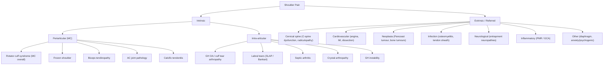

## Differential Diagnosis of Shoulder Pain

The differential diagnosis of shoulder pain is broad precisely because the shoulder sits at a crossroads — it is the junction of the upper limb, neck, thorax, and visceral referred pathways. A systematic approach is essential. The framework below integrates ***Murtagh's diagnostic strategy*** [1] with the clinical reasoning structure from senior notes [2][3][8].

---

### Organising Framework

The single most useful bedside framework is to categorise by **where the pathology sits**:

1. **Intrinsic — Periarticular** (around the joint, most common)
2. **Intrinsic — Intra-articular** (within the joint itself)
3. **Extrinsic — Referred** (pathology elsewhere, pain perceived at shoulder)

Within each category, you then use the clinical features discussed in the previous section — particularly the **active vs passive ROM pattern** — to narrow down further.

---

### A. Probability Diagnoses (Common — You Will See These Every Week)

These are the diagnoses you should think of **first** because they account for the vast majority of shoulder pain presentations.

#### 1. Rotator Cuff Syndrome (Most Common Overall) [2][3]

***Rotator cuff syndrome (MC): pain during activity only, passive ROM > active ROM, external rotation spared (infraspinatus + teres minor)*** [2]

Why is this the most common? The supraspinatus tendon lives in a mechanically hostile environment — sandwiched between the acromion above and the humeral head below. Decades of overhead use lead to progressive tendon degeneration. By age 60, up to 30% of the population has an asymptomatic rotator cuff tear on MRI.

**Distinguishing features within the rotator cuff continuum**:

| Sub-diagnosis | Key Distinguishing Feature | Why |
|---|---|---|
| **SAIS / tendinopathy** | Painful arc 60–120°; Neer/Hawkins positive; no true weakness | Tendon is inflamed but structurally intact → mechanical pinching only in the impingement zone |
| **Rotator cuff tear** | Active ROM ↓ but passive ROM intact; drop arm sign; weakness on specific cuff testing | Tendon is structurally disrupted → muscle force cannot transmit across the gap |
| **Calcific tendonitis** | Acute severe pain (may mimic septic arthritis); XR shows calcific deposit | Calcium hydroxyapatite crystals deposit in the tendon → resorptive phase triggers intense inflammatory reaction with phagocytosis |

> The key clinical discriminator: ***passive ROM > active ROM*** [2]. If the examiner moves the arm for the patient and it goes further than the patient can move it themselves, the joint is fine — the motor (rotator cuff) is the problem.

#### 2. Frozen Shoulder / Adhesive Capsulitis [2][3]

***Frozen shoulder: DM as risk factor (check Hstix), symptoms change over time (pain → pain + stiffness → stiffness → resolution), night pain/rest pain (inflamed capsule); limited active + passive ROM*** [2]

Why does frozen shoulder look different from rotator cuff disease? Because the pathology is in the **joint capsule**, not the tendon. A contracted, fibrotic capsule physically prevents movement regardless of whether the patient or the examiner is trying to move the arm. Both active AND passive ROM are restricted — this is the capsular pattern.

**Capsular pattern of the glenohumeral joint**: ER > abduction > IR (external rotation is lost first and most). Why? The inferior glenohumeral ligament complex and axillary recess — the structures most affected by capsular fibrosis — are the primary check-reins to external rotation.

**How to differentiate from GH OA and septic arthritis** (which also restrict both active and passive ROM):
- **Frozen shoulder**: Insidious onset, no trauma, DM/thyroid association, three-phase disease course, no joint destruction on X-ray
- **GH OA**: Older patient, joint space narrowing and osteophytes on X-ray, crepitus, history of previous injury or cuff tear arthropathy
- **Septic arthritis**: Acutely unwell, fever, hot swollen joint, severely restricted in ALL directions, markedly elevated inflammatory markers

#### 3. AC Joint Arthritis [2]

***AC joint arthritis: more localised tenderness*** [2]

The AC joint sits superficially at the top of the shoulder. OA here produces pain that is precisely localised to the AC joint — you can point to it with one finger. This contrasts with the deeper, more diffuse pain of rotator cuff disease.

**Why is it often missed?** Because cross-body adduction (the scarf test) is not routinely performed, and clinicians may attribute the pain to the rotator cuff. The ***Paxinos sign*** (approach from behind, press up on posterolateral acromion while pressing clavicle down → pain) is specific for AC joint OA [4].

#### 4. Biceps Tendinopathy [2]

***Biceps tendonitis: more localised tenderness*** [2]

The long head of biceps tendon runs through the bicipital groove on the anterior humerus. Pain is localised to this groove and is reproduced by resisted biceps contraction (Speed test, Yergason test). Why is it often associated with rotator cuff disease? Because the biceps tendon shares the same subacromial "neighbourhood" — it passes through the rotator interval, and inflammation from impingement often spills over to the biceps tendon.

#### 5. Cervical Radiculopathy [2][8]

***Cervical radiculopathy: neck pain, radiating pain, weakness*** [2]

***Dysfunction of the cervical spine (lower)*** is listed as the **#1 probability diagnosis** for arm and hand pain in Murtagh's framework [1]. This is critical — cervical spine pathology can perfectly mimic intrinsic shoulder disease.

**Why does cervical radiculopathy cause shoulder pain?** The shoulder is innervated by C5 (deltoid, supraspinatus via suprascapular nerve) and C6 (biceps, wrist extensors). A C5/6 disc herniation or osteophytic foraminal stenosis compresses the C5 or C6 root → pain perceived in the shoulder and radiating down the arm in a dermatomal distribution [8].

**How to differentiate from intrinsic shoulder pathology**:

| Feature | Intrinsic Shoulder | Cervical Radiculopathy |
|---|---|---|
| Neck pain | Absent (unless coexisting) | Present |
| Pain distribution | Localised to shoulder region | Radiating from neck → shoulder → arm ± forearm/hand in a dermatomal pattern |
| Neurological signs | Absent (except weakness in cuff tear) | Dermatomal sensory loss, myotomal weakness, reflex changes |
| ***Spurling manoeuvre*** | Negative | ***Positive (limb pain/paraesthesia)*** [8] |
| ***Shoulder abduction relief*** | No change | ***↓↓ radicular S/S*** [8] |
| Neck movements | No effect on shoulder pain | Aggravate shoulder/arm pain |
| Shoulder ROM | Abnormal | **Normal** (the shoulder joint itself is fine) |

<Callout title="The Neck-Shoulder Trap" type="error">
One of the most commonly missed diagnoses in clinical practice is **cervical radiculopathy masquerading as shoulder pain**. The patient says "my shoulder hurts," and the clinician never examines the neck. Rule: **always examine the cervical spine in any patient with shoulder pain**. If shoulder ROM is full and Spurling is positive, the pain is coming from the neck.
</Callout>

---

### B. Serious Disorders Not to Be Missed [1]

These are less common but carry significant morbidity/mortality if delayed. ***Murtagh's framework*** categorises them as follows [1]:

#### ***Cardiovascular*** [1]:

| Condition | Why It Causes Shoulder Pain | Key Distinguishing Features |
|---|---|---|
| ***Angina (referred)*** | Myocardial ischaemia → stimulation of cardiac sympathetic afferents (T1-4) → referred to left shoulder/arm via somatic convergence in the dorsal horn [6] | Exertional, dull/constricting, associated with SOB; cardiac risk factors; ECG changes |
| ***Myocardial infarction*** | Same mechanism but more severe and prolonged ischaemia → more intense pain | Prolonged ( > 20 min), diaphoresis, nausea, may be silent in diabetics and elderly |
| ***Axillary vein thrombosis*** | Venous congestion and inflammation of the axillary vein → local shoulder/arm pain and swelling | Arm oedema, cyanosis, distended superficial veins; Hx of central line, Paget-Schroetter syndrome (effort thrombosis) |
| ***Arm claudication (left arm)*** | Subclavian artery stenosis → exertional ischaemia of the upper limb → pain | Exertional arm pain relieved by rest; BP discrepancy between arms; bruit over subclavian |

#### ***Infection*** [1]:

| Condition | Key Features |
|---|---|
| ***Septic arthritis (shoulder/elbow)*** | Acutely hot, swollen, tender joint with severely restricted ROM in ALL directions; fever; immunocompromised/DM [5]. ***Hot, swollen tender joint = septic arthritis until proven otherwise*** [5] |
| ***Osteomyelitis*** | Deep, constant bone pain; fever; elevated inflammatory markers; may follow bacteraemia or open fracture |
| ***Infections of tendon sheath and fascial spaces of hand*** | Pain, swelling, erythema along tendon sheath; Kanavel's signs (flexor tenosynovitis) |
| ***Sporotrichosis ('gardener's arm')*** | Ascending nodular lymphangitis following thorn prick; dimorphic fungus *Sporothrix schenckii* |

#### ***Neoplasia/Cancer*** [1]:

| Condition | Key Features |
|---|---|
| ***Pancoast tumour*** | Apical lung carcinoma → invades brachial plexus (C8-T1) and cervical sympathetic chain → shoulder/arm pain + Horner's syndrome (miosis, ptosis, anhidrosis) + T1 hand muscle wasting [7]. Screen for in any smoker with shoulder pain + neurological signs. |
| ***Bone tumours (rare)*** | Primary (osteosarcoma, chondrosarcoma, myeloma) or metastatic (lung, breast, prostate, kidney, thyroid) to proximal humerus → deep, unrelenting pain, worse at night, not related to activity |

<Callout title="Red Flags for Serious Pathology in Shoulder Pain">
Screen for these in EVERY patient:
- **Constitutional symptoms**: Fever, weight loss, night sweats, anorexia → infection, malignancy
- **Unrelenting night pain not relieved by position**: Tumour, infection
- **History of cancer**: Metastatic disease
- **New neurological deficit**: Cervical myelopathy, Pancoast tumour
- **Acute hot swollen joint + fever**: Septic arthritis (treat as emergency)
- **Cardiovascular risk factors + exertional left shoulder/arm pain**: Rule out angina/MI
</Callout>

---

### C. Pitfalls (Often Missed) [1]

These are the diagnoses that are frequently overlooked because they don't fit neatly into the "shoulder" box:

| Condition | Why It's Missed | How to Catch It |
|---|---|---|
| ***Entrapment neuropathies (e.g. median nerve, ulnar nerve)*** [1] | Proximal entrapment (e.g. suprascapular nerve at the suprascapular notch) may present as shoulder pain and wasting, mimicking rotator cuff tear | Specific wasting pattern (supraspinatus + infraspinatus only for suprascapular nerve entrapment); NCS/EMG confirms |
| ***Pulled elbow (children)*** [1] | A child with arm pain may be misdiagnosed as having shoulder pathology | Nursemaid's elbow (radial head subluxation) in toddlers after sudden traction on extended arm; child holds arm pronated and slightly flexed; refuses to use arm |
| **Cervical myelopathy** | ***Commonest cause of cervical cord lesion in pt > 50y*** [8]. May present with vague shoulder/arm symptoms before classic UMN signs appear | ***Lhermitte phenomenon, myelopathic hand signs (10-second test, finger escape sign, Hoffman sign)*** [8]; UMN signs in legs |
| **Polymyalgia rheumatica** | Bilateral shoulder girdle pain/stiffness in elderly; no true weakness on exam; may be attributed to bilateral rotator cuff disease | Age > 50, dramatically elevated ESR ( > 40), rapid response to low-dose prednisolone; ***50% associated with giant cell arteritis*** [9] |
| **Fibromyalgia** | Widespread pain including shoulders; tender points; normal investigations | Diagnosis of exclusion; associated with sleep disturbance, fatigue, psychological distress |
| ***Outlet compression syndrome (e.g. cervical rib)*** [11] | Thoracic outlet syndrome → compression of brachial plexus and/or subclavian vessels between the scalenes / cervical rib → shoulder, arm, hand symptoms | Adson test (turn head to affected side + extend neck + deep breath → obliteration of radial pulse); neurogenic TOS has intrinsic hand wasting |

---

### D. Masquerades Checklist (Murtagh's 7) [1][11]

Always consider whether one of the "masquerades" is responsible:

| Masquerade | How It Can Present as Shoulder Pain |
|---|---|
| ***Depression*** | Chronic shoulder/neck pain as a somatic complaint; poor response to analgesics; co-existing low mood, sleep disturbance, anhedonia |
| ***Thyroid disorder (thyroiditis)*** | Hypothyroidism → adhesive capsulitis, carpal tunnel syndrome. Thyroiditis → neck/shoulder pain |
| ***Spinal dysfunction*** | Cervical facet joint dysfunction → referred shoulder pain (the #1 probability diagnosis in Murtagh's) [1] |
| **Diabetes** | DM → frozen shoulder (5× risk), trigger finger, CTS, Dupuytren's — all related to collagen glycosylation |
| **Drugs** | Fluoroquinolone tendinopathy (though typically Achilles, can affect any tendon); statin myalgia |

---

### E. Psychogenic / Functional

***"Is the patient trying to tell me something?"*** [1] — ***Highly probable. Stress and adverse occupational factors relevant.*** [1]

Psychogenic shoulder pain should be considered when:
- Pain is vague, poorly localised, inconsistent with anatomical structures
- Normal examination findings with disproportionate disability
- Significant psychosocial stressors (workplace injury, compensation claims, depression, anxiety)
- ***Muscle tension: medically unexplained tension-type headache, tremor, shoulder/back pain*** is a somatic feature of ***generalised anxiety disorder*** [12]

This is a **diagnosis of exclusion** — you must rule out organic pathology first. But it is extremely common, especially in occupational health settings.

---

### Differential Diagnosis Summary Table

| Category | Condition | Active ROM | Passive ROM | Key Clinical Feature | Must-Do Test |
|---|---|---|---|---|---|
| **Periarticular** | SAIS / RC tendinopathy | Painful arc | Less restricted | Pain with overhead activity | Neer/Hawkins |
| | RC tear | ↓ | **Intact** | Drop arm sign, weakness | Empty can (Jobe) |
| | Frozen shoulder | ↓↓ | ↓↓ (capsular pattern) | ER most restricted; DM | HbA1c, MRI |
| | AC joint OA | Full (painful end-range) | Full | Localised AC tenderness | Scarf test, Paxinos |
| | Biceps tendinopathy | Full (painful) | Full | Anterior groove tenderness | Speed, Yergason |
| | Calcific tendonitis | Severely limited (pain) | Limited (pain) | Acute onset, mimics septic | XR: calcific deposit |
| **Intra-articular** | GH OA | ↓ | ↓ | Crepitus, secondary cause | XR: JSN, osteophytes |
| | Septic arthritis | ↓↓ (all directions) | ↓↓ | Hot, swollen, fever | Joint aspirate (urgent!) |
| | Labral tear | May be full | May be full | Clicking, instability | MR arthrogram |
| | GH instability | May be full | May be full | Apprehension sign | Relocation test |
| **Referred** | Cervical radiculopathy | **Normal shoulder ROM** | **Normal** | Neck pain, dermatomal | Spurling |
| | Angina/MI | Normal | Normal | Exertional, CV risk factors | ECG, troponin |
| | Pancoast tumour | Normal or ↓ (neurological) | Normal | Horner + T1 wasting + smoker | CXR → CT chest |
| | PMR | Painful but full passive | Full | Bilateral, age > 50, ↑↑ESR | ESR/CRP, trial of prednisolone |
| | Diaphragmatic irritation | Normal | Normal | Shoulder tip pain, abdo Hx | Abdominal exam, imaging |

---

### Clinical Approach to Narrowing the Differential

The following stepwise reasoning approach helps you move from "shoulder pain" to a specific diagnosis efficiently:

**Step 1: Is it truly the shoulder, or is it referred?**
- Examine the neck (Spurling test). Full shoulder ROM + positive Spurling → cervical radiculopathy.
- Screen for red flags: constitutional symptoms, cardiac risk factors, Horner's syndrome, hot swollen joint.

**Step 2: If intrinsic, is the capsule or the motor at fault?**
- Compare active vs passive ROM.
- Both ↓ → capsular problem (frozen shoulder, OA, septic arthritis)
- Active ↓ only → motor problem (rotator cuff tear)
- Painful arc only → impingement

**Step 3: Is it periarticular or intra-articular?**
- Periarticular: tenderness over specific structures (RC, bicipital groove, AC joint), positive provocative tests.
- Intra-articular: diffuse joint tenderness, effusion, crepitus, instability signs.

**Step 4: What is the tempo?**
- Acute (hours–days): trauma (fracture, dislocation, acute tear), septic arthritis, calcific tendonitis, crystal arthropathy
- Subacute (weeks): frozen shoulder (freezing phase), RC tendinopathy flare
- Chronic (months–years): degenerative RC disease, OA, chronic frozen shoulder, cervical spondylosis

**Step 5: What is the age?**
- < 30: instability, labral tear, referred (cervical disc)
- 30–50: impingement, tendinopathy, frozen shoulder (especially if DM), cervical radiculopathy
- \> 50: rotator cuff tear, OA (AC or GH), cervical spondylosis/myelopathy, PMR, malignancy

<Callout title="High Yield DDx Approach for Exams" type="idea">
When given a shoulder pain question, run through this rapid mental checklist:
1. **Neck examined?** → Spurling test rules in/out cervical radiculopathy
2. **Active vs passive ROM?** → Tells you cuff tear vs frozen shoulder vs impingement
3. **Red flags?** → Hot joint (septic), constitutional symptoms (malignancy/infection), cardiac features (angina/MI), neurological deficit (Pancoast, myelopathy)
4. **DM?** → Think frozen shoulder
5. **Age > 50 + bilateral + elevated ESR?** → PMR
</Callout>

---

<ActiveRecallQuiz
  title="Active Recall - Differential Diagnosis of Shoulder Pain"
  items={[
    {
      question: "A 48-year-old diabetic woman has 4 months of worsening right shoulder pain and stiffness. She cannot reach behind her back. On examination, BOTH active and passive external rotation are markedly reduced. Neer and Hawkins tests are negative. What is the most likely diagnosis and why?",
      markscheme: "Frozen shoulder (adhesive capsulitis). Both active AND passive ROM are reduced in a capsular pattern (ER most restricted), indicating the joint capsule itself is contracted and fibrotic. DM is a major risk factor due to collagen glycosylation. Negative impingement signs argue against SAIS. Check HbA1c."
    },
    {
      question: "Explain how you would differentiate rotator cuff tear from subacromial impingement syndrome at the bedside, using only the physical examination.",
      markscheme: "SAIS: Painful arc (60-120 degrees), positive Neer/Hawkins, but full active ROM outside the arc and no true weakness on cuff testing. Passive ROM preserved. RC tear: Loss of active ROM (cannot abduct/externally rotate against resistance), positive drop arm sign, weakness on empty can or external rotation lag sign, BUT passive ROM is full (examiner can move the arm normally). Key distinction: in SAIS the tendon is inflamed but intact; in RC tear the tendon is structurally disrupted."
    },
    {
      question: "A 62-year-old man presents with right shoulder pain radiating to the lateral arm and tingling in the thumb. Shoulder ROM is full. What is the likely diagnosis, what bedside test would you perform, and what is its mechanism?",
      markscheme: "Cervical radiculopathy (likely C6 root). Perform Spurling manoeuvre: extension plus ipsilateral rotation of neck with axial compression. Positive if it reproduces arm pain/paraesthesia. Mechanism: the manoeuvre narrows the ipsilateral intervertebral foramen, compressing an already compromised nerve root against disc/osteophyte. Full shoulder ROM argues against intrinsic shoulder pathology."
    },
    {
      question: "List three serious disorders not to be missed in a patient presenting with shoulder or arm pain according to Murtagh's framework, and state the red flag feature for each.",
      markscheme: "1. Angina/MI - exertional left shoulder/arm pain with cardiovascular risk factors, diaphoresis, ECG changes. 2. Pancoast tumour - smoker with shoulder/arm pain plus ipsilateral Horner syndrome (miosis, ptosis, anhidrosis) and T1 hand muscle wasting. 3. Septic arthritis - acutely hot, swollen, tender joint with severely restricted ROM and fever. Also accept: osteomyelitis (deep constant bone pain, fever), axillary vein thrombosis (arm swelling, cyanosis)."
    },
    {
      question: "A 72-year-old woman presents with bilateral shoulder and hip girdle pain, morning stiffness lasting 2 hours, and ESR of 85 mm/h. What is the most likely diagnosis and what associated condition must you screen for?",
      markscheme: "Polymyalgia rheumatica (PMR). Must screen for giant cell arteritis (GCA), which is associated in approximately 50% of cases. Ask about new-onset headache, jaw claudication, visual disturbances (amaurosis fugax), and scalp tenderness. Check temporal artery on examination. Urgent temporal artery biopsy and high-dose prednisolone if GCA is suspected."
    }
  ]}
/>

## References

[1] Lecture slides: murtagh merge.pdf (p19 — Arm and hand pain; p69 — Neck pain and stiffness)
[2] Senior notes: maxim.md (section 3.3 — Shoulder pain differential diagnosis)
[3] Senior notes: maxim.md (sections 3.5–3.6 — Rotator cuff syndrome, Frozen shoulder)
[4] Senior notes: Ryan Ho Rheumatology.pdf (p11 — Shoulder examination: Look, Feel)
[5] Senior notes: Ryan Ho Rheumatology.pdf (p67 — Septic arthritis)
[6] Senior notes: Ryan Ho Cardiology.pdf (p54–56 — Chest pain, Angina)
[7] Senior notes: Ryan Ho Respiratory.pdf (p141 — Lung cancer / Pancoast tumour)
[8] Senior notes: Ryan Ho Neurology.pdf (p172–173 — Cervical spondylosis, radiculopathy)
[9] Senior notes: Ryan Ho Neurology.pdf (p65 — Giant cell arteritis / PMR)
[11] Lecture slides: murtagh merge.pdf (p69 — Neck pain: pitfalls, masquerades checklist)
[12] Senior notes: Ryan Ho Psychiatry.pdf (p173 — GAD somatic features: shoulder/back pain)
