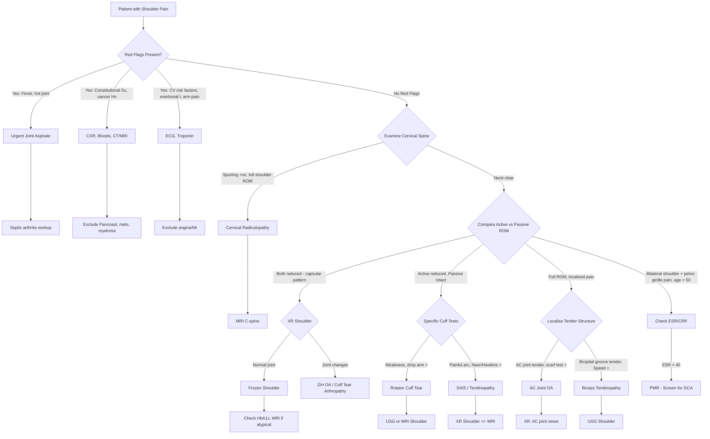

## Diagnostic Criteria, Algorithm and Investigations for Shoulder Pain

Shoulder pain is overwhelmingly a **clinical diagnosis** — history and examination alone get you to the correct diagnosis in approximately 80% of cases. Investigations serve to **confirm** the clinical impression, **grade severity** (e.g., size of rotator cuff tear), **exclude serious pathology** (red flags), and **guide surgical planning**. There is no single "diagnostic criterion" for shoulder pain as a whole; rather, each underlying condition has its own diagnostic framework. Below, we cover the diagnostic criteria for the key conditions, a systematic algorithm, and then each investigation modality in detail.

---

### Diagnostic Criteria for Specific Conditions

Most intrinsic shoulder conditions (SAIS, rotator cuff tear, frozen shoulder) do **not** have formal validated diagnostic criteria like, say, RA or SLE. They are diagnosed clinically with supportive imaging. However, for several conditions that *cause* shoulder pain, formal criteria exist:

#### 1. Frozen Shoulder (Adhesive Capsulitis) — Working Clinical Criteria

There is no universally validated diagnostic criterion set, but the working clinical diagnosis rests on:

| Criterion | Rationale |
|---|---|
| **Insidious onset** of shoulder pain | Capsular inflammation is gradual, not traumatic |
| **Global restriction of both active AND passive ROM** | The capsule itself is contracted → even the examiner cannot move the joint fully |
| **Capsular pattern**: ER > abduction > IR | The axillary recess and inferior GH ligament (most affected by fibrosis) resist ER first |
| **No alternative explanation** on XR (normal GH joint) | Rules out OA, fracture, tumour as cause of stiffness |
| **Characteristic three-phase course** | Freezing → frozen → thawing [3] |

***Investigations*** [3]: ***HbA1c*** (screen for DM); ***XR shoulder: rule out AC pathology***; ***MRI shoulder: thickened joint capsule, rule out SAIS*** [3]

#### 2. Giant Cell Arteritis (When PMR-Related Shoulder Pain)

GCA should be screened for in every patient with PMR-type shoulder pain. The **1990 ACR Classification Criteria** [9]:

> ***≥ 3 of the following 5 criteria*** [9]:
> 1. ***Onset ≥ 50y***
> 2. ***New headache***
> 3. ***Abnormalities of temporal artery at clinical examination***
> 4. ***↑ ESR ( > 50 mm/h)***
> 5. ***Abnormal findings on biopsy of temporal artery***

Sensitivity ~93%, specificity ~91%. Note: temporal artery biopsy ***must be ordered urgently ( < 24–48h)*** because delay risks permanent visual loss from arteritic anterior ischaemic optic neuropathy [9].

#### 3. Septic Arthritis — No Formal Criteria, But Clinical Emergency

***Hot, swollen tender joint = septic arthritis until proven otherwise*** [5]. Diagnosis is confirmed by **joint aspirate**:

| Parameter | Septic Arthritis |
|---|---|
| Appearance | Turbid / purulent |
| WBC count | > 50,000/μL (often > 100,000/μL) |
| % Neutrophils | > 90% |
| Gram stain | Positive in ~50–75% |
| Culture | Gold standard for organism identification |

***Joint fluid analysis is the MOST IMPORTANT TEST*** when septic arthritis is suspected [13].

#### 4. Rotator Cuff Tear — Clinical + Imaging

No formal diagnostic criteria. Diagnosis is based on:
- Clinical: ***loss of active ROM (usually SIT) but intact passive ROM*** [3]; ***drop arm sign*** [3]; weakness on cuff-specific testing
- Imaging confirmation: ***USG shoulder*** (dynamic test for tear) [3] or ***MRI shoulder: gold standard, degree of tear (irreparable if fatty infiltration or muscle tendon atrophy)*** [3]

#### 5. Subacromial Impingement — Clinical + Diagnostic Injection

- Clinical: Painful arc + positive Neer/Hawkins
- ***Neer's test for impingement***: if Neer's sign positive, ***repeat test after injecting 10mL 1% lignocaine into subacromial space*** → ***abolishment of pain helps confirm impingement*** [4][13]. This is both diagnostic and therapeutic — if the pain disappears with subacromial local anaesthetic, the pain generator is the subacromial space.

---

### Diagnostic Algorithm

The following algorithm reflects the systematic clinical approach. The key branching points are: (1) Is it referred? (2) Is the capsule or the motor at fault? (3) Are there red flags?

<Callout title="The Three Key Branch Points" type="idea">
1. **Red flags first** — always screen for septic arthritis, malignancy, and cardiac causes before anything else.
2. **Neck before shoulder** — examine the cervical spine. If Spurling is positive and shoulder ROM is full, the pain is referred.
3. **Active vs Passive ROM** — this single comparison separates cuff tear (active ↓ only) from frozen shoulder/OA (both ↓) from impingement (painful arc only).
</Callout>

---

### Investigation Modalities

The investigations for shoulder pain are chosen based on the clinical suspicion. ***Imaging should be selected conservatively and plain X-ray is not indicated in the absence of red flags and major trauma*** [1]. Let's go through each modality systematically.

#### A. Blood Tests

| Test | When to Order | What You're Looking For | Interpretation |
|---|---|---|---|
| ***FBE (CBC)*** [1] | All patients with red flags; suspected infection, malignancy, PMR | WBC count, Hb, platelets | ↑WBC → infection, inflammation. ↓Hb → chronic disease, malignancy. ↑Platelets (reactive) → inflammatory state |
| ***ESR/CRP*** [1][13] | Suspected inflammatory condition (PMR, GCA, RA, infection, malignancy) | Acute phase reactants | ***ESR > 40*** → think PMR. ***ESR > 50*** → one of the GCA criteria [9]. ↑CRP → acute infection or inflammation. CRP more specific and faster to normalise than ESR |
| ***HbA1c*** [3] | **All frozen shoulder patients** | Glycaemic control; screen for new DM | DM present in up to 20% of adhesive capsulitis patients. May be the presenting feature of undiagnosed DM in Hong Kong's high-prevalence population |
| ***Rheumatoid arthritis factors (RF, anti-CCP)*** [1] | Suspected inflammatory polyarthritis involving the shoulder | Autoantibodies | RF: 70% sensitive for RA, not specific. Anti-CCP: ~95% specific for RA. Both elevated = high probability of RA [13] |
| Serum urate | Suspected crystal arthropathy (uncommon at shoulder) | Hyperuricaemia | Take > 2 weeks after acute flare to avoid false negatives (urate drops during acute inflammation) |
| ALP, LDH | Suspected malignancy, Paget's disease | Bone turnover / tumour markers | ↑ALP → bony metastasis, Paget's. In GCA: ***↑ALP*** is characteristically elevated [9] |
| Blood cultures | Suspected septic arthritis | Bacteraemia | Positive in ~50% of septic arthritis; always take before antibiotics |
| TFT | Frozen shoulder, myopathy screen | Thyroid function | Hypothyroidism associated with adhesive capsulitis and CTS |

#### B. Plain Radiography (XR Shoulder)

This is the **first-line imaging** for most shoulder conditions. It is cheap, fast, and widely available. The key is knowing exactly what to look for.

***XR shoulder findings by condition*** [3]:

| Condition | Key XR Findings | Why |
|---|---|---|
| **SAIS / tendinopathy** | ***Acromiohumeral distance*** (normally > 7mm; ↓ indicates superior humeral migration from cuff weakness); ***acromion morphology*** (Type III hooked = predisposition); ***bony spurs***; ***calcification of supraspinatus tendon (chronic)*** [3] | Bony anatomy of the subacromial space determines the degree of mechanical impingement |
| **Rotator cuff tear** | ***Exclude fractures; acromiohumeral distance (proximal migration of humerus); acromion morphology; bony spurs*** [3]. In chronic massive tears: superior migration of humeral head → "femoralization" of humerus and "acetabularization" of acromion = **cuff tear arthropathy** | Loss of rotator cuff → humeral head no longer held down → migrates superiorly under the deltoid pull |
| **Frozen shoulder** | ***Rule out AC pathology*** [3]. GH joint itself appears **normal** (no JSN, no osteophytes, no erosions). May see osteopenia from disuse | If the X-ray shows joint changes, rethink the diagnosis — it's likely OA, not frozen shoulder |
| **GH OA** | Joint space narrowing, subchondral sclerosis, osteophytes, subchondral cysts. Look for posterior glenoid erosion in inflammatory arthritis | Standard OA changes but less common than hip/knee because shoulder is non-weight-bearing |
| **Calcific tendonitis** | **Dense calcific deposit** in the rotator cuff tendon (usually supraspinatus) — this is diagnostic. May appear fluffy in the resorptive phase | Calcium hydroxyapatite deposited in tendon substance; visible on plain film because calcium is radio-opaque |
| **AC joint OA** | Narrowed AC joint space, osteophytes, inferior spurs projecting into subacromial space | Spurs from the underside of the AC joint narrow the subacromial space → secondary impingement |
| **Dislocation** | Anterior: humeral head anterior and inferior to glenoid. Posterior: "light-bulb sign" (humeral head internally rotated = symmetrical round appearance on AP view) | Always get axillary lateral or Y-view to confirm — posterior dislocations are classically missed on AP alone |
| **Fracture** | Fracture line, displacement. Greater tuberosity avulsion (a/w dislocation) | Trauma series: AP + axillary lateral + scapular Y-view |

**Views to request**:
- **Standard**: AP (true AP in the plane of the scapula) + axillary lateral view
- **Additional**: Scapular Y-view (outlet view — shows acromion morphology); Zanca view (30° cephalad tilt — best for AC joint)
- **Rule**: ***Plain X-ray is not indicated in the absence of red flags and major trauma*** [1]. But in practice, XR is routinely done as baseline for chronic shoulder pain.

#### C. Ultrasound (USG Shoulder)

***USG shoulder: dynamic test for tear*** [3]

Ultrasound is excellent for soft tissue evaluation around the shoulder and is increasingly the **first-line imaging** for suspected rotator cuff pathology in many centres, including Hong Kong.

| Strength | Limitation |
|---|---|
| **Dynamic** — can assess tendon movement in real time (e.g., impingement during abduction, subluxation of biceps tendon) | Operator-dependent — accuracy depends heavily on sonographer skill |
| Cheap, fast, no radiation, widely available | Cannot see deep structures as well (labrum, deep surface of glenoid) |
| Excellent for rotator cuff tears, biceps pathology, bursitis, calcific deposits | Cannot assess bone marrow (cannot detect AVN, bony tumours) |
| Can guide therapeutic injections | Limited evaluation of the capsule (frozen shoulder diagnosed clinically, not well by USG) |

**Key USG findings**:

| Condition | USG Finding |
|---|---|
| **Rotator cuff tear (full thickness)** | Non-visualisation of tendon; hypoechoic/anechoic defect in the tendon substance |
| **Rotator cuff tear (partial thickness)** | Focal hypoechoic area involving part of the tendon thickness |
| **Subacromial bursitis** | Thickened, fluid-filled subacromial-subdeltoid bursa ( > 2mm) |
| **Biceps tendinopathy** | Thickened tendon, surrounding fluid in bicipital groove, ± subluxation |
| ***Biceps tendon rupture*** | ***USG (first-line): localise distal end of biceps tendon*** [2] — empty bicipital groove |
| **Calcific tendonitis** | Hyperechoic deposit with posterior acoustic shadowing in the tendon |
| **Joint effusion** | Anechoic fluid in the GH joint (posterior recess best seen with arm in IR) |

#### D. MRI Shoulder

***MRI shoulder: gold standard*** for rotator cuff tear assessment [3]. MRI provides exquisite soft tissue contrast and is the investigation of choice when you need detailed information about:

| Structure | Why MRI Is Superior |
|---|---|
| **Rotator cuff** | Detects partial and full thickness tears; quantifies tear size; assesses tendon retraction; critically: ***irreparable if fatty infiltration or muscle tendon atrophy*** [3] (Goutallier classification on MRI guides surgical planning) |
| **Labrum** | MR arthrogram (injection of gadolinium into the joint) is the gold standard for labral tears (Bankart, SLAP). Conventional MRI may miss small tears. |
| **Joint capsule** | ***Thickened joint capsule*** in frozen shoulder [3]. Also shows enhancement at the rotator interval and axillary recess (sites of maximal inflammation/fibrosis). |
| **Bone marrow** | Detects AVN (early), bone marrow oedema, tumours, fractures not visible on XR |
| **Cervical spine** | ***MRI is the investigation of choice for radiculopathy, myelopathy, suspected spinal infection and tumours*** [1][11] |

**Key MRI findings by condition**:

| Condition | MRI Finding | Significance |
|---|---|---|
| **SAIS** | Tendon signal change (intermediate/high signal on T2), subacromial bursal fluid, acromion morphology | Confirms tendinopathy; helps distinguish from tear |
| **Rotator cuff tear** | ***Degree of tear*** [3]; high T2 signal through full tendon thickness (full thickness tear); tendon retraction; ***fatty infiltration*** (high T1 signal in muscle belly = Goutallier grade) | Goutallier ≥ 3 or severe muscle atrophy → **irreparable** tear → changes management from repair to tendon transfer or reverse shoulder arthroplasty |
| **Frozen shoulder** | ***Thickened joint capsule*** [3]; thickened coracohumeral ligament; enhancement at rotator interval (on contrast MRI) | Supports diagnosis when clinical features are atypical |
| **Labral tear** | High signal linear defect in labrum on MR arthrogram; paralabral cysts | Bankart (anterior-inferior) vs SLAP (superior) |
| **Cervical disc herniation** | Disc protrusion compressing nerve root or cord; high cord signal (myelopathy) | Guides surgical planning (anterior vs posterior approach) [8] |

**When to order MRI**:
- Suspected rotator cuff tear (especially if surgical candidate)
- Failed conservative management for 6 months (to assess for occult pathology)
- Suspected labral tear in young patient with instability
- Atypical frozen shoulder (to exclude intra-articular pathology)
- Cervical radiculopathy or myelopathy
- Suspected tumour or infection (with contrast)

#### E. CT / CT Arthrogram

Less commonly used for primary shoulder assessment but valuable in specific situations:

| Indication | Why CT Over MRI |
|---|---|
| **Bony detail for surgical planning** | Better spatial resolution for fractures (e.g., complex proximal humeral fractures — Neer classification) |
| **Glenoid bone loss** | Quantify anterior glenoid bone loss in recurrent instability (inverted pear glenoid) — critical for deciding Bankart repair vs Latarjet procedure |
| **CT arthrogram** | Alternative to MR arthrogram for labral tears in patients with MRI contraindications (pacemaker, cochlear implant) |
| **Pancoast tumour** | ***CT chest*** — to delineate apical lung mass and extent of brachial plexus/chest wall invasion [7] |

#### F. Nerve Conduction Studies / EMG

***Consider nerve conduction studies*** [1] when:

| Indication | What It Detects |
|---|---|
| Suspected cervical radiculopathy | Confirms nerve root involvement; localises the level; differentiates from peripheral entrapment |
| ***Entrapment neuropathies (e.g. median nerve, ulnar nerve)*** [1] | Localises the site of compression (e.g., suprascapular nerve at suprascapular notch mimics rotator cuff pathology) |
| Suspected brachial plexopathy (Pancoast, neuralgic amyotrophy) | Differentiates from cervical radiculopathy; maps the extent of plexus involvement |

Principle: NCS measures the speed and amplitude of electrical conduction along a nerve. A focal compression causes **slowing** (demyelination) or **reduced amplitude** (axonal loss) at the site. EMG detects **denervation** in muscle (fibrillations, positive sharp waves) — confirming active nerve injury.

#### G. Joint Aspiration and Synovial Fluid Analysis

***Joint fluid analysis: MOST IMPORTANT TEST*** when septic arthritis, crystal arthropathy, or haemarthrosis is suspected [13].

**Indications for shoulder joint aspiration**:
- Acute hot swollen joint (septic arthritis until proven otherwise)
- Suspected crystal arthropathy
- Effusion of unclear aetiology
- Therapeutic drainage of large effusion

**Synovial fluid interpretation** [13]:

| Parameter | Normal | Non-inflammatory (OA) | Inflammatory (RA, crystal) | Septic |
|---|---|---|---|---|
| **Colour** | Clear, pale yellow | Clear, yellow | Cloudy, yellow-green | Turbid / purulent |
| **Viscosity** | High | High | Low (enzymes degrade hyaluronic acid) | Low |
| **WBC /μL** | < 200 | < 2,000 | 2,000–50,000 | > 50,000 (often > 100k) |
| **% Neutrophils** | < 25% | < 25% | > 50% | > 90% |
| **Gram stain** | Negative | Negative | Negative | Positive ~50–75% |
| **Culture** | Negative | Negative | Negative | Positive (gold standard) |
| **Crystals** | None | None | MSU (gout): needle-shaped, **strongly negative birefringence**. CPPD (pseudogout): rhomboid, **weakly positive birefringence** [13] | Usually none |

> Why does inflammatory fluid have low viscosity? Inflammatory enzymes (proteases, hyaluronidases) released by activated neutrophils break down hyaluronic acid — the molecule responsible for the normal "stringy" viscosity of synovial fluid.

#### H. Diagnostic Subacromial Injection (Neer's Test)

***Neer's test for impingement*** [4][13]:
- ***Process***: ***If Neer's sign positive, then repeat test after injecting 10mL 1% lignocaine into subacromial space*** [4][13]
- ***Interpretation***: ***Abolishment of pain helps confirm impingement*** [4][13]
- **Rationale**: If the pain disappears when the subacromial space is anaesthetised, the pain generator must be within that space (supraspinatus tendon, subacromial bursa). If pain persists, consider an alternative source (AC joint, GH joint itself, referred).
- This is also therapeutic — if combined with corticosteroid, it treats the subacromial bursitis/tendinopathy.

#### I. Other Investigations

| Investigation | Indication | Key Finding |
|---|---|---|
| ***CXR*** | Suspected Pancoast tumour, pulmonary cause of referred pain | Apical opacity (Pancoast); may be normal in early disease → proceed to CT if high suspicion [7] |
| ***ECG*** [1] | Suspected cardiac referred pain (angina, MI) | ST changes, Q waves, arrhythmia |
| **Bone scan (99mTc-MDP)** | Suspected metastatic disease, occult fracture, infection | Increased uptake at sites of increased osteoblastic activity; highly sensitive but non-specific |
| **PET-CT** | Staging of known malignancy; investigation of unexplained constitutional symptoms | FDG uptake at metabolically active lesions |

---

### Investigation Strategy Summary — What to Order and When

| Clinical Scenario | First-Line Investigation | Second-Line / Confirmatory |
|---|---|---|
| **Typical impingement / tendinopathy** | ***XR shoulder*** (acromion morphology, calcification, acromiohumeral distance) [3] | ***MRI*** if failed conservative Rx for 6 months or suspected tear |
| **Suspected rotator cuff tear** | ***USG shoulder*** (dynamic test for tear) [3] | ***MRI*** (gold standard — tear size, retraction, fatty infiltration) [3] |
| **Frozen shoulder** | ***HbA1c*** [3]; ***XR shoulder*** (to rule out OA, AC pathology) | ***MRI*** if atypical course (thickened capsule) [3] |
| **Biceps tendinopathy / rupture** | ***USG (first-line)*** [2] | MRI if planning surgical repair |
| **AC joint OA** | XR (Zanca view) | Diagnostic injection into AC joint (abolishes pain → confirms) |
| **Suspected septic arthritis** | ***Joint aspirate*** (WBC, Gram stain, culture) + bloods (CBC, CRP, blood cultures) | XR (may be normal early); MRI if osteomyelitis suspected |
| **Cervical radiculopathy** | ***MRI C-spine*** [1][11] | NCS/EMG if diagnostic uncertainty |
| **PMR / GCA** | ***ESR/CRP*** [9]; FBC, LFT (↑ALP) | Temporal artery biopsy if GCA suspected [9] |
| **Suspected cardiac cause** | ***ECG*** [1], troponin | Stress test, coronary angiography as indicated |
| **Suspected Pancoast tumour** | ***CXR*** [7] | CT chest with contrast; biopsy |

<Callout title="The Rule of Conservative Imaging" type="idea">
***Imaging should be selected conservatively and plain X-ray is not indicated in the absence of red flags and major trauma*** [1]. In a young patient with typical impingement symptoms, you may not need ANY imaging — a trial of conservative management (6 weeks of physiotherapy) is appropriate before imaging. Over-investigation leads to incidental findings that cause unnecessary anxiety and intervention.
</Callout>

---

### Murtagh's Key Investigations Framework [1]

***Key investigations*** for arm and hand pain [1]:

- ***FBE***
- ***ESR/CRP***
- ***Consider ECG, nerve conduction studies, plain X-ray according to rule 'if in doubt, X-ray and compare both sides', ultrasound for soft tissue injuries (e.g. tendonopathy)*** [1]

***For neck-related shoulder pain*** [11]:

- ***FBE***
- ***ESR***
- ***Rheumatoid arthritis factors***
- ***Radiology can include several modalities but MRI is the investigation of choice for radiculopathy, myelopathy, suspected spinal infection and tumours*** [11]

> ***Diagnostic tip*** [1]: ***The working rule for arm pain causing sleep disturbance:***
> - ***Thoracic outlet: patient cannot fall asleep***
> - ***Carpal tunnel syndrome: wake in middle of night then settles***
> - ***Cervical spondylosis: wakes patient with pain that persists*** [1]

This is a beautiful clinical pearl. The reason: thoracic outlet compression worsens with arm position in bed (especially sleeping with arms overhead) → cannot get comfortable to fall asleep. CTS worsens from nocturnal wrist flexion → wakes mid-sleep but shaking the hand relieves it. Cervical spondylosis produces constant nerve root irritation that doesn't settle with position change.

---

<Callout title="High Yield Summary — Diagnostics">

1. **Shoulder pain is predominantly a clinical diagnosis** — history and examination get you 80% of the way. Investigations confirm and grade.
2. **Active vs Passive ROM** is the single most important bedside "investigation."
3. **XR shoulder**: first-line imaging. Look for acromiohumeral distance, acromion morphology, calcification, OA changes, fracture. Normal XR in frozen shoulder (this is diagnostic by exclusion).
4. ***USG shoulder***: first-line for rotator cuff tears and biceps pathology. Dynamic, cheap, no radiation. Operator-dependent.
5. ***MRI shoulder***: gold standard for rotator cuff tears (size, retraction, fatty infiltration → repairability). Investigation of choice for cervical radiculopathy/myelopathy.
6. ***Neer's diagnostic injection test***: lignocaine into subacromial space → pain abolished = confirms impingement.
7. ***Joint aspirate***: MOST IMPORTANT TEST if septic arthritis suspected. WBC > 50,000, > 90% neutrophils, Gram stain, culture.
8. ***HbA1c***: ALWAYS check in frozen shoulder — screen for DM.
9. ***ESR/CRP***: Screen for PMR (ESR > 40), GCA (ESR > 50), infection, malignancy.
10. Do not over-investigate: ***imaging not indicated without red flags or major trauma*** [1].

</Callout>

---

<ActiveRecallQuiz
  title="Active Recall - Diagnostic Criteria, Algorithm and Investigations"
  items={[
    {
      question: "A 52-year-old man has a positive Neer impingement sign. Describe how you would perform Neer's diagnostic injection test and explain what a positive result means.",
      markscheme: "Inject 10mL of 1% lignocaine into the subacromial space, then repeat the Neer impingement sign. Positive result = abolishment of pain, confirming that the pain generator is within the subacromial space (supraspinatus tendon or subacromial bursa). If pain persists, consider alternative sources such as AC joint, GH joint, or referred cervical pain."
    },
    {
      question: "What are the key findings on MRI that would make a rotator cuff tear irreparable, and why do these features matter?",
      markscheme: "Fatty infiltration of the muscle belly (Goutallier grade 3 or above) and muscle-tendon atrophy. These indicate chronic denervation and disuse of the muscle. Even if the tendon is surgically reattached, the muscle has been replaced by fat and cannot generate meaningful contractile force. Management shifts from primary repair to tendon transfer or reverse total shoulder arthroplasty."
    },
    {
      question: "List the XR shoulder findings you would specifically look for in a patient with suspected subacromial impingement syndrome and explain the significance of each.",
      markscheme: "1. Acromiohumeral distance (normal > 7mm; reduced = superior humeral migration from cuff weakness, narrowing the subacromial space). 2. Acromion morphology (Type III hooked acromion predisposes to impingement). 3. Bony spurs (from ACJ or acromion projecting into subacromial space). 4. Calcification of supraspinatus tendon (indicates calcific tendonitis, chronic process)."
    },
    {
      question: "A patient presents with an acute hot swollen shoulder and fever. What is the single most important investigation and what synovial fluid findings would confirm your suspected diagnosis?",
      markscheme: "Joint aspiration and synovial fluid analysis. Findings confirming septic arthritis: turbid/purulent appearance, WBC > 50,000 per microlitre with > 90% neutrophils, positive Gram stain (in 50-75%), positive culture (gold standard). Must send for Gram stain urgently and start empirical antibiotics (e.g., flucloxacillin for S. aureus cover) without waiting for culture results."
    },
    {
      question: "State Murtagh's working rule for differentiating causes of arm pain based on sleep disturbance pattern, and explain the pathophysiological basis for each.",
      markscheme: "Thoracic outlet syndrome: cannot fall asleep (arm position in bed compresses brachial plexus/subclavian vessels between scalenes or cervical rib). Carpal tunnel syndrome: wakes in middle of night then settles (nocturnal wrist flexion increases carpal tunnel pressure; shaking the hand relieves median nerve compression). Cervical spondylosis: wakes with pain that persists (constant nerve root compression from disc/osteophyte does not improve with position change)."
    }
  ]}
/>

## References

[1] Lecture slides: murtagh merge.pdf (p19–20 — Arm and hand pain: key investigations, diagnostic tips)
[2] Senior notes: maxim.md (section 3.4 — Biceps tendinopathy, biceps rupture investigations)
[3] Senior notes: maxim.md (sections 3.5–3.6 — SAIS investigations, RC tear investigations, Frozen shoulder investigations)
[4] Senior notes: Ryan Ho Rheumatology.pdf (p13 — Neer impingement sign, Neer's test for impingement, Hawkins-Kennedy test)
[5] Senior notes: Ryan Ho Rheumatology.pdf (p67 — Septic arthritis)
[7] Senior notes: Ryan Ho Respiratory.pdf (p141 — Lung cancer / Pancoast tumour)
[8] Senior notes: Ryan Ho Neurology.pdf (p172–173 — Cervical spondylosis, MRI for radiculopathy)
[9] Senior notes: Ryan Ho Neurology.pdf (p65 — Giant cell arteritis diagnostic criteria)
[11] Lecture slides: murtagh merge.pdf (p70 — Neck pain: key investigations, MRI as investigation of choice)
[13] Senior notes: Ryan Ho Fundamentals.pdf (p407–410 — Joint fluid analysis, initial investigations for arthritis; p134 — Special tests for impingement)
