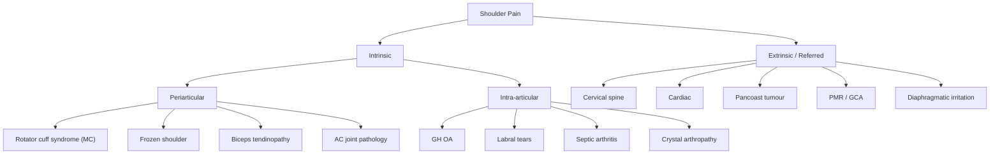

# Shoulder Pain

## Definition

Shoulder pain refers to any painful sensation experienced in or around the shoulder girdle complex. It is one of the most common musculoskeletal complaints in primary care and can arise from **intrinsic** structures (glenohumeral joint, rotator cuff, bursae, labrum, acromioclavicular joint) or be **referred** from extrinsic sources (cervical spine, thorax, diaphragm, cardiac). The term "shoulder pain" is a *presenting problem*, not a diagnosis — your job is to systematically identify the underlying pathology [1][2].

> **"Shoulder" etymologically** — from Old English *sculder*, relating to the blade-like bone (scapula). Clinically, patients often point vaguely to the deltoid region. Always clarify: is it the *joint*, the *trapezius ridge*, or the *upper arm*?

---

## Epidemiology

- **Prevalence**: Point prevalence ~7–26% in the general adult population; lifetime prevalence up to 67% [2].
- **Incidence**: ~15 new cases per 1,000 primary care consultations per year in Western data. Hong Kong data mirrors this — shoulder pain is among the top 5 MSK complaints in local general practice.
- **Age**: Peaks in the **5th–6th decade** for degenerative causes (rotator cuff tendinopathy, frozen shoulder); younger patients more commonly present with instability or traumatic injuries.
- **Sex**: Rotator cuff disease and frozen shoulder show roughly equal sex distribution (slight female predominance for frozen shoulder). AC joint OA more common in males (manual labourers, weightlifters).
- **Hong Kong context**:
  - High prevalence of **diabetes mellitus** (≈10% of adults) — a major risk factor for adhesive capsulitis [3].
  - Ageing population → increasing rotator cuff degeneration and OA.
  - Occupational factors: repetitive overhead work (construction, cleaning), prolonged computer use → subacromial impingement and cervical-related shoulder pain.
  - ***Cervical spine dysfunction*** is a leading cause of referred shoulder/arm pain in the local population [1].

---

## Risk Factors

| Category | Specific Risk Factors | Mechanism |
|---|---|---|
| **Age > 40** | Degenerative tendinopathy, OA | Cumulative microtrauma → tendon collagen disorganisation |
| **Diabetes mellitus** | Frozen shoulder (5× risk), rotator cuff tears | Glycosylation of collagen in joint capsule → fibrosis; microvascular disease → poor tendon healing |
| **Repetitive overhead activity** | SAIS, rotator cuff tears | Extrinsic compression + intrinsic tendon overload in subacromial space |
| **Trauma** | Fractures, dislocations, labral tears, acute RC tears | Direct mechanical injury |
| **Smoking** | Rotator cuff tears | Nicotine → microvascular ischaemia of tendons (watershed zone of supraspinatus) |
| **Cervical spondylosis** | Referred pain to shoulder | Degenerative disc/osteophyte compressing C5/C6 nerve roots |
| **Previous shoulder surgery / immobilisation** | Adhesive capsulitis (secondary) | Post-operative inflammation → capsular fibrosis |
| **Hypothyroidism, Dupuytren's, cardiac disease** | Frozen shoulder | Unclear; associations well-documented but pathophysiology incompletely understood |
| **Occupation** | Manual labourers, painters, swimmers | Repetitive microtrauma to subacromial structures |

---

## Anatomy and Function

Understanding shoulder pain *demands* you know the anatomy cold. The shoulder sacrifices stability for mobility — it is the most mobile joint in the body, and this mobility is the root of most pathology.

### Bony Framework

- **Clavicle** ("little key" — Latin *clavicula*): S-shaped bone connecting sternum to acromion; fractures here are extremely common.
- **Scapula** ("shovel" — Latin): flat bone with the **glenoid fossa** (shallow socket), **acromion** (roof over the supraspinatus), **coracoid process** (attachment for short head of biceps, coracobrachialis, pectoralis minor).
- **Humerus**: The humeral head articulates with the glenoid (only ~25–30% of the head contacts the glenoid at any time → inherently unstable).

### Joints

| Joint | Type | Key Points |
|---|---|---|
| **Glenohumeral (GH)** | Ball-and-socket synovial | Main shoulder joint; stabilised by labrum, capsule, ligaments, rotator cuff. Shallow glenoid → huge ROM but prone to instability. |
| **Acromioclavicular (AC)** | Plane synovial | Vulnerable to direct trauma (falls onto point of shoulder) and OA. Stabilised by AC and coracoclavicular ligaments. |
| **Sternoclavicular (SC)** | Saddle synovial | Rarely pathological but can be affected by OA, septic arthritis, dislocation (posterior SC dislocation is an emergency — can compress great vessels). |
| **Scapulothoracic** | Pseudo-joint (muscle gliding plane) | Not a true joint; the scapula glides over the posterior chest wall. Important in scapular dyskinesis. |

### The Subacromial Space

This is clinically the **most important space** for shoulder pain:
- **Roof**: Acromion + coracoacromial ligament + AC joint
- **Floor**: Humeral head (greater tuberosity)
- **Contents**: Supraspinatus tendon, long head of biceps tendon, subacromial bursa

> When anything narrows this space (hooked acromion, AC joint osteophytes, humeral head migration superiorly due to weak rotator cuff) or enlarges the contents (bursitis, calcific tendinitis, swollen tendon), you get **subacromial impingement** [3].

### The Rotator Cuff (SITS)

The rotator cuff is a group of four muscles whose tendons form a confluent "cuff" that envelops the humeral head, providing **dynamic stability** and **fine motor control**.

| Muscle | Origin | Insertion | Nerve | Action | Mnemonic |
|---|---|---|---|---|---|
| **S**upraspinatus | Supraspinous fossa | Greater tuberosity (superior facet) | Suprascapular nerve (C5,6) | Initiates abduction (first 15°), stabilises head in glenoid | **S**tarts abduction |
| **I**nfraspinatus | Infraspinous fossa | Greater tuberosity (middle facet) | Suprascapular nerve (C5,6) | External rotation (main ER) | **I**mportant for ER |
| **T**eres minor | Lateral border of scapula | Greater tuberosity (inferior facet) | Axillary nerve (C5,6) | External rotation (assists) | **T**eam with infraspinatus |
| **S**ubscapularis | Subscapular fossa | Lesser tuberosity | Upper + lower subscapular nerves (C5,6) | Internal rotation, anterior stabiliser | **S**ub = front = IR |

<Callout title="High Yield: Supraspinatus Watershed Zone">
The supraspinatus tendon has a **critical zone** near its insertion on the greater tuberosity where the blood supply is poorest (the "watershed zone" between the osseous and tendinous vascular beds). This is where degenerative tears begin. It explains why supraspinatus is the most commonly torn rotator cuff tendon.
</Callout>

### Other Key Structures

- **Glenoid labrum**: Fibrocartilaginous ring deepening the glenoid by ~50%. The **superior labrum** is the attachment of the long head of biceps → SLAP (Superior Labrum Anterior to Posterior) lesions.
- **Glenohumeral ligaments** (superior, middle, inferior): Static stabilisers, especially the **inferior glenohumeral ligament** (most important for anterior stability in abduction).
- **Coracoacromial ligament**: Forms the "roof" of the subacromial space. Acts as a last restraint against superior humeral migration in massive cuff tears.
- **Long head of biceps tendon**: Runs through the bicipital groove and into the joint, attaching to the superior glenoid labrum. A common pain generator — it is intra-articular but extra-synovial.

### Scapulothoracic Rhythm

Normal shoulder abduction involves a **2:1 ratio** of glenohumeral to scapulothoracic motion. For every 3° of abduction, 2° occur at the GH joint and 1° at the scapulothoracic articulation. Disruption of this rhythm (scapular dyskinesis) is seen in rotator cuff disease and can perpetuate impingement.

### Nerve Supply

- **Axillary nerve (C5,6)**: wraps around the surgical neck of the humerus. At risk during shoulder dislocation and proximal humeral fractures. Supplies deltoid and teres minor. **Regimental badge area** sensory loss if damaged.
- **Suprascapular nerve (C5,6)**: passes through suprascapular notch → infraspinous fossa via spinoglenoid notch. At risk of entrapment → supraspinatus/infraspinatus wasting.
- **Long thoracic nerve (C5,6,7)**: supplies serratus anterior. Damage → **winging of scapula** [4].

### Referred Pain Patterns

| Source | Referred to Shoulder Because... |
|---|---|
| **C5 dermatome (cervical spine)** | C5 supplies the lateral deltoid region; cervical radiculopathy at C4/5 or C5/6 disc → pain mimicking intrinsic shoulder pathology |
| **Diaphragm (C3,4,5)** | Phrenic nerve → diaphragm is C3-5. Subdiaphragmatic irritation (e.g., splenic rupture, subphrenic abscess) → **shoulder tip pain** (Kehr's sign) |
| **Cardiac** | Referred pain from myocardial ischaemia via cardiac sympathetic afferents → T1-4 spinal segments → can present as left shoulder/arm pain |
| ***Pancoast tumour*** | Lung apex tumour invading brachial plexus (C8-T1) → shoulder/arm pain + Horner's syndrome [1] |

---

## Etiology (with Focus on Hong Kong)

The causes of shoulder pain can be broadly categorised as **intrinsic** (from the shoulder itself) or **extrinsic** (referred). In a Hong Kong clinical context, the most common causes align with local demographics — high DM prevalence, ageing population, and occupational factors.

### A. Intrinsic Causes (Periarticular — Most Common)

#### 1. Rotator Cuff Syndrome (Most Common Cause) [3]

***Rotator cuff syndrome*** is a **continuum of disease** including [3]:
- ***Subacromial impingement***
- ***Subcoracoid impingement***
- ***Calcific tendonitis***
- ***Rotator cuff tear***

**Pathophysiology of subacromial impingement syndrome (SAIS)**:

Two broad mechanisms conspire to damage the supraspinatus tendon:

**a) Intrinsic degeneration** (from within the tendon itself):
- ***Repetitive microtrauma*** → accumulated collagen fibre damage exceeds repair capacity
- ***Degenerative tendinopathy*** → the watershed zone of supraspinatus has poor vascularity → hypo-perfusion → failed healing → tendinosis (disorganised collagen, mucoid degeneration, neovascularisation)
- ***Rotator cuff muscle weakness*** → inability to depress the humeral head → the head migrates superiorly → narrows the subacromial space → worsens impingement (a vicious cycle)

**b) Extrinsic compression** (from structures above or around the tendon):
- ***Humeral head***: glenohumeral instability → superior subluxation of the head → pinches supraspinatus against the acromion
- ***Acromion***: anatomical variation — **Bigliani classification**: Type I (flat), Type II (curved), ***Type III (hooked)*** → hooked acromion narrows the subacromial space the most
- ***Coracoacromial ligament***: hypertrophy → narrows space
- ***ACJ***: osteoarthritis → inferior osteophytes project into the subacromial space [3]

> Think of it as a sandwich: the supraspinatus tendon is compressed between the "roof" (acromion, CA ligament, AC joint) and the "floor" (humeral head). Anything that brings these closer together causes impingement.

**Clinical features of SAIS** [3]:
- ***Progressive pain in anterosuperior aspect of shoulder: exacerbated by abduction, relieved by rest***
- ***Limited ROM in forward flexion***
- ***Painful arc (60–120°)*** — this is the range where the supraspinatus tendon is maximally compressed under the acromion. Below 60°, the greater tuberosity hasn't reached the acromion yet; above 120°, it has passed under and out the other side.
- ***Impingement signs: Neer's impingement sign, Hawkins sign***
  - **Neer's sign**: Examiner stabilises scapula with one hand and passively forward flexes the arm with the other. Positive = pain. The greater tuberosity is jammed against the anterior acromion.
  - **Hawkins sign**: Arm forward flexed to 90°, then internally rotated. Positive = pain. The supraspinatus tendon is squeezed against the coracoacromial ligament.

#### 2. Rotator Cuff Tear [3]

**Pathophysiology**: ***chronic impingement, degenerative, trauma, iatrogenic (shoulder surgery)*** [3]

The vast majority of tears begin in the supraspinatus tendon at its watershed zone and propagate posteriorly into infraspinatus.

**Clinical features** [3]:
- ***Pain over lateral aspect of shoulder***
- ***Inability to perform overhead activities***
- Signs:
  - ***Muscle atrophy: supraspinatus & infraspinatus*** — visible in the supraspinous and infraspinous fossae when viewed from behind [4]
  - ***Loss of active ROM (usually SIT) but intact passive ROM*** — this is the key distinguishing feature from frozen shoulder. The joint itself is not restricted; the motor unit (tendon) is broken. Passive ROM is preserved because the joint capsule is normal.
  - ***Drop arm sign*** — patient cannot slowly lower the arm from full abduction. The arm "drops" because the torn supraspinatus cannot eccentrically control the descent.

**Classification** [3]:
- ***Acute ( < 3 months) vs chronic ( > 3 months)***
- ***Partial thickness vs full thickness***
  - ***Full thickness: small ( < 1cm), medium (1–3cm), large (3–5cm), massive ( > 5cm or multiple tendons)***

<Callout title="Active vs Passive ROM — The Key Clinical Distinction" type="idea">
- **Rotator cuff tear**: Active ROM ↓, Passive ROM **intact** (the joint is fine; the motor is broken)
- **Frozen shoulder**: Both Active AND Passive ROM ↓ (the joint capsule itself is contracted and stiff)
- **Impingement**: Active ROM painful in the "arc" (60–120°), Passive ROM may reproduce pain but is not globally restricted

This single clinical observation — comparing active vs passive ROM — is the most important bedside test for shoulder pain. Get it right and you're 80% of the way to the diagnosis.
</Callout>

#### 3. Frozen Shoulder / Adhesive Capsulitis [3]

**Definition**: ***A shoulder condition where active and passive ROM is lost without clear underlying cause.*** Adhesive capsulitis = the glenohumeral joint capsule becomes contracted and adherent to the humeral head [3].

"Frozen shoulder" → the name tells you: the shoulder is literally "frozen" — cannot move in any direction, actively or passively.

**Pathophysiology**:
- **Primary (idiopathic)**: associated with ***DM*** [3]. The mechanism is thought to involve:
  - Chronic low-grade inflammation of the joint capsule (especially the **rotator interval** and **axillary recess**)
  - Fibroblast proliferation → excessive collagen deposition → capsular thickening and contraction
  - In DM: advanced glycation end-products (AGEs) cross-link collagen in the capsule → stiffening and fibrosis. This is the same process that causes Dupuytren's contracture and trigger finger in diabetics.
- **Secondary** [3]: ***Rotator cuff syndrome, Biceps tendinopathy, Post-trauma, Post-surgery: shoulder surgery, axillary LN dissection***
  - Any process that leads to shoulder immobilisation or capsular inflammation can trigger adhesive capsulitis.

**Clinical features** [3]:

***Disease course*** — classically described in **three phases**:

| Phase | Duration | Predominant Feature | Pathophysiology |
|---|---|---|---|
| ***Freezing phase (pain)*** | ***2–9 months*** | Severe pain, especially at night. Gradual ↓ROM | Active synovitis and capsular inflammation; inflammatory cytokines stimulate nociceptors |
| ***Frozen phase (pain + stiffness)*** | ***4–12 months*** | Pain may decrease but stiffness is maximal | Fibrosis and contraction of the capsule; inflammation subsiding |
| ***Thawing phase (stiffness)*** | ***5–24 months*** | Gradual return of motion; ***may not completely resolve spontaneously*** | Slow remodelling and stretching of the fibrotic capsule |

Signs [3]:
- ***Joint tenderness and stiffness***
- ***Muscle wasting (e.g. deltoid)*** — from disuse atrophy due to pain and restricted movement
- ***↓ROM (esp. ER/IR and flexion)*** — **external rotation** is characteristically the most restricted and the earliest to be limited. Why? Because the **inferior glenohumeral ligament and axillary recess** (which are the most affected by capsular contracture) are the structures that resist ER when the arm is at the side.
- Night pain and rest pain → ***inflamed capsule*** [2]

<Callout title="Frozen Shoulder and DM — High Yield for HKU" type="error">
Always check **HbA1c** in any patient presenting with frozen shoulder. Up to 20% of diabetic patients develop adhesive capsulitis, and it may be the presenting complaint that leads to a new DM diagnosis. In Hong Kong, where DM prevalence is ~10%, this is not a rare scenario. ***Check Hstix*** [2].
</Callout>

#### 4. Biceps Tendinopathy [2][3]

"Tendinopathy" → "tendon" + "pathos" (suffering) — a painful, degenerative tendon condition.

***Tendinopathy: variety of pathological changes that result in painful, swollen and weakened tendon (↑risk of rupture)*** [2]

**Pathophysiology**: The long head of biceps tendon runs through the bicipital groove and is subject to impingement, friction, and degeneration — especially in the setting of concurrent rotator cuff disease (the biceps tendon is in the same "neighbourhood" as the supraspinatus).

**Clinical features** [2]:
- ***Pain worsened with contracting biceps (e.g. Speed test, Yergason test) and relieved with rest***
  - **Speed test**: Arm forward flexed 60°, elbow extended, forearm supinated. Resist downward pressure → pain in bicipital groove = positive.
  - **Yergason test**: Elbow flexed 90°, forearm pronated. Patient supinates against resistance → pain in bicipital groove = positive.
- ***Localized tenderness*** (over the bicipital groove anteriorly)
- ***Disuse atrophy***

**Biceps tendon rupture** [2]:
- ***Sudden onset pain, weakness with "pop" sound***
- ***Occur at sudden forced extension of flexed elbow***
- ***Popeye sign***: bulging of biceps muscle belly upon contraction (the torn tendon allows the muscle belly to retract distally, forming a ball-like bulge)
- ***Elbow flexion and supination intact (due to brachialis & supinator)*** — the biceps is not the only elbow flexor or forearm supinator, so function is partially preserved.

#### 5. Acromioclavicular (AC) Joint Pathology

- **OA of AC joint**: Very common in older adults and manual workers. ***More localised tenderness*** directly over the AC joint [2]. Pain with cross-body adduction (scarf test). Crepitus on palpation during arm movement.
- **AC joint separation/dislocation**: From falls onto the point of the shoulder. Classified by Rockwood (I–VI).

#### 6. Glenohumeral OA

- Less common than hip/knee OA because the shoulder is not a weight-bearing joint [3]. When present, think of secondary causes: post-traumatic, post-instability surgery, AVN, cuff tear arthropathy.

#### 7. Glenohumeral Instability

- More common in younger patients. Recurrent anterior dislocation (from traumatic subluxation → Bankart lesion of anterior-inferior labrum). Presents with apprehension sign positive.

#### 8. Calcific Tendonitis

- Calcium hydroxyapatite deposits within the rotator cuff tendons (usually supraspinatus). Can cause acute severe shoulder pain — the **resorptive phase** triggers intense inflammation. X-ray shows calcific deposits.

### B. Intrinsic Causes (Intra-articular)

- **Labral tears** (SLAP lesions, Bankart lesions)
- **Septic arthritis of the shoulder** [5] — ***hot, swollen tender joint = septic arthritis until proven otherwise*** [5]. Less common than knee but must not be missed. Most common organism: *S. aureus*.
- **Crystal arthropathy**: Gout (unusual site), pseudogout (calcium pyrophosphate deposition)

### C. Extrinsic / Referred Causes

These are the causes that **Murtagh's diagnostic strategy** emphasises you must not miss [1]:

#### ***Cardiovascular*** [1]:
- ***Angina (referred)*** — Cardiac ischaemia → pain referred to left shoulder/arm via T1-4 sympathetic afferents [6]
- ***Myocardial infarction*** — same mechanism as angina but more severe and prolonged
- ***Axillary vein thrombosis*** — upper extremity DVT; rare but important. Think of it in patients with central lines, Paget-Schroetter syndrome (effort thrombosis in young athletes)
- ***Arm claudication (left arm)*** — from subclavian artery stenosis [1]

#### ***Infection*** [1]:
- ***Septic arthritis (shoulder/elbow)***
- ***Osteomyelitis***
- ***Infections of tendon sheath and fascial spaces of hand***
- ***Sporotrichosis ('gardener's arm')*** — dimorphic fungus *Sporothrix schenckii*; ascending nodular lymphangitis after thorn prick

#### ***Neoplasia/Cancer*** [1]:
- ***Pancoast tumour*** — apical lung carcinoma invading the brachial plexus (C8-T1) and cervical sympathetic chain → shoulder/arm pain + ***Horner's syndrome*** (miosis, ptosis, anhidrosis) + hand small muscle wasting [1][7]
- ***Bone tumours (rare)*** [1] — primary or metastatic to proximal humerus

#### Cervical Spine [1][8]:
- ***Dysfunction of the cervical spine (lower)*** is listed as the #1 **probability diagnosis** for arm and hand pain [1]
- Cervical radiculopathy (C5/6): ***sharp, stabbing pain, worse on coughing ± constant deep ache radiating over shoulders and down the arm*** [8]
- Distinguished from intrinsic shoulder pathology by: neck pain, pain distribution in a dermatomal pattern, neurological signs (weakness, sensory loss, reflex changes), positive Spurling test

#### Other Referred Causes:
- **Diaphragmatic irritation** → shoulder tip pain (C3-5 phrenic nerve)
- **Myopericarditis** → retrosternal pain radiating to shoulder/neck [6]
- **Polymyalgia rheumatica (PMR)** → bilateral shoulder and pelvic girdle pain/stiffness in patients > 50; associated with giant cell arteritis [8][9]

<Callout title="Must-Not-Miss Diagnoses — Murtagh's Framework" type="error">
***Serious disorders not to be missed*** for arm/shoulder pain [1]:
- **Cardiovascular**: ***angina, MI, axillary vein thrombosis, arm claudication***
- **Infection**: ***septic arthritis, osteomyelitis, tendon sheath infections, sporotrichosis***
- **Neoplasia**: ***Pancoast tumour, bone tumours***

Always screen for red flags: constitutional symptoms (weight loss, fever, night sweats), history of cancer, unrelenting night pain not positional, neurological deficits.
</Callout>

---

## Relevant Classification Systems

### By Anatomical Source

### By Active vs Passive ROM (The Bedside Classification)

| Pattern | Active ROM | Passive ROM | Think... |
|---|---|---|---|
| **Painful arc** | Painful 60–120° | Less painful but may reproduce | SAIS, rotator cuff tendinopathy |
| **Active ↓, Passive intact** | ↓ | Normal | Rotator cuff tear (motor is broken, joint is fine) |
| **Both ↓ (capsular pattern)** | ↓ | ↓ equally | Frozen shoulder, GH OA, septic arthritis |
| **Normal ROM, localised pain** | Full but painful | Full | AC joint OA, biceps tendinopathy |
| **Neurological deficit + pain** | Weakness in specific myotome | Normal | Cervical radiculopathy |

### Neer's Classification of Impingement (Historical but Still Referenced)

- **Stage I**: Oedema and haemorrhage of subacromial bursa/tendon (age < 25, reversible)
- **Stage II**: Fibrosis and tendinitis (age 25–40, recurrent pain)
- **Stage III**: Rotator cuff tear, bony changes (age > 40, progressive disability)

---

## Clinical Features

### A. Symptoms (with Pathophysiological Basis)

#### 1. Pain

| Feature | Associated Condition | Pathophysiological Explanation |
|---|---|---|
| ***Pain during activity only***, relieved by rest | ***Rotator cuff syndrome (MC)*** [2] | Mechanical compression of the inflamed tendon occurs only during movement through the impingement zone |
| ***Painful arc (60–120°)*** | SAIS | Greater tuberosity passes under the acromion in this range, compressing the supraspinatus tendon |
| **Night pain / rest pain** | ***Frozen shoulder*** [2], rotator cuff tear (large) | Capsular inflammation (frozen shoulder) → cytokine release continues at rest. In RC tears, lying on the affected side compresses the torn tendon against the acromion. |
| **Pain with overhead activities** | RC tear, SAIS | Overhead position maximises subacromial compression |
| ***Pain worsened with contracting biceps*** | ***Biceps tendinopathy*** [2] | Active contraction of the biceps loads the inflamed tendon in the bicipital groove |
| ***More localised tenderness*** | ***AC joint arthritis, biceps tendinopathy*** [2] | Pathology is in a superficial, discrete structure rather than the deep rotator cuff |
| ***Neck pain, radiating pain*** | ***Cervical radiculopathy*** [2] | Nerve root compression at the cervical spine → dermatomal pain distribution down the arm |
| **Sudden, severe pain with "pop"** | Biceps rupture, acute large RC tear | Sudden structural failure of tendon |
| **Shoulder tip pain** | Diaphragmatic irritation (e.g., ruptured ectopic, splenic rupture) | Phrenic nerve (C3-5) shares spinal segments with supraclavicular nerve → brain "misrefers" diaphragmatic pain to the shoulder tip |
| ***Symptoms change over time (pain → pain + stiffness → stiffness → resolution)*** | ***Frozen shoulder*** [2] | Progression through inflammatory → fibrotic → remodelling phases |

#### 2. Stiffness

| Feature | Associated Condition | Pathophysiological Explanation |
|---|---|---|
| **Global stiffness (all directions)** | Frozen shoulder, GH OA, septic arthritis | Capsular contracture (frozen) or joint destruction (OA/septic) restricts motion in a **capsular pattern** (ER > abduction > IR) |
| **Morning stiffness > 30 min** | Inflammatory arthritis (RA, PMR) | Overnight accumulation of inflammatory mediators in the synovium; relieved by activity-driven lymphatic drainage |
| **Stiffness without significant pain** | Late ("thawing") phase of frozen shoulder | Fibrosis has replaced inflammation; pain receptors are less stimulated but the physical restriction persists |

#### 3. Weakness

| Feature | Associated Condition | Pathophysiological Explanation |
|---|---|---|
| **Weakness in abduction/ER** | Rotator cuff tear | Structural discontinuity of the tendon → force generated by the muscle cannot be transmitted to the bone |
| **Weakness in specific myotome** | Cervical radiculopathy | Motor nerve root compression → LMN weakness in the corresponding muscle group |
| **Proximal symmetrical weakness** | PMR / polymyositis | PMR: pain inhibition of movement (not true weakness). Polymyositis: inflammatory destruction of muscle fibres [10] |

#### 4. Instability / "Giving Way"

- Recurrent subluxation or dislocation — typically anterior. History of initial traumatic dislocation, then recurrence with progressively less force. Due to Bankart lesion (anterior-inferior labrum torn) ± Hill-Sachs lesion (posterior humeral head compression fracture).

#### 5. Other Symptoms

- **Paraesthesia / numbness in the arm/hand**: Suggests cervical radiculopathy or nerve entrapment [1][8]
- **Constitutional symptoms** (fever, weight loss, night sweats): Red flags for infection, malignancy, inflammatory arthritis
- **Clicking / catching**: Labral tear, loose body

### B. Signs (with Pathophysiological Basis)

#### General Inspection [4]

- ***Scars, sinuses, skin changes*** [4]
- ***Asymmetry*** (best seen from behind) [4]
- ***Squaring of shoulder*** → loss of normal deltoid contour → ***dislocation of glenohumeral joint*** [4]
- ***Winging of scapula*** → loss of serratus anterior (long thoracic nerve palsy) → scapula protrudes posteriorly → ***exaggerated by pushing against wall with arms*** [4]
- ***Muscle wasting: esp note supraspinatus and infraspinatus wasting indicating rotator cuff pathologies*** [4]
- ***Joint swelling: typically seen anteriorly*** [4]
- ***Position: think anterior/posterior dislocation if ER/IR respectively*** [4]

#### Inspection — Anterior [4]

- ***SCJ: prominence (subluxation)***
- ***Clavicle: deformity (old fracture)***
- ***ACJ: prominence (OA, subluxation)***
- ***Deltoid: wasting (shoulder disuse, axillary n. palsy)***
- ***Pectoralis: wasting (disuse)***

#### Inspection — Posterior [4]

- ***Scapula: Winging (serratus a. palsy), Small and high (Sprengel's shoulder, Klippel-Feil syndrome)***
- ***Supra and infraspinous fossae: Wasting (rotator cuff pathology)***

#### Palpation [4]

- ***Feel joint temperature*** — increased in infection/inflammation
- ***Sternum and SCJ: tenderness***
- ***Clavicle: tenderness*** — consider ***SCJ dislocation, infection (esp TB), tumour (rare), radionecrosis (CA breast)*** [4]
- ***ACJ: tenderness (recent dislocation, OA), lipping/crepitus during abduction (OA)*** [4]
- ***Paxinos sign***: approach from behind → hook contralateral thumb under posterolateral acromial margin and press anterosuperiorly + push clavicle inferiorly → positive = pain → ***indicates OA of ACJ*** [4]
- **Bicipital groove**: Tenderness = biceps tendinopathy

#### Special Tests — Impingement

| Test | Technique | Positive Finding | What it Tests |
|---|---|---|---|
| **Neer's sign** | Passive forward flexion with scapula stabilised | Pain | Supraspinatus impingement under anterior acromion |
| **Hawkins sign** | 90° forward flexion then internal rotation | Pain | Supraspinatus impingement under CA ligament |
| **Painful arc** | Active abduction | Pain at 60–120° | Subacromial impingement |

#### Special Tests — Rotator Cuff

| Test | Technique | Positive Finding | Muscle Tested |
|---|---|---|---|
| **Empty can (Jobe's)** | Arms 90° abduction, 30° forward flexion, thumbs down. Resist downward pressure | Weakness or pain | Supraspinatus |
| **External rotation lag sign** | Examiner places arm at 90° ER, patient tries to hold | Arm falls into IR | Infraspinatus |
| **Lift-off test (Gerber)** | Hand behind back, lift hand off back against resistance | Cannot lift off | Subscapularis |
| **Belly press test** | Press hand against belly; if elbow drops behind trunk | Positive | Subscapularis |
| ***Drop arm sign*** | Lower arm slowly from full abduction | ***Arm drops*** | Supraspinatus (large tear) [3] |
| **Hornblower's sign** | Arm 90° abduction, 90° ER. Resist IR | Cannot hold | Teres minor (indicates massive posterosuperior tear) |

#### Special Tests — Biceps

| Test | Technique | Positive Finding |
|---|---|---|
| **Speed test** | Arm forward flexed 60°, elbow extended, supinated. Resist flexion | Pain in bicipital groove |
| **Yergason test** | Elbow 90° flexed, forearm pronated. Resist supination | Pain in bicipital groove |
| ***Popeye sign*** | Flexion of elbow against resistance | ***Bulging of biceps muscle belly*** (rupture) [2] |

#### Special Tests — AC Joint

| Test | Technique | Positive Finding |
|---|---|---|
| **Scarf / Cross-body adduction test** | Arm forward flexed 90°, adduct across body | Pain over AC joint |
| ***Paxinos sign*** | As described above | ***Pain = OA of ACJ*** [4] |

#### Special Tests — Instability

| Test | Technique | Positive Finding |
|---|---|---|
| **Apprehension test** | Arm abducted 90°, externally rotated | Patient feels impending dislocation → apprehension |
| **Relocation test** | Posterior force on humeral head during apprehension | Relief of apprehension |
| **Sulcus sign** | Downward traction on arm | Visible gap below acromion → inferior instability |

#### Special Tests — Cervical Spine [8]

| Test | Technique | Positive Finding |
|---|---|---|
| ***Spurling manoeuvre*** | ***Extension + ipsilateral rotation of neck followed by downward pressure*** | ***Limb pain/paraesthesia due to disc bulging + narrowing of ipsilateral IV foramina*** [8] |
| ***Shoulder abduction relief test*** | ***Resting symptomatic arm on head*** | ***↓↓ radicular S/S*** [8] (abduction opens the foramen → decompresses the root) |

---

## Summary Table: Key Differential Features at Presentation

| Condition | Pain Character | ROM Pattern | Key Sign(s) | Key Association |
|---|---|---|---|---|
| **SAIS** | Anterosuperior, worse with abduction | Painful arc 60–120° | Neer/Hawkins positive | Overhead workers |
| **RC tear** | Lateral, worse overhead | Active ↓, Passive **intact** | Drop arm, weakness, wasting | Age > 40, trauma |
| **Frozen shoulder** | Diffuse, night pain, phases | Active **AND** Passive ↓ (capsular pattern) | Global restriction, esp. ER | **DM**, thyroid disease |
| **Biceps tendinopathy** | Anterior (bicipital groove) | Normal or mildly ↓ | Speed/Yergason positive | Concurrent RC disease |
| **AC joint OA** | Superior, localised to AC joint | Full ROM or painful end-range | Cross-body adduction, Paxinos | Manual labour, weightlifting |
| **Cervical radiculopathy** | Neck → shoulder → arm (dermatomal) | Full shoulder ROM | Spurling positive, neurological signs | Spondylosis, disc herniation |
| **Septic arthritis** | Severe, constant | Both ↓ (pain + effusion) | Hot swollen joint, fever | Immunosuppression, DM, RA |
| **Pancoast tumour** | Shoulder + arm + hand | May be normal | Horner's, T1 wasting | Smoker, weight loss |
| **PMR** | Bilateral shoulder + pelvic girdle | Painful but full passive ROM | No true weakness | Age > 50, ↑ESR |

---

<Callout title="High Yield Summary">

1. **Most common cause** of shoulder pain = **rotator cuff syndrome** (a continuum from impingement → tendinopathy → tear).
2. **Active vs Passive ROM** is the single most important bedside distinction: Active ↓ only → cuff tear; Both ↓ → frozen shoulder/OA/septic.
3. **Frozen shoulder**: Insidious onset, **DM** association, three phases (freezing → frozen → thawing), ER most restricted. Always check HbA1c.
4. **Painful arc (60–120°)** = subacromial impingement until proven otherwise.
5. **Drop arm sign** = large rotator cuff tear (supraspinatus).
6. **Popeye sign** = biceps tendon rupture.
7. **Must not miss**: angina/MI (left shoulder), Pancoast tumour (Horner's + shoulder pain + T1 wasting in smoker), septic arthritis (hot swollen joint = septic until proven otherwise), cervical radiculopathy.
8. **Cervical radiculopathy** can perfectly mimic intrinsic shoulder pain — always examine the neck. Spurling test and shoulder abduction relief test are key.
9. **Hong Kong relevance**: High DM prevalence → high frozen shoulder prevalence. High smoking rates historically → lung cancer/Pancoast. Ageing population → degenerative cuff disease.
10. **Murtagh's probability diagnosis** for arm/hand pain: cervical spine dysfunction, shoulder disorders, epicondylitis, wrist overuse, CTS, OA of thumb/DIP [1].

</Callout>

---

<ActiveRecallQuiz
  title="Active Recall - Shoulder Pain (Definition to Clinical Features)"
  items={[
    {
      question: "A 55-year-old diabetic woman presents with 6 months of progressive shoulder stiffness. On examination, both active and passive external rotation are severely restricted. What is the most likely diagnosis, and which phase of the disease is she in?",
      markscheme: "Frozen shoulder (adhesive capsulitis). Given pain AND stiffness, she is in the Frozen phase (4-12 months). DM is the major risk factor due to glycosylation of capsular collagen. ER is the earliest and most restricted movement."
    },
    {
      question: "Explain why the painful arc in subacromial impingement syndrome occurs specifically between 60 and 120 degrees of abduction.",
      markscheme: "Between 60-120 degrees, the greater tuberosity of the humerus passes directly under the acromion, maximally compressing the supraspinatus tendon and subacromial bursa. Below 60 degrees the tuberosity has not yet reached the acromion; above 120 degrees it has passed through and beyond."
    },
    {
      question: "A patient with shoulder pain has reduced active ROM but full passive ROM. Another patient has both active and passive ROM reduced. What pathological process underlies each pattern?",
      markscheme: "Reduced active, full passive = motor unit failure (e.g., rotator cuff tear) - the joint capsule is normal but the tendon is torn so the muscle cannot generate movement. Both reduced = capsular restriction (e.g., frozen shoulder, GH OA, septic arthritis) - the joint capsule itself is contracted, inflamed, or destroyed."
    },
    {
      question: "Name the four rotator cuff muscles (SITS), their primary actions, and explain why supraspinatus is the most commonly torn.",
      markscheme: "Supraspinatus (abduction initiation), Infraspinatus (external rotation), Teres minor (external rotation), Subscapularis (internal rotation). Supraspinatus is most commonly torn because: (1) it passes through the subacromial space where it is mechanically compressed, and (2) its tendon has a watershed zone near the insertion with poor blood supply, making it vulnerable to degenerative failure."
    },
    {
      question: "A 60-year-old male smoker presents with right shoulder pain, wasting of the small muscles of the hand, and ipsilateral ptosis. What is the diagnosis and what structures are involved?",
      markscheme: "Pancoast tumour (apical lung carcinoma). Invades: (1) lower brachial plexus (C8-T1) causing shoulder/arm pain and T1 myotome hand muscle wasting; (2) cervical sympathetic chain/stellate ganglion causing Horner syndrome (miosis, ptosis, anhidrosis)."
    },
    {
      question: "List three 'serious disorders not to be missed' in a patient presenting with shoulder/arm pain according to Murtagh's framework, and briefly explain how each causes shoulder pain.",
      markscheme: "1. Angina/MI - referred pain via T1-4 cardiac sympathetic afferents to left shoulder/arm. 2. Pancoast tumour - direct invasion of brachial plexus by apical lung cancer. 3. Septic arthritis - bacterial infection of the glenohumeral joint causing inflammation, effusion and pain. Also accept: axillary vein thrombosis, osteomyelitis."
    }
  ]}
/>

---

## References

[1] Lecture slides: murtagh merge.pdf (p19 — Arm and hand pain)
[2] Senior notes: maxim.md (sections 3.3–3.6: Shoulder pain, Biceps tendinopathy, Rotator cuff syndrome, Frozen shoulder)
[3] Senior notes: maxim.md (sections 3.5–3.6: Rotator cuff syndrome, Frozen shoulder)
[4] Senior notes: Ryan Ho Rheumatology.pdf (p11 — Shoulder examination: Look, Feel)
[5] Senior notes: Ryan Ho Rheumatology.pdf (p67 — Septic arthritis)
[6] Senior notes: Ryan Ho Cardiology.pdf (p54–57 — Chest pain, Angina, Pericarditis)
[7] Senior notes: Ryan Ho Respiratory.pdf (p141 — Lung cancer / Pancoast tumour)
[8] Senior notes: Ryan Ho Neurology.pdf (p172–173 — Cervical spondylosis, radiculopathy)
[9] Senior notes: Ryan Ho Neurology.pdf (p65 — Giant cell arteritis / PMR)
[10] Senior notes: Ryan Ho Rheumatology.pdf (p90 — Polymyositis and dermatomyositis)
