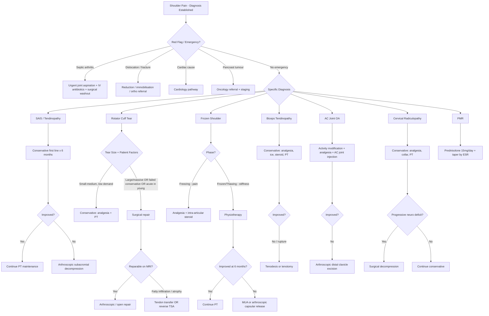

## Management of Shoulder Pain

The overarching principle: **most shoulder pain is managed conservatively first**. Surgery is reserved for specific indications — typically failed conservative treatment or structural lesions that will not heal without mechanical repair. The management approach differs significantly depending on the specific diagnosis, so we must discuss each condition individually. However, there are shared therapeutic modalities that cut across all diagnoses.

---

### General Management Algorithm

---

### Shared Treatment Modalities

Before diving into condition-specific management, let's understand the common tools in our therapeutic arsenal.

#### A. Analgesia

| Agent | Mechanism | Indication | Key Points |
|---|---|---|---|
| **Paracetamol** | Central COX inhibition + serotonergic pathways (exact mechanism debated); raises pain threshold | First-line for mild-moderate shoulder pain across all diagnoses | Safe in most patients. Max 4g/day. Hepatotoxic in overdose. Does NOT reduce inflammation — pure analgesic. |
| **NSAIDs** (e.g., naproxen, ibuprofen, diclofenac) | Inhibit cyclooxygenase (COX-1 and COX-2) → ↓prostaglandin synthesis → ↓inflammation, pain, and fever | ***First line in symptomatic*** inflammatory shoulder conditions (impingement, tendinopathy, inflammatory arthritis) [14] | Gastrointestinal side effects (COX-1 inhibition → ↓protective mucosal prostaglandins → ulceration); renal vasoconstriction (prostaglandins normally vasodilate afferent arteriole → NSAIDs remove this → ↓GFR); ↑CVS risk (especially COX-2 selective) [14]. **C/I**: active peptic ulcer, renal impairment, heart failure, aspirin-exacerbated respiratory disease. Co-prescribe PPI if > 65 or Hx of ulcer. |
| **COX-2 selective inhibitors** (e.g., celecoxib) | Selectively inhibit COX-2 (the inducible isoform at sites of inflammation) → ↓GI side effects while retaining anti-inflammatory effect | Alternative to traditional NSAIDs when GI risk is high [14] | Lower GI toxicity but similar/slightly increased CVS risk. Still C/I in severe renal impairment and heart failure. |
| **Opioids** (e.g., tramadol, codeine) | Bind μ-opioid receptors in CNS → ↓pain perception | Short-term use for severe acute pain (e.g., acute calcific tendonitis, post-operative) | Not recommended for chronic shoulder pain — risk of dependence, tolerance, hyperalgesia. Tramadol also inhibits serotonin/noradrenaline reuptake. |
| **Neuropathic agents** (e.g., gabapentin, pregabalin) | Bind α2δ subunit of voltage-gated calcium channels → ↓excitatory neurotransmitter release | Cervical radiculopathy with neuropathic pain component | Sedation, dizziness. Useful adjunct when pain has a burning/shooting/electric quality. |

#### B. Corticosteroid Injections

Corticosteroids are potent anti-inflammatory agents that work by inhibiting phospholipase A2 → blocking the entire arachidonic acid cascade (both COX and lipoxygenase pathways) → profound ↓in prostaglandins, leukotrienes, and inflammatory cytokines. When injected locally, they deliver a high concentration directly to the site of inflammation with minimal systemic effects.

| Injection Site | Indication | Technique Principle | Key Caveats |
|---|---|---|---|
| **Subacromial space** | SAIS, subacromial bursitis, rotator cuff tendinopathy | Needle enters laterally below the acromion into the subacromial bursa; can be landmark-guided or USG-guided | Provides short-term (weeks–months) pain relief. Does NOT repair the tendon. Repeated injections ( > 3 per year) may weaken tendon collagen → ↑risk of rupture. |
| ***Intra-articular (at rotator interval)*** [3] | ***Frozen shoulder: only during pain phase*** [3] | Needle enters the GH joint via the rotator interval (between supraspinatus and subscapularis anteriorly) | Targets the inflamed capsule. Effective in the **freezing phase** when inflammation predominates. Less useful in the frozen/thawing phase when fibrosis (not inflammation) is the problem [3]. |
| **AC joint** | AC joint OA | Small volume (1–2 mL) injected directly into the AC joint (palpable notch at top of shoulder) | Diagnostic AND therapeutic — pain relief confirms the AC joint as the pain source. |
| **Bicipital groove** | Biceps tendinopathy | Injected along the tendon sheath, NOT into the tendon substance | **Never inject directly into a tendon** — risk of tendon rupture. Peritendinous injection only. |

**General contraindications to steroid injection**: Active infection (local or systemic), overlying skin infection, uncontrolled DM (transient hyperglycaemia for 24–48h after injection), bleeding diathesis/anticoagulation (relative C/I).

#### C. Physiotherapy (PT)

Physiotherapy is the cornerstone of conservative management for virtually all shoulder conditions. The specific programme varies:

| Condition | PT Focus | Why This Works |
|---|---|---|
| **SAIS / tendinopathy** | ***Rotator cuff strengthening*** [3] (especially infraspinatus, subscapularis, teres minor) + scapular stabiliser exercises | Strong rotator cuff muscles actively depress the humeral head during abduction → ↑subacromial space → ↓impingement. Scapular stability ensures optimal glenoid orientation. |
| **Rotator cuff tear** | Deltoid and periscapular strengthening; compensatory movement training | Cannot restore the torn tendon non-operatively, but can compensate by strengthening surrounding muscles to partially restore function |
| **Frozen shoulder** | ***PT: after inflammation/pain subsides*** [3]. Gentle passive stretching → graduated active ROM | In the freezing phase, aggressive PT worsens pain and inflammation → counterproductive. Once pain settles (frozen/thawing phase), stretching helps remodel and lengthen the fibrotic capsule. |
| **Cervical radiculopathy** | Cervical traction, postural correction, isometric neck strengthening | Traction opens the intervertebral foramina → decompresses the nerve root. Strengthening reduces dynamic loading on degenerate segments. |

<Callout title="Timing Matters in Frozen Shoulder" type="error">
A common mistake is to prescribe aggressive physiotherapy during the **freezing (pain) phase** of adhesive capsulitis. This worsens pain, causes guarding, and can paradoxically accelerate capsular fibrosis. ***Analgesics/intra-articular steroid during the pain phase first*** [3], ***then PT after inflammation/pain subsides*** [3]. Think of it like this: you wouldn't aggressively mobilise an acutely inflamed joint — you'd calm the fire first, then stretch the scar tissue.
</Callout>

#### D. Other Conservative Modalities

| Modality | Indication | Mechanism |
|---|---|---|
| **Ice therapy** | Acute pain/inflammation (first 48–72h), post-injection | Vasoconstriction → ↓oedema and inflammatory mediator delivery; ↓nerve conduction velocity → ↓pain |
| **Heat therapy** | Chronic stiffness (frozen shoulder thawing phase), before PT sessions | Vasodilation → ↑blood flow and nutrient delivery; ↓muscle spasm; ↑collagen extensibility → easier to stretch |
| **Activity modification** | All shoulder conditions | Avoid provocative movements (overhead work, heavy lifting) during the acute phase. Ergonomic assessment for occupational causes. |
| **Cervical collar** | Cervical radiculopathy | Restricts neck movement → ↓mechanical irritation of the compressed nerve root. Short-term only (2 weeks) — prolonged use → cervical muscle atrophy and stiffness. |
| **Splinting / sling** | Post-operative, post-dislocation | Immobilisation allows healing of repaired structures. Must be balanced against risk of adhesive capsulitis from prolonged immobility. |

---

### Condition-Specific Management

#### 1. Subacromial Impingement Syndrome (SAIS) / Tendinopathy [3]

***Conservative (first line): analgesia, steroid, physiotherapy (rotator cuff strengthening)*** [3]

**Step-wise approach**:
1. **Activity modification** — avoid overhead provocative activities
2. **NSAIDs** (oral) — 2–4 week course for acute flare
3. **Subacromial corticosteroid injection** — if oral analgesics inadequate. Provides a "window" of pain relief to allow effective physiotherapy
4. ***Physiotherapy (rotator cuff strengthening)*** [3] — this is the most important component. Evidence shows structured physiotherapy for 12 weeks is as effective as surgery in many patients
5. **Reassess at 3–6 months**

***Operative*** [3]:
- ***Indications: failed conservative for 6 months*** [3]
- ***Approaches: usually arthroscopic*** [3]
- Procedures:
  - ***Surgical repair of supraspinatus / long head of biceps tendon → improve ROM*** [3]
  - ***Subacromial bursectomy***: removes the inflamed bursa → ***increase subacromial space*** [3]
  - ***Acromioplasty*** (removal of a section of acromion — specifically the undersurface and any anterior hook) → ***increase subacromial space*** [3]
  - In practice, **arthroscopic subacromial decompression (ASD)** = bursectomy + acromioplasty + CA ligament release, performed as a single combined procedure

> **Why 6 months?** The rotator cuff tendons have poor vascularity and slow healing biology. It takes at least 3–6 months of structured rehabilitation to see the maximum benefit from conservative treatment. Operating earlier may subject patients to unnecessary surgical risk.

**Contraindications to surgery**: Active infection, uncontrolled medical comorbidities, patient not motivated for post-operative rehabilitation (this is crucial — surgery without rehab often fails).

#### 2. Rotator Cuff Tear [3]

Management depends on a balance of factors:

***Considerations*** [3]:
- ***Age & activity of patient*** — a 75-year-old sedentary patient with a small tear tolerates it well with conservative management; a 45-year-old labourer cannot
- ***Severity of tear (MRI)*** — size, retraction, ***irreparable if fatty infiltration or muscle tendon atrophy*** [3]
- ***Shoulder arthropathy status (shoulder not weightbearing thus primary OA uncommon)*** [3]

**Conservative (Mainstay)** [3]:
- ***Non-operative (mainstay): analgesics, steroid, PT*** [3]
- Appropriate for: partial tears, small full-thickness tears in older/low-demand patients, patients with significant comorbidities
- PT focuses on deltoid and periscapular muscle strengthening to compensate for the lost rotator cuff function

***Operative*** [3]:
- ***Indications: failed conservative Tx / large and massive tears / > 2 weeks since injury*** [3]
  - The " > 2 weeks since injury" criterion applies to **acute tears in young active patients** — early repair (within 3 months) gives better outcomes because the tendon has not yet retracted and the muscle has not atrophied
- Procedures:
  - ***Surgical repair (arthroscopic / open)*** [3] — re-attach the torn tendon to its footprint on the greater tuberosity using suture anchors. Arthroscopic approach preferred for better cosmesis, less deltoid damage, and faster rehabilitation
  - ***Tendon transfer: if massive cuff tears*** [3] — when the cuff is irreparable. Common transfers:
    - **Latissimus dorsi transfer** → for irreparable posterosuperior cuff tears (replaces infraspinatus/teres minor function)
    - **Pectoralis major transfer** → for irreparable subscapularis tears
    - **Lower trapezius transfer** → emerging option for posterosuperior tears
  - ***Reverse total shoulder arthroplasty (fig.): if massive cuff tears + glenohumeral arthritis*** [3]
    - Why "reverse"? In a normal shoulder, the ball is on the humerus and the socket on the glenoid. In a **reverse** prosthesis, the ball (glenosphere) is placed on the glenoid and the socket on the humerus. This changes the biomechanics so that the **deltoid** (which is intact) can produce abduction without needing a functioning rotator cuff. The medialised centre of rotation increases the deltoid moment arm.
    - Indication: **cuff tear arthropathy** (massive irreparable tear + GH OA + pseudoparalysis)

<Callout title="Why Not Just Repair Every Tear?">
Not every rotator cuff tear needs surgery. Studies show that many partial tears and small full-thickness tears in older patients do well with physiotherapy alone. The tendon has limited healing capacity, and surgical repair has a significant re-tear rate (20–70% depending on tear size). Moreover, ***the shoulder is not weight-bearing, so primary OA is uncommon*** [3] — patients can function surprisingly well with compensatory mechanisms even with a torn cuff.
</Callout>

#### 3. Frozen Shoulder / Adhesive Capsulitis [3]

Management is **phase-dependent** — this is the key concept:

***Conservative (first line)*** [3]:

| Phase | Treatment | Rationale |
|---|---|---|
| ***Freezing (pain)*** | ***Analgesics, e.g. intra-articular steroid (at rotator interval): only during pain phase*** [3] | Inflammation is the dominant process → steroid suppresses the inflammatory cascade. Pain control allows sleep and prevents further disuse atrophy. |
| ***Frozen/Thawing (stiffness)*** | ***PT: after inflammation/pain subsides*** [3]. Progressive stretching programme: pendulum exercises → assisted passive ROM → active ROM → resistance | Fibrosis is now the dominant process → physical stretching and remodelling of the contracted capsule is the only way to restore motion. Steroid is no longer helpful here — there's no inflammation left to suppress. |

Additional conservative measures:
- **Hydrodilatation (distension arthrography)**: Injection of saline + steroid + local anaesthetic into the GH joint under imaging guidance to physically distend and rupture the contracted capsule. Can provide rapid improvement in ROM. Growing evidence supports this in the frozen/early thawing phase.
- **Oral corticosteroids**: Short course (e.g., prednisolone 30mg tapering over 4–6 weeks) may provide rapid pain relief in the freezing phase, but effects may not be sustained.
- **Optimise DM control**: ***Check HbA1c*** — poor glycaemic control → more severe and prolonged disease due to ongoing collagen glycosylation [3].

***Operative*** [3]:
- ***Indications: stiffness fails to improve after conservative management for 6 months*** [3]
- Modalities:
  - ***Manipulation under anaesthesia (MUA)*** [3]:
    - Technique: Patient under GA. Surgeon forcefully moves the shoulder through all planes of motion to mechanically rupture the contracted capsule.
    - ***Complications: fracture (esp. during ER)*** [3] — osteoporotic patients (e.g., elderly, prolonged steroid use) are at particular risk. The humeral shaft can fracture when the surgeon applies rotational force.
    - Must follow immediately with aggressive physiotherapy to prevent re-adhesion.
  - ***Arthroscopic capsular release*** [3]:
    - Technique: The contracted capsule (especially the rotator interval, anterior capsule, and inferior capsule/axillary recess) is directly divided under arthroscopic vision using electrocautery or a radiofrequency device.
    - Advantage: Controlled, precise release under direct vision — lower risk of fracture compared to MUA.
    - ***Complications: residual stiffness (early mobilisation)*** [3] — the most common complication. If the patient does not begin aggressive PT within 24–48h of surgery, the capsule may re-scar in the released position. ***Axillary nerve injury*** [3] — the axillary nerve runs very close to the inferior capsule (at the 6 o'clock position of the glenoid), which is the area that most needs release. Surgeons must stay above the 5:30 position to avoid it.

#### 4. Biceps Tendinopathy and Rupture [2]

***Management of tendinopathy*** [2]:
- ***Conservative (first line): analgesia, ice therapy, steroid, physiotherapy*** [2]
- ***Operative (rare): arthroscopic tenodesis (divide and reattach), tenotomy (divide the tendon)*** [2]
  - **Tenodesis** ("teno" = tendon, "desis" = binding): The long head of biceps is detached from the superior labrum and re-attached to the bicipital groove or proximal humerus using an interference screw. Preserves cosmesis and biceps function. Preferred in younger, active patients.
  - **Tenotomy** ("teno" = tendon, "tomy" = cutting): Simply cut the biceps tendon at its origin → the tendon retracts distally → Popeye deformity. Very simple procedure. Minimal rehab. Preferred in older, lower-demand patients who will tolerate the cosmetic deformity. Mild strength loss in supination (~15%) but usually not clinically significant.

***Management of rupture*** [2]:
- ***Conservative: analgesia, physiotherapy*** — appropriate for **proximal** (long head) biceps rupture in older patients. The brachialis and supinator compensate for elbow flexion and forearm supination respectively. ***Elbow flexion and supination intact (due to brachialis & supinator)*** [2].
- ***Operative: form a bone tunnel in radius to re-insert tendon end (single-incision vs dual-incision technique)*** [2] — indicated for **distal** biceps rupture (complete avulsion from the radial tuberosity) in active patients, because distal rupture causes significant (30–40%) loss of supination strength and moderate loss of flexion strength.

#### 5. AC Joint OA

**Conservative**:
- Activity modification (avoid cross-body movements, heavy pressing)
- Oral analgesia (paracetamol, NSAIDs)
- Intra-articular AC joint corticosteroid injection (diagnostic and therapeutic)

**Operative**:
- Indication: Failed conservative management
- Procedure: **Arthroscopic distal clavicle excision (Mumford procedure)** — remove 5–10mm of the distal clavicle → eliminates bone-on-bone contact while preserving the AC and CC ligaments for stability. Very reliable operation with good outcomes.

#### 6. Cervical Radiculopathy [8]

***Conservative: analgesics, cervical collar, physiotherapy*** [8]

- **First line**: Most cervical radiculopathies (80–90%) resolve with conservative management over 6–12 weeks
- Analgesia: NSAIDs ± neuropathic agents (gabapentin/pregabalin if shooting/burning pain)
- Cervical collar: Short-term (max 2 weeks) — provides rest and reduces neck movement
- PT: Cervical traction, postural training, isometric strengthening of deep cervical flexors
- Epidural steroid injection: Considered for refractory radicular pain — delivers corticosteroid to the inflamed nerve root

***Surgical: if intractable pain or progressive neurological deficits*** [8]

- ***Anterior decompression and fusion: removal of a core of bone and disc with its osteophytes*** [8] — the standard approach for single-level disc herniation. Removes the disc compressing the root and replaces it with a bone graft or cage → the two vertebrae fuse together.
- ***Posterior laminectomy: wide multilevel removal of spinal lamina for multilevel cord decompression*** [8] — used when there is multilevel stenosis causing myelopathy.
- ***Foraminotomy: drilling away overlying bone at IV foramina for decompression of radiculopathy*** [8] — preserves motion (no fusion required). Good for foraminal stenosis from osteophytes.

**Urgent surgical indications**:
- Progressive motor deficit (suggests ongoing nerve root destruction)
- Cervical myelopathy (cord compression → UMN signs) — this does NOT improve spontaneously and usually progresses
- Cauda equina equivalent features in the cervical cord (bilateral UMN signs, sphincter disturbance) → emergency

#### 7. Polymyalgia Rheumatica (PMR) [9]

- ***Urgent prednisolone*** — the hallmark of PMR management is the **dramatic response to low-dose prednisolone**
- Starting dose: Prednisolone **15 mg/day** (contrast with GCA which requires 40–60 mg/day)
- Response: > 70% improvement in symptoms within 1 week — if no response, reconsider the diagnosis
- ***Gradual ↓dosage to maintenance level according to ESR level*** [9] — taper very slowly (1–2 mg every 4–6 weeks). Most patients require 1–2 years of treatment. Relapses are common if tapered too fast.
- Steroid-sparing agent: Methotrexate (7.5–10 mg/week) considered if relapsing disease or unable to taper below 7.5 mg prednisolone
- ***Screen for GCA in all PMR patients*** — if headache, jaw claudication, visual symptoms, or temporal artery abnormalities develop → immediate high-dose prednisolone (60 mg) + urgent temporal artery biopsy [9]

#### 8. Septic Arthritis [5]

This is a **rheumatological emergency** — joint cartilage can be destroyed within days:

| Step | Action | Rationale |
|---|---|---|
| 1 | **Urgent joint aspiration** (before antibiotics if possible) | Obtain fluid for Gram stain and culture to identify the organism |
| 2 | **Start empirical IV antibiotics immediately** | Cannot wait for culture results. Common empirical choice: **IV flucloxacillin** (covers *S. aureus*) ± gentamicin. If MRSA suspected: IV vancomycin. If gonococcal: IV ceftriaxone. |
| 3 | **Surgical washout / arthroscopic lavage** | Remove purulent material and reduce bacterial load within the joint. May need repeated washouts. |
| 4 | **IV → oral step-down** after clinical improvement | Total antibiotic course: typically 4–6 weeks (2 weeks IV then oral) |
| 5 | **Physiotherapy** after infection controlled | Prevent stiffness and adhesive capsulitis |

---

### Surgical Priority and Principles (General) [14]

When a patient has multiple joints requiring surgery (e.g., RA patient with shoulder, elbow, and hand involvement), the ***priority of surgical treatment*** follows general principles [14]:

- ***LL before UL: affects mobility*** [14]
- ***Forefoot/ankle then knee then hip: affects stability for rehab*** [14]
- ***Shoulder then elbow then hand*** [14] — within the UL, proximal joints are addressed first because distal joint function depends on proximal stability
- ***Winner operation***: start with easier operations with higher success rates (e.g., ***carpal tunnel decompression, tenosynovectomy, wrist fusion, forefoot reconstruction***) to gain patient confidence [14]

---

### Summary Table: Management by Condition

| Condition | First-Line | Second-Line / Surgical | Key Surgical Indication | Key Complication to Mention |
|---|---|---|---|---|
| **SAIS** | NSAIDs, subacromial steroid, PT (cuff strengthening) | Arthroscopic subacromial decompression (bursectomy + acromioplasty) | ***Failed conservative for 6 months*** [3] | Progression to rotator cuff tear, adhesive capsulitis [3] |
| **RC tear** | Analgesics, steroid, PT | Arthroscopic repair; tendon transfer; reverse TSA | ***Failed conservative / large-massive tears / > 2 weeks acute in young*** [3] | ***Adhesive capsulitis***, re-tear [3] |
| **Frozen shoulder** | Steroid injection (pain phase), PT (stiffness phase) | MUA or arthroscopic capsular release | ***Stiffness fails to improve after 6 months conservative*** [3] | MUA: ***fracture (esp during ER)*** [3]; capsular release: ***residual stiffness, axillary nerve injury*** [3] |
| **Biceps tendinopathy** | ***Analgesia, ice therapy, steroid, PT*** [2] | ***Tenodesis or tenotomy*** [2] | Failed conservative; associated with cuff repair | Popeye deformity (tenotomy) |
| **AC joint OA** | Activity modification, NSAIDs, AC joint injection | Arthroscopic distal clavicle excision | Failed conservative | Instability if CC ligaments damaged |
| **Cervical radiculopathy** | ***Analgesics, cervical collar, PT*** [8] | ***Anterior decompression and fusion; laminectomy; foraminotomy*** [8] | ***Intractable pain or progressive neurological deficits*** [8] | Adjacent segment disease (fusion), nerve injury |
| **PMR** | Prednisolone 15 mg/day + taper by ESR | Methotrexate (steroid-sparing) | N/A (medical management) | Steroid side effects; screen for GCA |
| **Septic arthritis** | Urgent aspiration + IV antibiotics + surgical washout | Repeated washouts; revision | Any confirmed septic arthritis = emergency | Joint destruction, osteomyelitis, systemic sepsis |

---

<Callout title="High Yield Management Principles">

1. **Conservative first** for SAIS, frozen shoulder, biceps tendinopathy, cervical radiculopathy, and most rotator cuff tears. Surgery is reserved for failure of 6 months conservative treatment (SAIS, frozen shoulder) or specific indications (large/massive tears, progressive neurological deficit).
2. **Phase-dependent treatment in frozen shoulder**: ***Steroid in pain phase, PT after pain subsides*** [3]. This is a classic exam question.
3. **Reverse TSA** is for ***massive irreparable cuff tears + GH arthritis*** [3] — it works by shifting the biomechanics so that the deltoid alone can power abduction.
4. ***MUA complication = fracture (esp during ER)*** [3]; ***Capsular release complication = axillary nerve injury*** [3].
5. **Septic arthritis** = emergency. Aspirate → IV antibiotics → washout. Do not delay.
6. **PMR** responds dramatically to low-dose prednisolone (15 mg). If no response within 1 week, reconsider the diagnosis.
7. Always manage the **underlying cause**: optimise DM in frozen shoulder, treat infection in septic arthritis, address cervical spondylosis in referred shoulder pain.

</Callout>

---

<ActiveRecallQuiz
  title="Active Recall - Management of Shoulder Pain"
  items={[
    {
      question: "A patient with frozen shoulder is in the freezing phase with severe night pain. What is the appropriate first-line treatment and why should aggressive physiotherapy be avoided at this stage?",
      markscheme: "First line: analgesia plus intra-articular corticosteroid injection at the rotator interval. Aggressive PT should be avoided because the capsule is acutely inflamed. Forceful stretching during the inflammatory phase worsens pain, causes guarding, and may paradoxically accelerate capsular fibrosis. PT should begin only after inflammation and pain subside (frozen/thawing phase) to safely remodel the fibrotic capsule."
    },
    {
      question: "Describe the principle behind a reverse total shoulder arthroplasty and state its indication.",
      markscheme: "In a reverse TSA, the ball (glenosphere) is placed on the glenoid and the socket on the humerus, reversing the normal anatomy. This medialises the centre of rotation and increases the deltoid moment arm, allowing the deltoid alone to power abduction without requiring a functioning rotator cuff. Indication: massive irreparable rotator cuff tears with glenohumeral arthritis (cuff tear arthropathy)."
    },
    {
      question: "What are the two surgical options for frozen shoulder that fails 6 months of conservative treatment? State one key complication of each.",
      markscheme: "1. Manipulation under anaesthesia (MUA): forceful passive movement to rupture the contracted capsule. Key complication: fracture, especially during external rotation. 2. Arthroscopic capsular release: direct division of the contracted capsule under arthroscopic vision. Key complication: axillary nerve injury (the nerve runs close to the inferior capsule at the 6 o'clock position)."
    },
    {
      question: "A 50-year-old labourer has an acute full-thickness supraspinatus tear from a fall 1 week ago. MRI shows no fatty infiltration. Should you manage conservatively or operatively, and why?",
      markscheme: "Operative management (surgical repair) is indicated. Reasons: (1) Acute tear in an active, working-age patient with high functional demands. (2) Within 2-3 months of injury - early repair gives better outcomes before tendon retraction and muscle atrophy occur. (3) MRI shows no fatty infiltration, meaning the tear is reparable. Delay risks progression to an irreparable tear."
    },
    {
      question: "Outline the stepwise management of subacromial impingement syndrome, from first presentation to surgical intervention, including the indication for surgery.",
      markscheme: "Step 1: Activity modification (avoid overhead provocation). Step 2: Oral NSAIDs for 2-4 weeks. Step 3: Subacromial corticosteroid injection if oral analgesics inadequate (provides pain window for PT). Step 4: Structured physiotherapy focusing on rotator cuff strengthening and scapular stabilisation for 12 weeks minimum. Step 5: Reassess at 3-6 months. Surgical indication: failed conservative management for 6 months. Surgery: arthroscopic subacromial decompression (bursectomy plus acromioplasty)."
    },
    {
      question: "Differentiate between biceps tenodesis and tenotomy in terms of technique, ideal patient, and cosmetic outcome.",
      markscheme: "Tenodesis: the long head of biceps is detached from the superior labrum and re-attached to the proximal humerus or bicipital groove using a screw or suture anchor. Preferred in younger, active patients. Preserves biceps contour and supination strength. Tenotomy: the tendon is simply cut at its origin and allowed to retract. Much simpler procedure, faster rehab. Preferred in older, lower-demand patients. Cosmetic consequence: Popeye deformity (retracted muscle belly bulge). Mild loss of supination strength (~15%)."
    }
  ]}
/>

## References

[2] Senior notes: maxim.md (section 3.4 — Biceps tendinopathy management, biceps rupture management)
[3] Senior notes: maxim.md (sections 3.5–3.6 — SAIS management, Rotator cuff tear management, Frozen shoulder management)
[5] Senior notes: Ryan Ho Rheumatology.pdf (p67 — Septic arthritis)
[8] Senior notes: Ryan Ho Neurology.pdf (p172–173 — Cervical spondylosis management)
[9] Senior notes: Ryan Ho Neurology.pdf (p65 — Giant cell arteritis / PMR treatment)
[14] Senior notes: Ryan Ho Rheumatology.pdf (p56, p62 — Role of surgery in RA; NSAIDs/COX-2 in SpA; surgical priority principles)
