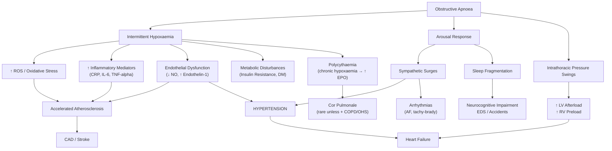

## Complications of Sleep Disturbance

Sleep disturbance is not merely about feeling tired. Chronic, untreated sleep disorders carry a significant burden of morbidity and mortality that spans virtually every organ system. The complications arise from distinct pathophysiological mechanisms depending on the underlying sleep disorder. Understanding these mechanisms from first principles is essential — both for exams and for counselling patients about why treatment matters.

---

### 1. Organising Framework

Complications of sleep disturbance can be grouped by the underlying pathophysiological insult:

| Mechanism | Primary Sleep Disorder | Downstream Complications |
|---|---|---|
| **Chronic sleep fragmentation / deprivation** | Insomnia, OSA, PLMD, any cause | Neurocognitive, psychiatric, immune, metabolic |
| **Chronic intermittent hypoxaemia** | OSA, OHS | Cardiovascular, metabolic, neurocognitive |
| **Sympathetic overactivation** | OSA, insomnia (hyperarousal) | Hypertension, cardiovascular events |
| **Circadian disruption** | Shift work, circadian disorders, chronic insomnia | Metabolic, cancer risk, psychiatric |
| **Treatment-related** | Hypnotics (BZDs, Z-drugs), CPAP | Falls, dependence, rebound insomnia, complex sleep behaviours |

---

### 2. Complications of Untreated Obstructive Sleep Apnoea

This is the highest-yield area. OSA is the sleep disorder with the most serious and well-documented complications.

***Untreated OSA is a/w a variety of consequences and confers extra mortality!*** [2]

#### 2.1 Cardiovascular Complications

***Sympathetic activation → ↑ BP → secondary hypertension*** [2]
***Oxidative stress + release of mediators (hormones, cytokines, adipokines) → ↑ atherosclerosis + metabolic disturbances → cardiovascular diseases, e.g. CAD, HF, arrhythmia, stroke*** [2]

| Complication | Pathophysiology (From First Principles) | Clinical Significance |
|---|---|---|
| **Secondary hypertension** | Each apnoea triggers a massive sympathetic surge (arousal response) → ↑ catecholamines → vasoconstriction → acute BP spike. Repeated hundreds of times per night → chronic sympathetic overactivation → sustained daytime HTN with loss of normal nocturnal dipping. Also: intermittent hypoxaemia → endothelin-1 release → vasoconstriction; ↓ nitric oxide (endothelial dysfunction) → ↑ peripheral resistance. | ***HTN is well-demonstrated to be a result of OSA*** [2]. OSA is the **most common identifiable cause of secondary/resistant hypertension**. Up to 80% of patients with drug-resistant HTN have undiagnosed OSA. CPAP ↓ BP by 2–3 mmHg on average (greater effect in drug-resistant HTN). |
| **Coronary artery disease** | Chronic intermittent hypoxaemia → ↑ reactive oxygen species (ROS) → oxidative stress → endothelial dysfunction → accelerated atherosclerosis. Also: ↑ systemic inflammation (↑ CRP, IL-6, TNF-α) → plaque instability. Sympathetic surges → ↑ myocardial O₂ demand against a background of ↓ O₂ supply (hypoxaemia) → myocardial ischaemia, especially during REM sleep (when apnoeas are longest and most severe). | ***CAD*** [2]. Severe OSA (AHI > 30) independently ↑ risk of fatal and non-fatal cardiovascular events. Nocturnal angina is an **urgent indication for CPAP** [2]. |
| **Heart failure** | Chronic hypertension → LVH → diastolic dysfunction → HF. Also: extreme negative intrathoracic pressure swings during obstructed inspiration → ↑ LV afterload (the heart has to pump against a greater transmural pressure gradient) AND ↑ venous return (↑ RV preload) → interventricular septal shift → ↓ LV filling. Chronic intermittent hypoxaemia → myocardial injury over time. | ***HF*** [2]. OSA prevalence in HF patients is 40–60%. Conversely, HF can cause central sleep apnoea (Cheyne-Stokes respiration). The two conditions co-perpetuate. |
| **Arrhythmias** | Vagal stimulation during apnoea → bradycardia; sympathetic surge on arousal → tachycardia → **tachy-brady cycles** (characteristic PSG finding). Atrial distension (from ↑ venous return against a closed airway) → atrial fibrillation. Hypoxaemia → ↑ arrhythmogenicity (↓ refractory period, ↑ ectopic activity). | ***Arrhythmia*** [2]. AF prevalence in OSA ~4× general population. Nocturnal malignant arrhythmia is an **urgent CPAP indication** [2]. Recurrent AF post-cardioversion is strongly associated with untreated OSA. |
| **Stroke** | Atherosclerosis (as above) + paradoxical emboli (patent foramen ovale + ↑ right atrial pressure during apnoea) + AF → cardioembolic stroke. Also: ↑ blood viscosity from polycythaemia (chronic hypoxaemia → ↑ EPO → ↑ RBC) + ↑ fibrinogen + ↑ platelet aggregability → prothrombotic state. | ***Stroke*** [2]. Severe OSA independently ↑ stroke risk 2–3×. |

#### 2.2 Metabolic Complications

| Complication | Pathophysiology |
|---|---|
| **Type 2 Diabetes / Insulin Resistance** | Intermittent hypoxaemia → ↑ sympathetic activation → ↑ cortisol and catecholamines → hepatic gluconeogenesis ↑, peripheral insulin resistance ↑. Also: sleep fragmentation → ↑ ghrelin, ↓ leptin → ↑ appetite → weight gain → further insulin resistance. Pro-inflammatory state (↑ TNF-α, IL-6) directly impairs insulin signalling. |
| **Dyslipidaemia** | Sympathetic overactivation + intermittent hypoxaemia → ↑ hepatic lipogenesis, ↑ triglycerides, ↓ HDL |
| **Metabolic Syndrome** | OSA is now considered an independent component and driver of metabolic syndrome (central obesity + HTN + dyslipidaemia + insulin resistance). |

***Complications: HTN, DM, metabolic syndrome*** [2]

#### 2.3 Neurocognitive and Behavioural Complications

***Sleep fragmentation → sleepiness → car accidents, neurocognitive impairments*** [2]

| Complication | Pathophysiology | Clinical Impact |
|---|---|---|
| **Excessive daytime sleepiness** | Repeated arousals → sleep fragmentation → ↓ restorative N3 and REM → unmet sleep pressure accumulates | Principal symptom; ↓ quality of life; ↓ productivity |
| ***Car accidents*** [2] | EDS → microsleeps at the wheel → loss of vehicle control | ***Risk assessment: driving, operation of heavy machinery, any previous accidents*** [2]. RTA risk ↑ 2–7× in untreated OSA. |
| ***Neurocognitive impairments*** [2] | Sleep fragmentation → ↓ hippocampal memory consolidation (N3-dependent); chronic intermittent hypoxaemia → hippocampal and prefrontal cortex neuronal injury; ↓ glymphatic clearance → ↑ amyloid-β accumulation | ***Irritability, ↓ cognitive function, ↓ concentration, ↓ work performance*** [2]. ↑ risk of dementia with long-term untreated severe OSA. |
| **Mood disturbance** | Sleep deprivation → amygdala hyperreactivity with ↓ prefrontal cortical regulation → emotional dysregulation; also chronic hypoxaemia → serotonergic pathway disruption | Depression (comorbid in ~30% of OSA patients); irritability; anxiety |
| ***↓ Libido / erectile dysfunction*** [2] | Chronic intermittent hypoxaemia → ↓ nocturnal testosterone production (testosterone secretion peaks during REM, which is fragmented); sympathetic overdrive → endothelial dysfunction → erectile dysfunction | |

<Callout title="Why You Must Ask About Driving">
***AVOID CAR-DRIVING if not adequately treated*** [2]. In Hong Kong, a driver with untreated OSA causing EDS is legally unfit to drive. If you diagnose OSA and fail to document that you counselled the patient about driving risk, you share medicolegal liability if they cause an accident. Always document this conversation.
</Callout>

#### 2.4 Respiratory Complications

***Chronic hypoxaemia → chronic respiratory failure → cor pulmonale (rare except in presence of other conditions, e.g. OHS, COPD)*** [2]

| Complication | Pathophysiology |
|---|---|
| **Pulmonary hypertension** | Chronic intermittent (and in OHS, sustained) hypoxaemia → hypoxic pulmonary vasoconstriction (HPV, Euler-Liljestrand reflex: alveolar hypoxia → pulmonary arteriolar smooth muscle contraction to divert blood to better-ventilated areas) → if sustained/repeated → vascular remodelling (medial hypertrophy, intimal fibrosis) → fixed pulmonary arterial hypertension |
| **Cor pulmonale** | Pulmonary hypertension → ↑ RV afterload → RV hypertrophy → RV dilatation → RV failure → peripheral oedema, hepatomegaly, ↑ JVP. ***Rare except in presence of other conditions (OHS, COPD)*** [2] because OSA alone rarely causes sustained enough hypoxaemia to drive this; it requires a "second hit." |

#### 2.5 Other Complications

| Complication | Mechanism |
|---|---|
| **Nocturia / enuresis** | Intermittent hypoxia → ↑ right atrial distension → ↑ ANP release → natriuresis/diuresis; also: loss of vasopressin diurnal rhythm. ***Enuresis or nocturia*** [2]. |
| **Morning headache** | Nocturnal hypercapnia → cerebral vasodilation → raised ICP → headache on waking |
| **Polycythaemia** | Chronic hypoxaemia → ↑ renal EPO production → ↑ erythropoiesis → ↑ Hb/Hct → ↑ blood viscosity → prothrombotic state |
| **GERD exacerbation** | Large negative intrathoracic pressure swings during obstructed inspiration → "suck" gastric contents into the oesophagus → nocturnal GERD worsens → further sleep disruption (vicious cycle) |

---

### 3. Complications of Chronic Insomnia

***Natural history: chronic insomnia is notoriously persistent → Prognosis: lasts ≥1y in 74%, ≥3y in 46%*** [1]

| Complication | Pathophysiology | Evidence |
|---|---|---|
| **Depression** | Chronic insomnia → persistent HPA axis hyperactivation → ↑ cortisol → hippocampal neurotoxicity and serotonergic dysregulation. Also: sleep deprivation → amygdala hyperreactivity → emotional dysregulation. Bidirectional: depression causes insomnia AND insomnia predicts new-onset depression (OR 2.1). | Meta-analysis: insomnia ↑ risk of incident depression 2.1× |
| **Anxiety disorders** | Chronic hyperarousal (the core neurobiological feature of insomnia) overlaps with and feeds into generalised anxiety. ***Cycle of worry: worry lack of sleep will compromise daytime function → ↑ stress → ↑ difficulty to sleep*** [1] | Strong bidirectional relationship |
| **Cardiovascular disease** | Chronic sympathetic overactivation from insomnia-related hyperarousal → sustained ↑ HR, ↑ BP → endothelial dysfunction → atherosclerosis. Also: chronic inflammation (insomnia ↑ CRP, IL-6). | Short sleep duration ( < 6h) and insomnia independently associated with ↑ HTN, MI, and stroke risk |
| **Impaired immune function** | Sleep deprivation → ↓ NK cell activity, ↓ T-cell proliferative responses, ↑ pro-inflammatory cytokines. Also ↓ antibody response to vaccination. | ↑ susceptibility to infections; reduced vaccine efficacy |
| **Metabolic disturbances** | Sleep deprivation → ↑ ghrelin (hunger hormone from stomach), ↓ leptin (satiety hormone from adipose tissue) → ↑ appetite and caloric intake. Also: ↓ glucose tolerance, ↑ insulin resistance (via sympathetic overactivation and cortisol). | ↑ risk of obesity, T2DM with chronic short sleep |
| **Neurocognitive decline** | ↓ N3 → ↓ hippocampal-neocortical memory transfer; ↓ REM → ↓ procedural memory consolidation; ↓ glymphatic clearance → ↑ amyloid-β and tau accumulation | ***Compromised daytime function, e.g. fatigue, malaise, ↓ concentration, ↓ work performance*** [1]. Emerging evidence: chronic insomnia ↑ dementia risk |
| **Accidents** | ↓ Attention, ↓ reaction time, microsleeps → workplace accidents, road traffic accidents | Sleep-deprived drivers have similar accident rates to intoxicated drivers |
| **↓ Quality of life** | Cumulative impact of fatigue, mood disturbance, impaired cognition, social withdrawal | Chronic insomnia patients report quality of life comparable to chronic medical conditions (CHF, diabetes) |
| **Substance misuse** | Self-medication with alcohol (GABA-A agonist → initial sedation) or illicit substances; escalating use of hypnotics | ↑ risk of alcohol use disorder; BZD dependence |

---

### 4. Complications of Narcolepsy

| Complication | Pathophysiology |
|---|---|
| **Injury from cataplexy** | Sudden loss of muscle tone triggered by emotions → falls, fractures, head injuries. Cataplexy while driving or operating machinery → accidents. |
| **Psychosocial impact** | Irresistible sleep attacks → embarrassment → social withdrawal; misdiagnosed as "lazy" → academic and occupational failure; depression (prevalence ~30% in narcolepsy) |
| **Obesity** | Orexin deficiency → ↓ metabolic rate (orexin normally promotes energy expenditure); also: ↓ physical activity due to sleepiness; disrupted eating patterns |
| **Sleep fragmentation paradox** | Despite irresistible daytime sleep, narcolepsy patients also have fragmented nocturnal sleep (unstable flip-flop switch in both directions) → double burden of poor day AND night sleep |

---

### 5. Complications of RLS / PLMD

| Complication | Mechanism |
|---|---|
| **Chronic insomnia** | RLS prevents sleep initiation; PLMD causes repetitive arousals → chronic sleep deprivation |
| **Depression / anxiety** | Chronic sleep deprivation + discomfort + frustration → psychiatric comorbidity (depression in ~20–30% of RLS patients) |
| **Cardiovascular risk** | Chronic sympathetic activation from repeated limb-movement-associated arousals → ↑ BP, ↑ heart rate; emerging evidence of ↑ cardiovascular risk in severe PLMD |
| **Iron deficiency consequences** | If secondary to iron deficiency: anaemia, fatigue, impaired cognition, pica |

---

### 6. Complications of Circadian Rhythm Disorders / Shift Work

| Complication | Pathophysiology |
|---|---|
| **Metabolic syndrome / obesity** | Circadian misalignment → eating during the biological night → impaired glucose tolerance (the β-cell circadian clock normally downregulates insulin secretion at night); ↓ leptin, ↑ ghrelin → ↑ appetite |
| **Cardiovascular disease** | Chronic sympathetic activation from fragmented sleep; loss of nocturnal BP dipping; chronic inflammation |
| **Cancer risk** | IARC classifies night shift work as "probably carcinogenic" (Group 2A). Mechanism: melatonin suppression (melatonin is oncostatic — inhibits tumour growth, is antioxidant, promotes DNA repair). Light at night → ↓ melatonin → ↓ oncostatic protection. ↑ risk of breast, prostate, and colorectal cancer in shift workers. |
| **Reproductive dysfunction** | Circadian disruption → altered GnRH pulsatility → menstrual irregularity, ↓ fertility; ↑ adverse pregnancy outcomes in shift workers |
| **Psychiatric disorders** | Chronic circadian misalignment → ↑ depression, ↑ anxiety, ↑ substance use |

---

### 7. Treatment-Related Complications

These are iatrogenic complications that arise from the management of sleep disturbance itself. They are extremely important and frequently tested.

#### 7.1 Hypnotic Medications (BZDs and Z-Drugs)

| Complication | Mechanism |
|---|---|
| **Tolerance** | GABA-A receptor downregulation with chronic use → the same dose produces ↓ effect → need for dose escalation. Typically develops within 2–4 weeks for hypnotic effect. |
| **Dependence** | Neuroadaptation to chronic GABA-A potentiation → withdrawal syndrome on cessation (anxiety, insomnia — often worse than baseline ["rebound insomnia"], tremor, seizures in severe cases). Physical AND psychological dependence. |
| **Rebound insomnia** | On abrupt withdrawal, the GABA-A system is downregulated → rebound CNS excitability → insomnia worse than before treatment. This convinces the patient they "need" the drug → reinforces dependence. |
| **Falls and hip fractures** | Sedation + muscle relaxation + ↓ postural reflexes + ↓ coordination → ↑ falls, especially in the elderly (nocturia + sedation = falls during nocturnal bathroom visits). Pooled OR for hip fracture ~1.5× with BZD use. |
| **Cognitive impairment** | GABA-A potentiation → ↓ hippocampal function → anterograde amnesia (especially with long-acting BZDs). Chronic use in elderly associated with ↑ dementia risk (controversial but consistently observed). |
| **Complex sleep behaviours** | Particularly with zolpidem: sleep-driving, sleep-eating, sleep-walking, sleep-texting — the patient performs complex activities with no recollection. Mechanism: incomplete arousal from sedated state. |
| **Respiratory depression** | BZDs/Z-drugs depress the medullary respiratory centre AND reduce pharyngeal muscle tone → **worsens OSA**, can precipitate respiratory failure in patients with COPD, OHS, or neuromuscular disease. |
| **Morning hangover** | Residual sedation from drugs with longer half-lives → ↓ daytime performance, ↓ driving ability |
| **Drug interactions** | BZDs + alcohol = synergistic CNS depression (both enhance GABA-A → additive respiratory depression). BZDs + opioids = lethal combination (FDA black box warning). |

<Callout title="The BZD Trap" type="error">
The most insidious complication of BZDs/Z-drugs is the **tolerance → rebound insomnia → dose escalation → dependence** cycle. The patient starts a "short course" of sleeping tablets, develops tolerance in 2–4 weeks, tries to stop, experiences rebound insomnia worse than baseline, concludes they "need" the medication, and continues indefinitely. This is why guidelines mandate: lowest dose, shortest duration, and always combine with CBT-I so the patient has a non-pharmacological strategy when the drug is tapered.
</Callout>

#### 7.2 CPAP-Related Complications

| Complication | Mechanism | Management |
|---|---|---|
| **Mask intolerance / discomfort** | Pressure on nasal bridge → skin breakdown; claustrophobia | Proper fitting; try different mask types (nasal pillows, full-face); desensitisation |
| **Nasal dryness / congestion** | Continuous airflow dries nasal mucosa → mucosal inflammation → congestion | Heated humidification; nasal saline spray; topical nasal steroids |
| **Aerophagia** | Positive pressure air enters oesophagus → gastric distension → bloating, belching, flatulence | ↓ pressure if possible; APAP to reduce mean pressure; sleep position adjustment |
| **Poor compliance** | Multifactorial: discomfort, inconvenience, noise, partner disturbance, claustrophobia | Education; mask fitting; APAP; ramp function; regular follow-up |
| **Skin pressure ulceration** | Chronic pressure from mask straps, especially on nasal bridge | Properly fitted mask; cushion/gel pads; regular skin checks |

---

### 8. Complications of Parasomnias

| Parasomnia | Complications |
|---|---|
| **Sleepwalking** | Injury (falling down stairs, walking into traffic, falling from windows); medicolegal issues (acts during sleepwalking: homicide cases exist in forensic literature) |
| **Night terrors** | Psychological distress to the family/bed partner; injury during thrashing; sleep disruption |
| **RBD** | Injury to self (falling out of bed, hitting furniture) and bed partner (punching, kicking during dream enactment). **Progression to neurodegenerative disease**: ***RBD may precede motor symptoms of Parkinson's disease, DLB, or MSA by years to decades*** — conversion rate ~6%/year, with > 80% eventually developing a synucleinopathy. This makes RBD a **prodromal marker** and an opportunity for neuroprotective trials. |

***Non-motor symptoms [of PD]: may precede TRAP for many years — Other features: fatigue, pain, sleep disturbance (e.g. hypersomnolence), sexual problems*** [15]

---

### 9. Complications of Delirium-Associated Sleep-Wake Disturbance

***Prognosis*** [16]:
- ***Mortality: independent predictor of mortality, esp for those with protracted delirium → Mortality data: 14% (1mo), 22% (6mo), 6× non-delirious patients*** [16]
- ***Outcome: most cases recover rapidly when underlying cause is treated*** [16]
  - ***Poor prognostic factors: elderly, pre-existing dementia/physical illness, hypoactive profile*** [16]
  - ***Relationship with dementia: 5× ↑ incidence of dementia in 2 years following delirium, may accelerate pace of cognitive decline*** [16]

| Complication | Mechanism |
|---|---|
| **Prolonged hospital stay** | Delirium → agitation, refusal to cooperate, inability to participate in rehabilitation → ↑ LOS |
| **Mortality** | Delirium is an independent predictor of mortality (reflects the severity of the underlying medical insult) |
| **Accelerated cognitive decline** | Neurotoxicity from the underlying metabolic insult + neuroinflammation during the delirious episode → permanent hippocampal and cortical neuronal injury → ↑ dementia risk |
| **Falls and injuries** | Disorientation + psychomotor agitation + sedating medications → falls → hip fracture → further immobility → further delirium (vicious cycle) |
| **Iatrogenic harm** | Inappropriate use of restraints → pressure injuries, aspiration. Inappropriate use of antipsychotics → QTc prolongation, neuroleptic malignant syndrome. Inappropriate BZDs → paradoxical disinhibition, respiratory depression. |

---

### 10. Long-Term Systemic Consequences: The "Sleep-Health" Paradigm

Modern sleep medicine increasingly recognises that sleep disturbance is not an isolated symptom but a systemic disease driver. The key pathways:

| Pathway | Mechanism | End-Organ Consequences |
|---|---|---|
| **Sympathetic overactivation** | ↑ Catecholamines 24/7 | HTN, arrhythmia, LVH, HF, sudden cardiac death |
| **Chronic inflammation** | ↑ CRP, IL-6, TNF-α from sleep deprivation and/or intermittent hypoxia | Atherosclerosis, insulin resistance, cancer promotion |
| **HPA axis dysregulation** | ↑ Cortisol (insomnia: evening peak; OSA: nocturnal surges) | Insulin resistance, visceral adiposity, hippocampal atrophy, depression |
| **Impaired glymphatic clearance** | ↓ N3 → ↓ clearance of amyloid-β and tau from brain interstitial fluid | Alzheimer's disease and vascular dementia |
| **Melatonin suppression** | Light at night, circadian disruption | ↓ Antioxidant defence, ↓ oncostatic protection → cancer risk |
| **Immune dysregulation** | ↓ NK cell activity, ↓ T-cell function | ↑ Infection susceptibility, ↓ vaccine response, ↑ cancer risk |

---

> **Key Points for Exams:**
> - OSA complications are driven by **3 mechanisms**: intermittent hypoxaemia, sympathetic activation, and intrathoracic pressure swings.
> - **HTN is the most well-established cardiovascular consequence** of OSA — always think of OSA in resistant hypertension.
> - Chronic insomnia ↑ risk of **depression** (bidirectional), **cardiovascular disease**, **metabolic syndrome**, and **dementia**.
> - **RBD → synucleinopathy** conversion rate is ~6%/year — one of the strongest prodromal markers for PD/DLB/MSA.
> - **BZD/Z-drug complications**: tolerance, dependence, rebound insomnia, falls (elderly), cognitive impairment, complex sleep behaviours, respiratory depression (worsens OSA).
> - **Shift work** is classified as "probably carcinogenic" (IARC Group 2A) due to melatonin suppression.

---

<Callout title="High Yield Summary">

**Complications of Sleep Disturbance — Key Takeaways:**

1. ***Untreated OSA confers extra mortality*** via secondary hypertension, CAD, arrhythmia (AF), HF, stroke, and road traffic accidents.

2. **OSA → HTN** is the most robustly demonstrated cardiovascular consequence. OSA is the most common cause of resistant hypertension.

3. **Metabolic complications** of OSA and chronic insomnia: insulin resistance, T2DM, dyslipidaemia, obesity — chronic sleep deprivation disrupts ghrelin/leptin balance and cortisol regulation.

4. **Neurocognitive impairment** from sleep fragmentation and intermittent hypoxia: ↓ memory consolidation, ↓ concentration, ↑ dementia risk (impaired glymphatic clearance of amyloid-β).

5. **RBD is a prodromal marker** for α-synucleinopathies (PD, DLB, MSA) — conversion rate ~6%/year.

6. **Delirium** is an independent predictor of mortality and 5× ↑ incidence of dementia in 2 years.

7. **BZD/Z-drug complications**: tolerance → rebound insomnia → dependence cycle; falls in elderly; respiratory depression (contraindicated in OSA); complex sleep behaviours.

8. **Shift work** is probably carcinogenic (Group 2A, IARC) via melatonin suppression.

9. **Depression and insomnia are bidirectional** — each ↑ the risk of developing the other.

10. Always assess and document **driving risk** and **occupational risk** in patients with EDS — medicolegal obligation.
</Callout>

---

<ActiveRecallQuiz
  title="Active Recall - Complications of Sleep Disturbance"
  items={[
    {
      question: "Name the 3 key pathophysiological mechanisms by which untreated OSA causes cardiovascular disease, and for each, list at least 2 downstream complications.",
      markscheme: "(1) Intermittent hypoxaemia: leads to oxidative stress, endothelial dysfunction, systemic inflammation, accelerated atherosclerosis, polycythaemia. Downstream: CAD, stroke, pulmonary hypertension. (2) Sympathetic overactivation from repeated arousals: leads to chronic vasoconstriction, loss of nocturnal BP dipping. Downstream: secondary hypertension, arrhythmias (AF, tachy-brady cycles). (3) Intrathoracic pressure swings: large negative intrathoracic pressures during obstructed inspiration increase LV afterload and RV preload. Downstream: heart failure, atrial distension leading to AF.",
    },
    {
      question: "A patient with severe OSA asks why they need to stop driving. Explain the pathophysiological link between OSA and road traffic accidents.",
      markscheme: "OSA causes repeated apnoeas leading to arousals and sleep fragmentation throughout the night, destroying restorative N3 and REM sleep. Despite spending adequate hours in bed, the patient accumulates a sleep debt causing excessive daytime sleepiness. This manifests as microsleeps (brief involuntary episodes of unconsciousness lasting seconds) which occur during monotonous activities like driving. The driver loses control of the vehicle during a microsleep. RTA risk is 2-7 times that of the general population in untreated OSA.",
    },
    {
      question: "Describe the tolerance-rebound-dependence cycle for benzodiazepine hypnotics and explain why this is clinically dangerous.",
      markscheme: "Chronic BZD use leads to GABA-A receptor downregulation (tolerance) within 2-4 weeks, requiring dose escalation for the same effect. When the drug is discontinued, the downregulated GABA-A system leaves the brain in a state of CNS hyperexcitability, causing rebound insomnia (often worse than baseline) plus withdrawal symptoms (anxiety, tremor, seizures). The patient interprets rebound insomnia as proof they need the medication and resumes use, entering a dependence cycle. Dangerous because: dose escalation increases risk of respiratory depression, falls, cognitive impairment; withdrawal seizures can be life-threatening; chronic BZD use in elderly increases falls, hip fractures, and dementia risk.",
    },
    {
      question: "Explain why REM sleep behaviour disorder is considered a prodromal marker for neurodegenerative disease. Which diseases and what is the conversion rate?",
      markscheme: "RBD involves loss of normal REM atonia due to degeneration of brainstem structures (sublaterodorsal nucleus and its pathways) that mediate glycinergic inhibition of spinal motor neurons during REM. These same brainstem nuclei are affected early in alpha-synucleinopathies (Parkinson's disease, Dementia with Lewy Bodies, Multiple System Atrophy) before the pathology spreads to the substantia nigra or cortex. Therefore, RBD often appears years to decades before motor or cognitive symptoms. Conversion rate is approximately 6% per year, with over 80% eventually developing a synucleinopathy on long-term follow-up.",
    },
    {
      question: "List 4 metabolic/systemic complications of chronic sleep deprivation or insomnia and explain the mechanism for each.",
      markscheme: "(1) Insulin resistance and T2DM: chronic sleep deprivation causes sympathetic overactivation and cortisol excess, both of which increase hepatic gluconeogenesis and decrease peripheral insulin sensitivity. (2) Obesity: sleep loss increases ghrelin (hunger hormone) and decreases leptin (satiety hormone), increasing appetite and caloric intake. (3) Immune dysfunction: decreased NK cell activity and T-cell proliferation, increased pro-inflammatory cytokines, reduced vaccine antibody response. (4) Cardiovascular disease: chronic sympathetic activation and inflammation accelerate atherosclerosis and promote hypertension.",
    },
    {
      question: "Why is OSA considered the most common identifiable cause of resistant hypertension? Explain the mechanism.",
      markscheme: "Each obstructive apnoea triggers an arousal response with a massive sympathetic surge (catecholamine release causing vasoconstriction and acute BP spike). When repeated hundreds of times per night, this leads to chronic sympathetic nervous system overactivation with sustained daytime hypertension and loss of normal nocturnal BP dipping. Additionally, intermittent hypoxaemia causes endothelial dysfunction (decreased nitric oxide, increased endothelin-1) and activation of the renin-angiotensin-aldosterone system. These mechanisms are resistant to standard antihypertensive therapy because the underlying cause (recurrent nocturnal sympathetic surges) is not addressed by daytime medications. Up to 80% of patients with drug-resistant HTN have undiagnosed OSA.",
    },
  ]}
/>

---

## References

[1] Senior notes: Ryan Ho Psychiatry.pdf (Section 9.2.3 Insomnia — Clinical features and Natural history, p. 223)
[2] Senior notes: Ryan Ho Respiratory.pdf (Section 3.8 Sleep-Associated Disorders — Complications of OSA, pp. 155–161)
[5] Lecture slides: murtagh merge.pdf (pp. 61–62 — Insomnia)
[8] Senior notes: Ryan Ho Fundamentals.pdf (Section 3.4.5 Delirium, pp. 325–326)
[15] Senior notes: Ryan Ho Neurology.pdf (Section on Parkinson's Disease — Non-motor symptoms, p. 121)
[16] Senior notes: Ryan Ho Psychiatry.pdf (Section on Delirium — Prognosis, p. 76)
