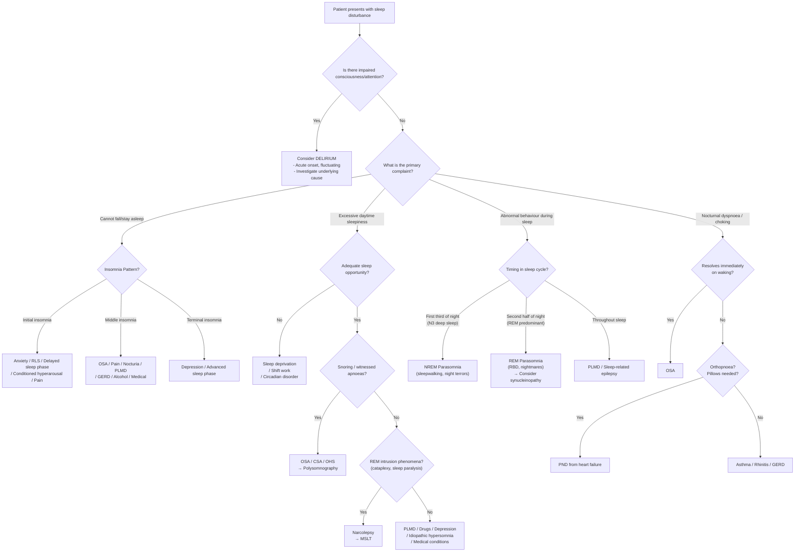

## Differential Diagnosis of Sleep Disturbance

The approach to differential diagnosis of sleep disturbance follows the Murtagh diagnostic strategy framework — a structured, probability-based method that prevents you from anchoring on the most common cause and missing something dangerous. Let me walk you through this systematically.

### Organising Framework

The core clinical question is: **Why is this patient not sleeping well?** — which really breaks down into three sub-questions:

1. **Is the patient not getting enough sleep?** (insufficient sleep opportunity or inability to initiate/maintain sleep → insomnia and circadian disorders)
2. **Is the patient sleeping but the sleep quality is poor?** (something disrupts sleep architecture → OSA, PLMD, parasomnias)
3. **Is the patient sleeping adequately but still excessively sleepy?** (intrinsic hypersomnolence → narcolepsy, idiopathic hypersomnia)

These are not mutually exclusive — a patient with OSA may have insomnia (frequent arousals) AND excessive daytime sleepiness.

---

### Murtagh's Diagnostic Strategy for Insomnia / Sleep Disturbance

This is the high-yield lecture framework. Every item matters.

#### ***Probability Diagnosis*** [5]

These are the **common** causes — what you should think of first in any patient presenting with sleep disturbance:

| Diagnosis | Why It Causes Sleep Disturbance |
|---|---|
| ***Stress and anxiety*** | Psychological hyperarousal → ↑ cortisol, ↑ sympathetic tone → the brain cannot "switch off" → **initial insomnia** (difficulty falling asleep). Anxious rumination at bedtime creates a conditioned arousal response to the bed itself. |
| ***Depression*** | HPA axis dysregulation → cortisol secretion peaks earlier in the night → **terminal insomnia** (early morning awakening). Also ↓ serotonin → disrupted sleep architecture (↓ REM latency, ↑ REM density, ↓ N3). Depression is the single most important psychiatric cause to exclude. |
| ***Inappropriate sleep hygiene or lifestyle*** | Caffeine late in the day (blocks adenosine → ↓ sleep pressure), screen use at night (blue light suppresses melatonin secretion from the pineal gland via the retinohypothalamic tract → delays circadian phase), irregular sleep-wake schedule (desynchronises the SCN clock), exercising too close to bedtime (↑ core body temperature and sympathetic tone). |
| ***Environmental e.g. noisy household*** | External stimuli cause cortical arousals → sleep fragmentation. This is particularly relevant in **Hong Kong** given small flats, thin walls, and high population density. |
| ***Drug withdrawal inc. alcohol, hypnotics*** | Alcohol is a GABA-A receptor agonist → acutely sedating, but as blood levels fall in the second half of the night, there is **rebound CNS excitability** → middle/terminal insomnia + vivid dreams. Chronic alcohol → GABA-A receptor downregulation → withdrawal causes severe insomnia, anxiety, and even seizures. Benzodiazepine/Z-drug withdrawal → rebound insomnia (same GABA mechanism). |
| ***Biorhythm disruption e.g. shift work, travel*** | Misalignment between the endogenous circadian clock (SCN) and the desired sleep time → the circadian alerting signal is active when the patient is trying to sleep. Shift workers in Hong Kong (healthcare, transport, hospitality) are particularly affected. |

<Callout title="Most Common Causes — Think of These First">
In clinical practice and exams, the **top 3** causes of sleep disturbance presenting to primary care are: (1) Anxiety/stress, (2) Depression, (3) Poor sleep hygiene. Always screen for these before ordering investigations.
</Callout>

#### ***Serious Disorders Not to Be Missed*** [5]

These are conditions where missing the diagnosis causes significant morbidity or mortality:

| Diagnosis | Why It Causes Sleep Disturbance | Why It's Serious |
|---|---|---|
| ***Peripheral vascular disease*** | Nocturnal limb ischaemia → rest pain (worse at night when legs are horizontal → loss of gravity-assisted perfusion) → awakens the patient | Critical limb ischaemia; amputation risk |
| ***Congestive cardiac failure*** | Orthopnoea (recumbent → ↑ venous return → pulmonary congestion → dyspnoea) and PND (nocturnal fluid redistribution → pulmonary oedema → wakes patient gasping) → middle insomnia. Also Cheyne-Stokes respiration → central sleep apnoea. | Life-threatening decompensation |
| ***Pharyngeal tumours*** | Mass effect → upper airway obstruction → OSA-like presentation or stridor. Can also cause dysphagia, odynophagia. | Malignancy — delay in diagnosis worsens prognosis |
| ***Pain syndromes e.g. back, arthritis, CTS, cancer*** | Pain activates ascending nociceptive pathways → cortical arousal → multiple awakenings (middle insomnia). Inflammatory arthritis characteristically worse in early morning (cytokine levels peak at night → morning stiffness). Cancer pain may be constant. CTS is classically worse at night because wrist flexion during sleep compresses the median nerve. | Underlying malignancy; progressive joint destruction; nerve damage |
| ***Respiratory e.g. asthma, COPD, nasal obstruction*** | Asthma: circadian ↑ in airway resistance + ↑ vagal tone at night → nocturnal bronchoconstriction → awakens with wheeze/cough. COPD: ↓ FRC in supine position + ↓ accessory muscle use during sleep → hypoventilation → hypoxaemia → arousals. Nasal obstruction: ↑ negative inspiratory pressure → ↑ pharyngeal collapsibility → OSA. | Acute severe asthma; respiratory failure; may worsen OSA |
| ***Post-traumatic stress disorder (PTSD)*** | Hyperarousal (↑ noradrenaline) + re-experiencing symptoms (nightmares, flashbacks during sleep-wake transition) → initial insomnia + middle insomnia. Nightmares cause avoidance of sleep. | Psychiatric emergency if suicidal; severe functional impairment |
| ***Psychosis*** | Disrupted dopaminergic and serotonergic circuits → severe circadian disorganisation. Paranoid ideation may prevent the patient from sleeping (fear of vulnerability). Mania → ↓ need for sleep (NOT insomnia — the patient does not feel tired). | Risk to self and others |
| ***Restless legs / nocturnal myoclonus*** | RLS: central dopaminergic dysfunction → compelling urge to move legs at rest → cannot initiate sleep (initial insomnia). PLMD: repetitive limb movements every 20–40 seconds during sleep → cortical arousals → sleep fragmentation → excessive daytime sleepiness. | Iron deficiency may be the underlying cause (treatable); uraemia may be undiagnosed |

#### ***Pitfalls (Often Missed)*** [5]

These are diagnoses that clinicians frequently overlook:

| Diagnosis | Why It's Missed | Key Distinguishing Features |
|---|---|---|
| ***Sleep apnoea*** | The patient is unaware of the apnoeas (they are asleep!). They present with "insomnia" or "tiredness" and the clinician doesn't ask about snoring or obtain a bed-partner history. | Loud snoring, witnessed apnoeas, excessive daytime sleepiness, unrefreshing sleep, morning headache, nocturia. Obese middle-aged male is the classic patient but normal-weight individuals with craniofacial features also get it. |
| ***GORD*** | Nocturnal acid reflux causes micro-arousals without the patient being aware. They may not have classic heartburn — in Asians, atypical presentations are more common [4]. | Posturally aggravated symptoms; acid taste; chronic cough; throat tightness. May improve with PPI trial. |
| ***Dementia*** | ***Altered sleep-wake cycle: another hallmark of delirium*** [8] — but early dementia also disrupts the SCN and circadian rhythms. Sundowning (↑ confusion/agitation in the evening) mimics insomnia. Families may attribute the sleep disturbance to "old age." | Progressive cognitive decline; behavioural changes; sundowning; should screen with cognitive assessment (MMSE/MoCA). |
| ***Menopausal symptoms*** | Hot flushes and night sweats cause frequent arousals → middle insomnia. Women may not volunteer these symptoms unless asked directly. | Perimenopausal age, vasomotor symptoms, irregular menses, mood changes. |

<Callout title="Don't Miss Sleep Apnoea" type="error">
OSA is the most commonly missed cause of sleep disturbance. It affects 4% of middle-aged men and 2% of middle-aged women. Untreated OSA causes secondary hypertension, cardiovascular disease, and road traffic accidents. Always ask about snoring and witnessed apnoeas — get a bed-partner history!
</Callout>

#### ***Rarities*** [5]

| Diagnosis | Explanation |
|---|---|
| ***Macroglossia / tonsillar hypertrophy*** | Enlargement of the tongue or tonsils narrows the pharyngeal airway → OSA. Causes of macroglossia include ***acromegaly*** (GH excess → soft tissue overgrowth → OSA in ~50%) [6], hypothyroidism (myxoedematous infiltration), amyloidosis, Down syndrome. Tonsillar hypertrophy is a particularly important cause in **children** [2]. |
| ***Malnutrition*** | Protein-calorie malnutrition → ↓ tryptophan (precursor to serotonin → melatonin pathway) → disrupted sleep. Also micronutrient deficiencies (iron → RLS; magnesium → muscle cramps at night; B12/folate → neuropathy → RLS-like symptoms). |
| ***Parasomnias e.g. night terrors*** | NREM parasomnias (sleepwalking, night terrors) are caused by incomplete arousal from N3 deep sleep → dissociated state with motor activity but without consciousness. More common in children (who have proportionally more N3). In adults, new-onset parasomnias (especially REM sleep behaviour disorder) should prompt investigation for neurodegenerative disease [9]. |

#### ***Masquerades Checklist*** [5]

These are common medical conditions that "masquerade" as other things — always run through this list:

| Masquerade | Mechanism of Sleep Disturbance |
|---|---|
| ***Depression*** | HPA axis dysregulation → early cortisol peak → terminal insomnia. ↓ serotonin → ↓ melatonin. Also psychomotor agitation or excessive rumination. **Most important masquerade.** |
| ***Diabetes*** | Polyuria/nocturia (osmotic diuresis from hyperglycaemia) → middle insomnia. Peripheral neuropathy → neuropathic pain/RLS-like symptoms at night. Also ↑ OSA risk (obesity). |
| ***Drugs: stimulants, alcohol, beta blockers, SSRIs, steroids*** | Stimulants/caffeine → adenosine receptor blockade → ↓ sleep pressure. Alcohol → rebound excitability. Beta-blockers → ↓ melatonin secretion (β₁-receptors on pinealocytes mediate melatonin release; blocking them → ↓ melatonin → insomnia + vivid dreams). SSRIs → ↑ serotonin → suppresses REM sleep → vivid dreams, insomnia, PLMD. Steroids → ↑ cortisol → hyperarousal. |
| ***Thyroid/other endocrine: hyperthyroid*** | Excess thyroid hormone → ↑ metabolic rate → ↑ sympathetic tone → hyperarousal → initial insomnia, anxiety, tremor, palpitations. Also consider hypothyroidism → myxoedema of upper airway → OSA; ↓ ventilatory drive. |
| ***Spinal dysfunction*** | Chronic back/neck pain → nocturnal pain exacerbated by recumbent position → middle insomnia. Radiculopathy → limb pain/paraesthesia at night. |
| ***Urinary tract infection: nocturia*** | Cystitis → bladder irritation → frequency, urgency, nocturia → middle insomnia. Also consider BPH, diabetes, CCF, OSA (↑ ANP → nocturia) as causes of nocturia [10]. |

#### ***Is the patient trying to tell me something?*** [5]

***A consideration if nil findings. Some cases are normal variant or idiopathic.*** [5]

This is Murtagh's reminder to consider:
- **Psychosocial stressors** the patient is not disclosing (domestic violence, financial distress, relationship problems, work stress)
- **Normal variant**: some people are natural "short sleepers" (genetically determined, require < 6 hours and are not impaired) — they present because they think something is wrong, but they have no daytime symptoms
- **Unrealistic expectations**: elderly patients who expect 8 hours of unbroken sleep but physiologically only need 6–7 hours with more awakenings

---

### Differential Diagnosis of Insomnia (Psychiatric Perspective)

***Differential diagnoses*** from the DSM-5 framework [1]:

| D/dx | ***Salient differentiating features*** |
|---|---|
| ***Normal sleep variations*** | ***Short sleepers: some individuals require little sleep and do not feel difficulty falling/staying asleep or daytime sleepiness. These individuals may mimic insomnia if they try to stay in bed for a longer time. Inadequate opportunity of sleep due to e.g. shift work, other disturbances*** [1] |
| ***Situational insomnia*** | ***Lasts days to weeks and a/w life events or with changes in sleep schedules. Classified under other specified insomnia disorder under DSM-5 if < 3 months but otherwise meets criteria.*** [1] |
| ***Delayed sleep-wake phase disorder*** | ***Classified under delayed sleep phase type of circadian rhythm sleep-wake disorder. Usually report sleep-onset insomnia when try to sleep at socially normal times, but do not complain of insomnia when follow endogenous circadian rhythm.*** [1] — Key differentiator: if the patient is allowed to sleep at their preferred time (e.g. 3 AM–11 AM), they sleep perfectly normally. |
| ***Restless leg syndrome*** | ***Often produces difficulties initiating and maintaining sleep. Should have urge to move legs, unpleasant leg sensation when sitting/lying down. Partner may report Hx of restless sleep or even limb movement/muscle twitches during sleep.*** [1] |
| ***Breathing-related sleep disorders*** | ***Majority have Hx of loud snoring, breathing pauses during sleep. May report interrupted sleep (frequent arousal due to apnoea) and daytime sleepiness.*** [1] |

Additional differentials to consider:

| D/dx | Differentiating Features |
|---|---|
| **Substance/medication-induced insomnia** | Temporal relationship with drug initiation/dose change. Common culprits: caffeine, stimulants, SSRIs, steroids, beta-blockers, theophylline. Resolves with drug withdrawal/dose adjustment. |
| **Insomnia due to medical condition** | Sleep disturbance clearly temporally related to and adequately explained by the medical condition (pain, dyspnoea, GERD, nocturia, pruritus). |
| **Psychiatric comorbid insomnia** | Insomnia co-occurs with depression, anxiety, PTSD, psychosis. Now diagnosed as **comorbid** rather than secondary — treat both. |
| **Paradoxical insomnia** | Patient complains of severe insomnia but PSG shows normal sleep. The discrepancy is due to misperception of sleep as wakefulness. Rare. |

---

### Differential Diagnosis of Excessive Daytime Sleepiness

***Differential diagnosis*** [2]:

| Category | Conditions | Mechanism |
|---|---|---|
| ***↓ Sleep duration*** | ***Sleep deprivation, disturbance of sleep-wake cycle*** | Simply not enough hours of sleep → accumulated sleep debt → ↑ adenosine → overwhelming sleep pressure during the day |
| ***↓ Sleep quality (Respiratory)*** | ***Sleep apnoea (central, obstructive), obesity-hypoventilation syndrome*** | Repeated apnoeas → arousals → sleep fragmentation → ↓ restorative N3/REM despite adequate time in bed |
| ***↓ Sleep quality (Neurological)*** | ***Periodic limb movement syndrome*** | Repetitive limb movements → cortical arousals every 20–40 seconds → sleep fragmentation |
| ***Normal sleep (Neurological)*** | ***Narcolepsy, fibromyalgia, neurological lesions*** | Narcolepsy: orexin deficiency → unstable flip-flop switch → irresistible sleep intrusions. Fibromyalgia: alpha-wave intrusion into NREM sleep → non-restorative sleep. Lesions (e.g. hypothalamic tumours, encephalitis): damage to arousal centres. |
| ***Normal sleep (Others)*** | ***Drugs, idiopathic hypersomnolence (rare)*** | Sedating drugs (benzodiazepines, antihistamines, opioids) → ↑ GABAergic or ↓ histaminergic/noradrenergic tone → sleepiness. Idiopathic hypersomnia: unknown mechanism; diagnosis of exclusion. |
| ***Others*** | ***Depression, other medical conditions*** | Depression: psychomotor retardation, hypersomnia variant (atypical depression), fatigue misinterpreted as sleepiness. Medical conditions: hypothyroidism (↓ metabolic rate → lethargy), anaemia (↓ O₂ delivery → fatigue), chronic kidney disease, liver failure. |

***D/dx for sudden episodic awakening with breathing difficulty during sleep*** [2]:
- ***OSA – "choking" sensation*** [2]
- ***PND – may be a/w orthopnoea, does not resolve immediately upon awakening, relieved by sleeping with several pillows*** [2]
- ***Asthma – a/w wheezes, Hx of atopy*** [2]
- ***Rhinitis with severe nasal blockade*** [2]

<Callout title="Key Distinction: Waking Up Short of Breath at Night">
This is a classic exam question. OSA choking resolves almost immediately upon waking (because the arousal opens the airway). PND from heart failure takes several minutes to resolve (because pulmonary oedema needs time to redistribute). Asthma has audible wheeze and Hx of atopy. Rhinitis has nasal congestion. The timing and associated features differentiate them.
</Callout>

---

### Differential Diagnosis of Nocturia as a Cause of Sleep Disturbance

Nocturia is a common but under-recognised cause of middle insomnia. A structured approach [10]:

| System | Cause | Mechanism |
|---|---|---|
| ***Respiratory*** | ***Obstructive sleep apnoea*** | ***Difficulty with sleep maintenance and loss of diurnal variation in release of vasopressin (ADH)*** [10]. Also: intermittent hypoxia → ↑ right atrial pressure → ↑ ANP release → natriuresis → nocturia |
| ***Cardiovascular*** | ***Hypertension, congestive heart failure, peripheral oedema*** | CHF: daytime fluid accumulates in dependent tissues → at night, recumbent position → fluid redistributes centrally → ↑ renal perfusion → nocturia |
| ***Urological*** | ***UTI, BPH, prostatic cancer*** | UTI: bladder mucosal inflammation → irritative symptoms (frequency, urgency). BPH: bladder outlet obstruction → incomplete emptying → frequent voiding |
| ***Endocrine*** | ***Diabetes mellitus, diabetes insipidus*** | DM: osmotic diuresis from glycosuria. DI: ***nocturnal polyuria — loss of diurnal variation or deficiency for vasopressin (ADH)*** [10] |

---

### Differentiating Delirium from Other Sleep-Wake Disturbances

***Altered sleep-wake cycle: another hallmark of delirium*** [8]

Delirium must always be considered in the differential of acute sleep disturbance, especially in hospitalised and elderly patients. The key differentiating feature is **impaired consciousness and attention** — insomnia alone does NOT impair consciousness.

| Feature | Delirium | Insomnia | Dementia with Sundowning |
|---|---|---|---|
| **Onset** | Acute (hours–days) | Gradual or acute (linked to stressor) | Chronic (months–years) |
| **Consciousness** | ***Impaired*** [8] | Normal | Normal until late stages |
| **Attention** | ***Impaired (hallmark)*** [8] | Normal (may have poor concentration from fatigue, but attention itself is intact) | Impaired in later stages |
| **Fluctuation** | ***Acute onset with diurnal fluctuation (usu worse at night)*** [8] | Consistent sleep difficulty, stable during waking hours | Evening worsening ("sundowning") |
| **Hallucinations** | Common (esp visual) | Absent | May occur (esp in DLB — ***visual hallucinations 67%***) [11] |
| **Reversibility** | Reversible if cause treated | Variable | Progressive |

---

### Diagnostic Algorithm: Clinical Approach to Sleep Disturbance

---

### Summary Table: Key Differentiating Features

| Condition | Insomnia Type | Key Night Symptoms | Key Day Symptoms | Key Clues |
|---|---|---|---|---|
| **Anxiety** | Initial | Rumination, difficulty switching off | Worry, tension, irritability | Persistent worry; somatic symptoms |
| **Depression** | Terminal | Early morning wakening | Low mood, anhedonia, fatigue | ***2-week Hx of low mood*** [7]; weight/appetite change |
| **OSA** | Middle | Snoring, witnessed apnoeas, choking | EDS, morning headache, poor concentration | Obese male; large neck; ***macroglossia/tonsillar hypertrophy*** [5] |
| **RLS** | Initial | Urge to move legs, worse at rest | Fatigue | Low ferritin; worsened by SSRIs |
| **PLMD** | Middle | Repetitive limb jerks (bed partner reports) | EDS | Often co-occurs with RLS |
| **Circadian disorder** | Initial (delayed) or Terminal (advanced) | Sleeps well at "wrong" time | Sleepy at socially required times | Shift worker; adolescent with delayed phase |
| **GERD** | Middle | Nocturnal heartburn, acid taste, cough | May have no daytime GI symptoms | Postural aggravation; responds to PPI |
| **Heart failure** | Middle | PND, orthopnoea | Exertional dyspnoea, oedema | Bilateral ankle oedema; ↑ JVP; displaced apex |
| **Narcolepsy** | — | Fragmented nocturnal sleep paradoxically | EDS + cataplexy + sleep paralysis + hallucinations | Young onset; irresistible sleep attacks |
| **Delirium** | Reversed cycle | Agitation, confusion, hallucinations | Drowsy, inattentive | Acute onset; fluctuating; impaired attention |
| **RBD** | Middle | Dream enactment, vocalisation, violence | May have mild Parkinsonian signs | ***M > F = 9:1; a/w synucleinopathies (PD, MSA, DLB)*** [9] |
| **Menopausal** | Middle | Hot flushes, night sweats | Mood changes, fatigue | Perimenopausal age; vasomotor symptoms |

---

> **High Yield DDx Points for Exams:**
> - Always use the **Murtagh framework**: Probability → Serious → Pitfalls → Rarities → Masquerades → "Trying to tell me something?"
> - The **three patterns of insomnia** (initial/middle/terminal) immediately narrow your differential.
> - **OSA** is the most commonly missed diagnosis — always ask about snoring and obtain a bed-partner history.
> - **Depression** is the most important psychiatric cause — terminal insomnia + low mood + anhedonia = screen for MDD.
> - **Beta-blockers cause insomnia** by blocking pinealocyte β₁-receptors → ↓ melatonin. This is a favourite exam question.
> - **Delirium** must be excluded in any acute sleep-wake disturbance in a hospitalised/elderly patient — check attention.
> - **RBD in an elderly patient** = prodrome of Parkinson's / DLB until proven otherwise.

---

<Callout title="High Yield Summary">

**Differential Diagnosis of Sleep Disturbance — Key Takeaways:**

1. ***Probability diagnoses***: Stress/anxiety, depression, poor sleep hygiene, environment, drug/alcohol withdrawal, biorhythm disruption.

2. ***Serious not to miss***: PVD, CCF, pharyngeal tumour, pain syndromes (back/arthritis/CTS/cancer), respiratory (asthma/COPD/nasal obstruction), PTSD, psychosis, RLS/PLMD.

3. ***Pitfalls (often missed)***: Sleep apnoea, GORD, dementia, menopausal symptoms.

4. ***Rarities***: Macroglossia/tonsillar hypertrophy, malnutrition, parasomnias.

5. ***Masquerades***: Depression, diabetes, drugs (stimulants, alcohol, beta-blockers, SSRIs, steroids), thyroid (hyperthyroid), spinal dysfunction, UTI (nocturia).

6. **Pattern-based approach**: Initial insomnia → anxiety/RLS/delayed phase. Middle insomnia → OSA/pain/nocturia/GERD. Terminal insomnia → depression/advanced phase.

7. **Always exclude delirium** in acute sleep-wake disturbance in hospitalised/elderly patients.

8. **Always get a bed-partner history** — OSA, PLMD, and RBD are observed conditions.

9. **Nocturnal dyspnoea DDx**: OSA (resolves immediately) vs PND (takes minutes) vs asthma (wheeze) vs rhinitis (nasal blockage).

10. **RBD in the elderly** → investigate for α-synucleinopathy (PD, DLB, MSA).
</Callout>

---

<ActiveRecallQuiz
  title="Active Recall - Differential Diagnosis of Sleep Disturbance"
  items={[
    {
      question: "List the 6 probability diagnoses for insomnia according to Murtagh's framework.",
      markscheme: "(1) Stress and anxiety, (2) Depression, (3) Inappropriate sleep hygiene or lifestyle, (4) Environmental factors (e.g. noisy household), (5) Drug withdrawal including alcohol and hypnotics, (6) Biorhythm disruption (e.g. shift work, travel).",
    },
    {
      question: "Name the 4 'pitfalls' (often missed diagnoses) in sleep disturbance according to Murtagh.",
      markscheme: "(1) Sleep apnoea, (2) GORD/GERD, (3) Dementia, (4) Menopausal symptoms.",
    },
    {
      question: "A 50-year-old man wakes gasping for air at 2 AM. The symptom resolves within seconds. His wife reports loud snoring. What is the most likely diagnosis, and how does the pathophysiology differ from paroxysmal nocturnal dyspnoea?",
      markscheme: "Most likely OSA. Pathophysiology: pharyngeal collapse during sleep causes apnoea and hypoxaemia, which triggers an arousal that immediately reopens the airway (hence resolves within seconds). PND from heart failure: nocturnal fluid redistribution causes pulmonary oedema, which takes several minutes to resolve even after sitting up, and is relieved by sleeping propped up on pillows. Key differentiator = speed of resolution and presence of orthopnoea.",
    },
    {
      question: "Explain why beta-blockers cause insomnia from first principles.",
      markscheme: "Beta-1 adrenergic receptors on pinealocytes in the pineal gland mediate noradrenaline-stimulated melatonin synthesis and secretion. Beta-blockers (especially lipophilic ones like propranolol that cross the BBB) block these receptors, reducing nocturnal melatonin production. Low melatonin weakens the circadian sleep signal, causing insomnia and vivid dreams.",
    },
    {
      question: "A 72-year-old man presents with 6 months of acting out violent dreams during sleep. His wife says he punches and kicks in his sleep. What is the diagnosis, and what neurodegenerative conditions should you screen for?",
      markscheme: "REM sleep behaviour disorder (RBD). Caused by loss of normal REM atonia due to brainstem degeneration. Must screen for alpha-synucleinopathies: Parkinson's disease, Dementia with Lewy Bodies (DLB), and Multiple System Atrophy (MSA). RBD may precede motor symptoms by years and is a core clinical feature of DLB.",
    },
    {
      question: "List the 6 items in Murtagh's masquerades checklist for insomnia and briefly explain the mechanism for each.",
      markscheme: "(1) Depression: HPA dysregulation, early cortisol peak, terminal insomnia. (2) Diabetes: nocturia from osmotic diuresis, neuropathic pain. (3) Drugs (stimulants, alcohol, beta-blockers, SSRIs, steroids): various mechanisms including adenosine blockade, GABA rebound, melatonin suppression, REM suppression, hyperarousal. (4) Thyroid/hyperthyroid: excess T3/T4 causes sympathetic hyperarousal. (5) Spinal dysfunction: nocturnal pain from recumbent position. (6) UTI: nocturia from bladder irritation.",
    },
  ]}
/>

---

## References

[1] Senior notes: Ryan Ho Psychiatry.pdf (Section 9.2.3 Insomnia, pp. 222–224)
[2] Senior notes: Ryan Ho Respiratory.pdf (Section 3.8 Sleep-Associated Disorders, pp. 155–161)
[4] Senior notes: Ryan Ho GI.pdf (Section on GERD, p. 57)
[5] Lecture slides: murtagh merge.pdf (pp. 61–62 — Insomnia)
[6] Senior notes: Ryan Ho Endocrine.pdf (Section 5.2.3 Acromegaly, p. 111)
[7] Senior notes: Ryan Ho Psychiatry.pdf (Section 7.2 Depressive Disorders, p. 155)
[8] Senior notes: Ryan Ho Neurology.pdf (Section 4.1.3 Delirium, p. 95)
[9] Senior notes: Ryan Ho Psychiatry.pdf (Section 9.2.5 REM Sleep Behaviour Disorder, p. 229)
[10] Senior notes: felixlai.md (Differential diagnosis of nocturia)
[11] Senior notes: Ryan Ho Neurology.pdf (Section 5.4.5 Dementia with Lewy Bodies, p. 134)
