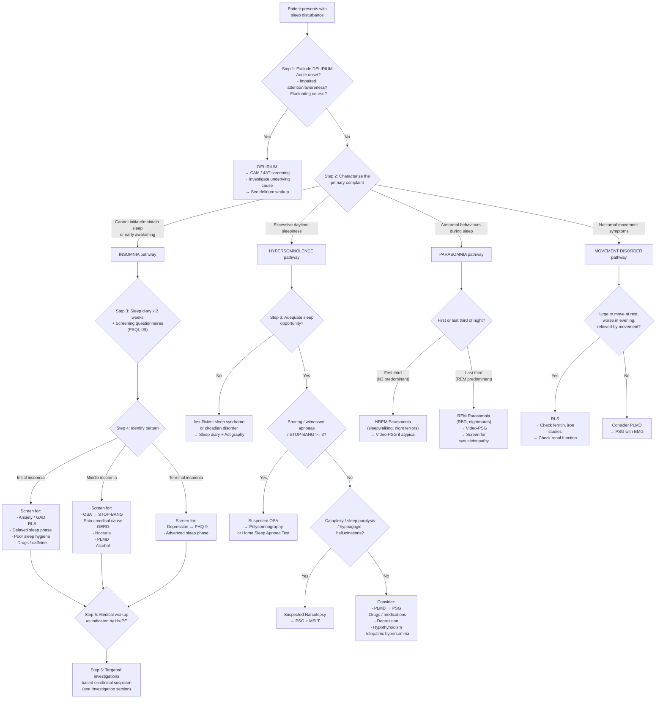
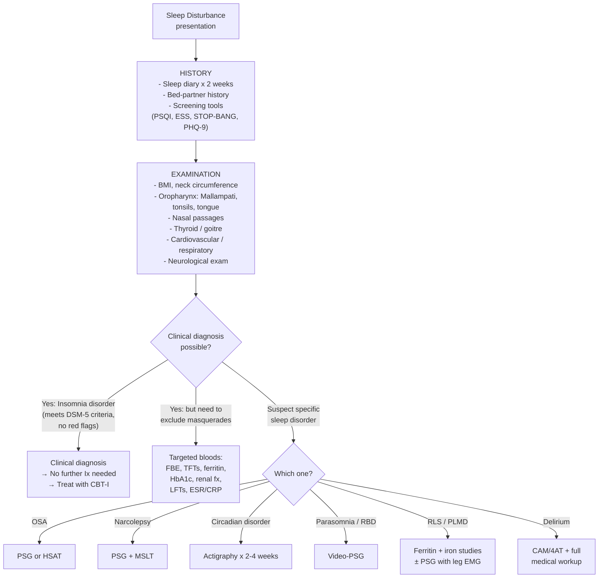

## Diagnostic Criteria, Diagnostic Algorithm and Investigations for Sleep Disturbance

The diagnosis of sleep disturbance is overwhelmingly **clinical** — it is built on a thorough history (including a bed-partner history) and targeted physical examination. Investigations are reserved for specific situations where you suspect an underlying sleep disorder (e.g. OSA, narcolepsy, circadian disorder) or a medical/psychiatric comorbidity driving the insomnia. Let me walk you through this systematically.

---

### 1. Diagnostic Criteria

#### 1.1 Chronic Insomnia Disorder

This is the condition you will encounter most frequently. Two classification systems exist side by side — ICD-10 and DSM-5. You should know both for exams.

##### ***DSM-5 Diagnostic Criteria for Insomnia Disorder*** [1]

***Clinical features: remember the number '3' = ≥30min delay/awake/early wakening for 3×/w × 3mo*** [1]

| Criterion | Detail |
|---|---|
| **A** | ***A predominant complaint of dissatisfaction with sleep quantity or quality, associated with ≥1 of:*** [1] |
| | ***(1) Difficulty initiating sleep. (In children, this may manifest as difficulty initiating sleep without caregiver intervention.)*** [1] |
| | ***(2) Difficulty maintaining sleep, characterised by frequent awakenings or problems returning to sleep after awakenings. (In children, this may manifest as difficulty returning to sleep without caregiver intervention.)*** [1] |
| | ***(3) Early-morning awakening with inability to return to sleep.*** [1] |
| **B** | ***Clinically significant distress or functional impairment.*** [1] — This criterion prevents over-diagnosis in people who sleep "little" but function perfectly well (i.e. natural short sleepers). If there is no daytime consequence, it is not insomnia disorder. |
| **C** | ***The sleep difficulty occurs ≥3 nights per week.*** [1] — Why 3? This threshold separates the normal occasional bad night from a clinically significant pattern. |
| **D** | ***The sleep difficulty is present for ≥3 months.*** [1] — This distinguishes chronic insomnia from short-term/adjustment insomnia ( < 3 months). |
| **E** | ***The sleep difficulty occurs despite adequate opportunity for sleep.*** [1] — This is crucial: a shift worker who only has 4 hours in bed does not have insomnia — they have insufficient sleep opportunity. The patient must have a reasonable window for sleep. |
| **F** | ***The insomnia is not better explained by and does not occur exclusively during the course of another sleep-wake disorder (e.g. narcolepsy, a breathing-related sleep disorder, a circadian rhythm sleep-wake disorder, a parasomnia).*** [1] — However, insomnia can be diagnosed **comorbidly** with these if the insomnia is out of proportion to what the other disorder would explain. |
| **G** | ***The insomnia is not attributable to the physiological effects of a substance (e.g. a drug of abuse, a medication).*** [1] |
| **H** | ***Coexisting mental disorders and medical conditions do not adequately explain the predominant complaint of insomnia.*** [1] — Again, comorbid diagnosis is allowed; this criterion only excludes cases where the insomnia is **entirely** explained by the other condition. |
| **Specify** | ***Episodic (≥1 month, < 3 months), persistent (≥3 months), recurrent (≥2 episodes/year)*** [1] |

<Callout title="The 3-3-3 Rule for Chronic Insomnia" type="idea">
A useful mnemonic: ≥**3**0 min sleep onset latency or wake time, ≥**3** nights per week, for ≥**3** months. If a patient meets all three 3s plus has daytime impairment and adequate sleep opportunity, they have chronic insomnia disorder.
</Callout>

##### ***ICD-10 Diagnostic Criteria for Non-Organic Insomnia (F51.0)*** [1]

Requires ALL of the following:

| Criterion | Detail |
|---|---|
| **(a)** | ***Complaint of difficulty falling asleep or maintaining sleep or of poor quality of sleep*** [1] |
| **(b)** | ***Sleep disturbance occurred ≥3×/week for ≥1 week*** [1] — Note: ICD-10 requires only 1 week (vs DSM-5's 3 months). This is a much lower threshold, meaning ICD-10 captures both acute and chronic insomnia under one code. |
| **(c)** | ***Preoccupation with sleeplessness and excessive concern over its consequences at night and during the day*** [1] — This reflects the psychophysiological component (conditioned arousal, worry about sleep). |
| **(d)** | ***Causes marked distress or interferes with ordinary ADL*** [1] |

<Callout title="ICD-10 vs DSM-5: Key Differences" type="error">
The ICD-10 requires only **1 week** of symptoms; DSM-5 requires **3 months**. This means a patient with 2 weeks of insomnia meets ICD-10 criteria but not DSM-5 criteria (they would be classified as "short-term insomnia" or "other specified insomnia disorder" in DSM-5). In Hong Kong clinical practice, both systems are used — HA coding uses ICD-10; psychiatric research often uses DSM-5.
</Callout>

##### ICSD-3 (International Classification of Sleep Disorders, 3rd Edition — Revised 2023) Criteria for Chronic Insomnia Disorder

The ICSD-3 criteria are essentially harmonised with DSM-5:
- Difficulty initiating/maintaining sleep or early morning awakening
- Adequate opportunity and circumstances for sleep
- Daytime consequences (fatigue, mood disturbance, cognitive impairment, social/occupational dysfunction)
- ≥3 nights per week for ≥3 months
- Not better explained by another sleep disorder

The ICSD-3 also defines **Short-Term Insomnia Disorder** (same criteria but < 3 months duration, often situational).

---

#### 1.2 Obstructive Sleep Apnoea Diagnostic Criteria

***Suspect OSA if snoring at night plus either one of*** [2]:
- ***Excessive daytime sleepiness (EDS)*** [2]
  - ***Mild: activity with little attention needed, e.g. public transport*** [2]
  - ***Moderate: activity with some attention, e.g. conference*** [2]
  - ***Severe: activity with much concentration, e.g. phone call, conversation*** [2]
- ***Meeting any two out of the following*** [2]:
  - ***Intermittent nocturnal arousal*** [2]
  - ***Nocturnal choking*** [2]
  - ***Unrefreshing sleep at wakening*** [2]
  - ***Daytime fatigue*** [2]
  - ***Impaired daytime concentration*** [2]

**Formal diagnosis requires polysomnography (PSG):**

***Apnoea-hypopnoea index (AHI): number of apnoeic/hypopnoeic episodes per sleep hour*** [2]:
- ***Normal = < 5*** [2]
- ***Mild OSA = 5–15*** [2]
- ***Moderate OSA = 15–30*** [2]
- ***Severe OSA = > 30*** [2]
- ***In children, the cut-off is > 1*** [2]

The AASM (American Academy of Sleep Medicine) diagnostic criteria for OSA syndrome require:
1. AHI ≥ 5 events/hour **AND** symptoms (EDS, unrefreshing sleep, fatigue, insomnia, nocturnal gasping/choking/snoring, witnessed apnoeas)
2. **OR** AHI ≥ 15 events/hour regardless of symptoms (because even asymptomatic moderate-severe OSA confers cardiovascular risk)

Why the dual criteria? Because some patients with significant OSA are not subjectively sleepy (possibly due to chronic adaptation or individual variation in arousal threshold), but they still have the cardiovascular and metabolic consequences of repetitive hypoxaemia and sympathetic surges.

---

#### 1.3 Narcolepsy Diagnostic Criteria

***Narcolepsy: predominantly presents with excessive daytime sleepiness, but may also have cataplexy, sleep paralysis, sleep-related hallucinations*** [1]

**ICSD-3 Criteria for Narcolepsy Type 1:**
- **A.** Daily periods of irrepressible need to sleep or daytime lapses into sleep for ≥3 months
- **B.** One or both of:
  1. Cataplexy AND mean sleep latency ≤8 min with ≥2 SOREMPs on MSLT (a SOREMP on the preceding nocturnal PSG may replace one MSLT SOREMP)
  2. CSF hypocretin-1 (orexin-A) ≤110 pg/mL or < 1/3 of mean normal values

**ICSD-3 Criteria for Narcolepsy Type 2:**
- Meets criterion A + MSLT findings (mean latency ≤8 min, ≥2 SOREMPs) BUT no cataplexy AND CSF orexin is normal or not measured

***Multiple sleep latency test (MSLT): multiple trials of naps spaced throughout the day → monitor mean sleep latency + number of REM periods → ≥2 trials with +ve REM sleep indicates narcolepsy*** [12]

Why SOREMP (Sleep-Onset REM Period) is diagnostic: normally, REM sleep does not occur until ~90 minutes into sleep (you go through N1 → N2 → N3 first). In narcolepsy, orexin deficiency destabilises the flip-flop switch → REM intrudes abnormally early → the patient enters REM within 15 minutes of falling asleep. Finding this in ≥2 out of 5 nap opportunities is pathological.

---

#### 1.4 Restless Legs Syndrome Diagnostic Criteria

**IRLSSG (International RLS Study Group) / ICSD-3 Criteria — ALL 5 required:**

1. **Urge to move the legs**, usually accompanied by uncomfortable/unpleasant sensations in the legs
2. Symptoms **begin or worsen during periods of rest** or inactivity (sitting, lying down) — because movement activates dopaminergic pathways that suppress the dysaesthesia
3. Symptoms are **partially or totally relieved by movement** (walking, stretching) — at least as long as the activity continues
4. Symptoms **occur exclusively or predominantly in the evening/night** — because of the circadian nadir of dopamine in the evening
5. The above features are **not solely accounted for** by another condition (leg cramps, positional discomfort, habitual foot tapping, myalgia, venous stasis, arthritis, peripheral neuropathy)

**Supportive features:** family history, response to dopaminergic therapy, periodic limb movements during sleep on PSG.

---

#### 1.5 Delirium Diagnostic Criteria (for Acute Sleep-Wake Disturbance)

Because ***altered sleep-wake cycle is a hallmark of delirium*** [8], you must exclude delirium in any acute sleep disturbance, especially in hospitalised/elderly patients.

##### ***DSM-5 Diagnostic Criteria for Delirium*** [8]

| Criterion | Detail |
|---|---|
| ***A*** | ***A disturbance in attention and awareness.*** [8] |
| ***B*** | ***The disturbance develops over a short period of time (usually hours to a few days), represents a change from baseline attention and awareness and tends to fluctuate in severity during the course of a day.*** [8] |
| ***C*** | ***An additional disturbance in cognition (e.g. memory deficit, disorientation, language…).*** [8] |
| ***D*** | ***Not better explained by another pre-existing, established or evolving neurocognitive disorder and does not occur in the context of a severely reduced level of arousal (e.g. coma).*** [8] |
| ***E*** | ***Evidence from Hx, P/E, Ix that the disturbance is a direct physiological consequence of another medical condition, substance intoxication or withdrawal, or exposure to toxin or is due to multiple aetiologies.*** [8] |

---

### 2. Diagnostic Algorithm

The following algorithm provides a systematic clinical approach to any patient presenting with sleep disturbance, integrating the history-taking framework, screening tools, and targeted investigations.

---

### 3. Investigation Modalities

The approach to investigation in sleep disturbance follows a tiered logic:

1. **Most cases of insomnia require no investigations** — the diagnosis is clinical
2. **Targeted blood tests** exclude masquerade conditions
3. **Sleep-specific investigations** (diary, actigraphy, PSG, MSLT) are reserved for when a specific sleep disorder is suspected

***Key investigations*** [5]:
***Nil for most cases. Others according to history and findings.***

---

#### 3.1 Screening Questionnaires

These are your first-line "investigations" — they are cheap, quick, and help quantify the problem and guide further workup.

| Tool | What It Measures | Scoring & Interpretation | When to Use |
|---|---|---|---|
| ***Pittsburgh Sleep Quality Index (PSQI)*** | Global sleep quality over the past month across 7 domains (subjective quality, latency, duration, efficiency, disturbances, medication use, daytime dysfunction) | 0–21 scale; ***significant sleep disturbance = > 5/21 points*** [1] | Any patient with sleep complaint — good for baseline assessment and monitoring treatment response |
| ***Sleep Problems Questionnaire*** | Specific sleep complaints | ***Significant sleep disturbance = ≥4 on any single item*** [1] | Alternative to PSQI |
| **Insomnia Severity Index (ISI)** | Insomnia severity and impact | 0–28; 0–7 = no insomnia, 8–14 = subthreshold, 15–21 = moderate, 22–28 = severe | Preferred by AASM guidelines for tracking insomnia treatment outcomes |
| ***Epworth Sleepiness Scale (ESS)*** | Daytime sleepiness — rates likelihood of dozing in 8 situations | 0–24; ≥10 = excessive daytime sleepiness [2] | Any patient with EDS; essential for OSA workup |
| **STOP-BANG Questionnaire** | OSA risk screening | **S**noring, **T**iredness, **O**bserved apnoeas, **P**ressure (HTN), **B**MI > 35, **A**ge > 50, **N**eck > 40cm, **G**ender male; ≥3 = intermediate-high risk | Screening before sleep study referral; pre-operative screening |
| **PHQ-9** | Depression screening | 0–27; ≥10 = moderate depression | When terminal insomnia or low mood is present |
| **GAD-7** | Anxiety screening | 0–21; ≥10 = moderate anxiety | When initial insomnia with excessive worry is present |
| **Confusion Assessment Method (CAM)** / **4AT** | Delirium screening | CAM: 4 features (acute onset, inattention, disorganised thinking, altered consciousness); 4AT: 0–12 score, ≥4 = possible delirium | Any acute sleep-wake disturbance in hospitalised/elderly patient |

<Callout title="STOP-BANG Mnemonic for OSA Screening">
**S** = Snoring (loud enough to be heard through closed doors?)
**T** = Tired (daytime sleepiness/fatigue?)
**O** = Observed apnoeas (has anyone witnessed you stop breathing?)
**P** = Pressure (treated for hypertension?)
**B** = BMI > 35
**A** = Age > 50
**N** = Neck circumference > 40 cm (16 inches)
**G** = Gender = male

Score ≥3 → intermediate-to-high risk → consider sleep study.
</Callout>

---

#### 3.2 Sleep Diary

***Sleep diary: as above, to document sleep and wake habit over a period of time*** [12]

***Prefer sleep diary over 2-week period*** [1]

**What it records (typically over 14 consecutive days):**
- Time got into bed
- Time attempted to fall asleep (sleep onset time)
- Estimated sleep onset latency (how long to fall asleep)
- Number of awakenings and duration of each
- Final wake time and time out of bed
- Naps (timing and duration)
- Caffeine, alcohol, medication use
- Subjective sleep quality rating

**What you derive from it:**

| Parameter | Calculation | Clinical Significance |
|---|---|---|
| **Total Time in Bed (TIB)** | Time out of bed − time into bed | Often excessive in insomnia patients (perpetuating factor) |
| **Total Sleep Time (TST)** | TIB − (sleep onset latency + wake after sleep onset + terminal wakefulness) | Actual amount of sleep obtained |
| **Sleep Efficiency (SE)** | TST / TIB × 100% | Normal ≥ 85%. In insomnia, often 50–70%. A key target in sleep restriction therapy. |
| **Sleep Onset Latency (SOL)** | Time to fall asleep after attempting | ≥30 min = clinically significant (initial insomnia) |
| **Wake After Sleep Onset (WASO)** | Total time awake during the night after initially falling asleep | ≥30 min = clinically significant (middle insomnia) |

**Why it matters:** The sleep diary is the foundation of CBT-I. It identifies perpetuating factors (e.g. spending 10 hours in bed but only sleeping 5 → SE 50% → needs sleep restriction). It also reveals circadian patterns (delayed phase: consistently falling asleep at 3 AM and waking at 11 AM).

---

#### 3.3 Actigraphy

***Actigraphy: watch-like device to assess rest-activity/sleep-wakefulness for days/weeks*** [12]
***Measures activity through light and movement*** [12]
***Useful in assessing circadian rhythm disorder and insomnia*** [12]

**How it works:** A wrist-worn accelerometer detects movement. Movement = wakefulness; stillness = sleep (inferred). Modern actigraphs also include a light sensor (detecting ambient light exposure, which is useful for circadian assessment).

**Advantages over sleep diary:** Objective (no recall bias); continuous monitoring for weeks; less burdensome for patients.

**Limitations:** Cannot distinguish sleep stages (no EEG); cannot detect apnoeas; overestimates sleep in quiet wakefulness (patient lying still but awake is counted as sleep).

**When to use:**
- ***As adjunct to sleep diary when suspecting circadian sleep-wake disorder*** [1] — confirms the phase relationship between sleep and the light-dark cycle
- Monitoring treatment response in insomnia
- When patient reliability with sleep diary is questionable (e.g. cognitive impairment)
- Not as a standalone diagnostic tool for OSA or narcolepsy

---

#### 3.4 Polysomnography (PSG)

***Overnight sleep study (polysomnography): measures multiple physiological parameters overnight*** [12]

PSG is the **gold standard** for diagnosing sleep-disordered breathing, narcolepsy, PLMD, and parasomnias. It is **NOT** routinely indicated for insomnia (insomnia is a clinical diagnosis).

***Only when suspect another sleep disorder, e.g. OSA*** [1]

**What it measures (and why):**

| Channel | Parameters | Clinical Significance |
|---|---|---|
| **EEG** (electroencephalogram) | Brain electrical activity; multiple leads (typically F3, F4, C3, C4, O1, O2) | Sleep staging (N1, N2, N3, REM, Wake). Identifies sleep architecture disruption, sleep onset latency, WASO, and SOREMPs in narcolepsy. |
| **EOG** (electro-oculogram) | Eye movements | REM detection (rapid conjugate eye movements). Distinguishes REM from NREM. |
| **EMG** (electromyogram) — chin and legs | Muscle tone (submental) and limb movements (anterior tibialis) | Chin EMG: loss of tone during REM → if tone persists = RBD. Leg EMG: periodic limb movements (≥0.5–10s duration, every 5–90s, amplitude ≥8μV above baseline → PLM index ≥15/h = PLMD). |
| **Nasal airflow** | Thermistor (qualitative, detects apnoea) + nasal pressure transducer (quantitative, detects hypopnoea) | Apnoea = complete cessation ≥10s. Hypopnoea = ≥30% reduction in airflow with ≥3–4% desaturation or arousal. These two channels together generate the **AHI**. |
| **Thoracoabdominal effort** | Respiratory inductance plethysmography (RIP) bands on chest and abdomen | Distinguishes **obstructive** apnoea (effort continues but no airflow → chest/abdomen move out of phase, "paradoxical" breathing) from **central** apnoea (no effort AND no airflow → both channels flat). |
| **Pulse oximetry (SpO₂)** | Oxygen saturation | Desaturation index; nadir SpO₂; % time spent < 90%. Quantifies the hypoxaemic burden of apnoeas. |
| **ECG** | Heart rhythm | Detects arrhythmias associated with apnoeas (sinus bradycardia during apnoea → tachycardia on arousal; AF; heart block). |
| **Body position** | Supine/lateral/prone | Positional OSA: AHI significantly worse in supine (because gravity pulls tongue/palate posteriorly) → may guide treatment (positional therapy). |
| **Snoring sensor** | Microphone or vibration sensor | Quantifies snoring intensity. |
| **Video** (video-PSG) | Infrared camera | Essential for diagnosing parasomnias (see the behaviour), epilepsy (seizure semiology), RBD (dream enactment). |

**Key PSG findings by condition:**

| Condition | PSG Findings | Interpretation |
|---|---|---|
| **OSA** | AHI ≥5/h; obstructive apnoeas/hypopnoeas (effort present, no/reduced airflow); desaturations; arousals terminating events; cyclical pattern | Upper airway collapse during sleep → hypoxaemia → arousal → re-opening → repeat |
| **Central Sleep Apnoea** | Central apnoeas (absent airflow AND absent effort); may show Cheyne-Stokes pattern (crescendo-decrescendo in tidal volume) | Loss of ventilatory drive during sleep; oscillatory control instability (e.g. in HF) |
| **PLMD** | PLM index ≥15/h in adults (≥5/h in children); stereotyped dorsiflexion of ankle/toe, 0.5–10s duration, 5–90s intervals | Repetitive movements → cortical arousals → sleep fragmentation |
| **Narcolepsy** | Short sleep latency; SOREMP on overnight PSG (< 15 min into sleep); fragmented sleep architecture | Flip-flop switch instability → rapid REM intrusion |
| **RBD** | ***REM sleep without atonia (RSWA)*** on chin/limb EMG; increased phasic EMG activity during REM; dream-enactment behaviour on video | Loss of normal glycinergic inhibition of spinal motor neurons during REM → motor activity during dreams |
| **Insomnia** (when performed) | Prolonged sleep onset latency; frequent arousals; ↓ sleep efficiency; ↑ N1, ↓ N3; ↓ total sleep time | Objective confirmation of poor sleep; may reveal **paradoxical insomnia** (normal PSG despite subjective complaint) |

<Callout title="When NOT to Order PSG">
PSG is **not indicated** for routine insomnia evaluation. It is expensive, labour-intensive, and the insomnia patient often sleeps even worse in the unfamiliar sleep lab environment ("first-night effect"). Reserve PSG for: (1) suspected OSA, (2) suspected narcolepsy (followed by MSLT), (3) suspected parasomnia (video-PSG), (4) suspected PLMD, (5) treatment-refractory insomnia where an occult sleep disorder is suspected.
</Callout>

---

#### 3.5 Home Sleep Apnoea Test (HSAT) / Portable Monitoring

A simplified alternative to in-lab PSG for **uncomplicated suspected OSA** in patients with a high pre-test probability. Measures airflow, respiratory effort, and SpO₂ (minimum 4 channels), but does NOT include EEG (so cannot stage sleep).

**Advantages:** Cheaper, more accessible, patient sleeps in own bed (more representative).
**Limitations:** Underestimates AHI (because it divides events by recording time, not actual sleep time — if the patient is awake for 2 hours, those hours dilute the index). Cannot diagnose central sleep apnoea, PLMD, or parasomnias. Not suitable for patients with significant comorbidities (HF, COPD, neuromuscular disease) where central apnoea or hypoventilation may coexist.

**Current guideline (AASM 2017):** HSAT is acceptable for diagnosing OSA in patients with high pre-test probability (STOP-BANG ≥5, or clinician assessment) without significant comorbidities. A **negative HSAT does not exclude OSA** — if clinical suspicion remains, proceed to in-lab PSG.

---

#### 3.6 Multiple Sleep Latency Test (MSLT)

***Daytime sleep study: usually follows overnight study, similar monitoring during daytime*** [12]
***Multiple sleep latency test (MSLT): multiple trials of naps spaced throughout the day → monitor mean sleep latency + number of REM periods*** [12]

**Protocol:**
1. Performed the day after an overnight PSG (to document adequate prior-night sleep of ≥6 hours)
2. Patient given 5 nap opportunities at 2-hour intervals (e.g. 9 AM, 11 AM, 1 PM, 3 PM, 5 PM)
3. In each trial, the patient lies in a dark, quiet room and is told to try to fall asleep
4. If they fall asleep, they are allowed to sleep for 15 minutes, then woken
5. If they don't fall asleep within 20 minutes, the trial ends
6. **Measures:** Sleep onset latency for each trial and presence/absence of REM sleep (SOREMP = REM onset within 15 minutes of sleep onset)

**Interpretation:**

| Finding | Meaning |
|---|---|
| Mean sleep latency < 8 min | Pathological sleepiness |
| Mean sleep latency 8–10 min | Borderline |
| Mean sleep latency > 10 min | Normal (no objective excessive sleepiness) |
| ***≥2 SOREMPs*** | ***Indicates narcolepsy*** [12] (a SOREMP on the preceding night's PSG may count as one) |
| < 2 SOREMPs with short latency | Excessive sleepiness from another cause (sleep deprivation, OSA, drugs); or narcolepsy type 2 if all other causes excluded |

**Why SOREMPs are significant:** Normal individuals do NOT enter REM during short naps because the NREM → REM sequence takes ~60–90 minutes. Entering REM within 15 minutes of sleep onset means the REM-generating circuitry is disinhibited — this is the hallmark of orexin/hypocretin deficiency in narcolepsy.

**Important caveats:**
- Must discontinue REM-suppressing medications (SSRIs, SNRIs, TCAs, MAOIs) ≥14 days before the test (these drugs suppress REM and can cause false-negative SOREMPs)
- Must have adequate prior-night sleep (documented by PSG) — sleep deprivation itself can cause short sleep latency and SOREMPs
- Must exclude OSA on the prior-night PSG (OSA → sleep fragmentation → short sleep latency on MSLT, which would be a false positive for narcolepsy)

---

#### 3.7 Maintenance of Wakefulness Test (MWT)

***Maintenance of wakefulness test (MWT): multiple trials of staying awake under sleep-inducing stimuli*** [12]

**Protocol:** Patient sits in a dimly lit room and is asked to try to **stay awake** (opposite of MSLT). Four 40-minute trials at 2-hour intervals.

**Interpretation:** Mean sleep latency < 8 min = pathologically unable to maintain wakefulness; < 40 min = impaired ability. Used primarily to assess **fitness to drive or operate machinery** after treatment of sleep disorders (e.g. after starting CPAP for OSA). Not a diagnostic test for a specific disorder.

---

#### 3.8 Laboratory Investigations (Blood Tests)

***Key investigations*** [5]:
***Nil for most cases. Others according to history and findings.***

***Consider*** [5]:
- ***FBE*** [5]
- ***ESR/CRP*** [5]
- ***LFTs (γGT)*** [5]

The rationale for each:

| Investigation | Indication | What You're Looking For | Why |
|---|---|---|---|
| ***FBE (Full Blood Examination)*** [5] | Fatigue, RLS | Anaemia (↓ Hb); microcytic (iron deficiency → RLS); macrocytic (B12/folate deficiency, alcohol) | Iron deficiency is the most important secondary cause of RLS. Anaemia causes fatigue that may be misinterpreted as sleepiness. |
| ***ESR/CRP*** [5] | Suspected inflammatory/malignant cause of pain, fatigue | ↑ ESR/CRP → chronic inflammation, infection, malignancy | Screens for occult serious disease presenting with sleep disturbance (e.g. cancer pain, rheumatological disease). |
| ***LFTs (γGT)*** [5] | Suspected alcohol excess | ***γGT*** is a sensitive marker of chronic alcohol intake (induced by alcohol via CYP enzymes) | Alcohol is a major cause of sleep disruption. ↑ γGT without ↑ other LFTs (ALP, ALT) suggests chronic alcohol use. |
| **Ferritin** | RLS | Low ferritin ( < 75 μg/L in RLS guidelines, < 30 μg/L is definitely deficient) | Iron is a cofactor for tyrosine hydroxylase (rate-limiting enzyme for dopamine synthesis). Low brain iron → ↓ dopamine → RLS. Target ferritin > 75 μg/L. |
| **Iron studies** (serum iron, transferrin, TIBC, transferrin saturation) | RLS, fatigue | Iron deficiency pattern (↓ serum iron, ↓ transferrin saturation, ↑ TIBC) | Complements ferritin (ferritin is an acute-phase reactant — can be falsely normal in inflammation) |
| **TFTs (Thyroid Function Tests)** | ***Thyroid/other endocrine: hyperthyroid*** [5]; also hypothyroidism → OSA | Hyperthyroidism: ↓ TSH, ↑ free T4 → hyperarousal → insomnia. Hypothyroidism: ↑ TSH, ↓ free T4 → myxoedema of URT → OSA; ↓ ventilatory drive; fatigue. | Always check in sleep disturbance — thyroid disease is common and treatable. |
| **Renal function (Cr, eGFR, urea)** | RLS, nocturia, fatigue | Uraemia → secondary RLS (uraemic toxins impair dopaminergic function); polyuria from CKD | |
| **HbA1c / Fasting glucose** | ***Diabetes*** [5]; nocturia, neuropathy | Undiagnosed DM → osmotic diuresis → nocturia; peripheral neuropathy → neuropathic pain / RLS-like symptoms | |
| **Calcium, Phosphate, Magnesium** | Muscle cramps, arrhythmia | Hypocalcaemia/hypomagnesaemia → muscle cramps/spasms at night → middle insomnia | |
| **CSF orexin/hypocretin-1** | Suspected narcolepsy type 1 (when MSLT equivocal or unavailable) | ≤110 pg/mL or < 1/3 of mean normal = diagnostic of narcolepsy type 1 | Reflects loss of orexin-producing neurons; very specific (~99%) |

---

#### 3.9 Imaging and Other Investigations

| Investigation | Indication | What It Shows |
|---|---|---|
| **Lateral cephalometry** | OSA with suspected craniofacial abnormality; surgical planning | X-ray measurement of mandible, maxilla, hyoid bone position, posterior airway space. Identifies retrognathia, micrognathia, low hyoid. |
| **Nasopharyngoscopy / Müller's manoeuvre** | OSA surgical planning | Direct visualisation of upper airway. Müller's manoeuvre (forced inspiration against closed mouth/nose during nasopharyngoscopy) assesses dynamic collapsibility of oropharyngeal tissues [2]. |
| **MRI Brain** | Suspected narcolepsy (exclude structural lesion), RBD (brainstem pathology), neurodegeneration | May show hypothalamic/brainstem lesions; usually normal in idiopathic narcolepsy; brainstem changes in MSA/DLB. |
| **Drug-induced sleep endoscopy (DISE)** | OSA surgical planning | Under propofol sedation, nasopharyngoscopy identifies site and pattern of upper airway collapse — guides surgical intervention. |
| **Overnight pulse oximetry** | OSA screening where PSG unavailable | Oxygen desaturation index (ODI ≥5/h with sawtooth pattern suggests OSA); limited sensitivity (misses events without significant desaturation). |
| **ECG / Echocardiography** | OSA with suspected cardiac complications; PND → HF evaluation | ECG: AF, LVH, bradycardia-tachycardia pattern. Echo: LV function, diastolic dysfunction, pulmonary hypertension (cor pulmonale from chronic hypoxaemia). |
| **ABG** | Suspected OHS or chronic respiratory failure | PaCO₂ > 45 mmHg with obesity → OHS. PaO₂ < 60 mmHg → chronic hypoxaemia. Daytime hypercapnia in an obese patient with OSA = OHS until proven otherwise. |

---

#### 3.10 Summary: Investigation Pathway by Clinical Scenario

| Clinical Scenario | First-Line Investigation | Second-Line / Confirmatory |
|---|---|---|
| **Simple insomnia** (no red flags) | Sleep diary × 2 weeks; PSQI or ISI; screen for depression (PHQ-9) and anxiety (GAD-7) | Nil further if clinical diagnosis is clear |
| **Suspected OSA** | STOP-BANG; Epworth Sleepiness Scale; sleep diary | PSG (gold standard) or HSAT (if uncomplicated, high pre-test probability) |
| **Suspected narcolepsy** | Clinical assessment; ESS | Overnight PSG followed by MSLT the next day; ± CSF orexin-1 |
| **Suspected RLS** | Clinical diagnosis (IRLSSG criteria); ferritin + iron studies; renal function | PSG with anterior tibialis EMG (if PLMD suspected or diagnosis uncertain) |
| **Suspected circadian disorder** | Sleep diary × 2–4 weeks; actigraphy ± light sensor | Dim-light melatonin onset (DLMO) measurement (research/specialist only) |
| **Suspected parasomnia** | Clinical history + bed-partner history | Video-PSG (to visualise behaviour and correlate with sleep stage/EMG) |
| **Acute sleep-wake disturbance in hospital** | CAM or 4AT for delirium screening; targeted medical workup (FBE, CMP, UEC, CXR, urinalysis, drug levels, blood cultures) | As guided by delirium evaluation |
| ***Masquerade screen*** [5] | ***FBE, ESR/CRP, LFTs (γGT)*** [5]; add TFTs, HbA1c, ferritin, renal function based on clinical suspicion | As guided by results |

---

### 4. Putting It All Together: The Integrated Diagnostic Approach

---

> **Key Diagnostic Principles:**
> 1. ***Insomnia is a clinical diagnosis*** — sleep diary + screening tools are sufficient. PSG is NOT routine.
> 2. ***The DSM-5 "3-3-3" rule*** for chronic insomnia: ≥30 min SOL/WASO, ≥3 nights/week, ≥3 months.
> 3. ***OSA requires PSG*** (or HSAT) for formal diagnosis and severity grading (AHI).
> 4. ***Narcolepsy requires PSG + MSLT*** — look for ≥2 SOREMPs with mean sleep latency ≤8 min.
> 5. ***Always screen for masquerades***: FBE, TFTs, ferritin, HbA1c, renal function, LFTs, ESR/CRP.
> 6. ***Always screen for delirium*** in acute hospital settings — CAM or 4AT.
> 7. ***Actigraphy*** is the investigation of choice for circadian rhythm disorders.

---

<Callout title="High Yield Summary">

**Diagnostic Criteria & Investigations — Key Takeaways:**

1. **Chronic insomnia (DSM-5)**: Difficulty initiating/maintaining sleep OR early awakening + daytime impairment + ≥3 nights/week + ≥3 months + adequate sleep opportunity + not explained by another sleep/medical/psychiatric/substance disorder. Remember the **3-3-3 rule**.

2. **ICD-10** has a lower threshold (≥1 week vs ≥3 months).

3. **OSA diagnosis**: AHI ≥5/h with symptoms OR AHI ≥15/h regardless. Severity: Mild 5–15, Moderate 15–30, Severe > 30.

4. **Narcolepsy**: MSLT showing mean sleep latency ≤8 min + ≥2 SOREMPs, OR CSF orexin ≤110 pg/mL.

5. **RLS**: Purely clinical diagnosis — 5 IRLSSG criteria. Check ferritin (target > 75 μg/L) and renal function.

6. **PSG is NOT for insomnia** — it is for OSA, narcolepsy, PLMD, and parasomnias.

7. **Sleep diary** is the most important first-line tool — derives sleep efficiency, SOL, WASO, and reveals circadian patterns.

8. **HSAT** is acceptable for uncomplicated OSA but negative HSAT does not exclude OSA.

9. **Masquerade screen bloods**: FBE, ESR/CRP, LFTs (γGT), TFTs, ferritin, HbA1c, renal function.

10. **Delirium screening** (CAM/4AT) is mandatory for any acute sleep-wake disturbance in hospitalised/elderly patients.
</Callout>

---

<ActiveRecallQuiz
  title="Active Recall - Diagnostic Criteria, Algorithm and Investigations"
  items={[
    {
      question: "State the DSM-5 diagnostic criteria for Insomnia Disorder. What is the '3-3-3 rule'?",
      markscheme: "Criteria: (A) Dissatisfaction with sleep quantity/quality with difficulty initiating, maintaining, or early-morning awakening; (B) Clinically significant distress or functional impairment; (C) Occurs at least 3 nights per week; (D) Present for at least 3 months; (E) Despite adequate opportunity for sleep; (F) Not better explained by another sleep-wake disorder; (G) Not attributable to substance effects; (H) Comorbid conditions do not adequately explain it. The 3-3-3 rule: at least 30 min sleep onset latency or WASO, at least 3 nights per week, for at least 3 months.",
    },
    {
      question: "A STOP-BANG score of 5 is obtained in a 55-year-old obese man with snoring. What is the next investigation and what values on that investigation define mild, moderate, and severe OSA?",
      markscheme: "Next investigation: Polysomnography (PSG) or Home Sleep Apnoea Test (HSAT). AHI severity grading: Mild = 5-15 events/hour; Moderate = 15-30/hour; Severe = greater than 30/hour. Normal is less than 5/hour. In children, the cut-off is greater than 1/hour.",
    },
    {
      question: "Describe the MSLT protocol and explain what finding is diagnostic of narcolepsy and why it is pathological from first principles.",
      markscheme: "Protocol: Performed day after overnight PSG; 5 nap opportunities at 2-hour intervals; patient asked to try to sleep; each nap up to 20 min; measure sleep onset latency and presence of REM. Diagnostic: Mean sleep latency 8 min or less with 2 or more SOREMPs (Sleep-Onset REM Periods, defined as REM within 15 min of sleep onset). Why pathological: Normal REM latency is 60-90 min through the NREM-to-REM sequence. SOREMPs indicate disinhibition of REM-generating circuitry due to orexin/hypocretin deficiency, which destabilises the wake-sleep flip-flop switch.",
    },
    {
      question: "When is PSG indicated and when is it NOT indicated in sleep disturbance? List 5 indications and explain why insomnia is not one of them.",
      markscheme: "Indications: (1) Suspected OSA, (2) Suspected narcolepsy (precedes MSLT), (3) Suspected PLMD, (4) Suspected parasomnia (video-PSG), (5) Treatment-refractory insomnia where an occult sleep disorder is suspected. NOT indicated for routine insomnia because: insomnia is a clinical diagnosis based on history; PSG is expensive, labour-intensive; the first-night effect worsens sleep in the unfamiliar lab setting; and the sleep diary provides the key parameters (sleep efficiency, SOL, WASO) needed for both diagnosis and CBT-I planning.",
    },
    {
      question: "What blood tests should you consider as a 'masquerade screen' in a patient with sleep disturbance? For each test, state what condition it screens for.",
      markscheme: "FBE: anaemia, iron deficiency (RLS). ESR/CRP: occult inflammatory or malignant disease. LFTs with gamma-GT: alcohol excess. TFTs: hyperthyroidism (hyperarousal insomnia) or hypothyroidism (OSA, fatigue). Ferritin and iron studies: iron deficiency causing RLS (target ferritin greater than 75 in RLS). HbA1c/fasting glucose: diabetes (nocturia, neuropathy). Renal function: uraemia causing secondary RLS.",
    },
    {
      question: "How does actigraphy differ from polysomnography? When is actigraphy the preferred investigation?",
      markscheme: "Actigraphy: wrist-worn accelerometer measuring movement as proxy for sleep-wake; records for days to weeks; measures rest-activity patterns and light exposure; cannot stage sleep or detect apnoeas. PSG: in-lab multi-channel recording (EEG, EOG, EMG, airflow, SpO2, etc.); single-night; provides sleep staging, AHI, PLM index, REM atonia assessment. Actigraphy is preferred for: circadian rhythm sleep-wake disorders (documents phase relationships over extended period), adjunct to sleep diary in insomnia monitoring, and when patient reliability with sleep diary is questionable.",
    },
  ]}
/>

---

## References

[1] Senior notes: Ryan Ho Psychiatry.pdf (Section 9.2.3 Insomnia, pp. 221–224)
[2] Senior notes: Ryan Ho Respiratory.pdf (Section 3.8 Sleep-Associated Disorders, pp. 155–161)
[5] Lecture slides: murtagh merge.pdf (pp. 61–62 — Insomnia)
[8] Senior notes: Ryan Ho Psychiatry.pdf (Section on Delirium, p. 75); Ryan Ho Fundamentals.pdf (Section 3.4.5 Delirium, p. 325)
[12] Senior notes: Ryan Ho Psychiatry.pdf (Section on Sleep investigations, p. 221)
