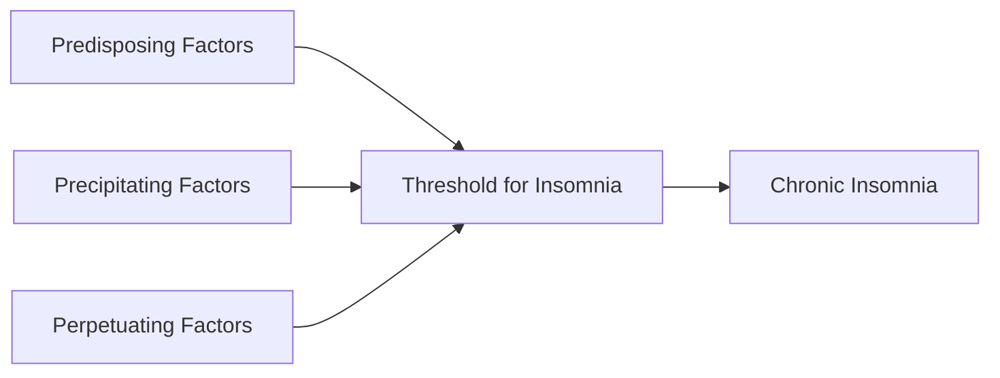

# Sleep Disturbance

## 1. Definition

**Sleep disturbance** is an umbrella term encompassing any condition in which the quality, timing, or amount of sleep is altered, leading to daytime distress or functional impairment. It includes:

- **Insomnia** (difficulty initiating or maintaining sleep, or early-morning awakening)
- **Sleep-disordered breathing** (obstructive sleep apnoea, central sleep apnoea, obesity-hypoventilation syndrome)
- **Hypersomnolence disorders** (narcolepsy, idiopathic hypersomnia)
- **Circadian rhythm sleep-wake disorders** (delayed/advanced sleep phase, shift-work disorder, jet lag)
- **Parasomnias** (sleepwalking, night terrors, REM sleep behaviour disorder)
- **Sleep-related movement disorders** (restless legs syndrome, periodic limb movement disorder)

The word "insomnia" derives from Latin: *in-* (not) + *somnus* (sleep) — literally "not sleeping." "Parasomnia" = *para-* (beside/abnormal) + *somnus* (sleep) — abnormal events during sleep.

<Callout title="Clinical Terminology">
In Hong Kong clinical practice, "sleep disturbance" is the most commonly used presenting-complaint term. It is NOT a diagnosis — your job is to find the underlying cause and classify it according to the International Classification of Sleep Disorders (ICSD-3, revised 2023) or DSM-5-TR.
</Callout>

---

## 2. Epidemiology

### 2.1 Global and Hong Kong Burden

- **Insomnia** is the most common sleep disturbance worldwide:
  - ***Prevalence 22.1% under DSM-IV (1-month criterion) and 10.8% under DSM-5 (3-month criterion)*** [1]
  - Hong Kong community surveys show ~30–40% of adults report at least one insomnia symptom; ~10% meet criteria for chronic insomnia disorder
  - Hong Kong has a uniquely high burden linked to long working hours, small living spaces (noise, light pollution), high population density, and high academic/occupational stress
- **Obstructive Sleep Apnoea (OSA)**:
  - ***OSA syndrome (AHI ≥5/h + sleepiness): 4% in males, 2% in females in middle age*** [2]
  - ***OSA (AHI ≥5/h alone) is much higher (~2× prevalence)*** [2]
  - In Hong Kong, prevalence mirrors Western data; may be underdiagnosed in the Chinese population because craniofacial features (e.g. relative retrognathia, shorter maxillary length) predispose even at lower BMI
- **Restless Legs Syndrome (RLS)**: 2–5% worldwide, slightly lower in East Asian populations (~1–2%)
- **Narcolepsy**: rare (~0.02–0.05%), but important differential for excessive daytime sleepiness

### 2.2 Demographics and Trends

| Factor | Effect on Sleep Disturbance |
|---|---|
| Age | Insomnia prevalence ↑ with age (physiological ↓ in slow-wave sleep); OSA peaks in middle age (40–65y); parasomnias peak in children |
| Sex | Insomnia ↑ in females (2:1), likely hormonal + psychosocial; OSA ↑ in males (2–3:1, equalises post-menopause) |
| Psychiatric comorbidity | ***Depression, anxiety, somatisation*** strongly associated with insomnia [1] |
| Obesity | ***Respiratory: obesity-hypoventilation syndrome, dyspnoea, OSA*** [3] |
| Shift work | Very common in HK (healthcare workers, transport industry) — circadian disruption |

---

## 3. Risk Factors

Understanding risk factors requires the **3P Model** (Spielman's Model), which is the dominant framework for chronic insomnia — but the logic applies to all sleep disturbances:

### 3.1 The 3P Model of Insomnia

***Multifactorial: generally a result of a combination of bio-, psycho-, social factors → 3P model*** [1]

| Factor | Examples | Explanation |
|---|---|---|
| **Predisposing** (trait-level vulnerability) | Genetic tendency to hyperarousal; female sex; anxious temperament; family history of insomnia | These raise your baseline "sleep vulnerability" — you are closer to the threshold even before a stressor hits |
| **Precipitating** (acute triggers) | Life stressors (bereavement, exams, job loss); acute medical illness; pain; jet lag; new medication | These push you over the threshold — acute insomnia begins |
| **Perpetuating** (maladaptive behaviours that maintain insomnia) | Excessive time in bed; napping; clock-watching; caffeine/alcohol use; irregular sleep schedule; conditioned arousal in the bedroom | Even after the precipitant resolves, these keep insomnia going — ***Chronic insomnia is more due to perpetuating factors*** [1] |

<Callout title="High Yield – 3P Model" type="idea">
The 3P model explains why acute insomnia (e.g. exam stress) becomes chronic: the original stressor resolves, but the patient has developed maladaptive sleep behaviours (perpetuating factors) that sustain the problem. This is exactly why CBT-I (Cognitive Behavioural Therapy for Insomnia) targets perpetuating factors and is first-line.
</Callout>

### 3.2 Specific Risk Factors by Category

**Demographic:**
- Older age, female sex, lower socioeconomic status, divorced/widowed

**Medical:**
- ***Pain, night sweating, hot flushes, cancer, COPD, PD (Parkinson's Disease)*** [1]
- ***GERD*** — nocturnal acid reflux causes micro-arousals and is an independent risk factor for sleep disturbance [4]
- Heart failure (paroxysmal nocturnal dyspnoea, orthopnoea)
- Nocturia (prostatic disease, diabetes, UTI)
- Pruritus (eczema, liver disease, uraemia)

**Psychiatric:**
- ***Depression, anxiety, schizophrenia*** [1]
- Substance use disorders

**Pharmacological / ***Drugs*****:**
- ***Stimulants, alcohol, beta-blockers, SSRIs, steroids*** [5]
- Caffeine, nicotine
- Diuretics (nocturia)
- Theophylline, decongestants (sympathomimetic)
- Chronic opioid use (central sleep apnoea)

**Sleep-specific:**
- ***Circadian sleep-wake disorder, OSA, periodic limb movement disorder*** [1]
- Poor sleep hygiene

***Masquerades checklist*** [5]:
- ***Depression***
- ***Diabetes***
- ***Drugs: stimulants, alcohol, beta blockers, SSRIs, steroids***
- ***Thyroid/other endocrine: hyperthyroid***
- ***Spinal dysfunction***
- ***Urinary tract infection: nocturia***

---

## 4. Normal Sleep: Anatomy, Physiology and Function

You cannot understand sleep disturbance without understanding normal sleep architecture.

### 4.1 Sleep-Wake Regulation: The Two-Process Model

Sleep is regulated by two independent but interacting processes:

| Process | Name | Mechanism |
|---|---|---|
| **Process S** (Homeostatic) | Sleep pressure | Adenosine accumulates in the basal forebrain during wakefulness → the longer you are awake, the stronger the drive to sleep. Caffeine blocks adenosine A₁/A₂A receptors — that's why it keeps you awake. |
| **Process C** (Circadian) | Circadian alerting signal | The suprachiasmatic nucleus (SCN) in the anterior hypothalamus acts as the master clock, entrained by light via the retinohypothalamic tract → SCN drives alerting signals during the day. Melatonin (from pineal gland, peaks ~2–4 AM) reinforces the circadian night signal. |

Sleep occurs when Process S (high sleep pressure) coincides with Process C (low circadian alerting signal, i.e. nighttime).

***Factors affecting sleep patterns*** [2]:
1. ***Age***
2. ***Prior sleep history***
3. ***Circadian rhythms***
4. ***Drug ingestion***
5. ***Pathological states***

### 4.2 Key Neuroanatomy of Sleep

| Structure | Role |
|---|---|
| **Suprachiasmatic nucleus (SCN)** | Master circadian clock; receives photic input from retinal ganglion cells |
| **Ventrolateral preoptic nucleus (VLPO)** | "Sleep switch" — GABAergic/galanin neurons that inhibit arousal centres to promote sleep |
| **Ascending reticular activating system (ARAS)** | Brainstem nuclei (locus coeruleus [noradrenaline], raphe nuclei [serotonin], tuberomammillary nucleus [histamine], pedunculopontine/laterodorsal tegmental nuclei [acetylcholine]) that promote wakefulness |
| **Lateral hypothalamus (orexin/hypocretin neurons)** | Stabilise the wake state — loss of these neurons → narcolepsy (a flip-flop switch without a stabiliser) |
| **Pineal gland** | Secretes melatonin under SCN control (inhibited by light) |

The **Flip-Flop Switch Model** (Saper, 2005): VLPO and ARAS mutually inhibit each other. This creates a bistable switch — you are either awake or asleep, with rapid transitions. Orexin/hypocretin stabilises the switch in the "wake" position. Without orexin (narcolepsy), the switch is unstable → sudden intrusions of sleep into wakefulness (sleep attacks, cataplexy).

### 4.3 Sleep Architecture

Normal adult sleep cycles through stages in ~90-minute cycles (4–6 cycles/night):

| Stage | % of Total Sleep | EEG Features | Characteristics |
|---|---|---|---|
| **N1** (NREM Stage 1) | 5% | Low-amplitude, mixed-frequency; vertex sharp waves | Light sleep, easily aroused; hypnic jerks may occur |
| **N2** (NREM Stage 2) | 45–55% | Sleep spindles (12–14 Hz) and K-complexes | Moderate depth; memory consolidation begins |
| **N3** (NREM Stage 3 / Slow-Wave Sleep) | 15–20% | High-amplitude delta waves (0.5–2 Hz, ≥75 μV) | Deep/restorative sleep; GH secretion peaks; parasomnias (sleepwalking, night terrors) arise from this stage; ↓ with age |
| **REM** | 20–25% | Low-amplitude, mixed-frequency (resembles wakefulness); sawtooth waves | Dreaming; skeletal muscle atonia (mediated by glycinergic inhibition of spinal motor neurons); autonomic instability; REM behaviour disorder occurs when atonia fails |

**Why this matters clinically:**
- **Insomnia** → ↓ N3 and/or ↓ total sleep time → fatigue, impaired cognitive function
- **OSA** → repeated arousals fragment sleep architecture → ↓ N3 and REM → excessive daytime sleepiness despite "adequate" hours in bed
- **Depression** → characteristically ↓ REM latency (REM starts earlier), ↑ REM density, ↓ N3 (why depressed patients often have non-restorative sleep and early-morning awakening)
- **Age** → progressive ↓ N3, ↑ N1/N2, ↑ awakenings → elderly naturally have lighter, more fragmented sleep (this is physiological, not pathological)

### 4.4 Functions of Sleep

| Function | Evidence |
|---|---|
| **Memory consolidation** | N2 spindles and N3 slow waves facilitate hippocampal-neocortical transfer; REM consolidates procedural memory |
| **Metabolic restoration** | GH secretion peaks in N3; protein synthesis ↑ during sleep |
| **Glymphatic clearance** | During sleep, glymphatic system clears β-amyloid and tau from the brain — chronic sleep deprivation → ↑ dementia risk |
| **Immune regulation** | Sleep deprivation → ↑ IL-6, TNF-α, ↓ NK cell activity |
| **Cardiovascular regulation** | Normal sleep → nocturnal BP dipping (10–20%); loss of dipping in OSA → sustained hypertension |

***Control of breathing during sleep depends on*** [2]:
1. ***Respiratory centre***
2. ***Chemical, mechanical and CNS information***
3. ***Respiratory muscles (upper airways, diaphragm and others)***

Why is this important? During sleep, wakefulness drive to breathe is lost. Breathing becomes entirely dependent on chemical (PaCO₂, PaO₂, pH) and mechanical feedback. If these feedback loops are blunted (e.g. central hypoventilation, obesity) or the mechanical response is impaired (e.g. upper airway collapse in OSA), apnoea results.

---

## 5. Aetiology (Hong Kong Focus) and Pathophysiology

The aetiological approach to sleep disturbance should be systematic. I organise it by the ICSD-3 classification framework, emphasising conditions relevant in Hong Kong.

### 5.1 Insomnia Disorders

***Classification: based on ICSD-3 (2014)*** [1]:

#### A. ***Short-term (adjustment, acute) insomnia***
- ***Defined as symptoms lasting < 3 months*** [1]
- ***Generally occur in response to an identifiable stressor, e.g. physical, psychosocial*** [1]
- ***Usually resolve when stressor is eliminated or resolved or with adaptation*** [1]
- **Pathophysiology**: Acute stress → hypothalamic-pituitary-adrenal (HPA) axis activation → ↑ cortisol and noradrenaline → hyperarousal → difficulty initiating/maintaining sleep. Normally self-limiting.

#### B. ***Chronic insomnia***
- ***Defined as symptoms occurring ≥3×/week persisting for ≥3 months*** [1]
- ***Generally lasts for years but may be triggered by initial stressful event*** [1]
- ***Vary between nights and with psychosocial stressors and medical/psychiatric comorbidities*** [1]

**Pathophysiology of chronic insomnia — the Hyperarousal Model:**
Chronic insomnia patients demonstrate 24-hour hyperarousal (not just at night):
- ↑ cortisol secretion (especially evening)
- ↑ sympathetic nervous system activity (↑ heart rate, ↑ metabolic rate)
- ↑ beta EEG activity during NREM sleep (objective evidence of hyperarousal)
- ↑ whole-brain glucose metabolism on FDG-PET during sleep (the brain is "too active" to sleep)

This hyperarousal becomes conditioned: the bed/bedroom becomes a conditioned stimulus for wakefulness (classical conditioning) → perpetuating factor. This is why **stimulus control** (a component of CBT-I) works: by re-associating the bed only with sleep.

***Previously divided into subtypes but now eliminated as not reliably reproducible in practice*** [1]:
- ***Idiopathic insomnia: begins in childhood, lifelong, cannot be explained by other causes*** [1]
- ***Secondary insomnia: result from drug, substance, medical condition, mental disorder*** [1]
- ***Paradoxical insomnia: complaint of severe insomnia despite no objective evidence of sleep disturbance — previously sleep state misperception — ?due to misinterpretation of sleep as wakefulness*** [1]
- ***Psychophysiological insomnia: insomnia plus excessive amount of anxiety/worry regarding sleep/insomnia*** [1]

***Paradigm shift: from "secondary" to "comorbid" insomnia*** [1]:
- ***Some cases previously conceptualised as "secondary" to other conditions***
- ***Nowadays this was abandoned in favour of "comorbid" insomnia as insomnia can play a role precipitating these psychiatric/medical conditions as well → difficulty to ascertain causality***
- ***In general, now insomnia can be diagnosed together with axis I/II diagnoses, e.g. depression***

<Callout title="Concept: Bidirectionality of Insomnia and Psychiatric Disorders" type="idea">
The paradigm shift from "secondary" to "comorbid" is exam-relevant. Depression causes insomnia (↑ HPA axis → hyperarousal), but insomnia also predicts the development of new-onset depression (OR 2.1). They co-perpetuate. Treat both simultaneously.
</Callout>

***Aetiology of primary insomnia exists in a continuum*** [1]:
- ***"Organic" on one end (i.e. idiopathic) as determined by genetic and biological abnormalities in sleep regulation***
- ***"Lifestyle" on the other end (i.e. sleep hygiene insomnia) due to behaviour that exceed natural automaticity and plasticity of sleep system***
- ***Psychophysiologic insomnia represents the middle of the continuum***

***Common comorbid conditions*** [1]:
- ***Medical disorders, e.g. pain, night sweating, hot flushes, cancer, COPD, PD…***
- ***Psychiatric disorders, e.g. depression, anxiety, schizophrenia***
- ***Sleep disorders, e.g. circadian sleep-wake disorder, OSA, periodic limb movement disorder***

### 5.2 Sleep-Disordered Breathing

#### A. ***Obstructive Sleep Apnoea (OSA)***

This is the big one — extremely high yield for exams and clinically important in Hong Kong.

**Definition** [2]:
- ***Apnoea: complete cessation of airflow at nose/mouth lasting ≥10 seconds***
- ***Hypopnoea: ↓airflow with ≥3–4% ↓SaO₂ and > 10 seconds/episode***
- ***Apnoea-hypopnoea index (AHI): number of apnoeic/hypopnoeic episodes per sleep hour***
  - ***Normal = < 5; Mild OSA = 5–15; Moderate OSA = 15–30; Severe OSA = > 30***
  - ***In children, the cut-off is > 1***

**Pathophysiology** — Understanding this from first principles [2]:

***During sleep, ventilatory drive drops → ↓responsiveness to blood gas changes*** [2]
***Inspiration → negative pressure in upper airway → ↑collapsibility*** [2]
***↓neuromuscular tone of upper airway during sleep (or other factors e.g. alcohol)*** [2]
***↑weight of soft tissue in neck due to obesity*** [2]

***Result: upper airway collapses during inspiration → snoring (mild) and apnoea (severe) → arousal response to re-dilate airway and regain wakefulness drive*** [2]

Let me walk through this step by step:

1. **Normal wakefulness**: The pharynx is a collapsible tube (no cartilage, unlike the trachea). It stays open because dilator muscles (genioglossus, tensor palatini) are tonically active under wakefulness neural drive.
2. **Sleep onset**: Wakefulness neural drive is lost → dilator muscle tone ↓ → pharyngeal cross-sectional area ↓
3. **Inspiration during sleep**: Diaphragm contracts → intrathoracic pressure becomes negative → this negative pressure is transmitted to the upper airway → collapsing force on the pharyngeal walls
4. **In a normal person**: The remaining muscle tone is sufficient to keep the airway patent
5. **In an OSA patient**: Predisposing anatomical factors (fat deposition, large tongue, small jaw) + ↓ muscle tone = the collapsing force exceeds the dilator force → **airway occlusion → apnoea**
6. **Consequences of apnoea**: No airflow → PaO₂ falls, PaCO₂ rises → chemoreceptors detect this → brainstem triggers an **arousal** → sympathetic surge → pharyngeal muscles reactivate → airway opens with a gasp/snore → patient briefly wakes (often unaware) → falls asleep again → cycle repeats
7. **Each cycle** = ~20–40 seconds. In severe OSA, this can happen > 30 times per hour → massive sleep fragmentation

***Anatomical abnormalities may predispose to functional obstruction*** [2]:
- ***Micrognathia (undersized jaw)*** — "micro" = small, "gnathia" = jaw
- ***Macroglossia may fall back on supine posture*** — ***Macroglossia/tonsillar hypertrophy*** [5]
- ***Enlarged tonsils or adenoids: important factor in children (∵ small airway)*** [2]
- ***Redundant pharyngeal tissues due to fatty infiltration*** [2]

**Risk factors for OSA** [2]:
- **Obesity** (BMI > 30): strongest modifiable risk factor. Fat deposits in parapharyngeal space and tongue → ↓ airway lumen. Also ↑ weight on the chest wall → ↓ FRC → ↓ traction on trachea → ↓ pharyngeal patency
- **Male sex**: males have more central fat distribution, longer pharynx
- **Age**: ↑ prevalence with age (loss of muscle tone, ↑ tissue laxity)
- **Craniofacial abnormalities**: retrognathia, micrognathia — important in the Chinese population where BMI may be normal but craniofacial features predispose
- **Alcohol / sedatives**: ↓ dilator muscle tone → ↑ collapsibility
- **Smoking**: mucosal oedema → ↑ upper airway resistance
- **Nasal obstruction**: allergic rhinitis, nasal polyps, deviated septum → ↑ negative pressure needed to inhale → ↑ collapsibility
- **Endocrine**: ***Acromegaly*** (macroglossia → OSA ~50%) [6], ***Hypothyroidism*** (myxoedema of upper airway soft tissues, ↓ ventilatory drive) [5]
- **Post-menopausal women** (loss of progesterone, which has respiratory stimulant and upper-airway dilator properties)
- **Family history** (genetic craniofacial structure + obesity tendency)

#### B. Central Sleep Apnoea (CSA)

***Central: apnoea due to abnormalities of ventilatory drive*** [2]
***No arousal response*** [2]
***Defect in central (↓ventilatory drive) or peripheral (↓muscle contraction)*** [2]
***Causes: central neurological lesions, neuropathies, NMJ disease, muscle diseases*** [2]

**Pathophysiology**: During sleep, respiratory drive is entirely chemoreceptor-dependent. If the brainstem respiratory centres or their peripheral effectors malfunction, breathing effort ceases altogether (unlike OSA, where effort continues against a closed airway).

Key cause in clinical practice: **Cheyne-Stokes respiration** in heart failure → the ↑ circulation time from heart to chemoreceptors creates a delay in feedback → oscillatory ventilation → periodic apnoea.

#### C. Obesity-Hypoventilation Syndrome (OHS / Pickwickian Syndrome)

- BMI ≥ 30 + chronic daytime hypercapnia (PaCO₂ > 45 mmHg) + no other cause of hypoventilation
- ***Respiratory: obesity-hypoventilation syndrome, dyspnoea, OSA*** [3]
- Pathophysiology: massive obesity → ↓ chest wall compliance + ↓ diaphragmatic excursion → chronic hypoventilation → ↓ chemosensitivity to CO₂ (reset of the "CO₂ thermostat") → worsening hypoventilation → cor pulmonale

### 5.3 Hypersomnolence Disorders

#### A. Narcolepsy

***Narcolepsy: predominantly presents with excessive daytime sleepiness, but may also have cataplexy (intense emotions precipitate drop attack), sleep paralysis, sleep-related hallucinations*** [1]

**Pathophysiology**:
- **Narcolepsy Type 1** (with cataplexy): Autoimmune destruction of orexin/hypocretin-producing neurons in the lateral hypothalamus (strong HLA-DQB1*06:02 association). Without orexin to stabilise the wake-sleep flip-flop switch → sudden intrusions of REM phenomena into wakefulness:
  - Cataplexy = sudden loss of muscle tone (REM atonia intruding into wakefulness), triggered by strong emotions (laughter, surprise)
  - Sleep paralysis = inability to move on waking (persistence of REM atonia)
  - Hypnagogic/hypnopompic hallucinations = REM dream imagery intruding into wake-sleep/sleep-wake transitions
- **Narcolepsy Type 2** (without cataplexy): Normal CSF orexin levels; mechanism less clear

#### B. Idiopathic Hypersomnia

- Excessive daytime sleepiness without REM intrusion phenomena
- Normal or ↑ total sleep time with severe sleep inertia ("sleep drunkenness")
- Diagnosis of exclusion

### 5.4 Circadian Rhythm Sleep-Wake Disorders

The SCN "master clock" has an intrinsic period of ~24.2 hours and is entrained to exactly 24 hours by light exposure. When this entrainment is disrupted, the circadian signal and the actual desired sleep time become misaligned.

| Disorder | Mechanism | HK Relevance |
|---|---|---|
| **Delayed Sleep-Wake Phase Disorder** | SCN clock phase-delayed → cannot fall asleep until 2–6 AM, cannot wake until late morning | Very common in HK adolescents/young adults (screen time, late-night studying) |
| **Advanced Sleep-Wake Phase Disorder** | SCN clock phase-advanced → sleepy by 6–8 PM, awake by 2–4 AM | More common in elderly |
| **Shift-Work Disorder** | Work schedule conflicts with circadian rhythm | Extremely common in HK (healthcare, transport, F&B industry) |
| **Jet Lag Disorder** | Rapid transmeridian travel | HK as international travel hub |
| **Non-24-Hour Sleep-Wake Disorder** | Free-running circadian rhythm (> 24h) not entrained to external cues | Almost exclusively in totally blind individuals (no light input to SCN) |
| **Irregular Sleep-Wake Rhythm** | Fragmented circadian rhythm | Associated with dementia, brain injury |

### 5.5 Parasomnias

***Parasomnias: characterised by unusual behaviour/events during sleep. May lead to intermittent wakening and difficulty resuming sleep.*** [1]

***Parasomnias e.g. night terrors*** [5]

| Category | Examples | Stage of Sleep | Pathophysiology |
|---|---|---|---|
| **NREM Parasomnias** | Sleepwalking (somnambulism), night terrors (pavor nocturnus), confusional arousals | N3 (slow-wave sleep) | Incomplete arousal from deep sleep → dissociated state where motor activity is activated but consciousness is not. More common in children because they have proportionally more N3 sleep. |
| **REM Parasomnias** | REM sleep behaviour disorder (RBD), nightmare disorder | REM | RBD: failure of normal REM atonia (brainstem lesion/degeneration) → patients "act out" their dreams. Strong association with α-synucleinopathies (Parkinson's, Lewy body dementia, MSA) — RBD may precede motor symptoms by years. |
| **Other** | Sleep-related eating disorder, exploding head syndrome | Various | Variable mechanisms |

### 5.6 Sleep-Related Movement Disorders

#### A. Restless Legs Syndrome (RLS) / Willis-Ekbom Disease

- Irresistible urge to move the legs, worse at rest, worse in the evening/night, relieved by movement
- **Pathophysiology**: Central dopaminergic dysfunction (likely in the A11 diencephalospinal pathway) + brain iron deficiency (iron is a cofactor for tyrosine hydroxylase, the rate-limiting enzyme in dopamine synthesis). Low brain iron → ↓ dopamine → RLS symptoms.
- **Associations**: Iron deficiency (most important secondary cause — always check ferritin), uraemia, pregnancy, peripheral neuropathy, medications (antidopaminergics, SSRIs/SNRIs, antihistamines)

#### B. Periodic Limb Movement Disorder (PLMD)

- Repetitive, stereotyped limb movements during sleep (typically dorsiflexion of the ankle/toe, every 20–40 seconds)
- Often co-occurs with RLS but can exist independently
- Causes sleep fragmentation → excessive daytime sleepiness
- **Pathophysiology**: Likely related to the same dopaminergic dysfunction as RLS

### 5.7 Summary Table: Aetiologies Relevant to Hong Kong Practice

| Category | Conditions | HK-Specific Notes |
|---|---|---|
| **Psychiatric** | Depression (***terminal insomnia***), anxiety (***initial insomnia***), PTSD, substance abuse | Very common; depression prevalence 2.9% in HK [7] |
| **Medical** | Chronic pain, GERD, HF, COPD, asthma, nocturia, pruritus, hyperthyroidism | ***Thyroid/other endocrine: hyperthyroid*** [5]; GERD a/w sleep disturbance [4] |
| **Drugs** | ***Stimulants, alcohol, beta-blockers, SSRIs, steroids*** [5]; caffeine, theophylline | High caffeine culture; alcohol use in business/social settings |
| **Sleep-disordered breathing** | OSA, CSA, OHS | Craniofacial predisposition in Chinese; obesity epidemic |
| **Circadian** | Delayed phase, shift-work | Student/young adult screen use; shift workers |
| **Movement** | RLS, PLMD | Iron deficiency common in young females |
| **Parasomnias** | Night terrors, sleepwalking, RBD | RBD: consider neurodegenerative prodrome in elderly |
| **Narcolepsy** | Type 1 and 2 | Rare but must not miss |

---

## 6. Classification

### 6.1 ICSD-3 (International Classification of Sleep Disorders, 3rd Edition – Revised 2023)

The standard nosological framework:

1. **Insomnia Disorders** (short-term insomnia; chronic insomnia disorder)
2. **Sleep-Related Breathing Disorders** (OSA, CSA, sleep-related hypoventilation)
3. **Central Disorders of Hypersomnolence** (narcolepsy type 1/2, idiopathic hypersomnia, Kleine-Levin syndrome)
4. **Circadian Rhythm Sleep-Wake Disorders** (delayed/advanced phase, shift-work, jet lag, irregular, non-24h, free-running)
5. **Parasomnias** (NREM-related, REM-related, other)
6. **Sleep-Related Movement Disorders** (RLS, PLMD, sleep-related bruxism, sleep-related leg cramps)
7. **Other Sleep Disorders**

### 6.2 Insomnia Classification by Temporal Pattern

| Type | Description | Classical Associations |
|---|---|---|
| ***Initial (predormitional) insomnia: difficulty falling asleep*** [1] | Cannot fall asleep for > 30 min after getting into bed | Anxiety, conditioned arousal, delayed circadian phase, RLS |
| ***Middle insomnia: sleep broken, choppy, intermittent or lacunary*** [1] | Frequent awakenings during the night | OSA, pain, PLMD, nocturia, alcohol |
| ***Terminal (postdormitional) insomnia: early wakening with inability to fall asleep again*** [1] | Waking > 30 min before desired time | Depression (classic!), advanced circadian phase |

<Callout title="Pattern Recognition for Exams">
**Initial insomnia → think anxiety.** The anxious mind cannot "switch off."
**Terminal insomnia → think depression.** Early morning awakening is a hallmark biological symptom of melancholic depression (HPA axis hyperactivity → cortisol peaks earlier).
**Middle insomnia → think medical causes** (pain, OSA, nocturia).
</Callout>

### 6.3 OSA Severity Classification (AHI-based)

| Severity | AHI (events/hour) |
|---|---|
| Normal | < 5 |
| Mild | 5–15 |
| Moderate | 15–30 |
| Severe | > 30 |

---

## 7. Clinical Features

***A careful history is required because some patients have unrealistic expectations about the required amount of sleep they need or have misperceptions of how long they have slept. Explore lifestyle factors esp. psychosocial reasons, painful conditions, drug use and abuse, appetite, energy, sexual issues and physical factors. Examine past medical history including diabetes, hypertension and cerebrovascular disease, as well as drug history, esp. alcohol. Check thyroid status, esp. hyperthyroidism.*** [5]

### 7.1 History Taking Framework

***Key history*** [5]:

The approach to a patient with sleep disturbance should be structured:

#### A. Characterise the Sleep Complaint

- **What is the problem?**
  - Difficulty falling asleep? (initial insomnia → anxiety, RLS, delayed circadian phase)
  - Difficulty staying asleep? (middle insomnia → OSA, pain, nocturia, PLMD)
  - Early morning awakening? (terminal insomnia → depression, advanced phase)
  - Non-restorative sleep? (OSA, PLMD — patient may sleep "enough" hours but the quality is poor)
  - Excessive daytime sleepiness? (OSA, narcolepsy, insufficient sleep, circadian disorder)

***Clarify symptom: sleepiness is different from fatigue*** [2]:
- ***Sleepiness tends to manifest during sedentary activities*** [2]
- ***Fatigue tends to manifest during exertion*** [2]

This distinction is crucial! A patient who falls asleep watching TV, reading, or at traffic lights is **sleepy** (think OSA, narcolepsy). A patient who feels tired climbing stairs but cannot nap is **fatigued** (think anaemia, hypothyroidism, depression, CFS).

#### B. ***Sleep History and Diary*** [1]

***Prefer sleep diary over 2-week period*** [1]:
- ***HPI: nature of complaint, number of awakenings, duration, timing, exacerbating/relieving*** [1]
- ***Sleep history: bedtime, duration until sleep onset, final awakening, nap times and length, self-rated sleep quality*** [1]
- ***Nighttime symptoms: abnormal movement, parasomnia, snoring, breathing problems*** [1]
  - ***Try to include history from bed partner*** [1]
- ***Daytime symptoms: sleepiness, impact on functioning and mood*** [1]
- ***Sleep hygiene: exercise, smoking, drinking, caffeine, light/noises in bedroom*** [1]
- ***Comorbidities: anxiety, depression, other sleep disorders (e.g. OSA, RLS), drug use*** [1]

#### C. Night-Time Symptoms (from bed partner if possible)

***What are the night-time symptoms?*** [2]:
- ***Sleep choking, unusual body/limb movements → arousals following apnoeic episodes*** [2]
  - ***D/dx: distinguish between restless sleep (no specific pattern) and restless leg syndrome (only one leg)*** [2]
- ***Snoring → obstructed airflow*** [2]
- ***Witnessed apnoeic episodes: witnessed pausing of breathing*** [2]

| Symptom | Pathophysiological Basis | Points Towards |
|---|---|---|
| Loud snoring | Vibration of narrowed pharyngeal soft tissues during turbulent airflow | OSA |
| Witnessed apnoeas | Complete pharyngeal collapse → cessation of airflow, observed by bed partner → followed by gasp/choking | OSA (highly specific) |
| Gasping/choking arousals | Hypoxia → chemoreceptor stimulation → arousal from sleep → airway reopens with gasp | OSA |
| Restless legs / urge to move | Central dopaminergic dysfunction → dysaesthesia worse at rest/evening | RLS |
| Periodic limb jerking | Rhythmic dorsiflexion movements every 20–40 sec during sleep | PLMD |
| Dream-enacting behaviour | Loss of normal REM atonia → patient moves/punches/kicks during dreams | RBD (think α-synucleinopathy) |
| Sleepwalking/night terrors | Incomplete arousal from N3 deep sleep | NREM parasomnia |
| Nocturia | BPH, diabetes, HF (nocturnal fluid redistribution), diuretics, UTI | Multiple medical causes |
| Orthopnoea / PND | Recumbent position → ↑ venous return → pulmonary congestion in HF | Heart failure |
| Nocturnal heartburn | Recumbent → loss of gravity → gastric acid reflux into oesophagus | GERD |
| Nocturnal cough / wheeze | Airway inflammation + vagal tone ↑ at night; also GERD-related | Asthma, GERD |

#### D. Daytime Symptoms

***What are the day-time symptoms?*** [2]:
- ***Daytime sleepiness: try to quantify the severity*** [2]
  - ***Ask about whether the pt will feel sleepy in situations of different activity levels*** [2]
  - ***Epworth Sleepiness Scale*** [2] — patient rates likelihood of falling asleep in 8 situations (0–3 each, max 24; ≥10 = excessive daytime sleepiness)
- ***Neurocognitive effects*** [2]

| Daytime Symptom | Pathophysiological Basis |
|---|---|
| Excessive daytime sleepiness | Sleep fragmentation (OSA, PLMD) → ↓ restorative N3/REM → unrefreshed → sleep pressure accumulates |
| Morning headache | Nocturnal hypercapnia (CO₂ is a cerebral vasodilator → AM headache); seen in OSA and OHS |
| Poor concentration / memory | ↓ N3 and REM → impaired memory consolidation; chronic sleep deprivation → prefrontal cortex dysfunction |
| Irritability / mood changes | Sleep deprivation → amygdala hyperreactivity (↓ prefrontal control) |
| Impaired libido / erectile dysfunction | OSA → chronic intermittent hypoxia → ↓ testosterone; also sympathetic overactivation |
| Cataplexy (if narcolepsy) | Orexin deficiency → REM atonia intrusion triggered by emotions |

#### E. Risk Factor Assessment

***Are there any risk factors?*** [2]:
- ***Nasal obstruction: may ↑ OSA severity*** [2]
- ***Obesity: ask about weight and BMI*** [2]
- ***Any secondary causes*** [2]:
  - ***Recurrent tonsillitis in childhood*** [2]
  - ***Medical conditions: acromegaly, hypothyroidism, vocal cord palsy, goitre*** [2]
  - ***Drug Hx: use of hypnotics, alcohol*** [2]

#### F. Complication / Impact Assessment

***Are there any complications?*** [2]:
- ***Risk assessment: driving, operation of heavy machinery, any previous accidents*** [2]
- ***Complications: HTN, ischaemic heart disease, DM*** [2]

<Callout title="Medicolegal Point" type="error">
In Hong Kong (and globally), you MUST assess driving risk in any patient with suspected OSA or excessive daytime sleepiness. Untreated OSA with excessive sleepiness = unfit to drive. Failure to ask about this and document it is a medicolegal risk.
</Callout>

### 7.2 Symptoms Organised by Condition

#### A. Insomnia

| Symptom | Pathophysiology |
|---|---|
| Difficulty falling asleep (initial insomnia) | Conditioned hyperarousal (bed = stimulus for wakefulness) + ruminating thoughts → ↑ cortical arousal at bedtime |
| Frequent awakenings (middle insomnia) | Hyperarousal → ↓ threshold for environmental stimuli to cause cortical arousals |
| Early morning awakening (terminal insomnia) | In depression: ↑ HPA axis → cortisol peaks earlier → premature arousal |
| Daytime fatigue / irritability / poor concentration | ↓ total sleep + ↓ sleep quality → inadequate restorative function |
| Anxiety about sleep | Psychophysiological component — worrying about sleep makes it harder to sleep (perpetuating factor) |

#### B. OSA

| Symptom | Pathophysiology |
|---|---|
| Loud snoring | Turbulent airflow through narrowed pharynx → soft tissue vibration |
| Witnessed apnoeas | Complete pharyngeal collapse → absent airflow |
| Gasping/choking arousals | Hypoxaemia/hypercapnia → chemoreceptor-triggered arousal |
| Excessive daytime sleepiness | Repeated arousals → sleep fragmentation → ↓ N3/REM |
| Morning headache | Nocturnal hypercapnia → cerebral vasodilation |
| Nocturia | Intermittent hypoxia → ↑ atrial pressure (right heart strain) → ↑ ANP release → diuresis |
| Impotence / ↓ libido | Chronic intermittent hypoxia → ↓ testosterone + sympathetic overdrive |
| Unrefreshing sleep | Despite adequate hours in bed, architecture is fragmented |

#### C. Narcolepsy

| Symptom | Pathophysiology |
|---|---|
| Excessive daytime sleepiness | Orexin deficiency → unstable flip-flop switch → intrusion of sleep into wakefulness |
| Cataplexy | Orexin deficiency → REM atonia mechanism activated by emotional stimulation during wakefulness → sudden bilateral muscle weakness |
| Sleep paralysis | Persistence of REM atonia into the wake transition |
| Hypnagogic/hypnopompic hallucinations | REM dreaming intrudes into wake-sleep (hypnagogic) or sleep-wake (hypnopompic) transition |
| Fragmented nocturnal sleep | Paradoxically, narcolepsy patients also have poor nighttime sleep because the flip-flop switch is unstable in BOTH directions |

#### D. RLS

| Symptom | Pathophysiology |
|---|---|
| Urge to move legs, worse at rest | Central dopaminergic dysfunction → abnormal sensory processing; worse at rest because movement activates dopaminergic pathways |
| Worse in the evening/night | Circadian variation in dopamine levels (nadir in the evening) + iron availability ↓ at night |
| Relief with movement | Movement activates dopaminergic and sensory pathways that suppress the dysaesthesia |
| Secondary insomnia (initial) | Cannot lie still → cannot fall asleep |

### 7.3 Signs

***Key examination*** [5]:
- ***General features: appearance of patient, vital signs including BMI, inspection of the nasal passages, throat and neck (goitre)*** [5]
- ***General respiratory and cardiovascular examination*** [5]

| Sign | What to Look For | Significance |
|---|---|---|
| **BMI / obesity** | BMI > 30; waist circumference; neck circumference > 40 cm (M) or > 38 cm (F) | OSA risk; OHS |
| **Oropharyngeal examination** | Mallampati score (I–IV); ***macroglossia/tonsillar hypertrophy*** [5]; elongated uvula; high-arched palate | Anatomical predisposition to OSA. Friedmann tongue position and tonsil grading (Grade I–IV) [2] |
| **Nasal examination** | Deviated septum; polyps; mucosal oedema | Nasal obstruction → ↑ OSA severity |
| **Neck** | ***Goitre*** [5]; neck circumference | Hypothyroidism → myxoedematous infiltration of URT; large neck → OSA risk |
| **Jaw** | Retrognathia / micrognathia | Craniofacial risk for OSA |
| **Facial features** | Coarsened features, prognathism, large hands/feet | ***Acromegaly*** (OSA in ~50%) [6] |
| **Cardiovascular** | BP (HTN secondary to OSA); signs of RHF (elevated JVP, peripheral oedema — cor pulmonale); AF | Complications of untreated OSA; also HF as a cause of CSA |
| **Respiratory** | Wheeze/crackles; barrel chest (COPD) | Comorbid respiratory disease |
| **Thyroid** | Goitre, tremor, tachycardia, lid lag | ***Hyperthyroidism*** → hyperarousal → insomnia [5]; or hypothyroidism → OSA |
| **Neurological** | Parkinsonian features (bradykinesia, rigidity, tremor) | RBD as prodrome of Parkinson's/Lewy body disease |
| **Peripheral** | Peripheral neuropathy signs | Secondary RLS |
| **Mood/affect** | Flat affect, psychomotor retardation or agitation | Depression as cause of insomnia |

<Callout title="Clinical Pearl: The Bed Partner History">
Many sleep disorders are diagnosed by the bed partner, not the patient. The patient with OSA is asleep during the apnoeas — they don't know they stop breathing. The patient with RBD is asleep during dream-enacting behaviour. The patient with PLMD is asleep during limb movements. Always ask the bed partner.
</Callout>

### 7.4 Consequences and Complications of Sleep Disturbance (Overview)

***Untreated OSA is a/w a variety of consequences and confers extra mortality!*** [2]:
- ***Sleep fragmentation → sleepiness → car accidents, neurocognitive impairments*** [2]
- ***Sympathetic activation → ↑BP → secondary hypertension*** [2]
- ***Oxidative stress + release of mediators (hormones, cytokines, adipokines) → ↑atherosclerosis + metabolic disturbances → cardiovascular diseases, e.g. CAD, HF, arrhythmia, stroke*** [2]
- ***Chronic hypoxaemia → chronic respiratory failure → cor pulmonale (rare except in presence of other conditions, e.g. OHS, COPD)*** [2]

For insomnia:
- ↑ risk of depression (bidirectional)
- ↑ cardiovascular risk (chronic sympathetic activation)
- ↑ workplace accidents and motor vehicle accidents
- ↓ quality of life, ↓ productivity
- ↑ healthcare utilisation

> ***Note: ↑ morbidity and mortality with ↑ body weight*** [3] — obesity ties many of these together.

***Is the patient trying to tell me something? A consideration if nil findings. Some cases are normal variant or idiopathic.*** [5]

---

## 8. Differential Diagnosis of Specific Presentations

*(Brief overview here; detailed DDx will follow in Part 2)*

### 8.1 Approach to Daytime Sleepiness [2]

***Differential diagnosis*** [2]:
- ***↓ sleep duration: sleep deprivation, disturbance of sleep-wake cycle***
- ***↓ sleep quality:***
  - ***Respiratory: sleep apnoea (central, obstructive), obesity-hypoventilation syndrome***
  - ***Neurological: periodic limb movement syndrome***
- ***Normal sleep:***
  - ***Neurological: narcolepsy, fibromyalgia, neurological lesions***
  - ***Others: drugs, idiopathic hypersomnolence (rare)***
- ***Others: depression, other medical conditions***

### 8.2 Approach to Insomnia

| Category | Examples |
|---|---|
| **Primary sleep disorders** | Chronic insomnia disorder, circadian rhythm disorders, RLS, PLMD |
| **Psychiatric** | Depression, anxiety (GAD, PTSD), bipolar disorder, substance use |
| **Medical** | Pain (any cause), GERD, HF, COPD, asthma, hyperthyroidism, nocturia (BPH, DM, UTI), pruritus (eczema, liver disease), menopause |
| **Pharmacological** | Caffeine, stimulants, SSRIs, steroids, beta-blockers, theophylline, diuretics |
| **Behavioural** | Poor sleep hygiene, jet lag, shift work |

---

## 9. Investigations (Overview)

***Key investigations*** [5]:
***Nil for most cases. Others according to history and findings.***

***Consider*** [5]:
- ***FBE***
- ***ESR/CRP***
- ***LFTs (γGT)***

Additional targeted investigations:

| Investigation | Indication | What It Shows |
|---|---|---|
| **Sleep diary (2 weeks)** | All sleep disturbance | Subjective sleep-wake pattern; ± mismatch with objective data |
| **Actigraphy** | ***As adjunct to sleep diary when suspecting circadian sleep-wake disorder*** [1] | Wrist-worn device measuring movement as proxy for sleep-wake; useful for circadian disorders |
| **Polysomnography (PSG)** | ***Only when suspect another sleep disorder, e.g. OSA*** [1]; also for narcolepsy, PLMD, parasomnias | Gold standard; measures EEG, EOG, EMG, airflow, chest/abdominal effort, SpO₂, body position, snoring |
| **Multiple Sleep Latency Test (MSLT)** | Suspected narcolepsy | Measures time to fall asleep in 5 daytime nap opportunities; mean latency < 8 min + ≥2 sleep-onset REM periods (SOREMPs) = narcolepsy |
| **Screening questionnaires** | Pittsburgh Sleep Quality Index (***significant sleep disturbance = > 5/21 points*** [1]); Epworth Sleepiness Scale (≥10 = EDS); STOP-BANG (OSA screening); ***Sleep Problems Questionnaire (significant sleep disturbance = ≥4 on any single item)*** [1] |
| **Blood tests** | As guided by clinical suspicion: TFTs (hypothyroid/hyperthyroid), ferritin (iron deficiency → RLS; target ferritin > 75 μg/L in RLS), FBE (anaemia), HbA1c (diabetes), LFTs (alcohol, liver disease), renal function (uraemic RLS) |
| **Oximetry (overnight)** | Screening for OSA | Desaturation index; limited sensitivity but useful if PSG unavailable |
| **Lateral cephalometry / nasopharyngoscopy** | OSA with suspected craniofacial abnormality | Anatomical assessment for surgical planning |

---

<Callout title="High Yield Summary">

**Key Points:**

1. **Sleep disturbance is a symptom, not a diagnosis** — always search for the underlying cause using a systematic approach (psychiatric, medical, pharmacological, primary sleep disorder).

2. **Normal sleep architecture** (N1 → N2 → N3 → REM in 90-min cycles) is disrupted differently by different conditions: OSA fragments architecture via arousals; depression alters REM latency; aging reduces N3.

3. ***The 3P model (Predisposing, Precipitating, Perpetuating)*** explains why acute insomnia becomes chronic — perpetuating factors (maladaptive behaviours) are the key target for CBT-I.

4. ***Insomnia pattern matters***: Initial → anxiety/RLS; Terminal → depression; Middle → medical/OSA.

5. ***OSA pathophysiology***: Loss of wakefulness drive → ↓ pharyngeal dilator tone → negative inspiratory pressure → upper airway collapse → apnoea → hypoxaemia/hypercapnia → arousal → cycle repeats.

6. ***OSA is undertreated and confers real mortality***: HTN, arrhythmia, stroke, CAD, car accidents, neurocognitive decline.

7. ***Narcolepsy***: Orexin/hypocretin deficiency → unstable flip-flop switch → cataplexy, sleep paralysis, hypnagogic hallucinations.

8. ***RLS***: Central dopaminergic dysfunction + brain iron deficiency → always check ferritin.

9. ***Always take a bed partner history*** — many sleep disorders are observed, not self-reported.

10. ***Always assess driving risk*** in any patient with excessive daytime sleepiness.

11. ***Masquerades***: Depression, Diabetes, Drugs (stimulants, alcohol, beta-blockers, SSRIs, steroids), Thyroid (hyperthyroid), Spinal dysfunction, UTI (nocturia).
</Callout>

---

<ActiveRecallQuiz
  title="Active Recall - Sleep Disturbance (Definition to Clinical Features)"
  items={[
    {
      question: "Name the 3Ps in Spielman's model of insomnia and give one example of each.",
      markscheme: "Predisposing (e.g. anxious temperament, female sex, genetic hyperarousal), Precipitating (e.g. acute stressor, new medication, jet lag), Perpetuating (e.g. excessive time in bed, napping, clock-watching, caffeine). Chronic insomnia is maintained primarily by perpetuating factors.",
    },
    {
      question: "Explain step-by-step the pathophysiology of obstructive sleep apnoea during a single apnoeic cycle.",
      markscheme: "Sleep onset -> loss of wakefulness drive -> decreased pharyngeal dilator muscle tone -> inspiration creates negative intraluminal pressure -> in predisposed individual (obesity, anatomical factors) collapsing forces exceed dilating forces -> pharyngeal occlusion -> absent airflow (apnoea) -> PaO2 falls, PaCO2 rises -> chemoreceptor stimulation -> brainstem triggers cortical arousal -> sympathetic surge -> pharyngeal muscles reactivate -> airway reopens with gasp -> patient briefly wakes -> cycle repeats.",
    },
    {
      question: "A 55-year-old man presents with excessive daytime sleepiness. How do you differentiate sleepiness from fatigue, and what are 4 causes of true daytime sleepiness?",
      markscheme: "Sleepiness = tendency to fall asleep during sedentary activities (reading, TV); Fatigue = exhaustion worsened by exertion but unable to nap. Causes of true sleepiness: (1) OSA, (2) Narcolepsy, (3) Sleep deprivation/insufficient sleep, (4) Periodic limb movement disorder, (5) Circadian rhythm disorder, (6) Drugs/sedatives. Any 4 acceptable.",
    },
    {
      question: "Match each insomnia pattern to its most classical association: (a) Initial insomnia, (b) Middle insomnia, (c) Terminal insomnia.",
      markscheme: "(a) Initial insomnia = anxiety, RLS, delayed sleep phase; (b) Middle insomnia = OSA, pain, nocturia, PLMD, alcohol; (c) Terminal insomnia = depression (especially melancholic), advanced sleep phase.",
    },
    {
      question: "What is the tetrad of narcolepsy type 1 and what is the underlying pathophysiology?",
      markscheme: "Tetrad: (1) Excessive daytime sleepiness, (2) Cataplexy (emotion-triggered muscle atonia), (3) Sleep paralysis, (4) Hypnagogic/hypnopompic hallucinations. Pathophysiology: Autoimmune destruction of orexin/hypocretin-producing neurons in lateral hypothalamus (HLA-DQB1*06:02 association) -> loss of orexin destabilises the wake-sleep flip-flop switch -> REM phenomena intrude into wakefulness.",
    },
    {
      question: "List the Murtagh masquerades checklist for sleep disturbance.",
      markscheme: "Depression, Diabetes, Drugs (stimulants, alcohol, beta-blockers, SSRIs, steroids), Thyroid/endocrine (especially hyperthyroidism), Spinal dysfunction, UTI (nocturia). Also consider: normal variant/idiopathic if nil findings.",
    },
  ]}
/>

---

## References

[1] Senior notes: Ryan Ho Psychiatry.pdf (Section 9.2.3 Insomnia, pp. 222–224)
[2] Senior notes: Ryan Ho Respiratory.pdf (Section 3.8 Sleep-Associated Disorders, pp. 155–161)
[3] Senior notes: Ryan Ho Endocrine.pdf (Section on Complications of Obesity, p. 117)
[4] Senior notes: Ryan Ho GI.pdf (Section on GERD, p. 57)
[5] Lecture slides: murtagh merge.pdf (p. 62 — Insomnia)
[6] Senior notes: Ryan Ho Endocrine.pdf (Section 5.2.3 Acromegaly, p. 111)
[7] Senior notes: Ryan Ho Psychiatry.pdf (Section 7.2 Depressive Disorders, p. 155)
