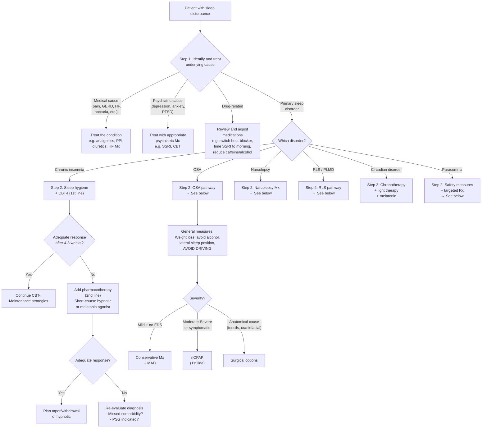

## Management of Sleep Disturbance

The management of sleep disturbance follows a logical, stepwise approach: **treat the cause first, then optimise sleep habits, then consider specific therapies**. The single most important principle is that management must be targeted to the underlying diagnosis — there is no one-size-fits-all sleeping tablet. Let me walk you through this systematically.

---

### 1. General Principles of Management

***Treatment principles*** [1]:
- ***Goals: (1) ↑ sleep quality and quantity (2) ↓ insomnia-related daytime impairment*** [1]
- ***Optimise treatment of comorbid sleep, medical, psychiatric disorder first*** [1]
- ***Address underlying factors esp drugs, e.g. stimulants, SSRI/SNRI, steroids, chronic opioid use*** [1]
- ***Ensure good sleep hygiene*** [1]
- ***CBT for insomnia (CBT-I): 1st line but not readily available*** [1]

These principles can be distilled into a hierarchy:

1. **Identify and treat the underlying cause** (medical, psychiatric, pharmacological, another sleep disorder)
2. **Sleep hygiene education** (for every patient, regardless of cause)
3. **CBT-I** (first-line for chronic insomnia disorder)
4. **Pharmacotherapy** (second-line, or adjunctive to CBT-I when needed)
5. **Device/surgical therapy** (for specific conditions like OSA)

<Callout title="The Cardinal Rule of Sleep Medicine">
Never prescribe a hypnotic without first asking: "Why is this patient not sleeping?" A sleeping tablet treats the symptom, not the cause. If the patient has OSA, a hypnotic will worsen it (↓ muscle tone → ↑ airway collapse). If they have depression, the insomnia will not resolve until the depression is treated. Always diagnose first, then treat appropriately.
</Callout>

---

### 2. Management Algorithm

---

### 3. Sleep Hygiene

***Ensure good sleep hygiene*** [1]

Sleep hygiene is a set of behavioural and environmental recommendations that promote normal sleep. It is necessary but **not sufficient** as standalone treatment for chronic insomnia — think of it as the foundation upon which everything else is built.

| Recommendation | Rationale (From First Principles) |
|---|---|
| **Maintain a regular sleep-wake schedule** (same bedtime and wake time every day, including weekends) | Entrains the SCN circadian clock → Process C and Process S become synchronised → predictable sleep onset |
| **Get up at the same time every morning regardless of how you slept** | This is more important than bedtime. The wake time anchors the circadian rhythm. Sleeping in after a bad night delays the circadian phase → makes the next night's insomnia worse. |
| **Avoid daytime naps** (or limit to < 20 min before 3 PM) | Napping discharges homeostatic sleep pressure (Process S — adenosine clearance) → less sleep drive at night → harder to fall asleep |
| **Use the bed only for sleep and sex** (not reading, TV, phone, working) | Stimulus control principle: if the bed is associated with wakeful activities, it becomes a conditioned stimulus for wakefulness. Restricting bed use to sleep re-associates it with sleep. |
| **If unable to sleep after ~20 min, get up and do a quiet activity, then return when sleepy** | Prevents the bed from becoming a cue for frustration and wakefulness. This is the "quarter-of-an-hour rule." |
| **Avoid caffeine after midday** | Caffeine blocks adenosine receptors → ↓ Process S sleep pressure. Half-life of caffeine is 5–7 hours, so afternoon coffee is still active at bedtime. |
| ***Avoid alcohol*** | Alcohol is a GABA-A agonist → sedating initially, but as blood levels fall → rebound glutamatergic excitation → fragmented second-half sleep, vivid dreams, early awakening. Also ↓ pharyngeal muscle tone → worsens OSA. |
| **Avoid heavy meals close to bedtime** | Large meals → ↑ GI motility, potential GERD → arousals. Light snack is acceptable. |
| **Regular exercise** (but not within 4 hours of bedtime) | Exercise ↑ adenosine production (↑ sleep pressure) and ↑ core body temperature; the subsequent temperature drop promotes sleep onset. But exercising too close to bedtime → ↑ sympathetic tone and core temperature → delays sleep. |
| **Optimise the sleep environment** (dark, quiet, cool ~18–20°C) | Darkness promotes melatonin secretion. Noise causes cortical arousals. Core body temperature needs to drop for sleep initiation (a cool room facilitates this). |
| **Avoid screens for ≥30–60 min before bed** | Blue light (460 nm) from screens stimulates melanopsin-containing retinal ganglion cells → suppresses melatonin secretion → delays circadian phase |
| **Avoid clock-watching** | Clock-watching → time monitoring → frustration → arousal → perpetuates insomnia. Turn clocks away from the bed. |

***Treatment for sleepiness in general*** [9]:
- ***Sleep hygiene: regular and adequate sleep, caffeine not later than 4 PM*** [9]
- ***Short naps 15 min*** [9]
- ***Bright light: esp for shift work, jet lag, seasonal affective disorder*** [9]
- ***Adjust shift work, e.g. forward shift, regular night shift, 12-hour 2-shift*** [9]

---

### 4. Management of Chronic Insomnia

#### 4.1 CBT for Insomnia (CBT-I) — First-Line Treatment

***CBT for insomnia (CBT-I): 1st line but not readily available*** [1]
***Techniques: sleep education, stimulus control, sleep restriction, relaxation training, cognitive therapy*** [1]
***Form: self-help, individual, group, face-to-face*** [1]

CBT-I is the **gold standard** first-line treatment for chronic insomnia disorder (AASM 2021, European Sleep Research Society 2023). It is superior to pharmacotherapy in long-term outcomes because it targets the **perpetuating factors** (the "3rd P" in Spielman's model) that maintain insomnia, rather than just inducing sleep chemically.

**Components of CBT-I:**

| Component | What It Involves | Mechanism (Why It Works) |
|---|---|---|
| **Sleep Education** | Teaching normal sleep architecture, age-related changes, the 3P model, and debunking sleep myths (e.g. "everyone needs 8 hours") | ↓ Catastrophic beliefs about sleep → ↓ performance anxiety about sleeping → ↓ hyperarousal |
| **Stimulus Control** | (1) Go to bed only when sleepy; (2) Use bed only for sleep and sex; (3) If awake > 15–20 min, get up and do a quiet activity; (4) Wake at the same time daily; (5) No daytime naps | Based on classical conditioning: the bed has become a conditioned stimulus for wakefulness. By removing wakeful activities from bed and leaving bed when not sleeping, the bed is re-associated with sleep (extinction and reconditioning). |
| **Sleep Restriction Therapy** | Restrict time in bed to match actual sleep time (from sleep diary). E.g. if TST = 5h, prescribe TIB = 5h only (e.g. 1 AM–6 AM). Gradually increase TIB by 15–30 min/week as sleep efficiency improves to ≥85%. | ↓ TIB → mild sleep deprivation → ↑ homeostatic sleep pressure (↑ adenosine) → consolidated sleep → ↑ sleep efficiency. Counter-intuitive but highly effective. Minimum TIB should not go below 5 hours for safety. |
| **Relaxation Training** | Progressive muscle relaxation, diaphragmatic breathing, guided imagery, mindfulness | ↓ Somatic and cognitive arousal → ↓ sympathetic nervous system activity → ↓ cortisol → facilitates sleep onset |
| **Cognitive Therapy** | Identifying and challenging dysfunctional beliefs about sleep (e.g. "If I don't sleep 8 hours I'll collapse," "I haven't slept at all" when they actually slept 5 hours) | ↓ Catastrophic cognitions → ↓ anticipatory anxiety → breaks the worry-arousal-insomnia cycle |

**Evidence:**
- Meta-analyses show CBT-I improves sleep onset latency, WASO, sleep efficiency, and total sleep time with effect sizes comparable to or exceeding hypnotics in the short term and superior in the long term
- Effects are durable (persist ≥12 months after treatment) unlike hypnotics (effects stop when drugs stop)
- Can be delivered digitally (e.g. Sleepio, CBT-I Coach app) — increasingly relevant given limited access to trained therapists in Hong Kong

**Contraindications/Cautions for sleep restriction:**
- Untreated bipolar disorder (sleep deprivation can trigger mania)
- Seizure disorders (sleep deprivation lowers seizure threshold)
- Parasomnias (sleep deprivation ↑ slow-wave sleep → may trigger NREM parasomnias)
- Occupations requiring high vigilance (during the initial restriction phase, patients may be sleepier during the day)

<Callout title="Why CBT-I Works Better Than Pills Long-Term" type="idea">
Hypnotics work while you take them. The moment you stop, insomnia often returns (or worsens — rebound insomnia). CBT-I changes the underlying conditioned hyperarousal and maladaptive behaviours that perpetuate insomnia. Once the patient has learned the techniques, they have them for life. This is why every guideline recommends CBT-I as first-line.
</Callout>

---

#### 4.2 Pharmacotherapy for Insomnia — Second-Line

Pharmacotherapy is indicated when:
- CBT-I is unavailable, refused, or insufficient
- Short-term relief is needed while CBT-I takes effect (typically 4–8 weeks)
- Acute/short-term insomnia with significant distress

***Address underlying factors esp drugs, e.g. stimulants, SSRI/SNRI, steroids, chronic opioid use*** [1]

**General principles of pharmacotherapy:**
- Use the **lowest effective dose** for the **shortest duration** necessary
- Prefer intermittent dosing (e.g. 2–3 nights/week) over nightly use for chronic insomnia
- Always combine with sleep hygiene ± CBT-I
- Plan an **exit strategy** (taper schedule) from the outset
- Avoid in the elderly where possible (↑ falls, ↑ confusion, ↑ next-day sedation)

##### A. Benzodiazepines (BZDs)

| Feature | Detail |
|---|---|
| **Examples** | Temazepam (short-intermediate acting), lorazepam, nitrazepam, triazolam, diazepam |
| **MoA** | Bind to the benzodiazepine site on the GABA-A receptor → allosteric positive modulation → ↑ frequency of Cl⁻ channel opening → neuronal hyperpolarisation → ↑ inhibition → sedation, anxiolysis, muscle relaxation, anticonvulsant effect |
| **Indications** | Short-term insomnia ( < 2–4 weeks); acute anxiety; alcohol withdrawal (chlordiazepoxide, diazepam) |
| **Advantages** | Effective for both sleep-onset and sleep-maintenance insomnia; anxiolytic properties helpful when anxiety co-exists |
| **Disadvantages** | Tolerance develops within 2–4 weeks → dose escalation → dependence. Rebound insomnia on withdrawal (often worse than baseline). ↓ N3 (slow-wave sleep) and ↓ REM → non-physiological sleep. Hangover effects (next-day sedation). ↑ Risk of falls in elderly. Cognitive impairment. Respiratory depression (especially in OSA — **contraindicated**). Dependence and withdrawal syndrome. |
| **Contraindications** | OSA (↓ muscle tone → worsens airway collapse), severe hepatic insufficiency, myasthenia gravis, respiratory failure, acute alcohol intoxication, pregnancy (teratogenic — category D) |

<Callout title="BZDs and OSA — A Dangerous Combination" type="error">
Benzodiazepines are **contraindicated** in untreated OSA. They reduce pharyngeal muscle tone AND blunt the arousal response to hypoxaemia. This means the patient's airway collapses AND they don't wake up to re-open it → prolonged apnoeas → severe desaturations → potentially fatal. If you must sedate an OSA patient (e.g. for a procedure), ensure CPAP is available and monitoring is in place.
</Callout>

##### B. Z-Drugs (Non-Benzodiazepine Hypnotics)

***Z drugs, e.g. zolpidem (Stilnox), zopiclone (Imovane), zaleplon (Sonata)*** [13]

| Feature | Detail |
|---|---|
| **MoA** | ***Non-BZD drugs acting as specific agonists at BZD receptors (ω₁ receptors)*** [13] — They selectively bind the α₁ subunit-containing GABA-A receptors (which mediate sedation) rather than all BZD-binding subtypes → more selective hypnotic effect with less anxiolytic, muscle relaxant, and anticonvulsant activity compared to BZDs |
| **Effect** | ***Produces ↓ changes in sleep architecture and has ↓ duration of action cf BZDs*** [13] — They preserve more normal N3 and REM compared to BZDs |
| **Use** | ***Usually for sleep onset insomnia but Stilnox CR can be used for sleep maintenance insomnia*** [13] |
| **S/E** | ***Bitter aftertaste (Imovane), residual effects (slow, drowsiness, ↓ daytime performance, ↑ risk of falls), rarely behavioural disturbances (confusion, amnesia, ↓ mood)*** [13]. Complex sleep behaviours (sleep-eating, sleep-driving) — particularly with zolpidem. |
| **Choice** | ***Stilnox has a shorter half-life (↓ propensity for hangover) and less bitter, but may be less effective in sleep maintenance and may be more expensive*** [13] |
| **Comparison** | |

| Drug | Half-Life | Best For | Notes |
|---|---|---|---|
| **Zaleplon (Sonata)** | ~1 hour | Sleep-onset insomnia only | Ultra-short acting; can be taken if patient wakes in the middle of the night (if ≥4 hours of sleep time remain) |
| **Zolpidem (Stilnox)** | ~2.5 hours | Sleep-onset insomnia | Most commonly prescribed; CR formulation available for sleep maintenance |
| **Zopiclone (Imovane)** | ~5 hours | Sleep onset + maintenance | Bitter metallic aftertaste; slightly longer duration |
| **Eszopiclone (Lunesta)** | ~6 hours | Sleep onset + maintenance | S-enantiomer of zopiclone; approved for long-term use in some guidelines |

**Advantages over BZDs:** Fewer effects on sleep architecture; shorter duration of action (less hangover); somewhat lower abuse potential (though still present); less rebound insomnia.

**Disadvantages:** Still cause tolerance and dependence (though less than BZDs); complex sleep behaviours; residual sedation (especially zopiclone); still ↓ pharyngeal muscle tone (caution in OSA).

**Contraindications:** Similar to BZDs — severe hepatic impairment, OSA (relative CI — use with caution and only with CPAP), myasthenia gravis, severe respiratory insufficiency, pregnancy.

##### C. Melatonin and Melatonin Receptor Agonists

| Feature | Detail |
|---|---|
| **Examples** | Melatonin (Circadin — prolonged-release 2 mg); Ramelteon; Tasimelteon |
| **MoA** | Melatonin binds MT₁ and MT₂ receptors in the SCN → MT₁ activation ↓ SCN neuronal firing (promotes sleepiness); MT₂ activation shifts the circadian clock phase. Ramelteon is a selective MT₁/MT₂ agonist with higher affinity than endogenous melatonin. |
| **Indications** | Insomnia in patients ≥55 years (Circadin — licensed in many jurisdictions for this age group); circadian rhythm disorders (jet lag, delayed sleep phase); insomnia in children with neurodevelopmental disorders |
| **Advantages** | No dependence, no tolerance, no rebound insomnia, no abuse potential; does not suppress N3 or REM; safe in elderly; does not worsen OSA |
| **Disadvantages** | Modest effect size (smaller than BZDs/Z-drugs for insomnia); mainly improves sleep onset latency rather than total sleep time; not effective for all insomnia subtypes |
| **S/E** | Headache, dizziness, drowsiness (mild); generally very well tolerated |
| **Contraindications** | Autoimmune conditions (theoretical — melatonin is immunomodulatory); severe hepatic impairment (melatonin is hepatically metabolised); fluvoxamine co-administration (CYP1A2 inhibitor → massive ↑ melatonin levels) |

##### D. Orexin Receptor Antagonists (DORAs — Dual Orexin Receptor Antagonists)

This is a newer drug class representing a paradigm shift in insomnia pharmacotherapy.

| Feature | Detail |
|---|---|
| **Examples** | Suvorexant (Belsomra); Lemborexant (Dayvigo) |
| **MoA** | Block orexin/hypocretin receptors (OX₁R and OX₂R) → attenuate the wake-promoting signal from the lateral hypothalamus → allows the VLPO sleep switch to activate. Rather than artificially "forcing" sleep (like BZDs), DORAs "turn down" wakefulness — a more physiological approach. |
| **Indications** | Chronic insomnia disorder (both sleep-onset and sleep-maintenance); approved for long-term use (unlike BZDs/Z-drugs) |
| **Advantages** | Preserve normal sleep architecture (N3 and REM maintained); low abuse potential; no respiratory depression (safe in mild-moderate OSA); effective for both sleep onset and maintenance |
| **Disadvantages** | May cause sleep paralysis, hypnagogic hallucinations (logically — they are blocking the same orexin system that is deficient in narcolepsy); next-day somnolence (especially suvorexant 20 mg) |
| **S/E** | Somnolence, headache, abnormal dreams, sleep paralysis (uncommon), suicidal ideation (rare — black box warning in some jurisdictions) |
| **Contraindications** | Narcolepsy (already orexin-deficient — would worsen symptoms); severe hepatic impairment; concomitant strong CYP3A4 inhibitors (suvorexant) |

<Callout title="DORAs — The Conceptual Leap">
Traditional hypnotics (BZDs, Z-drugs) amplify the "sleep signal" by enhancing GABA-A inhibition — they push the brain into sedation. DORAs take the opposite approach: they block the "wake signal" (orexin) so that the brain's intrinsic sleep-promoting mechanisms can take over. This is why DORAs preserve normal sleep architecture and have less abuse potential. Think of it as removing a "wake brake" rather than pressing a "sleep accelerator."
</Callout>

##### E. Sedating Antidepressants (Off-Label for Insomnia)

| Drug | MoA | Dose for Insomnia | Notes |
|---|---|---|---|
| **Trazodone** | 5-HT₂A antagonist + weak SARI (serotonin antagonist and reuptake inhibitor) at low doses; H₁ antagonist | 25–100 mg at night | Very commonly used off-label for insomnia, especially with comorbid depression. At low doses, the antihistaminic and 5-HT₂A antagonist effects predominate (sedation) without significant serotonergic reuptake inhibition. Does not cause dependence. S/E: orthostatic hypotension, priapism (rare). |
| **Mirtazapine** | NaSSA (noradrenergic and specific serotonergic antidepressant); potent H₁ antagonist at low doses | 7.5–15 mg at night | Paradoxically more sedating at lower doses (H₁ antagonism predominates) and less sedating at higher doses (noradrenergic stimulation overcomes sedation). Useful for insomnia with comorbid depression and poor appetite (↑ appetite/weight gain). |
| **Amitriptyline** | TCA; H₁ antagonist + anticholinergic | 10–25 mg at night | Useful for insomnia with comorbid pain (neuropathic pain, fibromyalgia). Anticholinergic S/E: dry mouth, constipation, urinary retention, tachycardia. **Caution in elderly** (anticholinergic burden → delirium, falls). |
| **Doxepin** | TCA; highly selective H₁ antagonist at ultra-low doses | 3–6 mg at night | At ultra-low doses (3–6 mg, marketed as Silenor), doxepin is a highly selective H₁ antagonist with minimal anticholinergic effects. FDA-approved for insomnia (sleep maintenance). |

##### F. Other Agents

| Agent | MoA | Notes |
|---|---|---|
| **Antihistamines** (diphenhydramine, doxylamine, hydroxyzine) | H₁ receptor antagonism → sedation | OTC sleep aids. Tolerance develops rapidly (within days). Anticholinergic S/E (dry mouth, urinary retention, constipation, delirium in elderly). NOT recommended for chronic insomnia by any guideline. |
| **Gabapentin / Pregabalin** | ***Binds α₂δ subunit of presynaptic voltage-dependent Ca²⁺ channels → blocks release of excitatory neurotransmitters, e.g. glutamate*** [13] | Useful when insomnia is comorbid with chronic pain, RLS, or anxiety. Improves slow-wave sleep. S/E: ***somnolence, dizziness, ↑ appetite, mood changes, confusion, ataxia, tremor, memory impairment*** [13]. Discontinuation symptoms: ***insomnia, headache, nausea, diarrhoea, anxiety, sweating, dizziness*** [13]. |
| **Quetiapine** (low-dose) | D₂ antagonist + H₁ antagonist + α₁ antagonist at low doses | Sometimes used off-label for insomnia, especially with comorbid psychosis or agitation. NOT recommended for primary insomnia due to metabolic S/E (weight gain, diabetes, dyslipidaemia) even at low doses. |

##### Summary: Pharmacotherapy Selection Guide

| Clinical Scenario | Preferred Agent | Rationale |
|---|---|---|
| **Chronic insomnia, no comorbidity** | CBT-I first; if Rx needed → melatonin (≥55y) or DORA or short-course Z-drug | Melatonin: safe, no dependence. DORA: physiological, long-term approved. Z-drug: short-course only. |
| **Insomnia + anxiety** | CBT-I + SSRI/SNRI for anxiety; adjunct low-dose trazodone or BZD (short-term) | Treating the anxiety treats the insomnia. Trazodone for sleep without dependence risk. |
| **Insomnia + depression** | SSRI/SNRI + CBT-I; consider mirtazapine (if poor appetite/weight loss) or trazodone adjunct | Mirtazapine: sedating + appetite stimulation. Note SSRIs themselves can worsen insomnia initially. |
| **Insomnia + chronic pain** | Gabapentin/pregabalin or amitriptyline (low-dose) | Dual benefit: analgesic + sedating. |
| **Insomnia in elderly** | Melatonin (Circadin) or DORA; **avoid BZDs/Z-drugs** | Elderly: ↑ sensitivity to sedative S/E, ↑ falls, ↑ hip fracture, ↑ cognitive impairment. Melatonin and DORAs are safer. |
| **Insomnia + mild OSA** | Melatonin or DORA; **avoid BZDs/Z-drugs** | DORAs do not suppress respiratory drive or muscle tone. BZDs/Z-drugs worsen OSA. |
| **Acute/short-term insomnia** | Short-course Z-drug (3–7 days) or BZD | Self-limiting; brief pharmacotherapy to prevent perpetuating factor development. |

---

### 5. Management of Obstructive Sleep Apnoea

***Tx*** [2]:

#### 5.1 General Measures

***General*** [2]:
- ***Weight reduction if overweight*** [2] — Even 10% weight loss can ↓ AHI by 26–50%. Fat loss in the parapharyngeal space and tongue directly ↑ airway calibre. Weight loss also ↓ the mechanical load on the chest wall → ↑ FRC → ↑ tracheal traction → ↑ pharyngeal patency.
- ***Avoid alcohol and hypnotics*** [2] — Alcohol ↓ pharyngeal dilator muscle tone AND blunts the arousal response → longer, deeper apnoeas with worse desaturations. Hypnotics (BZDs, Z-drugs) have the same effect.
- ***Sleep hygiene and posture, e.g. lying laterally*** [2] — Supine position → tongue falls posteriorly under gravity → ↑ airway obstruction. Lateral position ↓ AHI in positional OSA. Positional therapy devices (e.g. tennis ball technique, positional vibration devices) can enforce lateral sleeping.
- ***AVOID CAR-DRIVING if not adequately treated*** [2] — This is both a clinical and medicolegal point. Untreated OSA with EDS → ↑ risk of RTA (2–3× general population).
- ***Mx of predisposing factors, e.g. rhinitis, acromegaly, care after sedation/anaesthesia*** [2]
- ***Monitor for obesity-related conditions, e.g. metabolic syndrome, DM, HTN*** [2]

#### 5.2 CPAP (Continuous Positive Airway Pressure)

***Nocturnal nasal cPAP: application of positive pressure through nasal mask during sleep*** [2]
***Most consistently effective treatment of OSA, but effect depends on compliance (usually poor)*** [2]

**How CPAP works (from first principles):**
During inspiration, negative intraluminal pressure causes the pharynx to collapse (as discussed in pathophysiology). CPAP delivers a constant stream of pressurised air (typically 4–20 cmH₂O) through a nasal or oronasal mask. This positive pressure acts as a **pneumatic splint** — it stents the airway open from inside, preventing collapse regardless of muscle tone. Think of it like inflating a balloon from the inside to keep it from caving in.

**Indications:**
- Moderate-to-severe OSA (AHI ≥15/h)
- Mild OSA (AHI 5–15/h) with significant symptoms (EDS, impaired quality of life) or cardiovascular comorbidities
- ***Indications for urgent arrangement of nCPAP*** [2]:
  - ***Pickwickian syndrome with daytime alveolar hypoventilation, pulmonary hypertension or cor pulmonale*** [2]
  - ***Nocturnal malignant arrhythmia related to OSA*** [2]
  - ***Nocturnal angina related to OSA*** [2]
  - ***Severe EDS imposing risk to patient or others, e.g. professional driver esp with Hx of RTA*** [2]

**Benefits:**
- ↓ AHI (often to < 5/h — essentially normalisation)
- ↓ Daytime sleepiness (ESS typically drops by 3–5 points)
- ↓ Blood pressure (2–3 mmHg on average; greater in drug-resistant HTN)
- ↓ Cardiovascular events (observational data; RCT data mixed but trending positive)
- ↓ Road traffic accidents
- ↑ Quality of life, mood, cognitive function

**Compliance challenge:**
- Only ~50–60% of patients use CPAP adequately (≥4 hours/night on ≥70% of nights)
- Common barriers: mask discomfort, claustrophobia, nasal dryness/congestion, aerophagia (swallowing air), noise, partner disturbance
- Solutions: proper mask fitting, heated humidification, ramp function (starts at low pressure and gradually increases), desensitisation training, ENT review for nasal obstruction, auto-titrating CPAP (APAP — adjusts pressure breath-by-breath)

#### 5.3 Mandibular Advancement Device (MAD)

***Mandibular advancement device*** [2]:
***Device worn during sleep to advance mandible to enlarge URT and modify muscle collapsibility*** [2]
***Variable efficacy, usually cannot completely control severe OSA*** [2]

**How it works:** A custom-fitted oral appliance pushes the mandible (and attached tongue base/genioglossus) forward → ↑ retrolingual and retropalatal airway space → ↓ collapsibility.

**Indications:**
- Mild-to-moderate OSA where CPAP is declined, not tolerated, or not indicated
- Primary snoring
- Adjunct to CPAP in severe OSA (combined therapy)

**Contraindications:** Insufficient teeth for retention, severe TMJ disorder, central sleep apnoea (no upper airway obstruction to splint), periodontal disease.

**S/E:** TMJ discomfort, dental misalignment with long-term use, excessive salivation, dry mouth.

#### 5.4 Surgery

***Surgery: useful in selective patients with predisposing anatomical abnormalities*** [2]

| Procedure | Indication | Mechanism |
|---|---|---|
| ***Removal of hypertrophic tonsils/adenoids in children*** [2] | Adenotonsillar hypertrophy (most common cause of paediatric OSA) | Removes the obstructing tissue → ↑ airway lumen. Curative in majority of children. |
| ***Uvulopalatopharyngoplasty (UPPP): removal/remodelling of uvula, soft palate and pharynx*** [2] | Adults with palatal-level obstruction | Removes redundant soft tissue. ***Variable efficacy, not favoured*** [2] — success rate only ~50% because OSA is often multilevel. |
| ***Faciomaxillary/mandibular surgery*** [2] | Significant maxillofacial anomalies (retrognathia, micrognathia) | Maxillomandibular advancement (MMA) moves both jaws forward → dramatically enlarges posterior airway space. ***Needs more evidence of long-term efficacy. Useful in those with significant maxillofacial anomalies*** [2]. Most effective surgical option for OSA (success rate ~85–90%). |
| ***Bariatric surgery*** [2] | Morbid obesity (BMI ≥40, or ≥35 with comorbidities) with OSA | ***Useful to ↓ obesity-related medical problems*** [2]. Massive weight loss → ↓ parapharyngeal fat, ↓ tongue volume, ↓ chest wall load → ↓ AHI. May cure OSA in some cases. |
| ***Surgical correction of snoring/nasal obstruction*** [2] | Deviated septum, nasal polyps, turbinate hypertrophy | ↓ Nasal resistance → ↓ negative oropharyngeal pressure during inspiration → ↓ collapsibility. May not cure OSA alone but improves CPAP tolerance. |
| **Hypoglossal nerve stimulation (Inspire)** | Moderate-severe OSA intolerant of CPAP; BMI < 32; predominantly tongue-base collapse on DISE | Implanted device stimulates CN XII → genioglossus contracts during inspiration → tongue protrudes → airway opens. Newer therapy with growing evidence. |

---

### 6. Management of Narcolepsy

| Treatment | MoA | Indication |
|---|---|---|
| **Modafinil / Armodafinil** | Wake-promoting agent; exact MoA unclear but involves dopamine reuptake inhibition + orexin/histamine pathway activation | **First-line for EDS** in narcolepsy. Does not treat cataplexy. Lower abuse potential than amphetamines. |
| **Solriamfetol** | Dual dopamine and noradrenaline reuptake inhibitor | EDS in narcolepsy and OSA (adjunct to CPAP) |
| **Pitolisant** | H₃ receptor inverse agonist → ↑ histamine release from tuberomammillary nucleus → ↑ wakefulness | EDS and cataplexy in narcolepsy |
| **Sodium oxybate (GHB)** | GABA-B agonist → consolidates nocturnal sleep (↑ N3) → ↓ daytime sleepiness; also ↓ cataplexy | EDS + cataplexy (addresses both). Given at bedtime and again 2.5–4 hours later. Narrow therapeutic window; respiratory depressant. |
| **Methylphenidate / Amphetamines** | Dopamine/noradrenaline reuptake inhibition + release | Second-line for EDS (higher abuse potential) |
| **Venlafaxine / Fluoxetine / Clomipramine** | SNRI/SSRI/TCA → ↑ noradrenaline/serotonin → suppresses REM → ↓ cataplexy | Cataplexy (REM atonia intrusion suppressed by REM-suppressing drugs) |
| **Scheduled naps** | Discharge sleep pressure during the day | Adjunctive: strategic 15–20 min naps can refresh for 1–3 hours |

---

### 7. Management of Restless Legs Syndrome (RLS)

**Step 1: Correct reversible causes**
- **Iron supplementation** if ferritin < 75 μg/L (IV iron if ferritin < 30 or oral iron not tolerated/ineffective; target ferritin > 75) — iron is a cofactor for tyrosine hydroxylase → ↑ dopamine synthesis
- Treat uraemia (dialysis, erythropoietin)
- Discontinue exacerbating drugs (antidopaminergics, SSRIs, SNRIs, antihistamines)

**Step 2: Non-pharmacological**
- Sleep hygiene, regular exercise, avoidance of caffeine/alcohol
- Leg massage, hot/cold baths, pneumatic compression

**Step 3: Pharmacotherapy**

| Drug Class | Examples | MoA | Notes |
|---|---|---|---|
| **α₂δ ligands** (first-line per 2024 IRLSSG guidelines) | ***Pregabalin, gabapentin*** | ***Bind α₂δ subunit of presynaptic voltage-dependent Ca²⁺ channels → block excitatory neurotransmitter release*** [13] | Now preferred over dopamine agonists as first-line because they **do not cause augmentation**. Also improve sleep quality (↑ slow-wave sleep). S/E: sedation, dizziness, weight gain. |
| **Dopamine agonists** (second-line) | Pramipexole, ropinirole, rotigotine (patch) | D₂/D₃ receptor agonism in the central nervous system → ↑ dopaminergic transmission | Previously first-line but now second-line due to **augmentation** (paradoxical worsening: symptoms become more severe, start earlier in the day, spread to arms). Also impulse control disorders (gambling, hypersexuality, compulsive shopping). |
| **Opioids** (severe refractory) | Low-dose oxycodone, tramadol | μ-opioid receptor agonism → modulates pain/sensory pathways; also interact with dopaminergic pathways | Reserved for severe, refractory RLS. Risk of dependence, respiratory depression. |
| **Iron (IV or oral)** | Ferric carboxymaltose (IV), ferrous sulphate (oral) | Replenishes iron stores → ↑ tyrosine hydroxylase activity → ↑ dopamine | Cornerstone of RLS management. IV iron produces faster and more reliable repletion. |

<Callout title="Augmentation — The Trap of Dopamine Agonists in RLS" type="error">
Augmentation is the most important long-term complication of dopamine agonist therapy for RLS. It manifests as: (1) earlier onset of symptoms in the afternoon, (2) increased severity, (3) spread to upper limbs/trunk, (4) shorter latency to symptom onset at rest. Risk increases with higher doses, longer duration, and low ferritin. This is why the 2024 IRLSSG guidelines now recommend α₂δ ligands as first-line.
</Callout>

---

### 8. Management of Circadian Rhythm Sleep-Wake Disorders

| Disorder | Treatment | Mechanism |
|---|---|---|
| **Delayed Sleep-Wake Phase** | Morning bright light therapy (10,000 lux, 30 min, within 1 hour of desired wake time) + low-dose melatonin (0.5–3 mg) 5–7 hours before desired bedtime (the "advance" dose) | Bright light in the morning **advances** the circadian phase (phase-response curve: light before the core body temperature minimum advances the clock). Melatonin in the evening also phase-advances. |
| **Advanced Sleep-Wake Phase** | Evening bright light therapy + avoidance of morning light; melatonin in the morning (to delay) | Evening light **delays** the circadian phase. |
| **Shift-Work Disorder** | ***Bright light: esp for shift work, jet lag, seasonal affective disorder*** [9]; strategic napping before shifts; melatonin for daytime sleep; ***Adjust shift work, e.g. forward shift, regular night shift, 12-hour 2-shift*** [9] | Forward rotation (morning → afternoon → night) is easier to adapt to than backward rotation (follows the natural > 24h tendency of the SCN clock). |
| **Jet Lag** | Timed light exposure and melatonin according to direction of travel; strategic napping | Eastward travel (phase advance needed): morning light at destination, melatonin at destination bedtime. Westward (phase delay): evening light, avoid morning light. |
| **Non-24-Hour (Blind)** | Tasimelteon (MT₁/MT₂ agonist) | Entrains the free-running circadian rhythm in totally blind individuals |

---

### 9. Management of Parasomnias

| Parasomnia | Management | Rationale |
|---|---|---|
| **NREM parasomnias** (sleepwalking, night terrors) | **Safety measures** (lock windows/doors, clear pathway, mattress on floor); avoid triggers (sleep deprivation, alcohol, stress); treat comorbid OSA (arousals trigger parasomnias); low-dose clonazepam at bedtime if frequent/dangerous | Clonazepam suppresses N3 (reduces the "launching pad" for NREM parasomnias) and raises the arousal threshold. |
| **REM Sleep Behaviour Disorder** | ***Safe sleeping environment, melatonin (augments REM sleep), clonazepam*** [9]. Screen and monitor for α-synucleinopathies (PD, DLB, MSA). | Melatonin (3–12 mg) may restore REM atonia (unclear mechanism; possibly via modulation of the sublaterodorsal nucleus). Clonazepam (0.25–2 mg) ↓ phasic motor activity during REM. Both are first-line. Sharp/dangerous objects should be removed from the bedroom. Bed partner may need to sleep separately. |
| **Nightmare Disorder** | Image rehearsal therapy (CBT technique: patient rewrites the nightmare script during the day → rehearses the new, non-threatening version); ***prazosin (α₁-blocker) can ↓ PTSD symptoms, nightmares, sleep disturbance*** [14] | Prazosin blocks noradrenergic hyperarousal during REM → ↓ nightmare intensity. Effective in PTSD-related nightmares. |

---

### 10. Management of Delirium-Related Sleep-Wake Disturbance

***Mx*** [8]:
- ***Treat underlying causes and complications: often multifactorial*** [8]
- ***Supportive care*** [8]:
  - ***Review medications and remove potentially harmful drugs*** [8]
  - ***ABC + fluid/electrolyte balance + adequate nutrition and vitamins*** [8]
  - ***Avoid restraint and Foley's catheters*** [8]
  - ***Nurse in reassuring, supportive setting → well-illuminated, quiet place (prefer convalescent ward), try to normalise sleep-wake cycle, ask family to bring familiar objects*** [8]
  - ***Avoid Cx: mobilisation (↓VTE), skin/bedsore care*** [8]
- ***Rx for behavioural S/S: ONLY to agitated patients at risk of harming others or own safety*** [8]:
  - ***Antipsychotics: haloperidol (1st line), risperidone, olanzapine, quetiapine*** [8]
  - ***Benzodiazepines: lorazepam (2nd line)*** [8]
  - ***Antidepressants: trazodone*** [8]
- ***Prevention*** [8]:
  - ***Orientation and therapeutic activities for cognitive impairment*** [8]
  - ***Early mobilisation*** [8]
  - ***Nonpharmacological approaches (minimise psychoactive drugs use)*** [8]
  - ***Interventions to prevent sleep deprivation*** [8]
  - ***Communication methods and adaptive equipment for vision and hearing impairment*** [8]
  - ***Early intervention for volume depletion*** [8]

---

### 11. Summary Table: Treatment Modalities by Condition

| Condition | First-Line | Second-Line | Key Points |
|---|---|---|---|
| **Chronic Insomnia** | CBT-I | Pharmacotherapy (melatonin ≥55y, DORA, Z-drug short course, trazodone) | CBT-I has durable effects; drugs are for short-term adjunct |
| **Short-term Insomnia** | Sleep hygiene + reassurance | Z-drug or BZD (≤2–4 weeks) | Self-limiting; avoid perpetuating factor development |
| **OSA** | CPAP (moderate-severe) | MAD (mild-moderate or CPAP intolerant); surgery (anatomical cause); weight loss | CPAP is the gold standard; compliance is the main barrier |
| **Narcolepsy** | Modafinil (EDS); sodium oxybate (EDS + cataplexy) | Amphetamines; venlafaxine/clomipramine (cataplexy) | Lifelong condition; scheduled naps are adjunctive |
| **RLS** | Iron repletion (ferritin > 75); α₂δ ligands | Dopamine agonists (watch for augmentation); opioids (refractory) | Always check and correct iron first |
| **Circadian Disorders** | Light therapy + melatonin (timed) | Chronotherapy; tasimelteon (non-24h) | Timing of light and melatonin is everything |
| **NREM Parasomnias** | Safety measures; treat triggers | Clonazepam | Safety is priority; avoid sleep deprivation |
| **RBD** | Safety; melatonin | Clonazepam | Screen for neurodegeneration |
| **Delirium** | Treat underlying cause; supportive | Haloperidol (agitation); lorazepam (2nd line) | Non-pharmacological measures first |

---

<Callout title="High Yield Summary">

**Management of Sleep Disturbance — Key Takeaways:**

1. **Always treat the underlying cause first** — psychiatric, medical, pharmacological, or primary sleep disorder.

2. **Sleep hygiene** is necessary for ALL patients but NOT sufficient alone for chronic insomnia.

3. ***CBT-I is first-line for chronic insomnia*** — techniques include sleep education, stimulus control, sleep restriction, relaxation, and cognitive therapy. Effects are durable; hypnotics are not.

4. **Pharmacotherapy for insomnia** is second-line: melatonin (elderly), DORAs (physiological), Z-drugs (short-term), trazodone (comorbid depression/anxiety). **Avoid BZDs long-term.**

5. ***CPAP is the gold standard for moderate-severe OSA*** — it works as a pneumatic splint. Compliance is the main challenge. MAD for mild-moderate or CPAP-intolerant patients.

6. **Urgent CPAP indications**: Pickwickian syndrome, nocturnal arrhythmia, nocturnal angina, severe EDS with driving risk.

7. ***AVOID car-driving*** in untreated OSA with EDS — medicolegal obligation.

8. **RLS**: Correct iron (ferritin > 75) first; α₂δ ligands (pregabalin/gabapentin) are now first-line over dopamine agonists (augmentation risk).

9. **DORAs** (suvorexant, lemborexant) represent a paradigm shift — they block the wake signal rather than forcing the sleep signal, preserving normal sleep architecture.

10. **BZDs are contraindicated in OSA** — they reduce muscle tone and blunt the arousal response.

11. **RBD management**: Safety + melatonin/clonazepam + long-term monitoring for α-synucleinopathy.

12. **Delirium**: Treat cause + supportive care + normalise sleep-wake cycle. Haloperidol only for dangerous agitation.
</Callout>

---

<ActiveRecallQuiz
  title="Active Recall - Management of Sleep Disturbance"
  items={[
    {
      question: "Name the 5 components of CBT-I and explain the mechanism of sleep restriction therapy.",
      markscheme: "Components: (1) Sleep education, (2) Stimulus control, (3) Sleep restriction, (4) Relaxation training, (5) Cognitive therapy. Sleep restriction: Time in bed is restricted to match actual total sleep time (from sleep diary). This creates mild sleep deprivation, which increases homeostatic sleep pressure (adenosine accumulation), leading to consolidated sleep and improved sleep efficiency. TIB is gradually increased by 15-30 min/week as sleep efficiency reaches 85 percent or above. Minimum TIB should not go below 5 hours.",
    },
    {
      question: "Explain from first principles how CPAP works for OSA and list 4 urgent indications for CPAP.",
      markscheme: "CPAP delivers continuous positive pressure (4-20 cmH2O) through a nasal or oronasal mask, acting as a pneumatic splint that stents the pharyngeal airway open from inside, preventing collapse during inspiration regardless of muscle tone. Urgent indications: (1) Pickwickian syndrome with daytime hypoventilation, pulmonary hypertension or cor pulmonale; (2) Nocturnal malignant arrhythmia related to OSA; (3) Nocturnal angina related to OSA; (4) Severe EDS imposing risk to patient or others (e.g. professional driver with RTA history).",
    },
    {
      question: "Compare Z-drugs and DORAs in terms of mechanism, effect on sleep architecture, abuse potential, and safety in OSA.",
      markscheme: "Z-drugs: Selective GABA-A agonists at omega-1 receptor subtype; produce less sleep architecture disruption than BZDs but still alter it somewhat; moderate abuse and dependence potential; reduce pharyngeal muscle tone and blunt arousal response (caution in OSA). DORAs: Block orexin receptors OX1R/OX2R, reducing the wake-promoting signal; preserve normal sleep architecture (N3 and REM maintained); low abuse potential; no respiratory depression and safe in mild-moderate OSA. DORAs represent a more physiological approach (removing wake signal vs forcing sleep signal).",
    },
    {
      question: "Why are alpha-2-delta ligands (pregabalin/gabapentin) now preferred over dopamine agonists as first-line for RLS?",
      markscheme: "Alpha-2-delta ligands do not cause augmentation (the main long-term complication of dopamine agonists where symptoms worsen, start earlier in the day, and spread to other limbs). They also improve slow-wave sleep. Dopamine agonists are effective initially but augmentation risk increases with dose and duration. Alpha-2-delta ligands also do not cause impulse control disorders (gambling, hypersexuality) which are associated with dopamine agonists. 2024 IRLSSG guidelines recommend alpha-2-delta ligands as first-line.",
    },
    {
      question: "A 70-year-old woman with dementia is admitted to hospital and develops acute insomnia with confusion, visual hallucinations, and fluctuating consciousness. Outline your management approach.",
      markscheme: "This is delirium, not primary insomnia. Management: (1) Identify and treat underlying cause (infection, metabolic derangement, drug toxicity, pain, urinary retention, constipation); (2) Review and remove potentially harmful drugs; (3) Supportive: ABC, fluid/electrolyte balance, nutrition, avoid restraints and catheters; (4) Normalise sleep-wake cycle: well-lit room during the day, dim at night, familiar objects, family presence, orientation cues; (5) Non-pharmacological first (early mobilisation, communication aids); (6) Pharmacotherapy ONLY if agitated and a danger: haloperidol (first-line), lorazepam (second-line), trazodone. Avoid BZDs if possible as they worsen confusion.",
    },
    {
      question: "List 3 contraindications to benzodiazepine use in the context of sleep disturbance and explain the mechanism for each.",
      markscheme: "(1) Untreated OSA: BZDs reduce pharyngeal dilator muscle tone AND blunt the chemoreceptor-driven arousal response to hypoxaemia, leading to prolonged and more severe apnoeas. (2) Elderly (relative): Increased sensitivity to sedation, prolonged half-life due to reduced hepatic metabolism, increased risk of falls, hip fracture, and delirium. (3) Respiratory failure / severe COPD: BZDs depress the medullary respiratory centre, reducing ventilatory drive, which can precipitate respiratory arrest in patients already dependent on hypoxic drive. Also: myasthenia gravis (worsen muscle weakness), pregnancy (teratogenic), acute alcohol intoxication (synergistic CNS depression).",
    },
  ]}
/>

---

## References

[1] Senior notes: Ryan Ho Psychiatry.pdf (Section 9.2.3 Insomnia — Treatment principles, p. 224)
[2] Senior notes: Ryan Ho Respiratory.pdf (Section 3.8 Sleep-Associated Disorders — OSA Treatment, pp. 155–161)
[5] Lecture slides: murtagh merge.pdf (pp. 61–62 — Insomnia)
[8] Senior notes: Ryan Ho Fundamentals.pdf (Section 3.4.5 Delirium — Mx, p. 326); Ryan Ho Neurology.pdf (Section 4.1.3 Delirium — Mx, p. 96)
[9] Senior notes: Ryan Ho Psychiatry.pdf (Section 9.2.6 Other Sleep Disorders — Treatment for sleepiness, p. 229)
[13] Senior notes: Ryan Ho Psychiatry.pdf (Section 3.1.4.2 Non-benzodiazepine Anxiolytics and Hypnotics, p. 60)
[14] Senior notes: Ryan Ho Psychiatry.pdf (Section on PTSD treatment, p. 197)
