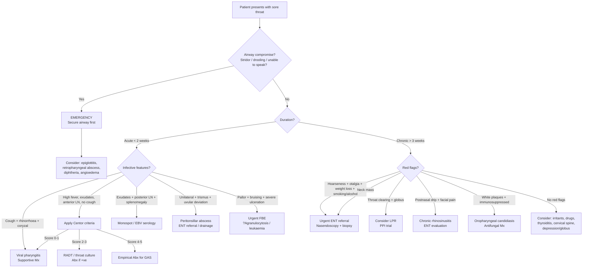

## Differential Diagnosis of Sore Throat Complaints

The differential diagnosis of sore throat is broad because the pharynx sits at a crossroads — where the airway meets the digestive tract, where multiple cranial nerves converge, and where both local and systemic disease can manifest. The key clinical task is **risk stratification**: separating the > 90% of cases that are benign and self-limiting from the handful that are life-threatening or require specific treatment.

The Murtagh diagnostic framework [1] provides a beautifully systematic scaffold. Let me walk through each tier, explain the "why" behind each differential, and then show you how to narrow things down clinically.

---

### 1. Framework for Organising the Differential

The Murtagh approach divides differentials into five tiers:

1. **Probability diagnoses** — what is most likely?
2. **Serious disorders not to be missed** — what will kill or seriously harm the patient?
3. **Pitfalls (often missed)** — what do clinicians commonly overlook?
4. **Masquerades** — common systemic conditions mimicking the complaint
5. **Is the patient trying to tell me something?** — psychosocial/functional overlay

This is not an arbitrary list — it is a **risk-stratification tool** that forces you to think about both probability and severity simultaneously. A viral URTI is 100× more common than epiglottitis, but if you miss epiglottitis the patient dies tonight. That's why both must be on your list.

---

### 2. Probability Diagnoses (Common Causes)

These account for the vast majority of sore throat presentations in primary care.

#### 2.1 ***Viral Pharyngitis*** [1]

The single most common cause (25–45% of all pharyngitis in adults) [3]. Over 200 viral subtypes can do this — ***rhinovirus (30–50%), coronavirus (10–15%), influenza (5–15%), RSV (5%), parainfluenza (5%), adenovirus, enterovirus*** [3].

**Why it causes sore throat:** Viral replication in pharyngeal epithelial cells → cytopathic effect + innate immune activation → inflammatory mediators (bradykinin, prostaglandins) sensitise pharyngeal nociceptors → pain.

**Distinguishing features:** ***Cough (often with fever and malaise), nasal symptoms (congestion, discharge, sneezes), conjunctivitis, hoarseness and other coryzal symptoms, ± oral ulcers, viral exanthem*** [3]. The presence of **cough and nasal symptoms** is the strongest pointer away from bacterial pharyngitis.

#### 2.2 ***Epstein-Barr Mononucleosis (Glandular Fever)*** [1]

EBV infects B lymphocytes via CD21 → massive reactive T cell response → lymphoid tissue hypertrophy (tonsils, nodes, spleen). ***Tonsillitis with a covering membrane may be caused by Epstein-Barr mononucleosis*** [1] — the greyish-white tonsillar exudate mimics bacterial tonsillitis or even diphtheria.

**Distinguishing features:** Posterior cervical and generalised lymphadenopathy (not just anterior cervical), splenomegaly, prolonged fatigue, palatal petechiae, periorbital oedema. ***Nasal stuffiness of infectious mononucleosis*** [1] — due to lymphoid hypertrophy in the nasopharynx.

**Pitfall:** ***Epstein-Barr mononucleosis is a "pitfall (often missed)"*** [1] — because it is frequently misdiagnosed as GAS tonsillitis. If given amoxicillin/ampicillin, ~90% develop a maculopapular rash (not a true allergy; thought to be altered immune response during EBV infection).

#### 2.3 ***Streptococcal (GABHS) Tonsillitis*** [1]

Group A β-haemolytic streptococcus accounts for **5–15% of adult pharyngitis** and **15–30% in children** [3]. It matters not because the pharyngitis itself is dangerous, but because untreated GAS can cause **acute rheumatic fever** (molecular mimicry → anti-M protein antibodies cross-react with cardiac myosin) and **post-streptococcal glomerulonephritis** [7].

**Distinguishing features:** ***Prior close exposure to GAS (esp familial), acute onset of sore throat, exudative tonsillitis, prominent tender anterior cervical adenopathy, fever, headache, abdominal pain ± vomiting, malaise, anorexia, ± rash: scarlatiniform rash, urticaria*** [3]. Critically, **absence of cough** and **absence of nasal symptoms** favour GAS over viral [3].

**The Centor / Modified Centor criteria** [3] help stratify the probability of GAS:

| Criterion | Points |
|---|---|
| History of fever | +1 |
| Tonsillar exudates | +1 |
| Tender anterior cervical adenopathy | +1 |
| Absence of cough | +1 |
| Age < 15 years | +1 |
| Age > 44 years | −1 |

| Score | Risk of GAS | Action |
|---|---|---|
| ***−1 to 1*** | ***< 10%*** | ***No Abx or throat culture necessary*** [3] |
| ***2 to 3*** | ***15–32%*** | ***Abx if throat culture +ve*** [3] |
| ***4 to 5*** | ***~56%*** | ***Treat empirically with Abx*** [3] |

> ***Empiric treatment NOT recommended as the best diagnostic accuracy achievable based on clinical symptoms alone is only 50%*** [3]

#### 2.4 ***Chronic Sinusitis with Postnasal Drip*** [1]

Chronic paranasal sinus inflammation → mucopurulent secretions drain posteriorly → irritation of posterior pharyngeal wall → chronic sore throat and throat-clearing. The patient often says "something is dripping at the back of my throat." Key features include ***prolonged ( > 10–14d) URI symptoms + ≥2 of facial/sinus pain (esp aggravated by postural changes or Valsalva manoeuvre), purulent nasal discharge, fever*** [3].

#### 2.5 ***Oropharyngeal Candidiasis*** [1]

*Candida albicans* overgrowth due to disrupted local defences. ***Common in infants*** [1] (immature immunity), patients on ***steroid inhalers*** [1] (local immunosuppression), ***diabetes*** [1] (hyperglycaemia promotes fungal growth), HIV/AIDS (CD4 depletion), antibiotic use (loss of competing flora), and denture wearers. White, curd-like plaques that scrape off to reveal an erythematous base.

---

### 3. Serious Disorders Not to Be Missed

These are lower probability but potentially fatal or irreversible.

#### 3.1 Cardiovascular: ***Angina / Myocardial Infarction*** [1]

Cardiac ischaemia → visceral pain afferents travel via cardiac sympathetic nerves → converge with somatic afferents from the throat/jaw in upper thoracic spinal cord → brain misinterprets as "throat pain" (referred pain). ***Angina is typically dull, constricting, choking, described as squeezing, crushing, burning*** [10]. Suspect when "sore throat" is exertional, deep, and in a patient with cardiovascular risk factors.

#### 3.2 ***Neoplasia/Cancer: Cancer of Oropharynx, Tongue*** [1]

Three major aetiological pathways in Hong Kong:
- **HPV-driven oropharyngeal SCC** (HPV 16/18): ***HPV-associated H&N cancer occurs primarily in the oropharynx including tonsils and the base of tongue*** [4]. Younger males, ↑ sexual partners.
- **Tobacco/alcohol-driven SCC**: ***synergism between smoking and alcohol is well established*** [4]. Older males. ***5Ss: Smoking + Spirits + Sharp teeth + Sex (male/oral) + Spicy food*** [4].
- **NPC (EBV-driven)**: ***endemic in Southern China including Hong Kong*** [4]. May present insidiously as unilateral nasal obstruction, epistaxis, or — importantly — a painless posterior cervical neck mass.

**Also consider:** ***Minor salivary gland tumours*** — may present as submucosal masses in the tongue base and soft palate [4]. ***Lymphoma*** — tonsils and tongue base may be the presenting site for a lymphoma [4].

> ***The triad — hoarseness, pain on swallowing and referred ear pain → pharyngeal cancer*** [1]

#### 3.3 ***Blood Dyscrasias (e.g. Agranulocytosis, Acute Leukaemia)*** [1]

**Agranulocytosis** (neutrophil count < 0.5 × 10⁹/L): loss of mucosal immune defence → necrotising pharyngitis with ulceration. Common culprit drugs: carbimazole, clozapine, methotrexate, sulphonamides, chemotherapy.

**Acute leukaemia**: bone marrow failure → pancytopenia → neutropenic sore throat + ***anaemic pallor*** [1] + bleeding gums + fatigue + fever. On blood film: ***blasts: always abnormal → if ≥20%, diagnostic of acute leukaemia*** [11]. ***Atypical lymphocytosis*** (NOT neoplastic) can occur in EBV and other viral infections — ***not to be mistaken as blasts or lymphoma cells*** [11].

**Clinical clue:** ***Look for toxicity, the anaemic pallor of leukaemia*** [1] — sore throat with unexplained pallor, bruising, or persistent fever should trigger urgent FBE.

#### 3.4 Infections — Life-Threatening

**(a) *Acute Epiglottitis (Children and Adults)*** [1]

***H. influenzae type b infection of epiglottis esp affecting children resulting in rapid onset fever, dysphonia, dysphagia and respiratory distress (medical emergency)*** [3]. In adults, *Streptococcus* and *Staphylococcus* species are more common. The epiglottis swells rapidly → supraglottic airway obstruction → stridor, drooling, tripod positioning.

***Admit if any suspicion of epiglottitis — and do not examine the throat*** [1] — because pharyngeal manipulation can precipitate complete laryngospasm in an already critically narrowed airway.

**(b) *Peritonsillar Abscess (Quinsy)*** [1]

GAS tonsillitis → infection extends beyond the tonsillar capsule into the peritonsillar space → abscess. Features: severe **unilateral** sore throat, trismus (medial pterygoid irritation), "hot potato" voice, uvular deviation away from the affected side, drooling.

**(c) *Pharyngeal Abscess*** [1]

Retropharyngeal abscess (children < 5y: suppuration of retropharyngeal lymph nodes) or parapharyngeal abscess (adults: extension from dental/tonsillar infection). **Danger:** the retropharyngeal space communicates with the posterior mediastinum → mediastinitis → sepsis.

**(d) *Diphtheria (Very Rare)*** [1]

*Corynebacterium diphtheriae* → exotoxin → epithelial necrosis → grey-white pharyngeal pseudomembrane that bleeds on removal. ***Airway pseudomembrane formation, fever, sore throat, extensive cervical LN ('bull's neck appearance') and rarely peripheral neuritis and myocarditis*** [3]. Rare in HK due to vaccination but consider in unvaccinated/under-vaccinated individuals.

**(e) *HIV/AIDS*** [1]

Acute HIV seroconversion (2–4 weeks post-exposure) → mononucleosis-like syndrome: sore throat, fever, generalised lymphadenopathy, maculopapular rash, oral ulcers. Advanced HIV → opportunistic pharyngeal infections (Candida, HSV, CMV), Kaposi sarcoma, pharyngeal lymphoma.

---

### 4. Pitfalls (Often Missed) [1]

These are commonly overlooked causes that lead to delayed diagnosis or inappropriate treatment.

| Pitfall | Why It's Missed | Key Distinguishing Feature |
|---|---|---|
| ***Foreign body (e.g. fish bone)*** [1] | Patient may not recall the event; X-ray sensitivity limited | Sharp unilateral pain at a specific site, worse swallowing; common in HK (steamed fish culture) |
| ***EBV mononucleosis*** [1] | Mistaken for GAS tonsillitis; membrane mimics diphtheria | Posterior LN, splenomegaly, atypical lymphocytes, rash with amoxicillin |
| ***Candida (steroid inhalers)*** [1] | Inhaler technique not assessed; patient not asked | White scrapeable plaques; history of inhaled corticosteroid use |
| ***STIs: gonococcal pharyngitis, herpes simplex (type II), syphilis*** [1] | Sexual history not taken; pharyngeal gonorrhoea often asymptomatic | Exposure history; HSV → vesicles/ulcers; syphilis → painless chancre or mucous patches; gonorrhoea → NAAT of throat swab |
| ***Reflux oesophagitis → pharyngolaryngitis (LPR)*** [1] | No classic heartburn; patient presents to ENT not GI | Throat clearing, globus, hoarseness, chronic cough; ***water brash: reflex salivary gland stimulation as acid enters throat*** [5]; ***may present initially to RESP, CARD or ENT*** [5] |
| ***Tonsilloliths*** [1] | Dismissed as "chronic tonsillitis" | Halitosis, recurrent sore throat, white/yellow concretions visible in tonsillar crypts |
| ***Cricopharyngeal spasm*** [1] | Functional symptom; no organic finding | Globus sensation ("lump in throat") without true pain or dysphagia; often stress-related |
| ***Kawasaki disease*** [1] | Pharyngitis attributed to simple viral infection | Child < 5y, high fever > 5 days, bilateral conjunctivitis, strawberry tongue, polymorphous rash, extremity changes, cervical LN |
| ***Aphthous ulceration*** [1] | Recurrent; attributed to "mouth ulcers" not investigated | Recurrent painful ulcers; if deep/multiple → consider Behçet disease |
| ***Thyroiditis*** [1] | Anterior neck pain misinterpreted as throat pain | Tender thyroid, pain ***radiates to angle of jaw and ears, ↑ by swallowing, coughing, movement of neck*** [9]; elevated ESR; fluctuating thyroid status |
| ***Glossopharyngeal neuralgia*** [1] | Very rare; lancinating pain mistaken for infection | Severe, brief, lancinating pain in throat/ear triggered by swallowing/coughing/talking; analogous to trigeminal neuralgia for CN V |
| ***Chronic mouth breathing*** [1] | Not recognised as a cause of mucosal drying | Sore/dry throat worse in mornings, nasal obstruction (polyps, deviated septum, adenoid hypertrophy) |
| ***Irritants (e.g. cigarette smoke, chemicals)*** [1] | Attributed to "viral" without exploring occupational/social Hx | Chronic sore throat in smoker or with occupational chemical exposure; no infective features |

<Callout title="HSV Pharyngitis — A Commonly Missed STI" type="error">
***Herpes simplex (type II)*** [1] pharyngitis presents with painful vesicles and shallow ulcers on the pharyngeal mucosa, often in sexually active young adults after orogenital contact. ***Predilection: H&N mucocutaneous surface for HSV-1 vs genital mucosa for HSV-2*** [12], but either type can affect the pharynx. ***Primary infection: majority asymptomatic (except in elderly)*** [12] — meaning many cases are subclinical. In immunocompromised patients, HSV can cause severe erosive pharyngitis or oesophagitis. Diagnosis is by ***vesicular fluid for PCR for HSV DNA*** [12] — ***serology is of limited value as a substantial proportion of the population is seropositive*** [12].
</Callout>

---

### 5. Masquerades Checklist [1]

These are common systemic conditions that can present as sore throat but whose primary pathology lies elsewhere.

| Masquerade | Mechanism | How to Unmask |
|---|---|---|
| ***Depression*** [1] | Somatisation → globus pharyngeus, functional throat discomfort; ***the association with depression is significant*** [1] | Screen for depressive features (PHQ-2/9); no organic cause found on examination |
| ***Diabetes*** [1] | Hyperglycaemia → ↑ fungal growth + neutrophil dysfunction → oropharyngeal candidiasis | ***Blood sugar*** [1] — check fasting glucose/HbA1c; look for oral thrush |
| ***Drugs (e.g. NSAIDs, cytotoxics)*** [1] | NSAIDs → direct mucosal irritation (COX-1 inhibition → ↓ mucosal prostaglandins → impaired mucosal defences); Cytotoxics → mucositis (rapidly dividing mucosal epithelium destroyed) + neutropenia → secondary infection; Carbimazole → agranulocytosis | Detailed drug history; FBE if on high-risk drugs |
| ***Anaemia (possible)*** [1] | Iron deficiency → mucosal atrophy + Plummer-Vinson syndrome (pharyngeal/oesophageal web + glossitis + koilonychia); Severe anaemia → ↓ tissue oxygenation → mucosal fragility | FBE; check for glossitis, angular cheilitis, koilonychia |
| ***Thyroid disorder (thyroiditis)*** [1] | Subacute (de Quervain's) thyroiditis: post-viral granulomatous thyroid inflammation → anterior neck pain radiating to throat/ear | Tender thyroid on palpation; TFTs (fluctuating); ESR markedly elevated |
| ***Spinal dysfunction (cervical referred pain)*** [1] | C2–C3 facet joint or disc pathology → pain referred to pharyngeal region via upper cervical nerves that converge with pharyngeal sensory afferents | Pain reproduced by neck movement/palpation; no pharyngeal abnormality on examination |

> ***Is the patient trying to tell me something? Unlikely, but the association with depression is significant.*** [1]

---

### 6. Rare Causes [1]

| Condition | Mechanism | HK Relevance |
|---|---|---|
| ***Scleroderma*** [1] | Oesophageal dysmotility (smooth muscle fibrosis) → severe GERD → LPR → pharyngolaryngeal irritation | Uncommon; look for skin tightening, Raynaud's, sclerodactyly |
| ***Behçet disease*** [1] | Systemic vasculitis → recurrent deep oral ulcers, genital ulcers, uveitis; ***strongly a/w HLA-B51 in Asians*** | Along the ancient Silk Road including China; recurrent, deep, painful oral ulcers |
| ***Sarcoidosis*** [1] | Non-caseating granulomas can involve pharynx, larynx, salivary glands | Uncommon in HK Chinese population |
| ***Malignant granuloma*** [1] | Extranodal NK/T-cell lymphoma, nasal type: EBV-associated destructive midline lesion | More common in East Asia and HK; presents as progressive nasal/pharyngeal destruction |
| ***Tuberculosis*** [1] | Pharyngeal/laryngeal TB — usually secondary to pulmonary TB; granulomatous inflammation of pharynx/larynx → extremely painful sore throat + hoarseness | TB still relevant in HK; consider in chronic sore throat with risk factors |

---

### 7. Differentiating by Time Course

A practical clinical shortcut is to separate **acute** ( < 2 weeks) from **chronic** ( > 3–6 weeks) sore throat, because the differential shifts dramatically:

| Acute Sore Throat | Chronic/Recurrent Sore Throat |
|---|---|
| Viral pharyngitis (most common) | LPR / GERD |
| GAS tonsillitis | Chronic sinusitis with postnasal drip |
| EBV mononucleosis | Malignancy (NPC, SCC, lymphoma) |
| Peritonsillar abscess | Chronic/recurrent tonsillitis, tonsilloliths |
| Epiglottitis | Irritants (smoking, chemicals) |
| Retropharyngeal abscess | Oropharyngeal candidiasis |
| Diphtheria (rare) | TB (rare) |
| Acute HIV seroconversion | Drug-related (NSAIDs, cytotoxics) |
| Foreign body | Behçet disease |
| Kawasaki (children) | Thyroiditis |
| | Cervical spine dysfunction |
| | Depression / globus |
| | Plummer-Vinson syndrome (iron deficiency) |

---

### 8. Differentiating by Key Clinical Features

This table helps you narrow the differential when specific clinical features are present:

| Clinical Feature | Narrows DDx Towards |
|---|---|
| **Cough + rhinorrhoea + low-grade fever** | Viral pharyngitis [3] |
| **High fever + exudates + anterior cervical LN + no cough** | GAS tonsillitis → Centor score [3] |
| **Exudates + posterior LN + splenomegaly + fatigue** | EBV mononucleosis [1] |
| **Unilateral sore throat + trismus + uvular deviation** | Peritonsillar abscess (quinsy) [1] |
| **Stridor + drooling + toxic appearance + tripod position** | Epiglottitis [1][3] |
| **Hoarseness + dysphagia + referred otalgia** | Pharyngeal / laryngeal cancer [1][6] |
| **Painless neck mass + nasal obstruction + epistaxis** | Nasopharyngeal carcinoma [4] |
| **White scrapeable plaques** | Oropharyngeal candidiasis [1] |
| **Grey pseudomembrane + bull neck + toxicity** | Diphtheria [3] |
| **Pallor + bruising + persistent fever + severe ulceration** | Blood dyscrasia (agranulocytosis, leukaemia) [1][11] |
| **Vesicles/shallow ulcers on pharyngeal mucosa** | HSV pharyngitis [12] |
| **Anterior neck tenderness + elevated ESR + fluctuating TFTs** | Subacute thyroiditis [9] |
| **Throat clearing + globus + no heartburn** | LPR [5] |
| **Sharp unilateral pain at specific point after eating fish** | Foreign body (fish bone) [1] |
| **Child < 5y + fever > 5 days + conjunctivitis + rash** | Kawasaki disease [1] |
| **Recurrent deep oral ulcers + genital ulcers + uveitis** | Behçet disease [1] |

---

### 9. Diagnostic Decision Flowchart

---

### 10. Lemierre Syndrome — A Must-Know Rare Complication

Worth singling out because it is a life-threatening complication of pharyngitis that is classically tested:

- **Organism:** ***Fusobacterium necrophorum*** [3] — an anaerobic gram-negative rod that normally colonises the oropharynx
- **Pathophysiology:** Pharyngitis/peritonsillar infection → bacterial invasion into the parapharyngeal space → ***septic thrombophlebitis of the internal jugular vein (IJV)*** → septic emboli to lungs (cavitating pneumonia), joints, liver, brain
- **Classic presentation:** Young adult with pharyngitis → apparent recovery → then acutely unwell with high spiking fevers, rigors, unilateral neck tenderness/swelling (IJV thrombosis), and respiratory symptoms (septic pulmonary emboli)
- **Why you must know this:** It is called the "forgotten disease" because it was common in the pre-antibiotic era, became rare, and is now re-emerging partly due to restrictive antibiotic prescribing for pharyngitis

<Callout title="Key Investigations to Consider" type="idea">

***Key investigations: Consider throat swab, FBE, mononucleosis test, blood sugar, biopsy of suspicious lesions*** [1].

- **Throat swab / RADT**: to identify GAS → decide on antibiotics
- **FBE (full blood examination)**: to screen for blood dyscrasias (neutropenia, leukaemia, atypical lymphocytes of EBV)
- **Monospot / EBV serology**: if EBV mononucleosis suspected
- **Blood sugar**: to unmask diabetes → explain candidiasis
- **Biopsy**: for any suspicious persistent lesion → rule out malignancy

These investigations map directly to the differentials above — each test targets a specific tier of the diagnostic framework.
</Callout>

---

<Callout title="High Yield Summary">

1. **The Murtagh framework** structures the DDx into probability diagnoses, serious disorders, pitfalls, masquerades, and psychosocial overlay [1].

2. ***Probability diagnoses: viral pharyngitis, EBV mononucleosis, GAS tonsillitis, chronic sinusitis with PND, oropharyngeal candidiasis*** [1].

3. ***Serious disorders: angina/MI, oropharyngeal/tongue cancer, blood dyscrasias, epiglottitis, peritonsillar abscess, pharyngeal abscess, diphtheria, HIV*** [1].

4. **Centor criteria** stratify GAS risk; absence of cough is the most discriminating feature. ***Empiric treatment NOT recommended — clinical symptoms alone achieve only 50% accuracy*** [3].

5. ***EBV is a pitfall*** — mimics GAS with exudates; look for posterior LN, splenomegaly, atypical lymphocytes. Amoxicillin triggers rash.

6. ***Triad of hoarseness + odynophagia + referred otalgia = pharyngeal cancer until proven otherwise*** [1].

7. **Acute unilateral sore throat + trismus + uvular deviation** = peritonsillar abscess.

8. **Stridor/drooling/inability to speak** = airway emergency → ***admit immediately, do NOT examine the throat*** if epiglottitis suspected [1].

9. **Chronic sore throat > 3 weeks** shifts the DDx towards malignancy, LPR, chronic sinusitis, irritants, and systemic masquerades.

10. ***Key investigations: throat swab, FBE, monospot, blood sugar, biopsy of suspicious lesions*** [1].

11. In HK, always consider **NPC** (EBV-driven, endemic) and **extranodal NK/T-cell lymphoma** (EBV-associated, East Asian predilection) in the malignancy differential.

</Callout>

---

<ActiveRecallQuiz
  title="Active Recall - Differential Diagnosis of Sore Throat"
  items={[
    {
      question: "List the five probability diagnoses for sore throat as per the Murtagh framework.",
      markscheme: "1. Viral pharyngitis, 2. Epstein-Barr mononucleosis (glandular fever), 3. Streptococcal (GABHS) tonsillitis, 4. Chronic sinusitis with postnasal drip, 5. Oropharyngeal candidiasis."
    },
    {
      question: "A 22-year-old presents with severe sore throat, exudative tonsillitis, and posterior cervical lymphadenopathy. His doctor prescribes amoxicillin. Two days later he develops a widespread maculopapular rash. What is the most likely underlying diagnosis and why did the rash occur?",
      markscheme: "EBV infectious mononucleosis. The rash occurs in approximately 90% of EBV patients given aminopenicillins (amoxicillin/ampicillin). The mechanism is thought to involve altered immune response during active EBV infection leading to hypersensitivity to the drug. It is not a true penicillin allergy. The posterior cervical lymphadenopathy (rather than anterior cervical) is a key distinguishing feature from GAS tonsillitis."
    },
    {
      question: "Name three life-threatening causes of sore throat that require emergent management. For each, state one distinguishing clinical feature.",
      markscheme: "1. Acute epiglottitis: stridor, drooling, tripod positioning, muffled voice, rapid onset in a toxic-appearing patient. 2. Peritonsillar abscess (quinsy): unilateral sore throat with trismus, uvular deviation to contralateral side, hot potato voice. 3. Retropharyngeal abscess: neck stiffness, bulging posterior pharyngeal wall, can progress to mediastinitis. Other acceptable answers: diphtheria (pseudomembrane, bull neck), blood dyscrasia with agranulocytosis (necrotising pharyngitis, pallor, bleeding)."
    },
    {
      question: "A patient with chronic sore throat has no infective features, no pharyngeal abnormality on examination, but reports throat clearing, globus sensation, and a chronic cough. What diagnosis should you consider and what is the pathophysiology?",
      markscheme: "Laryngopharyngeal reflux (LPR). Pathophysiology: gastric acid and pepsin reflux past the upper oesophageal sphincter and damage the pharyngeal and laryngeal mucosa, which lacks the protective mechanisms of the oesophagus (no peristaltic clearance, thinner epithelium, less bicarbonate secretion). LPR can occur without classic heartburn if refluxate bypasses the oesophageal mucosa rapidly. This is why patients may present to ENT rather than GI."
    },
    {
      question: "What is Lemierre syndrome? Name the causative organism, the classic clinical sequence, and the key complication.",
      markscheme: "Lemierre syndrome is septic thrombophlebitis of the internal jugular vein. Caused by Fusobacterium necrophorum (anaerobic gram-negative rod). Classic sequence: pharyngitis in a young adult followed by apparent recovery, then acute deterioration with high spiking fevers, rigors, unilateral neck swelling/tenderness (IJV thrombosis), and septic emboli to lungs (cavitating pneumonia), joints, liver, or brain. Key complication: septic pulmonary emboli and risk of carotid blowout."
    },
    {
      question: "Why should you check a full blood examination (FBE) in a patient presenting with severe sore throat, mucosal ulceration, and unexplained pallor? Name two haematological diagnoses to consider.",
      markscheme: "FBE screens for blood dyscrasias. Two diagnoses: 1. Agranulocytosis (absolute neutrophil count less than 0.5 x 10^9/L) - loss of mucosal immune defence leads to necrotising pharyngitis; commonly drug-induced (carbimazole, clozapine, methotrexate). 2. Acute leukaemia - bone marrow failure causes pancytopenia with neutropenic infections (sore throat), anaemia (pallor), and thrombocytopenia (bleeding). Blood film may show blasts; if 20% or more blasts, this is diagnostic of acute leukaemia."
    }
  ]}
/>

## References

[1] Lecture slides: murtagh merge.pdf (pp. 90–92, "Sore throat" chapter)
[3] Senior notes: Ryan Ho Respiratory.pdf (pp. 48–52, "URTI / Bacterial Pharyngitis" sections)
[4] Senior notes: felixlai.md (Head and Neck Cancer sections: NPC, oropharyngeal SCC, 5Ss mnemonic, laryngeal carcinoma)
[5] Senior notes: Ryan Ho GI.pdf (pp. 56–57, "GERD / LPR" section)
[6] Senior notes: felixlai.md (Laryngeal carcinoma: clinical manifestation — supraglottic tumours)
[7] Senior notes: Ryan Ho Cardiology.pdf (p. 146, "Rheumatic Heart Disease / Acute Rheumatic Fever")
[9] Senior notes: Ryan Ho Endocrine.pdf (p. 31, "Subacute Thyroiditis")
[10] Senior notes: Ryan Ho Cardiology.pdf (p. 54, "Chest Pain / Angina Pectoris")
[11] Senior notes: Ryan Ho Haemtology.pdf (p. 47, "WBC evaluation / Blasts / Atypical lymphocytes")
[12] Senior notes: Ryan Ho Rheumatology.pdf (p. 137, "Herpes Simplex Virus Infection")
