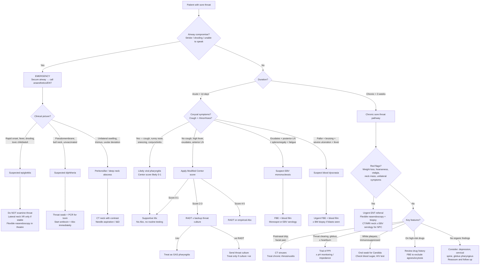

## Diagnostic Criteria, Algorithm and Investigations for Sore Throat Complaints

The diagnosis of sore throat is fundamentally a **two-step process**:

1. **Clinical risk stratification** — Is this an emergency? Is this likely viral or bacterial? Are there red flags for serious pathology?
2. **Targeted investigation** — Based on step 1, choose investigations that confirm or exclude specific diagnoses.

There is no single "diagnostic criterion" for "sore throat" as a whole — because sore throat is a symptom, not a disease. Instead, there are **diagnostic criteria for specific underlying conditions** that present as sore throat. Let me walk through each systematically, then tie it all together with a master algorithm.

---

### 1. Diagnostic Criteria for Key Conditions Presenting as Sore Throat

#### 1.1 GAS Pharyngitis — The Centor / Modified Centor (McIsaac) Criteria

This is the most important clinical scoring system for sore throat and the one most likely to appear on your exam. Its purpose is to **estimate the probability of GAS pharyngitis** and guide whether to test and/or treat.

**Why do we need a score?** Because clinically distinguishing GAS from viral pharyngitis is unreliable — ***the best diagnostic accuracy achievable based on clinical symptoms alone is only 50%*** [3]. The Centor score does not diagnose GAS; it tells you **whether to bother testing**.

***Centor Criteria*** [3]:

| Criterion | Points | Pathophysiological Rationale |
|---|---|---|
| ***History of fever*** | +1 | GAS triggers a robust PMN response → pyrogen release → higher fevers than most viral pharyngitis |
| ***Tonsillar exudates*** | +1 | GAS produces streptolysin and other toxins → intense tissue necrosis and PMN infiltration → purulent exudate |
| ***Tender anterior cervical adenopathy*** | +1 | Jugulodigastric nodes drain the tonsils → reactive hyperplasia from active bacterial infection |
| ***Absence of cough*** | +1 | Cough reflects involvement of lower respiratory mucosa → strongly suggests viral aetiology (rhinovirus, coronavirus etc.) rather than GAS which is confined to the pharynx |

***Modified Centor (McIsaac) Criteria*** [3] add age adjustment:

| Age Modifier | Points | Rationale |
|---|---|---|
| ***Age < 15 years*** | +1 | GAS pharyngitis is most common in school-age children |
| ***Age 15–44 years*** | 0 | Baseline risk |
| ***Age > 44 years*** | −1 | GAS pharyngitis becomes uncommon in older adults; other diagnoses (malignancy, LPR) become more likely |

**Interpretation and Action:**

| Score | GAS Probability | Recommended Action |
|---|---|---|
| ***−1 to 1*** | ***< 10%*** | ***No antibiotics or throat culture necessary*** [3] |
| ***2 to 3*** | ***15–32%*** | ***Antibiotics if throat culture positive*** [3] — perform RADT ± backup culture |
| ***4 to 5*** | ***~56%*** | ***Treat empirically with antibiotics*** [3] — though some guidelines still recommend testing first |

<Callout title="Why the Centor Score Matters">
The Centor score is NOT a diagnostic test — it is a **pre-test probability estimator**. Even at a score of 5, the probability of GAS is only ~56%, meaning nearly half of these patients still don't have strep throat. This is exactly why ***empiric treatment is NOT recommended*** [3] by many guidelines without at least a rapid test. The score's greatest value is at the low end: a score of 0–1 essentially rules out GAS and saves unnecessary testing and antibiotics.
</Callout>

> ***Historically, scoring systems were used to identify individuals who were very likely to have strep throat that do not require any testing. However, no clinical scoring has been demonstrated to be specific enough to eliminate the need for diagnostic testing, and nowadays they are solely used to identify those where strep throat is unlikely, to reduce the need for testing.*** [3]

#### 1.2 EBV Infectious Mononucleosis — Hoagland Criteria (Classic)

There are no universally adopted formal "diagnostic criteria" for EBV mononucleosis in the way Jones criteria exist for rheumatic fever, but the classic **Hoagland criteria** (1975) provide a useful framework:

1. **≥50% lymphocytes** on differential WBC count
2. **≥10% atypical lymphocytes** on peripheral blood smear
3. **Positive heterophile antibody test** (Monospot) or **EBV-specific serology**
4. **Clinical syndrome** of fever, pharyngitis, and lymphadenopathy

**Why atypical lymphocytes?** EBV infects B cells → massive reactive CD8+ T cell expansion → these activated T cells appear large with abundant basophilic cytoplasm and irregular nuclei on the blood film = "atypical lymphocytes." They are NOT neoplastic — they are a reactive phenomenon.

**Why heterophile antibodies?** EBV-induced B cell activation is polyclonal → these activated B cells produce a variety of non-specific antibodies, including heterophile antibodies (IgM that agglutinate horse/sheep RBCs). The Monospot test detects these. Sensitivity is ~85% in adults but **much lower in children < 4 years** (~25–50%) — so a negative Monospot in a young child does not rule out EBV.

#### 1.3 Acute Epiglottitis — Clinical Diagnosis (No Formal Criteria)

This is a **clinical emergency diagnosis** — you do not wait for criteria or investigations before acting.

***Admit if any suspicion of epiglottitis — and do not examine the throat*** [1].

**Clinical features that should trigger immediate action:**
- Rapid onset severe sore throat with toxicity
- Muffled "hot potato" voice (NOT hoarseness — the vocal cords are above the epiglottis in terms of sound generation, but the supraglottic swelling alters resonance)
- Drooling (unable to swallow saliva)
- Stridor (inspiratory — indicating supraglottic narrowing)
- Tripod positioning (sitting upright, leaning forward, neck extended — to maximise airway diameter)
- ***Rapid onset fever, dysphonia, dysphagia and respiratory distress*** [3]

**Confirmation** (only after airway is secured): Lateral neck X-ray showing "thumbprint sign" (swollen epiglottis) or direct visualisation via flexible nasendoscopy in a controlled setting.

#### 1.4 Peritonsillar Abscess (Quinsy) — Clinical Diagnosis

Diagnosed clinically by the constellation of:
- **Severe unilateral sore throat** (abscess is unilateral)
- **Trismus** (medial pterygoid spasm from adjacent inflammation)
- **Uvular deviation** (pushed contralaterally by the abscess mass)
- **"Hot potato" voice**
- **Bulging unilateral soft palate/peritonsillar area**

Needle aspiration of pus confirms the diagnosis and is simultaneously therapeutic.

#### 1.5 Acute Rheumatic Fever — Jones Criteria (Revised 2015)

While rheumatic fever is not a "sore throat" presentation per se, it is the key **complication** that drives our need to diagnose and treat GAS pharyngitis. The Jones criteria confirm the diagnosis of ARF.

**Evidence of preceding GAS infection** (required) PLUS:
- **2 major criteria**, OR
- **1 major + 2 minor criteria**

| Major Criteria | Minor Criteria |
|---|---|
| Carditis (clinical or subclinical on echo) | Fever |
| Migratory polyarthritis | Elevated ESR or CRP |
| Sydenham's chorea | Prolonged PR interval on ECG |
| Erythema marginatum | Polyarthralgia (in moderate/high-risk populations) |
| Subcutaneous nodules | |

**Evidence of preceding GAS infection:** Positive throat culture/RADT, elevated/rising ASO titre, elevated anti-DNase B titre, or history of recent scarlet fever.

#### 1.6 Diphtheria — Clinical + Microbiological Diagnosis

- **Clinical:** pharyngeal pseudomembrane + fever + cervical lymphadenopathy ("bull neck") + toxicity
- **Microbiological:** ***Throat swab and PCR for toxins*** [3]; culture on tellurite agar (selective medium — *C. diphtheriae* produces black colonies)
- Treatment must NOT wait for culture confirmation — ***antitoxin + macrolide/penicillins*** [3] started immediately on clinical suspicion

#### 1.7 Pharyngeal/Laryngeal Malignancy — Tissue Diagnosis Required

There are no "clinical criteria" — malignancy is confirmed by **histopathological diagnosis from biopsy**. The clinical features (***hoarseness, pain on swallowing and referred ear pain*** [1]) raise suspicion, but ***biopsy of suspicious lesions*** [1] is essential.

For NPC specifically, serological screening (EBV VCA IgA, EBV DNA) can raise suspicion, but ***incisional biopsy should be performed in all cases*** [4].

---

### 2. Master Diagnostic Algorithm

The following algorithm integrates the clinical approach from history-taking through to specific investigations:

---

### 3. Investigation Modalities — Detailed Breakdown

***Key investigations: Consider throat swab, FBE, mononucleosis test, blood sugar, biopsy of suspicious lesions*** [1].

This section explains **what each investigation tests for, how it works, and how to interpret it**.

#### 3.1 Bedside / Point-of-Care Tests

##### 3.1.1 Rapid Antigen Detection Test (RADT) for GAS

**What it does:** Detects the Group A carbohydrate antigen on the surface of *S. pyogenes* directly from a throat swab specimen, using immunochromatographic technology (similar principle to a COVID rapid antigen test).

**Why it's useful:** Results available in **5–10 minutes** at the point of care → allows same-visit decision-making about antibiotics.

**Performance [3]:**

| Parameter | Value | Clinical Implication |
|---|---|---|
| ***Specificity*** | ***≥95%*** | A positive RADT is very reliable — you can start antibiotics confidently |
| ***Sensitivity*** | ***70–90%*** | A negative RADT can miss 10–30% of true GAS cases |

> ***A negative RADT should be backed up by culture*** [3] — especially in children and adolescents where the consequences of missed GAS (rheumatic fever) are greatest. In adults, some guidelines accept a negative RADT as sufficient to withhold antibiotics because the risk of ARF is much lower.

**Limitation:** ***Cannot distinguish between illness and carrier states*** [3]. Approximately 5–20% of school-age children are asymptomatic GAS carriers. A positive RADT in a child with clear viral symptoms (cough, rhinorrhoea) may represent carriage, not active infection.

##### 3.1.2 Monospot (Heterophile Antibody Test)

**What it does:** Detects heterophile antibodies (non-specific IgM produced by polyclonally activated B cells during EBV infection) that agglutinate horse or bovine erythrocytes.

**Performance:**
- **Sensitivity:** ~85% in adolescents/adults, but only ~25–50% in children < 4 years (their immune systems produce fewer heterophile antibodies)
- **Specificity:** ~95–100% (false positives rare; can occur in HIV, lymphoma, SLE)
- **Timing:** May be negative in the first week of illness → repeat at 1–2 weeks if initially negative but clinical suspicion remains high

**Interpretation:**
- Positive Monospot + compatible clinical features (fever, pharyngitis, posterior cervical lymphadenopathy, fatigue) = EBV infectious mononucleosis
- Negative Monospot ≠ exclusion, especially early in illness or in young children → send EBV-specific serology

#### 3.2 Laboratory Blood Tests

##### 3.2.1 ***FBE (Full Blood Examination / CBC)*** [1]

This is arguably the most important single blood test for sore throat because it screens for several serious diagnoses simultaneously.

| Finding | What It Suggests | Why |
|---|---|---|
| **Neutrophilia** (↑ neutrophils) | Bacterial infection (GAS, abscess) | Bone marrow increases PMN output in response to bacterial pyrogens and G-CSF |
| **Lymphocytosis with atypical lymphocytes** | EBV mononucleosis | Massive reactive CD8+ T cell expansion → large cells with abundant basophilic cytoplasm and irregular nuclei |
| **Neutropenia** (ANC < 1.5; severe < 0.5 × 10⁹/L) | Agranulocytosis → drug-induced, viral, leukaemia | Loss of neutrophil defence → pharyngeal mucosal infection and ulceration |
| **Pancytopenia** (↓ all lineages) | Bone marrow failure — leukaemia, aplastic anaemia | Marrow infiltrated by blasts or failed → ↓ production of all cell lines |
| **Blasts on blood film** | ***Blasts: always abnormal → if ≥20%, diagnostic of acute leukaemia*** [11] | Immature cells that should not be in peripheral blood; indicate marrow overrun by malignant clones |
| **Thrombocytopenia** | EBV (immune-mediated), leukaemia, DIC in sepsis | EBV → antiplatelet antibodies or splenic sequestration; leukaemia → marrow replacement |
| **Eosinophilia** | Allergic pharyngitis, parasitic infection (rare) | Type 2 immune response with IL-5-driven eosinophil production |

<Callout title="Atypical Lymphocytes vs Blasts — Do Not Confuse" type="error">
***Atypical lymphocytosis: lymphocytosis with atypical-looking lymphocytes — result from lymphocyte activation due to IM (prototypical), other viral infections, autoimmune disease. NOT neoplastic → not to be mistaken as blasts or lymphoma cells.*** [11]

The key morphological difference: atypical lymphocytes are **large with abundant pale/basophilic cytoplasm that moulds around adjacent red cells** (reactive T cells). Blasts are **immature cells with high nuclear-to-cytoplasmic ratio, fine chromatin, and prominent nucleoli**. If in doubt, flow cytometry resolves the question.
</Callout>

##### 3.2.2 ***Blood Sugar*** [1]

**Why check it?** To unmask **diabetes mellitus** as the underlying cause of recurrent oropharyngeal candidiasis. Hyperglycaemia promotes Candida growth (sugar is a carbon source for yeast) and impairs neutrophil chemotaxis and phagocytosis through glycosylation of immune proteins.

- Fasting glucose ≥ 7.0 mmol/L or random glucose ≥ 11.1 mmol/L (with symptoms) → diabetes
- HbA1c ≥ 48 mmol/mol (6.5%) → diabetes

##### 3.2.3 EBV-Specific Serology

When Monospot is negative but EBV is still suspected (children < 4y, early illness, immunocompromised), send specific EBV antibodies:

| Antibody | Acute Primary EBV | Past EBV | Reactivation |
|---|---|---|---|
| VCA IgM | **Positive** | Negative | Variable |
| VCA IgG | Positive (rising) | **Positive** | Positive |
| EA IgG | Positive | Negative | Positive |
| EBNA IgG | Negative (appears late) | **Positive** | Positive |

**Interpretation logic:**
- **VCA IgM positive + EBNA IgG negative** = acute primary EBV infection (EBNA antibodies take 6–12 weeks to develop, so their absence confirms this is not reactivation or past infection)
- **VCA IgG positive + EBNA IgG positive + VCA IgM negative** = past infection / immune

For **NPC screening** in HK: EBV VCA IgA and plasma EBV DNA are used as serological markers. Elevated EBV DNA has been incorporated into NPC screening programmes in Southern China [4].

##### 3.2.4 Inflammatory Markers (ESR / CRP)

- Non-specific but help gauge severity and monitor progress
- **Markedly elevated ESR (often > 50 mm/hr)** in subacute (de Quervain's) thyroiditis [9] — this is a key distinguishing feature
- Elevated CRP in bacterial infections, abscess formation
- Serial CRP useful for monitoring response to treatment in deep neck space infections

##### 3.2.5 ASO Titre / Anti-DNase B

**Purpose:** Confirm **preceding GAS infection** — relevant mainly when investigating **post-streptococcal complications** (rheumatic fever, PSGN), NOT for acute diagnosis of pharyngitis (serology takes > 2 weeks to rise).

- ***Serology is not helpful as it takes > 2 weeks*** [3] for diagnosing acute pharyngitis
- **ASO titre** rises 1–3 weeks after GAS infection, peaks at 3–5 weeks
- **Anti-DNase B** is more sensitive for skin infections and persists longer
- A rising titre (paired sera 2 weeks apart) is more meaningful than a single elevated value

##### 3.2.6 Thyroid Function Tests (TFTs)

When thyroiditis is suspected (anterior neck tenderness radiating to jaw/ears, elevated ESR):
- **Thyrotoxic phase (early):** ↓ TSH, ↑ free T4 (stored hormone leaking from damaged follicles)
- **Hypothyroid phase (later):** ↑ TSH, ↓ free T4 (follicular cells depleted)
- Radioactive iodine uptake will be **low** in all phases (distinguishes from Graves' disease where uptake is high)

##### 3.2.7 HIV Test

Consider in any patient with:
- Unexplained recurrent pharyngitis / oral candidiasis in a young adult
- Mononucleosis-like syndrome with negative Monospot
- Risk factors (MSM, IVDU, unprotected sexual contact, high-prevalence region)
- 4th-generation HIV Ag/Ab combo assay (detects p24 antigen + HIV-1/2 antibodies) — window period ~2 weeks

#### 3.3 Microbiological Investigations

##### 3.3.1 ***Throat Swab*** [1]

The single most important microbiological investigation for acute sore throat. There are three modalities:

| Test | Turnaround | Sensitivity | Specificity | When to Use |
|---|---|---|---|---|
| ***RADT*** [3] | 5–10 min | ***70–90%*** | ***≥95%*** | First-line for GAS in clinic; positive result is reliable |
| ***Throat culture*** [3] | ***Up to 3 days*** | ***↑↑ (gold standard)*** | High | Backup for negative RADT; also identifies other pathogens (group C/G strep, *Arcanobacterium*, *F. necrophorum*) |
| **PCR** | Hours–1 day | Highest | Highest | ***Seldom used*** [3] for routine pharyngitis; used for diphtheria toxin gene detection, or viral identification |

**Technique matters:** Swab must be taken from the **tonsillar surface and posterior pharyngeal wall** — not just the buccal mucosa or tongue. Inadequate sampling is the most common reason for false-negative results.

**For diphtheria:** ***Throat swab and PCR for toxins*** [3]. Culture is on tellurite agar or Löffler's medium.

**For gonococcal pharyngitis:** Throat swab for NAAT (nucleic acid amplification test) — routine culture is insufficient as *N. gonorrhoeae* is fastidious.

##### 3.3.2 Abscess Aspirate Culture

When peritonsillar or deep neck abscess is drained (needle aspiration or incision & drainage), the pus should be sent for:
- Gram stain and aerobic + anaerobic culture
- Most commonly polymicrobial: GAS + oral anaerobes (*Fusobacterium*, *Prevotella*, *Peptostreptococcus*)

#### 3.4 Imaging

##### 3.4.1 Lateral Soft Tissue Neck X-ray

**Indications:** Suspected epiglottitis (if patient is stable enough), suspected retropharyngeal abscess, foreign body.

| Finding | Diagnosis |
|---|---|
| **"Thumbprint sign"** — swollen, rounded epiglottis silhouette | Acute epiglottitis (normal epiglottis looks like a thin leaf) |
| **Widened prevertebral soft tissue** ( > 7mm at C2, > 22mm at C6 in adults) | Retropharyngeal abscess or haematoma |
| **Radio-opaque foreign body** | Fish bone, chicken bone (but many FBs are radiolucent → sensitivity ~50%) |
| **Subglottic narrowing ("steeple sign")** | Croup (viral laryngotracheobronchitis) — narrowing of the subglottic airway |

**Important caveat:** A lateral neck X-ray is a **screening** tool. If epiglottitis is strongly suspected clinically, do NOT delay management for imaging — go straight to securing the airway in a controlled environment (theatre/ICU).

##### 3.4.2 CT Neck with IV Contrast

**The investigation of choice for deep neck space infections and neck masses.**

| Indication | Key Findings |
|---|---|
| **Peritonsillar abscess** | Rim-enhancing fluid collection in the peritonsillar space; distinguishes abscess (needs drainage) from peritonsillar cellulitis (can trial antibiotics alone) |
| **Retropharyngeal / parapharyngeal abscess** | Rim-enhancing collection in the retropharyngeal or parapharyngeal space; assess for mediastinal extension |
| **Head & neck malignancy staging** | ***Useful to detect bony invasion, detection of cervical lymph node metastasis, CT thorax and abdomen to assess for distant metastasis*** [4] |
| **Lemierre syndrome** | Thrombosis of the internal jugular vein (filling defect on contrast CT) + septic pulmonary emboli |

##### 3.4.3 MRI Neck

- ***Imaging modality of choice for cancer of the oral cavity and oropharynx*** [4]
- ***Provides optimal visualization of soft-tissue infiltration of the tumour*** [4]
- ***Detection of cervical lymph node metastasis*** [4]
- Superior to CT for delineating tumour margins, perineural spread, and base of skull invasion (especially for NPC)
- Less useful in acute infection (CT is faster and more readily available in the emergency setting)

##### 3.4.4 Ultrasound (USG)

- Useful for evaluating cervical lymphadenopathy and guiding FNAC
- ***USG has limited use in oropharyngeal cancer but is a useful adjunct for FNAC to ensure accurate aspiration of a deeply seated lymph node swelling*** [4]
- Useful for evaluating thyroid in suspected thyroiditis (heterogeneous, hypoechoic gland with ↓ vascularity in de Quervain's)

##### 3.4.5 Chest X-ray

Relevant when:
- Pulmonary TB suspected (chronic sore throat + hoarseness + constitutional symptoms → CXR for apical infiltrates/cavitation)
- Lemierre syndrome (septic pulmonary emboli → multiple cavitating nodules)
- NPC staging (lung metastases)
- Suspected foreign body aspiration

#### 3.5 Endoscopic / Procedural Investigations

##### 3.5.1 Flexible Nasendoscopy (Fibreoptic Laryngoscopy)

**The cornerstone investigation for any chronic or suspicious sore throat**, and for visualising the supraglottic and glottic structures that cannot be seen on simple oral examination.

**Procedure:** Thin flexible fibreoptic scope passed through the nose → nasopharynx → pharynx → larynx. Performed awake with topical anaesthesia (lignocaine spray).

**What it visualises:**
- **Nasopharynx:** Fossa of Rosenmüller (NPC origin site), adenoids, Eustachian tube orifices
- **Oropharynx/Hypopharynx:** Base of tongue, valleculae, piriform fossae, posterior pharyngeal wall
- **Larynx:** Epiglottis, vocal cords (mobility, masses, oedema), subglottic region
- **LPR signs:** Posterior laryngeal oedema, interarytenoid pachydermia ("cobblestoning"), vocal cord erythema

**Indications:**
- Persistent sore throat > 3 weeks (rule out malignancy)
- ***The triad: hoarseness, pain on swallowing and referred ear pain*** [1]
- Suspected epiglottitis (ONLY in controlled setting with anaesthetic backup)
- Hoarseness lasting > 3 weeks
- Unilateral symptoms, neck mass, suspected NPC

##### 3.5.2 ***Panendoscopy (Direct Laryngoscopy + Bronchoscopy + OGD)*** [4]

**Purpose:** ***Exclude the presence of synchronous lesion*** [4] — patients with one head and neck SCC have a 10–15% risk of having a second primary tumour elsewhere in the upper aerodigestive tract ("field cancerization").

- Performed under general anaesthesia
- Allows **examination under anaesthesia (EUA)** of the full upper aerodigestive tract
- ***Staging examination is recommended at the initial evaluation of all patients with primary cancers of the upper aerodigestive tract*** [4]
- Enables **incisional biopsy** of suspicious lesions for histopathological diagnosis

##### 3.5.3 ***Biopsy of Suspicious Lesions*** [1]

**The definitive investigation for any suspected malignancy.**

| Biopsy Type | When Used |
|---|---|
| **Incisional biopsy** (during panendoscopy) | ***Incisional biopsy should be performed in all cases*** [4] of suspected pharyngeal / laryngeal malignancy |
| **FNAC (fine needle aspiration cytology)** | For palpable cervical lymph nodes → determines if metastatic SCC, lymphoma, or reactive. ***USG-guided FNAC for deeply seated lymph node swelling*** [4] |
| **Punch biopsy** | For accessible mucosal lesions (e.g., oral cavity SCC) |
| **Excisional biopsy** | Sometimes for isolated lymph nodes when FNAC is non-diagnostic; avoid if lymphoma suspected (need architecture) |

**Important principle:** In a patient with a neck mass suspected to be metastatic from an H&N primary, you should **identify and biopsy the primary tumour first** (via panendoscopy). Open excisional biopsy of the neck mass should be avoided until the primary is found, because it can compromise subsequent surgical management (seeding the wound, altering tissue planes).

#### 3.6 Summary Table: Investigation by Suspected Diagnosis

| Suspected Diagnosis | First-Line Investigation | Second-Line / Confirmatory | Key Finding |
|---|---|---|---|
| **GAS pharyngitis** | RADT | Throat culture (backup if RADT −ve) | +ve antigen / +ve culture |
| **EBV mononucleosis** | FBE + blood film, Monospot | EBV-specific serology (VCA IgM/IgG, EBNA) | Atypical lymphocytes, +ve Monospot |
| **Peritonsillar abscess** | Clinical diagnosis | CT neck with contrast (if uncertain) | Rim-enhancing collection; pus on aspiration |
| **Epiglottitis** | Clinical → secure airway | Lateral neck XR (thumbprint sign) or flexible nasendoscopy in theatre | Swollen cherry-red epiglottis |
| **Retropharyngeal abscess** | Lateral neck XR | CT neck with contrast | Widened prevertebral space; rim-enhancing collection |
| **Diphtheria** | Throat swab for culture | PCR for diphtheria toxin gene | *C. diphtheriae* on tellurite agar; toxin gene +ve |
| **Blood dyscrasia** | Urgent FBE + blood film | Bone marrow biopsy if blasts seen | Neutropenia, pancytopenia, ≥20% blasts (leukaemia) |
| **Oropharyngeal candidiasis** | Clinical (white scrapeable plaques) | Oral swab for culture; blood sugar; HIV test | *Candida* on culture; hyperglycaemia; HIV +ve |
| **H&N malignancy** | Flexible nasendoscopy | CT/MRI + panendoscopy with biopsy | Mucosal mass + histological confirmation (SCC, NPC, lymphoma) |
| **NPC** | EBV VCA IgA + plasma EBV DNA | Nasopharyngoscopy + biopsy; MRI nasopharynx to skull base | Fossa of Rosenmüller mass; EBV +ve undifferentiated carcinoma |
| **LPR / GERD** | Empirical PPI trial | 24h pH-impedance monitoring; flexible nasendoscopy | Acid exposure time elevated; posterior laryngeal oedema |
| **Subacute thyroiditis** | ESR, TFTs | USG thyroid; radioactive iodine uptake | ESR markedly ↑; fluctuating TFTs; ↓ iodine uptake |
| **Foreign body** | Lateral neck XR | Flexible nasendoscopy ± OGD | Radio-opaque FB; direct visualisation |
| **Gonococcal pharyngitis** | Throat swab for NAAT | — | +ve *N. gonorrhoeae* NAAT |
| **HIV** | 4th-gen HIV Ag/Ab combo assay | Confirmatory Western blot; viral load | p24 Ag or HIV Ab +ve |

---

### 4. Special Diagnostic Considerations in Hong Kong

<Callout title="NPC Screening in Hong Kong" type="idea">
Given that ***NPC is endemic in Southern China including Hong Kong*** [4], a low threshold for investigation is warranted. Any patient — especially a Cantonese male aged 40–60 — presenting with:
- Unilateral serous otitis media (Eustachian tube obstruction by tumour)
- Unilateral nasal obstruction or epistaxis
- Painless posterior cervical neck mass
- Cranial nerve palsies (CN III–VI if tumour invades cavernous sinus)

…should have **flexible nasendoscopy with biopsy of the fossa of Rosenmüller** and **EBV VCA IgA + plasma EBV DNA**. MRI is the imaging modality of choice for local staging (superior soft tissue contrast for skull base and intracranial extension).

Population-level NPC screening using plasma EBV DNA is being studied and implemented in endemic regions, identifying NPC at earlier (more curable) stages.
</Callout>

---

<Callout title="High Yield Summary">

1. **Centor/Modified Centor criteria** guide GAS testing: ***score 0–1 → no testing; score 2–3 → RADT ± culture; score 4–5 → empirical Abx or RADT*** [3]. No clinical score alone is accurate enough to diagnose GAS.

2. ***RADT: specificity ≥95% (positive result reliable), sensitivity 70–90% (negative RADT should be backed up by culture)*** [3].

3. ***Throat culture remains the gold standard for GAS but requires up to 3 days*** [3].

4. **Monospot** detects heterophile antibodies for EBV; sensitivity ~85% in adults but poor in children < 4y. If negative but clinical suspicion high, send EBV-specific serology (VCA IgM + EBNA IgG pattern).

5. ***FBE*** [1] is critical: screens for atypical lymphocytes (EBV), neutropenia (agranulocytosis), blasts (leukaemia), and thrombocytopenia.

6. **Epiglottitis is a clinical diagnosis** → ***do not examine the throat, admit immediately*** [1]. Lateral neck XR (thumbprint sign) or flexible nasendoscopy only after airway secured.

7. **CT neck with contrast** is the imaging modality of choice for deep neck space infections (abscess vs cellulitis). ***MRI is the imaging modality of choice for oropharyngeal cancer*** [4].

8. ***Panendoscopy with biopsy*** [4] is required for all suspected H&N cancers to confirm histology and exclude synchronous primaries.

9. In HK, **NPC screening** (EBV VCA IgA, plasma EBV DNA) and **flexible nasendoscopy with biopsy** should be pursued in any patient with suspicious features.

10. ***Biopsy of suspicious lesions*** [1] — any persistent pharyngeal lesion > 3 weeks requires tissue diagnosis.

</Callout>

---

<ActiveRecallQuiz
  title="Active Recall - Diagnosis and Investigations for Sore Throat"
  items={[
    {
      question: "A 10-year-old presents with acute sore throat, fever, tonsillar exudates, tender anterior cervical nodes, and no cough. Calculate the Modified Centor score and state the recommended management.",
      markscheme: "Score: fever (+1), exudates (+1), tender anterior cervical nodes (+1), no cough (+1), age less than 15 (+1) = 5. At score 4-5, risk of GAS is approximately 56%. Recommended action: treat empirically with antibiotics (Penicillin V or amoxicillin) OR perform RADT first and treat if positive. Many guidelines still recommend testing before treating even at high scores. A negative RADT should be backed up by throat culture in children due to higher risk of rheumatic fever."
    },
    {
      question: "What is the sensitivity and specificity of RADT for GAS? What should you do if the RADT is negative in a child with high clinical suspicion?",
      markscheme: "RADT: specificity 95% or more (positive result reliable), sensitivity 70-90% (can miss 10-30% of cases). If RADT is negative in a child with high clinical suspicion, send a backup throat culture (gold standard, sensitivity 90-95% but takes up to 3 days). Withhold antibiotics pending culture results unless clinical picture is compelling. In adults, a negative RADT may be accepted as sufficient due to lower risk of rheumatic fever."
    },
    {
      question: "A 50-year-old Cantonese male in Hong Kong presents with unilateral serous otitis media and a painless level V cervical lymph node. What diagnosis must you exclude and what investigations would you order?",
      markscheme: "Must exclude nasopharyngeal carcinoma (NPC) - endemic in Southern China/HK, EBV-driven, typically arises from fossa of Rosenmuller. Investigations: (1) Flexible nasendoscopy with biopsy of fossa of Rosenmuller, (2) EBV VCA IgA and plasma EBV DNA (serological markers), (3) MRI nasopharynx to skull base (imaging modality of choice for NPC - superior soft tissue contrast), (4) CT thorax/abdomen for distant metastasis staging, (5) USG-guided FNAC of the cervical lymph node."
    },
    {
      question: "How do you differentiate atypical lymphocytes of EBV mononucleosis from blasts of acute leukaemia on a blood film?",
      markscheme: "Atypical lymphocytes (EBV): large cells with abundant pale/basophilic cytoplasm that moulds around adjacent red cells, mature chromatin pattern - these are reactive activated T cells, NOT neoplastic. Blasts (leukaemia): immature cells with high nuclear-to-cytoplasmic ratio, fine/open chromatin, prominent nucleoli; presence of Auer rods confirms myeloblastic nature (AML). If 20% or more blasts, diagnostic of acute leukaemia. If morphology is uncertain, flow cytometry (immunophenotyping) resolves the question definitively."
    },
    {
      question: "A patient presents with severe sore throat, drooling, stridor, and a muffled voice. They appear toxic. What is the most likely diagnosis, what must you NOT do, and what is the radiological sign on lateral neck X-ray?",
      markscheme: "Most likely diagnosis: acute epiglottitis. Must NOT examine the throat with a tongue depressor - this can trigger complete laryngospasm and fatal airway obstruction. Secure the airway first (call anaesthetics/ENT, prepare for intubation/surgical airway). Lateral neck X-ray shows the 'thumbprint sign' - swollen rounded epiglottis replacing the normal thin leaf-like silhouette. However, do not delay airway management for imaging if the patient is unstable."
    }
  ]}
/>

## References

[1] Lecture slides: murtagh merge.pdf (pp. 90–92, "Sore throat" chapter)
[3] Senior notes: Ryan Ho Respiratory.pdf (pp. 48–52, "URTI / Bacterial Pharyngitis" sections)
[4] Senior notes: felixlai.md (Head and Neck Cancer sections: oropharyngeal SCC diagnosis, NPC, panendoscopy, laryngeal carcinoma)
[9] Senior notes: Ryan Ho Endocrine.pdf (p. 31, "Subacute Thyroiditis")
[11] Senior notes: Ryan Ho Haemtology.pdf (p. 47, "WBC evaluation / Blasts / Atypical lymphocytes")
