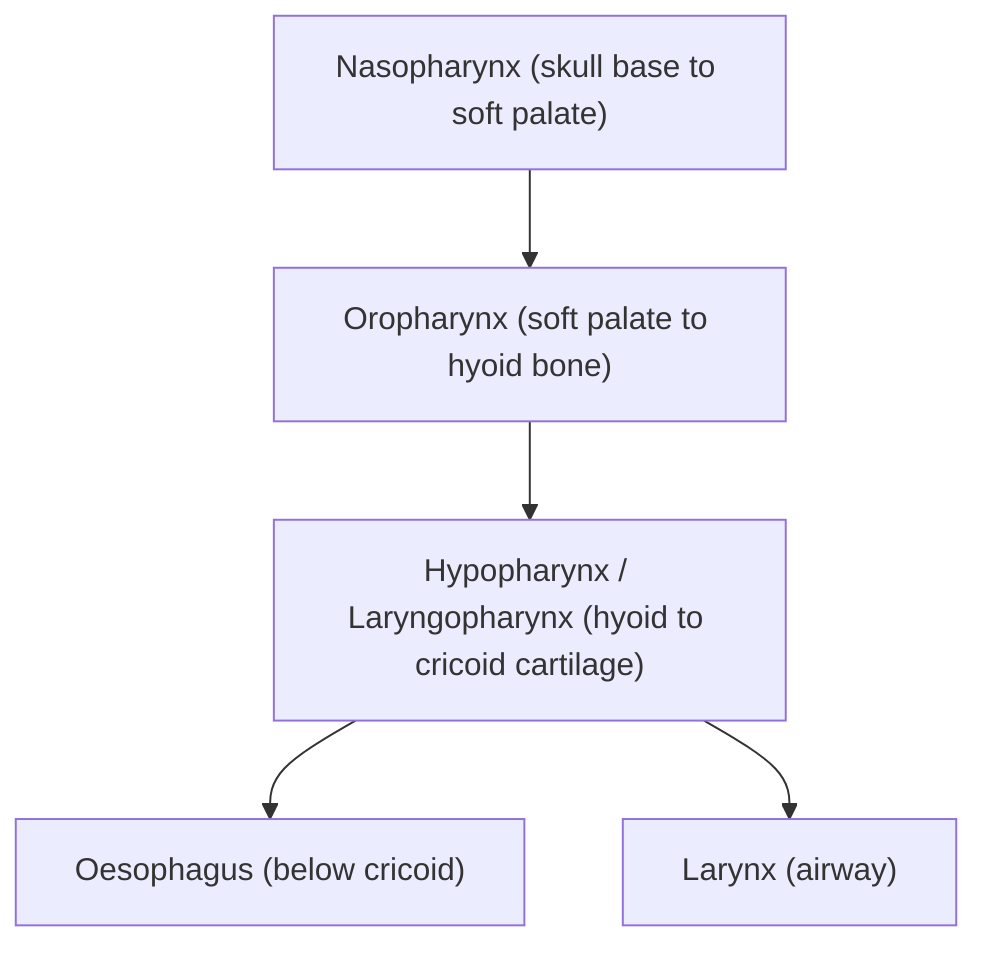
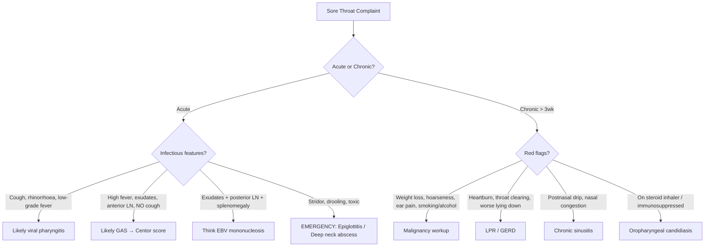

# Sore Throat Complaints

## 1. Definition

A "sore throat" (pharyngodynia) refers to any painful, scratchy, or irritated sensation in the throat that is typically worsened by swallowing. It is a **symptom**, not a diagnosis — the clinician's job is to work backwards from the complaint to the underlying aetiology.

Breaking down the anatomy of the term:
- **Pharyngitis** → "pharynx" (throat) + "-itis" (inflammation) = inflammation of the pharynx
- **Tonsillitis** → "tonsilla" (tonsil) + "-itis" = inflammation specifically of the palatine tonsils
- **Laryngopharyngitis** → involvement extends to the larynx (voice box), hence hoarseness accompanies sore throat

In clinical practice, "sore throat" is used loosely by patients and can refer to:
1. True pharyngeal/tonsillar pain (the most common scenario)
2. Deep neck pain (e.g., from cervical spine dysfunction, thyroiditis)
3. Referred pain (e.g., from angina, glossopharyngeal neuralgia)
4. Globus sensation ("lump in throat" without actual pain — functional or organic)

> ***Key history: First determine whether the patient has a sore throat, a deep pain in the throat, or neck pain.*** [1]

The clinical approach must therefore begin by clarifying what the patient actually means.

---

## 2. Epidemiology

### 2.1 Global and Hong Kong Context

- Sore throat accounts for approximately **2–5% of all primary care visits** and is one of the most common reasons for GP consultation worldwide [2].
- **Viral pharyngitis** is by far the most common cause, responsible for **25–45%** of pharyngitis episodes in adults and up to **70–80%** in children [3].
- **Group A Streptococcus (GAS)** pharyngitis accounts for **5–15% in adults** and **15–30% in children** [3].
- In Hong Kong:
  - **Nasopharyngeal carcinoma (NPC)** is **endemic in Southern China including Hong Kong** [4] — this is a uniquely important "serious disorder not to be missed" in any HK patient presenting with chronic sore throat, especially with unilateral ear symptoms, nasal obstruction, or neck mass.
  - Epstein-Barr virus (EBV) seropositivity is extremely high (>90% by adulthood in HK), which is relevant for both infectious mononucleosis in adolescents and NPC risk in adults.
  - ***Diphtheria is very rare*** [1] in HK due to high vaccination coverage, but should still be considered in unvaccinated/under-vaccinated individuals or travellers.

### 2.2 Age and Demographic Patterns

| Age Group | Most Common Causes | Key Consideration |
|---|---|---|
| Children < 5y | Viral URTI, herpangina, hand-foot-mouth disease | GAS uncommon < 3y |
| Children 5–15y | GAS pharyngitis (peak incidence), viral URTI, EBV | Rheumatic fever risk highest here |
| Young adults 15–25y | EBV mononucleosis, GAS, viral | ***Tonsillitis with a covering membrane may be caused by Epstein-Barr mononucleosis*** [1] |
| Adults > 40y | Viral, GERD-related, malignancy, post-nasal drip | ***The triad — hoarseness, pain on swallowing and referred ear pain → pharyngeal cancer*** [1] |
| Elderly/debilitated | Oropharyngeal candidiasis, malignancy, parotitis | Poor oral hygiene, denture use, immunosuppression |

### 2.3 Risk Factors

These overlap heavily with aetiology (Section 5) but are worth listing systematically here:

**For infectious pharyngitis:**
- Close contacts (household, school, barracks) — especially for GAS
- Season: viral URTI peaks in autumn/winter; GAS peaks in late winter/early spring
- Immunosuppression (HIV, chemotherapy, transplant) → opportunistic infections (Candida, HSV, CMV)
- ***Diabetes (Candida)*** [1]
- ***Steroid inhalers*** [1] → oropharyngeal candidiasis (because inhaled corticosteroids deposit on pharyngeal mucosa, suppressing local immune defences and promoting fungal overgrowth)

**For non-infectious sore throat:**
- ***Smoking / irritants (e.g. cigarette smoke, chemicals)*** [1]
- GERD / laryngopharyngeal reflux (LPR) [5]
- ***Drugs (e.g. NSAIDs, cytotoxics)*** [1] — mucositis, or drug-induced agranulocytosis → secondary infection
- ***Chronic mouth breathing*** [1] → mucosal drying
- ***Spinal dysfunction (cervical referred pain)*** [1]

**For malignancy:**
- ***Smoking + Spirits (alcohol) + Sharp teeth + Sex (male/oral sex — HPV) + Spicy food*** = the "5Ss" for head and neck cancer [4]
- EBV infection + dietary nitrosamines (salted fish, preserved food) + genetic susceptibility → NPC [4]
- Age > 60, male sex [4]

---

## 3. Anatomy and Function

Understanding the anatomy is critical because it explains:
1. Why sore throat has so many causes (the pharynx is a crossroads)
2. Why complications spread the way they do
3. How to localise pathology on examination

### 3.1 The Pharynx

The pharynx is a fibromuscular tube extending from the skull base to the level of C6 (where it becomes the oesophagus). It is divided into three regions [4][6]:

| Region | Boundaries | Key Structures | Clinical Relevance |
|---|---|---|---|
| **Nasopharynx** | Skull base to soft palate | Adenoids, Eustachian tube openings, **fossa of Rosenmüller** | NPC arises here; Eustachian tube involvement → ear symptoms |
| **Oropharynx** | Soft palate to hyoid | Palatine tonsils, base of tongue, soft palate, posterior pharyngeal wall | GAS tonsillitis, peritonsillar abscess (quinsy), HPV-related oropharyngeal cancer |
| **Hypopharynx** | Hyoid to cricoid | Piriform fossae, post-cricoid area | Post-cricoid carcinoma (a/w Plummer-Vinson syndrome), FB lodgement |

### 3.2 The Tonsils (Waldeyer's Ring)

Waldeyer's ring is a ring of lymphoid tissue surrounding the pharyngeal inlet, forming the first line of immune defence against inhaled and ingested pathogens:

- **Pharyngeal tonsil** (adenoid) — in the nasopharynx roof
- **Tubal tonsils** — around Eustachian tube openings
- **Palatine tonsils** — in the oropharynx between the anterior and posterior tonsillar pillars (the ones you see on clinical examination)
- **Lingual tonsil** — at the base of the tongue

**Why do the tonsils get infected so readily?** Because they are designed to sample antigens — they have deep crypts lined by specialised epithelium that traps bacteria and viruses. These crypts can also become reservoirs of infection and debris (***tonsilloliths*** [1] — calcified debris in tonsillar crypts causing chronic sore throat and halitosis).

### 3.3 The Larynx

Relevant because sore throat may actually originate from laryngeal pathology (e.g. laryngopharyngeal reflux, epiglottitis, laryngeal cancer). The larynx is divided into [6]:

- **Supraglottis**: epiglottis, aryepiglottic folds, false vocal cords → rich lymphatics
- **Glottis**: true vocal cords → responsible for phonation
- **Subglottis**: below vocal cords to inferior border of cricoid

Key functions of the larynx [6]:
1. **Phonation** — vocal fold vibration
2. **Airway protection** — epiglottic closure during swallowing
3. **Valsalva manoeuvre** — closed glottis enables coughing, straining

### 3.4 Blood Supply and Lymphatic Drainage

The pharynx receives blood from branches of the external carotid artery (ascending pharyngeal, tonsillar branch of facial artery, lesser palatine). Venous drainage is via the pharyngeal venous plexus → internal jugular vein.

**Lymphatic drainage** is crucial for understanding malignancy spread:
- Pharynx → jugulodigastric (tonsillar) nodes → deep cervical chain
- NPC frequently → bilateral posterior cervical / retropharyngeal nodes
- The **jugulodigastric node** (level II) is the "tonsillar node" — often the first palpable node in tonsillitis or tonsillar malignancy

### 3.5 Innervation and Referred Pain

- Sensory innervation of the pharynx: primarily **glossopharyngeal nerve (CN IX)** and **vagus nerve (CN X)**
- CN IX also supplies the middle ear (Jacobson's nerve) → this is why **pharyngeal pathology (infection or cancer) causes referred otalgia** (ear pain without ear disease)
- ***The triad — hoarseness, pain on swallowing and referred ear pain → pharyngeal cancer*** [1] — this triad works because the cancer invades/irritates CN IX (ear pain + dysphagia) and CN X/recurrent laryngeal nerve (hoarseness)
- ***Glossopharyngeal neuralgia*** [1] → severe lancinating pain in the throat/ear triggered by swallowing, coughing, or talking — caused by neurovascular compression of CN IX (analogous to trigeminal neuralgia for CN V)

<Callout title="Why does pharyngeal cancer cause ear pain?">
The glossopharyngeal nerve (CN IX) provides sensory innervation to both the pharynx and the middle ear (via Jacobson's nerve/tympanic branch). When a pharyngeal tumour irritates CN IX afferents, the brain misinterprets the signal as coming from the ear. This is referred otalgia — there is nothing wrong with the ear itself. Always examine the oropharynx in any patient with unexplained unilateral ear pain, especially if > 40 years old and a smoker/drinker.
</Callout>

---

## 4. Relevant Aetiology (Hong Kong Focus) and Pathophysiology

This section systematically covers the causes of sore throat, grouped by the Murtagh framework [1], with pathophysiology explained for each.

### 4.1 Probability Diagnoses (Most Common)

These are what you'll see **90%+ of the time** in primary care.

#### 4.1.1 ***Viral Pharyngitis*** [1]

This is the **most common cause of sore throat** by a wide margin.

**Aetiology:** > 200 viral subtypes can cause pharyngitis [3]:
- ***Rhinovirus (30–50%)*** — the classic common cold virus
- ***Coronavirus (10–15%)*** — including seasonal coronaviruses
- ***Influenza (5–15%)***
- ***RSV (5%), parainfluenza (5%), adenovirus, enterovirus*** [3]

**Pathophysiology:**
1. Virus enters via droplet/contact → inoculates nasopharyngeal/oropharyngeal epithelium
2. Viral replication in epithelial cells → direct cytopathic effect (cell damage and death)
3. Innate immune response → release of inflammatory mediators (bradykinin, prostaglandins, IL-1, IL-6, TNF-α) → vasodilation, oedema, pain receptor stimulation
4. Pain receptors (nociceptors) in pharyngeal mucosa are sensitised → sore throat
5. The inflammation also triggers increased mucus production (rhinorrhoea) and stimulates sneezing reflexes

**Why does it resolve?** Because the adaptive immune response (T cells, antibodies) clears the virus within 7–10 days in immunocompetent individuals. The mucosal inflammation subsides as the viral load drops.

**Key clinical point:** ***Generally 24–72h incubation, > 90% resolve in 10 days (but can reach 14 days in a minority)*** [3].

#### 4.1.2 ***Epstein-Barr Mononucleosis (Glandular Fever)*** [1]

**Aetiology:** Epstein-Barr virus (EBV), a herpesvirus (HHV-4). Transmitted via saliva ("kissing disease").

**Pathophysiology:**
1. EBV infects oropharyngeal epithelium → then infects B lymphocytes via CD21 receptor
2. Infected B cells proliferate → massive reactive T cell response (these are the "atypical lymphocytes" seen on blood film)
3. Lymphoid tissue hypertrophy (tonsils, lymph nodes, spleen) → **exudative tonsillitis**, generalised lymphadenopathy, splenomegaly
4. Immune complex formation → can trigger transient hepatitis, rash (especially if amoxicillin given — occurs in ~90% of EBV patients given aminopenicillins, likely due to altered immune response causing hypersensitivity)

**Why is it important?** [1]
- ***Epstein-Barr mononucleosis is a common "pitfall (often missed)"*** — because it can mimic severe bacterial tonsillitis with exudates and fever
- ***Tonsillitis with a covering membrane may be caused by Epstein-Barr mononucleosis*** [1] — the greyish-white membrane over tonsils can be mistaken for diphtheria or bacterial tonsillitis
- In HK, EBV is also the primary aetiological agent for NPC [4] — a long-term consequence of EBV latency in epithelial cells

#### 4.1.3 ***Streptococcal (GABHS) Tonsillitis*** [1]

**Aetiology:** Group A β-haemolytic Streptococcus (GAS, *Streptococcus pyogenes*). Accounts for **5–15% of adult** and **15–30% of paediatric** pharyngitis [3].

**Pathophysiology:**
1. GAS adheres to pharyngeal epithelium via M protein and lipoteichoic acid
2. Produces virulence factors:
   - **Streptolysin O and S** → lyse host cells, responsible for β-haemolysis
   - **Streptococcal pyrogenic exotoxins (SPE)** → superantigens → massive T cell activation → scarlet fever rash
   - **Hyaluronidase, streptokinase** → facilitate tissue invasion
3. Intense PMN infiltration → purulent exudates on tonsils
4. Regional lymph node reaction → **tender anterior cervical lymphadenopathy** (jugulodigastric nodes)

**Why does GAS matter clinically?**
- Not because the pharyngitis itself is dangerous (it's usually self-limiting)
- But because of **non-suppurative complications** driven by molecular mimicry:
  - **Acute rheumatic fever (ARF)** [7]: antibodies against GAS M protein cross-react with cardiac myosin, joint synovium, and brain tissue → pancarditis, migratory polyarthritis, Sydenham's chorea
  - **Post-streptococcal glomerulonephritis (PSGN)**: immune complex deposition in glomeruli
- And **suppurative complications**: peritonsillar abscess (quinsy), retropharyngeal abscess, suppurative cervical lymphadenitis

<Callout title="Rheumatic Fever — The HK and Developing World Perspective" type="idea">
Although ARF is rare in developed countries due to good antibiotic treatment of GAS pharyngitis, it remains a concern globally. In HK, the incidence has dropped dramatically but chronic rheumatic heart disease (RHD) is still seen, especially in elderly patients or immigrants. The key teaching point: **treating GAS pharyngitis with antibiotics prevents ARF** — this is why we must distinguish GAS from viral pharyngitis. The Centor criteria help us do this [3].
</Callout>

#### 4.1.4 ***Chronic Sinusitis with Postnasal Drip*** [1]

**Pathophysiology:**
1. Chronic inflammation of paranasal sinus mucosa → persistent mucopurulent secretions
2. Secretions drain posteriorly along the posterior pharyngeal wall (postnasal drip/PND)
3. This irritates the pharyngeal mucosa → chronic sore throat, throat-clearing, cough
4. Patients often describe a "tickle" or "something dripping" at the back of the throat, worse on lying down

**Why is this a probability diagnosis?** Because chronic rhinosinusitis is very common (5–12% prevalence) and postnasal drip is one of the top three causes of chronic cough. Patients often present with "sore throat" when the real problem is in the sinuses.

#### 4.1.5 ***Oropharyngeal Candidiasis (Oral Thrush)*** [1]

**Aetiology:** *Candida albicans* (most common), a commensal yeast of the oral cavity.

**Pathophysiology:**
1. Normally kept in check by competing oral flora, salivary defences, and mucosal immunity
2. Disruption of any of these → Candida overgrowth:
   - ***Steroid inhalers*** [1] → local immunosuppression + mucosal thinning
   - ***Diabetes*** [1] → hyperglycaemia favours fungal growth + glycosylation impairs neutrophil function
   - Antibiotics → kill competing bacteria → Candida flourishes
   - HIV/AIDS → CD4 T cell depletion → loss of mucosal immune surveillance
   - Dentures, poor oral hygiene, xerostomia
3. Candida adheres to mucosa → forms pseudohyphae → superficial invasion → white, curd-like plaques that can be scraped off revealing erythematous, sometimes bleeding base

**Clinical pearl:** ***Common in infants*** [1] (immature immune system) and in debilitated/immunosuppressed adults.

---

### 4.2 Serious Disorders Not to Be Missed

These are lower probability but high stakes — missing them can be fatal.

#### 4.2.1 Cardiovascular: ***Angina and Myocardial Infarction*** [1]

This is a classic "masquerade." The sore throat isn't really a sore throat — it's referred cardiac pain.

**Pathophysiology of referred pain:**
- Myocardial ischaemia activates cardiac nociceptors → afferents travel via cardiac sympathetic nerves → synapse in upper thoracic (T1–T4) spinal cord segments
- These segments also receive somatic afferents from the chest wall, arm, jaw, and throat
- The brain misinterprets the visceral cardiac pain as coming from somatic structures → "throat tightness," jaw pain, arm pain

**When to suspect:** Exertional "throat tightness" in a patient with cardiovascular risk factors (hypertension, diabetes, hyperlipidaemia, smoking, family history of IHD). The pain is not actually in the pharynx — it's deep and constricting.

#### 4.2.2 ***Neoplasia/Cancer: Cancer of Oropharynx, Tongue*** [1]

**Key aetiologies in HK:**
- **HPV-related oropharyngeal SCC** (HPV 16/18): ***HPV-associated H&N cancer occurs primarily in the oropharynx including tonsils and the base of tongue*** [4]. Younger male patients, higher number of sexual partners. Better prognosis than HPV-negative cancers.
- **Tobacco/alcohol-driven SCC**: ***Synergism between smoking and alcohol in development of HNSCC is well established*** [4]. Typically in older males.
- **NPC (EBV-driven)**: ***Endemic in Southern China including Hong Kong*** [4]. ***Frequently originates from pharyngeal recess known as fossa of Rosenmüller*** [4]. May present as sore throat, epistaxis, nasal obstruction, or (commonly) a painless neck mass.

**Pathophysiology of HPV-driven carcinogenesis:**
- HPV infects basal epithelial cells of tonsillar crypts
- ***Viral oncoproteins E6 and E7 inactivate tumour suppressors p53 and Rb*** [4] → uncontrolled cell proliferation
- Distinct from tobacco-driven cancers: HPV-positive tumours are typically p16-positive, non-keratinising, and more radiosensitive

> ***Diagnostic tip: The triad — hoarseness, pain on swallowing and referred ear pain → pharyngeal cancer*** [1]

#### 4.2.3 ***Blood Dyscrasias (e.g. Agranulocytosis, Acute Leukaemia)*** [1]

**Pathophysiology:**
- Agranulocytosis (absolute neutrophil count < 0.5 × 10⁹/L) → loss of the primary defence against bacteria in mucosal surfaces → pharyngeal mucosa becomes vulnerable to bacterial and fungal invasion → severe necrotising pharyngitis/ulceration
- **Drug-induced agranulocytosis** is the most common cause — think carbimazole (antithyroid drug), clozapine, methotrexate, chemotherapy, sulphonamides
- Acute leukaemia → bone marrow failure → pancytopenia → neutropenic sore throat + anaemic pallor + bleeding gums

**Clinical clue:** Sore throat that is disproportionately severe with mucosal ulceration/necrosis in a patient on high-risk medications, or with unexplained pallor, fatigue, bleeding, and fever.

#### 4.2.4 Infections — Emergencies

***(a) Acute Epiglottitis*** [1][3]

***"Admit if any suspicion of epiglottitis — and do not examine the throat"*** [1]

- **Aetiology:** *Haemophilus influenzae* type b (Hib) classically in children; in adults, *Streptococcus*, *Staphylococcus*, and other organisms
- **Pathophysiology:** Bacterial infection of the epiglottis and supraglottic structures → rapid swelling of the epiglottis → airway obstruction. The epiglottis can swell to several times its normal size within hours.
- **Why not examine the throat?** Because manipulating the pharynx (e.g., with a tongue depressor) can trigger laryngospasm or complete airway obstruction in an already compromised airway. This is a life-threatening emergency.
- **Clinical features:** Rapid onset sore throat, high fever, muffled "hot potato" voice, drooling (because swallowing is too painful), stridor, tripod positioning (sitting up, leaning forward, neck extended)

***(b) Peritonsillar Abscess (Quinsy)*** [1]

- **Pathophysiology:** Bacterial tonsillitis → infection spreads beyond the tonsillar capsule into the peritonsillar space (between the tonsil and the superior constrictor muscle) → abscess formation
- **Clinical features:** Severe unilateral sore throat, trismus (difficulty opening mouth — because the abscess irritates the medial pterygoid muscle), "hot potato" voice, uvular deviation to the contralateral side, drooling

***(c) Pharyngeal/Retropharyngeal Abscess*** [1]

- **Pathophysiology:** Infection of the retropharyngeal lymph nodes (which drain the nasopharynx, sinuses, and middle ear) → suppuration → abscess in the retropharyngeal space
- More common in children < 5 years (retropharyngeal lymph nodes atrophy by age 6)
- In adults, often secondary to penetrating pharyngeal trauma (e.g., FB, instrumentation)
- **Danger:** Can extend into the mediastinum (the retropharyngeal space communicates with the posterior mediastinum) → mediastinitis → sepsis → death

***(d) Diphtheria*** [1]

- ***Very rare*** [1] due to vaccination, but must be considered in unvaccinated individuals
- **Aetiology:** *Corynebacterium diphtheriae*, produces diphtheria exotoxin
- **Pathophysiology:** Toxin inhibits protein synthesis (ADP-ribosylation of EF-2) → epithelial necrosis → formation of a tough, grey-white **pseudomembrane** over the pharynx that can obstruct the airway
- Toxin also causes distant damage: myocarditis, peripheral neuropathy
- ***S/S: airway pseudomembrane formation, fever, sore throat, extensive cervical LN ('bull's neck appearance') and rarely peripheral neuritis and myocarditis*** [3]

***(e) HIV/AIDS*** [1]

- Acute HIV seroconversion illness (2–4 weeks after exposure) presents as a **mononucleosis-like syndrome**: sore throat, fever, lymphadenopathy, maculopapular rash, oral ulcers
- Chronic HIV → opportunistic infections (Candida, HSV, CMV), Kaposi sarcoma, lymphoma of Waldeyer's ring
- **Always consider HIV** in a young patient with severe/recurrent pharyngitis, oral candidiasis, or unexplained lymphadenopathy

---

### 4.3 Pitfalls (Often Missed) [1]

These are causes that are frequently overlooked on initial assessment.

#### 4.3.1 ***Foreign Body (e.g. Fish Bone)*** [1]

Extremely common in Hong Kong given the dietary culture (steamed fish with many small bones). A fish bone lodges most commonly in the palatine tonsil, base of tongue, or vallecula. Patient reports a sharp pain on one side of the throat, worse with swallowing, often pointing to the exact spot. Lateral soft tissue neck X-ray may show radio-opaque FB but sensitivity is limited. Flexible nasendoscopy or OGD may be needed.

#### 4.3.2 ***STIs*** [1]

- ***Gonococcal pharyngitis*** [1]: *Neisseria gonorrhoeae* infection of the pharynx from orogenital contact. Often asymptomatic or mildly symptomatic → easily missed. Diagnose by pharyngeal swab for NAAT.
- ***Herpes simplex (type II)*** [1]: Can cause pharyngitis with painful vesicles/ulcers, especially in sexually active young adults. HSV-1 more commonly affects oropharynx; HSV-2 classically genital but can cause pharyngitis via orogenital contact.
- ***Syphilis*** [1]: Primary chancre can occur on the tonsil or pharynx (painless ulcer). Secondary syphilis can cause mucous patches (painless, greyish-white erosions on oral mucosa) and pharyngitis. Think of this in MSM populations.

#### 4.3.3 ***Reflux Oesophagitis → Pharyngolaryngitis (LPR)*** [1]

- ***Laryngopharyngeal reflux (LPR)*** [5]: Reflux of gastric content all the way to the larynx and pharynx
- **Pathophysiology:** Pepsin and acid damage the pharyngeal and laryngeal mucosa, which lacks the protective mechanisms of the oesophagus (no peristaltic clearance, thinner epithelium, less bicarbonate secretion)
- **Key feature:** May occur **without** classic heartburn if the refluxate bypasses the oesophageal mucosa rapidly → patient presents primarily with ENT symptoms: chronic sore throat, throat clearing, globus, hoarseness, chronic cough [5]
- This is why ***patients with GERD may present initially to RESP, CARD or ENT*** [5]

#### 4.3.4 ***Cricopharyngeal Spasm*** [1]

- Spasm of the cricopharyngeus muscle (upper oesophageal sphincter) → globus sensation ("lump in throat")
- Often functional/stress-related but can be associated with GERD
- Not truly a "sore" throat but patients describe discomfort

#### 4.3.5 ***Aphthous Ulceration*** [1]

- Recurrent painful oral ulcers (canker sores) — can involve the pharynx
- Pathophysiology incompletely understood; likely T cell-mediated immune response triggered by local trauma, stress, hormonal changes, food sensitivities (e.g., sodium lauryl sulphate in toothpaste)
- Important to distinguish from ***Behçet disease*** [1] [8]: ***oral ulcer (almost all) — deep, multiple painful ulcers with well-defined borders and necrotic base*** [8]. Behçet also has genital ulcers, uveitis, and skin lesions.

#### 4.3.6 ***Thyroiditis*** [1]

- ***Subacute (de Quervain's) thyroiditis*** [9]: Pain in the thyroid region that ***may radiate to the angle of the jaw and ears*** [9] → can be mistaken for sore throat
- Pathophysiology: Post-viral granulomatous inflammation of the thyroid (Coxsackie, mumps, adenovirus) → follicular destruction → release of stored T4 → thyrotoxic phase, then hypothyroid phase, then recovery [9]
- **Clue:** Tender thyroid gland, elevated ESR (often > 50), fluctuating thyroid function tests, preceding viral illness

#### 4.3.7 ***Kawasaki Disease*** [1]

- Mucocutaneous lymph node syndrome — a medium-vessel vasculitis in children < 5 years
- Features include: high fever > 5 days, bilateral conjunctivitis, oral mucosal changes (strawberry tongue, cracked lips, pharyngeal erythema), cervical lymphadenopathy, polymorphous rash, extremity changes
- Pharyngitis/sore throat is part of the mucosal involvement
- **Critical complication:** Coronary artery aneurysms → must treat early with IVIG + aspirin

---

### 4.4 Masquerade Checklist [1]

Murtagh's "masquerades" are common conditions that can mimic almost anything:

| Masquerade | Mechanism of Sore Throat |
|---|---|
| ***Depression*** [1] | Somatisation — globus sensation, functional throat discomfort; ***the association with depression is significant*** [1] |
| ***Diabetes*** [1] | Predisposes to oropharyngeal candidiasis (hyperglycaemia + neutrophil dysfunction) |
| ***Drugs (e.g. NSAIDs, cytotoxics)*** [1] | NSAIDs → mucosal irritation; Cytotoxics → mucositis + neutropenia → secondary infection; Carbimazole → agranulocytosis |
| ***Anaemia (possible)*** [1] | Plummer-Vinson syndrome (iron deficiency → pharyngeal web + glossitis + dysphagia); severe anaemia → mucosal atrophy |
| ***Thyroid disorder (thyroiditis)*** [1] | As discussed above — de Quervain's thyroiditis |
| ***Spinal dysfunction (cervical referred pain)*** [1] | C2–C3 nerve root irritation can refer pain to the throat region |

---

### 4.5 Rare Causes [1]

| Condition | Brief Mechanism |
|---|---|
| ***Scleroderma*** [1] | Oesophageal dysmotility + GERD → LPR → sore throat |
| ***Behçet disease*** [1] | Oral/pharyngeal ulcers (see above) |
| ***Sarcoidosis*** [1] | Granulomatous involvement of pharynx/larynx |
| ***Malignant granuloma*** [1] | Extranodal NK/T-cell lymphoma, nasal type — destructive midline lesion; EBV-associated, more common in East Asia |
| ***Tuberculosis*** [1] | Pharyngeal/laryngeal TB — rare, usually secondary to pulmonary TB; extremely painful, hoarseness prominent |

---

## 5. Classification

Sore throat can be classified by several frameworks:

### 5.1 By Duration

| Category | Duration | Common Causes |
|---|---|---|
| **Acute** | < 2 weeks | Viral URTI, GAS tonsillitis, EBV, epiglottitis |
| **Subacute** | 2–6 weeks | Post-viral, resolving abscess, LPR |
| **Chronic** | > 6 weeks | LPR, postnasal drip, malignancy, chronic tonsillitis, smoking, TB |

### 5.2 By Aetiology

| Category | Examples |
|---|---|
| **Infectious** | Viral, bacterial (GAS, diphtheria, gonococcal), fungal (Candida), others (TB) |
| **Non-infectious inflammatory** | LPR, aphthous ulcers, Behçet, Kawasaki, sarcoidosis |
| **Neoplastic** | SCC (HPV+ or HPV−), NPC, lymphoma |
| **Referred/functional** | Angina/MI, glossopharyngeal neuralgia, cervical spine, psychogenic |
| **Irritant/environmental** | Smoking, chemicals, dry air, mouth breathing |
| **Drug-related** | Steroid inhaler (candidiasis), cytotoxics (mucositis), agranulocytosis-causing drugs |

### 5.3 By Anatomical Site

| Site | Conditions |
|---|---|
| Pharynx (diffuse) | Viral pharyngitis, GAS pharyngitis, LPR |
| Tonsils | Tonsillitis, peritonsillar abscess, tonsillar lymphoma, tonsilloliths |
| Nasopharynx | NPC, adenoiditis |
| Larynx | Epiglottitis, laryngeal cancer, laryngitis |
| Deep neck spaces | Retropharyngeal abscess, parapharyngeal abscess, Ludwig's angina |

---

## 6. Clinical Features

### 6.1 History Taking — Approach

> ***Key history: First determine whether the patient has a sore throat, a deep pain in the throat, or neck pain. Enquire about relevant associated symptoms such as a metallic taste in the mouth, fever, upper respiratory infection, postnasal drip, sinusitis, cough and other pain such as ear pain. Note whether the patient is an asthmatic and uses a steroid inhaler or is a smoker or exposed to environmental irritants.*** [1]

Structured approach:

| Domain | Key Questions | Why |
|---|---|---|
| **Character** | Sharp vs dull vs burning? One side or both? Surface vs deep? | Localises pathology; sharp unilateral → FB/abscess; burning → reflux; deep → referred cardiac/cervical |
| **Duration** | Acute vs chronic? | Acute → infection; chronic → reflux, malignancy, postnasal drip |
| **Severity** | Can you swallow liquids/solids? Drooling? | Inability to swallow → abscess, epiglottitis; drooling = life-threatening airway compromise |
| **Associated symptoms** | Fever, cough, rhinorrhoea, hoarseness, ear pain, rash, weight loss, night sweats? | Cough + rhinorrhoea → viral; hoarseness + ear pain + dysphagia → cancer; fever + drooling + stridor → epiglottitis |
| **Red flags** | Stridor, inability to speak, drooling, neck swelling, weight loss, haemoptysis, unilateral symptoms > 3 weeks | Airway emergency, malignancy, deep space infection |
| **PMHx** | Diabetes, HIV, immunosuppression, rheumatic fever, GERD? | Candida, opportunistic infections, ARF prophylaxis, LPR |
| **Drug Hx** | Steroid inhaler, carbimazole, clozapine, methotrexate, NSAIDs, cytotoxics? | Candidiasis, agranulocytosis, mucositis |
| **Social Hx** | Smoking, alcohol, sexual history (oral sex), diet (salted fish), occupation | 5Ss of H&N cancer, STIs, NPC risk |
| **Contacts/travel** | Sick contacts, unvaccinated? Travel to diphtheria-endemic area? | GAS, EBV, diphtheria |

### 6.2 Symptoms with Pathophysiological Basis

| Symptom | Pathophysiological Mechanism |
|---|---|
| **Sore throat (odynophagia)** | Inflammatory mediators (bradykinin, PGE2) sensitise pharyngeal nociceptors → pain, especially on swallowing (mechanical activation of inflamed tissue) |
| **Dysphagia** | Mucosal oedema, abscess, tumour mass, or neuromuscular dysfunction → physical obstruction or pain-limited swallowing |
| **Hoarseness** | Vocal cord oedema (laryngitis), cord paralysis (recurrent laryngeal nerve invasion by tumour), or vocal cord mass → altered vibratory pattern |
| **Referred otalgia** | CN IX (glossopharyngeal) afferents from pharynx share central pathways with tympanic/auricular branches → brain misinterprets pharyngeal pain as ear pain |
| **Fever** | Pyrogens (IL-1, IL-6, TNF-α, PGE2) from infected/inflamed tissue → act on hypothalamic thermoregulatory centre → raise set point |
| **Trismus** | Peritonsillar abscess irritates or inflames the medial pterygoid muscle (adjacent to the tonsillar fossa) → reflex spasm → limited jaw opening |
| **"Hot potato" voice** | Pharyngeal/peritonsillar swelling → altered resonance of voice as pharyngeal space is reduced; not true hoarseness (vocal cords are normal) |
| **Drooling** | Severe odynophagia → patient cannot/will not swallow saliva → drooling (a sign of severe pharyngeal pathology or airway compromise) |
| **Stridor** | Narrowing of the supraglottic/glottic airway → turbulent airflow → audible high-pitched inspiratory sound. Epiglottitis, croup, retropharyngeal abscess can all cause this. |
| **Rhinorrhoea / nasal congestion** | Concurrent viral infection of nasal mucosa → vasodilation and glandular hypersecretion → runny/blocked nose. Presence suggests viral aetiology over bacterial pharyngitis. |
| **Cough** | Postnasal drip irritating pharynx/larynx, LPR causing vagal-mediated cough reflex, or direct tracheobronchial involvement |
| **Rash** | Scarlatiniform rash (GAS — streptococcal pyrogenic exotoxin-mediated); maculopapular rash (EBV, HIV seroconversion); erythema marginatum (rheumatic fever) |
| **Neck mass/lymphadenopathy** | Reactive lymphadenopathy (infection → antigen presentation in draining nodes → nodal hyperplasia) vs malignant lymphadenopathy (metastatic NPC, SCC, or lymphoma) |
| **Halitosis** | ***Halitosis of a streptococcal throat*** [1]; also tonsilloliths (putrefying debris in tonsillar crypts), ***pharyngeal pouch*** [5] (stagnant food), poor oral hygiene, anaerobic infection |
| **Weight loss** | Malignancy (cancer cachexia — tumour-derived cytokines causing hypermetabolism and anorexia); also chronic infection (TB) |
| **Water brash** | ***Reflex salivary gland stimulation as acid enters throat*** [5] → sudden flood of saliva in the mouth. Pathognomonic for GERD/LPR |

### 6.3 Signs with Pathophysiological Basis

> ***Key examination: On inspection, note the general appearance, look for toxicity, the anaemic pallor of leukaemia, the nasal stuffiness of infectious mononucleosis, or the halitosis of a streptococcal throat. Palpate the neck for soreness and lymphadenopathy and check the sinus area. Then inspect the oral cavity and pharynx.*** [1]

| Sign | What It Indicates | Mechanism |
|---|---|---|
| **Tonsillar exudates** | GAS, EBV, diphtheria, adenovirus | Purulent exudate = PMN debris + necrotic epithelium (GAS); fibrinous pseudomembrane = toxin-mediated necrosis (diphtheria); EBV exudate = reactive lymphoid expansion + necrosis |
| **Tonsillar enlargement (bilateral)** | EBV, GAS, viral pharyngitis | Lymphoid hyperplasia in response to infection |
| **Unilateral tonsillar enlargement** | Peritonsillar abscess, tonsillar lymphoma, tonsillar carcinoma | Asymmetric mass effect — always warrants further investigation if not acutely infected |
| **Uvular deviation** | Peritonsillar abscess (uvula pushed away from the abscess side) | Mass effect from the abscess |
| **Pharyngeal erythema** | Non-specific inflammation — viral, bacterial, irritant | Vasodilation from inflammatory mediators |
| **Vesicles/ulcers on pharyngeal mucosa** | HSV, Coxsackie (herpangina), Behçet | Viral cytopathic effect (HSV, Coxsackie) or immune-mediated ulceration (Behçet) |
| **White plaques (scrapeable)** | Candidiasis | Fungal pseudohyphae + desquamated epithelium forming adherent plaques |
| **Grey-white pseudomembrane** | Diphtheria, EBV | Fibrin + necrotic epithelium; bleeds when removed (diphtheria) |
| **Tender anterior cervical lymphadenopathy** | GAS pharyngitis | Reactive hyperplasia of jugulodigastric/anterior cervical nodes draining the tonsils |
| **Posterior cervical lymphadenopathy** | EBV, NPC | EBV → generalised lymphadenopathy; NPC → posterior triangle nodes (retropharyngeal drainage) |
| **Trismus** | Peritonsillar abscess | Inflammation/irritation of medial pterygoid |
| **Bulging posterior pharyngeal wall** | Retropharyngeal abscess | Collection of pus in retropharyngeal space pushing posterior pharyngeal wall forward |
| **Splenomegaly** | EBV | Massive lymphocyte infiltration of splenic white pulp |
| **Petechiae on palate** | EBV, GAS | Immune-mediated capillary damage (EBV → thrombocytopenia; GAS → vascular toxins) |
| **Scarlatiniform rash** | GAS producing SPE (scarlet fever) | Superantigen → massive T cell activation → diffuse erythematous rash with sandpaper texture, sparing nasolabial folds; Pastia's lines (accentuated rash in skin folds) |
| **"Strawberry tongue"** | Scarlet fever, Kawasaki | Initially white-coated (white strawberry) → desquamation revealing red papillae (red strawberry) |
| **Cherry-red swollen epiglottis** | Acute epiglottitis | Intense inflammation and oedema of the epiglottis (seen on lateral neck XR as "thumbprint sign" or on flexible nasendoscopy — **only if airway is secure**) |
| **Neck mass (non-tender, firm, fixed)** | Malignancy — NPC, SCC, lymphoma | Tumour metastasis to cervical lymph nodes; NPC classically bilateral posterior triangle |

<Callout title="Exam Pearl: Distinguishing GAS from Viral Pharyngitis" type="idea">
Use the **Centor / Modified Centor criteria** [3]:
- History of **fever** (+1)
- **Tonsillar exudates** (+1)
- **Tender anterior cervical adenopathy** (+1)
- **Absence of cough** (+1) — cough favours viral cause
- Age < 15y (+1), Age > 44y (−1)

Score ≤ 1: low risk GAS ( < 10%) → no Abx needed
Score 2–3: intermediate → do throat culture/RADT, treat if positive
Score ≥ 4: high risk ( > 50%) → empirical antibiotics

The **absence of cough** is particularly discriminating — cough almost always means viral.
</Callout>

<Callout title="Red Flags in Sore Throat — Do Not Miss" type="error">
1. **Stridor or respiratory distress** → epiglottitis, deep neck space infection → secure airway first
2. **Inability to swallow saliva / drooling** → severe pharyngeal/peritonsillar pathology
3. **Trismus** → peritonsillar or parapharyngeal abscess
4. **Unilateral tonsillar enlargement** → abscess or malignancy
5. **Persistent sore throat > 3 weeks** (especially unilateral) → malignancy until proven otherwise
6. **Hoarseness + dysphagia + referred otalgia triad** → pharyngeal/laryngeal cancer [1]
7. **Neck mass + sore throat** → NPC, SCC, lymphoma
8. **Sore throat + unexplained pallor/bleeding/fever** → blood dyscrasia (check FBE urgently)
</Callout>

---

## 7. Summary of Pathophysiological Connections

---

<Callout title="High Yield Summary">

1. **Sore throat is a symptom, not a diagnosis** — always identify the underlying cause.

2. ***Probability diagnoses: viral pharyngitis, EBV mononucleosis, GAS tonsillitis, chronic sinusitis with PND, oropharyngeal candidiasis*** [1].

3. ***Serious disorders not to miss: angina/MI (referred pain), oropharyngeal cancer, blood dyscrasias, epiglottitis, peritonsillar abscess, diphtheria, HIV*** [1].

4. **Centor criteria** distinguish GAS from viral pharyngitis: fever, tonsillar exudates, tender anterior cervical adenopathy, absence of cough [3].

5. **NPC is endemic in HK** — EBV-driven, arises from fossa of Rosenmüller, presents late with neck mass. Always consider in unexplained unilateral ear symptoms or posterior cervical lymphadenopathy [4].

6. ***The triad of hoarseness + pain on swallowing + referred ear pain → pharyngeal cancer*** [1].

7. ***Admit immediately if epiglottitis is suspected — do NOT examine the throat*** [1].

8. ***LPR can present as sore throat without heartburn*** [5] — a common pitfall.

9. ***Check for drug-induced causes: steroid inhalers (candida), cytotoxics/carbimazole (agranulocytosis), NSAIDs (mucositis)*** [1].

10. ***Always palpate the neck*** for lymphadenopathy and check the thyroid in chronic sore throat [1].

</Callout>

---

<ActiveRecallQuiz
  title="Active Recall - Sore Throat Complaints (Definitions to Clinical Features)"
  items={[
    {
      question: "A 55-year-old male smoker and heavy drinker presents with a 4-week history of unilateral sore throat, progressive hoarseness, and left ear pain. What is the most likely diagnosis and what is the mechanism of the ear pain?",
      markscheme: "Most likely diagnosis: pharyngeal or laryngeal squamous cell carcinoma. The ear pain is referred otalgia via CN IX (glossopharyngeal nerve), which provides sensory innervation to both the pharynx and the middle ear (Jacobson's nerve). Tumour irritation of pharyngeal CN IX afferents is misinterpreted by the brain as ear pain. This is the classic triad: hoarseness + odynophagia + referred otalgia."
    },
    {
      question: "List the five components of the modified Centor criteria and explain how they help distinguish GAS pharyngitis from viral pharyngitis.",
      markscheme: "Five components: (1) History of fever (+1), (2) Tonsillar exudates (+1), (3) Tender anterior cervical adenopathy (+1), (4) Absence of cough (+1), (5) Age less than 15 (+1) or age over 44 (-1). A low score (0-1) has less than 10% risk of GAS and does not need antibiotics or throat culture. A score of 4-5 has over 50% risk and warrants empirical antibiotics. The key discriminator is absence of cough: cough strongly suggests viral aetiology."
    },
    {
      question: "Why must you NOT examine the throat with a tongue depressor in suspected epiglottitis? What organism classically causes this in children?",
      markscheme: "Manipulating the pharynx can trigger complete laryngospasm or worsen airway obstruction in an already critically narrowed supraglottic airway, potentially causing fatal obstruction. The classic organism in children is Haemophilus influenzae type b (Hib), though this has decreased with vaccination. In adults, Streptococcus and Staphylococcus species are more common."
    },
    {
      question: "A patient with asthma on beclometasone inhaler presents with persistent sore throat and white plaques on the oropharyngeal mucosa. What is the diagnosis and the pathophysiology?",
      markscheme: "Diagnosis: oropharyngeal candidiasis (oral thrush) caused by Candida albicans. Pathophysiology: inhaled corticosteroids deposit on pharyngeal mucosa, causing local immunosuppression and mucosal thinning. This suppresses local immune defences and disrupts the balance of oral flora, allowing Candida overgrowth. Treatment: improve inhaler technique, use spacer device, rinse mouth after inhaler use, and consider oral antifungals if persistent."
    },
    {
      question: "Name three clinical features that distinguish EBV infectious mononucleosis from GAS tonsillitis.",
      markscheme: "EBV features: (1) Posterior cervical (and generalised) lymphadenopathy rather than isolated anterior cervical nodes, (2) Splenomegaly (present in ~50%), (3) Fatigue and malaise often more prolonged and prominent. Additional distinguishing features include hepatomegaly, palatal petechiae, periorbital oedema, and a maculopapular rash if given amoxicillin/ampicillin. GAS pharyngitis typically has tonsillar exudates with tender anterior cervical nodes, absence of cough, and no hepatosplenomegaly."
    },
    {
      question: "Why is nasopharyngeal carcinoma (NPC) particularly important in the Hong Kong context? List three risk factors and the typical pattern of lymph node metastasis.",
      markscheme: "NPC is endemic in Southern China including Hong Kong. Three risk factors: (1) EBV infection (primary aetiological agent, detectable EBV DNA and VCA IgA antibodies), (2) Dietary habits including salted fish and preserved foods containing nitrosamines, (3) Genetic susceptibility (HLA haplotypes, CYP2A6 polymorphism, family history). NPC typically metastasises to bilateral posterior cervical and retropharyngeal lymph nodes, often presenting as a painless neck mass before other symptoms become apparent."
    }
  ]}
/>

---

## References

[1] Lecture slides: murtagh merge.pdf (pp. 90–92, "Sore throat" chapter)
[2] General epidemiology (standard primary care references)
[3] Senior notes: Ryan Ho Respiratory.pdf (pp. 48–51, "Acute Coryza / Bacterial Pharyngitis" sections)
[4] Senior notes: felixlai.md (Head and Neck Cancer sections: NPC epidemiology, HPV and EBV risk factors, 5Ss mnemonic, Laryngeal carcinoma)
[5] Senior notes: Ryan Ho GI.pdf (pp. 56–57, 68, "GERD / LPR / Pharyngeal Pouch" sections)
[6] Senior notes: felixlai.md (Laryngeal carcinoma — anatomy and functions of larynx)
[7] Senior notes: Ryan Ho Cardiology.pdf (p. 146, "Rheumatic Heart Disease / Acute Rheumatic Fever")
[8] Senior notes: Ryan Ho Rheumatology.pdf (p. 98, "Behçet Disease")
[9] Senior notes: Ryan Ho Endocrine.pdf (p. 31, "Subacute Thyroiditis")
