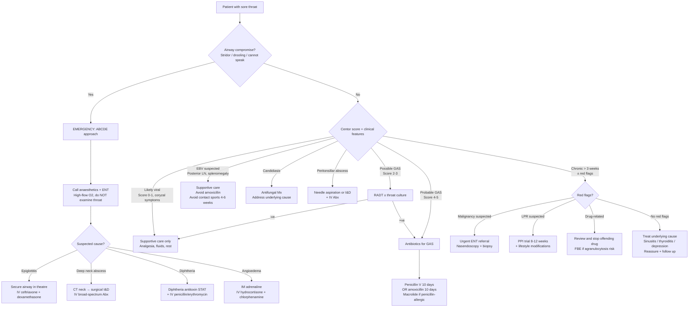

## Management of Sore Throat Complaints

The management of sore throat is driven entirely by the **underlying diagnosis**. This sounds obvious, but the most common management error in clinical practice is treating the symptom (e.g., giving antibiotics "just in case") without having determined the cause. Let me walk through management systematically — from the emergency airway scenario through to the commonest viral pharyngitis — and explain the rationale for every decision.

The overarching management principles are:

1. **Secure the airway first** — if there is any compromise, everything else waits
2. **Identify and treat specific treatable causes** — GAS (antibiotics to prevent rheumatic fever), abscess (drainage), malignancy (oncology referral)
3. **Symptomatic relief** for self-limiting causes — most sore throats are viral and need supportive care only
4. **Prevent complications** — rheumatic fever prophylaxis, airway protection, nutritional support
5. **Address underlying conditions** — diabetes, immunosuppression, GERD, drug causes

---

### 1. Master Management Algorithm

---

### 2. Emergency Management — Airway Compromise

When a patient with sore throat has **stridor, drooling, inability to speak, or respiratory distress**, this is a **life-threatening airway emergency**. Everything else is secondary.

***Inability to speak = life-threatening (airway, breathing or neurologically compromised)*** [13]

#### 2.1 General Approach (ABCDE)

1. **A — Airway:** Visual inspection, suction debris. ***Head tilt-chin lift or jaw thrust to open airway*** [13]. Do NOT use a tongue depressor if epiglottitis is suspected.
2. **B — Breathing:** High-flow O₂ via non-rebreather mask (15 L/min). Monitor SpO₂.
3. **C — Circulation:** IV access, fluids if septic.
4. **D — Disability:** GCS, pupil reactions.
5. **E — Exposure:** Full examination when stable.

**Call for help early:** Anaesthetics + ENT + ICU should be involved immediately.

#### 2.2 Acute Epiglottitis

***Admit if any suspicion of epiglottitis — and do not examine the throat*** [1].

| Aspect | Management | Rationale |
|---|---|---|
| **Airway** | Intubation in theatre by senior anaesthetist (with surgical backup for emergency tracheostomy/cricothyrotomy if intubation fails) | Epiglottic swelling may make intubation extremely difficult; theatre provides controlled environment |
| **Antibiotics** | IV ceftriaxone 2g daily (or cefotaxime) | Covers *H. influenzae* type b and other likely organisms (*Streptococcus*, *Staphylococcus*); 3rd-gen cephalosporins are β-lactamase stable |
| **Steroids** | IV dexamethasone | Reduces supraglottic oedema; evidence strongest in croup but widely used in epiglottitis |
| ***Nebulised adrenaline*** | ***Nebulized adrenaline in O₂ (5 mL 1:1000)*** [13] | α₁-adrenergic vasoconstriction of inflamed mucosal vessels → reduces oedema → temporarily widens airway. Buys time. |

#### 2.3 Deep Neck Space Infections (Peritonsillar/Retropharyngeal/Parapharyngeal Abscess)

| Aspect | Management | Rationale |
|---|---|---|
| **Drainage** | Needle aspiration (quinsy) or formal incision and drainage (I&D) under GA for retro/parapharyngeal abscesses | An abscess is a walled-off collection of pus — antibiotics alone cannot penetrate the avascular cavity. Drainage is curative. |
| **Antibiotics** | IV broad-spectrum: typically co-amoxiclav (amoxicillin + clavulanate) or IV penicillin + metronidazole | Most deep neck infections are polymicrobial (GAS + oral anaerobes). Metronidazole covers anaerobes (inhibits DNA synthesis in obligate anaerobes via nitroimidazole reduction). |
| **Airway monitoring** | Close observation ± intubation if airway threatened | Retropharyngeal abscess can extend into the mediastinum (the retropharyngeal space communicates directly with the posterior mediastinum) |
| **Imaging** | CT neck with IV contrast pre-operatively | Distinguishes abscess (rim-enhancing collection → needs drainage) from cellulitis (diffuse enhancement → can trial IV antibiotics alone) |

#### 2.4 Diphtheria

***Diphtheria (very rare)*** [1] but when it occurs, treatment is dual:

| Agent | Mechanism | Notes |
|---|---|---|
| **Diphtheria antitoxin (DAT)** | Neutralises circulating diphtheria exotoxin before it binds to cells. Once toxin is cell-bound, antitoxin cannot reverse the damage. | Must be given **immediately on clinical suspicion** — do NOT wait for culture confirmation. Given IV after test dose (horse serum → risk of anaphylaxis/serum sickness). |
| ***Macrolide/penicillin*** [3] | Kills the organism to stop further toxin production and renders the patient non-infectious. | Erythromycin 500 mg QDS × 14 days OR IV benzylpenicillin. Macrolide preferred for carriers. |

**Supportive:** Airway management (pseudomembrane can obstruct), cardiac monitoring (myocarditis), bed rest.

---

### 3. Management of Specific Conditions

#### 3.1 Viral Pharyngitis (Including Acute Coryza / Common Cold)

This is the most common scenario by far. The key teaching point: **antibiotics are not indicated**.

***Management: ↓stress + rest + infectious control (esp wash hands) ± symptomatic treatment*** [3]

**Why no antibiotics?** Because viruses do not have cell walls, ribosomes, or DNA gyrase — the targets of β-lactams, macrolides, and fluoroquinolones respectively. Antibiotics cannot kill viruses and will only cause side effects (GI upset, allergic reactions, *Clostridioides difficile* infection) and promote antimicrobial resistance.

**Symptomatic treatment [3]:**

| Symptom | Drug Class | Examples | Evidence / Notes |
|---|---|---|---|
| ***Sore throat + systemic symptoms*** | ***Analgesics*** | ***Paracetamol*** | ***Proven to be effective and safe*** [3]. MoA: inhibits COX centrally → ↓PGE₂ → ↓pain + ↓fever. Does NOT shorten VURI duration. |
| | | ***NSAIDs (e.g. ibuprofen)*** | ***More effective [than paracetamol] but ↑ side effects*** [3]. MoA: COX-1/2 inhibition → ↓prostaglandin synthesis → ↓inflammation + pain. |
| | | ***Aspirin gargle*** | Topical anti-inflammatory effect on pharyngeal mucosa. |
| ***Sore throat*** | ***Lozenge*** | ***Dequalinium bromide*** | ***No high-quality evidence*** [3]. Provides topical antiseptic + mild anaesthetic effect + stimulates saliva (soothing). |
| | ***Others*** | ***Lysozyme, steroids*** | ***Not recommended*** [3]. |

<Callout title="NSAID Cautions for Sore Throat" type="error">
***NSAIDs are avoided if: (1) not eating well (GI side effects — COX-1 inhibition reduces protective mucosal prostaglandins → peptic ulceration risk), (2) aspirin-sensitive asthma (COX inhibition shunts arachidonic acid to leukotriene pathway → bronchospasm), (3) renal dysfunction (prostaglandins maintain renal afferent arteriolar vasodilation → inhibition → renal ischaemia), (4) children due to risk of Reye syndrome (aspirin specifically — mitochondrial dysfunction in the liver and brain)*** [3].
</Callout>

**Infectious control:**
- ***Hand-washing is the most effective method in prevention of transmission*** [3]
- Respiratory hygiene (cover cough/sneeze)
- Self-isolation when symptomatic and febrile
- Most contagious at onset of symptoms and when febrile [3]

**Duration:** Reassure the patient that ***> 90% resolve in 10 days (but can reach 14 days in a minority)*** [3]. This is important — many patients return at day 5 demanding antibiotics because "it's not getting better yet."

#### 3.2 GAS Pharyngitis — Antibiotic Therapy

**Why treat GAS with antibiotics?** Three reasons:
1. **Prevent acute rheumatic fever (ARF)** — antibiotics started within 9 days of symptom onset reduce ARF risk by ~80%. This is the primary reason.
2. **Reduce symptom duration** — antibiotics shorten symptoms by ~1–2 days
3. **Reduce transmission** — patients are non-infectious ~24 hours after starting antibiotics

**Why NOT treat empirically?** ***Empiric treatment NOT recommended as the best diagnostic accuracy achievable based on clinical symptoms alone is only 50%*** [3]. You'd be giving unnecessary antibiotics to half the patients.

##### 3.2.1 Antibiotic Regimen

| Drug | Dose | Duration | Notes |
|---|---|---|---|
| **Penicillin V (phenoxymethylpenicillin)** — 1st line | Adults: 500 mg BD–QDS; Children: 250 mg BD–QDS | **10 days** | Narrow spectrum → minimal disruption of gut flora; GAS remains universally susceptible to penicillin (no resistance). The 10-day course is critical — shorter courses fail to eradicate GAS from the pharynx and do not reliably prevent ARF. |
| **Amoxicillin** — alternative 1st line | Adults: 500 mg BD or 1g OD; Children: 50 mg/kg/day (max 1g) OD | **10 days** | Better taste than penicillin V (important for paediatric compliance); broader spectrum but equally effective. **Avoid if EBV suspected** — ~90% develop maculopapular rash. |
| **Azithromycin** — penicillin allergy | Adults: 500 mg OD; Children: 12 mg/kg/day | **5 days** | Macrolide — binds 50S ribosomal subunit → inhibits bacterial protein synthesis. Used when true penicillin allergy (IgE-mediated anaphylaxis). Note: macrolide resistance in GAS is increasing in some regions. |
| **Clarithromycin** — penicillin allergy | Adults: 250 mg BD | **10 days** | Alternative macrolide. |
| **Cephalexin** — non-anaphylactic penicillin allergy | Adults: 500 mg BD; Children: 20 mg/kg BD | **10 days** | 1st-generation cephalosporin. Safe in non-anaphylactic penicillin allergy (cross-reactivity < 2%). Avoid in anaphylactic penicillin allergy. |

<Callout title="Why 10 Days of Penicillin?">
The 10-day course is based on the landmark studies from the 1950s–60s that showed this duration reliably eradicates GAS from the pharynx and prevents ARF. Shorter courses (3–6 days) may resolve symptoms but leave GAS in the pharynx → continued antigen exposure → persistent immune response → ARF risk remains. The exception is azithromycin, which has a long tissue half-life (~68 hours) allowing a 5-day course to achieve equivalent eradication.
</Callout>

##### 3.2.2 Rheumatic Fever Prevention (Secondary Prophylaxis)

Once a patient has had an episode of ARF, they need **long-term secondary prophylaxis** to prevent recurrent GAS pharyngitis (which triggers further ARF attacks → progressive valvular damage) [7]:

- ***Acute [ARF]: single dose IM benzylpenicillin*** [7]
- ***Chronic: prolonged penicillin Tx till 21y*** [7]

| Regimen | Dose | Frequency |
|---|---|---|
| **IM benzathine penicillin G** (preferred) | 1.2 MU (adults); 600,000 U (children < 27 kg) | Every 3–4 weeks |
| **PO penicillin V** (alternative) | 250 mg BD | Daily |
| **PO erythromycin** (if penicillin-allergic) | 250 mg BD | Daily |

**Duration of secondary prophylaxis:**
- ARF without carditis: 5 years or until age 21 (whichever is longer)
- ARF with carditis but no residual valve disease: 10 years or until age 21
- ARF with residual valve disease: 10 years or until age 40 (some guidelines say lifelong)

#### 3.3 EBV Infectious Mononucleosis

**Management is supportive** — there is no antiviral treatment for EBV that is routinely indicated.

| Aspect | Management | Rationale |
|---|---|---|
| **Analgesia** | Paracetamol ± NSAIDs (if tolerating oral intake) | Symptom relief; EBV pharyngitis can be very painful |
| **Hydration + nutrition** | Encourage fluids; soft diet if dysphagia is severe | Dehydration from poor oral intake is a common reason for admission |
| **Avoid amoxicillin/ampicillin** | Use penicillin V or a macrolide if concurrent GAS infection must be treated | Aminopenicillins cause a maculopapular rash in ~90% of EBV patients (thought to be immune-mediated, not true allergy) |
| **Avoid contact sports for 4–6 weeks** | Especially collision sports | Splenomegaly → ↑ risk of splenic rupture with abdominal trauma. Spleen takes 4–6 weeks to return to normal size. |
| **Corticosteroids** | Short course (e.g., prednisolone 1 mg/kg tapering over 1–2 weeks) ONLY for specific indications: airway obstruction from tonsillar hypertrophy, severe thrombocytopenia, haemolytic anaemia, CNS involvement | Steroids suppress the massive T cell response → reduce tonsillar swelling. NOT for routine use as they may prolong viraemia. |
| **Admission** | If airway compromise (severe tonsillar hypertrophy), unable to swallow, dehydration, splenic rupture, hepatic failure | Most cases managed as outpatients with reassurance |

<Callout title="When to Consider Steroids in EBV" type="idea">
The only absolute indication for corticosteroids in EBV mononucleosis is **impending airway obstruction** from massively enlarged tonsils. In this scenario, IV dexamethasone or methylprednisolone can be life-saving by rapidly reducing lymphoid tissue swelling. Other accepted (but less common) indications include autoimmune haemolytic anaemia, severe thrombocytopenia (platelet count < 20 × 10⁹/L with bleeding), and neurological complications (encephalitis, Guillain-Barré).
</Callout>

#### 3.4 Oropharyngeal Candidiasis

**Treatment depends on severity and underlying cause:**

| Severity | Treatment | Mechanism |
|---|---|---|
| **Mild (localised)** | Topical nystatin suspension (100,000 U/mL) — swish and swallow QDS × 7–14 days | Nystatin binds to ergosterol in the fungal cell membrane → forms pores → cell lysis. Not absorbed systemically → minimal side effects but must make prolonged contact with mucosa. |
| **Moderate-severe / immunocompromised** | Oral fluconazole 100–200 mg OD × 7–14 days | Fluconazole ("flu-CON-azole" — an azole antifungal) inhibits lanosterol 14α-demethylase (CYP51) → blocks ergosterol synthesis → fungal membrane disruption. Excellent oral bioavailability and good mucosal penetration. |
| **Fluconazole-resistant** | Itraconazole oral solution, or IV echinocandin (caspofungin/micafungin) for refractory cases | Echinocandins inhibit β-1,3-glucan synthase → disrupt fungal cell wall. Reserved for resistant *Candida* species (e.g., *C. glabrata*, *C. krusei*). |

**Address the underlying cause — this is equally important:**

| Underlying Cause | Action |
|---|---|
| ***Steroid inhalers*** [1] | Use a spacer device (deposits more drug in lungs, less in pharynx); rinse mouth with water after each use; consider switching to a lower-potency steroid or non-steroid controller |
| ***Diabetes*** [1] | Optimise glycaemic control (HbA1c target); hyperglycaemia directly promotes Candida growth |
| **Broad-spectrum antibiotics** | Review necessity; consider probiotics (limited evidence) |
| **HIV/AIDS** | Initiate antiretroviral therapy (ART) → immune reconstitution → reduced recurrence |
| **Dentures** | Proper denture hygiene; soak in chlorhexidine overnight |

#### 3.5 Chronic Sinusitis with Postnasal Drip

| Treatment | Mechanism | Notes |
|---|---|---|
| **Intranasal corticosteroid spray** (e.g., fluticasone, mometasone) | Suppresses mucosal inflammation in the sinus ostia → reduces oedema → improves sinus drainage | First-line; takes 2–4 weeks for maximal effect. Correct technique is critical (spray towards lateral nasal wall, not septum). |
| **Nasal saline irrigation** | Mechanically flushes out thickened mucus and inflammatory debris; improves mucociliary clearance | Safe, cheap, well-tolerated. Use isotonic or hypertonic saline. |
| **Antibiotics** (if acute bacterial exacerbation) | Target common pathogens: *S. pneumoniae*, *H. influenzae*, *M. catarrhalis* | Amoxicillin-clavulanate first-line; duration 5–10 days for acute exacerbation. NOT routine for chronic rhinosinusitis without acute bacterial features. |
| **Oral antihistamines** (if allergic component) | H₁ receptor blockade → reduces histamine-mediated nasal secretion, sneezing, pruritus | Useful only if allergic rhinitis is contributing. Second-generation (cetirizine, loratadine) preferred → less sedation. |
| **Surgical referral** | Functional endoscopic sinus surgery (FESS) for refractory cases | Opens obstructed sinus ostia to restore drainage. Consider if medical therapy fails after 3–6 months. |

#### 3.6 Laryngopharyngeal Reflux (LPR)

***Reflux oesophagitis → pharyngolaryngitis*** [1] — management focuses on acid suppression and lifestyle changes.

| Treatment | Mechanism | Notes |
|---|---|---|
| **PPI (proton pump inhibitor)** — e.g., omeprazole 20 mg BD | Irreversibly inhibits H⁺/K⁺ ATPase (proton pump) in gastric parietal cells → near-complete acid suppression | LPR requires **higher doses** (BD) and **longer duration** (8–12 weeks minimum, often 3–6 months) than standard GERD, because the pharyngeal/laryngeal mucosa heals more slowly than oesophageal mucosa. |
| **Lifestyle modifications** | Reduce reflux triggers | Elevate head of bed 15–20 cm; avoid eating 3 hours before bed; reduce caffeine, alcohol, fatty foods, spicy foods, chocolate; weight loss if obese; stop smoking. |
| **Alginate-based antacids** (e.g., Gaviscon) | Forms a floating raft on top of gastric content → physical barrier preventing reflux | Useful as adjunct, especially for post-prandial symptoms. |

#### 3.7 Peritonsillar Abscess (Quinsy) — Definitive Management

| Step | Details | Rationale |
|---|---|---|
| **1. Drainage** | Needle aspiration (preferred initial approach) or incision and drainage (I&D) | Abscess = walled-off pus → antibiotics cannot penetrate the avascular cavity. Aspiration is diagnostic (pus confirms abscess vs cellulitis) and therapeutic. |
| **2. IV antibiotics** | Co-amoxiclav 1.2 g IV TDS, OR IV benzylpenicillin + metronidazole | Polymicrobial: GAS + oral anaerobes (*Fusobacterium*, *Prevotella*). Metronidazole specifically covers obligate anaerobes. |
| **3. Analgesia** | IV paracetamol + NSAID (ketorolac or ibuprofen) | Combination analgesia provides superior pain control to either alone. |
| **4. IV fluids** | If unable to swallow | Dehydration is common due to severe odynophagia. |
| **5. Consider tonsillectomy** | "Quinsy tonsillectomy" (à chaud) — either immediate or interval (6–8 weeks later) | Indications: recurrent quinsy (≥2 episodes), contralateral abscess, failure to respond to aspiration. Interval tonsillectomy is generally preferred as acute surgery carries higher bleeding risk. |

#### 3.8 Foreign Body (Fish Bone)

| Step | Details |
|---|---|
| **Visible on examination** | Remove with Magill forceps or long artery forceps under direct vision |
| **Not visible but suspected** | Lateral soft tissue neck X-ray (sensitivity ~50% for fish bones). If negative but symptoms persist, flexible nasendoscopy. If still not found, CT neck (superior sensitivity). |
| **Embedded deeply** | Endoscopic removal (rigid oesophagoscopy or flexible OGD) under GA |
| **Complicated (perforation suspected)** | CT neck with IV contrast → look for oesophageal perforation (air tracking, fluid collection). Surgical consultation. |

#### 3.9 STI-Related Pharyngitis

| Condition | Treatment | Notes |
|---|---|---|
| ***Gonococcal pharyngitis*** [1] | IM ceftriaxone 500 mg single dose (2025 guidelines; dose varies by region) + oral azithromycin 1 g single dose (dual therapy) | Pharyngeal gonorrhoea is harder to eradicate than genital → ceftriaxone is the only reliable agent. Dual therapy helps prevent resistance emergence. Partner notification essential. |
| ***Herpes simplex*** [1] | Oral acyclovir 200 mg 5×/day or valaciclovir 1 g BD × 7–10 days (primary); 3–5 days (recurrent) | Acyclovir is a guanosine analogue → phosphorylated by viral thymidine kinase → incorporated into viral DNA → chain termination. Only works in actively replicating virus. |
| ***Syphilis*** [1] | IM benzathine penicillin G 2.4 MU single dose (primary/secondary) | Penicillin remains the treatment of choice for all stages of syphilis. Syphilis remains uniformly susceptible. |

#### 3.10 Blood Dyscrasias (Agranulocytosis / Leukaemia)

| Aspect | Management |
|---|---|
| **Agranulocytosis** | **Immediate:** Stop the offending drug (carbimazole, clozapine, methotrexate, etc.). **Supportive:** Barrier nursing, empirical broad-spectrum IV antibiotics (anti-pseudomonal β-lactam ± aminoglycoside → febrile neutropenia protocol), G-CSF (filgrastim) to stimulate neutrophil recovery. |
| **Acute leukaemia** | Urgent haematology referral → bone marrow biopsy → induction chemotherapy. Supportive care: blood product transfusion, infection prophylaxis/treatment, nutritional support. |

**Why is agranulocytosis important for sore throat?** ***Classically presents with fever/sore throat while on antithyroid drugs (ATD)*** [14]. ***Agranulocytosis (0.1%): reversible, usually first 2 months, ↑ with age ( > 40y) or high doses*** [14]. ***Advise patients to seek help immediately if any symptoms of infection*** [14] — this means ANY patient started on carbimazole should be counselled to present urgently with fever or sore throat for an immediate FBE.

<Callout title="Carbimazole and Sore Throat — A Life-Threatening Connection" type="error">
***Agranulocytosis from carbimazole presents classically as fever and sore throat*** [14]. The mechanism: carbimazole (or its active metabolite methimazole) triggers immune-mediated destruction of neutrophil precursors in the bone marrow, predicted by the ***HLA-B*38:02:01 allele (mainly found in Asian populations)*** [14]. Without neutrophils, the pharyngeal mucosa — constantly exposed to oral flora — becomes rapidly overwhelmed by bacteria → necrotising pharyngitis → sepsis → death if not recognised.

**Teaching point:** Always ask about drug history in sore throat. If a patient on carbimazole or clozapine presents with sore throat and fever, check an urgent FBE before discharging them. An ANC < 0.5 × 10⁹/L requires immediate admission.
</Callout>

#### 3.11 Subacute (de Quervain's) Thyroiditis

***Thyroiditis*** [1] — management is conservative because the condition is self-limiting:

***Self-limiting → do NOT give antithyroid medications*** [9]

| Phase | Treatment | Rationale |
|---|---|---|
| **Systemic upset + pain** | ***NSAIDs/corticosteroids for severe cases → manage systemic upset + pain*** [9] | NSAIDs inhibit prostaglandin synthesis → ↓ pain and inflammation. Prednisolone 30–40 mg/day with taper for severe cases. |
| **Thyrotoxic phase** | ***β-blocker for hyperthyroid phase (usually mild) → for symptomatic control only*** [9] | Propranolol reduces symptoms of thyrotoxicosis (tremor, palpitations, anxiety) by blocking β₁-adrenergic receptors. Does NOT alter thyroid hormone levels. Antithyroid drugs (carbimazole/PTU) are useless here because the thyrotoxicosis is from hormone leakage, not overproduction. |
| **Hypothyroid phase** | ***Temporary T4 replacement for hypothyroid phase if pronounced or symptomatic*** [9] | Levothyroxine replaces the depleted thyroid hormone stores while follicular cells regenerate. Usually temporary (2–6 months). |
| **Resolution** | ***No Mx: spontaneous resolution!*** [9] | Most patients recover full thyroid function. |

#### 3.12 Kawasaki Disease

| Treatment | Dose | Mechanism | Notes |
|---|---|---|---|
| **IV immunoglobulin (IVIG)** | 2 g/kg single infusion over 10–12 hours | Modulates immune response → reduces vasculitis → prevents coronary artery aneurysms. Exact mechanism unclear (Fc receptor blockade, anti-idiotype antibodies, cytokine modulation). | Must be given within 10 days of fever onset. Reduces coronary aneurysm risk from ~25% to < 5%. |
| **High-dose aspirin** | 80–100 mg/kg/day divided QDS (acute phase) → low-dose 3–5 mg/kg/day (anti-platelet, after fever subsides for 6–8 weeks) | Anti-inflammatory (high dose: COX inhibition → ↓ prostaglandins) then anti-platelet (low dose: COX-1 inhibition in platelets → ↓ thromboxane A₂ → ↓ platelet aggregation) | One of the few indications for aspirin in children. Reye syndrome risk is low in this context and is outweighed by the benefit of preventing coronary aneurysms. |

#### 3.13 Head & Neck Malignancy

Management of confirmed pharyngeal/laryngeal/nasopharyngeal malignancy is multidisciplinary and beyond the scope of the primary care sore throat consultation, but the **key management principles** are:

| Cancer Type | Primary Treatment | Notes |
|---|---|---|
| **NPC** | Concurrent chemoradiotherapy (cisplatin-based) | NPC is highly radiosensitive (undifferentiated carcinoma). Surgery has limited role due to anatomical location (skull base). |
| **Oropharyngeal SCC (HPV+)** | Chemoradiotherapy ± de-intensification protocols | HPV+ tumours have better prognosis; de-intensification trials aim to reduce treatment toxicity while maintaining outcomes. |
| **Oropharyngeal SCC (HPV−)** | Surgery (if resectable) ± adjuvant chemoradiotherapy | Worse prognosis than HPV+ tumours. |
| **Glottic laryngeal CA (early)** | Radiotherapy OR laser microsurgery | Early glottic cancer has excellent prognosis (95% 5-year survival for T1) because hoarseness leads to early detection. |
| **Lymphoma of Waldeyer's ring** | Chemotherapy ± radiotherapy (depends on subtype) | DLBCL most common; treated with R-CHOP ± involved-field radiotherapy. |

**The referring clinician's role is:**
1. Suspect malignancy (***the triad — hoarseness, pain on swallowing and referred ear pain → pharyngeal cancer*** [1])
2. ***Biopsy of suspicious lesions*** [1] — refer urgently to ENT
3. Stage appropriately (CT/MRI, panendoscopy)
4. Refer to head and neck MDT (multidisciplinary team)

#### 3.14 Tonsillectomy — Indications

Tonsillectomy is a definitive surgical treatment for recurrent or complicated tonsillar disease. Indications include:

| Indication | Specific Criteria |
|---|---|
| **Recurrent acute tonsillitis** | "Paradise criteria": ≥7 episodes in 1 year, OR ≥5 episodes/year for 2 consecutive years, OR ≥3 episodes/year for 3 consecutive years — each with documented temperature > 38.3°C, cervical LN, tonsillar exudates, or positive GAS culture |
| **Peritonsillar abscess (recurrent)** | ≥2 episodes of quinsy, or quinsy + significant history of recurrent tonsillitis |
| **Obstructive sleep apnoea** | Tonsillar hypertrophy causing upper airway obstruction (especially in children) |
| **Suspected tonsillar malignancy** | Unilateral tonsillar enlargement, asymmetric tonsils, unexplained cervical lymphadenopathy |
| **Chronic tonsillitis / tonsilloliths** | Persistent symptoms despite conservative management; significant impact on quality of life |

**Complications of tonsillectomy:**
- **Primary haemorrhage** (within 24 hours) — reactionary bleeding from surgical site
- **Secondary haemorrhage** (5–10 days post-op) — infection of the tonsillar fossa → sloughing of eschar → bleeding from underlying vessels. This is the most common serious complication.
- Pain (typically severe for 7–14 days)
- Dehydration (from poor oral intake due to pain)
- Velopharyngeal insufficiency (rare — if excessive palatal tissue removed)

---

### 4. Summary Table: Management by Diagnosis

| Diagnosis | Key Management | What NOT to Do |
|---|---|---|
| **Viral pharyngitis** | Supportive: rest, fluids, paracetamol ± NSAID | Do NOT prescribe antibiotics |
| **GAS pharyngitis** | Penicillin V × 10 days (or amoxicillin; macrolide if allergic) | Do NOT use amoxicillin if EBV possible |
| **EBV mononucleosis** | Supportive; avoid contact sports 4–6 weeks; steroids only if airway compromise | Do NOT give amoxicillin/ampicillin |
| **Oropharyngeal candidiasis** | Topical nystatin or oral fluconazole; address underlying cause | Do NOT ignore underlying immunosuppression |
| **Epiglottitis** | Secure airway in theatre; IV ceftriaxone + dexamethasone | ***Do NOT examine the throat*** [1] |
| **Peritonsillar abscess** | Needle aspiration/I&D + IV antibiotics | Do NOT treat with antibiotics alone (pus must be drained) |
| **Diphtheria** | Antitoxin STAT + antibiotics; do NOT wait for culture | Do NOT delay antitoxin |
| **LPR** | PPI BD × 8–12 weeks + lifestyle modifications | Do NOT use standard GERD dosing (need higher dose, longer) |
| **Subacute thyroiditis** | NSAIDs ± prednisolone; β-blocker for thyrotoxic symptoms | ***Do NOT give antithyroid medications*** [9] |
| **Agranulocytosis** | Stop offending drug; febrile neutropenia protocol; G-CSF | Do NOT discharge without checking FBE |
| **Pharyngeal cancer** | Urgent ENT referral → biopsy → MDT | Do NOT reassure and send home |
| **Kawasaki disease** | IVIG + high-dose aspirin within 10 days of fever onset | Do NOT delay IVIG (coronary aneurysm risk) |

---

<Callout title="High Yield Summary">

1. **Most sore throats are viral** → supportive care only. ***Paracetamol is proven effective and safe; NSAIDs are more effective but have more side effects*** [3]. Antibiotics are not indicated.

2. **GAS pharyngitis:** Penicillin V × 10 days is first-line. The 10-day course is essential to eradicate the organism and prevent ARF. Amoxicillin is an alternative but ***avoid if EBV is suspected***. ***Empiric treatment is NOT recommended*** [3].

3. **EBV:** Supportive care. Steroids only for airway compromise. Avoid aminopenicillins. Avoid contact sports for 4–6 weeks (splenic rupture risk).

4. **Epiglottitis:** ***Admit immediately, do NOT examine throat*** [1]. Secure airway in theatre. IV ceftriaxone + dexamethasone ± ***nebulised adrenaline*** [13].

5. **Peritonsillar abscess:** Drainage (needle aspiration or I&D) is mandatory — antibiotics alone cannot penetrate the abscess cavity.

6. **ARF prophylaxis:** ***Acute: single dose IM benzylpenicillin; Chronic: prolonged penicillin till 21 years*** [7].

7. **Carbimazole + sore throat = check urgent FBE** → ***agranulocytosis classically presents as fever/sore throat while on ATD*** [14]. Stop drug, start febrile neutropenia protocol.

8. **Subacute thyroiditis:** ***Self-limiting → do NOT give antithyroid medications. NSAIDs for pain. β-blocker for thyrotoxic symptoms*** [9].

9. **LPR:** PPI BD for 8–12 weeks + lifestyle modifications. Higher dose and longer duration than standard GERD treatment.

10. **Malignancy:** Suspect with persistent sore throat > 3 weeks + red flags. ***Biopsy of suspicious lesions*** [1]. Urgent ENT referral.

</Callout>

---

<ActiveRecallQuiz
  title="Active Recall - Management of Sore Throat"
  items={[
    {
      question: "A 7-year-old presents with acute sore throat, fever 39C, tonsillar exudates, tender anterior cervical nodes, and no cough. RADT is positive for GAS. What is the first-line antibiotic, dose, and duration? Why is the duration important?",
      markscheme: "First-line: Penicillin V (phenoxymethylpenicillin) 250 mg BD-QDS for 10 days. Alternative: amoxicillin 50 mg/kg/day (max 1g) once daily for 10 days. The 10-day duration is critical because shorter courses fail to eradicate GAS from the pharynx, and continued antigen exposure maintains the immune response that can trigger acute rheumatic fever via molecular mimicry. GAS remains universally susceptible to penicillin so resistance is not a concern."
    },
    {
      question: "A medical student with sore throat and splenomegaly is accidentally prescribed amoxicillin. Two days later she develops a widespread maculopapular rash. What happened and how should this be managed?",
      markscheme: "She has EBV infectious mononucleosis. Aminopenicillins (amoxicillin/ampicillin) cause a maculopapular rash in approximately 90% of patients with active EBV infection, thought to be immune-mediated (not a true IgE-mediated penicillin allergy). Management: stop amoxicillin, supportive care (paracetamol, fluids, rest), avoid contact sports for 4-6 weeks due to splenomegaly and splenic rupture risk. Steroids only if airway compromise from tonsillar hypertrophy. Document in notes that this is NOT a penicillin allergy."
    },
    {
      question: "A patient on carbimazole for Graves disease presents with a 2-day history of sore throat and fever 38.5C. What is the critical next step and why?",
      markscheme: "Check urgent FBE (full blood count) immediately to exclude agranulocytosis. Carbimazole can cause agranulocytosis (0.1% incidence, usually within first 2 months, increased with age over 40 and high doses, predicted by HLA-B*38:02:01 in Asian populations). If ANC is less than 0.5, stop carbimazole immediately, admit for febrile neutropenia protocol (barrier nursing, blood cultures, empirical broad-spectrum IV antibiotics such as piperacillin-tazobactam), and consider G-CSF (filgrastim). Do NOT discharge without checking FBE."
    },
    {
      question: "Why should you NOT prescribe antithyroid medications (carbimazole or PTU) for the thyrotoxic phase of subacute (de Quervain's) thyroiditis?",
      markscheme: "Because the thyrotoxicosis in de Quervain's thyroiditis is caused by leakage of preformed thyroid hormones from damaged follicles (destructive thyroiditis), NOT by overproduction of new thyroid hormones. Antithyroid drugs (carbimazole, PTU) work by inhibiting thyroid peroxidase, which blocks new hormone synthesis. Since no new hormone is being synthesised, these drugs have no target and are completely ineffective. Instead, use beta-blockers for symptomatic control (reduce adrenergic symptoms like tremor and palpitations) and NSAIDs or corticosteroids for pain and inflammation."
    },
    {
      question: "A child with suspected acute epiglottitis is brought to the emergency department. Outline the immediate management steps in order.",
      markscheme: "1. Do NOT examine the throat (risk of triggering laryngospasm and complete airway obstruction). 2. Keep the child calm, allow them to adopt their preferred position (usually sitting up, leaning forward). 3. Call senior anaesthetist and ENT surgeon immediately. 4. Give high-flow oxygen via face mask (but do not force). 5. Transfer to operating theatre for controlled intubation by the most senior anaesthetist available, with surgical backup for emergency tracheostomy if intubation fails. 6. Once airway is secured: IV ceftriaxone (covers H. influenzae and other organisms), IV dexamethasone to reduce supraglottic oedema. 7. Consider nebulised adrenaline (5 mL 1:1000) to buy time while awaiting theatre."
    },
    {
      question: "What are the Paradise criteria for tonsillectomy in recurrent tonsillitis?",
      markscheme: "Paradise criteria: 7 or more episodes of acute tonsillitis in 1 year, OR 5 or more episodes per year for 2 consecutive years, OR 3 or more episodes per year for 3 consecutive years. Each episode should be documented with at least one of: temperature above 38.3C, cervical lymphadenopathy, tonsillar exudates, or positive GAS culture. Additional indications for tonsillectomy include recurrent peritonsillar abscess (2 or more), obstructive sleep apnoea from tonsillar hypertrophy, and suspected tonsillar malignancy."
    }
  ]}
/>

## References

[1] Lecture slides: murtagh merge.pdf (pp. 90–92, "Sore throat" chapter)
[3] Senior notes: Ryan Ho Respiratory.pdf (pp. 48–52, "URTI / Bacterial Pharyngitis / Viral URI management" sections)
[7] Senior notes: Ryan Ho Cardiology.pdf (p. 146, "Rheumatic Heart Disease / Acute Rheumatic Fever — treatment")
[9] Senior notes: Ryan Ho Endocrine.pdf (p. 31, "Subacute Thyroiditis — management")
[13] Senior notes: Ryan Ho Critical Care.pdf (pp. 6, 13, "Acute SOB / Airway Management / Upper Airway Obstruction")
[14] Senior notes: Ryan Ho Endocrine.pdf (p. 24, "Antithyroid drugs — agranulocytosis side effect")
