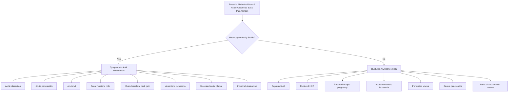

## Differential Diagnosis of Abdominal Aortic Aneurysm (AAA)

### Why Differential Diagnosis Matters in AAA

The challenge with AAA is that its presentations — epigastric/periumbilical pain, back pain, flank pain, haemodynamic collapse — are **non-specific** and overlap with many other abdominal and retroperitoneal emergencies. Getting the differential wrong can be fatal: a missed ruptured AAA has an overall mortality > 80% [1][3]. Conversely, taking a patient to emergency laparotomy for suspected ruptured AAA when they actually have acute pancreatitis carries its own morbidity. Your job is to systematically work through the differentials, anchored by the clinical context.

Let's think about this from first principles. AAA and its mimics share pain in similar territories because:
1. The **aorta is a midline retroperitoneal structure** → pain from it is referred to the epigastrium, periumbilical region, back, and flanks via visceral afferents (T10–L2 dermatomes)
2. **Rupture** produces haemorrhagic shock → the differential includes *any* cause of acute intra-abdominal haemorrhage
3. **Limb ischaemia** from emboli can mimic primary peripheral arterial disease or cardiac embolism

---

### Differential Diagnosis Framework

I've organised the differentials by **clinical presentation** (the way you'd actually encounter them), since the differential changes depending on whether you're dealing with an incidental pulsatile mass, acute abdominal/back pain, or haemodynamic collapse.

---

### A. Differentials for the Symptomatic (Non-Ruptured) AAA Presentation

These are conditions that mimic AAA pain — epigastric, periumbilical, back, or flank pain in an elderly patient with cardiovascular risk factors.

#### 1. ***Aortic Dissection*** [2][4]

| Feature | AAA | Aortic Dissection |
|---|---|---|
| **Pain character** | Dull, constant, gradually worsening | ***Sharp, tearing, knife-like, maximal at onset*** |
| **Pain location** | Epigastric / back / flank | ***Anterior chest (Type A) or back/abdomen (Type B)*** |
| **Pulse deficit** | Rare (unless embolisation) | ***Common — weak or absent carotid, brachial, or femoral pulse*** |
| **BP discrepancy** | Usually not present | ***Inter-arm BP difference > 20 mmHg*** |
| **Murmur** | Not characteristic | ***Early diastolic decrescendo murmur (aortic regurgitation)*** in Type A |
| **Imaging** | Dilated aorta with mural thrombus | ***Intimal flap with true and false lumen on CTA*** |

**Why the confusion?** Both are aortic pathologies, both present with acute pain, and a pre-existing AAA is itself a **risk factor** for dissection. Type B dissection (descending aorta) presents with back/abdominal pain that closely mimics symptomatic AAA. The key differentiator is the **character of pain** (sudden-onset tearing vs. dull and constant) and **pulse deficits** [4].

> **Teaching point**: Aortic dissection creates a false lumen by *splitting* the media; AAA *dilates* all three layers. They can coexist — chronic dissection can lead to aneurysmal dilation of the false lumen.

#### 2. ***Ulcerated Aortic Plaque (Penetrating Aortic Ulcer)*** [2][4]

- An atherosclerotic ulcer that penetrates through the intima into the media
- Presents with **acute aortic pain** (back, chest) in an elderly patient with extensive atherosclerosis
- Can progress to intramural haematoma, dissection, or frank rupture
- On CTA: focal ulcer crater with adjacent subadventitial haematoma, usually in a heavily calcified and atheromatous aorta
- **Why it's a differential**: The pain quality and patient demographics are nearly identical to symptomatic AAA. Imaging is essential to differentiate.

#### 3. ***Acute Pancreatitis*** [2][5][6]

| Feature | AAA | Acute Pancreatitis |
|---|---|---|
| **Pain location** | Epigastric / periumbilical / back | ***Epigastric, radiating to back*** |
| **Relieving factor** | None characteristic | ***Leaning forward*** |
| **Biochemistry** | Normal amylase/lipase | ***Amylase or lipase ≥ 3× upper limit of normal*** |
| **Risk factors** | Smoking, HT, male | ***Gallstones, alcohol, hypertriglyceridaemia*** |
| **Ecchymosis** | Grey-Turner / Cullen (if ruptured) | Grey-Turner / Cullen (in necrotising pancreatitis) |

**Why the confusion?** Both are **retroperitoneal** pathologies → both cause epigastric pain radiating to the back, and both can produce Grey-Turner and Cullen signs from retroperitoneal haemorrhage [2][6]. The distinguishing features are **serum lipase/amylase** (elevated in pancreatitis, normal in AAA) and **imaging** (CT shows dilated aorta in AAA vs. inflamed/necrotic pancreas in pancreatitis).

<Callout title="Ecchymosis — Not Pathognomonic for Any Single Condition" type="error">
Grey-Turner sign (flank), Cullen sign (periumbilical), Fox sign (proximal thigh), and Bryant sign (scrotal discolouration) indicate **retroperitoneal haemorrhage** from *any* cause [2]:
- Ruptured AAA
- Necrotising pancreatitis
- Ruptured ectopic pregnancy
- Ruptured HCC
- Perinephric haematoma

Do not assume these signs automatically mean ruptured AAA.
</Callout>

#### 4. ***Acute Myocardial Infarction (MI)*** [2][5]

- Inferior MI in particular can present with **epigastric pain, nausea, and diaphoresis** — closely mimicking abdominal pathology
- Conversely, ruptured AAA can cause a **vasovagal response** with ECG changes, leading to a misdiagnosis of MI
- **Key differentiator**: ECG changes (ST elevation/depression), troponin elevation; abdominal examination and imaging distinguish the two
- **Why it's a critical differential**: Both conditions can present with **hypotension and shock**; however, rushing to the cath lab for a suspected MI when the patient actually has a ruptured AAA is a fatal error

> ***Ruptured AAA or aortic dissection*** should be considered in any patient presenting with ***tearing pain at epigastrium radiating to the back*** with ***shock*** [5].

#### 5. ***Renal / Ureteric Colic*** [7]

- Colicky flank pain radiating to the groin — very similar to distal AAA expansion or retroperitoneal rupture irritating the lumbar plexus
- **Key differentiators**: microscopic haematuria on urinalysis; non-contrast CT KUB shows calculus but **no aortic dilation**
- Beware: AAA can compress the ureter → hydronephrosis and even frank haematuria (aorto-ureteric fistula), further muddying the picture
- **Rule of thumb**: Any **elderly male with "first-episode renal colic" and cardiovascular risk factors** should have an **urgent abdominal USS or CT** to exclude AAA before being discharged with analgesics

#### 6. ***Acute Peritonitis (Perforated Viscus)*** [2][5]

- Perforated peptic ulcer (PPU) or perforated diverticulum can cause sudden-onset severe abdominal pain with peritonism
- AAA rarely causes peritoneal signs unless there is **anterior (intraperitoneal) rupture**
- **Differentiators**: erect CXR shows **pneumoperitoneum** (free air under diaphragm) in perforation but NOT in AAA; CT confirms the diagnosis

#### 7. ***Mesenteric Ischaemia*** [6]

- Acute mesenteric ischaemia presents with severe abdominal pain "out of proportion to examination findings" — similar to early ruptured AAA
- Both occur in elderly patients with atherosclerotic risk factors
- **Differentiators**: mesenteric ischaemia often has prominent GI symptoms (bloody diarrhoea, vomiting); CT angiography shows SMA/IMA occlusion vs. aneurysmal aorta
- Note: AAA itself can *cause* mesenteric ischaemia if thrombus embolises to mesenteric vessels

#### 8. ***Intestinal Obstruction*** [2]

- Presents with colicky abdominal pain, distension, vomiting, and constipation
- Large AAA can rarely cause duodenal obstruction by extrinsic compression (aortoduodenal syndrome), creating genuine diagnostic overlap
- **Differentiators**: plain AXR shows dilated loops and air-fluid levels; CT confirms obstruction vs. aneurysm

#### 9. ***Musculoskeletal / Lumbar Spine Pathology*** [8]

- ***AAA is listed as a non-spinal cause of back pain*** in the lumbar spine differential [8]
- Degenerative disc disease, disc herniation, spondylolisthesis, and vertebral fractures are far more common causes of chronic back pain
- **Key differentiators**: AAA pain is typically **deep, dull, pulsatile, not positional**, and associated with cardiovascular risk factors; musculoskeletal pain is usually **positional, reproducible with movement/palpation**, and has no vascular signs
- **Pearl**: Always palpate the abdomen in an elderly patient presenting with "back pain" — if you feel an expansile pulsatile mass, the diagnosis changes entirely

---

### B. Differentials for Ruptured AAA (Haemodynamic Collapse) [3][5][6]

When the patient presents with the ***triad: pain (abdomen/back), pulsatile mass (may be masked), shock (transient/profound)*** [1], the differential narrows to causes of **acute intra-abdominal haemorrhage** or **catastrophic abdominal emergencies**.

***Life-threatening differentials of acute abdomen*** [6]:

| Differential | Key Distinguishing Features | Why It Mimics Ruptured AAA |
|---|---|---|
| ***Ruptured HCC*** | History of **chronic liver disease / HBV / HCC**; USS/CT shows liver mass with haemoperitoneum; AFP often elevated | Both cause acute intraperitoneal haemorrhage with shock in an elderly population; **very important differential in Hong Kong** (high HBV prevalence) [3] |
| ***Ruptured ectopic pregnancy*** | **Reproductive-age female**; positive β-hCG; transvaginal USS shows adnexal mass / free fluid | Both cause acute haemoperitoneum with shock; the demographics are completely different (young female vs. elderly male), making this a "cannot miss" but usually distinguishable [3] |
| ***Perforated peptic ulcer (PPU)*** | Sudden-onset epigastric pain; **board-like rigidity** (chemical peritonitis); **erect CXR: pneumoperitoneum** | Both cause sudden severe epigastric pain; PPU has peritonism earlier and pneumoperitoneum on CXR |
| ***Severe acute pancreatitis*** | Epigastric pain radiating to back; **lipase/amylase markedly elevated**; CT shows pancreatic necrosis | Both retroperitoneal, both cause back pain and Grey-Turner/Cullen signs [6] |
| ***Acute mesenteric ischaemia*** | Pain out of proportion to findings; **metabolic acidosis**, raised lactate; CT angiography shows mesenteric vessel occlusion | Both cause severe abdominal pain and haemodynamic instability in atherosclerotic patients [6] |
| ***Aortic dissection with rupture*** | ***Tearing pain, pulse deficit, inter-arm BP discrepancy***; CTA shows intimal flap | Same vessel, similar demographics; often coexist |

---

### C. Differentials for Specific AAA-Related Presentations

#### Blue Toe Syndrome / Trash Foot (Distal Embolisation from AAA)

Must differentiate from other sources of peripheral embolism [9]:

| Source | Mechanism |
|---|---|
| **AAA mural thrombus** | Cholesterol/thrombus microemboli from aneurysm wall |
| **Atrial fibrillation** | Cardiac thrombus → arterial embolism (usually larger territory) |
| **Acute MI with mural thrombus** | LV thrombus post-MI → systemic embolism |
| **Valvular heart disease / prosthesis** | Thrombus on abnormal/prosthetic valve |
| **Atherosclerotic plaque in aorta** | Ulcerated plaque → cholesterol crystal emboli (also called "cholesterol embolisation syndrome") |
| **Thoracic aortic aneurysm** | Same mechanism as AAA but more proximal source |

> ***Acute limb ischaemia + chest pain*** should raise suspicion for **MI** (mural thrombus / new-onset AF) or ***aortic dissection*** [9].

#### Aortoenteric Fistula (Massive GI Bleeding after Prior AAA Repair)

- ***Classic triad: upper GI bleeding, fever, abdominal pain*** in a patient with a **previous aortic graft** [3]
- The 3rd or 4th portion of the **duodenum** is the most common site [10]
- Must be differentiated from peptic ulcer bleeding, variceal bleeding, or other causes of UGIB
- A "**herald bleed**" (small, self-limiting GI bleed) often precedes the catastrophic haemorrhage by hours to days — this is your diagnostic window

<Callout title="The 'Do Not Forget' List for Acute Abdominal Pain" type="error">

From the lecture slides [5], ***always consider these easily missed diagnoses*** in acute abdominal pain:
- ***Hernia (inguinal or femoral)*** — strangulated hernia can cause bowel ischaemia and shock
- ***Ruptured AAA or aortic dissection*** — ***tearing pain at epigastrium radiates to the back; shock***
- ***Herpes zoster*** — ***dermatomal hyperaesthesia; vesicular eruption*** (pain precedes rash by days → can be mistaken for visceral pain)
- ***Pancreatitis***
- ***Retention of urine***
- ***Non-specific abdominal pain***

These are the diagnoses that get missed because clinicians fixate on the "usual suspects" (appendicitis, cholecystitis, etc.).
</Callout>

---

### D. Differentials by Anatomical Region of Pain

Since ***ruptured AAA*** can present with periumbilical pain, it is specifically listed as a differential for ***central/periumbilical abdominal pain*** alongside [5]:
- ***Small bowel obstruction***
- ***Gastroenteritis***
- ***Early acute appendicitis***
- ***Bowel ischaemia***
- ***Irritable bowel syndrome***
- ***Acute pancreatitis***

And for **diffuse/non-specific abdominal pain**, ruptured AAA is listed among the life-threatening differentials [6]:
- ***Perforated viscus (e.g., PPU)***
- ***Ruptured AAA***
- ***Acute mesenteric ischaemia***
- ***Acute intestinal obstruction***
- ***Severe pancreatitis***
- ***Ruptured HCC***
- ***Medical conditions: DKA, acute MI, Addisonian crisis***
- ***Obstetric: ruptured ectopic pregnancy, placental abruption***

---

### E. Summary: How to Differentiate AAA from Its Mimics — Key Discriminating Features

| Feature | Points Toward AAA | Points Away from AAA |
|---|---|---|
| **Demographics** | Elderly male, smoker, cardiovascular RF | Young, female, no RF |
| **Pulsatile expansile mass** | Pathognomonic | Absent (but may be masked by obesity or hypotension) |
| **Pain character** | Deep, dull, constant | Colicky (suggests obstruction/colic), sharp tearing (dissection), positional (musculoskeletal) |
| **Lipase / amylase** | Normal | Elevated ≥ 3× ULN → pancreatitis |
| **Urinalysis** | Usually normal (unless aorto-ureteric fistula) | Haematuria → renal stone / ureteric colic |
| **ECG / Troponin** | Usually normal | ST changes + troponin ↑ → MI |
| **Erect CXR** | No pneumoperitoneum | Free air → perforated viscus |
| **CT abdomen** | Dilated aorta ± retroperitoneal haematoma | Normal aorta |
| **β-hCG** | Not applicable | Positive → ectopic pregnancy |
| **Liver history** | Not relevant | HBV/cirrhosis/known HCC → ruptured HCC |

<Callout title="High Yield Summary — Differential Diagnosis of AAA">

1. **Symptomatic AAA differentials**: ***aortic dissection, ulcerated aortic plaque, acute pancreatitis, acute peritonitis, acute MI*** [2] — and also renal colic, mesenteric ischaemia, intestinal obstruction, musculoskeletal back pain.
2. **Ruptured AAA differentials**: ***ruptured HCC, ruptured ectopic pregnancy*** [3] — plus perforated viscus, severe pancreatitis, acute mesenteric ischaemia, ruptured aortic dissection.
3. **Classic ruptured AAA triad** = ***pain (abdomen/back) + pulsatile mass (may be masked) + shock (transient/profound)*** [1]. Present in only ~50% of cases.
4. ***AAA is a listed differential for periumbilical pain and non-spinal back pain*** — always palpate the abdomen in elderly patients with back pain [5][8].
5. ***Grey-Turner / Cullen signs are shared by ruptured AAA, pancreatitis, ruptured ectopic pregnancy, and ruptured HCC*** — they indicate retroperitoneal/intraperitoneal haemorrhage, not a specific diagnosis [2].
6. In Hong Kong, **ruptured HCC** is a particularly important differential due to high HBV prevalence [3].
7. **Aortoenteric fistula** presents with ***UGIB + fever + abdominal pain*** in patients with prior aortic graft — must be suspected until excluded [3][10].

</Callout>

---

<ActiveRecallQuiz
  title="Active Recall - Differential Diagnosis of AAA"
  items={[
    {
      question: "List 5 differential diagnoses for symptomatic (non-ruptured) AAA as stated in the senior notes.",
      markscheme: "Aortic dissection, ulcerated aortic plaque, acute pancreatitis, acute peritonitis, acute myocardial infarction. (Also accept: renal colic, mesenteric ischaemia, intestinal obstruction.)"
    },
    {
      question: "What are the 2 key differentials for ruptured AAA specifically highlighted in the Maxim notes, and why is one particularly important in Hong Kong?",
      markscheme: "Ruptured HCC and ruptured ectopic pregnancy. Ruptured HCC is particularly important in Hong Kong due to high prevalence of hepatitis B leading to HCC. Both present with acute intra-abdominal haemorrhage and shock."
    },
    {
      question: "How would you distinguish acute pancreatitis from a symptomatic AAA clinically and biochemically? Why can both produce Grey-Turner sign?",
      markscheme: "Clinical: pancreatitis pain relieved by leaning forward, associated with gallstone/alcohol history. Biochemical: lipase/amylase elevated >=3x ULN in pancreatitis, normal in AAA. Both produce Grey-Turner sign because both are retroperitoneal pathologies that can cause retroperitoneal haemorrhage tracking along fascial planes to the flank."
    },
    {
      question: "An elderly male presents with first-episode flank pain radiating to groin. The ED diagnoses renal colic. Why should you be cautious, and what must you exclude?",
      markscheme: "Must exclude symptomatic or ruptured AAA. AAA can mimic renal colic because: (1) retroperitoneal expansion/rupture irritates lumbar plexus causing flank-to-groin pain, (2) AAA can compress ureter causing hydronephrosis and haematuria, (3) aorto-ureteric fistula can cause frank haematuria. Any elderly male with cardiovascular RF and first-episode renal colic needs urgent USS or CT to visualise the aorta."
    },
    {
      question: "A patient with a prior AAA graft repair presents with haematemesis and fever. What is the diagnosis until proven otherwise, and what is the classic triad?",
      markscheme: "Aortoenteric fistula until proven otherwise. Classic triad: upper GI bleeding + fever + abdominal pain. Most common site is 3rd/4th part of duodenum. Investigate with OGD (up to D4) and contrast-enhanced CT abdomen. Management: graft excision with extra-anatomical bypass."
    }
  ]}
/>

## References

[1] Lecture slides: GC 199. Pulsating abdominal mass aortic aneurysm.pdf (p5, p20)
[2] Senior notes: felixlai.md ([felix:1334])
[3] Senior notes: maxim.md ([maxim:347], [maxim:348])
[4] Senior notes: felixlai.md ([felix:1323], [felix:1327], [felix:1328])
[5] Lecture slides: GC 195. Lower and diffuse abdominal pain RLQ problems; pelvic inflammatory disease; peritonitis and abdominal emergencies.pdf (p7, p44)
[6] Senior notes: maxim.md ([maxim:85], [maxim:86])
[7] Senior notes: felixlai.md ([felix:1158])
[8] Lecture slides: GC 226. Lumbar Spine Pathology_Part E (2).pdf (p2)
[9] Senior notes: maxim.md ([maxim:357])
[10] Senior notes: felixlai.md ([felix:500])
