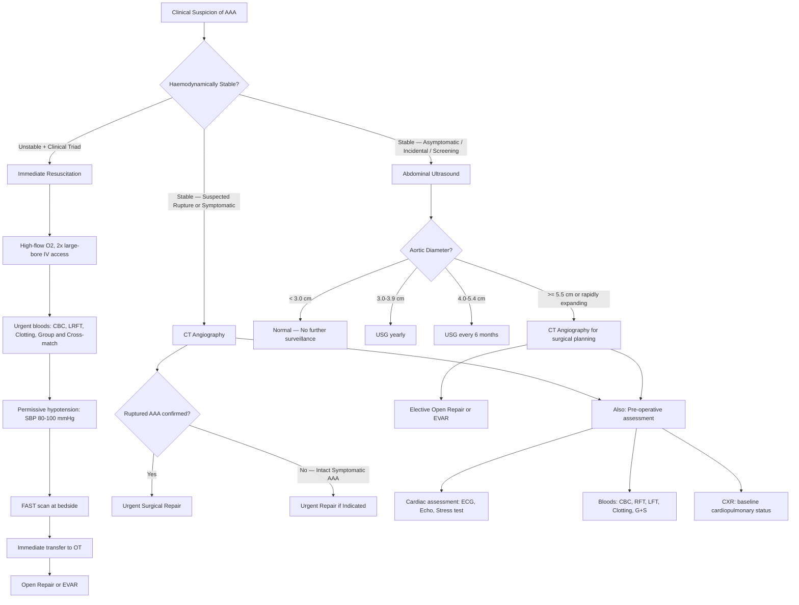

## Diagnosis of Abdominal Aortic Aneurysm (AAA)

### Diagnostic Principles — Thinking from First Principles

Before diving into individual tests, let's understand *what we need from our investigations* and *why*:

1. **Confirm the diagnosis**: Is there truly an aneurysm (aorta ≥ 3 cm)?
2. **Determine the size**: This dictates surveillance interval vs. surgical intervention (threshold ***~5 cm*** [1][11])
3. **Define the anatomy**: Where is the aneurysm (infrarenal vs. juxta/para/suprarenal)? What is the proximal "neck" length? Is there iliac involvement? — This determines suitability for open repair vs. EVAR [11][3]
4. **Assess for complications**: Is there rupture? Mural thrombus? Distal embolisation? Inflammatory changes? Fistula formation?
5. **Evaluate fitness for surgery**: Cardiac assessment is critical because ***major operative mortality = myocardial infarction*** [1]
6. **Screen for associated aneurysms**: Femoral, popliteal

The investigation you choose depends entirely on the **clinical scenario** — an asymptomatic patient found incidentally needs a different workup than a haemodynamically unstable patient with suspected rupture.

---

### Diagnostic "Criteria"

AAA does not have formal diagnostic criteria in the way that, say, acute pancreatitis has the Revised Atlanta criteria. Rather, the diagnosis is **defined by measurement**:

> **AAA is diagnosed when the maximum transverse diameter of the abdominal aorta is ≥ 3.0 cm** (i.e., ≥ 50% increase over the normal ~2.0 cm diameter) [1][2].

The clinical diagnosis is supported by:
- **Physical examination**: pulsatile, expansile mass above the umbilicus
- **Confirmed by imaging**: ultrasound (screening/surveillance) or CT angiography (preoperative/acute setting)

For **ruptured AAA**, the diagnosis is clinical:
- ***The TRIAD of Rupture: Pain (abdomen/back), Mass (pulsatile — may be masked), Shock (transient/profound)*** [1]
- In a haemodynamically **unstable** patient with this triad → ***immediate diagnosis → operation*** — no further imaging needed [1][3]
- In a haemodynamically **stable** patient with suspected rupture → ***CT abdomen with contrast*** to confirm and plan repair [3]

<Callout title="Key Principle: Do NOT Delay for Imaging in Unstable Patients" type="error">
***USG cannot diagnose ruptured AAA*** [3] — it can confirm the presence of an aneurysm but cannot reliably detect retroperitoneal haemorrhage. In a haemodynamically unstable patient with clinical triad of rupture, imaging wastes precious time. Proceed directly to the operating theatre. A **FAST scan** may be performed rapidly at the bedside to detect free intraperitoneal fluid (if anterior rupture), but a negative FAST does not exclude retroperitoneal rupture [2][3].
</Callout>

---

### Diagnostic Algorithm

---

### Investigation Modalities — Detailed Breakdown

#### A. Physical Examination [1][2]

This is your **first-line "investigation"** and often the one that triggers the entire diagnostic pathway.

***AAA: Physical Examination*** [1]:

| Component | What to Assess | Key Findings |
|---|---|---|
| ***Confirm AAA*** | ***Mass above umbilicus*** with ***expansile pulsation*** | Pulsatile AND expansile = AAA; pulsatile only = transmitted pulsation from overlying structure |
| ***Extent of AAA*** | ***Size*** (transverse diameter by palpation), ***Upper border*** (can you get above it? → infrarenal), ***Lower border*** (can you get below it? → no iliac involvement) | Defines approximate anatomy before imaging |
| ***Cardiovascular*** | ***Pulses*** (radial, femoral, popliteal, pedal), ***Heart*** (rhythm, murmurs), ***BP*** | Detects associated atherosclerotic disease, AF (embolic risk), aortic valve disease |
| Peripheral aneurysms | Palpate femoral and popliteal arteries | 20% of AAA have associated aneurysms [1] |
| Distal embolisation | Blue toes, livedo reticularis, cool extremities | Suggests mural thrombus with embolisation |

> **Sensitivity caveat**: Abdominal palpation has ~70–80% sensitivity for AAA > 5 cm but is much less reliable in obese patients or for smaller aneurysms. A normal examination does NOT exclude AAA → always confirm with imaging if clinical suspicion exists.

---

#### B. Laboratory Investigations [2]

Laboratory tests **do not diagnose AAA** but are essential for assessing the patient's baseline status, detecting complications, and preparing for surgery.

| Test | Key Findings in AAA | Pathophysiological Basis |
|---|---|---|
| **CBC with differentials** | **Anaemia** (hypochromic microcytic) | Acute blood loss from rupture → decreased Hb; initially may be normal due to haemodilution lag |
| | **Leukocytosis** | Infected or inflamed aneurysm; stress response in rupture |
| **Clotting profile** (PT, APTT, TT, fibrinogen, D-dimer) | ***Prolonged PT, APTT, TT; ↓ platelet count; ↓ fibrinogen; ↑ D-dimers*** | **DIC** — large aneurysms have a turbulent, slow-flow environment that activates the coagulation cascade within the sac → consumption of clotting factors and platelets → consumptive coagulopathy. D-dimers ↑ because of ongoing clot formation and fibrinolysis [2] |
| **Inflammatory markers** (ESR, CRP) | ***↑ ESR and CRP*** | Elevated in **infected or inflammatory AAA**; normal in uncomplicated degenerative AAA [2] |
| **Renal function tests** (Cr, urea, eGFR) | May be elevated | Baseline for contrast administration; suprarenal/pararenal AAA may compromise renal arteries; post-rupture AKI from hypoperfusion |
| **Liver function tests** | Baseline | Pre-operative assessment; also to detect coagulopathy of liver disease |
| ***Arterial blood gas (ABG)*** | ***Metabolic acidosis*** | ***Acute blood loss leading to shock*** → tissue hypoperfusion → anaerobic metabolism → lactic acidosis [2] |
| **Group and cross-match** | — | Essential pre-operatively; in rupture, request **massive transfusion protocol** (***packed cells : platelets : FFP = 1:1:1***) [3] |
| **ECG** | Baseline; rule out concurrent MI | ***Major operative mortality = myocardial infarction*** [1] — must identify pre-existing ischaemic heart disease |
| **Cardiac enzymes** (Troponin) | Rule out acute MI as differential | Elderly patients with shock may have demand ischaemia |

<Callout title="DIC in AAA — Why?" type="idea">
You might wonder: why would an aneurysm cause DIC? The answer lies in the haemodynamics. Inside a large aneurysm, blood flow becomes turbulent and slow (the dilated segment acts like a stagnant pool). This activates the intrinsic coagulation pathway on the thrombus-lined wall → consumption of clotting factors and platelets → chronic low-grade DIC. This is why you see ↑ D-dimers and prolonged clotting times in patients with large AAA even *before* rupture. Frank DIC becomes clinically significant primarily with very large aneurysms or post-rupture.
</Callout>

---

#### C. Radiological Investigations

##### 1. ***Plain X-Ray (AXR / Lateral Abdominal X-Ray)*** [1][3]

- **Role**: Not a primary diagnostic tool but may be the **first clue** when AAA is discovered incidentally
- ***Key finding: Calcification of the aortic wall*** — seen as curvilinear calcification outlining the aortic wall on AP or lateral views [1][3]
- ***"Plain X-ray calcifications"*** [1]
- **Limitations**:
  - Only ~50–75% of AAA have enough wall calcification to be visible on XR
  - Cannot measure true aortic diameter (calcification is in the wall, not the lumen)
  - Cannot detect rupture
  - Cannot assess intramural thrombus
- **When you see it**: An elderly patient gets an AXR for non-specific abdominal complaints → you notice curvilinear calcification in the mid-abdomen → suspect AAA → confirm with USS

##### 2. ***Abdominal Ultrasound (USS)*** [1][2][3]

This is the **workhorse investigation** for AAA — think of it as the stethoscope of AAA diagnosis.

| Feature | Details |
|---|---|
| **Role** | ***Initial diagnostic modality*** in asymptomatic patients suspected of AAA; ***screening*** tool; ***surveillance*** of known small/medium AAA [2][3] |
| **Advantages** | Non-invasive, inexpensive, no radiation, no contrast, high sensitivity (95%) and specificity (99%) for detecting AAA and measuring diameter, portable (bedside) |
| **What it shows** | Transverse and AP diameter of the aorta; presence of mural thrombus; proximal/distal extent; associated iliac aneurysms |
| **Preparation** | ***Fasting required*** to reduce overlying bowel gas that obscures the aorta [2] |
| **Limitations** | ***USG cannot diagnose ruptured AAA*** [3] — it cannot reliably detect retroperitoneal haemorrhage; operator-dependent; limited by obesity and bowel gas; does not show relationship to renal/visceral arteries well enough for surgical planning |

**Surveillance intervals** [3]:
| AAA Size | Surveillance Frequency |
|---|---|
| 3.0–3.9 cm | ***Yearly USG*** |
| 4.0–5.4 cm | ***USG every 6 months*** |
| ≥ 5.5 cm or rapidly expanding | Proceed to **CTA** for surgical planning |

**FAST scan** (Focused Assessment with Sonography in Trauma):
- ***Indicated in haemodynamically unstable patients*** [2][3]
- Can rapidly detect **free intraperitoneal fluid** (suggesting anterior rupture) at the bedside
- A FAST showing a large aorta + free fluid + hypotension = go to OT immediately
- **But**: most AAA rupture **posteriorly** (retroperitoneal) → FAST may be **negative** even with rupture → clinical decision must override negative FAST

> ***AAA: Ultrasound*** is explicitly highlighted on the lecture slides as a key diagnostic test [1].

##### 3. ***CT Angiography (CTA)*** [1][2][3]

The **gold standard** for defining AAA anatomy and planning intervention. Think of CTA as the "architectural blueprint" that the surgeon needs.

| Feature | Details |
|---|---|
| **Role** | ***Indicated in symptomatic patients*** with suspected AAA [2]; ***preoperative assessment*** of anatomy for suitability for EVAR vs. open repair [3]; diagnosis and characterisation of ruptured AAA in stable patients |
| **What it shows** | Precise diameter measurement; ***relationship to renal arteries*** (crucial for classifying infrarenal vs. juxtarenal/pararenal/suprarenal); proximal neck length and angulation; iliac artery involvement; mural thrombus; retroperitoneal haematoma (if ruptured); inflammatory changes; fistulae; variant anatomy |
| **Protocol** | Non-contrast phase (for calcification) + arterial phase (for lumen and branch vessels) + delayed phase (for endoleak assessment post-EVAR) |
| **Advantages** | High spatial resolution; rapid acquisition (seconds); widely available; excellent for surgical planning |
| **Limitations** | Radiation exposure; IV contrast (risk of contrast-induced nephropathy — especially important given the elderly population with potential baseline renal impairment); ***skip if haemodynamically unstable*** [3] |

**Key CT findings in different scenarios:**

| Scenario | CT Findings |
|---|---|
| **Intact AAA** | Dilated aorta with mural thrombus; patent lumen may appear much smaller than outer diameter (why ***CTA/MRA/DSA are not for size measurement due to intramural thrombus*** [3] — they show the lumen, not the full extent); calcified wall |
| **Ruptured AAA** | Dilated aorta + ***retroperitoneal haematoma*** (high-attenuation stranding/collection adjacent to aorta); ± active contrast extravasation ("blush"); ± haemoperitoneum (if anterior rupture) |
| **Inflammatory AAA** | Thickened aortic wall with periaortic soft tissue cuffing that enhances with contrast; may encase ureters/duodenum |
| **Mycotic AAA** | Saccular morphology; periaortic gas (suggestive of infection); irregular wall; periaortic fluid |
| **Aortoenteric fistula** | Loss of fat plane between aorta/graft and duodenum; periaortic gas; contrast extravasation into bowel lumen |

> ***CT Scan*** — the lecture slides show multiple examples of CT images demonstrating AAA, including suprarenal aneurysm, iliac aneurysms, and mural thrombus [1].

<Callout title="Why Not Use CTA/DSA for Size Surveillance?">
This is a common point of confusion. ***CTA, MRA, and DSA*** show the **patent lumen** of the aorta — the channel through which contrast flows. But AAA almost always contains **mural thrombus** lining the inner wall. This means the patent lumen can appear much smaller than the true outer-to-outer diameter of the aneurysm. **USS measures the true outer wall diameter** and is therefore the correct modality for surveillance. CTA is used preoperatively because it provides *anatomical detail* (not just size) — the relationship to branch vessels, neck morphology, access vessel calibre, etc. [3]
</Callout>

##### 4. ***MR Angiography (MRA)*** [2]

| Feature | Details |
|---|---|
| **Role** | ***Comparable to CT*** for anatomical assessment [2]; alternative when CTA is contraindicated |
| **Advantages** | No ionising radiation; no iodinated contrast (uses gadolinium instead — but beware nephrogenic systemic fibrosis in severe renal impairment); excellent soft tissue contrast |
| **Limitations** | Longer acquisition time (not suitable for emergencies); claustrophobia; contraindicated with certain metallic implants (pacemakers, etc.); less available; more expensive; overestimates stenosis |
| **When to use** | ***Patients with IV contrast contraindications*** (e.g., severe iodinated contrast allergy, severe renal impairment where iodinated contrast must be avoided) [2]; young patients requiring serial imaging (to reduce cumulative radiation) |

##### 5. ***Digital Subtraction Angiography (DSA) / Conventional Angiography*** [3]

- Historically the gold standard; now largely replaced by CTA
- Shows the **lumen** only (not the wall or thrombus) → ***not suitable for measuring AAA size*** [3]
- Still occasionally used intraoperatively or for simultaneous endovascular intervention
- Useful for delineating branch vessel anatomy when CTA is equivocal

##### 6. ***Abdominal X-Ray (AXR)*** — Additional Points [1][3]

- ***Calcification of aortic wall*** may be seen incidentally [1][3]
- An ***"egg-shell" pattern*** of curvilinear calcification in the mid-abdomen on an AP film suggests AAA
- On a **lateral AXR**, you can sometimes estimate the AP diameter from the calcification
- Not a diagnostic investigation per se, but an important incidental finding that should trigger USS

---

#### D. Pre-Operative Assessment [1]

The lecture slides explicitly list the ***AAA: Pre-Operative Preparation*** requirements [1]:

| Category | Components | Rationale |
|---|---|---|
| ***General*** | ***Blood tests, ECG, CXR*** | Baseline assessment; detect anaemia, coagulopathy, renal impairment; CXR for cardiopulmonary status |
| ***Cardiac*** | ***Cardiac assessment / intervention*** | ***Major operative mortality = myocardial infarction*** [1]; patients with significant coronary artery disease may need coronary revascularisation (PCI/CABG) before elective AAA repair |
| ***Preparations*** | ***Monitors, blood*** (cross-matched and available) | Major surgery with potential for massive haemorrhage; ICU bed must be arranged |

**Detailed cardiac workup may include:**
- **Resting ECG**: baseline rhythm, ischaemic changes
- **Transthoracic echocardiogram**: LV function (EF), valvular disease, regional wall motion abnormalities
- **Cardiopulmonary exercise testing (CPET)**: objective assessment of functional capacity — helps risk-stratify (anaerobic threshold < 11 mL/kg/min = high risk)
- **Dobutamine stress echocardiography or myocardial perfusion scan**: if unable to exercise, to detect inducible ischaemia
- **Coronary angiography ± PCI/CABG**: if significant inducible ischaemia detected

**Why so much cardiac workup?** Elective open AAA repair involves aortic cross-clamping, which causes:
- **Sudden ↑ afterload** (blood can no longer flow into the distal aorta) → ↑ LV wall stress → risk of myocardial ischaemia
- **Sudden ↓ afterload** on unclamping → peripheral vasodilation + reperfusion → risk of hypotension and arrhythmia
- These haemodynamic swings are lethal in a patient with unrecognised severe coronary disease

---

#### E. Screening [1]

***AAA Screening in Men over 65*** is specifically covered in the lecture slides [1]:

- The ***Multicenter Aneurysm Study (MASS), Lancet 2002*** demonstrated that ***AAA screening reduces mortality in men*** — specifically, a **one-time USS screening** in men aged 65–74 reduced AAA-related mortality by ~42% over 4 years [1]
- Screening is **cost-effective** because it identifies asymptomatic AAA → enables elective repair (mortality 3–5%) rather than emergency repair for rupture (mortality > 50%) [1]
- ***Lindholdt 2008*** further confirmed the mortality benefit of screening [1]

**Current screening recommendations:**
| Population | Recommendation |
|---|---|
| Men aged 65–75 who have ever smoked | One-time USS screening |
| Men or women with first-degree relative with AAA | One-time USS screening |
| Women who have never smoked, no FHx | Not routinely recommended |

---

### Summary of Investigations by Clinical Scenario

| Scenario | Primary Investigation | Rationale |
|---|---|---|
| **Screening / Incidental** | ***Abdominal USS*** | Non-invasive, accurate for diameter, cheap, no radiation |
| **Surveillance of known AAA** | ***Serial USS*** (yearly or 6-monthly depending on size) | Track growth rate; no radiation burden for repeated scans |
| **Symptomatic AAA (stable)** | ***CTA*** | Defines anatomy, detects impending rupture, guides surgical planning |
| **Suspected ruptured AAA (stable)** | ***CTA*** | Confirms rupture, localises haematoma, assesses EVAR suitability |
| **Suspected ruptured AAA (unstable)** | ***Bedside FAST ± clinical diagnosis → straight to OT*** | ***Skip CT if haemodynamically unstable*** [3]; delay = death |
| **Pre-operative planning for elective repair** | ***CTA*** (or MRA if contrast contraindicated) | Detailed anatomy for open vs. EVAR decision |
| **Post-EVAR surveillance** | ***CTA*** (or contrast-enhanced USS) | Detect endoleaks, graft migration, continued sac expansion |

---

<Callout title="High Yield Summary — Diagnosis of AAA">

1. **AAA is defined by aortic diameter ≥ 3 cm**; diagnosed definitively by imaging (USS for screening/surveillance, CTA for surgical planning).
2. ***USS is the initial diagnostic modality*** — non-invasive, cheap, high sensitivity/specificity. Used for screening (men > 65, MASS trial) and surveillance. ***Cannot diagnose rupture*** [3].
3. ***CTA is the gold standard for anatomical planning*** — shows proximal neck, renal artery relationship, iliac extent, mural thrombus, and detects rupture. ***Skip if haemodynamically unstable*** [3].
4. ***CTA/MRA/DSA are NOT for size measurement*** because intramural thrombus makes the lumen appear smaller than the true aneurysm diameter [3].
5. ***Plain X-ray may show calcification of the aortic wall*** incidentally [1] — trigger USS for confirmation.
6. ***Ruptured AAA in unstable patients = clinical diagnosis → immediate surgery***: resuscitate, permissive hypotension (SBP 80–100), FAST scan at bedside, straight to OT [1][3].
7. **Lab tests**: CBC (anaemia from haemorrhage), clotting (DIC), inflammatory markers (infected/inflammatory AAA), ***ABG (metabolic acidosis in shock)***, G+XM (prepare blood) [2].
8. ***Pre-operative preparation: blood tests, ECG, CXR + cardiac assessment + blood preparation*** — because ***major operative mortality = myocardial infarction*** [1].
9. **Surveillance**: 3.0–3.9 cm → yearly USS; 4.0–5.4 cm → 6-monthly USS; ≥ 5.5 cm → CTA + surgical referral [3].
10. ***MASS trial (Lancet 2002)***: USS screening in men > 65 reduces AAA-related mortality [1].

</Callout>

---

<ActiveRecallQuiz
  title="Active Recall - Diagnosis and Investigation of AAA"
  items={[
    {
      question: "What is the diagnostic threshold for AAA, and which imaging modality is the first-line investigation for screening and surveillance? What are its key advantages and limitations?",
      markscheme: "AAA defined as abdominal aorta >=3 cm. First-line = abdominal ultrasound. Advantages: non-invasive, cheap, no radiation, high sensitivity (95%) and specificity (99%), portable. Limitations: cannot diagnose rupture, operator-dependent, limited by obesity/bowel gas, does not show branch vessel anatomy for surgical planning. Fasting required to reduce bowel gas."
    },
    {
      question: "Why should you NOT use CTA or DSA to measure AAA size for surveillance? What should you use instead?",
      markscheme: "CTA/DSA show the patent lumen only. AAA almost always contains mural thrombus lining the wall, making the lumen appear much smaller than the true outer diameter. USS measures the true outer-to-outer wall diameter and is therefore correct for size surveillance. CTA is used preoperatively for anatomical detail (neck morphology, branch vessel relationship, access vessels), not for serial size measurement."
    },
    {
      question: "A 75-year-old male presents with sudden severe back pain and hypotension. You suspect ruptured AAA. His SBP is 70 mmHg despite IV fluids. What investigations do you order and what is the management sequence?",
      markscheme: "Unstable patient: clinical diagnosis, do NOT delay for CT. Resuscitate: high-flow O2, 2x large-bore IV access, urgent bloods (CBC, LRFT, clotting, group and cross-match), permissive hypotension (target SBP 80-100). Bedside FAST scan (may show free fluid but negative FAST does not exclude retroperitoneal rupture). Activate massive transfusion protocol (pRBC:PLT:FFP = 1:1:1). Immediate transfer to OT for open repair or EVAR."
    },
    {
      question: "What laboratory findings would you expect in a patient with a large AAA complicated by DIC? Explain the pathophysiology.",
      markscheme: "Prolonged PT, APTT, TT; decreased platelet count; decreased fibrinogen; increased D-dimers. Pathophysiology: turbulent, slow blood flow inside the large aneurysmal sac activates intrinsic coagulation on the thrombus-lined wall, leading to chronic consumption of clotting factors and platelets (consumptive coagulopathy). D-dimers are elevated because of ongoing clot formation and fibrinolysis."
    },
    {
      question: "What is the evidence for AAA screening, what trial is it based on, and what are the current surveillance intervals by AAA size?",
      markscheme: "MASS trial (Multicenter Aneurysm Study, Lancet 2002): one-time USS in men aged 65-74 reduced AAA-related mortality by ~42%. Lindholdt 2008 confirmed benefit. Surveillance: 3.0-3.9 cm = yearly USS; 4.0-5.4 cm = 6-monthly USS; >=5.5 cm = CTA for surgical planning and referral. Screening recommended for men 65-75 who ever smoked or anyone with first-degree relative with AAA."
    },
    {
      question: "Why is cardiac assessment so important in pre-operative preparation for elective AAA repair? What specific cardiac investigations may be needed?",
      markscheme: "Major operative mortality = myocardial infarction. Open repair requires aortic cross-clamping which causes sudden increase in afterload (risk of myocardial ischaemia) and sudden decrease on unclamping (hypotension, arrhythmia). Investigations: resting ECG, echocardiogram (LV function, valves), CPET (functional capacity), dobutamine stress echo or myocardial perfusion scan (inducible ischaemia), coronary angiography +/- PCI/CABG if significant disease found."
    }
  ]}
/>

## References

[1] Lecture slides: GC 199. Pulsating abdominal mass aortic aneurysm.pdf (p1, p5, p6, p7, p8, p9, p10, p17, p18, p20)
[2] Senior notes: felixlai.md ([felix:1334], [felix:1335])
[3] Senior notes: maxim.md ([maxim:342], [maxim:347], [maxim:348])
[5] Lecture slides: GC 195. Lower and diffuse abdominal pain RLQ problems; pelvic inflammatory disease; peritonitis and abdominal emergencies.pdf (p7, p44)
[11] Senior notes: felixlai.md ([felix:1332], [felix:1335])
