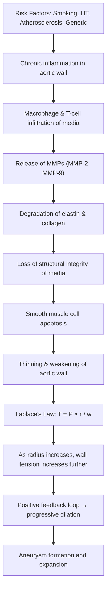

# Abdominal Aortic Aneurysm (AAA)

## 1. Definition

***Aneurysm*** — from Greek *aneurysma* ("a widening") — is defined as a **permanent, localised dilatation of an artery** that exceeds ***50% increase in diameter*** compared to the expected normal diameter of that vessel [1].

For the abdominal aorta specifically:

- The **normal infrarenal aortic diameter** is approximately **2.0 cm** (range 1.4–2.3 cm depending on sex, body surface area, and age) [2][3].
- Therefore, an **abdominal aorta ≥ 3.0 cm** is considered aneurysmal (since 3.0 cm is ≥ 50% of the normal ~2.0 cm diameter) [2][3].
- ***AAA is the most common true arterial aneurysm*** [2].

### Key Distinctions

| Term | Definition | Why It Matters |
|---|---|---|
| ***True aneurysm*** | ***Wall formed by all 3 layers — tunica intima, media, and adventitia*** | The wall is structurally intact but weakened and dilated; AAA is a true aneurysm [1][3] |
| ***Pseudo-aneurysm (false aneurysm)*** | ***Wall formed by extravascular connective tissue only*** (blood contained by adventitia or surrounding tissue, not by all 3 vessel layers) | Results from vessel wall disruption (e.g., trauma, anastomotic leak); technically not a "true" aneurysm [1][3] |
| ***Anastomotic aneurysm*** | Pseudo-aneurysm at a surgical suture line (e.g., after graft insertion) | A specific surgical complication [1] |
| Rapidly expanding AAA | Growth **> 1.0 cm/year** | Indicates high rupture risk → surgical intervention warranted regardless of absolute size [2] |

### Size Classification of AAA [2]

| Category | Diameter |
|---|---|
| Normal aorta | ~2.0 cm |
| Aneurysmal | ≥ 3.0 cm |
| Small | < 4.0 cm |
| Medium | 4.0 – 5.5 cm |
| Large | > 5.5 cm |
| Very large | ≥ 6.0 cm |

<Callout title="Why 5.5 cm?" type="idea">
The threshold for elective surgical repair is typically **5.5 cm in men** (5.0 cm in women) because the annual rupture risk begins to exceed the operative mortality risk at this size. Below this threshold, the natural history risk of rupture is lower than the ~3–5% perioperative mortality of open repair, so surveillance is preferred.
</Callout>

---

## 2. Epidemiology

### Global & Hong Kong Context

- **Prevalence**: Population screening studies (men aged 65–74) report prevalence of **4–7%** in Western populations. In Hong Kong / Asian populations, prevalence is lower (~1–2%) but is **increasing** due to ageing, urbanisation, and rising atherosclerotic risk factors [2][3].
- ***M > F*** — Male-to-female ratio approximately ***9:1*** for clinically significant AAA [1][3]. Women develop AAA about a decade later than men on average but have a **higher rupture risk** at any given diameter.
- **Age**: Incidence rises sharply after age 60; peak incidence in the 7th–8th decades.
- **Ethnic variation**: More common in Caucasians than Asians or African Americans; however, when present in non-Caucasian populations, presentation may be later and outcomes worse [2].

### Screening Recommendations (USPSTF / SVS)

- **One-time ultrasound screening** recommended for:
  - Men aged **65–75** who have **ever smoked**
  - Men or women with a **first-degree relative** with AAA
- *Not routinely recommended* in women who have never smoked (unless additional risk factors present)

<Callout title="Association with Peripheral Aneurysms" type="error">
This is a commonly tested association:
- **14%** of patients with AAA have a concomitant **femoral or popliteal aneurysm** [2]
- ***62%*** of patients with a **popliteal aneurysm** have an associated AAA → **screen with abdominal ultrasound** [2]
- ***82%*** of patients with a **femoral aneurysm** have an associated AAA → **screen** [2]
- Conversely, finding an AAA should prompt examination of the femoral and popliteal arteries.
</Callout>

---

## 3. Risk Factors

### Strongly Associated (↑↑ Risk) [1][2][3]

| Risk Factor | Mechanism |
|---|---|
| ***Age (elderly)*** | Cumulative degeneration of elastin and collagen; progressive loss of smooth muscle cells in tunica media |
| ***Male sex*** | Hormonal protective effect of oestrogen in premenopausal women (oestrogen inhibits MMP activity); higher smoking rates historically in men |
| ***Smoking*** | **Strongest modifiable risk factor** (OR ~5). Directly promotes MMP-9/MMP-2 activity → elastin degradation; induces oxidative stress and chronic inflammation in the vessel wall; also impairs α1-antitrypsin (a protease inhibitor) |
| ***Atherosclerosis*** | ***95% associated atherosclerosis*** [1]. Atherosclerosis weakens media via chronic inflammation, macrophage infiltration, and MMP release; also obliterates vasa vasorum → medial ischaemia |
| ***Hypertension*** | Increases wall stress (Law of Laplace: Wall tension = Pressure × Radius / Wall thickness). Higher pressure on an already weakened wall accelerates dilation |
| ***Family history of AAA*** | First-degree relative with AAA confers ~2× risk; suggests genetic susceptibility (e.g., polymorphisms in MMP genes, fibrillin, TGF-β pathway) |
| ***Presence of other large artery aneurysms*** | Iliac, femoral, popliteal aneurysms → systemic arteriopathy; shared degenerative process |

### Moderately Associated (↑ Risk) [2]

| Risk Factor | Notes |
|---|---|
| Non-Caucasian females | Lower overall prevalence but still at risk |
| Hyperlipidaemia | Accelerates atherosclerosis |
| ***Connective tissue disease (Marfan syndrome, Ehlers-Danlos syndrome type IV)*** | Intrinsic defects in fibrillin-1 (Marfan) or type III collagen (EDS IV) → structurally weak vessel wall from birth [1][3] |
| ***Mycotic (infective) aneurysm*** | ***e.g., non-typhoid Salmonella, Staphylococcus, Syphilis*** [3]. Infection destroys vessel wall → weakening and dilation. In Hong Kong, Salmonella is a particularly important cause in immunosuppressed patients. |

### Paradox of Diabetes

<Callout title="Diabetes & AAA – A Counter-Intuitive Relationship" type="idea">
Unlike most cardiovascular conditions, ***diabetes is NOT a risk factor for AAA*** — in fact, it appears to be **inversely associated** (protective). The mechanism is incompletely understood but hypotheses include:
- **Glycation cross-linking** of collagen in the aortic wall → makes the wall stiffer and more resistant to dilation
- Altered MMP expression in diabetic vasculopathy
- Metformin may have anti-inflammatory effects on vessel wall

This is a favourite exam curveball — do not list DM as a risk factor for AAA. [3]
</Callout>

---

## 4. Anatomy and Function of the Abdominal Aorta

Understanding the anatomy is critical for classifying aneurysm location, predicting complications, and planning repair.

### Gross Anatomy

The **abdominal aorta** begins as it passes through the **aortic hiatus** of the diaphragm at the level of **T12** and descends retroperitoneally along the left side of the vertebral column until it bifurcates into the **common iliac arteries** at **L4** (roughly at the level of the umbilicus).

#### Major Branches (Proximal → Distal)

| Branch | Level | Structure Supplied |
|---|---|---|
| Inferior phrenic arteries | T12 | Diaphragm |
| **Coeliac trunk** | T12/L1 | Foregut (stomach, liver, spleen, proximal duodenum) |
| **Superior mesenteric artery (SMA)** | L1 | Midgut (distal duodenum to splenic flexure) |
| **Renal arteries** | L1–L2 | Kidneys (most important landmark for AAA classification) |
| Gonadal arteries | L2 | Testes/ovaries |
| **Inferior mesenteric artery (IMA)** | L3 | Hindgut (splenic flexure to upper rectum) |
| Lumbar arteries | L1–L4 | Posterior abdominal wall, spinal cord (segmental supply) |
| Median sacral artery | L4 | Sacrum, coccyx |
| **Common iliac arteries** (bifurcation) | L4 | Lower limbs and pelvis |

#### Histology of Normal Aorta

The aorta is an **elastic artery** with a thick tunica media containing:
- **Concentric elastic lamellae** (40–70 layers) interspersed with smooth muscle cells
- **Collagen** (mainly types I and III) — provides tensile strength
- **Elastin** — provides recoil and compliance
- **Vasa vasorum** — small blood vessels supplying the outer media and adventitia (the inner layers are nourished by luminal diffusion)

The **infrarenal aorta** is particularly vulnerable to aneurysmal degeneration because:
1. It has **fewer elastic lamellae** than the thoracic aorta (28 vs. 60)
2. It has **fewer vasa vasorum** → more susceptible to medial ischaemia
3. It experiences **reflected pressure waves** from the iliac bifurcation that increase wall stress
4. It is exposed to high **atherosclerotic burden** (predilection for atheroma at bifurcations and branch points)

This is why ***97% of AAA are infrarenal*** [1].

### Classification by Location [1][2]

| Type | Description |
|---|---|
| ***Infrarenal AAA*** | Aneurysm originates **below** the renal arteries — ***most common (85–97%)*** |
| ***Juxtarenal AAA*** | Aneurysm originates **at the level** of the renal arteries, but the aorta at the renal artery ostia is still normal calibre (i.e., there is a "neck" but it's very short or absent) |
| ***Pararenal AAA*** | The aneurysm **involves** the aorta at the level of the renal arteries (the renal arteries arise from the aneurysmal segment) |
| ***Suprarenal AAA*** | Aneurysm originates **above** the renal arteries (may also involve visceral arteries — coeliac trunk, SMA) |

<Callout title="Why Does Location Matter So Much?">
- **Infrarenal AAA** can be repaired with standard infrarenal cross-clamp or endovascular stent-graft (EVAR) because the proximal "neck" of normal aorta below the renal arteries provides a landing zone.
- **Juxtarenal / pararenal / suprarenal** AAA require **suprarenal or supracoeliac cross-clamping** during open repair (higher risk of renal ischaemia, visceral ischaemia) or **fenestrated / branched endografts** — significantly more complex and higher morbidity.
</Callout>

---

## 5. Etiology and Pathophysiology

### Aetiology Overview [1][2]

***AAA is multi-factorial*** in aetiology:

| Category | Examples | Notes |
|---|---|---|
| ***Mechanical*** | ***Degeneration, blood pressure (BP)*** | Haemodynamic stress on a degenerating wall |
| ***Proteolytic*** | ***Enhancement of proteolytic activity — elevated Matrix Metalloproteinases (MMP)*** | MMP-2 and MMP-9 degrade elastin and collagen in the media |
| ***Genetic*** | ***Marfan syndrome, Ehlers-Danlos type IV*** | Intrinsic connective tissue defects |
| ***Autoimmune / inflammatory*** | Inflammatory AAA (~5% of all AAA) | Dense periaortic fibrosis, elevated ESR/CRP |
| ***Infective (mycotic)*** | ***Non-typhoid Salmonella, Staphylococcus aureus, Treponema pallidum (syphilis)*** | Bacterial destruction of vessel wall; in Hong Kong, Salmonella and TB are important considerations |

### Pathophysiology of Aneurysmal Degeneration [1][2]

The majority (**~90%**) of AAA are **degenerative** in origin. The remaining cases are inflammatory (~5%) or idiopathic. The fundamental process is:

> **Alterations in vascular wall biology → progressive thinning and weakening of aortic wall → enlargement of aortic diameter**

#### Step-by-Step Mechanism

#### Key Pathological Features (Histology of AAA Wall) [1]

- ***Loss of elastin and smooth muscle cells*** — the media becomes thin and depleted of its structural elements
- ***Disruption of extracellular matrix*** — MMP-mediated degradation of the organised lamellar structure
- ***Deposition of adventitial collagen*** and ***thickening*** — a compensatory but ultimately insufficient response to wall weakening
- ***Inflammatory infiltrate*** — ***transmural inflammatory changes*** with macrophages, lymphocytes, and plasma cells (especially prominent in inflammatory AAA)
- ***Abnormal collagen remodelling and cross-linking*** [2]

#### Laplace's Law — The Vicious Cycle

$$\text\{Wall Tension\} (T) = \frac\{\text\{Pressure\} (P) \times \text\{Radius\} (r)\}\{\text\{Wall Thickness\} (w)\}$$

- As the aorta dilates (↑ radius) and the wall thins (↓ wall thickness), **wall tension increases dramatically**
- This increased tension causes **further dilation** → further increase in tension → **positive feedback loop**
- This explains why **larger aneurysms grow faster and rupture more readily** — the relationship between size and rupture risk is exponential, not linear

| AAA Diameter | Annual Rupture Risk |
|---|---|
| < 4.0 cm | 0% |
| 4.0–4.9 cm | 0.5–5% |
| 5.0–5.9 cm | 3–15% |
| 6.0–6.9 cm | 10–20% |
| 7.0–7.9 cm | 20–40% |
| ≥ 8.0 cm | 30–50% |

<Callout title="High Yield: Laplace's Law in AAA">
Laplace's Law is the single most important concept for understanding why aneurysms rupture. It explains:
1. Why **larger aneurysms are more likely to rupture** (higher wall tension)
2. Why **hypertension accelerates rupture** (higher transmural pressure)
3. Why **BP control is critical** in surveillance and perioperative management
4. Why the **growth rate matters** — rapid expansion indicates the compensatory mechanisms are failing
</Callout>

### Inflammatory AAA (~5%)

- Characterised by a **thick, white, glistening periaortic fibrotic rind** that adheres to surrounding structures (duodenum, ureters, IVC)
- Patients present with **pain, elevated ESR/CRP, and weight loss** (mimics malignancy or retroperitoneal fibrosis)
- CT shows a characteristic **thickened aortic wall with periaortic soft tissue cuffing** that enhances with contrast
- Treatment: open repair or EVAR; the inflammation often resolves after repair. Steroids may be used adjunctively.

### Mycotic (Infective) AAA

- Not due to fungi despite the name — "mycotic" was coined by Osler because the infected aneurysm resembled a fungal growth
- ***Organisms***: ***Non-typhoid Salmonella*** (most common in Asia / Hong Kong), ***Staphylococcus aureus***, ***Treponema pallidum*** (syphilis — historically important, now rare)
- Mechanism: **haematogenous seeding** of an atherosclerotic plaque or pre-existing aneurysm → infection destroys media → rapid expansion and high rupture risk
- **In Hong Kong context**: Salmonella mycotic aneurysm is a well-recognised entity, particularly in elderly or immunocompromised patients. Blood cultures and CT findings (saccular morphology, periaortic gas, irregular wall) are key to diagnosis.
- Treatment: **urgent surgery** + prolonged IV antibiotics (often lifelong suppression)

---

## 6. Classification

### By Form (Morphology) [1]

| Type | Description | Clinical Significance |
|---|---|---|
| ***Fusiform*** | Diffuse, symmetrical dilation involving the **entire circumference** of the vessel | **Most common** morphology for degenerative AAA |
| ***Saccular*** | Localised outpouching involving only **part** of the circumference | More commonly associated with **mycotic aneurysm**, penetrating aortic ulcer, or trauma; higher rupture risk per diameter |

### By Structure (Wall Composition) [1]

| Type | Wall Composition |
|---|---|
| ***True aneurysm*** | All 3 layers (intima, media, adventitia) — as in degenerative AAA |
| ***Pseudo-aneurysm*** | Contained rupture — wall formed by fibrous tissue / adventitia only |
| ***Anastomotic aneurysm*** | Pseudo-aneurysm at a surgical suture line |

### By Location [1][2]

(As detailed in Section 4 above: infrarenal, juxtarenal, pararenal, suprarenal)

### By Aetiology [1]

| Category | Examples |
|---|---|
| **Degenerative** (~90%) | Atherosclerotic, age-related |
| **Inflammatory** (~5%) | Periaortic fibrosis, elevated inflammatory markers |
| **Genetic** | Marfan syndrome, Ehlers-Danlos type IV, Loeys-Dietz syndrome |
| **Infective (mycotic)** | Salmonella, Staphylococcus, Syphilis |
| **Post-dissection** | Chronic false lumen dilation |
| **Traumatic** | Pseudo-aneurysm after blunt/penetrating injury |

### ***Complications of Aneurysms*** [1]

This is explicitly listed on the lecture slides:
- ***Rupture***
- ***Thrombosis***
- ***Embolism***
- ***Infection***
- ***Pressure effects***

---

## 7. Clinical Features

<Callout title="Clinical Presentation Overview" type="idea">
The key teaching point: ***most AAA are asymptomatic (60%)*** and discovered incidentally on imaging performed for other reasons. ***Symptomatic AAA (10%)*** must be considered potentially ruptured until proven otherwise. ***Ruptured AAA (30%)*** is a surgical emergency with ~80% mortality if untreated. [3]
</Callout>

### 7.1 Symptoms

#### A. Asymptomatic AAA (~60%) [3]

- The aneurysm grows silently over years
- Often discovered **incidentally** during:
  - Abdominal ultrasound or CT for other indications
  - Physical examination (palpable pulsatile mass)
  - Screening programmes
- May have **concomitant peripheral aneurysms** — ***femoral aneurysm (80% have associated AAA)*** or ***popliteal aneurysm (50% have associated AAA)*** [3]

#### B. Symptomatic (Non-Ruptured) AAA (~10%) [2][3]

Symptoms arise from the mechanical effects of the expanding aneurysm or its contents:

| Symptom | Pathophysiological Basis |
|---|---|
| **Abdominal pain** (dull, constant, often in the epigastrium or periumbilical region) | Rapid expansion stretches the aortic wall → stimulates nociceptors in the adventitia and surrounding retroperitoneal structures |
| **Back pain** (mid-lumbar) | Aneurysm expands posteriorly → compresses or erodes into the **vertebral bodies and lumbar spine** → somatic pain |
| **Flank pain** | Lateral expansion of aneurysm compresses retroperitoneal structures (kidney, ureter) or retroperitoneal nerves |
| **Pelvic / groin pain** | Distal aneurysm near iliac bifurcation irritates lumbar plexus or iliac branches |
| ***Limb ischaemia*** | ***Due to distal embolisation of mural thrombus*** that accumulates along the aneurysm wall as blood flow becomes turbulent; presents as: |
| — **Blue toe syndrome** ("trash foot") | Cholesterol crystal or thrombus microemboli occlude small digital arteries → painful, cyanotic toes with palpable pedal pulses (because the large vessels are patent) |
| — **Acute limb ischaemia** | Large thrombus embolises → occludes major distal artery (femoral, popliteal) → acutely painful, pulseless, cool extremity |
| — **Claudication** | Chronic low-grade embolisation or thrombus partially occluding iliac arteries → exercise-induced muscle ischaemia |
| **Constitutional symptoms** | Occur with ***infected (mycotic) or inflammatory AAA***, or rarely with DIC: fever, malaise, weight loss, nausea [2] |

<Callout title="Exam Pearl: Symptomatic AAA = Rule Out Rupture" type="error">
***Any patient with a known or newly discovered AAA presenting with abdominal, back, or flank pain must be assumed to have a ruptured or rapidly expanding AAA until proven otherwise.*** This is a time-critical surgical emergency — do NOT delay with unnecessary investigations. [3]
</Callout>

#### C. Ruptured AAA (~30%) [2]

The classic triad of ruptured AAA (present in only ~50% of cases):

1. **Sudden-onset severe abdominal or back pain**
2. **Hypotension / haemodynamic shock**
3. **Pulsatile abdominal mass**

The symptom pattern depends on the **direction of rupture**:

| Direction of Rupture | Symptoms | Explanation |
|---|---|---|
| **Posterior wall** (most common — retroperitoneal rupture) | ***Severe focal back / flank pain*** → may temporarily stabilise as retroperitoneal haematoma becomes **contained** (tamponade effect) → then pain may **subside** briefly before catastrophic free rupture [2] | Blood tracks into the retroperitoneum, which is a confined space → allows temporary haemostasis |
| **Anterior wall** (intraperitoneal rupture) | ***Abdominal pain that rapidly progresses*** → free intraperitoneal haemorrhage → ***haemodynamic instability*** (faster and more severe than retroperitoneal) [2] | The peritoneal cavity is a large, non-confined space → no tamponade → rapid exsanguination |
| **Proximal** (near renal arteries) | ***Back or flank pain*** [2] | Haemorrhage into the perirenal / pararenal spaces |
| **Distal** (near iliac bifurcation) | ***Abdominal or pelvic pain, radiating to groin or thigh*** [2] | Irritation of lumbar nerve roots (L2–L4) by haematoma |

**Other presentations of rupture / fistulae:**

| Presentation | Mechanism |
|---|---|
| ***Aortoenteric fistula*** | Aneurysm erodes into the **duodenum** (usually the 3rd / 4th part) → ***massive GI bleeding*** (haematemesis, melaena). A "herald bleed" (small initial GI bleed) may precede catastrophic haemorrhage |
| ***Aortocaval fistula*** | Aneurysm ruptures into the **IVC** → massive **left-to-right shunt** → ***high-output heart failure***, lower limb oedema, continuous abdominal bruit, renal impairment |
| ***Aorto-ureteric fistula*** | Erosion into the ureter → ***haematuria*** |

### 7.2 Signs

#### Physical Examination Findings [3]

**Inspection:**
- Patient may appear comfortable (asymptomatic) or in extremis (ruptured)
- Abdominal distension (if large aneurysm or intraperitoneal rupture)
- Look for signs of peripheral embolisation: **blue/gangrenous toes**, **livedo reticularis** on feet

**Palpation — The Pulsatile, Expansile Mass:**
- ***Pulsatile and expansile mass*** — ***usually in the epigastrium*** [3]
- This is the cardinal sign of AAA on physical examination

<Callout title="Pulsatile vs. Expansile — Know the Difference" type="error">
- A **pulsatile** mass simply transmits the pulse of an adjacent artery (e.g., a lymph node overlying the aorta will be pulsatile but not expansile)
- An **expansile** mass expands outward in all directions with each systole — place both hands on either side of the mass and feel them being pushed **apart** with each heartbeat
- **AAA is both pulsatile AND expansile** — this distinguishes it from a transmitted pulsation
</Callout>

**Characteristics of the mass** [3]:
- ***Non-tender*** (if asymptomatic); **tender** (if expanding or ruptured — tenderness implies imminent or actual rupture)
- ***Immobile*** (retroperitoneal, fixed)
- ***Firm in consistency***
- ***Smooth surface***
- ***Fusiform or saccular*** shape
- **Borders**:
  - ***Can get above*** the upper edge = likely **infrarenal** (i.e., there's a space between the costal margin and the top of the mass)
  - ***Can get below*** the lower edge = likely **no iliac artery involvement** (aneurysm does not extend to the bifurcation)
  - If you **cannot get below** = iliac aneurysm extension should be suspected
- ***Measure transverse diameter*** by palpation (place both hands on either side)

> **Clinical tip**: Abdominal palpation has a **sensitivity of ~70–80% for AAA > 5 cm** but is much less sensitive for smaller aneurysms or in obese patients. A normal examination does NOT exclude AAA.

**Additional examination** [3]:
- ***Palpate for other aneurysms***: **femoral arteries** (groin), **popliteal arteries** (popliteal fossa) — remember the strong associations
- ***Palpate femoral pulses*** — may be diminished if thrombus extends to iliac vessels or if aortoiliac disease coexists
- ***Assess for features of limb ischaemia***: skin colour, temperature, capillary refill, presence of ulceration, sensation, motor function (the "6 Ps" — Pain, Pallor, Pulselessness, Paraesthesia, Paralysis, Poikilothermia — more relevant in acute ischaemia)

**Auscultation:**
- A **bruit** may be heard over the aneurysm (turbulent flow) — not specific
- In **aortocaval fistula**: a continuous machinery-like bruit

**Signs in Ruptured AAA:**
- **Haemodynamic instability**: tachycardia, hypotension, altered consciousness
- **Abdominal distension** and **tenderness** (guarding, rigidity if intraperitoneal)
- **Grey Turner's sign** (flank bruising) or **Cullen's sign** (periumbilical bruising) — late signs of retroperitoneal haemorrhage (blood tracking along fascial planes; takes hours to develop, so often absent on initial presentation)
- **Cold, mottled lower extremities** (hypovolaemic shock → peripheral vasoconstriction)

### 7.3 Clinical Approach — Systematic Physical Examination for Pulsatile Abdominal Mass

When you encounter a pulsatile abdominal mass, your structured approach should be:

1. **Confirm it is truly expansile** (both hands pushed apart with systole)
2. **Determine borders**: Can you get above? Can you get below?
3. **Assess tenderness**: Tender = symptomatic = suspect expansion/rupture
4. **Measure transverse diameter** by palpation
5. **Check all peripheral pulses**: radial, femoral, popliteal, dorsalis pedis, posterior tibial
6. **Look for other aneurysms**: femoral and popliteal
7. **Look for signs of distal embolisation**: blue toes, livedo
8. **Check haemodynamic status**: HR, BP (in both arms if aortic dissection is a differential)
9. **Listen**: bruits over aorta, iliac vessels, renal arteries, femoral arteries

---

## 8. Important Associations & Red Flags

### When to Suspect AAA in a Clinical Scenario

Think of AAA when you encounter:
- An **elderly male smoker** with a pulsatile abdominal mass
- Unexplained **back pain** in an elderly patient with cardiovascular risk factors
- **Blue toe syndrome** with palpable pedal pulses (think: proximal embolic source)
- New **GI bleeding** in a patient with a previous aortic graft (aortoenteric fistula until proven otherwise)
- **Unexplained hypotension** in an elderly patient

### The "Missed Ruptured AAA" — A Common Medicolegal Pitfall

<Callout title="Common Misdiagnoses of Ruptured AAA" type="error">
Ruptured AAA is frequently misdiagnosed as:
- **Renal colic** (flank pain, haematuria from ureteric compression)
- **Musculoskeletal back pain** (lumbar pain)
- **Acute pancreatitis** (epigastric pain radiating to back)
- **Perforated peptic ulcer** (sudden abdominal pain)
- **Acute MI** (if vasovagal response causes ECG changes)
- **GI bleed** (if aortoenteric fistula)

**Always check for a pulsatile expansile mass and haemodynamic status in any elderly patient with acute abdominal, back, or flank pain.** A missed ruptured AAA is one of the leading causes of medicolegal claims in emergency medicine.
</Callout>

---

## 9. Summary Table — Clinical Features by Presentation Type

| Feature | Asymptomatic | Symptomatic (Non-Ruptured) | Ruptured |
|---|---|---|---|
| **Pain** | None | Dull abdominal / back / flank | Sudden, severe, often radiating |
| **Haemodynamic status** | Stable | Stable (but must exclude rupture!) | Unstable (hypotension, tachycardia) |
| **Mass** | May be found incidentally | Pulsatile, expansile, may be tender | Pulsatile, expansile, TENDER |
| **Limb ischaemia** | Possible (emboli) | More likely (emboli / thrombosis) | May be present (shock → poor perfusion) |
| **Constitutional Sx** | No (unless inflammatory) | Possible (if infected / inflammatory) | Possible |
| **Management urgency** | Elective | Urgent | **Emergency** |

---

<Callout title="High Yield Summary">

1. **AAA** = permanent, localised dilation of abdominal aorta ≥ 3 cm (≥ 50% of normal ~2 cm diameter); the **most common true arterial aneurysm**.
2. ***97% are infrarenal*** due to fewer elastic lamellae, fewer vasa vasorum, and reflected pressure waves at the iliac bifurcation.
3. ***95% associated with atherosclerosis***; ***M > F (9:1)***; risk increases with age, smoking (strongest modifiable RF), HT, FHx, and connective tissue diseases.
4. ***Diabetes is NOT a risk factor*** (inversely associated — collagen cross-linking protects wall).
5. **Pathology**: ***loss of elastin and smooth muscle cells, disruption of ECM, elevated MMPs, adventitial collagen deposition, inflammatory infiltrate***.
6. **Laplace's Law** explains the positive feedback loop: as radius increases and wall thins, tension rises → more dilation → more tension → rupture.
7. **Most are asymptomatic (60%)**; symptomatic AAA (10%) presents with abdominal/back/flank pain or limb ischaemia from embolisation; ruptured AAA (30%) presents with the classic triad of sudden pain + hypotension + pulsatile mass.
8. The cardinal sign is a ***pulsatile, expansile mass in the epigastrium***; always check for peripheral aneurysms (femoral 82% associated AAA, popliteal 62%).
9. ***Complications of aneurysms: rupture, thrombosis, embolism, infection, pressure effects***.
10. Ruptured AAA has ~80% overall mortality; **retroperitoneal rupture** may be temporarily contained → diagnostic window; **intraperitoneal rupture** causes rapid exsanguination.
11. **Always suspect ruptured AAA** in elderly patients with acute abdominal/back pain and haemodynamic instability — do not delay for investigations.

</Callout>

---

<ActiveRecallQuiz
  title="Active Recall - AAA Definition, Epidemiology, Risk Factors, Anatomy, Pathophysiology and Clinical Features"
  items={[
    {
      question: "Define an aneurysm and state the diameter threshold that defines an AAA. Why is the infrarenal location most common?",
      markscheme: "Aneurysm = permanent localised dilation of artery >=50% of normal diameter. AAA = abdominal aorta >=3 cm. Infrarenal most common (85-97%) because: fewer elastic lamellae (28 vs 60), fewer vasa vasorum (susceptible to medial ischaemia), reflected pressure waves from iliac bifurcation, and high atherosclerotic burden."
    },
    {
      question: "List 5 major risk factors for AAA and explain why diabetes is paradoxically NOT a risk factor.",
      markscheme: "Risk factors: (1) Age/elderly, (2) Male sex, (3) Smoking (strongest modifiable RF, promotes MMP activity), (4) Hypertension (Laplace's Law), (5) Family history / atherosclerosis / connective tissue disease. Diabetes is protective because: advanced glycation cross-links collagen making wall stiffer and more resistant to dilation; metformin may have anti-inflammatory effects."
    },
    {
      question: "Explain using Laplace's Law why larger aneurysms rupture more readily and why BP control is critical.",
      markscheme: "Laplace's Law: Wall Tension = Pressure x Radius / Wall Thickness. As aneurysm enlarges, radius increases and wall thins, so tension rises dramatically. This creates a positive feedback loop: more tension causes more dilation causes more tension. Higher BP directly increases wall tension. Therefore larger AAA grow faster and rupture more readily, and BP control reduces rupture risk."
    },
    {
      question: "Describe the classic triad of ruptured AAA and explain why posterior rupture may present with a period of temporary clinical improvement.",
      markscheme: "Classic triad: (1) Sudden severe abdominal/back pain, (2) Hypotension/shock, (3) Pulsatile abdominal mass (present in only ~50%). Posterior rupture is retroperitoneal - the confined retroperitoneal space allows haematoma to tamponade the rupture temporarily, reducing blood loss and causing brief pain stabilisation. This is followed by decompensation when tamponade fails."
    },
    {
      question: "A 72-year-old male smoker presents with painful blue toes but palpable pedal pulses. What is the likely diagnosis and mechanism?",
      markscheme: "Blue toe syndrome / trash foot from distal embolisation of mural thrombus or atherosclerotic debris from an AAA. Thrombus accumulates along aneurysm wall due to turbulent flow; microemboli occlude small digital arteries. Pedal pulses are palpable because the major vessels (femoral, popliteal, tibial) are patent - the occlusion is at the small vessel level. Must investigate for AAA as the embolic source."
    },
    {
      question: "What percentage of patients with femoral and popliteal aneurysms have an associated AAA? What are the 5 complications of aneurysms listed on the lecture slides?",
      markscheme: "82% of femoral aneurysm patients have AAA; 62% of popliteal aneurysm patients have AAA - both require screening with abdominal USS. Five complications per lecture slides: (1) Rupture, (2) Thrombosis, (3) Embolism, (4) Infection, (5) Pressure effects."
    }
  ]}
/>

## References

[1] Lecture slides: GC 199. Pulsating abdominal mass aortic aneurysm.pdf (p1–p4)
[2] Senior notes: felixlai.md (sections on AAA: [felix:1332], [felix:1333])
[3] Senior notes: maxim.md (section on AAA: [maxim:340], [maxim:341])
