# History Taking: Abdominal Aortic Aneurysm (AAA)

---

## Master History-Taking Framework

```mermaid
graph TD
    A["Chief Complaint:<br/>Pulsatile Abdominal Mass / Abdominal Pain"] --> B["HPI: Symptom Analysis<br/>(SOCRATES)"]
    B --> C["Pain Characterization<br/>Site, Onset, Character,<br/>Radiation, Severity"]
    B --> D["Associated Symptoms<br/>Limb ischaemia, constitutional,<br/>shock symptoms"]
    B --> E["Red Flags<br/>Sudden severe pain, hypotension,<br/>syncope, new back pain"]
    A --> F["Risk Factor Assessment"]
    F --> G["Modifiable:<br/>Smoking, HTN,<br/>Atherosclerosis"]
    F --> H["Non-modifiable:<br/>Age, Male, Caucasian,<br/>Family Hx of AAA"]
    F --> I["Connective Tissue Dz:<br/>Marfan's, Ehlers-Danlos IV"]
    A --> J["PMHx / PSHx"]
    J --> J1["Cardiovascular disease<br/>PVD, other aneurysms,<br/>AF, IHD"]
    J --> J2["Previous vascular surgery<br/>or interventions"]
    A --> K["Medications & Allergies"]
    K --> K1["Antihypertensives,<br/>Antiplatelets, Anticoagulants,<br/>Statins"]
    A --> L["Family History"]
    L --> L1["AAA in first-degree relative<br/>Connective tissue disorders"]
    A --> M["Social History"]
    M --> M1["Smoking (pack-years)<br/>Alcohol, Occupation,<br/>Functional baseline"]
    A --> N["Systems Review"]
    N --> N1["Cardiovascular:<br/>Claudication, chest pain,<br/>palpitations"]
    N --> N2["Neurological:<br/>Limb weakness, numbness"]
    N --> N3["GI/Urological:<br/>Haematuria, GI bleeding,<br/>bowel habit change"]
    A --> O["Differential Diagnosis<br/>Exclusion Questions"]
    O --> O1["Aortic dissection<br/>Renal colic<br/>Pancreatitis<br/>Ruptured HCC<br/>MI"]
```

---

## Presenting Complaint Framework

### Opening the Consultation

Start broad, then funnel in. Many AAAs are asymptomatic and found incidentally—the patient may have been told about a "swelling" or sent from a screening ultrasound. Alternatively, they may present acutely with pain, which changes your entire approach.

**Practical opener:**

> "Can you tell me what brought you in today? / 你今日點解嚟睇醫生呀？(nei5 gam1 jat6 dim2 gaai2 lei4 tai2 ji1 sang1 aa3?)"

---

## Symptom Analysis (SOCRATES)

### Site 部位 (bou6 wai2)

- **"Where exactly is the pain? Can you point to it?"** / 邊度痛？你可唔可以指俾我睇？(bin1 dou6 tung3? nei5 ho2 m4 ho2 ji5 zi2 bei2 ngo5 tai2?)
- Central abdominal / epigastric / periumbilical pain is classic for AAA [1][2]
- Back or flank pain suggests **_posterior wall involvement or retroperitoneal leak_** [2]
- Pelvic or groin pain suggests **_distal aortic rupture near iliac bifurcation with lumbar nerve irritation_** [2]

> **Why this matters:** The location of pain helps localise the aneurysm segment and, critically, helps differentiate ruptured from non-ruptured AAA and from other causes of acute abdomen.

### Onset 發作 (faat3 zok3)

- **"When did the pain start? Was it sudden or gradual?"** / 幾時開始痛？係突然定係慢慢嚟？(gei2 si4 hoi1 ci2 tung3? hai6 dat6 jin4 ding6 hai6 maan6 maan2 lei4?)
- **_Sudden onset (within seconds)_** → think rupture, infarction, haemorrhage [3][4]
- Gradual onset over weeks/months → expanding aneurysm compressing surrounding structures [2]

> **Why this matters:** **_Catastrophic onset pain is a hallmark of ruptured AAA_** [4]. Pain onset within seconds should trigger immediate assessment for haemodynamic instability.

### Character 性質 (sing3 zat1)

- **"Can you describe the pain for me?"** / 痛嘅感覺係點樣？(tung3 ge3 gam2 gok3 hai6 dim2 joeng2?)
- AAA pain is typically **_constant, deep, and gnawing_**—not colicky [3]
- **_Tearing_** quality → consider aortic dissection as alternative [5]
- Colicky → think renal colic, biliary colic, or intestinal obstruction instead [4]

### Radiation 放射 (fong3 se6)

- **"Does the pain go anywhere else?"** / 痛有冇去到其他地方？(tung3 jau5 mou5 heoi3 dou3 kei4 taa1 dei6 fong1?)
- **_Back_**: classic for AAA (posterior wall compression or retroperitoneal haemorrhage) [1][2]
- **_Groin/thigh_**: distal aneurysm compressing lumbar plexus / genitofemoral nerve [2][3]
- Shoulder tip: suggests intraperitoneal haemorrhage (less common, anterior rupture) [4]

### Associated Symptoms 伴隨症狀 (bun6 ceoi4 zing3 zong6)

This is where you differentiate "just a big aorta" from a surgical emergency:

- **Shock symptoms:** "Have you felt faint, dizzy, or collapsed?" / 有冇頭暈、眼前發黑、或者暈低咗？(jau5 mou5 tau4 wan4, ngaan5 cin4 faat3 hak1, waak6 ze2 wan4 dai1 zo2?)
  - **_Hypotension + abdominal pain + pulsatile mass = classical triad of ruptured AAA_** (all three present in ~50% of cases) [1][6]
- **Limb ischaemia:** "Have you noticed any change in colour, coldness, or pain in your legs or toes?" / 你對腳有冇變色、凍、或者痛？(nei5 deoi3 goek3 jau5 mou5 bin3 sik1, dung3, waak6 ze2 tung3?)
  - **_Blue toe syndrome / trash foot_** from distal embolization of mural thrombus [1][2]
- **Constitutional symptoms:** "Any fevers, night sweats, weight loss, loss of appetite?" / 有冇發燒、夜晚出汗、體重下降、冇胃口？
  - Suggests **_infected or inflammatory aneurysm_** [2]
  - Also consider mycotic aneurysm (non-typhoid Salmonella, Staphylococcus, syphilis) [7]
- **GI bleeding:** "Have you vomited blood or passed black tarry stools?"
  - **_Aortoenteric fistula_** → massive GI bleeding (rare but catastrophic) [7]
- **Haematuria:** "Any blood in your urine?"
  - **_Aorto-ureteric fistula_** [7]

### Timing / Progression 時間 (si4 gaan3)

- **"Has the pain been getting worse, better, or staying the same?"**
- Progressive worsening → **_rapid expansion or impending rupture_** [2]
- **_Rapid expansion_** defined as >1.0 cm/year or >0.5 cm/6 months [1][8]
- Pain that suddenly eases after initial severe episode → posterior rupture with retroperitoneal tamponade (**_do NOT be falsely reassured_**) [2]

<Callout title="Don't be fooled by transient pain relief" type="error">
  In posterior aortic wall rupture, the retroperitoneal haematoma may
  temporarily tamponade the bleeding, causing pain to subside. This does NOT
  mean the patient is improving—it means the retroperitoneum is containing the
  bleed... for now. Always maintain a high index of suspicion. [2]
</Callout>

### Exacerbating / Relieving Factors

- Pain worse with movement → peritoneal irritation (if ruptured) [4]
- Pain unrelated to meals, position changes, or micturition helps exclude GI and urological causes

### Severity 嚴重程度 (jim4 zung6 cing4 dou6)

- **"On a scale of 0-10, how bad is the pain?"** / 0到10分，你覺得幾痛？(ling4 dou3 sap6 fan1, nei5 gok3 dak1 gei2 tung3?)
- **_Severe and acute abdominal pain_** is characteristic of rupture [2]
- Does the pain wake you from sleep? Interfere with daily activities?

---

## Targeted Systems Review

| System                  | Key Questions                                                                                      | Why It Matters                                                                                                                                                                                          |
| ----------------------- | -------------------------------------------------------------------------------------------------- | ------------------------------------------------------------------------------------------------------------------------------------------------------------------------------------------------------- |
| **Cardiovascular**      | Claudication history (calf/buttock pain on walking)? Chest pain? Palpitations? Previous MI/stroke? | AAA patients have diffuse atherosclerosis; **_95% have associated atherosclerosis_** [1][9]. Claudication history also helps distinguish embolic vs thrombotic limb ischaemia.                          |
| **Peripheral vascular** | Cold extremities? Colour changes in toes? Rest pain in legs?                                       | **_Blue toe syndrome_** from distal embolization [2][7]. Also screen for femoral/popliteal aneurysms (**_62% of popliteal aneurysm patients have AAA; 82% of femoral aneurysm patients have AAA_**) [2] |
| **Respiratory**         | SOB? History of COPD?                                                                              | COPD is strongly associated with smoking; important for operative risk assessment [2]                                                                                                                   |
| **GI**                  | Haematemesis? Melaena? Change in bowel habit?                                                      | Rule out aortoenteric fistula and other causes of acute abdomen [7]                                                                                                                                     |
| **Urological**          | Haematuria? Loin pain? Urinary symptoms?                                                           | Rule out renal colic, aorto-ureteric fistula [7]                                                                                                                                                        |
| **Neurological**        | Lower limb weakness, numbness, paraesthesia?                                                       | Spinal cord or nerve root compression from large AAA or haematoma                                                                                                                                       |

---

## Risk Factors, Comorbidities & Background History

### Risk Factors for AAA

**High risk (actively ask about each):**

- **_Elderly + Male + Caucasian_** [1][2][9]
- **_Smoking_** (single most important modifiable risk factor; also accelerates expansion rate) [1][2][8]
  - "Have you ever smoked? How many cigarettes per day and for how many years?" / 你有冇食煙？食咗幾耐？一日幾多支？(nei5 jau5 mou5 sik6 jin1? sik6 zo2 gei2 noi6? jat1 jat6 gei2 do1 zi1?)
- **_Atherosclerosis_** (IHD, PVD, cerebrovascular disease) [1][9]
- **_Hypertension_** [1][2][9]
- **_Family history of AAA_** [1][2]
- **_Presence of other large artery aneurysms_** (iliac, femoral, popliteal) [1][2]

**Moderate risk:**

- Connective tissue diseases: **_Marfan's syndrome, Ehlers-Danlos syndrome type IV_** [1][7][9]
- Diabetes (paradoxically may ↓ expansion rate but still a risk factor for atherosclerosis) [2][8]
- Hyperlipidaemia [10]

> **Why this matters for the exam:** The examiner expects you to systematically screen for cardiovascular risk factors. AAA is essentially a manifestation of systemic vascular disease. Asking about smoking is non-negotiable.

### Past Medical History 過往病史 (gwo3 wong5 beng6 si2)

- Hypertension, IHD, stroke/TIA, PVD, AF
- Diabetes mellitus
- COPD (smoking association + affects operative fitness)
- Connective tissue disorders
- Previous DVT/PE (thrombophilic state)
- **Known AAA** — if so, when was it diagnosed? What size? Who is following up? Last ultrasound?

### Past Surgical History 過往手術史 (gwo3 wong5 sau2 seot6 si2)

- **Previous AAA repair** (open or EVAR) → risk of endoleak, graft infection, aortoenteric fistula [11]
- Previous vascular surgery (bypass grafting, angioplasty)
- Previous abdominal surgery (may affect surgical approach)

### Medications 藥物 (joek6 mat6)

- **Antihypertensives** (type, compliance — BP control is critical)
- **Antiplatelets** (aspirin, clopidogrel) — bleeding risk in rupture
- **Anticoagulants** (warfarin, DOACs) — bleeding risk, need reversal agent awareness
- **Statins** — cardiovascular risk management
- **NSAIDs** — renal implications, can confuse pain picture
- **Beta-blockers** — may slow aneurysm expansion (theoretical benefit)

### Allergies 敏感 (man5 gam2)

- **"Do you have any drug allergies?"** / 你有冇藥物敏感？(nei5 jau5 mou5 joek6 mat6 man5 gam2?)
- Specifically ask about **contrast allergy** (important for CTA planning) [2]
- **Latex allergy** (if surgical intervention anticipated)

### Family History 家族史 (gaa1 zuk6 si2)

- **"Does anyone in your family have an aneurysm or have they died suddenly from a blood vessel problem?"** / 你屋企人有冇血管膨脹或者突然因為血管問題過身？
- **_Family history of AAA_** is a significant independent risk factor [1][2]
- Sudden death in a male relative >50 (may represent undiagnosed ruptured AAA)
- Connective tissue disorders in family (Marfan's, Ehlers-Danlos)

### Social History 社交史 (se5 gaau1 si2)

- **Smoking** (quantify in pack-years; cessation is the single most important intervention for small AAAs) [8]
- **Alcohol** (liver disease → coagulopathy if surgical)
- **Occupation and functional baseline** — critical for operative planning
  - "Can you walk up a flight of stairs without stopping?" / 你行唔行到一層樓梯唔使停？(nei5 haang4 m4 haang4 dou2 jat1 cang4 lau4 tai1 m4 sai2 ting4?)
  - Exercise tolerance is a proxy for cardiac fitness
- **Living situation** — who is at home? Can they care for you post-operatively?
- **ADL independence** — important for prognostication and surgical decision-making

---

## Differentiating Questions: Key Differential Diagnoses

| Differential                   | Key Differentiating Question                                                                                             | Expected Finding if Alternative Dx                                                                      |
| ------------------------------ | ------------------------------------------------------------------------------------------------------------------------ | ------------------------------------------------------------------------------------------------------- |
| **Aortic dissection**          | "Is the pain tearing in nature? Did it start between your shoulder blades?" / 痛嘅感覺係咪好似撕裂咁？有冇去到背脊中間？ | **_Sudden tearing pain radiating to back_**, often interscapular. May have asymmetric BP/pulses. [5][9] |
| **Renal colic**                | "Does the pain go from your back around to your groin? Any blood in urine?"                                              | Loin-to-groin colicky pain, haematuria, restless patient (cf. peritonitis: patient lies still) [4]      |
| **Acute pancreatitis**         | "Does the pain go straight through to your back? Is it worse after eating or drinking alcohol?"                          | Epigastric pain radiating to back, relieved by sitting forward, alcohol/gallstone history [4][5]        |
| **Ruptured HCC**               | "Do you have a history of hepatitis B or liver disease?"                                                                 | **_Especially important in Hong Kong given high HBV prevalence_**. Younger age, known CLD. [6]          |
| **Acute MI**                   | "Any chest tightness, jaw pain, or arm pain?"                                                                            | May present with epigastric pain. ECG and troponin will differentiate.                                  |
| **Ruptured ectopic pregnancy** | "When was your last period? Any chance of pregnancy?" (in women of childbearing age)                                     | Amenorrhoea, vaginal bleeding, positive pregnancy test [6]                                              |
| **Peritonitis (e.g. PPU)**     | "Is the pain worse when you move or cough?"                                                                              | Board-like rigidity, history of peptic ulcer disease, NSAID use [5]                                     |

<Callout title="Hong Kong-Specific Tip" type="idea">
  In Hong Kong, ***ruptured HCC*** must always be considered in the differential
  of a middle-aged patient presenting with sudden abdominal pain and
  shock—especially given the high prevalence of Hepatitis B. Don't anchor on AAA
  without excluding this. [6]
</Callout>

---

## Red-Flag Findings & Escalation Triggers

These findings mandate **immediate senior escalation and surgical consultation**:

| Red Flag                                                                                               | Significance                                                                              |
| ------------------------------------------------------------------------------------------------------ | ----------------------------------------------------------------------------------------- |
| **_Sudden severe abdominal/back pain + hypotension + pulsatile mass_**                                 | Classical triad of ruptured AAA (~50% have all three) [1][6]                              |
| **Haemodynamic instability** (tachycardia, hypotension, altered consciousness)                         | Active bleeding; permissive hypotension (SBP 80-100) and prepare for emergency repair [6] |
| **New-onset severe back/flank pain** in known AAA patient                                              | **_Impending rupture_** until proven otherwise [1][2]                                     |
| **Rapid expansion** (>1 cm/year or >0.5 cm/6 months on surveillance)                                   | Indication for urgent surgical repair [2][8]                                              |
| **Acute limb ischaemia** (6 P's: pain, pallor, pulselessness, paraesthesia, paralysis, perishing cold) | Distal embolization from mural thrombus [2][7]                                            |
| **Signs of retroperitoneal bleeding** (Cullen's, Grey Turner's, Fox's, Bryant's signs)                 | Late signs of significant haemorrhage [2][6]                                              |
| **Massive GI bleeding** in patient with previous AAA repair                                            | **_Aortoenteric fistula_** — surgical emergency [7][11]                                   |

---

## Common Pitfalls in History Taking

<Callout title="Common OSCE Pitfalls" type="error">

1. **Forgetting to ask about smoking.** This is the single most important modifiable risk factor. In an OSCE, failing to ask about smoking for an AAA case is an easy way to lose marks.

2. **Not screening for other aneurysms.** **_62% of patients with popliteal aneurysm have an associated AAA; 82% of femoral aneurysm patients have AAA._** [2] Ask: "Have you ever been told you have a swelling or aneurysm anywhere else?"

3. **Anchoring on AAA and missing aortic dissection.** Both can present with sudden abdominal/back pain. Ask about the character (tearing vs. constant deep pain) and check for asymmetric pulses.

4. **Being falsely reassured by temporary pain relief** in posterior rupture (retroperitoneal tamponade effect). [2]

5. **Forgetting contrast allergy** when CTA is the next investigation step.

6. **Not asking about functional baseline and exercise tolerance** — this directly impacts operative decision-making. A patient who cannot walk up stairs is a different surgical candidate from a marathon runner.

7. **Ignoring medications**, particularly anticoagulants and antiplatelets, which critically affect bleeding risk and perioperative management.

8. **Not asking family history.** AAA has a significant genetic component — a first-degree relative with AAA confers significant risk. [1][2]

</Callout>

---

## High-Yield Exam Interpretation Tips

| Question You Ask                                                    | Why the Examiner Cares                                                                                                    |
| ------------------------------------------------------------------- | ------------------------------------------------------------------------------------------------------------------------- |
| Smoking history                                                     | Shows you understand the #1 modifiable RF; also relevant to COPD/operative fitness                                        |
| "Any previous aneurysm or swelling in your groin/behind your knee?" | Demonstrates knowledge that **_20% of AAA patients have associated aneurysms elsewhere_** [1][9]                          |
| "Any pain, coldness, or colour change in your toes?"                | Shows awareness of **_distal embolization (blue toe syndrome)_** as a complication [2][7]                                 |
| "Has anyone in your family had an aneurysm?"                        | Shows awareness of genetic risk and screening implications [1][2]                                                         |
| "What size was your aneurysm last measured at?"                     | Shows understanding of **_size-based management thresholds_** (≥5.5 cm → elective repair, < 5.5 cm → surveillance) [8][9] |
| "How far can you walk? Can you climb stairs?"                       | Demonstrates awareness that **_functional status determines operative candidacy_**                                        |
| "Any history of Marfan's syndrome or similar conditions?"           | Shows awareness of **_connective tissue disease aetiology_** in younger patients [1][9]                                   |
| Asking about previous AAA repair/graft                              | Opens the door to discussing **_endoleak, graft infection, and aortoenteric fistula_** — high-yield OSCE content [11]     |

---

## Model Reporting Script

> "Mr Chan is a **72-year-old retired gentleman** who presented today to Queen Mary Hospital's Emergency Department with a **3-hour history of sudden-onset severe central abdominal pain radiating to his back**.
>
> He describes the pain as constant, deep, and 9 out of 10 in severity. He felt lightheaded and nearly collapsed at home. He denies any tearing quality to the pain, haematemesis, melaena, haematuria, or acute limb symptoms. He has not had any fevers, weight loss, or recent trauma.
>
> His **past medical history** is significant for a known 4.8 cm infrarenal abdominal aortic aneurysm diagnosed 2 years ago on screening ultrasound (last measured 6 months ago at 4.8 cm), hypertension for 15 years, hyperlipidaemia, type 2 diabetes mellitus, and COPD.
>
> His **past surgical history** includes a right inguinal hernia repair 10 years ago. He has had no previous vascular procedures.
>
> His **regular medications** include amlodipine 5 mg daily, atorvastatin 40 mg daily, metformin 500 mg BD, aspirin 80 mg daily, and salbutamol inhaler PRN. He reports **no known drug allergies**, including no contrast allergy.
>
> His **family history** is notable for his father who died suddenly aged 68 from a "burst blood vessel in his abdomen" — likely ruptured AAA. His mother had hypertension and died of a stroke aged 75. No known connective tissue disorders in the family.
>
> **Socially**, he is a **50 pack-year ex-smoker** who quit 3 years ago. He drinks alcohol socially, approximately 2-3 units per week. He lives with his wife in a flat with a lift. Prior to today, he was independently mobile and could walk approximately 200 metres on flat ground before stopping due to breathlessness (limited by COPD rather than claudication). He could manage one flight of stairs slowly.
>
> **In summary**, this is a 72-year-old gentleman with known AAA, multiple cardiovascular risk factors, and a strong family history, presenting with sudden severe abdominal pain and near-syncope — I am concerned about **possible rupture or rapid expansion of his known AAA**. I would like to request urgent surgical review, establish large-bore IV access, send bloods including group and cross-match for 6 units, and arrange for urgent bedside FAST scan while considering CT angiography if haemodynamically stable."

---

<Callout title="High Yield Summary">

**Key takeaways for AAA history taking in the OSCE:**

1. **Definition:** True aneurysm = full-thickness dilation >50% of normal diameter (i.e., >3 cm); **_97% are infrarenal; 95% associated with atherosclerosis_** [1][9].

2. **Risk factors you MUST ask:** Smoking (pack-years), hypertension, family history of AAA, known other aneurysms, connective tissue disease, male sex, age >65.

3. **Classical triad of ruptured AAA:** **_Severe abdominal/back pain + hypotension + pulsatile abdominal mass_** (present in ~50%) [1][6].

4. **Size matters:** < 5.5 cm → surveillance; ≥5.5 cm → elective repair; symptomatic or rapidly expanding at any size → urgent repair [8][9].

5. **Don't forget:** Screen for associated peripheral aneurysms (**_62% of popliteal, 82% of femoral aneurysm patients have AAA_**) [2]; ask about limb ischaemia (blue toe syndrome); ask about contrast allergy for CTA.

6. **Key differentials to exclude:** Aortic dissection, ruptured HCC (important in HK), renal colic, acute pancreatitis, acute MI, ruptured ectopic pregnancy [5][6].

7. **Escalation triggers:** Haemodynamic instability, new severe pain in known AAA, acute limb ischaemia, massive GI bleeding post-AAA repair.

</Callout>

---

<ActiveRecallQuiz
  title="Active Recall - History Taking"
  items={[
    {
      question: "What is the classical triad of ruptured AAA?",
      markscheme:
        "Severe abdominal or back pain, hypotension (shock), and pulsatile abdominal mass. All three present in approximately 50% of cases.",
    },
    {
      question:
        "At what size threshold should elective repair of an asymptomatic AAA be considered?",
      markscheme:
        "5.5 cm in Caucasians (UK Small Aneurysm Trial), or 5.0 cm by local Hong Kong consensus. Also indicated if rapidly expanding (>1 cm/year or >0.5 cm/6 months) or symptomatic at any size.",
    },
    {
      question:
        "What percentage of patients with popliteal aneurysm have an associated AAA, and why is this clinically significant?",
      markscheme:
        "62% of popliteal aneurysm patients have AAA. This means all patients found to have a popliteal aneurysm require screening for AAA with abdominal ultrasound.",
    },
    {
      question:
        "Name three important differential diagnoses for a patient presenting with acute abdominal pain and shock that must be considered alongside ruptured AAA.",
      markscheme:
        "Aortic dissection, ruptured HCC (especially relevant in Hong Kong due to high HBV prevalence), ruptured ectopic pregnancy (in women of childbearing age). Also accept: acute pancreatitis, perforated peptic ulcer, acute MI.",
    },
    {
      question:
        "A patient with known AAA presents with sudden severe back pain that then partially resolves over 30 minutes. Should you be reassured? Explain.",
      markscheme:
        "No. In posterior aortic wall rupture, the retroperitoneal haematoma may temporarily tamponade the bleeding, causing transient pain relief. This is NOT a sign of improvement and the patient remains at high risk of haemodynamic collapse. Maintain high index of suspicion and escalate urgently.",
    },
    {
      question:
        "What is the single most important modifiable risk factor for AAA development and expansion, and what specific history should you quantify?",
      markscheme:
        "Smoking. Quantify in pack-years (number of packs per day multiplied by number of years smoked). Also document current smoking status and duration of cessation if applicable. Smoking cessation is the most important conservative intervention for small AAAs.",
    },
  ]}
/>

---

## References

[1] Lecture slides: GC 199. Pulsating abdominal mass aortic aneurysm.pdf (p4-5)
[2] Senior notes: felixlai.md (Abdominal aortic aneurysm section)
[3] Senior notes: Ryan Ho Fundamentals.pdf (p275-276, Approach to the Acute Abdomen)
[4] Senior notes: Ryan Ho GI.pdf (p97, p101-102, Causes of Central Abdominal Pain and Approach to the Acute Abdomen)
[5] Lecture slides: GC 195. Lower and diffuse abdominal pain RLQ problems; pelvic inflammatory disease; peritonitis and abdominal emergencies.pdf (p44)
[6] Senior notes: Ryan Ho Cardiology.pdf (p222-223, p227, Abdominal Aortic Aneurysms and Ruptured AAA)
[7] Senior notes: maxim.md (Vascular surgery, AAA section)
[8] Senior notes: maxim.md (Management, conservative and surgical indications)
[9] Senior notes: Ryan Ho Cardiology.pdf (p222-223, AAA epidemiology and features)
[10] Senior notes: Ryan Ho Endocrine.pdf (p125, ASCVD risk factors)
[11] Senior notes: felixlai.md (Upper GI bleeding section — aortoenteric fistula post-AAA repair)
