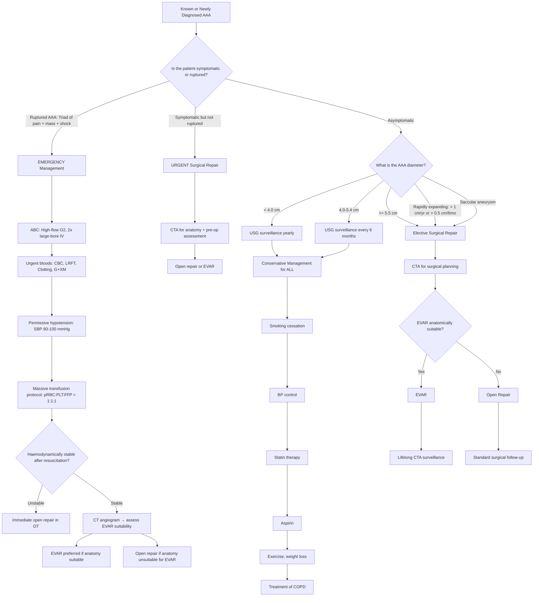

## Management of Abdominal Aortic Aneurysm (AAA)

### Management Principles — Thinking from First Principles

The entire management strategy for AAA is built on **one key decision**: does the **risk of rupture** exceed the **risk of intervention**? This is a risk-benefit calculation that changes depending on three variables:

1. **Aneurysm size** (and growth rate) — determines rupture risk
2. **Symptoms** — any symptoms suggest impending rupture → urgent intervention
3. **Patient fitness** — determines operative risk

The logic is straightforward:
- ***Intact aneurysm operative mortality: 3–5%*** [1]
- ***Ruptured aneurysm operative mortality: > 50%*** [1]
- ***Unoperated rupture mortality: 100%*** [1]

Therefore: if the annual rupture risk exceeds the operative mortality, you operate. If it doesn't, you watch and wait.

---

### Management Algorithm

---

### A. Conservative Management (Surveillance)

#### Indication [3][11]

- ***AAA < 5.5 cm*** with ***no symptoms*** and ***no rapid expansion*** [3]
- The ***UK Small Aneurysm Trial (N=1,090, 4.0–5.5 cm, NEJM 2002)*** demonstrated ***no survival benefit*** from early surgery for small AAA (4.0–5.5 cm) compared to surveillance [1][3]
- **Local HKU/HK consensus**: some centres use a lower threshold of ***5 cm*** for Asian populations (thinner aortic walls, smaller body habitus) [3]

#### Components of Conservative Management

| Intervention | Rationale | Evidence |
|---|---|---|
| ***Smoking cessation*** | **Strongest modifiable risk factor** — smoking promotes MMP activity → elastin degradation → wall weakening; cessation slows aneurysm growth by ~20% | Observational data consistently shows smoking cessation is the single most effective lifestyle measure |
| ***BP control*** | Reduces wall tension (Laplace's Law: T = P × r / w); target < 130/80 mmHg; **beta-blockers** often first-line (also reduce dP/dt, the rate of rise of aortic pressure, thereby reducing shear stress) | Beta-blockers have theoretical benefit though RCT evidence is mixed; ACEi/ARBs may have additional anti-MMP properties |
| ***Statin therapy*** | Anti-inflammatory, plaque-stabilising; some evidence they may slow AAA growth via anti-MMP effect | Retrospective studies suggest statin use associated with slower expansion |
| ***Aspirin*** | Cardiovascular risk reduction (these patients have high burden of atherosclerosis → concurrent CAD, cerebrovascular disease) | Standard secondary prevention in atherosclerotic vascular disease |
| ***Exercise and weight loss*** | Improves cardiovascular fitness (important for future surgery if needed); reduces metabolic syndrome | General CVD risk reduction |
| ***Treatment of COPD*** | COPD is independently associated with AAA rupture (chronic cough → repeated surges in intra-abdominal pressure → ↑ wall stress); optimising COPD reduces this risk and improves operative fitness | Also important for perioperative respiratory management |

#### Surveillance Protocol [3]

| AAA Size | Surveillance | Rationale |
|---|---|---|
| 3.0–3.9 cm | ***USG yearly*** | Average growth ~1–2 mm/year; low rupture risk < 1%/year |
| 4.0–5.4 cm | ***USG every 6 months*** | Faster growth expected; approaching surgical threshold |
| ≥ 5.5 cm or rapidly expanding | **Proceed to CTA → surgical referral** | Rupture risk exceeds operative risk |

<Callout title="Why Not Operate on All AAA?">
Small AAA (< 5.5 cm) have an annual rupture risk of < 1%. Elective open repair carries 3–5% mortality. Operating on a small AAA exposes the patient to a higher risk of death from the surgery than from the aneurysm itself. This is why the UK Small Aneurysm Trial showed **no survival benefit** from early surgery in 4.0–5.5 cm AAA [1][3]. You wait until the scales tip — when rupture risk overtakes operative risk.
</Callout>

---

### B. Surgical Management — Indications

#### ***AAA: Operative Considerations*** [1]

The lecture slides frame the decision around five factors:

| Factor | Detail |
|---|---|
| ***Symptoms*** | ***Any symptoms = urgent*** [1] — symptomatic AAA of **any size** requires urgent repair because pain suggests impending rupture |
| ***Size*** | ***5 cm (approx)*** [1] — the threshold varies: 5.5 cm in Caucasians (UK Small Aneurysm Trial), 5 cm in Asian/HK local consensus [3][11] |
| ***Medical risk*** | ***Associated diseases*** — cardiac, respiratory, renal comorbidities determine operative risk; if operative mortality exceeds rupture risk → conservative management [1] |
| ***Life expectancy*** | If life expectancy is very limited (e.g., metastatic cancer), the benefit of repair may not be realised |
| ***Age*** | ***Not a contraindication*** [1] — advanced age alone is not a reason to deny surgery; physiological fitness matters more than chronological age |

#### Formal Indications for Surgery [3][11]

| Indication | Notes |
|---|---|
| ***AAA ≥ 5.5 cm*** (Caucasian) / ***5 cm*** (HK local consensus) | ***UK Small Aneurysm Trial*** established the 5.5 cm threshold [1][3] |
| ***Rapidly expanding AAA*** (> 1 cm/year or > 0.5 cm/6 months) | Indicates compensatory mechanisms are failing; high rupture risk regardless of absolute size [3][11] |
| ***Symptomatic AAA*** (pain, distal embolisation) of **any size** | Pain = impending rupture until proven otherwise [1][3] |
| ***Saccular aneurysm*** | Higher rupture risk per diameter than fusiform (more focal wall stress); lower threshold for repair [11] |
| ***Ruptured AAA*** | Absolute emergency surgical indication [1] |

#### Contraindications / Relative Contraindications to Elective Repair

| Factor | Rationale |
|---|---|
| **Medically unfit** — ***operative mortality > risk of rupture*** | e.g., severe cardiac failure, end-stage COPD, recent MI, severe dementia; patient would not survive the operation [1] |
| **Limited life expectancy** (< 2 years from other cause) | Patient unlikely to benefit from prophylactic repair |
| **Patient refusal** | After appropriate counselling |

---

### C. Surgical Treatment Modalities

There are **two principal approaches**: ***Open Repair (Aneurysmectomy + Inlay Graft)*** and ***Endovascular Repair (EVAR — Aortic Stent Graft)*** [1].

#### 1. Open Surgical Repair [1][11][12]

**Concept**: The aneurysmal segment is replaced with a **synthetic prosthetic graft** (Dacron or PTFE) sutured directly inside the opened aneurysm sac (inlay technique).

**Procedure**:
- ***Replacement of diseased aortic segment with a tube or bifurcated prosthetic graft*** [11]
  - **Tube graft**: if aneurysm is confined to the aorta without iliac involvement
  - ***Aorto-iliac bifurcated graft***: if iliac arteries are also aneurysmal or diseased [1]
- ***Transabdominal or retroperitoneal approach*** [11]:

| Approach | Incision | Advantages | When to Use |
|---|---|---|---|
| ***Transabdominal*** | ***Midline abdominal incision*** | Direct access to aorta and iliac bifurcation; allows inspection of all abdominal organs | Standard approach for most infrarenal AAA |
| ***Retroperitoneal*** | ***Left retroperitoneal incision*** (left flank) | ***Advantageous in patients with previous intra-abdominal surgery, obese patients, COPD patients*** [11]; ***proximal suprarenal or supraceliac control of aorta is more easily achieved*** [11] | Hostile abdomen, obesity, need for proximal clamp above renals |

**Steps of open repair (simplified)**:
1. Midline laparotomy → expose aorta
2. Heparinisation (systemic heparin)
3. Proximal and distal aortic cross-clamping
4. Aneurysm sac opened longitudinally
5. Mural thrombus removed
6. Prosthetic graft sutured proximally and distally (inlay technique)
7. Aneurysm sac wrapped around the graft (to separate graft from duodenum → prevents aortoenteric fistula)
8. Close abdomen

**For Suprarenal / Thoracoabdominal Aneurysms** [1]:
The challenges are significantly greater:
- ***High aortic clamp*** → ***proximal hypertension*** above the clamp
- ***Critical ischaemic time*** for organs below the clamp
- ***Visceral / renal*** arteries and ***vital branches*** must be managed
- Risk of ***spinal ischaemia*** (artery of Adamkiewicz — the major radiculomedullary artery supplying the anterior spinal cord, typically arising T9–T12)
- Management: ***Bypass*** or ***reimplant visceral arteries*** [1]

#### 2. Endovascular Aneurysm Repair (EVAR) [1][3][12]

**Concept**: A modular stent-graft is deployed through the femoral/iliac arteries (percutaneous or via small groin incisions) and positioned within the aorta to **line the diseased segment and exclude the aneurysm sac from the circulation** — blood flows through the graft, not through the aneurysm.

***EVAR: Critical Issues*** — the lecture slides specifically highlight the anatomical requirements [1]:

| Anatomical Parameter | Requirement | Why |
|---|---|---|
| ***Neck length*** | ***> 1.5 cm*** | Must have sufficient healthy aorta below the renal arteries to provide a **proximal landing zone** for the graft to seal against [1][12]; too short → no seal → Type Ia endoleak |
| ***Neck diameter*** | ***< 32 mm*** | Commercially available devices have a maximum endograft diameter of ~36 mm (need 15–20% oversizing) → maximum neck diameter treatable is ~32 mm [12] |
| ***Neck angle*** | ***< 45 degrees*** | Severe angulation prevents proper apposition of graft to aortic wall → seal failure [1][12] |
| ***Common iliac artery (CIA)*** length and diameter | Adequate length and diameter for distal landing zone | Short, wide CIA may mandate ***internal iliac artery (IIA) embolisation*** [1] to create a distal landing zone |
| ***Access vessels*** | Iliac/femoral artery diameter ***> 7 mm***; acceptable ***tortuosity*** | Must be able to deliver the bulky stent-graft delivery system through the iliac arteries [1]; extreme tortuosity or small, calcified access vessels = EVAR not feasible |
| ***Calcifications*** | Minimal circumferential calcification at landing zones | Heavy circumferential calcification prevents graft expansion and seal |
| ***Preserve internal iliac artery*** | Aim to preserve at least one IIA | IIA supplies pelvic organs; bilateral IIA occlusion → buttock claudication, ischaemic colitis, erectile dysfunction |

***MOST important selection criteria for EVAR is an appropriate aortoiliac anatomy*** [12]

**Sizing pitfalls** [12]:
- **Undersizing** → inadequate seal → failure to exclude aneurysm → endoleak
- **Oversizing** → incomplete expansion → infolding of graft → nidus for thrombus → endoleak or graft thrombosis

**Post-EVAR Surveillance** [12]:
- ***Lifelong surveillance is required*** to ensure graft integrity
- ***CT scan every 6 months for the first year, then yearly*** [12]
- Monitor for: endoleaks, graft migration, continued aneurysm sac expansion, limb occlusion

<Callout title="Why Lifelong Surveillance After EVAR?">
Unlike open repair (where the diseased segment is physically replaced), EVAR **leaves the aneurysm sac in situ** — it simply excludes it from blood flow. If the graft develops a leak (endoleak), blood re-enters the sac and the aneurysm can continue to expand and even rupture. This is why EVAR requires lifelong monitoring — a major trade-off compared to open repair.
</Callout>

---

### D. Open Repair vs. EVAR — Head-to-Head Comparison

The landmark trials comparing the two approaches are ***EVAR-1, DREAM, and OVER*** [3]:

| Outcome | Open Repair | EVAR |
|---|---|---|
| ***30-day mortality*** | ***4.7%*** | ***1.7%*** [1] |
| ***4-year aneurysm-related mortality*** | ***7%*** | ***4%*** [1] |
| Hospital stay | Longer (7–14 days) | ***Shorter (2–5 days)*** [3] |
| Return to QoL | Slower (weeks–months) | ***Rapid*** [3] |
| Long-term rupture risk | Lower (graft directly replaces segment) | ***Higher (risk of endoleak → sac re-pressurisation)*** [3] |
| Re-intervention rate | Lower | ***Higher (endoleak management, graft migration)*** [3] |
| Overall long-term mortality | ***No significant difference*** | ***No significant difference*** [3] |
| Lifelong surveillance | Not required | ***Required*** |

> **Summary**: ***EVAR: less 30-day morbidity and mortality, shorter duration of hospitalisation, rapid return of QoL. Open: lower risk of rupture / re-intervention in the long run. No significant difference in long-term morbidity and mortality*** [3].

<Callout title="Which to Choose?" type="idea">
**In practice:**
- EVAR is offered as **first-line** when anatomy is suitable, especially in **elderly or comorbid patients** who may not tolerate the physiological stress of open surgery [3]
- Open repair is preferred when: anatomy is **unsuitable for EVAR** (short neck, severe angulation, inadequate access vessels), patient **does not want lifelong surveillance**, or patient is at **high risk for AAA rupture** (where a definitive solution is preferred over one with long-term endoleak risk) [3]
- For **young, fit patients**, open repair may be preferred because the long-term durability is superior and avoids decades of surveillance CTs and potential re-interventions
</Callout>

| Indication | Open Repair Preferred | EVAR Preferred |
|---|---|---|
| ***Anatomy unsuitable for EVAR*** | ✓ | — |
| ***No desire for lifelong surveillance*** | ✓ | — |
| ***High risk of AAA rupture*** | ✓ | — |
| ***Previous abdominal surgery / obese / COPD*** | Consider retroperitoneal approach [11] | ✓ (avoids laparotomy entirely) |
| ***Poor cardiorespiratory reserve*** | — | ***✓ (first-line)*** [3] |
| ***Elective repair in suitable anatomy*** | Either | ✓ (lower early morbidity) |
| ***Ruptured AAA*** | Unstable → immediate open repair [3] | ***Stable → EVAR preferred if anatomy suitable*** [11] |

---

### E. Management of Ruptured AAA

This is the most time-critical management in all of vascular surgery.

***Ruptured AAA: Management*** [1]:
- ***Treat haemorrhagic shock***
- ***Large bore IV***
- ***Cross-match blood / FFP***
- ***Immediate operation***
- ***Do not waste time in investigations*** [1]

#### Step-by-Step Emergency Protocol [1][3][11]

| Step | Action | Rationale |
|---|---|---|
| 1 | ***High-flow O2***, ***2× large-bore IV access*** | Maximise oxygen delivery; establish routes for rapid fluid/blood administration |
| 2 | ***Urgent bloods: CBC, LRFT, clotting, group and cross-match*** | Baseline + prepare for massive transfusion |
| 3 | ***Permissive hypotension: target SBP 80–100 mmHg*** [3][11] | ***AVOID over-resuscitation*** — aggressive fluid boluses → dilute clotting factors, destabilise the retroperitoneal haematoma tamponade, and worsen haemorrhage [11]; aim for "just enough" perfusion to maintain consciousness and urine output |
| 4 | ***Massive transfusion protocol: pRBC : PLT : FFP = 1:1:1*** (e.g., 8 units each) [3] | Replace blood loss with balanced products to prevent dilutional coagulopathy and maintain clotting function |
| 5 | **Pain control** (IV opioids — carefully, avoid excessive hypotension) | Humanitarian; also reduces sympathetic drive |
| 6 | **Haemodynamically unstable**: ***Immediate open repair*** [3] | No time for CT — clinical diagnosis → OT. Cross-clamp aorta, control haemorrhage, graft insertion |
| 7 | **Haemodynamically stable after resuscitation**: ***CT angiogram → decide suitability of open repair vs. EVAR*** [3] | ***EVAR approach is preferred over open surgery for ruptured AAA*** if anatomy is suitable [11]; associated with lower perioperative mortality in selected patients |

<Callout title="Permissive Hypotension — Why?" type="error">
This is counter-intuitive: why would you *allow* a patient to remain hypotensive? The answer: in ruptured AAA, the only thing preventing exsanguination is the **retroperitoneal tamponade** — the haematoma compressed against surrounding tissues creates enough pressure to slow bleeding from the aortic tear. If you aggressively raise the BP with crystalloids:
1. You **destabilise the tamponade** (higher pressure disrupts the clot)
2. You **dilute clotting factors** (crystalloid has no coagulation factors)
3. You **worsen hypothermia** (cold fluids)
4. → **More bleeding** → lethal triad of trauma (hypothermia, acidosis, coagulopathy)

Target SBP 80–100 mmHg is enough to maintain cerebral and coronary perfusion while keeping the tamponade intact.
</Callout>

#### Ruptured AAA Mortality Statistics [1][3]

The grim "rule of 50s" [3]:
- ***Only 1 in 3 reaches hospital alive*** [1] (many die at home or in transit)
- ***50% reach hospital alive → 50% can undergo OT → 50% survive OT*** [3]
- ***Operative mortality > 50%*** for ruptured AAA [1]
- ***Overall mortality > 80%*** [1]
- ***Unoperated rupture: 100% mortality*** [1]

This is precisely why **screening and elective repair** are so important — the mortality difference between elective (3–5%) and emergency repair ( > 50%) is enormous.

---

### F. Endoleak After EVAR

***Endoleak*** = persistent blood flow **into the aneurysm sac** after EVAR, outside the stent-graft but within the aneurysm. This means the sac is not fully excluded → continued pressurisation → risk of expansion and rupture.

***Types I and III have continuous direct flow into AAA → require re-operation!*** [3]

| Type | Description | Mechanism | Management |
|---|---|---|---|
| ***I*** | ***Seal failure at proximal or distal end*** — usually stent migration | Blood leaks around the graft at the landing zones. **Subtypes**: ***Ia (proximal end)***, ***Ib (distal end)***, Ic (iliac occluder plug) | ***Repeat EVAR*** (extension cuff, ballooning) or conversion to open [3] |
| ***II*** | ***Backflow from side branches*** (lumbar arteries / IMA) — ***most common type*** ("retroleak") | Patent branch vessels that were covered by the graft allow retrograde flow back into the sac. **Subtypes**: IIa (1 vessel), IIb (≥ 2 vessels) | ***Close observation for AAA expansion*** → if sac growing: ***laparoscopic / open clipping or IR embolisation*** [3] |
| ***III*** | ***Stent break (fabric tear) or modular dehiscence*** | Component disconnection or holes in the graft fabric allow direct flow into sac. **Subtypes**: IIIa (segment disconnection), IIIb (fabric holes) | ***Repair defect / bridge across defect*** [3] |
| ***IV*** | ***Porosity*** — blood seeps through small pores of the graft material | Self-limiting in most cases; occurs early post-implantation | ***Observe*** [3] |
| ***V*** | ***Endotension*** — sac expansion without identifiable endoleak on imaging | Mechanism unclear; may be caused by ultrafiltration through graft material or undetectable endoleak | ***Observe*** [3] |

<Callout title="High Yield: Which Endoleaks Require Intervention?">

- **Types I and III**: Direct, high-pressure flow into the sac → **must intervene** (endoleak persists and increases rupture risk) [3]
- **Type II**: Low-pressure retrograde flow → often benign and self-limiting; **intervene only if sac is expanding** [3]
- **Types IV and V**: Usually observed
</Callout>

**Strategies to overcome difficult EVAR anatomy** [3]:
- ***Extend into proximal landing zone***: ***fenestrated/branched devices***, ***chimneys***, ***snorkels*** [1][3]
- ***Proximal sealing with EndoAnchor***
- ***Preservation of internal iliac artery with iliac bifurcation devices***

***Fenestrated Aortic Stent Graft*** — shown on lecture slides [1]: custom-made grafts with fenestrations (windows) or branches that allow blood flow into renal and visceral arteries while still excluding the aneurysm. Used for **juxtarenal / pararenal / suprarenal AAA** where a standard infrarenal graft cannot achieve adequate seal.

---

### G. Management of Specific Scenarios

#### Aortoenteric Fistula [3]

- Occurs after aortic graft surgery (open or EVAR)
- ***Classic triad: UGIB, fever, abdominal pain*** [3]
- **Investigations**: ***OGD (up to D4)***, ***contrast-enhanced CT abdomen*** [3]
- **Management**: ***Graft excision with extra-anatomical bypass*** [3] (e.g., axillo-bifemoral bypass — reroutes blood supply around the infected field)

#### Mycotic AAA

- ***Urgent surgery*** + **prolonged IV antibiotics** (6 weeks minimum, often lifelong suppressive oral antibiotics)
- If possible, in-situ reconstruction with autologous vein (femoral vein) or cryopreserved homograft rather than synthetic graft (risk of re-infection)
- Blood cultures guide antibiotic choice

---

### H. Post-Operative Complications Summary

#### ***Early Operative Complications*** [1]

**General** [1]:
| Complication | Mechanism |
|---|---|
| ***Cardiac (clamp/declamp)*** | Cross-clamping → sudden ↑ afterload → myocardial ischaemia/MI/arrhythmia. Unclamping → sudden ↓ afterload → hypotension, reperfusion injury. ***Major operative mortality = myocardial infarction*** [1] |
| ***Respiratory*** | Post-operative atelectasis, pneumonia, ARDS (especially with massive transfusion); COPD patients at particular risk |

**Specific** [1][11]:
| Complication | Mechanism |
|---|---|
| ***Haemorrhage*** | Intraoperative from aorta/iliac vessels; anastomotic bleeding |
| ***Bowel ischaemia*** | Ligation of IMA without adequate collateral (marginal artery of Drummond, arc of Riolan) → ischaemic colitis [11]; presents with postoperative fever, leukocytosis, bloody diarrhoea, peritonitis |
| ***Impotence*** | ***Damage to sympathetic plexus*** during dissection near the ***proximal left common iliac artery*** → retrograde ejaculation, erectile dysfunction [11] |
| ***Renal failure*** | Contrast nephropathy, hypotension, renal ischaemia from suprarenal clamping, embolisation to renal arteries [11] |
| ***Distal embolism (trash foot)*** | Atherosclerotic debris dislodged during manipulation of aneurysm → microembolisation to digital arteries [1][11]; prevented by ***minimising manipulation prior to clamping*** + ***Fogarty balloon catheters*** for distal emboli [11] |
| ***Paraplegia*** | ***Spinal cord ischaemia*** — artery of Adamkiewicz interrupted (especially in suprarenal/thoracoabdominal repairs) [1][11] |

#### ***Late Operative Complications*** [1]

| Complication | Mechanism |
|---|---|
| ***Graft infection*** | Seeding of synthetic graft by bacteria (Staph aureus, Staph epidermidis, enteric organisms); presents with fever, sepsis, false aneurysm at anastomosis; requires graft explantation + extra-anatomical bypass |
| ***Anastomotic aneurysm*** | Pseudo-aneurysm at suture line from suture line disruption or graft degeneration |
| ***Graft-duodenal fistula*** | Graft erodes into duodenum (usually 3rd/4th part) → UGIB; same entity as aortoenteric fistula |

#### ***Ruptured AAA: Specific Complications*** [1]

| Complication | Cause |
|---|---|
| ***Cardiac*** | ***Shock*** → demand ischaemia, MI, arrhythmia |
| ***Respiratory*** | Shock, massive transfusion → ARDS, pulmonary oedema |
| ***Renal failure*** | ***Shock*** → acute tubular necrosis; prolonged suprarenal clamping |
| ***Bleeding tendency*** | ***Massive transfusion*** → dilutional coagulopathy + DIC |
| ***Paralytic ileus*** | ***Retroperitoneal haematoma*** irritates retroperitoneal structures → sympathetic activation → gut hypomotility |
| ***Jaundice*** | ***Bleeding + transfusion*** → haemolysis of transfused blood + hepatic hypoperfusion from shock → conjugated + unconjugated hyperbilirubinaemia |

---

<Callout title="High Yield Summary — Management of AAA">

1. **Decision framework**: Risk of rupture vs. risk of operation. ***Intact AAA operative mortality: 3–5%; Ruptured: > 50%; Unoperated rupture: 100%*** [1].
2. **Conservative management**: AAA < 5.5 cm (no survival benefit from early repair per ***UK Small Aneurysm Trial***); ***CV risk factor modification*** (smoking cessation, BP control, statin, aspirin); ***USG surveillance*** yearly (3.0–3.9 cm) or 6-monthly (4.0–5.4 cm) [3].
3. **Surgical indications**: ***≥ 5.5 cm (5 cm HK consensus); rapidly expanding > 1 cm/yr or > 0.5 cm/6mo; symptomatic of any size; saccular aneurysm*** [1][3][11].
4. ***Operative considerations: Any symptoms = urgent; Size ~5 cm; Medical risk from associated diseases; Life expectancy; Age is NOT a contraindication*** [1].
5. ***Open Repair: Aneurysmectomy + inlay graft*** (tube or bifurcated); transabdominal or retroperitoneal approach [1][11].
6. ***EVAR: Aortic stent graft*** — requires suitable anatomy: ***neck length > 1.5 cm, diameter < 32 mm, angle < 45°; adequate iliac access > 7 mm*** [1]; ***lifelong CTA surveillance*** required [12].
7. ***EVAR vs. Open: EVAR has lower 30-day mortality (1.7% vs. 4.7%), shorter stay, faster recovery; Open has lower re-intervention and rupture rate long-term; no difference in overall long-term mortality*** [1][3].
8. **Ruptured AAA management**: ***Treat shock → large-bore IV → cross-match blood/FFP → permissive hypotension (SBP 80–100) → immediate operation; do not waste time in investigations*** [1]. ***Massive transfusion pRBC:PLT:FFP = 1:1:1*** [3]. EVAR preferred if stable + suitable anatomy [11].
9. **Endoleaks**: ***Types I and III → re-operate (direct flow into sac); Type II (most common) → observe unless sac expanding; Types IV and V → observe*** [3].
10. **Early complications**: ***Cardiac (clamp/declamp), respiratory, haemorrhage, bowel ischaemia, impotence, renal failure, distal embolism, paraplegia*** [1]. **Late**: ***graft infection, anastomotic aneurysm, graft-duodenal fistula*** [1].

</Callout>

---

<ActiveRecallQuiz
  title="Active Recall - Management of AAA"
  items={[
    {
      question: "List the 4 indications for elective surgical repair of AAA. What trial established the size threshold?",
      markscheme: "(1) AAA >=5.5 cm (5 cm HK consensus), (2) Rapidly expanding >1 cm/yr or >0.5 cm/6mo, (3) Symptomatic AAA of any size, (4) Saccular aneurysm. UK Small Aneurysm Trial (N=1090, 4.0-5.5 cm, NEJM 2002) established that there is no survival benefit from early repair below 5.5 cm."
    },
    {
      question: "Compare EVAR vs Open Repair for elective AAA in terms of: 30-day mortality, long-term mortality, re-intervention rate, and need for surveillance. Name 3 trials.",
      markscheme: "EVAR: 30-day mortality 1.7% (vs open 4.7%); shorter stay; faster QoL recovery; higher re-intervention rate; higher long-term rupture risk; requires lifelong CTA surveillance. Open: higher 30-day mortality; lower re-intervention and rupture rate long-term; no lifelong surveillance needed. No significant difference in overall long-term mortality. Trials: EVAR-1, DREAM, OVER."
    },
    {
      question: "List the critical anatomical requirements for EVAR as stated on the lecture slides.",
      markscheme: "Neck: length >1.5 cm, diameter <32 mm, angle <45 degrees. CIA: adequate length and diameter for distal landing zone. Access vessels: diameter >7 mm with acceptable tortuosity. Minimal calcification at landing zones. Aim to preserve at least one internal iliac artery."
    },
    {
      question: "Describe the step-by-step emergency management of ruptured AAA in an unstable patient. Why is permissive hypotension used?",
      markscheme: "(1) High-flow O2, 2x large-bore IV access, (2) Urgent bloods: CBC, LRFT, clotting, G+XM, (3) Permissive hypotension target SBP 80-100 mmHg, (4) Massive transfusion protocol pRBC:PLT:FFP = 1:1:1, (5) Immediate open repair (do not waste time with investigations). Permissive hypotension because: aggressive resuscitation destabilises retroperitoneal tamponade, dilutes clotting factors, worsens hypothermia, leading to more bleeding (lethal triad of trauma)."
    },
    {
      question: "Classify endoleak types I-V after EVAR. Which types require re-operation and why?",
      markscheme: "Type I: seal failure at proximal/distal end (stent migration). Type II: backflow from side branches (lumbar/IMA) - most common. Type III: fabric tear or modular dehiscence. Type IV: graft porosity. Type V: endotension (sac expansion, no visible leak). Types I and III require re-operation because they have continuous direct high-pressure flow into the aneurysm sac, maintaining rupture risk. Type II is observed unless sac expanding."
    },
    {
      question: "List 6 specific early operative complications of open AAA repair and explain the mechanism of bowel ischaemia after AAA repair.",
      markscheme: "Six complications: (1) Haemorrhage, (2) Bowel ischaemia, (3) Impotence, (4) Renal failure, (5) Distal embolism/trash foot, (6) Paraplegia. Bowel ischaemia mechanism: ligation of the IMA during repair; if the marginal artery of Drummond / arc of Riolan collateral circulation is inadequate, the left colon becomes ischaemic → ischaemic colitis. Presents with postoperative fever, leukocytosis, bloody diarrhoea, peritonitis."
    }
  ]}
/>

## References

[1] Lecture slides: GC 199. Pulsating abdominal mass aortic aneurysm.pdf (p5, p9, p10, p13, p14, p15, p17, p18, p20, p21, p22, p24, p25, p26, p27)
[3] Senior notes: maxim.md ([maxim:342], [maxim:345], [maxim:347], [maxim:348])
[11] Senior notes: felixlai.md ([felix:1335], [felix:1336])
[12] Senior notes: felixlai.md ([felix:1337])
