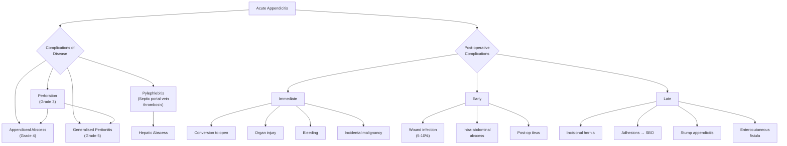

## Complications of Acute Appendicitis

Complications of acute appendicitis can be divided into two broad categories: **complications of the disease itself** (if untreated or inadequately treated) and **post-operative complications** (following appendicectomy). Understanding both is critical for exam purposes and for informed consent discussions with patients.

The key concept linking all disease complications is the **pathological progression** we covered earlier: obstruction → inflammation → gangrene → perforation → abscess or peritonitis. Every complication is essentially a consequence of where the patient falls on this spectrum and whether the body can contain the infection.

---

### A. Complications of the Disease (Pre-operative / Untreated)

These follow the natural history of appendicitis if left untreated, or if diagnosis is delayed.

#### 1. Perforation

***Perforation of the appendix*** [4] is the most feared complication and the natural endpoint of untreated appendicitis.

- **Pathophysiology**: ***Patients develop inflammation and necrosis of the appendix. Increased risk of perforation once significant inflammation and necrosis occurs, which leads to localised abscess formation or diffuse peritonitis*** [4]. As the appendiceal wall undergoes gangrenous necrosis (recall: the appendiceal artery is an end-artery — once thrombosed, the entire wall dies), the weakened wall gives way, releasing intraluminal contents (pus, bacteria, faecal material) into the peritoneal cavity.
- **Clinical suspicion**: ***Considered in patients when fever > 39.4°C, WBC > 15 × 10⁹/L, and imaging studies reveal fluid collection in RLQ*** [4].
- **Risk factors for perforation**: ***Male gender, extremes of age, DM, immunosuppression, previous abdominal surgery, faecolith obstruction, pelvic appendix*** [4].
- **Time course**: Perforation rarely occurs within the first 12 hours of symptom onset. Risk increases significantly after 36–48 hours of untreated symptoms. In children < 5 years and adults > 65 years, perforation rates can reach 50–70% because of delayed diagnosis.
- **The "relief then crash" phenomenon**: As the appendiceal wall becomes gangrenous, nerve endings within the wall die → pain may temporarily improve. Then perforation occurs → sudden severe generalised abdominal pain, tachycardia, fever, and peritoneal signs. This pattern is a classic clinical trap.

<Callout title="Why Do the Extremes of Age Perforate More?" type="error">
**Children**: Cannot articulate symptoms → delayed diagnosis. Underdeveloped omentum → poor ability to wall off infection. Thinner appendiceal wall → perforates more readily.
**Elderly**: Atypical presentation, blunted inflammatory response (less fever, less leucocytosis, less pain) → delayed diagnosis. Often attributed to other causes (constipation, diverticulitis, urinary problems).
</Callout>

#### 2. Appendiceal Abscess

***Walled off: forms appendiceal abscess → may cause obstruction*** [3].

- **Pathophysiology**: When the appendix perforates, the **greater omentum** (the "policeman of the abdomen") and adjacent loops of bowel migrate towards the inflamed area and wall off the contamination, forming a contained collection of pus — an **appendiceal abscess**. This is the body's defence mechanism to prevent generalised peritonitis.
- **Clinical features**: ***Signs of complications: high fever, RLQ mass, imaging shows abscess/phlegmon (inflammatory mass)*** [3]. Classically presents with:
  - Persistent or **swinging (spiking) fever** despite initial treatment
  - Palpable, tender **RLQ mass**
  - Persistent RLQ pain
  - Elevated and rising inflammatory markers (WCC, CRP)
- **Imaging**: CT abdomen with contrast is the gold standard — shows a **rim-enhancing fluid collection** with surrounding fat stranding.
- **Complications of the abscess itself**:
  - May cause **adhesive small bowel obstruction** (loops of bowel become adherent to the inflammatory mass)
  - May fistulise to adjacent structures (see enterocutaneous fistula below)
  - May rupture, causing secondary generalised peritonitis
- **Management**: ***IV antibiotics ± image-guided percutaneous drainage → interval appendicectomy at 6–8 weeks*** [3].

#### 3. Appendiceal Phlegmon

- A **phlegmon** is an inflammatory mass composed of the inflamed appendix, adherent omentum, and loops of bowel — without a drainable fluid collection (distinguishing it from an abscess).
- It represents an earlier/milder stage of the same walling-off process.
- On CT, it appears as an ill-defined **soft tissue mass** with fat stranding in the RIF, but without a discrete fluid pocket.
- Management is the same as abscess: ***IV antibiotics → interval appendicectomy*** [3][4]. Importantly, ***immediate surgery in patients with phlegmon formation is associated with increased morbidity due to dense adhesions and inflammation*** — operating through a phlegmon often ***requires extensive dissection and leads to injury of adjacent structures and complications necessitating ileocolectomy or caecostomy*** [4].

#### 4. Generalised (Diffuse) Peritonitis

***Not walled off: generalised peritonitis*** [3].

- **Pathophysiology**: When the omentum and adjacent structures **fail to wall off** the perforation, faecal and purulent material spreads freely throughout the peritoneal cavity. This is **secondary bacterial peritonitis** — a ***surgical emergency*** [9]. ***Acute secondary bacterial peritonitis*** can be caused by ***severe inflammation of abdominal organs (e.g., diverticulitis, cholecystitis, appendicitis), perforations of the GI tract, anastomotic leakage, or ischaemia of abdominal organs*** [9].
- **Why does it fail to wall off?** In children (underdeveloped omentum), in immunosuppressed patients (blunted inflammatory response cannot organise a wall), or when the contamination is overwhelming (massive perforation with faecal spillage).
- **Clinical features**:
  - **Severe, generalised abdominal pain** — the patient lies absolutely still
  - **Board-like rigidity** — involuntary contraction of the entire abdominal wall musculature (a reflex arc: inflamed peritoneum → somatic afferent nerves → spinal cord → motor efferents → abdominal wall muscles)
  - **Absent bowel sounds** — the bowel enters a state of **paralytic ileus** in response to the generalised peritoneal inflammation (the enteric nervous system "shuts down" when the peritoneum is inflamed)
  - **Sepsis / septic shock** — tachycardia, hypotension, fever (or hypothermia in severe sepsis), altered mental status
  - **Rebound tenderness and guarding** (generalised, not localised)
- **Grading**: This corresponds to **Grade 5** in the disease severity score (perforated with diffuse peritonitis) [4].
- **Management**: This is a **surgical emergency** — requires **open appendicectomy** (or laparoscopic if expertise available), thorough **peritoneal lavage**, and prolonged post-operative IV antibiotics (3–7 days minimum). Haemodynamic resuscitation takes priority.

<Callout title="Peritonitis Classification Refresher">
- **Primary peritonitis**: Infection of ascitic fluid WITHOUT a surgically treatable intra-abdominal source (e.g., SBP in cirrhosis, CAPD-associated, TB peritonitis) [9]
- **Secondary peritonitis**: Infection WITH a surgically treatable source — this includes appendicitis, PPU, perforated diverticulitis, ischaemic bowel [9]
- **Tertiary peritonitis**: Persistent peritonitis after adequate initial therapy (e.g., anastomotic leak, opportunistic infections in ICU patients) [9]

Perforated appendicitis causes **secondary bacterial peritonitis** — preceded by chemical irritation from intestinal contents, then bacterial colonisation.
</Callout>

#### 5. Pylephlebitis (Septic Portal Vein Thrombosis)

***Pylephlebitis (septic portal vein thrombosis)*** [4] — a rare but devastating pre- or post-operative complication.

- **Etymology**: "pyle" (Greek) = gate (referring to the porta hepatis / portal vein); "phlebitis" = vein inflammation.
- **Pathophysiology**: ***Thrombosis and infection within the portal venous system. Caused by septicaemia in the portal venous system*** [4]. The appendiceal vein drains via the ileocolic vein → superior mesenteric vein → portal vein. When the appendix is severely infected or perforated, bacteria enter this venous system, causing septic thrombophlebitis that propagates along the portal vein to the liver, leading to ***development of intra-hepatic abscesses*** [4].
- **Clinical features**: ***Associated with high fever, chills and rigors, and jaundice*** [4]. The patient is severely septic. Jaundice occurs because: (1) hepatic abscesses disrupt bile canaliculi, and (2) portal vein thrombosis causes hepatic congestion and impaired bilirubin metabolism.
- **Diagnosis**: CT abdomen with IV contrast — shows filling defect in the portal vein (thrombus) and ring-enhancing hepatic abscesses. Blood cultures are typically positive.
- **Management**: Prolonged IV antibiotics (4–6 weeks), therapeutic anticoagulation (to prevent thrombus propagation), ± percutaneous drainage of hepatic abscesses. Mortality is significant (~10–30%).

> **Connection to liver abscess**: Pylephlebitis from appendicitis is a recognised cause of **pyogenic liver abscess** — ***spread from portal vein (20% of liver abscess causes): intra-abdominal infections e.g., acute appendicitis, diverticulitis, Crohn's*** [10].

---

### B. Post-operative Complications (Following Appendicectomy)

These are systematically categorised by timing. ***Risks — need to know for consent!*** [3]

#### Immediate Complications (Intra-operative / < 1 hour)

| Complication | Pathophysiology / Explanation | Management |
|-------------|-------------------------------|------------|
| ***Conversion to open*** [3] | Inability to complete laparoscopically — due to dense adhesions (complicated appendicitis), uncontrollable bleeding, unclear anatomy, or inability to safely identify structures | Continue via open approach. This should always be discussed during pre-operative consent |
| ***Normal appendix found*** [3] | A normal appendix is found at operation (negative appendicectomy rate is ~10–15%). ***Still removed to avoid diagnostic confusion*** [3] — if left in situ, any future RLQ pain episode would re-raise appendicitis | Appendix is removed. Thorough inspection of remainder of abdomen: terminal ileum (Crohn's, Meckel's, TB), mesenteric lymph nodes (adenitis), caecum (diverticulitis, carcinoma), gynaecological organs (women) |
| ***Malignancy found requiring right hemicolectomy ± stoma*** [3] | Incidental finding of carcinoid tumour ( > 2 cm), adenocarcinoma, or mucinous neoplasm. ***Appendix specimen sent to pathology for assessment of neoplasms (1% chance)*** [3] | Carcinoid ≤ 2 cm: appendicectomy alone is curative. Carcinoid > 2 cm or involving caecum/lymph nodes: ***right hemicolectomy*** [3]. Adenocarcinoma: ***right hemicolectomy ± adjuvant chemotherapy*** [3]. Mucinous tumours: risk assessment for pseudomyxoma peritonei [3] |
| ***Injury to surrounding organs*** [3] | Caecum, small bowel, ureter, iliac vessels — from dissection, diathermy, or port insertion | Immediate recognition and repair. Bowel injury may require primary repair or resection. Ureteric injury requires urological consultation |
| ***Bleeding*** [3] | From appendicular artery (end-artery), mesoappendix, port-site vessels | Ensure mesoappendix is adequately ligated/clipped. Intra-operative haemostasis; if uncontrollable, convert to open |

#### Early Complications (24 hours to weeks)

| Complication | Pathophysiology / Explanation | Clinical Features | Management |
|-------------|-------------------------------|-------------------|------------|
| ***Wound infection (5–10%)*** [3] | The most common post-operative complication. Polymicrobial organisms (same as appendicitis: *E. coli*, *Bacteroides*). Risk increases with complicated appendicitis, contamination during surgery, obesity, diabetes | Wound erythema, warmth, discharge (purulent), pain, dehiscence. Typically day 3–7 post-op | Wound opening and drainage, swab for culture, wound packing, antibiotics if cellulitis/systemic signs |
| ***Intra-abdominal / pelvic abscess*** [3][4] | Residual infected material collects in dependent areas (pelvis, RIF, subphrenic space) after surgery. More common with complicated appendicitis. ***Higher rate of intra-abdominal abscess*** reported with laparoscopic approach in some studies [4] | ***Spiking fever*** [3] (swinging high spikes → near-normal troughs — the classic pattern of an undrained abscess). Persistent abdominal pain, ↑ WCC/CRP, tachycardia. May cause secondary ileus | CT abdomen to localise. **Image-guided percutaneous drainage** is first-line. IV antibiotics. Surgery if not amenable to percutaneous drainage |
| ***Post-operative ileus*** [3][4] | Temporary failure of bowel peristalsis after abdominal surgery. The peritoneal inflammation and surgical manipulation cause the enteric nervous system to enter a transient "shutdown" state. Exacerbated by opioid analgesia, electrolyte imbalance (especially hypokalaemia), and intra-abdominal sepsis | Abdominal distension, nausea/vomiting, absent flatus and bowel sounds. Typically resolves within 2–5 days | Conservative: NPO, IV fluids, NG tube for decompression if needed, correct electrolytes (especially K⁺), minimise opioids, early mobilisation. Resolves spontaneously in most cases |

<Callout title="Spiking Fever Post-Appendicectomy = Think Abscess">
The classic post-operative fever pattern to recognise: **Day 5–7 post-appendicectomy, the patient develops swinging fevers** (temperature spikes to 39–40°C then drops to near-normal, recurring daily). This "picket-fence" fever pattern is highly suggestive of an **undrained intra-abdominal or pelvic abscess**. The mechanism: the abscess periodically releases bacteria/pyrogens into the bloodstream (transient bacteraemia), causing a fever spike, which then resolves as the immune system temporarily contains it — only for it to happen again. The definitive treatment is **drainage**, not just more antibiotics.
</Callout>

#### Late Complications (Weeks to months/years)

| Complication | Pathophysiology / Explanation | Clinical Features | Management |
|-------------|-------------------------------|-------------------|------------|
| ***Incisional hernia*** [3] | Herniation of bowel/omentum through a defect in the fascial closure at the incision/port site. More common with open surgery (larger fascial defect), obesity, wound infection, malnutrition, steroid use | Reducible lump at the scar site, worse with coughing/straining | Surgical repair (mesh repair) if symptomatic or at risk of incarceration |
| ***Adhesions*** [3] | Fibrous bands form between intra-abdominal structures as part of peritoneal wound healing. Exaggerated in complicated appendicitis with peritoneal contamination. Adhesions are the **most common cause of small bowel obstruction** in developed countries | May be asymptomatic for years. Can present as adhesive small bowel obstruction (colicky abdominal pain, vomiting, distension, absolute constipation) at any point in the future | Conservative initially (NG decompression, IV fluids, nil by mouth) → surgery (adhesiolysis) if no resolution or signs of strangulation |
| ***Recurrent / stump appendicitis*** [3] | If the appendiceal stump is left too long ( > 0.5 cm), residual appendiceal tissue can re-inflame. The retained stump essentially behaves like a miniature appendix and can undergo the same obstructive pathophysiology as the original appendix | Recurrence of RLQ pain, fever, leucocytosis — identical presentation to the original appendicitis. History of prior appendicectomy. CT shows inflamed stump | Completion appendicectomy (removal of the stump) |
| ***Enterocutaneous fistula*** [4] | ***Results from an intra-peritoneal abscess that fistulises to the skin*** [4]. An undrained or inadequately drained abscess erodes into an adjacent bowel loop (forming an enteric communication) and then tracks through the abdominal wall to the skin surface | Faeculent discharge from the wound or drain site. May be associated with sepsis, malnutrition, electrolyte derangement (loss of intestinal contents through the fistula) | Conservative first: NPO, TPN (total parenteral nutrition), octreotide (reduces intestinal secretions by inhibiting GI hormones), wound care, antibiotics for sepsis. Many close spontaneously. Surgery if persistent ( > 6 weeks) or high-output |

#### Incidental Appendiceal Neoplasms — A Special "Complication" to Know

***Appendix specimen sent to pathology for assessment of neoplasms (1% chance)*** [3].

The resected appendix must **always** be sent for histological examination. In approximately 1% of cases, an unsuspected neoplasm is found:

| Neoplasm | Frequency | Management |
|----------|-----------|------------|
| ***Carcinoid tumour*** | Most common appendiceal neoplasm (~0.3–0.7% of appendicectomy specimens) | ***≤ 2 cm: appendicectomy alone is curative. > 2 cm or involving caecum/lymph nodes: right hemicolectomy ± stoma*** [3] |
| ***Adenocarcinoma*** | Rare. ***Highly malignant*** | ***Right hemicolectomy ± adjuvant chemotherapy*** [3] |
| ***Mucinous neoplasms*** | Mucinous cystadenoma / cystadenocarcinoma | ***Mucinous tumours have risk of perforation and seeding → pseudomyxoma peritonei (PMP). Low risk: colonoscopy + surveillance. High risk: cytoreductive surgery + heated intraperitoneal chemotherapy (HIPEC)*** [3] |

<Callout title="Pseudomyxoma Peritonei — A Rare but High-Yield Concept" type="idea">
PMP ("pseudo" = false; "myxoma" = mucous tumour; "peritonei" = of the peritoneum) is a condition where the peritoneal cavity fills with mucinous (jelly-like) material, usually from a ruptured mucinous appendiceal tumour. The mucinous cells implant on peritoneal surfaces and continue secreting mucin, causing progressive abdominal distension ("jelly belly"). Treatment is aggressive: **cytoreductive surgery** (removing all visible tumour from every peritoneal surface) + **HIPEC** (heated chemotherapy solution bathed directly in the peritoneal cavity during surgery to kill residual microscopic tumour cells). This is why mucinous appendiceal tumours, even when "benign-appearing," must be taken seriously.
</Callout>

---

### Summary: Complications at a Glance

---

### Mortality

- **Non-perforated appendicitis**: Mortality < 0.1% — extremely low with modern surgical care.
- **Perforated appendicitis**: Mortality 0.5–5%, rising significantly in the elderly and immunocompromised.
- **Generalised peritonitis with septic shock**: Mortality can exceed 10–30% depending on patient comorbidities and time to intervention.
- The key determinant of outcome is **time to diagnosis and treatment** — every hour of delay increases the risk of progression along the complication spectrum.

---

<Callout title="High Yield Summary">

**Disease Complications** (natural history if untreated):

- **Perforation**: Suspect when fever > 39.4°C, WBC > 15 × 10⁹/L, RLQ fluid collection on imaging. Risk factors: male, extremes of age, DM, immunosuppression, faecolith, pelvic appendix.
- **Appendiceal abscess/phlegmon**: Walled-off perforation. Presents with persistent fever, RLQ mass, elevated inflammatory markers. Manage with IV antibiotics ± percutaneous drainage → interval appendicectomy at 6–8 weeks. Do NOT operate immediately through a phlegmon (risk of ileocolectomy/caecostomy).
- **Generalised peritonitis**: Perforation NOT walled off. Board-like rigidity, absent bowel sounds, septic shock. Surgical emergency — open appendicectomy + peritoneal lavage.
- **Pylephlebitis**: Septic portal vein thrombosis → hepatic abscesses. High fever, rigors, jaundice. CT shows portal vein thrombus + liver abscesses. Prolonged IV antibiotics + anticoagulation.

**Post-operative Complications** (consent risks):

- **Immediate**: Conversion to open, normal appendix still removed, incidental malignancy needing R hemicolectomy ± stoma, organ injury, bleeding.
- **Early**: Wound infection (5–10%, most common), intra-abdominal/pelvic abscess (spiking fever — drain it), post-op ileus.
- **Late**: Incisional hernia, adhesions (most common cause of SBO), stump appendicitis, enterocutaneous fistula, pylephlebitis.

**Incidental Neoplasms** (1% of specimens): Carcinoid (≤ 2 cm = appendicectomy sufficient; > 2 cm = R hemicolectomy), adenocarcinoma (R hemicolectomy + chemo), mucinous tumours (risk of pseudomyxoma peritonei → cytoreductive surgery + HIPEC if high risk).

**Always send the appendix specimen for histology.**

</Callout>

---

<ActiveRecallQuiz
  title="Active Recall - Complications of Acute Appendicitis"
  items={[
    {
      question: "What clinical parameters suggest appendiceal perforation, and what are the risk factors?",
      markscheme: "Suspect perforation when: fever > 39.4C, WBC > 15 x 10^9/L, imaging shows fluid collection in RLQ. Risk factors: male gender, extremes of age, DM, immunosuppression, previous abdominal surgery, faecolith obstruction, pelvic appendix position.",
    },
    {
      question: "Why is immediate surgery contraindicated in a patient presenting more than 72 hours after symptom onset with an appendiceal phlegmon?",
      markscheme: "After 72 hours with phlegmon formation, there are dense adhesions and inflammation. Immediate surgery requires extensive dissection, risks injury to adjacent structures (caecum, ureter, iliac vessels, small bowel), and may necessitate ileocolectomy or caecostomy. Instead, manage with IV antibiotics (+/- percutaneous drainage if abscess present) then interval appendicectomy at 6-8 weeks when inflammation has resolved.",
    },
    {
      question: "A patient develops swinging fevers on day 6 after appendicectomy for perforated appendicitis. What is the most likely diagnosis, how would you investigate, and how would you manage?",
      markscheme: "Most likely diagnosis: intra-abdominal or pelvic abscess. Investigation: CT abdomen with IV contrast (shows rim-enhancing fluid collection). Management: image-guided percutaneous drainage (first-line) + IV antibiotics. Surgery if not amenable to percutaneous drainage.",
    },
    {
      question: "Explain the pathophysiology of pylephlebitis as a complication of acute appendicitis, including the anatomical venous drainage pathway.",
      markscheme: "Appendiceal vein drains to ileocolic vein to superior mesenteric vein to portal vein. Bacteria from the infected/perforated appendix enter this venous system, causing septic thrombophlebitis that propagates along the portal vein. Thrombus and infection reach the liver via portal vein, leading to intrahepatic abscesses. Presents with high fever, rigors, jaundice. Treat with prolonged IV antibiotics (4-6 weeks) and anticoagulation.",
    },
    {
      question: "An appendicectomy specimen reveals a 2.5 cm carcinoid tumour. What is the appropriate next step and why?",
      markscheme: "Right hemicolectomy is required. Carcinoid tumours > 2 cm or involving the caecum/lymph nodes have significant metastatic potential (especially to regional lymph nodes and liver). Appendicectomy alone is only curative for carcinoids 2 cm or smaller confined to the appendix without lymph node involvement.",
    },
    {
      question: "List the post-operative complications of appendicectomy categorised by timing (immediate, early, late) with at least two examples for each.",
      markscheme: "Immediate: conversion to open, normal appendix removed, incidental malignancy needing R hemicolectomy, organ injury, bleeding. Early: wound infection (5-10%), intra-abdominal/pelvic abscess (spiking fever), post-op ileus. Late: incisional hernia, adhesions (leading to SBO), stump appendicitis, enterocutaneous fistula, pylephlebitis.",
    },
  ]}
/>

## References

[3] Senior notes: maxim.md (Section 4.6 – Acute appendicitis, Management, Risks, Appendix specimen pathology)
[4] Senior notes: felixlai.md (Acute appendicitis – Treatment, Post-operative complications, Prognosis/Complications)
[9] Lecture slides: GC 195. Lower and diffuse abdominal pain RLQ problems; pelvic inflammatory disease; peritonitis and abdominal emergencies.pdf (p39)
[10] Senior notes: maxim.md (Liver abscess – Etiology)
